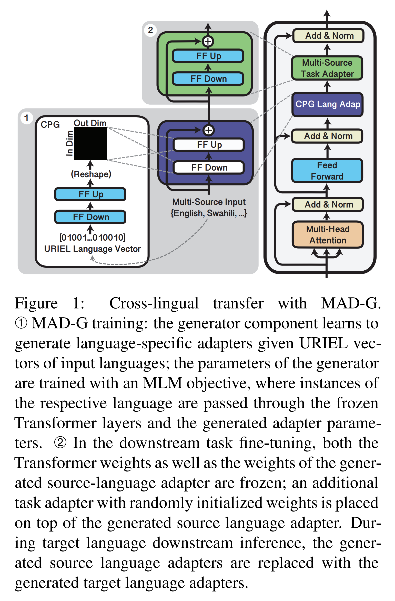
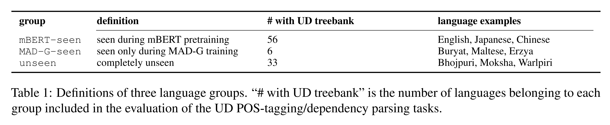
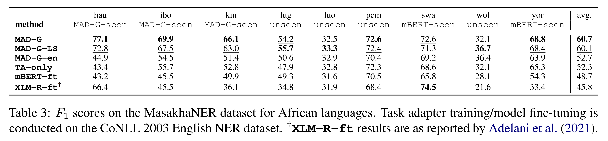
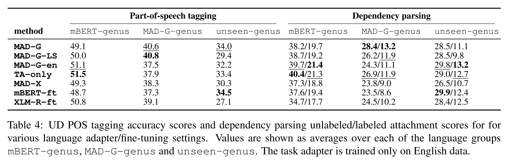
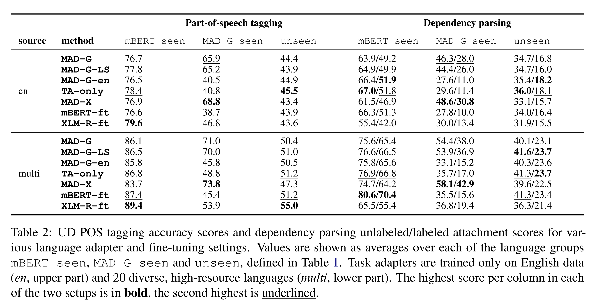
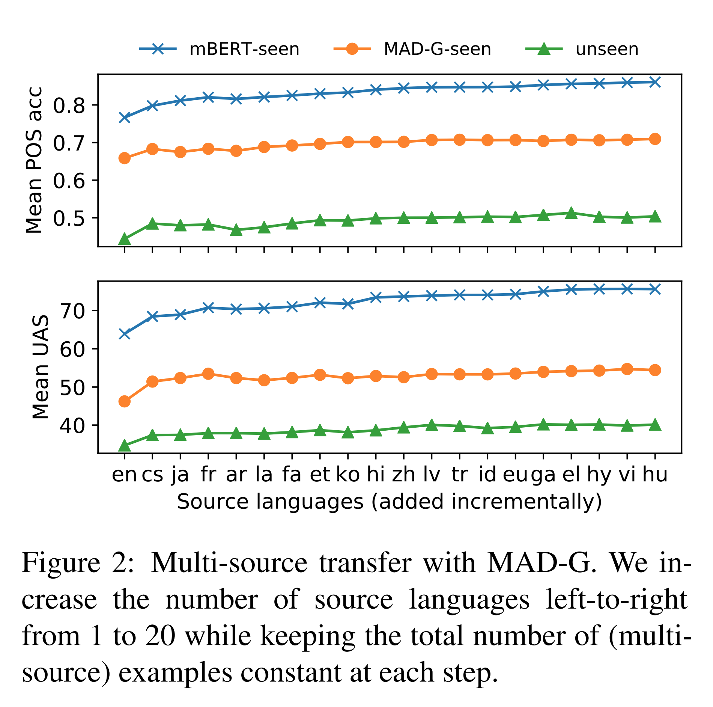
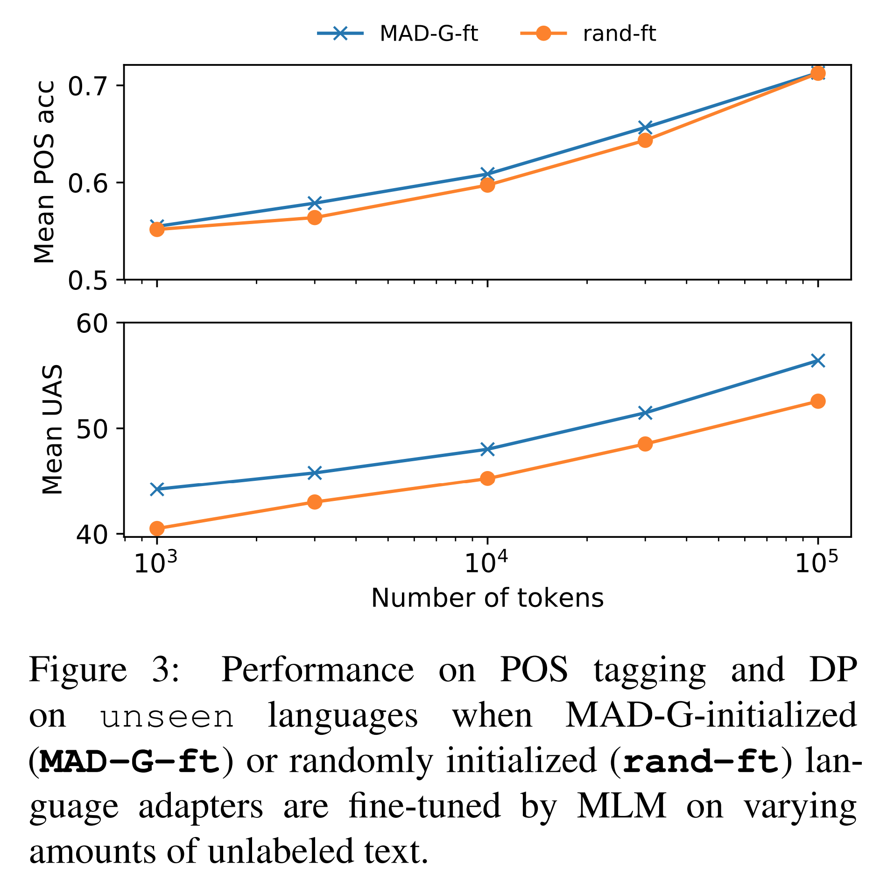

논문 및 이미지 출처 : <https://aclanthology.org/2021.findings-emnlp.410.pdf>

# Abstract

Adapter module 은 pretrained encoder 를 새로운 domain 에 특화시키기 위한 일반적인 parameter-efficient 방법으로 등장했다. 특히 massively multilingual transformers (MMTs) 는 언어별 adapter 의 추가 training 으로부터 큰 이점을 얻었다. 그러나 이러한 접근은 corpus 크기나 compute budget 의 한계로 인해 대다수 언어에는 적용이 불가능하다. 

본 연구에서는 **MAD-G (Multilingual ADapter Generation)** 를 제안한다. 

* 이는 typological feature 를 기반으로 한 language representation 으로부터 language adapter 를 contextually generate 하는 방법이다. 
* 기존 연구와 달리, 저자의 MAD-G 접근은 time 및 space 효율성을 바탕으로   
  (1) 언어 간 linguistic knowledge 공유와  
  (2) unseen language 에 대한 zero-shot inference 를 가능하게 한다. 

저자는 MAD-G 를 part-of-speech tagging, dependency parsing, named entity recognition 의 zero-shot cross-lingual transfer 에서 철저히 평가한다. 

* 실험 결과, MAD-G 는  
  (1) fine-tuning efficiency 를 약 50 배 향상시키고,  
  (2) 더 작은 parameter budget 을 유지하며,  
  (3) 더 넓은 language coverage 를 제공하면서도 언어별 adapter training 에 비해 전반적으로 competitive 한 성능을 유지한다. 
* 특히 low-resource 언어, 특히 아프리카 언어의 NER task 에서 상당한 이점을 제공한다. 
* 마지막으로 저자는 MAD-G 의 transfer performance 가 다음을 통해 더욱 개선될 수 있음을 보여준다:  
  (i) multi-source training, 즉, 여러 언어의 task-specific training data 로부터 생성 및 결합된 adapter 활용,  
  (ii) monolingual data 를 가진 언어에 대해 생성된 MAD-G adapter 를 추가 fine-tuning 하는 방법.

# 1 Introduction

Multilingual NLP 는 cross-lingual word embedding space 와 최근에는 mBERT, XLM-R, mT5 와 같은 massively multilingual transformers (MMTs) 를 통해 큰 발전을 이루었다. MMT 는 뛰어난 (zero-shot) cross-lingual transfer 능력을 보이지만, target language 가 source language 와 typologically distant 하거나 pretraining data 의 크기가 제한적일 경우 성능이 하락하는 것으로 나타났다. 또한 세계 언어에 대한 coverage 가 충분하지 않아 지원 가능한 language technology application 의 범위도 제한적이다.

Adapter 는 multilingual model 을 underrepresented language 로 확장하기 위한 parameter-efficient 방법으로 제안되었다. 일반적으로는 각 언어의 unlabeled data 에 대해 masked language modeling (MLM) 을 통해 language adapter 를 학습한다. 그러나 이는 상당한 양의 monolingual data 를 필요로 하므로, 추가적인 language-specific capacity 가 가장 필요한 low-resource language 에서는 적용이 어렵다.

이러한 한계를 해결하기 위해 저자는 **multilingual adapter generation (MAD-G)** 를 제안한다. 

* 이는 언어 간 정보를 공유하여 low-resource language 를 위한 adapter 를 생성할 수 있는 새로운 패러다임이다. 
* 각 언어에 대해 별도의 adapter 를 학습하는 대신, MAD-G 는 contextual parameter generation (CPG) 을 활용한다. 
  * 즉, arbitrary target language 에 대한 language adapter 를 생성할 수 있는 단일 model 을 학습한다.

MAD-G 의 핵심은 언어의 typological vector 를 입력으로 받아 language-specific adapter 의 parameter 를 출력하는 contextual parameter generator 이다. 

* generator 의 parameter 는 언어적 다양성을 극대화하기 위해 선택된 95 개 언어의 Wikipedia 데이터에서 MLM 을 통해 학습된다. 
* 기존 CPG 연구와 달리, MAD-G 는 task-agnostic language adapter 를 생성하여 효율적이고 모듈화된 cross-lingual transfer 를 가능하게 한다. 
  * 즉, MAD-G language adapter 는 arbitrary downstream task 에서 활용될 수 있다.

MAD-G 는 언어 간 정보를 다음과 같이 공유한다.

(i) adapter generator 의 parameter 를 공유함으로써 hidden representation 수준에서 공유  
(ii) URIEL database 의 feature 에 conditioning 함으로써 typological 수준에서 공유

후자의 경우 unseen language 에 대한 zero-shot transfer 도 가능하게 한다. 또한 저자는 MAD-G 의 변형으로 **transformer layer position** 에 따라서도 adapter 를 생성하는 방식을 제안한다 (Sec. 3.2 참조). 이를 통해 MAD-G 는 기존 adapter 기반 transfer 방법보다 훨씬 더 parameter-efficient 하다.

* 저자는 part-of-speech tagging (POS), dependency parsing (DP), named entity recognition (NER) 의 zero-shot cross-lingual transfer 실험에서 MAD-G 가 언어별 adapter 를 학습하는 더 비용이 큰 방법과 competitive 한 성능을 보이며, low-resource 시나리오에서도 강력한 성능을 보임을 확인하였다. 
* 특히 아프리카 언어의 NER task 에서 두드러진 성능을 보였다. 
* 또한 transfer performance 는 (a) task adapter 의 multilingual training, (b) monolingual data 의 소량으로 MLM 기반 fine-tuning 을 수행하는 방법을 통해 더욱 개선될 수 있음을 보였다. 
* 마지막으로 저자는 unseen language 에 대한 transfer 성능을 세밀하게 분석하며, pretraining 에 선택된 언어 집합의 다양성이 중요한 요인임을 강조한다.

# 2 Background

MAD-G 를 Sec. 3 에서 자세히 소개하기 전에, 저자는 이전 연구로부터 차용한 핵심 구성 요소를 정리한다. 특히 Sec. 2.1 에서는 language adapter (LA) 를, Sec. 2.2 에서는 Contextual Parameter Generation (CPG) 을 다룬다.

## 2.1 (Why) Language Adapters

Massively multilingual model 은 고정된 model capacity 에서 더 많은 언어를 다룰수록 성능이 감소하는 이른바 ‘curse of multilinguality’ 문제를 겪는다. underrepresented 및 unseen language 로 확장하는 것은 단순하지 않은데, 모든 model parameter 를 추가 학습하면 이전에 획득한 knowledge 가 catastrophic forgetting 되는 문제가 발생할 수 있다.

이 문제를 해결하기 위한 일반적인 방법은 개별 언어에 추가 model parameter 를 할당하는 것이다. 이는 보통 adapter layer 를 통해 구현된다.

특히 language adapter 는 mBERT, XLM-R 과 같은 MMT 에 삽입되는 경량 component 로, 특정 언어에 대해 MMT 를 특화시키는 역할을 한다. 이는 

(a) MMT 의 원래 multilingual pretraining 에 포함되지 않은 새로운 언어를 지원하거나,   
(b) 특정 (resource-rich) language 의 성능을 회복/향상하기 위해 사용된다.

본 연구에서는 Pfeiffer et al. 의 competitive 하면서 lightweight 한 (so-called bottleneck) adapter variant 를 채택한다. 이는 feed-forward sublayer 뒤의 각 Transformer layer 에 successive down-projection 및 up-projection 으로 구성된 하나의 adapter module 을 삽입하는 방식이다.

$b$ 번째 Transformer layer/block 의 language adapter $LA_b$ 는 다음 연산을 수행한다.

$$
LA_b(h_b, r_b) = U_b \, a(D_b h_b) + r_b, \tag{1}
$$

* 여기서 $h_b$ 와 $r_b$ 는 각각 layer $b$ 에서의 Transformer hidden state 와 residual 이다. 
* $D_b \in \mathbb{R}^{h \times m}$ 과 $U_b \in \mathbb{R}^{m \times h}$ 는 각각 down- 및 up-projection 이다 ($h$ 는 Transformer 의 hidden layer 크기, $m$ 은 adapter dimension). 
* $a(\cdot)$ 는 non-linear activation function 이다. 
* residual connection $r_b$ 는 Transformer feed-forward layer 의 output 이고, 
* $h_b$ 는 그 뒤의 layer normalization 의 output 이다.

Language adapter 의 parameter 는 MMT 의 원래 parameter 를 freeze 한 상태에서 MLM 을 통해 학습된다.

## 2.2 (Why) Contextual Parameter Generation

Language adapter 는 multilingual NLP 에서 각 target language 마다 별도의 model 또는 model component 를 학습하는 전형적인 설계 패턴에 해당한다. 그러나 이 접근은 두 가지 단점이 있다.

1. 학습 시간과 학습되는 parameter 수가 언어 수에 따라 선형적으로 증가한다.
2. 각 언어의 parameter 가 독립적으로 학습되기 때문에 언어 간 정보 공유가 불가능하며, 이로 인해 low-resource language 가 high-resource language 와 typological 또는 genealogical 연관성으로부터 이익을 얻을 수 없다.

이 문제를 해결하기 위해 Platanios et al. 은 CPG 를 제안했다. 원래는 neural machine translation (NMT) 용으로 고안되었으나, CPG 는 parameter $\theta$ 로 정의되는 임의의 neural model 에 적용 가능하다. multilingual NLP 에서는 “context” 가 언어에 해당한다.

instance-per-language 접근에서는 $n_l$ 개 언어 각각에 대해 독립적인 parameterization $\theta^{(l)}$ 이 학습된다. 반면 CPG 에서는 언어별로 학습되는 parameter 는 저차원의 language embedding $\lambda^{(l)} \in \mathbb{R}^{d_l}$ 뿐이다.

이 embedding 은 generator $g$ (hyper-network component) 의 입력으로 사용되어 main model 의 언어별 parameterization 을 생성한다: $\theta^{(l)} = g_\phi(\lambda^{(l)})$. 여기서 $\phi$ 는 generator 의 parameter 이다. $g$ 는 어떤 differentiable function 도 될 수 있으나, 보통 단순한 linear projection (i.e., $\phi = W$) 으로 설정된다:

$$
g_W(\lambda^{(l)}) \triangleq W \lambda^{(l)}, \tag{2}
$$

* 여기서 $W \in \mathbb{R}^{n_p \times d_l}$ 는 learnable weight matrix 이며, 
* $n_p$ 는 model $f$ 의 parameter 수이다.

$n_l$ 개 독립적 model 을 학습하면 총 parameter 수는 $n_l n_p$ 이지만, CPG 접근에서는 $W$ 의 parameter 수는 $d_l n_p$ 이다. 따라서 $d_l < n_l$ 인 경우 parameter 수가 현저히 줄어든다.

더 중요한 점은 multilingual training 에서 generator matrix $W$ 가 모든 언어에 걸쳐 공유되므로, language 간 knowledge sharing 이 가능해지고 transfer 성능이 향상된다는 것이다.

Platanios et al. 과 Ponti et al. 은 language embedding $\lambda^{(l)}$ 을 무작위 초기화 후 end-to-end 학습하는 방식을 사용하였다. 그러나 이 방식은 학습 중 보지 못한 언어에는 generalization 할 수 없는데, inference 시 해당 언어의 embedding 이 없기 때문이다. 따라서 arbitrary new language 로 일반화하려면, embedding 을 다양한 언어에 대해 이용 가능한 external language representation 에 기반시켜야 한다.

이를 위해 Ponti et al. 은 URIEL database 의 typological language vector 를 language embedding 으로 활용하여 전체 model parameter 를 생성했다. 유사하게, Üstün et al. 은 URIEL typological vector 를 사용해 dependency parsing 을 위한 task- 및 language-specific adapter 를 생성했다. 이들은 13 개 언어에 대한 multilingual dependency parsing training 으로 generator $g$ 의 parameter $\phi$ 를 학습하였다.

이에 비해 MAD-G 는 multilingual MLM training 을 통해 task-agnostic LA 를 생성할 수 있으며, 이는 arbitrary NLP task 에 대한 downstream cross-lingual transfer 를 지원할 수 있다.

# 3 MAD-G: Methodology

MAD-G 의 목표는 MMT 를 previously unseen 이면서 극도로 resource-poor 한 언어들에 resource-efficient 하게 적응시키는 것이다. 이를 통해 더 sustainable 하고 inclusive 한 NLP 에 기여한다. 저자는 

(i) lightweight adapter 의 computational efficiency (Sec. 2.1),  
(ii) CPG 의 knowledge sharing 및 zero-shot language transfer 능력 (Sec. 2.2),  
(iii) external linguistic knowledge (i.e., typological feature) 를 결합하여, 심지어 극도로 resource-poor 한 언어에서도 arbitrary NLP task 를 지원한다.

* MAD-G 는 기존 연구의 한계를 보완한다. Üstün et al. 과 달리, MAD-G 는 NLP task 전반에서 재사용 가능한 task-agnostic LA 를 생성한다. 
* 또한 MAD-X framework 와 달리, MAD-G 는 각 언어마다 독립적으로 LA 를 학습할 필요가 없다. 
  * 즉, monolingual corpus 가 충분하지 않아도 typological vector 로부터 LA 를 생성하여 unseen 및 resource-poor language 의 downstream task 를 지원할 수 있다. 
* 더 나아가 MAD-G 는 언어 간 typological relation 을 활용한다. 저자는 또한 두 접근을 결합할 수 있음을 보였다. 
  * 즉, MAD-G 로 생성된 LA 를 monolingual MLM fine-tuning 하면 추가적인 이점을 얻을 수 있다.

## 3.1 Generating Language Adapters

각 언어의 input representation 은 URIEL language typology database 에서 가져온 289 개의 binary linguistic feature (syntactic 103, phonological 28, phonetic 158) 를 포함하는 sparse typological vector $t^{(l)}$ 이다.

언어 embedding $\lambda^{(l)}$ 은 단일 layer 의 linear down-projection 으로부터 얻는다: $\lambda^{(l)} = V t^{(l)}$

여기서 $V \in \mathbb{R}^{d_l \times 289}$ 이다. $d_l \ll 289$ 로 down-projection 하여 $W$ 가 지나치게 커지는 것을 방지한다. 이렇게 language embedding 을 external linguistic knowledge (i.e., URIEL vector) 에 기반시키면, generator training 을 위한 monolingual text 가 없더라도 typological vector 가 존재하는 모든 언어로 일반화가 가능하다.

* Multilingual MLM training 에서는 Eq. (2) 에 따라 각 언어 embedding 으로부터 instance 마다 adapter parameter $\theta^{(l)}$ 를 생성한다. 
* MMT 의 layer 수를 $n_b$ 라 하면 (e.g., mBERT 의 경우 $n_b = 12$), MAD-G 의 parameter matrix $W$ 는 $n_b \cdot 2 \cdot h \cdot m \times d_l$ 개 parameter 를 가진다. 
  * 여기서 $h$ 는 Transformer layer 의 hidden size, $m$ 은 adapter layer 의 bottleneck size (i.e., single adapter module 은 $2 \cdot h \cdot m$ 개의 parameter 를 가진다).

## 3.2 Factoring Out Layer Embeddings

language-specific embedding $\lambda^{(l)}$ 을 분리함으로써, MAD-G 의 parameter $W$ 는 language 간 knowledge 를 공유하게 된다. 그러나 서로 다른 Transformer layer 에서 생성된 LA 는 여전히 독립적이다. 이를 개선하기 위해 각 Transformer layer index 의 representation 을 layer embedding $\lambda^{(b)} \in \mathbb{R}^{d_b}$ ($b \in \{1, 2, \dots, n_b\}$) 로 분리하여, adapter generation 이 언어뿐 아니라 layer 에도 condition 되도록 한다.

이 접근은 두 가지 장점을 가진다.

1. 서로 다른 layer 의 adapter 간 정보 공유가 가능하다.
2. generator $W$ 의 크기를 크게 줄일 수 있다.

이 variant 는 MAD-G-LS 라 부르며, 언어-레이어 쌍에 대한 adapter $\theta^{(l,b)}$ 를 출력한다.

$$
\theta^{(l,b)} \triangleq W(\lambda^{(l)} \oplus \lambda^{(b)}), \tag{3}
$$

* 여기서 input 은 language embedding $\lambda^{(l)}$ 과 layer embedding $\lambda^{(b)}$ 의 concatenation 이다. 
* MAD-G-LS generator 의 parameter 수는 $2 \cdot h \cdot m \times (d_l + d_b)$ 이다. 
* $d_b = d_l$ 로 가정하면, base MAD-G 대비 약 $n_b^2$ 배의 parameter 감소 효과가 있다.

## 3.3 Multi-Source Task Adapters

Multilingual MLM 으로 multilingual adapter generator 가 학습된 후, 생성된 LA 는 downstream cross-lingual transfer 에 활용될 수 있다. 저자는 MAD-X 와 동일한 task-specific fine-tuning setup 을 따른다. 즉, source language 의 LA 위에 task-specific adapter (TA) 를 삽입하고 학습한다. 이때 LA 와 MMT parameter 는 freeze 된다.

기존 연구에서는 TA 가 *single source* language $l_s$ 의 data 로 학습되고, inference 시에는 target language $l_t$ 의 LA 를 삽입하여 동일한 TA 와 결합한다.

Downstream task 가 multilingual task data 를 포함한다면, *multi-source* transfer, 즉 multilingual task adapter training 이 가능하다. 이 방식은 per-language trained LA (e.g., MAD-X adapter) 뿐 아니라 LA 없이도 가능하다. 저자는 multi-source training 이 특히 MAD-G 에서 효과적일 것이라 가정한다. 이유는 MAD-G 의 multilingual generator 가 생성한 서로 다른 언어의 LA 들이 knowledge 를 공유하기 때문이다. 즉, MAD-G 에서는 multi-source task adapter training 이 독립적으로 학습된 여러 LA 대신 단일 LA generator 에 의해 지원된다.

그러나 실험 결과, multi-source training 은 adapter type 과 관계없이 크게 유리했으며, 특히 MAD-G 에서 더 큰 이점을 보이지는 않았다.

TA training 은 다음과 같이 단순하게 수행된다.

1. source language 집합 $L_s$ 에서 임의의 언어 $l$ 을 선택하여 training batch 를 샘플링한다.
2. forward pass 시, 해당 batch 에 대해 task adapter 전에 해당 언어 $l$ 의 LA 를 활성화한다.

저자의 지식에 따르면, cross-lingual setting 에서 multi-source adapter-based transfer 를 조사한 것은 이번이 처음이다.

# 4 Experimental Setup

#### Tasks and Languages.

저자는 low-resource language 를 위한 평가 데이터가 충분히 제공되는 세 가지 downstream task 를 평가한다. 즉, part-of-speech (POS) tagging, dependency parsing (DP) 은 Universal Dependencies (UD) 2.7 dataset 에서, named entity recognition (NER) 은 아프리카 언어를 위한 MasakhaNER dataset 에서 평가한다. POS 와 DP 의 경우, treebank 가 제공되는 UD 언어 중 상당 부분을 평가에 포함한다.

평가 시 저자는 세 가지 언어 그룹을 구분한다 (Tab. 1 참조).

1. **mBERT-seen languages**: mBERT pretraining 에 포함된 언어.
2. **MAD-G-seen languages**: mBERT pretraining 에는 포함되지 않았지만 MAD-G training 에 포함된 언어.
3. **unseen languages**: mBERT pretraining 과 MAD-G training 어디에도 포함되지 않은 언어.

## 4.1 Baselines and MAD-G Variants

* **mBERT**: 104 개 언어의 Wikipedia 로 pretrain 된 MMT. 저자는 MAD-G 의 base MMT 로 mBERT 를 사용한다.
* **XLM-R**: CommonCrawl data 의 100 개 언어로 pretrain 된 state-of-the-art MMT. 저자는 full-model fine-tuning (-ft) 표준 transfer setup 에서 이를 평가한다.
* **MAD-X**: 언어별로 독립적인 LA 를 MLM 으로 학습하는, cross-lingual transfer 를 위한 state-of-the-art modular adapter framework. pretrained LA 가 없는 경우, 특히 여섯 개 MAD-G-seen UD 언어에 대해서는 저자가 직접 MAD-X LA 를 학습한다. 그러나 모든 low-resource 언어에 대해 LA 를 학습하는 것은 계산 비용이 지나치게 크므로, 모든 MAD-X 실험에서는 MAD-X adapter 가 제공되는 언어 pool 을 20 개의 high-resource source language (Sec. 4.2 참조) 와 MAD-G-seen 언어들로 제한한다.  
  Target language 에 대해 MAD-X LA 가 존재하지 않는 경우, target 과 가장 가까운 언어의 MAD-X LA 를 대신 사용한다.
* **MAD-G**: Sec. 3.1 의 base setup.
* **MAD-G-LS**: Sec. 3.2 에서 설명한 대로 layer embedding 에도 condition 되는 MAD-G variant.
* **MAD-G-en**: target language instance 의 inference 시, target language adapter 대신 English adapter 를 사용하는 baseline. 이를 통해 언어별로 생성된 parameter 가 실제로 의미 있는 차이를 가지며 English LA 보다 나은 성능을 보이는지 검증한다.
* **TA-only**: MMT 위에 task adapter 만 직접 학습하는 방식으로, language adapter 는 사용하지 않는다. 이 baseline 은 dedicated LA 의 기여도를 정량화하기 위해 포함한다.

## 4.2 MAD-G Training Setup

#### MLM-training.

MAD-G 의 adapter generator 는 95 개 언어의 Wikipedia 로 MLM training 된다. 최소 1,000 개 이상의 Wikipedia 문서를 가진 언어만 고려했으며, typological diversity 를 최대화하는 greedy 과정으로 언어를 선택했다. 즉, 각 단계에서 현재 샘플에서 가장 적게 대표된 language family 및 genus 에 속하면서 문서 수가 가장 많은 언어를 선택했다. 전체 목록은 Appendix 에 제공된다.

Pfeiffer et al. 의 설정을 따라 LA bottleneck size 는 $m = 384$ 로 두었다. language embedding dimension $d_l$ 과 (사용되는 경우) layer embedding dimension $d_b$ 는 모두 32 로 설정했다.

각 MLM training step 에서 언어 batch 는 지수적으로 smooth 된 분포에서 랜덤 샘플링된다. 단, high-resource language 가 과도하게 oversampling 되는 것을 방지하기 위해 cap 을 두었으며, 언어 $l$ 이 선택될 확률은 $P(l) \propto \min(n_{\text{examples}}(l), 500,000)^{0.5}$ 로 설정했다.

Training 은 총 200,000 step 동안 진행되었으며, batch size 는 64, 최대 sequence length 는 256 이다. learning rate 는 5e-5 에서 시작해 선형적으로 감소시켰다.

동일한 batch size 와 sequence length 로, MAD-X 는 각 언어별로 100,000 step 학습된다. 따라서 언어당 평균 training duration 은 MAD-G 가 MAD-X 보다 약 50 배 짧다.

Parameter 규모를 비교하면, MAD-G 와 MAD-G-LS 는 각각 226M, 38M parameter 를 가지며, 95 개 언어 전용 MAD-X adapter (가상적인 경우) 는 728M parameter 에 달한다.

#### Single- and Multi-Source Transfer.

Task adapter 는 English data 와 English MAD-G adapter 로 학습된다. comparability 를 위해 MAD-X 와 동일한 TA 설정을 따른다. bottleneck size 는 $m = 48$ 이다.

* POS tagging 과 NER 은 standard token-level single-layer multi-class classifier 를 사용한다.
* DP 는 Dozat & Manning 의 biaffine dependency parser 의 shallow variant 를 사용한다.

POS tagging 과 DP 는 English EWT treebank 로 학습하며, 일관성을 위해 전체 12,543 문장 중 12,000 개만 샘플링하여 학습에 사용했다.
NER 은 CoNLL 2003 English dataset 으로 학습했다.

모든 task 는 batch size 8 로 15,000 step (약 10 epoch) 학습되며, learning rate 는 5e-5 에서 시작해 선형 감소시켰다.

#### Multi-source transfer

실험에서는 POS tagging 과 DP 를 위해 typologically diverse 한 20 개 high-resource source language 를 선택했다. 선택 과정은 UD 언어를 treebank 크기 순으로 나열한 뒤, 현재 샘플에 없는 genus 의 언어를 우선적으로 선택하는 방식이다. 총 12,000 개 예제를 샘플링했으며, 언어당 600 개를 포함한다.

# 5 Results and Discussion

저자는 결과 보고에서 주요 global trend 와 부가적 실험을 중심으로 분석한다. 개별 target language 별 전체 결과는 Appendix 에 제공된다.

#### Single-Source Transfer.

Language adaptation 을 사용하지 않는 모든 방법과 비교할 때, MAD-G (base 와 MAD-G-LS) 는 모든 task 와 MAD-G-seen 언어에서 매우 유리하다. 특히 parameter-efficient 한 MAD-G-LS 는 일반적으로 base MAD-G 보다 약간 약하지만, 일부 언어와 transfer setup 에서는 오히려 성능이 더 좋았다.

Target language 당 capacity 가 훨씬 작음에도 불구하고, MAD-G 는 MAD-X 가 보여준 성능 향상의 상당 부분을 유지했다. 이는 MAD-G 가 효율적이면서도 효과적인 language adaptation 을 달성함을 보여준다.

MAD-G-en variant 는 MAD-G-seen 언어에서 성능 향상을 달성하지 못했는데, 이는 MAD-G 가 언어별로 실제로 의미 있는 차이를 가진 adapter parameter 를 생성한다는 것을 보여준다.

mBERT-seen 언어에서는 MAD-G 가 일반적으로 도움이 되지 않았는데, 이는 mBERT 가 이미 pretraining 중에 학습한 언어의 knowledge 가 작은 data 로 다시 language adaptation 을 통해 크게 향상되기 어렵다는 점에서 자연스럽다.

Unseen target language 에서는 MAD-G 의 일반적 이점은 확인되지 않았으나, NER 의 경우 상당한 성능 향상이 있었다. 그러나 unseen 그룹 전체 평균은 언어 간 typological relation 이 크게 다르기 때문에 전체적인 그림을 보여주지 않는다.

Typological vector 를 이용해 LA 를 생성하는 방식은 unseen language 에도 잘 일반화될 수 있지만, 이는 training 중 typological relative 가 존재할 때 특히 성립한다. 이를 확인하기 위해 unseen language 를 세 subgroup 으로 나누었다.

1. **mBERT-genus**: mBERT pretraining 에서 같은 genus 언어가 있었던 21 개 언어
2. **MAD-G-genus**: mBERT pretraining 에서는 없지만 MAD-G training 에서 같은 genus 언어가 있었던 4 개 언어
3. **unseen-genus**: 어느 training (mBERT, MAD-G) 에서도 같은 genus 언어가 없었던 8 개 언어

* Tab. 4 결과에 따르면, MAD-G 는 MAD-G-genus subgroup 에서는 이점을 제공했지만, 나머지 두 subgroup 에서는 그렇지 않았다.
* 즉, mBERT-genus 와 MAD-G-genus 의 비교는 mBERT-seen 과 MAD-G-seen 언어의 비교와 유사하다. 
* 일반적으로, 특정 genus (혹은 언어) 가 mBERT pretraining 중 포함되지 않았다면, language adaptation 을 통해 그 성능을 개선할 수 있다.
* 반면 unseen-genus 언어의 결과는, training 중 어떤 언어와도 typologically 관련이 없는 경우에는 제한적인 external typological 정보만으로는 성능을 회복할 수 없음을 보여준다. 
* 따라서 cross-lingual generalization 에서는 pretraining 언어의 typological diversity 가 핵심적이다.

#### Multi-Source Transfer.

* 20 개 언어로 training 을 진행하면서 전체 training example 수를 동일하게 유지했을 때, POS tagging 과 DP 모두에서 모든 setting 과 언어 그룹에 걸쳐 큰 성능 향상이 관찰되었다 (Tab. 2 참조). 
* 이는 multi-source training 이 task adapter 의 representation 을 보다 일반적이고 language-agnostic 하게 만들어 unseen language 로 더 잘 transfer 됨을 시사한다.

저자는 Fig. 2 에서 multi-source training 의 효과를 더 자세히 분석한다. 

* source pool 에 언어를 점진적으로 추가하면서도 전체 training example 수는 일정하게 유지했다. 
* 그 결과, source pool 이 한 언어에서 두 언어로 확장될 때 가장 큰 상대적 성능 향상이 나타났으며, 이후 언어가 더 추가될수록 성능은 계속 향상되었다. 
* 요약하면, 이전 연구와 마찬가지로, training data 의 language diversity 가 다양한 방법과 setup 에서 zero-shot transfer 에 강력한 긍정적 영향을 준다는 것을 확인했다.

#### Fine-tuning MAD-G-Initialized Adapters.

Target language 에 대해 annotated data 가 전혀 없는 상황은 비현실적일 수 있다. 따라서 저자는 소량의 unannotated data 가 존재하는 경우를 고려했다. 이 경우에도 MAD-G 를 활용하여 target language $l_t$ 의 language-specific adapter 초기화를 생성하고, 이후 해당 parameter 를 unannotated data 에서 MLM 으로 fine-tuning 할 수 있다.

저자는 Wikipedia 가 존재하는 14 개 unseen UD language 에 대해, MAD-G 로 초기화된 language adapter 를 fine-tuning 하는 POS tagging 및 DP 실험을 수행했다. Resource-poverty 정도를 시뮬레이션하기 위해 full Wikipedia 로부터 1,000, 3,000, 10,000, 30,000, 100,000 단어를 샘플링하여 training dataset 을 구성했다.

이때 MAD-G 기반 초기화 후 fine-tuning (MAD-G-ft) 과 동일한 데이터에서 무작위 초기화된 LA 를 fine-tuning 하는 경우 (rand-ft) 를 비교했다. 

* Fig. 3 결과에 따르면, 14 개 unseen evaluation language 모두에서 unannotated text 양이 증가할수록 성능이 일관되게 향상되었다. 
* 두 task 모두에서 MAD-G 가 생성한 weight 로 초기화한 경우가 무작위 초기화보다 성능이 더 좋았다. POS tagging 에서는 두 setting 간 차이가 크지 않았지만, DP 에서는 차이가 크게 나타났으며, training token 이 100,000 개일 때에도 유지되었다.

# 6 Conclusion

저자는 MAD-G 를 제안했다. 이는 low-resource language 를 위한 modular 하고 efficient 한 cross-lingual transfer framework 로, typological language representation 으로부터 massively multilingual transformer (e.g., mBERT) 에 task-agnostic adapter 를 생성한다.

MAD-G 는 state-of-the-art adapter 기반 transfer 접근법인 MAD-X 와 경쟁할 만한 성능을 보였으며, target language 당 training 은 약 50 배 더 효율적이다. 또한 MAD-G 는 unseen language 에도 적용 가능하며, training 시 포함된 genus 에 속한 언어라면 이점을 얻는다. 나아가 extremely low-resource language 에 대해서는 MAD-G 로 생성된 language adapter 를 소량의 텍스트에서 추가로 fine-tuning 하여 downstream 성능을 개선할 수 있다.

또한 multi-source training 을 통해 adapter 기반 cross-lingual 성능을 크게 향상시킬 수 있음을 보였다.