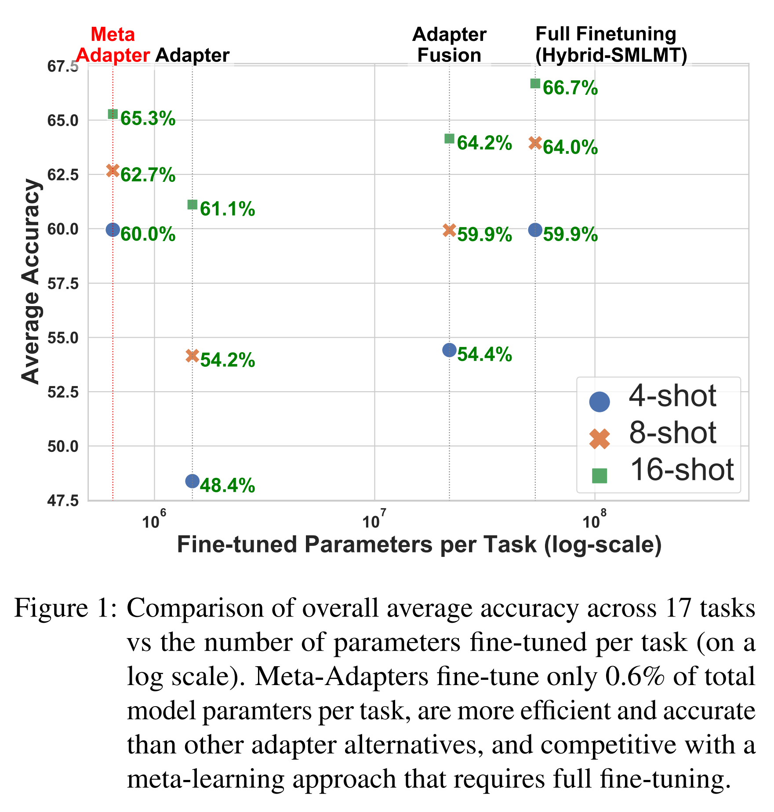
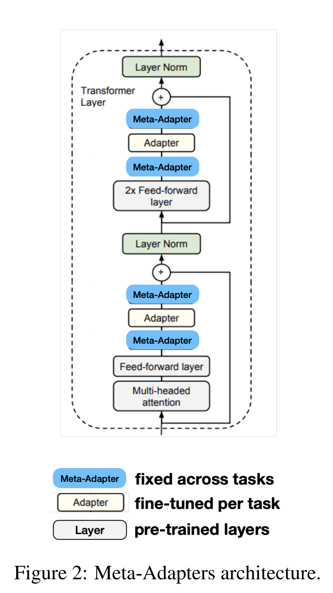
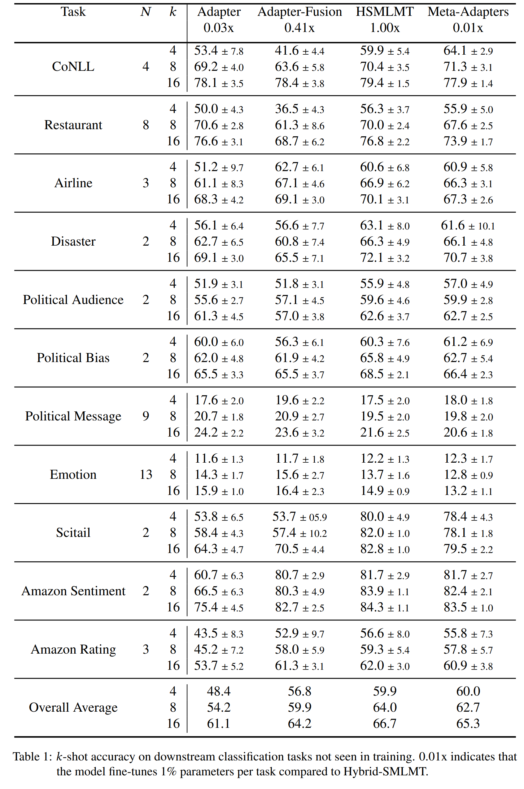
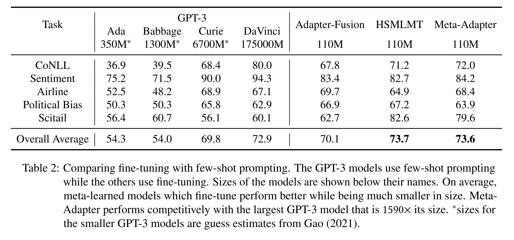
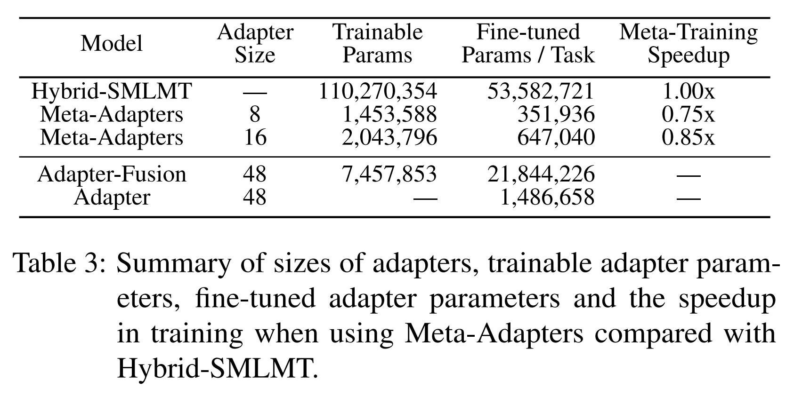
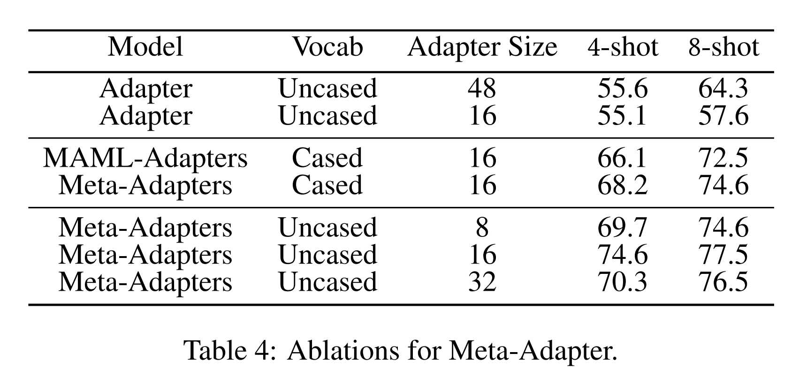

논문 및 이미지 출처 : <https://proceedings.mlr.press/v188/bansal22a/bansal22a.pdf>

# Abstract

large pre-trained transformers 의 표현 능력이 지속적으로 향상되면서, 이러한 model 들을 shared prior 로 활용하여 다수의 downstream task 에 대해 fine-tuning 하는 것이 점점 더 현실적으로 가능해지고 있다. 그러나 모든 task 에 대해 전체 model 을 fine-tuning 하는 방식은 모든 model parameter 의 사본을 만들어야 하므로, 매우 비현실적이다. 

최근 제안된 Adapter 방법은 유망한 대안을 제시하는데, 이 방법은 각 task 에 특화된 fine-tuning 을 위해 few extra parameter 만을 도입한다. 그러나 Adapter 는 좋은 성능을 위해 task-specific data 가 많이 필요하고, data 가 부족한 few-shot 상황에서는 잘 작동하지 않는다. 

본 논문에서는 parameter-efficient fine-tuning 을 *meta-learning* 관점에서 접근하여 few-shot 환경에 적용한다. 저자는 **Meta-Adapters** 를 제안하는데, 

* 이는 pre-trained model 내에 삽입되는 small meta-learned adapter layer blocks 로, frozen pre-trained model 을 parameter-efficient few-shot learner 로 재구성한다. 
* Meta-Adapters 는 전체 fine-tuning 이 필요한 SOTA few-shot learning 방법들과 경쟁할 수 있는 성능을 내면서도, 단지 0.6% 의 parameter 만 fine-tuning 한다. 
* 저자는 17 개의 classification task 로 구성된 evaluation suite 에서 Meta-Adapters 와 다양한 transfer learning baseline 을 비교 평가하였으며, Meta-Adapters 가 경쟁적인 parameter-efficient 방법들에 비해 few-shot accuracy 를 크게 향상시키면서도 fine-tuning 에 필요한 parameter 는 훨씬 적게 요구함을 보인다. 
* 또한 GPT-3 의 few-shot prompting 과 Meta-Adapters 기반 few-shot fine-tuning 을 비교한 결과, Meta-Adapters 는 GPT-3 보다 크기가 1590 배 작은 pre-trained transformers 를 사용하면서도 경쟁력 있는 성능을 보인다.

# 1 Introduction

NLP 분야의 pre-trained model 은 시간이 지남에 따라 크기가 지속적으로 증가해왔다. 이러한 model 은 주로 transfer learning 의 초기화로 사용되며, 초기화된 model 은 특정 task 에 대해 fine-tuning 된다. 그러나 이러한 pre-trained model 을 다수의 downstream task 에 동시에 제공해야 하는 경우(e.g., cloud-based ML service), 전체 fine-tuning 은 task 수만큼의 parameter 복제를 필요로 하므로 매우 비효율적이다.

전체 fine-tuning 의 대안은 Adapter 이다. Adapter 는 pre-trained model 에 소수의 무작위로 초기화된 parameter 를 추가하여, pre-trained model 의 나머지는 고정시키고 Adapter 만 fine-tuning 함으로써 전체 fine-tuning 과 경쟁할 수 있는 성능을 낸다.

본 논문에서는 다수의 task 를 위한 shared model 을 online 환경에서 배치해야 하는 시나리오를 고려한다. 이때 model 은 많은 data 없이도 target task 에 빠르게 적응할 수 있어야 한다. 예를 들어, cloud-based ML service 에서는 사용자가 제한된 training data 로 자신의 NLP task 에 맞춰 model 을 특화할 수 있어야 한다. Adapter 는 pre-trained model backbone 을 task 간에 공유할 수 있게 해주므로 이러한 상황에서 특히 유용하다. 그러나 Adapter 는 무작위로 초기화된 parameter block 이므로 target task 의 예시가 적을 때는 성능이 낮을 수 있다. 이러한 상황은 두 가지 문제를 동시에 제기한다: parameter-efficient fine-tuning 의 문제와 정확한 few-shot learning 의 문제이다.

Meta-learning 은 효과적인 few-shot learning model 을 학습하기 위해 자주 활용된다. Meta-learning 은 관련 task 의 분포로부터 학습하여, small labelled data 만으로도 new task 에 일반화할 수 있는 model 을 학습한다. NLP 에서는 다양한 task 에 대한 few-shot learning 을 위해 meta-learning model 이 개발되었다. 본 연구에서 특히 관심 있는 것은 gradient-based 방법으로, 이는 few gradient descent step 만으로도 few-shot learning 이 가능하도록 model initialization 을 학습한다. 이러한 방법은 few-shot fine-tuning 을 직접 최적화함으로써 train-test 불일치를 완화하고 new few-shot task 에 대한 효과적인 generalization 을 가능하게 한다. 그러나 기존 meta-learning 방법은 pre-trained model 을 활용하지 않고 전체 model 을 fine-tuning 하기 때문에 다수의 task 에 적용할 때 비효율적이다.

이에 본 연구에서는 정확하면서도 parameter-efficient 한 few-shot learning 을 가능하게 하는 *meta-learning model* 을 개발한다. 

* 이 model 은 공유되고 frozen pre-trained model backbone 을 활용하여, new task 마다 few additional parameter 와 labelled data 만으로도 downstream task 에 빠르게 적응할 수 있다. 
* 저자의 접근법은 pre-trained transformer model 을 **Meta-Adapters** 를 통해 efficient few-shot learner 로 재구성한다. 
* Meta-Adapters 는 pre-trained model 의 activation 을 조정하는 few meta-learned parameter 로 구성되며, 이를 통해 few-shot learning 에 효과적이도록 만든다.

저자의 목표는 inference 시 parameter-efficient few-shot learning 을 가능하게 하는 것이다. 

* Meta-Adapters 는 다양한 few-shot task 에 대해 regular adapter 가 효과적으로 학습되도록 “prime” 되며, target task 와 유사한 few-shot task 분포에서 학습된다 (Sec. 3). 
* 또한 Meta-Adapters 는 전체 model 의 일부만 학습하기 때문에 기존 meta-learning model 들보다 훈련 효율이 높다.

17 개의 few-shot classification task 에 대한 실험 결과, Meta-Adapters 는 randomly initialized adapters 보다 few-shot learning 에 우수하고, multi-task fusion adapters 보다 정확하고 효율적이며, 전체 fine-tuning 이 필요한 기존 SOTA meta-learning 방법과 경쟁할 수 있는 성능을 보였다. 동시에 task 당 단지 0.6% 의 parameter 만 추가된다 (Fig. 1). 또한 GPT-3 의 few-shot prompting 과 Meta-Adapters 기반 fine-tuning 을 비교한 결과, Meta-Adapters 는 pre-trained model 크기가 훨씬 작은 (110M BERT-base vs. 175B GPT-3 DaVinci) 환경에서도 GPT-3 보다 평균적으로 더 나은 성능을 보였다.

# 2 Background

Adapter 는 feedforward layer 블록으로, downward projection 과 upward projection 으로 구성되며, pre-trained transformer model 의 연속된 layer 사이에 추가된다. Transformer 의 parameter 를 $\theta$, Adapter 의 parameter 를 $\phi$ 라 하자. 주어진 target task $T$, data $\mathcal{D}^{tr}_T$, loss function $\mathcal{L}_T(\cdot)$ 가 있을 때, Adapter 는 gradient descent 절차를 통해 다음 목적식을 최소화하는 fine-tuning 을 수행한다.

$$
\min_{\phi} \mathcal{L}_T(\theta, \phi; \mathcal{D}^{tr}_T) \tag{1}
$$

* 여기서 Adapter $\phi$ 는 보통 무작위로 초기화된다. 
* $\phi$ 의 크기는 $\theta$ 에 비해 매우 작기 때문에, 동일한 model parameter $\theta$ 를 여러 task ${T}$ 에서 재사용할 경우 parameter 절약 효과를 얻을 수 있다. 
* 그러나 $\phi$ 가 무작위로 초기화되기 때문에, label 당 4 개의 예시만 있는 경우처럼 $\mathcal{D}^{tr}_T$ 가 매우 작은 few-shot setting 에서는 성능이 낮을 수 있다. 
* 게다가 original pre-trained model 은 few-shot learning 에 최적화되어 있지 않기 때문에 성능이 최적화되지 않을 수 있다.
* 다른 접근으로, few-shot 문제는 종종 meta-learning 문제로 공식화된다. 이에 대한 종합적인 리뷰는 Hospedales et al. 을 참고한다. 

저자의 연구는 *model agnostic meta-learning (MAML)* 에 기반한다. 

* MAML 은 task 분포가 주어졌을 때, few gradient descent step 만으로도 더 나은 few-shot learning 을 가능하게 하는 model initialization 을 학습한다. 
* 이는 task-specific fine-tuning 의 inner loop 와, 여러 task 에 걸쳐 inner loop 성능을 최적화하는 outer loop 로 구성된다. 
* Inner loop 는 새로운 task 에 적용되는 추론 방법, 즉 gradient-based fine-tuning 에 직접적으로 대응된다.

MAML 기반 방법은 few-shot learning 개선을 위해 기존 연구에서 탐구되었다. 그러나 이러한 방법은 inference 시 전체 network 를 fine-tuning 해야 하고, training 시 전체 model parameter 를 최적화해야 한다. 이는 다수의 task 에 동시에 적용할 경우 매우 비효율적이며, large-scale unlabeled data 로 pre-training 된 기존 self-supervised model 을 활용하지 못한다.

# 3 Meta-Adapters

저자의 parameter-efficient learning 목표는 두 가지이다:

1. 기존 pre-trained model 을 활용하고 재구성하여 더 나은 few-shot learner 로 만드는 것
2. pre-trained model backbone 을 공유하고, 각 새로운 task 에 대해 소수의 parameter overhead 만 추가하여 fine-tuning 을 parameter-efficient 하게 만드는 것

이를 위해 저자는 **Meta-Adapters** 를 제안한다. 

* Meta-Adapters 는 frozen pre-trained model 의 layer 사이에 삽입되는 meta-learned adapter layer 로, few-shot learning 의 성능을 향상시킨다. 
* Meta-Adapters 는 feed-forward adapter layer 와 동일한 구조를 가지지만 (Houlsby et al., 2019), model 구조 내의 배치 위치, 학습 방식, 사용 방식에서 차이가 있다. 
* Adapter 는 각 task 별로 무작위 초기화되어 fine-tuning 되지만, Meta-Adapters 는 새로운 task 에서 fine-tuning 되지 않는다. 
* 대신 pre-trained model 의 forward pass 와 backward pass 동안 activation 을 조절하여 few-shot learning 이 더 잘 이루어지도록 한다.

Meta-Adapters 는 regular adapter 와 함께 작동하며, parameter-efficient few-shot learning 이 가능하도록 학습된다. 

* 구체적으로, transformer model 의 각 layer 에서 feed-forward block 두 개 뒤에 adapter 가 추가된 구조를 고려하자 (Fig. 2). 
* Meta-Adapter layer 는 adapter layer 의 위아래를 감싸며, downward projection bottleneck 을 포함하는 2-layer feed-forward network 로 이루어진다. 
* Bottleneck 차원은 일반적으로 매우 작으며, 저자의 실험에서는 hyper-parameter 가 32 이하로 설정되어 Meta-Adapters 의 parameter 수를 관리 가능하게 유지한다.

Meta-Adapters 학습 단계에서는 regular adapter 의 few-shot fine-tuning 성능을 개선하도록 최적화된다.  
Inference 단계에서는 각 few-shot target task 를 해결할 때 regular adapter 만 fine-tuning 되고, 나머지 model 은 고정되어 parameter efficiency 를 달성한다.

Meta-Adapter parameter 를 $\omega$, adapter parameter 를 $\phi$, pre-trained transformer parameter 를 $\theta$ 라 하면, 각 task $T$ 에 대한 목적식은 다음과 같이 regular adapter 와 유사하다:

$$
\phi_T \leftarrow \arg \min_{\phi} \mathcal{L}_T(\theta, \phi, \omega; \mathcal{D}_T) \tag{2}
$$

* 여기서 $\omega$ 는 개별 task $T$ 에 대해 fine-tuning 되지 않지만, 여전히 forward pass 와 backward pass 에서 activation 을 조절한다. 
* 따라서 $\omega$ 는 few-shot data 와 함께 adapter fine-tuning 을 직접 개선하도록 최적화되어야 하며, 이는 다음의 목적식으로 이어진다. 여기서 $\phi_T$ 는 (2) 에서 얻어진다:

$$
\min_{\omega} \; \mathbb{E}_T \big[\mathcal{L}_T(\theta, \phi_T, \omega; \mathcal{D}_T)\big] \tag{3}
$$

그러나 이러한 중첩된 최소화를 수렴할 때까지 계산하는 것은 계산적으로 불가능하다. 따라서 저자는 few gradient descent step 으로 이를 근사한다. 이는 bi-level optimization 을 포함하는 meta-learning 문제로 공식화될 수 있으며, MAML 과 관련이 있다. 저자는 이를 해결하기 위해 episodic framework (Vinyals et al., 2016; Finn et al., 2017) 를 사용한다. 각 episode 는 training data $\mathcal{D}^{tr}$ 와 validation data $\mathcal{D}^{val}$ 을 가진 few-shot task 를 sampling 한다. $\mathcal{D}^{tr}$ 은 Eq. (2) 의 최소화를 위해, $\mathcal{D}^{val}$ 은 Eq. (3) 의 최소화를 위해 사용된다.

이를 통해 Meta-Adapters 학습을 위한 inner loop 와 outer loop 업데이트는 다음과 같이 정의된다:

* **Inner (fine-tune Adapters):**

$$
\phi'_T \leftarrow \phi - \alpha \nabla_\phi \mathcal{L}_T(\theta, \phi, \omega, \mathcal{D}^{tr}_T) \tag{4}
$$

* **Outer (train Meta-Adapters):**

$$
\omega \leftarrow \omega - \beta \nabla_\omega \mathbb{E}_{T \sim \mathcal{P}(T)} \big[\mathcal{L}_T(\theta, \omega, \phi'_T, \mathcal{D}^{val}_T)\big] \tag{5}
$$

* **train Adapter initialization**

$$
\phi \leftarrow \phi - \beta \nabla_\phi \mathbb{E}_{T \sim \mathcal{P}(T)} \big[\mathcal{L}_T(\theta, \omega, \phi'_T, \mathcal{D}^{val}_T)\big]
$$

* **train fine-tuning learning-rate**

$$
\alpha \leftarrow \alpha - \beta \nabla_\alpha \mathbb{E}_{T \sim \mathcal{P}(T)} \big[\mathcal{L}_T(\theta, \omega, \phi'_T, \mathcal{D}^{val}_T)\big]
$$

* 여기서 inner loop Eq. (4) 는 여러 단계의 gradient descent 로 수행된다. 
* 이 과정에서 Meta-Adapters $\omega$ 학습뿐만 아니라, Adapter $\phi$ 의 few-shot learning 을 위한 initialization 도 학습된다. 
* 따라서 각 downstream task 마다 Adapter 를 무작위로 초기화할 필요가 없으며, 초기화 hyper-parameter (e.g., scale) 를 선택할 필요도 없다.

추가적으로, 저자는 Eq. (4) 의 inner loop learning rate $\alpha$ 도 learnable parameter 로 취급한다. 각 layer 마다 다른 learning rate 를 사용하며, inner loop 는 새로운 task 에 적용되는 fine-tuning 절차와 직접적으로 대응되므로, 각 task 마다 learning rate hyper-parameter 를 새로 설정할 필요 없이 학습된 learning rate 를 재사용하여 fine-tuning 할 수 있다.

#### Training Tasks

Meta-Adapters 를 meta-learning 하기 위해서는 (Eq. (4), (5)), meta-learning 방법에서 일반적으로 요구되는 것처럼 task distribution $\mathcal{P}(T)$ 가 필요하다. Few-shot learning model 을 학습하기 위해 이 분포로부터 task 가 샘플링된다. 이상적으로는, 이 task 분포가 크고 다양해야 새로운 task 로 일반화할 수 있는 효과적인 model 학습이 가능하다.

저자는 기존 연구 (Bansal et al., 2020b) 를 따라 supervised task 와 unsupervised task 를 조합하여 다양한 분포의 training task 를 제공한다. 

* Supervised task 는 GLUE task set 에서 가져오며, 이는 문장 수준 이해를 요구하는 8 개의 다양한 task 로 구성된다. 
* 추가적으로, 저자는 Bansal et al. (2020a) 에서 제안한 cloze-style SMLMT task 를 사용한다. 
  * 이는 self-supervised blank-filling task (Devlin et al., 2019) 로, unlabeled text 로부터 자동으로 생성되며 few-shot learning 을 위한 meta-training task 의 유용한 출처임이 입증되었다. 
* 특히, 저자는 Bansal et al. (2021) 의 word-clustering 접근 방식을 따라 cloze-style task 를 생성하였다. 
  * 이를 통해 수백만 개의 self-supervised task 를 생성하고, supervised GLUE task 와 결합하여 Meta-Adapters 학습에 사용한다. 
* Training 의 각 episode 에서는 probability $\lambda$ 로 GLUE task, probability $1 - \lambda$ 로 self-supervised task 를 샘플링한다.

#### Summary

Meta-Adapters 는 parameter-efficient few-shot learning 을 가능하게 하도록 학습된 meta-learned adapter layer 이다. 이는 pre-trained transformer 에 삽입되며 regular adapter 와 함께 사용된다. Meta-Adapters 의 학습은 meta-learning episode 로 진행된다. 각 episode 에서 training task 가 샘플링되고, Adapter 는 task data 로 fine-tuning 된다 (Eq. (4)). 

Fine-tuned model 의 성능은 task validation data 의 loss 로 평가되며, 이 값이 Meta-Adapter parameter 학습 (Eq. (5)) 의 error 로 사용된다. 추가적으로, 이 학습 과정에서는 fine-tuning 에 사용될 Adapter 의 initialization 과 learning rate 도 함께 학습된다.

Inference 단계에서는 pre-trained model parameter 와 Meta-Adapter parameter 는 고정되고, 각 target task 에 대해 학습된 learning rate 를 사용하여 Adapter 만 fine-tuning 된다.

# 4 Experiments

본 섹션에서는 Meta-Adapters 의 few-shot learning 활용 가능성을 평가하고, Adapter 를 사용하는 기존 방법 및 meta-learning 방법과 비교한다.

## 4.1 Experimental Setup

기존 Adapter 활용 연구와 달리 (Sec. 5 참조), 저자의 연구는 각 task 당 소수의 예시만 주어지는 transfer learning 환경에서 Adapter 의 효용성을 평가한다. 이를 위해 17 개 downstream classification task 를 사용한다. 이 task 들은 few-shot learning 관련 기존 연구에서 공개한 dataset (Bansal et al., 2020a) 에서 가져온 것이며, 따라서 저자의 결과는 이전 연구들과 직접 비교 가능하다. 모든 평가는 $k$-shot setting 에서 수행되며, $k = 4, 8, 16$ 으로 label 당 예시 수를 나타낸다.

#### Evaluation Tasks

Downstream classification task 들은 다음과 같은 범주에 속한다:

1. **Sentiment classification (4 tasks):** Amazon review 의 4 개 도메인에 대한 감정 분류
2. **Rating classification (5 tasks):** Amazon review 의 4 개 도메인 ternary rating (high, medium, low) 분류 및 Airline 관련 tweet 의 ternary sentiment 분류
3. **Entity typing (2 tasks):** 뉴스와 레스토랑 질의 도메인에서 문장 내 구를 entity type 으로 분류
4. **Natural language inference (1 task):** 과학 도메인 dataset 을 사용한 entailment classification
5. **Political classification (3 tasks):** tweet 의 정치적 편향 여부 분류, 정치 tweet 의 대상 (constituency, national) 분류, 정치 텍스트 내용을 세부 주제로 분류
6. **Other text classification (2 tasks):** tweet 이 재난과 관련 있는지 여부 분류 및 감정을 세부적으로 분류

#### Models Evaluated

저자는 parameter-efficient fine-tuning 및 few-shot learning 의 SOTA model 들을 비교 평가한다. 비교한 model 은 다음과 같다:

1. **Adapter (Houlsby et al., 2019):** adapter parameter 만 fine-tuning 하는 원래의 Adapter 방법
2. **Adapter-Fusion (Pfeiffer et al., 2021):** 여러 task (e.g., GLUE) 에 대해 학습된 adapter 를 attention mechanism 으로 조합하는 방법 (Sec. 5 참조)
3. **Hybrid-SMLMT (Bansal et al., 2020b):** adapter 를 포함하지 않고 거의 모든 parameter 를 fine-tuning 하는 meta-learning 방법
4. **Meta-Adapters:** 저자가 제안하는 방법

#### Implementation Details

Adapter-Fusion 은 few-shot setting 에서 직접 평가된 바는 없으나, 다중 task 에서 학습된 adapter 를 결합하는 방식이므로 few-shot 환경에서도 경쟁력 있는 대안이 될 수 있다. 저자는 공개된 GLUE fusion adapter 와 코드로 이를 평가하였다. 공정한 비교를 위해 Adapter-Fusion 과 Hybrid-SMLMT 는 GLUE supervised task 만 학습에 사용하였다.

모든 비교 방법은 동일한 BERT model 을 사용하므로, 성능 차이는 model 자체의 차이 때문이 아니다. Hybrid-SMLMT 의 경우 공개된 코드로 학습했으며, 원래 공개된 model 은 cased BERT 를 사용했으나 저자의 실험에서는 다른 방법들과 일관성을 위해 uncased BERT 를 사용했다. 저자의 결과는 Bansal et al. (2020b) 에 보고된 결과와 유사하다.

Hybrid-SMLMT 는 fine-tuning 시 절반 가량의 parameter 만 학습하는데, 이는 교차 layer 를 freeze 하는 것이 더 유리하다는 결과 때문이었다 (Bansal et al., 2020b). Meta-Adapters 의 hyper-parameter 는 Supplementary 에 제공된다. 코드와 학습된 model 또한 공개되어 있다.

## 4.2 Results

저자는 baseline model 과 제안된 방법을 evaluation task 에서 비교 평가하였다. 각 task 는 $k = 4, 8, 16$ 인 경우에 대해 10 개의 무작위 few-shot training set 으로 평가되었으며, 총 17 개 task 에 대해 각 model 당 510 번의 평가가 이루어졌다. 먼저 전체 결과를 요약한 후, Meta-Adapters 의 성능을 더 잘 이해하기 위해 여러 ablation 실험을 수행하였다.

#### Overall Results

전체 task 에 대한 결과는 Fig. 1 에 나타나 있다. 저자는 17 개 task 전반의 평균 성능을 분석하여, model 들이 few-shot accuracy 와 parameter efficiency 두 축에서 어떻게 비교되는지 평가하였다.

* **Parameter efficiency:** Meta-Adapters 는 Adapter-Fusion (5%) 및 Hybrid-SMLMT (0.6%) 에 비해 훨씬 더 효율적이다. 또한 Adapter 보다 작은 bottleneck size 를 사용하므로 Adapter 보다도 더 효율적이다. 
  * 후술할 ablation 결과에서, 유사한 크기의 Meta-Adapters 와 비교했을 때 Adapter 의 성능이 더 낮음을 보인다. 
  * 이는 Meta-Adapters 가 정확도를 희생하지 않고도 parameter efficiency 를 크게 향상시킬 수 있음을 시사한다.
* **Few-shot accuracy:** 4-shot setting 에서 Meta-Adapters 는 가장 효율적일 뿐만 아니라, 전체 fine-tuning 을 수행하는 baseline 인 Hybrid-SMLMT 와 동일한 수준의 정확도를 보였다. 
  * 8-shot setting 에서는 여전히 full fine-tuning 과 경쟁할 수 있으며, Adapter 및 Adapter-Fusion 보다 훨씬 더 우수하다. 
  * 다만 Adapter-Fusion 은 regular Adapter 보다 transfer learning 성능이 좋지만, 다른 model 들보다 parameter efficiency 가 낮다.

#### Results on Individual Tasks

개별 task 에 대한 결과는 Tab. 1 에 나타나 있다. Amazon review 의 sentiment 및 rating classification task 는 4 개 도메인의 평균 성능으로 보고한다.

* 4-shot setting 에서 Meta-Adapters 는 11 개 task 유형 중 9 개에서 모든 parameter-efficient 방법보다 우수하며, full fine-tuning 방법과도 경쟁력 있다.
* 8-shot setting 에서는 11 개 task 유형 중 7 개에서 Adapter 및 Adapter-Fusion 보다 우수하다.
* 전체적으로 Meta-Adapters 는 다른 parameter-efficient 방법들보다 정확한 few-shot learning 을 제공하며, full fine-tuning 과 비교해도 대부분의 task 에서 경쟁 가능한 성능을 보인다. 가장 큰 성능 저하는 Scitail task 에서 나타났다.

### Comparison with prompting (GPT-3)

few-shot learning 의 또 다른 접근은 few-shot prompting 이며, GPT-3 와 같은 대규모 model 에서 성공적으로 활용되었다. Prompting 은 fine-tuning 비용을 절감하지만, 경쟁력 있는 성능을 내기 위해서는 매우 큰 model 이 필요하고, model 크기로 인해 추론 비용이 높다.

저자는 Meta-Adapters 의 fine-tuning 과 GPT-3 의 few-shot prompting 을 비교하였다. GPT-3 query 비용이 크기 때문에(특히 가장 큰 model 에서), 비교에는 task 의 일부만 사용하였으며 각 task 마다 10 개 split 중 2 개만 평가하였다. 비교는 GPT-3 의 네 가지 크기 (Ada, Babbage, Curie, DaVinci; 2021 년 12 월 기준) 와 이루어졌으며, 이들은 모두 Meta-Adapters 가 사용하는 BERT-base model 보다 훨씬 크다. GPT-3 평가에 사용된 prompt 는 Supplementary 에 제시되어 있다.

Tab. 2 에 결과를 제시하였다.

* 여기서 고려된 fine-tuning 기반 transfer-learning baseline 들은 세 가지 작은 GPT-3 model 보다 성능이 우수하며, 가장 큰 DaVinci model 과도 경쟁력이 있다. 
* 특히, full fine-tuning 을 수행하는 meta-learning 방법 HSMLMT 는 평균적으로 가장 우수한 성능을 보이면서도, parameter 수가 GPT-3 DaVinci 보다 1590 배 작은 pre-trained transformer 를 사용한다. 
* Meta-Adapters 는 전체 parameter 의 일부만 fine-tuning 하면서도 이 성능을 유지한다. 이는 거대한 transformer model 의 prompting 대신 Meta-Adapters fine-tuning 이 지연(latency) 및 연산 비용 측면에서 훨씬 유망한 대안임을 보여준다.

#### Summary

* Meta-Adapters 는 가장 parameter-efficient 하며 (Fig. 1), task 당 전체 parameter 의 단지 0.6% 만 fine-tuning 한다.
* Adapter 및 Adapter-Fusion 보다 적은 parameter 로 fine-tuning 하면서도 더 정확한 few-shot fine-tuning 성능을 보인다.
* Tab. 3 은 다양한 model 의 주요 속성을 요약한다.
* Meta-Adapters 는 학습해야 할 parameter 수가 적으므로 full fine-tuning 기반 meta-learning 접근법인 Hybrid-SMLMT 보다 학습 시간이 더 빠르다.
* 또한 Meta-Adapters 는 거대한 pre-trained transformer 인 GPT-3 의 few-shot prompting 과 비교했을 때, 훨씬 작은 transformer 를 사용하면서도 더 나은 성능을 보인다.

## 4.3 Ablations

저자는 Meta-Adapters 와 baseline 들의 성능이 몇 가지 중요한 hyper-parameter 에 따라 어떻게 달라지는지를 분석하였다. Ablation 은 3 개 task (CoNLL, Scitail, Amazon Electronics) 의 validation data 를 사용하여 수행되었으며, 각 task 에 대해 10 개의 서로 다른 few-shot training set 을 사용해 평균 accuracy 를 보고한다.

#### Meta-learning Adapter initialization without Meta-Adapters

먼저 Meta-Adapters 가 few-shot learning 개선에 기여하는지를 살펴본다. 이를 위해 Meta-Adapters 를 완전히 생략하고, 단순히 adapter module 의 초기화를 meta-learning 을 통해 학습하는 model 을 고려한다. 

이 방법은 기존 model 에 adapter 를 추가한 뒤, MAML (Finn et al., 2017) 접근으로 adapter initialization 을 학습하는 것과 유사하다. Tab. 4 에서는 Meta-Adapters 와 이 ablation (MAML-Adapters) 을 비교한다.

* 결과적으로, 4-shot 과 8-shot setting 모두에서 평균 accuracy 가 크게 하락하였으며, parameter-efficiency 측면에서도 다른 이점은 없었다. 
* 이는 Meta-Adapters 가 few-shot accuracy 개선에 실질적으로 기여함을 보여준다.

#### Size of Adapter and Meta-Adapters

다음으로 adapter 와 Meta-Adapters 의 크기가 정확도에 미치는 영향을 살펴본다. 기존 연구 (Houlsby et al., 2019; Pfeiffer et al., 2021) 에서 adapter 크기에 대한 심층적 탐구가 이루어졌으며, 큰 adapter 가 일반적으로 더 성능이 좋다는 것이 알려져 있다.

저자는 adapter size 48 과 16 을 고려하였다. 

* Size 48 은 Adapter-Fusion 에서 가장 좋은 성능을 보였던 크기이며, size 16 은 Meta-Adapters 와의 비교를 위해 사용되었다. 
* Few-shot setting 에서는 validation data 부족으로 인해 각 task 에 최적의 size 를 찾는 것이 불가능하다. 
* Tab. 4 의 결과를 보면, adapter size 가 클수록 (특히 8-shot setting 에서) 더 좋은 성능을 보인다. 그러나 Meta-Adapters 는 동일하거나 더 작은 크기에서도 더 높은 정확도를 제공하면서 efficiency 도 유지한다.
  * 예를 들어, 동일한 size 16 에서 Meta-Adapters 는 Adapter 보다 훨씬 높은 성능을 보였다. 
  * Meta-Adapters 크기를 줄여가며 실험한 결과, size 8 인 경우에도 adapter size 16, 48 보다 우수한 성능을 보였다. 
  * 흥미롭게도, Meta-Adapters 는 size 32 보다 size 16 에서 더 나은 성능을 보였다.

#### Effect of model vocabulary

* 성능에 영향을 주는 흥미로운 요인 중 하나는 pre-trained model 의 vocabulary 선택이다. 저자는 Meta-Adapters 와 함께 cased BERT-base model 과 uncased BERT-base model 을 모두 실험하였다. 
* 결과적으로, uncased model 이 cased model 보다 일관되게 더 좋은 성능을 보였다 (Tab. 4). 
  * 이는 downstream classification task 에 종종 noisy 한 user generated text 가 포함되기 때문으로 보인다. 
  * 또한 uncased BERT model 선택은 저자의 결과를 기존 연구 (Pfeiffer et al., 2021) 와 비교 가능하게 만든다.

# 5 Related Work

Adapter 는 제안된 이후, BERT 와 같은 large transformer based pre-trained model 을 위한 parameter-efficient fine-tuning 방법으로 널리 적용되었다.

Prefix-tuning, prompt-tuning 으로도 알려진 또 다른 경량 fine-tuning 방법은, large pre-trained parameter 는 고정한 채, task-specific continuous representation 만을 학습한다. 

* Adapter 가 layer 사이에 task-specific parameter 를 삽입하는 것과 달리, 이 방법은 trainable task-specific representation 을 input layer 또는 모든 layer 에 prepend 한다. 
* 이러한 방법들은 parameter-efficient fine-tuning 측면에서 유망하며, multi-task 와 transfer learning 에서 활발히 연구되고 있다. 
* 그러나 prompt-tuning 은 매우 큰 규모의 model 에서만 fine-tuning 을 능가한다는 결과가 보고되어, 저자는 adapter framework 을 기반으로 접근법을 개발하였다.

Multi-task adapter 는 adapter 를 multi-task learning 에 적용한 최초의 연구이다. 

* 여기서는 $M$ 개의 task 가 주어졌을 때, pre-trained parameter $\theta$ 와 함께 $M$ 개의 task-specific parameter 를 fine-tuning 한다. 
* 그러나 후속 연구인 Adapter-Fusion 은 여러 task 에서 학습된 adapter 를 attention 으로 단순히 결합하는 model 이 multi-task adapter 보다 성능이 뛰어나다는 것을 보였다. 
* Adapter-Fusion 의 핵심은 multi-task 에 대해 shared $\theta$ parameter 를 fine-tuning 하지 않고, 대신 $M$ 개 source task adapter 를 결합하는 adapter-fusion layer 를 학습하여 각 task 가 이점을 얻도록 한다는 것이다. 
* Adapter-Fusion 은 source task 집합 $N$ 외부의 unseen target task 로 transfer 할 수 있는 잠재력을 가지고 있으나, 
* Pfeiffer et al. (2021) 은 target task 가 source task 에 포함된 경우만 실험하였다. 

본 논문에서는 Adapter-Fusion 을 baseline 으로 선택하여, 새로운 target task 의 few-shot learning 환경에서 성능을 검증한다. 다만 Adapter-Fusion 은 multi-task adapter 보다는 훨씬 효율적이지만, fusion layer 가 pre-trained model 의 전체 차원(e.g., BERT-base 에서 768) 위에서 작동하기 때문에 standard adapter 보다 많은 parameter 를 사용한다.

* Meta-learning 분야에서, 본 연구는 convolution network 에 tensor projection 을 삽입하여 meta-learning model 의 gradient conditioning 을 개선한 연구와 관련이 있다. 
* 또 다른 접근들은 task 간 parameter 공유를 활용하여 더 나은 수렴이나 over-fitting 방지를 목표로 하였다. 
* 그러나 이들 방법은 pre-trained model 을 활용하지 않으며 parameter-efficient fine-tuning 을 위해 개발된 것도 아니다. 
* 특히 Raghu et al. (2019) 는 computer vision meta-learning benchmark 에서 classifier head 만 적응하는 것으로 충분하다고 보고했지만, 이후 연구에서는 더 어려운 benchmark 나 NLP task 에서는 이 가정이 성립하지 않음을 보였다.

Meta-learning 방법은 많은 NLP task 에서 더 나은 few-shot learning 을 가능하게 하기 위해 널리 사용되었다. 저자는 self-supervised task 위에서 MAML 을 적용하여 few-shot classification 을 수행한 최근 연구와 비교한다. 그러나 이들의 접근은 parameter-efficient 하지 않으며, 저자가 제안하는 Meta-Adapters 는 극히 일부의 parameter 만 fine-tuning 하면서도 유사한 성능을 낸다.

few-shot learning 의 또 다른 대안은 GPT-3 와 같은 대규모 pre-trained language model 로, parameter 를 fine-tuning 하지 않고 natural language prompt 만을 사용한다. 그러나 GPT-3 는 prompt order 에 민감하고, 제한된 context length 로 인해 대규모 dataset 에는 확장되지 않으며, 거대한 model 크기 때문에 inference latency 가 크다. Meta-Adapters 를 soft-prompting 접근과 결합하여 few-shot 환경에 적용하는 것은 향후 유망한 연구 방향이 될 수 있다.

# 6 Limitations and Broader Impact

본 논문에서는 Meta-Adapter 라는 parameter-efficient fine-tuning 방법을 제안하였다. Meta-Adapter 는 task 당 전체 model parameter 의 단지 0.6% 만 fine-tuning 하면서도, 기존 transfer learning 방법들과 경쟁할 수 있다. 따라서 Meta-Adapter 는 하나의 shared pre-trained model 로 수백 개의 task 를 동시에 지원할 수 있으며, fine-tuning 후에도 전체 parameter 수는 두 배 정도만 증가한다.

Meta-Adapter layer 는 추가 학습이 필요하지만, downstream fine-tuning 을 더 효율적으로 만들어준다. 이는 fine-tuning 과정에서의 carbon footprint 를 줄이는 효과가 있다. 특히 이러한 model 이 수백만 사용자에게 제공되어 각자의 task 에 맞춰 fine-tuning 될 경우, fine-tuning 과정의 carbon footprint 가 pre-training 과정보다 빠르게 커질 수 있는데, Meta-Adapter 는 이를 완화하는 데 기여한다.
