논문 및 이미지 출처 : <https://aclanthology.org/2022.emnlp-main.388.pdf>

# Abstract

large pre-trained language models (PLMs) 을 downstream task 에 맞추어 standard fine-tuning 하는 경우, 수억에서 수십억 개에 이르는 parameter 를 업데이트해야 하며, 각 task 마다 PLM weight 의 대규모 복사본을 저장해야 하므로 model 저장, 공유, 서빙 비용이 크게 증가한다. 이를 해결하기 위해, parameter-efficient fine-tuning (PEFT) 기법이 제안되었으며, 여기서는 PLM 내부에 작은 trainable component 를 삽입하고 fine-tuning 동안 해당 component 만 업데이트한다.

저자는 **AdaMix** 를 일반적인 PEFT 방법으로 제안한다. 

* AdaMix 는 각 Transformer layer 에 여러 adaptation module 의 mixture 를 삽입하여 tuning 하되, PLM weight 대부분은 고정시킨다. 
  * 예를 들어, AdaMix 는 Houlsby adapter 와 같은 adapter 들의 mixture 또는 LoRA 와 같은 low rank decomposition matrix 들의 mixture 를 활용할 수 있으며, 이를 통해 해당 PEFT 방법 단독 사용보다 fully supervised 및 few-shot NLU, NLG task 모두에서 downstream task 성능을 향상시킨다.
* 또한 AdaMix 는 computational cost 와 tunable parameter 수가 기반 PEFT 방법과 동일하도록 설계된다. 
  * PLM parameter 의 단 0.1–0.2% 만 tuning 함으로써, AdaMix 는 최신 parameter-efficient fine-tuning 방법뿐 아니라 full model fine-tuning 보다도 NLU 와 NLG task 모두에서 더 나은 성능을 보인다.

# 1 Introduction

standard pre-trained language models (PLMs) 을 downstream task 에 맞추어 standard fine-tuning 하는 경우 모든 model parameter 를 업데이트해야 한다. PLM 의 크기는 계속 증가하고 있으며 (e.g., GPT-3 는 175 billion parameter, MT-NLG 는 530 billion parameter), fine-tuning 단계조차도 각 task 마다 model weight 의 전체 복사본을 저장해야 하므로 매우 비싸다. 

이러한 문제를 해결하기 위해 최근 연구에서는 parameter-efficient fine-tuning (PEFT) 기법을 개발하였다. 이러한 방법들은 일반적으로 full model fine-tuning 보다는 성능이 떨어지지만, trainable parameter 의 수를 크게 줄인다. 

* 대표적인 PEFT 방법으로는 prefix-tuning 과 prompt-tuning 이 있으며, 이는 natural language task description 을 통해 frozen language model 을 condition 한다. 
* 또 다른 방법으로는 adapter 를 활용한 low dimensional projection, 그리고 최근에는 low-rank approximation 방법이 있다. 

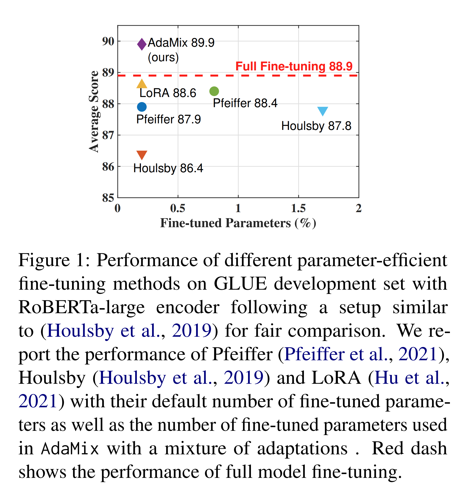

Fig. 1 은 tunable parameter 수에 따른 대표적인 PEFT 방법들의 성능을 보여준다. 전체 PLM parameter 를 업데이트하는 full model tuning 과 비교했을 때 성능 격차가 상당히 존재함을 확인할 수 있다.

저자는 **AdaMix** 라는 adaptation module mixture 접근법을 제안하며, 이 방법이 SOTA PEFT 방법뿐 아니라 full model fine-tuning 보다도 우수한 성능을 보이면서도 PLM parameter 의 단 0.1–0.2% 만 tuning 함을 보인다.

* 기존 PEFT 방법이 각 Transformer layer 에 single adaptation module 만 사용하는 것과 달리, AdaMix 는 여러 adaptation module 을 사용하여 주어진 task 에 대해 다양한 view 를 학습한다. 
* 이러한 adaptation mixture 설계는 sparsely-activated mixture-of-experts (MoE) model 로부터 영감을 받았다. 
* 전통적인 dense model (e.g., BERT, GPT-3) 은 모든 input example 에 대해 전체 model weight 를 활성화하지만, MoE model 은 각 input 마다 일부 weight 만 활성화하여 sparsity 를 유도한다.

Adapter 를 예로 들어 설명하면, 

* adapter 는 hidden representation 을 bottleneck dimension $d$ 로 down-project 하는 FFN layer 와, 다시 다음 layer 의 차원으로 up-project 하는 FFN layer 로 구성된다. 
* 기존 방식은 각 Transformer layer 에 single adapter 를 두지만, 저자는 각 layer 에 여러 *project-up* 과 *project-down* FFN 을 두고, input example 을 이들 중 하나의 project-up 과 하나의 project-down FFN 으로 routing 한다. 
* 이렇게 하면 single adapter 를 사용할 때와 동일한 연산 비용 (FLOPs) 으로 multiple adapter 를 활용할 수 있다. 
* LoRA 의 경우 pre-trained weight 의 gradient 를 low-rank matrix $A$ 와 $B$ 로 분해하는데, AdaMix 는 이러한 decomposition 을 여러 개 두고 adapter 와 유사하게 input 을 routing 한다.

저자는 다양한 routing mechanism 을 논의하며, stochastic routing 이 별도의 parameter 를 도입하지 않고도 module selection 을 가능하게 하며 좋은 성능을 낸다는 것을 보인다. 그러나 stochastic routing 은 학습 단계마다 다른 adaptation module 이 선택되므로 training instability 를 유발할 수 있다. 이를 완화하기 위해 저자는 consistency regularization 과 stochastic routing 중 adaptation module sharing 을 활용한다.

여러 adaptation module 의 도입은 adaptation parameter 수를 증가시키지만, 연산 비용은 증가하지 않고 storage cost 만 증가한다. 이를 해결하기 위해 저자는 각 Transformer layer 의 여러 adaptation module weight 를 하나의 module 로 합치는 **merging mechanism** 을 설계하였다. 이렇게 하면 parameter 수를 single module 과 동일하게 유지할 수 있다. 

* 이 merging 은 model weight averaging (model soups) 과 multi-BERT 로부터 영감을 받았다. 
* random initialization 이 다른 model weight 의 averaging 이 성능을 향상시킨다는 사실은 최근 연구들에서 잘 알려져 있으며, 최적화된 model 들이 동일한 error landscape basin 에 위치한다는 것이 밝혀졌다. 
* 기존 연구가 독립적으로 fine-tuning 된 model 에 초점을 맞췄다면, 저자는 frozen language model 과 random initialization adaptation module 로 구성된 PEFT 환경에 이 아이디어를 확장하였다.

본 연구의 기여는 다음과 같다:

(a) AdaMix 라는 새로운 PEFT 방법을 제안하였다. AdaMix 는 adapter, low-rank decomposition 등 임의의 PEFT 방법 위에서 적용 가능하며, downstream task 성능을 향상시킨다.  
(b) AdaMix 는 stochastic routing 과 adaptation module merging 을 통해 기존 PEFT 방법과 동일한 computational cost (e.g., FLOPs, tunable adaptation parameter 수) 를 유지한다. 또한 AdaMix 가 Bayesian Neural Networks 및 model ensembling 과 강한 연결점을 가진다는 점을 보인다.  
(c) PLM parameter 의 단 0.1–0.2% 만 tuning 함으로써, AdaMix 는 모든 GLUE NLU task 에서 full model fine-tuning 을 능가한 최초의 PEFT 방법이며, NLG 및 few-shot NLU task 에서도 다른 최신 방법들을 능가한다.  

#### Practical benefits of PEFT methods.

PEFT 방법의 실용적 장점은 메모리와 저장 공간 사용량 감소에서 비롯된다. Transformer 에서 frozen parameter 의 optimizer state 를 저장하지 않아도 되므로 VRAM 사용량이 크게 줄어든다. 또한 여러 task 가 동일한 full (frozen) PLM 복사본을 공유할 수 있으므로, 새로운 task 를 추가할 때 저장 비용이 최대 444 배 감소한다 (저자의 setting 에서 RoBERTa-large encoder 기준, 355MB → 0.8MB).

# 2 Mixture-of-Adaptations

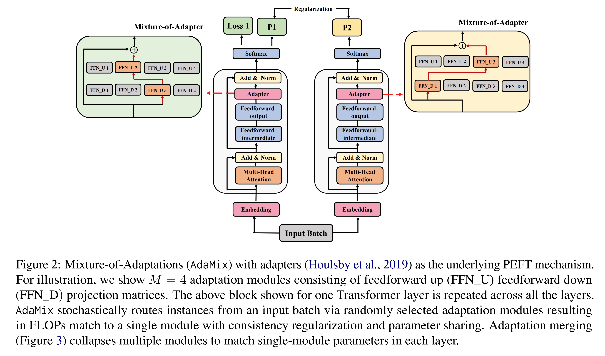

각 Transformer layer 에 $M$ 개의 adaptation module 을 삽입한다고 하자. 여기서 $A_{ij} : i \in \{1 \cdots L\}, j \in \{1 \cdots M\}$ 는 $i^{th}$ Transformer layer 의 $j^{th}$ adaptation module 을 의미한다. 설명을 위해, 저자는 parameter-efficient fine-tuning (PEFT) 메커니즘의 예시로 adapter 를 사용한다. 유사한 원리는 LoRA 와 같은 다른 PEFT 메커니즘 (e.g., low-rank decomposition) 에도 적용 가능하며, 이는 실험에서 보여준다.

* 저자는 널리 사용되는 Transformer architecture 를 채택하며, 이는 $L$ 개의 반복된 Transformer block 으로 구성된다. 
* 각 block 은 self-attention sub-layer, fully connected feed-forward network (FFN), 그리고 sub-layer 를 감싸는 residual connection 과 그 뒤의 layer normalization 으로 이루어진다. 
* Adapter 기반의 각 adaptation module $A_{ij}$ 는 feedforward up projection matrix $W^{up}_{ij}$ 와 feedforward down projection matrix $\mathcal{W}^{down}_{ij}$ 로 구성된다.

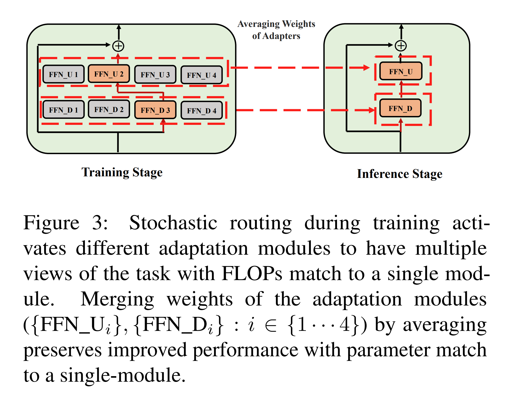

## 2.1 Routing Policy

최근 연구인 THOR 은 stochastic routing policy, 즉 random routing 이 전통적인 Switch routing 과 같은 고전적 메커니즘과 유사하게 동작하면서도 몇 가지 이점을 가진다는 것을 보였다.

* Input example 이 무작위로 서로 다른 expert 에 routing 되므로, 각 expert 가 동일한 확률로 활성화된다. 따라서 load balancing 을 위한 별도의 메커니즘이 필요 없어 framework 가 단순해진다.
* 추가적인 parameter 가 필요하지 않으며, 따라서 expert selection 을 위한 Switch layer 에서의 추가 연산도 없다.
* 이는 parameter-efficient fine-tuning 환경에서 매우 중요한데, single adaptation module 대비 동일한 parameter 수와 FLOPs 를 유지할 수 있기 때문이다.

AdaMix 의 작동을 분석하기 위해, 저자는 stochastic routing 과 model weight averaging 을 Bayesian Neural Networks 및 model ensembling 과 연결시켜 설명하며, 이는 Sec. 2.5 에서 다룬다.

Adapter-based AdaMix 의 stochastic routing policy 에서는, 학습의 각 step 마다 $i^{th}$ Transformer layer 에서 feedforward up 과 feedforward down projection matrix 쌍을 무작위로 선택한다: $A_i = \{ \mathcal{W}^{up}_{ij}, \mathcal{W}^{down}_{ik} \}, \quad  B_i = \{ \mathcal{W}^{up}_{ij′}, \mathcal{W}^{down}_{ik′} \}$ 와 같이 선택된다. 각 학습 step 마다 이러한 adaptation module 들 $A_i$ 와 $B_i$ 가 선택되면, 해당 batch 의 모든 input 은 동일한 module 세트를 거쳐 처리된다.

주어진 Transformer layer 에서 input representation $x$ 가 있을 때, 위 module 쌍은 다음과 같은 변환을 수행한다:

$$
x \leftarrow x + f(x \cdot \mathcal{W}^{down}) \cdot \mathcal{W}^{up} \tag{1}
$$

이러한 stochastic routing 은 학습 과정에서 adaptation module 이 서로 다른 변환을 학습하도록 하여 task 에 대한 multiple view 를 획득할 수 있게 한다. 그러나 training 과정에서 random routing protocol 을 사용하기 때문에 inference 시 어떤 module 을 사용할지 결정하는 문제가 발생한다.

저자는 이 문제를 해결하기 위해 두 가지 기법을 제안하며, 이를 통해 adaptation module 을 collapse 하여 single module 과 동일한 computational cost (즉, FLOPs, tunable adaptation parameter 수) 로 만들 수 있음을 보인다.

## 2.2 Consistency regularization

$\mathcal{A} = \{A_i^L\}_{i=1}$ 와 $\mathcal{B} = \{B_i^L\}_{i=1}$ 를 input $x$ 에 대해 Transformer 의 $L$ 개 layer 를 거치는 동안 stochastic forward pass 로 활성화되는 adaptation module (e.g., projection matrix) 의 집합이라고 하자. Consistency regularization 의 목적은 adaptation module 간의 정보 공유를 가능하게 하고 divergence 를 방지하는 것이다. 이를 위해 task-specific optimization loss 에 다음과 같은 consistency loss 를 regularizer 로 추가한다:

$$
\begin{aligned}
    &\mathcal{L} = - \Big( \sum_{c=1}^C \mathcal{I}(x, c) \log \text{softmax}(z^\mathcal{A}_c(x)) + \\
    &\frac{1}{2} \Big( \mathcal{KL}(z^\mathcal{A}_{(\cdot)}(x) \,||\, z^\mathcal{B}_{(\cdot)}(x)) + \mathcal{KL}(z^\mathcal{B}_{(\cdot)}(x) \,||\, z^\mathcal{A}_{(\cdot)}(x)) \Big)
\end{aligned}\tag{2}
$$

* 여기서 $\mathcal{I}(x, c)$ 는 class label $c$ 가 $x$ 의 정답인 경우 $1$, 아니면 $0$ 인 indicator 이다. 
* $z^\mathcal{A}_{(\cdot)}(x)$ 와 $z^\mathcal{B}_{(\cdot)}(x)$ 는 각각 $\mathcal{A}$, $\mathcal{B}$ module 을 통한 predicted logit 을 의미하며, 
* $\mathcal{KL}$ 은 Kullback-Leibler divergence 이다. 
* $x$ 는 frozen parameter 를 가진 PLM 의 input representation 이며, 학습 중에는 module 의 $\{\mathcal{W}^{up}, \mathcal{W}^{down}\}$ parameter 만 업데이트된다.

## 2.3 Adaptation module merging

위 regularization 은 inference 시 random module selection 으로 인한 불일치를 완화하지만, 여전히 여러 adaptation module 을 유지해야 하므로 serving cost 가 증가한다. Downstream task 에 대해 random seed 가 다른 fine-tuned model 의 weight 를 평균내는 것이 single fine-tuned model 보다 성능이 더 낫다는 사실은 이미 알려져 있다. 또한 최근 연구는 동일 initialization 에서 다르게 fine-tuning 된 model 들이 동일한 error basin 에 존재함을 보이며, weight aggregation 이 task summarization 을 더 강건하게 만든다는 점을 뒷받침한다.

저자는 이러한 기법을 parameter-efficient 학습에 도입하여 multi-view adaptation module 에 적용한다. Stochastic routing, consistency regularization 과 달리 adaptation merging 은 **inference 시점에서만** 적용된다.

$i \in \{1 \cdots L\}, \{j,k\} \in \{1 \cdots M\}$ 일 때, adaptation module $\{\mathcal{W}^{up}_{ij}, \mathcal{W}^{down}_{ik}\}$ 이 주어지면, 각 Transformer layer 에서 모든 대응 module (e.g., project-up, project-down matrix) 의 weight 를 단순 평균하여 single module $\{\mathcal{W}_i^{\prime up}, \mathcal{W}_i^{\prime down}\}$ 로 collapse 한다:

$$
\mathcal{W}_i^{\prime up} \leftarrow \frac{1}{M} \sum_{j=1}^M \mathcal{W}_{ij}^{up}, \quad
\mathcal{W}_i^{\prime down} \leftarrow \frac{1}{M} \sum_{j=1}^M \mathcal{W}_{ij}^{down}
\tag{3}
$$

## 2.4 Adaptation module sharing

Stochastic routing 으로 multi-view adaptation module 을 사용하는 것은 model capacity 를 증가시키지만, labeled data 가 적은 downstream task 에서는 여러 adaptation module 을 학습시키는 것이 부담이 될 수 있다. 이를 해결하기 위해 저자는 일부 adaptation module (e.g., project-down 또는 project-up 연산) 을 공유하는 기법을 사용하여 training efficiency 를 높인다.

기본 adapter setting 에서, 저자는 feedforward projection-up matrix 만 공유한다. 즉, $\mathcal{W}^{up}_{ij} = \mathcal{W}^{up}_{i}$ 로 둔다. 이러한 설계 선택은 Sec. 3.3 의 ablation study 및 Appendix Sec. C 에서 분석한다.

## 2.5 Connection to Bayesian Neural Networks and Model Ensembling

Bayesian Neural Network (BNN) 은 deterministic model 의 weight parameter 를 분포로 대체한다. Inference 시에는 가능한 모든 weight 에 대해 평균을 내는데, 이를 marginalization 이라 한다.

$f^{\mathcal{W}(x)} \in \mathbb{R}^d$ 를 d-dimention output 이라 하자. Model likelihood 는 $p(y|f^{\mathcal{W}(x)})$ 로 주어진다. 저자의 setting 에서 $\mathcal{W} = \langle \mathcal{W}^{up}, \mathcal{W}^{down} \rangle$ 이며, frozen PLM parameter 는 표기 단순화를 위해 생략한다. Classification 의 경우 softmax likelihood 를 적용하여: $P(y = c|x, W) = \text{softmax}(f^{\mathcal{W}(x)})$ 를 얻는다. 주어진 instance $x$ 에 대해 class distribution 은 posterior 에 대한 marginalization 으로 표현된다: $p(y = c|x) = \int_W p(y=c|f^{\mathcal{W}(x)}) \, p(\mathcal{W}|X,Y)\, d\mathcal{W}$

그러나 가능한 모든 weight 에 대해 평균을 내는 것은 실제로 불가능하다. 따라서 variational inference 나 dropout 기반 stochastic regularization 기법이 사용되어 왔다.

본 연구에서는 random routing 형태의 **stochastic regularization** 을 활용한다. 목표는 계산하기 어려운 true posterior 대신 tractable family 내에서 surrogate distribution $q_\theta(W)$ 를 찾는 것이다. 이상적인 surrogate 는 true posterior 와의 KL divergence 를 최소화함으로써 결정된다.

$q_\theta(\mathcal{W})$ 를 stochastic routing policy 라 하고, $T$ 개의 masked model weight $\{\widetilde{\mathcal{W}_t}\}_{t=1}^T \sim q_\theta(\mathcal{W})$ 를 sampling 한다고 하자. Classification task 에서 approximate posterior 는 Monte Carlo integration 으로 근사할 수 있다:

$$
\begin{aligned}
    p(y = c|x) &\approx p(y=c|f^\mathcal{W}(x))q_\theta(\mathcal{W})d\mathcal{W} \\
    &\approx \frac{1}{T} \sum_{t=1}^T p(y=c|f^{\widetilde{\mathcal{W}_t}}(x))\\
    &= \frac{1}{T} \sum_{t=1}^T \text{softmax}(f^{\widetilde{\mathcal{W}_t}}(x))
\end{aligned}
\tag{4}
$$

그러나 위와 같이 approximate posterior 를 계산하려면 inference 시 모든 stochastic weight $\mathcal{W}_t(x)$ 를 저장해야 하므로 serving cost 가 증가한다. 이를 줄이기 위해 저자는 inference 단계에서 adaptation module merging 을 사용한다.

stochastic adaptation weights 의 merging 의 expected loss 를 $\mathcal{L}^{AM}_\mathcal{W} = \mathbb{E}_{x,y} \mathcal{L}(\text{softmax}(f^{\widetilde{\mathcal{W}}}(x)), y)$ 로 나타내자. 여기서 $\widetilde{\mathcal{W}} = \frac{1}{T}\sum_t \widetilde{\mathcal{W_t}}$ 이며, $\mathcal{L}$ 은 cross-entropy loss 이다. 한편 logit-level stochastic model ensembling (Eq. 4) 의 expected loss 는 $\mathcal{L}^{Ens}_\mathcal{W} = \mathbb{E}_{x,y}\, \mathcal{L}\Big( \frac{1}{T}\sum_{t=1}^T \text{softmax}(f^{\widetilde{\mathcal{W}_t}}(x)), y\Big)$ 로 정의된다.

기존 연구는 hyper-parameter 가 다른 여러 fine-tuned model 의 weight 를 평균내는 것이 성능을 향상시킴을 보였으며, weight-averaging ($\mathcal{L}^{AM}_\mathcal{W}$) 과 logit-ensembling ($\mathcal{L}^{Ens}_\mathcal{W}$) 의 loss 가 prediction confidence 와 loss flatness 의 함수로 유사함을 분석하였다.

비록 기존 연구는 독립적으로 fine-tuning 된 model 의 weight averaging 을 대상으로 하지만, 저자는 stochastic 하게 얻어진 여러 adaptation weight 에도 유사한 분석을 적용하여 유리한 loss $\mathcal{L}^{AM}_\mathcal{W}$ 를 도출한다. 또한 adaptation merging 은 logit-ensembling 과 달리 single merged weight 만 유지하면 되므로 inference 시 serving cost 를 크게 줄일 수 있다.

# 3 Experiments

## 3.1 Experimental Setup

#### Dataset.

저자는 General Language Understanding Evaluation (GLUE) benchmark 의 8 natural language understanding (NLU) tasks 와, 3 가지 natural language generation (NLG) task 인 E2E, WebNLG, DART 에서 실험을 수행한다. NLU 와 NLG task 설정은 각각 Houlsby et al., Li and Liang, Hu et al. 의 setup 을 따른다.

#### Baselines.

AdaMix 는 full model fine-tuning 및 여러 SOTA parameter-efficient fine-tuning (PEFT) 방법과 비교된다. 비교 대상은 Pfeiffer Adapter, Houlsby Adapter, BitFit, Prefix-tuning, UNIPELT, LoRA 이다. Encoder 로는 NLU task 에 BERT-base 와 RoBERTa-large 를 사용하고 (결과는 Tab. 1 과 Tab. 2), NLG task 에는 GPT-2 를 사용한다 (결과는 Tab. 3).

#### AdaMix implementation details.

AdaMix 는 Pytorch 로 구현되었으며 Tesla V100 GPU 에서 실험을 수행하였다. Hyper-parameter 설정은 Appendix Sec. E 에 제시되어 있다.

* AdaMix with adapters: BERT-base 에서 dimension 16, RoBERTa-large 에서 dimension 48 을 사용한다. 이는 Hu et al., Mao et al. 의 setup 과 동일하여 공정 비교가 가능하다.
* AdaMix with LoRA: rank $r=4$ 를 사용하여 inference 시 adaptation parameter 수를 동일하게 유지한다.
* Adaptation module 개수: 모든 task 와 encoder 에 대해 기본값은 4 로 설정하였다 (별도 언급이 없는 한).
* NLU task 의 adapter dimension 과 adaptation module 개수의 영향은 Tab. 9 와 Tab. 10 에서 분석한다.
* 대부분의 실험 및 ablation study 는 NLU task 에 대해 AdaMix with adapters 결과를 보고한다. Framework 의 일반성을 보이기 위해, NLG task 에서는 AdaMix with LoRA 결과도 함께 제시한다.

## 3.2 Key Results

### 3.2.1 NLU Tasks

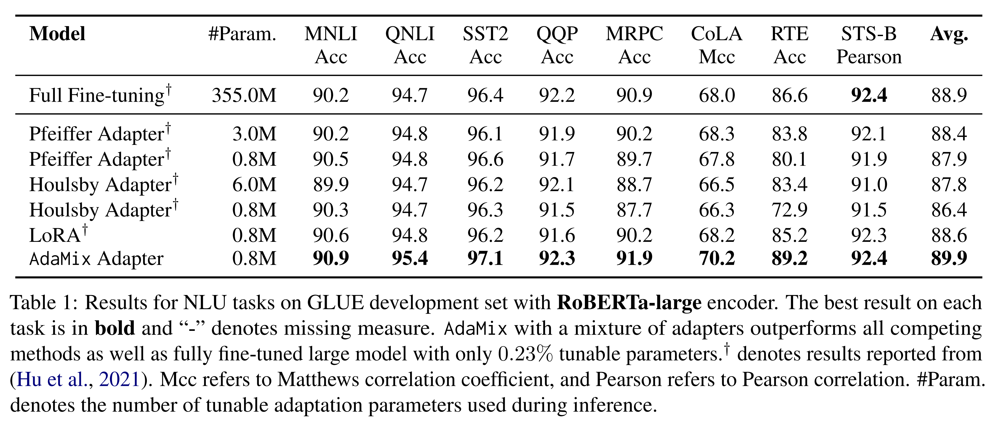

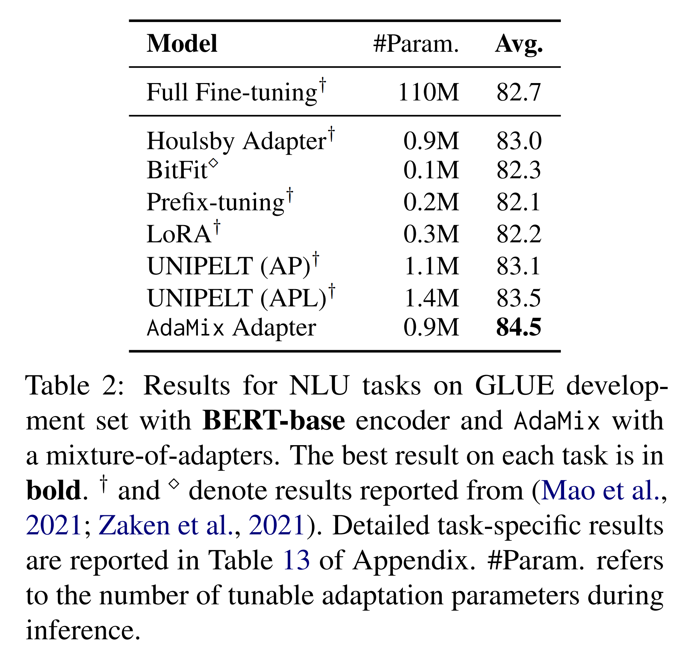

Tab. 1 과 Tab. 2 는 각각 RoBERTa-large 와 BERT-base encoder 기반에서의 PEFT model 성능 비교를 보여준다. 

* Full fine-tuning 은 upper bound 성능을 제공한다. 
* AdaMix with mixture-of-adapters 는 대부분의 task 와 encoder 에서 다른 SOTA baseline 을 유의미하게 초월한다. 
* 특히 AdaMix with adapters 는 모든 task 와 평균 점수에서 full model fine-tuning 을 능가한 유일한 PEFT 방법이다.

### 3.2.2 NLG Tasks

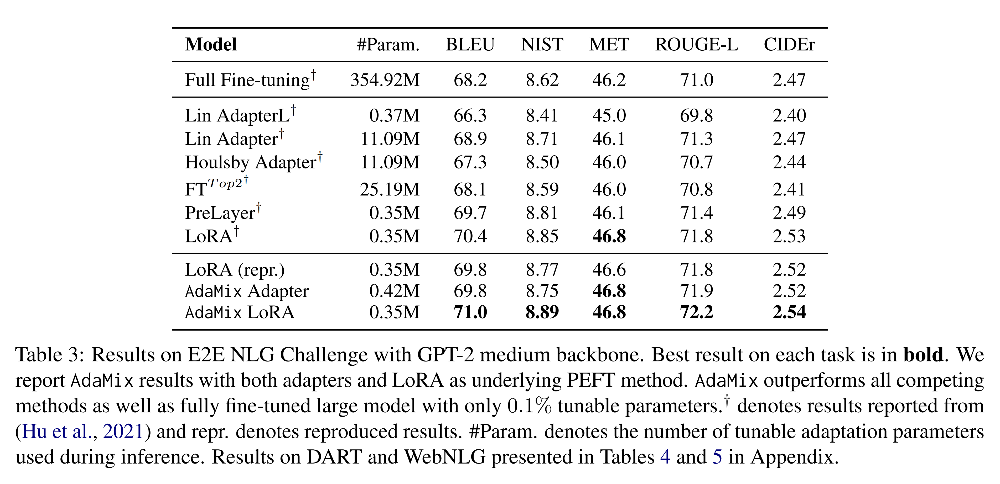

* Tab. 3 의 E2E NLG 결과에서 보이듯, AdaMix 는 mixture of adaptations 을 통해 underlying PEFT 방법보다 성능을 향상시킨다. 
* 구체적으로 AdaMix with LoRA 는 LoRA 를, AdaMix with adapters 는 Houlsby adapter 를 각각 초월한다. 

DART 와 WebNLG 결과는 Appendix 의 Tab. 4 와 Tab. 5 에 제시된다.

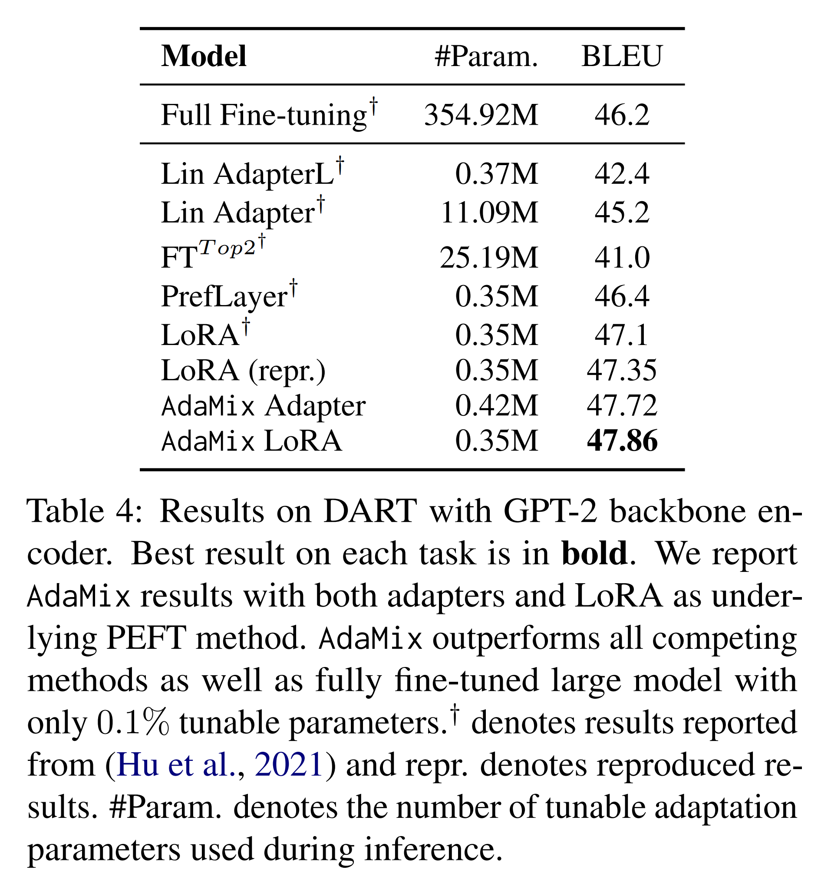

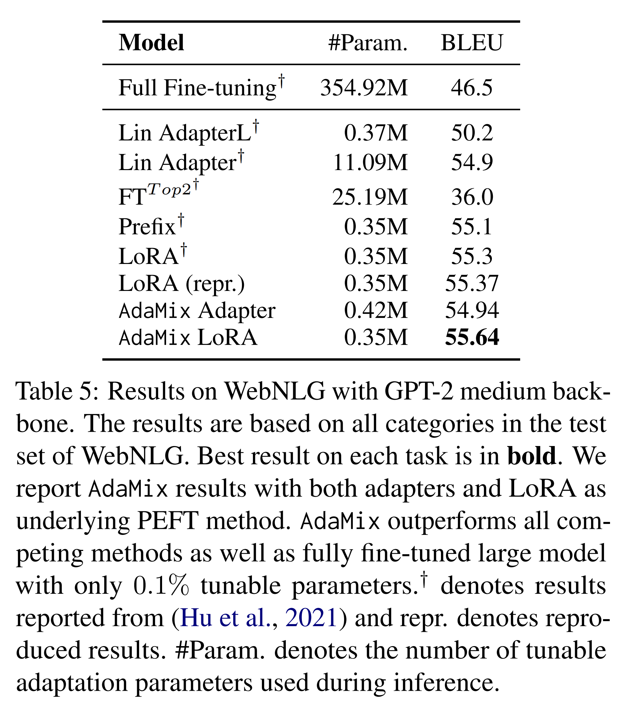

### 3.2.3 Few-shot NLU

앞선 fully supervised setting 과 달리, 저자는 GLUE 의 6 개 task 에 대해 few-shot 실험을 수행하였다. 실험은 Wang et al. 의 setup (e.g., shot 수, train/test split, 평가 방식) 을 따른다. 세부 실험 설정은 Appendix Sec. B 에 제시된다. AdaMix 는 prompt-based fine-tuning 과 결합된 mixture-of-adapters 를 사용한다.

Tab. 6 은 RoBERTa-large 를 frozen encoder 로 두고, labeled example $|K|=30$ 인 상황에서 다양한 PEFT 방법의 성능 비교를 보여준다. 

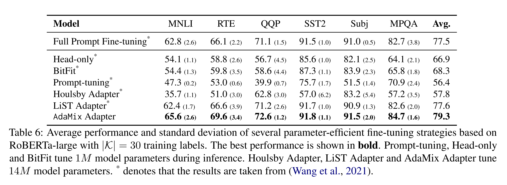

* 대부분의 PEFT 방법은 모든 parameter 를 업데이트하는 full model prompt-based fine-tuning 과 비교했을 때 큰 성능 격차를 보인다. 
* 그러나 AdaMix with adapters 는 few-shot NLU setting 에서도 fully supervised setting 과 마찬가지로 full model tuning 성능을 능가한다. 
* 특히 AdaMix 와 LiST 는 유사한 adapter 구조를 prompt-based fine-tuning 과 결합하여 사용한다는 점에서 공통점을 가진다.

## 3.3 Ablation Study

저자는 parameter-efficient fine-tuning 환경에서 AdaMix with adapters 에 대한 ablation 분석을 수행하였다.

#### Analysis of adaptation merging.

이 실험에서는 adaptation merging 을 제거하고, inference 시 두 가지 routing 전략을 비교하였다:

(a) random routing: input 을 임의의 adaptation module 로 보냄  
(b) fixed routing: 모든 input 을 AdaMix 의 첫 번째 adaptation module 로 보냄  

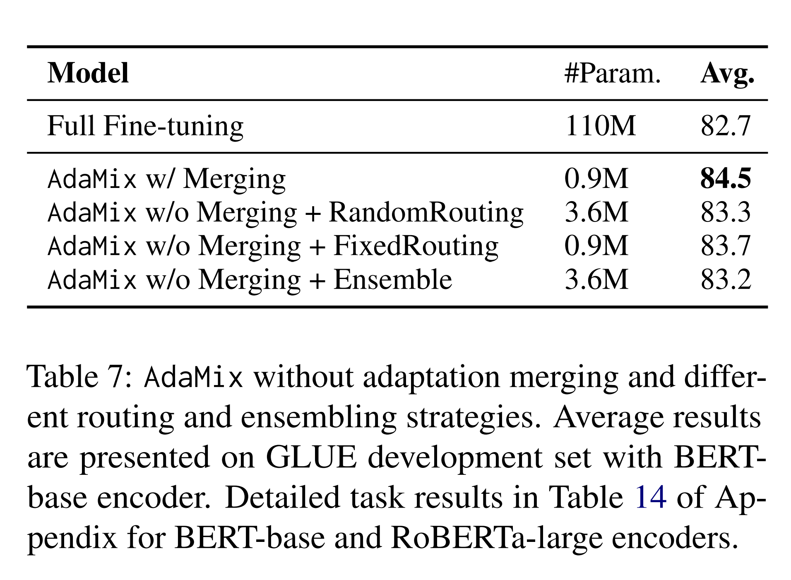

* Tab. 7 결과에 따르면, adaptation merging 을 포함한 AdaMix 가 merging 없는 변형보다 더 좋은 성능을 보인다. 
* 주목할 점은, 모든 AdaMix 변형이 full model tuning 을 초월한다는 것이다. 

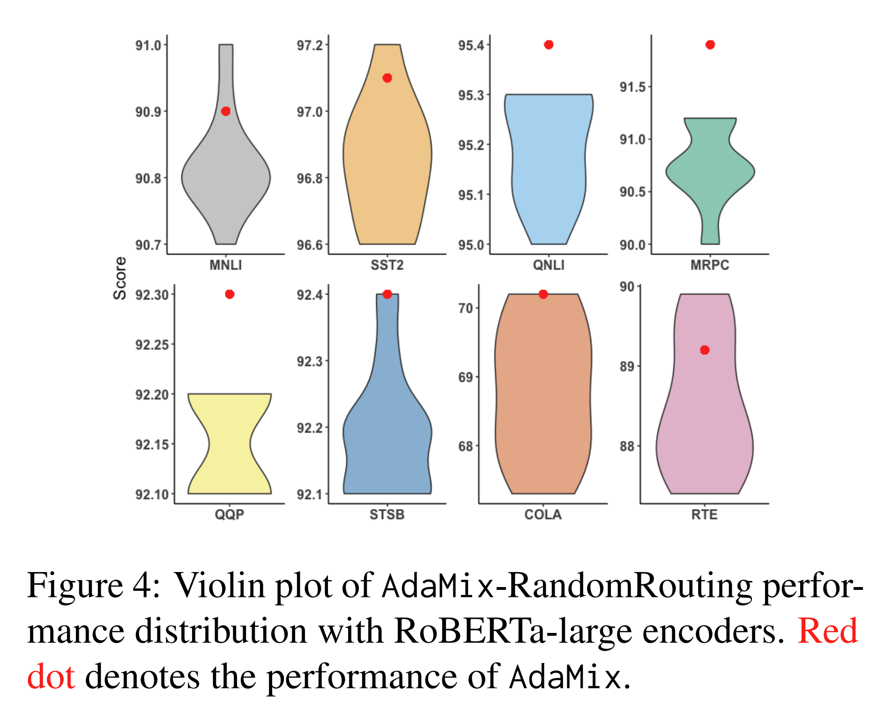

* Fig. 4 는 merging mechanism 의 성능이 random routing 의 평균 성능보다 일관되게 높으며, random routing 의 최고 성능과도 유사함을 보여준다.

#### Averaging weights vs. ensembling logits.

저자는 AdaMix 와 logit ensembling 변형 (AdaMix-Ensemble) 을 비교하였다. 

* 여기서 logit ensembling 은 각 input 마다 $T=4$ 번 random routing pass 를 수행하고, 서로 다른 pass 의 logit 을 평균하여 최종 예측 logit 으로 사용한다. 
  * 이 방법의 inference 시간은 AdaMix 의 4 배가 된다. 
* 3 개의 random seed 로 반복 실험을 수행한 결과 (Tab. 7), weight averaging 기반 AdaMix 가 logit-ensembling 을 능가한다.
  * 이는 Sec. 2.5 의 분석 ($\mathcal{L}^{AM}_W$ vs. $\mathcal{L}^{Ens}_W$) 과 일치한다.

#### Analysis of consistency regularization.

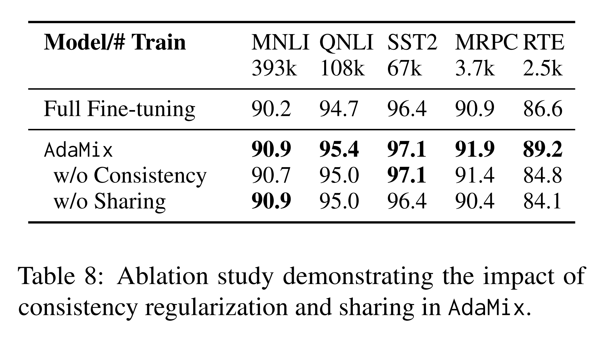

* 학습 시 consistency regularization 을 제거한 ablation 결과, Tab. 8 에서 성능이 크게 저하됨을 보였다. 
* 이는 consistency regularization 의 중요성을 입증한다.

#### Analysis of adaptation module sharing.

AdaMix 에서 module sharing 을 제거하고, project-down FFN layer 4 개, project-up FFN layer 4 개를 독립적으로 유지한 경우를 ablation 하였다. 

* Tab. 8 에 따르면 dataset 크기가 줄어들수록 AdaMix 와 AdaMix w/o sharing 의 성능 차이가 커졌으며, 이는 저자 방법의 parameter sharing 이 low-resource task (e.g., RTE, MRPC) 에서 특히 중요함을 보여준다. 
* Fig. 7 (Appendix) 은 동일한 학습 step 수에서, sharing 이 있는 AdaMix 가 없는 경우보다 더 빠른 수렴과 낮은 training loss 를 보임을 추가로 확인시킨다. 
* 또한, 어떤 module 을 공유할지(project-up vs. project-down)에 대한 실험은 Tab. 11 (Appendix) 에 제시되며, 두 경우 유사한 결과를 보였다.

#### Impact of the number of adaptation modules.

학습 시 adaptation module 수를 2, 4, 8 로 변화시켜 실험하였다. 

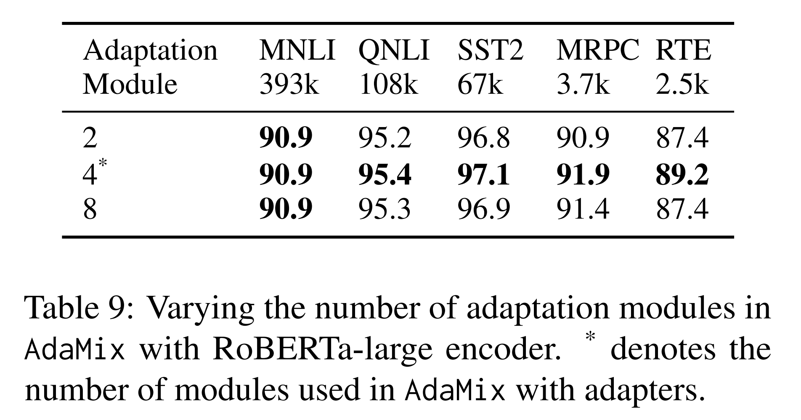

Tab. 9 는 module 수 증가에 따라 전체 task 성능에서 점차적인 수익 감소(diminishing returns) 가 발생함을 보여준다. 

* Module 수를 늘리면 sparsity 와 tunable parameter 수가 증가하지만, RTE, SST-2 와 같은 low-resource task 에서는 성능이 오히려 감소한다. 
* 반면 MNLI, QNLI 같은 high-resource task 는 성능이 유지되거나 개선되었다.

#### Impact of adapter bottleneck dimension.

Tab. 10 은 AdaMix 에서 adapter bottleneck dimension 변화가 성능에 미치는 영향을 보여준다. 

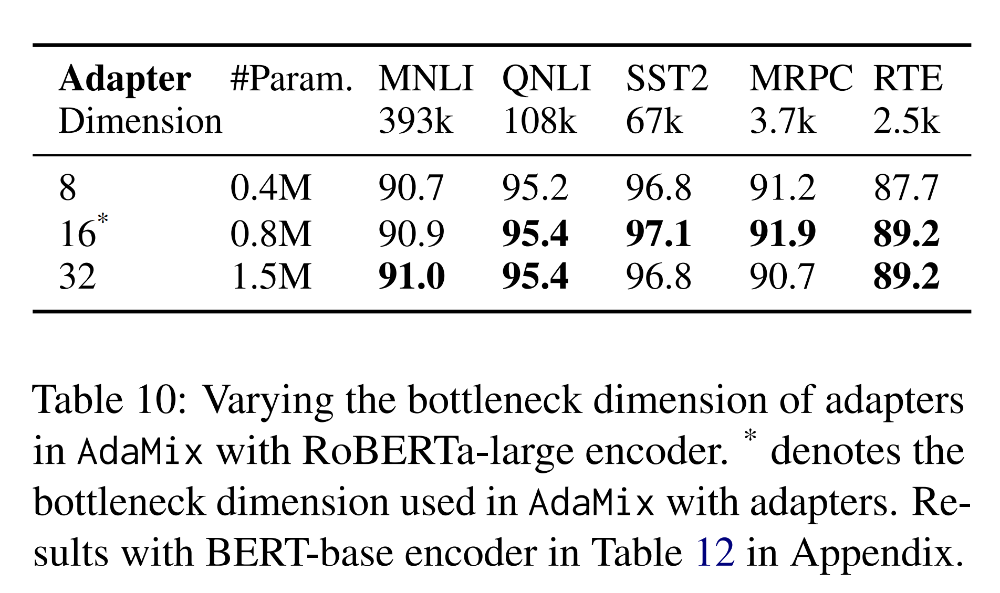

* Bottleneck dimension 증가로 trainable parameter 수가 늘어나면 성능이 개선되지만, 일정 지점 이후에는 수익이 감소(diminishing returns) 한다.

# 4 Related Work

#### Parameter-efficient fine-tuning of PLMs.

최근 parameter-efficient fine-tuning (PEFT) 연구는 크게 두 가지 범주로 나뉜다.

1. 기존 parameter 의 일부만 tuning 하는 방법 (e.g., head fine-tuning, bias term tuning),
2. 새롭게 parameter 를 도입하여 tuning 하는 방법 (e.g., adapter, prompt-tuning, prefix-tuning, low-rank adaptation).

기존 연구들이 single adaptation module 위에서 동작한 것과 달리, AdaMix 는 학습 단계에서 stochastic routing 을 적용한 다중 adaptation module mixture 와, inference 단계에서 adaptation module merging 을 통해 single module 과 동일한 computational cost 를 유지한다. 또한 AdaMix 는 임의의 PEFT 방법 위에서 적용 가능하며 성능을 추가로 향상시킬 수 있다.

#### Mixture-of-Expert (MoE).

* Shazeer et al. 은 gating network 와 Top-k routing 및 load balancing 을 결합한 MoE model 을 제안하였다. 
* 이후 Fedus et al. 은 Top-1 routing 을 위한 initialization 및 training scheme 을 제안하였고, Zuo et al. 은 random routing 에 consistency regularization 을 도입하였다. 
* Yang et al. 은 expert-prototype 기반 k Top-1 routing 을 제안하였으며, Roller et al. 과 Lewis et al. 은 load balancing 문제를 다루었다. 

이러한 연구들은 모두 sparse MoE 를 pre-training 단계에서 처음부터 학습시키는 접근이다. 반면 저자는 pre-trained language model 을 기반으로, 소수의 sparse adapter parameter 만 tuning 하는 parameter-efficient adaptation 을 연구하였다.

#### Averaging model weights.

최근 연구는 model weight 를 평균내는 model aggregation 을 탐구하였다. 

* Szegedy et al., Matena and Raffel, Wortsman et al., Izmailov et al. 등이 이에 해당한다. 
  * 예를 들어, Matena and Raffel 은 서로 다른 text classification task 에 대해 fine-tuning 된 PLM 을 merging 하는 방법을 제안하였다. 
* Wortsman et al. 은 동일한 task 를 다른 hyper-parameter 설정으로 독립적으로 학습한 model weight 를 평균내는 방법을 탐구하였다. 

기존 연구들이 full model fine-tuning weight averaging 을 다룬 것과 달리, 저자는 large model parameter 를 고정한 상태에서, 학습 중 업데이트되는 소규모 tunable parameter (adaptation module weight) 의 averaging 을 연구하였다.

# 5 Conclusions

저자는 대규모 pre-trained language model (PLM) 의 parameter-efficient fine-tuning (PEFT) 을 위한 새로운 framework **AdaMix** 를 제안하였다. AdaMix 는 adaptation module 의 mixture 를 활용하여 downstream task 성능을 개선하면서도, underlying adaptation 방법과 동일한 computational cost (e.g., FLOPs, parameter 수) 를 유지한다.

AdaMix 는 adapter, low-rank decomposition 과 같은 다양한 PEFT 방법 위에서 동작 가능하며, NLU 와 NLG task 모두에서 성능 향상을 보인다. 특히 PLM parameter 의 단 0.1–0.2% 만 tuning 함으로써, AdaMix 는 모든 parameter 를 업데이트하는 full model fine-tuning 과 최신 PEFT 방법들을 초월하는 성능을 보였다.

# 6 Limitations

제안된 AdaMix 방법은 large-scale language model 을 fine-tuning 하기 때문에 다소 연산 집약적이다. 특히 학습 과정에서 여러 개의 adapter 복사본이 포함되므로, standard PEFT 방법보다 training cost 가 더 높다. 경험적으로 AdaMix 의 학습 iteration 수는 standard PEFT 방법 대비 1–2 배 정도 많았다. 이는 model 학습 시 carbon footprint 에 부정적인 영향을 미친다.

또한 AdaMix 는 대부분의 기존 PEFT 연구와 독립적(orthogonal) 관계에 있으며, 잠재적으로 어떤 PEFT 방법이든 성능을 향상시킬 수 있다. 본 연구에서는 대표적인 PEFT 방법인 adapter 와 LoRA 만을 실험 대상으로 하였으며, prompt-tuning 이나 prefix-tuning 과 같은 다른 조합은 다루지 않았다. 이러한 확장은 future work 으로 남겨둔다.
