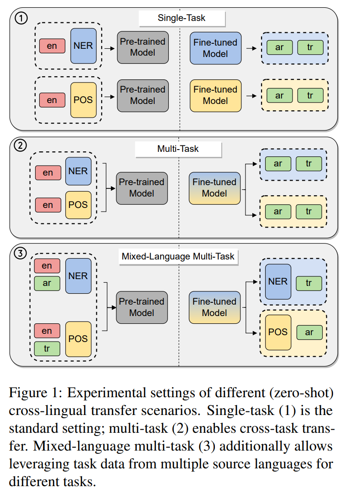
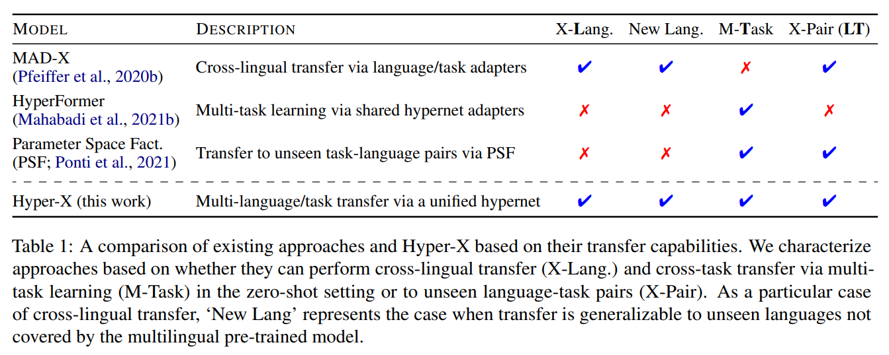
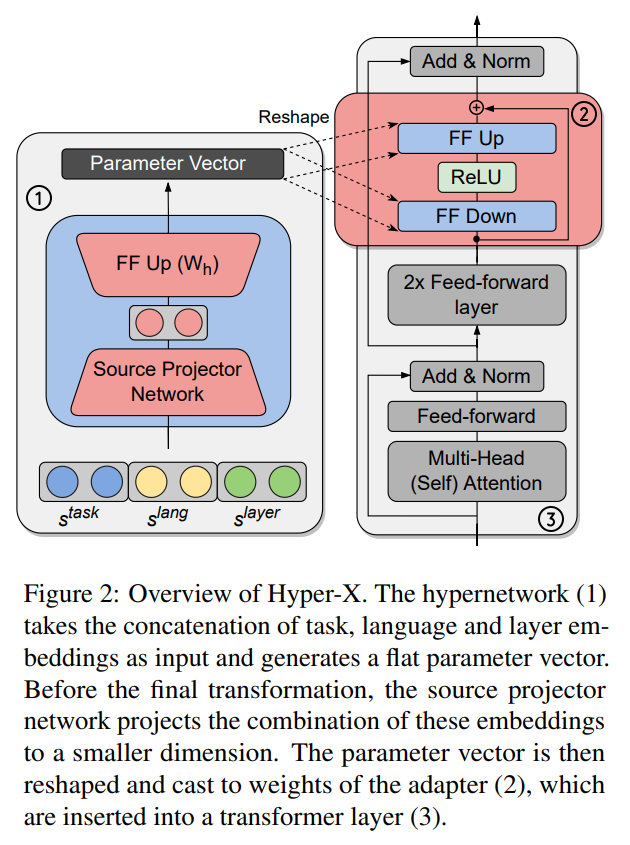
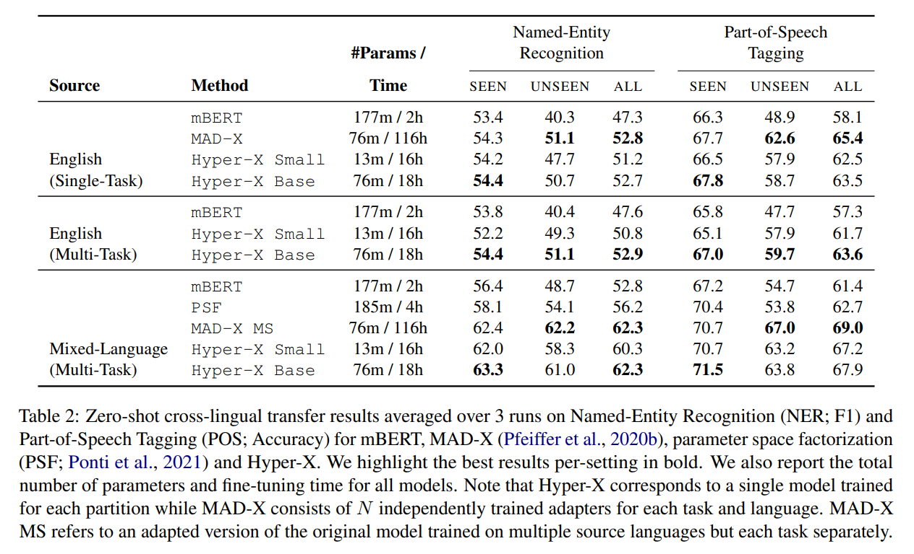
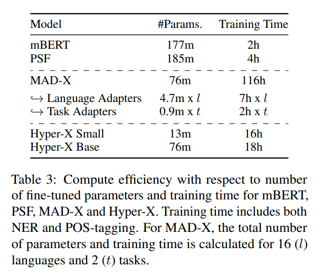
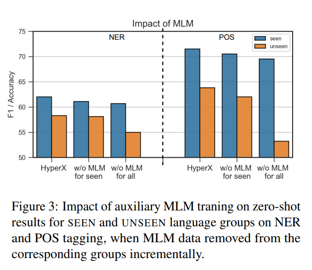
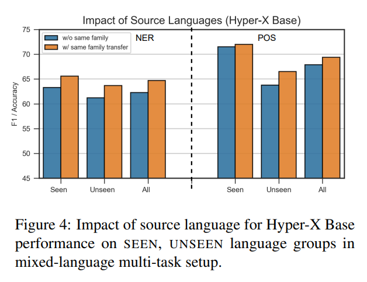
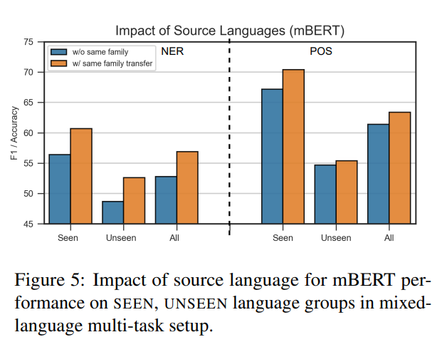
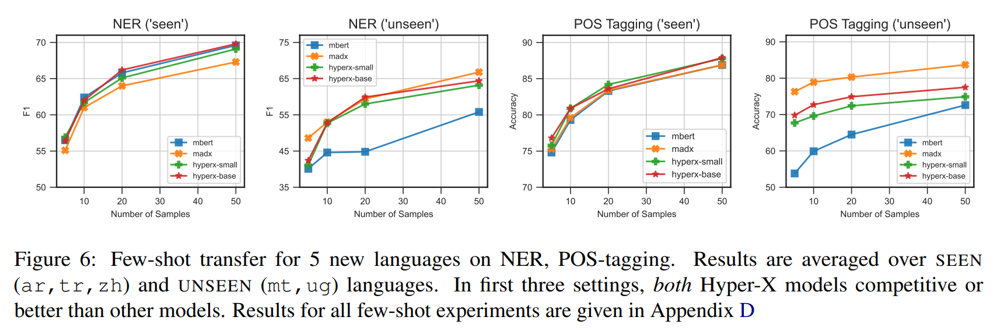

논문 및 이미지 출처 : <https://aclanthology.org/2022.emnlp-main.541.>

# Abstract

대규모 multilingual model 은 task 와 language 전이 학습에 유망하다. 그러나 기존 방법은 서로 다른 task-language 조합에서 training data 가 제공될 때 이를 완전히 활용하지 못한다. 이러한 heterogeneous supervision 을 활용하기 위해, 저자는 multi-task 와 multilingual learning 을 efficient adaptation 으로 통합하는 single hypernetwork 인 **Hyper-X** 를 제안한다. 

* 이 model 은 task 와 language embedding 에 조건화된 adapter module 의 weight 를 생성한다. 
* Task 와 language-specific knowledge 를 결합하는 방법을 학습함으로써, 이 model 은 unseen language 및 task-language 조합에 대해 zero-shot transfer 를 가능하게 한다. 
* 다양한 language 에서의 실험을 통해 Hyper-X 는 여러 자원의 혼합이 사용 가능할 때 최고의 성능 혹은 경쟁력 있는 향상을 달성하며, 표준 시나리오에서는 strong baseline 과 동등한 성능을 보임을 확인하였다. 
* 또한 Hyper-X 는 separate adapter 를 학습하는 방법에 비해 parameter 와 resource 면에서 상당히 더 효율적이다. 
* 마지막으로, Hyper-X 는 새로운 language 에 대한 few-shot 시나리오에서도 일관되게 강력한 결과를 보여주며, zero-shot transfer 를 넘어서는 저자의 접근법의 다양성을 입증한다.

# 1 Introduction

Language 와 task 를 넘나드는 transfer learning 은 오랫동안 NLP 의 중요한 초점이었다. 최근 massively multilingual transformers (MMTs) 는 이 영역에서 큰 성과를 보여주었다. 이러한 model 의 장점은 high-resource source language 에서 task-specific information 을 low-resource target language 로 전이할 수 있다는 점이다 (Fig. 1, 1). 또 다른 장점은 여러 task 로부터의 knowledge 를 활용하여 stronger generalization 을 이끌어낼 수 있다는 것이다 (Fig. 1, 2).

시간이 지나면서 많은 연구 커뮤니티가 특정 language 에 초점을 맞춘 resource 를 개발해 왔다. 실제로는 서로 다른 language 와 task 가 섞여 있는 data 가 이용 가능한 경우가 흔하다. 예를 들어, English 에 대해 POS tagging 과 Named Entity Recognition (NER) data 가 모두 존재한다고 하자. 이때 Turkish 에 대해서는 POS annotation 이 달린 treebank 가 존재할 수 있고, Arabic 에 대해서는 NER data 가 존재할 수 있다. 이러한 예시는 Fig. 1, 3 에 나타나 있다.

기존 cross-lingual transfer paradigm 인 single-task zero-shot transfer 나 few-shot learning 과는 달리, 이러한 mixture dataset(mixed-language multi-task)에서의 multi-task learning 은 모든 이용 가능한 data 를 활용하고, task 와 language 를 모두 넘어 unseen task-language 조합으로 information 을 전이할 수 있는 기회를 제공한다.

그러나 standard fine-tuning 전략은 이러한 heterogeneous task 와 language data 를 활용하는 능력에 한계가 있다. 구체적으로, MMTs 는 여러 source 에 대해 fine-tuning 할 경우 catastrophic forgetting 과 interference 에 취약하다. Parameter-efficient fine-tuning 대안인 adapter 는 일반적으로 task 간 transfer 이나 language 간 transfer 을 위해 사용되지만, 새로운 language 마다 새로운 adapter 학습이 필요하다.

이에 본 논문에서는 single model 내에서 서로 다른 language 와 task 를 포함한 여러 source 의 information 을 활용할 수 있는 통합 hypernetwork, **Hyper-X** 를 제안한다. 

* 핵심 아이디어는 language 와 task embedding 을 input 으로 받아, 해당 task-language combination 을 위한 adapter parameter 를 hypernetwork 를 통해 생성하는 것이다. 
* 각 task 와 language 를 별도로 parameterization 함으로써, Hyper-X 는 test 시 unseen 조합에 대한 adaptation 을 가능하게 하면서 모든 이용 가능한 data resource 를 활용할 수 있다.
* 추가적으로, Hyper-X 는 labelled data 가 없는 경우에도 masked language modelling (MLM) 을 자연스럽게 활용할 수 있다. 
  * 이를 통해 pre-training 동안 MMT 가 다루지 않은 language 에 대해서도 zero-shot adaptation 을 수행할 수 있다. 
* 또한 MLM 은 task-specific data 가 없는 경우에도 Hyper-X 가 해당 language representation 을 학습하도록 한다.

요약하면, 본 연구는 최근 문헌에서 탐구된 여러 transfer 의 ‘ingredient’를 하나로 결합한다 (Tab. 1). 즉, multi-task learning, multilingual learning, further pre-training, 그리고 높은 수준의 compute 및 time 효율성을 포함한다.

저자는 Hyper-X 를 cross-lingual transfer 환경에서 two sequence labelling task, 즉 part-of-speech (POS) tagging 과 named-entity recognition (NER)에 대해 평가한다. 실험은 총 16 개 language (이 중 7 개는 pre-training 에 포함되지 않음)를 대상으로 Fig. 1 에 묘사된 세 가지 setup 에 걸쳐 진행되었다. 

실험 결과, Hyper-X 는 English 로부터의 cross-lingual transfer 에서는 strong baseline 과 동등한 성능을 보였다. Multi-task 와 mixed-language setting 에서는 Hyper-X 가 standard baseline 대비 큰 향상을 보였으며, heterogeneous supervision source 를 활용할 수 있는 능력 덕분에 효율성이 떨어지는 adapter 기반 model 과 동등한 성능을 달성하였다. 

분석 결과, Hyper-X 는 효율성과 성능 간의 trade-off 에서 우수함이 드러났다. 마지막으로 few-shot setting 에서 Hyper-X 는 서로 다른 language 와 task 에 걸쳐 일관되게 경쟁력 있는 성능을 달성하였으며, 이는 저자의 접근법이 continuous learning 시나리오에서도 유용함을 시사한다.

# 2 Background

## 2.1 Adapters

Adapter 는 MMT 에 삽입되어 new task, language, 또는 domain 에 대해 model 을 fine-tuning 하기 위한 경량 bottleneck layer 이다. Transformer 의 pre-trained weight 는 고정된 상태로 유지되고, adapter parameter 만 업데이트된다. 이러한 설정은 specialized knowledge 를 캡슐화함으로써 catastrophic forgetting 을 방지한다.

형식적으로, layer $i$ 의 adapter module $A_i$ 는 bottleneck dimension $b$ 를 가진 input $z_i \in \mathbb{R}^h$ 의 down-projection $D_i \in \mathbb{R}^{h \times b}$, non-linear fuction (ReLU), 그리고 up-projection $U_i \in \mathbb{R}^{b \times h}$ 로 구성된다:

$$
A_i(z_i) = U_i.\text{ReLU}(D_i \cdot z_i) + z_i \tag{1}
$$

여기서 feed-forward network 는 input $z_i$ 와 연결되는 residual link 를 따른다.

## 2.2 Hypernetworks

Hypernetwork 는 larger main network 의 weight 를 생성하는 network 이다. Hypernetwork 를 사용할 때 main model 은 원하는 objective (e.g., classification) 를 학습하는 반면, hypernetwork 는 weight 의 구조를 나타내는 보조 입력 (일반적으로 embedding) 을 받아 main model 의 parameter 를 생성한다.

따라서 hypernetwork 는 task 나 language 와 같은 여러 transfer 차원에 걸쳐 공유되는 single parameter space 를 학습할 수 있도록 하며, 동시에 input-specific reparametrization 도 가능하게 한다.

보다 구체적으로, hypernetwork 는 input source 를 나타내는 embedding $s^{(h)} \in \mathbb{R}^{d_s}$ 를 받아 model parameter $\Theta$ 를 생성하는 generator function $\mathcal{H}$ 이다:

$$
\Theta \triangleq \mathcal{H}(s^{(h)}) \tag{2}
$$

* $\mathcal{H}$ 는 임의의 differentiable function 일 수 있지만, 일반적으로 $W^h$ 라는 simple linear transform 으로 parameterization 된다. 
* 이 변환은 model parameter 의 총 개수에 해당하는 dimension $d_a$ 의 flat vector 를 생성한다. 
* $W^h$ 는 모든 입력 source 에 대해 공유되며, 이를 통해 최대한의 sharing 이 가능해진다.

# 3 Hyper-X

저자는 MMT 의 efficient adaptation 방법인 **Hyper-X** 를 제안한다. 

* Hyper-X 는 unseen language 나 task-language pair 로의 transfer 를 위해 여러 source 의 information 을 활용한다. 
* 구체적으로, Hyper-X 는 hypernetwork 를 사용하여 task 와 language-specific knowledge 를 embedding 형태로 결합하는 방법을 학습한다. 
* Task 와 language embedding 에 조건화된 hypernetwork 는 해당 task-language combination(e.g., Turkish 에서의 NER)을 위한 composite adapter layer 를 생성하며, 이를 통해 test 시 임의의 task-language pair 로의 transfer 가 가능하다. 

Fig. 2 는 저자의 model 개요를 보여준다.

* Task 와 language information 을 함께 학습함으로써 Hyper-X 는 기존 연구의 한계를 극복한다. 
  * 예를 들어 adapter 기반 접근법은 cross-lingual information 을 task adapter 의 task 로만 전이할 수 있지만, 저자의 model 은 여러 task 와 language 로부터의 supervision 과 positive transfer 를 모두 활용할 수 있다. 
* 또한 Ponti et al. 의 접근법이 각 language 에 대해 target task 중 하나의 annotated data 를 필요로 하는 것과 달리, Hyper-X 는 각 language 에 대해 MLM 을 auxiliary task 로 사용함으로써 target task 에 annotated data 가 전혀 없는 경우에도 zero-shot transfer 가 가능하다.

## 3.1 A Hypernetwork for Task-Language Adapters

저자는 parameter generator function 으로 standard hypernetwork 를 사용한다. 그러나 전체 model parameter 를 생성하는 대신, hypernetwork 는 각 adapter layer 의 parameter 를 생성한다. 구체적으로, hypernetwork $\mathcal{H}$ 는 adapter parameter 를 생성하며, 각 adapter layer $A_i$ 는 down-projection 과 up-projection matrix $(D_i, U_i)$ 로 구성된다:

$$
D_i, U_i \triangleq \mathcal{H}(s^{(h)}) \tag{3}
$$

#### Decoupling Tasks and Languages

Hyper-X 에서는 parameter 생성을 input task 와 language 에 조건화한다. 따라서 task $t \in {t_1, ..., t_m}$ 와 language $l \in {l_1, ..., l_n}$ 조합이 주어졌을 때, source embedding 은 두 source 의 knowledge 를 포함한다: $s^{(h)} \approx (t, l)$

각 task 와 language 는 별도의 embedding 으로 parameterization 되며, 이를 통해 임의의 task-language 조합에 대한 adaptation 이 가능하다. Task 와 language embedding $(s^{(t)}, s^{(l)})$ 은 low-dimensional vector 로서 hypernetwork parameter 와 함께 학습된다. 학습 과정에서 각 mini-batch 에 대해 해당 batch 가 sampling 된 task 와 language 에 따라 이 embedding 이 업데이트된다.

#### MLM as Auxiliary Task

Hyper-X 는 training 동안 task 와 language 가 나타나기만 하면 각각의 embedding 을 학습한다. 그러나 많은 under-represented language 의 annotated data 는 제한적이므로, 저자는 training 중 MLM 을 auxiliary task 로 사용하여 모든 language 에 대한 embedding 계산을 가능하게 한다. 또한 MLM 은 MMT pre-training 에 포함되지 않은 language 에 대해서도 더 나은 zero-shot 성능을 가능하게 한다 (MLM 의 영향에 대한 상세 분석은 Sec. 6.2 에서 다룬다).

#### Sharing Across Layers

Task 와 language embedding 외에도, Hyper-X 는 transformer layer index $i$ 에 해당하는 layer embedding $s^{(i)}$ 를 학습한다. 

이는 해당 adapter module 이 삽입되는 위치에 대응된다. Hyper-X 는 각 transformer layer 마다 adapter 를 생성하므로, 독립적인 layer embedding 학습은 layer 간 information sharing 을 가능하게 한다. 

또한 layer embedding 은 모든 transformer layer 에 대해 single hypernetwork 를 사용할 수 있도록 하여, trainable parameter 수(즉, hypernetwork 의 크기)를 main model 의 layer 개수에 해당하는 비율만큼 줄여준다.

### Combining Multiple Sources

Language, task, layer embedding 을 결합하기 위해, 저자는 hypernetwork 의 일부로 source projector network $P_s$ 를 사용한다. 이 모듈은 두 개의 feed-forward layer 와 ReLU activation 으로 구성되며, 세 embedding 의 concatenation 을 입력으로 받아 combined embedding $s^{(p)} \in \mathbb{R}^{d_p}$ 를 학습한다. 이때 차원은 더 작아질 수 있다:

$$
\begin{align*}
    &s^{(h)} = s^{(l)} \oplus s^{(t)} \oplus s^{(i)} \tag{4} \\
    &s^{(p)} = \mathcal{P}_s(s^{(h)}) \tag{5}
\end{align*}
$$

* 여기서 $s^{(h)} \in \mathbb{R}^{d_s}$ 는 $\mathcal{P}_s$ 에 입력되기 전 concatenated embedding 을 의미하며, $d_s = d_l + d_t + d_i$ 이다.
* 이 component 는 source embedding 을 결합하는 방법을 학습할 수 있도록 하며, 동시에 전체 trainable parameter 수를 줄이는 역할을 한다.

# 4 Experiments

#### Dataset and Languages

저자는 두 가지 downstream task, 즉 part-of-speech (POS) tagging 과 named entity recognition (NER) 에 대해 실험을 수행하였다. POS tagging 에는 Universal Dependencies (UD) 2.7 dataset 을 사용하고, NER 에는 WikiANN dataset 을 사용하며, Rahimi et al. 이 제공한 train, dev, test split 을 따른다.

이 두 task 외에도 Wikipedia article 에 대해 masked language modelling (MLM) 을 auxiliary task 로 사용한다. Dataset 크기의 영향을 통제하고 training 시간을 줄이기 위해 각 language 별 Wikipedia 문장 수를 100K 로 제한하였다.

Language selection 은 다음 기준에 따라 이루어졌다:

1. 언어 계통, 문자 체계, 형태통사적 속성에 따른 typological diversity
2. downstream task 에 사용 가능한 data 를 기준으로 한 high-resource 와 low-resource language 의 조합
3. mBERT pre-training data 에 포함 여부
4. 두 개의 task-specific dataset 에서 해당 language 의 존재 여부

#### Experimental Setup

저자는 Hyper-X 의 zero-shot transfer 성능을 세 가지 setting 에서 평가하였다:

1. **English single-task**: 각 downstream task 에 대해 English data 만을 사용하여 model 을 학습한다.
2. **English multi-task**: English POS 와 NER data 를 동시에 사용하여 model 을 학습한다.
3. **Mixed-language multi-task**: multi-task setup 으로 학습하되, POS 와 NER 모두에 대해 English data 만 사용하는 대신 여러 task-language 조합을 사용한다.

Zero-shot 성능을 측정하기 위해 Ponti et al. 을 따라, 가능한 모든 language-task 조합으로부터 두 개의 partition 을 만들되, 각 partition 에서는 특정 task-language pair 가 항상 unseen 이 되도록 하였다 (e.g., Fig. 1 의 NER-Turkish 와 POS-Arabic). Partition 및 partitioning strategy 의 세부 사항은 Appendix A 에 제시된다.

## 4.1 Baselines and Model Variants

#### mBERT

104 개 language 에 대해 pre-trained 된 MMT. 모든 model parameter 를 fine-tuning 하는 방식으로 사용된다. 이 standard approach 는 단일 source 또는 다중 language-task 조합으로부터 cross-lingual transfer 를 가능하게 하므로, 모든 setting 에서 Hyper-X 와 비교된다. 또한 Hyper-X 및 다른 baseline 의 base model 로 mBERT 를 사용한다.

#### MAD-X

MMT 기반 cross-lingual transfer learning 을 위한 adapter 기반 modular framework. Task-specific adapter 와 각 language 별로 독립적으로 MLM 으로 학습된 language-specific adapter 를 결합한다. Hyper-X 와 동일한 Wikipedia data 로 모든 language adapter 를 학습하였다. 원래 MAD-X 는 standard multi-task training 을 지원하지 않으므로, mixed-language setup 에서는 NER 과 POS 를 분리하여 여러 source language 를 사용해 task adapter 를 학습하였다. 이를 MAD-X MS 라고 한다.

#### Parameter Space Factorization

Bayesian framework 로, MMT 상단 softmax layer 의 parameter generator 를 여러 task 와 language 로부터 학습한다. 그러나 특정 language 에 annotated training data 가 없는 경우, 해당 language 의 latent variable 을 학습할 수 없다. 따라서 이 baseline 은 Hyper-X 와 동일한 partition 을 사용하는 mixed-language multi-task setting 에 대해서만 평가된다. Original implementation 과 default hyper-parameter, 그리고 low-rank factorization 을 사용하였다.

#### Model Variants

Hypernetwork 크기의 영향을 보기 위해 Hyper-X 의 두 가지 variant 를 평가하였다.

* **Hyper-X Base**: 76M parameter ( $d_s=192$ ) 를 fine-tuning 하며, 총 학습 parameter 수 기준으로 MAD-X 와 유사하다.
* **Hyper-X Small**: 13M parameter ( $d_s=32$ ) 만 업데이트한다.

Tab. 3 은 parameter 수와 runtime 을 함께 보여준다.

## 4.2 Training Details

* 모든 실험에서 batch size 는 32, 최대 sequence length 는 256 으로 설정하였다. Hyper-X 는 100,000 step 동안 학습되었으며, learning rate 1e-4 를 선형적으로 감소시키고, 4000 step warm-up 을 사용하였다. 매 5000 step 마다 checkpoint 를 평가하고, validation 평균 점수가 가장 높은 checkpoint 를 최종 test 에 사용하였다.
* Baseline 의 경우, mBERT 와 MAD-X task adapter 는 동일한 scheduler 와 warm-up step 을 사용하여 각각 20 epoch 동안 학습되었으며, learning rate 는 mBERT 1e-5, MAD-X 1e-4 로 설정되었다. MAD-X 는 prerequisite 인 language adapter 가 필요하므로, 각 language 별로 100,000 step 학습하였다.
* Model 크기 측면에서 Hyper-X 는 adapter 학습을 위해 bottleneck dimension 256 을 사용하였다. 
  * MAD-X 의 경우 language adapter 와 task adapter 를 각각 dimension 256 과 48 로 학습하여 비교 가능한 baseline 을 만들었다. 
  * Hyper-X 의 hypernetwork 입력에는 task, language, layer embedding dimension 을 모두 64 로 설정하여 총 192 차원이 된다. 
* training 중에는 각 task-language 조합에 대해 homogeneous mini-batch 를 구성하여 해당 embedding 과 hypernetwork 를 함께 학습하였다. 또한 Mahabadi et al. 을 따라 original layer-norm parameter 도 업데이트하였다.

Multi-task training 중에는 각 task-language pair 의 균형을 맞추기 위해 $T=5$ 의 temperature-based sampling 을 사용하였다.

# 5 Zero-shot Transfer Results

Tab. 2 는 각각 NER 과 POS tagging 에 대한 zero-shot 결과를 집계한 것이다. 전체 15 개 zero-shot language 에 대한 평균 점수 외에도, mBERT 의 language coverage 를 기준으로 ‘seen’ 8 개 language 와 ‘unseen’ 7 개 language 의 평균을 별도로 제시한다. 결과는 English single-task, English multi-task, Mixed-language multi-task setting 에 대해 보고된다.

* 전반적으로, **Hyper-X Base** 는 English 로부터 전이할 때 가장 strong baseline 과 동등한 성능을 보인다. 
* 추가적인 source (즉, task-language pair 의 혼합) 가 존재하는 경우 Hyper-X 는 mBERT 와 parameter space factorization (PSF) 모두보다 더 우수하다. 
* MAD-X 와 비교하면, Hyper-X 는 일반적으로 seen language 에서 더 좋은 성능을 보인다. 
  * 이는 unified hypernetwork 가 language 간 최대 sharing 을 가능하게 하고, isolated adapter 와 달리 pre-trained capacity 를 더 잘 활용하기 때문이라고 본다. 
* 반면 unseen language 에 대해서는 대부분의 경우 Hyper-X 가 MAD-X 에게 뒤처진다. 그러나 MAD-X 는 새로운 language 마다 별도의 language adapter 학습이 필요하므로 Hyper-X 에 비해 resource 효율성이 크게 떨어진다 (Sec. 6.1 참조).

#### English Single-Task

English 를 각 task 별로 유일한 source language 로 사용할 때, Hyper-X (Base) 는 NER 에서는 MAD-X 와 동등한 성능을 보인다 (52.7 vs 52.8 F1). 그러나 POS tagging 에서는 MAD-X 보다 낮은 성능을 보인다 (63.5 vs 65.4 Acc. 평균). 두 model 모두 mBERT 를 크게 능가한다.

individual language 결과를 보면, Hyper-X 는 seen language 에서 MAD-X 보다 약간 더 좋은 성능을 보인다 (NER 과 POS tagging 모두). Unseen language 의 경우, MAD-X 와 Hyper-X 모두 MLM 덕분에 mBERT 대비 큰 성능 향상을 보인다. 그러나 두 model 간 비교에서는 MAD-X 가 NER 과 POS tagging 모두에서 더 높은 평균 점수를 달성한다.

#### English Multi-Task

English data 만을 사용할 수 있는 multi-task setting 에서, mBERT 를 POS 와 NER 에 대해 동시에 fine-tuning 하면 single-task 학습 대비 성능이 뒤섞인 결과를 보인다. 이는 MMTs 가 catastrophic forgetting 과 interference 에 취약하다는 기존 결과와 일치한다.

반면 Hyper-X Base 는 대부분의 language 에서 작은 폭이지만 일관된 개선을 보여준다. 평균적으로 NER 에서 0.2 (F1), POS tagging 에서 0.1 (Acc.) 향상을 보였다. 이는 Hyper-X 가 충분한 capacity 가 주어졌을 때 interference 를 완화하면서 task 간 sharing 을 가능하게 한다는 점을 확인시켜 준다.

#### Mixed-Language Multi-Task

이 setting 에서는 두 개의 training partition 을 통해 NER 과 POS 를 위한 language data 혼합이 제공되며, 각 task-language pair 는 한 partition 에서 항상 unseen 이 된다. 이 setup 에서는 mBERT 를 포함한 모든 model 이 이전 setting 대비 더 나은 zero-shot 성능을 보인다.

Baseline 중에서는 PSF 가 mBERT 대비 두 task 모두에서 더 큰 향상을 보여, MMT adaptation 을 위한 task- 및 language-specific parameterization 의 중요성을 보여준다. Hyper-X Base 는 단일 model 만 학습하는 방법 중 가장 큰 성능 향상을 달성한다. NER 과 POS 에서 각각 평균 9.0 (F1), 4.3 (Acc.) 의 향상을 보였다.

PSF 와 Hyper-X 모두 task 와 language 조합에 조건화된 adaptation 을 가능하게 하지만, 두 방법의 성능 차이는 parameter 생성 방식의 차이에 기인한다. PSF 는 softmax layer 의 parameter 만 생성하므로 model 의 깊은 layer 는 적응할 수 없다. 반면 Hyper-X 는 전체 model 에 삽입된 adapter layer parameter 를 생성하므로 더 높은 수준의 adaptation flexibility 를 제공한다. 특히 Hyper-X 는 auxiliary task 로 MLM 을 활용할 수 있기 때문에 unseen language 에서 PSF 보다 뛰어난 성능을 보인다.

마지막으로, Hyper-X 는 seen language 에서 MAD-X 의 multi-source version 보다 약간 더 좋은 성능을 보이는 경향이 있다. 그러나 unseen language 에서는 MAD-X 가 Hyper-X 보다 더 높은 성능을 보였다 (NER 에서 1.2 F1, POS tagging 에서 2.8 Acc. 우위). 이는 MAD-X 가 독립적으로 학습된 language adapter 의 이점을 가진 것뿐 아니라, Hyper-X 가 unseen language 에 대해 cross-task supervision 이 제한된다는 점과도 관련된다. 특히 target task 가 POS 인 경우, 대부분의 unseen language 는 NER dataset 에서 단지 100 문장만 이용 가능하므로 개선의 여지가 매우 제한적이다.

# 6 Analysis

## 6.1 Parameter and Time Efficiency

Tab. 3 은 baseline 과 Hyper-X model 의 fine-tuned parameter 수와 학습 시간을 보여준다. mBERT, PSF, Hyper-X 와 달리, MAD-X 는 16 개의 language adapter 와 2 개의 task adapter 가 각각 독립적으로 학습된 구조를 가진다.

Parameter 효율성 측면에서 MAD-X 와 Hyper-X Base model 은 mBERT parameter 의 43% 에 해당한다. 그러나 학습 시간 측면에서 Hyper-X Base 는 단 한 번만 학습되며 약 18 시간 소요된다. 반면 MAD-X 는 총 116 시간으로 상당히 많은 학습 시간이 요구된다. 따라서 다양한 language 와 setting 에서의 경쟁력 있는 zero-shot 성능을 고려했을 때, Hyper-X Base 는 더 나은 efficiency–performance trade-off 를 제공한다. 게다가 새로운 language 를 추가하는 경우, MAD-X 의 parameter 수와 학습 시간은 language 수에 비례해 선형적으로 증가하지만, Hyper-X 의 computation cost 는 동일하게 유지된다.

Hyper-X 의 model variant 로는 source embedding 크기 $(d_s; 32 \rightarrow 192)$ 가 다른 두 버전을 평가하였다. Hyper-X Small 은 훨씬 더 parameter-efficient 하며 (mBERT parameter 의 7.2%) 학습 시간도 약간 더 짧다 (16h). 그러나 zero-shot 성능은 base model 대비 특히 unseen language 에서 크게 낮다. 그럼에도 Hyper-X Small 은 특히 seen language 에 대해서는 유효한 대안으로 남는다.

## 6.2 Impact of Auxiliary MLM Training

Fig. 3 은 mixed-language multi-task setting 에서 Hyper-X Base 의 auxiliary MLM training 영향력을 보여준다. 이 setting 은 각 task 와 language 에 대해 training instance 를 제공하므로, 저자는 ‘seen’ language 와 ‘all’ language 각각에 대해 Wikipedia data (MLM) 를 제거하면서 영향을 평가하였다.

* 결과적으로 MLM data 가 seen language 성능을 소폭 향상시키지만, 주된 효과는 unseen language 에서 나타났다. 
* 구체적으로, NER 에서는 +6.2 F1, POS 에서는 +10.5 Acc. 향상을 보였다. 
* 또한 seen language 만 MLM data 를 제거했을 경우 Hyper-X 는 대부분의 성능을 회복할 수 있었으며, 이는 MLM 의 주요 효과가 unseen language 에 있음을 확인시켜 준다.

## 6.3 Impact of Source Languages

Mixed-language multi-task setting 에서 저자는 동일 언어 계통에 속한 language 들이 다른 partition 에 포함되지 않도록 하여, 동일 계열 언어 간 transfer 를 제한하고 cross-task supervision 효과를 관찰하였다. 그러나 추가적으로 source language 의 영향을 측정하기 위해, kk, mt, yue 의 partition 을 교체하여 동일 언어 계열의 high-resource language 로부터 target task 에 대한 positive transfer 가능성을 평가하였다.

* Fig. 4 와 Fig. 5 는 Hyper-X Base 와 mBERT 의 집계 결과를 보여준다. 
* 첫째, 두 model 모두 positive transfer 로부터 이득을 본다. 
* 둘째, mBERT 의 상대적 향상폭이 약간 더 크지만 Hyper-X 는 여전히 큰 차이로 mBERT 를 능가한다. 이는 Hyper-X 가 partition 이 달라져도 강건함을 보임을 나타낸다.

## 6.4 Few-shot Transfer

few target instance 로 MMT 를 fine-tuning 하면 zero-shot 성능이 향상된다는 것이 알려져 있다. 이에 저자는 5 개 language 에 대해 Hyper-X 의 few-shot transfer 를 평가하였다. 이 중 3 개는 high-resource 이며 mBERT 에 포함된 언어이고, 2 개는 low-resource 이며 unseen language 이다.

실험에서는 English multi-task 로 초기 학습된 Hyper-X 와 baseline 들을 각각 5, 10, 20, 50 개의 training instance 를 사용해 language 별로 NER 과 POS tagging 에 대해 추가 fine-tuning 하였다 (세부 사항은 Appendix §D 참조).

Fig. 6 은 mBERT 와 MAD-X 대비 평균 결과를 보여준다. 

* Zero-shot 결과와 유사하게, seen language 에서는 Hyper-X 가 NER 과 POS 모두에서 두 baseline 보다 일관되게 더 나은 adaptation 을 제공한다. 
* Unseen language 에서는 MAD-X 가 평균적으로 더 좋은 결과를 보인다. 이는 MAD-X 가 Maltese 와 Uyghur 에 대해 더 나은 초기 representation 을 가지고 있기 때문이다. 그러나 sample 수가 증가할수록 Hyper-X 가 초기 격차를 줄여나간다.
* 전체적으로, Hyper-X 는 POS tagging 의 ‘unseen’ language 를 제외한 대부분의 실험에서 최적 혹은 경쟁력 있는 성능을 일관되게 달성하였다.     
  * 이는 Hyper-X 가 standard zero-shot transfer 를 넘어 효과적임을 보여준다. 
* Parameter 와 training efficiency 결과와 함께 고려할 때, Hyper-X 는 큰 computing cost 증가 없이 새로운 language 로 쉽게 확장될 수 있음을 시사한다.

# 7 Related Work

#### Adapters

standard fine-tuning 의 parameter-efficient 대안으로서, adapter 는 빠른 학습, multi-task learning, knowledge composition 에 사용되어 왔다. 또한 Mahabadi et al. 과 He et al. 은 더 적은 parameter 로 더 나은 성능을 내기 위해 adapter 를 확장하였다. Multilingual transfer 맥락에서, adapter 는 language-specific capacity 를 추가로 할당할 수 있게 하여 ‘curse of multilinguality’를 완화한다. 이러한 language adapter 는 task adapter 와 결합될 때 높은 zero-shot 성능을 달성하며, MLM 기반 adaptation 을 통해 pre-training 에 포함되지 않은 language 로의 generalization 도 가능하게 한다. Philip et al. 과 Üstün et al. 은 monolingual adapter 를 zero-shot 및 unsupervised NMT 에 활용하였다.

#### Hypernetworks in NLP

Tay et al. 은 input 에 조건화된 hypernetwork 를 사용하여 task-specific reparametrization 을 학습하는 multi-task model 을 제안하였다. 유사하게 Mahabadi et al. 은 hypernetwork 를 통해 task-specific adapter 를 생성하였다. 최근 He et al. 은 hypernetwork 를 사용하여 prompt 를 생성하였다. Multilingual learning 에서는 input source 가 language embedding 에 해당하며, Üstün et al. 과 Ansell et al. 은 language 의 typological feature vector 로부터 embedding 을 학습하여 hypernetwork 기반 unseen language generalization 을 가능하게 하였다. 본 연구와 유사한 맥락에서 Ponti et al. 의 parameter space factorization (PSF) 은 task-language 조합으로부터 task 와 language-specific embedding 을 학습한다. 그러나 저자의 model 과 달리, 이 embedding 은 softmax layer 에서 task/language-specific parameterization 에 사용된다.

# 8 Conclusion

저자는 multi-task multilingual transfer learning 을 위한 새로운 접근법인 **Hyper-X** 를 제안하였다. 

* Hyper-X 는 unified hypernetwork 를 기반으로 하며, 여러 task 와 language 와 같은 heterogeneous source 의 information 을 활용한다. 
* Hyper-X 는 pre-trained multilingual transformer 의 parameter 를 수정하는 각 task-language 조합별 composite adapter 를 생성하도록 학습함으로써, 최대한의 information sharing 을 가능하게 하고 test 시 임의의 task-language pair 에 대해 zero-shot 예측을 수행할 수 있다.

다양한 실험을 통해 Hyper-X 는 source language 로부터 전이할 때 state-of-the-art 와 경쟁할 수 있음을 보였다. Task 와 language 의 혼합이 가능한 경우, Hyper-X 는 여러 strong baseline 을 많은 language 에서 능가하면서도 더 parameter-efficient 하고 time-efficient 하다. 마지막으로, few-shot transfer 상황에서도 Hyper-X 는 초기 task adaptation 에 필요한 computing cost 가 baseline 대비 적으면서 강력한 선택지임을 보였다.

# 9 Limitations

첫째, Hyper-X 가 zero-shot transfer 에서 여러 task 로부터 이점을 얻을 수 있는 잠재력을 보여주었지만, 본 논문은 NER 과 POS tagging 이라는 제한된 task 에 대해서만 model 을 평가하였으므로 다른 task 로의 일반화 가능성이 제한될 수 있다.

둘째, few-shot transfer 에서는 MLM 을 통해 학습한 language 와 기존 task 로만 실험을 제한하였다. 본 연구에는 MLM data 가 없는 language 나 완전히 새로운 task 는 포함되지 않았다. 그러나 task 와 language embedding 을 분리하여 학습한다는 점은 새로운 language 나 task 를 위해 기존 embedding 을 보간(interpolate)할 가능성을 제공하며, 특히 few-shot learning 에 효과적일 수 있다. 이러한 두 가지 한계의 탐구는 향후 연구로 남긴다.

