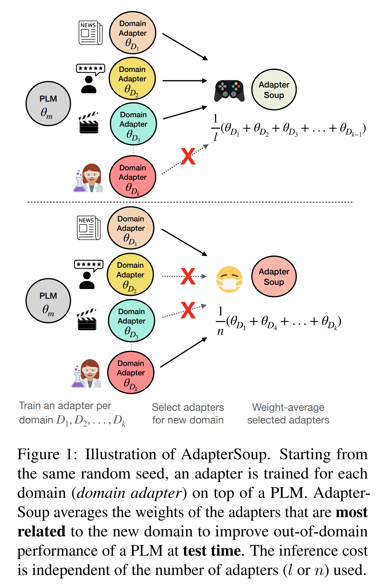
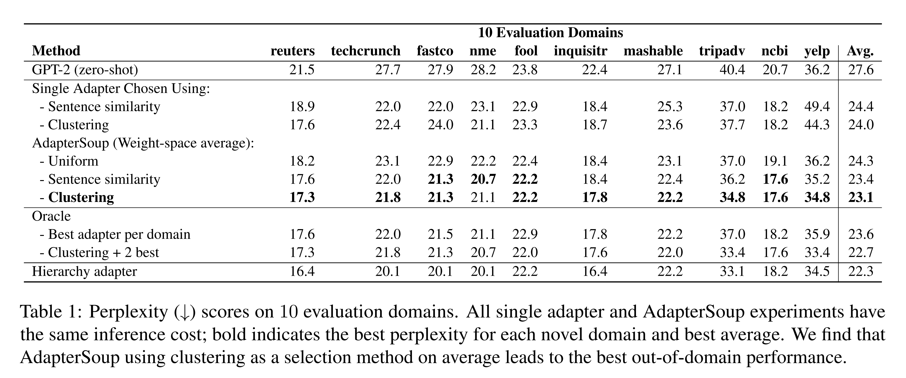
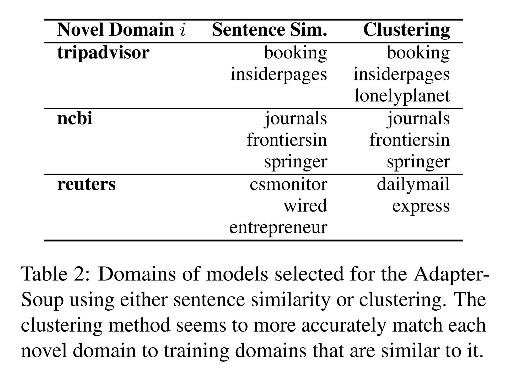
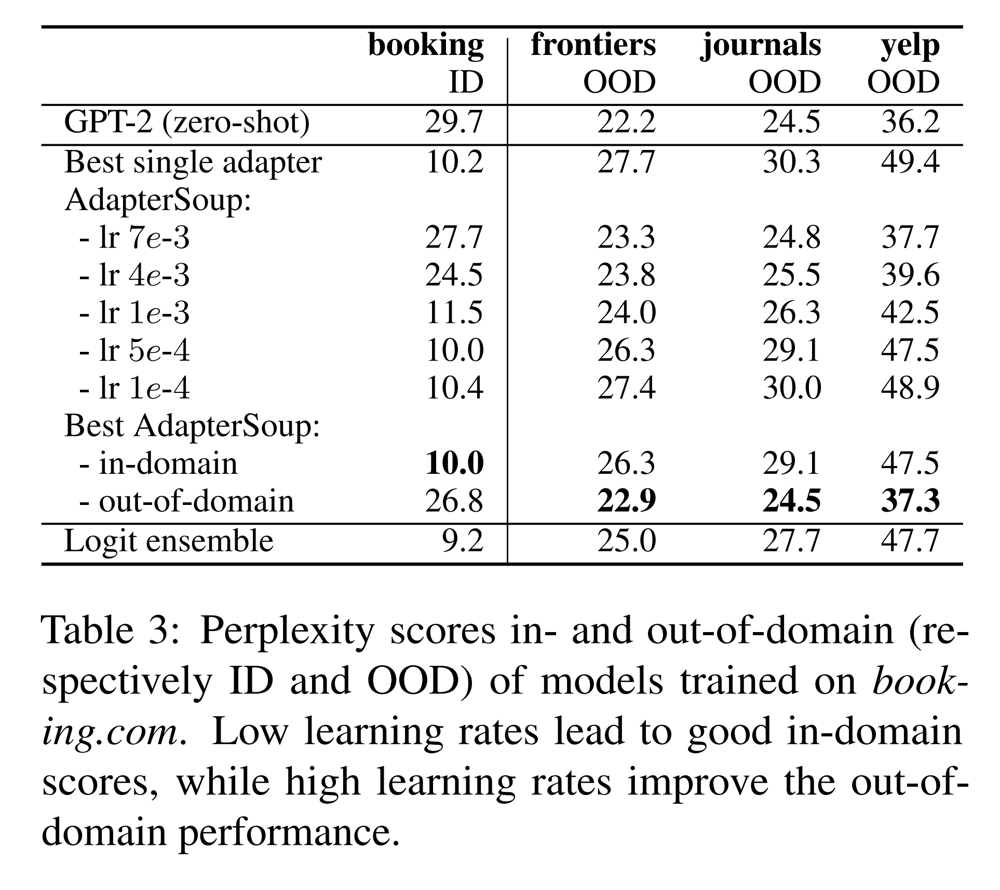

논문 및 이미지 출처 : <https://aclanthology.org/2023.findings-eacl.153.pdf>

# Abstract

Pretrained language models (PLMs) 는 방대한 corpus 에 대해 training 되지만, 특정 domain 에 특화될 필요가 자주 있다. Parameter-efficient adaptation 방법은 각 domain 에 대해 language modeling task 로 adapter 를 training 하는 것을 제안한다. 이는 in-domain 성능을 잘 달성하지만, domain 이나 resource 가 제한된 상황에서는 비현실적일 수 있다. 한 가지 해결책은 test 시점에서 novel domain 에 대해 관련된 domain adapter 를 사용하는 것이다.

이 논문에서는 여러 domain 에 대해 training 된 adapter 의 weight-space averaging 을 수행하는 방법인 **AdapterSoup** 를 제안한다. 저자의 접근법은 병렬화가 매우 쉽다: 먼저 domain-specific adapter 집합을 training 한 뒤, 각 novel domain 에 대해 test 시점에서 어떤 adapter 들을 averaging 할지 결정한다.

광범위한 실험을 통해 AdapterSoup 이 추가 training 없이도 새로운 domain 에서 일관되게 성능을 향상시킨다는 것을 보인다. 또한 동일한 domain 에 대해 다른 hyper-parameter 로 training 된 adapter 들의 weight averaging 도 탐구하며, 이는 PLM 이 novel domain 에서 성능을 유지하면서도 in-domain 에서 강력한 성능을 달성한다는 것을 보여준다.

저자는 어떤 adapter 를 결합할지 선택하는 다양한 접근법을 탐구한다. 예를 들어 text clustering 과 semantic similarity 가 있으며, clustering 을 사용하는 것이 novel domain 에서 가장 경쟁력 있는 결과를 낸다는 것을 발견한다.

# 1 Introduction

Large LMs 는 방대한 data 를 사용하여 self-supervised 방식으로 pre-training 되고 일반 domain 지식을 획득한다. 새로운 domain 에 적응하기 위해 in-domain data 를 사용하여 training 을 계속하는 것이 유용하다는 것이 입증되었다. 모든 parameter 를 fine-tuning 하는 것을 피하기 위해 domain-specific mixtures-of-experts 와 hierarchical domain adapters 와 같은 효율적인 방법들이 제안되었다. 추가적인 in-domain 향상은 weight-space averaging 을 통해 얻을 수 있다. 이러한 동기에 따라, 저자는 추가 training 없이 novel domain 에서 성능을 향상시키기 위해 test 시점에서 weight-space averaging 을 사용할 것을 제안한다.

저자의 접근법인 **AdapterSoup** 은 

* parameter update 없이 test 시점에서 novel domain 성능을 향상시키기 위해 weight space 에서 adapter 를 ensemble 한다. 
* 이를 위해 PLM 위에 각기 다른 domain 에 대해 adapter 를 training 한다. 그런 다음, test 시점에서 각 novel domain 에 어떤 adapter 를 사용할지를 선택하는 여러 방법을 비교하고, text clustering 을 사용하여 선택된 model 의 weight-space averaging 을 제안한다. 
* AdapterSoup 은 novel domain 에서 성능을 향상시킴을 확인한다. 또한 동일한 domain 에 대해 서로 다른 hyper-parameter 설정으로 training 된 adapter 의 weight averaging 도 탐구하며, low learning rate 로 training 된 model 을 결합하면 in-domain 점수가 경쟁력 있게 나타나고, high learning rate 로 training 된 model 을 averaging 하면 novel domain 에서 일반적인 PLM 과 유사하게 동작함을 발견한다.

저자의 기여는 다음과 같다:

1. Adapter 를 사용하여 inference 시점에 domain-adapted PLM 을 결합하는 방법을 제안한다. 이 접근법은 novel domain 에서 일관된 향상을 가져온다. AdapterSoup 의 model 을 선택하는 여러 방법을 비교한 결과, text clustering 이 모든 domain 에서 가장 좋은 성능을 제공한다는 결론에 도달한다.
2. 동일한 domain 에 대해 다양한 hyper-parameter 로 적응된 PLM 의 weight-space averaging 을 adapter 를 사용하여 수행한다. 이를 통해 in-domain 점수에서 경쟁력 있는 성능을 달성하면서도 PLM 의 generalization 능력을 보존할 수 있음을 발견한다.

# 2 Proposed Approach

#### Problem Statement

$k$ domains $D_1, ..., D_k$ 에 적응된 PLM 이 있다고 가정할 때, 추가 parameter training 없이 novel domain $D_{k+1}$ 에서 잘 작동하는 model 이 필요하다. 저자는 text 의 출처(i.e., text 가 수집된 website) 를 textual domain 의 proxy 로 사용한다. 이는 Chronopoulou et al. 과 Gururangan et al. 을 따른 것이다.

또한 single domain $D_i$ 에 대해 서로 다른 hyper-parameter 로 fine-tuning 된 PLM 이 있다고 가정하면, 저자는 이러한 fine-tuned model 을 결합하여 in-domain 성능을 확보하면서도 PLM 의 novel domain 에 대한 generalization 능력을 보존하기를 원한다.

## 2.1 Cross-Domain AdapterSoup

Cross-domain AdapterSoup 의 개략도는 Fig. 1 에 제시된다. 

input data $x$ 와 parameter $\theta_m \in \mathbb{R}^d$ 를 가진 PLM $f(x, \theta_m)$ 이 있다고 하자. 여기에 parameter 초기화 $\theta_\alpha$ 를 가진 adapter 를 추가한다. 본 연구에서는 $\theta_\alpha$ 를 adapter 로 parameterize 하지만, 이 방법은 일반적이므로 다른 efficient fine-tuning 방법에도 확장될 수 있다. 저자는 cross-entropy loss 를 이용해 language modeling 을 수행할 때 adapter 만 fine-tuning 하며, PLM 의 parameter $\theta_m$ 는 update 하지 않는다.

PLM 을 adapter 와 함께 domain $D$ 에 대해 hyper-parameter $\phi$ 로 fine-tuning 하여 얻어진 parameter 를 $\theta = \text{FineTune}(\theta_m, \theta_\alpha, \phi, D)$ 라고 하자.

$\phi$ 는 fixed hyper-parameter 설정이라고 가정하고, 저자는 textual domain 만 변화시킨다. 먼저 $k$ training domains 각각에 대해 서로 다른 adapter 를 training 한다. 그런 다음 이들의 weight 를 결합한다:

$$
\text{AdapterSoup}(x) = f\Big(x, \frac{1}{l} \sum_{i=1}^{l} \theta_i \Big), \tag{1}
$$

즉, Sec. 2.3 에서 설명된 방법 중 하나로 선택된 $l$ 개 fine-tuned models 의 parameter 평균을 사용한다 ($l \leq k$). $l = k$ 인 경우, 이 model 은 *uniform soup* 이 된다.

## 2.2 Single-Domain AdapterSoup

이 setup 에서는 single training domain $D$ 에서 잘 작동하면서도 initial PLM $\theta_m$ 의 novel domain 성능을 유지하는 LM 을 학습하고자 한다. 이를 위해 동일한 domain 에 대해 hyper-parameter 설정을 달리하여 adapter 를 training 한다.

$n$ 개 models 각각은 다른 hyper-parameter $\phi_i$ ($i \in 1, ..., n$) 로 최적화된다. 그런 다음 Eq. (1) 에 따라 $l = 3$ 으로 weight-space average 를 계산한다. 이는 logit ensembling 과 유사하지만, PLM 에 추가되는 inference cost 는 single adapter 의 cost 에 불과하다. 반면, logit ensembling 은 adapter 수에 비례하여 inference cost 가 선형적으로 증가한다.

## 2.3 Model Selection for AdapterSoup

이 절에서는 weight-space averaging 으로 AdapterSoup 을 만들 때 어떤 model 조합을 선택할지 설명한다. Novel domain $D_{k+1}$ 에 대한 평가를 위해, Gururangan et al. 및 Li et al. 을 따른 standard practice 로 novel domain $D_{k+1}$ 의 validation data 를 소량 사용한다. Test data 는 보지 않고 오직 test-set evaluation 에만 사용한다.

#### Sentence similarity

Pretrained sentence-BERT 를 사용한다. Sentence-BERT 는 siamese 와 triplet networks 를 활용하여 BERT 를 수정해 sentence embedding 을 학습하는 접근법이다. 각 training domain $D_1, ..., D_k$ 와 novel domain $D_{k+1}$ 에 대해 100 개 문장의 embedding 을 계산한다. 그런 다음 각 $D_1, ..., D_k$ 와 $D_{k+1}$ 의 평균 cosine similarity 를 계산한다. $D_{k+1}$ 과 cosine similarity 가 0.15 이상인 domain 의 model 만 고려하여 similarity 가 높은 순서대로 최대 5 개 adapter 를 AdapterSoup 에 추가한다. Threshold 값으로 3, 5, 10, 15 를 실험했으나, 5 에서 10 으로 확장해도 큰 향상은 없었기 때문에 AdapterSoup 당 최대 5 개 adapter 를 사용했다.

#### Domain clustering

Domain clustering 은 Aharoni 와 Goldberg 의 접근법을 따른다. 각 training domain 에서 100 개 sequence 를 PLM 으로 encoding 하고, 21 개 component (training domain 의 수와 동일) 를 가진 Gaussian Mixture Model (GMM) 을 fitting 하여 domain clustering 을 얻는다. 그런 다음 held-out set 의 100 개 sequence (test-set 평가에는 사용되지 않음) 를 이용하여 가장 가까운 cluster 를 찾는다. $D_{k+1}$ 의 sequence 중 최소 10% 가 domain $D_i$ 의 cluster 로 매핑되면, $D_i$ 에서 training 된 model 을 AdapterSoup 에 포함한다. 가장 많이 매핑된 cluster 순서대로 최대 5 개 adapter 를 추가한다.

#### In-domain

single textual domain (예: booking.com 의 text) 에 대해 가장 잘 작동하는 model 을 선택하기 위해, 서로 다른 hyper-parameter 로 training 된 model 들을 exhaustive 하게 조합한다. 여기서 조합 크기는 3 이다. 각 model 은 learning rate 와 data order 를 다르게 하여 training 되었다. 이들은 domain 당 가장 잘 작동하는 단일 model 및 uniform soup 과 비교된다.

# 3 Experimental Setup

#### Datasets

specific website (e.g., *tripadvisor*) 에서 발견된 text 가 textual domain 의 proxy 로 사용될 수 있다고 가정한다. 저자는 C4 의 공개 버전에서 21 개 training domain 과 10 개 evaluation domain (각각 21 개와 10 개 website 의 text) 을 사용한다. 자세한 내용은 Appendix 에 제시된다. Training domain 의 다양성이 이 setting 에서 중요한 역할을 한다고 가정한다. 저자는 C4 의 100 개 high-resource domain 중 일부를 무작위로 sampling 하였으며, 후속 연구에서는 본 연구와 동시에 공개된 multi-domain language modeling dataset 인 M2D2 를 사용할 수도 있다.

#### Model Architecture

GPT-2 를 사용하며, 구체적으로 HuggingFace library 에서 제공하는 pretrained checkpoint 중 small version 인 gpt2 를 사용한다. 각 Transformer layer 의 feed-forward layer 뒤에 adapter 를 추가한다. 각 training domain 에서 language modeling 을 위해 adapter 만 training 한다. Adapter 는 Bapna 와 Firat 의 architecture 를 따르며, bottleneck size 는 64 이다. Cross-domain AdapterSoup 의 경우 initial learning rate 1e-4 로 모든 model 을 training 한다. Single-domain AdapterSoup 의 경우 Appendix 에 제시된 바와 같이 서로 다른 learning rate 와 data seed 를 사용한다.

# 4 Results

결과는 Tab. 1 에 제시된다. 각 실험에서 저자는 perplexity 와 efficiency 를 모두 평가한다.

## 4.1 Cross-domain

첫 번째 baseline 은 추가 training 이나 parameter 없이 GPT-2 (zero-shot) 를 사용하는 것이다. 이는 모든 다른 접근법보다 perplexity 가 나쁘지만, inference 시 가장 효율적이다.

#### Single Adapters

다음으로 *Sentence similarity* 와 *Clustering* 을 각각 하나의 adapter 만 선택하는 경우 평가한다 (이는 soup size 가 1 인 경우로 볼 수 있다). 이는 novel domain $D_{k+1}$ 과 training domain 간의 유사성을 두 접근법이 얼마나 잘 측정하는지를 평가하는 것이다. 

이 baseline 은 AdapterSoups 와 직접 비교할 수 있는 단일 model 의 성능을 보여준다. 두 접근법 모두 GPT-2 (zero-shot) 보다 훨씬 우수하며, Clustering 이 Sentence similarity 를 능가하여 관련 domain 을 식별하는 데 더 효과적임을 시사한다.

#### AdapterSoup

Soup 에 포함될 model 을 선택하는 방식만 다른 세 가지 AdapterSoup 을 평가한다. 세 가지 모두 inference 효율성은 single adapter 를 사용할 때와 동일하다.

* **Uniform** 은 모든 training model 의 weight 를 평균하는 uniform soup 이다. 이는 GPT-2 (zero-shot) 를 제외한 모든 접근법보다 성능이 나쁘다. 저자는 관련 없는 domain 에서 training 된 adapter 들 간의 negative interference 때문이라고 가정한다.
* Sec. 2.3 에서 설명한 Sentence similarity 를 사용하면, domain 당 single-best adapter 보다 약간 더 나은 점수를 얻는다. 이는 비교적 단순하게 만든 soup 도 최적의 단일 model 보다 성능이 더 좋을 수 있음을 보여준다. 10 개 novel domain 중 8 개에서 Sentence similarity AdapterSoup 이 Sentence similarity 로 선택된 single adapter 보다 성능이 뛰어나며, 이는 soup 이 더 나은 성능을 가져온다는 것을 의미한다.
* Sec. 2.3 에서 설명한 Clustering 을 사용하면, 10 개 novel domain 중 8 개에서 perplexity 가 Sentence similarity 보다 개선된다. 이는 soup 을 구성할 model 선택 방법이 큰 영향을 미친다는 것을 보여준다. 또한 10 개 novel domain 중 9 개에서 Clustering AdapterSoup 이 Clustering 으로 선택된 single adapter 보다 성능이 뛰어나, 제안한 접근법이 더 나은 결과를 낸다는 것을 입증한다.

#### Oracle Experiments and Larger Models

Domain 당 best adapter 는 각 novel domain 에서 single adapter 의 upper bound 성능을 보여준다. Clustering 으로 선택된 Single Adapter 는 10 개 novel domain 중 3 개에서 이 점수와 일치하며, 나머지 domain 에서도 근접해 clustering 접근법이 합리적으로 잘 작동함을 보여준다. Clustering + 2 best 는 clustering 으로 생성된 AdapterSoup 에 oracle best model 두 개를 추가한 결과이다. Clustering 접근법이 이에 근접한 점수를 보이지만, AdapterSoup 의 model 선택을 더 개선할 여지가 있음을 의미한다. Hierarchy adapter (Chronopoulou et al.) 는 data 와 parameter 효율성 모두에서 덜 효율적이다.

#### Selecting Models for the Soup

Tab. 2 에서는 세 가지 novel domain 에 대해 AdapterSoup 에 포함될 adapter 선택 방법을 정성적으로 비교한다. 

* Tripadvisor 의 경우, Sentence similarity 와 Clustering 이 선택한 domain 중 2/3 가 동일하다. 
* Ncbi (science domain) 의 경우, 두 접근법이 동일한 domain 을 선택한다. Reuters (news) 의 경우, Clustering 은 news domain 을 선택해 잘 맞는 결과를 보이지만, Sentence similarity 는 novel domain 과 덜 관련된 domain 을 선택한다. 
* Reuters 는 heterogeneous data 를 포함하므로, sentence 수준에서의 평균 cosine similarity 는 관련 domain 을 찾는 적절한 metric 이 되지 못한다.

## 4.2 Single-domain

이 절에서는 동일한 domain 에 대해 training 된 model 들을 AdapterSoup 으로 어떻게 결합할 수 있는지를 평가한다. 저자는 booking.com domain 에 대해 adapter 를 사용하여 여러 model 을 training 하되, data order 와 learning rate 를 다르게 설정한다 (Appendix A.3 참고, 모든 실험에서 각 adapter 의 initialization 은 고정하였다). 그런 다음 size 3 의 adapter 조합을 모두 평가하고, AdapterSoup 의 성능을 in-domain (booking.com) 과 3 개 held-out domain 에 대해 측정한다.

저자는 이 통제된 setting 을 통해 Wortsman et al. 에서 설명된 setup 을 더 잘 이해하고자 한다. Wortsman et al. 은 learning rate 가 중요한 역할을 한다고 언급했으며, 작은 learning rate 가 더 나은 model soup 을 만든다는 결과를 제시하였다.

저자의 실험 결과는 Tab. 3 에 제시되며, 더 미묘한 양상을 보인다:

* 작은 learning rate (5e-4) 로 training 된 adapter 들로 구성된 AdapterSoup 은 in-domain 에서 가장 좋은 성능을 보였다 (Wortsman et al. 의 결과를 확인).
* 그러나 large learning rate (7e-3, 4e-3, 7e-4) 로 training 된 adapter 들로 구성된 AdapterSoup 은 novel domain 에 더 잘 generalize 하였다.

각 adapter 는 동일한 update 횟수를 가지며 initialization 도 동일하므로, 저자는 작은 learning rate 로 만들어진 AdapterSoup 은 gradient descent 의 step 평균과 유사하게 작동하여 local optimum 에 더 가까운 model 을 만든다고 가정한다. 반면, large learning rate 가 novel domain 으로의 generalization 을 더 잘 만드는 이유는, AdapterSoup 내 각 model 이 initialization 으로부터 더 멀리 이동하여 보다 다양한 representation 을 학습하기 때문이라고 가정한다. 이에 대한 추가 탐구는 향후 연구로 남긴다.

# 5 Related Work

Large model 을 처음부터 training 하는 것은 막대한 computation 비용과 환경적 비용을 발생시킨다. 따라서 mixtures-of-experts (MoE), adapters, LoRA layers 와 같은 efficient 방법들이 최근 제안되었다. Adapters 와 MoE 는 domain adaptation 에서 잘 작동하는 것으로 나타났다. Hierarchy adapter 는 저자의 접근법보다 더 나은 성능을 내지만, 비용이 상당히 크다. Kaplan et al. 을 따를 때, $L$ 개 layer, dimension $d_{model}$, adapter bottleneck size $d$, 평균 tree depth $T$ (hierarchy adapter 논문에서는 $T=8$) 인 model 에 대해 GPT-2 실행 비용에 더해 $4Ld_{model}dT$ 의 training cost 가 추가된다. 반면, AdapterSoup 은 $4Ld_{model}d$ flops 만 필요하다. 결과적으로 hierarchy adapter 의 training 은 저자의 접근법보다 $T$ 배 느리다. Inference 시 hierarchy adapter 는 tree 의 2 path 를 활성화하여 $4Ld_{model}dT \times 2$ 의 비용을 요구하므로, inference 또한 저자의 접근법보다 $2T$ 배 느리다.

동일한 task 에 대해 독립적으로 fine-tuning 된 model 들의 weight 를 averaging 하면 in-domain 성능이 개선된다는 것이 알려져 있다. Matena 와 Raffel 은 intermediate task training 을 피하기 위해 fine-tuned PLM 의 weight 를 Fisher merging 으로 average 한 뒤 downstream fine-tuning 을 수행했다. Wang et al. 은 downstream task 에서 adapter 를 사용하여 MoE 를 fine-tuning 하고, test 시 weight 를 averaging 했다. 그러나 저자의 논문은 novel domain 에서 test-time 성능을 향상시키는 데 초점을 맞춘다.

Wang et al. 은 보지 못한 (target) 언어에서 성능을 높이기 위해 source language adapter 와 target 언어와 유사한 language adapter 를 ensemble 했다. 이 접근법은 adapter 의 output 을 weighted ensembling 하는 반면, 저자는 adapter 의 weight 를 ensemble 한다. AdapterSoup 은 single adapter 의 inference cost 만 필요하지만, Wang et al. 의 접근법은 adapter 수에 선형적으로 비례하는 inference cost 를 요구한다.

동시대 연구인 Li et al. 은 novel domain 성능을 weight averaging 으로 탐구했으나, adapter 대신 MoE 를 사용했다.

# 6 Conclusion

PLM 은 adapter 를 사용하여 새로운 domain 에 적응할 수 있다. 그러나 이는 domain 마다 새로운 adapter set 을 training 해야 한다. 저자는 text clustering 으로 선택된 adapter 들의 weight-space averaging 에 기반한 방법을 제안한다. 이 접근법은 parameter update 나 inference cost 증가 없이 novel domain 성능을 향상시킨다. 향후 연구에서는 oracle 실험 성능에 근접하기 위해 더 정교한 selection 방법을 탐구할 수 있다.

# Limitations

본 연구에서 저자의 접근법이 다른 접근법(예: baseline)과 어떻게 비교되는지에 대한 결론은 C4 dataset 에서 얻은 textual domain 을 사용한 language modeling task 의 증거에만 근거한다. 이러한 결과가 더 일반적으로 성립할 것이라 예상되지만, 다른 시나리오를 뒷받침할 실험적 증거는 없다. Language modeling 연구와 마찬가지로, 저자가 training 한 model 은 language 를 생성하는 데 사용될 수 있으나, 생성된 text 의 평가(예: fluency, factuality, 기타 일반적인 언어 생성 평가 metric) 는 수행하지 않았다. 본 논문은 adapter 사용에 초점을 맞춘다. 저자는 유사한 접근법이 다른 종류의 model 에도 작동할 것으로 예상하지만, AdapterSoup 이 adapter 에서 잘 작동한다는 증거만 보유하고 있다.

