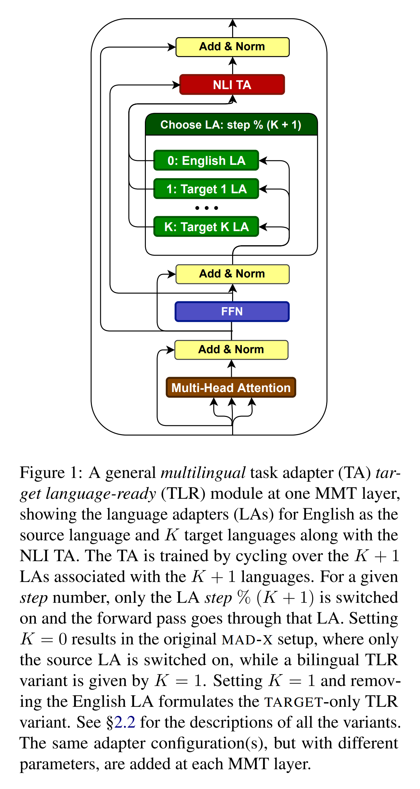
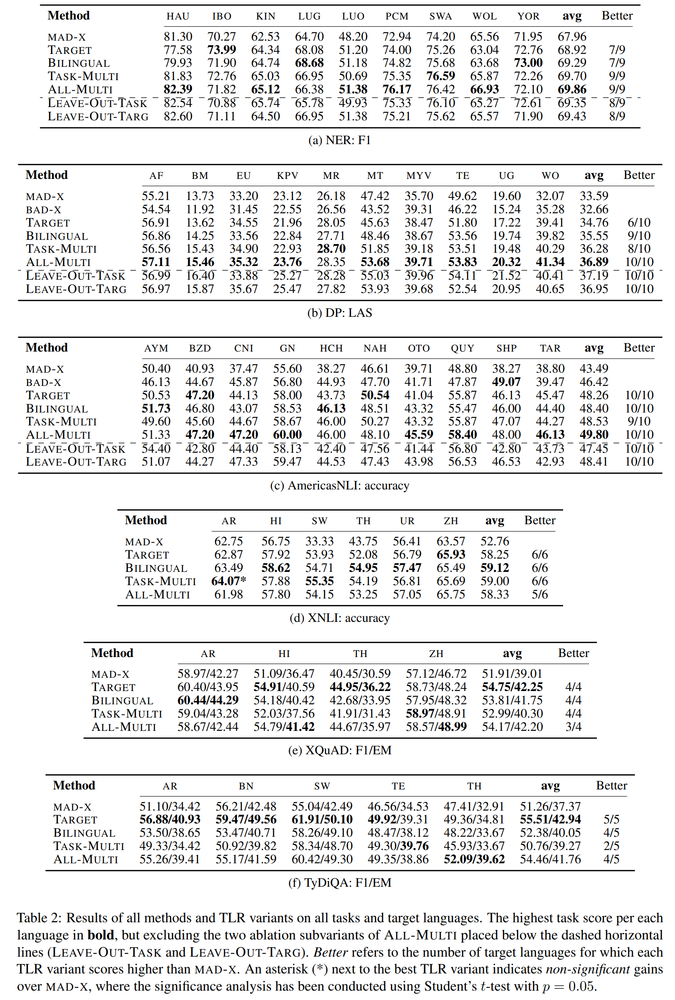
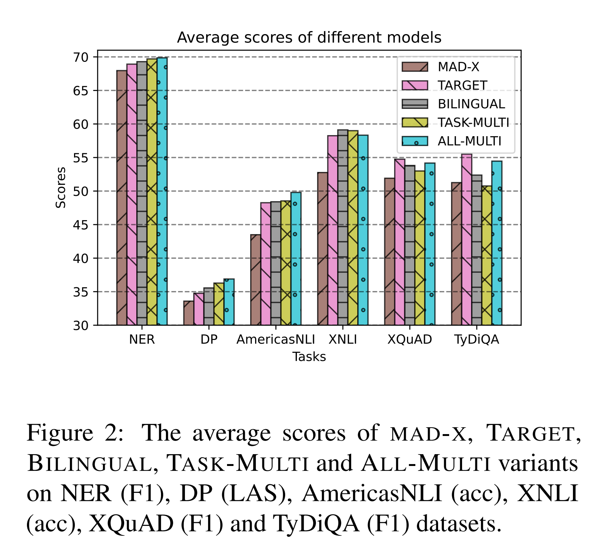
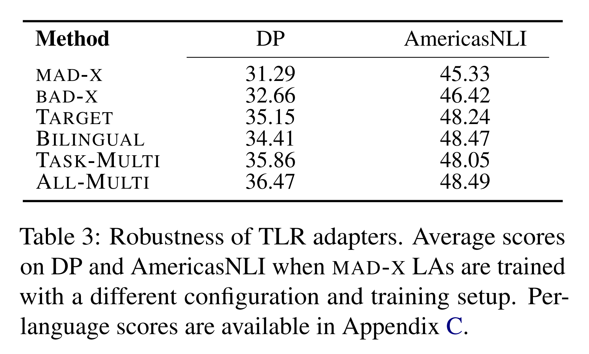
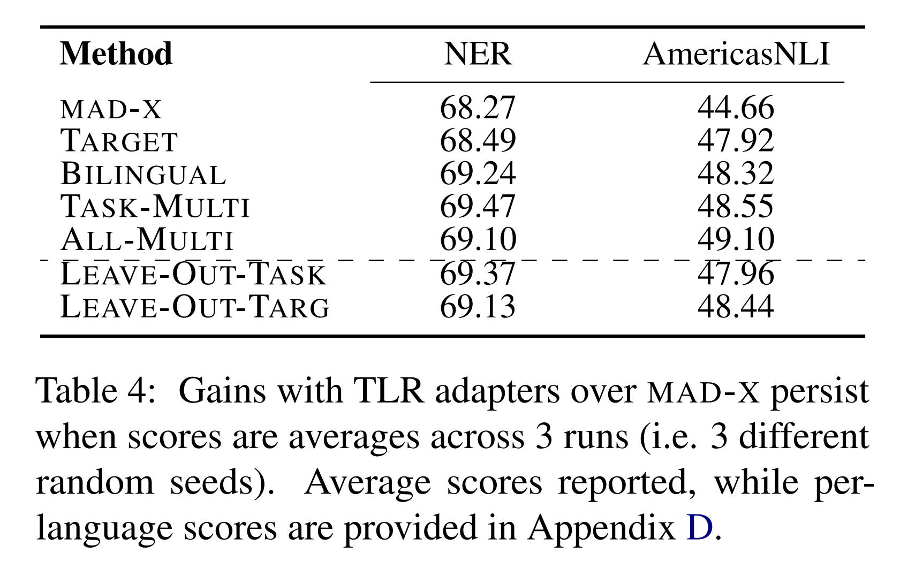
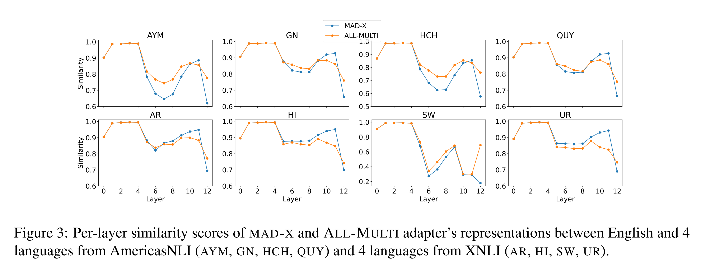

논문 및 이미지 출처 : <https://aclanthology.org/2023.findings-acl.13.pdf>

# Abstract

Adapter 는 (zero-shot) cross-lingual transfer 를 위한 모듈형이면서 parameter-efficient 한 접근법으로 등장했다. 기존의 MAD-X framework 는 lanugage adapter 와 task adapter 를 분리하여 어떤 task 를 어떤 target language 로도 임의로 결합해 transfer 할 수 있게 한다. 이후 MAD-X framework 를 확장한 BAD-X 는 source-target language 쌍에 특화된 ‘bilingual’ adapter 를 생성함으로써 transfer 성능은 향상시키지만, MAD-X 의 모듈성을 희생한다.

본 연구에서는 두 접근의 장점을 모두 취하는 것을 목표로 한다. 즉,  
(i) target language 에 적응된 task adapter, 이른바 ‘target language-ready (TLR)’ adapter 를 fine-tuning 하여 high transfer 성능을 유지하면서도,  
(ii) MAD-X 의 높은 모듈형 설계를 희생하지 않는 것이다.  

* ‘target language-ready’ adapter 의 핵심 아이디어는 MAD-X 의 training-vs-inference 불일치를 해결하는 데 있다. 
  * 즉, task adapter 는 inference 시점에서 처음으로 target language adapter 를 접하게 되며, 이 때문에 완전히 호환되지 않을 수 있다. 
* 저자는 이 불일치를 해결하기 위해 task adapter 가 training 과정에서 target language adapter 에 노출되도록 하였으며, 이 아이디어의 여러 변형을 실험적으로 검증하였다. 
* 가장 단순한 형태에서는 task adapter training 중 source 와 target language adapter 를 번갈아 사용하며, 더 일반적으로는 어떤 언어 adapter 집합에 대해서도 cycle 할 수 있다.

저자는 standard cross-lingual benchmark 들의 집합을 통해 다양한 수준의 일반성을 가진 여러 TLR 기반 transfer 설정을 평가하였으며, 그 결과 가장 일반적이면서 따라서 가장 모듈적인 설정이 대부분의 task 와 language 에서 MAD-X 와 BAD-X 를 일관되게 능가한다는 것을 확인하였다.

# 1 Introduction and Motivation

최근 multilingual NLP 의 발전은 주로 mBERT, XLM-R, mT5 와 같은 massively multilingual Transformer (MMT) model 에 의해 주도되었다. 이들은 100 개 이상의 언어에 대한 unlabeled data 로 학습되었으며, shared multilingual representation space 를 통해 zero-shot cross-lingual transfer 를 가능하게 한다. 즉, specific task 에 대해 training data 가 전혀 없는 언어에서도 어느 정도 정확도를 보이며 수행할 수 있게 한다.

Zero-shot cross-lingual transfer 는 일반적으로 pretrained MMT 를 high-resource source language (e.g., 영어) 의 task-specific data 로 fine-tuning 한 뒤, 이를 target language 의 task prediction 에 직접 적용하는 방식으로 수행된다. 이때 target language 에 대한 model 의 knowledge 는 pretraining 단계에서만 획득된다. Transfer 성능을 향상시키기 위해 fine-tuning 이전에 target language 의 unlabeled data 로 fine-tuning 을 수행할 수도 있다. 그러나 이러한 경우에도 target language 에서의 성능은 source language 보다 낮으며, 이 차이는 cross-lingual transfer gap 으로 알려져 있다. 특히 transfer gap 은 low-resource target language 나 source language (e.g., 영어) 와 typologically 더 먼 언어에서 크게 나타난다.

Adapter 는 zero-shot cross-lingual transfer 를 지원하기 위한 주요 접근법으로 등장하였다. Adapter 의 장점은 다음과 같다.

(i) target language 를 위한 추가 representation capacity 를 제공한다.  
(ii) full-model fine-tuning 과 비교해 훨씬 더 parameter-efficient 하며, MMT 의 parameter 를 수정하지 않고 유지하기 때문에 pretraining 단계에서 획득한 multilingual knowledge 를 보존할 수 있다.  
(iii) 지식의 다양한 측면을 학습하고 저장하는 데 있어 modularity 를 제공한다. 이 속성 덕분에 adapter 는 결합을 통해 더 나은 성능을 얻을 수 있으며, 이미 fine-tuning 된 module (e.g., language adapter) 을 다른 응용에 재사용할 수 있다.

기존 adapter-based cross-lingual transfer framework 인 MAD-X 는 language adapter (LA) 와 task adapter (TA) 를 분리하여 학습하고, 이후 이를 임의로 결합해 어떤 task 도 어떤 language 로 transfer 할 수 있다. 그러나 high modular design 을 가졌음에도 불구하고 MAD-X 의 TA 는 target language 에 대한 ‘adaptivity’가 부족하다. 즉, MAD-X 의 TA 는 task fine-tuning 시 오직 source language LA 에만 노출되며, target language LA 와 해당 언어의 예시는 inference 단계에서 처음으로 접한다. 이로 인해 TA 와 target LA 사이에 inference 시점에서 비호환성이 발생할 수 있다.

BAD-X 는 MAD-X 의 high modularity 를 희생하고, source-target language pairs 에 특화된 ‘bilingual’ LA 를 도입한다. 이러한 transfer 방향 특화는 성능을 향상시키지만, modularity 감소로 인해 larger computation cost 를 초래한다. BAD-X 는 관심 있는 모든 언어 쌍마다 dedicated bilingual LA 를 fine-tuning 해야 하고, 이어서 각각의 쌍마다 dedicated TA 도 다시 fine-tuning 해야 한다.

이전 연구에서는 target language 를 training 시점에 노출하는 specialization 이 TA 수준에서만 이루어지면서도 LA 수준에서 modularity 를 유지할 수 있는지 탐구하지 않았다. 가장 단순한 bilingual setup 에서조차 specific target language 마다 dedicated TA 를 fine-tuning 해야 한다. 그러나 이는 이미 BAD-X 보다 실용적인데, 그 이유는 TA 가 LA 보다 훨씬 더 적은 computation cost 로 학습할 수 있기 때문이다. 더 나아가 본 연구에서는 TA fine-tuning 을 더 많은 target language 로 확장할 수 있음을 보이며, bilingual specialization 에서 multilingual ‘exposure’ 로 나아가 language-universal TA 에 도달할 수 있음을 증명한다.

본 연구의 목표는 MAD-X 에서 영감을 받은 modular design 을 유지하면서도 target language 하나 이상에 대한 exposure 의 이점을 얻는 것이다. 이를 위해 저자는 specific target language 또는 larger target language set 에서 뛰어난 성능을 발휘하도록 설계된 target language-ready (TLR) task adapter 를 제안한다. 가장 단순한 bilingual variant 에서 TLR TA 는 source LA 와 target LA 를 번갈아 사용하며 학습되며, 더 일반적인 버전에서는 임의의 LA 집합에 대해 cycling 할 수 있다. TLR TA 를 생성하기 위해서는 LA 의 비싼 retraining 이나 대체 학습이 필요하지 않다.

저자는 zero-shot cross-lingual transfer 와 low-resource language 에 초점을 맞춘 다양한 표준 benchmark 를 대상으로 실험을 수행하였다. 실험은 다음과 같다.

1. MasakhaNER 에서의 NER
2. Universal Dependencies 에서의 dependency parsing (DP)
3. AmericasNLI 및 XNLI 에서의 natural language inference (NLI)
4. XQuAD 및 TyDiQA-GoldP 에서의 QA

실험 결과, TLR TA 는 모든 task 에서 평균적으로 MAD-X 와 BAD-X 를 능가하였으며, 대부분의 target language 에서 일관된 성능 향상을 보였다. 특히 가장 일반적인 TLR TA 는 모든 target language 에 공유되므로 modularity 와 reusability 를 크게 향상시키며, 대부분의 task 와 target language 에서 가장 강력한 성능을 나타냈다. 또한 multilingual setup 에서 TA 를 fine-tuning 하는 것은 multilingual regularization 으로 작용한다. 즉, TA 는 여러 target language 에 노출되면서 TLR 속성을 유지하는 동시에 단일 target language 에 과적합되지 않고, 더 많은 언어에 적응해야 하므로 보다 보편적인 cross-language feature 를 학습한다.

# 2 Methodology

## 2.1 Background

#### Adapters

MAD-X 와 BAD-X 를 따라, 본 연구에서는 가장 일반적인 adapter 구조인 *serial adapter* 에 초점을 맞춘다. 다만 cross-lingual transfer 맥락에서는 다른 adapter 선택지도 존재할 수 있다. Serial adapter 는 lightweight bottleneck module 로서 각 Transformer layer 내에 삽입된다. Adapter 의 구조는 down-projection, non-linearity, up-projection, 그리고 residual connection 으로 이루어진다.

Layer $l$ 의 down-projection 을 matrix $D_l \in \mathbb{R}^{h \times d}$, up-projection 을 matrix $U_l \in \mathbb{R}^{d \times h}$ 라 하자. 여기서 $h$ 는 Transformer 의 hidden size, $d$ 는 adapter 의 hidden size 이다. Layer $l$ 의 hidden state 와 residual 을 각각 $h_l$, $r_l$ 이라 하면, layer $l$ 의 adapter 연산은 다음과 같이 정의된다.

$$
A_l(h_l, r_l) = U_l(\text{ReLU}(D_l(h_l))) + r_l
\tag{1}
$$

여기서 ReLU 는 activation function 이다.

#### MAD-X and BAD-X Frameworks

MAD-X 는 dedicated LA 와 TA 를 학습한다. LA 는 Wikipedia unlabeled data 로 masked language modeling (MLM) objective 를 통해 학습된다. TA 는 source language 의 task-specific data 를 이용해 학습되며, 이때 source language LA 위에 쌓아올리고 LA 는 freeze 한다. 이후 target language $L_t$ 에서 prediction 을 수행할 때는 source language $L_s$ 의 LA 를 target language LA 로 교체한다.

BAD-X 는 monolingual adapter 기반인 MAD-X 와 달리 bilingual LA 를 학습한다. Bilingual LA 는 $L_s$ 와 $L_t$ 의 unlabeled data 를 모두 활용해 학습되며, 그 위에 쌓아올린 상태로 TA 는 $L_s$ 의 task-specific data 로 학습된다. 이후 $L_t$ 에서 inference 시에도 동일한 구성을 유지한다. 이는 bilingual LA 가 이미 $L_s$ 와 $L_t$ 모두를 학습했기 때문이다.

## 2.2 Target Language-Ready Task Adapters

BAD-X 처럼 LA 의 modularity 를 희생하기보다는, MAD-X 의 language-specific LA 를 유지하면서 TA 만 specific target language $L_t$ 혹은 다수의 target language 에 대해 잘 동작하도록 준비하는 것이 더 효과적일 수 있다. Source language $L_s$ 와 $K$ 개의 target language $L_{t,i}, i = 1, \dots, K$ 에 대한 LA 가 있다고 가정하자. 저자는 TA 학습 중 $K+1$ 개의 LA 를 모두 cycle 하도록 하여 multilingual TLR TA 를 학습한다. 이 일반적인 아이디어는 Fig. 1 에서 설명된다.

Bilingual variant 는 source LA 와 target LA 를 번갈아가며 TA 를 학습하는 경우이며, 이는 multilingual variant 에서 $K=1$ 인 특수한 경우이다. 반면, MAD-X 의 원래 설정은 $K=0$ 일 때 얻어진다.

이 절차는 TA 가 fine-tuning 단계에서 이미 target language (bilingual TLR TA) 또는 여러 target language (multilingual TLR TA) 에 노출되도록 하여, inference 단계에서 단일 $L_t$ LA 와 결합될 때 더 잘 준비되도록 만든다.

#### TLR Variants

* **BILINGUAL TLR TA**
  BAD-X 로부터 자연스럽게 도출되는 접근이며, 고정된 $L_s$ 와 $L_t$ 쌍에서의 transfer 에 적합하다.
* **TARGET-only TLR TA**
  TA 를 오직 target LA 위에서만 학습하는 방식이다. 특히 충분한 corpus 로 학습된 high-resource language 에 효과적일 수 있으며, source 와 pairing 하는 것이 오히려 해가 될 수 있다. 이는 $L_s$ 와 typologically 멀거나 vocabulary overlap 이 부족한 high-resource $L_t$ 에서 뚜렷이 나타날 수 있다.

TARGET 및 BILINGUAL TLR TA 는 각 target language 마다 dedicated TA 를 학습해야 하므로, MAD-X 보다 computation 효율이 낮고 parameter 수도 더 많아진다.

이를 완화하기 위해 **MULTILINGUAL TLR TA** 를 고려한다.

* **TASK-MULTI TLR**
  Source language 와 해당 task 의 모든 target language 집합에서 학습된다 (e.g., MasakhaNER dataset 에 포함된 모든 언어).
* **ALL-MULTI TLR**
  Source language 와 여러 task dataset 의 모든 target language 를 함께 학습한다 (e.g., MasakhaNER, AmericasNLI 등 모든 언어).

이들 variant 는 modularity 와 parameter efficiency 를 높여, 각 task 별로 MAD-X 만큼이나 효율적이면서도 여러 target language representation 에 노출된다. 이는 TLR TA 가 더 robust 해지도록 만들며, multilinguality 가 regularization 으로 작용해 TA 가 보편적인 cross-language feature 에 집중하게 한다.

# 3 Experimental Setup

#### Evaluation Tasks and Languages

저자는 제안한 TLR adapter framework 를 standard cross-lingual transfer benchmark 집합에서 종합적으로 평가하였다. 이들은 네 가지 task 계열 (NER, DP, NLI, QA) 에 걸쳐 있으며, 총 여섯 개 dataset 과 35 개 target language 를 포함한다. 언어는 typologically 와 geographically 모두 다양한 표본으로, low-resource 와 high-resource language 를 모두 포함한다.

* **NER**: MasakhaNER dataset 을 사용하며, 이는 아프리카 대륙의 10 개 low-resource language 를 포함한다.
* **DP**: Universal Dependencies 2.7 을 사용하며, BAD-X 에서 활용된 typologically 다양한 10 개 low-resource language 를 그대로 따른다.
* **NLI**: AmericasNLI dataset (10 개 아메리카 지역 low-resource language) 과 XNLI 의 일부 언어 subset 을 사용한다.
* **QA**: XQuAD 와 TyDiQA-GoldP 의 subset 을 사용한다.

XNLI, XQuAD, TyDiQA-GoldP 의 subset 은  
(i) low-resource language 와  
(ii) dedicated LA (MAD-X LA) 를 바로 활용할 수 있는 high-resource language 를 결합하도록 선택되었다. 

전체 task, dataset, language 와 language code 의 개요는 Appendix A 의 Tab. 5 에 제시된다.

#### Underlying MMT

모든 task 에 대해 mBERT 를 사용하며, 이는 104 개 언어의 Wikipedia 로 pretrained 되었다. 기존 연구에 따르면 mBERT 는 진정한 low-resource language 에 대해 더 좋은 성능을 보이는 MMT 로 알려져 있다. 또한 TLR adapter 의 robustness 를 검증하기 위해 일부 task 에서는 XLM-R 도 사용하였다.

#### Language Adapters

LA 학습은 최소 100 epoch 또는 100,000 step 동안 수행되며, batch size 는 8, learning rate 는 $5 \cdot 10^{-5}$, maximum sequence length 는 256 이다. Low-resource language 는 1,000 step 마다, high-resource language 는 5,000 step 마다 평가하며, held-out monolingual data 의 5% (high-resource 는 1%) 에 대해 perplexity 가 가장 낮은 checkpoint 를 선택한다. BAD-X baseline 의 경우, 기존 연구에서 제공된 bilingual LA 를 그대로 사용한다.

Adapter reduction factor (MMT hidden size 대비 adapter bottleneck size 비율) 는 모든 LA 에 대해 2 로 설정된다. MAD-X LA 는 invertible adapter 를 포함하는 Pfeiffer adapter configuration 을 사용하며, BAD-X LA 는 이를 포함하지 않는다.

#### Task Adapters

TA 는 대응하는 LA 위에 쌓아올려 fine-tuning 하며 (Sec. 2.2 의 Fig. 1 참조), fine-tuning 동안 MMT 와 LA 의 parameter 는 freeze 된다. 모든 TA 의 adapter reduction factor 는 16 으로 설정되며 ($d=48$), LA 와 마찬가지로 Pfeiffer configuration 을 따른다.

* Task 별 hyperparameter 는 Tab. 1 에 제시되며, QA TA 학습 시에는 early stopping (4 cycle) 을 사용한다. 즉, F1 score 가 연속 4 번 evaluation cycle 동안 향상되지 않으면 학습을 중단한다. 
* TyDiQA-GoldP 학습에는 영어 SQuAD v1.1 training data 를 사용하였다. 그 이유는  
  (i) TyDiQA 원본 training set 보다 훨씬 크고,  
  (ii) preliminary experiment 에서 target language 에 대해 더 높은 성능을 보였기 때문이다.

#### Transfer Setup: Details

모든 transfer 실험에서 source language $L_s$ 는 영어로 고정된다. 평가되는 variant 는 Sec. 2.2 에서 설명한 것들을 따른다.

* MAD-X baseline 은 ‘MAD-X v2.0’ variant 를 사용하며, 이는 Transformer 마지막 layer 의 adapter 를 제거한 것으로, transfer 성능을 전반적으로 향상시키는 것으로 보고되었다.
* **TASK-MULTI TLR**: 영어 LA 와 함께 해당 dataset 의 모든 evaluation language 의 LA 를 사용해 TA 를 fine-tuning 한다. 예를 들어, DP 의 경우 10 개 언어를 포함하며, NLI 의 경우 AmericasNLI 10 개 언어와 XNLI subset 언어 각각에 대해 별도의 TASK-MULTI TLR 을 학습한다.
* **ALL-MULTI TLR**: 영어 LA 와 더불어 모든 task 와 dataset 의 evaluation language LA 를 cycle 하며 학습한다.

# 4 Results and Discussion

#### Main Results

모든 task 와 language 에 대한 mBERT 기반 주요 결과는 Tab. 2 에 제시되며, 평균값은 Fig. 2 에 요약되어 있다. 

추가적인 XLM-R 결과는 Appendix B 에 제공된다. 전반적인 경향으로, 제안된 모든 TLR variant 가 모든 task 와 대부분의 target language 에서 MAD-X 보다 우수한 성능을 보였다.

Task 별 best TLR variant 는 MAD-X 를 다음과 같이 능가한다:

* NER: 9/9
* DP: 10/10
* AmericasNLI: 10/10
* XNLI: 6/6
* XQuAD: 4/4
* TyDiQA: 5/5

또한 BAD-X LA 를 직접 활용할 수 있었던 DP 와 AmericasNLI 에서도, modularity 가 훨씬 낮은 BAD-X 보다 성능 향상을 보였다. 요약하면, Tab. 2 의 포괄적 결과는 typologically 다양한 target language 와 dataset 에 걸쳐 TLR adapter 의 효과성과 범용성을 확증한다.

#### Breakdown of Results across Tasks and TLR Variants

* **NER 및 DP**
  두 task 모두 유사한 경향을 보인다. 특히 가장 modular 한 **ALL-MULTI** variant 가 전반적으로 가장 높은 성능을 보였다.  
  예를 들어, NER task 에서 평균 F1 score 69.86% 를 기록하며, MAD-X 대비 평균 1.9% 향상과 모든 9 개 target language 에서의 우위를 보였다.  
  DP task 에서도 뚜렷한 성능 향상을 확인할 수 있었다. TARGET 및 BILINGUAL variant 역시 대부분의 언어에서 이득을 보였으며, BILINGUAL 이 TARGET 보다 강력했다. 그러나 modularity 와 성능 모두에서 ALL-MULTI 대비 효용은 낮았다.
* **AmericasNLI**
  모든 TLR variant 가 MAD-X 대비 평균 정확도 5–6% 향상을 보였으며, 10 개 target language 중 AYM (TASK-MULTI variant) 를 제외한 모든 언어에서 MAD-X 를 능가했다. 가장 좋은 결과는 역시 가장 modular 한 **ALL-MULTI** variant 로, 10 개 언어 중 6 개에서 baseline 과 다른 variant 모두를 초과했다.
* **XNLI**
  AR, HI, ZH 와 같은 high-resource language 를 포함한 setup 에서, 모든 TLR variant 가 MAD-X 대비 더 높은 평균 정확도를 보였다. 평균 향상폭은 약 5–6% 이며, 이는 주로 MAD-X 가 완전히 실패한 SW (random choice 수준) 에 기인한다.  
  그러나 SW 를 제외한 다른 언어에서도 대부분 향상을 보였다 (유일한 예외는 AR 에서의 ALL-MULTI). TH 에서는 BILINGUAL variant 가 11.2% 까지 큰 향상을 보였으며, 나머지 언어에서는 최대 2% 정도의 modest gain 이 있었다. 이 경우 BILINGUAL variant 가 가장 높은 평균 정확도를 기록했는데, 이는 target language 들이 MasakhaNER 및 AmericasNLI 에 비해 상대적으로 high-resource 이기 때문일 수 있다.
* **QA (XQuAD, TyDiQA-GoldP)**
  QA task 역시 TLR adapter 의 transfer 효과를 입증한다. 두 QA dataset 에서 best TLR variant 는 **TARGET** adapter 였다.  
  이는 mBERT 와 subword vocabulary 내에서 AR, HI, ZH 와 같은 high-resource language 가 잘 표현되어 있기 때문일 수 있다. 그러나 TyDiQA 의 BN, SW 와 같은 low-resource language 에서도 TARGET 의 향상이 관찰되었으며, 이는 QA task 의 복잡성이 NER, NLI 등 다른 task 와 비교해 더 큰 역할을 했음을 시사한다.

종합적으로, 가장 modular 한 **ALL-MULTI TLR** variant 는 task 별로 단일 TA 만 학습하면 되며, 모든 task (QA 포함) 와 high-resource 및 low-resource language 모두에서 안정적이고 강력한 성능을 보였다.

#### Towards Language-Universal Task Adapters?

엄밀히 말해, 저자가 제안한 TLR framework 에 새로운 $(K+1)$번째 target language 가 도입될 경우, 해당 언어에 노출되도록 multilingual TLR TA 를 새롭게 학습해야 한다. 그러나 실제로는 massively multilingual TA 가 TA fine-tuning 시점에서 ‘보지 못한(unseen)’ 언어에도 적용될 수 있다. 이는 본래 MAD-X framework 가 동작하는 방식과 동일하다. 물론 이는 TLR 의 가정을 위반하는데, TA 가 target language 를 inference 단계에서만 처음 접하기 때문이다. 하지만 Fig. 1 에 제시된 multilingual TLR framework 의 또 다른 바람직한 속성을 실험적으로 검증할 수 있다. 즉, TA 가 fine-tuning 단계에서 다수의 언어 (및 해당 LA) 에 노출되면, 보지 못한 언어에 대해서도 transfer capability 가 개선될 수 있다는 점이다. 요약하면, TA 는 단일 target language 나 소수의 언어에 overfit 하지 않고, 다수의 언어에 균형 있게 적응해야 하므로 보다 일반화된 representation 을 학습하게 된다 (Sec. 2 참조).

이를 확인하기 위해 저자는 MasakhaNER, UD DP, AmericasNLI 에서 가장 일반적인 ALL-MULTI variant 의 두 가지 subvariant 를 실험하였다.

* **LEAVE-OUT-TASK**: TA fine-tuning 시 해당 task dataset 의 모든 LA 를 제외한다. 예를 들어 AmericasNLI 의 경우, AmericasNLI 에 포함된 언어를 제외한 모든 dataset 의 LA 로 TA 를 학습하여, inference 시점에 AmericasNLI 의 언어들은 전부 TA 에게 ‘unseen’ 상태가 된다.
* **LEAVE-OUT-TARG**: dataset 내의 언어 중 하나만 제외한다. 예를 들어 AmericasNLI 에서 Guarani (GN) 을 평가할 경우, GN 만이 fine-tuning 시점에서 TA 가 ‘보지 못한’ inference 언어가 된다.

Tab. 2(a)–(c) 에 요약된 결과에 따르면, MULTILINGUAL TA fine-tuning 은 실제로 ‘TA-unseen’ 언어에서도 transfer capability 를 향상시키며, language-universal TA 로 나아가는 길을 제시한다. 두 subvariant 모두 fine-tuning 동안 보지 못한 언어에서 MAD-X 대비 상당한 성능 향상을 보였으며, 세 가지 task 모두에서 동일하게 확인되었다. 이는 다음을 입증한다.

1. MAD-X TA 는 source language 에 overfit 되는 경향이 있어 cross-lingual transfer 성능이 저하된다.
2. 제안된 multilingual regularization 을 통해 이러한 overfitting 을 완화할 수 있으며, 동시에 동일한 modularity 이점을 유지할 수 있다.

또한 결과는 제안된 TLR framework 의 범용성을 보여준다. Multilingual TA fine-tuning 에 포함된 언어 집합이 달라지더라도 강력한 transfer gain 이 유지되며, 두 가지 LEAVE-OUT subvariant 의 점수는 여전히 ALL-MULTI variant 와 경쟁력 있게 유지된다.

흥미롭게도 DP task 에서는 오히려 LEAVE-OUT-TASK variant 가 모든 task 언어를 포함하는 원래 ALL-MULTI variant 보다 약간 더 높은 성능을 보였다. 저자는 이를 제한된 TA budget 수준에서 발생하는 multilinguality 의 저주(curse of multilinguality) 현상 때문일 수 있다고 추측하며, 이는 향후 연구에서 추가적으로 탐구할 예정이다.

## 4.1 Further Analyses

#### Robustness to LA Training Configuration

저자는 제안된 결과가 LA 학습 시 다른 hyperparameter 를 사용하더라도 유지됨을 보이고자 했다. 이를 위해, Parovic et al. (2022) 에서 BAD-X 가 학습된 방식과 직접 비교 가능한 MAD-X LA 학습 방식을 채택하였다. DP 와 AmericasNLI 에 대해 이러한 LA 로 실험한 평균 결과는 Tab. 3 에 제시되며, 제안된 TLR variant 의 성능 향상이 LA 학습 설정과 무관하게 유지됨을 보여준다.

#### Multiple Runs

본 연구는 매우 많은 실험을 수행해야 하므로 대부분의 결과는 고정된 seed 를 사용한 single run 에서 보고되었다. 그러나 TA 의 random initialization 차이에 따른 영향을 검증하기 위해, MasakhaNER 와 AmericasNLI subset 에 대해 MAD-X 와 모든 TLR variant 를 세 가지 random seed 로 반복 실험하였다. 주요 결과는 Tab. 3 에 제시되며, 모든 발견이 단일 seed 의 유리한 결과 때문이 아님을 확인하였다.

#### Do TLR Adapters Improve Alignment Between Source and Target Languages?

TLR adapter 가 MAD-X 대비 일관되게 성능 향상을 보이는 이유를 설명하기 위해, TLR adapter 가 source 와 target language 사이에서 더 잘 aligned 된 representation 을 생성하는지를 분석하였다.

NLI task 에 대해 AmericasNLI 의 4 개 언어 (AYM, GN, HCH, QUY) 와 XNLI 의 4 개 언어 (AR, HI, SW, UR) 를 선택하고, source language 는 영어로 두었다.

* 영어 representation 은 MultiNLI data 를 사용해 얻고, English LA 와 (1) MAD-X TA (MAD-X baseline) 또는 (2) ALL-MULTI TA (TLR representation) 를 결합했다.
* Target language representation 은 각 언어의 validation data 를 사용하고, 해당 LA 와 (1) MAD-X TA 또는 (2) ALL-MULTI TA 를 결합해 얻었다.

Alignment score 는 mBERT [CLS] token 의 English representation 과 target representation 간 cosine similarity 로 측정되었으며, 각 언어에서 500 개 예시를 사용하였다.

결과는 Fig. 3 에 제시된다. 

* 관찰된 바에 따르면, MAD-X 는 마지막 layer 에서 alignment 값이 훨씬 더 크게 하락하는 반면, ALL-MULTI adapter 는 더 안정적으로 유지되며, 이는 후자의 더 나은 성능을 설명할 수 있다. 
* 또한 AmericasNLI 언어들에서 큰 성능 향상이 관찰되었던 것처럼, ALL-MULTI adapter 는 mBERT 의 중간 layer 전반에서 더 나은 alignment 를 달성하는 것으로 보인다.

# 5 Related Work

#### Parameter-Efficient Fine-Tuning

Parameter-efficient fine-tuning 은 neural model 의 규모가 점점 커짐에 따라 full model fine-tuning 의 필요성을 극복하기 위한 노력에서 등장하였다. 일부 접근은 model parameter 의 subset 만 fine-tuning 하고 나머지는 고정하는 방식을 사용한다. 다른 접근은 model 의 parameter 를 전부 고정하고, 새로운 parameter 집합을 도입하여 specific task 를 학습하도록 한다. 이러한 연구들은 새롭게 추가되는 parameter 수를 최소화하면서도 task 성능을 유지하거나 극대화하는 방향으로 발전해왔다.

Adapter 는 원래 computer vision 분야에서 처음 제안되었으며, 이후 NLP 에 도입되어 task 간 parameter-efficient transfer learning 을 가능하게 했다. 예를 들어, Bapna 와 Firat 은 adapter 를 NMT 에 적용하여 새로운 언어와 domain 에 효율적으로 적응할 수 있도록 하였다. 이는 domain 과 language 의 수가 많아짐에 따라 개별 model 을 유지하는 것이 비현실적이기 때문이다. 또한 Wang et al. 은 factual 및 linguistic adapter 를 제안하여 다양한 지식을 model 에 주입하면서 catastrophic forgetting 문제를 방지하였다.

#### Adapters for Cross-Lingual Transfer

MAD-X 는 efficient transfer 를 위해 LA 와 TA 를 도입하였다. 또한 unseen language 에 MMT 를 적응시키기 위한 invertible adapter 도 제안되었다. 이후 Pfeiffer et al. 은 MAD-X 에 vocabulary adaptation 방법을 추가하여 low-resource language 나 심지어 unseen script 까지 적응 가능하게 하였다.

다른 adapter 기반 cross-lingual transfer 연구로는 Vidoni et al. 이 있는데, 이들은 MMT 에 이미 내재된 지식과 orthogonal 한 지식을 저장하도록 orthogonal LA 와 TA 를 제안하였다. FA-DX 는 low-resource language 를 위한 adapter 를 보완하거나 대체할 수 있는지 탐구하였다. 이는 다른 언어의 LA 와 함께 학습된 TA 를 fusion 하여 구성하는 방식이다. 반면, 저자의 TLR adapter 는 fusion 을 사용하지 않고, 여러 LA 를 cycle 하는 training procedure 를 통해 성능을 얻는다.

또한 Faisal 과 Anastasopoulos 는 언어학적, 계통적 정보를 활용하여 closely related language 를 기반으로 cross-lingual transfer 를 개선하였다. 이들은 언어 family adapter 를 학습하는 접근으로, LA 위에 phylogeny-informed tree hierarchy 를 구축하였다.

UDapter 와 MAD-G 는 contextual parameter generation 방법을 통해 LA 를 생성한다. 두 접근 모두 linguistic information 공유를 위해 typological feature vector 로부터 parameter 를 생성한다. 차이점은 MAD-G 의 LA 는 task-agnostic 인 반면, UDapter 는 dependency parser 의 parameter 와 함께 학습된다는 점이다.

Hyper-X 는 task 와 language vector 모두에 조건화된 adapter weight 를 생성하여 unseen language 와 task-language 조합으로의 zero-shot transfer 를 가능하게 한다.

#### Improving Cross-Lingual Transfer via Exposing Target Languages

POS tagging 에 초점을 둔 transfer case study 에서 de Vries et al. 은 source 및 target language, 그리고 언어 family, writing system, word order, lexical-phonetic distance 와 같은 특징들이 cross-lingual transfer 성능에 영향을 미친다고 보였다.

XeroAlign 은 sentence embedding 의 task-specific alignment 를 통해 source task-data 와 target translation 간의 alignment 를 auxiliary loss 로 강화하는 방법이다. 목표는 target language 성능을 source language 성능에 근접시키는 것, 즉 cross-lingual transfer gap 을 줄이는 것이다.

Kulshreshtha et al. 은 multilingual contextualized embedding 과 cross-lingual supervision 정렬 방법의 효과를 분석하고 새로운 alignment 방법을 제안하였다. Yang et al. 은 bilingual word pair 를 masking 시 사용하여 static embedding 과 multilingual contextual representation 을 정렬하는 새로운 pretraining task 를 도입하였다.

저자의 연구는 이러한 선행 연구에서 영감을 받아, target language 를 ‘노출’시키고 multilingual fine-tuning 을 수행하는 것이 TA 에 저장되는 knowledge 와 adapter 기반 cross-lingual transfer 성능 향상에 어떤 영향을 미치는지를 탐구하였다.

# 6 Conclusion and Future Work

본 연구는 adapter 기반 cross-lingual task transfer 를 위한 새로운 일반 framework 를 제안하였으며, 이는 기존의 MAD-X 와 BAD-X 와 같은 established adapter-based transfer framework 보다 개선된 성능을 보였다. 본 연구의 핵심 아이디어는 task adapter (TA) 가 다양한 target language 의 text instance 를 더 잘 처리할 수 있도록 준비시키는 것이다. 저자는 이를 fine-tuning 단계에서부터 target language 에 TA 를 노출시키는 방식의 target language-ready (TLR) task adapter 를 통해 달성할 수 있음을 보였다.

또한 중요한 기여로, transfer 성능과 modularity 간의 trade-off 를 가장 잘 달성하는 multilingual language-universal TLR TA variant 를 제안하였다. 이 variant 는 여러 target language 에 적용 가능한 단일 universal TA 를 학습한다. 저자는 4 가지 task 와 다양한 언어를 포함한 6 개의 standard cross-lingual benchmark 에서 실험을 수행하여, 제안된 framework 와 그로부터 파생된 transfer variant 의 상당한 이점을 검증하였다. 특히 가장 modular 한 multilingual TLR TA variant 는 전반적으로 가장 강력한 성능을 보였으며, TA fine-tuning 시 노출되지 않은 target language 에 대해서도 잘 generalize 한다는 점을 확인하였다.

향후 연구에서는 multi-task 및 multi-domain setup 에서 multilingual language-universal task adapter 를 추가로 탐구하고, serial adapter 에서 parallel adapter 및 sparse subnetworks 와 같은 다른 adapter 구조로 연구 범위를 확장할 계획이다.

# Limitations

본 연구는 adapter-based cross-lingual transfer 의 가장 표준적인 adapter 구조를 기반으로 실험을 수행하였으며, 이를 통해 기존 연구와의 직접적인 비교가 가능하도록 하였다. 그러나 동일한 개념을 적용할 수 있는 다른 emerging parameter-efficient modular method, 예를 들어 다른 adapter 구조도 존재하며, 이에 대한 광범위한 탐구는 향후 연구로 남겨둔다.

본 연구의 평가 실험은 현재 사용 가능한 표준 multilingual benchmark, 특히 low-resource language 를 대상으로 한 benchmark 에 의존한다. 이러한 benchmark 는 저대표 언어를 위한 model 개발을 가능하게 하지만, 동시에 그 품질과 가용성에 의해 제약된다. 비록 저자의 실험은 35 개 target language 와 여러 task 에 걸쳐 수행되었지만, 주로 다수 언어에서 공통적으로 나타나는 일관된 경향을 관찰하는 데 집중하였다. 특정 low-resource language 에 대한 정성적이고 언어학적으로 세밀한 분석은 해당 언어의 native speaker 가 필요하므로, 본 연구에서 다룬 많은 언어에 대해 이러한 분석을 수행하기는 어렵다.

또한 많은 task 와 language 에 걸쳐 방대한 실험을 수행했기 때문에, 모든 결과는 단일 run 을 기반으로 보고하였다. 다만 일부 언어와 task subset 에 대해 여러 run 을 수행한 결과, 주요 발견이 일관됨을 확인하였으며, 단순성을 위해 최종적으로는 동일한 setup 에서 모든 언어와 task 의 결과를 보고하였다.

마지막으로, language adapter 의 학습은 일반적으로 computation 비용이 많이 든다. 그러나 제안된 framework 는 modular design 을 기반으로 하기 때문에, 각 언어별로 LA 는 한 번만 학습하면 되고 이후 다양한 평가에 재사용할 수 있다.

