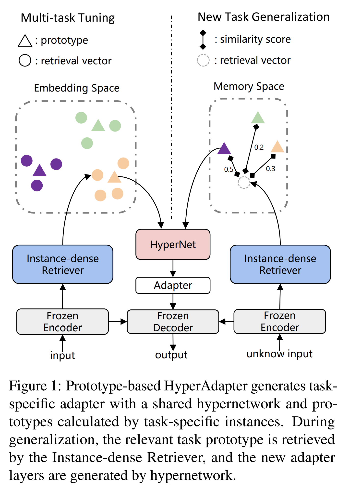
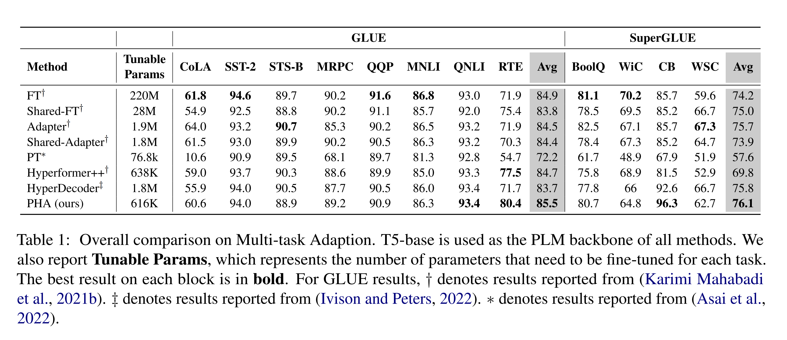
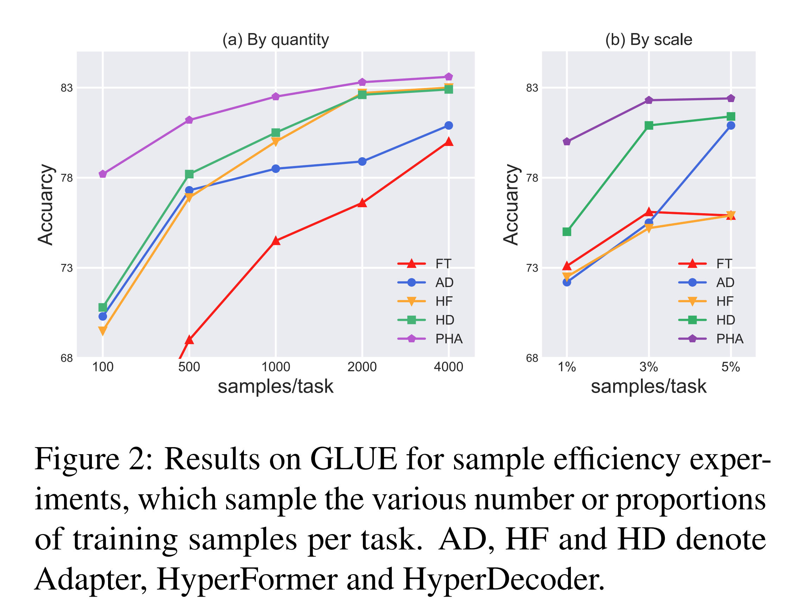
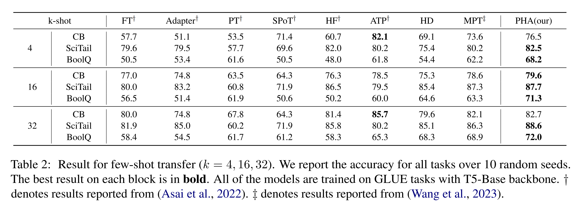
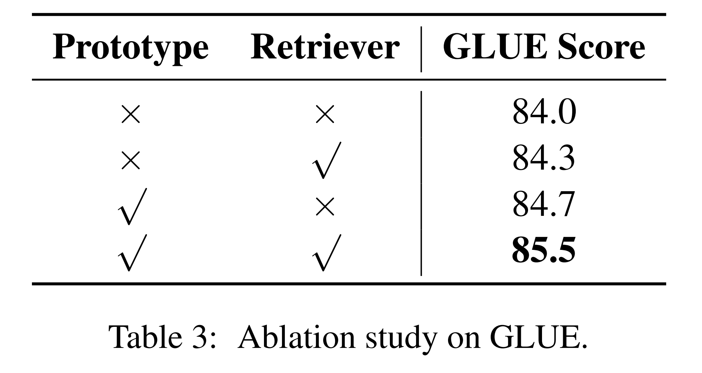
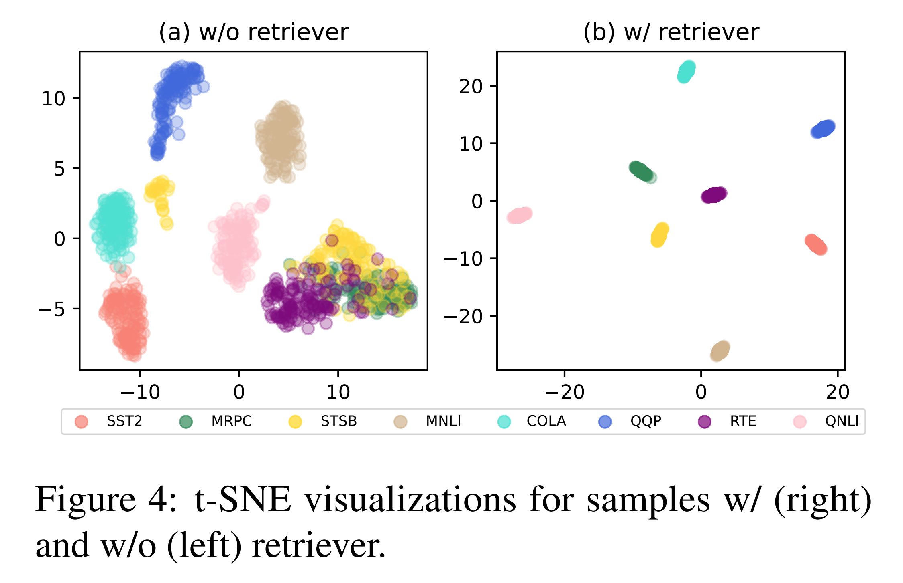
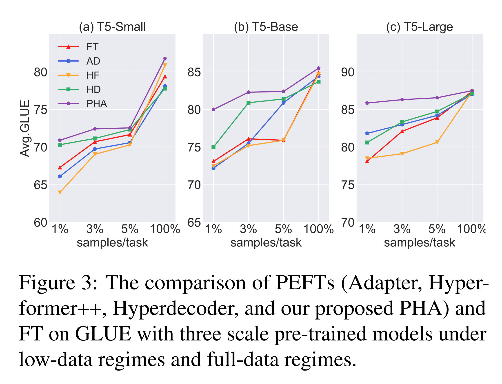
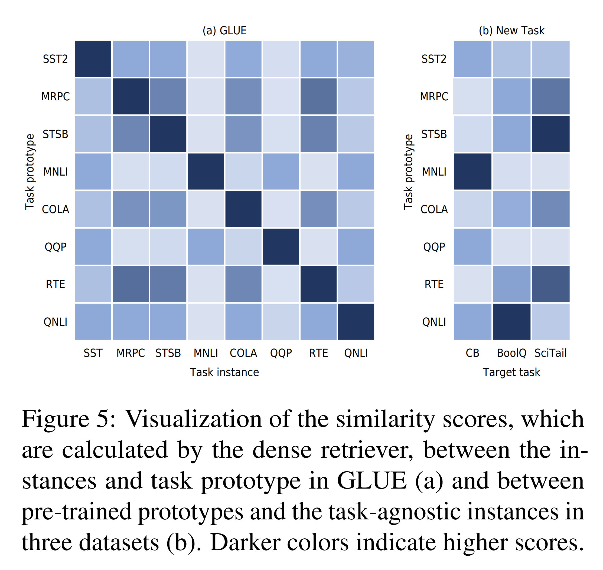

논문 및 이미지 출처 : <https://aclanthology.org/2023.emnlp-main.280.pdf>

# Abstract

Parameter-efficient fine-tuning (PEFT) 는 적은 수의 parameters 만 업데이트하면서도 pretrained language models 를 downstream tasks 에 적응시키는 데 효과적임을 보여주었다. 이러한 성공에도 불구하고, 대부분의 기존 방법은 tasks 간 knowledge transfer 를 고려하지 않고 각 task 에 독립적으로 적응하며, low-data regimes 로 제한된다. 

이 문제를 극복하기 위해, 저자는 adapter-tuning 과 hypernetwork 에 기반한 새로운 framework 인 **Prototype-based HyperAdapter (PHA)** 를 제안한다. 

* 이는 conditional modules 를 sample-efficient 하게 생성하기 위해 instance-dense retriever 와 prototypical hypernetwork 를 도입한다. 
* 이는 multi-task learning 과 few-shot transfer learning 에서 기존 PEFT 방법들 대비 성능 향상을 이끈다. 
* 더 중요하게는, 사용 가능한 data 크기가 더 작아질수록 저자의 방법은 다른 강력한 baselines 를 큰 격차로 능가한다. 

다양한 datasets 에 걸친 광범위한 실증 실험에 기반하여, 저자는 PHA 가 trainable parameters, stream tasks 에서의 accuracy, 그리고 sample efficiency 사이에서 더 나은 trade-off 를 달성함을 입증한다.

# 1 Introduction

Fine-tunined pre-trained language model (PLM) 은 multi-task setting 에서 여러 downstream tasks 에 동시에 적응할 수 있는 뛰어난 잠재력을 가진다. 그러나 model 의 모든 parameters 를 fine-tuning 하는 것은 특히 pre-trained model size 가 빠르게 증가함에 따라 상당한 저장 및 배포 비용을 유발한다. 이 문제를 해결하기 위해, 여러 연구들은 parameter-efficient fine-tuning 을 개발하여 task 별 compact modules 를 학습하고 PLMs 를 downstream tasks 에 적응시켰다. 그러나 이러한 방법들은 다양한 tasks 에 적응하기 위해 서로 다른 modules 를 학습해야 하며, parameter 의 비용은 task 의 수에 비례하여 증가한다. 또한 task-specific modules 를 개별적으로 학습하는 방식은 다른 연관된 tasks 로부터의 이점을 얻지 못한다.

최근 연구들은 hypernetwork 를 학습하여 이러한 modules 의 parameters 를 생성함으로써 parameter efficiency 와 downstream tasks 적응 사이의 better trade-off 를 달성하고자 하였다. 이러한 방법들은 task-shared hypernetwork 를 활용하여 multi-task learning model 이 shared information 을 포착하도록 유도하면서, conditioned modules 를 개별적으로 생성하여 negative task interference 를 제거한다. 그러나 이러한 방법들이 multi-task learning 에서 성공을 거두었음에도 불구하고 여전히 몇 가지 문제가 존재한다:

1. hypernetwork 기반 방법은 일반적으로 specific embedding 과 shared hypernetwork 를 end-to-end training 으로 함께 최적화하며, 어떠한 regularization 도 없다. 따라서 task-specific information 이 분리 불가능하게 얽히게 되어, 특히 resource-limited setting 에서 hypernetwork 의 효율성을 억제한다.
2. 기존 접근법들은 task-specific prior knowledge 나 frozen pre-trained models 로부터의 knowledge 가 필요한 새로운 tasks 로 일반화하는 데 한계가 있다.

여러 연구들은 task-shared hypernetwork 가 cross-task information captor 역할을 수행하는 반면, specific embedding 은 task-level semantic features 를 캡슐화하여 hypernetwork 로부터 적절한 정보를 추출해 대응하는 module parameters 를 생성해야 함을 보여준다. 경험적으로, task-level features 는 보통 관련 instance features 에 의해 암묵적으로 표현된다. 따라서 embedding 생성을 촉진하기 위한 자연스러운 아이디어는 task-specific instance features 의 중심점 (prototypes) 을 계산하는 것이다.

본 논문에서는 adapter-tuning 에 기반한 새로운 framework 인 **Prototype-based HyperAdapter (PHA)** 를 소개한다. 이는 sample-efficient 한 방식으로 multi-task learning 과 새로운 tasks 로의 generalization 을 모두 달성한다. 

* Fig. 1 에서 보듯, PHA 는 크게 두 가지 주요 구성 요소로 이루어진다: Instance-dense Retriever 와 Prototypical HyperNetworks. 
* 첫 번째 구성 요소는 embedding space 에서 다른 tasks 의 instances 를 구별하기 위해 retriever 를 학습하는 데 목적이 있다. 
* 두 번째 구성 요소는 instance-level features 를 사용하여 task-specific prototypes 를 추정하고, 이를 hypernetwork 와 함께 학습될 embeddings 로 유지하는 것이다.

구체적으로, retriever 를 사용하여 encoded instance features 를 embedding space 로 사상한다. embedding space 에서 instances 간 간섭을 피하기 위해, retriever 는 InfoNCE estimator 로 학습된다. 그 결과 intra-task instances 는 클러스터링되고 inter-task instances 간의 거리가 증가한다. 

이때 사상된 features 는 task-level embeddings 를 추정하는 데 사용되는 instance-level semantic features 로 간주될 수 있다. PCL 에서 영감을 받아, 저자는 *contrastive prototypical loss* 를 사용하여 task-specific embedding 을 추정한다. 

* 이는 prototypes 가 instance-level features 의 중심점이 되도록 유도한다. 
* 기존 방법들이 tuning 과정에서 specific embeddings 를 직접 최적화하는 것과 달리, 저자의 방법은 side information 과 함께 specific embedding 을 효율적으로 학습하여 low-data regimes 에서 embedding space 최적화를 돕는다.

새로운 tasks 로 적응하는 동안, 저자는 embedding space 에서 instances 와 aligned prototypes 를 이전 task-level semantic features 로 유지한다. 따라서 새로운 task 의 경우 새로운 instances 와 기존 prototypes 간의 거리를 계산하여 해당 prototype 을 매칭한다.

저자는 13 개 NLP datasets 에 걸쳐 PHA 를 평가하였다. 광범위한 실험은 특히 low-data regimes 에서 PHA 의 효과를 보여준다. 또한 PHA 는 4–32 shots 만으로도 few-shot domain adaptation 을 달성할 수 있다. 예를 들어, PHA 는 GLUE benchmark 에서 strong multitask adapter transfer baseline 보다 더 적은 trainable parameters 로 1.0% 더 높은 성능을 달성한다. GLUE benchmark 의 각 task 에서 단 100 samples 만 사용 가능한 low-resource regimes 에서는 PHA 가 adapter-tuning 을 8.0% 능가한다. 분석 결과, PHA 는 specific information 과 shared information 을 효율적으로 포착하면서도 negative transfer 를 줄임을 보였다. 또한 다른 tasks 의 instances 가 해당 prototypes 에 의해 식별될 수 있고, 새로운 task adaptation 에 활용될 수 있음을 상세히 분석하여 제시한다.

# 2 Background

#### HyperNetworks

Hypernetwork 는 network 나 module 이 사용할 parameters 를 생성할 수 있다. 구체적으로, hypernetwork $h
w$ 는 embedding $I$ 를 활용하여 module parameters $\phi$ 를 생성한다:

$$
\phi = h_w(I) \tag{1}
$$

#### Adapter

Adapter 는 PLM 을 downstream tasks 에 적용하기 위한 parameter-efficient tuning 에 일반적으로 사용된다. 구체적으로, adapter-based tuning 은 PLM 을 고정한 채 transformer layers 에 trainable 한 task-specific modules 를 삽입한다. layer $l$ 의 adapter $A^l(x)$ 는 다음과 같이 정의된다:

$$
A^l(x) = D^l(\text{ReLU}(U^l(x))) + x \tag{2}
$$

* 여기서 $D^l \in \mathbb{R}^{d \times b}$, $U^l \in \mathbb{R}^{b \times d}$ 는 down/ up-projection matrices 이다. 
* $x \in \mathbb{R}^d$ 는 input 을 의미한다. 
* $d$ 는 PLM 의 hidden dimension, $b$ 는 $b \ll d$ 를 만족하는 bottleneck size 이다.

He et al. 은 전통적인 sequential insertion 방식과 다른 parallel adapter 를 제안하였다. 이들은 parallel adapter 가 더 효율적인 parameter-efficient fine-tuning 을 제공함을 보였다.

# 3 Method

#### Problem Setup

본 연구는 일반적인 multi-task learning 문제를 따른다. parameters $\theta$ 를 가진 pre-trained language model $\mathcal{M}_\theta$ 와 target tasks 집합 $\{D\} = \{\mathcal{D}_1, \mathcal{D}_2, \dots, \mathcal{D}_\tau\}$ 가 주어져 있으며, 여기서 $\tau$ 는 전체 task 의 수를 나타낸다. 각 task $\{\mathcal{D}_i\} = \{x_i^n, y_i^n\}_{n=1}^{N_i}$ 는 $N_i$ 개의 samples 로 이루어진 $i$-th task 의 training data 를 나타낸다. 

본 연구의 주요 목표는 multi-task learning setup 을 사용하여 $\mathcal{M}_\theta$ 를 downstream tasks ${D}$ 에 대해 fine-tuning 하고, 새로운 tasks 에도 generalization 할 수 있도록 하는 것이다.

#### Method Overview

저자의 접근 방식의 핵심 아이디어는 task-shared encoder 를 사용하여 training instances 로부터 각 task 의 prototype embeddings 를 직접 학습한 다음, prototype embedding 을 retrieval 하고 이를 hypernetworks 에 입력하여 task-specific adapter layers 를 생성하는 것이다. 

Fig. 1 에서 보듯이, encoded instances 는 prototype 학습을 위해 instance-dense retriever 를 통해 retrieval vectors 로 사상된다. task-specific information 을 나타내는 이러한 prototypes 는 hypernetwork 가 효율적으로 업데이트되도록 한다. 이는 sample-efficient 한 fine-tuning 과 few-shot transfer learning 을 가능하게 한다.

## 3.1 Instance-dense Retriever

저자는 better generalization 을 위해 instance-dense retriever 를 정의한다. 

* $h_i \in \mathbb{R}^d$ 를 $i$-th task 에 속하는 training sample 의 마지막 layer mean-pooled hidden state 라고 하자. 
* latent space 에서 embedding feature 와 training sample 을 정렬하기 위해 instance-dense retriever $G(\cdot)$ 를 적용하여 retrieval vector $z_i = G(h_i)$ 를 구성한다. 
* 여기서 $G(\cdot)$ 는 two feed-forward layers 와 ReLU non-linearity 로 이루어진 MLP 이다. 
* 또한 retriever 는 동일 task 의 instances 간에는 정렬을 명시적으로 촉진하고, 서로 다른 task 의 instances 간에는 멀어지도록 유도할 수 있어야 한다.

효율적으로 discriminative retriever 를 학습하기 위해 InfoNCE 기반 loss function $\mathcal{L}_{IR}$ 을 도입한다:

$$
\mathcal{L}^i = \sum_{z_i \in D} -\frac{1}{N_i - 1} 
\sum_{z_j \in \hat{D}_i} 
\log \frac{\exp f(z_i \cdot z_j)}{\sum_{z_m \in S(i)} \exp f(z_i \cdot z_m)}, \tag{3}
$$

$$
\mathcal{L}_{IR} = \frac{1}{\tau} \sum_{i=1}^\tau \mathcal{L}^i \tag{4}
$$

* 여기서 $\mathcal{L}_i$ 는 task $i$ 에 대한 training objective, 
* $f(\cdot)$ 는 cosine similarity function, 
* $\hat{D}_i$ 는 $z_i$ 의 positive samples set, 
* $S(i)$ 는 $z_i$ 의 negative samples 집합이다.

instance-dense retriever 는 동일 task 로부터의 instance-level information 을 집계하며, few-shot transfer learning 에 필요한 knowledge 의 유연한 재사용을 가능하게 한다.

## 3.2 Prototypical HyperNetworks

단순히 learned task embedding 을 사용하여 task-specific information 을 캡슐화하면, task-shared hypernetwork 가 training data distribution 에 overfitting 되는 편향이 발생한다. 이는 sample efficiency 부족과 mixed knowledge 으로 인해 cross-task transferring 동안 distribution 변화에 취약해진다.

이 문제를 해결하기 위해, 저자는 end-to-end training 대신 instance-level information 을 활용하여 task embedding 을 학습하도록 한다. 구체적으로, contrastive formulation 이 강건하고 sample-efficient 한 Hypernetworks 학습에 효과적인 전략임을 발견하였다. 먼저, $\{k_i\}_{i=1}^\tau$ 라는 embedding set 을 초기화하며, 여기서 $k_i \in \mathbb{R}^d$ 는 $i$-th task 의 specific information 을 학습하는 trainable vector 이다. embedding 에 대한 학습 objective 는 다음과 같다:

$$
\mathcal{L}^i = \sum_{z_i \in D} -\frac{1}{N_i - 1} 
\log \frac{\exp f(z_i \cdot k_i)}{\sum_{k_m \in V(i)} \exp f(z_i \cdot k_m)} \tag{5}
$$

$$
\mathcal{L}_\text{Pro} = \frac{1}{\tau} \sum_{i=1}^\tau \mathcal{L}^i \tag{6}
$$

* 여기서 $V(i)$ 는 negative embedding set 이다. 
* 이 objective 는 각 embedding 이 tasks 간 samples 의 상대적 관계를 활용하도록 강제하며, sample-inefficient 한 knowledge transfer 를 피하도록 한다.

서로 다른 transformer layers 에 대해 specific parameters 를 생성하고 trainable parameters 의 수를 줄이기 위해, 저자는 Hyperformer 와 유사하게 learnable layer embedding $e_m$ 을 도입한다. 여기서 $m$ 은 transformer model 의 $m$-th layer 를 나타낸다. HyperNetwork $H(\cdot)$ 가 task-conditional adapter $A_i^m$ 를 위한 weight matrices $D_i^m$ 과 $U_i^m$ 를 생성한다고 하자:

$$
(D_i^m, U_i^m) = H(C(k_i, e_m)) \tag{7}
$$

여기서 $C(\cdot)$ 는 task embedding 과 layer embedding 을 결합하여 mixed embedding $I_i^m$ 을 만드는 projection network 이다.

Pfeiffer et al. 과 He et al. 에서 영감을 받아, 저자는 이러한 conditional parameters (Adapter) 를 Feed-Forward Networks (FFN) sub-layer 에 병렬로 삽입한다:

$$
y = FFN(LN(x)) + A(LN(x)) \tag{8}
$$

* 여기서 $LN(\cdot)$ 은 LayerNorm layer 를 나타낸다. 
* 이는 서로 다른 tasks 로부터의 knowledge 를 task prototypes 에서 효율적으로 분리하며, transfer learning 동안 변화하는 data distribution 에 적응할 수 있도록 한다.

## 3.3 Multi-task Tuning and New Task Generalization

PHA 는 서로 다른 학습 방식을 통해 sample-efficient 한 multi-task learning 과 few-shot adaption 을 달성한다.

#### Multi-task Tuning

저자는 일반적인 multi-task learning setup 을 따른다. 이때 task identity 가 포함되며, 서로 다른 datasets 는 하나로 연결된다. efficient fine-tuning 을 달성하기 위해, task-shared adapters 가 포함된 encoder 를 사용하여 training sample 을 encoding 하고, Eq. (5) 의 loss function 을 통해 task identity 가 주어진 retrieval vector 에 대응하는 embedding 을 추정한다. decoder 는 contextual information 에 조건부로 연결된 specific adapters 를 붙인다. 전체 model 은 sequence-to-sequence setting 에서 다음 objective function 으로 학습된다:

$$
\mathcal{L}_{\text{Total}} = \mathcal{L}_{\text{PLM}} + \lambda (\mathcal{L}_{IR} + \mathcal{L}_{Pro}), \tag{9}
$$

* 여기서 $\mathcal{L}_{\text{PLM}} = \sum_{i=1}^{\tau} \mathcal{L}_i$ 는 모든 training tasks 에 대한 cross-entropy loss 를 나타내며, $\lambda$ 는 balancing factor 인 scalar 이다.

PHA 는 specific embedding 이 contextual information 을 효율적으로 포착하도록 하여, hypernetwork 가 sample-efficient adaption 에 필요한 adapter layers 의 parameters 를 생성하도록 돕는다.

#### New Task Generalization

Few-shot adaption 을 위해, multi-task training 이후 retrieval vector $z$ 와 learned embeddings ${k}$ 의 similarity scores 를 계산하여 adaption embedding $k_a$ 를 retrieval 한다:

$$
k_a = \arg \max_i f(k_i \mid z). \tag{10}
$$

training 과정에서 adaption embedding 은 hypernetworks 로 입력되어 새로운 tasks 에 대한 adapters 의 weight matrices 를 생성하며, cross-entropy loss 로 최적화된다.

저자의 방법은 adaption embedding 이 새로운 task 에 필요한 knowledge 와 유사한 정보를 포함하기 때문에, 제한된 training examples 만으로도 새로운 tasks 에 효율적으로 generalization 할 수 있도록 한다.

# 4 Experiments

## 4.1 Datasets

NLU tasks 에 대한 multi-task learning 의 기존 연구를 따라, 저자는 GLUE benchmark 에서 8 개 dataset, SuperGLUE benchmark 에서 4 개 dataset 을 고려하여 제안한 model 의 성능을 평가하였다. 이 benchmarks 는 다양한 text classification tasks 를 포함한다.

* **CoLA**: sentence acceptability
* **SST-2**: sentiment analysis
* **MNLI, QNLI, RTE, CB**: natural language inference
* **STS-B**: sentence similarity
* **MRPC, QQP**: paraphrasing similarity
* **WSC**: coreference resolution
* **BoolQ**: question answering
* **WiC**: word sense disambiguation

추가적으로, 저자는 few-shot adaption 을 위해 **SciTail** dataset 을 사용하였다.

## 4.2 Baselines

저자의 방법의 효과성을 평가하기 위해, multi-task learning 의 강력한 baselines 와 비교 실험을 수행하였다:

* **Adapter, Shared-Adapter**: single task 또는 task group 에 adapters 를 학습하여 transformer layers 에 삽입
* **Hyperformer, Hyperdecoder**: task-conditioned 또는 sample-conditioned Hypernetworks 를 사용하여 adapters 를 생성하고 transformer layers 에 삽입
* **Fully fine-tuning (FT), Shared-FT**: 모든 parameters 를 학습하거나 model 을 tasks 간 공유
* **Prompt-based methods**:
  * **Prompt tuning (PT)**: input layer 에 tunable embeddings 를 prepend 하고, 각 task 별로 embeddings 초기화
  * **SPoT, ATTEMPT, MPT**: source tasks 로부터 distillation 된 shared prompts 를 이용하여 target tasks 에 적응

## 4.3 Experiment Details

Karimi Mahabadi et al. 의 설정을 따르며, 원래의 testing set 이 없는 경우 validation set 을 testing set 으로 사용하였다. dataset 크기가 100k 미만일 경우, validation set 을 validation 과 testing 으로 분할하였다. 반대로, 더 큰 dataset 은 training set 에서 1000 개 samples 를 선택하여 validation 으로 사용하고, 기존 validation set 을 testing 으로 사용하였다.

* **Multi-task adaptation experiment**: GLUE 8 개, SuperGLUE 4 개 dataset 으로 multi-task learning 수행
* **Low-data adaption experiment**: GLUE 각 task 에 대해 100, 500, 1000, 2000, 4000, 1%, 3%, 5% 의 비율로 개별 sampling
* **Evaluation metrics**: STS-B 에는 Pearson Correlation, 나머지 tasks 에는 accuracy 사용
* 모든 models 는 1000 steps 마다 checkpoint 저장, 단일 checkpoint 기준 모든 task 의 평균 성능 보고

**Few-shot adaption experiment**: training set 에서 $k=4,16,32$ 개 instances 를 무작위 sampling, 전체 test set 으로 평가 수행.
**Pre-trained language models**:
* 기본적으로 **T5-Base (220M)** 사용
* 추가적으로 **T5-Small (60M)**, **T5-Large (770M)** 를 사용하여 Sec. 4.4.5 에서 model 크기가 PHA 성능에 미치는 영향 분석
**Training settings**:
  * 모든 실험은 65k steps 학습
  * Optimizer: AdamW
  * Batch size: 128
  * Learning rate: $3 \times 10^{-4}$, linear decay, 500 warm-up steps
  * Eq. (9) 의 balancing factor $\lambda = 0.1$ 고정
  * 모든 실험은 서로 다른 seeds 로 5 회 실행, 평균 결과 보고

세부 dataset 별, method 별 configuration 은 Appendix A 에 제시되어 있다.

## 4.4 Results and Analysis

### 4.4.1 Multi-task Adaptation

Tab. 1 은 GLUE 와 SuperGLUE 에서의 평가 결과를 보여준다.

* 결과에 따르면, PHA 는 parameter efficiency 를 유지하면서도 성능 향상 측면에서 모든 비교 방법들을 능가한다. 
* SPoT, ATTEMPT, MPT 와의 비교는 수행하지 않았다. 이 방법들은 source tasks 로부터 knowledge 를 저장하고 target tasks 로 전이하기 위해 pretraining prompts 가 필요하며, pretrained models 만 사용할 수 있는 동일한 setting 으로 확장하는 것은 본 연구의 범위를 벗어나기 때문이다. 따라서 multi-task learning 의 실험 setup 에서는 이들과 공정한 비교가 불가능하다.
* 주목할 점은 MPT, ATTEMPT, 그리고 저자의 방법 모두 few-shot transfer setting (Sec. 4.4.3) 에서 동일한 two-step training 방식을 사용한다는 것이다. 
* 구체적으로, 저자의 PHA 방법은 Adapter 대비 +1.0% 의 성능 향상을 달성하면서도 trainable parameters 는 3배 더 적게 사용한다. 
* 최신 adapter-based multi-task 방법들인 Hyperformer++ 와 Hyperdecoder 와 비교했을 때, 이들은 저자의 접근법과 유사하게 hypernetwork 를 사용해 conditioned parameters 를 생성한다. 
* 그러나 PHA 는 동일하거나 더 적은 수의 trainable parameters 를 사용하면서 GLUE 에서 각각 0.8% 와 1.8% 포인트의 정확도 향상을 달성하였다. 이는 저자의 방법이 tasks 간 negative interference 를 더 잘 줄일 수 있는 잠재력을 보여준다.
* 추가로, FT 가 모든 비교 실험 방법 중 가장 높은 성능을 보였으나, single task 에서 220M 개의 trainable parameters 가 필요하다. 
* 반면 PHA 는 FT (85.5 vs. 84.9) 와 거의 대등한 성능을 달성하면서 trainable parameters 를 100% 에서 0.28% 로 줄였다. parameter efficiency 측면에서 PHA 의 효과성에 대한 추가 분석은 Appendix B 에 제시되어 있다.

### 4.4.2 Low-data Adaptation

저자의 framework 는 instance-level features 로 추정된 task prototypes 가 task information 을 더 잘 표현하며, multi-task adaptation 동안 hypernetworks 의 성능을 sample-efficient 하게 향상시킬 수 있다고 가정한다. 제안한 방법이 제한된 자원 환경에서 더 잘 generalize 되는지를 검증하기 위해, 저자는 GLUE benchmark 에서 low-data adaption 실험을 수행하였다. Karimi Mahabadi et al. 의 설정을 따라 Finetuning, Adapter, Hyperformer++, Hyperdecoder 를 모두 15k steps 동안 학습하였다. (세부 사항은 Sec. 4.3 참조)

* Fig. 2 에서 보듯이, PHA 는 다양한 설정에서 다른 baselines 를 일관되게 능가한다. Fine-tuning 이 제한된 data 환경에서는 가장 낮은 성능을 보였는데, 이는 base model 의 모든 parameters 를 tuning 할 경우 over-fitting 상태에 쉽게 빠지기 때문으로 보인다. 
* 다른 방법들의 경우, 사용 가능한 samples 의 수가 적을 때는 최신 multi-task hypernetwork 방법들이 Adapter 의 성능과 비슷하거나 낮게 나타나며, samples 수가 증가해야 성능 향상이 두드러졌다. 
* 이는 hypernetworks 가 low-data regimes 에서 randomly initialized task embeddings 나 instances 를 contextual information 으로 사용할 경우 optimal parameters 생성에 어려움을 겪음을 시사한다.
* 또한, GLUE benchmark 의 training task 분포를 더 잘 시뮬레이션하기 위해, 저자는 GLUE 각 task 를 다양한 비율로 무작위 sampling 하였다. 
* Fig. 2(b) 는 PHA 와 adapter-based 방법들 간의 비교를 보여주며, Fig. 2(a) 와 유사하게 제안한 방법이 다른 방법들을 큰 차이로 능가한다. 
* 추가로, 저자는 SuperGLUE 의 4 개 dataset (BoolQ, WiC, CB, WSC) 에 대해서도 실험을 수행하였으며, 세부 내용은 Appendix C 에 제시되어 있다.

PHA 가 모든 비교 방법들보다 우수한 성능을 보인다는 사실은 제안된 task prototype 이 contextual information 을 효율적으로 포착하여 hypernetwork 가 adapter layers 의 parameters 를 생성할 수 있도록 한다는 점을 입증한다.

### 4.4.3 Few-shot Adaptation

저자는 제안한 방법이 sample-efficient 하게 새로운 tasks 에 적응할 때 어떤 성능을 보이는지 탐구하였다. 구체적으로, Wang et al. (2023) 을 따라 BoolQ, CB, SciTail 에서 few-shot experiments 를 수행하고 Fine-tuning, Adapter, Prompt tuning, SPoT, Hyperformer, ATTEMPT, HyperDecoder, MPT 등의 강력한 baselines 와 비교하였다.

Tab. 2 의 결과는 GLUE 에 대해 8-task adaptation 을 학습한 뒤, BoolQ, CB, SciTail 의 few-shot samples 로 fine-tuning 한 결과이다. (세부 사항은 Sec. 4.3 참조)

Tab. 2 는 few-shot adaption setting 에서의 결과를 요약한다.

* Adapter-based transfer methods 중 PHA 는 Adapter 대비 약 3% ∼ 20% 의 절대적 성능 향상을 달성하였다. 
* Hyperformer 는 새로운 tasks 를 위한 parameter generation 에서 더 나은 결과를 보였으나, target tasks 에 대한 명확한 사전 이해가 필요하다. 
* 반면 PHA 는 task-specific prior knowledge 없이도 Hyperformer 의 성능을 크게 향상시켰다. 
* 또한 저자의 방법은 대부분의 setting 에서 다른 prompt-based transfer methods 를 유의미하게 능가하였다.

이 결과는 제안한 접근 방식이 training samples 의 수가 제한적임에도 불구하고 새로운 tasks 에 효과적으로 generalize 할 수 있음을 보여준다.

### 4.4.4 Ablation Study

저자는 GLUE benchmark 에서 제안한 modules 의 효과성을 평가하기 위해 ablation study 를 수행하였다. 이를 위해 prototype design 과 instance-dense retriever 를 각각 독립적으로 제거하였다.

* Tab. 3 (row 2): prototype design 을 제거하고 retrieval instances 로만 학습했을 때, 성능이 크게 하락하였다. 이는 instance-level information 이 hypernetwork capacity 의 제한 아래서 tasks 간 positive transfer 를 방해하며, 반면 저자의 task prototypes 설계는 hypernetwork 가 shared-task information 을 잘 포착하게 하여 tasks 간 positive transfer 를 가능하게 함을 보여준다.
* Tab. 3 (row 3): retriever 를 제거하고 originally encoded instances 로 task prototypes 를 추정했을 때, embedding space 내 instance information 의 상대적 분산 때문에 task prototypes 가 얽히게 된다. 이로 인한 성능 저하는 instance-dense retriever 가 prototype 이 task-specific knowledge 를 더 잘 encode 하도록 돕는다는 것을 시사한다.

* 추가적으로, Fig. 4 는 GLUE benchmark 에서 encoded instances 를 시각화하여 instance-dense retriever 추가 전후의 효과를 비교한다. 
* retriever 를 적용하지 않은 경우, 동일 task 의 samples 들은 근처에 위치하지만 서로 다른 classes (e.g., STS-B, MRPC, RTE) 의 samples 들이 여전히 섞여 있다. 
* 반면 retriever 가 추가된 후에는 동일 task 의 instances 가 밀집 클러스터를 형성하며, 다른 tasks 들은 명확히 분리된다.

### 4.4.5 Impact of Model Scale

저자의 방법이 서로 다른 크기의 pretrained models 에 적용 가능함을 검증하기 위해, T5-Small (60M), T5-Base (220M), T5-Large (770M) 에 대해 GLUE datasets 에서 실험하였다. PHA 와 Fully Fine-tuning (FT), Adapter (AD), Hyperformer++ (HF), Hyperdecoder (HD) 의 평균 성능을 비교하였다.

* Fig. 3 에서 보듯이, 세 가지 규모의 pretrained models 에서 PHA 는 low-data regime 과 full-data regime 모두에서 우수하고 경쟁력 있는 성능을 보였다. 
* 이는 제안한 prototypical strategy 가 large-scale transformer models 의 크기가 커질 때에도 여전히 최고의 sample efficiency 를 달성할 수 있음을 나타낸다.

### 4.4.6 Effect of Retriever for Generalization

retriever 는 새로운 tasks 에 적응하는 데 중요한 역할을 한다. multi-task setting 에서 학습된 후 retriever 가 어떻게 작동하는지를 탐구하기 위해, 저자는 Eq. (10) 에서 정의된 similarity scores 를 사용하여 retrieval 결과를 측정하였다. 구체적으로, GLUE 의 각 개별 task 를 무작위로 sampling 하고, 학습된 retriever 에 의해 변환된 retrieval vectors 와 학습된 task prototypes 를 통해 similarity scores 를 계산하였다.

* Fig. 5(a) 는 similarity scores 의 시각화를 보여준다. retriever 가 해당 task instance 의 task identity 를 정확히 retrieval 했음을 확인하였다. 
* 이는 task prototypes 와 instance vector 가 embedding space 에서 정렬되어, 단일 task 의 공통 특징을 더 효율적으로 포착할 수 있음을 시사한다.
* 또한 retriever 가 generalization 이 필요한 target tasks 에 대해 대응하는 task prototype 을 매칭할 수 있는 능력을 보여준다.
* Fig. 5(b) 는 CB 와 MNLI, SciTail 과 STS-B 와 같은 연관된 tasks 의 similarity score 가 상대적으로 높음을 보여준다. 이들은 모두 NLI task family 에 속한다. 
* QNLI 와 BoolQ 의 경우, GLUE 에서 학습된 task prototype 에 Boolean QA task 가 포함되지 않았기 때문에, retriever 는 BoolQ 와 동일한 domain 에 있는 QNLI prototype 을 매칭하였다. 
* 따라서 제안한 방법은 관련 task prototype 과 cross-task knowledge 를 포함하는 hypernetwork 가 모두 존재할 때 새로운 tasks 로 자연스럽게 generalize 할 수 있다.

# 5 Related Work

#### Multi-task Learning and Transfer

Multi-task learning (MTL) 은 서로 다른 tasks 간 shared information 을 활용하여, 여러 tasks 를 동시에 해결할 수 있는 통합된 model 을 학습하는 것을 목표로 한다. NLP 에서는 보통 모든 tasks 에 대해 특정 layers 를 공유하고, task-specific layers 를 사용하여 구현된다. LLMs 의 대중화와 함께 Raffel et al. 은 다양한 tasks 를 통합된 형식으로 변환하여 LLMs 를 학습하는 연구를 진행하였다. 여러 연구들은 large-scale multitasking training 을 통해 LLMs 가 새로운 tasks 로 더 잘 generalize 될 수 있음을 보였다.

최근 연구들은 LM 크기가 증가함에 따라 parameter-efficient fine-tuning 을 활용한 multi-task transfer 에 초점을 맞춘다. multitask learning 의 효과는 개선되었지만, 이들은 source tasks (신중히 선택된) 와 여러 target tasks 에 대해 두 번의 finetuning 을 필요로 한다. 이는 방법의 적용 가능성을 제한한다. 반면, 저자의 방법은 pretrained model 만으로 multi-task learning 과 새로운 task 로의 transfer 를 달성한다.

여러 연구들은 hypernetworks 를 도입하여 multi-task learning 동안 adapter layers 의 parameters 를 생성함으로써 cross-task information 을 공유한다. 저자의 연구는 Ivison and Peters 에 의해 동기 부여되었으나, prototypes 로 표현된 task-level information 을 사용해 hypernetworks 의 embedding distribution 을 최적화하는 방식을 제안한다. 이는 tasks 간 negative transfer 를 줄이고, 특히 low-resource regimes 에서 adaption 성능을 향상시킨다.

#### Prototype Learning

Prototype learning 은 few-shot learning 을 위한 network 의 representation 능력을 향상시키는 데 널리 사용된다. 여러 연구들은 prototype estimation 을 통해 class 내 samples 의 공통 features 를 학습하도록 prototype 이 강제된다고 보여주었다. Cui et al. 은 contrastive learning 으로 prototypes 를 추정하여 prompt-based few-shot tuning 을 위한 verbalizer 를 구성하였다. 그러나 저자의 방법은 prototypical strategy 를 사용하여 해당 tasks 의 specific information 을 탐구한다는 점에서 차별적이다.

# 6 Conclusion

본 논문에서는 adapter-tuning 기반의 새로운 framework 인 Prototype-based HyperAdapter (PHA) 를 소개하였다. PHA 는 sample-efficient 한 방식으로 multi-task adaption 과 새로운 task 로의 adaption 을 모두 달성한다. 

구체적으로, instance-level features 로 계산된 task-specific prototypes 를 기반으로 adapter layers 의 parameters 를 생성한다. 또한, specific prototype 은 retrieval 되어 새로운 tasks 로 전이되고 추가로 tuning 된다. 제안한 방법은 full/low-data multi-task adaption 과 few-shot adaption 모두에서 기존 SOTA 를 크게 능가하였다.

# Limitations

본 연구는 multitasking adaption 에서 강력한 실험 결과와 sample efficiency 를 보여주었다. 그러나 몇 가지 한계가 존재한다:

1. few-shot adaption 에서 저자의 방법은 8 개 NLP tasks 에 대해 base model 을 tuning 하여 새로운 target tasks 로 효율적으로 generalize 할 수 있다. 그러나 더 large-scale tasks 에 대해 tuning 할 경우 더 나은 generalization improvements 를 달성할 수 있을 것이다.
2. Fig. 5 에서 보듯이, 새로운 task 는 단일 prototype 이 아니라 여러 task prototypes 와 관련될 수 있다. 그러나 저자의 방법은 가장 관련성이 높은 prototype 만 선택하여, 약하게 연관된 knowledge 의 transfer 는 무시될 수 있다.
3. 본 연구에서는 adapters 를 사용했으나, 저자의 방법은 다른 parameter-efficient approaches (e.g., prompt tuning, prefix tuning, LoRA 등) 와 결합될 경우에도 이점을 얻을 수 있을 것이다.
