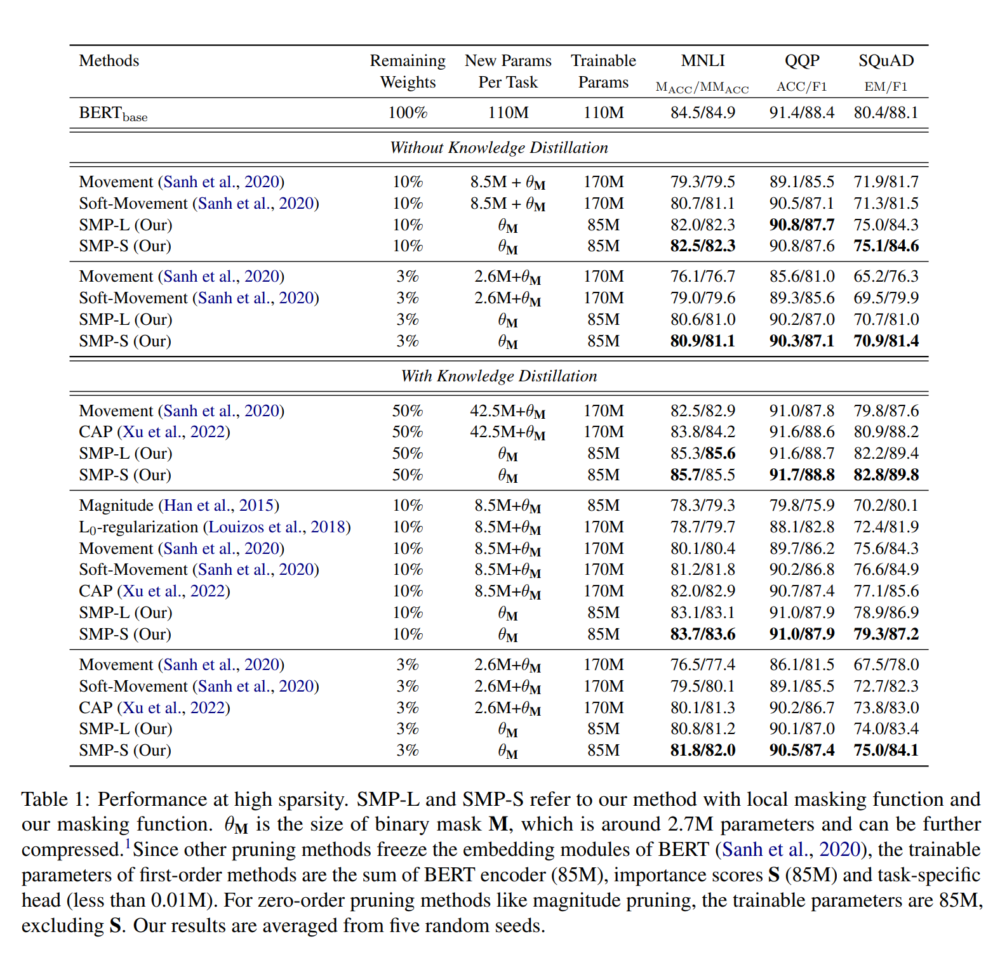
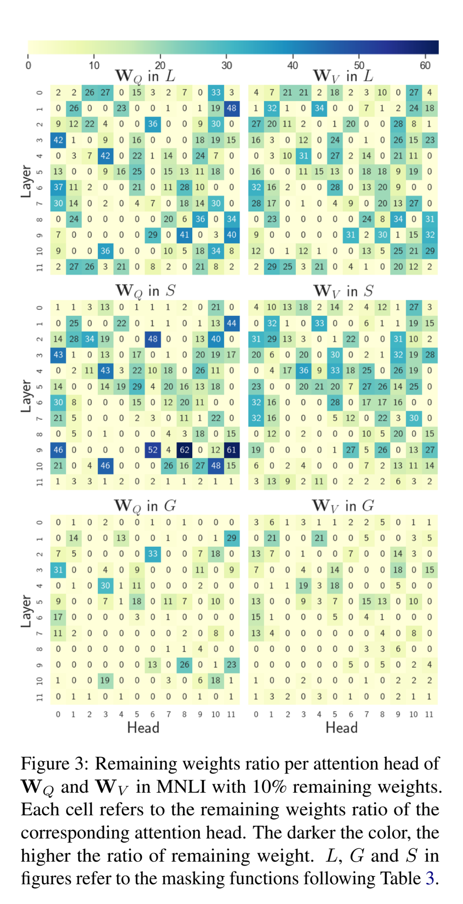

논문 및 이미지 출처 : <https://aclanthology.org/2023.acl-long.35.pdf>

# Abstract

Pre-trained Language Models (PLMs) 의 overparameterize 문제를 극복하기 위해, pruning 이 unimportant weights 를 직접적으로 제거하여 간단하고 직관적인 압축 방법으로 널리 사용한다.

이전의 first-order method 는 PLM 을 extremely high sparsity 로 압축하는데 성공하여, 약간의 성능 하락만 발생한다.

이런 방법들은 movement pruning 같은 first-order information 을 사용하여 PLM 을 pruning 하고 remaining weights 를 fine-tuning 하는 방식으로 작동한다.

본 논문에서는 first-order pruning 에 대한 fine-tuning 이 불필요하다 주장한다.

- first-order pruning 만으로도 PLM fine-tuning 없이 downstream task 에 수렴할 수 있기 때문
- 위 동기로 저자는 **Static Model Pruning (SMP)** 제안
  - target sparsity level 에 달성하는 동안 PLM 을 downstream task 에 adapting 하기 위해 first-order pruning 사용
  - 추가로, SMP 를 더 개선하기 위해 new masking function 와 training objective 설계
- 다양한 sparsity levels 에서 광범위한 실험 결과, SMP 는 first-order 및 zero-order 보다 상당한 개선
- 이전의 first-order 과 달리 SMP 는 low sparsity 에서도 적용 가능하며 zero-oder 보다 우수한 성능
- SMP 는 fine-tuning 이 필요하지 않아 다른 방법보다 parameter-efficient

# 1. Introduction

BERT 같은 PLMs 는 large-scale corpus 로부터 knowledge transfering 으로 downstream task 에 강력한 성능을 보여주지만, large-scale parameter 가 필요하다.

이러한 parameter 는 대부분의 downstream task 에는 너무 많아서, transfer 및 copy 에 부담이 된다.

PLM 을 압축하는 pruning 이 널리 사용되며, unimportant weights 를 제거하고 이를 zero 로 설정함으로써 이루어진다.

기존의 pruning 은 original complete network 대신 sparse subnetwork 를 사용함으로써 대부분의 weight 를 제거하여 original accuracy 를 유지할 수 있다.

- Magnitude Pruning (Han et al, 2015) : zero-order information 을 사용하여 weight 의 absolute value 게 기반하여 pruning 결정
  - downstream task adapting 과정에 PLM 의 weight value 는 이미 original value 로 결정됨
- 위 단점을 극복하기 위해 movement pruning (Sanh et al, 2020) 은 weight 가 absolute value 가 아닌 training 중 어떻게 변하는지에 따라 선택되는 first-order information 사용
  - 위와 같이 대부분 movement pruning 과 같이 fine-tuning 과 함께 수행하여 training 중 sparsity 를 점진적으로 증가시킨다.
- Lottery Ticket Hypothesis (LTH) (Frankle and Carbin, 2018) 의 발전에 따라, 일부는 pruning 을 통해 PLM 의  특정 subnetwork 를 찾은 다음 pre-trained weight 에서 이 subnetwork 를 fine-tuning
  - 또한 fine-tuned subnetwork 가 전체 PLM 의 성능과 일치하는 경우, 이 subnetwork 를 winning ticket 이라 함

본 논문에서는 간단하지만 효율적인 first-order method 제안

- 이전의 pruning 과 달리 fine-tuning 없이 pruning 만을 통해 PLM adapting
- 이 방법은 movement pruning 에 기반하여 pruning 결정을 내리며, movement pruning 에서의 movement 와는 다르다.
- 저자의 방법은 성능 향상을 위해 remaining weight 를 PLM 에 잘 맞게 하기 위한 **new masking function** 을 제안
- 또한 task-specifc head 에서 weight 를 fine-tuning 하지 않고 저자의 head initialization method 를 사용하여 더욱 효율적
- PLM 고정함으로써, 다른 first-order 과 비교하여 trainable parameter 반을 줄이며, 다양한 sparisty levels 에서 각 downstream task 에 대한 new parameter 로 binary mask 만 도입
- 다양한 sparsity level 에서 광범위한 실험으로 SOTA pruning 을 능가
- 이전의 first-order (Sanh et al, 2020)이 low sparsity 에서 성능이 좋지 않은 반면, 저자는 low sparsity 에서도 적용 가능하며 zero-order 보다 우수한 성능 달성

# 2. Related Work

PLM 의 overfitting 해결을 위한 여러 압축 방법이 제안되었다. 예로, model pruning (Han et al., 2015; Molchanov et al., 2017; Xia et al., 2022), knowledge distillation (Jiao et al., 2020; Wang et al., 2020), 양자화(Shen et al., 2020; Qin et al., 2022), quantization (Shen et al., 2020; Qin et al., 2022) 및 matrix decomposition (Lan et al., 2020) 등이 있다.

- Pruning 은 모델에 unimportant weights 를 식별하고 제거하는 데 초점을 둔다.
  - Zero-order 과 first-order 는 PLM pruning 에 널리 사용된다.
  - Zero-order : magnitude pruning (Han et al, 2015)는 단순히 weight 의 absolute value 를 기반으로 pruning 수행
  - Fist-order : pruning 결정을 위해 first-order Taylor expansion 을 기반으로 하며, $L_0$ regularization (Louizos et al, 2017) 은 $L_0$ norm regularization 을 추가하여 hard-concrete distribution 으로 sampling 하여 remaining weights 를 줄인다.
  - Movement pruning (Sanh et al, 2020) : _staight-through estimator_ (Bengio et al, 2013)을 사용하여 first-order information 계산
- pruning 을 기반으로, Frankle and Carbin (2018) 은 Lottery Ticket Hypothesis (LTH) 제안
  - 개별로 훈련시킬 때 거의 동일한 성능을 달성하는 subnetwork (winning ticket) 존재 확인
  - LTH 발전에 따라, PLM 에 중점을 둔 연구 등장
  - BERT 가 40 ~ 90% 의 sparsity 를 가진 winning tickets 을 포함하며, NLP 에서 winning ticket 이 downstream task 에 transfer 가능함을 발견
  - Liang et al. (2021) 은 winning tickets 의 일반화 성능이 임계점 이후 개선되고 나빠지는 현상을 이용하여, LTH 가 downstream task 성능에 성공적인 향상을 주는 것을 보여줌

# 3. Background

$\text{a} = \text{Wx}$ 를  PLM 의 fully-connected layer 라 하자.

- $\text{W} \in \mathbb{R}^{n\times n}$ : weight matrix
- $\text{x} \in \mathbb{R}^n$ 및 $\text{a} \in \mathbb{R}^n$ : input 및 output

pruning 은 $\text{a} = (\text{W} \odot \text{M})\text{x}$ 으로 표현

- $\text{M} \in \{0,1\}^{n\times n}$ : binary mask

PLMs 에서 두 가지 common pruning 을 리뷰 해본다.

- magnitude pruning (Han et al, 2015)
  - absolute value $\text{M} = \text{Top}_v(\text{S})$ 에 따라 top $v$ weight 를 유지하여 결정하는 zeroth-order information 에 의존
  - importance score $\text{S} \in \mathbb{R}^{n\times n}$ 은 다음과 같다.
  - $$
    \begin{equation}
        \begin{align*}
            S^{(T)}_{i,j} &= \left | W^{(T)}_{i,j} \right | \\
            &= \left | W_{i,j} - \alpha_w \sum_{t<T} \left ( \frac{\partial \mathcal{L} }{\partial W_{i,j}} \right )^{(t)} \right  |
        \end{align*}
    \end{equation}
    $$
    - $S^{T}_{i,j}$ : $T$ steps update 이후 $W^{(T)}_{i,j}$ 에 대응하는 importance score
    - $\mathcal{L} 및 \alpha_w$ : $W_{i,j}$ 의 learning object 및 learning rate
  - fine-tuning 중 high absolute values 의 weight 선택
- movement pruning (Sanh et al, 2020)
  - gradient 를 사용하여 importance scores $\text{S}$ 를 학습하는 것에 의존
  - $\text{S}$ 의 gradient 는 _staight-through estimator_ 를 사용하여 근사하며, 이는 $\text{M}$ 에서 직접적으로 gradient 사용
  - importance scores $\text{S}$ 는 다음과 같다.
  - $$
    \begin{equation}
      S^{(T)}_{i,j} = -\alpha_s \sum_{t<T} \left (\frac{\partial \mathcal{L}}{\partial W_{i,j}} \right )^{(t)} W_{i,j}^{(t)}
    \end{equation}
    $$
    - $\alpha_s$ : $\text{S}$ 의 learning rate
  - magnitude pruning 과 비교하여, movement pruning 은 absolute value 를 증가시키는 weight 를 선택
- target sparsity 달성을 위한 한 가지 공통된 방법은 _automated gradual pruning_ (Michael H. Zhu, 218)
  - sparsity level $v$ 는 training step $t_0: v^t = v_f + (v_0 - v_f) (1-\frac{t-t_0}{N \triangle t})^3$ 에서 시작하는 cubic sparsity scheduler 를 사용하여 점진적으로 증가된다.
    - $v_0$ 및 $v_f$ : initial 및 target sparsity
    - $N$ : overall pruning steps
    - $\triangle t$ : pruning frequency

training 중, 이런 방법들은 pruning 과 fine-tuning 을 동시에 수행하기 위해 $\text{W}$ 와 $\text{S}$ 모두 업데이트해야 한다.

fine-tuned weight 는 pre-trained value 에 가깝게 유지되므로 (Sanh et al, 2020), magnitude pruning 의 importance scores 는 pre-trained value 에 영향을 받아 high sparsity 에서의 성능을 제한한다.

하지만 magnitude pruning 은 여전히 low sparsity 에서 movement pruning 보다 우수한 성능을 보인다.

# 4. Static Model Pruning

본 논문에선 간단한 first-order pruning 인 **Static Model Pruning (SMP)** 제안

- 이는 PLM 의 pruning 을 더 efficient 및 transferable 하기 위해 $\text{W}$ 를 고정

저자의 importance scores $\text{S}$ 는 다음과 같다.

$$
\begin{equation}
  S^{(T)}_{i,j} = -\alpha_s W_{i,j} \sum_{t<T} \left (\frac{\partial \mathcal{L}}{\partial W_{i,j}'} \right )^{(t)}
\end{equation}
$$

- $W'_{i,j}$ : $W_{i,j}M_{i,j}$
- $W_{i,j}$ 는 freezing 하기 때문에 binary masking term $M_{i,j}$ 은 유지
- $S_{i,j}$ : $W_{i,j} \frac{\partial \mathcal{L}}{\partial W'_{i,j}} < 0$ 일 때 증가
- remaining weight $W'_{i,j} = W_{i,j}$ 의 경우, movement trending $-\frac{\partial \mathcal{L}}{\partial W'_{i,j}}$ 가 $W_{i,j}$ 의 absolute value 를 증가시키는 것을 의미
- removed weight $W'_{i,j} = 0$ 의 경우, movement trending 이 0 을 $W_{i,j}$ 에 가깝도록 하는 것을 의미

## 4.1 Masking Function

$\text{S}$ 을 기반으로 masks $\text{M}$ 을 얻기 위해, pruning structure 에 따라 두 가지 masking functions 고려

- local masking function 의 경우, 각 matrix: $\text{M} = \text{Top}_v(\text{S})$ 에 단순히 $\text{Top}_v$ function 을 적용
  - 이는 $\text{S}$ matrix 에 따라 $v\%$ 의 importance weight 를 matrix 별로 선택
- global masking function 의 경우, importance scores 를 함께 ranking 하는 것 (약 85M 의 bert-base)은 계선적으로 비효율적이며 최종 성능에도 해를 끼침
  - 이를 해결하기 위해 각 weight matrix 의 overall score 를 기준으로 sparsity level 을 할당하는 new global masking function 제안
  - BERT 를 고려하면, 각 layer 에는 $L$ transformer layers 를 가지며, 각 layer 에는 self-attention layer 와 feed-forward 가 포함
  - $l$th self-attention block $W^l_Q$, $W^l_K$, $W^l_V$ 및 $W^l_O$ 은 pruning 해야할 weight matrix
  - 마찬가지로, $W^l_U$ 및 $W^l_D$ 는 $l$th feed-forward layer 에서 pruning 해야할 weight matrix
  - network 의 all parameter 를 ranking 하는 대신 각 weight matrix 의 sparsity level 먼저 계산
  - 각 weight matrix $v^l_{(\cdot)}$ 의 sparsity level  은 다음과 같이 계산
  - $$
    \begin{equation}
      v^l_{(\cdot)} = \frac{R \left ( S^l_{(\cdot)} \right ) L }{\sum^L_{l'=1} R \left ( S^{l'}_{(\cdot)} \right )}v
    \end{equation}
    $$
  - $R(S) = \sum_{i,j}\sigma(S_{i,j})$ : sigmoid $\sigma$ 가 있는 $\text{S}$ 의 regularization term
  - $\text{S}^l_{(\cdot)}$ : weight $W^l_{(\cdot)}$ 의 importance scores
  - $(\cdot)$ : $\{Q,K,V,O,U,D\}$ 중 하나일 수 있음
  - sparsity level 은 다양한 layers 에서 동일한 유형의 matrix 에 importance scores 비율에 의해 결정된다.

## 4.2 Task-Specific Head

task-specific head 를 처음부터 학습하는 대신, 저자는 해당 head 를 BERT token embedding 에서 초기화하고 훈련 중 freezing 을 유지한다.

최근 prompt tuning 의 영감을 받아, task-specific head 를 BERT token embedding 의 해당 label word 로 초기화 한다.

예로, "great" 및 "terrible" token embedding 을 사용하고, predicted positive label score 가 $h_{\text{[CLS]}} e^T_{\text{great}}$ 이다.

- $h_{\text{[CLS]}}$ : special token $\text{[CLS]}$ 의 hidden state
- $e_{\text{great}}$ : "great" token embedding

## 4.3 Training Objective

model 을 pruning 하기 위해, 저자는 warmup step 이 없는 cubic sparsity scheduling (Michael H. Zhu, 2018) 을 사용한다.

$t$ step 에서의 sparity $v_t$ 의 다음과 같다.

$$
\begin{equation}
  v_t = \left\{\begin{matrix}
  v_f - v_f (1-\frac{t}{N})^3 & t < N \\ 
  v_f & \text{o.w.}
  \end{matrix}\right.
\end{equation}
$$

1. first $N$ steps 에선 0 에서 target sparsity $v_f$ 까지 sparsity 를 점진적으로 증가
2. $N$ steps 이후, sparsity $v_t = v_f$ 를 유지
     - 이 step 에서, remaining weights 수는 동일하지만, 이 weights 가 importance scores 에 따라 removed weights 로 대체될 수도 있다.

저자는 knowledge distillation 을 사용하거나 사용하지 않는 설정으로 평가

knowledge distillation 가 없는 setting 에서는 다음과 같은 loss function 을 optimizing

$$
\begin{equation}
  \mathcal{L} = \mathcal{L}_{\text{CE}} + \lambda_R \frac{v_t}{v_f}R(\text{S})
\end{equation}
$$

- $\mathcal{L}_{\text{CE}}$ : task 에 해당하는 classification loss
- $R(\text{S})$ : $\lambda_R$ hyperparameter 를 가진 regularization term
- Softmovement (Sanh et al, 2020) 에서 영감을 받아, thresholding masking function 을 사용하여 sparsity 를 증가시키기 위해 $\text{S}$ 를 감소시키는 regularization term 을 사용

저자는 regularization term 이 중요하다는 것을 발견

저자의 방법에선 $\lambda_R$ 이 충분히 크기 때문에 sparsity level $v_t$ 가 $v_f$ 에 가까울 때 most importance scores 는 zero 보다 작다.

$S_{i,j} < 0$ 일 때 $S_{i,j}$ 의 증가와 함께 gradient $\frac{\partial R(\text{S})}{\partial S_{i,j}}=\frac{\partial \sigma (S_{i,j})}{\partial S_{i,j}}$ 가 증가하여 remaining weights 에 해당하는 scores 가 removed weight 보다 더 큰 패털티를 받는다.

이는 $v_t$ 가 $v_f$ 에 거의 도달했거나 도달했을 때 $\text{M}$ 이 변경되도록 한다.

knowledge distillation 이 있는 setting 에서는 다음과 같이 loss $\mathcal{L}$ 에 knowledge distillation loss $\mathcal{L}_{\text{KD}}$ 를 추가한다.

$$
\begin{equation}
  \mathcal{L}_{\text{KD}} = D_{\text{KL}} (\text{p}_s||\text{p}_t)
\end{equation}
$$

- $D_{\text{KL}}$ : KL-divergence
- $\text{p}_s$ 및 $\text{p}_t$ : student model 및 teacher model 의 output distribution

# 5. Experiments

## 5.1 Datasets

저자의 방법의 효과성을 보여주기 위해, MNLI, QQA, SQuAD 에서 실험 진행

또한 GLUE 벤치마크를 사용하여 low sparsity 의 성능 검증

## 5.2 Experiments Setups

이전 pruning model 을 따라 bert-base-uncased 를 사용하여 task-specific pruning 을 수행하고 encode 의 remaining weight 비율을 report

- task-specific head 의 경우, 각 ㅅask 의 label words 에 따라 초기화
  - SQuAD 의 경우, "yes" 및 "no" token embedding 을 answer 의 starting 및 ending classification 에 대한 weight 로 사용
- task-specific head 를 포함한 BERT 의 all weights 를 freezing 하고 mask 만 fine-tuning
- optimizer : learning rate 2e-2
- regularization term 의 hyperparameter $\lambda_R$ : 400
- MNLI 및 QQP : 12 epochs
- SQuAD : 10 epochs 및 64 batch size
- low sparsity tasks (remaining weights > 70%)의 경우, cubic sparsity scheduling 의 $N$ 을 7 epochs 로 설정
- high sparsity tasks 의 경우, $N$ 을 3500 steps 으로 설정

또한 GLUE 에서 all tasks 에 대해 bert-base-uncased 와 roberta-base 의 80% remaining weights 의 성능도 report 

- batch size 및 learning rate 는 위와 동일
- sparsity scheduling 의 경우, bert-base-uncased 와 동일한 scheduling 을 사용하고, roberta-base 의 경우, linear scheduling 사용
- sparsity scheduling 의 $N$ 은 3500
- large tasks, MNLI, QQP, SST2 및 QNLI 의 경우, 12 epochs
- small tasks, MRPC, RTE, STS-B 및 COLA 의 경우, 60 epochs

위 epochs 에는 pruning steps 이 포함되어 있다.

- 예로, MRPC 에서 target sparsity 달성을 위해 약 43 epochs 를 사용

## 5.3 Baseline

저자는 magnitude pruning (Han et al, 2015), L$_0$-regularization (Louizos et al, 2018), movement pruning (Sanh et al, 2020) 및 CAP (Xu et al, 2022) 와 비교

또한 GLUE 에서 직접 fine-tuning 및 super ticket (Liang et al, 2021) 과 비교

super ticket 의 경우, PLM 의 몇몇 subnetworks 가 포함되어 있음을 발견하여, 이를 fine-tuning 하여 full model 을 능가할 수 있다.

## 5.4 Experiments Results

Table 1 은 high sparsity 에서 SMP 및 다른 pruning method 의 결과를 보여준다.

저자는 local masking function (SMP-L) 과 proposed masking function (SMP-S) 를 사용하여 SMP 구현

- SMP-S 및 SMP-L 은 knowledge distillation 없이 다른 pruning 보다 일관된 성능을 보임
- movement pruning 및 SMP-L 이 동일한 local masking function 을 사용하더라도, SMP-L 은 Table 1 의 모든 task 및 sparsity level 에서 2.0 이상의 개선 달성
  - 이러한 이득은 3% remaining weights 임에서 유의미함
- SMP-S 와 유사하게 remaining weights 을 비균일하게 할당하는 soft-movement pruning 은 SMP-L 보다 성능이 떨어짐

이전 연구를 따라, 저자는 Table 1 에 knowledge distillation 결과를 report

- knowledge distillation 으로 인한 개선은 SMP-L 및 SMP-S 에서도 명백함
  - SQuAD 의 F1 을 개선하기 위해 SMP-L 및 SMP-S 에서 3.3 및 4.1 개선
- 3% remaining weights 만으로도 SMP-S 가 MNLI 및 QQP 에서 soft-movement pruning 을 10% 능가
- teacher model 로부터 contrastive learning objective 를 추가하는 CAP 와 비교하여, 저자의 방법은 auxiliary learning objective 없이도 일관된 성능을 나타냄
  - 50% remaining weights 에서, MNLI 의 SMP-S 는 84.5 accuracy 의 full-model fine-tuning 과 비교하여 85.7 달성

저자의 방버은 또한 parameter efficient

- 다른 first-order 과 비교하여, BERT 와 task-specific head 를 freezing 를 유지한 채 trainable parameter 절반 절약
- 저자는 각 task 에 대해 다양한 sparsity level 에서 new parameters 로 binary mask $\theta_M$ 을 도입하는데, 다른 방법들은 $\theta_M$ 과 subnetworks 모두 저장해야 함
- remaining weights 가 50%, 10% 및 3% 인 경우, 다른 pruning 과 비교하여 각각 42.5M, 8.5M 및 2.6M 의 parameter 절약

Fig. 1 은 binary mask $\theta_M$ 과 비교하여 3% ~ 80% 까지 remaining weight 에 대한 추가 결과

저자의 방법은 3%, 10%, 30%, 50% 및 80% remaining weights 에서 결과 보고

- MNLI 및 SQuAD 에서 25% 이상의 remaining weights 에서 저자의 방법이 movement pruning 같은 first-order 를 밑돌고 있다는 것을 볼 수 있다.
- 20% remaining weight 와 같은 high sparsity 에서도, magnitude pruning 은 여전히 movement 및 soft-movement pruning 을 여전히 능가 (Fig. 1(c)). 이는 first-order 이 zero-order 에 비해 very high sparsity 에서만 이상적으로 수행하는 한계를 보여줌.
- 하지만  SMP-L 및 SMP-S 같은 first-order 는 위 sparsity 에서도 magnitude pruning 보다 나은 성능을 지속
- knowledge distillation 없는 결과의 경우, SMP-S 및 SMP-L 은 훨씬 적은 remaining weights 로 soft-movement pruning 성능과 유사
- knowledge distillation 결과에서 SMP-S 및 SMP-L 은 all sparsity level 에서 knowledge distillation 의 이점을 누림
- encoder 에서 weights 를 70% 이상 제거한 후에도, 여전히 full-model fine-tuning 을 능가

또한 GLUE 에서 저자의 방법을 검증하고 Table 2 에서 80% remaining weights 를 report 

- encoder 의 parameter 를 20% 만 제거하여 full-model fine-tuning 에 비해 나은 성능 달성
- 각 task 에 대해 8개의 서로 다른 sparsity level 을 searching 하는 SuperT 와 비교하여, 저자의 방법은 동일한 sparsity level 을 사용하여 나은 성능 달성
- 저자의 방법은 SuperT 와 비교하여 각 task 당 98M 이상의 new parameter 절약

# 6. Analysis

## 6.1 Masking Function

Table 3 에서 knowledge distillation 없이 저자의 방법에서 다양한 masking function 의 결과를 보여줌

- 이전 pruning 과 달리, thresholding masking function $T$ 는 training 중 sparsity 를 제어하는 어려움으로 인해 수렴하지 못한다.
- global masking function $G$ 의 경우, all 85M BERT encoder weight 를 정렬하고 각 training step 에서 Top $v\%$ 의 weight 를 유지
  - local masking function $L$ 에 비해 $G$ 는 85M weight 를 정렬하는 계산 비용으로 인해 training times 가 두 배 이상 소요
  - 오래 걸렸지만, 여전히 10% 및 3% remaining weight 에서 $L$ 보다 성능이 낮음
  - $G$ 와 달리, 저자의 masking function $S$ 는 각 matrix 의 remaining weights 를 직접 할당하기 때문에 추가 훈련 없이도 $L$ 을 능가
  - masking function $S$ 및 $L$ 의 추가 결과는 Table 1 및 Fig. 1 에서도 확인 가능

Fig. 2 는 10% remaining weight 를 가진 MNLI 의 다양한 layer 에서 remaining weight distribution 을 보여준다.

- 저자는 $G$ 가 $W_U$ 및 $W_V$ 에 너무 많은 remaining weights 를 할당한다는 것을 발견했는데, 이는 다른 matrices 보다 네 배 크다.
  - 이로 인해 $W_Q$ 같은 remaining weight matrices 는 $S$ 및 $L$ 보다 더 sparse 하다.
- 이전 연구에 따르면(Sanh et al, 2020; Mallya and Lazebnik, 2018), overall sparsity 는 layer depth 와 함께 증가하는 경향이 있다.
  - 하지만, $W_U$ 및 $W_V$ 만이 모든 all three matrices 에서 이러한 패턴을 따른다.
  - $W_U$ 및 $W_V$ 가 각 layer 의 weight 중 60% 이상 차지하기 때문에, layer 의 overall distribution 도 이러한 경향을 따르게 된다.

attention head 의 행동을 이해하기 위해, 저자는 각 head 의 remaining weights 비율을 Fig. 3 에 표시

- 각 행은 12 heads 를 포함하는 matrix
- $W_Q$ 및 $W_K$ 간의 유사한 분포로 인해, 저자는 $W_Q$ 와 $W_V$ 만 표시
- 각 head 에 sparsity 를 균일하게 할당하는 대신, 세 가지 masking function 에는 각 head 의 sparsity 는 균일하지 않음
  - 대부분의 head 가 1% 미만 또는 remaining weight 가 1% 미만을 가지는 것을 볼 수 있다.
- $S$ 와 $L$ 의 경우, $S$ 가 $L$ 보다 중요한 head 에 더 많은 remaining weight 를 할당할 수 있으며, 9th layer 의 일부 head 는 60% 이상의 remaining weight 를 달성
- global masking function $G$ 의 경우, 대부분의 remaining weight 가 $W_U$ 및 $W_D$ 에 할당되기 때문에, $G$ 에서 $W_Q$ 및 $W_V$ 의 평균 remaining weight 비율이 각각 3.2% 와 2.8% 로, $G$ 가 다른 masking function 보다 성능이 떨어지는 원인이 된다.

## 6.2 Task-Specific Head

저자의 task-specific head initialization 을 검증하기 위해, 처음부터 훈련하는 방법과 비교

Table 4 는 SMP-L 의 결과를 보여준다.

- MNLI 및 SQuAD 에서 80%, 10%, 3% 의 remaining weight 에 대한 결과를 보여준다.
- 처음부터 훈련하는 경우, 이전 pruning method 를 따라 learning rate 3e-5 로 랜덤하게 head 를 초기화하고 fine-tuning
- 결과 저자의 방법이 task-specific head 를 freezing 한 상태에서 더 나은 성능을 달성하는 것을 보여줌

## 6.3 Training Objective

training objective 의 Regularization term 은 저자의 방법의 핵심 요소

Table 5 에서 regularization term $R$ 없이는 high sparsity 에서 수렴하기 어려운 것을 발견

- sparsity 가 증가함에 따라 $R$ 이 있는 경우와 없는 경우의 성능 차이가 급격하게 증가한다.
- SMP-L 에서 $R$ 없이는 SQuAD 의 10% 및 3% remaining weights 에서 수렴하지 못할 정도
- Section 4.3 의 분석처럼, $R$ 없이는 attention head 의 remaining weights 가 더 균일
  - 예로, 10% 의 remaining weight 를 가진 MNLI 의 SMP-L 에서 $R$ 이 있는 경우와 비교하여 각 attention haed 의 remaining weights 의 표준 편차는 3.75

즉, $R$ 없이는 Fig. 3 과 같이 important head 에 더 많은 remaining weight 를 할당할 수 없다.

# 7. Conclusion

본 논문에선 Static Model Pruning (SMP) 라는 간단하면서 효과적인 task-specific pruning 을 제안

- 이전 방법들은 PLM 의 downstream task apdatation 을 위해 pruning 과 fine-tuning 모두 수행하는 반면, 저자는 fine-tuning 이 이미 PLM 을 수렴시키는 first-order 의 pruning 에서 중복됨을 발견
  - 위를 바탕으로 fine-tuning 대신 first-order pruning 을 사용하는데 초점을 맞춤
- fine-tuning 없이도 저자의 방법은 다른 first-order method 를 능가
- 실험 결과도 다양한 sparsity 에서 SOTA 달성
- BERT 의 lottery ticket hypothesis 에 대해, 저자는 training 없이 기존 성능을 달성하는 sparsity subnetworks 를 포함한다는 것을 발견
  - 또한, 이런 subnetworks 는 80% remaining weight 에서 GLUE 에서 fine-tuning 된 BERT 보다 우수한 성능 달성

# 8. Limitation

unstructured pruning 방법과 마찬가지로 SMP 는 structured pruning 과 비교하여 추론 속도 향상이 어렵다.

- SMP 는 fine-tuning 없이 모델을 pruning 하기 때문에, 확장하는 것이 제한된다.
  - 하지만 SMP 의 sparsity matrices 의 대부분 행은 high sparsity level 에서 완전히 pruning 되어 있다.
  - 이로 인해 matrices size 를 직접 압축하여 더 빠른 추론도 가능
  - 예로, MNLI 의 3% remaining weights 는 fine-tuning 이나 성능 손실 없이 실제 모델 크기의 47.43% 압축될 수 있다 (1.37배 추론 속도 향상)
  - remaining weights 가 10 미만인 행을 제거하여, 실제 크기의 25.19% 압축 가능 (0.9 accuray 감소와 1.76배 추론 속도 향상)
- 훈련 중 신중히 설계된 loss function 은 더 작은 실제 모델 크기와 더 빠른 추론 속도 향상을 가능할 수 있음을 기대