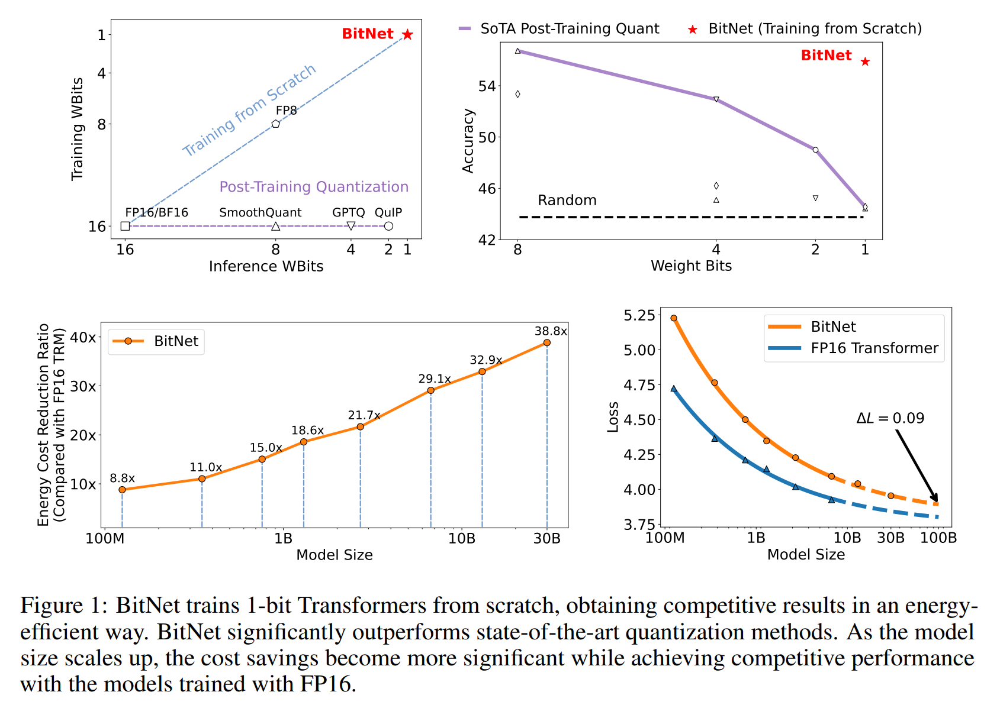
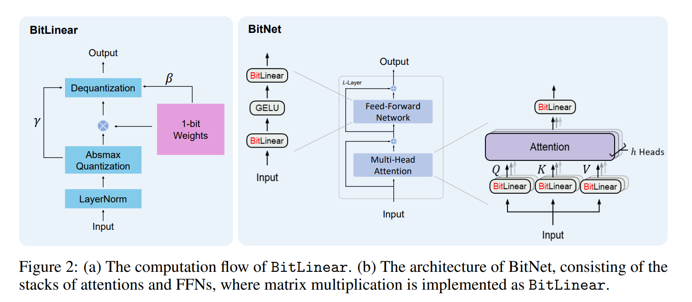
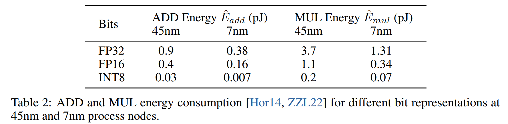
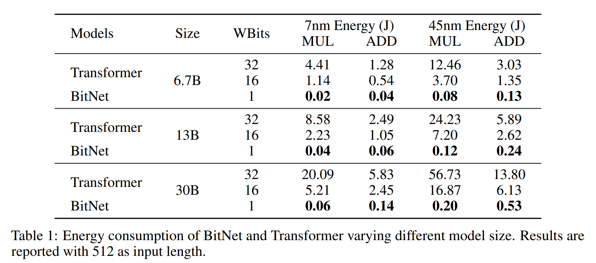
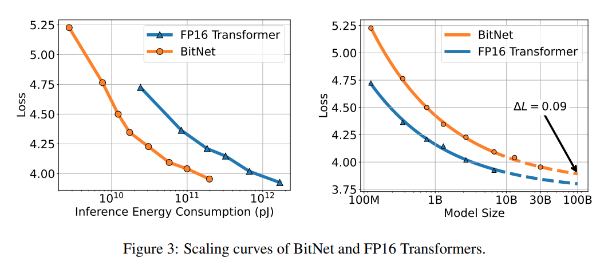
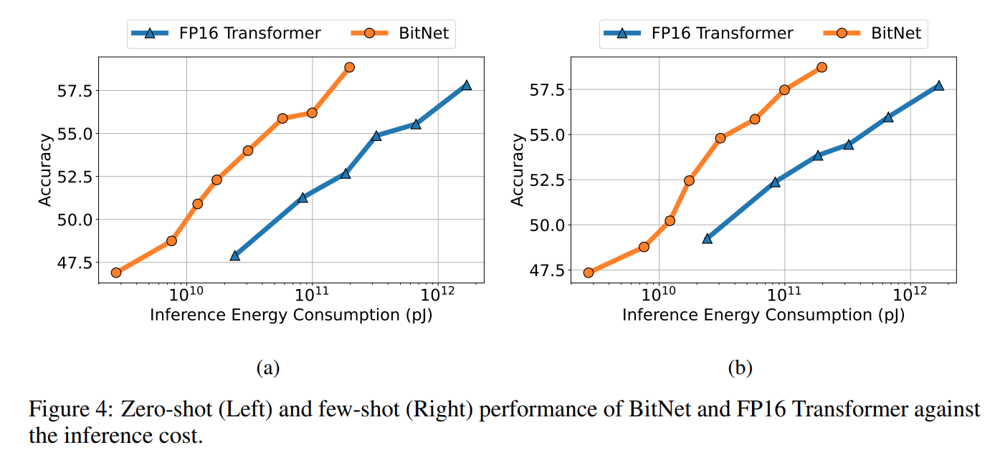
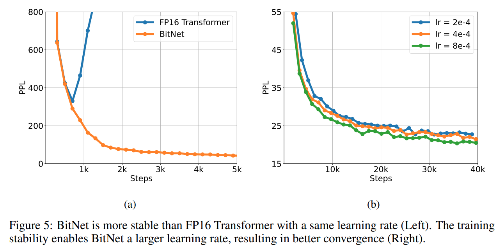
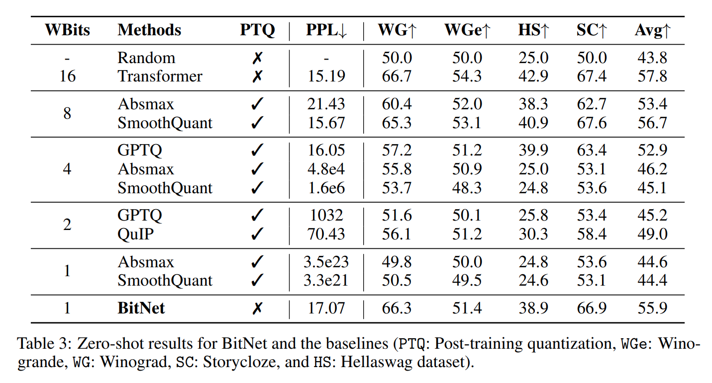
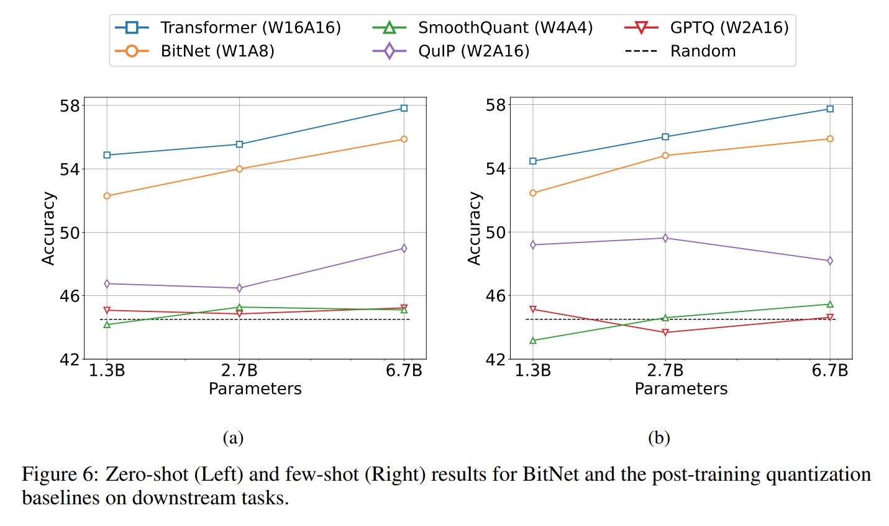
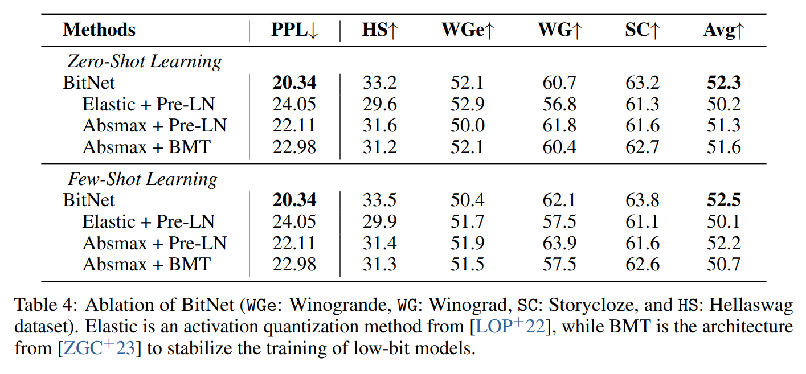

논문 및 이미지 출처 : <https://arxiv.org/pdf/2310.11453>

## Abstract

large language model 의 크기가 점점 커짐에 따라 배포가 어려워지고, 높은 energy consumption 으로 인해 환경적 영향을 초래한다는 문제가 제기되고 있다. 

본 논문에서는 large language model 을 위해 설계된 확장 가능하고 stable 1-bit Transformer architecture 인 **BitNet** 을 소개한다. 

- 특히, `nn.Linear` layer 를 대체할 수 있는 `BitLinear` 를 도입하여 1-bit weight 를 처음부터 학습할 수 있도록 하였다.
-  language modeling 실험 결과, BitNet 은 SOTA 8-bit quantization 방법 및 FP16 Transformer baseline 과 비교하여 memory usage 와 energy consumption 를 대폭 줄이면서도 경쟁력 있는 성능을 달성하였다. 
-  또한, BitNet 은 full-precision Transformer 와 유사한 scaling law 를 따르며, 이는 효율성과 성능을 유지하면서 larger language model 로 확장될 가능성이 있음을 시사한다.  

# 1 Introduction

large language model 의 급속한 발전은 다양한 작업에서 상당한 성능 향상을 이루었다. 하지만, 이러한 모델을 운영하는 데는 high inference costs 및 energy consumption 으로 인해 막대한 비용이 발생한다. model size 증가함에 따라, parameter 를 접근하고 처리하는 데 필요한 memory bandwidth 가 주요 bottleneck 이 되어 전반적인 추론 성능을 제한한다. 또한, 분산 시스템이나 multi-device 플랫폼에 model 을 배포할 때, inter-device 간 통신 overhead 로 인해 inference latency 및 energy consumption 이 더욱 증가할 수 있다. 이러한 문제를 해결하기 위한 방법 중 하나로 **model quantization** 이 주목받고 있다. model quantization 은 large-scale model 의 memory usage 와 computational cost 을 크게 줄이면서도 성능을 유지할 수 있는 유망한 접근 방식이다.  

- 현재 대부분의 large language model quantization 기법은 **post-training quantization** 을 기반으로 한다. post-training quantization 은 training pipeline 을 변경하거나 모델을 다시 학습할 필요 없이 쉽게 적용할 수 있다는 장점이 있다. 그러나 precision 이 낮아질수록 모델이 quantized representation 에 최적화되지 않았기 때문에 accuracy loss 가 더 커지는 문제가 발생한다.  
- quantization 을 고려한 또 다른 접근 방식은 **quantization-aware training** 이다. 
  - post-training quantization 과 비교하면, quantization-aware training 은 낮은 precision 을 처음부터 고려하여 학습하므로 일반적으로 더 나은 정확도를 보인다. 
  - 또한, quantization-aware training 방식은 학습을 지속하거나 fine-tuning 이 가능하다는 점에서 large language model 에 필수적인 요소다. 
  - 그러나 quantization-aware training 은 precision 이 낮아질수록 모델이 수렴하기 어려워지는 **optimization 문제** 를 야기한다. 
  - 더욱이, quantization-aware training 이 neural language model 의 **scaling law** 를 따르는지에 대해서는 아직 명확한 연구가 부족하다.  

본 논문에서는 **binarization** (i.e., 1-bit) 을 large language model 에 적용하는 것을 목표로 한다. 기존의 **binarized neural network** 연구는 주로 convolutional neural network 에 초점을 맞추었으며, 최근에서야 binarized Transformer 에 대한 연구가 진행되고 있다. 그러나 기존 연구들은 machine translation 이나 BERT pretraining 에 집중되어 있으며, 이는 large language model 과는 크게 다르다. 예를 들어, machine translation 은 **encoder-decoder architecture** 를 사용하고, BERT pretraining 은 **bidirectional encoder** 를 활용하는 반면, large language model 은 **unidirectional decoder** 를 사용한다. 또한, large language model 은 훨씬 더 큰 규모로 확장되지만, BERT 나 machine translation 모델은 이처럼 대규모 scaling 이 이루어지지 않는다.

본 연구는 **1-bit large language model 을 위한 quantization-aware training** 을 연구한 최초의 사례다. 

- 저자는 large language model 에 적합한 **1-bit Transformer architecture, BitNet** 을 제안하며, 이는 memory 및 computation 측면에서 효율적으로 확장될 수 있도록 설계되었다. 
- BitNet 은 low-precision binary weights 와 quantized activations 를 사용하면서도, 학습 과정에서 optimizer state 와 gradient 는 high precision 을 유지하도록 한다. 
- 또한, BitNet 의 구조는 매우 간단하여, Transformer 의 linear projection (i.e., PyTorch 의 `nn.Linear`) 을 대체하는 것만으로도 구현할 수 있다. 
- BitNet 은 PagedAttention, FlashAttention, speculative decoding 등 large language model 의 다른 가속화 방법과도 호환된다.

저자는 BitNet 을 다양한 language modeling benchmark 에서 평가하고, SOTA quantization 방법 및 FP16 Transformer 와 비교하였다. 실험 결과, BitNet 은 perplexity 및 downstream task accuracy 면에서 경쟁력 있는 성능을 보였다. 더욱 중요한 점은, BitNet 이 baseline 과 비교했을 때 **memory usage 및 energy consumption 를 현저히 줄인다** 는 것이다. 또한, BitNet 이 full-precision Transformer 와 유사한 **scaling law** 를 따름을 보여주었으며, 이는 larger language model 로 확장하면서도 성능과 효율성을 유지할 수 있는 가능성을 시사한다.  

# 2 BitNet

Fig. 2 처럼, BitNet 은 Transformer 와 동일한 구조를 사용하며, self-attention 및 feed-forward network 를 블록으로 쌓아 올린다. 기존 Transformer 와 비교하면, BitNet 은 일반적인 matrix multiplication 대신 `BitLinear` (Eq. 11) 를 사용하며, 이는 binarized (i.e., 1-bit) model weight 를 적용한다. 실험에서는 다른 구성 요소들은 high-precision (e.g., 8-bit) 으로 유지하였다. 이를 정리하면 다음과 같다.  

1. residual connections 와 layer normalization 의 computational costs 는 large language model 에서 거의 무시할 수 있을 정도로 적다.  
2. model size 가 커질수록 QKV transformation 의 computational cost 는 parametric projection 에 비해 상대적으로 작아진다.  
3. input/output embedding 은 high-precision 을 유지해야 하는데, language model 이 정확한 확률을 기반으로 sampling 을 수행해야 하기 때문이다.  

## 2.1 BitLinear

저자는 먼저 weights 를 $+1$ 또는 $-1$ 로 binarize 하기 위해 **signum function** 을 사용한다. 기존 연구를 따라, binarization 전에 weights 를 zero-mean 으로 중앙 정렬하여 제한된 수치 범위 내에서 capacity 를 증가시킨다. 또한, scaling factor $\beta$ 를 사용하여 binarized weights 와 real-valued weights 간의 $l2$ error 를 줄인다. 

weight $W \in \mathbb{R}^{n \times m}$ 의 binarization 은 다음과 같이 정의된다.  

$$
\begin{equation}
   \tilde{W} = \text{Sign}(W - \alpha)
\end{equation}
$$

$$
\begin{equation}
   \text{Sign}(W_{ij}) =
   \begin{cases} 
   +1, & \text{if } W_{ij} > 0, \\
   -1, & \text{if } W_{ij} \leq 0,
   \end{cases}
\end{equation}
$$

$$
\begin{equation}
   \alpha = \frac{1}{nm} \sum_{ij} W_{ij}
\end{equation}
$$

activation 은 $b$-bit precision 으로 quantize 한다. 기존 연구를 참고하여 **absmax quantization** 방법을 적용하며, activation 값을 $[-Q_b, Q_b]$ 범위로 조정한다. 여기서 $Q_b = 2^{b-1}$ 이며, 이는 input matrix 의 absmax 로 나누어 scaling 된다.

$$
\begin{equation}
   \tilde{x} = \text{Quant}(x) = \text{Clip} \left( x \times\frac{Q_b}{\gamma}, -Q_b + \epsilon, Q_b - \epsilon \right),
\end{equation}
$$

$$
\begin{equation}
   \text{Clip}(x, a, b) = \max(a, \min(b, x)), \quad \gamma = ||x||_{\infty}
\end{equation}
$$

여기서 $\epsilon$ 은 clipping 시 overflow 를 방지하는 small floating-point 값이다.

non-linear functions (e.g., ReLU) 적용 전에 activations 값을 [0, $Q_b$] range 로 조정하기 위해, inputs 의 minimum 을 빼서 모든 값을 non-negative 로 만든다:

$$
\begin{equation}
   \tilde{x} = \text{Quant}(x) = \text{Clip} \left( (x - \eta) \times \frac{Q_b}{\gamma}, \epsilon, Q_b - \epsilon \right), \quad \eta = \min_{ij} x_{ij}
\end{equation}
$$

본 연구에서는 activation 을 8-bit precision 으로 quantize 하였으며, lower precision 에 대한 연구는 이후 진행할 예정이다. 또한, training 시에는 tensor 단위로, inference 시에는 token 단위로 quantization 을 수행하여 stability 및 efficiency 를 모두 확보하였다.

위의 quantization 기법을 바탕으로 matrix multiplication 을 다음과 같이 정의할 수 있다.

$$
\begin{equation}
   y = \tilde{W} \tilde{x}
\end{equation}
$$

여기서, weight $W$ 와 activation $x$ 의 요소들이 서로 독립적이며 같은 분포를 따르고, 두 변수가 상호 독립적이라고 가정한다. 따라서, output $y$ 의 variance 는 다음과 같이 추정된다:

$$
\begin{align}
   \text{Var}(y) &= n \text{Var}(\tilde{w} \tilde{x}) \\
   &= n \mathbb{E}[\tilde{w}^2] \mathbb{E}[\tilde{x}^2] \\
   &= n \beta^2 \mathbb{E}[\tilde{x}^2] \approx \mathbb{E}[\tilde{x}^2]
\end{align}
$$

full-precision 연산에서는 일반적으로 standard initialization 방법 (e.g., Kaiming initialization, Xavier initialization) 을 사용하여 output 의 variance $\text{Var}(y)$ 가 1 scale 로 유지되도록 한다. 이를 통해 training stability 를 확보할 수 있다.  

quantization 후에도 이러한 variance 를 유지하기 위해, activation quantization 이전에 **LayerNorm** 을 도입하였다. 이를 통해 output $y$ 의 variance 를 $\text{Var}(y) \approx \mathbb{E}[\text{LN}(\tilde{x})^2] = 1$ 로 유지할 수 있다. 이는 full-precision 연산의 variance $\text{Var}(y) = 1$ 과 같은 크기를 가지므로, stable training 이 가능하다. 

Transformer 내에서 이를 `SubLN` 과 동일한 방식으로 구현하였다. 위의 quantization 방법과 `SubLN` 을 적용한 `BitLinear` 연산은 다음과 같이 정의된다.

$$
\begin{equation}
   y = \tilde{W} \tilde{x} = \tilde{W} \text{Quant}(\text{LN}(x)) \times \frac{\beta \gamma}{Q_b}
\end{equation}
$$

$$
\begin{equation}
   \text{LN}(x) = \frac{x - \mathbb{E}(x)}{\sqrt{\text{Var}(x) + \epsilon}}, \quad \beta = \frac{1}{nm} ||W||_1
\end{equation}
$$

Fig. 2 는 `BitLinear` 의 computation flow 를 시각적으로 보여준다. `SubLN` 연산을 거친 후 activations 값이 absmax quantization 방식으로 quantize 되고, 1-bit weight 와 quantized activation 간의 matrix multiplication 이 수행된다. 이후, scaling factor $\{\beta$, $\gamma\}$ 를 이용해 output activation 을 다시 dequantize 한다.

#### Model parallelism with Group Quantization and Normalization  

large language model 을 확장하는 데 중요한 기술 중 하나는 **model parallelism** 이며, 이는 matrix multiplication 을 multiple devices 에 걸쳐 분할하여 처리하는 방식이다. 기존 model parallelism 기법은 partition dimension 을 따라 tensor 가 독립적이어야 한다는 전제 조건을 가진다. 하지만 BitNet 에서 사용하는 all parameter $\alpha, \beta, \gamma, \eta$ 는 whole tensor 로부터 계산되므로, 이들이 독립적이지 않다는 문제가 발생한다. 이를 해결하기 위해 all parameter 에 대해 **all-reduce** 연산을 수행할 수도 있지만, 각 parameter 에 대한 통신량은 적어도 model 이 깊어질수록 동기화 비용이 증가하며, 이는 forward pass 속도를 현저히 저하시킨다.  

이 문제를 해결하기 위해, 저자는 model parallelism 을 더욱 효율적으로 만드는 **Group Quantization** 기법을 제안한다. 이는 weights 와 activations 을 여러 groups 로 나눈 후 각 group 의 parameter 를 독립적으로 추정하는 방식이다. 이를 통해 parameter 를 로컬에서 계산할 수 있어 additional communication 이 필요하지 않다. Group Quantization 은 다음과 같이 정의된다.  

weight matrix $W \in \mathbb{R}^{n \times m}$ 를 partition dimension 을 따라 $G$ groups 로 나누고, 각 group 의 크기를 $\frac{n}{G} \times m$ 으로 설정한다. 이후, 각 group 의 parameter 를 독립적으로 추정한다.

$$
\begin{equation}
   \alpha_g = \frac{G}{nm} \sum_{ij} W_{ij}^{(g)}, \quad \beta_g = \frac{G}{nm} ||W^{(g)}||_1
\end{equation}
$$

여기서 $W^{(g)}$ 는 weight matrix 의 $g$-th group 을 의미한다. activation 역시 동일한 방식으로 group 을 나누고 parameter 를 계산한다.

$$
\begin{equation}
   \gamma_g = ||x^{(g)}||_{\infty}, \quad \eta_g = \min_{ij} x_{ij}^{(g)}
\end{equation}
$$

LN 의 경우에도 group normalization 기법을 적용하여, 각 group 의 mean 및 variance 를 독립적으로 계산할 수 있다.

$$
\begin{equation}
   \text{LN}(x^{(g)}) = \frac{x^{(g)} - \mathbb{E}(x^{(g)})}{\sqrt{\text{Var}(x^{(g)}) + \epsilon}}
\end{equation}
$$

이 방식으로 model parallelism 을 **Group Quantization 및 Normalization** 과 함께 효율적으로 구현할 수 있으며, additional communication 없이 large language model 을 확장할 수 있다.  

### 2.2 Model Training

#### Straight-through estimator  

1-bit model 을 학습하기 위해, 저자는 **straight-through estimator (STE)** 를 사용하여 backpropagation 중 gradient 를 근사한다. STE 는 Sign (Eq. 2) 과 Clip (Eq. 5) 과 같은 non-differentiable function 을 backward pass 중 무시하고 gradient 가 network 를 통과할 수 있도록 한다. 이를 통해 quantized model 의 학습이 가능해진다.  

#### Mixed precision training  

weights 와 activations 이 low precision 으로 quantized 되지만, gradient 와 optimizer state 는 high precision 으로 저장하여 training stability 와 정확도를 유지한다. 기존 연구를 참고하여, 저자는 learnable parameter 에 대해 **latent weight** 를 high-precision format 으로 유지하면서, forward pass 시 즉시 binarized 하여 학습을 진행한다. latent weight 는 inference 과정에서 사용되지 않는다.  

#### Large learning rate  

low-bit model 학습의 주요 문제점 중 하나는 **small update 가 1-bit weights 에 영향을 주지 못할 가능성이 높다** 는 점이다. 즉, 1-bit weights 기반으로 추정한 gradient 와 update 가 편향될 수 있다. 특히, 학습 초반에는 모델이 빠르게 수렴해야 하는데, weight update 가 충분하지 않으면 수렴 속도가 저하된다. 이를 해결하기 위해 다양한 방법을 탐색한 결과, **learning rate 를 증가시키는 것이 가장 간단하면서도 효과적인 해결책** 임을 확인하였다.  

실험 결과, BitNet 은 large learning rate 를 사용하면 더 빠르게 수렴하는 반면, FP16 Transformer 는 동일한 learning rate 에서 training 이 발산하는 현상이 나타났다. 이에 대한 자세한 내용은 Sec. 3 에서 논의한다.  

### 2.3 Computational Efficiency  

BitNet 의 computational efficiency 를 arithmetic operation 의 energy 및 memory footprint 관점에서 분석한다. 여기서는 large language model 의 주요 연산인 **matrix multiplication** 에 초점을 맞춘다.  

#### Arithmetic operations energy  

기존 연구에 따르면, 다양한 arithmetic operation 의 energy comsumption 은 아래와 같이 추정된다.  

vanilla Transformer 에서 matrix multiplication 의 energy consumption 은 다음과 같이 계산된다.

$$
\begin{align}
   E_{\text{add}} &= m \times (n - 1) \times p \times \hat{E}_{\text{add}} \\
   E_{\text{mul}} &= m \times n \times p \times \hat{E}_{\text{mul}}
\end{align}
$$

반면, BitNet 은 1-bit weight 를 사용하기 때문에 matrix multiplication 의 energy consumption 은 addition 연산이 지배한다. multiplication 연산은 scalars $\beta$ 및 $\frac{\gamma}{Q_b}$ 를 적용할 때만 사용되므로, 그에 대한 energy consumption 은 다음과 같이 계산된다.

$$
\begin{equation}
   E_{\text{mul}} = (m \times p + m \times n) \times \hat{E}_{\text{mul}}
\end{equation}
$$

이는 Transformer 에서의 energy consumption 보다 훨씬 작다. BitNet (W1A8) 의 energy consumption 를 full-precision (32-32) 및 half-precision (16-16) Transformer 와 비교한 결과는 Tab. 1 에 요약되어 있으며, BitNet 은 특히 multiplication 연산에서 큰 절감 효과를 보였다.  

# 3 Comparison with FP16 Transformers  

## 3.1 Setup  

BitNet 의 scaling 성능을 평가하기 위해, 다양한 크기의 autoregressive language model 을 학습하였다. 125M 에서 30B 까지 다양하게 설정하였다. 모델은 **English-language corpus** 으로 학습되며, 여기에는 **The Pile dataset, Common Crawl snapshots, RealNews, CC-Stories** 등이 포함된다. SentencePiece tokenizer 를 사용하여 데이터를 전처리하였으며, vocabulary size 는 16K 로 설정하였다. BitNet 외에도 동일한 데이터와 설정을 사용하여 Transformer baseline 을 학습하여 공정한 비교를 수행하였다.

## 3.2 Inference-Optimal Scaling Law  

neural language model 은 vanilla Transformer 구조를 사용하여 예측 가능한 scaling 성질을 보인다. loss 는 학습에 사용된 computation 양에 따라 power-law 형태로 변화한다. 이를 통해 주어진 computation budget 에 대한 optimal allocation 을 결정할 수 있으며, smaller models 성능을 바탕으로 larger language models 성능을 예측할 수 있다.  

binarized Transformer 의 scaling law 를 연구하기 위해, BitNet 과 FP16 Transformer baseline 의 parameter 수에 따른 scaling curve 를 먼저 도출하였다. 학습에 사용된 token 수를 고정한 상태에서, 모델 크기를 변화시키면서 실험을 진행하였다.  

Fig. 3 은 BitNet 과 FP16 Transformer 의 loss scaling 관계를 나타낸다. 결과적으로, BitNet 의 loss scaling 은 FP16 Transformer 와 유사한 power-law 를 따르는 것으로 나타났다. 이를 수식으로 표현하면 다음과 같다.  

$$
\begin{equation}
   L(N) = aN^b + c
\end{equation}
$$

또한, scaling law 가 loss 를 얼마나 정확하게 예측하는지 평가하기 위해, 125M 에서 6.7B 크기의 모델을 사용하여 power-law parameter 를 fitting 후, 이를 바탕으로 13B 및 30B 모델의 loss 를 예측하였다. 그 결과, fitted scaling law 는 BitNet 의 loss 를 높은 정확도로 예측할 수 있었다. 한편, BitNet 과 FP16 Transformer 간의 성능 차이는 모델 크기가 증가할수록 점차 감소하는 경향을 보였다.

위의 power-law 는 BitNet 의 scaling 경향을 측정하지만, loss 와 실제 연산량 간의 관계를 정확하게 모델링하지는 않는다. 기존 연구에서는 FLOPs 를 계산하여 연산량을 추정하지만, 이는 **integer computation** 이 비용의 대부분을 차지하는 1-bit model 에 적용되지 않는다. 또한, 이러한 방식은 주로 training computation 을 측정하며, inference 에 대한 고려가 부족하다.  

neural language model 의 scaling efficiency 를 보다 정확하게 이해하기 위해, 저자는 **Inference-Optimal Scaling Law** 를 제안한다. 이는 energy consumption 에 따른 loss 를 예측하는 모델로, training cost 가 한 번만 발생하는 반면 inference cost 는 모델 사용량에 따라 지속적으로 증가하기 때문에 inference energy cost 에 초점을 맞춘다.  

저자는 Sec. 2.3 에서와 동일한 방식으로 energy consumption 을 추정하였다. Fig. 3 은 7nm process node 에서 inference energy cost 에 대한 scaling curve 를 나타낸다. 결과적으로, **BitNet 은 higher scaling efficiency** 를 가지며, 동일한 computation budget 에서 훨씬 더 낮은 loss 를 달성할 수 있음을 확인하였다. 또한, **동일한 성능을 달성하기 위한 inference cost 도 FP16 model 보다 훨씬 작다.**

## 3.3 Results on Downstream Tasks  

loss 외에도, 우리는 BitNet 의 scaling 과정에서 capability 가 어떻게 변화하는지에 관심을 가진다. loss 와 비교하면, neural language model 의 emergent nature 때문에 capacity 를 예측하는 것은 더 어렵다.

capability 를 해석 가능한 지표로 평가하기 위해, 저자는 **zero-shot 및 4-shot** 설정에서 네 가지 downstream task 에 대해 실험을 진행하였다.  

- **HellaSwag**  
- **Winogrande**  
- **Winograd**  
- **Storycloze**  

- Fig. 4 는 다양한 크기의 BitNet 과 FP16 Transformer 에 대한 평균 성능을 보고한다. 결과적으로, **downstream task 성능도 computation budget 이 증가함에 따라 scaling** 하는 패턴을 보였다.  
- 또한, **BitNet 의 scaling efficiency 는 FP16 Transformer baseline 보다 훨씬 더 높았다.** 이는 **zero-shot 및 few-shot learning** 모두에서 일관된 경향을 보였다.  

## 3.4 Stability Test  

low-bit Transformer training 의 가장 큰 도전 과제 중 하나는 **optimization stability** 이다. 따라서, 저자는 BitNet 과 FP16 baseline 에 대해 **stability test** 를 수행하였다. 이를 위해, 여러 모델을 서로 다른 **peak learning rate** 로 학습하면서, 학습 안정성을 평가하였다.  

- Fig. 5a 는 stability test 결과를 나타낸다. 실험 결과, **BitNet 은 높은 learning rate 에서도 안정적으로 수렴하는 반면, FP16 Transformer 는 학습이 divergence 하는 경향** 을 보였다. 즉, **BitNet 은 더 나은 training stability** 를 보이며, 이는 **large learning rate** 를 사용할 수 있도록 만든다. 
- Fig. 5b 는 learning rate 증가에 따른 convergence 속도 를 나타낸다. 실험 결과, **BitNet 은 learning rate 증가에 따라 더 빠르게 수렴하며, perplexity (PPL) 도 개선** 되는 것을 확인할 수 있었다.

# 4 Comparison with Post-training Quantization  

## 4.1 Setup  

BitNet 을 평가하기 위해 Sec. 3.1 과 동일한 설정을 사용하여 모델을 학습하였다. 저자는 BitNet 을 기존의 SOTA quantization 방법들과 비교하였으며, 여기에는 **Absmax, SmoothQuant, GPTQ, QuIP** 이 포함된다.  

이러한 방법들은 FP16 Transformer model 을 대상으로 post-training quantization 을 수행하며, BitNet 과 동일한 데이터와 학습 설정을 사용한다.  

- **Absmax, SmoothQuant**: weights 와 activations 를 모두 quantize.
- **GPTQ, QuIP**: weights 만 quantize.  

각 방법을 다양한 quantization level 에 적용하여 실험을 수행하였다.

- **Weight-only quantization**: W4A16, W2A16 실험.  
- **Weight-and-activation quantization**: W8A8, W4A4, W1A8 실험.  
- **BitNet**: W1A8 사용.

BitNet 의 구현은 binary weight (W1) 와 8-bit activation (A8) 을 사용하며, 이는 baseline 모델들의 precision 보다 낮거나 동일하다.  

### 4.2 Results  

Tab. 3 은 제안한 방법인 BitNet 과 여러 baseline 방법들을 네 가지 benchmark dataset (Winogrande, Winograd, Storycloze, Hellaswag) 에서 비교한 **zero-shot 성능 분석 결과** 를 제시한다. 공정한 비교를 위해, 모든 모델의 크기는 6.7B 로 설정하였다.  

모델들은 weight bit precision 을 16-bit 에서 1-bit 까지 다양하게 설정하여 평가하였으며, downstream task 에 대한 zero-shot accuracy 뿐만 아니라, validation set 에서의 language model perplexity (PPL) 도 측정하여 성능을 종합적으로 분석하였다.  

실험 결과, **BitNet 은 baseline 방법들과 비교했을 때 경쟁력 있는 성능을 보였으며, 특히 lower-bit 모델에서 강력한 성능을 보였다.**  

- BitNet 의 zero-shot 성능은 8-bit 모델과 유사하지만, inference cost 는 훨씬 낮았다.  
- 4-bit 모델에서, weight-only quantization 방법이 weight-and-activation quantization 방법보다 더 나은 성능을 보였다. 이는 activation quantization 이 더 어려운 문제이기 때문이다.  
- BitNet (1-bit 모델) 은 weight-and-activation quantization 방법과 weight-only quantization 방법을 모두 능가하는 성능을 달성하였다.  
- lower-bit 모델에서, BitNet 은 모든 baseline 방법을 지속적으로 초월하는 성능을 기록하였다.  

이는 **quantization-aware training** 방법이 **post-training quantization** 방법보다 우수함을 증명하는 결과이다.  

Fig. 6 은 모델 크기를 1.3B 에서 6.7B 까지 확장하면서, **zero-shot 및 few-shot accuracy** 를 비교한 결과를 요약한다. 실험 결과, **BitNet 의 성능 우위는 모델 크기에 관계없이 일관되게 유지되었다.**

## 5 Ablation Studies  

Tab. 4 에서는 여러 대체 접근 방식과 비교한 ablation study 결과를 제시한다. 저자는 activation quantization 방법 및 model training stability 를 위한 기법들이 BitNet 성능에 미치는 영향을 분석하였다.  

BitNet 은 activation quantization 을 위해 **absmax** 를 사용하며, 학습 안정성을 위해 `SubLN` 을 적용하였다.  

- **Elastic function**: learnable parameter 를 활용하여 scale factor 를 동적으로 조정하는 quantization 방법.  
- **Pre-LN**: GPT pretraining 에서 기본적으로 사용하는 normalization 방식.  
- **BMT architecture**: binarized model 학습 안정성을 높이기 위해 설계된 구조.  

실험 결과는 다음과 같다.  

1. **Absmax quantization 이 Elastic function 보다 더 나은 성능을 보였다.**  
   - Elastic function 은 learnable scale factor 를 사용하지만, Absmax 가 더 안정적인 학습을 가능하게 하며 더 나은 결과를 제공하였다.  
2. **Absmax quantization 은 더 높은 learning rate 를 사용할 수 있도록 해 주었다.**  
   - training stability 가 향상되면서 BitNet 은 larger learning rate 에서도 안정적으로 학습이 가능하였다.  
3. **SubLN 이 Pre-LN 및 BMT 보다 더 우수하였다.**  
   - Pre-LN 은 기존 GPT 모델에서 사용하는 구조이지만, low-bit model 학습에는 최적화되어 있지 않았다.  
   - BMT 는 binarized model 의 학습 안정성을 높이기 위해 설계된 구조지만, `SubLN` 보다 낮은 성능을 보였다.  

따라서, **BitNet 은 Absmax quantization 과 SubLN 구조를 최적의 조합으로 사용하였다.**

## 6 Conclusion and Future Work  

본 논문에서는 **BitNet** 이라는 새로운 **1-bit Transformer architecture** 를 제안하였다. BitNet 은 large language model 을 위한 확장 가능하고 stable 구조를 가지며, 다음과 같은 주요 성과를 보였다.  

- **BitNet 은 perplexity 및 downstream task 성능 면에서 경쟁력 있는 결과를 달성하였다.**  
- **BitNet 은 기존 Transformer 에 비해 memory usage 와 energy consumption 를 크게 줄였다.**  
- **BitNet 은 full-precision Transformer 와 유사한 scaling law 를 따른다.**  
   - 이를 통해, larger language model 로 확장할 경우에도 성능과 효율성 측면에서 이점을 유지할 가능성이 높다.  