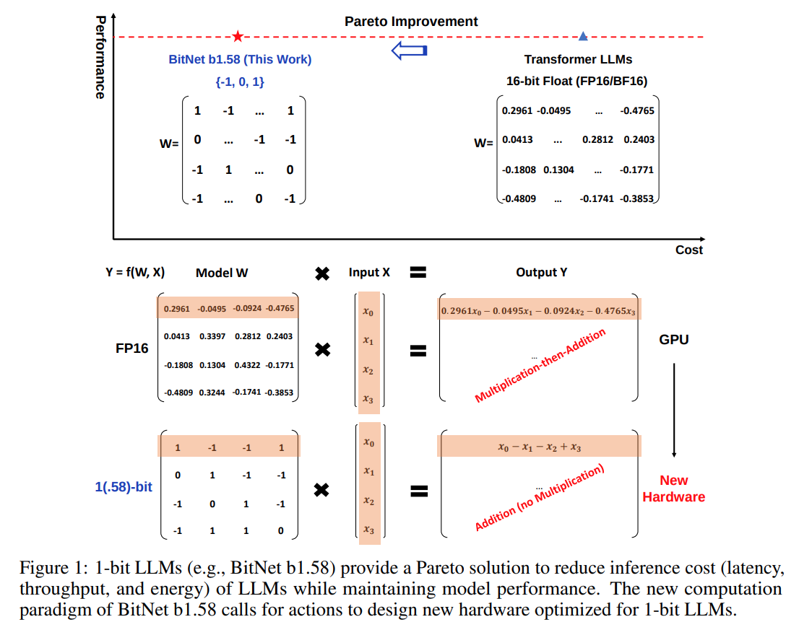
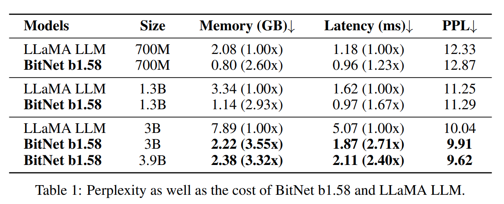
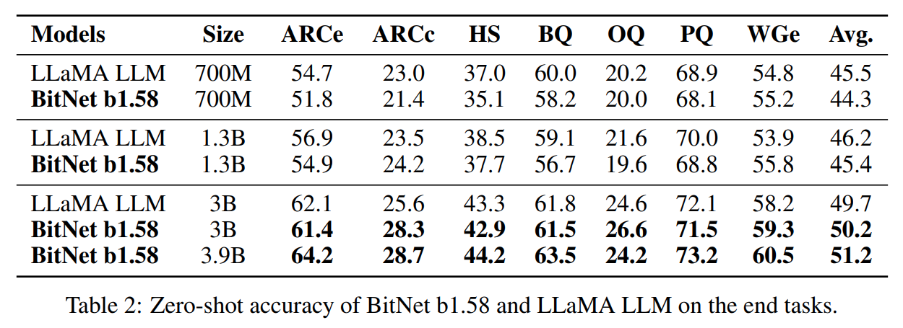
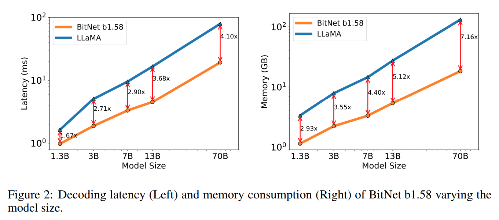
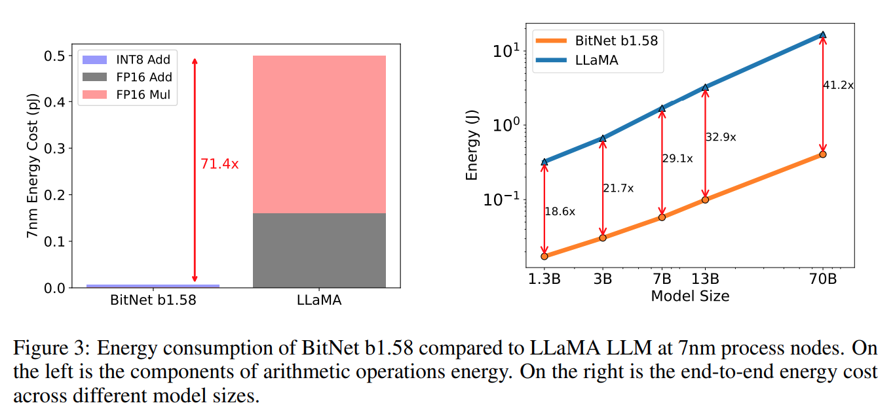
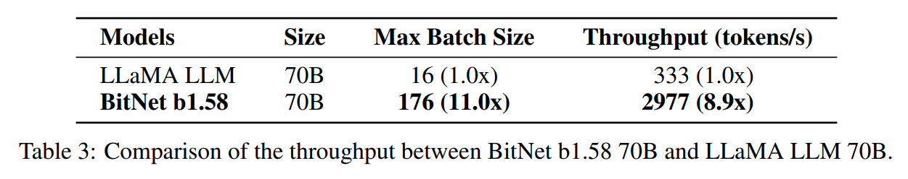
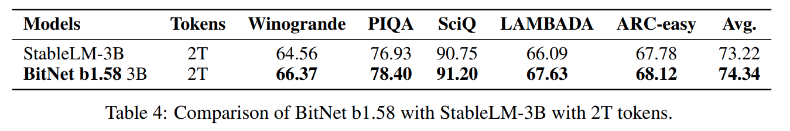

논문 및 이미지 출처 : <https://arxiv.org/pdf/2402.17764>

# Abstract

BitNet 같은 최근 연구는 1-bit Large Language Models (LLMs) 의 새로운 시대를 열어가고 있다.

본 논문에서 저자는 LLM 의 모든 single parameter (or weight) 가 ternary $\{-1, 0, 1\}$ 인 **BitNet b1.58** 이라는 1-bit LLM variant 를 소개한다. 이는 perplexity 및 end-task performance 두 측면에서 동일한 모델 크기와 training tokens 에서 full-precision (i.e., FP16 or BF16) Transformer LLM 과 동일한 성능을 내면서도 latency, memory, throughput 및 energy consumption 측면에서 상당히 cost-effective 하다.

더 깊게 말해, 1.58-bit LLM 은 high-performance 및 cost-effective 인 차세대 LLMs 를 훈련하기 위해 scaling law 및 recipe 를 정의한다. 게다가, 이는 1-bit LLMs 에 최적화된 특정 하드웨어 설계에 대한 새로운 계산 패러다임과 문을 열어준다.

# 1 The Era of 1-bit LLMs

최근 몇 년 동안 AI 에서는 Large Language Models (LLMs) 의 크기와 성능이 급격히 성장했다. 이러한 모델들은 다양한 natural language processing tasks 에서 뛰어난 성능을 보여주었지만, 모델 크기의 증가로 인해 배포에 어려움이 따르고, high energy consumption 로 인한 환경적, 경제적 영향에 대한 우려가 제기되었다. 이러한 문제를 해결하기 위한 한 가지 접근 방식은 **post-training quantization** 을 사용하여 **low-bit models** 를 생성하는 것이다. 이는 weights 와 activations 의 precision 을 줄여 LLMs 의 memory 및 computational requirements 를 크게 줄이는 기법이다. 최근에는 16-bit 에서 4-bit 로 이동하는 경향이 있다. 하지만, post-training quantization 은 industy LLMs 에 널리 사용되고 있음에도 불구하고 최적의 방법은 아니다.

1-bit model architectures 와 관련된 최근 연구, 예를 들어 BitNet 은 LLMs 의 비용을 줄이면서도 성능을 유지할 수 있는 유망한 방향을 제시한다. Vanilla LLMs 는 16-bit floating-point values (i.e., FP16 or BF16) 을 사용하며, 대부분의 연산은 **matrix multiplication** 에 의해 이루어진다. 따라서, 주요 computation cost 는 floating-point addition 과 multiplication 에서 발생한다. 반면, BitNet 의 matrix multiplication 은 integer addition 만 포함하므로, LLMs 의 energy cost 를 대폭 절감할 수 있다. 많은 칩에서 연산 성능의 근본적인 한계는 전력 소비이므로, energy sasvings 는 연산 속도의 증가로도 이어질 수 있다.

연산뿐만 아니라, DRAM 에서 on-chip accelerator (e.g., SRAM) 로 model parameters 를 전송하는 과정도 inference 중에 큰 비용이 든다. SRAM 을 확대하여 throughput 을 높이려는 시도가 있었지만, 이는 DRAM 보다 훨씬 높은 비용이 든다. 반면, 1-bit LLMs 는 full-precision models 보다 훨씬 낮은 memory footprint 와 bandwidth standpoint 를 가지므로, DRAM 에서 weight 를 로드하는 데 필요한 비용과 시간을 크게 줄일 수 있어 더 빠르고 효율적인 inference 가 가능해진다.

이 연구에서는 **BitNet b1.58** 이라는 중요한 1-bit LLM 변형을 소개한다. 이 모델의 모든 parameter 는 ternary values $\{-1, 0, 1}\$ 을 갖는다. 기존 1-bit BitNet 에 0 값을 추가하여, binary system 에서 1.58-bit 를 제공한다. BitNet b1.58 은 기존 1-bit BitNet 의 모든 장점을 유지하면서도, 거의 multiplication 이 필요 없는 matrix multiplication 방식을 사용하여 최적화할 수 있다. 또한, energy consumption 은 기존 1-bit BitNet 과 동일하며, FP16 LLM 대비 memory consumption, throughput 및 latency 면에서 훨씬 효율적이다. 

게다가, BitNet b1.58 은 두 가지 추가적인 장점을 제공한다. 1) model weights 에 0 을 포함함으로써 feature filtering 을 명시적으로 지원할 수 있어, 1-bit LLMs 의 성능을 크게 향상시킨다. 2) 실험 결과 BitNet b1.58 은 3B 이상의 모델 크기에서 full-precision (FP16) LLM 과 동일한 perplexity 및 end-task 성능을 달성할 수 있음을 보여주었다.

# 2 BitNet b1.58

BitNet b1.58 은 BitNet architecture 를 기반으로 하며, Transformer 구조에서 `nn.Linear` 를 `BitLinear` 로 대체한다. 이 모델은 처음부터 1.58-bit weights 와 8-bit activations 로 훈련되었다. 기존 BitNet 과 비교하여, 다음과 같은 몇 가지 수정 사항이 추가되었다.

#### Quantization Function

weights 를 $-1$, $0$, or $+1$ 로 제한하기 위해, **absmean quantization function** 을 적용하였다. 이 방법은 weight matrix 를 average absolute value 로 scaling 후, 각 값을 $\{-1, 0, +1\}$ 중 nearest integer 로 반올림한다.

$$
\begin{equation}
    \tilde{W} = \text{RoundClip}\left( \frac{W}{\gamma + \epsilon}, -1, 1 \right)
\end{equation}
$$

$$
\begin{equation}
    \text{RoundClip}(x, a, b) = \max(a, \min(b, \text{round}(x)))
\end{equation}
$$

$$
\begin{equation}
    \gamma = \frac{1}{nm} \sum_{ij} |W_{ij}|.
\end{equation}
$$

activations 에 대한 quantization function 은 BitNet 의 기존 구현을 따른다. 다만, non-linear function 전에 activations 을 $[0, Qb]$ 범위로 scaling 하지 않고, 대신 token 단위로 activations 을 $[-Qb, Qb]$ 범위로 scaling 하여 zero-point quantization 을 제거하였다. 이는 구현과 시스템 수준 최적화를 더 간편하게 만들면서도 성능에는 거의 영향을 미치지 않는다.

#### LLaMA-alike Components

LLaMA architecture 는 현재 open-source LLMs 의 대표적인 backbone 이다. 따라서, open-source community 를 고려하여 BitNet b1.58 은 LLaMA 와 유사한 구성 요소를 사용한다. 구체적으로, RMSNorm, SwiGLU, rotary embedding 을 적용하며, 모든 bias 항을 제거하였다. 이를 통해 BitNet b1.58 은 Huggingface, vLLM, llama.cpp 등의 popular open-source 소프트웨어에 쉽게 통합될 수 있다.

# 3 Results

BitNet b1.58 을 FP16 LLaMA LLM 과 다양한 크기로 비교하였다. 공정한 비교를 위해, 두 모델 모두 RedPajama dataset 에 대해 100 billion tokens 로 pre-training 하였다. 평가에는 다양한 language tasks 를 포함하였으며, ARC-Easy, ARC-Challenge, Hellaswag, Winogrande, PIQA, OpenbookQA, BoolQ 등의 zero-shot 성능을 측정하였다. 또한, WikiText2 와 C4 dataset 에 대한 validation perplexity 도 보고하였다.

LLaMA LLM 과 BitNet b1.58 의 runtime GPU memory 및 latency 도 비교하였다. 결과는 LLM inference latency 에 최적화된 FasterTransformer 코드베이스를 사용하여 측정되었다. 또한, BitNet b1.58 의 2-bit kernel 에 Ladder 를 통합하여 평가하였다. 주요 비용이 발생하는 output token 당 처리 시간을 보고하였다.

Tab. 1 은 BitNet b1.58 과 LLaMA LLM 의 perplexity 및 비용을 요약한 것이다. 

BitNet b1.58 은 3B 모델 크기에서 full-precision LLaMA LLM 과 perplexity 면에서 동등한 성능을 나타내며, 2.71 배 빠르고 3.55 배 적은 GPU memory 를 사용한다. 특히, 3.9B 모델 크기의 BitNet b1.58 은 3B LLaMA LLM 보다 2.4 배 빠르고 3.32 배 적은 memory 를 사용하면서도 더 나은 성능을 보여준다.

Tab. 2 는 end tasks 에 대한 zero-shot accuracy 의 상세한 결과를 보여준다.

_lm-evaluation-harness_ pipeline 을 따라 평가를 수행하였다. 결과에 따르면, 모델 크기가 증가할수록 BitNet b1.58 과 LLaMA LLM 간의 성능 차이가 줄어든다. 더욱 중요한 점은, BitNet b1.58 이 3B 크기부터 full-precision baseline 과 동등한 성능을 달성할 수 있다는 것이다.  

Perplexity 관찰 결과와 마찬가지로, end-task 결과에서도 BitNet b1.58 3.9B 가 LLaMA LLM 3B 를 뛰어넘으며, lower memory 및 latency cost 를 가진다는 것이 확인되었다. 이는 BitNet b1.58 이 최신 LLM models 대비 Pareto improvement 를 제공한다는 것을 보여준다.

#### Memory and Latency

모델 크기를 7B, 13B, 70B 로 확장하여 비용을 평가하였다. 

Fig. 2 는 latency 와 memory 소비 경향을 나타내며, 모델 크기가 증가할수록 속도 향상이 더욱 커진다는 점을 보여준다. 특히, 70B BitNet b1.58 은 LLaMA LLM baseline 대비 4.1 배 빠르다. 이는 `nn.Linear` 연산 시간이 모델 크기에 따라 증가하기 때문이다. memory 소비도 유사한 경향을 보이며, embedding 이 full-precision 으로 유지되면서 큰 모델에서는 memory 비율이 작아진다. 모든 latency 및 memory 는 2-bit kernel 로 측정되었으며, 추가적인 최적화를 통해 비용을 더욱 줄일 여지가 있다.

#### Energy

BitNet b1.58 과 LLaMA LLM 의 연산 energy consumption 를 추정하였다. matrix multiplication 은 LLMs 의 가장 큰 비용 요소이므로, 주요 분석 대상으로 삼았다. Fig. 3 은 computation cost  구성 요소를 나타낸다.

BitNet b1.58 은 대부분 INT8 addition 으로 구성된 반면, LLaMA LLM 은 FP16 addition 및 FP16 multiplication 을 포함한다. 기존 연구의 energy model 을 참고하면, BitNet b1.58 은 7nm 칩에서 matrix multiplication 연산 energy consumption 를 71.4 배 절감할 수 있다.

512 tokens 에 대한 end-to-end energy consumption 도 측정하였다. 결과에 따르면, 모델 크기가 증가할수록 BitNet b1.58 은 FP16 LLaMA LLM 대비 더욱 효율적으로 에너지를 소비한다. 이는 모델 크기가 증가함에 따라 `nn.Linear` 연산 비율이 커지기 때문이며, 다른 구성 요소에서 발생하는 비용은 상대적으로 감소하기 때문이다.

#### Throughput

70B parameters 를 가진 BitNet b1.58 과 LLaMA LLM 의 throughput 을 비교하였다. 두 개의 80GB A100 GPU 를 사용하고, pipeline parallelism 기법을 활용하여 LLaMA LLM 70B 모델이 실행 가능하도록 하였다. GPU memory 한계에 도달할 때까지 batch size 를 증가시키며, sequence length 는 512 로 설정하였다. 

Tab. 3 은 70B BitNet b1.58 이 LLaMA LLM 대비 최대 11 배의 batch size 를 지원하며, 8.9 배 높은 throughput 을 제공함을 보여준다.

#### BitNet b1.58 is enabling a new scaling law with respect to model performance and inference cost.

Fig. 2 와 Fig. 3 의 결과를 기반으로, 1.58-bit 모델과 16-bit 모델 간의 크기 대응 관계는 다음과 같다.  

- 13B BitNet b1.58 은 latency, memory usage, energy consumption 측면에서 3B FP16 LLM 보다 더 효율적이다.  
- 30B BitNet b1.58 은 latency, memory usage, energy consumption 측면에서 7B FP16 LLM 보다 더 효율적이다.  
- 70B BitNet b1.58 은 latency, memory usage, energy consumption 측면에서 13B FP16 LLM 보다 더 효율적이다.  

#### Training with 2T Tokens  

LLMs 에서 training tokens 의 수는 중요한 요소이다. BitNet b1.58 의 tokens 규모에 따른 확장성을 테스트하기 위해, StableLM-3B 의 data recipe 를 따르며 2T tokens 로 BitNet b1.58 모델을 훈련하였다. StableLM-3B 는 SOTA open-source 3B model 이다.  

두 모델은 Winogrande, PIQA, SciQ, LAMBADA, ARC-easy 로 구성된 benchmark 에서 평가되었다. zero-shot accuracy 결과는 Tab. 4 에 보고되었으며, accuracy 와 normalized accuracy 로 측정된 작업에서는 두 값의 평균을 사용하였다. StableLM-3B 의 2T tokens 결과는 해당 모델의 technical report 에서 직접 가져왔다.

실험 결과, BitNet b1.58 은 모든 end-task 에서 더 우수한 성능을 달성하였다. 이는 1.58-bit LLMs 가 높은 generalization capabilities 를 가지고 있음을 시사한다.

### 4 Discussion and Future Work  

#### 1-bit Mixture-of-Experts (MoE) LLMs  

Mixture-of-Experts (MoE) 는 LLMs 에서 computation cost 을 절감할 수 있는 효과적인 방법으로 입증되었다. MoE 는 연산 FLOPs 를 크게 줄일 수 있지만, 높은 memory consumption 과 inter-chip communication overhead 가 발생하여 배포 및 활용에 제한이 있다. 이러한 문제는 1.58-bit LLMs 를 통해 해결할 수 있다.  

1) 1.58-bit LLMs 는 memory footprint 가 작아져, MoE models 배포에 필요한 장치 수를 줄일 수 있다. 2) activations 을 네트워크를 통해 전송하는 데 드는 비용을 크게 줄일 수 있다. 궁극적으로, 만약 전체 model 이 single chip 에 배치될 수 있다면 inter-chip communication overhead 는 완전히 제거될 것이다.  

#### Native Support of Long Sequence in LLMs  

LLMs 시대에서 long sequence 를 처리하는 능력은 중요한 요구 사항이 되었다. long sequence inference 의 주요 도전 과제 중 하나는 KV caches 가 차지하는 memory consumption 이다. BitNet b1.58 은 activations 을 16-bit 에서 8-bit 로 줄여 같은 자원에서 context length 를 두 배로 늘릴 수 있도록 지원한다.  

추가적으로, 1.58-bit LLMs 의 경우 lossless compression 을 통해 activations 을 4-bit 이하로 줄일 수도 있다. 이는 더욱 효율적인 long sequence 처리 방식으로 이어질 수 있으며, 향후 연구에서 다룰 계획이다.  

#### LLMs on Edge and Mobile  

1.58-bit LLMs 는 edge 및 mobile devices 에서의 LLMs 성능을 크게 향상시킬 가능성이 있다. 이러한 장치들은 종종 memory 와 computational power 가 제한적이기 때문에 LLMs 의 성능과 규모가 제약을 받는다. 그러나, 1.58-bit LLMs 의 낮은 memory 와 energy consumption 덕분에 edge 및 mobile 환경에서도 실행할 수 있게 된다.  

이를 통해 이전에는 불가능했던 다양한 응용 사례들이 가능해질 것이다. 또한, 1.58-bit LLMs 는 CPU 에서 더욱 효율적으로 실행될 수 있는데, CPU 는 대부분의 edge 및 mobile devices 에서 주요 연산 장치로 사용된다. 따라서 BitNet b1.58 은 이러한 장치에서 높은 성능을 발휘할 수 있으며, 이를 통해 edge AI 및 mobile AI 응용이 더욱 발전할 것으로 기대된다.  

#### New Hardware for 1-bit LLMs  

최근 연구들은 LLMs 에 최적화된 새로운 hardware, 예를 들어 LPUs (Language Processing Units) 를 개발하는 방향을 탐색하고 있다. 이를 한 단계 더 발전시켜, BitNet 이 제공하는 새로운 computation paradigm 을 고려하여 1-bit LLMs 에 최적화된 hardware 및 system 설계를 추진할 필요가 있다.  

1-bit 연산 방식을 기반으로 하는 새로운 hardware 는 inference latency, memory usage 및 energy consumption 을 더욱 획기적으로 줄일 수 있다. 이를 통해 LLMs 의 확장성이 더욱 향상될 것이며, 대규모 모델을 더욱 효율적으로 운용할 수 있을 것이다.
