논문 및 이미지 출처 : <https://arxiv.org/pdf/2411.04965>

# Abstract

최근 1-bit Large Language Models (LLMs) 에 대한 연구, 예를 들어 BitNet b1.58, 는 LLM 의 inference cost 를 줄이면서도 성능을 유지하는 유망한 방향을 제시한다. 

본 논문에서는 1-bit LLM 을 위한 4-bit activations 를 가능하게 하는 **BitNet a4.8** 을 소개한다. 

- BitNet a4.8 은 outlier channels 로 인해 발생하는 quantization errors 를 줄이기 위해 **hybrid quantization 및 sparsification 전략**을 활용한다. 
  - 구체적으로, attention 및 feed-forward network (FFN) layer 의 inputs 에 대해 4-bit activation 을 사용하고, intermediate states 는 sparsification 후 8-bit quantization 을 적용한다.
- 광범위한 실험 결과, BitNet a4.8 은 BitNet b1.58 과 동등한 training costs 로 유사한 성능을 달성하면서도 4-bit (INT4/FP4) kernel 을 활성화하여 faster inference 를 보인다. 
- 또한, BitNet a4.8 은 전체 parameter 의 55% 만 활성화하며, 3-bit KV cache 를 지원하여 large-scale LLM 배포 및 추론의 효율성을 더욱 향상시킨다.  

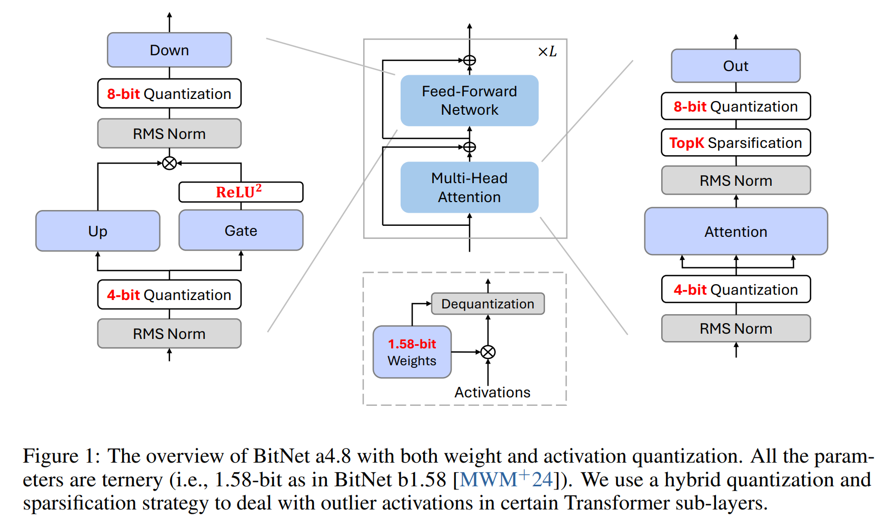

# 1 Introduction

최근 연구에 따르면, **1-bit LLM** 은 동일한 parameter 및 training token 수를 사용할 경우 full-precision model 과 유사한 성능을 보이면서도 **latency, memory, throughput, energy consumption** 면에서 상당한 비용 절감을 가능하게 한다.

**1.58-bit weight** (i.e., $\{-1, 0, 1\}$) 를 사용하는 경우, inference bottleneck 이 제한된 memory bandwidth 에서 high computational cost 로 이동한다. 따라서, LLM 에서 low-bit 또는 sparse activation 을 활용하는 것은 computational budget 을 더욱 줄이면서도 downstream task 의 성능을 유지하는 유망한 접근 방식이다.  

Sparsification 외에도, **activation quantization** 은 matrix multiplication 연산을 가속하는 또 다른 방법이다.  그러나, low-bit activation 을 사용하는 neural network 최적화는 몇 가지 어려움이 동반한다.

특히, 학습이 진행되고 model 크기가 커질수록 outlier dimension 이 나타나는 현상이 발생한다. 이러한 outlier 들은 전체 activation 중 극히 일부에 불과하지만, much larger magnitude 를 가지므로 quantization error 가 증가하며,  
결과적으로 downstream task 의 성능 저하를 초래한다.  

기존 연구에서는 이러한 문제를 해결하기 위해 **Hadamard 또는 learnable rotary transformation** 을 활용하여  
**outlier feature 를 other entries 로 분산시키는 방법**을 사용했다. 그러나, 이러한 기법들은 주로 higher precision LLM (e.g., 4-bit) 을 대상으로 설계되었으며, 1-bit LLM 에서는 weights bit-width 가 극도로 낮기 때문에 transformation matrix 를 직접 weight 에 흡수하는 것이 어렵다. 또한, 이러한 변환을 **online transformation** 으로 적용할 경우, 추가적인 연산 비용이 발생하여 전체적인 inference 성능이 저하되는 문제가 있다.  

본 연구에서는 **BitNet a4.8** 을 도입하여 1-bit LLM 에서 4-bit activation 을 가능하게 하는 **hybrid quantization 및 sparsification 전략** 을 제안한다.

1-bit LLM 의 activation distribution 을 면밀히 분석한 후, activation distribution pattern 에 따라 4-bit quantization 또는 sparsification 을 선택적으로 적용한다.  

구체적으로, **BitNet a4.8** 은 다음과 같은 방식을 사용한다:
- **Attention 및 FFN layer 의 inputs** 에 **4-bit activation** 을 적용  
- **intermediate state** 에 대해서는 **8-bit sparsification** 을 적용  

또한, training efficiency 를 높이기 위해, BitNet a4.8 은 8-bit activation 에서 시작하여 4-bit activation 으로 전환하는 two-stage recipe 를 을 따른다. 이 접근 방식 덕분에, **BitNet b1.58 을 low-bit activation 에 빠르게 적응시키면서도 few training token 만으로도 높은 성능을 유지** 할 수 있다.  

광범위한 실험 결과, **BitNet a4.8 은 BitNet b1.58 과 동일한 training cost 로 동등한 성능을 유지하면서도 inference  efficiency 가 크게 향상됨**을 확인했다. 또한, **BitNet a4.8 은 전체 parameter 의 55% 만 활성화하며, 3-bit KV cache 를 지원**하여 large-scale LLM 배포 및 추론의 효율성을 더욱 높인다.

# 2 BitNet a4.8

## 2.1 Architecture

Fig. 1 에서 볼 수 있듯이, BitNet a4.8 은 BitNet b1.58 과 동일한 구조를 따른다.

기존 연구를 참고하여, attention 과 feed-forward network (FFN) 에 있는 linear projections 를 `BitLinear` 로 대체하여 1.58-bit weights 를 처음부터 학습할 수 있도록 설계했다. 또한, activations 에 대해 **hybrid quantization 및 sparsification 전략**을 적용하여 outlier dimension 으로 인해 발생하는 오류를 최소화했다.

Fig. 2 는 7B model size 의 BitNet b1.58 model 을 사용하여 각 구성 요소의 input distribution 을 시각화한 결과다.  

Attention 및 FFN layer 의 input distribution  일반적으로 Gaussian-like 한 형태를 보이는 반면, FFN down projection 및 self-attention output projection 의 경우 outlier channel 이 많고, 대부분의 값이 zero 주변에 집중되어 있다. 이러한 현상은 full-precision LLM 에서도 유사하게 관찰된다.  

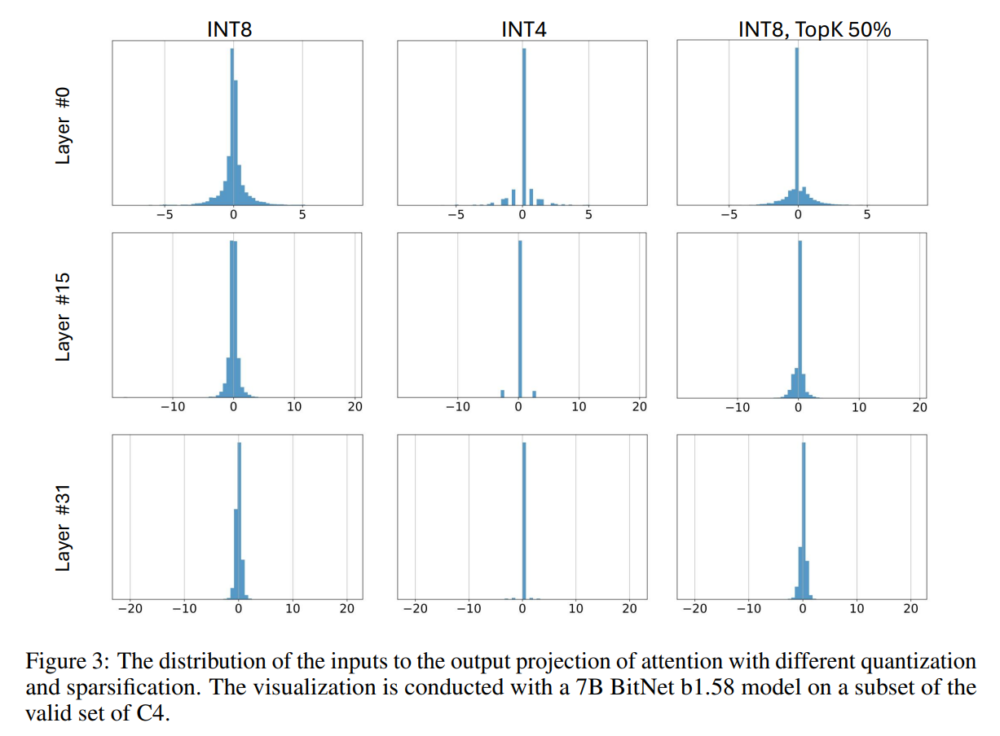

Fig. 3 에서 확인할 수 있듯이, 이러한 intermediate states 에 대해 low-bit quantization 을 직접 적용하면 심각한 quantization error 가 발생할 수 있다. 따라서, Q-Sparse 기법을 사용하여 intermediate states 를 8-bit 로 유지하면서 sparsification 을 적용하여 computation bottleneck 을 제거했다.

Self-attention layers 의 output projection 에 대해서는 아래와 같은 **sparsify-then-quantize function** 을 사용했다:

$$
\begin{equation}
    Y = (Q_\text{INT8}(X) \odot M) \cdot Q_w(W)^T , \quad M = \text{Top}_k(|X|)
\end{equation}
$$

여기서 $Q_w(\cdot)$ 와 $Q_\text{INT8}(\cdot)$ 는 각각 weight $W$ 와 activations $X$ 의 quantization function 을 의미하며, $M$ 은 activations $X$ 의 abs values 가 maximum top-$K$ elements 를 나타내는 mask tensor 이다. $\odot$ 는 element-wise multiplication 을 의미한다.  

특히, Weight quantization 과 activation quantization function 은 아래와 같이 정의된다:  

$$
\begin{align}
    &Q_w(W) = \alpha \text{RoundClip} \left( \frac{W}{\alpha + \epsilon}, -1, 1 \right), \quad \alpha = \text{mean}(|W|) \\
    &Q_\text{INT8}(X) = \frac{\gamma}{127} \text{RoundClip} \left( \frac{127}{\gamma + \epsilon} X, -128, 127 \right), \quad \gamma = \max(|X|) \\
    &\text{RoundClip}(X, a, b) = \min(\max(\text{round}(X), a), b)
\end{align}
$$

FFN 에 대해서는 activation sparsity 를 극대화하기 위해 **squared ReLU 및 gated linear unit (GLU) 기법** 을 적용했다:  

$$
\begin{equation}
    \text{ReLU}^2\text{GLU}(X) = XW_{\text{up}}^T \odot \text{ReLU}^2(XW_{\text{gate}}^T)
\end{equation}
$$

사전 실험 결과, squared ReLU 를 적용했을 때 FFN down projection 의 input sparsity 가 80% 이상 증가했으며, 성능에 미치는 영향은 미미했다. 또한, gate projection 의 outputs $\text{ReLU}^2(XW_{\text{gate}}^T)$ 도 high activation sparsity 를 보였다 (e.g., 7B models 에서 67.5%).

이 특성을 활용하면 gate projection 을 먼저 수행한 후, gate 에서 non-zero 로 선택된 채널에 대해서만 up projection 연산을 수행할 수 있다. 이로 인해 **FFN up projection 의 FLOPs 를 더욱 감소**시킬 수 있다.  

Attention 및 FFN 의 input activation 은 **outlier features 가 훨씬 적으므로** 4-bit integers 로 quantize 하는 absmean function 을 사용했다:  

$$
\begin{align}
    &Y = Q_\text{INT4}(X) \cdot Q_w(W)^T\\
    &Q_\text{INT4}(X) = \frac{\beta}{\sqrt{7}} \text{RoundClip} \left( \frac{\sqrt{7}}{\beta + \epsilon} X, -8, 7 \right), \quad \beta = \text{mean}(|X|)
\end{align}
$$

## 2.2 Training  

#### Continue-training from BitNet b1.58  

BitNet a4.8 은 W1.58A8 에서 W1.58A4 로 변환하는 two-stage recipe 로 학습된다.

1. 1 stage : **8-bit activation 및 ReLU$^2$GLU** 를 사용하여 모델을 학습한다.  
2. 2 stage : **Sec. 2.1 에서 설명한 hybrid quantization 및 sparsification 기법** 을 적용한다.

이러한 학습 과정 덕분에, BitNet a4.8 은 few training token 만으로도 4-bit 및 sparse activation 에 빠르게 적응하며,  
성능 저하는 거의 발생하지 않는다.  

#### Gradient approximation  

기존 연구를 참고하여, BitNet a4.8 의 gradient approximation 을 수행하기 위해 **straight-through estimator (STE)** 를 사용한다. 또한, **mixed precision training** 기법을 적용하여 parameter 를 업데이트한다.  

Backward propagation 시, **quantization function 및 top-K sparsification function 과 같은 non-differentiable functions** 들을 직접 우회한다. 즉, 이러한 함수들의 gradient 는 그대로 전달되지 않고, STE 를 사용하여 근사적으로 전파된다.

Mixed precision training 을 위해, **full-precision latent weight** 를 유지하며 parameter update 를 누적한다. Forward pass 동안, **latent weight 를 1.58-bit 로 on-the-fly quantization** 하여 연산을 수행한다.

## 2.3 Floating-point quantization  

Floating-point quantization 은 **integer-based quantization 보다 broader dynamic range** 를 제공하며, 이는 **long-tailed activation distribution 을 처리하는 데 필수적** 이다.

BitNet a4.8 은 **FFN down projection 의 inputs 를 8-bit integers 로 유지** 하고, 나머지 activation 은 **FP4** 로 quantize 한다.

이를 위해 **MinMax quantizer** 를 사용하며, 다음과 같이 정의된다:  

$$
\begin{align}
    &Q_\text{FP4}(X) = \frac{\gamma}{2^{M+b}} \text{Round} \left( \frac{2^{M+b}}{\gamma} X \right), \quad \gamma = 2^{\max(\lfloor \lfloor \log_2 |X| \rfloor + b \rfloor,1)}\\
    &b = \log_2 \left( \frac{2 - 2^{-M}}{|X|_{\max}} \right) + 2^E - 1
\end{align}
$$

여기서, $E$ 와 $M$ 은 각각 exponent 와 mantissa 의 bit-width 를 나타낸다.

저자는 **E2M1 format** 을 사용하며, 이는 larger dynamic range 를 제공한다.  

Tab. 1 에서 확인할 수 있듯이, **BitNet a4.8 에 FP4 quantization 을 적용한 경우, hybrid quantization 및 sparsification 기반 integer quantization 과 유사한 성능을 보인다**.  

## 3 Experiments

BitNet a4.8 을 BitNet b1.58 및 저자가 재현한 FP16 LLaMA LLM 과 비교했다.

- 1.58-bit model 의 경우, BitNet b1.58 의 training recipe 를 따르며 two-stage weight decay 및 learning rate scheduling 을 적용했다. 자세한 사항은 Appendix A 에서 확인할 수 있다.  
- all models 는 RedPajama dataset 에서 100B training tokens 을 사용하여 학습되었다.
- BitNet a4.8 의 경우, **8-bit activations** 로 **95B tokens** 학습한 후, optimizer state 를 재사용하여 **hybrid quantization 및 sparsification** 을 적용하는 **5B tokens 추가 학습** 을 수행했다.
- 또한, attention output projection 에 대한 **Top-K sparsification 비율을 50%** 로 설정했다.  

모델 성능 평가를 위해 **lm-evaluation-harness toolkit** 을 사용하여 다양한 **zero-shot language task** 에 대한 정확도를 측정했다.

사용한 task 는 다음과 같다:  
- ARC-Easy (ARCe)  
- ARC-Challenge (ARCc)  
- HellaSwag (HS)  
- Winogrande (WGe)  
- PIQA (PQ)  
- C4 validation set 에 대한 perplexity 도 측정했다.  

## 3.1 Main Results

Tab. 1 에 BitNet a4.8, BitNet b1.58, FP16 LLaMA LLM 의 평가 결과를 정리했다.

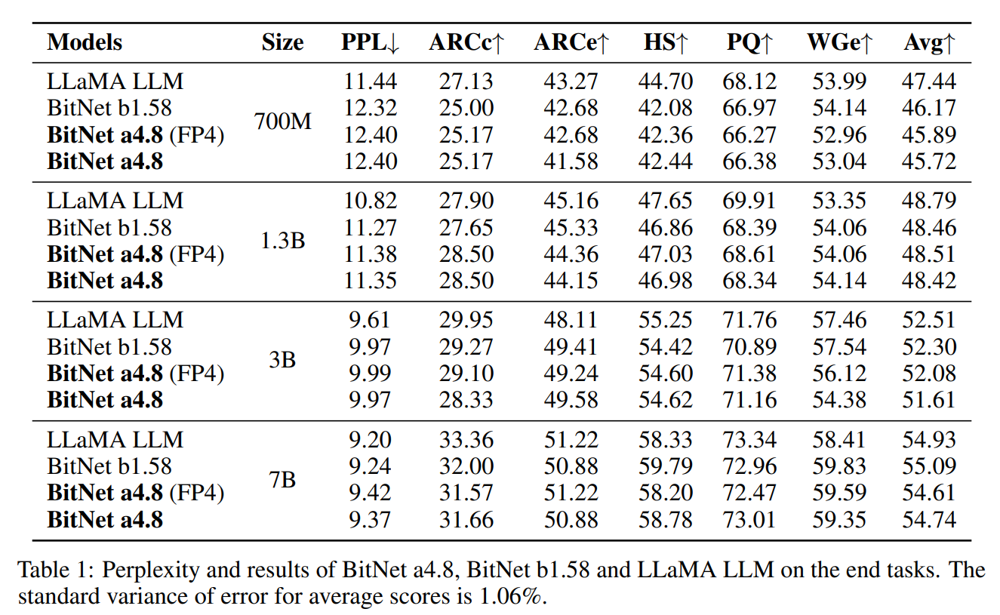

- 모델 크기가 증가할수록, **full-precision (FP16) LLaMA LLM 과 BitNet b1.58 간의 성능 차이** 가 점점 좁혀지는 경향을 보인다.
- 특히, **7B model 의 경우 BitNet b1.58 은 LLaMA LLM 과 perplexity 및 downstream task average accuracy 측면에서 거의 동일한 성능** 을 달성한다.  
- 또한, **BitNet a4.8 은 BitNet b1.58 과 동등한 성능을 유지하면서도 inference efficiency 가 크게 향상** 된다.  

#### Sparsity

Tab. 2 는 BitNet a4.8, BitNet b1.58, FP16 LLaMA LLM 의 각 component 별 sparsity 를 보여준다. 여기서 sparsity 는 C4 validation set 에서 non-embedding parameter 를 기준으로 계산되었다.  

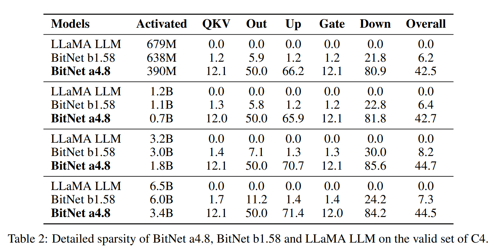

- BitNet a4.8 은 **BitNet b1.58 및 LLaMA LLM 보다 훨씬 higher sparsity** 를 달성했다.
  - 예를 들어, 7B model 의 경우 BitNet a4.8 은 overall sparsity 가 44.5% 이며, 오직 3.4B active parameters 에 불과하다.
  - 특히, FFN down projection 의 inputs 는 매우 높은 sparsity 를 보였으며, 이는 intermediate state disbributions 이 0 을 중심으로 급격하게 쏠리는 현상과 일치한다.
- 또한, **gate projection output sparsity 가 높아 up projection 의 sparsity 도 함께 증가** 하는 경향을 보였다. 
  - 예를 들어, 7B BitNet a4.8 의 경우:  
    - Gate projection 출력 sparsity: 67.5%
    - Up projection 입력 sparsity: 12.0%
    - 따라서 up projection 전체 sparsity 는: $1 - (1 - 12.0\%) \times (1 - 67.5\%) = 71.4\%$

#### Low-bit Attention  

Tab. 3 에는 3B 및 7B model size 의 BitNet a4.8 에 대해 low-bit attention 을 적용한 결과를 정리했다. 

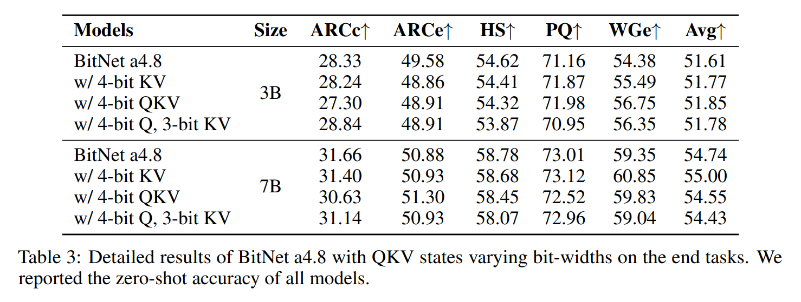

Low-bit attention 은 long sequence 를 효율적으로 modeling 하는 데 필수적이다. 이는 KV cache 의 memory usage 를 줄이고 I/O 비용을 낮추며, attention 연산을 가속시킨다. 실험에서는 **post-RoPE quantization** 을 적용했다.

QKV head 는 별도의 calibration dataset 없이 absmax function 을 사용하여 unsigned integer 로 quantize 했다. 또한, 3-bit KV quantization 시에는 bos token head 를 4-bit 로 유지하여 outlier feature 를 보존했다.  

- Tab. 3 에서 확인할 수 있듯이, BitNet a4.8 은 3B 및 7B model 에서 4-bit KV 또는 QKV head 를 적용해도 정확도 감소가 거의 없음을 보인다.  
- 또한, KV cache 를 3-bit 정수로 quantize 해도 평균 정확도 저하가 거의 발생하지 않는다.  

## 3.2 Ablation Study  

#### Hybrid architecture

Fig. 4 는 700M BitNet a4.8 에 대해 full INT4/FP4 quantization 과 hybrid quantization, sparsification 을 적용했을 때의 training loss curve 를 보여준다. 

이 모델들은 RedPajama dataset 의 25B tokens 에 대해 first-stage scheduling 으로 학습했다. full INT4 와 FP4 quantization 을 위해 각각 absmean quantizer 와 MinMax quantizer 를 사용했다. 게다가 full INT4 quantization 의 경우, FFN 의 down projection 에는 inputs 의 larger outliers 로 인해 $\beta = 2\text{mean}(|X|)$ 를 적용한 absmean quantizer 를 사용했다.

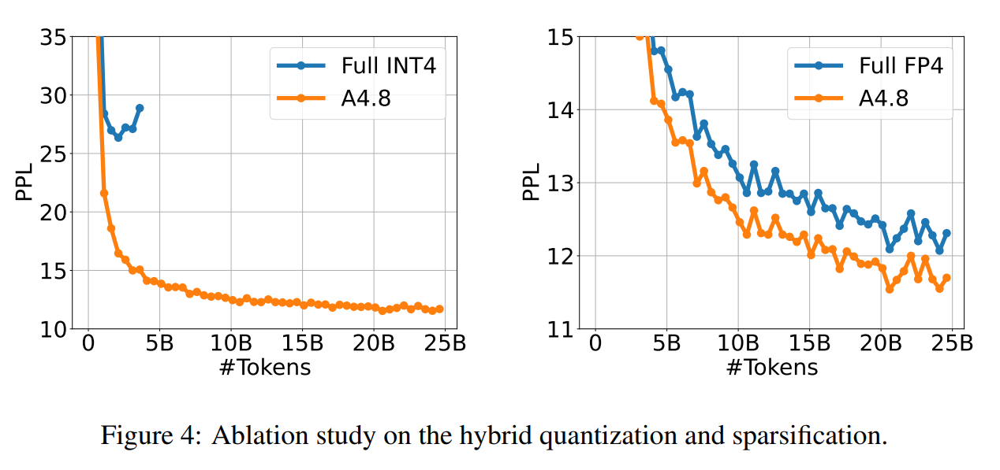

- Fig. 4 에서 보이듯, full INT4 quantization 은 divergence 로 이어진다. 
- 또한 hybrid architecture 는 training perplexity 측면에서 full FP4 architecture 보다 훨씬 우수한 성능을 보인다.

#### Down projection of FFN

1.3B BitNet a4.8 을 대상으로 FFN 의 down projection 에서 사용하는 quantization 이나 activation function 을 달리했을 때를 비교했다. 모든 모델은 RedPajama dataset 의 50B tokens 에 대해 first-stage scheduling 으로 학습했다. 

공정한 비교를 위해 다른 activations 은 8-bits 로 유지했다. INT8 quantization 에는 absmax quantizer 를, FP4 quantization 에는 MinMax quantizer 를 사용했다. absmean quantizer 의 $\beta$ 값은 $2\text{mean}(|X|)$ 로 설정했다. 

Fig. 5 는 이러한 모델들의 training loss curve 를 보여준다. 

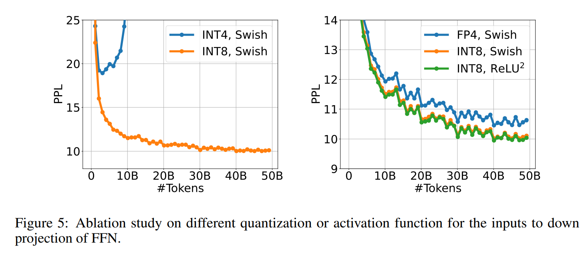

- Squared ReLU 는 Swish 와 비교했을 때, higher sparsity 를 가능하게 하면서도 약간 더 나은 training perplexity 를 달성한다. 
- 또한 down projection 의 입력에 FP4 quantization 을 적용하면 성능이 크게 저하되며, INT4 activations 에 STE 를 적용하면 divergence 가 발생한다.

#### Output projection of attention

Tab. 4 는 attention 의 output projection 에 들어가는 입력에 대해 Top-K sparsification 을 적용했을 때와 적용하지 않았을 때의 3B BitNet a4.8 결과를 자세히 보여준다. 

두 모델 모두 8-bit 에서 4-bit activations 로 전환하는 동일한 two stage recipe 로 학습했다. sparsification 의 K 는 50% 로 설정했다. baseline 은 output projection 의 입력에 대해 INT8 absmax quantizer 를 사용했다. 

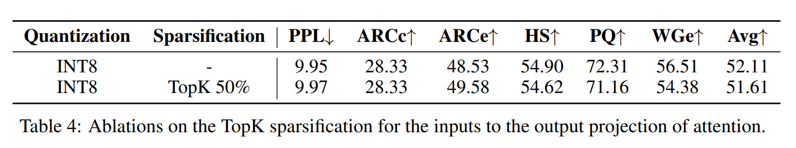

결과에 따르면, TopK sparsification 은 perplexity 와 accuracy 의 손실을 무시할 수 있을 정도로 미미하게 만든다.

#### 4-bit quantization

3B BitNet a4.8 의 attention 과 FFN 에 들어가는 입력에 대해 서로 다른 4-bit quantizer 를 적용했을 때의 loss curves 를 Fig. 6 에 제시했다. 

BitNet a4.8 을 MinMax quantizer 로 E2M1 과 E1M2 format 의 floating-point quantization 과 absmax, absmean quantizer 를 사용한 integer quantization 으로 비교했다. 

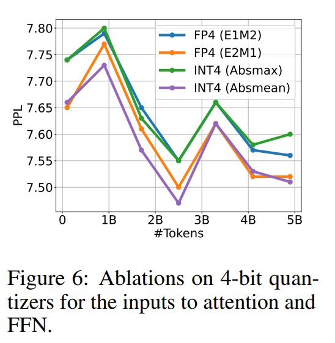

Fig. 6 에서 보이듯, FP4 quantization 의 E2M1 format 과 absmean quantizer 를 사용한 INT4 가 작은 크기의 activation entries 를 다루는 데 유리하여, 약간 더 나은 training perplexity 를 달성한다.

### 3.3 More Training Tokens  

이전 연구에서는 training token 수가 증가할수록 activation outlier 의 빈도도 증가한다는 사실을 보고했다.

BitNet a4.8 의 **scalability** 를 검증하기 위해, 2B parameter 모델을 2T tokens 로 학습하는 추가 실험을 수행했다. 동일한 training data 및 설정을 유지하면서 BitNet b1.58 과 비교했다.  

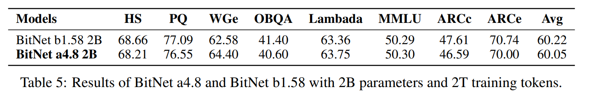

Tab. 5 에서 확인할 수 있듯이, BitNet a4.8 은 4-bit activation compression 을 적용한 상태에서도 BitNet b1.58 과 거의 동일한 정확도를 유지한다. 이는 large-scale training token 환경에서도 hybrid quantization 및 sparsification 기법이 효과적임을 보여준다.  

## 4 Conclusion  

본 논문에서는 **BitNet a4.8** 을 제안하여 **1-bit LLM 을 위한 4-bit activation** 을 가능하게 했다.

BitNet a4.8 은 **hybrid quantization 및 sparsification** 기법을 활용하여 activation 의 **outlier channel 로 인해 발생하는 quantization error 를 줄이는 새로운 아키텍처**를 사용했다.  

특히, 다음 방식을 도입했다.  
- **Attention 및 FFN layers 의 input** 에는 **4-bit quantization** 적용  
- **intermediate state** 에는 **8-bit sparsification** 적용  

BitNet a4.8 은 W1.58A8 모델을 W1.58A4 모델로 continue-training 하는 방식으로 학습되었다.

실험 결과, **BitNet a4.8 은 BitNet b1.58 과 동일한 training 비용으로 동등한 성능을 달성** 하면서도, **inference efficiency 가 크게 향상됨**을 확인했다.  

# A Hyper-parameters  

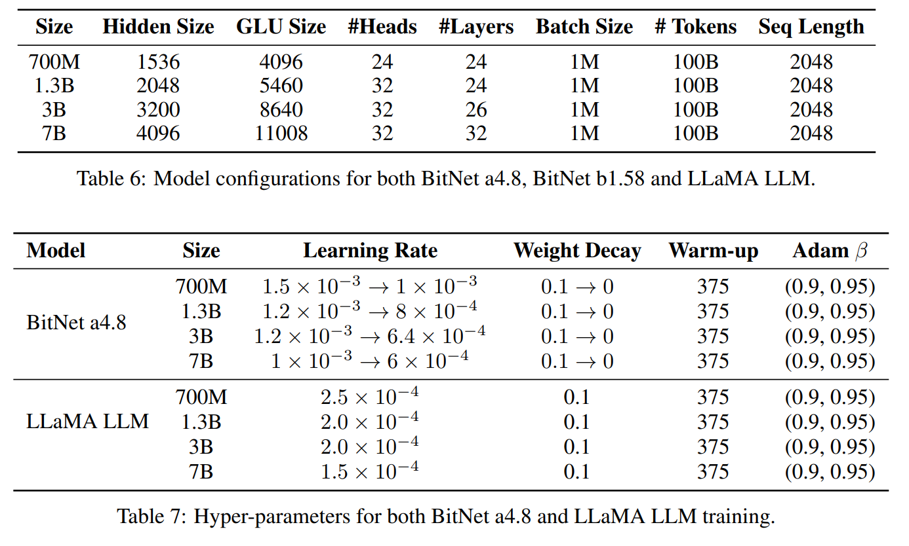