논문 및 이미지 출처 : <https://arxiv.org/pdf/2501.17116>

# Abstract

large language model (LLM) training 의 계산 비용 증가로 인해 보다 효율적인 방법이 필요하다.

Quantized training 은 low-bit 연산을 활용하여 이러한 비용을 절감할 수 있는 유망한 해결책을 제시한다. 

FP8 precision 은 가능성이 입증되었지만, FP4 를 활용하는 것은 상당한 quantization error 와  limited representational capacity 로 인해 여전히 어려운 과제이다. 

본 연구에서는 LLM 을 위한 최초의 FP4 training framework 를 소개하며, 이를 해결하기 위해 두 가지 핵심 혁신을 제안한다. 

1. precise weight updates 를 위한 differentiable quantization estimator 를 도입
2. activation collapse 를 방지하기 위한 outlier clamping 및 compensation 전략을 제안한다.

안정성을 보장하기 위해 이 framwork 는 mixed-precision training scheme 및 vector-wise quantization 을 통합한다. 

실험 결과, 제안된 FP4 framwork 는 BF16 및 FP8 precision 과 비교하여 최소한의 성능 저하만으로 유사한 정확도를 달성하며, 최대 13B-parameter LLM 및 100B training token 에 대해 효과적으로 확장 가능함을 입증한다. 

향후 FP4 를 지원하는 차세대 하드웨어의 등장과 함께, 본 연구는 ultra-low precision precision training 을 위한 기초를 마련한다.

# 1. Introduction  

지난 2년 동안 large language model (LLM) 의 급속한 발전은 연구의 우선순위와 산업적 관행을 크게 변화시켰다. 

이론적 분석과 실험적 증거는 일관되게 model size 를 확장하면 성능이 크게 향상된다는 것을 보여준다. 하지만, 이러한 large-scale model training 은 막대한 시간, 에너지, 재정적 자원이 필요하다는 도전 과제를 제기한다. 예를 들어, Llama 3 는 16K H100 GPU 의 54일 동안 훈련되었다. 유사하게, GPT-4 는 약 1T parameter 를 가지며, 훈련에 엄청난 계산 자원이 필요했다. 이러한 사례는 LLM 개발의 증가하는 요구를 충족하기 위해 보다 efficient training method 가 절실히 필요함을 강조한다.  

Model quantization 은 training costs 를 줄이는 효과적인 기법으로 입증되었으며, low-bit arithmetic kernel 을 적절히 활용하면 메모리를 절약하고 연산 속도를 높일 수 있다. 대부분의 LLM training system 은 전통적으로 FP32 (full precision) 또는 FP16/BF16 (half precision) data format 에 의존하지만, quantization 을 통해 precision 을 8-bit 또는 4-bit 로 줄일 수 있다.  

- 최근 NVIDIA 의 H100 GPU 및 차세대 B200 GPU 와 같은 하드웨어 발전은 low-bit arithmetic kernel 을 지원하여 more efficient computation 을 가능하게 한다. 
- Hopper series GPU 는 high-performance FP8 tensor core 를 제공하여 FP16 tensor core 대비 2x speed-up 을 제공한다. 한편, Blackwell series GPU 는 FP6 및 FP4 format 을 지원하며, FP4 는 FP8 대비 2x computational throughput 을 제공할 수 있다. 
- FP8-LM 및 NVIDIA 의 Transformer Engine 과 같은 연구들은 FP8 tensor core 가 model training 에 사용될 수 있음을 입증했다. 그러나 FP4 tensor core 를 model training 에 적용하는 것은 여전히 미해결된 연구 과제이다.  

하지만 neural network training 을 위해 4-bit data format 을 활용하는 것은 매우 제한적인 bit width 로 인해 큰 도전 과제를 동반한다. 

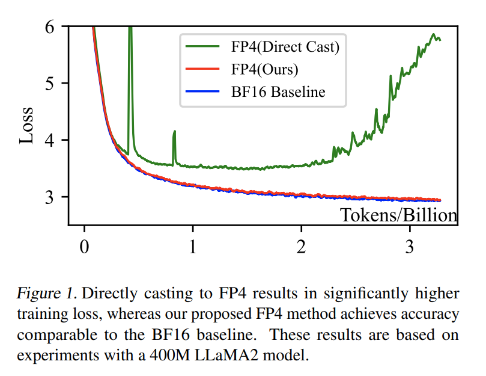

- LLM 을 이러한 low-bit format 으로 직접 quantization 하면 Fig. 1 에서 볼 수 있듯이 상당한 accuracy degradation 이 발생한다. 
- 이는 주로 low-bit format 이 dynamic range 가 제한되어 overflow 와 underflow 가 발생할 위험이 크기 때문이다. 
- 기존의 8-bit quantization 방법조차도 일정 수준의 accuracy loss 를 경험하며, 이는 16 distinct representable values 를 제공하는 4-bit format 을 적용하는 것이 더욱 어렵다는 점을 강조한다.  

본 연구에서는 FP4 format 을 사용한 LLM training framework 를 최초로 제안하며, ultra-low precision representation 의 가능성을 검증한다. 

Model training 중 weight 와 activation 에서 발생하는 quantization error 를 해결하기 위해 다음과 같은 optimization 기법을 도입한다.  

1. **Weight**: FP4 computation 중 gradient update 를 향상시키기 위해 differentiable quantization estimator 를 제안한다. 
   - Neural network 의 forward pass 및 backward pass 에서 quantization 이 미치는 영향을 분석하여 정확한 gradient estimation 을 위한 correction terms 를 포함하는 function 을 도출한다.
2. **Activation**: LLM training 중 흔히 발생하는 outlier values 를 처리하기 위해 outlier clamping 및 compensation strategy 를 개발한다. 
   - LLM 의 activation distribution 을 분석하여 clamping method 와 sparse auxiliary matrix 를 적용함으로써 quantization precision 을 보존하고 model performance 를 유지한다.

제안한 FP4 training framework 는 BF16 또는 FP8 format 에서 훈련된 model 과 유사한 accuracy 를 유지하면서도 동일한 hyperparameter 로 훈련이 가능함을 실험적으로 검증하였다. 

- NVIDIA H100 GPU 의 FP8 tensor core 를 활용하여 FP4 computation 을 시뮬레이션한 결과, 최대 13B parameters 와 100B training token 으로 훈련한 LLM 에 대해 minimal training loss gap 을 보였다. 
- Zero-shot evaluation 결과, FP4 로 훈련된 model 은 BF16 model 과 비교하여 경쟁력 있는 성능을 나타냈다. 

앞으로 NVIDIA B-series GPU 와 같은 차세대 하드웨어가 등장하면, FP4 기반 훈련은 더욱 높은 속도 향상을 제공할 것으로 기대된다.

# 2. Preliminaries

IEEE 754 standard 에 따르면, binary floating-point number 는 1-bit sign ($S$), exponent bit ($E$), mantissa bit ($M$) 의 세 가지 요소로 구성된다. 

이는 일반적으로 $ExMy$ 로 표기되며, 여기서 $x$ 와 $y$ 는 exponent 와 mantissa 에 할당된 bit 수를 나타낸다. 

- 예를 들어, FP16 은 $E5M10$ 을 사용하고, BF16 은 $E8M7$ 을 사용한다. 
- FP8 은 일반적으로 two variants 를 가지는데, 하나는 $E4M3$, 다른 하나는 $E5M2$ 이다.

본 연구에서는 4-bit floating-point representation 으로 $E2M1$ format 을 채택하며, 이는 2-bit exponent 와 1-bit mantissa 로 구성된다.  

Integer (INT) quantization 과 달리, floating-point (FP) quantization 은 uneven quantization interval 과 larger dynamic range 를 제공한다.

FP16 같은 high-precision tensor 를 FP4 로 quantization 하기 위해 일반적으로 사용되는 **absmax** 방법을 적용한다.

$$
\begin{equation}
    x_{fp4} = \mathcal{Q}(x_{fp16} \cdot \gamma), \quad \gamma = \frac{MAX_{fp4}}{\max(|x_{fp16}|)}
\end{equation}
$$

- 여기서 $MAX_{fp4}$ 는 FP4 format 에서의 maximum abs
- $\gamma$ 는 scaling factor
- $E2M1$ configuration 에서 $MAX_{fp4}$ 는 6.0 으로 계산
- Quantization function $\mathcal{Q}()$ 는 custom CUDA kernel 을 사용하여 look-up table 기반 quantization 으로 구현

FP4 format 은 총 $2^4 = 16$ distinct values 를 지원하며, 상세한 format 규칙 및 quantization 구현 방식은 Appendix A 에 기술되어 있다.

# 3. Methodology  

Transformer architecture 의 typical linear layer 에서 연산은 다음과 같이 표현된다: $Y = A \cdot W$, 여기서 $A$ 는 activation tensor, $W$ 는 weight tensor 이다

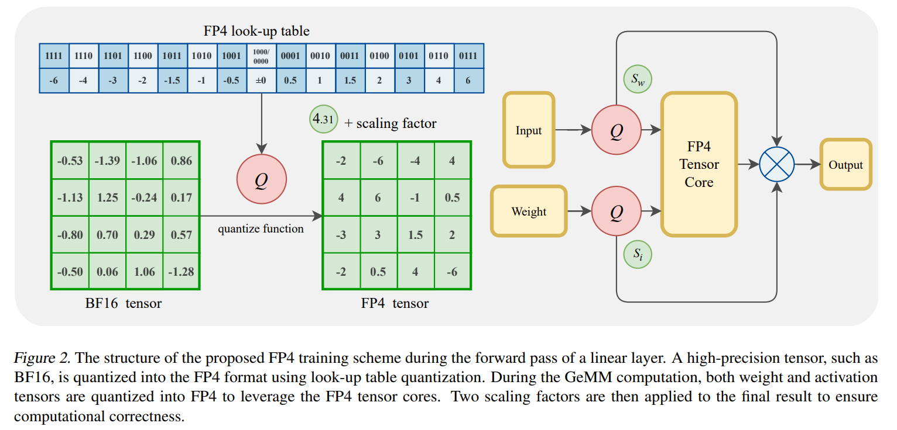

FP4 tensor core 의 성능을 최대한 활용하려면 $A$ 와 $W$ 를 모두 FP4 로 quantization 해야 한다 (Figu. 2). 그러나 이러한 tensor 를 FP4 로 직접 quantization 하면 상당한 quantization error 가 발생한다. 

이를 해결하기 위해 본 연구에서는 weight tensor 를 위한 differentiable gradient estimator (Sec. 3.1) 및 activation tensor 를 위한 outlier clamping 및 compensation method (Sec. 3.2) 를 제안한다.  

## 3.1. Differentiable Gradient Estimator  

Quantization function 은 본질적으로 non-differentiable 하여 backpropagation 중 gradient flow 를 방해한다. 기존의 Straight-Through Estimator (**STE**) 는 quantized tensor 의 gradient 를 original tensor 와 동일하다고 가정하여 이 문제를 해결한다. 그러나 이러한 단순화는 low-bit settings 에서 부정확한 gradient estimation 을 초래할 수 있다.  

이러한 한계를 극복하기 위해, 본 연구에서는 Differentiable Gradient Estimator (**DGE**) 를 제안하여 estimation error 를 줄인다. **DGE** 는 forward pass 에서는 direct quantization 을 유지하여 hardware efficiency 를 보장하면서, backward pass 에서는 quantization function 의 differentiable approximation 을 기반으로 gradient correction term 을 적용한다.  

Model weight $W$ 를 non-differentiable quantization function $f: W_q = f(W)$ 를 사용하여 quantization 한다고 가정하자.  

Linear function 에 대해 quantized weight 로 backward gradient computation 을 수행하면, forward pass 는 다음과 같이 표현된다.  

$$
\begin{equation}
    Y = A W_q = A f(W)
\end{equation}
$$

Backpropagation 시, weight $\frac{\partial L}{\partial W}$ 및 activation $\frac{\partial L}{\partial A}$ 는 subsequent layer $\frac{\partial L}{\partial Y}$ 으로부터의 gradient propagation 으로 계산된다.

이 weight gradient 는 chain rule 로 다음과 같이 계산 된다.

$$
\begin{equation}
    \frac{\partial L}{\partial W} = \frac{\partial L}{\partial W_q} \frac{\partial W_q}{\partial W} = (A^T \frac{\partial L}{\partial Y}) \frac{\partial W_q}{\partial W}
\end{equation}
$$

- 여기서 $\frac{\partial W_q}{\partial W}$ 는 quantization function $f$ 의 derivative 를 나타낸다. 
- $f$ 가 element-wise function 이므로, derivative $f'$ 또한 element-wise 이다. 

따라서,  

$$
\begin{equation}
    \frac{\partial W_q[i, j]}{\partial W[k, l]} =
    \begin{cases} 
        f'(W[i, j]), & \text{if } (i, j) = (k, l), \\ 
        0, & \text{otherwise}. 
    \end{cases}
\end{equation}
$$

- 즉, $\frac{\partial W_q}{\partial W}$ 는 diagonal matrix 가 된다. 
- Eq. (3) 에 chain rule 이 적용될 때, 이 diagonal structure 는 아래의 two items 간의 element-wise multiplication 을 줄여, gradient computation 을 단순화해준다.

$$
\begin{equation}
    \frac{\partial L}{\partial W}[i, j] = \frac{\partial L}{\partial W_q}[i, j] \cdot f'(W[i, j])
\end{equation}
$$

또는 다음과 같이 단순화할 수 있다.

$$
\begin{equation}
    \frac{\partial L}{\partial W} = \frac{\partial L}{\partial W_q} \odot f'(W)
\end{equation}
$$

- 여기서 $\odot$ 는 element-wise (Hadamard) product 를 의미한다.  

하지만, $f$ 가 non-differentiable quantization function 이므로, derivative $f'$ 는 대부분의 구간에서 zero 가 되고, gradient vanishing 하여 weight gradient computation 이 Eq. (6) 처럼 실패하게 된다. 

Straight Through Estimator (**STE**) 는 $f'(W) \equiv 1$ 으로 가정함으로써 이를 해결한다. 그러므로 gradient vanishing 문제를 우회한다. 즉, 이는 직접적으로 $\frac{\partial L}{\partial W} \equiv \frac{\partial L}{\partial W_q}$ 을 가정한다.

---

보다 정확한 gradient computation 을 위해, 본 연구에서는 quantization function 을 적절한 differentiable function 으로 근사하고, 그 derivative 계산하고, 이를 Eq. (6) 에 통합하는 방법을 제안한다. 

구체적으로, quantization behavior 를 다음과 같은 function 을 사용한다:  

$$
\begin{equation}
    f(x) = \delta \left( 1 + \text{sign}(x - \frac{\delta}{2}) \cdot |x - \frac{\delta}{2}|^{\frac{1}{k}} \right)
\end{equation}
$$

Fig. 3(a) 에서 $k=5$ 인 경우, 첫 번째 positive quantization interval $[0, 0.5]$ 에 대한 function 형태를 확인할 수 있다.  

이 함수의 derivative 는 다음과 같이 표현된다.  

$$
f'(x) = \frac{1}{k} \cdot |x - \frac{\delta}{2}|^{\frac{1}{k}-1}
$$

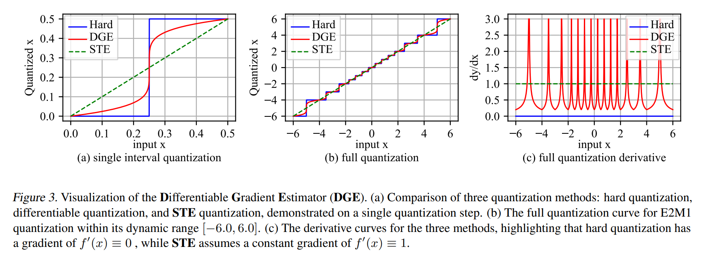

- Fig. 3(a) 는 $k = 5$ 일 때 rand $[0, 0.5]$ 에 대한 function 을 보여준다. 이는 $E2M1$ quantization scheme 에서 first positive quantization interval 을 나타낸다. 
- 또한, **STE** 를 가정하면 forward quantization function 이 $f(x) = x$ 와 동등하며, 이때 $f'(x) \equiv 1$ 이 성립함을 보여준다.
- Eq. (7) 에서, $\delta$ 는 quantization interval 을 나타내며, $k$ 는 approximation 정도를 조절하는 parameter 이다. 
  - $k$ 값이 증가할수록 function curve 가 sharper 하며, original hard quantization function 의 behavior 를 보다 가깝게 모방하게 된다.  

Eq. (7) 의 derivative 는 다음과 같이 표현된다.  

$$
\begin{equation}
    f'(x) = \frac{1}{k} \cdot |x - \frac{\delta}{2}|^{\frac{1}{k}-1}
\end{equation}
$$

Fig. 3(b) 및 Fig. 3(c) 는 $k = 5$ 인 경우의 complete quantization curve $f(x)$ 와 그 derivative $f'(x)$ 를 보여준다. 

- 이 framework 는 14 distinct quantization intervals 로 구성된다. 
- 또한, gradient values 가 과도하게 커지는 것을 방지하기 위해 $f'(x)$ 의 magnitude 를 최대 3.0 으로 제한하며, 이는 극히 일부 element 에만 영향을 미친다.  

실제 model training 과정에서 Differentiable Gradient Estimator (**DGE**) 는 seamlessly 통합된다. Forward pass 동안에는 computational efficiency 를 유지하기 위해 hard quantization function 을 그대로 유지한다. 

반면, backward pass 에서는 Eq. (8) 에서 유도된 correction term 을 Eq. (6) 에 적용하여 weight gradient 를 보정한다.  

실제 training process 에서 DGE metohd 의 Supplementary integration process 및 proof 는 Appendix B 에 제공된다.

## 3.2. Outlier Clamping and Compensation  

LLM training 중 activation tensors 는 weight tensors 보다 quantization 이 어렵다. 이는 activation tensor values 의 complex distribution 과, speciic values 가 과도하게 크거나 작은 outliers 로 인해 dynamic range 가 왜곡되기 때문이다. 

이러한 outlier 는 target tensor 의 dynamic range 를 불균형하게 확대하여, 대부분의 values 가 quantization 후 zero 로 underflow 되는 문제를 야기한다.  

이를 해결하기 위해, 본 연구에서는 Outlier Clamping and Compensation (**OCC**) method 를 제안하여 activation tensors range 를 제한하고 underflow 문제를 완화한다.  

구체적으로, 특정 quantile $\alpha$ 를 기준으로 outlier 를 식별하고, 이를 predefined threshold 로 clamping 한다.  

구체적으로, quantile searching 과 predifined threshold 로 이들을 clamping 하여 largest absolute magnitudes values 인 outliers 를 식별한다.

주어진 pre-defined quantile $\alpha$ 로, clamping function 을 다음과 같이 표현한다:

$$
\begin{equation}
    Y_c = \text{clamp}(Y, \max = \alpha, \min = 1 - \alpha)
\end{equation}
$$

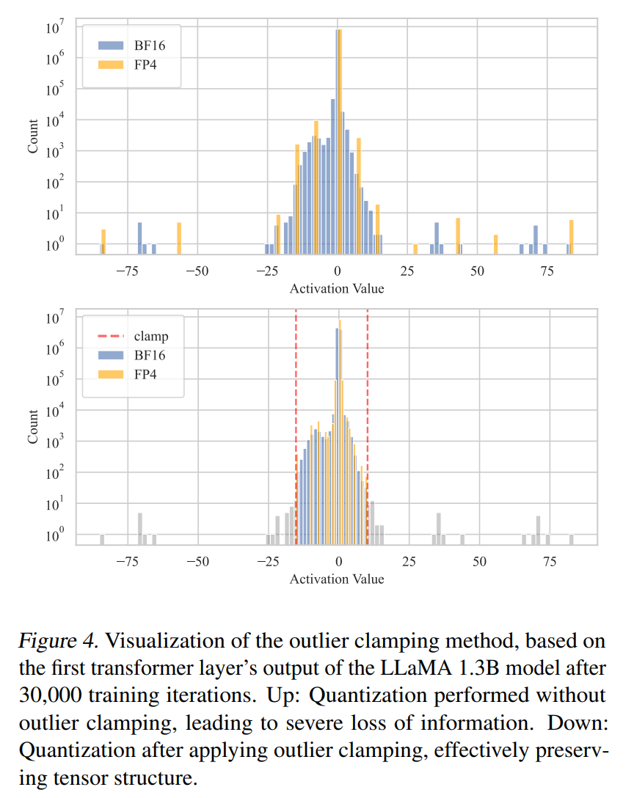

Fig. 4 는 LLaMA 1.3B model 을 30,000 training iterations 후의 first transformer layer output 에서 추출한 real activation tensor 를 기반으로 outlier clamping 적용 여부에 따른 quantization 효과를 보여준다. 여기서 $\alpha = 0.999$

Outlier clamping 을 적용하면 원본 tensor 와 quantized tensor 간의 mean squared error (MSE) 가 크게 감소하며, quantization precision 이 향상되고 training stability 가 유지됨을 확인할 수 있다.

Clamping 은 quantization error 를 효과적으로 줄이지만, outlier 값을 무시함으로써 새로운 error 를 유발할 수도 있다. accuracy 를 더욱 유지하기 위해, 본 연구에서는 sparse outlier matrix 를 활용하여 이러한 error 를 보상하는 방법을 제안한다.

실험에서 quantile clamping threshold $\alpha$ 는 0.99 $\sim$ 0.999 로 상대적으로 높게 설정되었으며, 이로 인해 residual matrix $\Delta Y = Y - Y_c$ 는 highly sparse 하게 유지되었다. 0.2% $\sim$ 2% non-zero element 수준에 불과하였다.  

computation 과정에서는 clamped matrix $Y_c$ 를 FP4 GeMM 을 이용하여 처리하고, $\Delta Y$ 는 high-precision sparse matrix multiplication 을 사용하여 계산하였다.

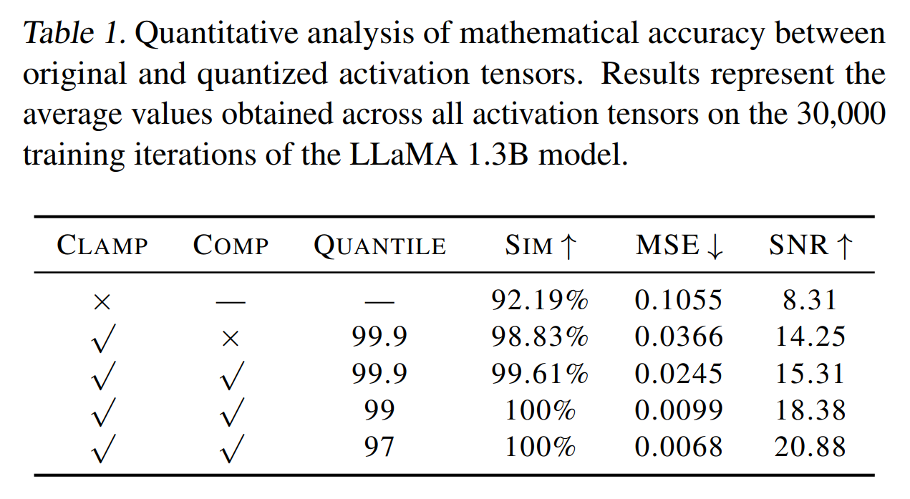

Tab. 1 은 original activation tensor 와 quantized tensor 간의 cosine similarity (SIM), mean squared error (MSE), signal-to-noise ratio (SNR) 를 정량적으로 분석한 결과를 보여준다. 

이 결과는 LLaMA 1.3B model 에 대해 30,000 training iterations 동안 측정된 average values 를 나타내며, outlier clamping 및 compensation 이 real model training 과정에서 tensor fidelity 를 유지하는 데 미치는 영향을 평가한다.  

이 데이터는 outlier clamping 을 적용하면 cosine similarity 와 SNR 이 크게 향상되는 것으로 나타났다. 또한, outlier compensation 을 추가하면 quantization loss 가 더욱 감소하였다.

특히, quantile threshold $\alpha$ 값을 낮추면 compensation scale 이 증가하면서 quantization loss 가 더욱 줄어드는 효과가 있지만, computational efficiency 와 numerical accuracy 간의 trade-off 가 발생하므로 적절한 값을 선택하는 것이 중요하다.

# 4. Experiment  

이 섹션에서는 제안한 FP4 training framework 를 다양한 크기의 language model 에 적용하여 평가한다. 

- Sec. 4.1 에서는 FP4 training framework 의 구현 세부 사항을 설명하며, model architecture 및 hyperparameter 를 포함한다. 
- Sec. 4.2 에서는 주요 실험 결과를 제시하고, training curve 및 downstream task 에 대한 zero-shot 성능을 비교한다. 
- 마지막으로, Sec. 4.3 에서는 ablation study 를 수행하여 제안한 방법의 효과를 추가적으로 검증한다.  

## 4.1. Experiment Setup  

LLM training 에서 General Matrix Multiplication (GeMM) 연산은 computational workload 의 95% 이상을 차지하며, larger model 에서 이 비율은 더욱 증가한다. 기존 연구들과 일관되게, 본 연구에서는 FP4 tensor cores 의 핵심 기능인 4-bit quantization 을 GeMM 연산에 집중하여 적용한다.  

GeMM $Y = AW$ 에서 $A$ (sequence length $\times$ input channels) 는 activation tensor 이고, $W$ (input channels $\times$ output channels) 는 weight tensor 이다. Quantization 은 matrix multiplication logic 에 맞추어 distinct dimensions 에 적용된다. 즉, $A$ 는 token-wise (sequence length dimension) 로 quantization 하고, $W$ 는 channel-wise (output channels dimension) 로 quantization 한다. 이러한 방식은 GeMM 연산에서 quantization error 를 최소화하는 데 도움을 준다.  

현재 FP4 tensor cores 를 지원하는 하드웨어가 없기 때문에, 본 연구에서는 NVIDIA H-series GPU 의 FP8 tensor core 를 활용하여 FP4 computation 을 시뮬레이션한다. FP8 tensor core 는 FP4 의 dynamic range 를 포함하고 있어 정확한 시뮬레이션이 가능하다.  

---

Mixed-precision training 에서는 minor computation 을 차지하는 non-GeMM operations 를 higher precision 으로 수행하여 accuracy 를 유지한다. 기존 연구에서 제안된 framework 를 따라, gradient communication 은 FP8 format 을 사용하여 bandwidth usage 를 줄이고, mixed-precision Adam optimizer 를 적용하여 GPU memory 를 절약한다.  

Gradient 와 first-order moment 는 FP8 format 으로 저장하고, second-order moment 는 FP16 format 으로 저장한다. 나머지 연산들은 계산 비중이 적기 때문에 stability 와 precision 을 유지하기 위해 FP16 또는 BF16 format 으로 수행된다.

본 연구에서는 널리 사용되는 LLaMA 2 model 을 primary model architecture 로 채택하며, training 은 language model pretraining 에 적합한 DCLM dataset 을 사용하여 처음부터 진행한다. Fair comparison 을 위해 all precision setting 에서 동일한 hyperparameter 를 적용한다. 

Learning rate schedule 은 warm-up 및 cosine decay 를 따르며, total step 의 5% 동안 warm-up 을 수행한 후, 나머지 90% 동안 learning rate 를 peak 값의 10% 수준까지 점진적으로 감소시킨다. 주요 hyperparameter 는 다음과 같다.  

- Peak learning rate: $3 \times 10^{-4}$  
- Weight decay: $0.1$  
- Adam optimizer parameter: $\beta_1 = 0.9$, $\beta_2 = 0.95$, $\epsilon = 1 \times 10^{-8}$  
- Differentiable Gradient Estimator (DGE) parameter: $k = 5$  
- Activation Clamping and Compensation (OCC) quantile: $\alpha = 0.99$  
- Input sequence length: 2048 tokens  
- Batch size: 2048 (약 4M tokens)  

## 4.2. Main Results  

제안한 FP4 training framework 의 효과를 검증하기 위해 BF16 mixed-precision training 과 비교한다. Fig. 5 는 다양한 model 크기 (1.3B, 7B, 13B parameter) 에 대한 training loss curve 를 보여준다. 모든 model 은 동일한 dataset 에 대해 100B training token 으로 학습되었으며, 동일한 hyperparameter 가 적용되었다.  

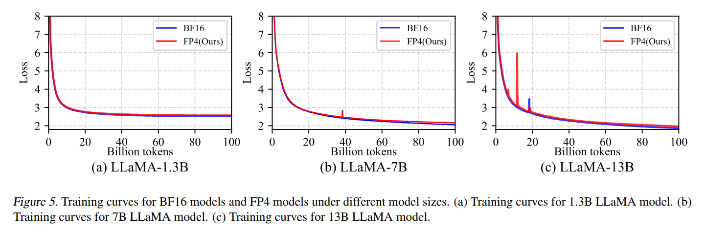

BF16 과 FP4 의 loss curve 는 대부분의 training 과정에서 유사한 양상을 보이며, FP4 curve 가 BF16 curve 대비 약간 높은 training loss 를 나타낸다. 100B token training 후 training loss 값은 다음과 같다.  

- 1.3B model: FP4 (2.55) vs. BF16 (2.49)  
- 7B model: FP4 (2.17) vs. BF16 (2.07)  
- 13B model: FP4 (1.97) vs. BF16 (1.88)  

또한, 다양한 downstream task dataset 에 대해 zero-shot 평가를 수행하였다. 사용된 dataset 은 다음과 같다.  

- Arc (ARC-C, ARC-E)  
- BoolQ  
- HellaSwag  
- LogiQA  
- PiQA  
- SciQ  
- OpenbookQA (ObQA)  
- Lambada  

Zero-shot evaluation 은 널리 사용되는 `lm-evaluation-harness` 라이브러리를 통해 수행되었다. 

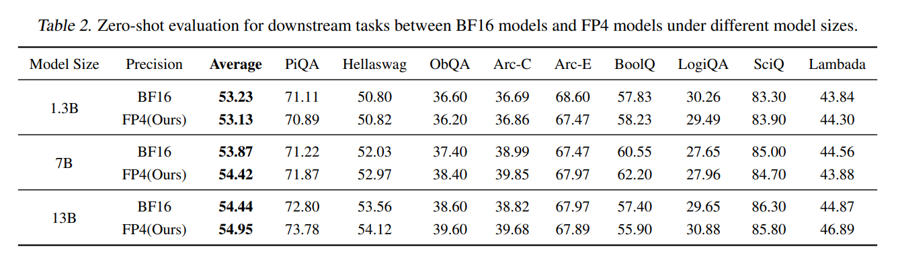

- Tab. 2 에 제시된 결과에 따르면, FP4 로 pretrain 된 model 은 intrinsic in-context learning capability 에서 BF16 model 과 비교해 경쟁력 있는 성능을 보인다.
- 동일한 model size 에서 FP4 model 의 평균 정확도는 BF16-trained model 과 유사하거나 다소 높은 성능을 나타냈다. 
- 또한, larger model 에서 accuracy 도 함께 증가하는 일반적인 trend 를 따르고 있다.  

이러한 결과는 FP4 training 이 precision 을 낮추었음에도 불구하고 BF16 과 거의 동일한 수준의 성능을 달성할 수 있음을 보여준다. 

따라서, FP4 training 은 large language model 을 보다 효율적으로 훈련하는 유망한 방법임을 확인할 수 있다.  

## 4.3. Ablation Study  

FP4 training 의 주요 연구 결과를 보다 명확하게 분석하기 위해 ablation study 를 여러 개의 세부 실험으로 나누어 진행한다. 

모든 실험은 LLaMA 1.3B model 을 사용하여 DCLM dataset 의 subset 을 기반으로 10B tokens 를 학습하는 방식으로 수행되었다. 

smaller model 에 대해 빠른 수렴을 유도하기 위해 batch size 는 2048 에서 256 으로 줄였으며, 다른 hyperparameter 는 주요 실험과 동일하게 유지하였다.  

#### Precision  

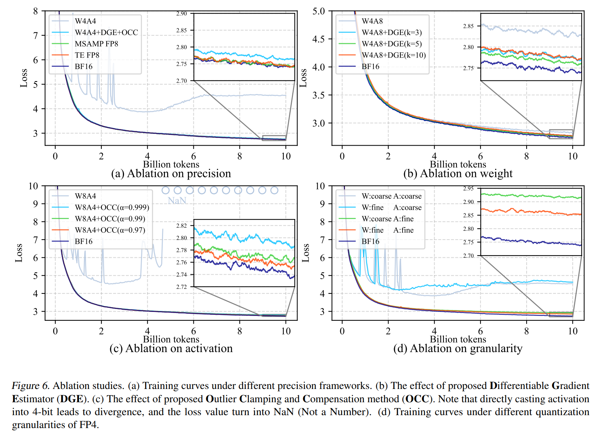

Fig. 6(a) 는 다양한 precision 에 따른 training curves 를 보여준다. 비교 대상은 다음과 같다.  

- **BF16 (baseline)**  
- **MS-AMP FP8**  
- **Transformer-Engine FP8**  
- **Directly-casted FP4 (W4A4)**: weight 과 activation 을 FP4 로 직접 quantization  
- **Proposed FP4 method (W4A4+DGE+OCC)**: Differentiable Gradient Estimator (**DGE**) 와 Outlier Clamp and Compensation (**OCC**) 을 포함한 FP4 quantization 방법 

Loss curve 를 보면, 두 개의 FP8 방법과 본 연구에서 제안한 FP4 방법은 pretraining accuracy 를 유지하는 반면, 직접 quantization 한 FP4 (W4A4) 는 상당한 training loss gap 을 보인다.  

#### Weights

Weight 만 4-bit 로 quantization 하는 실험 (W4A8) 을 수행하여, 제안한 Differentiable Gradient Estimator (**DGE**) 방법이 direct quantization 대비 얼마나 효과적인지를 평가하였다.  

Fig. 6(b) 에서 확인할 수 있듯이, **DGE** 방법을 적용하면 수렴 속도가 크게 향상된다. 특히, weight 를 직접 4-bit 로 quantization 하더라도 training loss gap 이 크게 발생하지 않는다는 점이 관찰되었으며, 이는 weight 가 activation 보다 quantization 에 덜 민감함을 시사한다.  

DGE 방법에서 hyperparameter $k$ 값에 따른 영향을 분석한 결과, larger $k$ 에서 quantization function 을 더 정밀하게 모델링할 수 있지만, gradient correction term 이 불안정해질 가능성이 높아진다. 

실험 결과, moderate $k=5$ 가 가장 우수한 성능을 보였다.  

#### Activation  

Activation 만 4-bit 로 quantization 하는 실험 (W8A4) 을 수행하여, Outlier Clamp and Compensation (**OCC**) 방법의 효과를 분석하였다.  

Fig. 6(c) 에 따르면, activation 을 FP4 로 직접 quantization 하면 loss curve 가 발산하여 특정 training step 이후 NaN (Not a Number) 값이 발생한다. 반면, outlier clamping 과 compensation 을 적용하면 loss gap 이 효과적으로 감소하며, 안정적인 수렴이 가능해진다. 이 실험을 통해, absmax quantization framework 에서 outlier 를 적절히 처리하는 것이 매우 중요함을 다시 한번 확인할 수 있다.  

OCC 방법에서 hyperparameter $\alpha$ 값을 조정하면서 model loss 에 미치는 영향을 분석하였다. larger $\alpha$ 에서 compensation 효과가 강해지지만, computational cost 또한 증가한다. 

Fig. 6(c) 는 $\alpha = 0.999, 0.99, 0.97$ settings 에 따른 loss curve 를 보여주며, 각각의 설정에서 sparse compensation matrix 의 non-zero element 비율은 0.2%, 2%, 6% 로 나타났다.  

실험 결과, higher $\alpha$ 이 model accuracy 가 개선되는 경향을 보였으며, 이는 Tab. 1 의 결과와도 일치한다. 하지만, computational efficiency 를 고려했을 때, $\alpha = 0.99$ 가 가장 적절한 선택이라고 판단된다.  

#### Granularity  

FP4 quantization 의 granularity 가 training 성능에 미치는 영향을 분석하였다. 

FP8 training 방법 (MS-AMP FP8, Transformer-Engine FP8) 은 coarse-grained tensor-wise quantization 을 사용해도 충분한 accuracy 를 유지할 수 있었지만, FP4 에서 tensor-wise scaling 을 적용하면 상당한 error 가 발생한다는 점이 Fig. 6(d) 에서 확인된다.  

이를 해결하기 위해, 본 연구에서는 vector-wise scaling 을 채택하였다. Activation 은 token-wise quantization 을, weight 는 channel-wise quantization 을 적용하여, Sec. 4.1 에서 설명한 GeMM 연산 구조와 정렬되도록 하였다.  

특히, activation 에 coarse-grained quantization 을 적용하는 경우, weight 에 적용할 때보다 accuracy degradation 이 더 심각하게 발생하는 것이 관찰되었다. 이는 activation quantization 이 weight quantization 보다 더 어려우며, activation tensor 에 존재하는 outlier 문제가 중요한 영향을 미친다는 Sec. 3.2 의 분석과도 일치하는 결과이다.

# 5. Related Work  

#### Quantized Training and Inference  

LLM 의 quantization 은 크게 Fully Quantized Training (**FQT**) 과 Post-Training Quantization (**PTQ**) 또는 Quantization Aware Training (**QAT**) 으로 나뉜다.  

- FQT 에서는 **Mixed Precision Training** 을 활용하여 model training 속도를 높이면서도 accuracy 를 유지하려는 연구가 활발히 진행되었다. 기존 연구들은 주로 convolutional neural networks (CNNs) 또는 deep neural networks (DNNs) 에 적용되었지만, 최근에는 LLM 에 대한 low-bit mixed precision training 의 가능성이 입증되고 있다.  
- 반면, **PTQ** 와 **QAT** 는 inference 단계에서 low-bit computation 을 최적화하는 것을 목표로 한다. 
  - PTQ 는 pre-trained model 을 quantization 하여 inference 효율성을 높이는 방식이며, QAT 는 training 과정에서 quantization 을 고려하여 model 을 학습시키는 방식이다. 

본 연구에서 제안한 방법은 inference 최적화보다는 training 속도와 효율성 향상에 초점을 맞춘다.

#### 4-bit Quantization  

최근 PTQ 및 QAT 연구에서는 LLM inference 를 위한 4-bit, 2-bit, 심지어 1-bit quantization 방법이 제안되었다. 하지만 이러한 연구들은 대부분 calibration set fine-tuning, rotary matrix, low-rank compensation, quantization parameter searching 또는 full model re-training 과 같은 추가적인 연산이 필요하다.

- **FQT** 분야에서는 CNN training 에 FP4 format 을 적용한 연구가 있었으며, GPT-style model 을 위한 새로운 quantization data format 이 제안되기도 했다. 
- INT4 training framework 가 연구된 사례도 있으나, 이는 fine-tuning 에 초점을 맞추었으며 LLM pretraining 에 적용하기에는 한계가 있다.  

본 연구는 LLM 을 위한 FP4 training framework 를 처음으로 제안하며, 이를 full training 과정에서 검증하고 차세대 hardware (e.g., NVIDIA B-series GPU) 와의 호환성을 고려하여 설계하였다.  

#### Differentiable Quantization  

기존 differentiable quantization 연구들은 대부분 learnable quantization parameter 를 활용하여 backpropagation 중에 quantization function 을 업데이트하는 방식이었다. 하지만 이러한 방식은 specialized hardware 와의 호환성이 낮고, large-scale training 에 적합하지 않다.  

본 연구에서 제안한 Differentiable Gradient Estimator (**DGE**) 는 fixed quantization function 을 사용하면서도 gradient estimator 를 **STE** 에서 **DGE** 로 변경하여 보다 정확한 gradient estimation 을 가능하게 한다. 이는 hardware acceleration 을 활용한 large-scale training 에 적합한 방식이다.  

#### Handling Outliers  

LLM training 과정에서 activation tensor 의 outlier 문제를 해결하는 다양한 접근법이 연구되었다. 대부분의 기존 연구들은 LLM inference 에 초점을 맞추었으며, channel-wise quantization 을 활용하여 quantization loss 를 줄이려 했다. 그러나 이는 linear layer 의 matrix multiplication 연산 구조와 충돌할 수 있다.  

또한, 일부 연구에서는 outlier smoothing 또는 rotary matrix 변환을 활용하여 quantization error 를 줄이려 했지만, 이러한 방법들은 대부분 offline pre-processing 을 필요로 하므로 pretraining task 에 적용하기 어렵다.  

본 연구에서 제안한 Outlier Clamping and Compensation (OCC) 기법은 training 중 실시간으로 outlier 를 처리하며, 별도의 calibration dataset 없이 pretraining 과정에서 적용 가능하다. 이는 large-scale model training 에서 quantization precision 을 유지하는 데 중요한 역할을 한다.  

# 6. Limitation  

본 연구의 주요 한계는 현재 FP4 Tensor Core 를 지원하는 하드웨어가 존재하지 않는다는 점이다. 따라서, 실제 hardware 가 제공할 수 있는 speedup 및 energy efficiency 개선 효과를 직접 측정할 수 없다. 현재 모든 실험은 FP4 simulation 을 기반으로 수행되었으며, precision casting 등의 추가 연산으로 인해 runtime 이 증가하는 한계가 있다.

또한, computational resource 의 제약으로 인해 실험을 large-scale model 이나 trillions tokens 의 dataset 에까지 확장하지 못했다. 향후 연구에서는 이러한 scalability 문제를 보다 심층적으로 탐구할 필요가 있다.  

# 7. Conclusion  

본 연구에서는 LLM training 을 위한 최초의 FP4 pretraining framework 를 제안하였다. FP4 format 의 limited dynamic range 및 quantization precision 문제를 해결하기 위해 differentiable gradient estimator 및 outlier compensation mechanism 을 도입하였다.  

실험 결과, FP4 기반 training 은 기존 FP8 및 FP16 precision 과 유사한 accuracy 를 유지하면서도 효율성을 향상시킬 수 있음을 확인하였다. 이 연구는 ultra-low precision computing 환경에서 quantization 방법을 개선하기 위한 중요한 통찰을 제공하며, 향후 4-bit computation kernel 을 지원하는 차세대 hardware 설계에 기여할 수 있을 것으로 기대된다.  

# Appendix

## A. Implementation of FP4 Quantization  

컴퓨터에서 floating-point number 는 IEEE 754 standard 에 따라 binary format 으로 표현된다. 각 숫자는 세 가지 구성 요소로 나뉜다: sign bit ($S$), exponent ($E$), mantissa (또는 significand, $M$) 이다. 일반적으로 $ExMy$ 로 표기되며, 여기서 $x$ 와 $y$ 는 exponent 와 mantissa 에 할당된 bit 수를 나타낸다.  

Sign bit 는 숫자의 부호를 결정하며, $S = 0$ 이면 양수, $S = 1$ 이면 음수를 의미한다. Exponent 는 biased format 으로 저장되며, 숫자를 2 의 거듭제곱 형태로 scaling 하는 역할을 한다. 이를 통해 넓은 범위의 값을 표현할 수 있다. Mantissa 는 숫자의 주요 유효 자릿수를 포함하며, precision 을 결정한다. Normalized floating-point number 는 다음과 같이 해석된다.  

$$
\text{Value} = (-1)^S \times (1.M) \times 2^{E - \text{bias}}
$$

여기서 $1.M$ 은 암시적인 leading 1 이 포함된 normalized mantissa 를 나타내며, bias 값 (예: single precision 에서 127, double precision 에서 1023) 은 exponent encoding 을 보정하기 위해 사용된다. Exponent 가 모두 0 인 경우 subnormal number 로 처리되며, 이때는 암시적인 leading 1 없이 저장된다. Floating-point representation 은 효율적인 연산을 가능하게 하지만, mantissa bit 수의 제한으로 인해 rounding error 가 발생할 수 있다.  

IEEE 754 standard 는 FP8 및 FP4 와 같이 16-bit 미만의 precision 을 가지는 floating-point format 에 대한 규칙을 정의하지 않는다. 4-bit floating-point representation 을 위해, 본 연구에서는 기존 연구에서 정의한 $E2M1$ format 을 채택한다.  

IEEE 정의에 따르면, exponent field ($E$) 가 모두 1 로 채워진 경우 이는 유효한 숫자가 아니라, mantissa ($M$) 가 모두 0 이면 infinity (Inf), mantissa 가 0 이 아니면 invalid number (NaN, Not a Number) 를 나타낸다. 하지만 FP8 및 FP4 와 같은 low-bit floating-point format 에서는 이러한 규칙이 자주 무시된다. 이는 제한된 bit width 내에서 의미 있는 숫자 표현을 최대화하는 것이 우선시되기 때문이다.  

예를 들어, FP8-E4M3 format 에서는 Inf 값이 정의되지 않으며, FP6 및 FP4 format 에서는 Inf 와 NaN 값이 모두 정의되지 않는다.

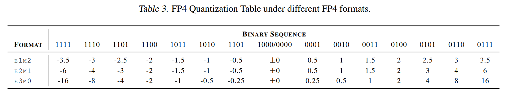

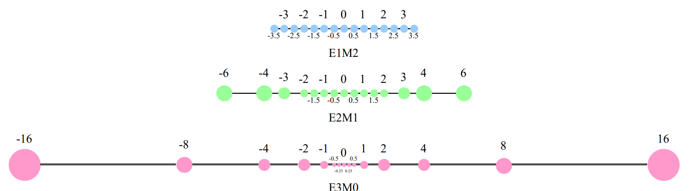

Exponent bit 와 mantissa bit 의 분포를 기반으로, FP4 format 에서 표현 가능한 모든 숫자는 Tab. 3 에 정리되어 있다. "E0M3" format 은 exponent bit 가 없기 때문에 INT4 format 과 동일하여 여기서는 포함하지 않았다.  

Tab. 3 및 Fig. 7 을 보면, exponent bit 수를 증가시키면 dynamic range 가 확장되며, mantissa bit 수를 증가시키면 quantization interval 의 precision 이 향상됨을 확인할 수 있다. 본 연구에서는 dynamic range 와 quantization precision 간의 trade-off 를 균형 있게 유지할 수 있도록 E2M1 format 을 주요 실험에서 사용하였다.  

FP4 format 은 $2^4 = 16$ 개의 값만을 표현할 수 있기 때문에, FP4 quantization 을 위한 look-up table 을 custom CUDA kernel 로 구현하였다. Quantization function 은 일반적으로 대량의 데이터를 element-wise 연산하는 방식이며, 이는 GPU 의 병렬 연산 성능을 활용하여 최적화할 수 있다.  

아래 코드 단락은 quantization kernel 의 구현을 보여준다.

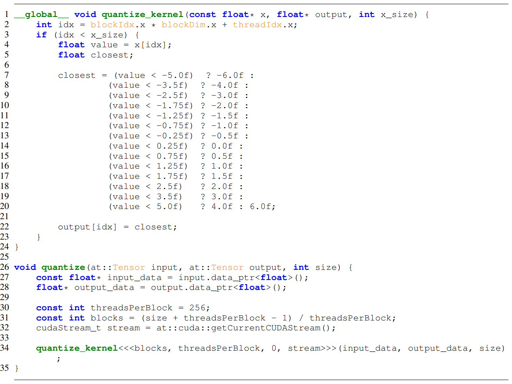

## B. Supplementary Proof for Differentiable Quantization Estimator  

Differentiable Gradient Estimator (DGE) 방법의 보충적인 증명 절차를 실제 quantization 환경에서 vector-wise scaling factor 를 적용한 경우에 대해 제시한다.  

GeMM 연산 $Y = A W$ 에서, $A$ 는 $(s \times c_i)$ 크기의 activation tensor (sequence length $\times$ input channels) 이고, $W$ 는 $(c_i \times c_o)$ 크기의 weight tensor (input channels $\times$ output channels) 이다. Quantization 은 matrix multiplication 의 수학적 연산 논리에 맞춰 각기 다른 차원에 적용된다.  

Quantization function 은 다음과 같이 정의된다.  

$$
\begin{equation}
    x_{fp4} = Q(x_{fp16} \cdot \gamma), \quad \gamma = \frac{MAX_{fp4}}{\max(|x_{fp16}|)}
\end{equation}
$$

Weight tensor $(c_i \times c_o)$ 에 대해 channel-wise quantization 을 적용하면 다음과 같다.  

$$
\begin{align}
    W_{\text{scaled}} &= W \odot s_f \\
    W_{\text{scaled, q}} &= Q(W_{\text{scaled}}) \\
    W_q = W^\text{scaled}_q &\odot \frac{1}{s_f}
\end{align}
$$

여기서 $s_f$ 는 scaling factor 이며, $\odot$ 는 element-wise (Hadamard) product 를 나타낸다. tensor-wise quantization 에서 $s_f$ 는 scalar 이지만, channel-wise quantization 에서는 $(1 \times c_o)$ dimensions 의 vector 이다. 이 경우, $\odot$ 연산은 $W$ (size: $c_i \times c_o$) 의 각 column 에 대해 $s_f$ 를 broadcasting 한 후 element-wise multiplication 을 수행한다.  

Eq. (13) 에서, $1/s_f$ 를 곱하는 것은 수학적으로 정확성을 보장하는 데 중요하다. 하지만, 실제 연산에서는 이 단계가 GeMM kernel 실행 후에 수행된다. 즉, GeMM kernel 에 제공되는 quantized weight tensor 는 Eq. (12) 의 $W_q^{\text{scaled}}$ 이다. 그러나 수학적 분석을 위해서는 quantized weight tensor $W_q$ 를 다시 scaling 해야 한다.  

Backward 연산에서는 $W$ 에 대한 loss gradient 가 forward 연산 $Y = A W_q$ 로부터 유도된다. Matrix multiplication 의 미분 규칙에 따르면, gradient $\frac{\partial L}{\partial W_q}$ 는 subsequent layer 에서 전달된 activation gradient $\frac{\partial L}{\partial Y}$ 를 사용하여 계산된다.  

$$
\begin{equation}
    \textbf{Fwd: } Y = A W_q \quad \textbf{Bwd: } \frac{\partial L}{\partial W_q} = A^T \frac{\partial L}{\partial Y}
\end{equation}
$$

Eq. (11) $\sim$ (13) 을 chain rule 에 적용하면, $\frac{\partial L}{\partial W_q}$ 와 actual weight gradient $\frac{\partial L}{\partial W}$ 간의 관계를 유도할 수 있다. Eq. (13) 에 따르면, gradient $\frac{\partial L}{\partial W_q^{\text{scaled}}}$ 는 scaling factor $s_f$ 를 이용하여 다음과 같이 표현된다.  

$$
\begin{equation}
    \frac{\partial L}{\partial W_q^{\text{scaled}}} = \frac{\partial L}{\partial W_q} \odot \frac{1}{s_f}
\end{equation}
$$

그 후, differentiable gradient estimator correction term $\mathcal{Q}'(x)$ 를 적용하여 $\frac{\partial L}{\partial W_{\text{scaled}}}$ 를 계산한다.  

$$
\begin{equation}
    \frac{\partial L}{\partial W_{\text{scaled}}} = \frac{\partial L}{\partial W_q^{\text{scaled}}} \odot \mathcal{Q}'(W_{\text{scaled}})
\end{equation}
$$

여기서 $\mathcal{Q}'(x)$ 는 Eq. (8) 에서 정의된 differentiable gradient estimator correction term 이다. 마지막으로, $s_f$ 를 포함하여 $\frac{\partial L}{\partial W_{\text{scaled}}}$ 와 $\frac{\partial L}{\partial W}$ 의 관계를 유도할 수 있다.  

$$
\begin{equation}
    \frac{\partial L}{\partial W} = \frac{\partial L}{\partial W_{\text{scaled}}} \odot s_f
\end{equation}
$$

위의 모든 과정을 결합하면, 최종적인 weight gradient $\frac{\partial L}{\partial W}$ 계산 공식은 다음과 같이 정리된다.  

$$
\begin{align}
    \frac{\partial L}{\partial W} &= \left( \frac{\partial L}{\partial W_q} \odot \frac{1}{s_f} \odot Q'(W_{\text{scaled}}) \right) \odot s_f \\
    &= \frac{\partial L}{\partial W_q} \odot Q'(W_{\text{scaled}})
\end{align}
$$

여기서 scaling 및 un-scaling 과정은 element-wise 연산의 특성에 의해 서로 상쇄되며, 단순화된 표현을 얻을 수 있다. 이 최종 공식은 본 논문의 본문에서 제시된 Eq. (6) 과 일치하며, 차이점은 DGE correction term 내의 변수들이 scaled weight 를 고려해야 한다는 점뿐이다. $\mathcal{Q}$ 및 $\mathcal{Q}'$ function 에 대한 추가적인 변경은 필요하지 않다.