논문 및 이미지 출처 : <https://arxiv.org/pdf/2210.03858>

# Abstract

Large-scale language model 을 parameter-efficient fine-tuning 방법으로 적응시키는 데 관심이 커지고 있다. 하지만 model 자체를 가속화하고 model compression 을 통해 better inference efficiency 를 얻는 건 아직 충분히 탐구되지 않았다. Model compression 은 memory footprint 을 줄이고, low-precision computation 을 가능하게 하며, 궁극적으로 cost-efficient inference 를 달성할 수 있는 이점을 제공한다. 

_Parameter-efficient adaptation_ 과 _model compression_ 을 결합하기 위해 저자는 **AlphaTuning** 을 제안하는데, 이는 pre-trained language model 의 post-training quantization 과 target task 에 대해 quantized parameter 의 일부만 fine-tuning 하는 걸 포함한다. 

- 구체적으로 AlphaTuning 은 binary-coding quantization 을 사용해서 full-precision parameter 를 binary parameter 와 별도의 scaling factor 로 분해한다. 
- Adaptation phase 에서는 binary value 는 all tasks 에 대해 고정되고, scaling factor 만 downstream task 에 맞춰 fine-tuning 된다. 
- 저자는 AlphaTuning 을 GPT-2 와 OPT 에 적용했을 때 다양한 downstream task 에서 full fine-tuning 과 경쟁력 있는 성능을 보이면서 4-bit quantization 아래에서 $10 \times$ 이상의 compression ratio 와 $1,000 \times$ 이상의 trainable parameter 수 감소를 달성한다는 걸 보여준다.

# 1 Introduction

Self-supervised learning 은 pre-trained language model (PLM) 을 만들기 위해 parameter 수를 늘리는 데 도움을 준다. 저자는 PLM, 특히 Transformer 의 model scaling 이 계속될 거라고 예상하는데, 왜냐하면 그들의 일반적인 능력이 parameter 크기에 따라 power-law 를 따르고 "높은 예측 가능성과 유용한 능력의 등장"을 보여주기 때문이다 (Ganguli et al). 그래서 Transformer-based PLM 은 natural language processing, automatic speech recognition, computer vision 같은 다양한 응용 분야에서 열정적으로 연구되고 있다.

PLM 의 인상적인 zero/few-shot learning 성능에도 불구하고, downstream task 에서 성능을 더 높이려면 additional _adaptation_ steps (e.g., target task 에 fine-tuning) 가 필요하다. 각 downstream task 마다 독립적인 adaptation 결과를 로드/저장해야 하니까, 여러 개의 다른 task 를 배포하려면 trainable parameter 가 적은 PLM 적응이 효율적인 배포에 중요하다. 그래서 adapter module, low-rank adaptation, prefix-tuning, prompt tuning, p-tuning 같은 다양한 parameter-efficient adaptation 기술이 제안됐다.

Parameter-efficient adaptation scheme 으로 trainable parameter 를 크게 줄일 수 있지만, inference 에 필요한 memory footprint 은 PLM 에 비해 줄어들지 않는다는 걸 알아챘다. 여러 downstream task 를 효율적으로 배포하려면 model compression 과 parameter-efficient adaptation 을 통합한다. 저자는 이전 model compression 기술이 adaptation 의 parameter 효율성 측면에서 실용적인 해결책이 아니었다고 주장한다. 예를 들어 Quantization-Aware Training (QAT) 은 model compression 과 함께 full fine-tuning 을 할 수 있지만, 각 task 마다 compressed PLM 만큼의 전용 memory storage 가 필요하다. Compression-aware parameter-efficient adaptation 을 달성하기 위한 저자의 핵심 관찰은 PLM 이 quantize 되면 각 target task 에 대해 fine-tuning 해야 할 quantization 관련 parameter 양이 적어도 된다는 거다. 그 결과 overall memory footprint 과 adaptation 에 필요한 trainable parameter 수가 크게 줄어든다.

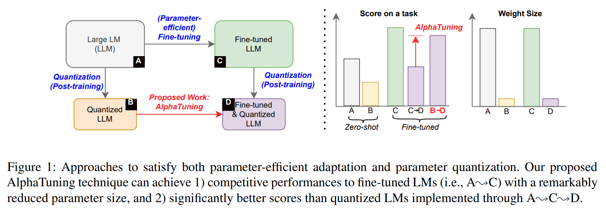

Fig. 1 은 model compression 과 parameter-efficient adaptation 을 모두 가능하게 하는 두 가지 접근법을 그림으로 비교한다. 

- Fine-tuned 하고 quantized LM 은 Fig. 1 에서처럼 $\mathrm{A} \sim \mathrm{C} \sim \mathrm{D}$ 또는 $\mathrm{A} \sim \mathrm{B} \sim \mathrm{D}$ 로 달성할 수 있다. 
  - $\mathrm{A} \sim \mathrm{B} \sim \mathrm{D}$ 의 경우 trainable parameter 수가 많거나 PTQ 가 downstream task 에서 성능을 떨어뜨릴 수 있다. 
  - 이런 문제를 해결하기 위해 저자는 $\mathrm{A} \sim \mathrm{B} \sim \mathrm{D}$ scheme 인 "AlphaTuning" 을 조사한다. 
- 구체적으로 large PLM 의 parameter 를 binary value 와 scaling factor 로 분해한다. 
  - 그러고 나서 AlphaTuning 은 quantization format 에서 작은 부분을 차지하는 scaling factor 만 training 하면서 다른 binary value 는 고정한다. 
  - $\mathrm{A} \sim \mathrm{B}$ 를 수행하기 위해 저자는 post-training quantization (PTQ) 를 고려하는데, QAT 는 whole dataset 으로 scratch training 하는 데 large computational overhead 가 필요하기 때문이다.

이 논문에서 저자의 기여는 다음과 같다:

- 이 연구는 최초로 성공적인 compression-aware parameter-efficient adaptation 방법이다.
- PLM 이 PTQ 로 quantize 되면 각 task 에 대해 scaling factor (total parameter size 의 $0.1\%$ 미만) 만 training 해도 성공적인 adaptation 에 충분하다는 걸 보고한다.
- 다양한 LM 과 task 에 걸쳐 AlphaTuning 이 4-bit quantization 아래에서도 높은 점수를 달성할 수 있다는 걸 보여준다.

# 2 Recent Work

#### Large-Scale Language Models and Quantization

Pre-trained transformer-based language model 은 NLP model 을 설계하고 배포하는 방식을 바꿔놨다. 최근 몇 년간 ten-billion scale 이상의 large-scale language model 의 가용성이 폭발적으로 늘어나면서 NLP 분야에서 few-shot learning 과 downstream task 에 대한 parameter-efficient adaptation 이 더 중요해지는 새 시대가 열렸다. Quantization 은 large-scale language model 의 공간과 시간 복잡성을 근본적으로 극복하는 효과적인 접근법이지만, 기존 방법은 제한된 domain 과 quantized state 에서의 task 적응성에만 적용 가능하다.

#### Parameter-Efficient Adaptation of LMs

Large-scale language model 이 등장한 이후로 task 와 domain-specific data 에 효율적으로 language model 을 적응시키는 게 커뮤니티 관심의 중심에 있었다. 유망한 접근법 중 하나는 in-context learning (ICL) 인데, 이는 language model 이 주어진 prompt pattern 에서 학습하고 예측한다. 이 기술은 parameter-tuning 없이 large-scale language model 에서 괜찮은 few-shot 성능을 끌어내니까, 많은 연구가 그 메커니즘을 조사하고 이 접근법을 더 활용할 방법을 제안했다. 

또 다른 기술은 LM 행동을 더 좋게 이끌어낼 수 있는 specific prompt 를 붙이는 직관성에 기반한 parameter-efficient LM adaptation 이 가능하도록 continuous prompt embeddings 같은 외부 또는 부분적 내부 parameter 를 도입하는 거다. 기존 연구에서는 discrete prompt token space 에 탐구하였으며 이후 연구에서는 더 나은 결과를 내고 심지어 full fine-tuning 과 동등한 성능을 내는 continuous word embedding 을 optimizing 함을 준다.

비슷한 다른 연구 라인은 Transformer blocks 또는 기존의 부분적인 parameters 를 추가 parameters 로서 도입하는 방법이다.

마지막으로 일부 연구는 parameiter-efficient fine-tuning 과 관련하여 통합하는 것을 제안한 바도 있다.

# 3 Quantization for AlphaTuning

Enterprise-scale LM, 예를 들어 175B GPT-3 같은 건 주로 엄청난 parameter size 때문에 대규모 배포 비용이 엄청나다는 어려움에 직면한다. Memory 요구사항을 완화하면서 성능 저하 없이 cost-efficienct LM 을 만들기 위해 quantization, pruning, low-rank approximation 같은 compression 기술을 고려할 수 있다. Model compression 으로 memory 를 줄이는 건 latency 를 줄이는 데도 유용한데, small batch size 에서 LM 의 전체 성능은 memory-bound operation 이 지배하기 때문이다. 게다가 model compression 은 GPU 의 제한된 memory capacity 때문에 inference 에 필요한 GPU 수를 줄일 수 있다. 이번 연구에서 저자는 quantization 을 실용적인 compression 기술로 선택했는데, high compression ratio, simple representation format, memory-bound workload 를 가속화할 수 있는 능력 때문이었다.

LM 에 대한 quantization 전략을 논의해보자. 저자는 uniform quantization 대신 nonuniform quantization 을 선택한다. 

- Uniform quantization 은 integer arithmetic unit 을 활용하려고 activation quantization 을 강하게 요구하는데, Transformer 의 softmax 나 layer normalization 같은 highly non-linear operation 때문에 어렵다. 
- Uniform quantization 이 자주 activation quantization/dequantization 절차로 성능 저하를 완화할 수 있더라도, 이런 기술은 느리거나 비용이 많이 든다. 
- 다양한 nonuniform quantization format 중에서 저자는 binary-coding-quantization (BCQ) 를 선택했는데, high compression ratio 와 efficient computation 때문이었다.

#### BCQ Format

Full-precision weight vector $\boldsymbol{w} \in \mathbb{R}^g$ 가 주어졌을 때, BCQ format 은 $\boldsymbol{w}$ 를 $\boldsymbol{w} \approx \sum_{i=1}^q \alpha_i \boldsymbol{b}_i$ 로 근사한다. 여기서 $q$ 는 quantization bit 수, $\alpha \in \mathbb{R}$ 은 $g$ weights 가 공유하는 scaling factor, $\boldsymbol{b} \in \{-1,+1\}^g$ 는 binary vector 다. $g$ 는 group size 또는 common scaling factor 를 공유하는 weight 수를 나타내는 hyper-parameter 다. 

$q=1$ 일 때 $\alpha$ 와 $\boldsymbol{b}$ 는 mean squared error (MSE) 를 최소화하도록 analytically 결정된다. 하지만 $q>1$ 이면 $\alpha$ 와 $\boldsymbol{b}$ 는 greedy approximation 이나 iterative fine-tuning 방법 같은 heuristic 방법으로 구해야 한다.

Weight matrix $\boldsymbol{W} \in \mathbb{R}^{h_{\text{out}} \times h_{\text{in}}}$ 에 대해 row-wise quantization (i.e., $g=h_{in}$) 이 인기 있는 선택이다. 이는 다음과 같이 표현된다:

$$
\begin{equation}
    \boldsymbol{W} \approx \sum_{i=1}^q \operatorname{diag}\left(\boldsymbol{\alpha}_i\right) \cdot \boldsymbol{B}_i,
\end{equation}
$$

여기서 $\boldsymbol{\alpha}_i \in \mathbb{R}^{h_{\text{out}}}$, $\boldsymbol{B}_i \in \{-1,+1\}^{h_{\text{out}} \times h_{\text{in}}}$, $\operatorname{diag}(\cdot)$ 는 vector 를 받아서 그 vector elements 가 diagonal 에 있는 zero-matrix 를 출력하는 function 이다. 

Linear operation $\boldsymbol{Y}=\boldsymbol{X} \cdot(\boldsymbol{W})^{\top}$ 은 다음과 같이 근사된다:

$$
\begin{equation}
    \begin{aligned}
    \boldsymbol{Y} & =\boldsymbol{X} \cdot \boldsymbol{W}^{\top} \\
    & \approx \boldsymbol{X} \cdot\left(\sum_{i=1}^q \operatorname{diag}\left(\boldsymbol{\alpha}_i\right) \cdot \boldsymbol{B}_i\right)^{\top} \\
    & =\sum_{i=1}^q\left(\left(\boldsymbol{X} \cdot \boldsymbol{B}_i^{\top}\right) \cdot \operatorname{diag}\left(\boldsymbol{\alpha}_i\right)\right),
    \end{aligned}
\end{equation}
$$

여기서 $\boldsymbol{X} \in \mathbb{R}^{n_h \times h_{in}}$, $\boldsymbol{Y} \in \mathbb{R}^{n_h \times h_{\text{out}}}$ 이다. 

$\boldsymbol{X}$ 가 위에서 quantize 되지 않았더라도, $\boldsymbol{B}$ 의 binary value 때문에 복잡한 floating-point operation 이 대부분 제거된다. BCQ 의 computational 이점은 문헌에서 소개됐으니까, 이번 연구에서는 quantization 품질을 높이기 위해 activation 을 quantize 하지 않는다.

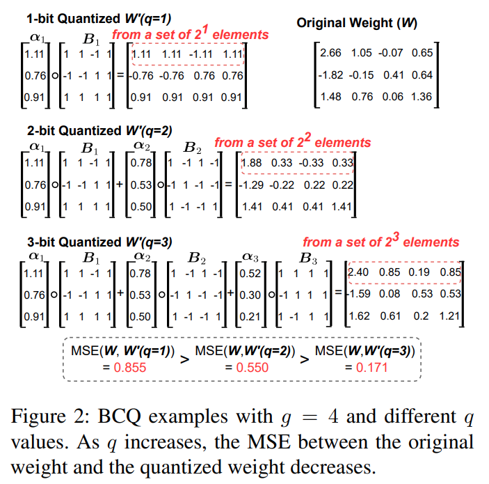

Fig. 2 는 $q$ 가 변할 때 greedy approximation 기반 row-wise BCQ 예시를 보여준다. 

$q$ 를 늘리거나 $g$ 를 줄이면 quantization 후 MSE 를 줄일 수 있지만 compression ratio 가 낮아지는 대가를 치른다.

#### Transformer Quantization

Tab. 1 은 Transformer 의 linear layer 에 적용된 BCQ scheme 과 medium-sized GPT-2 model (hidden size $h$ 가 1024) 에 대한 BCQ format 예시를 보여준다.

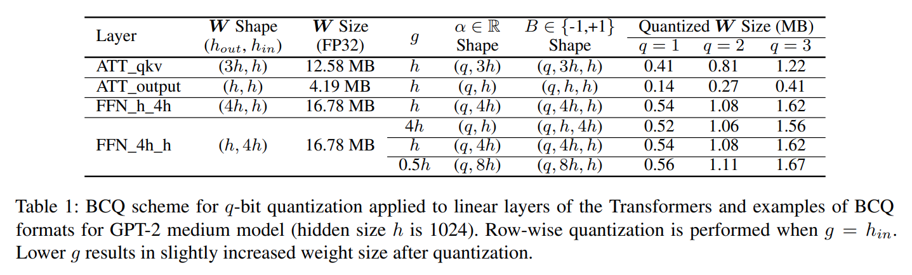

- $g$ 가 충분히 크면 각 scaling factor 가 많은 weight 와 공유되니까 scaling factor 양은 $\boldsymbol{B}$ 에 비해 무시할 만하다.
- 그래서 Tab. 1 에서 1-bit quantization 은 FP32 format 에 비해 거의 $32 \times$ compression ratio 를 달성하고, $g$ 가 낮아지면 additional scaling factors 로 인한 storage overhead 가 약간 늘어난다.

# 4 AlphaTuning: Efficient Fine-Tuning of Quantized Models

## 4.1 AlphaTuning Principles.

AlphaTuning 의 핵심 아이디어는 PTQ 후 trainable parameter 수를 최소화하기 위해 표현력이 더 큰 parameter 를 찾아내는 거다. Affine parameter (scaling, shifting, rotating 같은 operation 으로 activation 을 변환하는) 를 training 하면 나머지 parameter 가 모두 random 으로 고정돼 있어도 꽤 높은 accuracy 를 달성한다는 보고가 있다 (Frankle et al). 흥미롭게도 BCQ format 에서 얻은 scaling factor 는 Eq. 2 에서 보듯이 affine parameter 로 볼 수 있다. 이런 관찰을 바탕으로 Fig. 3 은 AlphaTuning 의 개요를 보여준다. 

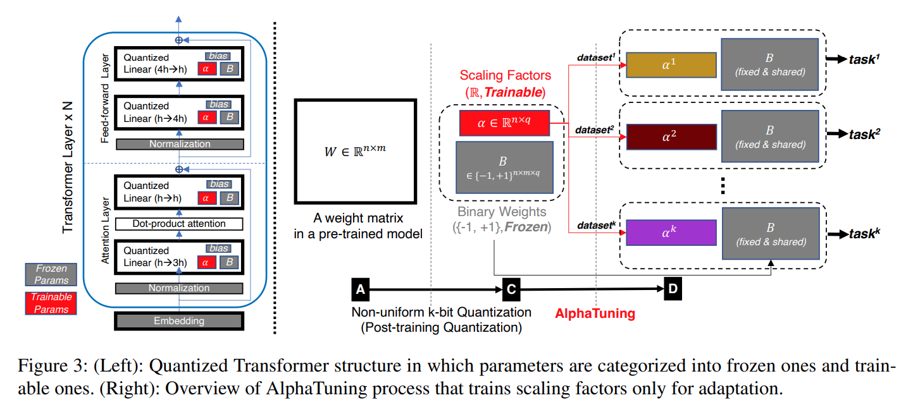

- 먼저 Transformer 의 linear layer 의 weight 를 quantize 하는데, 이건 overall memory footprint 을 지배한다 (Park et al). 
- 그러고 나서 BCQ format 은 quantized weight 를 scaling factor 와 binary value 로 분해한다. 
- 마지막으로 scaling factor 는 주어진 target task 에 대해 training 되고, 나머지 parameter (e.g., bias, binary value B, normalization layer 와 embedding layer 의 parameter) 는 downstream task 에 상관없이 고정된다.

#### Training Algorithm

Eq. 1 로 quantized linear layer 에 대해 forward propagation 은 $\boldsymbol{W}$ 를 dequantize 하지 않고 수행할 수 있고, Eq. 2 로 표현된다. 마찬가지로 backward propagation 도 quantized format 으로 계산할 수 있고, chain rule 을 적용하기 위해 $\boldsymbol{W}$ 와 $\alpha$ 에 대한 $\boldsymbol{Y}$ 의 gradient 는 다음과 같이 구해진다:

$$
\begin{equation}
  \partial \boldsymbol{X} = \partial \boldsymbol{Y} \cdot \left( \sum_{i=1}^q \operatorname{diag}(\alpha_i) \cdot \boldsymbol{B}_i \right)
\end{equation}
$$

$$
\begin{equation}
  ∂\alpha_i = \frac{(\partial Y)^{\top} \boldsymbol{X} \boldsymbol{B}_i^{\top} \cdot \mathbf{1}^{\top}}{g_L} \quad (1 \leq i \leq q),
\end{equation}
$$

- 여기서 $\mathbf{1}$ 은 $h_{out}$-long-all-ones vector 이고, 
- $g_L$ 은 layer $L$ 의 group size 다. 
- Eq. 4 에서 $g_L$ 로 나누는 건 $\alpha$ updates 가 지나치게 커지는 걸 막고 training 의 stability 를 높이기 위해 경험적으로 도입됐다. 
- $g_L \neq h_{in}$ (i.e., row-wise quantization 이 아닌 경우) 이더라도 tiling-based 접근법을 사용하면 같은 equation 을 활용할 수 있다 (Jeon et al).

#### 4.2 AlphaTuning for GPT-2

저자는 AlphaTuning 을 GPT-2 medium 과 large 에 WebNLG 에 적용해서 hyper-parameter space 를 탐색하고 AlphaTuning 의 효과를 조사한다 (Tab. 2 참조). 이 논문에선 parameter ( $\alpha$ 포함) 가 $q$-bit quantization 으로 압축된다고 명시되지 않은 한 32-bit floating-point number (i.e., FP32 format) 로 표현된다고 가정한다.

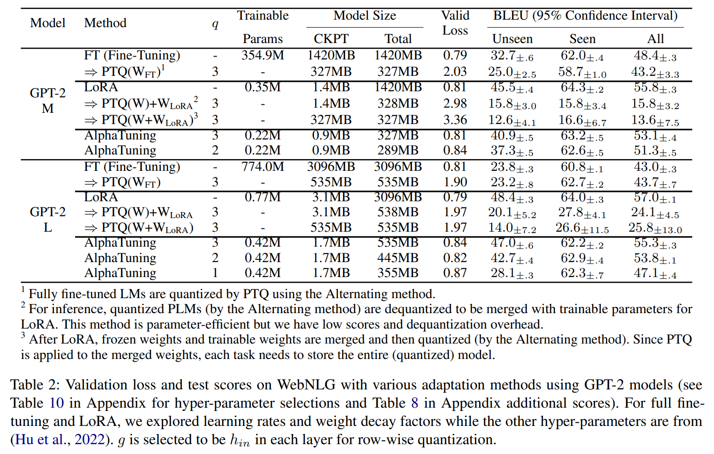

#### Adaptation Details

AlphaTuning 의 PTQ 는 pre-trained GPT-2 에 Greedy method 로 수행된다 (Guo et al). 그러고 나서 $q$-bit quantization 에 대해선 adaptation 의 parameter efficiency 를 극대화하기 위해 $\alpha_1 \cdots \alpha_q$ 중 $\alpha_1$ 만 training 한다. 왜냐하면 all $\alpha$ values 를 training 해도 Tab. 3 에서 보듯이 성능 향상이 미미하기 때문이다. 

$\alpha_1$ 의 training 은 dropout 없이 linear decay learning rate schedule 로 진행된다. 각 hyper-parameter 선택마다 test score 는 $5^{th}$ epoch 에서 측정되고 5 trials 에 걸쳐 평균된다 (Tab. 3 의 실험에서 hyper-parameter 선택을 정당화하기 위해 5 random seeds 를 고정했다). 

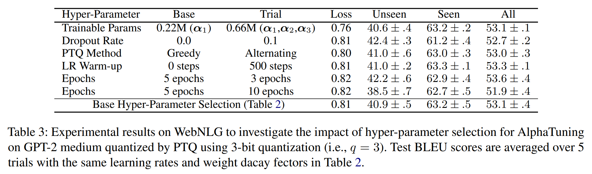

Tab. 2 에서 고려된 all adaptation 방법들에 대해 learning rate 와 weight decay factor 는 'all' 카테고리에서 최고 결과를 내도록 탐색했다 (AlphaTuning 의 탐색 결과는 Tab. 11 참조).

#### Comparison with Fine-Tuning and LoRA

저자는 AlphaTuning 을 WebNLG 에 대해 full fine-tuning 과 LoRA 와 비교한다. Tab. 2 에서 AlphaTuning 은 LoRA 와 비슷하고 full fine-tuning 보다 나은 BLEU score 를 제공하면서 total memory footprint 과 checkpoint (CKPT) memory size 를 크게 줄인다. Score 차이는 Fig. 4 에서 AlphaTuning 이나 LoRA 의 training 과정이 잘 수렴하는 반면 full fine-tuning 은 overfitting 을 일으킨다는 걸로 부분적으로 설명된다. 

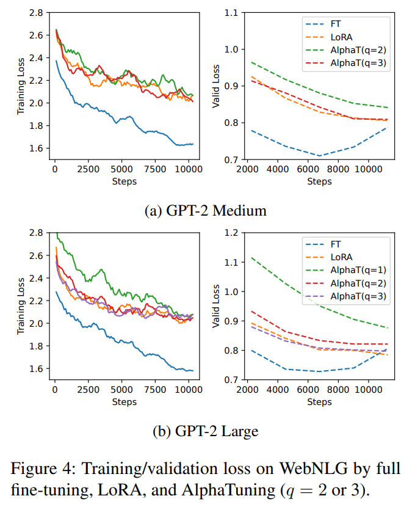

- 흥미롭게도 $\alpha_1$ 만 training 하고 (그래서 $\boldsymbol{\alpha}_2$ 와 $\boldsymbol{\alpha}_3$ 는 all tasks 에 대해 고정) $q$ 를 늘리면 validation loss 와 test BLEU score 가 좋아진다. 
- $q$ 가 늘어날수록 'Unseen' score 는 빠르게 향상되지만 'Seen' score 는 크게 영향을 받지 않는다. 
- 전체적으로 3-bit (i.e., $q=3$) quantization 을 사용한 AlphaTuning 은 high compression ratio 로 성공적인 parameter-efficient adaptation 이 될 수 있다.

#### Comparison with $\mathbf{A} \sim \mathbf{C} \sim \mathbf{D}$ in Fig. 1

AlphaTuning 의 잠재적 대안으로 다음 세 가지 경우를 조사한다:  
1) Fully fine-tuned model 에 PTQ 적용 (i.e., PTQ $\left(\mathrm{W}_{\mathrm{FT}}\right)$),  
2) PLM 에 PTQ 적용 후 LoRA parameter 추가 (i.e., PTQ(W) $+\mathrm{W}_{\text{LoRA}}$),  
3) PLM 과 LoRA parameter 를 합친 후 quantize (i.e., PTQ $\left(\mathrm{W}+\mathrm{W}_{\text{LoRA}}\right)$).  

이 세 경우는 Tab. 2 에서처럼 다양한 checkpoint size, total model size, trainable parameter 수를 유발한다. PTQ(W) $+\mathrm{W}_{\text{LoRA}}$ 와 PTQ $\left(\mathrm{W}+\mathrm{W}_{\text{LoRA}}\right)$ 의 score 는 크게 떨어진다. 즉, model compression 기술과 parameter-efficient adaptation 방법은 단순히 결합하면 상충되는 특성을 가질 수 있다. 

- PTQ $\left(\mathrm{W}_{\mathrm{FT}}\right)$ 는 다른 두 경우보다 나은 score 를 보이지만, trainable parameter 수는 full fine-tuning 과 같고 task 에 대한 checkpoint size 는 LoRA 와 AlphaTuning 보다 훨씬 크다. 
- 반면 AlphaTuning 은 smaller trainable parameter 와 checkpoint size 로도 괜찮은 BLEU score 를 제공한다.

#### Hyper-Parameter Selection

Dropout rate 나 epoch 수 같은 몇몇 hyper-parameter 는 Tab. 3 에서처럼 'Unseen' score 와 'Seen' score 간의 trade-off 와 관련 있다. PTQ 방법의 경우 Alternating method 를 많은 iteration 으로 사용해 MSE 를 더 줄여도 adaptation 후 Greedy method 와 비슷한 score 가 된다. 그래서 이 논문에선 all tasks 에 Greedy method 를 선택한다. Learning rate warm-up 은 PLM, downstream task, $q$ 선택에 따라 무작위 효과를 보인다. 

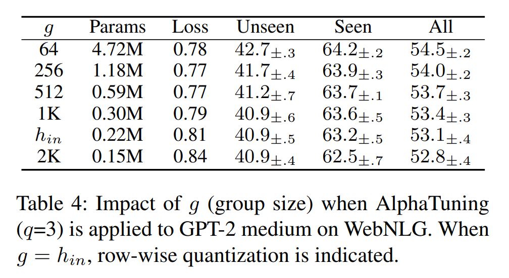

Group size $g$ 는 Tab. 4 에서처럼 trainable parameter size 와 test score 간의 명확한 trade-off 를 제공한다. 달리 명시되지 않으면 이 논문에선 $g=h_{in}$ (i.e., row-wise quantization) 을 선택한다.

# 5 Experimental Results

AlphaTuning 의 영향을 자세히 보여주기 위해 GPT-2 model 을 사용해 WebNLG 에서 탐색한 자세한 adaptation 기술과 hyper-parameter 선택을 추가 downstream task 와 OPT model 에 적용한다.

## 5.1 GPT-2 Models on DART and E2E

Pre-trained GPT-2 medium/large 를 기반으로 full fine-tuning, LoRA, AlphaTuning 방법으로 DART 와 E2E 에서 adaptation 을 수행한다. DART dataset 에 대해선 Tab. 5 에서 AlphaTuning 이 극단적인 quantization (e.g., $q=2$) 에서도 LoRA 와 full fine-tuning (둘 다 model compression 을 고려하지 않음) 과 비슷한 test score 를 유지하는 걸 본다. 

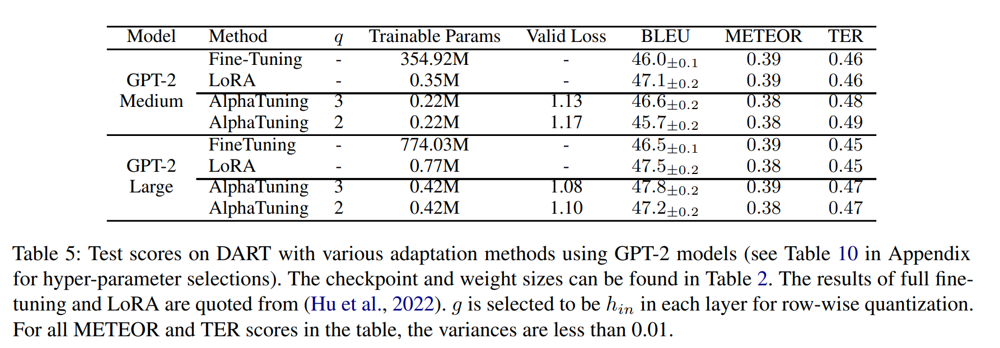

E2E dataset 에선 다음을 발견한다:  
1) Full fine-tuning 은 test score 가 떨어진다,  
2) AlphaTuning 은 $q=1$ 에서도 GPT-2 large 에 합리적인 선택이다,  
3) LoRA 로 적응된 model 을 quantize 하면 test score 가 망가진다.  

전체적으로 GPT-2 medium/large 와 다양한 task 를 결합할 때 AlphaTuning 은 high compression ratio 와 trainable parameter 수의 대폭 감소에 효과적이다.

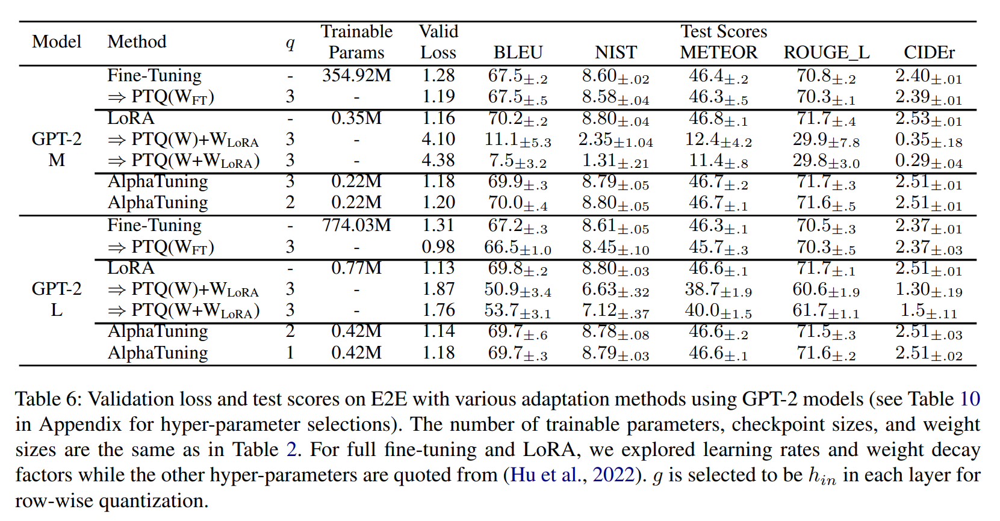

## 5.2 OPT Models on MNLI and SAMSum

Pre-trained OPT 1.3B model 을 GLUE-MNLI 와 SAMSum 에 full fine-tuning 또는 AlphaTuning 으로 적응시킨다. MNLI 의 text classification 에선 GPT-2 위에 randomly initialized weight 로 LM head layer 를 추가한다. 

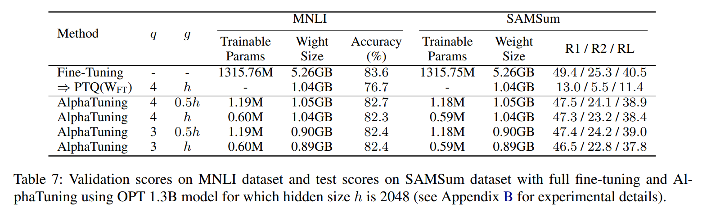

Tab. 7 에서 다음 결과를 찾는다:  
1) PTQ $\left(\mathrm{W}_{\mathrm{FT}}\right)$ 는 때때로 (e.g., SAMSum dataset) 심각하게 score 가 떨어진다, PTQ 계산에 많은 iteration 이 연관돼도 마찬가지다,  
2) AlphaTuning 은 PTQ $\left(\mathrm{W}_{\mathrm{FT}}\right)$ scheme 을 이 논문의 모든 task 에서 능가한다,  
3) AlphaTuning 의 $g$ 를 줄이면 score 를 개선할 수 있다.

# 6 Discussion

#### Memory during Adaptation

Compression-aware parameter-efficient adaptation 기술로 AlphaTuning 은 inference memory footprint (quantization 으로) 뿐만 아니라 adaptation 중 training memory footprint 도 줄인다. 구체적으로 GPU memory 에 저장할 optimizer state 는 $g$ 가 충분히 크면 total weight size 의 $0.1\%$ 미만을 차지하는 scaling factor 에서만 나온다. Training 중 이런 GPU memory 요구사항 감소는 batch size 증가나 adaptation 수행의 최소 GPU 수가 감소하는 것에 해당한다.

#### Embedding Layers

이번 연구에서 저자는 Transformer 의 linear layer 를 BCQ 로 quantize 하는 걸 고려했지만 embedding layer 는 full precision 으로 남겨뒀다. 이런 선택의 이유는 model 이 hidden size ($h$) 가 커지면서 scale up 될수록 embedding layer 의 상대적 크기가 작아지기 때문이다. 

좀 더 구체적으로 말하면 linear layer 와 embedding layer 의 공간 복잡도는 각각 $O(h^2)$ 와 $O(h)$ 를 따른다. 그래서 large-scale LM 에서 embedding layer 를 quantize 하면 compression ratio 에 미미한 개선만 가져오고 test score 는 떨어질 수 있을 거라고 예상한다.

#### Inference Speed

Eq. 2 에서 설명했듯이 BCQ format 은 activation 이 quantize 되지 않아도 matrix multiplication 에 독특한 computation 을 가능하게 한다. 최근 연구 (Jeon et al; Park et al) 에 따르면 BCQ format based matrix multiplication 은 다음 operation 으로 가속화될 수 있다:  
1) 가능한 모든 computation (partial activation 과 $\boldsymbol{B}$ 를 결합한) 을 미리 계산해서 look-up table (LUT) 에 저장한다,  
2) Eq. 2 에서 floating-point addition 대신 $\boldsymbol{B}$ value 를 index 로 사용한 LUT retrieval 로 대체한다.  

빠른 computation 의 주요 이유는 LUT 의 byte-level access 와 $h$ 가 커질수록 늘어나는 LUT 재사용 때문이다 (Jeon et al; Park et al). 이런 LUT 기반 matrix multiplication 은 memory 감소 비율만큼 latency 개선을 가져올 수 있다.

# 7 Conclusion

이 논문에서 저자는 large-scale LM 에 대한 최초의 성공적인 compression-aware parameter-efficient adaptation 방법으로 AlphaTuning 을 제안했다. 몇몇 대표적인 generative LM (e.g., GPT-2) 을 통해 linear layer 가 BCQ format 으로 quantize 되면 scaling factor 만 training 해도 꽤 높은 score 를 얻을 수 있다는 걸 보여줬다. 또 이미 적응된 LM 을 quantize 하면 score 가 크게 떨어진다는 걸 실험으로 증명했다.

# Limitation

이 논문의 주요 기여는 PLM 크기가 커질수록 더 설득력을 가질 거라고 믿는다. 반면에 이 논문에서 실험에 사용된 model (i.e., GPT-2 와 1.3B OPT) 은 최근 발표된 large-scale LM (e.g., OPT 175B) 에 비해 충분히 크지 않을 수 있다. 

larger model 이 higher compression ratio 로 압축되면서 성능 저하가 적다는 몇몇 보고를 고려하면 (Li et al), AlphaTuning 도 10 billion 이상의 parameter 를 가진 larger model 에서도 효과적일 거라고 기대한다.

1.3B OPT 에서 AlphaTuning 의 성능은 PTQ($\mathrm{W}_{\mathrm{FT}}$) 보다 나아졌지만 full fine-tuning 보다는 떨어진다. 이런 결과는 AlphaTuning 에 적절한 training recipe 탐색이 부족해서 생긴 걸로 보인다. 따라서 larger LM 과 more dataset 을 사용해 AlphaTuning 의 learning hyper-parameter 를 탐색하는 게 AlphaTuning 의 특성에 대한 일반적인 주장을 이끌어내는 데 필요할 거다.