# Abstract

Large language models (LLMs) 은 뛰어난 성능을 보여주지만 compute 와 memory 가 많이 필요하다. Quantization 은 memory 를 줄이고 inference 를 빠르게 할 수 있다. 하지만 기존 방법들은 accuracy 및 hardware efficiency 를 동시에 유지하지 못한다. 

저자는 **SmoothQuant** 라는 training 없이 정확도를 유지하는 범용적인 post-training quantization (PTQ) 솔루션을 제안한다. 

8-bit weight, 8-bit activation (W8A8) quantization 을 LLM 에 가능하게 해준다. Weight 는 quantize 하기 쉽지만 activation 은 그렇지 않다는 점을 바탕으로, SmoothQuant 는 activation 의 outlier 를 smoothing 해서 quantization 어려움를 weight 로 offline 에서 _옮기는_ mathematically equivalent transformation 을 사용한다. 

- SmoothQuant 는 OPT, BLOOM, GLM, MT-NLG, Llama-1/2, Falcon, Mistral, Mixtral 같은 LLM 의 모든 matrix multiplication 에서 weight 와 activation 의 INT8 quantization 을 가능하게 한다. 
- 저자는 최대 $1.56 \times$ speedup 과 $2 \times$ memory reduction 을 보여주면서 정확도 손실은 거의 없음을 입증한다. 
- SmoothQuant 는 single node 에서 530B LLM 을 서비스할 수 있게 한다. 이 연구는 hardware costs 를 줄이고 LLM 을 대중화하는 turn-key 솔루션을 제공한다.

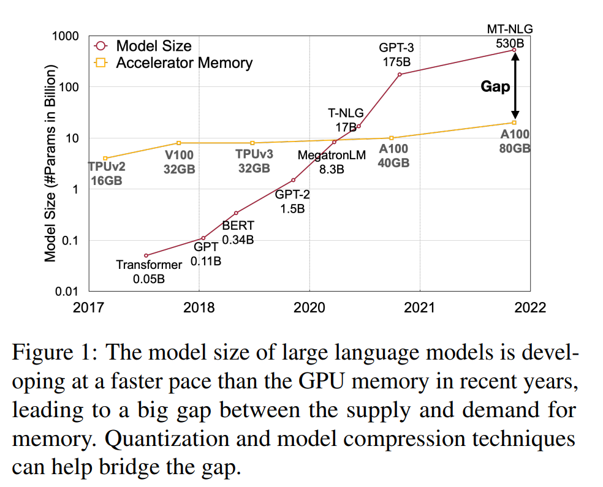

# 1 Introduction

Large-scale language models (LLMs) 은 다양한 task 에서 뛰어난 성능을 보여준다. 하지만 LLM 서비스는 예산과 에너지를 많이 잡아먹는다. 이는 model size 가 크기 때문이다. 

- 예로 GPT-3 model 은 175B parameter 를 가지고 있어서 FP16 으로 저장하고 실행하려면 최소 350GB 의 memory 가 필요. 그러려면 $8 \times 48$GB A6000 GPU 나 $5 \times 80$GB A100 GPU 가 inference 에 필요하다. 
- 게다가 computation 과 communication overhead 때문에 inference latency 도 실세계 응용에 맞지 않을 수 있다.

Quantization 은 LLM 비용을 줄이는 유망한 방법이며 Weight 와 activation 을 low-bit integer 로 quantize 하면 GPU memory 요구량 (size 및 bandwidth) 을 줄이고 compute-intensive operation (linear layer 의 `GEMM`, attention 의 `BMM`) 을 빠르게 할 수 있다. 

- 예로 INT8 quantization 은 weight 와 activation 의 GPU memory 사용량을 FP16 대비 절반으로 줄이고 matrix multiplication throughput 을 거의 두 배로 늘릴 수 있다.

하지만 CNN model 이나 BERT 같은 smaller transformer model 과 달리 LLM 의 activation 은 quantize 하기 어렵다. 

- LLM 을 6.7B parameter 이상으로 키우면 _activations_ 에 large magnitude 의 systematic outlier 가 나타나서 quantization error 가 커지고 정확도가 떨어진다. 
- ZeroQuant 는 dynamic per-token activation quantization 과 group-wise weight quantization 을 적용한다. 
  - 이는 효율적으로 구현할 수 있고 GPT-3-350M 이나 GPT-J-6B 에서 좋은 정확도를 보여준다. 
  - 하지만 175B parameter 의 OPT model 에서는 정확도를 유지하지 못한다 (Sec. 5.2 참조). 
- `LLM.int8()` 은 mixed-precision decomposition (outlier 는 FP16 으로 유지하고 나머지 activation 은 INT8 사용) 으로 정확도 문제를 해결한다. 
  - 하지만 이는 hardware accelerator 에서 효율적으로 구현하기 어렵다. 
  - 그래서 _efficient/hardware-friendly_ 면서 LLM 의 모든 compute-intensive operation 에 INT8 을 사용할 수 있는 _training-free quantization scheme_ 을 찾는 건 여전히 풀리지 않은 도전이다.

저자는 **SmoothQuant** 라는 정확하고 efficient post-training quantization (PTQ) 솔루션을 제안한다. 

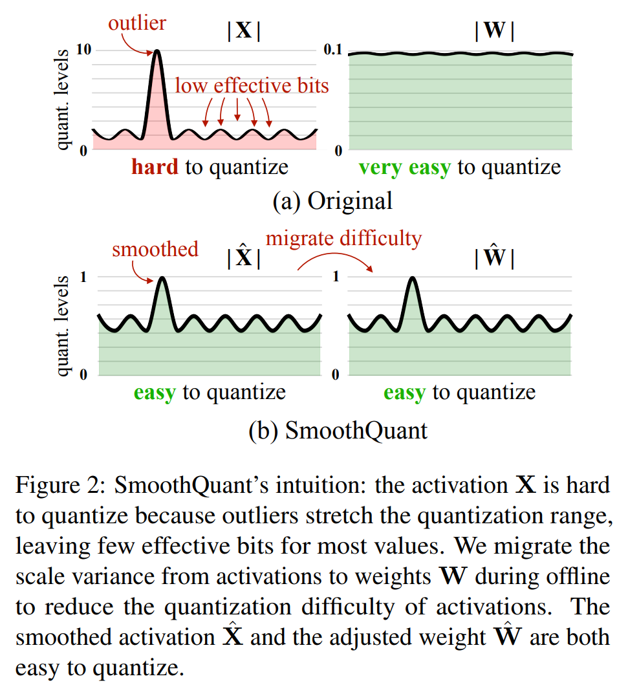

- SmoothQuant 는 activation 이 weight 보다 quantize 하기 훨씬 어렵다는 관찰에 기반한다. 특히 outlier 때문에 그렇다. 
  - 그런데 다른 token 은 channel 간 비슷한 변화를 보인다. 
  - 이 관찰을 바탕으로 SmoothQuant 는 quantization 어려움을 activation 에서 weight 로 offline 에서 옮긴다 (Fig. 2). 
- SmoothQuant 는 per-channel scaling transformation 을 제안하는데, 이는 channel 간 magnitude 를 크게 smoothing 해서 model 을 quantization 친화적으로 만든다. 
- SmoothQuant 는 다양한 quantization scheme 과 호환되기 때문에 저자는 세 가지 efficiency levels (Tab. 2, O1-O3) 을 구현했다. 
  - 실험에서 SmoothQuant 는 hardware efficient 하다. 
  - OPT-175B, BLOOM-176B, GLM-130B, MT-NLG 530B 의 성능을 유지하면서 PyTorch 에서 최대 $1.51 \times$ speedup 과 $1.96 \times$ memory reduction 을 달성한다. 
- SmoothQuant 는 구현하기 쉽다. 저자는 SmoothQuant 를 state-of-the-art transformer serving framework 인 FasterTransformer 에 통합해서 FP16 대비 최대 $1.56 \times$ speedup 과 memory 사용량 절반을 달성했다. 
  - 놀랍게도 SmoothQuant 는 OPT-175B 같은 large model 을 FP16 대비 절반 GPU 로 더 빠르게 서비스할 수 있게 하고, 530B model 을 한 8-GPU node 에서 서비스할 수 있게 한다. 
  - 이 연구는 LLM 사용을 대중화하고 serving 비용을 줄이는 turn-key 솔루션을 제공한다.

# 2 Preliminaries

#### Quantization

Quantization 은 high-precision value 를 discrete level 로 매핑한다. 저자는 integer uniform quantization (특히 INT8) 을 연구하는데, 이는 hardware 지원과 efficiency 가 더 좋다. 

Quantization 과정은 이렇게 표현할 수 있다:

$$
\begin{equation}
    \overline{\mathbf{X}}^{\mathrm{INT8}} = \left\lceil \frac{\mathbf{X}^{\mathrm{FP16}}}{\Delta} \right\rfloor, \quad \Delta = \frac{\max(|\mathbf{X}|)}{2^{N-1}-1}
\end{equation}
$$

- 여기서 $\mathbf{X}$ 는 floating-point tensor 이고, 
- $\overline{\mathbf{X}}$ 는 quantize 된 결과다. 
- $\Delta$ 는 quantization step size 이고, 
- $\lceil \cdot \rfloor$ 는 rounding function 이다. 
- $N$ 은 bit 수 (여기선 8) 다. 
- 단순하게 tensor 가 0 에서 대칭이라고 가정했다. 
- Asymmetric 경우 (e.g., ReLU 후) 는 zero-point 를 추가하면 비슷하다.

이런 quantizer 는 maximum absolute value 로 $\Delta$ 를 계산해서 activation 의 outlier 를 보존한다. 이는 정확도에 중요하다. $\Delta$ 는 calibration sample 의 activation 으로 offline 에서 계산할 수 있다. 이를 **static quantization** 이라고 한다. 

또 runtime 에 activation statistics 로 $\Delta$ 를 구할 수도 있다. 이는 **dynamic quantization** 이다. 

Fig. 3 에서 quantization 은 granularity level 이 다르다. **Per-tensor quantization** 은 entire matrix 에 single step size 를 사용한다. finer-grained quantization 은 token 별 activation (**per-token quantization**) 이나 weight 의 output channel 별 (**per-channel quantization**) 다른 step size 를 사용할 수 있다. Per-channel quantization 의 coarse-grained version 은 channel group 별 다른 step size 를 사용하는 **group-wise quantization** 이다.

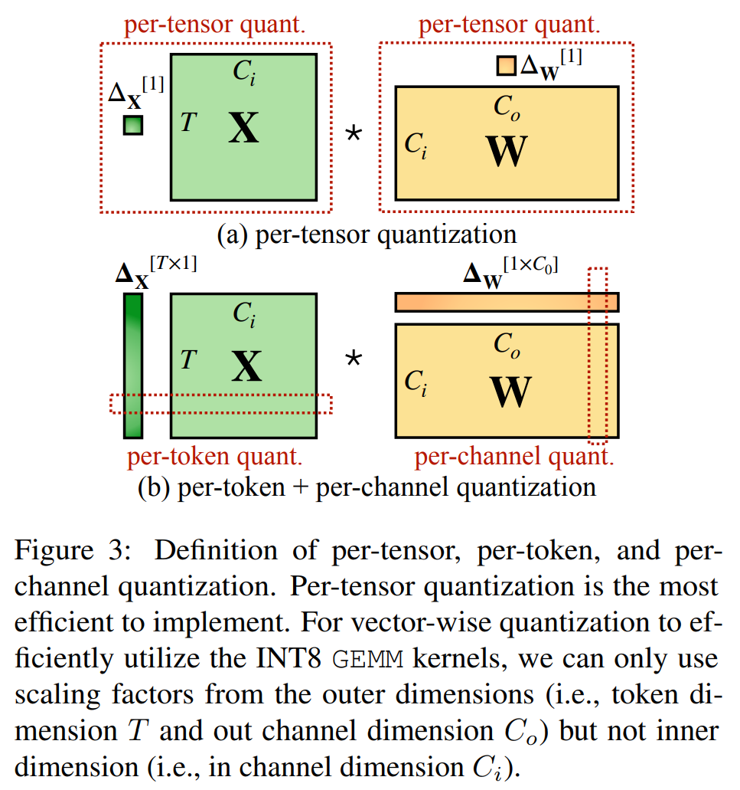

Transformer 의 linear layer 에서 $\mathbf{Y} = \mathbf{X} \cdot \mathbf{W}$, $\mathbf{Y} \in \mathbb{R}^{T \times C_o}$, $\mathbf{X} \in \mathbb{R}^{T \times C_i}$, $\mathbf{W} \in \mathbb{R}^{C_i \times C_o}$ 라고 하면 (여기서 $T$ 는 token 수, $C_i$ 는 input channel, $C_o$ 는 output channel, batch dimension 은 생략, Fig. 3 참조), weight 를 INT8 로 quantize 하면 FP16 대비 storage 를 절반으로 줄일 수 있다. 하지만 inference 를 빠르게 하려면 weight 와 activation 모두 INT8 (i.e., W8A8) 로 quantize 해야 integer kernel (e.g., INT8 `GEMM`) 을 활용할 수 있다. 이는 다양한 hardware (NVIDIA GPU, Intel CPU, Qualcomm DSP 등) 에서 지원된다.

# 3 Review of Quantization Difficulty

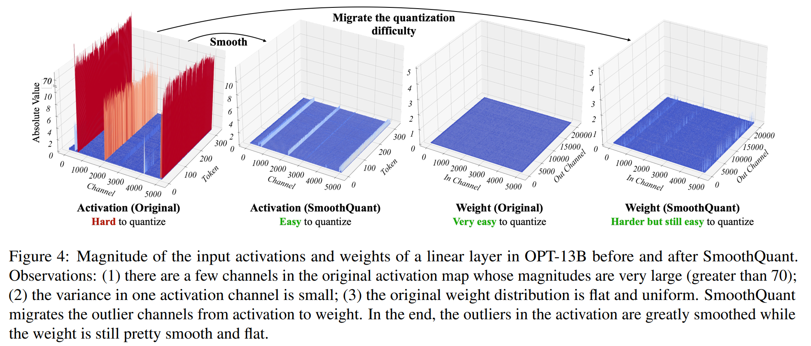

LLM 은 activation 의 outlier 때문에 quantize 하기 어렵다. 

먼저 activation quantization 의 어려움을 리뷰하고 outlier pattern 을 찾아본다. Fig. 4 (left) 에서 quantization error 가 큰 linear layer 의 input activation 과 weight 를 시각화했다. 몇 가지 패턴을 발견했는데, 이게 저자의 방법의 동기가 된다:

1. **Activation 은 weight 보다 quantize 하기 어렵다.** 
   - Weight distribution 은 꽤 uniform 하고 flat 해서 quantize 하기 쉽다. 
   - 이전 연구에서 LLM 의 weight 를 INT8 이나 INT4 로 quantize 해도 정확도가 떨어지지 않는다고 했다. 저자의 관찰과 일치한다.
2. **Outlier 때문에 activation quantization 이 어렵다.** 
   - Activation 의 outlier size 는 대부분 값보다 $\sim 100 \times$ 크다. Per-tensor quantization (Eq. 1) 에서 large outlier 가 maximum magnitude 를 지배해서 non-outlier channel 의 effective quantization _bit/level_ 이 적어진다 (Fig. 2). 
   - Channel $i$ 의 maximum magnitude 가 $m_i$ 이고 whole matrix 의 maximum 값이 $m$ 이라면, channel $i$ 의 effective quantization level 은 $2^8 \cdot m_i / m$ 이다. Non-outlier channel 은 level 이 아주 작아서 (2-3) quantization error 가 커진다.
3. **Outlier 는 특정 channel 에 지속된다.** 
   - Outlier 는 소수 channel 에 나타난다. 한 channel 에 outlier 가 있으면 all tokens 에 지속적으로 나타난다 (Fig. 4, 빨간색). 
   - Token 별 channel 간 variance 는 크지만 (일부 channel 은 크고 대부분은 작다), channel 별 token 간 magnitude variance 는 작다 (outlier channel 은 계속 크다). 
   - Outlier 의 지속성과 channel 내 작은 variance 때문에 _per-channel_ quantization 을 하면 quantization error 가 _per-tensor_ quantization 보다 훨씬 작아진다. 반면 _per-token_ quantization 은 별로 도움이 안 된다. 
   - Tab. 1 에서 per-channel activation quantization 이 FP16 baseline 과 정확도를 맞춘다고 검증했다.

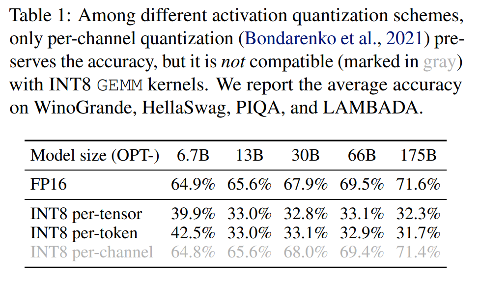

하지만 per-channel activation quantization 은 hardware-accelerated `GEMM` kernel 에 잘 맞지 않다. 이 kernel 은 고속으로 연속 연산 (e.g., Tensor Core MMA) 을 실행하고 lower throughput 의 instruction (e.g., conversion, CUDA Core FMA) 삽입을 허용하지 않는다. 이런 kernel 에서 scaling 은 matrix multiplication 의 outer dimension (activation 의 token dimension $T$, weight 의 output channel dimension $C_o$, Fig. 3 참조) 에서만 가능하다. 이는 matrix multiplication 후에 적용된다:

$$
\begin{equation}
    \mathbf{Y} = \operatorname{diag}(\boldsymbol{\Delta}_{\mathbf{X}}^{\mathrm{FP16}}) \cdot (\overline{\mathbf{X}}^{\mathrm{INT8}} \cdot \overline{\mathbf{W}}^{\mathrm{INT8}}) \cdot \operatorname{diag}(\boldsymbol{\Delta}_{\mathbf{W}}^{\mathrm{FP16}})
\end{equation}
$$

그래서 이전 연구들은 linear layer 에 per-token activation quantization 을 사용했다. 하지만 이는 activation quantization 의 어려움을 해결하지 못한다 (per-tensor 보다 약간 나을 뿐).

# 4 SmoothQuant

Per-channel activation quantization (불가능한) 대신, 저자는 input activation 을 per-channel smoothing factor $\mathbf{s} \in \mathbb{R}^{C_i}$ 로 나누어 "smoothing" 한다고 제안한다. Linear layer 의 mathematical equivalence 를 유지하려면 weight 를 반대 방향으로 scale 한다:

$$
\begin{equation}
    \mathbf{Y} = (\mathbf{X} \operatorname{diag}(\mathbf{s})^{-1}) \cdot (\operatorname{diag}(\mathbf{s}) \mathbf{W}) = \hat{\mathbf{X}} \hat{\mathbf{W}}
\end{equation}
$$

Input $\mathbf{X}$ 는 보통 이전 linear operation (e.g., linear layer, layer norm 등) 에서 나오니까 smoothing factor 를 previous layer 의 parameter 에 _offline_ 으로 fuse 할 수 있다. 이는 extra scaling 에서 kernel call overhead 를 만들지 않는다. Residual add 에서 input 이 오는 경우엔 residual branch 에 extra scaling 을 넣을 수 있다.

#### Migrate the quantization difficulty from activations to weights.

저자는 $\hat{\mathbf{X}} = \mathbf{X} \operatorname{diag}(\mathbf{s})^{-1}$ 가 quantize 하기 쉽게 per-channel smoothing factor $\mathbf{s}$ 를 선택하려 한다. Quantization error 를 줄이려면 all channels 의 _effective quantization bit_ 를 늘려야 한다. all channels 의 maximum magnitude 가 같을 때 total effective quantization bit 가 가장 크다. 그래서 간단한 선택은 $\mathbf{s}_j = \max(|\mathbf{X}_j|), j = 1, 2, \ldots, C_i$ 이다. 여기서 $j$ 는 $j$-th input channel 이다. 

이 선택은 나눗셈 후 all activation channels 의 maximum value 가 같게 해서 quantize 하기 쉽게 한다. Activation 의 range 는 dynamic 하다. 다른 input sample 에 따라 변한다. 여기선 pre-training dataset 의 calibration sample 로 activation channel 의 scale 을 추정한다. 하지만 이 공식은 모든 quantization 어려움 를 weight 로 밀어넣는다. 이 경우 weight 의 quantization error 가 커져서 정확도가 많이 떨어진다 (Fig. 10 참조). 반대로 $\mathbf{s}_j = 1 / \max(|\mathbf{W}_j|)$ 로 모든 quantization 어려움를 activation 에 밀어넣을 수도 있다. 마찬가지로 activation quantization error 때문에 성능이 나쁘다. 그래서 weight 와 activation 간에 quantization 어려움를 나누는 게 필요하다.

여기서 migration strength $\alpha$ 라는 hyper-parameter 를 도입해서 activation 에서 weight 로 옮기는 난이도를 조절한다:

$$
\begin{equation}
    \mathbf{s}_j = \max(|\mathbf{X}_j|)^\alpha / \max(|\mathbf{W}_j|)^{1-\alpha}
\end{equation}
$$

대부분 model (e.g., OPT, BLOOM) 에서 $\alpha = 0.5$ 가 quantization 어려움를 균등히 나누는 잘 맞는 지점이다. 특히 weight 와 activation 에 같은 quantizer (e.g., per-tensor, static quantization) 를 사용할 때 그렇다. 이 공식은 해당 channel 의 weight 와 activation 의 maximum value 가 비슷하게 해서 quantization 어려움를 공유한다. 

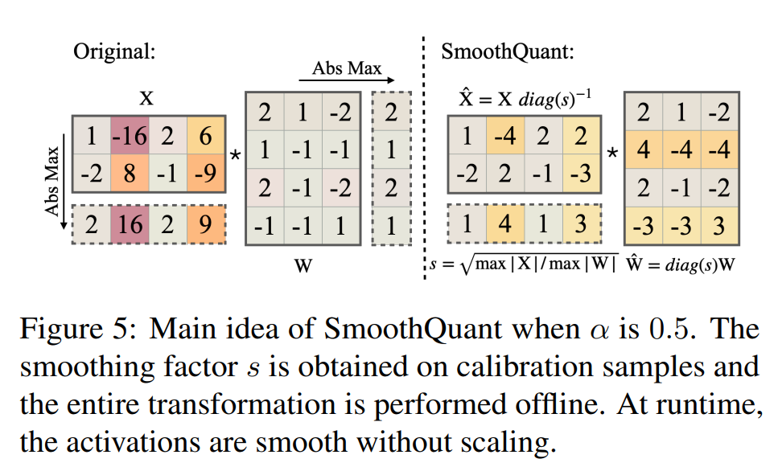

Fig. 5 에서 $\alpha = 0.5$ 일 때 smoothing transformation 을 보여준다. 

Activation outlier 가 더 심한 model (e.g., GLM-130B, $\sim 30\%$ outlier) 에선 $\alpha$ 를 더 크게 (e.g., 0.75) 해서 weight 로 더 많은 난이도를 옮길 수 있다.

#### Applying SmoothQuant to Transformer blocks.

Linear layer 는 LLM 의 대부분 parameter 와 computation 을 차지한다. 기본으로 self-attention 과 feed-forward layer 의 input activation 에 scale smoothing 을 하고 all linear layers 를 W8A8 로 quantize 한다. Attention computation 의 `BMM` operator 도 quantize 한다. 

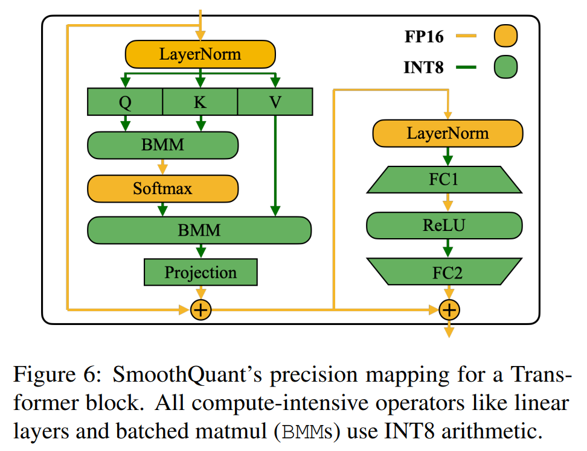

Fig. 6 에서 transformer block 의 quantization flow 를 설계했다. 

Linear layer 와 attention layer 의 `BMM` 같은 compute-heavy operator 의 input 과 weight 를 INT8 로 quantize 하고, ReLU, Softmax, LayerNorm 같은 lightweight element-wise operation 의 activation 은 FP16 으로 유지한다. 이런 설계는 정확도와 inference 효율성을 균형 있게 한다.

# 5 Experiments

## 5.1 Setups

#### Baselines

저자는 INT8 post-training quantization 설정에서 네 가지 baseline 과 비교한다. 즉, model parameter 를 retraining 하지 않는다: W8A8 naive quantization, ZeroQuant, `LLM.int8()`, Outlier Suppression 이다. 

SmoothQuant 는 quantization scheme 과 orthogonal 하니까 점진적으로 공격적이고 efficienct quantization level (O1-O3) 을 제공한다. Baseline 과 SmoothQuant 의 quantization scheme 은 Tab. 2 에 자세히 나온다.

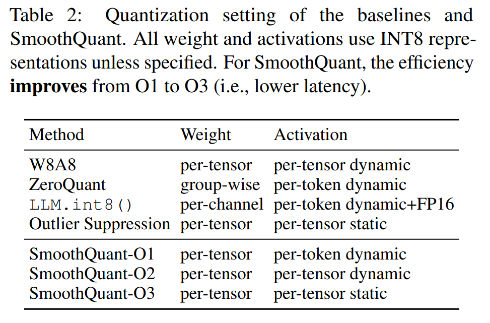

#### Models and datasets.

SmoothQuant 를 평가하려고 세 가지 LLM family 를 선택했다: OPT, BLOOM, GLM-130B 이다. 

- OPT 와 BLOOM model 은 LAMBADA, HellaSwag, PIQA, WinoGrande, OpenBookQA, RTE, COPA (7 zero-shot 평가 task) 와 WikiText (1 language modeling dataset) 으로 평가한다. 
- GLM-130B 은 MMLU, MNLI, QNLI, LAMBADA 로 평가한다. 왜냐면 앞의 일부 benchmark 가 GLM-130B 의 training set 에 포함돼 있기 때문이다. 
- OPT 와 BLOOM model 은 lm-eval-harness 로 평가하고, GLM-130B 은 공식 repo 로 평가한다. 
- 마지막으로 MT-NLG 530B 에 방법론을 확장해서 $>500$B model 을 single node 에서 서비스할 수 있게 한다. 저자는 quantization 전후의 상대적 성능 변화에 초점을 맞춘다.

#### Activation smoothing.

Migration strength $\alpha=0.5$ 는 OPT 와 BLOOM model 에서 일반적인 sweet spot 이고, GLM-130B 에선 $\alpha=0.75$ 이다. GLM-130B 의 activation 은 quantize 하기 더 어렵다. 적당한 $\alpha$ 는 Pile validation set 의 subset 에서 grid search 로 빠르게 찾는다. 

Activation statistics 를 얻으려면 pre-training dataset Pile 에서 512 random sentences 로 smoothing factor 와 static quantization step size 를 한 번 calibrate 한다. 그 후 같은 smoothed, quantized model 을 all downstream tasks 에 적용한다. 이렇게 quantize 된 LLM 의 generality 와 zero-shot 성능을 benchmark 한다.

#### Implementation.

SmoothQuant 는 두 backend 로 구현했다: (1) PyTorch Huggingface 로 개념 증명, (2) FasterTransformer 로 production 환경에서 사용하는 고성능 framework 예시다. 

두 framework 에서 INT8 linear module 과 `BMM` function 을 CUTLASS INT8 `GEMM` kernel 로 구현했다. original FP16 linear module 과 `BMM` function 을 INT8 kernel 로 교체해서 INT8 model 을 만든다.

## 5.2 Accurate Quantization

#### Results of OPT-175B.

SmoothQuant 는 activation quantize 가 더 어려운 very large LLMs 의 quantization 을 처리할 수 있다. OPT-175B 에서 quantization 을 연구했다. Tab. 3 에서 SmoothQuant 는 all quantization schemes 로 모든 평가 dataset 에서 FP16 정확도를 맞춘다. 

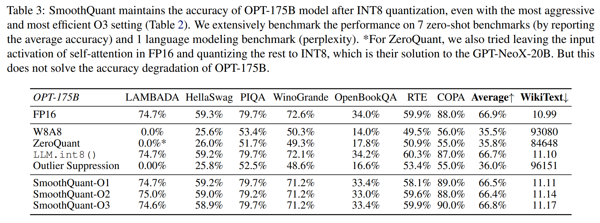

- `LLM.int8()` 도 floating-point 정확도를 맞출 수 있다. 왜냐면 outlier 를 floating-point 값으로 나타내기 때문이다. 하지만 이는 latency overhead 가 크다 (Tab. 11). 
- W8A8, ZeroQuant, Outlier Suppression baseline 은 거의 랜덤 결과를 낸다. 
- LLM 의 activation 을 naive 하게 quantize 하면 성능이 망가진다.

#### Results of different LLMs.

SmoothQuant 는 다양한 LLM 디자인에 적용할 수 있다. Tab. 4 에서 SmoothQuant 가 100B 이상의 모든 공개 LLM 을 quantize 할 수 있음을 보여준다. 

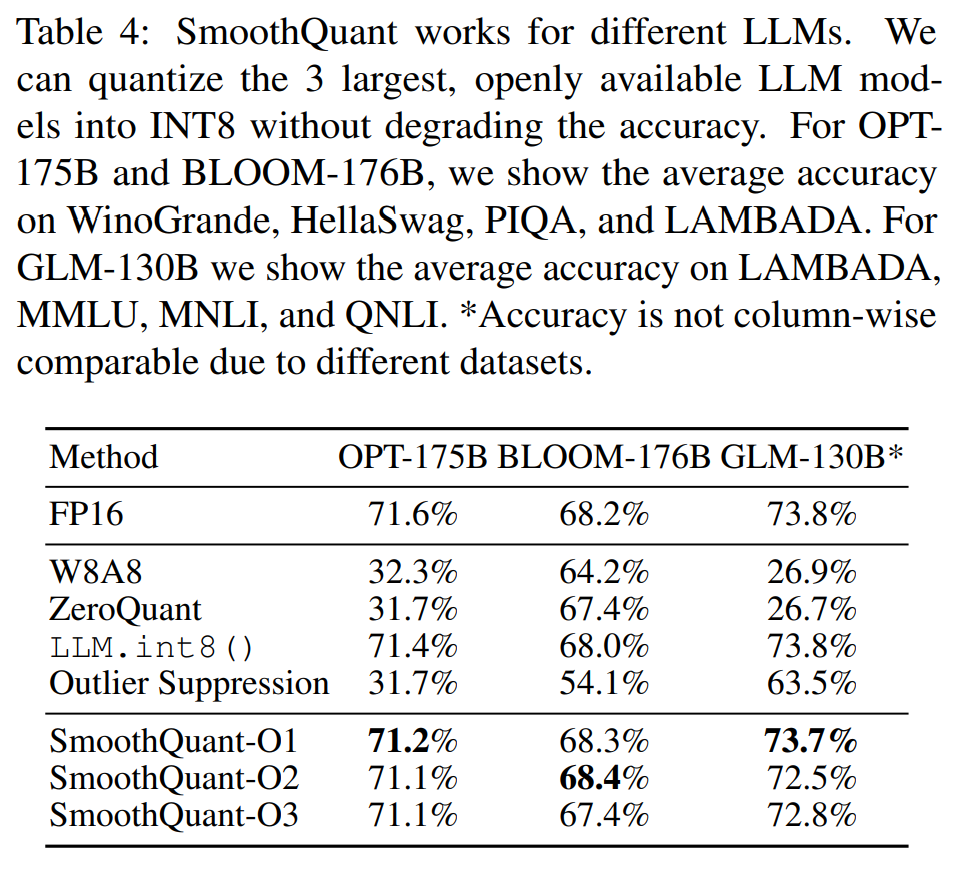

- OPT-175B 에 비해 BLOOM-176B 은 quantize 하기 쉽다. Baseline 중 어느 것도 model 을 완전히 망가뜨리지 않는다. 
- Naive W8A8 per-tensor dynamic quantization 도 정확도를 4% 만 떨어뜨린다. 
- SmoothQuant 의 O1, O2 level 은 floating-point 정확도를 유지하고, O3 level (per-tensor static) 은 평균 정확도를 0.8% 떨어뜨린다. 
  - 이는 statically 수집된 통계와 실제 평가 sample 의 activation 통계 간 차이 때문이라고 본다. 
- 반대로 GLM-130B 은 quantize 하기 더 어렵다. 그럼에도 SmoothQuant-O1 은 FP16 정확도를 맞추고, SmoothQuant-O3 은 정확도를 1% 만 떨어뜨린다. Baseline 보다 훨씬 낫다. 
- GLM-130B 의 static quantization step size 를 calibrate 할 때 상위 2% token 을 clip 한다.

#### Results on LLMs of different sizes.

SmoothQuant 는 100B 이상의 very large LLMs 뿐 아니라 smaller LLM 에도 일관되게 작동한다. 

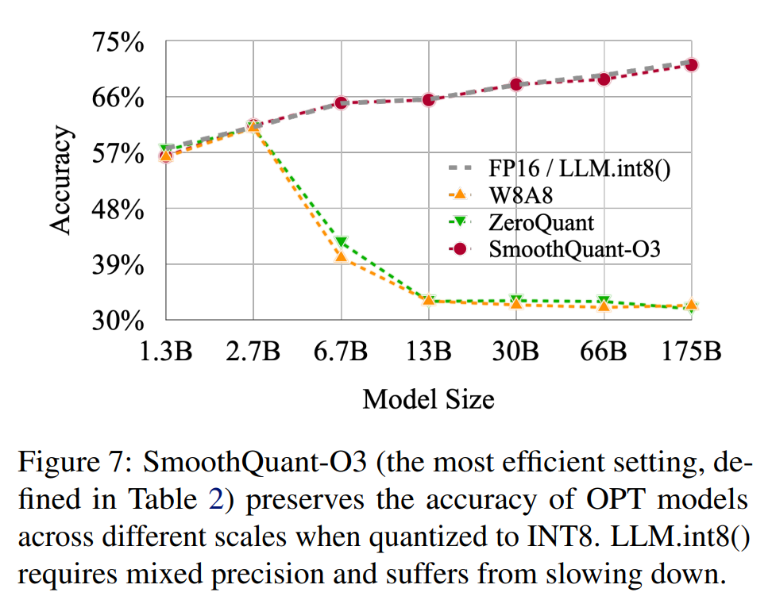

Fig. 7 에서 SmoothQuant 가 모든 OPT model scale 에서 FP16 정확도를 INT8 quantization 으로 맞춘다.

#### Results on Instruction-Tuned LLM.

Tab. 5 에서 SmoothQuant 가 instruction-tuned LLM 에도 작동함을 보여준다.

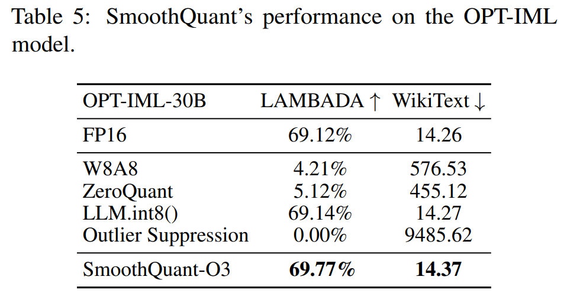

- OPT-IML-30B model 을 WikiText-2 와 LAMBADA dataset 으로 테스트했다. 결과는 SmoothQuant 가 W8A8 quantization 으로 model 정확도를 성공적으로 유지함을 보여준다. 
- 반면 baseline 은 실패한다. SmoothQuant 는 Transformer model 의 quantization 어려움를 균형 있게 하는 범용 방법이다. 
- Instruction-tuned LLM 의 architecture 는 vanilla LLM 과 근본적으로 다르지 않고 pre-training 과정도 비슷해서 SmoothQuant 가 여기에도 적용된다.

#### Results on LLaMA models.

LLaMA model 은 성능이 뛰어난 새로운 공개 language model 이다. 초기 실험에서 LLaMA model 은 OPT 나 BLOOM 같은 model 에 비해 activation outlier 문제가 덜 심각하다. 그럼에도 SmoothQuant 는 LLaMA model 에 잘 작동한다. 

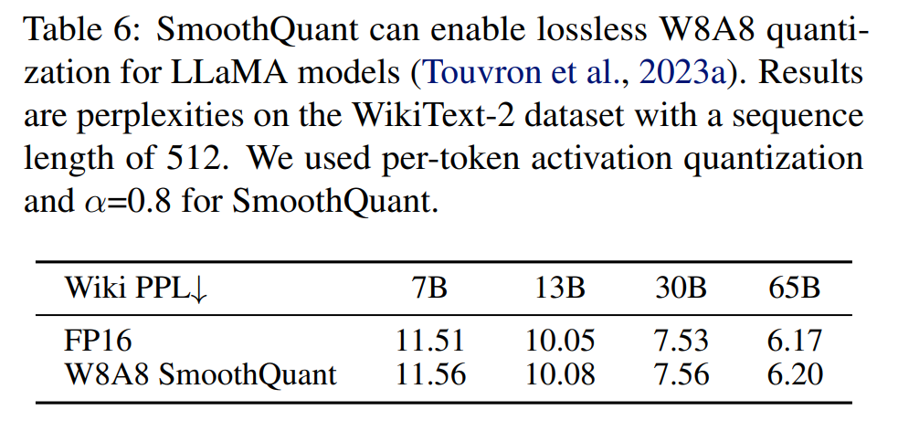

Tab. 6 에서 LLaMA W8A8 quantization 의 초기 결과를 보여준다. SmoothQuant 는 성능 저하 거의 없이 W8A8 quantization 을 가능하게 한다.

#### Results on Llama-2, Falcon, Mistral, and Mixtral models.

저자는 SmoothQuant 를 Llama-2, Falcon, Mistral, Mixtral 같은 다양한 architecture 의 최근 LLM 에 적용했다. 특히 Mixtral 은 Mixture of Experts (MoE) model 이다. 

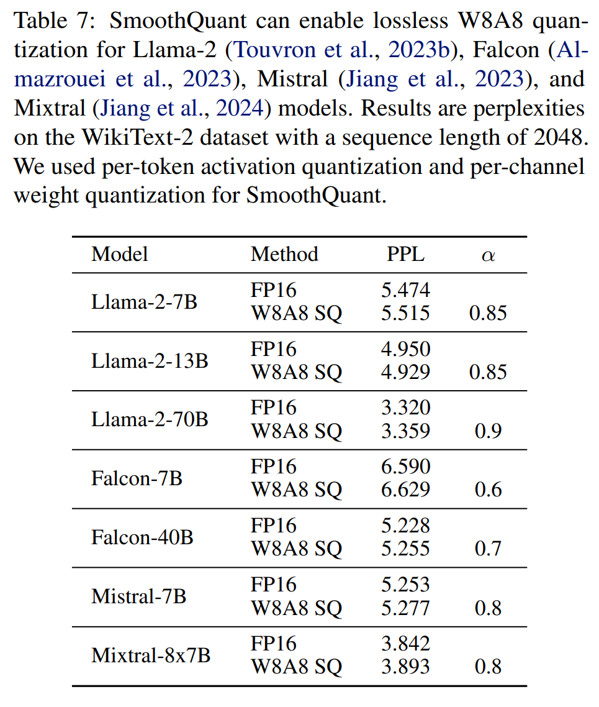

Tab. 7 의 결과는 SmoothQuant 가 이런 다양한 architecture 에서 W8A8 quantization 을 성능 손실 거의 없이 가능하게 함을 보여준다.

## 5.3 Speedup and Memory Saving

이 섹션에서 SmoothQuant-O3 를 PyTorch 와 FasterTransformer 에 통합한 speedup 과 memory 절감을 측정한다.

#### Context-stage: PyTorch Implementation.

4 sentences batch 의 all hidden states 를 한 번에 생성하는 end-to-end latency (context stage latency) 를 측정한다. 이 과정에서 peak GPU memory 사용량을 기록한다. SmoothQuant 는 `LLM.int8()` 과만 비교한다. 이는 all scales 에서 LLM 정확도를 유지하는 유일한 기존 quantization 방법이다. 

Huggingface 에서 model parallelism 지원이 없어서 PyTorch 구현은 single GPU 에서만 측정한다. 그래서 OPT-6.7B, OPT-13B, OPT-30B 로 평가한다. FasterTransformer 에선 SmoothQuant 가 Tensor Parallelism 알고리즘과 잘 작동해서 OPT-13B, OPT-30B, OPT-66B, OPT-175B 를 single 및 multi GPU benchmark 로 테스트한다. 모든 실험은 NVIDIA A100 80GB GPU 서버에서 한다.

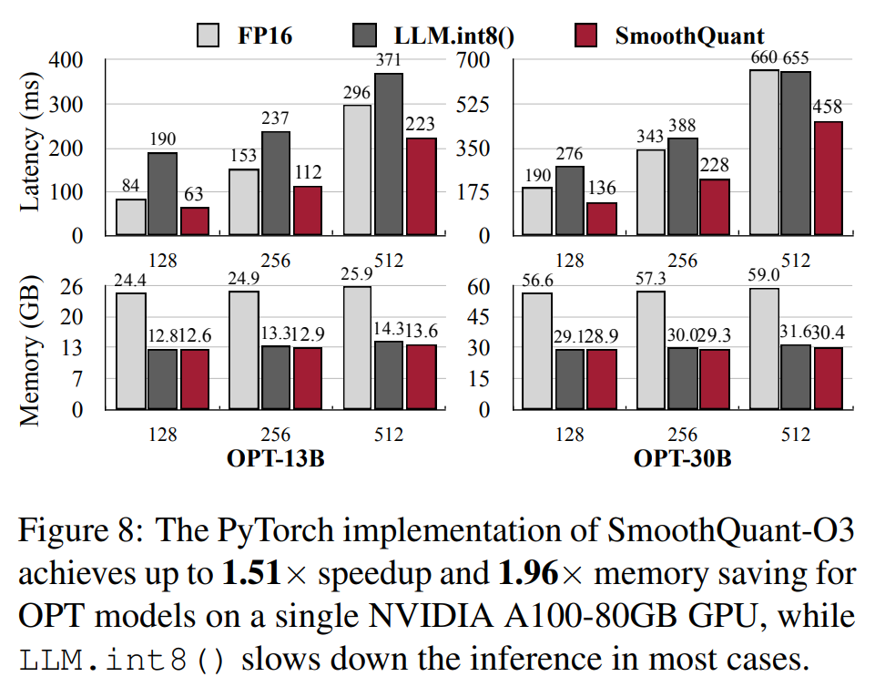

Fig. 8 에서 PyTorch 구현 기반 inference latency 와 peak memory 사용량을 보여준다. 

- SmoothQuant 는 FP16 baseline 보다 항상 빠르다. Sequence length 256 일 때 OPT-30B 에서 $1.51 \times$ speedup 을 얻는다. 
- Model 이 클수록 가속이 더 두드러진다. 반면 `LLM.int8()` 은 mixed-precision activation representation 의 large overhead 때문에 거의 항상 FP16 baseline 보다 느리다. 
- Memory 면에서 SmoothQuant 와 `LLM.int8()` 모두 FP16 model 의 memory 사용량을 거의 절반으로 줄인다. 
- SmoothQuant 가 완전히 INT8 `GEMM` 을 사용해서 약간 더 memory 를 절약한다.

#### Context-stage: FasterTransformer Implementation.

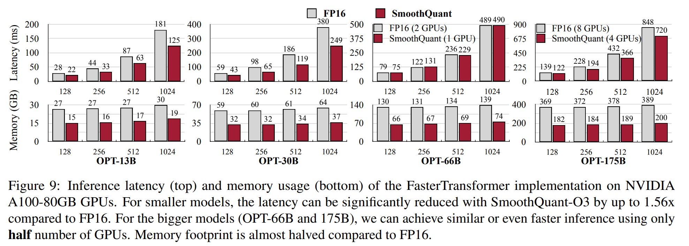

- Fig. 9 (top) 에서 FasterTransformer 의 FP16 구현 대비 SmoothQuant-O3 가 single GPU 에서 OPT-13B, OPT-30B 의 실행 latency 를 최대 $1.56 \times$ 줄인다. 
- FasterTransformer 가 PyTorch 구현보다 OPT-30B 에서 $3 \times$ 이상 빠른데도 이는 도전적이다. 놀랍게도 larger model (OPT-66B, OPT-175B) 에서 SmoothQuant 는 절반 GPU (OPT-66B 는 2개 대신 1개, OPT-175B 는 8개 대신 4개) 로 비슷하거나 더 빠른 inference 를 한다. 이는 LLM serving 비용을 크게 줄일 수 있다. 
- Fig. 9 (bottom) 에서 SmoothQuant-O3 의 FasterTransformer 에서 memory 사용량이 거의 $2 \times$ 줄어든다.

#### Decoding-stage.

Tab. 8 에서 SmoothQuant 가 LLM 의 autoregressive decoding stage 를 크게 가속함을 보여준다.

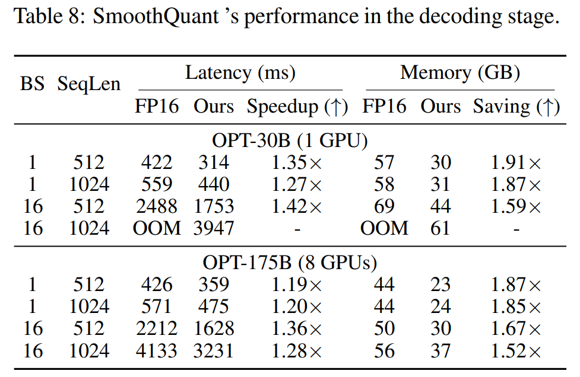

- SmoothQuant 는 FP16 대비 per-token decoding latency 를 지속적으로 줄인다 (최대 $1.42 \times$ speedup). 
- 또 SmoothQuant 는 LLM inference 의 memory footprint 을 절반으로 해서 배포 비용을 크게 줄인다.

## 5.4 Scaling Up: 530B Model Within a Single Node

SmoothQuant 를 500B 이상 model 로 확장해서 MT-NLG 530B 의 효율적이고 정확한 W8A8 quantization 을 가능하게 한다.

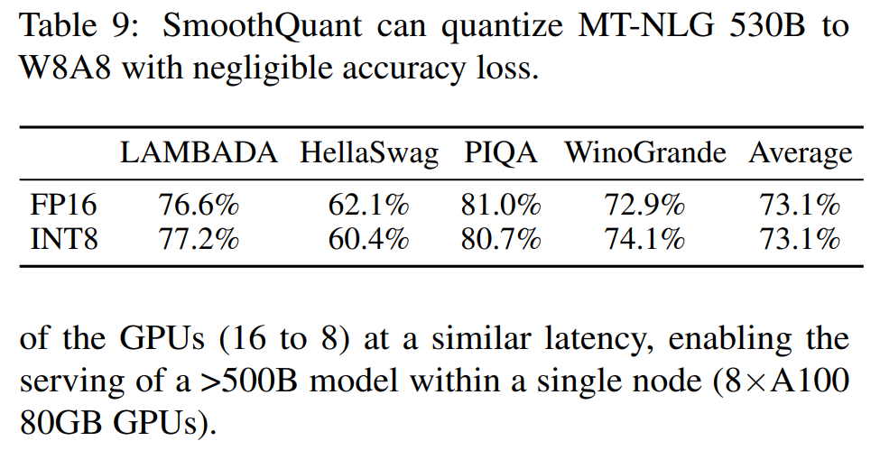

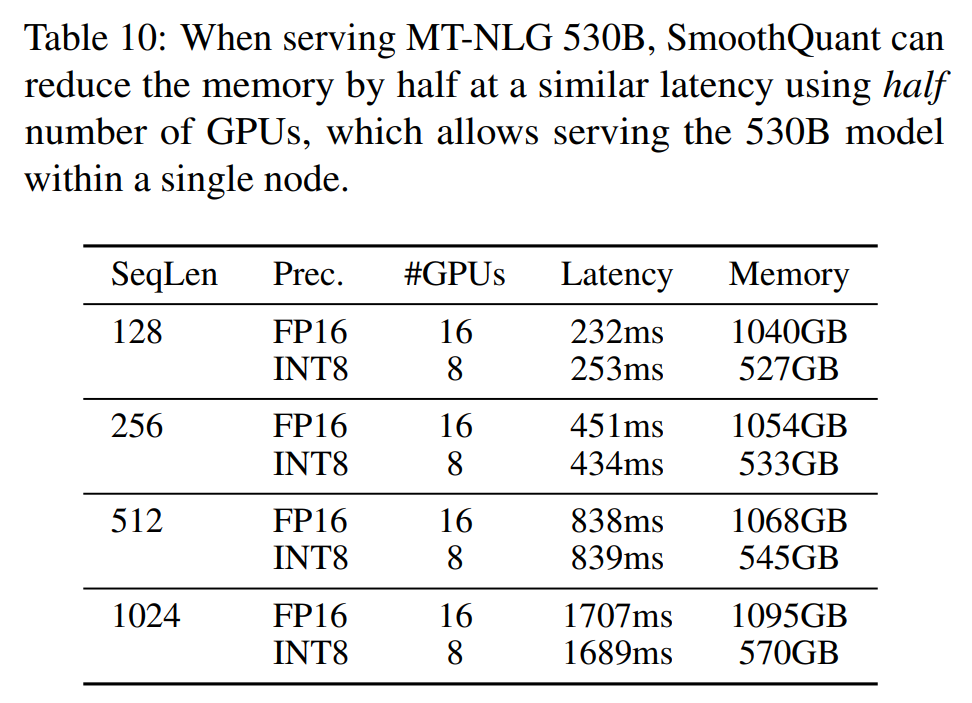

- Tab. 9 와 10 에서 SmoothQuant 가 530B model 의 W8A8 quantization 을 정확도 손실 거의 없이 가능하게 한다. 
- 줄어든 model 크기는 절반 GPU (16 to 8) 로 비슷한 latency 에 서비스할 수 있게 해서 $>500$B model 을 single node ($8 \times$ A100 80GB GPU) 에서 서비스할 수 있다.

## 5.5 Ablation Study

#### Quantization schemes.

Tab. 11 에서 PyTorch 구현 기반으로 quantization scheme 별 inference latency 를 보여준다.

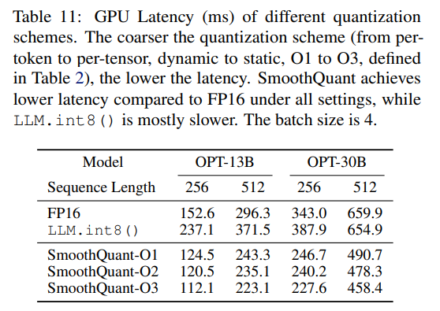

- Quantization granularity 가 coarse 할수록 (O1 에서 O3 로, per-token 에서 per-tensor 로, dynamic 에서 static 으로) latency 가 낮아진다. 
- Static quantization 은 runtime 에서 quantization step size 계산이 필요 없어서 dynamic quantization 보다 inference 를 크게 가속한다. 
- SmoothQuant 는 모든 설정에서 FP16 baseline 보다 빠르고, `LLM.int8()` 은 보통 느리다. 정확도가 허용한다면 coarse scheme 을 추천한다.

#### Migration strength.

Weight 와 activation 의 quantization 어려움를 균형 맞추려면 적당한 migration strength $\alpha$ (Eq. 4) 를 찾아야 한다. Fig. 10 에서 OPT-175B 에서 LAMBADA 로 다른 $\alpha$ 의 효과를 ablation 했다. 

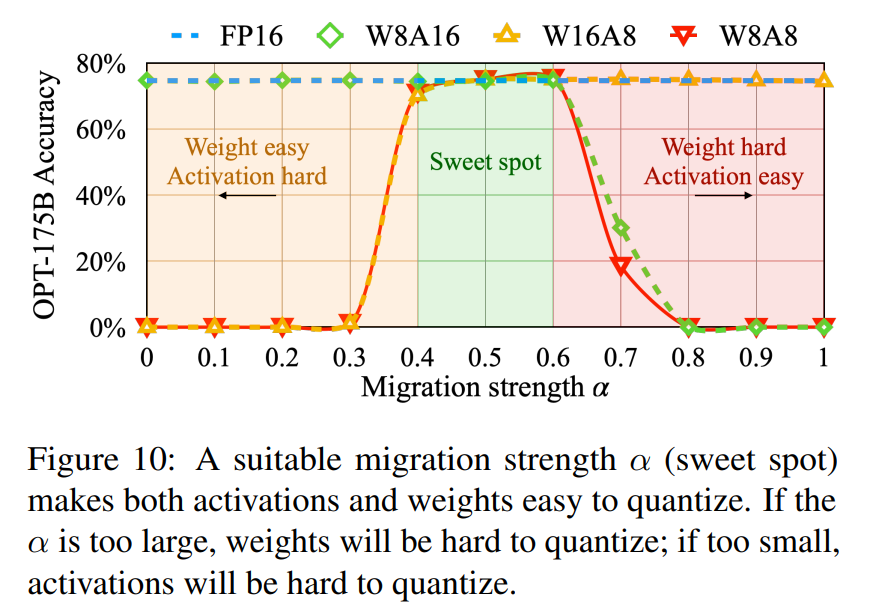

- $\alpha$ 가 너무 작으면 (<0.4) activation 이 quantize 하기 어렵고, 너무 크면 (>0.6) weight 가 quantize 하기 어렵다. 
- Sweet spot 지역 (0.4-0.6) 에서 $\alpha$ 를 선택해야 weight 와 activation 모두 quantization error 가 작고 model 성능을 유지한다.

### 6 Related Work

#### Large language models (LLMs).

Pre-trained language model 은 scale-up 으로 다양한 benchmark 에서 놀라운 성능을 달성했다. GPT-3 은 100B 이상의 첫 LLM 으로 few-shot/zero-shot learning 에서 인상적인 결과를 냈다. 

이후 연구들은 500B 이상으로 scaling frontier 를 밀어붙였다. 하지만 language model 이 커질수록 inference serving 이 비싸고 도전적이 된다. 이 작업에서 저자는 제안된 방법이 OPT-175B, BLOOM-176B, GLM-130B, MT-NLG 530B 같은 공개된 가장 큰 LLM 을 quantize 해서 memory 비용을 줄이고 inference 를 가속함을 보여준다.

#### Model quantization.

Quantization 은 model 크기를 줄이고 inference 를 가속하는 효과적인 방법이다. CNN 과 transformer 에 효과적임이 입증됐다. 

Weight equalization 과 channel splitting 은 weight 의 outlier 를 억제해서 quantization error 를 줄인다. 하지만 이 기술들은 LLM 의 주요 quantization bottleneck 인 activation outlier 를 해결하지 못한다.

#### Quantization of LLMs.

GPTQ 는 weight 만 quantize 하고 activation 은 안 한다. ZeroQuant 와 nuQmm 은 per-token 과 group-wise quantization scheme 을 LLM 에 사용한다. 이는 customized CUDA kernel 이 필요하다. 이들의 가장 큰 평가 model 은 각각 20B, 2.7B 이고 OPT-175B 같은 LLM 의 성능을 유지하지 못한다. 

- `LLM.int8()` 은 mixed INT8/FP16 decomposition 으로 activation outlier 를 해결한다. 하지만 구현이 latency overhead 를 만들어 FP16 inference 보다 느릴 수 있다. 
- Outlier Suppression 은 non-scaling LayerNorm 과 token-wise clipping 으로 activation outlier 를 다룬다. 하지만 BERT, BART 같은 smaller language model 에서만 성공하고 LLM 에선 정확도를 유지하지 못한다 (Tab. 4). 
- 저자의 알고리즘은 최대 176B (우리가 찾은 가장 큰 open-source LLM) 의 LLM 성능을 효율적인 per-tensor, static quantization scheme 으로 유지한다. Retraining 없이 off-the-shelf INT8 `GEMM` 을 사용해서 높은 hardware 효율성을 달성한다.

### 7 Conclusion

저자는 **SmoothQuant** 라는 정확하고 효율적인 post-training quantization 방법을 제안한다. 

이는 최대 530B parameter 의 LLM 에서 lossless 8-bit weight 와 activation quantization 을 가능하게 한다. 

SmoothQuant 는 LLM 의 all `GEMM` 에 weight 와 activation quantization 을 가능하게 해서 mixed-precision activation quantization baseline 대비 inference latency 와 memory 사용량을 크게 줄인다. 

SmoothQuant 를 PyTorch 와 FasterTransformer 에 통합해서 최대 $1.56 \times$ inference 가속과 memory footprint 절반을 달성했다. SmoothQuant 는 serving 비용을 줄이는 turn-key 솔루션으로 LLM 응용을 대중화한다.