논문 및 이미지 출처 : <https://arxiv.org/pdf/2307.13304>

# Abstract

이 연구는 large language model (LLM) 에서 post-training parameter quantization 을 다룬다. 저자는 quantization with incoherence processing (**QuIP**) 라는 새로운 방법을 소개하는데, 이는 weight 와 Hessian matrix 가 incoherent 한 상태에서 quantization 이 더 효과적이라는 통찰을 기반으로 한다. 즉, weight size 가 고르고, 정확하게 rounding 해야 하는 방향이 coordinate axes 와 정렬되지 않은 상태를 말한다. 

QuIP 은 두 단계로 이루어진다: 

1. quadratic proxy objective 를 최소화하는 adaptive rounding procedure, 
2. weight 와 Hessian matrix 의 incoherence 를 보장하기 위해 random orthogonal matrix 로 곱하는 efficient pre- 와 post-processing. 

저자는 QuIP 을 LLM-scale quantization algorithm 에 대한 최초의 theoretical analysis 로 보완하고, 이 이론이 기존 방법인 OPTQ 에도 적용된다는 걸 보여준다. 실험적으로, incoherence preprocessing 이 여러 기존 quantization algorithm 을 개선하고, weight 당 2 bit 만으로도 유효한 결과를 내는 최초의 LLM quantization 방법임을 확인했다.

# 1 Introduction

Large language model (LLM) 은 text generation, few-shot learning, reasoning, protein sequence modeling 같은 여러 작업에서 발전을 이끌었다. 이런 model 의 엄청난 크기—종종 100B parameter 이상 에 달한다—는 복잡한 배포 방법을 요구하고, efficient inference algorithm 연구를 촉진한다.

이 연구는 LLM parameter 의 post-training quantization 을 통해 runtime efficiency 를 높이는 방법을 다룬다. 저자의 핵심 통찰은 weight 와 proxy Hessian matrix 가 incoherent 할 때 quantization 이 가장 효과적이라는 거다. 즉, weight 자체가 크기 면에서 고르고, good rounding accuracy 가 필요한 방향이 어떤 coordinate 에서도 너무 크지 않은 상태를 말한다. 

직관적으로, incoherence 는 outlier reduction 의 원칙적인 형태로 볼 수 있고, 이는 weight 를 compressed values 의 finite set 으로 adaptive 하게 rounding 하기 쉽게 만든다. 저자는 이 직관을 활용해 LLM-sized model 에 맞는 이론적으로 탄탄한 2-bit quantization algorithm 을 개발했다. 

구체적으로, 저자는 위 통찰을 기반으로 한 새로운 방법인 **quantization with incoherence processing** (**QuIP**) 을 소개한다. 

QuIP 은 두 단계로 구성된다:  

1. adaptive rounding 절차로, original weight $W$ 와 quantized weight $\hat{W}$ 간의 error 에 대한 quadratic proxy objective $\ell(\hat{W}) = \operatorname{tr}\left( (\hat{W} - W) H (\hat{W} - W)^T \right)$ 를 Hessian $H$ 의 추정치를 사용해 최소화한다.  
2. random orthogonal matrix 로 곱해 weight 와 Hessian matrix 의 incoherence 를 보장하는 efficient pre- 와 post-processing.  

저자는 이 방법을 LLM-sized model 에 맞는 quantization algorithm 에 대한 최초의 theoretical analysis 로 보강한다. 

- 이 분석은 incoherence 의 역할을 분석하고, 저자의 quantization 절차가 일반적인 rounding 방법 클래스 내에서 최적임을 보여준다. 
- 흥미롭게도, incoherence processing 없이 QuIP 을 적용하면 기존 알고리즘 OPTQ 의 더 효율적인 구현이 된다. 따라서 이 논문은 OPTQ 에 대한 최초의 theoretical analysis 도 제공한다.  
- 실험적으로, incoherence processing 이 large model 의 quantization 을 크게 개선한다는 걸 발견했다. 특히 higher compression rate 에서 두드러지고, weight 당 2 bit 만으로 유효한 결과를 내는 최초의 LLM quantization 방법이 됐다. 
- large LLM sizes (> 2B parameter) 에서 2-bit 와 4-bit compression 간의 차이가 작고, model size 가 커질수록 이 차이가 더 줄어드는 걸 봤는데, 이는 LLM 에서 정확한 2-bit inference 가 가능함을 시사한다.  

#### Contributions.

요약하면, 이 논문은 다음을 기여한다:  

- QuIP 제안: model parameter 가 ideally incoherent 해야 한다는 통찰 기반의 quantization 방법.  
- QuIP 과 OPTQ 을 포함하는 adaptive rounding 방법의 넓은 클래스에 대한 theoretical analysis 제공.  
- QuIP 이 2-bit LLM compression 을 처음으로 실용적으로 만든다는 실험적 증명.  

# 2 Related Work

#### Adaptive rounding.

- Nagel et al 은 "adaptive rounding" proxy objective (Eq. (1)) 를 원칙적으로 동기부여한 최초의 연구다. 이 proxy objective 를 최적화해 quantize 하는 방법은 많다. 많은 방법이 추가 retraining 을 요구하는데, 이는 비용이 크다. 또 현재 가장 큰 open LLM (OPT, BLOOM) 에서 평가되지 않았다. 
- Lybrand and Saab 은 저자와 비슷한 per-neuron quantization 절차를 제안했지만, error correction 의 임의 linear function 은 고려하지 않았다. 그들의 연구는 proxy objective 를 first layer 에서만 제한한다.
  
#### Post training quantization in large models.

OPT 나 BLOOM 같은 LLM 에서 PTQ 연구가 늘고 있다. 이런 model size 때문에 기존 방법 적용이 어렵다. 대부분 방법은 weight 나 activation 의 범위를 줄여 quantization 을 쉽게 하지만, 여전히 nearest rounding 을 사용한다.

- SmoothQuant 은 activation 과 weight 간 스케일을 조정해 activation 에서 outlier 를 제거하고 quantization 을 쉽게 만든다.  
- ZeroQuant 은 per-layer knowledge distillation 방법을 제안한다.  
- `LLM.int8()` 은 matrix multiplication 을 8 bit 위주와 소수의 16 bit 연산으로 분해한다.  
- LUT-GEMM 은 quantized matrix multiplication 을 가속화하는 kernel 을 설계한다.  
- RPTQ 은 activation 을 재정렬하고 그룹으로 quantize 해서 channel 간 범위 차이의 영향을 줄인다.  

#### OPTQ (Formerly known as GPTQ).

OPTQ 은 OBQ 기반으로, 가장 큰 OPT 와 BLOOM model 에서 작동하는 새로운 rounding 방법을 제안한다. 이 방법은 weight column 을 고정된 순서로 반복 처리한다:  

1. nearest rounding 으로 quantize 하고 error 계산.  
2. 남은 weight 를 scaled error 로 업데이트.  
3. 반복.  

#### Other quantization methods.

Nagel et al 의 proxy objective 기반으로 rounding 하지 않거나, 가장 큰 language model 용으로 설계되지 않은 다른 quantization 절차도 있다.

# 3 Quantization With Incoherence Processing: Adaptive Rounding Step

이 섹션에선 quantization with incoherence processing (QuIP) 을 소개한다. 이는 새로운 방법으로, (1) adaptive rounding step, (2) weight 와 Hessian incoherence 를 보장하는 efficient pre- 와 post-processing 으로 구성된다. 이 섹션에선 단계 (1) 을 정의하고 분석하고, 다음 섹션에선 단계 (2) 를 다룬다.  

SOTA post-training quantization 방법에 따라, 저자는 per-layer weight 를 Nagel et al 의 "adaptive rounding" proxy objective 를 최소화하며 rounding 한다:

$$
\begin{equation}
    \ell(\hat{W}) = \mathbf{E}_x\left[ \| (\hat{W} - W)x \|^2 \right] = \operatorname{tr}\left\{ (\hat{W} - W) H (\hat{W} - W)^T \right\}.
\end{equation}
$$

여기서 $W \in \mathbb{R}^{m \times n}$ 은 주어진 linear layer 의 original weight matrix, $\hat{W} \in \mathbb{R}^{m \times n}$ 은 quantized weight, $x \in \mathbb{R}^n$ 은 calibration set 에서 uniform 하게 뽑힌 input vector, $H$ 는 이 vector 들의 second moment matrix 로 proxy Hessian 으로 해석된다. 결정적으로, 이 공식은 quantization 을 neuron 간 병렬로 실행할 수 있게 해서 large language model 에서도 처리 가능하다. 단순화를 위해, 이 섹션에선 integer 로 rounding 하는 데 초점을 맞추고, 이후 섹션에서 finite grid 로 확장한다.

## 3.1 LDLQ: An Optimal Adaptive Rounding Method

저자의 전략은 objective (1) 을 최적화하는 adaptive rounding 방법의 family 를 정의하고, 그 클래스 내에서 optimal LDLQ 를 정의하는 거다. 저자가 정의한 방법은 $k = 1, 2, \ldots, n$ 에 대해 다음 업데이트를 반복한다:

$$
\hat{W}_k = \mathcal{Q}\left( W_k + ( W_{1:(k-1)} - \hat{W}_{1:(k-1)} ) a_k \right),
$$

- 여기서 $W_k$ 는 $k$-th column, 
- $W_{1:(k-1)}$ 는 first $k-1$ 개 columns, 
- subroutine $\mathcal{Q}$ 는 nearest rounding 또는 $\mathbf{E}[\mathcal{Q}(z)] = z$ 를 만족하는 standard unbiased rounding to integer, 
- $a_k \in \mathbb{R}^{k-1}$ 은 vector sequence.

이 방식은 column 을 하나씩 rounding 하고, 각 단계에서 지금까지의 rounding residual 의 linear function 인 "correction" term 을 더한다. final $\hat{W}$ 는 다음 matrix 방정식을 만족한다:

$$
\begin{equation}
    \hat{W} = \mathcal{Q}\left( W + ( W - \hat{W} ) U \right),
\end{equation}
$$

- 여기서 $U$ 는 $a_k$ vector 로 된 strictly upper-triangular matrix, 
- $\mathcal{Q}$ 는 element-wise 로 작동.
- $U$ 가 upper-triangular 이므로, $\hat{W}_k$ 는 $\hat{W}_{1:(k-1)}$ 에만 의존한다. 

$\mathcal{Q}$ 의 quantization error 를 $\eta = \mathcal{Q}\left( W + ( W - \hat{W} ) U \right) - \left( W + ( W - \hat{W} ) U \right)$ 로 정의하면, $\hat{W} - W = \eta (U + I)^{-1}$ 이고, objective (1) 은 이렇게 재작성된다:

$$
\begin{equation}
    \operatorname{tr}\left( (\hat{W} - W) H (\hat{W} - W)^T \right) = \operatorname{tr}\left( \eta (U + I)^{-1} H (U + I)^{-T} \eta^T \right).
\end{equation}
$$

#### The LDLQ Method

$U$ 를 어떻게 지정해야 할까? 즉, (2) 에서 이전 column 의 quantization error 에서 오는 linear feedback 을 어떻게 해야 할까? Eq. (3) 이 답을 준다. $H$ 의 LDL decomposition 이 다음이 되도록 $U \leftarrow \hat{U}$ 를 선택하면,

$$
\begin{equation}
    H = (\grave{U} + I) D (\grave{U} + I)^T,
\end{equation}
$$

- 여기서 $D$ 는 (non-negative) diagonal matrix, 
- $\grave{U}$ 는 upper unit triangular 이며, 

Eq. (3) 의 $(U + I)$ term 이 상쇄된다. 저자는 Eq. (2) 의 rounding procedure 에 $U \leftarrow \grave{U}$ 를 Eq. (4) 의 LDL assignment 로 적용한 걸 **LDLQ** 라고 부른다. 이제 LDL assignment 의 $U$ 가 실제로 최적임을 볼 거다.

## 3.2 Deriving the Optimality of the LDLQ Adaptive Rounding Procedure

최적성을 논하기 위해, proxy loss 에 대한 worst-case 와 average-case weight 를 고려한다. $\mathcal{A}$ 를 rounding 방법이라 하고, $\mathcal{A}(W, H)$ 를 결과 quantized weight 라 하자. input weight 에 대한 _worst-case_ ($\mathcal{L}_{\text {worst}}$) 와 _average_ ($\mathcal{L}_{\text {avg}}$) proxy loss 를 이렇게 정의한다:

$$
\begin{equation}
    \mathcal{L}_{\text {worst }}(\mathcal{A}, H) = \sup_{W \in \mathbb{R}^{m \times n}} \mathbf{E}\left[ \operatorname{tr}\left( (\mathcal{A}(W, H) - W) H (\mathcal{A}(W, H) - W)^T \right) \right],
\end{equation}
$$

$$
\begin{equation}
    \mathcal{L}_{\text {avg }}(\mathcal{A}, H) = \mathbf{E}_{W \sim \operatorname{Unif}[0,1]^{m \times n}}\left[ \operatorname{tr}\left( (\mathcal{A}(W, H) - W) H (\mathcal{A}(W, H) - W)^T \right) \right].
\end{equation}
$$

#### Theorem 1.

LDLQ 는 linear feedback $U$ 를 $H$ 의 함수로 지정하는 (i.e., $W$ 에 의존하지 않는) rounding 방법 중 worst-case 와 average-case 에서 최적이다. integer 로 rounding 할 때, Eq. (2) 로 묘사된 클래스 내 모든 rounding 방법 $\mathcal{A}$ 에 대해, 모든 positive semi-definite $H$ 에 대해, $\mathcal{Q}$ 가 nearest 또는 stochastic rounding 일 때:

$$
\frac{m}{4} \operatorname{tr}(D) = \mathcal{L}_{\text {worst }}(\mathrm{LDLQ}, H) \leq \mathcal{L}_{\text {worst }}(\mathcal{A}, H) \text{ and } \frac{m}{c} \operatorname{tr}(D) = \mathcal{L}_{\text {avg }}(\mathrm{LDLQ}, H) \leq \mathcal{L}_{\text {avg }}(\mathcal{A}, H)
$$

여기서 $D$ 는 $H$ 의 LDL decomposition 에서 온 matrix, $c = 12$ (nearest), $c = 6$ (stochastic).  

#### Remarks.

quantize 되는 row 수는 $m$ 이고, 각 quantization 방법은 각 row 의 $n$ 개 entry 에 걸쳐 작동한다. Eq. (2) 로 묘사된 모든 rounding 방법과 모든 positive semi-definite $H$ 에 대해, $\mathcal{Q}$ 가 nearest rounding 일 때 stochastic rounding 과 같은 worst-case proxy loss 를 달성하지만, average proxy loss 는 더 낫다.

저자의 framework 내에서 generic algorithm $\mathcal{A}$ 를 넘어, 저자는 흔히 사용되는 baseline 인 nearest 와 stochastic rounding 을 고려한다. 이 방법들은 저자의 framework 내에서 적절한 $\mathcal{Q}$ subroutine 을 선택하고, linear feedback 의 모든 entry 를 0 으로 설정해 나타낸다.

이 baseline 방법들의 경우, LDLQ 와의 optimality gap 은 $\operatorname{tr}(D)$ 와 $\operatorname{tr}(H)$ 에 의해 결정된다. diagonal 이 아닌 어떤 $\tilde{H} \succeq 0$ 에 대해, LDLQ 는 $\operatorname{tr}(D) < \operatorname{tr}(\tilde{H})$ 때문에 worst-case 와 average-case proxy loss 에서 엄격히 더 낮은 값을 달성한다. 

$\mathcal{B} = \{\text{Near, Stoch}\}$ 라 하자. 그러면 $\mathcal{L}_{\text{worst}}(\text{LDLQ}, \tilde{H}) < \mathcal{L}_{\text{worst}}(\text{Stoch}, \tilde{H})$ 이고, $\mathcal{L}_{\text{avg}}(\text{LDLQ}, \tilde{H}) < \mathcal{L}_{\text{avg}}(\mathcal{B}, \tilde{H})$ 가 된다. OPT model 125m 에서 2.7b 까지, $\operatorname{tr}(D) / \operatorname{tr}(H) \leq 0.65$ 로, 이 gap 이 작지 않다는 걸 실험적으로 확인했다.

## 3.3 Incoherence: Optimality with a Spectral Bound

Theorem 1 은 proxy loss 에 대한 정확한 표현을 주지만, $\operatorname{tr}(D)$ 는 이해하기 어렵다. Fig. 1 에서 저자는 $H$ 가 대략 low-rank 라는 걸 실험적으로 관찰했다. 

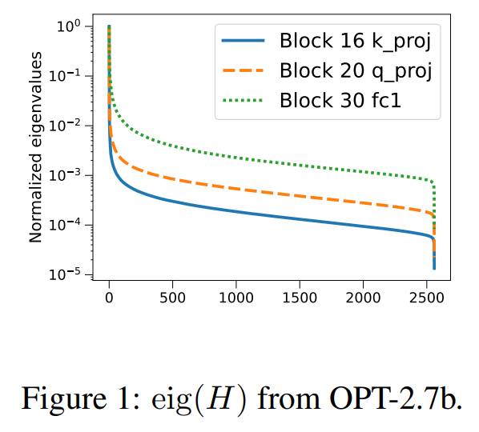

- OPT-2.7b 에서 무작위로 선택된 여러 $H$ 의 spectrum 을 시각화했더니, spectrum 이 빠르게 감소한다. 
- 실제로 OPT-125m 에서 2.7b model 의 all layers 에서, $\hat{H}$ matrix 의 대부분은 최대 eigenvalue 의 1% 이상인 eigenvalue 가 1/4 미만이다. 

$H$ 의 low-rank 관찰을 감안하면, LDLQ 의 동작과 $\operatorname{tr}(D)$ 를 $H$ 의 spectrum 으로 제한할 수 있을까?

저자는 incoherence assumption 의 변형을 기반으로 이걸 다룬다.

#### Definition 1.

symmetric Hessian matrix $H \in \mathbb{R}^{n \times n}$ 가 $\mu$-incoherent 하다고 하면, eigendecomposition $H = Q \Lambda Q^T$ 에서 모든 $i$ 와 $j$ 에 대해 $\left| Q_{ij} \right| = \left| e_i^T Q e_j \right| \leq \mu / \sqrt{n}$ 를 만족한다. 확장해서, weight matrix $W \in \mathbb{R}^{m \times n}$ 가 $\mu$-incoherent 하다고 하면 모든 $i$ 와 $j$ 에 대해 $\left| W_{ij} \right| = \left| e_i^T W e_j \right| \leq \mu \| W \|_F / \sqrt{mn}$ 를 만족한다.

---

$n \times n$ matrix 의 "대부분"은 $\mu = \mathcal{O}(\sqrt{\log n}) = \tilde{\mathcal{O}}(1)$ 로 incoherent 하다. 왜냐면 random orthogonal matrix 의 entry 는 제곱 크기가 평균 $1/n$ 주위로 집중하기 때문이다. $W$ 의 incoherence 는 outlier reduction 의 형태로 볼 수 있다: entry 의 크기 상한이 작으면 low-precision 숫자의 유한 범위에 맞추기 위해 스케일을 많이 조정할 필요가 없다. 

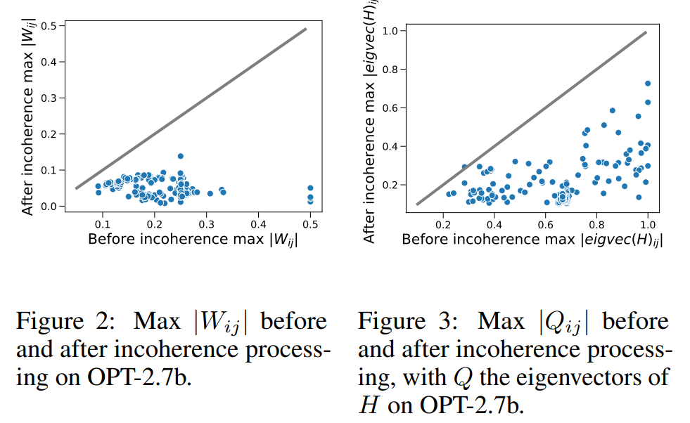

Fig. 2 와 Fig. 3 은 OPT-2.7b 의 all layers 에서 incoherence processing 전후의 max absolute weight 와 Hessian eigenvector entry 를 그린 거다. 

- slope=1 인 line 을 참조로 그렸는데, incoherence processing 후 $W$ 와 $H$ 가 더 incoherent 해진 걸 볼 수 있다. 
- $H$ 를 incoherent 하게 만드는 건 덜 직관적이지만, 다음 lemma 로 그 유용성을 동기부여한다.

#### Lemma 2.

$H \in \mathbb{R}^{n \times n}$ 가 $\mu$-incoherent positive semi-definite symmetric matrix 이고, LDL Cholesky decomposition 이 $H = (\grave{U} + I) D (\grave{U} + I)^T$ 라 하자. 여기서 $\grave{U}$ 는 strictly upper triangular matrix, $D$ 는 (non-negative) diagonal matrix 다. 그러면:

$$
\operatorname{tr}(D) \leq \frac{\mu^2}{n} \operatorname{tr}\left( H^{1/2} \right)^2.
$$

---

저자가 아는 한, incoherence 를 사용해 $\operatorname{tr}(D)$ 를 $H$ 의 spectrum 에만 의존하는 bound 로 얻은 새로운 결과다. 이 결과를 해석하기 위해, plain nearest 와 stochastic rounding 의 explicit proxy loss 를 유도해서 Lemma 2 로 LDLQ 가 얻는 것과 비교한다.

#### Lemma 3.

$H$ 가 symmetric positive definite 라고 하자. worst-case 에서 stochastic rounding 은 $\mathcal{L}_{\text{worst}}(\text{Stoch}, H) = (m/4) \operatorname{tr}(H)$ 를 달성한다. average-case 에서 nearest 와 stochastic rounding 은 $\mathcal{L}_{\text{avg}}(\{\text{Near, Stoch}\}, H) = (m/c) \operatorname{tr}(H)$ 를 달성하는데, 여기서 $c = 12$ 는 nearest, $c = 6$ 은 stochastic 이다.

---

이 결과를 해석하려면, $H$ 가 rank-$k$ 이고 $\mu^2 k < n$ 이라고 생각해보자. Cauchy-Schwarz 에 의해, $\operatorname{tr}(H^{1/2})^2 \leq k \operatorname{tr}(H)$ 가 된다. Lemma 2 를 Theorem 1 의 LDLQ proxy loss 와 결합하고 Lemma 3 과 비교하면:  

$$
\mathcal{L}_{\text{worst}}(\text{LDLQ}, H) \leq \frac{m \mu^2}{4n} \operatorname{tr}\left( H^{1/2} \right)^2 \leq \frac{m \mu^2 k}{4n} \operatorname{tr}(H) \leq \frac{m}{4} \operatorname{tr}(H) = \mathcal{L}_{\text{worst}}(\text{Stoch}, H)
$$

$$
\mathcal{L}_{\text{avg}}(\text{LDLQ}, H) \leq \frac{m \mu^2}{cn} \operatorname{tr}\left( H^{1/2} \right)^2 \leq \frac{m \mu^2 k}{cn} \operatorname{tr}(H) \leq \frac{m}{c} \operatorname{tr}(H) = \mathcal{L}_{\text{avg}}(\mathcal{B}, H)
$$

- 여기서 $\mathcal{B} \in \{\text{Near, Stoch}\}$ 이고, 
- $c$ 는 Theorem 1 에서 주어진 값이다.

이건 충분히 low-rank 인 $H$ 에 대해 LDLQ 가 plain nearest 와 stochastic rounding 보다 $\mu^2 k / n$ 비율로 asymptotically 더 낫다는 걸 보여준다.  

#### Without incoherence: no improvement with a spectral bound.

incoherence 를 가정함으로써, LDLQ 가 $H$ 의 spectrum 만으로 asymptotically 더 나은 bound 를 얻는다는 걸 증명할 수 있었다. 그러면 이런 의문이 생길 수 있다: 이 결과를 얻으려면 incoherence 가정 정말 필요했을까? 다음 theorem 은 이 질문에 "그렇다"고 답하며, incoherence 없이 LDLQ 의 가장 좋은 spectral bound 는 nearest 와 stochastic rounding baseline 과 구분되지 않는다는 걸 보여준다.

#### Theorem 4.

$\tilde{H}$ 와 같은 spectrum 을 가진 모든 $\tilde{H}$ 를 고려하자. 어떤 positive semi-definite $H$ 에 대해 다음이 성립한다. worst-case loss 에서 LDLQ 는 stochastic rounding 과 같은 error 를 달성한다:

$$
\sup_{\tilde{H} \text{ s.t. } \text{eig}(\tilde{H}) = \text{eig}(H)} \mathcal{L}_{\text{worst}}(\text{LDLQ}, \tilde{H}) = \mathcal{L}_{\text{worst}}(\text{Stoch}, H) = \frac{m}{4} \operatorname{tr}(H).
$$

_average-case loss_ 에서 LDLQ 는 해당 rounding routine 과 같은 error 를 달성한다. $\mathcal{B} = \{\text{Near, Stoch}\}$ 라 하고, $c = 12$ 는 nearest, $c = 6$ 은 stochastic 이라 하자:

$$
\sup_{\tilde{H} \text{ s.t. } \text{eig}(\tilde{H}) = \text{eig}(H)} \mathcal{L}_{\text{avg}}(\text{LDLQ}^*, \tilde{H}) = \mathcal{L}_{\text{avg}}(\mathcal{B}, H) = \frac{m}{c} \operatorname{tr}(H).
$$

LDLQ 를 이 baseline 들과 비교할 때 worst-case 는 $H$ 가 diagonal 일 때 발생한다는 점을 주목해, Theorem 1 과 Lemma 3 을 보자. 저자가 하는 것처럼 incoherence 를 가정하는 건 이런 경우를 자연스럽게 배제하는 방법이다.

# 4 Quantization With Incoherence Processing: Incoherence Processing Step

다음으로, 저자는 위의 incoherence analysis 를 활용하여 QuIP 알고리즘의 second step 인 _incoherence processing_ 을 도입한다. 저자의 전략은 위에서 강조된 favorable incoherence 특성을 보장하도록 weight 및 Hessian 을 전처리하는 것이다.

symmetric matrix 를 incoherent 하게 만드는 간단한 방법은 uniform random orthogonal matrix 로 conjugate 하는 거다: 그러면 eigenvector 가 각각 random unit vector 가 되고, 그 entry 는 크기가 $n^{-1/2}$ 주위로 집중한다.

구체적으로, $U \in \mathbb{R}^{m \times m}$ 와 $V \in \mathbb{R}^{n \times n}$ 를 두 random orthogonal matrix 라 하자. (이 matrix 가 어떻게 생성되는지, inference 를 어떻게 효율적으로 할 건지는 잠시 무시한다.) 저자는 random orthogonal multiplication $\tilde{H} \leftarrow V H V^T$ 와 $\tilde{W} \leftarrow U W V^T$ 로 weight 와 Hessian 이 높은 확률로 incoherent 하게 만든다. 

중요한 건, 이 변환은 proxy quadratic form 을 보존한다: $\operatorname{tr}\left( \tilde{W} \tilde{H} \tilde{W}^T \right) = \operatorname{tr}\left( (U W V^T) (V H V^T) (V W^T) \right) = \operatorname{tr}\left( W H W^T \right)$.

## 4.1 Incoherence via Efficient Orthogonal Multiplication

만약 저자가 quantized neural network 의 weight 를 저장하거나 전송하기만 원한다면, 위 절차는 오버헤드를 안 만든다. 왜냐면 random orthogonal matrix 를 seed 에서 생성할 수 있어서 저장이 거의 공짜이기 때문이다. 하지만 DNN 에서 inference 를 실행하려면 weight matrix $W$ 로 곱해야 하고, 여기서 $n \times n$ random orthogonal matrix $U, V$ 를 만들고 곱하는 건 부담스럽다.

이를 처리하기 위해, 저자는 multiplication 이 빠른 random orthogonal matrix 의 distribution 을 제안한다. 

- $n = pq$ 가 $n$ 의 factorization 이라 하자 ($p \approx q \approx \sqrt{n}$). $U = U_L \otimes U_R$ 로 설정하고, 
  - 여기서 $U_L$ 은 $p \times p$ orthogonal matrix 에서 uniform 하게 샘플링되고, 
  - $U_R$ 은 $q \times q$ orthogonal matrix 에서 uniform 하게 샘플링된다. 
- vector $x \in \mathbb{R}^n$ 에 matrix $U$ 를 곱하는 건 $p \times q$ matrix 로 reshape 하고, 왼쪽에 $U_L$, 오른쪽에 $U_L^T$ 를 곱한 뒤 다시 reshape 하면 된다: 이는 $O(n(p + q)) = o(n^2)$ 연산을 한다. 
- 두 개 이상 factors 를 이렇게 사용하는 것도 가능하지만, 두 개로도 이 preprocessing 이 asymptotically 비지배적이게 충분하다.

#### Lemma 5.

$H$ 가 $\mathbb{R}^{n \times n}$ 의 positive semi-definite matrix 이고, $W$ 가 $\mathbb{R}^{m \times n}$ 의 matrix 라 하자. $m = p_1 \cdot p_2 \cdots p_k$, $n = q_1 \cdot q_2 \cdots q_k$ 라고 가정한다. 

$U_1, U_2, \ldots, U_k, V_1, V_2, \ldots, V_k$ 가 각각 $\mathbb{R}^{p_i \times p_i}$ 와 $\mathbb{R}^{q_i \times q_i}$ 에서 independent random orthogonal matrix 라 하자. $U = U_1 \otimes U_2 \otimes \cdots \otimes U_k$, $V = V_1 \otimes V_2 \otimes \cdots \otimes V_k$ 로 Kronecker product 를 설정한다. 그러면 $V H V^T$ 는 적어도 $1 - \delta$ 확률로 $\mu_H$-incoherent 이고, $U W V^T$ 는 적어도 $1 - \delta$ 확률로 $\mu_W$-incoherent 하다. 여기서:

$$
\mu_H = A^{k/2} \log \left( \frac{C k n^2}{\delta} \right)^{k/2} = \tilde{\mathcal{O}}(1) \text{ and } \quad \mu_W = A^k \log \left( \frac{2 C k m n}{\delta} \right)^k = \tilde{\mathcal{O}}(1),
$$

$A$ 와 $C$ 는 $n$ 과 $k$ 에 독립적인 global constant 다.

---

#### Remarks.

이 lemma 는 이 family 의 random matrix 로 곱하면 matrix 가 $\mu$ parameter 로 incoherent 해지는데, 이는 matrix size 에 대해 poly-logarithmic 수준이란 뜻이다. 저자의 실험에선 $k = 2$ factor 를 사용해 $U, V$ orthogonal matrix 를 만든다.

## 4.2 Additional Heuristics

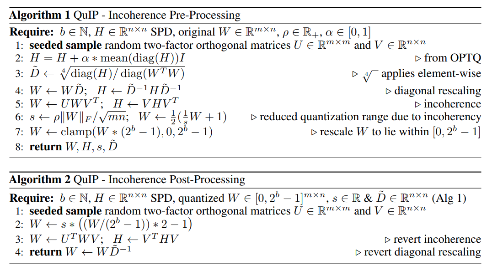

QuIP 의 pre-processing 과 post-processing 을 Algorithm 1 과 Algorithm 2 에서 각각 설명한다. Algorithm 1 의 line 5 에서 앞서 말한 빠른 orthogonal multiplication 절차를 적용해 $W$ 와 $H$ 가 incoherent 하게 만든다. 저자는 빠른 matrix multiplication 단계에서 entry 를 무작위로 섞어서 attention head 간 상관관계가 성능을 떨어뜨리는 걸 막는다. 성능을 더 높이는 추가 heuristic 개선도 몇 개 도입한다.

#### Incoherence-Based Heuristics.

Line 4 에서 $W$ 와 $H$ 를 diagonally rescale 해서 $\ell(\hat{W}) \approx \operatorname{tr}(H) \| W \|_F^2$ 를 최소화한다. 이는 이 matrix 의 spectrum 을 trade-off 해서 최소점을 찾는 거다. $W$ 의 incoherence 에 동기부여 받아, Line 6 에선 typical $\max_{i,j} \left| W_{ij} \right|$ 대신 spectrum $\| W \|_F$ 에 의존해 quantization 범위를 계산한다. 전체 QuIP 절차는 Algorithm 3 에서 설명하는데, Algorithm 1 과 Algorithm 2 의 pre- 와 post-processing sub-step 호출을 포함한다.

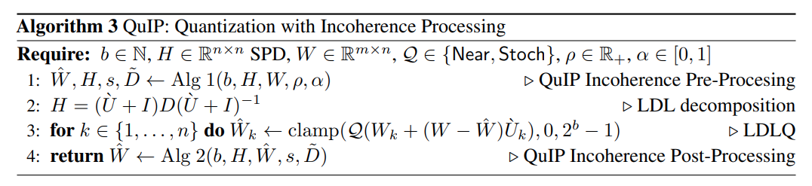

#### Greedy local search.

기본 절차는 error guarantee 가 있는 좋은 초기 추정치를 준다. LDLQ 후 (post-processing 전) coordinate descent 를 실행해 proxy loss 를 더 낮출 수 있다. 같은 순서로 weight 를 업데이트한다.

# 5 Extensions and Further Analyses

## 5.1 OPTQ is a Special Case of LDLQ

저자는 새로운 이론적 통찰을 증명한다: incoherence processing 없는 QuIP (i.e., LDLQ) 은 OPTQ 알고리즘의 더 효율적인 버전과 동등하다. 즉, OPTQ 는 linear feedback 이 있는 adaptive rounding 절차 클래스에 속하고, 클래스 내에서 최적이다.

#### Theorem 6.

OPTQ 는 Eq. (2) 로 묘사된 linear feedback 이 있는 adaptive rounding 절차 클래스에 속하고, Sec. 3 의 LDLQ 와 동등하다.

#### Remarks.

저자가 아는 한, 이 동등성은 OPTQ 에 대한 최초의 theoretical analysis 를 준다. 두 방법이 동등하더라도, LDLQ 가 더 효율적이다. OPTQ 구현은 $H$ 의 matrix inversion 과 두 번의 Cholesky decomposition 이 필요하다. 저자의 LDLQ 구현은 matrix inversion 없이 Cholesky decomposition 한 번만 한다.

#### Empirical Verification.

OPTQ 구현의 quantized output 이 저자의 LDLQ 구현의 output 과 정확히 같다는 걸 보였다. $W \sim \operatorname{Unif}[0,1]^{1000 \times 1000}$ 인 synthetic random data 를 사용했다 (Supplement C 에서 자세히).

## 5.2 A Bound for Rounding to a Finite Grid

Sec. 3 에서 LDLQ (i.e., OPTQ) 가 adaptive rounding objective 를 최소화하는 데 최적임을 봤다. 하지만 이 분석은 integer 로 rounding 을 가정했다. 실제론 $W$ 를 integer 로만 rounding 하는 게 아니라, scale 하고 shift 해서 $b$-bit integer 에 맞는 finite subset 으로 rounding 한다. 이를 위해 "real" LDLQ 알고리즘은 quantized 값의 범위를 제한하는 clamp 연산을 사용한다. 이 작은 변화가 있을 때 LDLQ 가 여전히 최적인가? 다음 구체적 예시가 아니라고 보여준다.  

#### Finite Grid Counterexample.

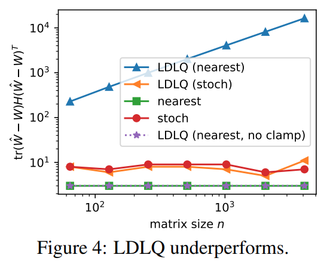

Fig. 4 는 LDLQ 와 다른 rounding 방법의 동작을 보여준다—4-bit grid $[0, 15]$ 로 clamping 제한했을 때—특정 예시에서 $H$ 는 $\left( I_n + 1_{n \times n} - e_n e_n^T \right) / n$ 의 작은 perturbation 이고, $W$ 는 $m = 16$ 에서 $\mathbf{1}_{m \times n} / 2$ 의 작은 perturbation 이다 (Supplement C 에서 설정 자세히). 

이 그림은 nearest rounding 으로 clamped LDLQ 가 asymptotically 더 나쁘고, finite grid 로의 clamping 이 이 경우 더 나쁘게 만든다는 걸 보여준다.  

저자의 실험에서 OPTQ 는 nearest rounding 을 확실히 이겼다. 이 clamping 문제는 실제론 잘 안 나타나는 것 같지만, 가능한 경우가 있으니 유용한 end-to-end bound 를 증명하려면 고려해야 한다.  

#### A Procedure With a Bound.

위 이론적 문제를 해결하기 위해, $\left| \hat{W}_{ij} - W_{ij} \right|$ value 를 제한하는 방법을 설명한다. 그러면 $W$ 가 충분히 grid 안에 있으면 rounded weight 도 grid 안에 남는다. 이를 hyperparameter $c$ 가 있는 optimization problem 으로 한다:

$$
\begin{aligned}
\text{minimize}&: \operatorname{tr}\left( H R^T R \right) \\
\text{over}&: R \text{ unit upper triangular} \\
\text{subject to}&: e_i^T R^T R e_i \leq 1 + c, \forall i \in \{1, \ldots, n\}.
\end{aligned}
$$

저자의 "fixed" 알고리즘은 이 convex problem 을 (e.g., ADMM 으로) 풀고, QuIP 을 stochastic rounding 과 $U = R^{-1} - I$ 로 LDL decomposition 대신 사용해 실행한다. $c$ 가 충분히 크면 이는 기본 QuIP 과 정확히 같다는 걸 알 수 있다. 왜냐면 제약이 없어지면 optimization problem 의 해가 LDL decomposition 이 되기 때문이다. 이렇게 하면 (Supplement 에 전체 알고리즘 있음) 다음 theorem 이 나온다.

#### Theorem 7.

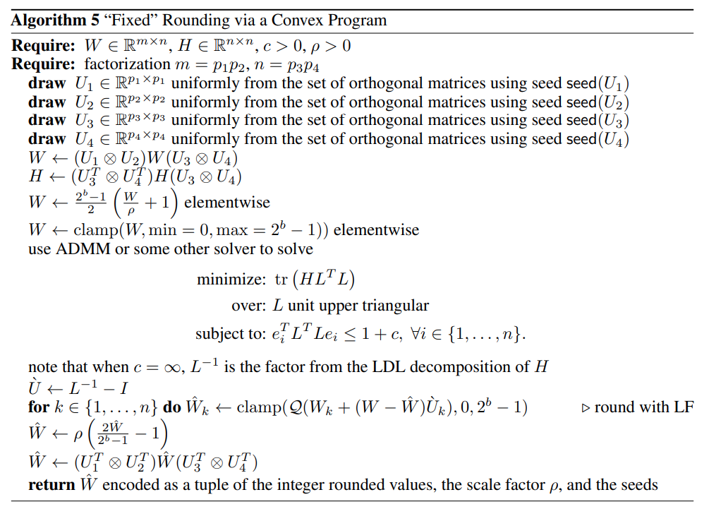

Algorithm 5 를 사용해 matrix $W \in \mathbb{R}^{m \times n}$ 를 objective (7) 을 풀며 quantize 한다고 하자. 그러면 알고리즘의 hyperparameter $c$ 와 $\rho$ 의 assignment 가 존재해서, 적어도 $1 - \delta$ 확률로 모든 quantized weight 가 범위 안에 있고 (overflow 나 clipping 필요 없음):

$$
\operatorname{tr}\left( (\hat{W} - W) H (\hat{W} - W)^T \right) = \tilde{\mathcal{O}}\left( \frac{1}{n^2 4^b} \operatorname{tr}\left( H^{1/2} \right)^2 \| W \|_F^2 \right).
$$

실제론 clamping 이 문제를 잘 안 일으키고, 이 프로그램을 풀려면 계산이 많이 필요해서, 저자는 항상 이전 섹션에서 설명한 QuIP 을 사용한다. 이는 $c$ 를 크게 설정하고 nearest rounding 을 쓰는 것과 같다.

# 6 Experiments

#### Overview.

저자는 OPT 모델군 (최대 66B parameter) 과 Llama 2 70B 를 다양한 quantization 과 processing 방법으로 quantize 한다. QuIP 은 모든 model size 와 평가 작업에서 OPTQ 와 다른 baseline 을 능가한다. 

- 가장 흥미로운 건, incoherence processing 이 저자가 고려한 모든 quantization 방법 (nearest rounding 포함) 과 함께 weight 당 2 bit 만으로도 뛰어난 성능을 낸다는 점이다. 
- QuIP 의 2-bit quantization 은 중간 크기 model (1B parameter) 에서도 실용적이고, 다른 2-bit quantization 방법이 실패하는 영역에서도 잘 된다. 
- largest model size 에서는 2-bit 와 16-bit weight 성능 차이가 작아진다. 
- 저자는 language generation 에서 QuIP 의 throughput 을 OPTQ 의 효율적인 구현과 비교했는데, 크게 느리지 않다.

#### Setup.

- 실험 환경은 OPTQ 의 repository 위에 구축됐고, PyTorch 로 구현됐다. 
- 저자는 HuggingFace 의 OPT 와 Llama 2 모델군 구현을 quantize 한다. 
- 모든 model 은 single GPU 에서 최대 48GB 메모리로 quantize 된다. 
- calibration set 은 OPTQ 와 같은데, C4 dataset 에서 무작위로 뽑은 128 2048 token segments 로, 크롤링된 웹사이트의 일반 텍스트 데이터로 구성된다. 그러니까 quantization 할 때 작업별 데이터는 안 본다. 
- OPTQ 를 따라, quantization 은 Transformer block 단위로 진행된다: GPU 메모리에 로드하고, Hessian 을 계산한 뒤, weight 를 quantize 한다. 
- 현재 block 의 input 은 quantized block 을 통해 다음 block 의 input 을 만든다. 
- Hessian 은 full precision model 이 아니라 그 시점까지의 quantized Transformer 에서 계산된다; OPTQ 처럼, 이게 quantization 을 개선한다는 걸 알았다. 

#### Methods.

저자는 여러 quantization 과 pre/post processing 방법의 조합을 평가한다. 

- quantization 방법으로는 nearest rounding, LDLQ (즉 OPTQ), 그리고 두 가지 변형을 평가한다. 
- LDLQ-RG 는 $\operatorname{diag}(H)$ 기반으로 weight 순서를 바꾸고 proxy 에 greedy update 를 추가한다. 
- "Greedy" 는 greedy update 만 한다. 
- OPTQ 의 baseline preprocessing 을 평가하는데, 이건 numerical stability 를 위해 $H \leftarrow H + \alpha * \operatorname{mean}(\operatorname{diag}(H))I$ 를 추가한다. 
- 또 Algorithm 1 과 2 의 incoherence processing 을 "IncP" 라고 해서 평가한다. 이 표기법으로 QuIP = LDLQ + IncP, QuIP-RG = LDLQ-RG + IncP 가 된다.

#### Datasets.

다음 language generation 작업으로 평가한다: WikiText2, Penn Treebank (PTB), C4. 또 zero-shot 작업으로 LAMBADA (LAMB), ARC Easy (ArcE), PiQA, StoryCloze (SC) 도 평가한다.

#### Main Results.

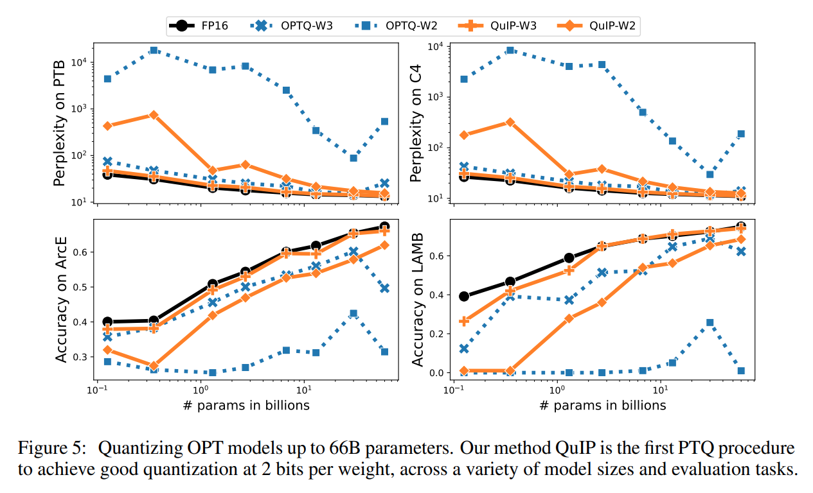

QuIP 은 다양한 LLM 크기와 평가 작업에서 weight 당 2 bit 로 좋은 quantization 을 달성한 최초의 PTQ 절차다. 

Fig. 5 에서 QuIP 과 OPTQ 를 weight 당 2 bit 와 3 bit 로 quantize 해서 비교한다 (4-bit quantization 은 두 방법 모두 똑같이 잘 된다); OPT model (최대 66B) 을 PTB, C4, ARC Easy, LAMBADA 로 평가한다. 

- QuIP 은 model 크기와 평가 작업 전반에서 OPTQ 를 능가한다. 
- 3 bit 에서 QuIP 은 full precision model 과 꽤 잘 맞는다. 
- 2 bit 에서, larger LLM (>2B parameter) 에서 QuIP 이 full precision model 성능에 가까워진다. 
- model size 가 커질수록 QuIP 의 2-bit quantization 품질도 올라간다. 
- OPTQ 의 OPT-66B 에서의 성능 하락은 그들의 논문에 기록돼 있다. 

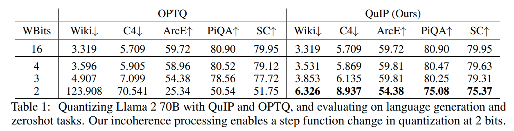

Tab. 1 은 Llama 2 70B 를 QuIP 과 OPTQ 로 quantize 한 결과를 보여준다. 역시 QuIP 은 2 bit 에서 good quantization 을 달성하는데 OPTQ 는 그렇지 않다.

#### Incoherence Processing Ablation.

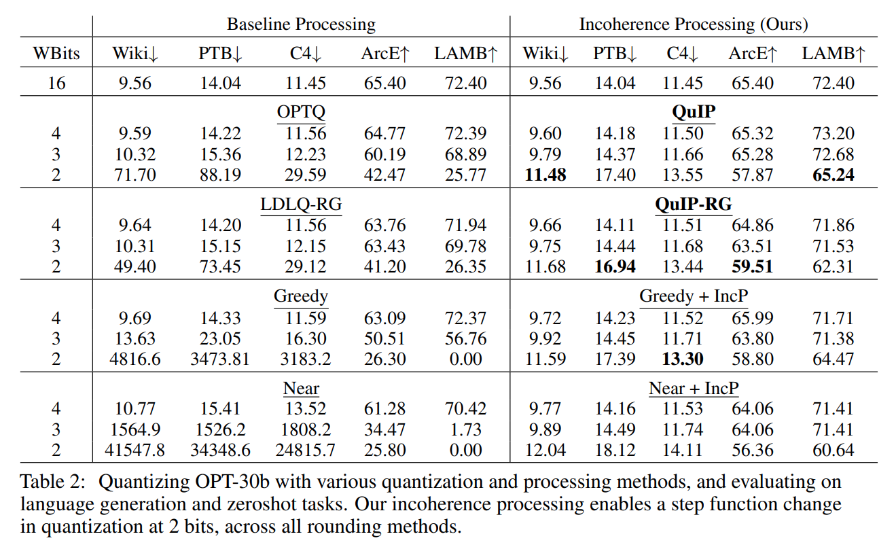

Tab. 2 는 OPT-30B 에서 평가한 모든 quantization 과 processing 방법 조합을 보여준다. 

- lower weight bit 에서 QuIP 의 incoherence processing 은 all quantization 방법들의 성능을 극적으로 개선하고, 모든 평가 작업에서 그렇다.
- 놀랍게도, 저자의 incoherence processing 을 쓰면 all quantization methods—심지어 nearest—도 2 bit 에서 실용적이다. 
- QuIP-RG 의 수정은 때때로 QuIP 보다 나아지지만, 이 수정들을 평가하려면 더 연구가 필요하다. 

#### Throughput Comparison.

저자는 model inference 중 incoherence processing 의 additional overhead 를 OPTQ 의 efficient forward pass 를 수정해서 평가한다. OPTQ 의 구현은 quantized-matrix full-precision-vector product kernel 을 포함하고, FP16 baseline 보다 속도 향상을 제공한다고 했다. 저자의 incoherence processing 추가는 PyTorch 로 한다. 

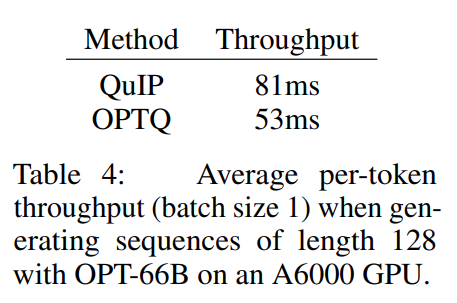

Tab. 4 에 따르면 우리 QuIP 구현은 OPTQ 보다 약 1.5배 느리다.

#### Further Ablation.

QuIP 의 incoherence processing 은 여러 sub-step 을 포함한다. 

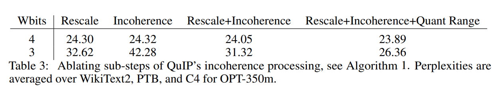

Tab. 3 은 각 기여도를 보여주는데, 모두 완전한 개선에 필요하다. 

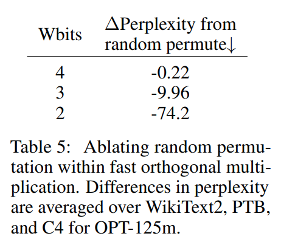

Tab. 5 는 빠른 orthogonal multiplication 내의 random permutation step 도 perplexity 를 크게 줄인다는 걸 보여준다.

# 7 Conclusion

이 논문은 quantization with incoherence processing (QuIP) 을 소개했다. 

이 알고리즘은 (1) weight error 의 quadratic proxy 를 최소화하는 optimal adaptive rounding 절차, (2) random orthogonal matrix 의 Kronecker product 로 곱해 weight 와 Hessian matrix 의 incoherence 를 보장하는 efficient pre- 와 post-processing 으로 구성된다. 

저자는 QuIP quantization 이 linear feedback 이 있는 adaptive rounding 방법의 일반 클래스에서 최적임을 증명했다; 이 theoretical analysis 는 LLM-scale 의 model 에 맞는 quantization 알고리즘에 대한 최초의 분석이다.  

실험적으로, QuIP 은 특히 큰 model size 에서 LLM 에 대한 최초의 실용적인 2-bit quantization 결과를 달성했고, LLM 에서 정확한 2-bit inference 가 가능함을 시사한다.