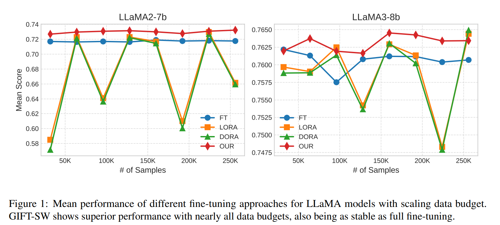
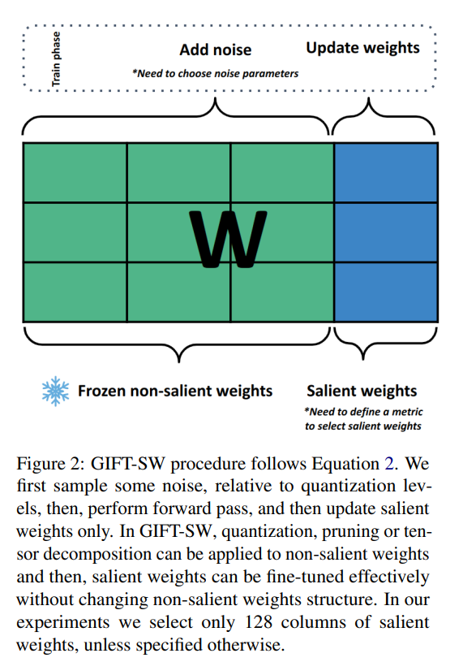
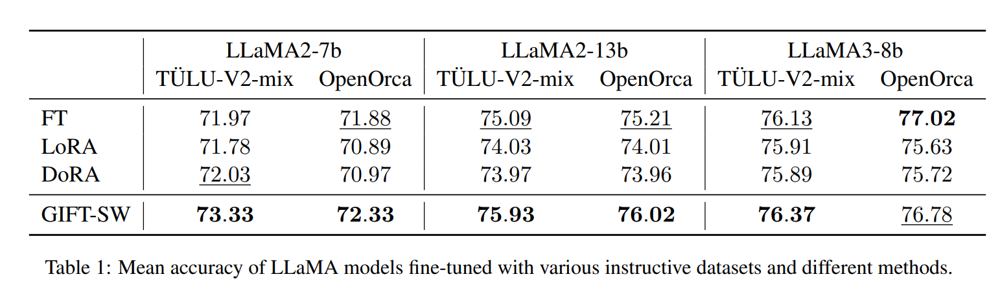
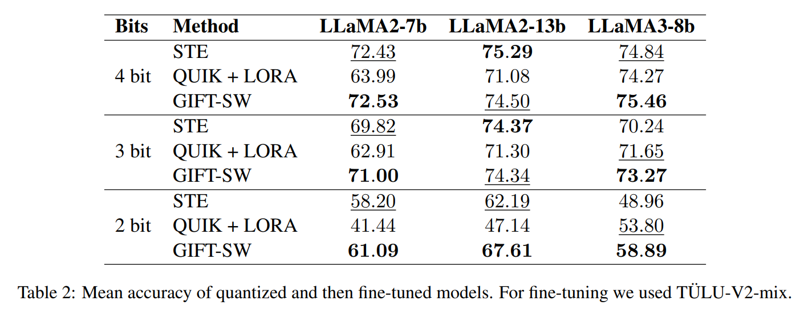
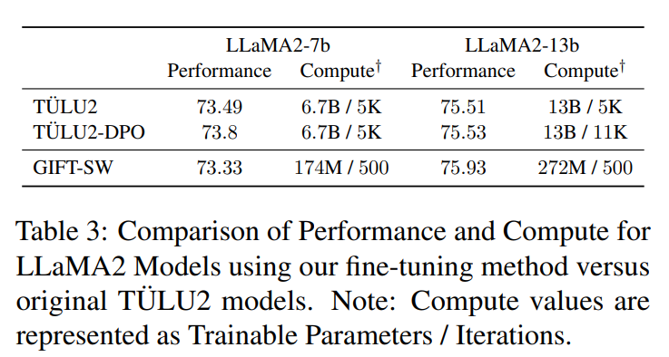
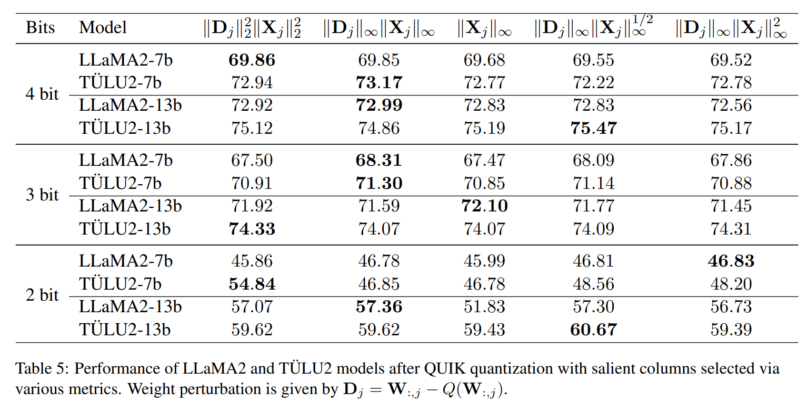
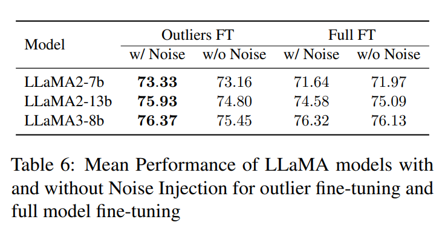
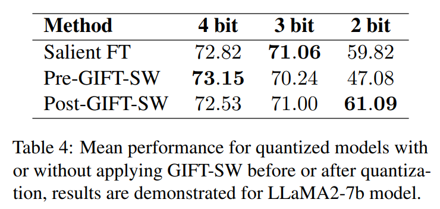

논문 및 이미지 출처 : <https://arxiv.org/pdf/2408.15300v1>

# Abstract

Parameter Efficient Fine-Tuning (PEFT) 방법은 large language model(LLM)의 사용을 널리 확산시키며 인기를 얻었다. 

최근 연구에 따르면, 성능에 큰 영향을 미치는 가중치의 small subset 이 있다는 사실이 밝혀졌다. 

이러한 관찰을 바탕으로, 저자는 **Gaussian noise Injected Fine Tuning of Salient Weights (GIFT-SW)** 라는 새로운 PEFT 방법을 소개한다. 

- 이 방법은 salient columns 만 업데이트하고, non-salient columns 에는 Gaussian noise 를 주입하는 방식이다. 
- 이러한 columns 를 식별하기 위해 이전 연구에서 사용된 다양한 metric 을 확장하고 통합하는 generalized sensitivity metric 을 개발했다. 
- LLaMA 모델을 사용한 실험에서 GIFT-SW 는 동일한 계산 자원 내에서 full fine-tuning 및 SOTA PEFT 방법을 능가하는 성능을 보였다. 
- 또한, GIFT-SW 는 mixed-precision quantization 를 적용한 모델의 성능을 salient weights 를 full precision 으로 유지하면서 복원하는 실질적인 이점을 제공한다.

# 1 Introduction

현대의 LLM 들은 unseen task 에서도 뛰어난 generalization 능력을 보여주지만, fine-tuning 은 여전히 이러한 모델의 성능을 향상시키거나, quantization, pruning, tensor decomposition 과 같은 compression techniques 가 적용된 이후 성능을 복원하기 위해 필수적이다. 

하지만 large LLM 의 all parameters 를 fine-tuning 하는 것은 계산 및 메모리 측면에서 매우 부담이 크다. 

이를 해결하기 위해 **Parameter Efficient Fine-Tuning (PEFT)** 방법들이 개발되어, 제한된 계산 및 메모리 자원 내에서 모델 성능을 향상시키는 것을 목표로 하고 있다.

하지만, 현재까지 PEFT 방법들은 full fine-tuning 의 정확도를 따라잡지 못하고 있으며, 이는 자원 사용을 최소화하면서도 성능 격차를 줄일 수 있는 새로운 접근법의 필요성을 강조한다. 

또한 대부분의 PEFT 방법은 추가적인 parameter 를 더함으로써 계산 부담을 증가시키는 단점이 있다.

이를 해결하고 efficiently trained LLM 의 성능을 향상시키기 위해, 저자는 **GIFT-SW** 라는 새로운 PEFT 방법을 소개한다. 

- 이는 salient weights 의 small subset 만 업데이트하고, non-salient weights 에는 noise 를 주입하는 방식에 초점을 맞춘다.
- 이 방법의 개발은 이전 연구에서 도출된 관찰과 그들이 제기한 관련 질문에 기초하고 있다:
  - 이전 연구들은 small salient weights (subset of salient weights)가 post-training quantization (PTQ) 및 pruning 기법의 효과에 큰 영향을 미친다는 사실을 보여주었다. 
  - 또한, 일부 연구에서는 모델 기능에 중요한 "universal neurons" 을 식별하였으며, 이러한 salient weights 를 선택하고 업데이트하는 것이 중요함을 강조했다.
- **Question 1:** salient weights 의 small subset 만 업데이트하는 것으로 모델의 조정이 충분히 가능한가?
  - 또한, 최근 연구들은 gradient step 전후로 noise 를 주입한 Perturbed Gradient Descent (PGD)가 수렴을 안정화하고 over-fitting 을 방지할 수 있음을 입증했다.
- **Question 2:** noise injection 이 수렴에 도움이 되는가?
  - PGD 는 quantization 과정을 근사하여 모델의 robustness 를 높이는 데 주로 사용된다.
- **Question 3:** noise injection 이 robustness 를 향상시키는가?
  - salient weights 를 선택하는 것은 quantization 및 pruning 에서 큰 과제이며, 이는 우리 방법의 핵심이 된다. 
  - 본 논문에서는 기존에 제안된 all saliency metric 을 generalization 한 공식을 도출하고, 그 효과를 비교하는 실험을 제시한다.

우리 연구의 주요 기여는 다음과 같이 요약할 수 있다:

- 저자는 **GIFT-SW**라는 pre-trained 및 quantized LLM 을 위한 새로운 PEFT 방법을 소개한다. 
  - 이 방법은 salient columns 의 가중치만 fine-tuning 하며, non-salient weights 에는 Gaussian noise 를 주입하고 training 중에는 동결시킨다.
- 저자는 pre-trained LLM 에서 salient columns 를 식별하기 위한 sensitivity metric 을 generalization 했다. 
  - 본 논문에서 제안된 일반형의 다양한 기존 및 새로운 인스턴스를 비교하고, 문헌에서 연구된 metric 을 능가하는 new metric 을 식별했다.
- 실험을 통해 GIFT-SW 가 SOTA PEFT 방법 및 full fine-tuning baseline 을 대다수 zero-shot task 에서 능가함을 입증했다. 
  - LLaMA 모델에서 GIFT-SW 는 full parameters 의 3% 만 fine-tuning 하면서도, 사용되는 계산 자원은 10/1 수준으로 TÜLU2 모델과 유사한 정확도를 달성했다.
- GIFT-SW 는 low-rank adapters 에 비해 training dataset 의 size 에 대한 안정성이 더 우수함을 보여주었다.

# 2 Related Work

## 2.1 Parameter efficient fine-tuning of LLM

가장 효율적인 방법 중 하나로는 **LoRA** 가 있는데, 이는 low-rank adapters 를 학습하는 방법이다. 

- 최근에는 adapters 의 initialization 개선하거나, sparse adapters 를 추가하여 pre-trained weights 의 low-rank representation 을 강화하는 방식이 제안되었다. 
- 또한, **DoRA** 는 pre-trained weights 의 magnitude 와 direction components 를 함께 fine-tuning 하는 방법으로, 다양한 fine-tuning task 에서 상당한 성능을 달성했다.

## 2.2 Salient Weights in LLMs

**Salient weights** 의 식별은 weight pruning 의 주요 문제 중 하나다. 

- 최근, LLM 에서 이러한 가중치를 식별하는 여러 방법들이 제안되었는데, 대표적으로 **SparseGPT**, **Wanda**, **OWL** 이 있다.
- 또한, small subset 의 input activation 에서 발생하는 **outliers** 가 LLM 의 성능에 큰 영향을 미친다는 연구가 있었으며, 이는 activation outliers 와 salient weights 사이의 연관성을 강조한다. 
- 이후 여러 **Post-Training Quantization (PTQ)** 방법들이 similar 또는 identical pruning metrics 를 사용하여 이러한 salient weights 를 식별했다. 
- 본 연구에서는 pruning 및 quantization 관련 문헌에서 제시된 metric 을 활용하여 salient weights 를 식별하는 방법을 generalization 했다.

## 2.3 Structured and Non-structured Salient Weights selection

- Salient weights 는 all weights 의 few percent 에 불과하므로, 이를 저장하는 간단한 방법은 sparse matrix 를 사용하는 것이다. 
  - 이 접근법은 계산적으로 합리적이며, 성능 향상을 가져온다는 것이 입증되었다. 
- 반면, activation 에서 발생하는 outliers 는 small weight channels 에만 집중된다는 것이 밝혀졌으며, 이를 기반으로 **SmoothQuant** 에선 calibration dataset 을 사용하여 outlier columns 을 식별하고, 이러한 columns 를 full precision 으로 유지한 채 다른 columns 는 quantized 상태로 변환했다. 
- 이는 **QUIK** 에서 더 발전되었으며, outlier columns 을 full precision 으로 유지하고 나머지 columns 는 **GPTQ** 를 사용하여 quantization 했다. 
- 유사한 절차가 **OWQ** 에서도 사용되었으며, **OBD** 기반 metric 이 사용되었다.  
- 계산 효율성을 고려하여 structured columns-wise salient weight selection 방식을 따랐다.

## 2.4 Noise Injections

이 섹션에서는 **Gaussian Noise Injections (GNI)** 와 그 이점을 간략히 설명하고, quantization noise 와 GNI 가 동일하다는 것을 보인다. 

따라서 GNI 는 further model quantization 에도 이점을 제공할 수 있다.

저자는 third question 을 검토하기 위해, quantization level 에 따라 noise 를 sampling 한다.

#### Guassian Noise Injections (GNI)

Perturbed Gradient Descent (PGD) 는 optimization procedure 중에 random distribution 의 sample 을 사용하여 weights 를 추가하거나 곱하는 방법을 수반한다.

Gaussian noise injection (GNI)은 gradient step 이후에 적용되며, non-convex optimization 에서 모델이 saddle point 에서 효율적으로 탈출하는 데 도움을 준다. 

반면, gradient step 이전에 gaussian noise 를 주입하면 모델이 spurious local optimum 에서 탈출하는 데 도움이 된다.

$$
\begin{equation}
\theta_{t+1} \leftarrow \theta_t - \tau (\nabla f(\theta_t) + \xi)
\end{equation}
$$

$$
\begin{equation}
\theta_{t+1} \leftarrow \theta_t - \tau (\nabla f(\theta_t + \xi))
\end{equation}
$$

$$
\begin{equation}
\xi \sim N(\mu, \sigma^2)
\end{equation}
$$

- 실용적인 측면에서 noise injections 는 자주 **regularization** 기법으로 논의되며, adversarial robustness 를 촉진하는 방법 또는 data augmentation 을 위한 방법으로 사용될 수 있다. 
 
본 연구에서는 gradient 를 평가하기 전에 GNI 를 사용한다. 

- Orvieto et al. (2023) 은 training iteration 에서 단 one layer 에만 noise 를 추가해 **variance explosion** 을 방지할 것을 제안했으며, 이는 GNI 가 regularization 으로 작용한다는 사실을 이론적으로 증명했다. 
- Liu et al. (2023) 는 GNI 를 사용해 pre-trained LLM 을 fine-tuning 하는 방법을 연구했으며, 이때 noise distribution 의 layer-wise variance parameters 를 먼저 학습한 후 all weights 에 noise 를 추가했다. 
  - 해당 방법이 layer-wise 로 independent noise 를 주입하는 방식보다 더 우수한 결과를 보였다.

#### Quantization Noise Injections (QNI).

networks 의 Quantization aware training (QAT) 는 quantization 후 성능 저하를 완화하기 위한 방법이다. 그러나 uniform quantization 는 non-differentiable operation 이다.

- 이를 간단히 표현하면, scaling 과 rounding operations 의 조합으로 나타낼 수 있다: $Q(W) = \Delta \left\lfloor \frac{W}{\Delta} \right\rceil.$
- QAT operation $Q$ 측면에서 quantization noise $\Omega$ 로 효율적으로 근사될 수 있으며, 이는 다음과 같다: $\Omega = Q(W) - W$
  - 따라서 QNI 로 모델을 훈련하는 것은 gradient 평가 전에 GNI 를 사용하는 PGD 와 정확히 동일하다.
- uniform quantization 으로 유도된 noise $\Omega$ 는 종종 input signal 과 상관이 없고, uniform distribution 을 가지며, white spectrum 을 가진 additive noise 로 modeling 될 수 있다. 그러나 실제로 이러한 조건은 종종 만족되지 않는다. 
  - 따라서 $\Omega$ 에 대해 gaussian distribution $\mathcal{N}(\mu, \sigma^2)$ 를 사용하는 것이 일반적으로 개선된 결과를 낳는다.
- GNI 가 model training 에 유익하지만, noise parameters 를 선택하는 방법에 대한 명확한 답은 없다. 
- Liu et al.는 original weights 와 perturbed weights 간의 KL divergence 를 최소화하는 noise parameters 를 결정하였다. 
- Shin et al.는 gaussian distribution 의 parameter 를 quantization step 에 비례하는 스케일로 weight distribution 과 유사하게 식별하였다.

## 2.5 Straight Through Estimator

가장 널리 사용되는 **QAT** 기법은 **Straight Through Estimation (STE)** 으로, gradient 를 다시 parameterization 하는 방법이다. 

하지만, STE 는 **biased** 하며, quantization step 사이에서 weights 가 **oscillation** 할 수 있다는 단점이 있다. 

**QNI** 를 사용한 pre-trained model 은 STE 대신 QNI 를 사용하여 더 나은 성능을 달성했다.

# 3 Method

GIFT-SW 는 다음과 같은 단계로 이루어진다:

1. small calibration dataset 을 바탕으로 선택된 sensitivity metric 을 사용하여 fixed number 의 salient columns 를 식별한다. 
   - 이 수는 all layer 에서 일관되게 유지된다.
2. weight matrix 의 columns 를 salient columns 와 regular columns 로 나눈다.
3. training 중, non-salient columns 의 weights 에 noise 를 추가하고 salient columns 의 가중치만 업데이트한다.

따라서 이 방법은 두 가지 주요 설계 선택에 의존한다: 1) salient columns 를 선택하는 방법과 2) noise injection 의 parameters 이다. 

## 3.1 Generalizing parameter sensitivity metrics

최근 여러 접근법들이 quantization 에 sensitive weights 를 식별하는 방법이나 pruning 에 대한 sensitivity 를 식별하는 방법을 제안하였다. 

저자는 이러한 접근법을 perturbation 에 대한 sensitivity metric 으로 generalization 하고, 이를 적용하여 어떤 columns 이 성능 저하에 더 취약한지를 결정한다. 

따라서, 저자는 이러한 columns 에 noise 를 추가하는 것을 피하고, 이를 model fine-tuning 에 사용한다.

제안된 sensitivity metric 은 weight matrix $W$ 의 $j$ column 에 대해 다음과 같이 표현된다:

$$
\begin{equation}
  s_j = \|D_j\|_{\tau}\|X_j\|^\gamma_\rho,
\end{equation}
$$

- $D_j$ : weights perturbation 을 측정한 것
- $s_j$ : 해당 column 의 perturbation 에 대한 sensitivity 를 나타낸다. 
- $X$ : input feature 
- $\gamma$ : 1/2, 1, 2 중 하나를 가진다.

Sec. 2.4 에서 논의한 바와 같이 GNI 를 perturbation source 로 사용할 수 있으며, 이 경우 $D_j = W_{:,j} + \xi$ 로 계산된다. 

그러나 noise $\xi$ 를 sampling 하는 것은 deterministic 하지 않다. 

- noise $\xi$ 의 영향을 근사하기 위해 quantization 으로 인한 perturbation 을 활용하여 $D_j = W_{:,j} - Q(W_{:,j})$ 로 설정한다. 
  - $Q(W_{:,j})$ : uniform symmetric quantization 이 적용된 weights 를 나타낸다.

각 layer 의 input feature $X$ 는 calibration dataset 에서 random sentence 들을 사용하여 계산된다. 

이후 각 column 에 대한 sensitivity values $s_j$ 가 추정되고, highest values columns 가 salient columns 로 식별된다. 

---

Eq. 4 에서 제시된 metric 은 최근 quantization 에 대한 연구에서 다루어진 metrics 와 밀접한 관련이 있다. 

- 예로, $\|X\|_{\infty}$ metric 은 QUIK 과 SmoothQuant 에서 사용되었으며, OWQ 는 $\lambda_j \|D_j\|_2^2$ metric 을 채택했다.
  - $\lambda_j = \|X_j\|_2^2$ : layer 의 quantization error 에 대한 Hessian matrix $H$ 의 $j$-th diagonal element
  - 이는 OWQ 에서 사용된 sensitivity metric 이 OBD 에서 제안된 network pruning 의 salience measure 를 column quantization 에 맞게 수정한 것임을 보여준다.
- Wanda 에서 제안된 metric 은 $\|D_j\|_1\|X_j\|_2$ 로 element-wise variant
  - 이는 pruning 을 $D_j$ 에 대한 perturbation source 로 사용한 Eq. 4 에서 쉽게 도출할 수 있다.

Wanda 와 달리, 저자는 general Eq. 4 에서 $l_\infty$ norm 을 사용하는데, 그 이유는 calibration dataset 에 포함된 예시들이 input feature values 의 차이를 유도하기 때문이다. 

- $l_2$ norm 을 사용하면 input channel 전반에 걸쳐 값이 평균화되어 activation 의 outlier values 가 lower values 에 의해 가려질 수 있다. 
  - 동일한 결론을 weight error 에도 적용할 수 있다. 
- $l_2$ norm 의 경우, 각 channel 에 대한 error 는 quantized weights 와 original weights 간의 모든 차이를 포함한다. 
- 따라서 rare considerable error 는 많은 small deviation 에 의해 완화될 수 있다.

## 3.2 Quantization Noise Injection

QNI 를 활용한 fine-tuning 절차를 개선하기 위해 저자는 sensitive weights 에 perturbation 을 적용하지 않는다. 

따라서 fine-tuning procedure 에서 perturbation 에 민감하거나 salient columns 를 식별한 후, all layers 에 걸쳐 non-salient columns 에만 quantization noise 를 주입한다 (Fig. 2 참고).

- Gaussian noise 의 scale parameters 는 각 layer 의 quantization step size 에 따라 결정된다. 
- 모델의 주어진 layer 의 weight matrix $W$ 에 대해 noise injection process 는 다음과 같이 설명할 수 있다. 
  - training phase 의 forward pass 동안 저자는 먼저 standard normal distribution $\mathcal{N}(0,1)$ 에서 noise matrix $\Omega$ 의 element 를 sampling 한다. 
  - 그 후 matrix $\Omega$ 는 quantization step size $\Delta$ 로 스케일링된다. 
  - 마지막으로, scaled noise 를 non-salient columns 의 weight $W_{[:,non-salient]}$ 에 추가한다. 

noise injection operation $\mho$ 는 다음과 같이 주어진다:

$$
\begin{equation}
  \mho(W) = \begin{cases}
    W_{[:,salient]}, \\
    W_{[:,non-salient]} + \frac{1}{2} \text{diag}(\Delta) \Omega
  \end{cases},
\end{equation}
$$

- $\text{diag}(\Delta)$ : vector $\Delta$ 의 elements 로 이루어진 diagonal matrix
- training 중에는 salient columns $W_{[:,salient]}$ 의 wegihts 만 업데이트되며, 다른 columns $W_{[:,non-salient]}$ 의 weights 는 고정된다. 
- salient weights 에 noise 를 주입하지 않는 이유는 small perturbation 이 모델 성능에 큰 영향을 미칠 수 있기 때문이다. 
- quantization step size $\Delta$ 는 non-salient columns $W_{[:,non-salient]}$ 의 weights 에만 적용된다.
- weights 의 initial distribution 과 더 일치시키기 위해, $\Delta$ 에 포함된 quantization scale factors 는 각 row 에 대해 개별적으로 추정된다. 
- $i$-s row 에 대한 scale factor $\Delta_i$ 는 다음과 같이 계산된다:

$$
\begin{equation}
  \Delta_i = \frac{\alpha_i}{2^{b-1} - 1},
\end{equation}
$$

- $b$ : bit-width
- $\alpha_i$ : quantization parameter
- quantization 방법에서 smaller bit-width $b$ 는 higher quantization noise 와 대응한다. 
- $\alpha_i$ parameter 는 Appendix A 설명처럼 linear search 를 통해 weight error 를 최적화하여 추정된다.

Eq. 5 와 6 에 따라 rows 전역의 injected noise variance 는 non-salient weights 의 distribution 에 의해 결정된다. 

- salient columns 는 이 distribution 에서 제외되는데, salient weights 가 large quantization error 를 유발하여 row-wise scale factors 를 왜곡할 수 있기 때문이다. 
- 이 접근법은 noise variance 를 최소화하는 데 도움을 주며, 이는 training 중 non-salient weights 의 deviation 을 줄이는 데 기여한다.

이와 같이 noise 를 sampling 하여, 저자는 Sec. 6.3 에서 논의된 quantization pre-training 실험에 사용할 수 있다.

# 4. Experiments

## 4.1 Data

이전 연구를 따라, 저자는 instruction tuning task 에 집중한다. 

- 이를 위해 TULU-V2-Mix 를 주요 data source 로 사용하며, 이는 다양한 출처의 광범위한 instruction 을 포함하고 있다. 
- 이 dataset 은 filtering 되어 있으며, 너무 크지 않으면서도 상당량의 data 를 포함하고 있으며, 이 집합에 조정된 모델은 우수한 성능을 보인다. 
- 또한, OpenOrca dataset 을 사용하여 저자의 방법이 specific instruction set 에 의존하지 않음을 입증한다. 
- salient columns 를 찾기 위한 sensitivity metrics 는 Pile validation dataset 에서 512 random sentences 를 기반으로 추정된다.

## 4.2 Baselines

저자는 full precision 및 quantization 실험 모두에 대해 여러 baseline 을 고려한다. 모든 baseline 은 LLaMA2-7b, LLaMA2-13b 및 LLaMA3-8b 에 적용된다. 

**Full precision** 버전에는 다음과 같은 baseline 이 포함된다:

- **LoRA**: 널리 사용되는 adapter-based method
- **DoRA**: 현재의 all PEFT 를 초월하는 LoRA 의 수정된 버전이다.
- **FT**: all parameters 의 full fine-tuning 이다.

prompt tuning 과 관련된 PEFT 방법은 adapter-based method 에 비해 성능이 저조하므로 포함하지 않는다. 

**Quantized** 버전은 {4, 3, 2} bit-widths 의 weight quantization baseline 으로 제시된다:

- **STE**: pre-trained model 의 all parameters 에 대한 quantization-aware fine-tuning 이다. 
  - fine-tuning 중 all parameters 가 훈련되지만, 128 salient columns 은 quantization 없이 full precision 로 업데이트된다.
- **QUIK + LoRA**: LoRA 를 QUIK quantization model 에 적용한 것이다. 
  - low-rank adapter 만 훈련되며, quantized weights 와 salient weights 는 고정된다. 
  - QUIK 은 non-salient columns 의 quantization 를 위해 GPTQ 를 활용하면서 salient weights 는 full precision 을 유지하는 mixed-precision quantization method 이다. 
  - QUIK 은 PTQ 방법 중 가장 높은 성능을 달성한다.

## 4.3 Evaluation and Datasets

저자는 HellaSwag, BoolQ, WinoGrande, PiQA, ARC-easy, ARC-challenge 에서 zero-shot 성능을 측정하기 위한 종합적인 평가를 수행한다. 

평가에는 LM Eval Harness 를 사용하며, baseline 선택은 이전 연구와 유사하다. 

## 4.4 Compute Budget

- 모든 실험에서 모델의 salient columns 수는 128 로 고정된다. 
- 또한, training budget 은 500 training iterations 로 고정되며, 별도로 명시되지 않는 한 다른 설정은 없다. 
- 최근 연구에 따르면, larger dataset 으로 one epoch training 이 multiple epochs 로 less data 로 훈련하는 것보다 더 효과적이다. 
- 따라서 all 500 iterations 은 instruction repetitions 없이 one epoch 내에서 수행된다.

## 4.5 Training Details

- training 은 4 GPU(각 40GB) 로 500 iterations 수행되었다. 
- batch size 는 7b 모델의 경우 128, 13b 모델의 경우 64 로 설정되었다. 
- baselines 의 경우, LLaMA2 모델의 learning rate 는 $3 \times 10^{-5}$로, LLaMA3 모델의 경우 $1 \times 10^{-5}$ 로 설정하였다. 
- 다양한 learning rate 를 실험하여 baselines 에 가장 유익한 값을 찾았다. 
- 저자는 0.03 warmup ratio 로 cosine annealing scheduler 를 사용하였다. 
- LoRA 와 DoRA 의 alpha 및 dropout 은 원본 논문에서 명시된 대로 설정하였으며, rank 는 저자의 방법에서 learnable parameter 수와 맞추기 위해 64 로 설정하였다. 
- 따라서 learnable parameter 수는 LLaMA2-7b 의 경우 160M, LLaMA2-13b 의 경우 250M, LLaMA3-8b 의 경우 167M 이다.
- 저자의 경우, LLaMA2 모델의 salient columns 에 대한 learning rate 은 $1 \times 10^{-4}$ 로, LLaMA3 모델의 경우 $1 \times 10^{-5}$ 로 설정하였다. 
- salient columns 수는 128 로 고정하였으며, learnable parameter 수는 LLaMA2-7b 의 경우 174M, LLaMA2-13b 의 경우 272M, LLaMA3-8b 의 경우 176M 이다.
- noise injection 을 사용한 full fine-tuning 의 경우, learning rate 은 LLaMA2 및 LLaMA3 모델에 대해 각각 $3 \times 10^{-5}$ 및 $1 \times 10^{-5}$ 로 설정하였다. 

# 5. Results

이 섹션에서는 GIFT-SW 의 성능을 보여주고 Sec. 1 의 질문에 답한다. 간단히 말해, 저자의 결과는 다음과 같다:

- **Q1**: salient weights 의 일부를 fine-tuning 하는 것이 low-rank adapter 를 사용하는 것과 유사한 결과를 생성한다는 것을 확인하였다.
- **Q2**: noise injection 이 모델 성능을 향상시킨다.
- **Q3**: noise injection 으로 훈련된 모델이 추가적인 성능 저하에 더 강건하다는 것을 확인할 수 없었다.

## 5.1 Full Precision

full precision 모델에 대한 평가 기준에서의 평균 성능은 Tab. 1 에 제시되어 있다. 

- GIFT-SW 는 대부분의 model 과 instruction set 에서 일반적으로 우수한 메트릭을 보인다. 
- 그러나 OpenOrca subset 에서 LLaMA3 의 성능이 다소 낮은 것을 관찰하였다. 
- 이 문제는 아마도 learning rate 과 scheduler selection 에서 기인하며, 이는 outlier tuning 에 영향을 미칠 수 있다.

## 5.2 Quantized Models

Tab. 2 에서는 다양한 precision (4, 3, 2)로 quantized model 의 평균 성능을 제시한다. 

- 4 및 3 bits 의 경우 GIFT-SW 는 STE 와 유사한 품질을 달성하지만, 후자는 상당히 더 많은 계산 자원을 요구한다. 
- 2 bits 설정에서는 GIFT-SW 가 상당한 품질 개선을 보여주며, 두 번째 순위 모델을 5 points 이상 초과한다.

## 5.3 Comparison with TÜLU2

GIFT-SW 를 TÜLU2 모델과 비교한다. TÜLU2 모델은 instruction 과 DPO 를 사용한 fine-tuned LLaMA2 모델이다. 

이러한 모델은 LLaMA2 수정 중에서 상위 성능을 보이지만, 상당한 계산 자원을 요구한다. 

- Tab. 3 에서는 GIFT-SW 를 사용하여 상당한 lower computational budget (parameter 수와 iterations 수가 적음)으로 LLaMA2-7b 에 대해 유사한 결과를 얻고, LLaMA2-13b 에 대해서는 TÜLU2 를 초과하는 성능을 달성함을 보여준다.

## 5.4 Scaling Properties

LLaMA2 및 LLaMA3 모델을 사용하여 GIFT-SW 와 baseline 의 성능을 data scaling 을 통해 탐구하는 실험을 수행하였다. 

Fig. 1 에 보고된 결과는 LoRA 와 DoRA 가 data scaling 에 따라 불안정한 성능을 보이는 반면, 저자의 방법과 full fine-tuning 은 더 안정적임을 보여준다. 

또한, 저자의 방법은 거의 all data budget 에서 일관되게 1 위를 차지하였다.

# 6. Ablation

## 6.1 Comparison sensitivity metrics

저자는 다양한 noise level (various perturbations magnitudes)에 대한 sensitivity metrics 를 연구하였으며, 이는 quantization precision 의 변화를 나타낸다. 

- 이 실험에서는 LLaMA2 와 TÜLU2 의 non-salient weights 에 대해 7B 및 13B parameter 를 가진 모델을 quantization 하였다.
- QUIK 을 사용하여 모델이 quantization 되며, salient weights 는 업데이트되지 않는다. 
- salient weights 128 columns 를 선택하였다. 

- Tab. 5 의 zero-shot 작업에 대한 평균 결과는 대부분의 precision 에서, $\gamma = 1$, $\rho = \infty$, $\tau = \infty$ 로 Eq. (4) 에 의해 식별된 salient columns 이 가장 좋은 성능을 달성함을 보여준다. 
- input feature 의 squared $l2$ norm (OWQ metric)으로 식별된 열은 3 및 2 bits 로 quantized TÜLU2 에 대해서만 더 나은 성능을 보인다. 
- input feature 만으로 salient columns 를 선택하는 것은(QUIK metric) 특히 2 bits 에서 성능 저하를 초래한다.
- 따라서 quantization noise 에 민감한 salient columns 를 식별하기 위해서는 weight quantization error 와 input activation 의 maximum values 를 모두 고려해야 한다. 
- 결과를 바탕으로, 저자는 $\gamma = 1$, $\rho = \infty$, $\tau = \infty$ 로 설정된 sensitivity metrics 을 선택하였다. 
- 그러나 결과는 optimal sensitivity metrics 을 선택하는 명확한 규칙을 제시하지 않으며, 성능은 bit-widths 와 모델에 따라 다르게 나타난다.

## 6.2 Noise Injection Impact

full precision setting 에서 QNI 의 중요성을 분석하기 위해, 저자는 GIFT-SW 가 적용된 LLaMA2 모델의 평균 성능을 noise injection 이 있는 경우와 없는 경우로 측정하였다. 후자의 경우, noise 는 entire weight matrix 에 적용된다. 

- Tab. 6 의 결과는 QNI 가 outlier fine-tuning 의 성능을 일관되게 향상시킨다는 것을 보여준다. 
- QNI 는 entire network 에 적용할 경우 성능을 저하시킬 수 있지만, LLaMA3-8b 에는 여전히 이점이 있다. 
- 특히, outlier fine-tuning 은 entire fine-tuning 보다 성능이 우수하지만, QNI 를 사용할 때만 그렇다.

#### 6.3 Quantization Before and After Training

QAT 관련 연구에 따르면, noise injection 으로 모델을 pre-training 하면 quantization 후 예측 능력이 향상된다고 알려져 있다. 

이러한 관찰을 바탕으로, 이 섹션에서는 여러 설정에서 full precision salient columns 를 fine-tuning 한 후 quantized LLaMA2-7b 의 성능을 검토한다:

- **Pre-GIFT-SW**: quantization 전에 GIFT-SW 를 적용한다.
- **Post-GIFT-SW**: quantization 후 GIFT-SW 를 적용한다.
- **Salient FT**: noise injection 없이 quantization 후 salient columns 를 fine-tuning 한다.

pre-training 의 경우, model quantization 의 bit-widths 는 training 중 injected noise level 에 해당한다. 

post-training 의 경우, noise injection 은 항상 4 bits 에서 수행된다.

Tab. 4 는 평가 기준에서 모델이 달성한 평균 점수를 제시한다. 

- 4 bits quantization 의 경우, Pre-GIFT-SW 모델이 다른 모델보다 상당히 우수한 성능을 보인다. 
- 그러나 3 및 2 bits 의 경우, quantization 후 salient columns 를 fine-tuning 하면 quantized model 의 더 나은 생성 능력을 달성할 수 있다. 
- 이는 극도로 low-bit quantization 에 의해 유도된 quantization weight 가 original value 에서 상당한 편차를 보이기 때문이다. 
- 그 결과 salient weights 와 quantized weights 간의 상관관계가 깨지고, pre-training 의 긍정적인 효과가 사라진다. 
- 그러나 salient weights 의 post-training 은 다른 가중치와의 새로운 관계를 형성할 수 있으므로 모델이 부분적으로 생성 능력을 회복하게 된다.
- 또한 3 bits 에서 **Post-GIFT-SW** 및 **Salient FT** 를 적용한 모델이 유사한 점수를 주는 것을 관찰할 수 있다. 
- 그러나 2 bits quantization 의 경우, noise injection 이 quantized model 의 fine-tuning 을 개선한다.

# 7 Conclusion

본 논문에서는 GIFT-SW 를 소개한다. GIFT-SW 는  salient columns 의 weights 만 훈련하고, fixed weights 에는 quantization noise 를 주입하는 parameter-efficient fine-tuning 방법이다. 

GIFT-SW 는 full precision 및 quantization setting 모두에서 이전의 fine-tuning 전략보다 우수하며, less compute budget 을 요구한다. 

data scaling 실험에서 GIFT-SW 는 이전 PEFT 방법보다 더 큰 안정성을 보여주고, 거의 all data budget 에서 PEFT 및 full fine-tuning 보다 우수한 성능을 발휘한다. 

저자의 ablation study 는 QNI 가 유익하지만, salient weights 와 함께 사용할 때만 그렇다는 것을 보여준다. 

GIFT-SW 가 이전 방법보다 뛰어난 성능을 보이지만, quantization setting 에서 성능을 극대화하는 방법에 대한 추가 연구가 필요하다. 

저자는 이전 연구에서 salient columns 선택 기준을 generalization 하고 다양한 parameter 를 경험적으로 비교하였다. 

실험 결과 일부 기준이 다른 기준보다 더 나은 성능을 보이지만, 명확한 우세 선택이 없음을 보여준다. 

이 중요한 발견은 이러한 기준을 개선하기 위한 추가 연구의 필요성을 강조한다.

# 8 Limitations

우리 연구의 주요 한계는 다음과 같다:

1. GIFT-SW 의 결과는 LLaMA 모델에 대해서만 보고한다. 현재 고성능 생성 능력을 가진 다양한 open-source pre-trained LLM 이 존재하지만, LLaMA 모델이 현대 PEFT 및 quantization 방법의 효율성을 연구하는 데 가장 일반적으로 선택된다. 대부분의 LLM 간의 구조적 유사성에도 불구하고, 다양한 모델을 대상으로 한 향후 실험이 필요하다.
2. 모델을 quantization 하는 데 GPTQ 방법만 사용하였다. 이 방법은 LLM 의 mixed precision quantization 에 널리 사용되며, quantization error 를 full precision 로 저장된 열에 집계하여 quantized model 의 성능을 향상시킨다. 그러나 GIFT-SW 는 기존의 RTN 이나 QuantEase 와 같은 다른 방법과 쉽게 통합될 수 있다.
3. GIFT-SW 실험 결과는 sensitivity metrics (4) 을 사용하여 선택된 salient columns 에 대한 것이다. 저자의 제안된 metric 은 분석을 기반으로 하여 대부분의 LLaMA2 사례에서 quantization 에 대한 salient columns 의 high sensitivity 를 보여준다. 그러나 다른 sensitivity metrics 이 GIFT-SW 와 mixed precision quantization 에서 더 나은 성능을 낼 수 있다.
4. salient weights 를 fine-tuning 하기 위한 noise parameter 는 QNI 접근 방식을 사용하여 결정된다. 그러나 다른 noise distribution 도 fine-tuning process 를 향상시킬 수 있다. optimal noise distribution 을 식별하는 것은 본 논문의 범위를 벗어난다.
5. 본 연구에서는 LLM 의 효과적인 fine-tuning 을 위한 GIFT-SW 알고리즘 개발에 초점을 맞추었지만, 알고리즘에 대한 CUDA 커널의 계산 효율적인 구현을 제공하지 않는다. 향후 GIFT-SW 에 대한 CUDA 커널은 QUIK 및 OWQ 의 코드를 기반으로 개발할 수 있다.
6. GIFT-SW 는 크기와 이전 연구에서의 높은 벤치마크 결과를 기준으로 선택된 몇 가지 fine-tuning instruction set 으로만 훈련되었다. 그러나 fine-tuning set 의 수를 확장하면 실험을 더욱 포괄적으로 만들 수 있다.
7. 저자는 다양한 이전 연구에서 유래된 6 benchmark 를 사용하여 방법을 평가하였다.