논문 및 이미지 출처 : <https://arxiv.org/pdf/2310.16836>

# Abstract

저자는 large language models (LLM) 에서 weights 와 activations 를 4-bit floating-point values 로 양자화하는 LLM-FP4를 사후 훈련 방식으로 제안한다. 

기존의 post-training quantization (PTQ) 솔루션은 주로 integer 기반인데, 8-bit 이하의 bit width 에서는 어려움을 겪는다. 

Integer quantization 에 비해 floating-point (FP) quantization 은 더 유연해서 long-tail 이나 bell-shaped distributions 를 더 잘 다룰 수 있고, 많은 hardware platform 에서 기본 선택으로 떠오르고 있다. 

- FP quantization 의 특징 중 하나는 그 성능이 exponent bits 와 clipping range 선택에 크게 의존한다는 점이다. 
  - 이에 저자는 optimal quantization parameters 를 탐색해서 strong FP-PTQ baseline 을 만든다. 
  - 게다가 activation distributions 에서 inter-channel variance 는 높고 intra-channel variance 는 낮은 패턴을 관찰했는데, 이는 activation quantization 의 어려움을 더한다. 
- 이 패턴은 LLM, BERT, Vision Transformer 모델 등 다양한 작업을 위해 설계된 transformer 모델 전반에서 일관되게 나타난다. 

이를 해결하기 위해 저자는 **per-channel activation quantization** 을 제안하고, 이런 additional scaling factors 가 weights 의 exponential biases 로 reparameterized 될 수 있다는 걸 보여줬다. 이는 무시할 만한 비용만 발생한다. 

저자의 방법은 처음으로 LLaMA-13B 의 weights 와 activations 를 4-bit 로 양자화할 수 있었고, common sense zero-shot reasoning taks 에서 평균 63.1점을 달성했다. 

이는 full-precision model 보다 5.8점 낮은 거고, 이전 SOTA 보다 12.7점 크게 앞선다.

# 1 Introduction

Transformer 등장 이후 RNN 를 넘어섰고, 수많은 NLP tasks 에서 지배적인 architecture 로 떠올랐다. Transformer 의 영향은 GPT 같은 모델의 등장으로 더 커졌고, 이 architecture 의 인기를 새 높이로 끌어올렸다. 한편, transformer 는 NLP 를 넘어 vision, audio 등 다양한 domain 으로 확장된다. 이런 서로 다른 modality 에 통합된 architecture 로의 트렌드는 deep learning 영역에서 획기적인 발전을 나타낸다.

하지만 transformer 성능의 발전은 model size 와 computational costs 의 증가를 동반한다. 이는 memory 나 computational resources 가 제한된 사용 사례에서 transformer 의 잠재력을 최대한 활용하려 할 때 큰 도전을 낳는다. Transformer 에 대한 광범위한 연구와 채택에도 불구하고, transformer compression 분야는 상대적으로 덜 탐구되었다. 이 gap 을 메우기 위해 저자의 연구는 transformer 의 compression, 특히 floating-point post-training quantization 기법에 초점을 맞춘다.

Post-training quantization (PTQ) 은 사용이 간단하고 fine-tuning 요구가 최소라는 장점이 있다. Transformer 에 대한 기존 PTQ 솔루션은 주로 integer (INT) quantization 에 집중하는데, 이는 특정 시나리오에서 효과적이지만 bit width 가 8-bit 아래로 내려가면 종종 무너진다. 반면 floating-point (FP) quantization 은 더 유연한 대안으로 큰 주목을 받았고, 다양한 activation 과 weight distribution 을 더 잘 수용할 수 있다. 실제로 FP8 은 NVIDIA H100 같은 여러 hardware platform 에서 기본 선택으로 떠올랐다.

Integer (INT) quantization 과 달리 floating-point (FP) quantization 의 특별한 도전은 적절한 exponent bits 와 scale parameters 를 어떻게 선택하느냐에 있다. Improper parameter 선택은 성능이 떨어지거나 결과가 발산하는 양자화로 이어질 수 있다. 이 도전을 해결하려고 저자는 FP quantization 을 위한 robust recipe 를 소개한다. 

- 이는 layer-wise reconstruction 을 활용해서 optimal exponent bits 와 maximum values 를 함께 찾는 방식이다. 
- 이전에 gradient updates 를 써서 exponent bits 를 조정하던 접근법과 비교하면, 저자의 방법은 더 안정적이고 꾸준히 좋은 양자화 결과를 내서 FP-PTQ 에 강력한 baseline 을 세운다.

게다가 저자의 조사는 transformer 에서 activation distributions 의 흥미로운 패턴을 밝혀냈다. 이는 **high inter-channel variance** 와 **low intra-channel variance** 로 특징지어진다. 

- 비슷한 패턴은 이전 연구에서도 관찰됐지만, 저자는 이 패턴이 transformer architecture 자체에 내재된 거라고 주장한다. 
  - 특정 작업에 국한되지 않고, large language models 뿐 아니라 BERT, 심지어 vision transformer 에서도 일관된 패턴을 봤기 때문이다. 
- 이 발견에 동기를 받아, 저자는 transformer 의 FP quantization 을 위해 새로운 **pre-shifted exponent bias** 를 제안한다. 
  - 구체적으로 calibration data 에서 계산된 per-channel activation variance 를 활용하고, 이 scale 을 해당 FP quntized weight vectors 의 exponential bias 로 reparameterize 한다. 
- 이 접근법은 high inter-channel variance 로 생기는 도전을 효과적으로 해결하면서 계산 비용은 거의 들이지 않는다.

요약하면, 저자는 transformer architecture 에 대한 floating-point post-training quantization (PTQ)을 연구했고, 이 논문의 기여는 다음과 같다:

- optimal exponent bias 와 maximal quantization value 를 결정하는 search-based framework 를 제안한다. 이 방법은 안정성과 성능 면에서 기존 기술을 능가하며, floating-point post-training quantization 에 강력한 baseline 을 세운다.
- 새로운 기술인 **pre-shifted exponent bias** 를 제안한다. 이는 transformer 의 **high inter-channel variance** 도전을 계산 overhead 없이 효과적으로 해결한다.
- 실험 결과는 제안된 방법이 처음으로 쓸만한 FP4 weight 와 activation quantization LLaMA-13B model 을 만들었다는 걸 보여준다. Zero-shot reasoning tasks 에서 full-precision model 보다 5.8점만 낮고, 이전 SOTA 와 비교하면 gap 을 약 70% 줄였다.
- 저자의 방법은 BERT 와 vision transformer 에도 확장된다. GLUE dataset 에서 이전 SOTA 4-bit quantization BERT 보다 7.8점 앞서고, ImageNet dataset 에서 4-bit DeiT-S 에 대해 이전 SOTA ViT quantization 방법보다 31.4점 높은 정확도를 낸다.

# 2 Related Works

## 2.1 Post-Training Quantization

Model quantization 은 주로 quantization-aware training (QAT) 와 post-training quantization (PTQ) 으로 나눌 수 있다. 이는 weight fine-tuning 을 위한 additional training 이 포함되느냐에 따라 다르다. 

PTQ 연구는 대부분 convolutional neural networks (CNNs) 에 초점을 맞췄다. 하지만 transformer-based model 의 인기가 높아지면서 transformer 에 PTQ 를 구현하려는 연구는 제한적이었다. 게다가 기존 연구는 주로 visual transformer 모델에 집중했고, bit width 가 8 아래일 때 성능이 떨어진다. 그래서 이 연구에서 저자는 language transformer 에 대한 low-bit PTQ 의 도전을 깊이 파고든다.

## 2.2 Floating-Point Quantization

Floating-point (FP) quantization 은 long-tail distributions 를 다룰 수 있는 능력과 더 큰 유연성 덕분에 integer quantization 의 유망한 대안으로 떠올랐다. 게다가 H100 같은 현대 GPU 는 이제 FP quantization 을 지원한다. 그럼에도 FP quantization 에 대한 연구는 최소한으로 이루어졌다. 

- Kuzmin et al 은 vision tasks 를 위한 일반적인 FP8 quantization 방식을 제안했고, 
- Zhang et al 은 LLM 에 FP 와 INT 형식을 혼합한 quantization 을 채택했다. 

이 연구에서 저자는 low-bit floating-point PTQ 를 위한 일반 가이드라인으로 FPQ baseline 을 제안해서 language transformer 를 압축한다.

# 3 Preliminaries

## 3.1 Formulation of Floating-Point Variables

standard floating-point number 는 다음과 같이 표현된다:

$$
\begin{equation}
  X_{\mathrm{FP}} = (-1)^s 2^{p-b} \left(1 + \frac{d_1}{2} + \frac{d_2}{2^2} + \ldots + \frac{d_m}{2^m}\right)
\end{equation}
$$

- 여기서 $s \in \{0,1\}$은 sign bit 이다. 
- $d_i \in \{0,1\}$ 은 $i^{th}$ mantissa bit 이고, 
- $m$ 은 mantissa bits 의 수를 나타낸다. 
- $p$ 는 $[0, 2^e - 1]$ 범위의 integer 이고, 
- $e$ 는 exponent bits 의 수를 뜻한다. 
- $b$ 는 integer exponent bias 다. 
- $j$ 개의 exponent bits 와 $k$ 개의 mantissa bits 를 가진 floating point 는 FP format $E_jM_k$ 로 표기된다.

## 3.2 Floating-Point Quantization Process

Integer quantization 에서 real-valued variable $X_{\mathrm{R}}$ 은 다음 공식으로 integer $X_{\mathrm{INT}}$ 로 양자화된다:

$$
\begin{equation}
  X_{\mathrm{INT}} = \alpha \left\lfloor \operatorname{Clip} \left( \frac{X_{\mathrm{R}}}{\alpha}, Q_{\min}, Q_{\max} \right) \right\rceil
\end{equation}
$$

- 여기서 $\lfloor \cdot \rceil$ 은 rounding function 이다. 
- $X_{\mathrm{R}}$ 은 real-valued variable 고, 
- $\alpha$ 는 full-precision scaling factor 를 나타내며, 
- $Q_{\min}, Q_{\max}$ 는 quantization range 의 min/max value 다. 
- 비슷하게 real-valued variable $X_{\mathrm{R}}$ 은 two steps 로 floating-point $X_{\mathrm{FP}}$ 로 변환될 수 있다.

#### (1) **Scale and clip**

FP quantization 에서도 양자화 전에 real-valued variable 를 scale 하고 clip 한다:

$$
\begin{equation}
  X_{\mathrm{R}}^{\prime} = \operatorname{Clip} \left( X_{\mathrm{R}}, Q_{\min}, Q_{\max} \right)
\end{equation}
$$

여기서 signed floating-point quantization 의 min/max value range 는 Eq. 1 에서 계산된다:

$$
\begin{equation}
  Q_{\max} = -Q_{\min} = \left( 2 - 2^{-m} \right) 2^{2^e - b - 1}
\end{equation}
$$

여기서 integer exponent bias $b$ 는 $Q_{\max}$ 와 $Q_{\min}$ 을 제어하는 또 adjustable hyperparameter 로, $\alpha$ 와 비슷한 기능을 한다. 그래서 간단히 하기 위해 Eq. 3 을 다음과 같이 바꾼다:

$$
\begin{equation}
  X_{\mathrm{R}}^{\prime\prime} = \operatorname{Clip} \left( X_{\mathrm{R}}, \widetilde{Q}_{\min}, \widetilde{Q}_{\max} \right)
\end{equation}
$$

여기서

$$
\begin{equation}
  \begin{aligned}
  \widetilde{Q}_{\max} = \alpha Q_{\max} &= \alpha \cdot \left( 2 - 2^{-m} \right) 2^{2^e - b - 1} \\
  &= \alpha \cdot 2^{-b} \cdot \left( 2 - 2^{-m} \right) 2^{2^e - b - 1} \\
  &= 2^{-\widetilde{b}} \cdot \left( 2 - 2^{-m} \right) 2^{2^e - b - 1}
  \end{aligned}
\end{equation}
$$

Tensor-wise real-valued scaling factor $\alpha$ 와 integer exponent bias $b$ 를 결합해서 new scaling factor $\widetilde{\alpha} = 2^{-\widetilde{b}} = 2^{-b} \cdot \alpha$를 만든다. 

여기서 $\widetilde{b}$ 는 relaxed tensor-wise real-valued exponent 를 나타내고, Eq. 6 에서 원하는 clipping value $\widetilde{Q}_{\max}$ 로부터 $\widetilde{b}$ 를 유도할 수 있다:

$$
\begin{equation}
  \widetilde{b} = 2^e - \log_2 \widetilde{Q}_{\max} + \log_2 \left( 2 - 2^{-m} \right) - 1
\end{equation}
$$

#### (2) **Compare and quantize**

Integer quantization 과 달리 단순히 rounding function 으로 real-valued variable 를 양자화된 값으로 변환하는 게 아니라, FP quantization 에서는 $X_{\mathrm{R}}^{\prime\prime}$ 을 quantization levels 와 비교한 후 양자화하는 추가 단계가 있다:

$$
\begin{equation}
  X_{\mathrm{FP}} = \widetilde{\alpha} \cdot v \cdot \left\lfloor \frac{X_{\mathrm{R}}^{\prime\prime}}{\widetilde{\alpha} \cdot v} \right\rfloor
\end{equation}
$$

여기서 $X_{\mathrm{R}}^{\prime\prime}$ 은 clipped real-valued variable (Eq. 5) 이고, $\widetilde{\alpha}$ 는 tensor-wise floating-point scaling factor 이며, $v$ 는 2 의 integer power 이다:

$$
\begin{equation}
  v = \begin{cases} 
  2^{\left\lfloor \log_2 \left| \mathbf{X}_{\mathrm{R}}^{\prime\prime} \right| + \widetilde{b} \right\rfloor - m} & \text{if } \left\lfloor \log_2 \left| \mathbf{X}_{\mathrm{R}}^{\prime\prime} \right| + \widetilde{b} \right\rfloor \geq 1 \\
  2^{1 - m} & \text{otherwise}
  \end{cases}
\end{equation}
$$

여기서 $\frac{X_{\mathrm{R}}^{\prime\prime}}{\widetilde{\alpha}}$ 의 크기, 즉 $X_{\mathrm{R}}^{\prime\prime} \cdot 2^{\widetilde{b}}$ 에 따라 quantization level $v$ 를 선택한다. 그러면 Eq. 8 로 floating-point quantized variables 를 구할 수 있다. 

Quantization 과정의 Fig. 1 에 있고, 자세한 설명은 Micikevicius et al 에서 찾을 수 있다.

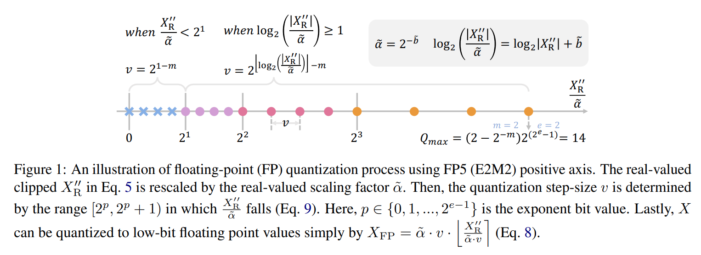

## 3.3 Floating-Point Matrix Multiplication

Floating-point quantized variables 로 matrix multiplication 은 다음과 같이 공식화된다:

$$
\begin{equation}
  \mathbf{O}_{\text{out}}^{i,k} = \mathbf{X}_{\mathrm{FP}}^{i,:} \mathbf{W}_{\mathrm{FP}}^{:,k} = \widetilde{\alpha}_{\mathbf{X}} \widetilde{\alpha}_{\mathbf{W}}^k \widetilde{\mathbf{X}}_{\mathrm{FP}}^{i,:} \widetilde{\mathbf{W}}_{\mathrm{FP}}^{:,k}
\end{equation}
$$

- 여기서 per-tensor activation quantization 과 per-channel weight quantization 에서 $\mathbf{X}_{\mathrm{FP}}^{i,:}$ 는 activation matrix 의 $i^{th}$ row 를 나타내고, 
- $\mathbf{W}_{\mathrm{FP}}^{:,k}$ 는 weight matrix 의 $k^{th}$ column 을 뜻한다. 
- 그래서 output matrix 의 각 요소 $\mathbf{O}_{\text{out}}^{i,k}$ 는 two real-valued scalars $\widetilde{\alpha}_{\mathbf{X}}$ 와 $\widetilde{\alpha}_{\mathbf{W}}^k$ 에 해당 quantized activation 과 weight vectors 를 곱해서 계산된다. 
- 이런 efficient matrix multiplication 을 지원하는 possible quantization granularity 옵션은 모두 Appendix D 에 나와 있다.

# 4 Method

이 섹션에서 저자는 먼저 joint format 과 max value search 를 소개한다. 

이는 strong baseline 을 세우고 이미 8-bit 와 6-bit quantization 에서 SOTA 결과를 낸다. 그 다음 transformer 에서 catastrophic high inter-channel activation variance 를 다루기 위해 efficient **pre-shifted exponent bias** 를 제시하고, quantization 한계를 4-bit 까지 밀어붙인다.

## 4.1 Joint Format and Max Value Search

Post-training quantization 의 objective 는 pre-trained real-valued network 에 quantization 으로 생기는 perturbation ($\delta \mathbf{X} = \mathbf{X}_{\mathrm{FP}} - \mathbf{X}_{\mathrm{R}}$) 을 최소화하는 거다:

$$
\begin{equation}
  \min \mathbb{E} \left[ \mathcal{L} \left( \mathbf{X}_{\mathrm{R}} + \delta \mathbf{X} \right) - \mathcal{L} \left( \mathbf{X}_{\mathrm{R}} \right) \right]
\end{equation}
$$

이 연구에서 저자는 Choukroun et al 이 제시한 설정을 채택한다. 이는 quantized model 의 intermediate output 의 변화와 Eq. 11 사이에 positive correlation 이 있다고 가정한다. 그래서 quantized layer 의 intermediate output ($\hat{\mathbf{O}}$) 과 original layer 의 output ($\mathbf{O}$) 간 distance 를 최소화하면 Eq. 11 을 최소화할 수 있다. 그러므로 objective loss metric 은 다음과 같이 공식화된다:

$$
\begin{equation}
  \min (\hat{\mathbf{O}} - \mathbf{O})^2
\end{equation}
$$

이는 아래 제안된 framework 에서 optimal FP quantization function 을 찾는 데 사용된다.

FP quantization 의 도전은 quantization format 과 clipping range 에 대한 민감도에서 온다. 바람직하지 않은 format 선택은 catastrophic error rate 를 낳는다. 게다가 저자는 optimal clipping range 가 사용된 format 에 따라 다르다는 걸 관찰했다. Kuzmin et al 이 floating-point (FP) quantization-aware training (QAT) 에서 FP format 과 maximum value 를 gradient 로 학습하자고 제안했지만, 저자는 이 방법이 PTQ 에서 over-fitting 에 시달리고, naïve MinMax 방법보다 정확도가 더 나쁘다는 걸 발견했다. 자세한 내용은 Appendix E 에 있다. 대신 저자는 optimal format 과 관련 clipping range 를 함께 결정하는 search-based algorithm 을 제안해서 이 도전을 해결한다.
****
탐색 과정은 Eq. 12 를 최소화하는 metric 으로 layer 별로 진행된다. 각 sub-module 에 해당하는 matrix multiplication 의 output 은 $\mathbf{O} = \mathbf{X} \mathbf{Y}$ 로 표기되며, 여기서 $\mathbf{Y}$ 는 weight tensor $\mathbf{W}$ 나 또 다른 activation tensor 일 수 있다.

$q$-bit FP format 의 search space 는 exponent bit 가 0 인 format 을 제외한 모든 format 을 포함한다. Exponent bit 가 1 인 format 의 quantization 은 이미 INT quantization 으로 퇴화되기 때문이다. 

- 저자는 real-valued exponent bias $\widetilde{b}$ 를 탐색하는데, 이는 scaling factor 의 로그와 같다. $\widetilde{b}_{\mathbf{X}}$ 와 $\widetilde{b}_{\mathbf{Y}}$ 를 Eq. 7 에서 $|\mathbf{X}_{\mathrm{R}}|$ 와 $|\mathbf{Y}_{\mathrm{R}}|$ 의 maximum value 로 $Q_{\max}$ 를 설정해서 초기화한다. 
- 그 다음 $\widetilde{b}_{\mathbf{X}}$ 와 $\widetilde{b}_{\mathbf{Y}}$ 의 search space 를 $[\gamma_1 \widetilde{b}_{\mathbf{X}}^{\text{init}}, \gamma_2 \widetilde{b}_{\mathbf{X}}^{\text{init}}]$와 $[\gamma_1 \widetilde{b}_{\mathbf{Y}}^{\text{init}}, \gamma_2 \widetilde{b}_{\mathbf{Y}}^{\text{init}}]$ 를 선형적으로 $k$ 구간으로 나눠 정의한다. 
- 여기서 $\gamma_1$ 과 $\gamma_2$ 는 경험적으로 0.01과 1.2 로 설정되고, $k = 100$ 이다. 탐색 과정은 Alg. 1에 나와 있다. 

저자는 Yuan et al 이 한 대로 all matrix multiplication layer 에서 quantization scheme 을 병렬로 탐색한다. 알고리즘은 두 부분으로 나눌 수 있다. (1) Forward propagation 을 해서 각 layer $l$ 의 intermadiate raw output 을 저장한다. (2) Reconstruction metric (Eq. 12) 를 최소화하며 각 layer 의 optimal format 과 biases 를 3 rounds 동안 반복 업데이트한다. 이 search-based framework 를 **Floating Point Quantization Baseline** ****(FPQ baseline)이라고 이름 짓고, 이는 이미 8-bit 와 6-bit 설정에서 SOTA 결과를 낸다.

## 4.2 Pre-Shifted Exponent Bias

Transformer architecture 에서 저자는 high inter-channel variance 라는 흥미로운 현상을 관찰했다.

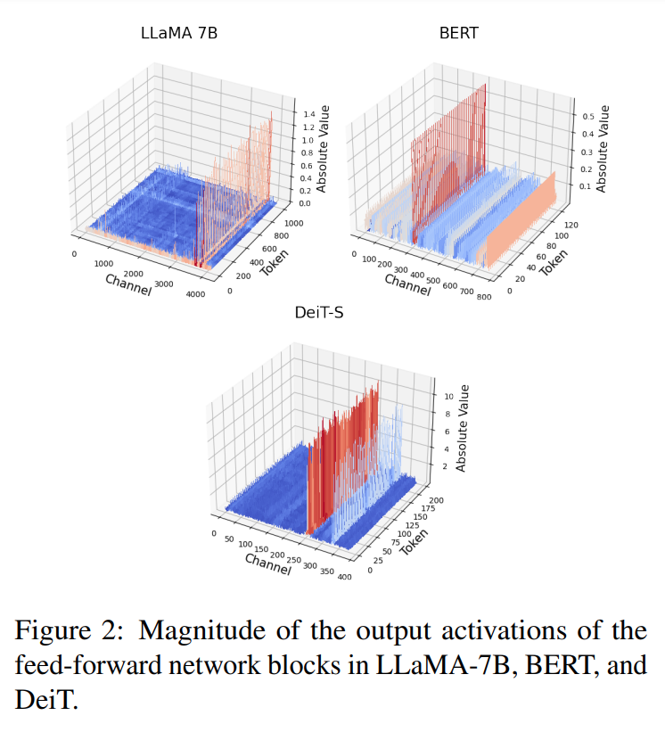

Fig. 2 에 보이듯, 같은 channel 내 값의 크기는 서로 가깝지만, 다른 channel 간에는 큰 차이가 있다. 

- 이 현상은 language models (i.e., LLaMA 와 BERT) 뿐만 아니라 vision transformer 모델에서도 두드러진다. 
- Outlier channel 은 나머지보다 훨씬 크기 때문에 quantized tensor 의 quantization precision 을 지배하고, 크기가 작은 channel 의 representation capacity 를 줄인다. 
- 이는 tensor-wise 나 token-wise scaling factor 로는 정확한 activation quantization 에 충분하지 않다.

하지만 activation 에 per-channel scaling factor 를 적용하면 efficient matrix multiplication 에 문제가 생긴다. Scaling factor 가 multiplication  방향에서 공유된 상수가 아니어서 Eq. 10 처럼 추출할 수 없기 때문이다. 이 도전을 해결하려고 저자는 **pre-shifted exponent bias** 를 소개한다. 

- 이는 activation 에서 per-channel scaling factor 를 계산할 수 있게 해주고, 이 scaling factor 를 해당 weight 의 exponent bias 로 reparameterize 한다. 
- 이 방법은 high inter-channel variance 를 효과적으로 다루면서 per-tensor quantization 과 거의 똑같은 효율성을 유지한다.

Eq. 7 을 떠올리면, 저자는 tensor-wise integer exponent bias $b$ 를 추출해서 real-valued scaling factor $\alpha$ 와 곱했고, 이걸 new scaling factor $\tilde{\alpha} = 2^{-\tilde{b}} = 2^{-b} \cdot \alpha$ 로 만들었다. 그러면 floating-point quantization 공식은 Eq. 13 에서 이렇게 된다:

$$
\begin{equation}
  X_{\mathrm{FP}} = 2^{-\tilde{b}} (-1)^s 2^{p-0} \left(1 + \frac{d_1}{2} + \frac{d_2}{2^2} + \ldots + \frac{d_m}{2^m}\right)
\end{equation}
$$

Bias 가 scaling factor 에 흡수된 후, original bias term ($b^{\text{ori}}$) 은 FP 공식에서 항상 0 이 된다는 걸 주목한다. Inter-channel variance 를 다루기 위해 저자는 이 integer exponent bias 를 새롭게 활용한다: 이걸 per-channel variant ($\mathbf{b}^{\text{ori}} \in \mathbb{Z}^c$) 로 설정한다.

Channel-wise integer bias vector ($\mathbf{b}^{\text{ori}}$) 계산은 아주 간단하다. 먼저 per-channel maximum value 에서 initial per-channel real-valued scaling factor ($2^{-\tilde{b}_j}$) 를 계산한다:

$$
\begin{equation}
  \tilde{\mathbf{b}}_{\mathbf{j}} = 2^e - \log_2 \left( \max \left( \left| \mathbf{X}_{\mathrm{R}}^{:,j} \right| \right) \right) + \log_2 \left( 2 - 2^{-m} \right) - 1
\end{equation}
$$

여기서 $\mathbf{X}_{\mathrm{R}}^{:,j}$ 는 activation matrix 의 $j^{th}$ channel 을 뜻한다. 그 다음 $\tilde{\mathbf{b}}$ 를 tensor-wise real-valued scaling factor 와 channel-wise integer scaling factor 로 나눈다:

$$
\begin{equation}
\begin{aligned}
\tilde{\mathbf{b}} &= \tilde{\rho} + \mathbf{b}^{\text{ori}} \\
&= \tilde{\rho} + \text{clip} \left( \lfloor \tilde{\mathbf{b}} - \tilde{\rho} \rfloor, 0, 2^{e-1} \right)
\end{aligned}
\end{equation}
$$

여기서 $\tilde{\rho} \in \mathbb{R}^1$, $\mathbf{b}^{\text{ori}} \in \mathbb{Z}^c$ 다. 그러면 $\mathbf{X}$ 의 $j^{th}$ channel 에 있는 하나의 항 공식은 이렇게 다시 쓸 수 있다:

$$
\begin{equation}
\begin{aligned}
X_{\mathrm{FP}} &= 2^{-\tilde{\mathbf{b}}_j} (-1)^s 2^{p-0} \left(1 + \frac{d_1}{2} + \ldots + \frac{d_m}{2^m}\right) \\
&= 2^{-\tilde{\rho}} (-1)^s 2^{p - \mathbf{b}_j^{\text{ori}}} \left(1 + \frac{d_1}{2} + \ldots + \frac{d_m}{2^m}\right)
\end{aligned}
\end{equation}
$$

Bias $\mathbf{b}^{\text{ori}}$ 는 $[0, 2^e - 1]$ 범위의 integer 로 제한되는데, 이건 standard floating-point number 계산과 호환된다. 그래도 inference 중에 각 channel 마다 다른 bias 를 더하면 hardware 연산이 추가로 필요할 수 있다. 그래서 저자는 per-channel activation bias 를 weight tensor 로 reparameterize 하고, calibration set 을 사용해서 weight 를 미리 계산한다. 이렇게 하면 exponent bias shifting 은 calibration 단계에서만 일어난다. 그러면 activation tensor $X$ 의 $j^{th}$ channel 에 있는 요소는 이렇게 된다:

$$
\begin{equation}
  X_{\mathrm{FP}} = 2^{-\tilde{\rho}} (-1)^s 2^{p-0} \left(1 + \frac{d_1}{2} + \ldots + \frac{d_m}{2^m}\right)
\end{equation}
$$

그리고 weight tensor $W$ 의 $j^{th}$ row 에 해당하는 weight 요소는 이렇게 된다:

$$
\begin{equation}
  W_{\mathrm{FP}} = 2^{-\tilde{\mathbf{b}}^W} (-1)^s 2^{p - \mathbf{b}_j^{\text{ori}}} \left(1 + \frac{d_1}{2} + \ldots + \frac{d_m}{2^m}\right)
\end{equation}
$$

결과적으로 Eq. 10 의 efficient matrix multiplication 은 이렇게 다시 공식화된다:

$$
\begin{equation}
\mathbf{O}_{\text{out}}^{i,k} = \mathbf{X}_{\mathrm{FP}}^{i,:} \mathbf{W}_{\mathrm{FP}}^{:,k} = \tilde{\alpha}_{\mathbf{X}} \tilde{\alpha}_{\mathbf{W}}^j \widetilde{\mathbf{X}}_{\mathrm{FP}}^{i,:} \left( \boldsymbol{\beta} \odot \widetilde{\mathbf{W}}_{\mathrm{FP}}^{:,k} \right)
\end{equation}
$$

여기서 $\odot$ 는 element-wise multiplication 이고, $\boldsymbol{\beta} = 2^{-\mathbf{b}^{\text{ori}}}$ 이며, $\left( \boldsymbol{\beta} \odot \widetilde{\mathbf{W}}_{\mathrm{FP}}^{j,k} \right)$ 는 미리 계산돼서 low-bit FP format 으로 저장될 수 있다.

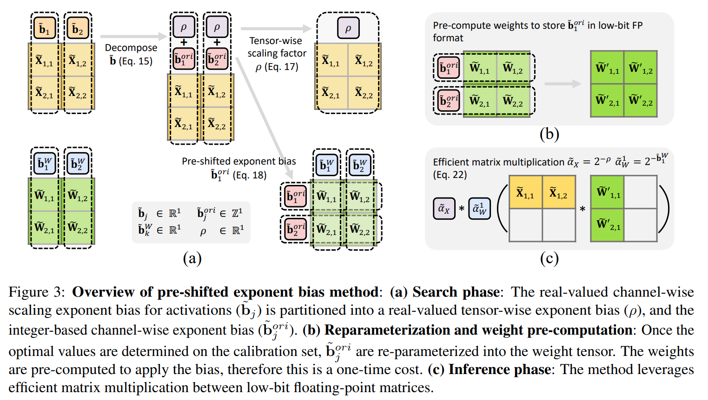

전체 **pre-shifted exponent bias** 방법은 Fig. 3 에 나와 있다. 이 방법은 all fully-connected layer 를 양자화하는 데 적용된다. 탐색 과정에서 $\tilde{\rho}_{\mathbf{X}}$ 를 $\min_j \left( \tilde{\mathbf{b}}_j \right)$ 로 초기화한다. 그 다음 $\tilde{\mathbf{b}}_{\mathbf{X}}$ 를 Eq. 14 에서 계산된 bias 로 고정하고, $\left[ \gamma_1 \tilde{\rho}_{\mathbf{X}}^{\text{init}}, \gamma_2 \tilde{\rho}_{\mathbf{X}}^{\text{init}} \right]$ 에서 optimal $\tilde{\rho}_{\mathbf{X}}$를 찾는다.

pre-shifted exponent bias 방법과 joint format 및 max-value search framework (FPQ baseline) 을 결합하여, 저자는 Floating Point Quantization (FPQ) 라 명명한다.

# 5 Experiments

제안된 방법의 효과를 검증하려고 LLaMA 와 BERT 모델에 대해 Sec. 5.2.1 과 Sec. 5.2.2 에서 실험을 한다. 더 나가서 Sec. 5.2.3 에서 저자의 방법이 vision transformer architecture 에도 잘 일반화된다는 걸 보여준다. 

Sec. 5.3 에서는 calibration size 와 search range 에 대한 ablation studies 를 제시하고, Sec. 5.4 에서는 FP operators 구현의 hardware costs 를 분석한다.

## 5.1 Experiments Details

저자는 activation 에 per-tensor quantization 을 쓰고 weight 에는 per-channel quantization 을 채택한다. 

Yuan et al 이 한 설정을 따라 layer reconstruction 을 사용하고, Bai et al 이 제시한 접근법을 기반으로 parallel quantization 을 한다. 저자의 구현 결정에 대한 더 자세한 논의는 Appendix F 에 있다. 

LLaMA 모델의 경우, Xiao et al 이 한 이전 작업과 공정하게 비교하려고 fully-connected layer 의 all weights 와 activation tensor 를 양자화한다. BERT 와 ViT 모델에서는 fully-connected layer 와 self-attention module 의 activation-activation multiplication tensor 를 모두 양자화한다. 

BERT 와 ViT 모델에서 FPQ 를 할 때 reconstruction metric Eq. 12 는 Hessian approximation loss metric 으로 대체된다. 이 대체에 대한 자세한 내용은 Appendix A 에 있다.

## 5.2 Main Results

### 5.2.1 LLM Zero-Shot Reasoning

우리는 FPQ 의 효과를 LLaMA-7B/LLaMA-13B 를 대상으로 common sense zero-shot reasoning tasks 에서 평가하였다. 

calibration data 로는 GPTQ 의 설정을 따르며, C4 dataset 에서 길이가 2048 tokens 인 32 random segments 를 샘플링하였다. 데이터 전처리 및 점수 계산은 EleutherAI 의 평가 도구를 기반으로 수행되었다.

Tab. 1 에서 저자는 FPQ 를 floating point PTQ baselines, SOTA PTQ 및 QAT (quantization-aware training) 기법과 비교하였다. 비교 대상에는 SmoothQuant, GPTQ, 및 LLM-QAT 이 포함된다.

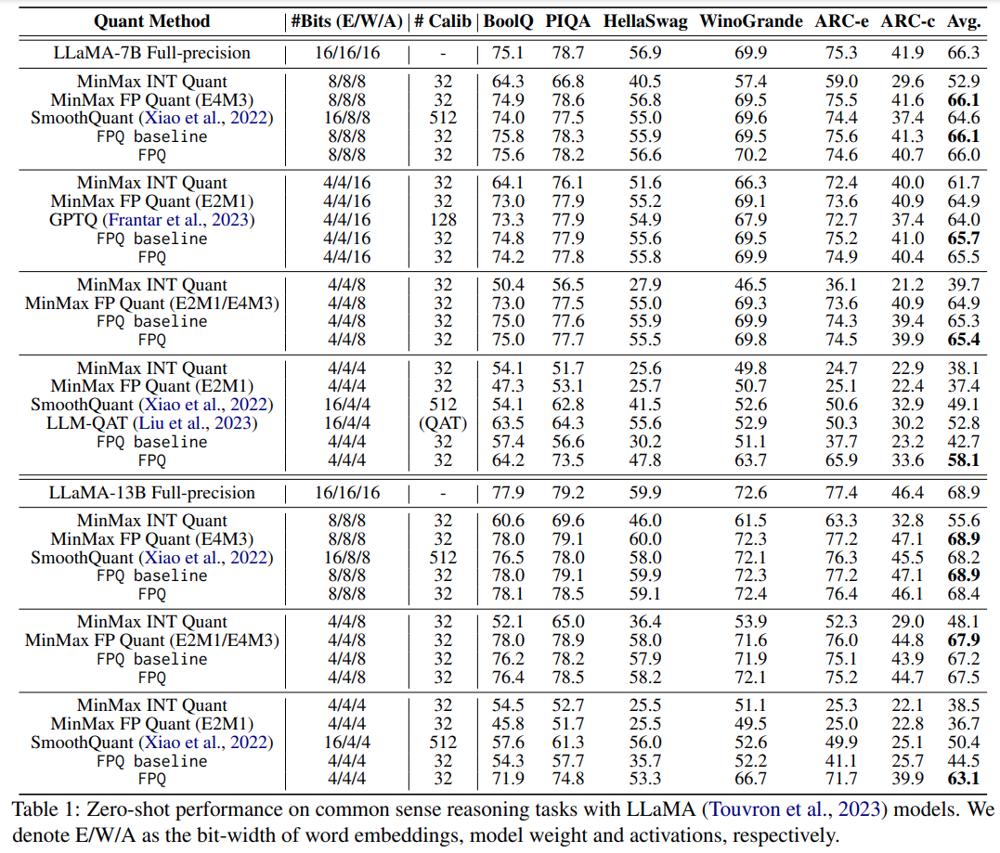

- 일반적으로 naïve MinMax INT Quantization 을 빼면 모든 방법이 8-bit 설정에서 LLaMA-7B/LLaMA-13B 둘 다 비슷한 결과를 낸다. 
- 또 naïve MinMax FP Quantization 은 거의 손실 없는 결과를 내고, SOTA integer post-training quantization 방법인 SmoothQuant 보다도 낫다는 걸 관찰했다. 
- 이건 floating-point quantization 이 transformer 의 distributions 를 다루는 데 자연스럽게 강력한 능력이 있다는 걸 보여준다. 하지만 MinMax FP Quant 와 FPQ baseline 은 quantization precision 를 극단적인 4/4/4 bit setting 으로 밀어붙이면 실패한다. 
- LLaMA-7B 에서 각각 28.9% 와 23.8% 정확도 하락을 보인다. 이런 극단적인 경우, 이전 SOTA PTQ 와 QAT 방법인 SmoothQuant 와 LLM-QAT 도 심각한 정확도 저하를 겪는다. 
- 반면에 FPQ 는 extra-low bit setting 을 잘 다루는 강력한 능력을 보여줘서, 4/4/4 bit-width 에서 LLaMA-7B/13B 에 대해 8.2/5.8% 정확도 하락만 보인다. 
- 이건 SmoothQuant 를 큰 차이로 앞서면서도 bit width 과 calibration size 가 더 작다. 
- 게다가 FPQ 는 4/4/4 setting 에서 LLM-QAT 보다 5.3% 정확도 향상을, 4/4/16 configuration 에서 GPTQ 보다 1.5% 더 나은 결과를 LLaMA-7B 에서 낸다.

실무자한테 중요한 건 다양한 bit width 에 맞는 quantization 방법을 정하는 거다. 그래서 저자의 발견을 바탕으로 정확도와 search/optimization efficiency 사이의 trade-off 를 맞춘 두 가지 추천을 준다. 

먼저 8/8/8 setting 에서 MinMax FP Quant 와 다른 방법 간 차이가 크지 않으니까, 탐색 과정이 없는 MinMax FP Quant 방법을 8/8/8 setting 에 간단히 쓰라고 추천한다. 하지만 더 까다로운 상황, 특히 activation 을 4-bit 로 양자화할 때는 정확도 하락을 최소화하면서 inference overhead 가 거의 없는 FPQ 를 쓰라고 추천한다.

### 5.2.2 BERT Model

저자는 제안된 quantization 기술을 BERT 모델에 대해 GLUE 작업으로 평가한다. Full-precision BERT-base model 은 Huggingface 에서 GLUE dataset 에 fine-tuning 된 걸 가져왔다. training set 에서 128 sample data 를 뽑아서 calibration set 으로 썼다.

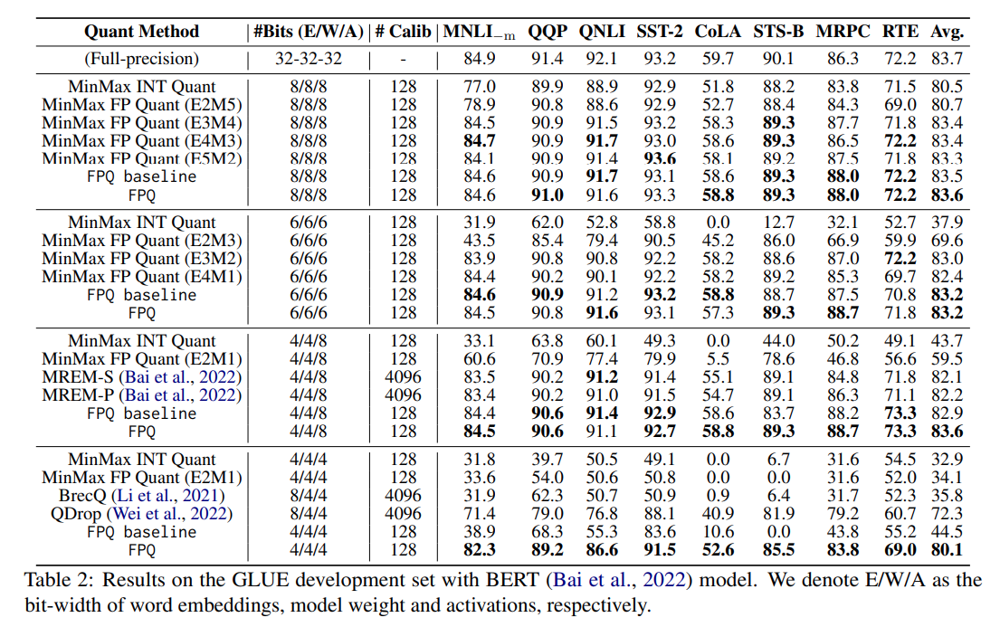

- Tab. 2 에서 FPQ 는 놀라운 성능을 보여줘서, 4/4/4 bit setting 에서 BrecQ 보다 평균 정확도가 44.3%, QDrop 보다 7.9% 절대적인 향상을 낸다. 
- 또 4-bit weight 와 8-bit activation 에서 MREM-S/MREM-P 는 4096 calibration data 로 full-precision model 과 1.6/1.5% 정확도 차이를 보이는데, FPQ 는 단 128 calibration data 로 거의 정확도 손실 없이 결과를 낸다.

### 5.2.3 Generalizability on Vision Transformer

Vision transformer 도 language transformer 와 일관된 activation distribution pattern 을 보인다는 발견을 바탕으로, 이건 high inter-channel variance 와 low intra-channel variance 로 특징지어진다 (Fig. 2에 자세히 나옴). 

그래서 저자는 제안된 방법을 ViT 에 확장하고, FPQ 를 floating-point PTQ baseline 과 ViT 에 대한 SOTA PTQ 방법과 ImageNet classification task 에서 비교했다. 

Tab. 3 은 ViT 에서 나온 결과가 language model 과 일치한다는 걸 보여준다. 

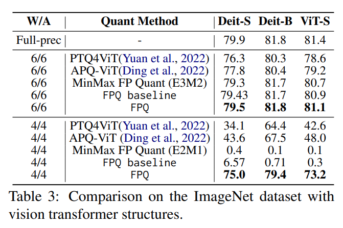

이전 SOTA integer-based method 는 transformer 를 lower bit 로 양자화할 때 합리적인 정확도를 유지하는 데 어려움을 겪었다. 반면에 제안된 FPQ 는 6-bit 에서 PTQ4ViT 와 APQ-ViT 를 앞섰고, 4-bit 구성에서 DeiT-S 에 대해 PTQ4ViT 보다 40.9%, APQ-ViT 보다 31.5% 절대적인 정확도 향상을 냈다.

## 5.3 Ablation Studies

이 섹션에서 먼저 FPQ 에 다른 calibration size 가 미치는 영향을 비교한다. Calibration size 를 {32, 64, 128, 256} 으로 바꿔서 MNLI, QQP, CoLA 에서 테스트했다. 

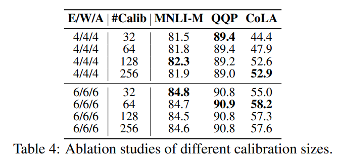

- Tab. 4 는 MNLI 와 QQP 평가가 다른 설정에 더 robust 하고, CoLA 에서 variance 가 더 크다는 걸 보여준다. 
- FPQ는 128개 데이터로 된 calibration 세트에서 잘 작동하는 걸 봤다. 하지만 calibration 데이터에 접근이 제한적일 때, 예를 들어 32개 데이터만 써도 robust하게 경쟁력 있는 정확도를 유지한다는 걸 발견했다.

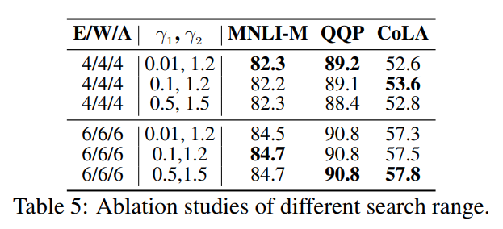

FPQ 가 다른 search range ($\gamma_1, \gamma_2$) 에 얼마나 robust 한지도 조사했다. 

- Tab. 5 는 ($\gamma_1, \gamma_2$) 를 (0.01, 1.2), (0.1, 1.2), (0.5, 1.5) 세 가지로 설정해서 MNLI, QQP, CoLA 에서 FPQ 결과를 보여준다. 
- 어떤 search range 도 모든 작업에서 꾸준히 나머지를 앞서지 않는다는 걸 봤다. 예를 들어 4-bit 구성에서 (0.01, 1.2) 는 MNLI 와 QQP 에서 (0.5, 1.5)보다 나은데, CoLA 에서는 약간 더 나쁘다. 
- 전체적으로 FPQ 는 search range 가 너무 과감하지 않으면 다양한 $\gamma_1$ 과 $\gamma_2$ 에 robust하다.

## 5.4 Hardware Cost

Low-bit INT, FP, mixed-format FP multiplication operator 의 hardware 사용량을 adder, multiplier, multiply-accumulate (MAC) units 기준으로 hardware area로 더 조사했다. Mixed-format FP 는 서로 다른 format 의 floating-point number multiplication 을 뜻한다 (e.g., E2M1과 E1M2 multiplies). MAC operator 는 Verilog HDL 로 구현했고, Cadence Genus 로 TSMC 40nm 기술과 0.5GHz 클럭 주파수에서 합성된 area를 구했다.

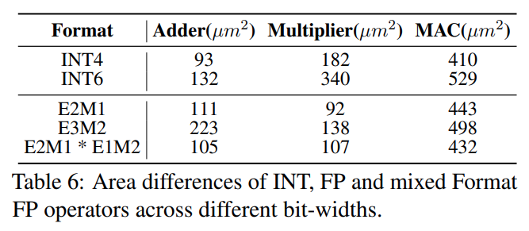

Tab. 6 은 INT 와 FP operator 의 hardware 비용을 보여준다. 

- INT 는 multiplier 가 주 비용이고, FP 는 adder 가 크다. FP4 와 INT4 adder 의 차이는 작지만, INT 는 multiplier 에서 hardware 비용이 두 배다. 
- 게다가 mixed-format FP4 operator 는 standard FP4 operator 와 비슷한 hardware area 를 가진다. 
- 이 발견은 제안된 FPQ 가 standard FP operator 와 비교해 hardware 구현에서 무시할 만한 overhead 만 생기고, FP 의 hardware 비용이 INT와 비슷하다는 걸 보여준다.

# 6 Conclusion

이 논문은 natural language transformer architecture 에서 weight, activation, embedding 을 4-bit floating-point 로 post-training quantization 한 첫 성공적인 시연을 제시한다. 이는 large language models 와 BERT 모델을 포함한다. 

저자는 이 방법을 vision transformer 에도 확장했고, 그 strong generalization 능력을 관찰했다. 저자의 접근법은 실용적인 search-based 기법을 포함하며, 6-bit 와 8-bit quantization 에서 SOTA 결과를 내는 strong baseline 을 세운다. 게다가 transformer 의 high inter-channel variance 문제를 pre-shifted exponent bias 를 제안해서 해결했고, 이는 4-bit quantization 에서 매우 효과적이다.

# Limitations

저자의 실험은 공개된 dataset 에서 finite sentence lengths 로 진행되었고, 극단적인 long sequence 나 streaming data 에 대한 방법의 일반화 가능성은 검증되지 않았다. 이는 추가 조사가 필요할 수 있다. 게다가 제안된 방법이 language 와 vision 외의 domain, 예를 들어 audio 에 어떻게 일반화될지는 아직 확인되지 않았다. 저자의 방법이 generative tasks 와 다른 응용에 적용 가능성도 흥미롭게 볼 만하다.

# Appendix

## A Hessian-Based Loss Metric

Post-training quantization 의 목표는 pre-trained real-valued network 에 quantization 으로 생기는 perturbation ($\delta \mathbf{X} = \mathbf{X}_{\mathrm{FP}} - \mathbf{X}_{\mathrm{R}}$)을 최소화하는 거다:

$$
\begin{equation}
  \min \mathbb{E} \left[ \mathcal{L} \left( \mathbf{X}_{\mathrm{R}} + \delta \mathbf{X} \right) - \mathcal{L} \left( \mathbf{X}_{\mathrm{R}} \right) \right]
\end{equation}
$$

Taylor series expansion 을 따라가면:

$$
\begin{equation}
\begin{aligned}
&\mathbb{E} \left[ \mathcal{L} \left( \mathbf{X}_{\mathrm{R}} + \delta \mathbf{X} \right) - \mathcal{L} \left( \mathbf{X}_{\mathrm{R}} \right) \right] \\
\approx &\delta \mathbf{X}^T \bar{\mathbf{g}}^{(\mathbf{X})} + \frac{1}{2} \delta \mathbf{X}^T \bar{\mathbf{H}}^{(\mathbf{X})} \delta \mathbf{X} \\
\approx &\frac{1}{2} \delta \mathbf{X}^T \bar{\mathbf{H}}^{(\mathbf{X})} \delta \mathbf{X}
\end{aligned}
\end{equation}
$$

여기서 $\bar{\mathbf{g}}^{(\mathbf{X})}$ 는 gradient 이고, $\bar{\mathbf{H}}^{(\mathbf{X})}$ 는 Hessian matrix 다. 

pre-trained model 이 잘 수렴되었으므로 $\bar{\mathbf{g}}^{(\mathbf{X})}$ 의 각 요소가 거의 0 이라고 가정할 수 있고, 그래서 $\delta \mathbf{X}^T \mathbf{g}^{(\mathbf{X})}$ term 은 무시할 수 있다.

Hessian matrix $\bar{\mathbf{H}}^{(\mathbf{X})}$ 는 다음과 같이 계산된다:

$$
\begin{equation}
  \bar{\mathbf{H}}^{(\mathbf{X})} = \mathbf{J}_{\mathbf{O}}^T (\mathbf{X}) \bar{\mathbf{H}}^{(\mathbf{O})} \mathbf{J}_{\mathbf{O}} (\mathbf{X})
\end{equation}
$$

여기서 $\mathbf{J}_{\mathbf{O}} (\mathbf{X})$ 는 layer output $\mathbf{O}$ 에 대한 $\mathbf{X}$ 의 Jacobian matrix 이고, $\bar{\mathbf{H}}^{(\mathbf{O})}$ 는 $\mathbf{O}$ 에 대한 Hessian matrix 다.

이걸 Eq. 21 에 다시 대입하면:

$$
\begin{equation}
\begin{aligned}
&\delta \mathbf{X}^T \bar{\mathbf{H}}^{(\mathbf{X})} \delta \mathbf{X} \\
= &\left( \mathbf{J}_{\mathbf{O}} (\mathbf{X}) \delta \mathbf{X} \right)^T \bar{\mathbf{H}}^{(\mathbf{O})} \left( \mathbf{J}_{\mathbf{O}} (\mathbf{X}) \delta \mathbf{X} \right) \\
\approx &(\hat{\mathbf{O}} - \mathbf{O})^T \bar{\mathbf{H}}^{(\mathbf{O})} (\hat{\mathbf{O}} - \mathbf{O})
\end{aligned}
\end{equation}
$$

여기서 $\hat{\mathbf{O}}$는 quantized layer 의 intermediate output 이고, $\mathbf{O}$ 는 original layer output 이다. $\delta \mathbf{X}$ 가 상대적으로 작다고 가정하면 (Li et al 주장), $(\hat{\mathbf{O}} - \mathbf{O})$ 를 first-order Taylor expansion 으로 $\mathbf{J}_{\mathbf{O}} (\mathbf{X}) \delta \mathbf{X}$ 로 근사할 수 있다.

그럼에도 $\bar{\mathbf{H}}^{(\mathbf{O})}$ 계산은 여전히 부담스럽다. 그래서 Li et al 이 한 대로 $\bar{\mathbf{H}}^{(\mathbf{O})}$ 를 $\mathbf{O}$ 의 Fisher Information Matrix 의 diagonal entries 로 대체하고, new Hessian-based metric 은 다음과 같이 된다:

$$
\begin{equation}
  \mathbb{E} \left[ (\hat{\mathbf{O}} - \mathbf{O})^T \operatorname{diag} \left( \left( \frac{\partial L}{\partial \mathbf{O}_1} \right)^2, \ldots, \left( \frac{\partial L}{\partial \mathbf{O}_n} \right)^2 \right) (\hat{\mathbf{O}} - \mathbf{O}) \right]
\end{equation}
$$

여기서 $\mathbf{O}$의 각 항은 독립적이라고 가정하고, $n$은 $\mathbf{O}$의 총 요소 수를 뜻한다. 이 연구에서 이 Hessian-based metric 은 BERT 와 Vision Transformer 모델에서 layer-wise reconstruction 을 할 때 weight 와 activation 모두에 대한 optimal FP quantization function 을 찾는 reconstruction metric 으로 사용된다.

## B Quantization Error of Different Floating-Point Formats

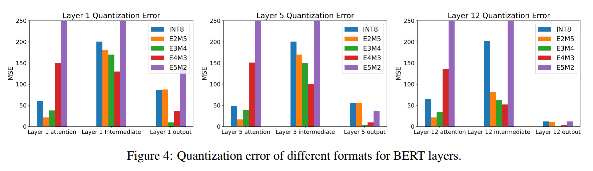

Fig. 4 는 8-bit quantization 에서 INT8, E2M5, E3M4, E4M3, E5M2 등 서로 다른 format 의 quantization error 를 비교한다. 

이 format 을 BERT 의 첫 번째, 다섯 번째, 마지막 layer 의 서로 다른 module 에 적용했다. 그림은 optimal FP format 이 양자화하는 특정 module 에 따라 다르다는 걸 보여준다.

## C Inter-Channel Variance Visualization

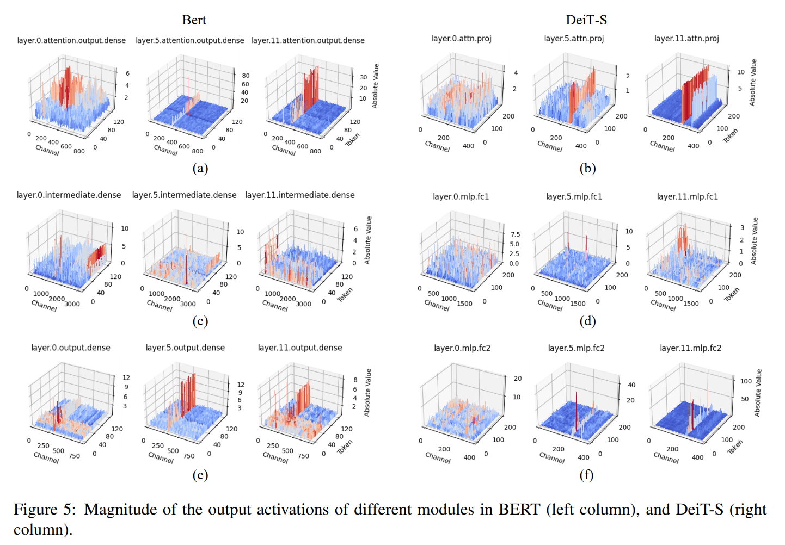

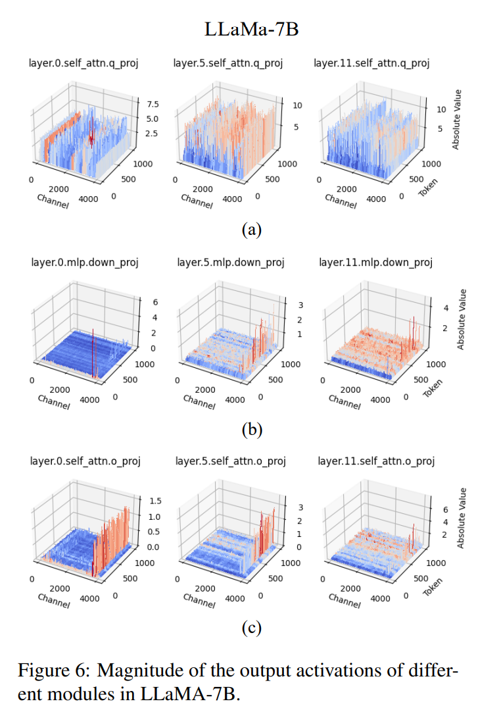

Fig. 5 와 Fig. 6 은 MNLI task 의 BERT, ImageNet-1K task 의 DeiT-S, zero-shot reasoning task 의 LLaMA-7B 에서 서로 다른 fully-connected layer 의 출력을 나타낸다. 

시각화는 language 와 vision transformer 모두에서 뚜렷한 inter-channel variance 를 보여준다.

## D Efficient Matrix Multiplication

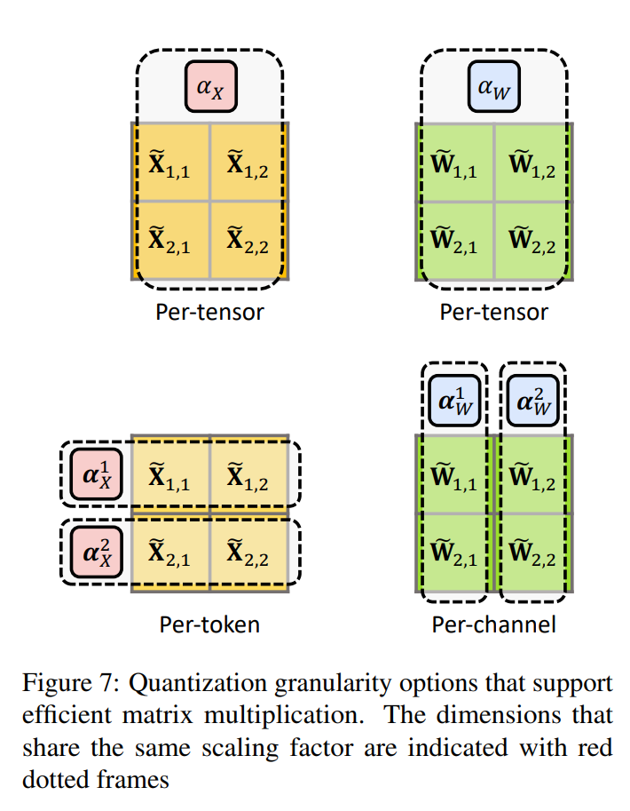

Fig. 7 은 efficient matrix multiplication 을 가능하게 하는 모든 granularity 옵션의 포괄적인 목록을 보여준다. 

Per-token quantization 은 이론적으로 quantization granularity 면에서 더 큰 정밀도를 제공하지만, 이 방법으로 얻는 정확도 증가는 미미하고 additional computational overhead 를 정당화하지 않는다. 그래서 저자는 activation 을 양자화할 때 per-tensor quantization 을 선택했다.

## E Learning Format and Maximum Value

저자는 Kuzmin et al 이 한 이전 gradient-based 방법과 제안된 search-based 방법을 비교해서 optimal format 과 maximum value 를 찾는다. 

DeiT-S 에서 learnable 방법은 8-bit quantization model 로 ImageNet 에서 74.38% 정확도만 달성하지만, FPQ 는 거의 손실 없는 79.88% 결과를 낸다. Kuzmin et al 에서 유도된 exponent bits $e$ 에 대한 gradient 를 분석하면 exponent bits 가 바뀔 때마다 gradient 가 지수적으로 변해서 높은 불안정성을 초래한다. 이 관찰을 바탕으로 저자는 post-training quantization (PTQ)에서 optimal format 을 결정하려면 search-based 방법을 쓰는 게 중요하다고 주장한다.

## F Reconstruction Choices

Integer post-training quantization 에 대한 이전 작업은 target model 을 sub-module 로 나누고 각각을 별도로 재구성한다. 

이는 제한된 unlabeled calibration data 만 있는 상황에서 over-fitting 문제를 해결한다. 이 연구에서 저자는 layer-wise reconstruction 과 parallel quantization 이 floating-point PTQ 에 가장 잘 맞는다는 걸 발견했다:

#### Layer Reconstruction

최근 연구 (Li et al, Bai et al)는 reconstruction granularity 를 layer reconstruction 에서 block reconstruction 또는 larger granularity 로 늘리자고 제안한다. 

이는 각 module 내 all linear layer 나 matrix multiplication 구성 요소를 공동으로 최적화해서 layer 간 reconstruction error 전파를 막는다. 하지만 저자는 reconstruction granularity 를 늘려도 FPQ baseline 의 정확도가 개선되지 않고 때로는 더 나쁜 결과를 낳는다는 걸 관찰했다. 그래서 layer reconstruction 을 선택한다.

#### Parallel Quantization

Sequential quantization 은 가장 흔히 쓰이는 접근법으로, module 을 순차적으로 양자화하고 현재 calibrating module 의 input 은 이전에 양자화된 모든 module 로 생성된다. 하지만 Yuan et al 과 Bai et al 이 new parallel quantization framework 를 제안했다. 이 framework 는 full-precision module 의 raw 출력을 input 으로 사용하고, 각 module 의 calibration 을 서로 독립적으로 만든다. 이 작업에서 저자는 parallel quantization 을 사용한다. 이는 sequential 방식보다 더 나은 결과를 낸다.