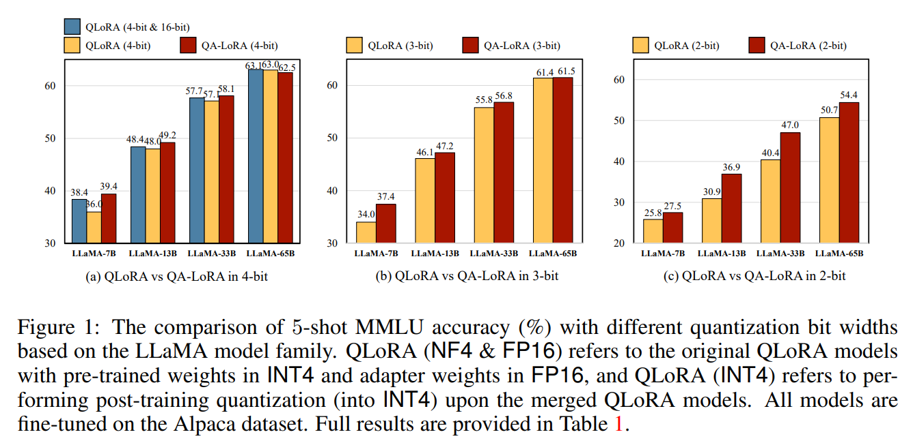
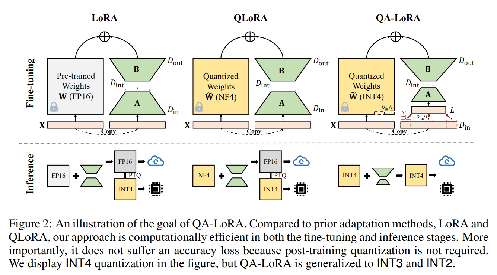
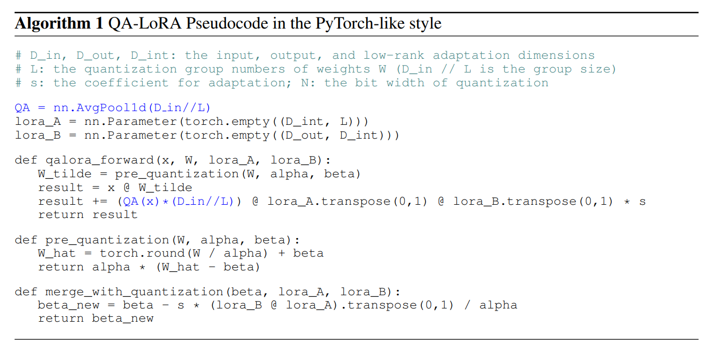
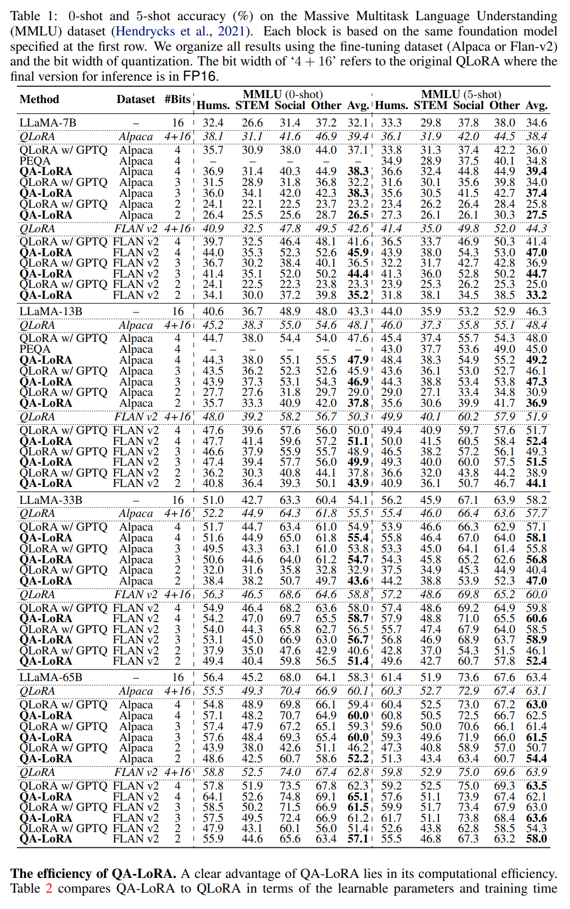
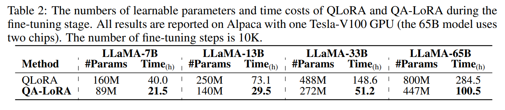
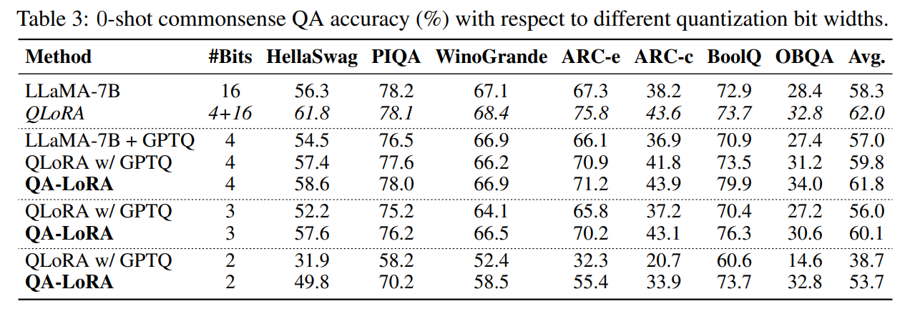
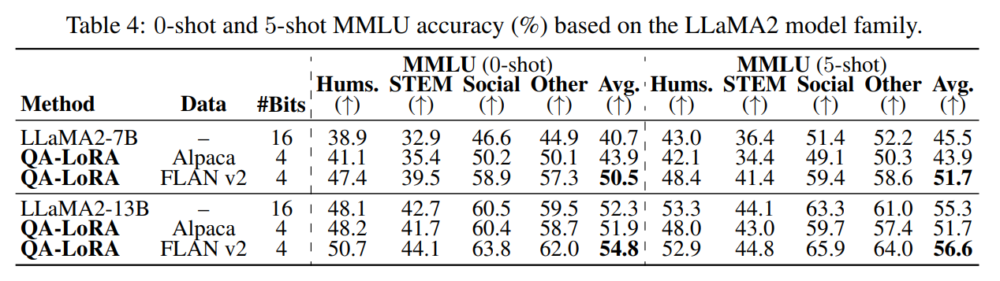
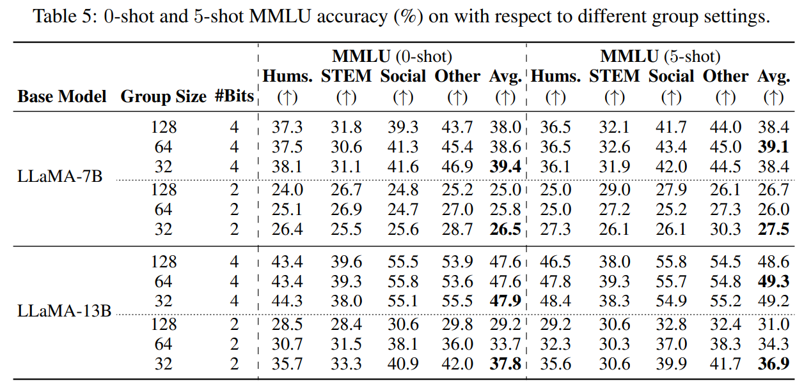
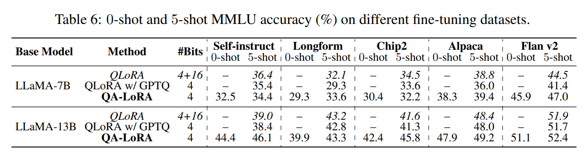
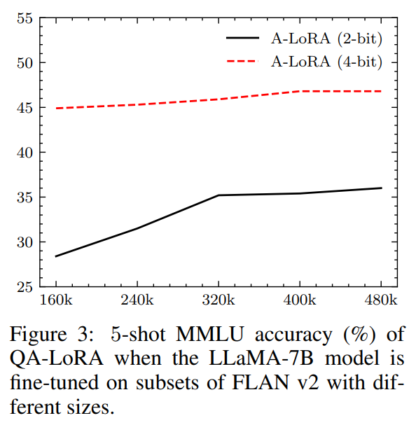

논문 및 이미지 출처 : <https://arxiv.org/pdf/2309.14717>

# Abstract

최근 몇 년간 large language models (LLMs) 는 급격한 발전을 이뤄왔다. 많은 language-understanding tasks 에서 뛰어난 능력을 갖추었음에도, 막대한 computational 부담 때문에 특히 edge devices 에 배포해야 하는 경우 LLM 의 활용이 크게 제한된다. 

본 논문에서는 **quantization-aware low-rank adaptation (QA-LoRA)** 알고리즘을 제안한다. 이 알고리즘의 동기는 quantization 과 adaptation 간의 freedom 에 불균형하다는 점에서 출발하며, 이를 해결하기 위해 **group-wise operators** 를 사용하여 quantization freedom 을 높이는 동시에 adaptation freedom 를 줄인다.  

QA-LoRA 는 간단한 몇 줄의 코드만으로 구현 가능하며, 기존 LoRA 에 다음과 같은 두 가지 능력을 부여한다:  
(i) fine-tuning 하는 동안, LLM weights 를 quantized (e.g., INT4) 하여 시간과 memory usage 를 줄인다.  
(ii) fine-tuning 이 끝난 뒤, LLM 과 auxiliary weights 가 accuracy loss 없이 자연스럽게 quantized model 로 통합된다.

저자는 QA-LoRA 를 LLaMA 와 LLaMA2 model family 에 적용하고, 다양한 fine-tuning dataset 및 downstream scenario 에서 그 효용성을 검증했다.

# 1 Introduction

최근 large language models (LLMs) 는 매우 광범위한 language understanding task 에서 전례 없는 성능을 보이며, SOTA chat system 의 기반이 되어왔다. 실제 환경에서의 다양한 응용을 고려할 때, LLM 을 여러 시나리오에 맞춰 finetuning 하고, 이후 edge device (e.g., mobile) 에 배포하기 위해 quantization 하는 파이프라인이 중요하다. 하지만 방대한 수의 parameters 로 인한 막대한 계산 비용이 문제로 대두된다.  

이를 해결하기 위한 연구는 두 갈래로 진행되어왔다. 1) parameter-efficient fine-tuning (PEFT) 으로, 전체 pre-trained parameters 중 소수만 학습 가능하게 두는 것이다. 이 중에서도 많은 주목을 받은 **Low-rank Adaptation (LoRA)** 는 low-rank matrix 를 학습해 pretrained weights 를 보완하도록 설계되었다. 그러나 full-parameter finetuning 에 견줄 만한 성능을 보임에도, base LLM 의 크기가 큰 경우 (e.g., LLaMA-65B) 여전히 큰 메모리를 요구한다. 2) trained weights 를 low-bit integer 나 floating point number 로 quantize 하는 parameter quantization 연구다. 이는 계산 부담을 줄여주지만, quantization bit 수가 낮을수록 정확도가 저하되는 문제가 빈번히 보고된다.

결과적으로, PEFT 와 quantization 을 통합하는 것은 중요한 연구 주제가 되었다. 가장 단순한 방법은 PEFT 후에 **post-training quantization (PTQ)** 를 적용하는 것이지만, low-bit quantization 에서는 정확도 저하가 뚜렷하게 나타난다. 기존의 고급 기법들은 finetuning 단계에서 많은 계산 비용이 들거나, finetuning 이 끝난 뒤 quantized 상태를 유지하지 못하는 한계를 갖고 있다.  

본 논문에서는 이러한 문제들을 해결하기 위해 **quantization-aware low-rank adaptation (QA-LoRA)** 라는 간단하면서도 효과적인 방법을 제안한다. 핵심 아이디어는 **quantization 과 adaptation 의 freedom 가 불균형하다는 점**에 착안한 것이다. 구체적으로, pretrained weight matrix 의 각 column 은 단 하나의 scaling 과 zero parameter 를 갖지만, LoRA parameter 는 훨씬 많이 존재한다. 이 불균형은 1) LLM 의 정확도를 해치는 large quantization error 를 야기하고, 2) auxiliary weights 를 main model 에 통합하기 어렵게 만든다. 이에 QA-LoRA 는 **group-wise operator** 를 도입해 low-bit quantization freedom 를 높이는 동시에 (각 group 을 개별적으로 quantize) LoRA freedom 을 낮춘다 (각 group 이 adaptation parameters 를 공유). 이를 통해 QA-LoRA 는 다음과 같은 두 가지 장점을 얻는다: (i) LLM 의 weight 가 low-bit integer 로 quantized 되므로 finetuning 시 매우 효율적, (ii) finetuning 이후 PTQ 없이도 정확도 손실 없이 가벼운 finetuned model 을 얻을 수 있다.

QA-LoRA 는 구현이 간단하며 폭넓은 상황에 적용 가능하다. 저자는 QA-LoRA 를 LLaMA 와 LLaMA2 model family 에 적용하고, 다양한 language understanding benchmark 에서 성능을 검증했다. Fig. 1 은 Alpaca dataset 으로 finetuning 했을 때, QA-LoRA 와 baseline 인 QLoRA (PTQ 적용 여부에 따라) 의 MMLU benchmark 5-shot accuracy 를 비교한 결과다. QA-LoRA 는 규모가 다른 여러 LLM 에서 QLoRA + PTQ 를 일관되게 상회하며 (quantization bit 수가 낮을수록 이 점이 더 두드러짐), QLoRA - PTQ 와는 비슷한 성능을 낸다. 특히 inference 시에는 QA-LoRA 가 QLoRA + PTQ 와 동일한 복잡도를 가지며, QLoRA - PTQ 보다 훨씬 효율적이다. 따라서 QA-LoRA 는 LLM 의 quantization 과 adaptation 을 동시에 처리하는 효과적이고 바로 활용 가능한 방법으로 자리매김한다.

# 2 Related Work

#### Large language models (LLMs)

LLMs 는 language processing 에서 매우 중요한 패러다임으로 떠오르면서, 다양한 task 에서 SOTA 성능을 보이고 여러 chat system 의 기반이 되었다. 그러나 실제 환경에서의 활용은 inference 시에 요구되는 높은 계산 및 메모리 요구 사항으로 인해 제한을 받는다. 이를 해결하기 위해 distillation, quantization, pruning 등의 다양한 기법들이 제안되었다. 

본 논문에서는 그중에서도 LLMs 의 quantization 에 주목한다.

#### Fine-tuning LLMs with adapters

Parameter efficient fine-tuning (PEFT) 는 LLMs 를 효율적으로 finetuning 하기 위한 핵심 주제다. 가장 널리 쓰이는 방법 중 하나인 low-rank adaptation (LoRA) 는 adapter weights 를 two low-rank matrix 로 분해하여 parameter efficiency 를 높이고자 한다. LoRA 는 전체 파라미터를 모두 fine-tuning 하는 방식과 견줄 만한 성능을 내면서도, learnable parameter 수가 훨씬 적다. 이 외에도 series adapter 나 parallel adapter 와 같은 다양한 adapter 방법이 제안되었다.

#### Quantization of LLMs

Quantization 은 LLMs 의 parameters 나 activations 의 bit width 를 줄여 efficieny 과 scalability 를 height 는 compression 기법이다. 기존 방법들은 주로 inference stage 에서 quantized LLMs 의 accuracy 를 보존하거나 복원하는 데 집중했으며, 이는 LLM 을 다시 training 하지 않고도 memory footprint 와 computational cost 를 줄이는 것을 핵심으로 삼는다. quantization 시 가장 큰 도전 과제 중 하나는 parameter distribution 의 outliers 를 다루는 것인데, 이는 quantized 시에 심각한 오차를 유발할 수 있다. 이를 해결하기 위해, 일부 방법들은 parameter 에 따라 quantization range 나 precision 을 조정하는 adaptive 또는 dynamic quantization scheme 을 제안했다. 또 다른 접근으로는 grouping 이나 clustering 기법을 활용해 parameters 를 여러 그룹으로 나눈 뒤, 각 그룹에 서로 다른 quantization 전략을 적용하기도 한다.

#### Joint adaptation and quantization

본 논문은 parameter-efficient adaptation 과 computation-efficient tuning 및 deployment 라는 두 목표를 모두 달성하고자 한다. 이는 quantization 으로 인한 오류를 완화하면서도, LLMs efficiency 및 scalability 를 한층 더 높일 수 있다. 그러나 discrete 값에 대한 gradient 를 전파하고 quantization parameters 를 최적화해야 한다는 추가적인 어려움이 있다. 기존의 lossy quantization 연구는 stochastic rounding 이나 learned rounding 을 도입해 이 문제를 해결하고자 했으나, LLMs 에 적용하기는 쉽지 않다. 또 다른 방법으로는 switchback layers 나 mixed-precision inference 등을 사용해 quantized 값과 full/half-precision 값을 번갈아 사용하는 방식이 있으나, 이는 inference speed 를 저하시킬 수 있다.

현재 가장 유사한 연구로는 QLoRA 가 있는데, 이는 pretrained weights 를 NF4 로 압축하고 여기에 LoRA 를 추가한다. 그러나 QLoRA 는 finetuning 후 adapt된 weights 를 다시 pretrained weights 와 합쳐서 FP16 으로 되돌리므로, 최종적으로 배포된 모델이 여전히 느린 문제가 발생한다. 본 논문에서는 제안하는 QA-LoRA 접근법을 통해 이 문제를 해결한다.

# 3 The Proposed Approach

## 3.1 Baseline: Low-Rank Adaptation and Low-bit Quantization

저자는 LoRA 를 따라, 여기서 pretrained weights 는 matrix $W$, features 는 vector $x$ 로 간주한다. 이 정의는 다양한 상황에 손쉽게 적용 가능하며, $x$ 가 여러 vector 로 구성된 경우 (e.g., feature matrix) 로도 확장할 수 있다. $W$ 의 크기가 $D_\text{in} \times D_\text{out}$, $x$ 의 길이가 $D\text{in}$ 이라고 할 때, $y = W^\top x$ 로 쉽게 계산할 수 있으며, 여기서 $y$ 는 길이가 $D_\text{out}$ 인 output vector 이다.

LoRA 의 핵심 아이디어는 $W$ 를 보완하기 위해 two matrices $A$ 와 $B$ 를 추가하는 것이다. $A$ 와 $B$ 의 크기는 각각 $D_\text{in} \times D_\text{int}$ 와 $D_\text{int} \times D_\text{out}$ 이므로, 이 두 행렬의 곱 $AB$ 는 $W$ 와 같은 크기를 갖는다. intermediate dimensionality $D_\text{int}$ 는 small value 로 설정하여 (i.e., $D_\text{int} \ll \min\{D_\text{in}, D_\text{out}\}$), $AB$ 가 $W$ 대비 low-rank matrix 가 되도록 한다. finetuning 시, $y = W^\top x + s \cdot (AB)^\top x,$ 로 계산하며, 여기서 $s$ 는 weight tuning 을 위한 계수다. 이때 $W$ 는 고정하고, $A$ 와 $B$ 만 학습한다. finetuning 이 computation 은 $y = (W + s \cdot AB)^\top x$ 으로 재규구성하며, 여기서 fast inference 를 위해 $W$ 는 $W' = W + s \cdot AB$ 로 대체한다.

또 다른 계산 비용 절감 방법으로, 본 논문에서는 weights 에 대한 low-bit quantization 을 고려한다. 구체적으로, 간단한 방식인 **min-max quantization** 을 적용한다. 수학적으로, bit width $N$ 및 pretrained weight matrix $W$ 일 때, $W$ 의 all elements 에 대한 minimum 및 maximum 을 각각 $\min(W)$, $\max(W)$ 로 두고, 다음과 같이 $\tilde{W}$ 로 quantize 한다:

$$
\begin{equation}
    \tilde{W} = \alpha \cdot \hat{W} + \beta \doteq  \alpha \cdot \Bigl\lfloor \frac{W - \beta}{\alpha} \Bigr\rceil + \beta,
\end{equation}
$$

where $\alpha = (\max(W) - \min(W))/(2^N - 1)$ 과 $\beta = \min(W)$ 는 각각 scaling 과 zero factor 라고 하며, $\lfloor \cdot \rceil$ 은 integer rounding 연산을 의미한다. $\hat{W}$ 의 all elements 는 $\{0, 1, \ldots, 2^N - 1\}$ 범위에 있으므로, $B$-bit integers 로 저장할 수 있다. 이때 computation $y = W^\top x$ 연산은 근사적으로 $y = \tilde{W}^\top x = \alpha \cdot \Bigl\lfloor \frac{W - \beta}{\alpha} \Bigr\rceil^\top x + \beta x$ 로 표현된다. 이런 quantization 은 $W$ 의 storage 를 줄이고 (e.g., FP16 to INT4), $\tilde{W}^\top x$ 연산 속도를 높이는 두 가지 이점을 제공한다. 다만 $\tilde{W}$ 는 $W$ 의 근사치이므로, language understanding accuracy 에 부정적인 영향을 줄 수 있다.

$W$ 와 $\tilde{W}$ 의 quantization loss 를 줄이기 위해, 효과적인 전략으로는 $W$ 의 각 column 을 individual quantization 하는 방법이 있다. $W = [w_{i,j}]_{D_\text{in}\times D_\text{out}}$ 라고 하자. 여기서, $i \in \{1, \dots, D_\text{in}\}$ 및 $j \in \{1,\dots, D_\text{out}\}$ 은 iterative variables 이다. $\alpha_j$ 와 $\beta_j$ 이 $j$-th column $w_j$ 을 기반으로 scaling 및 zero factors 라 하자, 그러면 Eq. 1 은 $\tilde{W} = [\tilde{w}_j]_{D_\text{out}} = \Bigl[ \alpha_j \cdot \Bigl\lfloor \frac{w_j - \beta_j}{\alpha_j} \Bigr\rceil + \beta_j \Bigr]_{D_\text{out}}$ 로 업데이트 되고, computation 은 $y = \tilde{W}^\top x = \Bigl[ \alpha_j \cdot \Bigl\lfloor \frac{w_j - \beta_j}{\alpha_j} \Bigr\rceil^\top x + \beta_j x \Bigr]_{D_\text{out}}$ 로 다시 작성할 수 있다. 이러한 column-wise quantization 은 original (holistic) quantization 대비 연산량은 변함없지만, scaling 과 zero factor 를 2 개에서 $2D_\text{out}$ 개로 늘려 저장해야 한다. 다만 이는 full-precision $W$ 를 저장하는 데 비해 매우 작은 오버헤드다.

## 3.2 Objective: Efficient Adaptation and Deployment

Fig. 2 에서 볼 수 있듯이, 저자가 달성하고자 하는 목표는 다음 두 가지다. 1) finetuning stage 에서 pretrained weights $W$ 를 low-bit 형식으로 quantize 하여 가능한 적은 수의 GPU 로 LLM 을 finetuning 할 수 있도록 하는 것이다. 2) finetuning 이 끝난 후, 최종적으로 merged weight $W'$ 도 quantized form 를 유지해 LLM 을 효율적으로 배포 할 수 있도록 하는 것이다.

저자는 최근 제안된 LoRA 의 변형인 QLoRA 가 첫 번째 목표를 달성했음을 확인한다. 핵심 아이디어는 finetuning stage 에서 $W$ 를 FP16 에서 NF4 (매우 강하게 압축된 floating point 형식) 로 quantize 하는 것이다. QLoRA 로부터, quantization 과 adaptation 을 동시에 최적화해도 문제가 없는 이유는 $W$ 와 $\tilde{W}$ 간의 accuracy loss 가 low-rank weight 인 $s \cdot AB$ 에 의해 보상되기 때문임을 알 수 있다. finetuning 이 끝나면, $s \cdot AB$ 를 $\tilde{W}$ 에 다시 더해서 final weight $W'$ 가 FP16 으로 복원된다. 물론 이 상태에서 $W'$ 에 대해 post-training quantization (PTQ) 를 수행할 수도 있지만, bit width 가 낮을수록 accuracy loss 가 상당히 발생할 수 있다. 게다가 NF4 에 대해서는 아직 operator-level 최적화가 없으므로, finetuning 이나 inference stage 를 가속화하기 어렵다. **결국 QLoRA 가 제공하는 이점은 finetuning 시 memory cost 를 줄이는 것에 한정된다**.

## 3.3 Solution: Group-wise Quantization with Low-Rank Adaptation

위의 분석에서, 두 번째 목표를 달성하기 위한 핵심은 $\tilde{W}$ (i.e., quantized $W$) 와 $s \cdot AB$ 를 high-precision (e.g., FP16) 없이 직접 합쳐내는 것이다. 하지만 original setting, 즉, column-wise manner 의 $W$ 가 $\tilde{W}$ 로 quantize 되고 $A$ 와 $B$ 에 별도의 제약이 없는 경우에는 불가능하다.

수학적으로 살펴보자. $W' = \tilde{W} + s \cdot AB$ 이므로, all $(i,j)$ 에 대해 $w'_{i,j} = \tilde{w}_{i,j} + s \cdot \sum_k a_{i,k} b_{k,j}$
가 되어야 한다. 여기서 임의의 $j$ 에 대해, all $\tilde{w}_{i,j}$ 는 scaling 및 zero factors 의 동일한 set 을 사용하여 나타낸다. 즉, $\alpha_j$ 및 $\beta_j$ 가 존재하므로 $\tilde{w}_{i,j} = \alpha_j \times \hat{w}_{i,j} + \beta_j$ 이며, $\hat{w}_{i,j} \in \{0, 1, \dots, 2^N-1\}$ 이다. 각 $\tilde{w}_{i,j}$ 는 $s \cdot \sum_k a_{i,k}b_{k,j}$ (ㄹ이를 $c_{i,j}$ 라 하자) 를 더해도, quantization 이 가능하려면, 모든 $j$ 에 대해, $c_{i,j}$ 의 all positive 는 일반적인 차이가 $\alpha_j$ 인 산술 집합을 형성한다. 이는 연속적이며 gradient-based optimization 에서는 $c_{i,j}$ 가 constant 임을 만족하기는 사실상 어렵고, 결국 모든 $j$ 에 대해 $c_{1,j} = \dots = c_{i,j} = \dots = c_{D_\text{in},j}$ 같은 형태가 되어야 한다. 이는 $A$ 의 all row vectors 가 동일하다는 의미이며, 즉 $a_1 \equiv \dots \equiv a_i \equiv \dots a_{D_\text{in}}$) 이며, 여기서 $\equiv$ 은 two vectors 간의 element-wise equivalence 를 나타낸다.

위와 같은 전략은 계산 가능하긴 하지만, 실제로는 정확도가 크게 떨어진다. 특히, $A$ 의 all rows 가 동일한 vector 가 되면 rank($A$) = 1 이 되고, 따라서 rank($AB$) = 1 이 된다. 그러나 $AB$ 의 rank 는 new data 에 대해 $\tilde{W}$ 를 얼마나 잘 finetuning 할 수 있는지와 밀접하게 연관된다. 이런 문제를 해결하기 위해, 가장 직관적인 방법은 quantization 과 adaptation 에 대한 제약을 모두 완화하는 것이다.

이를 위해, 저자는 $W$ 의 각 column 을 $L$ groups 로 분할한다. 구현 편의를 위해 $L$ 은 $D_\text{in}$ 의 약수로 설정한다. 그리고 $W$ 의 각 column 전체를 통으로 quantize 하는 대신, quantization 에 대해 scaling 및 zero factors 의 individual pair 를 사용한다. 즉, $j$-th column 내의 $D_\text{in} / L$ eleemnts 에 대해 factors 의 $l$-th group, $\alpha_{l,j}$ 및 $\beta_{l,j}$ 을 계산한다. 이에 대응해, same group 내에서 $A$ 의 row vectors 는 동일한 값을 갖도록 제한한다. 실제 구현에서는 input vector $x$ 를 group 단위로 summation 하여 dimension 을 $D_\text{in}$ 에서 $L$ 로 축소한다. 이렇게 하면 추가 파라미터 없이도 $A$ 를 $L \times D_\text{int}$ 형태로 설정할 수 있다.

이와 같은 접근법을 **quantization-aware low-rank adaptation (QA-LoRA)** 라고 한다. 이는 LoRA 및 QLoRA 와 비교했을 때, Algorithm 1 에 보인 대로 몇 줄 정도의 코드만 추가/수정하여 구현 가능하다. LoRA 와 비교하면, QA-LoRA 는 시간 및 메모리 측면에서 유리하다. QLoRA 와 비교하면, $L \times D_\text{out}$ pairs 의 scaling, zero factor 가 필요해져 추가 저장 공간이 들지만, $A$ 의 parameters 수는 $D_\text{in} \times D_\text{int}$ 에서 $L \times D_\text{int}$ 로 줄어든다. 일반적으로 $L \ll D_\text{in}$ 이므로 이는 미미한 변경이다. 무엇보다 QA-LoRA 는 QLoRA 대비 inference stage 에서 더 빠르고 정확하다는 큰 장점을 지닌다. Tab. 2 에서는 LoRA, QLoRA, QA-LoRA 의 연산 비용을 비교했다.

#### The insight of QA-LoRA: balance

QA-LoRA 는 QLoRA 의 변형 버전과 매우 유사하되, NF4 quantization 을 INT4 로 대체했다는 점이 다르다. 이 버전에서는 quantization 에 필요한 parameters ( scaling 과 zero factor 의 개수) 가 $D_{\text{out}}$ pairs 에 불과하여, adaptation 에 필요한 parameters ($D_{\text{in}} \times D_{\text{int}} + D_{\text{int}} \times D_{\text{out}}$) 에 비해 훨씬 적다. 이는 quantization 과 adaptation 간의 freedom 불균형을 초래한다. 저자는 group-wise operations 를 도입해, quantization parameters 수를 $D_{\text{out}}$ 에서 $L \times D_{\text{out}}$ 로 늘리는 동시에, adaptation parameters 수는 $D_{\text{in}} \times D_{\text{int}} + D_{\text{int}} \times D_{\text{out}}$ 에서 $L \times D_{\text{int}} + D_{\text{int}} \times D_{\text{out}}$ 로 줄인다. 실험에서 보이듯, 적절한 $L$ 값을 선택하면 language understanding accuracy 를 충분히 유지하면서 계산 효율성도 확보할 수 있다.

# 4 Experiments

## 4.1 Settings

#### Foundation models

저자는 QA-LoRA 를 LLaMA 와 LLaMA2 계열에 적용한다. 구체적으로 LLaMA 의 7B, 13B, 33B, 65B 모델과 LLaMA2 의 7B, 13B 모델을 finetuning 한다.

#### Evaluation metrics

QLoRA 를 따르면서, 저자는 Massively Multitask Language Understanding (MMLU) benchmark 에 대해 zero-shot 과 few-shot 성능을 평가한다. MMLU 는 인문학, STEM, 사회과학 등 총 57 language tasks 로 구성된다. 저자는 공식 MMLU evaluation script 와 prompt 를 사용한다. 또한 zero-shot common sense reasoning 능력을 평가하기 위해, HellaSwag, PIQA, WinoGrande, ARC, BoolQ, OpenBookQA 등을 포함한 다양한 과제를 수행한다. Common Sense QA 결과는 lm-eval-harness 를 사용하여 도출한다.

#### Quantization

quantization step 에서는 GPTQ 를 사용하며, 본 접근법은 (Lin et al., 2023; Dettmers et al., 2023b) 와 같은 다른 PTQ 방식에도 개방적이다. 저자는 QLoRA 로 finetuning 한 모델과 pretrained LLaMA 모델에 대해 동일한 설정으로 quantize 를 진행한다. 메인 실험에서는 group size 가 32 인 group-wise asymmetric quantization 을 수행한다. act-order 는 false 로, true-sequential 은 true 로 설정한다.

#### Datasets and training details

finetuning dataset 으로 Alpaca 와 FLAN v2 를 사용한다. 

- Alpaca 는 text-davinci-003 (GPT 3.5) 에서 생성된 instruction-following data 52K 개로 구성된다.
- FLAN v2 는 CoT, Muffin, T0-SF, NIV2 를 결합한 총 1,836 tasks 로 구성되며, 저자는 이 중 320K samples 를 무작위로 추출해 사용한다. 

---

- QLoRA 를 따라, finetuning 시 paged AdamW optimizer, maximum gradient norm = 0.3, batch size = 16 을 사용한다. 
- learning rate schedule 은 constant 로, 7B 와 13B 모델에는 학습률을 $2 \times 10^{-5}$, 33B 와 65B 모델에는 $1 \times 10^{-5}$ 로 설정한다. 
- Alpaca 는 10K steps, FLAN v2 는 20K steps 동안 학습한다. 
- 모든 실험은 Tesla V100 GPU 에서 수행했으며, 7B/13B/33B model 에는 1 대, 65B model 에는 2 대를 사용했다.

## 4.2 Main Result And Efficiency

#### Comparison against recent competitors on LLaMA for MMLU

먼저 QA-LoRA 를 사용하여 LLaMA 모델들을 MMLU 용으로 finetuning 한다. Tab. 1 은 모델 크기, finetuning dataset, bit 폭에 따른 결과를 요약한다. base LLaMA 모델 이외에도, 가장 유사한 연구인 QLoRA 및 LoRA 를 사용하지 않는 최근 quantization 방법인 PEQA 와 비교했다. 여기서 QLoRA 는 original QLoRA (inference 시 FP16 연산) 와 GPTQ 를 적용한 변형 버전 (공정한 비교를 위함) 두 가지를 보고한다.

실험 결과, QA-LoRA 는 0-shot 과 5-shot 모두에서 QLoRA (GPTQ), PEQA 를 꾸준히 능가한다. 특히 모델 크기가 작을 때 (e.q., 7B, 13B) 나 bit width 가 낮을 때 (e.g., INT3, INT2) 이점이 더 두드러져, 계산 효율이 중요한 시나리오에서 QA-LoRA 가 강력한 솔루션임을 보여준다. 경우에 따라 QA-LoRA 의 INT4 버전은 추론 속도가 훨씬 빠르면서도 original QLoRA 보다 더 높은 성능을 낸다. 추가로, 부록 A 에서는 QA-LoRA 의 예시들을 제시하여 QLoRA (GPTQ) 와의 정성적 비교를 보여주며, QA-LoRA 가 QLoRA 를 넘어서는 측면을 확인할 수 있다. 이는 주로 quantization-aware adaptation 덕분으로, 만약 post-training quantization 만 적용한다면 보정이 없어 불안정한 결과로 이어질 수 있다.

#### The efficiency of QA-LoRA

QA-LoRA 의 뚜렷한 장점 중 하나는 계산 효율성이다. Tab. 2 는 finetuning 단계에서 QA-LoRA 와 QLoRA 의 learnable parameters 수 및 학습 시간을 비교한 결과를 보여준다. QA-LoRA 의 학습 시간 이점은 주로 INT4 quantization 사용에서 기인한다. QLoRA 가 사용하는 NF4 quantization 과 달리, INT4 연산자 (int4 operators) 는 CUDA 에 의해 최적화되어 실행 속도가 훨씬 빠르다. 또한 inference stage 에서도 QA-LoRA 는 QLoRA 보다 50% 이상 빠른데, 이는 QA-LoRA 의 finetuned model 은 weight integration 이후에도 INT4 를 그대로 유지하는 반면, QLoRA 는 FP16 으로 되돌리기 때문이다.

#### Commonsense QA results

LLaMA-7B 를 기반으로 0-shot commonsense QA 실험도 진행했다. 결과를 Tab. 3 에 요약했다. 

MMLU 결과와 유사하게, 4-bit QA-LoRA 는 mixed-precision QLoRA 와 비슷한 수준이며, post-quantized QLoRA 보다 평균 2.0% 더 우수한 성능을 낸다. 비트 폭이 낮아질수록 이러한 이점은 더욱 커지는데, 예를 들어 2-bit QA-LoRA 는 2-bit post-quantized QLoRA 대비 정확도가 무려 15.0%p 높다.

#### On LLaMA2 models

저자는 LLaMA2 (7B, 13B) 에서도 QA-LoRA 의 효용성을 검증했다. Tab. 4 의 결과를 보면, FLAN v2 로 학습된 INT4 모델은 original FP16 모델보다 일관되게 더 나은 성능을 보이며, Alpaca 로 학습된 모델은 정확도가 조금 떨어진다. 이를 통해 QA-LoRA 가 다양한 pretrained model family 에 대해 일반화 가능함을 확인했다.

## 4.3 Ablative Studies

#### Impact of the quantization group size

저자는 quantization 과 low-rank adaptation 의 자유도를 함께 제어하는 hyperparameter $L$ 의 다양한 설정을 실험했다. 결과는 Tab. 5 에 제시되며, $L$ 대신 group size ($D_\text{in}/L$) 를 표기한다. $L$ 이 클수록(즉 group size 가 작을수록), 자유도가 커져 quantization loss 가 줄어들고 adaptation parameter 수도 많아진다. 동시에 저장 및 연산량도 증가하지만, $L \gg 1$ 일 때 그 비용은 미미하다. 실험 결과, larger $L$ 의 경우 (e.g., group size = 32) 정확도가 종종 더 높아지며, bit width 가 작은 상황 (e.g., quantization loss 가 큰 상황) 에서 이점이 더욱 두드러짐을 확인했다. 이는 larger quantization loss 를 보상하기 위해 larger freedom 이 필요함을 시사한다.

#### Impact of fine-tuning datasets

다음으로 Self-instruct, Longform, Chip2 등의 dataset 에서도 QA-LoRA 를 평가했다. 결과는 Tab. 6 에 요약되어 있으며, Alpaca 나 FLAN v2 와 비교해 이들 데이터셋은 상대적으로 크기가 작아, MMLU 에서 다소 낮은 정확도를 보인다. 그럼에도 LLaMA-13B 를 기반으로 할 때, QA-LoRA 는 mixed precision 상태의 QLoRA 를 꾸준히 능가하고, inference 단계에서 훨씬 빠른 속도를 낸다.

#### Impact of the size of fine-tuning datasets

마지막으로, FLAN v2 의 크기가 다른 하위셋 (160K, 240K, 320K, 400K, 480K) 에 대해 QA-LoRA 를 평가했다. base 모델은 LLaMA-7B 를 사용했다. Fig. 3 에 나타난 바와 같이, bit width 가 작아질수록 (e.g., INT2, INT4) 더 많은 데이터가 필요하지만, 320K 정도면 두 가지 설정 모두에 충분하다는 점을 확인했다.

# 5 Conclusion

이 논문에서 저자는 LLMs 의 low-rank adaptation 에 quantization-awareness 를 도입하는 효율적인 방법인 QA-LoRA 를 제안한다. QA-LoRA 의 핵심은 quantization 과 low-rank adaptation 모두를 group-wise 로 적용하는 것이며, 양측의 freedom 을 균형 있게 맞추는 아이디어에 기반한다. 

QA-LoRA 는 구현이 간단하며, 다양한 foundation models 과 language understanding tasks 에 일반화될 수 있고, fine-tuning 및 inference stages 에서 계산 효율적이다. LLaMA model 계열에 대한 광범위한 실험을 통해 QA-LoRA 의 유효성을 검증했다.
