논문 및 이미지 출처 : <https://arxiv.org/pdf/2310.08659>

# Abstract

Quantization 은 Large Language Models (LLMs) 를 서비스하기 위한 필수적인 기술이며, 최근에는 LoRA fine-tuning 과 함께 적용되는 사례가 등장했다. 

본 연구에서는 **pretrained model 에 quantization 과 LoRA fine-tuning 을 동시에 적용하는 상황**에 주목한다. 이 경우, full fine-tuning 과 quantization + LoRA fine-tuning 방식을 비교했을 때, downstream task 성능에서 일관된 격차가 발생하는 현상이 자주 관찰된다. 이에 대응하기 위해 저자는 **LoftQ(LoRA-Fine-Tuning-aware Quantization)** 라는 novel quantization framework 을 제안한다. 이 framework 는 LLM 을 quantize 하면서 LoRA fine-tuning 을 위한 적절한 low-rank initialization 을 동시에 탐색한다. 이러한 initialization 은 quantized model 과 full-precision model 간의 불일치를 줄여, downstream task 에서 generalization 을 크게 향상시킨다.  

저자는 LoftQ 를 natural language understanding, question answering, summarization 및 natural language generation tasks 에 대해 평가했다. 실험 결과, LoftQ 는 특히 2-bit 및 2/4-bit mixed precision 환경과 같이 까다로운 조건에서 기존 quantization 방법들을 뛰어넘는 높은 효율을 보인다.

# 1 Introduction

Pre-trained Language Models (PLMs) 의 등장으로, Natural Language Processing (NLP) 분야는 다양한 애플리케이션에서 활용 가능한 범용적인 솔루션을 얻게 되었다. 이들 모델은 Natural Language Understanding (NLU) 와 Natural Language Generation (NLG) 등 다양한 language task 를 수행하는 데 있어 탁월한 능력을 보인다. 그러나 millions 또는 billions parameters 로 인해 막대한 계산 및 메모리 자원이 필요하며, 이는 실제 환경에서 자원이 제한되고 여러 사용자가 이를 공유해야 하는 상황에서는 큰 문제로 이어진다.

이러한 pretrained model 의 방대한 저장 요구사항을 완화하기 위해, quantization 은 핵심적인 compression technique 로 활용된다. high-precision numerical values 를 discrete values 로 변환하는 quantization 을 통해, 일반적으로 16-bit float 로 저장되던 model parameters 를 4-bit integer 로 줄여 약 75% 의 저장 공간을 절감할 수 있다. 한편, quantized pretrained model 을 downstream task 에 효율적으로 맞추기 위해, Low-Rank Adaptation (LoRA) 를 적용하는 방법도 있다. 이는 original high-precision pretrained model 에 주로 사용되던 parameter-efficient fine-tuning 기법인데, fully fine-tuned weights 와 pretrained weights 간의 차이가 low-rank 성질을 가진다는 가정에 기반한다. 이 차이를 low-rank matrices 로 표현함으로써, original pretrained weights 를 고정한 채 low-rank matrices 만 학습해 task 에 적합하게 만든다.

일반적으로, pretrained model 을 quantize 할 때는 대체로 quantization 기법 자체에만 집중하고, 이후에 진행될 LoRA fine-tuning 의 중요성을 간과하기 쉽다. 예를 들어, QLoRA 는 LoRA 에서 사용되던 fixup initialization 을 그대로 가져오는데, 이는 quantized pretrained model 위에 zero 로 initialization 된 low-rank adapters 를 부착한다. 특히 2-bit 등 low-bit 환경에서, quantization 으로 인해 original high-precision 숫자를 근사화하는 과정에서 발생하는 오차가 LoRA fine-tuning 의 initialization 에 부정적인 영향을 줄 수 있다.

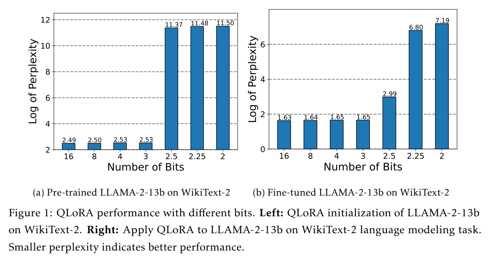

Fig. 1a 에서 보이듯, QLoRA 로 얻은 quantized pretrained model 은 3-bit level 이하에서 성능이 크게 저하된다. 이와 같은 initialization deviation 은 fine-tuning 과정에서도 좋지 않은 결과로 이어지는데, Fig. 1b 에서 볼 수 있듯, QLoRA 는 quantization bit 수가 줄어들수록 fine-tuning 성능이 떨어지며 3-bit level 아래에서는 학습이 아예 실패한다.

본 논문에서는 LoRA fine-tuning 이 필요한 pretrained model 에서 quantization 과정을 함께 고려하도록 설계된, **LoRA-Fine-Tuning-aware Quantization (LoftQ)** 라는 novel quantization framework 을 제안한다. 이 framework 는 quantization 와 low-rank approximation 을 결합하여 original high-precision pretrained weights 를 함께 근사한다. 이를 통해 Fig. 2 와 같이 pretrained weights 와의 alignment 를 크게 개선하고, 이후 LoRA fine-tuning 을 위한 유리한 initialization 를 제공해 downstream task 에서의 성능 향상을 이끌어낸다.

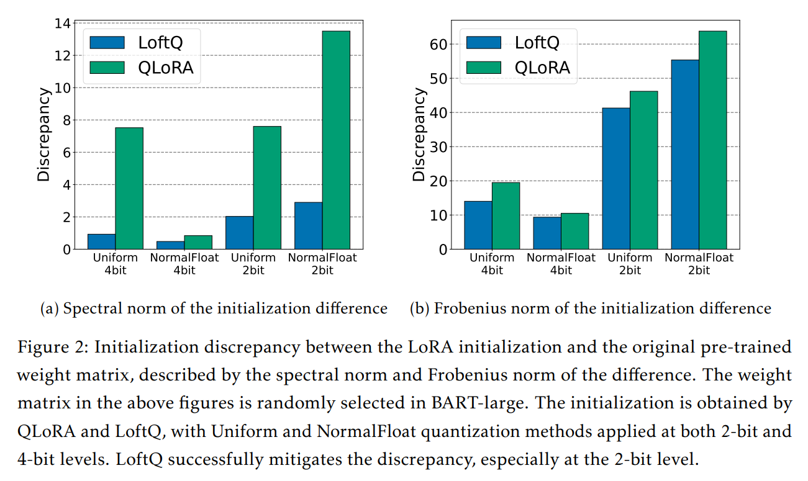

저자는 LoftQ 의 효과를 검증하기 위해, NLU, question answering, summarization, NLG 와 같은 다양한 downstream task 에 대해 광범위한 실험을 수행했다. 실험 결과, LoftQ 는 모든 precision 구간에서 QLoRA 를 꾸준히 능가했다. 예컨대 4-bit quantization 상황에서 XSum 과 CNN/DailyMail 에 대해 Rouge-1 점수가 각각 1.1, 0.8 이나 높게 나타났다. 특히 low-bit 환경에서 LoftQ 는 더욱 탁월했으며, 다양한 quantization 방법과도 잘 결합되었다. 예를 들어, 2-bit NormalFloat 와 2-bit uniform quantization 설정에서 MNLI 에서 8% 이상, SQuADv1.1 에서 10% 이상의 성능 향상을 달성했다. 저자의 접근법이 QLoRA 대비 나쁜 성능을 보인 사례는 관찰되지 않았다.

# 2 Background

## 2.1 Transformer Models

Transformer model 은 일련의 layer 로 구성되며, 각 layer 는 multi-head self-attention (MHA) 와 fully connected feed forward network (FFN) 라는 two sub-layers 로 이루어진다. input $X \in \mathbb{R}^{n \times d}$ 가 주어지면, 여기서 $n$ 은 sequence length, $d$ 는 model 의 hidden dimension 이다. MHA 는 $h$ attention heads 를 병렬로 계산한다:

$$
\text{MHA}(X) = \text{Concat}(\text{head}_1, \dots, \text{head}_h) \, W_o, \\
\text{where} \quad \text{head}_i = \text{Softmax}\Bigl((X W_{q_i})(X W_{k_i})^\top/\sqrt{d_h}\Bigr)X W_{v_i}, \quad i = 1, \dots, h,
$$

여기서 $W_{q_i}$, $W_{k_i}$, $W_{v_i} \in \mathbb{R}^{d \times d_h}$ 는 query, key, value matrices 이며, $W_o \in \mathbb{R}^{d \times d}$ 는 output matrix, $d_h = d/h$ 이다.

FFN 은 two linear transformations 와 activation function 으로 구성되며, $\text{FFN}(X) = \sigma(X W_{f_1} + b_1) \, W_{f_2} + b_2$ 로 정의된다. 여기서 $W_{f_1} \in \mathbb{R}^{d \times d_m}, W_{f_2} \in \mathbb{R}^{d_m \times d}$ 이고, $\sigma(\cdot)$ 는 activation function 이다. residual connection 이 사용되고, 그 뒤에 layer normalization 이 뒤따른다.

## 2.2 Quantization

#### Quantization

32-bit floating point 와 같은 high-precision number $X^{HP} \in \mathbb{R}$ 가 주어졌다고 할 때, $N$-bit quantization 은 이를 integer $X^{INT} \in \{0,1,\dots,2^N -1\}$ 로 인코딩한다. 수식으로 표현하면:

$$
\begin{equation}
    X^{INT} = \text{round}\Bigl((2^N -1)\,F(X^{HP})\Bigr),
\end{equation}
$$

여기서 $F(\cdot): \mathbb{R} \to [0,1]$ 는 normalization function 이다. uniform quantization 은 $F(X) = (X - X_{\min})/(X_{\max} - X_{\min})$ 로 가정한다. Dettmers et al. (2023) 는 4-bit NormalFloat Quantization (NF4) 를 제안했는데, 이는 $X \sim N(0,\sigma^2)$ 을 따른다고 가정하여 $F(X) = \Phi\bigl(X/\sigma\bigr)$ 로 정의한다. $\Phi(\cdot)$ 는 standard normal distribution 의 cumulative distribution function 이다.

#### Dequantization

lookup table $\mathcal{T}$ 를 두는데,

$$
\begin{equation}
    \mathcal{T}[i] = F^{-1}\Bigl(\frac{i}{2^N - 1}\Bigr), \quad i = 0,1,\dots,2^N-1,
\end{equation}
$$

로 정의되며, integer $X^{INT}$ 를 이의 high-precision counterpart $X^D \in \mathbb{R}$ 로 디코딩하는데 사용된다. 그러므로 dequantization 은 다음이 표현된다.

$$
\begin{equation}
    X^D = \mathcal{T}\bigl[X^{INT}\bigr].
\end{equation}
$$

#### Simulated Quantization for Matrices

quantized representations 끼리 직접 multiplication 을 수행하는 것도 가능하지만, 일반적으로 quantized weight matrices 는 메모리에 integer 로 저장한 뒤, lookup table 을 사용해 임시로 high-precision matrices 로 dequantize 한 다음 연산하는 simulated quantization 방식을 사용한다. 이때 high-precision matrix 에서 simulated high-precision matrix 로 mapping 하는 과정만 분석하면 된다. 저자는 이 end-to-end process 를 $q_N(\cdot): \mathbb{R}^{m \times n} \to \mathbb{R}_N^{m \times n}$ 라고 표기하는데, 여기서 $\mathbb{R}_N = \{\mathcal{T}[i]\in \mathbb{R}\,\mid\,0 \le i < 2^N \}$ 로 정의할 수 있다.

## 2.3 Low-Rank Adaptation

LoRA 는 frozen pretrained weight matrix $W$ 에 two small weight matrices $A$ 와 $B$ 를 추가로 부착하여 학습하는 방법이다. 즉, $Y = XW$ 라는 linear transformation 을 다음과 같이 재구성한다.

$$
\begin{equation}
    Y = XW + X A B^\top,
\end{equation}
$$

여기서 $X\in \mathbb{R}^{n \times d_1}, W\in \mathbb{R}^{d_1 \times d_2}, A\in \mathbb{R}^{d_1 \times r}, B\in \mathbb{R}^{d_2 \times r}$, 그리고 $r \ll \min\{d_1,d_2\}$ 이다. 초기에는

$$
\begin{equation}
    A \sim N(0,\sigma^2), \quad B = 0,
\end{equation}
$$

로 설정해 pretrained weights 와 align 되도록 한다. finetuning 시에는 $W$ 는 고정하고 $A$ 와 $B$ 만 SGD-type optimization 방법으로 업데이트한다.

만약 quantized backbone $Q = q_N(W)$ 위에 LoRA adapter $A$, $B$ 를 부착하고, 이를 Eq. (5) 와 같이 initialization 한다면, quantization 과정에서 발생한 오차 때문에 $Q + A B^\top$ 는 더 이상 원래의 pretrained weight $W$ 와 동일하지 않게 된다.

# 3 Method

저자는 LLMs 를 위한 quantization framework 인 **LoRA-Fine-Tuning-aware Quantization (LoftQ)** 를 제안한다. 이는 quantization 과 low-rank approximation 을 번갈아 적용하여 original pretrained weights 를 근사해내는 방식이다. 이 quantization framework 는 quantization 으로 인해 발생하는 QLoRA 의 discrepancy 문제를 완화하고, downstream task 에서 generalization 성능을 크게 높일 수 있는 promising initialization 를 LoRA fine-tuning 에 제공한다.

## 3.1 LoRA-Aware Quantization

LoftQ 에서는 $N$-bit quantized weight $Q \in \mathbb{R}_N^{d_1 \times d_2}$ 와 low-rank approximations $A \in \mathbb{R}^{d_1 \times r}, B \in \mathbb{R}^{d_2 \times r}$ 를 사용해, original high-precision pretrained weight $W \in \mathbb{R}^{d_1 \times d_2}$ 를 근사하고 이를 LoRA fine-tuning 의 initialization 으로 활용한다. 구체적으로, fine-tuning 전, 다음 objective 를 minimizing 함으로써 network 를 초기화한다:

$$
\begin{equation}
    \min_{Q, A, B} \Bigl\lVert W - Q - AB^\top \Bigr\rVert_F,
\end{equation}
$$

여기서 $\|\cdot\|_F$ 는 Frobenius norm 이다. 

Eq. (6) 의 objective 는 quantized backbone $Q$ 의 initial values 와 low-rank adapters $A, B$ 를 동시에 최적화함으로써, 이후 LoRA fine-tuning 단계를 고려한다. 기존에는 pretrained weight $W$ 를 직접 quantize 해 $Q$ 로 만든 다음, 이후 LoRA fine-tuning 을 별도로 적용하는 방식을 취했는데, 이는 quantization discrepancy 로 인해 downstream task 성능이 크게 저하되는 문제를 야기한다.

## 3.2 Alternating Optimization

Eq. (6) 의 minimization problem 은 quantization 및 singular value decomposition (SVD) 단계를 번갈아 수행하여 해결한다. 초기값은 $A_0 = 0, B_0 = 0$ 으로 둔다.

#### Quantization

$t$-th step 에서, last step 의 low-rank approximation $A_{t-1} B_{t-1}^\top$ 와 original pretrained weight $W$ 의 차이를 quantize 하여 quantized weight $Q_t$ 를 구한다:

$$
\begin{equation}
    Q_t = q_N\bigl(W - A_{t-1} B_{t-1}^\top\bigr),
\end{equation}
$$

여기서 $q_N(\cdot)$ 은 high-precision weight matrix 를 quantized matrix 로 mapping 한다.

저자는 이 알고리즘이 다양한 quantization functions $q_N(\cdot)$ 에 호환되며, Sec. 4 에서는 예시로 NF4 와 uniform quantization 을 적용한다. 또한 $A_{t-1} B_{t-1}^\top$ 이 고정된 상태에서, $Q_t$ 는 Eq. (6) 의 exact minimization solution 이 아닌 efficient approximation 을 유의한다.

#### SVD

$t$-th quantized weight $Q_t$ 를 얻은 뒤, $R_t = W - Q_t$ 로 정의되는 exact quantization residual 에 대해 아래와 같이 SVD 를 수행한다:

$$
\begin{equation}
    R_t = \sum_{i=1}^{d} \sigma_{t,i} \, u_{t,i} \, v_{t,i}^\top,
\end{equation}
$$

여기서 $d = \min\{d_1, d_2\}$, $\sigma_{t,1} \ge \sigma_{t,2} \ge \dots \ge \sigma_{t,d}$ 는 $R_t$ 의 singular value 들이며, $u_{t,i}, v_{t,i}$ 는 각각 $R_t$ 의 left, right singular vectors 다. 이어서 $R_t$ 의 rank-$r$ approximation 을 $A_t B_t^\top$ 로 두는데,

$$
\begin{align}
    &A_t = \bigl[ \sqrt{\sigma_{t,1}}\,u_{t,1},\, \dots,\, \sqrt{\sigma_{t,r}}\,u_{t,r} \bigr], \\ 
    &B_t = \bigl[ \sqrt{\sigma_{t,1}}\,v_{t,1},\, \dots,\, \sqrt{\sigma_{t,r}}\,v_{t,r} \bigr].
\end{align}
$$

저자는 이러한 과정을 Algorithm 1 에 정리한다. 특히 $T=1$ 인 경우는 특수 케이스로, 이때 $Q_1$ 는 exact quantized weight 가 되고, $A_1, B_1$ 는 $W - Q_1$ 에 대한 quantization residual 의 SVD 로 얻어진다. $T=1$ 만으로도 quantization discrepancy 를 완화하는 데 충분하며, alternating optimization 을 통해 pretrained weight $W$ 에 더 가까운 initialization 이 가능해져 성능이 추가로 향상된다 (자세한 내용은 Sec. 3 참조).

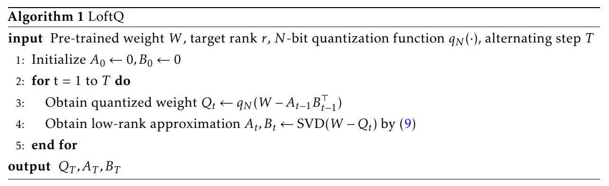

마지막으로, LoftQ 의 computational cost 는 각 weight matrix 에 독립적으로 적용할 수 있어 병렬화가 가능하므로 매우 작다. 또한 pretrained model 에 LoftQ 를 한 번만 적용한 뒤, 이렇게 얻은 initialization 를 여러 downstream task 에 재사용할 수도 있음을 유의한다.

## 3.3 Applying to LoRA Fine-tuning

LoftQ 로부터 얻어진 $Q_T \in \mathbb{R}_N^{d_1 \times d_2}$ 는 Eq. (1) 에 따라 integer matrix $M$ 과 lookup table $\mathcal{T}$ (Eq. (2) 참조) 형태로 저장된다. backbone 은 이 integer matrix $M$ 으로 initialization 하고, low-rank adapter 는 LoftQ 로 얻어진 $A_T, B_T$ 로 initialization 한다.

LoRA fine-tuning 중에는 integer matrix $M$ 을 고정하고, low-rank adapter 만 AdamW 등의 efficient optimization algorithm 으로 학습한다. forward propagation 시에는 Eq. (3) 에 따라 lookup table 을 사용해 임시로 $M$ 을 high-precision $Q_T$ 로 dequantize 하고, backward propagation 에서는 gradient 와 optimizer state 가 모두 low-rank adapter $A, B$ 에만 관련되므로 training cost 를 크게 절감할 수 있다.

# 4 Experiments

저자는 LoftQ 를 NLU 와 NLG task 에 적용하여 평가한다. 구체적으로 DeBERTaV3-base, BART-large, LLAMA-2 시리즈 모델을 quantizing 하고 LoftQ 를 적용한다.

#### Implementation Details

기존의 LoRA variants 연구를 참고하여, all backbone weight matrices 를 고정하고 각 layer 의 MHA, FFN 에 low-rank adapters 를 추가한다. low-rank adapters 가 붙은 weight matrices 에 대해서는 quantization 을 수행한다. 구현은 공개된 Huggingface Transformers code-base 를 기반으로 하였으며, 모든 실험은 NVIDIA A100 GPU 에서 수행했다.

#### Quantization Methods

LoftQ 가 다양한 quantization functions 와 호환됨을 보이기 위해 두 가지 방법을 사용한다:

- **Uniform quantization**: continuous interval 을 균등하게 $2^N$ 으로 나누고, dequantization 에 필요한 local maximum absolute value 를 저장하는 classic quantization 방식이다.
- **NF4 와 2-bit variant NF2**: QLoRA 에서 사용된 quantization 방식이며, high-precision values 를 Gaussian distribution 에서 샘플링된다고 가정하고, 동일 확률이 되도록 값을 discrete slots 에 mapping 한다.

본 논문에서는 모든 모델에 대해 2-bit 와 4-bit quantization 을 수행하며, 각각 약 25~30% 및 15~20% 의 compression ratio 를 달성한다.

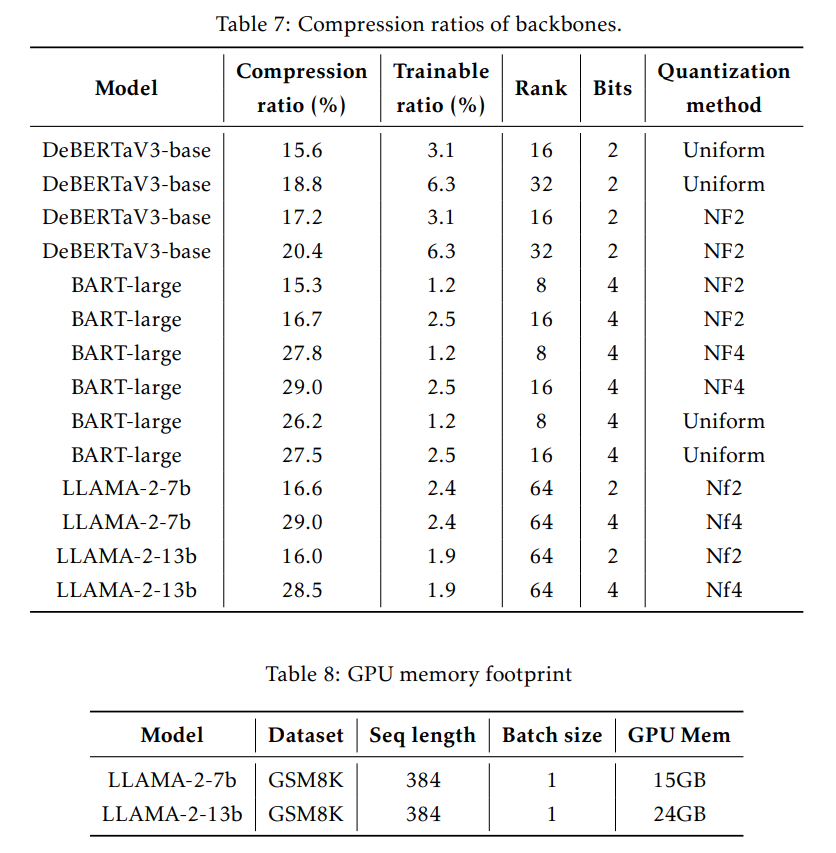

#### Baselines

LoftQ 를 다음과 같은 baseline 방법들과 비교한다:

- **Full fine-tuning**: pretrained model 을 downstream task 에 맞추는 가장 일반적인 접근법으로, pretrained weights 로 initialization 한 뒤 all parameters 를 SGD-type optimization 으로 학습한다.
- **Full precision LoRA (LoRA)**: backbone 을 16-bit 로 유지하고 low-rank adaptors 만 학습하는 lightweight 방법이다. adaptors 는 LoftQ 와 동일한 위치에 추가된다.
- **QLoRA**: LoRA 와 유사하나, backbone 을 low-bit 로 quantize 한다. low-rank adapters 는 Eq. (5) 에 따라 initialization 되며, LoftQ 와 동일한 위치에 적용된다.

## 4.1 Encoder-only Model: DeBERTaV3

#### Models and Datasets

DeBERTaV3-base 를 LoftQ 로 quantizing 한 뒤, General Language Understanding Evaluation (GLUE), SQuADv1.1, ANLI 에 대해 finetuning 및 평가를 진행한다. 실험에서는 WNLI 는 제외한다.

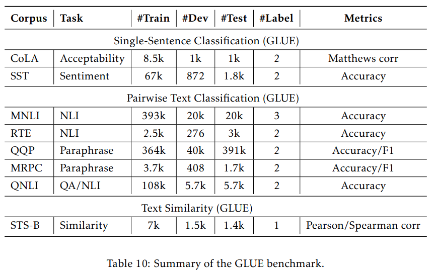

#### Implementation Details

learning rate 는 $\{1 \times 10^{-5}, 5 \times 10^{-5}, 1 \times 10^{-4}, 5 \times 10^{-4}\}$ 범위에서 선택한다. GLUE, SQuADv1.1, ANLI 는 비교적 난이도가 낮은 NLU task 이므로, 저자는 higher compression efficiency 를 위해 embedding layer 도 quantize 한다. LoftQ 와 QLoRA 는 모두 2-bit, 4-bit 설정에서 NormalFloat 와 uniform quantization 을 적용하며, low-rank adapter 의 rank 는 16, 32 를 사용한다. 추가적인 training epochs, learining rate 등 자세한 구현 사항은 다음과 같으며, GLUE 및 ANLI tasks 에는 32 batch size 를, SQuADv1.1 에는 16 batch size 를 사용한다.

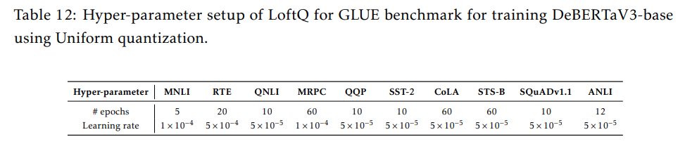

#### Main Results

Tab. 1, Tab. 2 는 각각 NF2 와 uniform quantization 을 사용했을 때, 2-bit quantization 환경에서 GLUE, SQuADv1.1, ANLI 에 대한 결과를 요약한 것이다. 모든 rank, quantization 방법, dataset 에서 LoftQ 는 QLoRA 보다 일관되게 더 높은 성능을 보인다. 예를 들어 uniform quantization (Tab. 2) 기준으로 MNLI-m 에서 88.0% 를 달성하는데, 이는 QLoRA 대비 8%p 가량 높은 수치다. SST 나 SQuADv1.1 과 같은 task 에서는 2-bit level 에서조차 full fine-tuning 에 근접한 성능을 낸다. 4-bit quantization 결과는 Appendix D.1 에 제시되어 있는데, LoftQ 와 QLoRA 모두 full fine-tuning 에 근접한 성능을 달성한다.

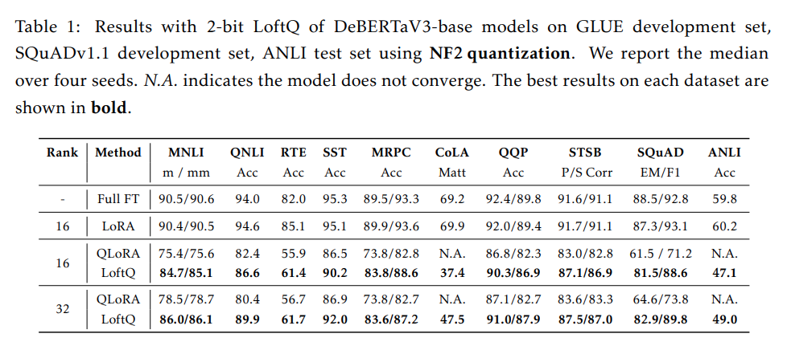

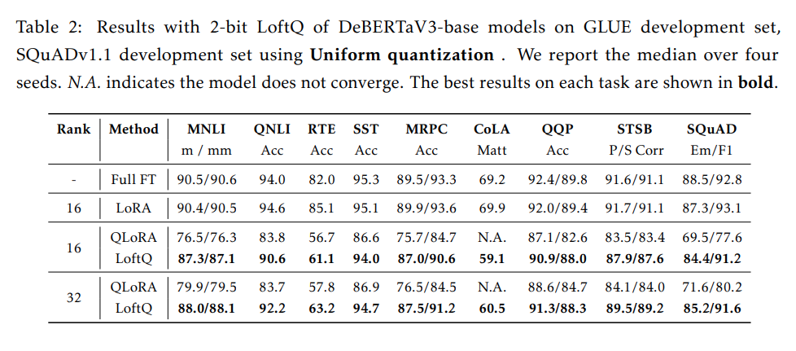

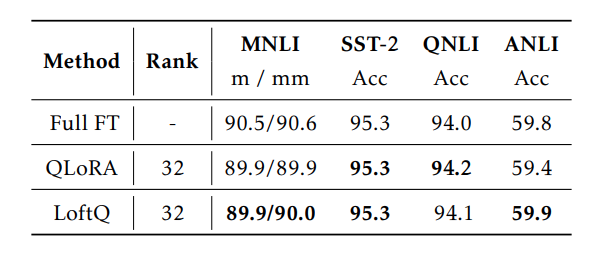

특히 low-bit 환경에서 LoftQ 는 QLoRA 보다 안정적인 것으로 나타난다. 예컨대 QLoRA 는 CoLA 에서 모든 quantization 방법, 모든 rank 설정에서 수렴에 실패하지만, LoftQ 는 모든 경우에서 수렴에 성공했고, uniform quantization, rank 32 시 60.5 점을 달성했다. 이는 LoftQ 가 pretrained weight 의 초기 상태를 효과적으로 보존함으로써, 안정적이고 개선된 성능을 꾸준히 달성함을 보여준다.

## 4.2 Encoder-Decoder Model: BART

#### Models and Datasets

저자는 BART-large 을 LoftQ 로 quantizing 한 뒤, XSum 과 CNN/DailyMail 두 가지 summarization dataset 에 대해 finetuning 및 평가를 수행한다.

#### Implementation Details

encoder 와 decoder 의 모든 layers 에 포함된 MHA 및 FFN 의 weight matrix 에 LoftQ 를 적용한다. summarization tasks 의 평가지표인 ROUGE 1/2/L scores 를 보고하며, 2-bit 와 4-bit 두 가지 시나리오에서 quantization 실험을 진행한다. NormalFloat 와 uniform quantization 모두 2-bit, 4-bit 버전으로 적용한다. 각 precision (2-bit, 4-bit) 에 대해, full precision LoRA baseline 과 공정하게 비교하기 위해 rank 8, 16 을 사용한다. 구현 상세 내용은 다음과 같다.

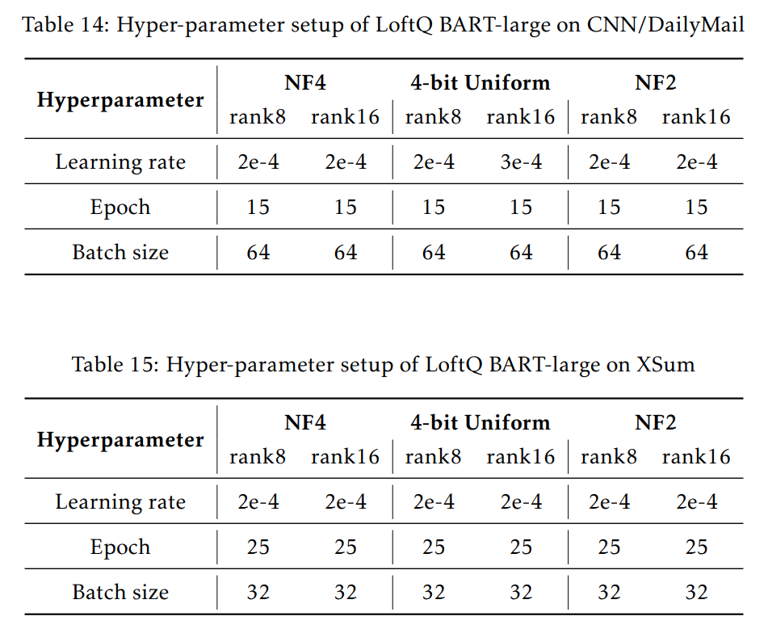

#### Main Results

Tab. 3 은 XSum, CNN/DailyMail 의 4-bit quantization 결과를 요약한다. 두 dataset, 두 rank 모두에서 LoftQ 는 QLoRA 를 꾸준히 능가하며, XSum 의 경우에는 full precision LoRA 보다도 성능이 높다. 이 예상치 못한 결과에 대해서는 Sec. 5 에서 논의한다. 

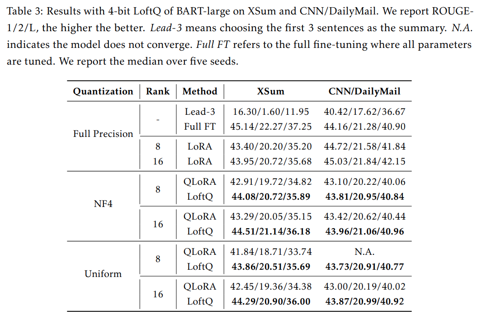

2-bit quantization 결과는 Tab. 4 에 제시되어 있으며, NLU 실험과 마찬가지로 LoftQ 는 QLoRA 가 수렴하지 못하는 경우에도 합리적인 결과를 보인다. 이는 initialization gap 을 줄임으로써 LoftQ 가 더 견고함을 나타낸다.

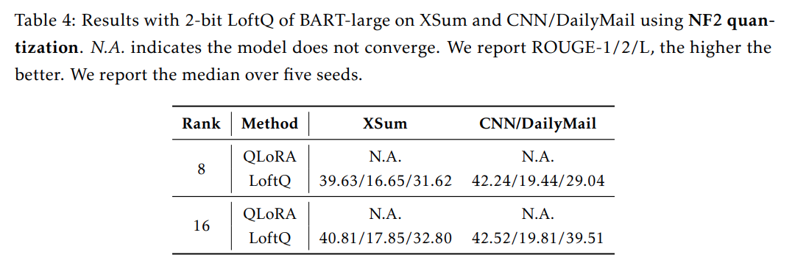

## 4.3 Decoder-only Model: LLAMA-2

#### Models and Datasets

저자는 LoftQ 로 LLAMA-2-7b, LLAMA-2-13b 을 quantizing 한 후, GSM8K, WikiText-2 두 가지 NLG dataset 에 대해 finetuning 및 평가를 수행한다. 자세한 내용은 다음과 같으며, WikiText-2 에 대해선 32 batch size 를, GSM8K 에 대해선 16 batch size 를 사용한다.

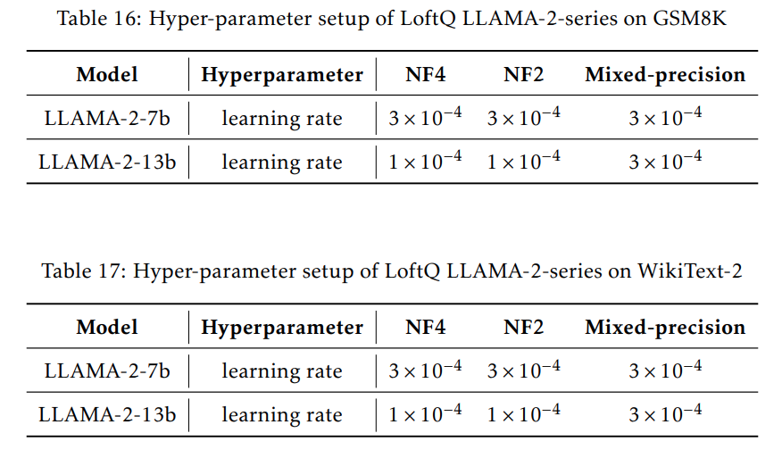

#### Implementation Details

마찬가지로, encoder, decoder layers 의 MHA 와 FFN 에 포함된 weight matrix 에 LoftQ 를 적용한다. WikiText-2 에 대해서는 perplexity 를 보고하고, GSM8K 에 대해서는 생성된 해답에서 숫자만 추출해 정확도를 계산한다. NF2, NF4 방식으로 실험한다.

#### Main Results

Tab. 5 는 LLAMA-2-7b, LLAMA-2-13b 를 대상으로 2-bit, 4-bit, 그리고 mixed-precision NormalFloat quantization 방식을 적용해 WikiText-2, GSM8K 데이터셋을 실험한 결과를 요약했다.  

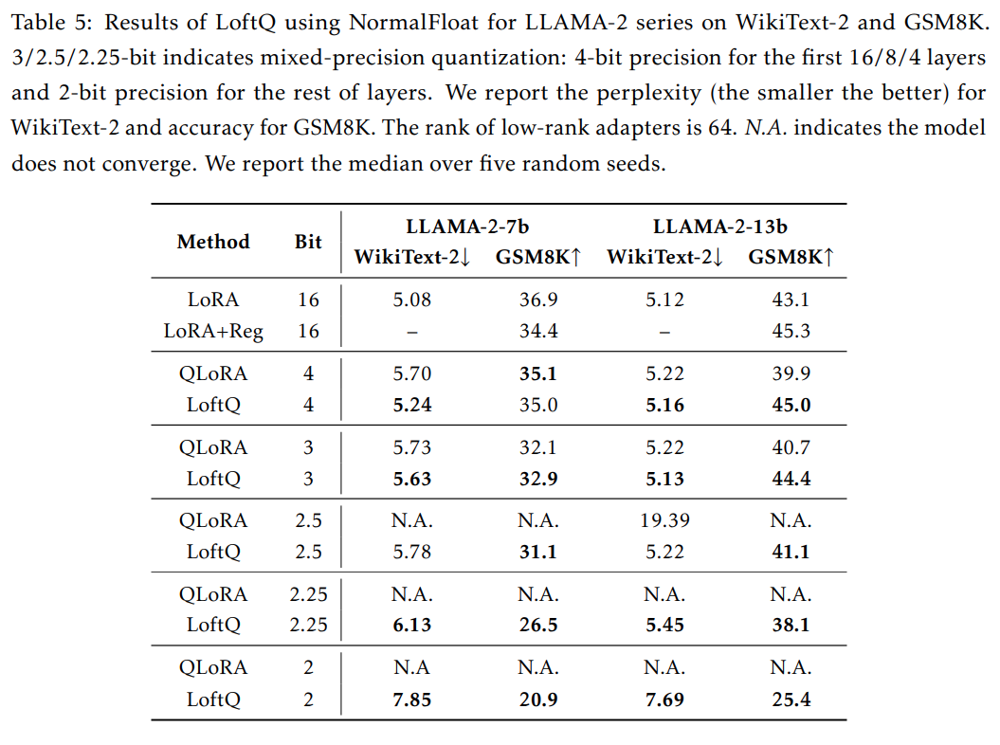

WikiText-2 에서는, all quantization precision 설정에서 LoftQ 가 QLoRA 를 꾸준히 능가한다. 특히 까다로운 2-bit precision 에서는 QLoRA 가 수렴하지 못했지만, LoftQ 는 7.85 의 perplexity 를 달성했다.

GSM8K 에서는, LoftQ 가 model sizes 나 quantization precision levels 에 상관없이 QLoRA 보다 좋은 혹은 비슷한 성능을 낸다. 예를 들어, 2-bit precision 시 LoftQ 는 20.9% accuracy 를 달성했지만 QLoRA 는 수렴에 실패했다.  

또한, LLAMA-2-13b 를 GSM8K 에 적용했을 때 LoftQ 가 full precision LoRA 보다 높은 성능을 보였다. 이는 regularization 부족으로 인해 full precision LoRA 가 overfitting 되는 상황일 가능성이 있다. 이를 확인하기 위해 GSM8K 에서 weight decay 를 적용한 full precision LoRA 실험을 추가로 수행했는데, Tab. 5 에서 볼 수 있듯 LLAMA-2-13b 에는 효과가 있었으나, LLAMA-2-7b 에는 효과가 없었다. 이는 LLAMA-2-13b 가 overfitting 에 더 취약하며, quantization 이 implicit regularization 역할을 수행함을 시사한다.

마지막으로, performance 와 precision 간의 customized trade-off 를 제공하기 위해, first 4 layers 는 4-bit 로 quantize 하고 나머지는 2-bit 로 유지하는 mixed-precision quantization 도 실험했다. 그 결과, GSM8K 에서 LLAMA-2-7b 로 5.9% points , LLAMA-2-13b 로 12.7% points 정확도 향상을 얻었다. 이는 LoftQ 가 complex mixed-precision quantization 시나리오에서도 잠재력을 지님을 보여준다.

## 4.4 Analysis

#### Effectiveness of Alternating Optimization

저자는 서로 다른 alternating step $T$ 에 대해 실험하여, alternating optimization 의 효과와 모델별 best value $T$ 를 확인했다. all tasks 와 models 에서, minimal alternating step 만으로도 큰 향상을 이룰 수 있음을 관찰했다. 이는 quantized weights 와 pretrained weights 의 차이를 빠르게 줄여준다는 의미이며, 따라서 본 방법을 적용하기가 쉽다는 장점이 있다. 예컨대 MNLI-m dataset 에서는 5 alternating step 만으로 88.0% 정확도를 달성했고, 단 1 step 으로도 21.14 Rouge-2 점수를 기록했다.

흥미롭게도 alternating step 을 어느 정도 넘어서면 성능 향상이 점차 감소하는 경향이 있다. 이는 quantization 에서 발생하는 본질적인 오차로 인해, 이미 충분히 줄어든 간극을 매 step 마다 더 줄이기가 쉽지 않기 때문이라고 추정한다. 그럼에도 Fig. 3 에 나타난 결과에 따르면, 본 방법은 alternating step $T$ 에 크게 민감하지 않으며, downstream fine-tuning 성능을 일관되게 개선한다.

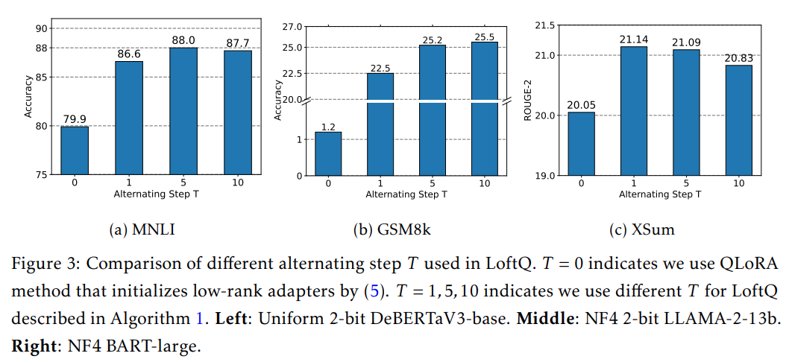

# 5 Discussion

#### Start with quantization or SVD in the alternating optimization?

Alternating optimization 의 또 다른 방식은 Algorithm 1 의 Line 3 와 Line 4 를 뒤바꾸어, 먼저 low-rank approximation $(A_t, B_t)$ 을 구하고 그 뒤 quantized weight $Q_t$ 를 얻는 것이다. 이는 여전히 Eq. (6) 의 목표를 함께 최소화하는 유효한 방법이다. Tab. 6 에서 이를 요약했는데, 이 대안적 방법 역시 QLoRA 보다 훨씬 나은 성능을 보이지만, 저자가 제안한 주된 방식보다는 다소 성능이 떨어진다. 이는 low-bit 환경에서 pretrained weights 에 대한 근사가 얼마나 중요한지 보여준다.

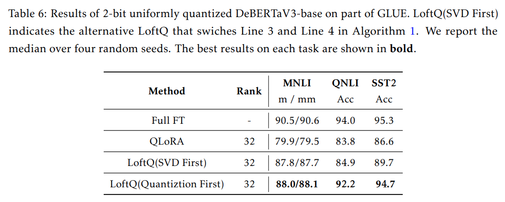

# 6 Related Work

#### Quantization-Aware Training (QAT

QAT 은 quantization 과 full model finetuning 을 동시에 수행하여, downstream task 에 맞춰진 quantized model 을 얻는 방법이다. 하지만 QAT 는 gradient 와 optimizer state 를 포함한 massive training cost 가 필요하며, quantized weights 에 대한 gradient 계산도 어렵다. 저자의 방법은 LoRA 를 사용함으로써 이러한 문제를 피하고, downstream task 에 대한 가벼운 접근법을 제공한다.

#### Post-Training Quantization (PTQ

PTQ 는 popular quantization frameworks 의 한 범주로, 일반적으로 pretrained model 을 small subset training dataset 으로 calibration 해 task-specific quantized model 을 얻는다. gradient backpropagation 이 없어 비용 측면에서 이점이 있지만, QAT 대비 정확도가 낮아지는 경향이 있다.

# 7 Conclusion

본 논문에서는 LoftQ 라는 LLMs 용 quantization framework 을 제안한다. 이는 original high-precision pretrained weights 에 quantization 과 low-rank approximation 을 번갈아 적용하여, 이후 LoRA fine-tuning 을 위한 initialization 을 얻는다. 

natural language understanding, question answering, summarization, natural language generation 등 다양한 task 에 대한 실험 결과, LoftQ 는 encoder-only, encoder-decoder, decoder-only model 을 quantizing 할 때 기존 기법 (e.g., QLoRA) 을 크게 상회하는 성능을 보였다. 

저자가 관찰한 바로는 LoftQ 가 QLoRA 보다 나쁜 성능을 낸 사례는 없었으며, 특히 2-bit level 의 low-bit quantization 환경에서 LoftQ 는 효과적이고 견고한 접근임을 확인했다.