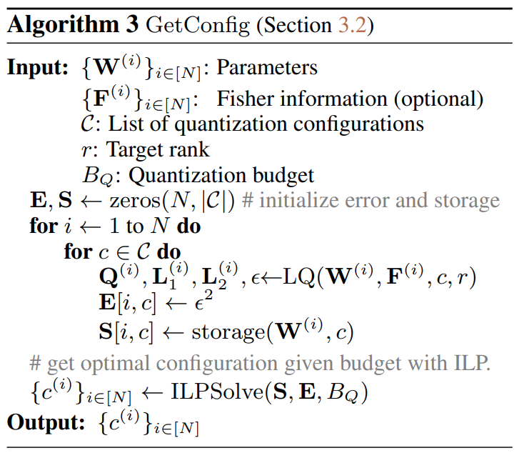

논문 및 이미지 출처 : <https://arxiv.org/pdf/2311.12023>

# Abstract

저자는 pretrained language model 을 memory-efficient 하게 적응시키는 간단한 방법을 제안한다. 

이 방법은 iterative algorithm 을 사용해서 각 pretrained matrix 를 high-precision low-rank component 와 memory-efficient quantized component 로 나눈다. 

- Finetuning 할 때 quantized component 는 고정되고 low-rank component 만 업데이트된다. 
- 저자는 quantization component 에 대한 integer linear programming 공식을 제시하는데, 이는 overall target memory budget 을 주면 각 matrix 에 대해 quantization parameter (e.g., bit-width, block size) 를 동적으로 설정할 수 있게 한다. 
- 또 Fisher information matrix 의 approximation 을 사용해서 matrix decomposition 중 reconstruction objective 에 가중치를 주는 data-aware 버전도 탐구한다. 
- RoBERTa 와 LLaMA-2 (7B, 70B) finetuning 실험에서 저자의 low-rank plus quantized matrix decomposition 접근법 (LQ-LoRA) 이 강력한 QLoRA 와 GPTQ-LoRA baseline 을 능가하며, sub-3 bit 까지 aggressive quantization 을 해도 성능 저하가 거의 없음을 보여준다. 
- Language modeling calibration dataset 에서 finetuning 하면 LQ-LoRA 는 model compression 에도 사용할 수 있다. 이 설정에서 저자의 2.75-bit LLaMA-2-70B model (low-rank component 포함 시 평균 2.85 bit 이고 27GB GPU memory 필요) 은 16-bit baseline 과 비교해도 괜찮은 성능을 낸다.

# 1 Introduction

Large language model (LLM) 의 가용성이 늘어나고 pretrained parameter 도 많아졌지만, 그 엄청난 크기 때문에 새 dataset 에 full finetuning 으로 적응시키는 건 비용이 많이 든다. Instruction following data 로 supervised finetuning 을 조금만 해도 일반 지시를 따르는 interactive agent 를 학습하는 데 효과적이라는 게 밝혀졌기 때문에 이는 특히 아쉽다. 게다가 reinforcement learning 과 human feedback 으로 finetuning 한 LLM 은 오늘날 가장 뛰어난 AI 시스템 중 일부를 나타낸다. 그러니 LLM finetuning 의 memory efficiency 를 높이는 건 LLM 을 실제로 적용할 수 있는 문제 범위를 넓히는 핵심 단계로 남아 있다.

Memory-efficient LLM adaptation 을 위한 유망한 framework 중 하나는 parameter-efficient finetuning 방법인데, 이는 보통 base pretrained model 에 smaller finetunable _extension_ 을 학습한다. 이 방법들은 pretrained parameter 가 고정되어 있어서 gradient 와 optimizer state 를 저장할 memory 가 덜 필요하고, 최적화할 new parameter 수는 fixed parameter 의 일부에 불과해서 finetuning 에 필요한 memory 양을 줄일 수 있다. 많은 parameter-efficient finetuning 방법 중에서 low-rank adaptation (LoRA) 이 LLM 적응을 효율적으로 하는 인기 있는 기술로 떠올랐다. 

- LoRA 에서는 pretrained model 의 weight matrix $\mathbf{W}$ 를 $\mathbf{W} + \mathbf{L}_1 \mathbf{L}_2$ 로 reparameterize 하고, $\mathbf{L}_1$ 과 $\mathbf{L}_2$ 만 finetuning 한다. 
- 최근 연구들은 pretrained model 을 quantize 한 뒤 LoRA 를 적용해서 memory efficiency 를 더 높였다. 즉, reparameterization 을 $q(\mathbf{W}) + \mathbf{L}_1 \mathbf{L}_2$ 로 하고 여기서 $q(\cdot)$ 는 quantization function 이다.

LoRA 에서 $\mathbf{L}_2$ 는 0 으로 초기화돼서 finetuning 시작 시 model output 이 pretrained model 과 같게 보장된다. 즉, $\mathbf{X} (\mathbf{W} + \mathbf{L}_1 \mathbf{L}_2) = \mathbf{X} \mathbf{W}$ 가 된다. 하지만 pretrained matrices 가 substantial quantization error 가 생길 정도로 quantize 되면 (sub-4-bit regime 에서 실험적으로 드러난 바 있다) zero initialization 은 최적이 아닐 수 있다. 왜냐면 $q(\mathbf{W}) + \mathbf{L}_1 \mathbf{L}_2 \neq \mathbf{W}$ 가 되기 때문이다. 

이번 논문에서 저자는 LoRA 가 quantized model 에 low-rank update 만 한다는 점을 활용해서 quantization error 를 고려한 초기화 scheme 을 만든다. 

- Robust PCA 문헌에서 쓰인 것과 비슷한 iterative algorithm 을 사용해서 $\mathbf{W}$ 를 $\mathbf{W} \approx \mathbf{Q} + \mathbf{L}_1 \mathbf{L}_2$ 로 나눈다. 
  - 여기서 $\mathbf{Q}$ 는 fixed quantized component 이고, $\mathbf{L}_1 \mathbf{L}_2$ 는 low-rank component 다. 
- adaptation 중에는 $\mathbf{W}$ 의 high-variance subspace 를 capture 하는 $\mathbf{L}_1$ 과 $\mathbf{L}_2$ 만 finetuning 한다. 
- all layers 에 같은 quantization configuration 을 적용하는 대신, integer linear programming 을 사용해서 overall target bit rate 를 주면 각 matrix 에 다른 configuration (bit, block size 등) 을 할당하는 mixed quantization 전략을 찾는다. 
- 마지막으로 calibration sample 에서 얻은 Fisher information matrix 의 approximation 으로 decomposition objective 를 수정하는 data-aware version 도 탐구한다.

저자는 LQ-LoRA 를 RoBERTa 와 LLaMA-2 model 에 적용해서 strong QLoRA 와 GPTQ-LoRA baseline 보다 의미 있게 나아질 수 있음을 알아냈다. 이는 사용자가 target memory budget 을 유연하게 설정할 수 있게 한다. LQ-LoRA 는 standard language modeling dataset 에 적용해서 weight-only post-training quantization (PTQ) 방법으로도 쓸 수 있다. 이 설정에서 LLaMA-2-70B 를 2.85 bit 로 compress 해도 perplexity 저하가 작음을 발견했다.

# 2 Background

## 2.1 Low-Rank Adaptation of Large Language Models

Large language model 의 low-rank adaptation (LoRA) 은 LLM finetuning 중 memory footprint 을 줄이는 간단하면서 효과적인 방법으로 나타났다. Pretrained linear layer 의 matrix $\mathbf{W} \in \mathbb{R}^{d \times k}$ 가 주어지면, LoRA 는 two matrices $\mathbf{L}_1 \in \mathbb{R}^{d \times r}$, $\mathbf{L}_2 \in \mathbb{R}^{r \times k}$ 를 초기화한다. 

여기서 $r < \min(d, k)$ 이고, $\mathbf{L}_1$ 은 Gaussian noise 로 초기화되고 $\mathbf{L}_2$ 는 0 으로 초기화돼서 training 시작 시 $\mathbf{L}_1 \mathbf{L}_2 = \mathbf{0}$ 이 되게 한다. 그러고 나서 linear layer 를 $\mathbf{X} (\mathbf{W} + \mathbf{L}_1 \mathbf{L}_2)$ 로 reparameterize 하고, language model adaptation 중에 $\mathbf{L}_1$ 과 $\mathbf{L}_2$ 만 finetuning 한다 (여기서 $\mathbf{X}$ 는 이전 layer 의 activation 이다). Bias vector 는 간단하게 생략했다.

LoRA 는 full finetuning 보다 memory efficienct 하다. 왜냐면 $\mathbf{W}$ 에 대한 gradient 와 관련 optimizer state (e.g., Adam 의 momentum, variance 통계) 를 GPU memory 에 할당할 필요가 없기 때문이다. 다른 memory-efficient finetuning 전략 (e.g., Adapter, Prompt Tuning) 보다도 LoRA 는 LLM adaptation, 특히 instruction-following benchmark 에서 supervised finetuning 할 때 인기가 많아졌다.

## 2.2 Weight Quantization of Large Language Models

Standard round-to-nearest (RTN) quantization 은 weight block 을 $s \times \operatorname{clamp}\left(\left\lfloor \frac{1}{s} \mathbf{u} \right\rceil; -2^{b-1}, 2^{b-1}-1\right)$ 로 quantize/dequantize 하는데, 여기서 scaling factor $s = \frac{\max(|\mathbf{u}|)}{2^{b-1}-1}$ 이고 bit size 는 $b$ 다. 이는 pretrained LLM 의 weight 를 8-bit 로 quantize 하는 데 효과적임이 밝혀졌다. 하지만 (sub) 4-bit quantization 은 RTN 으로 어렵다는 게 실험적으로 드러났고, 최근 방법들은 보통 calibration sample 을 사용해서 더 나은 weight quantization 을 얻는 data-aware 전략을 쓴다.

저자의 접근법은 최근 제안된 NormalFloat (NF) quantization scheme 에 의존한다. 이는 trained model 의 weight distribution 이 대략 Gaussian 이라는 점을 활용한다. 

- NF quantization 은 $\left[\delta, \frac{1}{2}\right]$ 에서 $2^{b-1}$ evenly-spaced value 와 $\left[\frac{1}{2}, 1-\delta\right]$ 에서 $2^{b-1}+1$ evenly-spaced value 을 계산한다. 
  - 여기서 $\delta = \frac{1}{2} \left( \frac{1}{30} + \frac{1}{32} \right)$ 이다. 
  - 이로 인해 $2^b$ probability values $\left[p_1, \ldots, p_{2^b}\right]$ 이 생기는데, $p_1 = \delta$, $p_{2^{b-1}} = \frac{1}{2}$, $p_{2^b} = 1-\delta$ 다. 
- 이 probability 는 quantile $\left[q_1, \ldots, q_{2^b}\right]$ 로 변환되고, 
  - 여기서 $q_i = \Phi^{-1}(p_i)$ 는 $p_i$ 에 대한 Gaussian quantile 이다. 
  - 이 quantile 은 $[-1, 1]$ 로 정규화돼서 $\tilde{q}_i = \frac{q_i}{q_{2^k}}$ 가 된다. 
  - 그러고 나서 weight block $\mathbf{u} = \left[u_1, \ldots, u_B\right]$ 와 그 block 의 absmax values $s = \max(|\mathbf{u}|)$ 가 주어지면, 이 block 의 weight $u_j$ 는 가장 가까운 quantile $c_j$ 로 quantize 된다. 
  - 즉, $c_j = \arg \min_{i \in \{1, \ldots, 2^k\}} \left| \tilde{q}_i - \frac{u_j}{s} \right|$ 이다.

$d \times k$ matrix 에는 $\frac{d k}{B}$ blocks 가 있어서, block size 가 작으면 각 block 의 absmax values $s$ 를 저장하는 게 부담스러울 수 있다. 그래서 Dettmers 등은 absmax values set $[ s_1, \ldots, s_{\frac{d k}{B}}]$ 을 RTN 으로 다시 quantize 하는 double quantization 전략을 쓴다. 이 quantization scheme 기반으로 QLoRA 가 제안됐는데, 이는 pretrained LLM 을 4-bit 로 NF quantization 하고 low-rank update 를 학습한다. QLoRA 는 여러 benchmark 에서 full finetuning 과 경쟁력 있음이 밝혀졌고, 그래서 이번 연구의 주요 baseline 이 된다.

# 3 Method: LQ-LoRA

저자의 접근법은 각 pretrained matrix 를 low-rank matrix 와 quantized matrix 로 나누는 간단한 factorization scheme 에 의존한다 (Sec. 3.1). Finetuning 중에는 low-rank component 만 적응된다. 

Sec. 3.2 에서 저자는 integer linear programming 을 통해 mixed quantization 전략을 탐구해서 target average bit rate 를 주면 layer 간 dynamic quantization 을 가능하게 한다. 

또 empirical Fisher information matrix 를 사용해서 matrix factorization 중 reconstruction objective 에 가중치를 주는 data-aware version 도 고려한다 (Sec. 3.3).

## 3.1 Low-Rank Plus Quantized Matrix Decomposition

Sec. 2.1 에서 언급했듯이, LoRA 는 pretrained matrix $\mathbf{W}$ 를 $\mathbf{W} + \mathbf{L}_1 \mathbf{L}_2$ 로 reparameterize 하고 $\mathbf{L}_1$ 을 Gaussian 으로, $\mathbf{L}_2$ 를 0 으로 초기화한 뒤 finetuning 한다. 이는 finetuning 시작 시 model output 이 reparameterization 전과 똑같게 보장하지만, $\mathbf{W}$ 의 quantized version 에서 문제가 될 수 있다. 왜냐면 low bit 로 quantize 하면 $\|\mathbf{W} - \text{Quantize}(\mathbf{W})\|_F \gg 0$ 이 될 수 있기 때문이다. 게다가 이 초기화는 $\mathbf{W}$ 의 구조를 고려하지 않고 어떤 subspace 를 적응할지 결정한다. 저자는 matrix factorization 관점에서 이 문제를 접근한다. 여기서 original matrix 를 쉽게 quantize 할 수 있는 component 와 high-variance directions 를 잡는 low-rank component 로 나누는 데 관심 있다.

$$
\begin{equation}
    \underset{\mathbf{Q}, \mathbf{L}_1, \mathbf{L}_2}{\arg \min} \left\| \mathbf{W} - (\mathbf{Q} + \mathbf{L}_1 \mathbf{L}_2) \right\|_F, \quad \text{where } \mathbf{Q} \in \mathbb{Q}_b^{d \times k}, \mathbf{L}_1 \in \mathbb{R}^{d \times r}, \mathbf{L}_2 \in \mathbb{R}^{r \times k}.
\end{equation}
$$

- 여기서 $\mathbb{Q}_b^{d \times k} \subset \mathbb{R}^{d \times k}$ 는 $b$-bit 로 losslessly NF-quantizable matrix 집합이다. 
  - 이 optimization 문제는 robust principal components analysis (RPCA) 에서 직면하는 문제와 비슷하다. 
- RPCA 는 matrix $\mathbf{W}$ 를 low-rank $\mathbf{L}$ 과 sparse $\mathbf{S}$ 로 나눈다. 
  - RPCA 에 효과적인 iterative algorithm 을 따라, 저자는 Eq. 1 을 $\mathbf{L}_1 \mathbf{L}_2$ 와 $\mathbf{Q}$ 를 번갈아 최적화하면서 대략적으로 푼다:

$$
\begin{equation}
    \begin{aligned}
    \mathbf{L}_1^{(t)}, \mathbf{L}_2^{(t)} &\leftarrow \text{SVD}(\mathbf{W} - \mathbf{Q}^{(t-1)}, r), &= \underset{\text{rank}(\mathbf{L}) \leq r}{\arg \min} \left\| \mathbf{W} - (\mathbf{Q}^{(t-1)} + \mathbf{L}) \right\|_F, \\
    \mathbf{Q}^{(t)} &\leftarrow \text{Quantize}(\mathbf{W} - \mathbf{L}_1^{(t)} \mathbf{L}_2^{(t)}), &\approx \underset{\mathbf{Q} \in \mathbb{Q}_b^{d \times k}}{\arg \min} \left\| \mathbf{W} - (\mathbf{Q} + \mathbf{L}_1^{(t)} \mathbf{L}_2^{(t)}) \right\|_F,
    \end{aligned}
\end{equation}
$$

- 여기서 $\mathbf{Q}^{(0)}$ 는 $\mathbf{0}$ 으로 초기화된다. 
- (일부) RPCA algorithm 과 달리 이는 이론적 수렴 보장이 없어서 heuristic 하다. 그래서 저자는 error $\left\| \mathbf{W} - (\mathbf{Q}^{(t)} + \mathbf{L}_1^{(t)} \mathbf{L}_2^{(t)}) \right\|_F$ 를 추적해서 error 가 증가하면 algorithm 을 멈추는 간단한 stopping criterion 을 쓴다. 
- 이 iterative decomposition algorithm 은 Algorithm 2 에 나와 있다. 
- Algorithm 의 각 step (randomized SVD 후 quantization) 는 현대 GPU 에서 $4096 \times 4096$ matrix 에 대해 몇 초 걸린다.

#### Preliminary experiments.

- Fig. 1 (left) 에서 LLaMA-2-7B 의 몇몇 layers 에 대한 decomposition error $\left\| \mathbf{W} - (\mathbf{Q} + \mathbf{L}_1 \mathbf{L}_2) \right\|_F$ 를 step 수에 따라 보여준다. 저자의 algorithm 은 heuristic 이지만 실험적으로 효과적임을 알았다. 
- Fig. 1 (center) 에선 all matrices 에 대한 3-bit NF quantization 의 quantization error 를, Fig. 1 (right) 에선 LQ decomposition 의 해당 error 를 보여준다. 
- 두 접근법에서 value 와 output projection matrix 는 deeper layers 에서 quantize 하기 어려워지고, key 와 query matrix 는 쉬워진다. 하지만 LQ decomposition 은 all layers 에서 vanilla quantization 보다 나아진다.

## 3.2 Mixed-Configuration Quantization Via an Integer Linear Program

LQ-LoRA 는 NormalFloat (NF) quantization scheme 을 사용해서 각 time step 에서 residual $\mathbf{Q}$ 를 quantize 한다. NF-quantization 은 quantile bin 수, block 수, double quantization bit 같은 parameter 가 overal compression rate 에 영향을 준다. 이번 논문에서 저자는 matrix $\mathbf{A}$ 를 이렇게 quantize 하는 약간 다른 변형을 쓴다:

$$
\widehat{\mathbf{A}}, \mathbf{s} = \text{Quantize-NF}(\mathbf{A}, b_0, B_0), \quad \widehat{\mathbf{s}}, \mathbf{v} = \text{Quantize-INT}(\mathbf{s}, b_1, B_1), \quad \widehat{\mathbf{v}} = \text{cast}(\mathbf{v}, b_2).
$$

- 구체적으로, 먼저 bit size $b_0$ 와 bucket size $B_0$ 로 NF-quantization 을 해서 quantized matrix $\widehat{\mathbf{A}}$ 와 각 block 의 absmax value $\mathbf{s} = \left[ s_1, \ldots, s_{\frac{d k}{B_0}} \right]$ 를 얻는다 (Sec. 2.2 참조). 
- 이 absmax values 는 bucket size $B_1$ 로 $b_1$ bit 로 uniform integer quantization 해서 quantized vector $\widehat{\mathbf{s}}$ 와 $\mathbf{s}$ 의 absmax value $\mathbf{v} = \left[ v_1, \ldots, v_{\frac{d k}{B_0 B_1}} \right]$ 를 얻는다. 
- 마지막으로 $\mathbf{v}$ 를 $b_2$ bit 로 cast 해서 $\widehat{\mathbf{v}}$ 를 얻는다. 
- Dequantization 은 finetuning 과 inference 중에 필요하고, 이 과정을 역으로 한다.

이 quantization scheme 은 $\widehat{\mathbf{A}}, \widehat{\mathbf{s}}, \widehat{\mathbf{v}}$ 를 저장해야 $\mathbf{A}$ 를 나타낸다. 그러니 configuration $c = (b_0, b_1, b_2, B_0, B_1)$ 가 주어졌을 때 $\mathbf{A}$ 를 저장하는 비용 (bit 수) 을 이렇게 정량화할 수 있다:

$$
\begin{equation}
    \text{storage}(\mathbf{A}, c) = \text{sizeof}(\mathbf{A}) \cdot \left( b_0 + \frac{b_1}{B_0} + \frac{b_2}{B_0 \cdot B_1} \right).
\end{equation}
$$

original NF-4 double quantization 은 $c_{\text{NF4}} = (4, 8, \text{fp32}, 64, 256)$ 인 특수 경우로, $\text{storage}(\mathbf{A}, c_{\text{NF4}}) = 4.127 \cdot \text{sizeof}(\mathbf{A})$ 이다. 즉, NF-4 는 parameter 당 평균 4.127 bit 가 필요하다.

#### Dynamic quantization configurations.

LLM 을 quantize 하는 기존 연구들은 보통 각 matrix 에 같은 quantization 전략을 적용했는데, 이는 사용자의 다양한 resource 제약에 적응할 수 없고, 일부 matrix 가 다른 것보다 quantize 하기 어려울 수 있어서 최적이 아닐 수 있다. 저자는 integer linear programming 기반 mixed-precision quantization 전략을 탐구한다. 이는 사용자 정의 target bit rate 를 주면 각 matrix 에 다른 configuration 을 할당할 수 있게 한다.

$c = (b_0, b_1, b_2, B_0, B_1)$ 를 configuration parameter 라 하고, $\mathcal{C}$ 를 사용자가 지정한 가능한 configuration 집합이라 하자 (Tab. 1 에 이번 연구에서 고려한 설정이 있다).

LM 의 $N$ matrices set 을 $\{\mathbf{W}^{(i)}\}_{i \in [N]}$ 라 할 때, 목표는 low-rank plus quantized decomposition 전후의 matrices 간의 Frobenius norm 을 최소화하는 assignment matrix $\mathbf{X} \in \{0, 1\}^{N \times |\mathcal{C}|}$ 를 target memory budget 내에 찾는 것이다. 이 optimization 문제에 대한 한 접근법은 integer linear program 을 따르는 것이다:

$$
\begin{align*}
    \min_{\mathbf{X} \in \{0,1\}^{N \times |\mathcal{C}|}} &\sum_{i \in [N]} \sum_{c \in \mathcal{C}} \text{error}(\mathbf{A}^{(i)}, c) \cdot \mathbf{X}[i, c], \\
    \text{subject to } &\sum_{i \in [N]} \sum_{c \in \mathcal{C}} \text{storage}(\mathbf{A}^{(i)}, c) \cdot \mathbf{X}[i, c] \leq \text{budget}, \\
    &\sum_{c \in \mathcal{C}} \mathbf{X}[i, c] = 1, \quad \forall i \in [N].
\end{align*}
$$

- 여기서 $\text{error}(\mathbf{W}^{(i)}, c) = \|\mathbf{W}^{(i)} - (\mathbf{Q} + \mathbf{L}_1 \mathbf{L}_2)\|_F^2$ 는 Sec. 3.1 에서 나온 iterative algorithm 을 configuration $c$ 를 사용한 Quantize function 으로 실행한 뒤의 reconstruction error 다. 
- 이 ILP 를 대략적으로 풀기 위해 저자는 all matrices 와 quantization configuration ($|\mathcal{C}| = 3^5$) 에 대한 error 를 미리 계산하고, Algorithm 3 에 나오는 off-the-shelf solver 를 사용한다. 
- 이 pre-computation 은 한 번만 하면 되는 과정이고, LLaMA-2-7B 에 대해 4 A100 GPU 에서 병렬로 돌리면 몇 시간 걸린다. 
- (대략적으로) optimal configuration $c^{(i)}$ 를 찾으면, $\mathbf{W}^{(i)}$ 에 $c^{(i)}$ 를 사용해서 decomposition 을 한 번 더 적용하고 final matrix $\mathbf{Q}^{(i)}$, $\mathbf{L}_1^{(i)}$, $\mathbf{L}_2^{(i)}$ 를 $i \in [N]$ 에 대해 얻는다 (Algorithm 1 참조).

#### Implementation.

기존 weight-only quantization 구현은 보통 특정 quantization configuration 에 의존하는 custom CUDA extension 을 사용해서 mixed-quantization 전략으로 확장하기 어렵다. 

저자의 구현은 유연한 실험과 구현을 위해 PyTorch 기반으로 한다. PyTorch 의 `__torch_dispatch__` functionality 를 사용해서 `torch.Tensor` 를 duck-type 한다. 이는 PyTorch operation (e.g., matrix multiplication) 을 오버로드해서 just-in-time dequantization 을 하게 해준다. 그러고 나서 PyTorch 의 (full-graph) compiler 를 사용해서 bitsunpacking, dequantization, 기타 linear algebra operation 을 컴파일한다. Batch size > 1 일 때 이 PyTorch 기반 구현 (컴파일 후) 은 `bitsandbytes` 같은 custom CUDA 구현만큼 빠르다.

## 3.3 Data-Aware Matrix Decomposition Via Fisher-Weighted SVD

Sec. 3.1 에서 다룬 decomposition objective 는 $\mathbf{W}$ 의 각 entry 를 factorization 중 reconstruction 에 똑같이 중요하게 다뤄서 data-agnostic 하다. LLM quantization 에 calibration data 가 중요함을 보여준 최근 연구를 따라, 저자는 empirical Fisher information matrix 를 사용해서 reconstruction objective 에 가중치를 주는 data-aware version 을 고려한다. 

$\mathbf{W}$ 에 대한 empirical Fisher information matrix 의 diagonal 는 $\mathbf{F} \in \mathbb{R}^{d \times k}$ 로 주어지는데, 각 matrix entry 는 $D$ samples 에 대한 derivative averaged square 이다. 즉, $\mathbf{F}_{ij} = \frac{1}{D} \sum_{d=1}^D \left( \frac{\partial}{\partial \mathbf{W}_{ij}} \log p_{\text{LM}}(\mathbf{x}^{(d)}) \right)^2$ 이다. 직관적으로 이 metric 은 각 parameter 의 perturbation 에 model output 이 얼마나 민감한지 측정한다. 이는 pretrained language model 의 low-rank compression 과 quantization 을 개선하는 데 활용됐다. 저자도 비슷하게 $\mathbf{F}$ 를 사용해서 decomposition objective 에 가중치를 준다:

$$
\begin{equation}
    \left\| \sqrt{\mathbf{F}} \odot (\mathbf{W} - (\mathbf{Q} + \mathbf{L}_1 \mathbf{L}_2)) \right\|_F^2,
\end{equation}
$$

- 여기서 $\odot$ 는 Hadamard product 다. 

이를 Sec. 3.1 의 LQ decomposition algorithm 에 적용하면 weighted SVD 문제가 된다. 

$\mathbf{E} := \mathbf{W} - \mathbf{Q}$ 와 weighting matrix $\mathbf{F}$ 가 주어졌을 때, $\mathbf{L}_1 \in \mathbb{R}^{d \times r}$, $\mathbf{L}_2 \in \mathbb{R}^{r \times k}$ 를 찾아서 best rank-$r$ approximation 을 만들어야 한다:

$$
\mathbf{L}_1, \mathbf{L}_2 = \underset{\mathbf{L}_1, \mathbf{L}_2}{\arg \min} \left\| \sqrt{\mathbf{F}} \odot (\mathbf{E} - \mathbf{L}_1 \mathbf{L}_2) \right\|_F^2.
$$

Weighted 되지 않은 경우와 달리 이 문제는 일반적으로 풀기 어렵고 (사실 NP-hard 다) 보통 approximate 방법으로 다룬다. 하지만 weight matrix $\mathbf{F}$ 의 row 나 column 이 동일한 값을 가진다고 가정하면 다음 identity 가 성립한다:

$$
\mathbf{L}_1, \mathbf{L}_2 = \underset{\mathbf{L}_1, \mathbf{L}_2}{\arg \min} \left\| \sqrt{\mathbf{F}} \odot (\mathbf{E} - \mathbf{L}_1 \mathbf{L}_2) \right\|_F^2 = \underset{\mathbf{L}_1, \mathbf{L}_2}{\arg \min} \left\| \mathbf{D}_{\text{row}} (\mathbf{E} - \mathbf{L}_1 \mathbf{L}_2) \mathbf{D}_{\text{col}} \right\|_F^2,
$$

- 여기서 $\mathbf{D}_{\text{row}}$ 는 $\sqrt{\mathbf{F}}$ 의 row 평균으로 이뤄진 diagonal matrix 이고, 
- $\mathbf{D}_{\text{col}}$ 는 $\sqrt{\mathbf{F}}$ 의 column 평균으로 이뤄진 diagonal matrix 다. 즉,

$$
\mathbf{D}_{\text{row}} = \text{diag}([\text{avg}(\sqrt{\mathbf{F}_{1.}}), \ldots, \text{avg}(\sqrt{\mathbf{F}_{d.}})]), \quad \mathbf{D}_{\text{col}} = \text{diag}([\text{avg}(\sqrt{\mathbf{F}_{.1}}), \ldots, \text{avg}(\sqrt{\mathbf{F}_{.k}})]).
$$

이 경우 위 문제는 standard SVD 로 정확히 풀 수 있다:

$$
\mathbf{U}, \mathbf{\Sigma}, \mathbf{V}^{\top} \leftarrow \text{SVD}(\mathbf{D}_{\text{row}} \mathbf{A} \mathbf{D}_{\text{col}}), \quad \mathbf{L}_1 \leftarrow \mathbf{D}_{\text{row}}^{-1} \mathbf{U} \sqrt{\mathbf{\Sigma}}, \quad \mathbf{L}_2 \leftarrow \sqrt{\mathbf{\Sigma}} \mathbf{V}^{\top} \mathbf{D}_{\text{col}}^{-1}.
$$

(Algorithm 4 참조.) 

$\mathbf{F}$ 에 homogenous row/column 가정이 분명히 맞지 않지만, 이 접근법은 실전에서 잘 작동했다. 이 approximation 은 Hsu et al 이 $\mathbf{D}_{\text{row}}$ 만 사용한 weighted SVD 를 간단히 확장한 거다 (저자는 row 와 column 평균을 둘 다 사용하면 약간 더 나은 성능을 봤다).

#### Discussion.

이 data-aware version 의 LQ-LoRA 는 Fisher matrix $\left\{ \mathbf{F}^{(i)} \right\}_{i \in [N]}$ 을 얻으려면 pretrained LM 을 통해 backpropagate 해야 한다. 이는 memory-efficient adaptation 방법이 목표로 하는 설정 (full finetuning 이 불가능한) 에 어느 정도 어긋난다. 이는 타당한 지적이고, 그래서 저자는 실증 연구에서 LQ-LoRA 의 두 버전을 모두 본다. 하지만 저자는 generic text data 로 $\left\{ \mathbf{F}^{(i)} \right\}_{i \in [N]}$ 을 계산해서 LQ-LoRA 초기화 $\left\{ \mathbf{Q}^{(i)}, \mathbf{L}_1^{(i)}, \mathbf{L}_2^{(i)} \right\}_{i \in [N]}$ 를 얻고, 이걸 다른 downstream task 에 같은 초기화로 쓴다. 이는 Fisher 계산과 matrix decomposition 을 한 번만 하면 되게 해서 (non-data-aware 버전처럼) 실용적이다.

# 4 Empirical Study

- 저자는 LQ-LoRA 로 세 가지 설정에서 실험한다: (1) C4 training data 에서 continual language modeling, (2) OpenAssistant dataset 에서 instruction tuning, (3) GLUE 에서 finetuning. 
- (1) 과 (2) 에선 LLaMA-2 model 을, (3) 에선 RoBERTa-Large 를 쓴다. 
- 저자의 설정은 Dettmers et al 의 설정을 가깝게 따른다. 
- Fisher-weighted 버전의 LQ-LoRA 는 C4 training set 에서 무작위로 뽑은 sequence 를 사용하고, RoBERTa-Large 에선 masked language modeling objective (C4 에서) 로 Fisher matrix 를 얻는다.

#### Baselines.

주요 baseline 은 QLoRA 와 GPTQ-LoRA 다. 두 접근법 모두 pretrained model 에 PTQ 를 한 뒤 quantized model 에 low-rank update 를 학습해서 적응한다. QLoRA 는 NF-quantization 을, GPTQ-LoRA 는 approximate second-order information 을 사용해서 $\arg \min_{\mathbf{W} \in \mathbb{Q}_b^{d \times k}} \| \mathbf{X} \mathbf{W} - \mathbf{X} \tilde{\mathbf{W}} \|_F$ 를 푼다. 

원래 논문은 LLaMA-1 에 적용됐으니까, 공정한 비교를 위해 LLaMA-2 에서 이 baseline 을 다시 구현한다. Dettmers et al 에 따라 주요 실험에서 rank = 64 를 사용하고, 분석 섹션에서 rank 를 조정해본다.

#### Evaluations.

C4 에서 trained model 은 세 가지 metric 으로 평가한다: C4 validation 에서 perplexity, WikiText-2 에서 perplexity, 5-shot MMLU accuracy. Instruction-tuned model 은 Vicuna-style automatic evaluation 을 쓴다. 이는 GPT-4 에게 80개 curated question 에 대해 GPT-3.5 와의 출력 쌍 비교 (tie 가능)를 부탁한다. Dettmers et al 이 추천한 설정에 따라 10-point rating system 대신 이걸 선택했다. GLUE benchmark 에선 all tasks 의 average metric 을 보여준다.

#### Training details.

특별히 명시하지 않으면 rank 64, no LoRA dropout, default learning rate $2 \times 10^{-5}$ 를 쓴다. 몇 가지 예외가 있다. 

- Continual language modeling 에선 C4 data 한 partition 에서 half epoch 훈련하고, training 과 evaluation 모두 sequence length 1024 를 쓴다. 
- Fisher 추정엔 C4 에서 10000 sample 을 sequence length 1024 로 쓴다. GLUE task 에선 비슷한 설정이지만 C4 에서 masked language modeling objective 를 쓴다. 
- Instruction tuning 에선 Dettmers et al 이 제안한 hyperparameter 를 쓴다 (LoRA dropout 제외).
- GLUE finetuning 에선 QLoRA baseline 에 Hu et al 이 추천한 learning rate 와 epoch 수를 따른다. 하지만 MNLI 와 QQP 는 크기 때문에 5 epoch 만 finetuning 한다.

## 4.1 Results

Fig. 2 에서 LLaMA-2 의 language modeling 과 instruction tuning 결과를 model size 와 metric 별로 보여준다. 전체 숫자 결과는 Appendix B 의 Tab. 6 에 있다. 

일반적으로 LQ-LoRA 는 비슷한 bit budget 에서 QLoRA 와 GPTQ-LoRA 를 거의 항상 능가한다. 예를 들어, 3.5-bit (Fisher) LQ-LoRA 는 NF-4bit QLoRA (parameter 당 4.127 bit 필요) 와 비슷하다. 마찬가지로 2.75-bit LQ-LoRA 는 NF-3-bit QLoRA (3.127 bit/param 필요) 와 경쟁력 있다. 이 비교는 mixed-quantization scheme 의 유용성을 보여주는데, ILP 없으면 이런 mixed 전략을 찾을 수도 없다. 하지만 2.5-bit 범위에 가까워지면 성능이 크게 떨어지기 시작한다. 7B scale 에선 Fisher-weighted 버전의 LQ-LoRA 가 모든 target bit width 에서 unweighted 버전보다 큰 차이로 나아진다. 하지만 70B scale 에선 이 차이가 줄어든다.

Tab. 2 에서 RoBERTa-Large 로 GLUE benchmark 결과를 보여주는데, 비슷한 경향이 보인다: LQ-LoRA 는 비슷한 bit-width 에서 QLoRA 를 능가하고, Fisher-weighted LQ-LoRA 는 2.5 bit 에서 특히 효과적이다.

## 4.2 LQ-LoRA for Model Compression

#### Results.

Tab. 3 에서 C4 와 WikiText 결과를 보여주는데, 이전 PTQ 연구를 따라 특정 데이터 subset 에서 C4 와 WikiText-2 perplexity 로 성능을 잰다.

- 2.75-bit LQ-LoRA 는 LoRA component 를 고려하면 7B 와 70B model 에 대해 각각 평균 2.95 bit 와 2.85 bit/param 이 된다 ("Effective bits" in Tab. 3).
- 이는 calibration data 를 사용해서 pretrained model 을 quantize 하는 다른 sub-4-bit PTQ 방법보다 일반적으로 나아진다.

continual language modeling 에서의 LQ-LoRA 의 유망한 결과를 고려해, 저자는 larger-scale language modeling 에서도 LQ-LoRA 가 model compression 으로 사용 가능한지 결과를 향상시킬지 실험을 진행한다. 특히, C4 partitions 및 WikiText-2 두 데이터셋의 larger calibration dataset 에 대한 LQ-LoRA (Fisher, 2.75-bits, 64-rank) 및 fine-tuning 을 2024 sequence length 를 사용한다. training 후, NF-8 configuration 을 사용하여 low-rank component 를 quantize 한다.

Tab. 4 에서, 저자는 많은 수의 다양한 evaluation tasks 에 대한 generative language models 를 테스트하는 Eleuther AI Language Model Evaluation Harness 를 사용해 zero/few-shot 평가를 한다.

구체적으로, 저저자는 HuggingFace 의 Open LLM Leaderboard 를 따라 6 benchmarks 에서 model 을 평가한다: ARC, HellaSwag, MMLU, TruthfulQA, Winogrande, GSM8k. 일부 benchmark (GSM8K, ARC) 에서 눈에 띄는 성능 저하가 관찰되는데, 이건 perplexity 저하가 항상 downstream zero/few-shot performance 와 비례하지 않음을 보여준다.

## 4.3 Analysis

#### Mixed-configuration quantization.

Fig. 4 에서 matrix 별 평균 bit/param 으로 측정한 quantization configuration 할당을 보여준다. 

- 각 plot 은 2.75 target bit rate 에 대한 ILP 의 결정을 나타낸다. 
- ILP 는 다른 matrix 에 다른 configuration 을 할당할 수 있고, 이 결정은 Fisher-weighted 와 non-Fisher-weighted 변형 간에 실제로 다르다.

#### LoRA ranks.

Tab. 5 에서 LLaMA-2-7B model 로 LoRA rank 의 효과를 조사한다. 

- Quantization configuration 은 NF-3 (즉, 3.127 bit/param) 로 고정한다. 
- QLoRA 는 LoRA rank 에 둔감하다. 하지만 LQ-LoRA 는 추가 rank 를 "더 잘" 활용해서 초기화 시 error 를 줄이고 성능을 개선한다.

#### Memory requirements.

Fig. 3 에서 다른 bit rate 에 대해 model 저장에 필요한 memory 를 non-quantized component, quantized component, LoRA parameter 로 나눠 보여준다. 

- Sub-3-bit quantization 은 model 실행에 필요한 memory 를 크게 줄인다. Sub-3 bit 에선 70B model 을 40GB 단일 GPU 에서 실행할 수 있다. 
- Finetuning 은 activation 과 LoRA gradient/optimizer state 에 필요한 memory 때문에 더 많이 필요하다. 하지만 저자는 sub-3-bit 70B model 에서 batch size 2, sequence length 2048 로 single 80GB GPU 에서 full forward/backward pass 를 실행할 수 있었다.

# 5 Discussion and Limitations

저자의 간단한 iterative algorithm 은 실험적으로 효과적이었지만 결국 heuristic 이다. 더 이론적으로 원칙적인 optimization algorithm 을 유도할 수 있는지 보는 건 흥미로울 거다. 저자는 QLoRA 와 비교하려고 NF-quantization 에 초점을 맞췄지만, 다른 quantization 접근법 위에 LQ decomposition 을 적용하면 추가 이득을 볼 수 있을지도 모른다. ILP 기반 mixed-precision 접근법을 mixed-precision quantization 과 mixed-rank decomposition 으로 확장해서 각 matrix 에 다른 rank 를 할당하는 것도 가능하다.

LQ-LoRA 의 부정적인 결과와 한계도 논의한다. Matrix 를 주기적으로 refactoring (e.g., 매 $K$ gradient step 마다) 하는 건 개선을 주지 않았다. $\mathbf{L}_1$ 과 $\mathbf{L}_2$ 의 초기화가 task 에 최적이지 않은 방식으로 model 을 적응시킬 수 있다는 점에서, 저자는 adaptable low-rank component 의 절반은 LQ-LoRA 에서, 나머지 절반은 standard LoRA 초기화에서 오는 hybrid 접근법도 시도해봤지만 결과 개선은 없었다. 저자의 접근법은 적응이 low-rank update 로 이뤄진다는 점에 크게 의존해서 다른 parameter-efficient finetuning 방법엔 일반적으로 적용할 수 없다.

# Related Work

#### Parameter-Efficient fine-tuning

저자의 연구는 parameter-efficient finetuning 과 밀접하게 연관돼 있다. 인기 있는 방법으로는 Adapters 가 있는데, 이건 trainable layer 를 삽입한다. Prompt tuning 은 continuous prompt 를 최적화하고, 다른 방법들은 parameter vector 의 일부를 업데이트한다. (일부) parameter-efficient finetuning 방법은 fixed parameter 와 관련된 optimizer state 를 저장할 필요가 없어서 finetuning 에 필요한 GPU memory 를 줄일 수 있다. 최근 연구들은 parameter-efficient finetuning 방법과 quantization 을 결합하기도 한다.

#### Low-rank plus sparse/quantized matrix decomposition

Data matrix 를 low-rank matrix 와 sparse matrix 로 나누는 것 (robust PCA 라고도 알려짐) 은 이론적이고 응용적인 관점에서 잘 연구돼 왔다. Deep learning 안에서 robust PCA 는 100M parameter 미만의 smaller model 을 compress 하는 데 적용된 적이 있다. Saha et al 은 sketching technique 을 사용해서 pretrained matrix 의 quantized, low-rank approximation 을 얻었다. 최근 동시대 연구 (Li et al) 에서도 LLM 적응을 위해 low-rank plus quantized decomposition 을 수행한다.

#### LLM compression

1B parameter 미만의 smaller LLM 의 low-rank compression 에 대한 연구는 많았지만, 1B 이상의 LLM 에 대한 low-rank 접근법은 아직 충분히 탐구되지 않았다. 아마도 LLM 의 pretrained matrix 의 singular value 가 천천히 감소하기 때문일 거다 (Chen et al). 그래서 기존 LLM compression 접근법은 주로 quantization 에 초점을 맞췄다. 최근 많은 연구가 data-aware quantization 전략에 집중하고 있다.

# 7 Conclusion

이번 연구는 LoRA 의 간단한 확장을 제안하는데, 이건 pretrained matrix 를 low-rank component 와 quantized component 로 나눈다. 여기서 quantization component 는 dynamic configuration 전략을 사용할 수 있다. 저자는 이 low-rank plus quantized decomposition 접근법이 강력한 baseline 보다 의미 있는 개선을 가져온다는 걸 확인했다.