논문 및 이미지 출처 : <https://arxiv.org/pdf/2402.05147>

# Abstract

Memory-efficient finetuning of large language models (LLMs) 은 최근 LLM 의 크기가 커지면서 큰 주목을 받고 있다. 주로 GPU memory 제한과 full finetuning 에 비해 이런 방법들이 효과적이기 때문이다. 

발전이 있었지만, QLoRA 같은 현재 memory-efficient finetuning 전략은 다양한 bit-width quantization 과 여러 작업에서 일관되지 않은 성능을 보인다. 이런 불일치는 quantization 과정이 보존된 지식에 나쁜 영향을 미쳐서 생긴다. 그래서 catastrophic forgetting 이 일어나고, pretrained model 을 finetuning 에 활용하는 게 약화된다. 

이 연구에서 저자는 새로운 quantization framework 인 **ApiQ** 를 소개한다. 

- ApiQ 는 quantization 의 lost information 을 복구하도록 설계됐는데, LoRA component 를 동시에 초기화하고 LLM 의 weight 를 quantize 해서 original LLM 의 activation precision 을 유지한다. 
- 그러면서 shallower layer 에서 deeper layer 로의 error propagation 을 줄인다. 
- 다양한 language task 와 LLM 으로 철저히 평가한 결과, ApiQ 는 quantization 중 activation error 를 확실히 줄인다. 그 결과, 여러 bit-width 에서 꾸준히 뛰어난 finetuning 결과를 낸다.

# 1 Introduction

Large language models (LLMs) 의 성공과 발전이 계속되면서 LLM 의 범위와 복잡성은 기하급수적으로 커졌고, 일부 LLM 은 50B parameter 이상을 포함한다. 이런 확장은 downstream task 에 model 을 효과적으로 적응시킬 때 큰 도전을 낳는다. 역사적으로 pretrained model 을 specific downstream task 에 적응시키는 흔한 방법은 full finetuning 이다. 이 과정은 all pretrained parameters 를 업데이트한다. 이 접근은 많은 SOTA 성과를 냈지만, GPU memory 가 제한된 상황에선 실용성이 좀 떨어진다. 이 한계는 model 의 weight 와 optimizer 의 state 를 GPU memory 에 저장해야 해서 생기고, LLM 크기가 커질수록 심해진다.  

LLM finetuning 의 큰 memory 요구를 줄이기 위해 parameter-efficient finetuning (PEFT) 이라는 대안이 있다. 이 기술은 제한된 parameter set 을 선택적으로 도입하고 업데이트하면서 LLM 의 대부분 parameter 는 그대로 둔다. 이 접근의 큰 장점은 optimizer state 에 필요한 GPU memory 를 크게 줄이는 거다. optimizer state size 는 trainable parameter 양에 비례하기 때문이다. LLM 의 weight 로드에 필요한 GPU memory 를 더 줄이기 위해 여러 model compression 방법이 제안됐다. 이는 high-precision weight values 를 discrete set 으로 바꾼다. 처음엔 quantization 기술이 주로 inference 목적으로 memory 제한 환경에서 LLM 을 배포하기 위해 개발됐다. 하지만 QLoRA 는 PEFT (특히 LoRA) 와 quantization 방법을 혁신적으로 결합해서 finetuning 에 필요한 GPU memory 를 놀랍게 줄였다.  

하지만 QLoRA 는 LLM quantization 과 같은 어려움을 물려받았다. 

- 바로 quantization error 때문에 full-precision LLM 에서 learned knowledge 가 왜곡되는 거다. 이는 lower-bit quantization 에서 더 심해져서 catastrophic forgetting 을 일으킨다. 
- 최근 Li et al. 과 Guo et al. 은 LoRA component 의 전략적 초기화로 quantization error 를 줄이는 새 방법을 제안했다. 
- 이는 original weight states 를 유지해서 lower-bit quantized LLM (QLLM) 의 finetuning 에서 큰 성공을 거뒀다. 그래도 이들은 linear layer 단위로 weight state 를 보존하는 데 집중해서 layer 를 거치며 error 가 누적돼 전파된다.  

이 논문에서 저자는 novel efficient quantization framework 인 _a_ctivation-_p_reserved _i_nitialization of _Q_LLM, 즉 **ApiQ** 를 소개한다. 

ApiQ 는 QLoRA 와 비슷하게 LLM 을 적응시키는 두 단계로 이뤄진다. 

- quantization 단계에서 ApiQ 는 full-precision LLM 의 weight 대신 activation 을 보존한다. 
  - LoRA 의 component 를 함께 최적화하고 LLM 의 weight 를 quantize 해서 QLLM 의 output 이 full-precision LLM 과 일치하게 한다. 
  - 이 접근은 해당 layer 의 activation 을 맞춰 quantization error 를 효과적으로 줄이고, 앞선 layer 에서 생긴 quantization error 를 완화한다. 
- 그 다음, downstream task 에서 고정된 QLLM 으로 LoRA module 을 finetuning 해서 GPU memory 요구를 크게 줄인다.  

저자의 주요 기여는 다음과 같다:  
- QLLM finetuning 과 관련된 도전을 깊이 분석한다 (Sec. 3).  
- ApiQ 를 제안해서 PEFT parameter 를 LLM quantization 과 함께 초기화하고, full-precision LLM 의 activation 을 유지한다 (Sec. 4).
- ApiQ 는 quantization 후 뛰어난 성능을 보여주며, SOTA post-training quantization (PTQ) 기술을 넘는다 (Sec. 5.1).  
- ApiQ 의 효과를 평가하기 위해 5 LLMs 를 5 tasks 에서 광범위하게 finetuning 실험을 한다. ApiQ 는 다양한 bit 수준에서 모든 baseline 을 꾸준히 능가한다 (Sec. 5.3 과 Fig. 1).

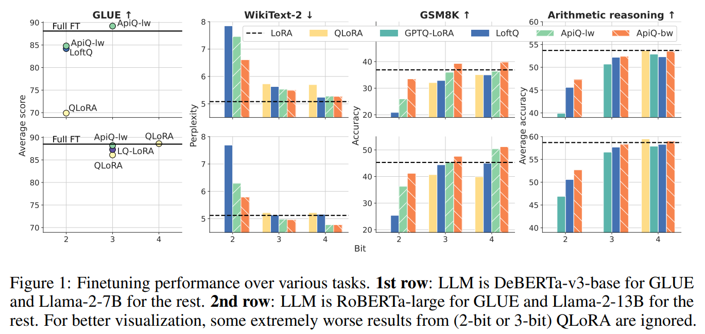

# 2 Preliminaries

#### GPU memory allocation

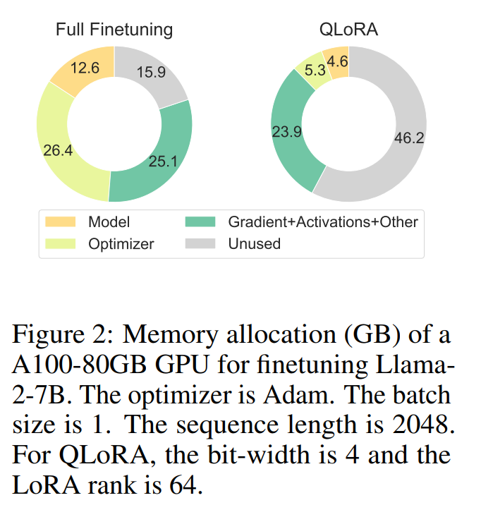

GPU memory allocation 과 utilization 은 model training 에서 세 가지 주요 메커니즘으로 나타난다. 

- Fig. 2 에서 Llama2-7B finetuning 예시로 볼 수 있다. full finetuning 에선 GPU memory 의 큰 부분이 model 의 weight 저장에 할당된다. 예를 들어, 약 7B parameter 를 가진 model 은 BFloat16 format 으로 약 $12.6 \, \text{GB}$ 가 필요하다. 
- 두 번째로, trainable parameter 와 관련된 optimizer state 가 GPU memory 의 상당 부분을 차지한다. Adam optimizer 를 사용하면 첫 번째와 두 번째 moment 를 GPU memory 에 저장해야 해서 trainable parameter 에 필요한 memory 요구가 두 배가 된다. 
  - 특히 model 의 weight 와 optimizer state 에 대한 memory allocation 은 정적이라 training 과정 내내 일정하다. 
- 세 번째는 activation 의 임시 저장이다. activation 은 data 가 model 을 통과하면서 각 layer 에서 생긴 output 이다. 
  - 이는 backward pass 동안 gradient 계산에 중요해서 memory 에 유지된다. gradient 계산 후엔 이 activation 이 버려진다. 
  - PyTorch 같은 현대 training framework 은 gradient 계산과 activation 삭제를 순차적으로 해서 memory 효율을 높인다. 
  - 그 다음 gradient 은 model 의 weight 와 optimizer state 를 업데이트하는 데 쓰이고, 그 후엔 삭제된다. peak memory usage 는 보통 gradient 계산 시작이나 optimizer state 업데이트 중에 생긴다.  

#### Memory-efficient finetuning.

GPU memory 제약과 LLM 크기 증가에 대응해 finetuning 중 memory 효율을 최적화하는 여러 전략이 개발됐다. 

- activation memory 요구를 줄이기 위해 selective activation storage 와 on-demand recomputation 같은 기술이 쓰인다. 
- 또 optimizer state 저장에 필요한 memory 를 줄이기 위해 pretrained LLM 은 고정하고 제한된 trainable parameter 를 도입한다. 

대표적인 예가 LoRA 다. LoRA 는 linear layer 의 pretrained weight $\boldsymbol{W} \in \mathbb{R}^{d_1 \times d_2}$ 를 $\boldsymbol{W}^{\prime} = \boldsymbol{W} + \alpha \boldsymbol{A} \boldsymbol{B}^{\top}$ 로 적응시킨다. 

- 여기서 $\boldsymbol{A} \in \mathbb{R}^{d_1 \times r}$, $\boldsymbol{B} \in \mathbb{R}^{d_2 \times r}$, $r \ll d_1$, $r \ll d_2$ 이고 
- $\alpha$ 는 scalar 다. 

smaller bottleneck dimension $r$ 을 도입해서 optimizer 의 memory 요구를 크게 줄인다. Fig. 2 에서처럼 $26.4 \, \text{GB}$ 에서 $5.3 \, \text{GB}$ 로 줄어든다. 

LoRA 의 memory 사용을 더 줄이기 위해 Dettmers et al. 은 $\boldsymbol{W}$ 의 quantized version 을 도입했다. 예를 들어 16 bit 대신 4-bit representation 을 써서 model 의 weight 저장에 필요한 memory 요구를 $12.6 \, \text{GB}$ 에서 $4.6 \, \text{GB}$ 로 줄인다.

#### Quantization

Quantization 은 high-precision values 을 discrete lvels 로 바꾸는 거다. 이 연구에선 uniform affine quantization 에 초점을 맞춘다. 이는 hardware 지원과 효율성이 뛰어나다. 이 과정은 pretrained weight 를 이렇게 quantize 한다:  

$$
\begin{equation}
    \boldsymbol{W}_q = \operatorname{clamp}\left( \left\lfloor \frac{\boldsymbol{W}}{s} \right\rceil + z, 0, 2^b - 1 \right)
\end{equation}
$$

- 여기서 scale factor $s = \frac{\max(\boldsymbol{W}) - \min(\boldsymbol{W})}{2^b - 1}$, 
- zero-point $z = -\left\lfloor \frac{\min(\boldsymbol{W})}{s} \right\rceil$, 
- $b$ 는 bit-width, 
- 그리고 $\lfloor\rceil$ 는 round-to-nearest operation 이다. 
- $\boldsymbol{W}_q$ 와 $z$ 는 줄어든 bit format 으로, $s$ 는 Float16 으로 GPU 에 로드된다. 
- forward pass 중엔 activation 계산을 위해 de-quantize 되는데, $Q = s (\boldsymbol{W}_q - z)$ 다.

# 3 Challenges of finetuning QLLM

QLoRA 는 fixed pretrained weight 를 lower-bit format 으로 GPU 에 로드하고, finetuning 을 adapter 의 minimal parameters 에 국한시키는 전략을 쓴다. 이 접근은 model 의 weight 와 optimizer state 에 필요한 memory allocation 을 크게 줄여서, Fig. 2 에서처럼 $39 \, \text{GB}$ 에서 $10 \, \text{GB}$ 로 줄인다. 이 memory computational resources 는 더 적은 계산 자원으로 LLM finetuning 을 가능하게 한다. 그래도 이 방법은 quantization 과 관련된 몇 가지 도전을 낳는다.

## 3.1 QLLM breaks down the starting point

LLM 은 널리 적용 가능하고 distributed representation 을 배우는 능력으로 유명하다. 이는 downstream task 의 compressed task-specific representation 학습을 효과적으로 지원한다. 즉, downstream task training 에 robust starting point 를 제공한다. 

Liao et al. 은 이 starting point 를 유지하는 게 중요하다고 주장한다. modified weight $\boldsymbol{W}^{\prime}$ 와 original weight $\boldsymbol{W}$ 의 차이가 최소여야 한다 (i.e., $\left\|\boldsymbol{W}^{\prime} - \boldsymbol{W}\right\| \rightarrow 0$). 이게 finetuning 시작 시 full finetuning 에 맞먹는 성능을 내는 데 핵심이다.  

- LoRA 는 $\boldsymbol{B} = \mathbf{0}$ 으로 초기화해서 이 원칙을 따른다. 그래서 training 시작 시 $\boldsymbol{W}^{\prime} = \boldsymbol{W}$ 가 된다. 
- 반면 QLoRA 는 LoRA 의 기본 초기화를 따른다. 그래서 training 시작 시 $\boldsymbol{W}^{\prime} = \boldsymbol{Q} + \boldsymbol{A} \boldsymbol{B}^{\top} = \boldsymbol{Q}$ 가 된다. 
- quantization 에 포함된 round-to-nearest 와 clipping operation 때문에 $\boldsymbol{Q}$ 는 original $\boldsymbol{W}$ 와 달라져서 starting point 가 왜곡된다. 이 차이, 즉 $\|\delta \boldsymbol{W}\| = \left\|\boldsymbol{W} - \boldsymbol{W}^{\prime}\right\|$ 는 lower-bit quantization 에서 더 커질 거라 예상된다.  

최근 Li et al. 과 Guo et al. 은 QLoRA 의 $\boldsymbol{Q}, \boldsymbol{A}, \boldsymbol{B}$ matrix 를 초기화하는 접근을 소개했다. 다음 optimization problem 을 풀어서다:  

$$
\begin{equation}
    \underset{\boldsymbol{Q}, \boldsymbol{A}, \boldsymbol{B}}{\operatorname{argmin}} \left\|\boldsymbol{W} - \left(\boldsymbol{Q} + \boldsymbol{A} \boldsymbol{B}^{\top}\right)\right\|
\end{equation}
$$

이 기술의 핵심 목표는 $\boldsymbol{Q}, \boldsymbol{A}, \boldsymbol{B}$ 를 얻어서 model 의 initial state (starting point) 를 최대한 보존하는 거다. Fig. 3 (Left) 에서 보듯 LoftQ 는 weight error 를 크게 줄인다.

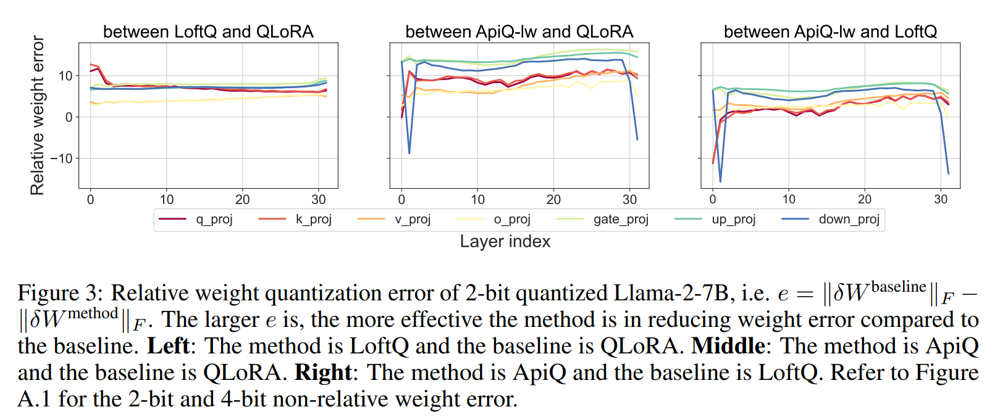

## 3.2 Accumulative quantization error

Hu et al. 의 연구는 LoRA module 을 query 와 value projection layer 에만 통합해도 full finetuning 성능을 맞출 수 있다고 강조한다. 이는 Dettmers et al. 의 주장과 대조된다. 그들은 QLLM 의 all linear layers 에 LoRA module 을 통합해야 비슷한 결과를 낸다고 본다.  

저자는 QLoRA 의 결론을 확장해서 DeBERTa-v3-base 와 Llama-2-7B 로 각각 MNLI 와 WikiText-2 데이터셋에서 finetuning 실험을 했다. 

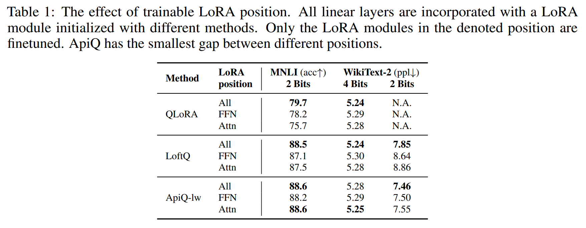

- Tab. 1 에서 보듯 QLoRA 에서 가장 효과적인 결과는 일부가 아니라 all linear layers 의 LoRA module 을 훈련했을 때 나온다. 
- 이 관찰로 저자는 quantization 때문에 각 linear layer 에서 배운 정보가 손실된다고 제안하게 됐다. 이 손실을 줄이고 original learned information 을 복구하려면 각 linear layer 를 LoRA module 로 개별적으로 적응시켜야 한다. 

게다가 quantization error 가 layer 를 거치며 누적되는 걸 알아챘다. 연속된 two linear layers $W_0$ 와 $W_1$ 을 생각해 보자. inputs 및 outputs 가 각각 $X_0$, $X_1$, $X_2$ 다. 

- QLoRA 의 quantization 아래에서 first layer 의 activation error 는 $\left\|X_1 - X^q_1\right\| = \left\|X_0W_0 - X_0Q_0\right\| = \left\|X_0W_0 - X_0(W_0 - \delta W_0)\right\| = \left\|X_0\delta W_0\right\|$ 다. 
  - 여기서 $\delta W_0$ 는 quantization error 다. 
- second layer 의 error 는 $\left\|X_2 - X^q_2\right\| = \left\|X_0W_0\delta W_1 + X_0\delta W_0W_1 - X_0\delta W_0\delta W_1\right\|$ 다. 
  - 이 현상은 shallower layer 에서 온 quantization error 가 deeper layer 로 전파된다는 걸 보여준다. deeper LLM 에선 영향이 더 클 수도 있다. 
  - 이 효과는 all quantized linear layers 에 LoRA module 을 넣어서 error 를 제때 막아야 한다는 또 다른 이유를 강조한다.  

LoftQ 가 quantization error $\delta W = W - (Q + AB^\top)$ 를 줄이는 데 발전을 이뤘음에도 error 전파 문제는 여전히 남아 있다. Tab. 1 에서 증거를 볼 수 있다. all LoRA modules 를 훈련하는 것과 일부만 훈련하는 것 사이의 성능 차이가 여전히 크다. 

특히 lower-bit quantization 에서 더 그렇다. 이런 발견은 quantization error 를 원천에서 줄이는 것뿐 아니라 layer 를 가로질러 전파를 관리하는 게 중요하다는 걸 강조한다.

## 3.3 SVD is not a universal solution

Li et al. 와 Guo et al. 은 Eq. 2 를 풀려고 반복 알고리즘을 적용했다:  

$$
\begin{equation}
    A^{(t)}, B^{(t)} \leftarrow SVD(W - Q^{(t-1})) \quad Q^{(t)} \leftarrow f(W - A^{(t)}B^{(t)\top})
\end{equation}
$$

여기서 $f$ 는 sequential quantization 과 de-quantization 을 위한 함수다:  

$$
\begin{equation}
    Q = f(W) = s \cdot \left(\text{clamp}\left(\left\lfloor \frac{W}{s} \right\rceil + z, 0, 2^b - 1\right) - z\right)
\end{equation}
$$  

이 알고리즘은 calibration data 없이도 효과적이지만, 다른 PEFT 방법엔 쉽게 적용할 수 없었다. LoRA 의 변형인 DoRA 조차도 그렇다. 이 알고리즘은 PEFT parameter 와 $W$ 사이에 덧셈 관계를 요구하는데, (IA)$^3$, Adapter, HiWi 같은 일부 PEFT 방법엔 불가능 하다.  

전체적으로 QLLM 을 효과적으로 finetuning 하려면 starting point 를 유지해야 한다. quantization error 의 propagation 을 줄여야 한다. 그리고 다양한 PEFT 방법에 맞는 범용 알고리즘을 설계해야 한다.

# 4 Method: ApiQ

이 섹션에서 저자는 QLLM 을 finetuning 할 때 앞서 언급한 모든 문제를 해결하는 새로운 quantization framework 인 Activation-preserved initialization of QLLM, 즉 ApiQ 를 소개한다. 

ApiQ 의 핵심 목표는 starting point 의 무결성을 유지하면서 network 를 통해 전파되는 quantization error 의 누적 영향을 효과적으로 줄이는 것이다.

## 4.1 Activation-preserved initialization

ApiQ framework 는 이전 방법처럼 weight error 를 줄이는 대신 activation error 를 최소화하는 데 초점을 맞춘 독특한 quantization 접근법을 도입한다. ApiQ 의 핵심 optimization 문제는 다음과 같이 정의된다:  

$$
\begin{equation}
    \underset{Q,A,B}{\operatorname{argmin}} \left\|XW - X^q (Q + AB^\top)\right\|
\end{equation}
$$  

- pretrained weight $W \in \mathbb{R}^{d_1 \times d_2}$ 는 optimization 중에 고정된다. 
- quantized weight $Q \in \mathbb{R}^{d_1 \times d_2}_b$ 는 b-bit format 으로 표현되고, 
- $A \in \mathbb{R}^{d_1 \times r}$ 와 $B \in \mathbb{R}^{d_2 \times r}$ 는 trainable low-rank matrix 이다. 
- linear layer $W$ 의 input 은 $X \in \mathbb{R}^{n \times t \times d_1}$ 로 나타낸다. 
  - 여기서 $n$ 은 batch size 이고 
  - $t$ 는 sequence length 다. 
  - 따라서 $XW$ 는 linear layer 의 output 이나 activation 을 뜻한다. 
- LoRA 가 있는 quantized linear layer 의 input 은 $X^q \in \mathbb{R}^{n \times t \times d_1}$ 다. 
- LLM 의 first linear layer 에서는 $X$ 가 $X^q$ 와 같다는 점을 주목해야 한다. 이후 layer 에서는 $X^q$ 가 $W$ 의 가장 가까운 shallower quantized layer 에서 나온 output 이다.  

LoftQ 와 LQ-LoRA 와의 주요 차이는 ApiQ 가 각 linear layer 를 input 순서에 따라 순차적으로 optimization 해야 한다는 점이다. $X^q$ 가 앞선 layer 에서 오기 때문이다. 

- 예를 들어, Llama-2 의 각 transformer block 에서 optimization 은 key, query, value projection layer 부터 시작해서 output projection layer, 
- 그 다음 gate 와 up projection layer, 
- 마지막으로 down projection layer 순으로 해야 한다.  

ApiQ 는 두 가지 주요 장점이 있다.  

- quantized linear layer 의 output 이 원래 output 과 가깝게 맞춰져서 model 의 starting point 를 보존한다.  
- shallower layer 에서 deeper layer 로의 quantization error 를 줄일 가능성이 있다.  

각 quantized layer 의 output 이 original output 과 가깝게 일치하도록 지속적으로 강제해서 network 를 통해 전파되는 quantization error 를 점진적으로 완화한다. 이 메커니즘은 LoftQ 와 LQ-LoRA 에 없어서 ApiQ 가 QLLM 에서 quantization error 를 관리하고 줄이는 데 독특한 이점을 준다.

## 4.2 Block-wise ApiQ

저자는 Eq. 4 를 layer-wise ApiQ (ApiQ-lw) 로 정의한다. LLM 이 layer 단위로 quantize 되기 때문이다. 추가로 transformer block 전체를 동시에 최적화할 수도 있다:  

$$
\underset{\boldsymbol{Q}_s, \boldsymbol{A}_s, \boldsymbol{B}_s}{\operatorname{argmin}} \left\|\mathcal{F}(\boldsymbol{W}_s, \boldsymbol{X}) - \mathcal{F}(\boldsymbol{Q}_s, \boldsymbol{A}_s, \boldsymbol{B}_s, \boldsymbol{X}^q)\right\|
$$  

- 여기서 $\mathcal{F}$ 는 transformer block 의 mapping function 이고, 
- $\boldsymbol{W}_s$ 는 이 block 안 all linear layers 의 weights 를 나타낸다. 
- $\boldsymbol{X}$ 는 이 block 의 input, 
- $\boldsymbol{Q}_s$ 는 $\boldsymbol{W}_s$ 의 quantized version, 
- $\boldsymbol{A}_s$ 와 $\boldsymbol{B}_s$ 는 이 block 안 all low-rank matrices 이다. 
- $\boldsymbol{X}^q$ 는 quantized block 의 input 이자 앞선 quantized block 의 output 이다. 

Block-wise ApiQ (_ApiQ-bw_) 는 sequential optimization 이 필요하지만 block 단위로 한다. 즉, first transformer block 을 최적화한 뒤 second block, 이런 식으로 진행한다.

ApiQ-bw 는 ApiQ-lw 의 장점을 유지하면서 두 가지 추가 이점이 있다. 

- ApiQ-bw 는 block 전체를 한 번에 quantize 해서 ApiQ-lw 보다 시간 효율적이다. 
- ApiQ-bw 는 all linear layers 에 대해 적응할 필요 없이 다양한 PEFT 방법과 호환된다. 

$\boldsymbol{A}_s$ 와 $\boldsymbol{B}_s$ 는 LoRA 의 low-rank matrix 일 필요가 없고, DoRA, (IA)$^3$, HiWi, Adapter 같은 PEFT 방법의 trainable parameter 가 될 수 있다.

## 4.3 Gradient-based optimization

Eq. 4 를 효과적으로 풀기 위해 ApiQ 는 conventional neural network training 과 비슷한 gradient-based algorithm 을 쓴다. 이 과정은 quantized weight $\boldsymbol{Q}$ 와 low-rank matrix $\boldsymbol{A}, \boldsymbol{B}$ 를 함께 최적화한다.

원래 Eq. 3 의 $f$ 는 trainable parameter 가 없는 static function 이었다. 기존 learnable quantization 방법에서 영감을 받아 ApiQ 는 각 weight matrix 에 two trainable parameters $\gamma$ 와 $\beta$ 를 도입한다. 이는 quantization 과정의 clipping range 를 제어한다:  

$$
s = \frac{\sigma(\gamma) \max(\boldsymbol{W}) - \sigma(\beta) \min(\boldsymbol{W})}{2^b - 1} \quad z = -\left\lfloor \frac{\sigma(\beta) \min(\boldsymbol{W})}{s} \right\rceil
$$  

- 여기서 $\sigma$ 는 sigmoid function 으로, clipping range 를 제한해서 값이 과도하게 커지는 걸 막는다. 
- 저자는 $\gamma = \beta = 4 \, (\sigma(4) \approx 0.98)$ 로 초기화해서 quantization 시작 시 original clipping range 를 유지한다.

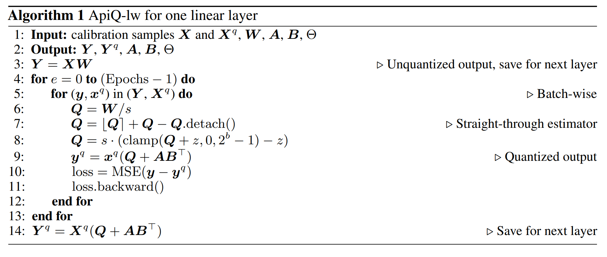

one linear layer 에 대한 optimization 은 Algorithm 1 에 나와 있다. 

- 이 과정에서 $\boldsymbol{A}, \boldsymbol{B}$ 와 $\Theta = \{\gamma, \beta\}$ 만 training 된다. 
- quantization function $f$ 에 round-to-nearest operation 이 포함돼 있어서 straight-through estimator 를 적용해 $\Theta$ 업데이트를 보장한다. 
- ApiQ-lw algorithm 은 memory 효율적으로 설계돼 각 layer 를 순차적으로 최적화한다. 즉, model inference 를 실행할 수 있는 GPU 면 ApiQ-lw 로 model 을 quantize 할 수 있다. 
- 각 layer 의 output $\boldsymbol{Y}$ 와 $\boldsymbol{Y}^q$ 는 다음 인접 layer 를 최적화하는 input 으로 쓰여서 efficient quantization 을 보장한다.  

ApiQ-bw 는 ApiQ-lw 와 거의 같은 optimization algorithm 을 쓴다. 주요 차이는 output $y$ 와 $y^q$ 가 linear layer 대신 transformer block 에서 나온다는 점이다. ApiQ-bw 는 ApiQ-lw 보다 time efficiency 는 나아졌지만, transformer block 내 layer 의 activation 을 더 캐시해야 해서 GPU memory usage 가 약간 더 높다.  

#### Preliminary experiments.

Fig. 4 에서 ApiQ 는 QLoRA 와 LoftQ 에 비해 activation error 를 큰 차이로 줄인다. 

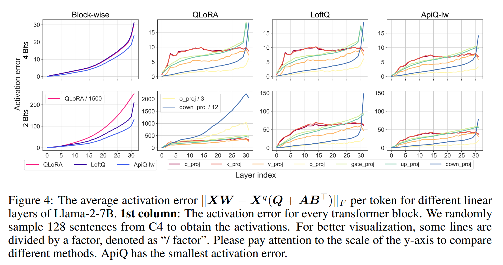

- lower-bit quantization 에서 더 두드러진다. 흥미롭게도, 저자의 목표가 activation error 를 줄이는 거였는데, Fig. 3 에서 보듯 ApiQ 의 weight error 도 대부분 layer 에서 가장 작다. 
- activation 과 weight error 를 모두 줄이는 이중 효과는 ApiQ 의 quantization 에 대한 포괄적인 성질을 보여준다. ApiQ 의 효과에 대한 추가 증거는 Tab. 1 에 있다. 
- ApiQ 는 다른 trainable LoRA position 에서 성능 차이가 가장 작다. 
- 어떤 경우엔 attention position 의 LoRA module 만 training 해도 LoRA 의 원래 결과처럼 최고 결과를 낸다. 이는 ApiQ 가 quantization error 의 누적 효과를 해결하고 줄이는 데 특히 뛰어나다는 걸 시사한다.

# 5 Experiments

이 섹션에서 저자는 ApiQ 를 language understanding, language modeling, arithmetic reasoning, commonsense reasoning task 에서 평가한다. 

DeBERTa-v3, RoBERTa, Llama-2, Mistral 을 quantize 해서다. QLoRA, LoftQ, LQ-LoRA 처럼 ApiQ 는 두 단계로 이뤄진다: quantization step 와 finetuning step. 

- quantization step 에서 $\boldsymbol{Q}, \boldsymbol{A}, \boldsymbol{B}$ 를 starting point 를 보존하고 quantization error 전파를 줄이는 방식으로 초기화한다. 
- finetuning step 에선 $\boldsymbol{Q}$ 를 lower bit 로 고정하고 $\boldsymbol{A}$ 와 $\boldsymbol{B}$ 를 half-precision (BFloat16) 으로 training 한다.

#### Implementation details.

- Algorithm 1 에서 ApiQ 의 quantization 과정은 calibration dataset 이 필요하다. 
- 저자는 WikiText-2 training set 에서 128 random sentence 를 뽑는다. 
- 기본적으로 all linear layers 에 LoRA module 을 통합한다. 
- 모든 방법의 quantization group size 는 64 다. 
- $\boldsymbol{A}, \boldsymbol{B}, \Theta$ 업데이트엔 AdamW optimizer 를 쓴다. quantization 과 finetuning step 의 자세한 구현 내용은 Appendix Sec. A 에서 재현 가능하도록 나와 있다.

#### Baseline.

- Baseline 으로 full finetuning (Full FT), LoRA, QLoRA, GPTQ-LoRA, LoftQ, LQ-LoRA 를 포함한다. Full FT 와 LoRA 는 finetuning 의 상한선으로 본다. 
- QLoRA 와 GPTQ-LoRA 는 각각 NF-quantization 과 uniform quantization 을 pretrained weight 에 적용하고 기본 LoRA 초기화를 쓴다. 
- 이 방법들은 memory 효율적이지만 starting point 를 왜곡한다. 반면 LoftQ 와 LQ-LoRA 는 $\boldsymbol{Q}, \boldsymbol{A}, \boldsymbol{B}$ matrix 를 초기화해서 초기 weight 상태를 보존한다. 그래서 ApiQ 에 강력한 baseline 이 된다.

## 5.1 Quantization quality

Sec. 4 에서 저자는 ApiQ 의 뛰어난 quantization 품질을 weight 와 activation error 비교로 증명했다. 여기선 ApiQ 를 post-training quantization (PTQ) 방법으로 더 평가한다. language modeling task 에서 다른 PTQ 방법과 비교한다.

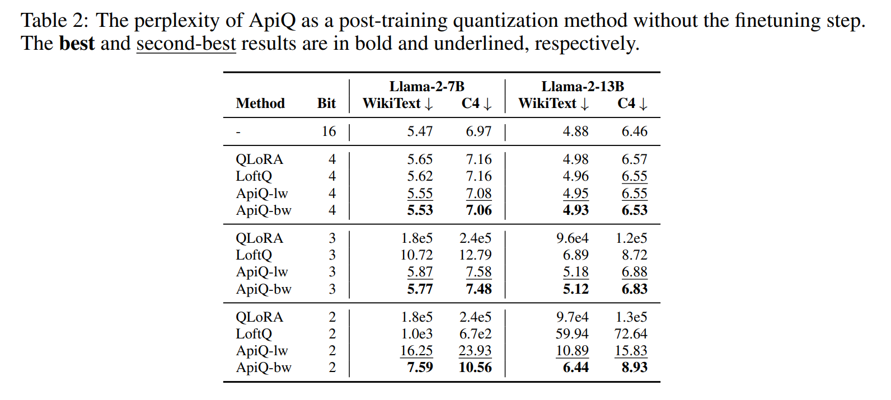

- 먼저 QLoRA, LoftQ, ApiQ 를 WikiText-2 test set 과 C4 validation set 에서 비교한다. 모든 방법의 quantization group size 는 64, LoRA rank $r$ 은 64 다. 
  - Tab. 2 에서 보듯 ApiQ-bw 와 ApiQ-lw 는 다양한 bit 수준에서 꾸준히 최고와 차선을 달성한다. 
  - 특히 lower bit level 에서 ApiQ 와 baseline 의 성능 차이가 더 커진다.
- 다음으로 ApiQ 를 RTN, GPTQ, AWQ, OmniQuant 같은 표준 PTQ 방법과 비교한다. ApiQ-lw 는 ApiQ-bw 가 더 나은 성능을 보여서 이번 비교에서 뺐다 (Tab. 2 참조). 
  - 저자의 목표가 기존 PTQ 방법을 단순히 능가하는 게 아님을 주목해야 한다. 
  - ApiQ 의 LoRA component 는 FP16 format 으로 저장돼서 parameter 당 average bit-width 가 높아진다. 그래서 다른 PTQ 방법과 직접 비교가 덜 공정하다. 
  - 대신 LoRA component 통합으로 quantization 어려움을 줄이는 새로운 PTQ 접근을 소개하는 게 목표다.

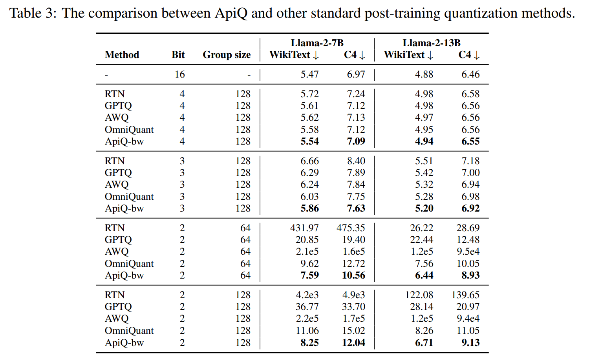

- Tab. 3 에서 보듯 ApiQ-bw 는 꾸준히 가장 작은 perplexity 를 낸다. lower bit levels 에서 이점이 더 크다. 
- ApiQ-bw 는 OmniQuant 와 LoRA 의 새 초기화를 결합한 걸로 볼 수 있다. 
- OmniQuant 는 LoRA parameter 없이 Algorithm 1 과 비슷한 quantization algorithm 을 쓴다. 그래도 ApiQ-bw 가 OmniQuant 를 능가해서 LoRA module 초기화와 LLM weight quantization 을 함께 하는 효과를 강조한다.

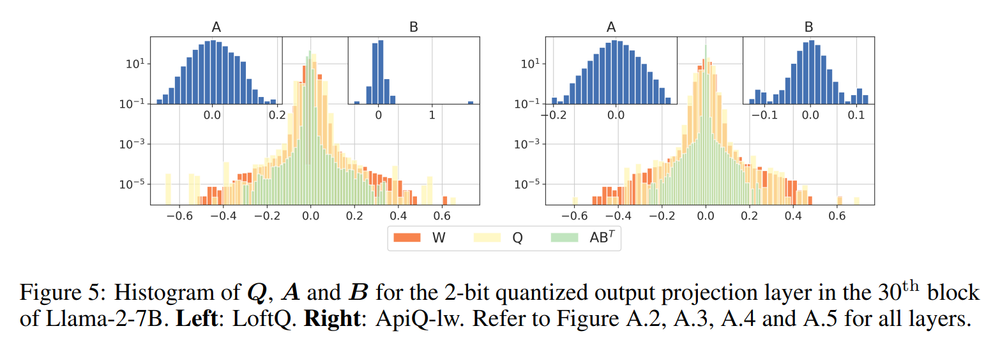

핵심 질문이 생긴다: ApiQ 는 quantization 의 lost information 을 어떻게 보상할까? Fig. 5 의 $\boldsymbol{Q}, \boldsymbol{A}, \boldsymbol{B}$ histogram 이 통찰을 준다. 

- Uniform quantization 은 $\boldsymbol{W}$ 의 중심 근처 값들을 같은 값으로 매핑해서 quantization error 를 낸다. 
- ApiQ 는 $\boldsymbol{A} \boldsymbol{B}^{\top}$ 를 이 핵심 영역에 맞춰서 해결한다. 
- 또 ApiQ 의 $\boldsymbol{A}$ 와 $\boldsymbol{B}$ 의 distribution span 은 $\boldsymbol{W}$ 와 LoftQ 에 비해 훨씬 좁다. 
- 이는 $\boldsymbol{A}$ 와 $\boldsymbol{B}$ 를 더 quantize 해서 전체 parameter 당 bit-width 를 줄일 가능성을 시사한다.

## 5.2 Quantization efficiency

이 섹션에서 저자는 ApiQ 와 다른 baseline 방법 간의 quantization 시간과 GPU memory 사용을 비교한다. quantization 의 자세한 구현 절차는 Appendix Sec. A.1 에 나와 있다. LLM 은 한 번만 quantize 하면 되고, 그 후 다양한 downstream task 에 finetuning 할 수 있어서 저장할 수 있다는 점이 주목할 만하다.

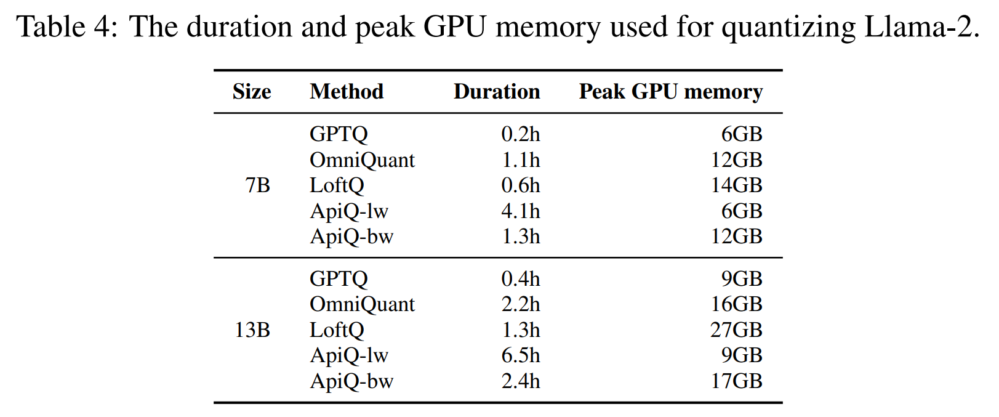

- Tab. 4 에서 보듯 GPTQ 는 가장 효율적인 PTQ 방법으로 돋보인다. 시간과 GPU memory 가 가장 적게 든다. 
- ApiQ-lw 는 GPTQ 와 비슷한 GPU memory 를 쓰지만 layer 단위로 순차적으로 optimization 해서 시간이 더 걸린다. 
- OmniQuant 와 비슷하게 ApiQ-bw 는 transformer block 안에서 더 많은 activation 을 캐시해야 해서 ApiQ-lw 보다 memory 를 더 먹는다. 그래도 ApiQ-bw 는 block 단위 quantization 방식 덕에 ApiQ-lw 보다 시간 효율이 훨씬 낫다. 
- LoftQ 는 SVD 때문에 GPU memory 가 가장 많이 필요하다. 
- 전체적으로 ApiQ 의 quantization 에 필요한 자원은 적당하고 finetuning 단계에 필요한 것보다 훨씬 적다.

## 5.3 Finetuning results

#### Natural language understanding

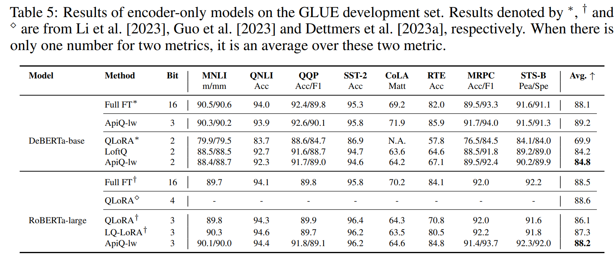

저자는 DeBERTa-v3-base 와 RoBERTa-large 를 GLUE task 에 finetuning 해서 결과를 Tab. 5 에 보인다. 

ApiQ 는 같은 quantization 수준에서 모든 baseline 을 평균적으로 앞선다. 3-bit quantization 에선 ApiQ 가 full finetuning 보다 낫거나 비슷하다.

#### Language modeling

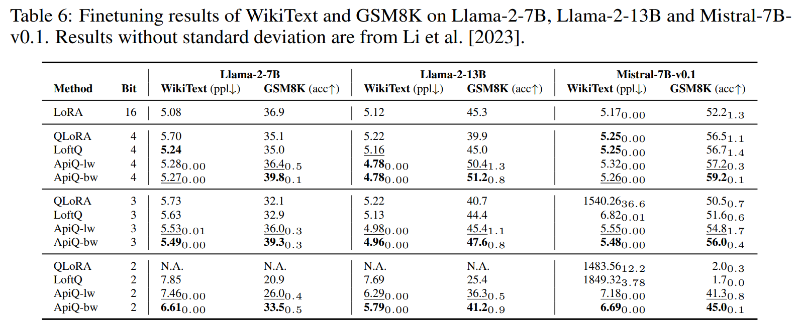

Llama-2-7B, Llama-2-13B 그리고 Mistral-7B-v0.1 을 WikiText-2 training set 에 finetuning 하고 validation set 에서 perplexity 를 Tab. 6 에 보고한다. 

- 테스트한 방법 중 ApiQ-bw 가 대부분 bit levels 에서 꾸준히 최고 성능을 내고, ApiQ-lw 가 그 다음으로 가깝다. lower bit level 에서 성능 차이가 더 두드러진다. 
- Llama-2-13B 에서 ApiQ 결과는 3-bit 와 4-bit levels 에서 LoRA (Float16) 보다도 낫다.

#### Arithmetic reasoning (single-task)

Llama-2 와 Mistral 을 GSM8K training set 에 finetuning 하고 test set 에서 accuracy 를 Tab. 6 에 보고한다. 

- WikiText-2 결과와 비슷하게 ApiQ-bw 와 ApiQ-lw 가 all bit levels 에서 각각 최고와 차선을 달성한다. 
- 두 ApiQ 모두 3-bit 와 4-bit 에서 LoRA 와 비슷하거나 더 낫다. 
- ApiQ-lw 나 ApiQ-bw 중 ApiQ-lw 는 quantization 에서 memory 효율이 더 좋다 (Sec. 5.2). 하지만 layer 단위 방식 때문에 quantization 시간이 더 걸린다. 
- quantization 품질 (Sec. 5.1), 효율성 (Sec. 5.2) 그리고 앞서 논의한 finetuning 결과를 기반으로 ApiQ-bw 를 추천한다. 그래서 다음 실험에선 ApiQ-lw 를 무시한다.  

#### Arithmetic reasoning

여기 설정은 이전 실험과 다르다. 이전엔 각 task 마다 별도 QLLM 을 finetuning 했지만, 여기선 Hu et al. 에 나온 통합 전략을 써서 all tasks 에 single QLLM 을 finetuning 한다. 

Llama-2 를 Math10K 에 finetuning 하고, finetuned QLLM 을 AQuA, GSM8K, MAWPS, SVAMP test set 에서 평가한다. 이런 설정은 LLM 이 여러 task 에 일반 model 로 자주 쓰이는 실용적인 시나리오이다.

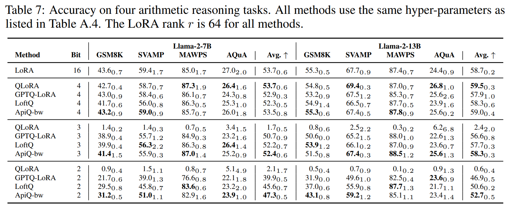

- Tab. 7 에서 보듯 ApiQ-bw 는 다양한 bit levels 에서 모든 quantization baseline 을 꾸준히 앞선다. 다만 4-bit level 에선 ApiQ 가 QLoRA 에 비해 살짝 밀린다. 
- Llama-2-7B 에서 53.5 vs. 53.7, Llama-2-13B 에서 59.0 vs. 59.5 이다. 하지만 QLoRA 의 3-bit 와 2-bit 결과는 극단적으로 나빠서 accuracy 가 3% 미만이.  

#### Commonsense reasoning

QLLM 의 commonsense reasoning 능력을 평가하려고 BoolQ, PIQA, SIQA, HellaSwag, WinoGrande, ARC-e, ARC-c, OBQA 8 tasks 에 초점을 맞춘다. 

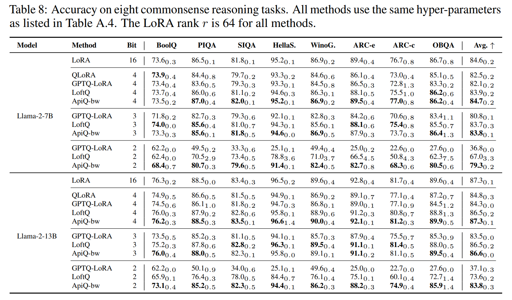

- 여러 arithmetic reasoning task 와 비슷하게, Tab. 8 에서 보듯 ApiQ-bw 가 average accuracy 에서 꾸준히 최고다. 
- 4-bit quantization 에선 ApiQ-bw 가 Float16 의 LoRA 와 비슷한 유일한 방법이다. 
- 2-bit quantization 에선 ApiQ-bw 가 GPTQ-LoRA 와 LoftQ 를 큰 차이로 앞서며 평균 accuracy 개선이 10% 넘게 나온다.

# 6 Discussion

#### ApiQ-bw for other PEFT

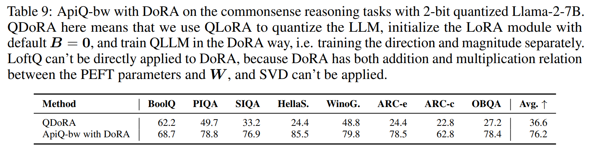

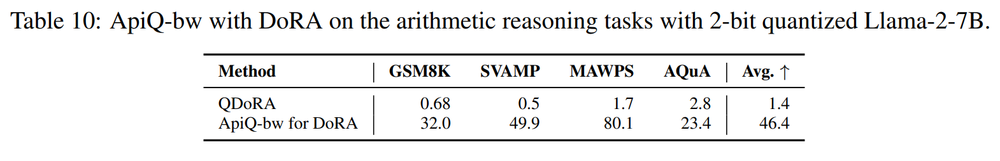

- Sec. 4.2 에서 논의했듯 ApiQ-bw 는 block 단위 quantization 방식 덕에 다른 PEFT 방법에 쉽게 적용할 수 있다. 여기선 ApiQ-bw 를 LoRA 의 최근 변형인 DoRA 에 적용해서 finetuning 결과를 Tab. 9 와 10 에 보인다. 
- ApiQ-bw 와 DoRA 조합은 QDoRA 를 큰 차이로 앞선다. commonsense reasoning 에서 평균 76.2 vs. 36.6, arithmetic reasoning 에서 46.4 vs. 1.4 이다.  

#### Performance vs. LoRA rank

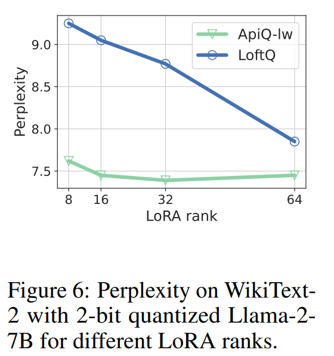

Fig. 6 에서 다른 방법에 대한 LoRA rank 의 영향을 보인다. 

ApiQ 는 LoRA rank 에 민감하지 않는다. 이는 ApiQ 가 more parameter efficient finetuning 방법이 될 수 있다는 뜻이다.

#### Why ApiQ works so well

여기서 ApiQ 가 효과적인 이유를 논의한다. 첫 번째 이유는 ApiQ 의 activation error 가 작다는 거다. LoftQ 와 QLoRA 에 비해 ApiQ 의 activation error 가 훨씬 작다. Tab. 2 에서 보듯 ApiQ 의 perplexity 가 훨씬 작기 때문이다. small activation error 를 유지하는 건 full-precision LLM 에서 learned knowledge 을 보존한다는 뜻이라 downstream task 로의 transfer learning 을 쉽게 해준다.

하지만 small activation error 를 유지하는 것만이 더 나은 finetuning 결과의 이유는 아니다. Tab. 2 에서 LoftQ 와 비교했을 때 Tab. 3 에서 GPTQ 가 smaller perplexity 를 보인다. 예를 들어, 2-bit quantized Llama-2-7B 에서 GPTQ 의 WikiText-2 perplexity 는 20.85 인데 LoftQ 는 1000 이상이다. 그럼에도 GPTQ-LoRA 의 finetuning 결과는 LoftQ 보다 나쁘다. arithmetic reasoning 에서 39.9 vs. 45.6, commonsense reasoning 에서 36.8 vs. 67.0 이다.

저자는 두 번째 이유가 $\boldsymbol{A}$ 와 $\boldsymbol{B}$ 의 더 나은 초기화 때문이라고 가정하자. $\boldsymbol{B} = 0$ 인 기본 초기화는 상수 값 때문에 training 에 친화적이지 않다. ApiQ 와 LoftQ 의 $\boldsymbol{A}$ 와 $\boldsymbol{B}$ 는 Gaussian distribution 에 가깝게 초기화된다 (Fig. 5). 이는 training 에 더 낫다고 보여졌다.

# 7 Related work

#### Large language model

Large language model 은 web-scale data 로 masked word prediction 나 next-word prediction 같은 일반 task 에 훈련된다. 이는 다양한 downstream task 로 지식을 옮기는 데 중요하다. 이런 model 은 다양한 응용에서 꾸준히 SOTA 결과를 냈다. 특히 LLM 의 크기를 키우는 건 downstream task 성능을 확실히 개선한다고 관찰됐다. 그래서 LLM size 가 점점 커져서 이제 50B parameters 이상의 놀라운 규모에 도달했다. 또 instruction-finetuned LLM 은 zero-shot 이나 in-context learning 같은 뛰어난 능력을 보여준다.

이런 발전에도 transfer learning 은 new task 환경에 model 을 효과적으로 적용하는 주된 전략이다. 하지만 이 접근은 계산 자원에 전례 없는 요구를 해서 효율적인 적응 전략이 필요함을 강조한다. ApiQ 는 LLM 의 weight 를 줄어든 bit format 으로 로드하고 trainable parameter 수를 줄여서 finetuning 의 GPU memory 요구를 줄인다. 또 QLoRA 와 그 변형에 비해 ApiQ 는 2-bit 나 3-bit 같은 lower-bit quantization 에 아주 좋은 방식이라 GPU memory 를 더 줄인다.

#### Post-training quantization (PTQ)

Post-training quantization (PTQ) 는 high-precision LLM 의 weight values 를 discrete values 로 바꿔서 memory usage 를 줄인다. LLM 크기가 커지면서 다양한 PTQ 방법들이 제안돼서 inference 중에 memory 를 덜 쓰면서 full-precision LLM 성능을 유지하려고 한다. 특히 PTQ 는 LLM 성능을 유지하는 것이며 new task 에 적응시키는 게 아니다. 또한 lower bit-width 에서 PTQ 성능이 크게 떨어진다. 

ApiQ 는 잘 되는 PTQ 방법이지만 주 목적은 LLM 을 new task 에 적응시키거나 lower-bit quantization 에서 full-precision LLM 성능을 유지하는 거다.

#### Quantization-aware training (QAT)

Quantization-aware training (QAT) 은 model 을 훈련할 때 quantization 효과를 고려해서 parameter 의 precision 을 줄이는 기술이다. 자원 제한 환경에서 model 을 배포할 때 성능 손실을 최소화하기 위함이다. QAT 는 LLM 을 downstream task 에 적응시키는 데 쓸 수 있지만 quantization 과 full finetuning 을 동시에 해서 memory 집약적이다. 

또 straight-through estimator 같은 기술이 full finetuning 중 gradient 계산에 필요해서 LLM training 이 불안정해질 수 있다. 반면 ApiQ 는 quantization 과 finetuning step 을 나눠서 finetuning 을 안정적이고 효율적이며 효과적으로 만든다.

#### Knowledge distillation

Knowledge distillation 은 large complex model (teacher model) 에서 small model (student model) 로 knowledge 를 옮겨서 small model 의 성능을 높이는 기술이다. 

ApiQ 는 layer-wise knowledge distillation 로 볼 수 있다. 여기서 teacher model 은 full-precision LLM 이고 student model 은 QLLM 이다. 하지만 ApiQ 는 knowledge 를 옮기는 데 128 calibration sentences 만 필요해서 훨씬 적은 샘플을 사용한다. 또 ApiQ 는 layer/block 단위로 한 번만 distillation 해서 GPU memory 를 많이 사용하지 않는다.

# 8 Conclusion

이 연구에서 저자는 ApiQ 라는 새로운 framework 를 제안한다. 

ApiQ 는 LLM 의 weight 를 quantize 하고 LoRA 의 component 를 함께 초기화해서 quantization 중 activation error 를 줄인다. 5 tasks 와 다양한 encoder-only, decoder-only model 로 광범위한 실험을 해서 ApiQ 의 LLM 적응 효과를 증명했다. lower-bit quantization 과 larger model 에서 strong baseline 보다 극단적으로 잘 된다. 추가 실험은 ApiQ 의 pure post-training quantization 방법으로서의 능력도 보여준다.  

# Limitations

ApiQ 는 인상적인 finetuning 결과를 보여주지만 구현에서 온 몇 가지 한계가 있다. LoftQ 에 비해 ApiQ 는 $\boldsymbol{W}$ 의 clipping range 를 정하고 $\boldsymbol{A}$ 와 $\boldsymbol{B}$ 를 초기화하려고 calibration dataset 이 필요하다. 

이 구현은 한 가지 명백한 단점이 있다: Tab. 4 에서 보듯 quantization 에 시간이 더 걸린다. LLM 은 다양한 task 에 finetuning 하려면 한 번만 quantize 하면 되므로, quantization 에 쓰이는 시간과 GPU memory 가 적당해서 이 한계는 받아들일 만하다고 본다.  

두 번째로, 시간과 자원 제약 때문에 ApiQ 를 제한된 task 수와 총 5 models 에서만 평가했다. 다른 task 와 LLM 에서 효과를 보장할 순 없고, 더 많은 task 와 model 을 포함해서 일반화를 보여주려고 아직 노력 중이다. 

post-training quantization 결과 (Sec. 5.1) 에선 ApiQ 가 baseline 과 parameter 당 같은 bit 수를 공유하는지 확인하지 않았다. 그래서 직접 비교가 공정하지 않을 수 있다. 이 연구의 주 초점이 finetuning 이라서 이 결과를 PTQ 에 대한 새 방법으로 주목받게 하려고 추가한 거다. 앞으로 ApiQ 를 weight 와 activation 모두 quantize 해서 더 빠른 inference 에 적용할 계획이다.