논문 및 이미지 출처 : <https://arxiv.org/pdf/2402.05445>

# Abstract  

LoRA-finetuning quantization 은 LLMs 을 리소스가 제한된 하드웨어에서 배포하기 위해 정확하면서도 compact 한 LLMs 을 얻는 방법으로 광범위하게 연구되어 왔다. 그러나 기존 방법들은 quantized LLM 이 심각하게 성능 저하를 일으키며, 심지어 LoRA 의 finetuning 으로부터 이점을 얻지 못하는 문제를 발생시킨다. 본 논문에서는 information retention 을 통해 quantized LLMs 이 LoRA 와 함께 highly accuracy 를 달성하도록 하는 novel **IR-QLoRA** 를 제안한다. 제안하는 IR-QLoRA 는 unified information 관점에서 유도된 두 가지 기술을 기반으로 한다.  

1. statistics-based **Information Calibration Quantization** 은 LLM 의 quantized parameters 가 original information 을 정확하게 보존할 수 있도록 한다.
2. finetuning-based **Information Elastic Connection** 은 LoRA 가 다양한 information 을 포함하는 elastic representation transformation 을 활용하도록 한다.

포괄적인 실험을 통해 IR-QLoRA 가 2-4 bit-width 환경에서 LLaMA 및 LLaMA2 계열 전반에 걸쳐 정확도를 크게 향상시킬 수 있음을 확인하였다. 예를 들어, 4-bit LLaMA-7B 는 SOTA 방법과 비교하여 MMLU 에서 1.4% 의 성능 향상을 달성하였다. 이처럼 큰 성능 향상에도 불구하고 additional time consumption 은 단 0.31% 에 불과하여 IR-QLoRA 가 우수한 효율성을 갖춘 방법임을 보여준다. 또한 IR-QLoRA 는 뛰어난 범용성을 지니며, 다양한 framework (e.g., NormalFloat 및 Integer quantization) 과 호환 가능하고, 일반적인 accuracy 향상을 제공한다.  

# 1. Introduction  

Large language models (LLMs) 은 natural language understanding 에서 강력한 성능을 보여주었다. LLMs 은 large-scale pretraining 과 downstream task 를 위한 finetuning 을 결합하여 다양한 실제 응용에 적응할 수 있다. 그러나 massive parameters 와 computation 으로 인해 LLM 은 배포 환경에서 높은 자원 요구 사항을 가지며, 때로는 극도로 높은 하드웨어 요구 사항을 필요로 한다. LLMs 의 inference 는 비용이 많이 들며, graphics processing units (GPUs) 와 같은 high-performance devices 에 크게 의존한다. 따라서 LLMs 의 compression 기법이 광범위하게 연구되었으며, 이를 통해 edge devices 에서의 배포를 가능하게 하고자 한다. Quantization 은 bit-width 를 줄여 LLMs 을 압축하는 유망한 방법으로 떠올랐으나, 일반적으로 정확도 저하가 심각하게 발생하는 문제가 있다. 예를 들어, GPTQ 를 사용한 quantized 4-bit LLaMA-7B 는 MMLU benchmark 에서 original model 과 비교하여 5-shot accuracy 가 1.5% 감소한다.

LoRA-finetuning quantization 은 LLM quantization 과 low-rank adaptation (LoRA) 의 parameter-efficient finetuning 을 결합한 인기 있는 패러다임이 되었다. 이 패러다임에 속하는 방법들은 주로 two phases 로 구성된다. 

1. post-training quantization (PTQ) 단계로, resource-saving calibration 을 통해 quantizers 를 학습하여 LLM 을 quantized 한다. 
2. LoRA finetuning 단계로, quantized LLM 은 고정된 상태에서 LoRA 만 finetuning 된다. LoRA-finetuning quantization 은 전체 LLM 을 finetuning 하는 것보다 자원과 시간을 절약하면서도 단순한 PTQ 수행 대비 높은 정확도를 제공할 수 있다.  

그러나 여러 연구에도 불구하고, 기존 LoRA-finetuning quantization 방법들은 여전히 정확도의 한계를 넘어서지 못하고 있다. 실험적으로 LLM quantization 으로 인한 information loss 가 심각하며, LoRA 로는 이를 효과적으로 복구할 수 없음을 확인하였다. 특히 ultra-low bit-width ($\leqslant$ 3-bit) 와 large model scale ($\geqslant$ 30B) 환경에서는 information loss 이 더욱 심화된다. bit-width 가 낮아질수록 개별 요소에서의 information loss 가 비선형적으로 증가하며, model scale 이 커질수록 전체적인 information loss 량이 급증한다. 이러한 경우, finetuned LoRA 가 downstream task 에서 high accuracy 를 달성하는 데 어려움을 겪는다. 예를 들어, finetuned LoRA 를 적용한 4-bit LLaMA-30B 는 finetuning 없이 사용한 original model 보다 낮은 정확도를 보이며, MMLU 기준으로 57.7% vs. 58.2% 의 성능을 기록한다.  

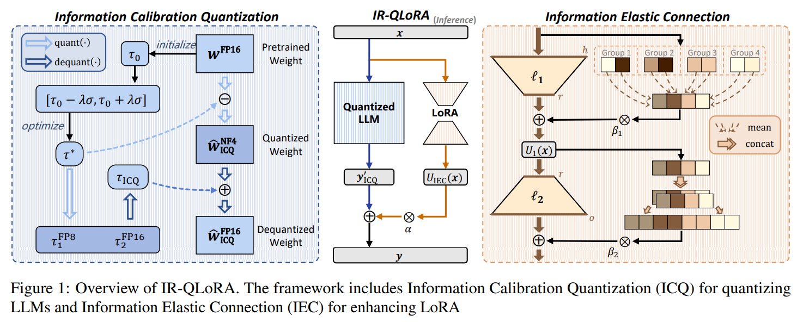

본 논문에서는 **I**nformation **R**etention 을 활용하여 높은 정확도를 가진 **Q**uantized LLMs with **LoRA** 를 얻기 위한 **IR-QLoRA** 를 제안한다 (Fig. 1 참고). LLM quantization 에 따른 information loss 문제를 해결하기 위해, 

1. **Information Calibration Quantization (ICQ)** 기법을 도입한다. ICQ 는 entropy maximization 을 활용한 calibration 을 통해, quantizers 가 original parameters 에서 quantized parameters 로 변환될 때 original information 을 유지하도록 한다. 
2. 또한, **Information Elastic Connection (IEC)** 을 제안하여 LoRA 의 information recovery 능력을 향상시킨다. IEC 는 LoRA 와 함께 작동하며, parameter-free elastic transformations 을 수행하여 original feature 의 정보를 활용하고, LoRA transformation 의 형태를 다양화한다.

IR-QLoRA 는 LoRA 를 활용한 정확한 quantized LLMs 을 달성하는 강력하고 일반적인 지원을 제공한다. MMLU benchmark 에 대한 광범위한 실험 결과, IR-QLoRA 는 다양한 bit-width 환경에서 기존 방법보다 확실한 성능 향상을 보이며, 특히 ultra-low bit-width (2-3 bit) 에서 더욱 두드러진다. 예를 들어, LLaMA 계열에서 2-bit IR-QLoRA 의 평균 정확도는 SOTA LoRA-finetuning quantization 방법보다 0.5% 높다. 또한, IR-QLoRA 가 제공하는 성능 향상은 매우 적은 추가 연산 비용을 요구하며, LLaMA-13B 기준으로 단 0.31% 의 추가 시간만 소요된다.  

더 나아가, IR-QLoRA 는 다양한 LoRA-finetuning LLM quantization frameworks 과 유연하게 통합될 수 있다. 예를 들어, QA-LoRA 와의 결합을 통해 4-bit LLaMA-7B 의 MMLU 성능을 추가적인 비용 없이 0.5% 향상시킬 수 있다.

# 2. Related Work  

LLMs 은 다양한 natural language understanding task 에서 뛰어난 성능을 보여주며, 이 분야에서 중요한 패러다임으로 자리 잡았다. 그러나 이러한 모델들은 자원이 제한된 환경에서 배포하기 어려운 문제가 있다. 따라서 LLMs 의 compression 기술에 대한 연구가 중요한 연구 분야로 떠올랐다. 기존 LLMs 의 compression 기술에는 pruning, distillation, low-rank decomposition, low-bit quantization 등이 포함된다. 이 중에서 quantization 은 LLMs 을 16-bit floating-point 에서 lower bit-width 로 변환하여 저장 공간과 연산 비용을 줄이는 것을 목표로 한다.

Compression 은 일반적인 bit-width 감소 관점에서 이루어지므로, quantization 은 efficient LLMs 을 얻기 위한 대표적인 방법으로 자리 잡았다. LoRA-finetuning quantization 은 computational cost 및 accuracy 간의 trade-off 를 달성하기 위해 등장한 방법으로, quantized LLMs 에 parameter-efficient LoRA 를 적용하여 finetuning 한다. 그러나 현재의 quantized LLMs with LoRA 는 여전히 이상적인 정확도에 도달하지 못하고 있다.

# 3. The Rise of IR-QLoRA  

## 3.1. Preliminaries  

일반적인 LoRA-finetuning quantization 방법론을 기반으로 LLMs 을 finetuning 하는 baseline 을 먼저 설명한다.

Finetuning 이전에, LLMs 의 weight 를 quantized 해야 한다. weight $w \in \mathbb{R}^{h \times o}$ 에 대한 quantization function 은 다음과 같다.  

$$
\begin{equation}
    \hat{w}^{\text{NF}k} = \text{NF}k\left(\frac{w}{s}\right) = \text{NF}k\left(\frac{w}{\text{absmax}(w)}\right),
\end{equation}
$$

여기서 $\hat{w}^{\text{NF}k}$ 는 quantized weight 를 나타내며, 기본적으로 quantization block size 는 64 로 설정된다. 또한, $s$ 는 $\text{absmax}(w)$ 를 이용하여 계산된 scaling factor 이다. $\text{NF}k(\cdot)$ 는 $k$-bit NormalFloat quantization 을 의미하며, LLMs 의 weights 를 $2^k$ values 를 $q_i$ 로 quantized 한다.  

$$
\begin{equation}
    q_i = \frac{1}{2} \left( Q\left(\frac{i}{2^k + 1}\right) + Q\left(\frac{i+1}{2^k + 1}\right) \right)
\end{equation}
$$

여기서 $Q(\cdot)$ 는 $\mathcal{N}(0,1)$ distribution 의 quantile function 이다. 이후, inference 중 LLMs 의 quantized unit 에 대한 연산 과정 (e.g., linear projection) 은 다음과 같이 표현된다.  

$$
\begin{equation}
    y' = x \hat{w}^{\text{FP}16} = x \left(\hat{w}^{\text{NF}k} \text{dequant}(s^{\text{FP}8}_1, s^{\text{FP}16}_2)\right)
\end{equation}
$$

여기서 $x \in \mathbb{R}^{b \times h}$, $y' \in \mathbb{R}^{b \times o}$ 는 각각 LLMs 의 quantized linear projection 의 input 과 output 을 나타낸다. $\text{dequant}(s^{\text{FP}8}_1, s^{\text{FP}16}_2)$ 는 original scaling factor $s$ 를 근사하도록 설계된 연산이며, $s$ 의 double-quantization 후, quantized values $s^{\text{FP}8}_1$ 와 scaling factors $s^{\text{FP}16}_2$ 을 얻을 수 있다. $\hat{w}^{\text{FP}16}$ 는 $\hat{w}^{\text{NF}k}$ 에서 dequantized 된 FP16 weights 를 의미한다.

LoRA 는 LLMs 의 quantized linear projection 을 향상시키기 위해 extra factorized projection 을 도입하는 finetunable parameters set 을 의미한다. Quantized linear projection (Eq. (3)) 에 LoRA 를 적용한 연산은 다음과 같이 표현된다.  

$$
\begin{equation}
    y = y' + \alpha x \ell_1 \ell_2
\end{equation}
$$

여기서 $\ell_1 \in \mathbb{R}^{h \times r}$, $\ell_2 \in \mathbb{R}^{r \times o}$ 는 finetunable parameters 이며, $\alpha$ 는 scalar 이다. inference 시에 LoRA 의 parameter efficiency 를 유지하기 위해, rank $r$ 은 input 및 output dimension ($h$ 와 $o$) 보다 훨씬 작으며, 이로 인해 LLMs 의 기존 linear projection 대비 메모리 및 연산 비용이 크게 감소한다 (e.g., $r = 64$ vs. $h = 4096$, $o = 4096$). finetuning 과정에서 backward propagation 동안 gradient 는 fixed quantized weights 를 통과하며, LoRA 의 parameters 만 업데이트된다.  

LLM 의 quantization 과정과 LoRA 의 finetuning 과정은 서로 독립적으로 수행된다. 먼저 PTQ 를 통해 LLM 의 low-bit quantized weights 를 생성한 후, LoRA 를 specific downstream tasks 에 맞춰 finetuning 하는 방식으로 진행된다.

## 3.2. Information Calibration Quantization  

### 3.2.1. Degeneration of Quantized LLMs  

앞서 설명한 baseline 에서 LLMs 은 pre-trained model 로부터 직접 quantized 되며, parameters 의 low-bit discretization 으로 인해 정확도가 저하된다. 기존 quantization 방법들은 이러한 성능 저하를 numerical quantization error 때문이라고 보지만, quantization 으로 인한 information loss 은 종종 간과된다.

구체적으로, LLMs 의 quantized weights 는 original weights 가 포함하는 information 을 반영해야 하지만, bit-width 가 줄어들면서 representation 능력이 심각하게 제한된다. information 관점에서 quantized weights 와 original LLMs weights 간의 의존성은 mutual information 으로 표현된다.  

$$
\begin{equation}
    \mathcal{I}(\hat{w}^{\text{FP}16}; w) = \mathcal{H}(\hat{w}^{\text{FP}16}) - \mathcal{H}(\hat{w}^{\text{FP}16} | w),
\end{equation}
$$

여기서 $\mathcal{H}(\hat{w}^{\text{FP}16})$ 는 $\hat{w}^{\text{FP}16}$ 의 entropy 를 의미하고, $\mathcal{H}(\hat{w}^{\text{FP}16} | w)$ 는 주어진 $w$ 에 대한 $\hat{w}^{\text{FP}16}$ 의 conditional entropy 를 의미한다. LLMs 의 quantization 에 deterministic quantizer 를 사용하기 때문에 $\mathcal{H}(\hat{w}^{\text{FP}16} | w) = 0$ 이며, 따라서 $\mathcal{I}(\hat{w}^{\text{FP}16}; w)$ 은 $\mathcal{H}(\hat{w}^{\text{FP}16})$ 에 의해 결정된다.  

PTQ 과정에서 original weights $w$ 는 변경되지 않으므로, Eq. (5) 의 mutual information $\mathcal{I}(\hat{w}^{\text{FP}16}; w)$ 를 maximizing 하는 건 다음과 같은 최적화 문제로 변환된다.  

$$
\begin{equation}
    \argmax_{s, s^{\text{FP}8}_1, s^{\text{FP}16}_2} \mathcal{H}(\hat{w}^{\text{FP}16}; s, s^{\text{FP}8}_1, s^{\text{FP}16}_2)
\end{equation}
$$

여기서 $\text{dequant}(s^{\text{FP}8}_1, s^{\text{FP}16}_2)$ 는 dequantization 과정에서 scalar 로 작용하므로, $\hat{w}^{\text{FP}16}$ 의 information entropy 에 영향을 주지 않는다. 따라서 위의 objective function 은 다음과 같이 단순화될 수 있다.  

$$
\begin{equation}
    \argmax_s \mathcal{H}(\hat{w}^{\text{NF}k}; s) = - \sum_{i=1}^{2^k - 1} P(q_i) \log_2 P(q_i),
\end{equation}
$$

여기서 $P(q_i)$ 는 $\hat{w}^{\text{NF}k}$ 가 value $q_i$ 을 갖을 확률을 나타낸다.  

Bit-width 가 크게 감소하면 representation 능력이 줄어들어 quantized weight 의 entropy 는 original weight 대비 크게 감소한다. 예를 들어, 4-bit quantized weight 의 representation candidates 수는 original 16-bit (FP16) weight 대비 $4096\times$ 감소하며, Eq. (6) 의 information entropy upper bound 는 16-bit 대비 4-bit 에서 $4\times$ 감소한다 (4-bit 의 4, 16-bit 의 16). 이는 정보의 양과 질이 심각하게 저하됨을 의미한다. 따라서 low-bit weights 내에서 information 을 최대한 보존하는 것이 quantized LLMs 의 성능을 향상시키는 핵심 요소가 된다.

### 3.2.2. Information Calibration Quantization for Representation Recovery  

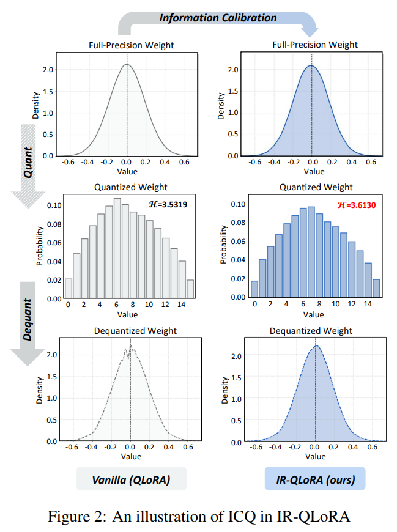

Quantized LLMs 에서 information loss 로 인한 성능 저하를 완화하기 위해 **Information Calibration Quantization (ICQ)** 기법을 도입한다 (Fig. 2 참고). ICQ 는 quantized weights 에 대한 fine-grained information maximization 을 수행하여 정확도를 향상시키는 방법이다.  

우선, quantizer 에 calibration constant $\tau$ 를 도입하여 정보 보존의 유연성을 확보한다. 이때 quantization 과정은 다음과 같이 표현된다.  

$$
\begin{equation}
    \hat{w}^{\text{NF}k} = \text{NF}k \left( \frac{w - \tau}{s} \right).
\end{equation}
$$

original weight $w$ 가 고정되어 있으므로, Eq. (6) 의 optimization objective 는 다음과 같이 정리된다.  

$$
\begin{equation}
    \argmax_{\tau, s}\ \mathcal{H}(\hat{w}^{\text{NF}k}; \tau, s).
\end{equation}
$$

그러나 Eq. (9) 의 objective 를 직접 해결하는 것은 계산적으로 복잡하고 시간이 많이 소요된다. 따라서, information entropy maximization 을 활용하여 LLMs 의 quantizers 를 block-wise 로 조정하는 두 단계 전략을 제안한다.  

#### The first step

first step 으로는 calibration constant $\tau$ 의 initialization 을 수행하는 것이다. Neural networks 의 weight distribution 이 symmetrical normal distribution 을 따른다는 일반적인 가정에 기반하여, 각 quantization block 의 weights 에 대해 median $\tau_0 = \text{quantile}_{\frac{1}{2}}(w)$ 으로 constant 를 설정한다. Normal distribution 에서는 symmetry axis 에 가까울수록 probability density 가 높으므로, 이 initialization 은 quantizer 가 interval 을 더 효과적으로 활용할 수 있도록 한다. 또한, position-dependent median 설정을 통해 $\tau_0$ 가 outlier 로 인한 영향을 완화하도록 한다.

#### The second step

second step 에서는 calibration constant $\tau$ 및 scaling factors $s_1$ 과 $s_2$ 를 optimizing 한다. 저자는 information entropy 를 Eq. (5) 의 metric 으로 활용하며, search-based optimization 을 수행하여 최적의 $\tau^*$ 값을 찾는다. $\tau$ 의 search spaces 는 $[\tau_0 - \lambda \sigma, \tau_0 + \lambda \sigma]$ 범위를 $2n$ candidates 로 선형 분할하여 생성하며, 여기서 $\sigma = 1$ 은 $\mathcal{N}(0,1)$ 의 standard deviation 이고, $\lambda$ 는 coefficient 이다. 실험적으로 $\lambda = 0.1$, $n = 100$ 으로 설정하여 정확성과 탐색 효율성 간의 trade-off 를 달성한다.  

각 candidate $\tau$ 에 대해 weight 을 조정하고, Eq. (8) 을 이용해 quantized weights 의 information entropy 를 계산한 후, maximum entropy 를 갖는 optimal calibration constant $\tau^*$ 를 선택한다. $w - \tau^*$ 에 대한 scaling factor $s$ 는 double-quantized 되어 $s^{\text{FP}8}_1$ 및 $s^{\text{FP}16}_2$ 값으로 변환된다.  

optimized calibration constant $\tau^*$ 는 메모리 절약을 위해 scale 과 유사한 방식으로 double quantization 된다. ICQ 의 quantization 및 dequantization 과정은 다음과 같이 요약된다.  

$$
\begin{equation}
    \begin{align*}
        &\hat{w}^{\text{NF}k}_\text{ICQ} = \text{NF}k \left( \frac{w - \tau^*}{\text{absmax}(w - \tau^*)} \right) \\
        &\hat{w}^{\text{FP}16}_\text{ICQ} = \hat{w}^{\text{NF}k}_\text{ICQ} \cdot \text{dequant}(s^{\text{FP}8}_1, s^{\text{FP}16}_2) + \text{dequant}(\tau^{\text{FP}8}_1, \tau^{\text{FP}16}_2).
    \end{align*}
\end{equation}
$$

여기서 $\tau^{\text{FP}8}_1$ 와 $\tau^{\text{FP}16}_2$ 는 quantized calibration constant 및 double quantization 에 대한 scaling factor 이다. ICQ 를 적용한 LLMs 의 inference 과정은 다음과 같이 표현된다.  

$$
\begin{equation}
    y'_\text{ICQ} = x \hat{w}^{\text{FP}16}_\text{ICQ}
\end{equation}
$$

저자의 ICQ 기법은 quantized weight 의 information entropy 를 극대화하여 information degradation 을 줄이고, representation 능력을 복원한다. Fig. 2 에서 확인할 수 있듯이, ICQ 로 calibration 된 quantized weights 는 더 많은 정보를 유지하며, dequantization 후 original distribution 을 더욱 정확하게 복원한다.

## 3.3. Information Elastic Connection  

### 3.3.1. Limitation of Finetunable LoRA  

Baseline 에서 quantized LLM 뿐만 아니라, finetunable LoRA 의 제한된 representation 능력 또한 information recovery 을 방해하는 주요 요인이다. LoRA 는 LLM 의 weight quantization 으로 인한 성능 저하를 완화하기 위해 downstream task 용으로 additional adapter 를 finetuning 하며, 때로는 상당한 성능 향상을 가져오기도 한다. LoRA 의 finetuning 과정은 LLM 의 weight subsets 를 finetuning 하는 것으로 볼 수 있으며, low-rank parameters 를 활용하여 efficient finetuning 을 수행할 수 있다. 이를 통해 LLM 전체를 직접 finetuning 할 때 발생하는 높은 연산 비용과 저장 공간 요구 사항을 피할 수 있다.

그러나 LoRA 가 parameter-efficient finetuning 을 수행함에도 불구하고, 여전히 information representation 능력에 상당한 제한이 있으며, 이는 LoRA 를 적용한 quantized LLM 이 정확도를 확보하는 데 방해가 된다.  

1. LLM 내의 기존 linear projection 과 비교할 때, LoRA 의 parameter transformation 은 여전히 상대적으로 균질한 변환 구조를 갖고 있으며, 다만 lower rank 일 뿐이다.  
2. LoRA 의 information utilization 능력은 제한적이다. Eq. (3) 에서 볼 수 있듯이, low-rank matrix $\ell_2$ 는 이전 transformation 에 의해 생성된 변환된 representation matrix $\ell_1$ 만 활용할 수 있으며, original representation information 에는 접근할 수 없다.  

따라서 LoRA 의 representation 능력에 대한 제약을 해제하면 quantized LLM 의 정확도를 더욱 향상시킬 수 있을 것으로 기대된다.

### 3.3.2. Information Elastic Connection for Information Enhancement  

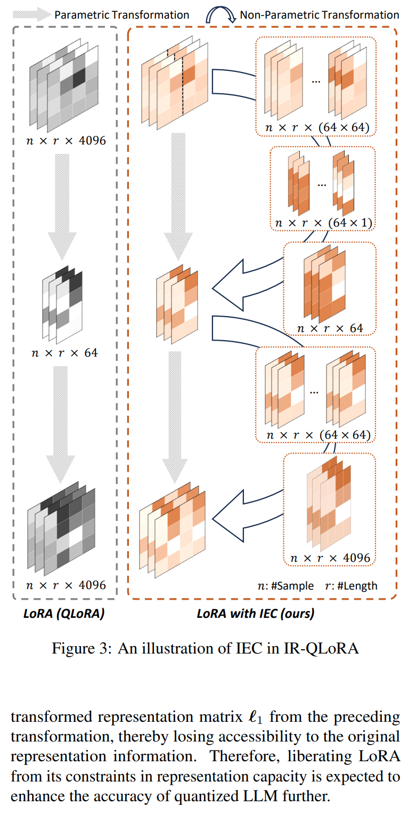

LoRA 의 representation 능력을 강화하여 quantized LLMs 의 information recovery 을 돕는 동시에, LoRA 의 lightweight 특성을 유지하기 위해 효과적인 **Information Elastic Connection (IEC)** 을 제안한다. Fig. 3 에서 확인할 수 있듯이, IEC 는 LoRA 를 위한 parameter-free connection 을 구성하여, quantized LLM 으로부터 얻어진 information 을 더욱 효과적으로 활용하고, information transformation 의 다양성을 증대한다.  

Eq. (4) 처럼, one LoRA unit 의 input 은 previous quantized LLM 및 LoRA units 로부터 생성된다. $h$-dimensional input $x$ 는 $\ell_1$ matrix 를 통해 low-rank $r$ dimensional intermediate features 로 변환된 후, $\ell_2$ matrix 를 거쳐 $o$-dimensional output 으로 복원된다. 보통 $r \ll \min\{h, o\}$ 이므로, LoRA matrix pairs 를 위한 flexible parameter-free connection 을 구성하여 각 LoRA matrix 가 original input representation $x$ 를 최대한 활용할 수 있도록 한다.  

구체적으로, input 및 intermediate dimension 의 최대공약수 (greatest common divisor, gcd) 를 기준으로 original feature 를 grouping 하여 평균을 구한 후, 이를 $\ell_1$ matrix 에 의해 계산된 output 에 추가한다. IEC 가 적용된 LoRA 의 first sub-unit $U_1$ 은 다음과 같이 표현된다.  

$$
\begin{equation}
    U_1(x) = x\ell_1 + \beta_1 \prod^{\frac{r}{\gcd(h,r)}} \left( \frac{\gcd(h, r)}{h} \sum_{i=1}^{\gcd(h,r)} x^{[(i-1) \frac{h}{\gcd(h,r)}: i \frac{h}{\gcd(h,r)} -1]}\right),
\end{equation}
$$

- 여기서 $x^{[m:n]}$ 은 $x$ 의 $m$ 번째부터 $n$ 번째까지의 dimension 을 나타내며, 
- $\gcd(h,r)$ 은 $h$ 와 $r$ 의 최대공약수를 의미한다. 
- $\beta$ 은 layer-wise learnable scalar 이며, 
- $\sum$ all divided features 의 summation 를 의미한다. 
- $\prod$ 는 $\frac{r}{\gcd(h,r)}$-time 반복된 concatenation 연산을 의미하며, 
- Eq. (12) 의 second term 의 dimension 은 $r$ 이 된다. 

이러한 과정을 통해 parameter-free operation 으로 representation 을 low-rank 형태로 변환하면서 original information 을 유지할 수 있다.  

LoRA 의 second matrix 는 low-rank intermediate representation 을 higher dimension 으로 변환하며, 이 과정에서 $x'=U_1(x)$ 에 parameter-free repeated concatenation 을 수행하여 IEC 의 second sub-unit $U_2$ 를 구성한다. 그 과정은 다음과 같이 표현된다.  

$$
\begin{equation}
    U_2(x') = x' \ell_2 + \beta_2 \prod^{\frac{o}{\gcd(o,r)}} \left( \frac{\gcd(o,r)}{r} \sum_{i=1}^{\gcd(o,r)} {x'}^{[(i-1) \frac{r}{\gcd(o,r)}: i \frac{r}{\gcd(o,r)} -1]} \right),
\end{equation}
$$

여기서 $x'$ 는 먼저 $\gcd(o,r)$-dimension 에 맞춰 정렬된 후, $\frac{o}{\gcd(o,r)}$ 번 반복적으로 concatenation 되어 $\ell_2$ matrix 의 계산 결과와 연결된다.  

일반적으로 LoRA unit 에서, input dimension $h$ 와 output dimension $o$ 는 low-rank $r$ 의 배수인 경우가 많으며, 이때 $\gcd(h,r) = r$ 및 $\gcd(o,r) = r$ 이 성립한다. 이러한 경우, Eq. (12) 및 Eq. (13) 는 다음과 같이 단순화된다.  

$$
\begin{equation}
    \begin{align*}
        &U_1(x) = x\ell_1 + \beta_1 \frac{r}{h} \sum_{i=1}^{r} x^{[(i-1) \frac{h}{r}: i \frac{h}{r} -1]}, \\
        &U_2(x') = x' \ell_2 + \beta_2 \prod^\frac{o}{r} x'.
    \end{align*}
\end{equation}
$$

IEC 를 적용한 quantized LLM projection 및 LoRA 의 전체 연산 과정은 다음과 같이 표현된다.  

$$
\begin{equation}
    y = y'_\text{ICQ} + \alpha U_\text{IEC}(x) = y'_\text{ICQ} + \alpha U_2 \circ U_1(x).
\end{equation}
$$

IEC 는 input 을 elastic dimension 변환과 함께 전달하며, 이를 통해 LoRA 내부의 matrix 가 quantized LLM projection 에 의해 추출된 original information 을 직접 활용할 수 있도록 한다. 또한, parameter-free IEC 는 기존 LoRA 의 parametric matrix multiplication 방식과 비교하여 보다 다양한 information representation 을 가능하게 하며, quantized LLMs 의 information representration 을 더욱 강화한다.

# 4. Experiment  

IR-QLoRA 의 정확도와 효율성을 광범위하게 평가하였다. IR-QLoRA 는 LLaMA 및 LLaMA2 (7B, 13B, 30B, 65B) 을 기반으로 구축되었으며, Alpaca 및 Flan v2 dataset 에서 parameter-efficient finetuning 을 수행하였다. 평가를 위해 Massively Multitask Language Understanding (MMLU) 와 CommonsenseQA (e.g., HellaSwag, PIQA) benchmark 를 사용하였다.  

실험 설정은 기존 연구에서 보고된 설정 또는 공식 코드에서 제공된 설정을 따르며, 비교의 공정성을 유지하였다. 모든 실험은 Nvidia Tesla A100 GPUs 에서 수행되었다.

## 4.1. Main Results

IR-QLoRA 의 성능을 평가하기 위해 다양한 실험을 수행하였으며, IR-QLoRA 를 기존 SOTA LoRA-finetuning quantization 방법들과 비교하였다. 비교 대상으로는 **QLoRA** 와 **QA-LoRA** 를 포함하였으며, LoRA 없이 적용된 **PEQA** 도 함께 분석하였다. Tab. 1 과 Tab. 2 에서 Alpaca 와 Flan v2 dataset 으로 finetuning 된 모델의 MMLU 5-shot accuracy 결과를 제시한다.

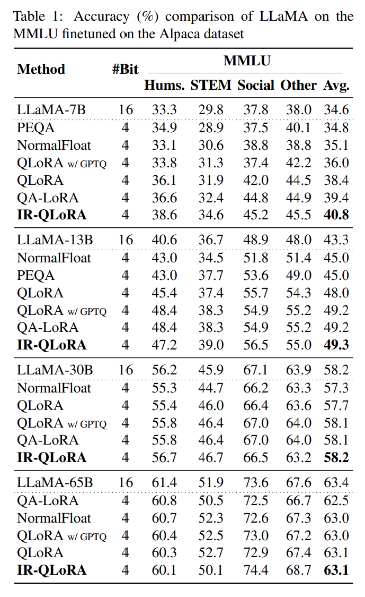

- 실험 결과, 다양한 크기의 LLaMA 모델에서 IR-QLoRA 는 모든 비교 대상 quantization 방법보다 안정적으로 우수한 성능을 보였다. 
- 기존 baseline 방법인 QLoRA 와 비교했을 때, IR-QLoRA 는 동일한 finetuning pipeline 을 적용한 환경에서 MMLU benchmark 에서 상당한 정확도 향상을 달성하였다.  
- 구체적으로, Tab. 1 에서 보듯이, 4-bit LLaMA-7B model 이 Alpaca dataset 에서 IR-QLoRA 를 사용하여 finetuning 되었을 때 40.8% 의 정확도를 기록하였으며, 이는 QLoRA (38.4%) 보다 2.4% 향상된 결과이다. 
- 이러한 추세는 LLaMA-13B 및 LLaMA-30B model 에서도 지속되었으며, 각각 1.3% 및 0.5% 의 정확도 향상을 보였다.  
- GPTQ 기반 QLoRA 및 integer quantization 을 적용한 SOTA QA-LoRA 와 비교하더라도, IR-QLoRA 는 다양한 실험 설정에서 일관되게 우수한 성능을 기록하였으며, 특히 LLaMA-7B 에서 1.4% 의 성능 향상을 보였다. 
- IR-QLoRA 의 다양한 quantizer variants 를 포함한 추가적인 실험 결과는 Sec. 4.3 에서 다루며, 이는 IR-QLoRA 가 다양한 quantization 방법에서도 견고한 성능 향상을 제공함을 보여준다.  

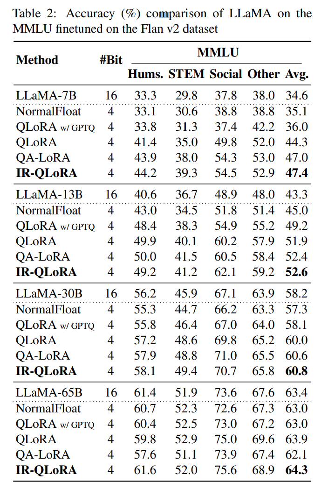

Tab. 2 에서는 Flan v2 dataset 을 사용하여 얻어진 결과를 제시한다. 

- Alpaca dataset 과 유사한 패턴이 나타났으며, IR-QLoRA 는 다양한 실험 설정에서 SOTA 방법을 꾸준히 능가하였다. 
- 또한, Flan v2 dataset 을 통한 finetuning 이후에도 성능이 향상되는 경향을 보였다. 
  - 예를 들어, LLaMA-7B model 에서 IR-QLoRA 의 성능을 비교하면 Alpaca: 47.4% vs. Flan v2: 40.8% 로 확인되며, 다양한 LLaMA model size 에서 QLoRA 대비 평균 1.25% 의 성능 향상이 있었다. 이는 IR-QLoRA 가 다양한 finetuning dataset 을 사용할 때도 안정적인 성능 향상을 제공함을 의미한다.  
- 추가적으로, 최근 제안된 LLaMA2 model 을 대상으로도 정확도 비교 실험을 수행하여, IR-QLoRA 가 LLM 계열 전반에 걸쳐 뛰어난 generalization 성능을 보이는지 평가하였다. 
  - 구체적으로, IR-QLoRA 를 LLaMA2-7B 및 LLaMA2-13B model 에 적용하고, 이를 기존 QA-LoRA 방법과 비교하였다.  

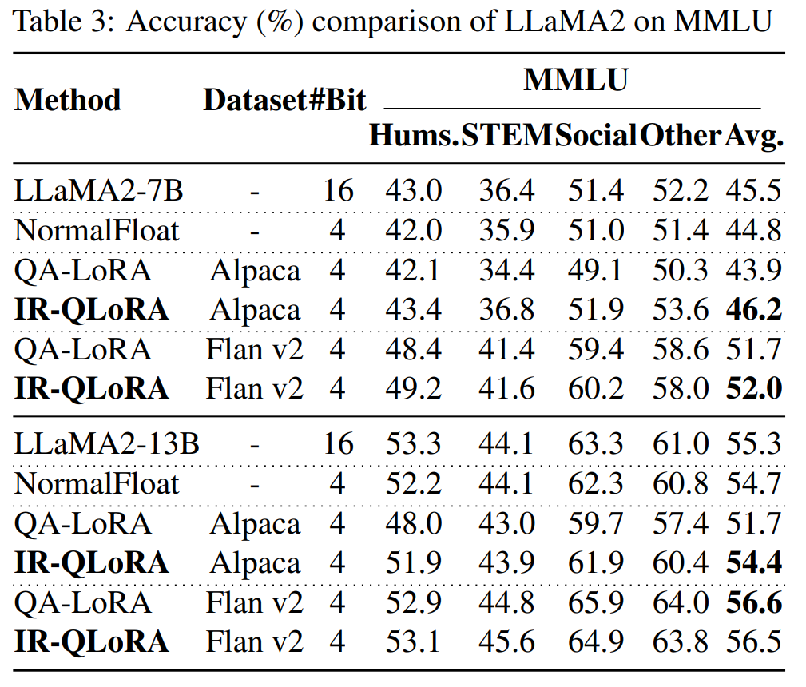

Tab. 3 의 결과에서 확인할 수 있듯이, IR-QLoRA 는 LLaMA2-7B model 에서 2.7% 의 성능 향상을 달성하였으며, 거의 모든 개별 평가 지표에서 우수한 성능을 기록하였다. 이러한 결과는 IR-QLoRA 가 다양한 LLM 계열에서도 strong generalization 성능을 유지할 수 있음을 시사한다.

## 4.2. Ablation Study  

제안된 IR-QLoRA 의 정확도 및 효율성에 대한 각 기법의 효과를 검증하기 위해, MMLU benchmark 에서 4-bit LLaMA-7B model 을 대상으로 ablation study 를 수행하였다.  

#### Accuracy Ablation

Fig. 4 에서 확인할 수 있듯이, ICQ 를 적용한 quantized weights 의 entropy 값이 다양한 layer 에서 vanilla QLoRA 대비 지속적으로 높은 값을 유지한다. 이는 ICQ 가 LLMs 의 quantized weights 와 original weight 간의 mutual information 을 효과적으로 증가시키며, information loss 을 줄이는 역할을 함을 의미한다. 그 결과, ICQ 적용 시 정확도가 1.9% 증가하는 것을 Tab. 4 에서 확인할 수 있다.  

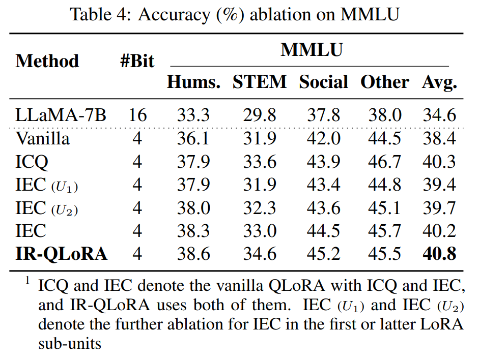

IEC 의 효과를 검증하기 위한 실험도 수행하였다. 먼저, IEC 를 Vanilla QLoRA 에 직접 적용한 경우, Tab. 4 에서 확인할 수 있듯이 1.8% 의 성능 향상이 발생하였다.  

그다음, IEC 를 first 및 latter sub-units 에 각각 적용하여 보다 심층적인 관찰을 수행하였으며, 두 경우 모두 성능이 향상됨을 확인하였다 (IEC ($U_1$) 1.0% vs. IEC ($U_2$) 1.3%). 더욱이, ICQ 와 IEC 를 결합했을 때, 이들의 상승 효과(synergistic effect) 가 개별적인 기여를 뛰어넘으며, quantized model 이 최대 40.8% 정확도를 달성하도록 한다.  

또한, LoRA 및 fine-tuning 없이 IR-QLoRA 내에서 제안된 ICQ 단독 적용 시 quantized LLMs 의 성능을 분석하고, MMLU benchmark 에서의 상세한 정확도 및 quantized LLMs 의 average information entropy 를 제시한다.  

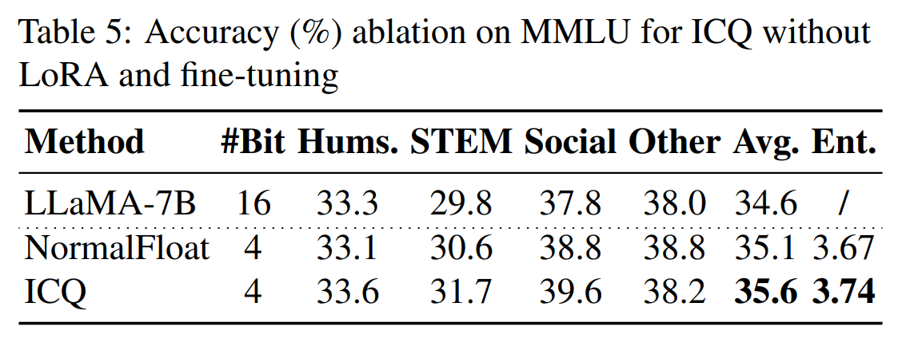

Tab. 5 에서 볼 수 있듯이, ICQ 는 finetuning 없이도 quantized LLMs 의 weight entropy 를 단독으로 증가시킬 수 있으며, NormalFloat quantization 과 비교했을 때 실험 결과에 상당한 기여를 한다 (average accuracy 가 0.5% 증가). 또한, ICQ 를 적용한 quantized LLMs 과 적용하지 않은 경우의 average information entropy 를 비교하였다.  

IR-QLoRA 의 ICQ 적용 시, average entropy 가 0.07 증가하며, 이는 quantized weight 의 information retention 능력이 유의미하게 향상됨을 의미한다. 이 결과는 ICQ 가 information retention 을 통해 정확도를 향상시킨다는 근본적인 동기를 입증한다.

#### Efficiency Ablation

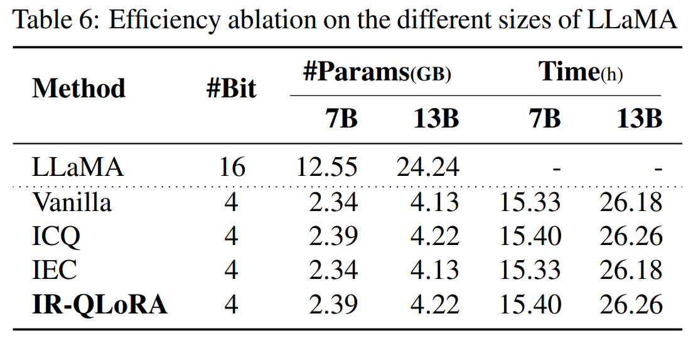

Tab. 6 은 제안된 ICQ 와 IEC 기법이 additional storage 및 training overhead 를 거의 발생시키지 않음을 보여준다. ICQ 의 경우, added parameters 는 quantized scaling factor 와 동일한 수준이며, double quantization 을 적용하여 storage 를 더욱 줄인다. 따라서, ICQ 로 인해 발생하는 additional storage 는 4-bit LLaMA-7B 에서 단 2.04% 증가하는 데 그친다. 또한, $\tau$ 의 optimization process 에서 추가되는 training time 도 미미하며, 예를 들어 LLaMA-7B 에서는 0.46%, LLaMA-13B 에서는 0.31% 의 추가 시간이 소요된다. 추가적으로, 이 연산은 training 중 initial optimization 에서만 필요하며, inference 에는 영향을 주지 않는다. IEC 는 layer 당 2 additional parameters 를 도입하며, 이는 전체 모델에서 보면 무시할 수 있는 수준이다.  

결과적으로, IR-QLoRA 는 ICQ 및 IEC 를 활용하여 quantized LLMs 의 정확도를 크게 향상시키면서도, additional storage 증가를 최소화하는 효과를 보인다. Ablation study 결과는 ICQ 와 IEC 가 정확성과 효율성을 동시에 유지할 수 있도록 설계되었음을 입증한다.  

fine-tuning efficiency 에 관해서는, IEC 로 인해 발생하는 추가적인 fine-tuning time 은 이론적으로 무시할 수 있는 수준이다. 반면, ICQ 로 인해 증가하는 fine-tuning time 은 search process 에서 설정한 탐색 범위에 따라 달라진다. 탐색 범위가 넓고 granularity 가 세밀할수록 search process 가 오래 걸릴 수 있다.  

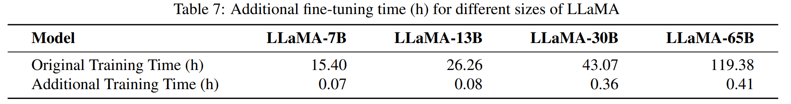

Tab. 7 에서 default setting ($\lambda = 0.1$, $n = 100$) 하에서 additional fine-tuning time 을 분석하였다. 여기서 original fine-tuning time 은 baseline fine-tuning 에 소요된 시간을 의미하며, additional fine-tuning time 은 IR-QLoRA fine-tuning 시 추가적으로 소요된 시간을 나타낸다. original fine-tuning time 과 비교했을 때, additional fine-tuning time 은 최대 0.84% 에 불과하며, 이는 매우 낮은 수준의 추가 연산 비용이다.

## 4.3. Analysis and Discussion  

#### IR-QLoRA on More Evaluation Benchmark

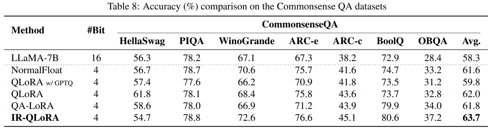

Tab. 8 에서 CommonsenseQA benchmark 의 0-shot 결과를 제시한다. MMLU benchmark 에서 관찰된 현상과 유사하게, IR-QLoRA 는 CommonsenseQA benchmark 에서도 LLaMA-7B 기준으로 SOTA 방법들과 비교하여 best average accuracy 를 유지하며, 대부분의 세부 항목에서도 성능을 크게 향상시킨다.

#### IR-QLoRA under Ultra-low Bit-width  

IR-QLoRA 를 ultra-low bit-width 환경에서 평가 및 비교하였다. 구체적으로, QLoRA 및 LoftQ 에서 사용한 quantization 방법을 적용하여 NF2, NF3 quantization 을 구성하였으며, percentile quantization 접근 방식을 따랐다. 또한, QA-LoRA 및 QLoRA (GPTQ 기반) 에서 제시한 2-bit 및 3-bit integer quantization 결과와도 비교를 수행하였다.  

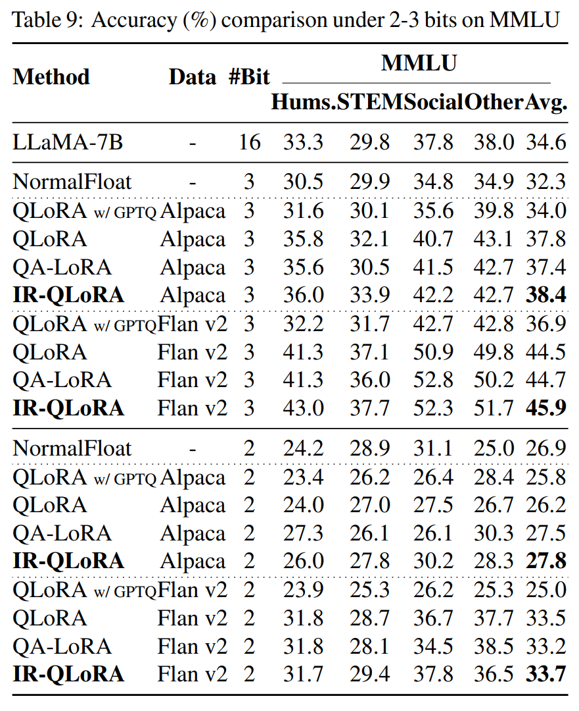

Tab. 9 에서 확인할 수 있듯이, quantization bit-width 가 줄어들수록 baseline QLoRA 의 성능은 급격히 저하되며, 특히 2-bit 환경에서는 무작위 성능과 유사한 수준으로 감소한다. 반면, IR-QLoRA 는 우수한 성능을 유지하며, 특히 2-bit model 을 Flan v2 dataset 에서 finetuning 했을 때, 16-bit model 대비 정확도 차이가 단 0.9% 에 불과했다.  

이러한 결과는 IR-QLoRA 가 ultra-low bit-width quantization 환경에서도 강력한 경쟁력을 갖추고 있음을 입증하며, LLMs 을 극도로 효율적인 quantization 방식으로 구현할 수 있는 가능성을 시사한다.

#### IR-QLoRA with Integer Quantizer  

IR-QLoRA 가 다양한 quantization framework 에 대해 높은 범용성을 지님을 실험적으로 입증하였다. 이를 위해, QA-LoRA 를 baseline 으로 설정하고 IR-QLoRA variants 를 적용하여 실험을 진행하였다.  

이 variants 에서, ICQ 는 integer quantizer 의 zero point 를 탐색 및 결정하는 역할을 수행하며, 동시에 scaling factor 와 함께 최적화된다. 또한, IEC 는 QA-LoRA baseline 에 직접 적용할 수 있도록 범용성을 유지한다.  

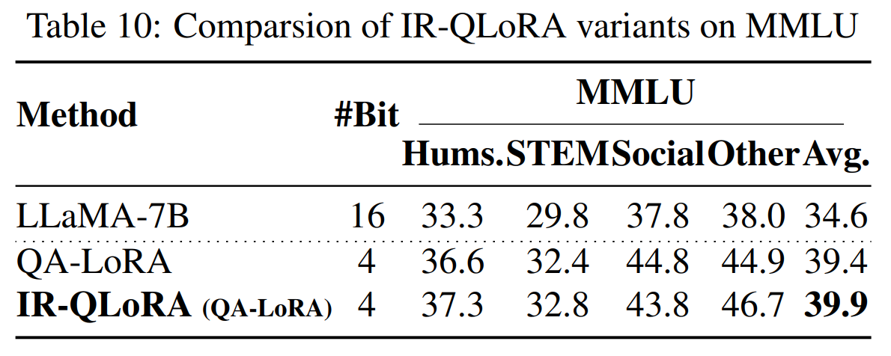

Tab. 10 에서 확인할 수 있듯이, same quantizer form 과 neural architecture 하에서도 IR-QLoRA 적용 시 정확도가 유의미하게 향상되었다. 추가적으로, integer quantizer 는 자체적으로 zero point 를 포함하고 있기 때문에, ICQ 의 calibration constant $\tau_{\text{ICQ}}$ 를 그대로 통합할 수 있다. 따라서, IR-QLoRA 가 제공하는 개선 효과는 거의 추가 비용 없이 적용 가능하다.  

이러한 실험 결과는 IR-QLoRA 의 핵심 기술이 다양한 LoRA-finetuning quantization 방법과 효과적으로 통합될 수 있으며, 전반적인 성능 향상을 제공할 수 있음을 입증한다.

# 5. Conclusion  

본 논문에서는 LoRA-finetuning 을 통해 정보 보존을 활용하여 LLMs 을 정확하게 quantize 하기 위한 **IR-QLoRA** 를 제안하였다.  

이 프레임워크는 두 가지 핵심 기술을 기반으로 한다.  

- Statistics-based **Information Calibration Quantization (ICQ)**: LLM 의 quantized parameters 가 original information 을 정확하게 보존할 수 있도록 보장하는 기법  
- Finetuning-based **Information Elastic Connection (IEC)**: LoRA 가 diverse information 을 활용하여 elastic representation transformation 을 수행할 수 있도록 하는 기법  

광범위한 실험을 통해 IR-QLoRA 가 LLaMA 및 LLaMA2 계열 모델에서 2-4-bit widths quantization 환경에서도 유의미한 정확도 향상을 제공함을 검증하였다. 또한, 추가적인 연산 비용은 단 0.45% 증가에 불과하여 높은 효율성을 유지한다.  

IR-QLoRA 는 다양한 quantization framework 과 원활하게 통합될 수 있는 높은 범용성을 가지며, LoRA-finetuning quantization 의 정확도를 획기적으로 향상시킴으로써, 자원 제한 환경에서의 LLM 배포를 보다 실용적으로 구현할 수 있도록 돕는다.