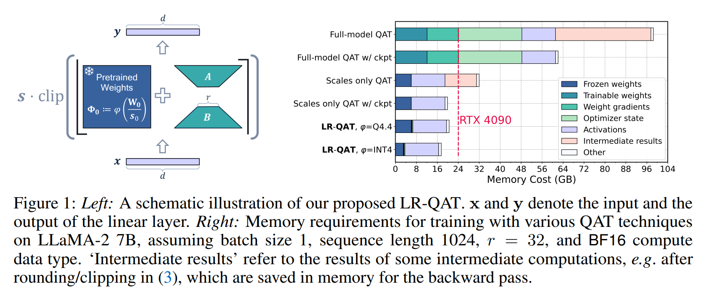
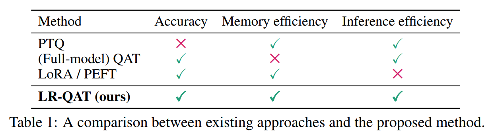
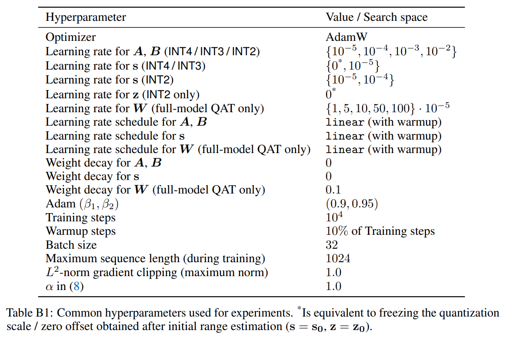
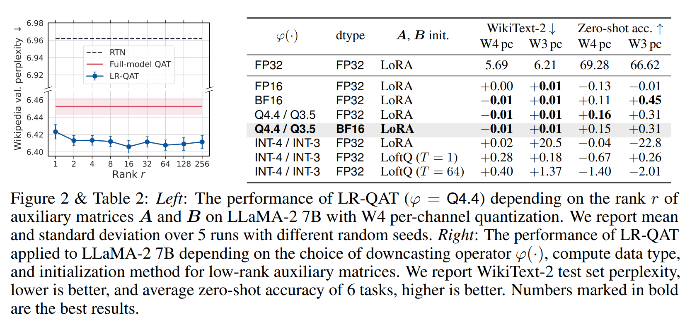
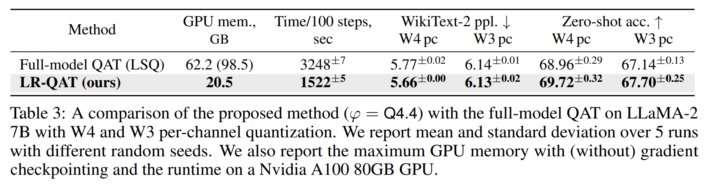
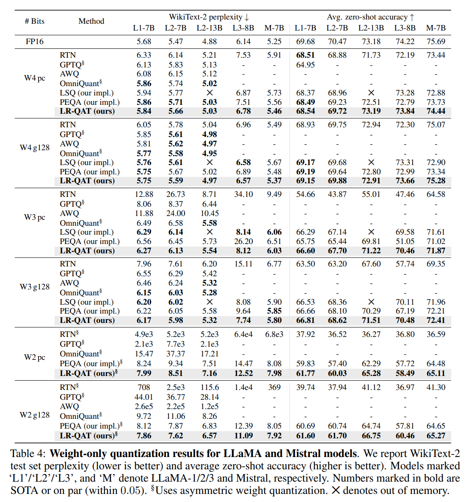
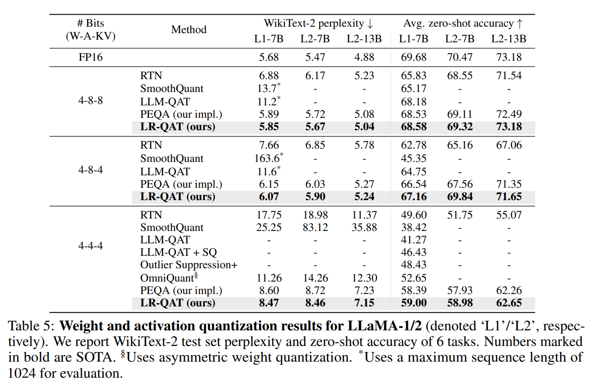

논문 및 이미지 출처 : <https://arxiv.org/pdf/2406.06385>

# Abstract

Large language models (LLMs) 는 어디에서나 사용되지만, 점점 증가하는 연산 및 메모리 요구 사항 때문에 실제 배포가 어렵다. Quantization 은 이러한 모델을 더 연산 및 메모리 효율적으로 만드는 가장 효과적인 방법 중 하나이다. 

**Quantization-aware training (QAT)** 방법은 일반적으로 best quantized performance 를 제공하지만, long training time 과 과도한 memory usage 를 초래할 수 있어 LLMs 에 적용할 때 비현실적일 수 있다. Parameter-efficient fine-tuning (PEFT) 및 low-rank adaptation (LoRA) 연구에 영감을 받아, 저자는 **LR-QAT** 라는 LLMs 를 위한 lightweight 및 memory-efficient **QAT** 알고리즘을 제안한다. 

LR-QAT 는 predictive performance 를 희생하지 않으면서 메모리를 절약하는 여러 요소를 포함한다: (a) quantization grid 를 고려한 **low-rank auxiliary weights**, (b) fixed-point 또는 double-packed integers 를 사용하는 **downcasting operator**, (c) **checkpointing**. 

기존 연구와 달리, 저자의 방법은 (i) inference-efficient 하여 기존 PTQ 와 비교해 additional overhead 가 없다, (ii) 일반적인 extended pretraining framework 로 볼 수 있어, training 후에도 다양한 downstream task 에 사용할 수 있다, (iii) 다양한 quantization settings (e.g., quantization granularity, activation quantization) 에서 적용 가능하며, 여러 PTQ 기법과 쉽게 결합될 수 있다. 

저자는 LR-QAT 를 LLaMA-1/2/3 및 Mistral model 계열에 적용하고, 다양한 downstream task 에서 그 효과를 검증하였다. 저자의 방법은 일반적인 post-training quantization (PTQ) 기법보다 우수하며, full-model QAT 와 동일한 성능을 유지하면서도 메모리 사용량을 획기적으로 줄일 수 있다. 구체적으로, 저자는 7B LLM 을 24GB memory 를 가진 single consumer GPU 에서 training 할 수 있다.

# 1 Introduction

최근 LLMs 는 natural language processing tasks 에서 강력한 도구로 자리 잡았다. 그러나 이러한 모델이 점점 더 커지고 강력해짐에 따라, 연산 및 메모리 요구 사항이 급격히 증가하고 있다. 특히, 제한된 자원을 가진 edge devices 에서 LLMs 를 실용적으로 배포하는 것이 점점 더 중요한 문제가 되고 있다.

이 문제를 해결하는 가장 효과적인 방법 중 하나는 neural network quantization 으로, weight 및 activation tensor 를 low-bit precision 으로 변환하는 기술이다. 최근 post-training quantization (PTQ) 방법은 model size 를 줄이고 LLMs 의 computational efficiency 를 높이는 데 도움을 줄 수 있지만, 일반적으로 low-bit (≤ 4) quantization 환경에서는 성능이 저하되는 경향이 있다. 반면, Quantization-aware training (QAT) 는 PTQ 에 비해 모델 성능을 크게 향상시킬 수 있지만, 최신 LLMs 의 극단적인 model size 로 인해 기존 QAT 를 적용하는 것은 매우 높은 연산 비용과 GPU 메모리 사용량을 요구하므로 비현실적이다.

저자는 PEFT 및 LoRA 연구에서 영감을 받아, LLMs 를 위한 lightweight, memory-efficient, inference-efficient QAT 알고리즘인 **Low-Rank Quantization-Aware Training (LR-QAT)** 을 제안한다. LR-QAT 는 7B LLM training 에 필요한 GPU 메모리 사용량을 98GB 이상에서 21GB 미만으로 줄이면서도 full-model QAT 와 비교해 예측 성능을 유지할 수 있도록 한다. 이를 통해 single consumer GPU 에서도 large-scale model 을 training 할 수 있다.  

quantization 과 low-rank adaptation 을 결합한 기존 연구와 달리, 저자의 방법은 inference-efficient 하다. Training 이 끝난 후, auxiliary matrices 는 quantized weight tensor 로 자연스럽게 병합되며, accuracy loss 없이 extra inference overhead 없이 사용할 수 있다. 또한, LR-QAT 는 단순한 fine-tuning 방법이 아니라, 일반적인 **extended pretraining** 기법으로 설계되었다. 즉, 결과적으로 생성된 모델은 low-bit pre-trained LLM 이며, 이후 다양한 task 에 적용할 수 있다. 필요할 경우, low-bit pre-trained LLM 은 specific downstream task 에 맞춰 fine-tuning 하거나 여러 LoRA adapter 와 결합하여 다양한 task 를 신속하게 전환할 수도 있다.

LR-QAT 는 메모리 사용량을 줄이면서도 model performance 를 유지하기 위해 몇 가지 주요 혁신을 도입하고 결합한다:  
1. **QAT 와 low-rank reparameterization** 을 결합하여, pretrained weights 의 quantization grid 와 align 되는 integer domain 에 low-rank weights 를 배치한다. 이를 통해 inference 시 seamless fusion 이 가능하며, single low-bit integer matrix 로 결합될 수 있다.  
2. Frozen pretrained weights 를 low-bit INT-$b$ ($b$ ≤ 4) double-packed 를 INT8 또는 fixed-point values 로 저장하는 **downcasting operator** 를 도입한다.
3. Backward pass 동안 intermediate results 를 메모리에 저장하여 발생하는 메모리 급증을 방지하기 위해 **gradient checkpointing** 을 적용한다.  

저자는 LR-QAT 를 LLaMA-1/2/3 및 Mistral model 계열에 적용하고, 일반적인 language modeling datasets 및 일반적인 reasoning downstream task 들에서 그 성능을 검증했다. 저자의 방법은 최신 PTQ 기법을 능가하며, full-model QAT 와 동일한 예측 성능을 유지하면서도 메모리 사용량이 훨씬 적다. 또한, LR-QAT 는 다양한 quantization 설정 (e.g., per-channel 또는 per-block weight quantization, activation quantization) 에 적용 가능하며, 대부분의 PTQ 기법과 결합될 수 있다.

# 2 Background and related work  

Neural network quantization 은 model footprint, data transfer, compute requirements 를 줄이는 가장 강력한 방법 중 하나이다. Model 을 quantization 하면, high bit-width 를 가지는 floating point weights 와 activations 를 low-bit 숫자로 표현할 수 있다. 또한, INT8 과 같은 low-bit fixed-point representation 을 사용하면, computational efficiency 가 높아지고 energy consumption 도 줄일 수 있다. 그러나 8-bits 이하로 quantization 하면, model 에 quantization noise 가 도입되어 accuracy/perplexity 가 떨어질 가능성이 높다.  

이 섹션에서는 uniform affine quantization 의 개요와 최근 LLM quantization 기법을 요약하고, 이러한 방법들의 trade-off 를 논의한다. 또한, LLM quantization 의 주요 과제 및 기존 접근 방식의 한계를 설명한다. 

#### Uniform affine quantization  

Quantization function 은 다음과 같이 정의된다.

$$
\begin{equation}
    \widehat{x} := q (x; s, z, b) = s \cdot  \underbrace{\left(\text{clip}\left(\lfloor \frac{x}{s} \rceil + z; -2^{b-1}, 2^{b-1} - 1\right) - z \right)}_{=: x_\mathbb{Z}},
\end{equation}
$$

- 여기서, $x$ 는 quantizer input (i.e., network weights 또는 activations), 
- $s$ 는 higher precision quantization scale, 
- $z$ 는 integer zero offset, 
- $b$ 는 bitwidth 이다. 
- $\lfloor \cdot \rceil$ 은 round-to-nearest-integer operator 이다.
- Quantization parameters $s, z$ 는 $x$ 의 일부 요소 간에 공유될 수 있다. 
- 이러한 quantizer 는 floating point vector 를 다음과 같이 근사한다: $x \approx s \cdot (x_\mathbb{Z} - z)$
  - 여기서 $x_\mathbb{Z}$ 의 각 요소는 $b$-bit integer value 이다. 

이 quantization scheme 은 **uniform affine quantization** 또는 **asymmetric quantization** 이라고 하며, fixed-point 연산을 효율적으로 구현할 수 있기 때문에 가장 널리 사용된다. **Symmetric quantization** 의 경우, quantization grid 가 $z = 0$ 을 중심으로 대칭이 되도록 제한한다.

#### Post-training quantization methods  

Post-training quantization (PTQ) 방법은 pretrained high-precision (FP32 / FP16 / BF16) network 를 fixed-point network 로 직접 변환하는 기법으로, original training pipeline 없이도 적용할 수 있다. 이러한 방법들은 일반적으로 data-free 이거나, small calibration dataset 만을 필요로 하며, 사용하기 쉽다. Hyperparameter tuning 도 거의 필요하지 않으므로, pretrained neural network 를 single API 호출로 quantization 할 수 있다.  

LLMs 의 PTQ 는 weights 및 activations 의 numerical outlier 문제 때문에 상당히 어려운 작업이다. 현재 LLM PTQ 기법은 크게 **weights-only quantization** 과 **weight-activation quantization** 으로 구분할 수 있다.

**Weights-only quantization** 은 weights 를 low-bit values 로 변환하는 방법이다. 예를 들어, GPTQ 는 second-order information 을 활용하여 group 단위로 weight 를 iteratively rounding 하고, quantization error 를 보정한다. SpQR, AWQ, OWQ 등은 high-magnitude activations 인 특정 weights (salient weights) 가 quantization 성능에 미치는 영향을 강조한다.

**Weight-activation quantization** 은 weights 와 activations 를 함께 압축하는 방법이다. SmoothQuant, `LLM.int8()`, Outlier Suppression 등은 activation outliers 를 조정하여 W8A8 quantization 을 수행한다. OmniQuant 은 weights 의 extreme value 를 clipping threshold optimizing 을 통해 조정하여, activation quantization 문제를 weight quantization 으로 전환하는 방식이다.

#### Quantization-aware training methods  

Quantization-aware training (QAT) 기법은 training 중 quantization 을 시뮬레이션하여, PTQ 대비 optimal solution 을 찾도록 한다. 하지만, better accuracy/perplexity 를 얻는 대신, QAT 는 long training time, 높은 memory usage, labeled data 필요성, hyperparameter search 비용 증가 등의 trade-off 를 가진다.

기존 QAT 방법들은 training cost 및 memory usage 가 과도하게 크기 때문에 LLMs 에 적용하기 어렵다. 일부 연구에서는 LLMs 에 QAT 를 적용하려고 시도했다. 예를 들어, LLM-QAT 는 data-free knowledge distillation 을 활용한 QAT 를 수행하고, EdgeQAT 는 100M 개 미만의 parameter 를 가진 tiny language model 에 대해서만 고려한다.

#### Low-rank adapters for fine-tuning  

Low-rank adaptation (LoRA) 는 parameter-efficient fine-tuning (PEFT) 방법으로, standard training 대비 메모리 요구량을 줄일 수 있다. LoRA 는 pretrained weights $W = W_0$ 를 freeze 하고, small set 의 low-rank trainable parameters (_adapters_) 만 학습하는 방식이다.  

$W_0 \in \mathbb{R}^{m\times k}$ 인 Linear projection $y = W_0 x$ 를 고려할 때, LoRA 는 다음과 같이 표현된다.  

$$
\begin{equation}
    y = W_0 x + \frac{\alpha}{r} ABx
\end{equation}
$$

- 여기서, $A \in \mathbb{R}^{m \times r}$, $B \in \mathbb{R}^{r \times k}$, $r < \min(m, k)$ - rank, 
- $\alpha$ 는 scaling factor 이다. 

LoRA 의 장점은 full fine-tuning 보다 훨씬 연산량이 적고, 더 낫거나 비슷한 성능을 보인다. 이 외에도, fine-tuned (floating-point) model 은 fine-tuning 후에 pre-trained weights 와 low-rank matrices 를 결합함으로써 ($W := W_0 + \frac{\alpha}{r}AB$) extra cost 없이 배포할 수 있다.

이와 관련하여, LoRA 와 quantization 을 결합하려는 여러 연구들이 있었다. 예를 들어, 

- QLoRA 는 pretrained weights 를 4-bit (NF4 format) 으로 quantization 하고, forward pass 에서 dequantization 을 수행하여 fine-tuning memory footprint 를 줄인다. 
- QA-LoRA 는 INT4 quantization 을 적용하고, group-wise operators 를 도입하여 inference stage 시 quantization 을 가능하게 한다. 
- LoftQ 는 low-bit quantization 을 적용할 때, $A, B$ matrices 를 iterative SVD-based procedure 로 초기화하는 방법을 제안하여 low-bit quantization 을 함께 사용할 때 faster fine-tuning 결과를 가져왔다.
- LQ-LoRA 는 LoftQ 의 초기화 방법을 확장하여 precision 및 data aware 를 mix 하여 사용한다.  
- 저자의 방법과 가장 가까운 PEQA 는 PEFT 의 memory-efficiency 와 QAT 의 inference efficiency 장점을 결합하는 것을 시도 했다.
  - 하지만 이들의 접근법은 일반적으로 pretraining 방법을 확장한 것이 아닌 task-specific fine-tuning 에 초점을 두기 위한 것으로 저자와 다르다.
  - 또한 PEQA 는 저자의 방법에 비해 freedom 정도가 현저히 낮아 성능이 떨어진다.

#### Motivation  

일반적으로 빠르고 단순한 PTQ 는 low-bit 환경에서 성능이 제한적이다. 반면, QAT 방법은 여전히 low-bit 환경에서도 우수한 성능을 보이지만, 높은 training costs 와 memory usage 로 인해 LLMs 에 적용하기 어렵다.  

LoRA 기반 방법은 efficient fine-tuning 을 위해 메모리 문제를 해결하지만, 대부분 efficient inference 를 고려하지 않는다. Adapters $A$ 와 $B$ 는 일반적으로 BF16 과 같은 hogher precision formats 로 저장된다. 따라서 inference 시, frozen low-bit pretrained weights $W_0$ 를 dequantizing 하여 동일한 데이터 형식으로 변환해야 하므로 runtime overhead 가 발생한다.  

Training 후 adapter 를 단순히 quantizing 하면 $W_0$ 와 다른 quantization grid 를 사용하게 되며, $W_0$ 와 동일한 quantization grid 를 적용하면 높은 오류가 발생한다. 현재까지 알려진 연구 중 auxiliary LoRA weights 를 frozen $W_\mathbb{Z}$ 에 다시 병합하려고 시도한 것은 QA-LoRA 가 유일하다. 그러나 이 방법은 group-wise quantization (small group size 32) 에서만 동작하도록 설계되었다. 또한, QA-LoRA 및 대부분의 LoRA 기반 방법들은 제안된 기법을 task-specific fine-tuning 과 결합하는 반면, 본 연구에서는 LR-QAT 를 _extended pretraining_ 방법으로 제안한다.  

LoRA 기반 방법에서 영감을 받아, QAT 를 더 메모리 및 runtime 효율적으로 만들고자 했다. 그뿐만 아니라, LR-QAT 는 _inference-efficient_ 하도록 설계되었다. 즉, low-rank adapters 가 low-bit integer matrix $W_\mathbb{Z}$ 에 accuracy/perplexity loss 없이 병합될 수 있으며, PTQ 수준의 inference efficiency 를 제공한다.

QA-LoRA 와 달리, quantization constraints 를 완화하지 않으며, 어떤 weight quantization granularity 에서도 적용 가능하다. 또한, LR-QAT 는 일반적인 extended pretraining framework 로 간주할 수 있다. 따라서 training 후 model 은 다양한 task 에 사용할 수 있다.  

논의된 기법들의 trade-off 를 Tab. 1 에 정리했다.

# 3 Method  

LR-QAT 의 주요 요소들을 설명한 후, formal definition 을 제공한다.  

#### QAT with low-rank adapters  

기존 QAT 의 기본 원리를 먼저 살펴보자. Linear layer 의 weight matrix $W \in \mathbb{R}^{m \times k}$ 에 대해, $b$-bit symmetric uniform affine quantization 을 적용하면 다음과 같이 표현된다.  

$$
\begin{equation}
    \widehat{W} := s \cdot \text{clip} \left( \lfloor \frac{W}{s} \rceil, -2^{b-1}, 2^{b-1} - 1 \right)
\end{equation}
$$

- 여기서 weights $W$ 는 trainable parameter 이고, 
- quantization scale $s$ 는 고정되거나 학습될 수 있다. 

Backpropagation 시, Eq. (3) 의 round-to-nearest operation 을 처리하기 위해 일반적으로 **straight-through estimator (STE)** 를 사용하며, $\frac{\partial \lfloor t \rceil}{\partial t} = 1$ 로 가정한다. LLMs 에 적용할 경우, 이 방법은 매우 비용이 크다. Pretraining 에 사용된 것과 거의 동일한 수의 parameters 를 학습해야 하므로, 과도한 메모리 사용량이 요구된다.  

이 문제를 해결하기 위해, pretrained weights $W$ ($W_0$) 을 freezing 하고, low-rank adapters $A \in \mathbb{R}^{m \times r}$, $B \in \mathbb{R}^{r \times k}$ 를 도입한다. 여기서 $r \ll \min (m, k)$ 이다. Adapter 의 배치 위치가 중요하다. Sec. 2 에서 논의했듯이, training 후 $A$ 와 $B$ 를 single $b$-bit integer matrix $W_\mathbb{Z}$ 로 efficient inference 에 용이하면서 accuracy loss 없이 seamless 하게 통합할 수 있어야 한다. 이를 위해, auxiliary matrices 를 rounding 연산 안에 포함한다.  

$$
\begin{equation}
    \widehat{W} := s \cdot \text{clip} \left( \lfloor \frac{W_0}{s} + \frac{\alpha}{r} AB \rceil, -2^{b-1}, 2^{b-1} - 1 \right),
\end{equation}
$$

- 여기서 rounding operation 을 통해 $A,B,s$ 에 대한 gradient loss 를 계산하기 위해 STE 를 적용한다. 
- LoRA 와 마찬가지로, scaling factor $\alpha / r$ 을 사용하여 rank $r$ 을 조절할 때 hyperparameter tuning 이 덜 필요하도록 한다.  

Training 후, Eq. (4) 는 추가적인 노력이나 accuracy loss 없이 일반적인 fixed-point tensor $\widehat{W} = s \cdot W_\mathbb{Z}$ 로 변환될 수 있으며, extra overhead 없이 efficient inference 가 가능하다.

이는 QLoRA 와 같은 기존 연구들과 차이가 있다. 기존 연구들은 adapters 를 quantization function ($y = \widehat{W} x + AB x$) 외부에 배치하며, 일반적으로 adapters 를 BF16 과 같은 higher precision formats 로 저장한다.  

### Downcasting operator  

Eq. (4) 는 기존 full-model QAT 에 비해 이미 상당히 메모리 효율적이다. Weight $W$ 에 대한 gradient 를 계산할 필요가 없으며, Adam-based optimizer 에서 사용되는 first-order 및 second-order momentum term 도 저장할 필요가 없고, auxiliary matrices $A$ 와 $B$ 만 학습하면 되므로 메모리 사용량이 크게 감소한다. 이는 $r \ll \min(m, k)$ 일 때 특히 효과적이다.  

frozen weight matrix $W_0$ 가 주어졌을 때, 메모리 절감을 위해 lower-precision format 으로 저장할 수 있다. Eq. (4) 의 $W_0$ 에 downcasting 을 직접 적용할 수 있지만, 이는 모든 forward pass 중 $W_0$ 는 scale $s$ 로 나뉘어진다는 것이 중요하다. stable training 을 보장하기 위해서, scale 은 high-precision format 으로 저장할 필요가 있으므로, 이를 단순화하기 위해 다음과 같은 variant low-rank QAT 를 제안한다.

$$
\begin{equation}
    \widehat{W} := s \cdot \text{clip} \left( \lfloor \frac{W_0}{s_0} + \frac{\alpha}{r} AB \rceil, -2^{b-1}, 2^{b-1} - 1 \right)
\end{equation}
$$

- 여기서 learned scale $s$ 대신 initial scale $s_0$ 를 rounding operator 안에서 사용한다. 
- Eq. (4) 의 나머지 과정은 이전과 동일하다. 
- 이제 entire fraction $W_0 / s_0$ 는 고정되며, 이를 lower-precision format 으로 저장할 수 있다. 
- 또한, clipping operator 의 scale $s$ outside 는 여전히 학습될 수 있다. 

실험적으로, Eq. (5) 는 Eq. (4) 보다 동일하거나 더 나은 성능을 보였다.  

Training 중 pretrained weight 는 다음과 같이 저장된다.  

$$
\begin{equation}
    \Phi_0 := \varphi \left( \frac{W_0}{s_0} \right),
\end{equation}
$$

- 여기서 $\varphi(\cdot)$ 는 **downcasting operator** 이며, 다양한 numeric format 선택과 other preprocessing computations 를 포함할 수 있다. 
- 가장 단순한 형태로, $\varphi(\cdot)$ 는 FP16, BF16, FP8 등의 기존 floating-point 형식으로 변환하는 연산이 될 수 있다.  

전통적인 fixed-point quantization 에서 영감을 받아, $\varphi (\cdot)$ 에 대한 integer representation 을 사용하는 방법도 고려할 수 있다. 구체적으로, $\phi(x) = \text{clip} \left( \lfloor x \rceil, -2^{b-1}, 2^{b-1} - 1 \right)$ 같은 standard $b$-bit integer quantization 을 수행할 수 있으며, 이는 INT-b 형식으로 저장될 수 있다. 저자는 이 접근법을 $\varphi =$ INT-$b$ 로 간단하게 나타낸다.

추가적으로, low-bit quantization ($b \leq 4$) 을 사용할 경우, two INT-$b$ numbers 를 single INT8 number 에 **double-pack** 하여 추가적인 메모리 절감을 달성할 수 있다. 이는 현재 PyTorch 와 같은 deep learning framework 에서 low-bit formats 를 직접 지원하지 않는 문제를 해결하는 데 유용하다.

$\varphi =$ INT-$b$ 형식을 사용하면 (clipped) $W_0 / s_0$ 의 integer part 만 유지하므로, 메모리 절감 효과가 크다. 하지만, 사전 실험 결과, $A$ 및 $B$ 에 대해 standard initialization 을 결합한 이 방식은 $\varphi =$ BF16 저장 방식보다 성능이 다소 떨어졌다. 이는 $W_0 / s_0$ 의 fractional part 의 information 을 유지하고 잠재적으로 auxiliary matrices 의 better initialization 이 중요함을 의미한다.  

이 문제를 해결하기 위해 두 가지 방법을 제안한다.

1. **SVD-based initialization**: $W_0/s_0$ 에 downcasting operator 를 적용하기 전에, LoftQ 에서 제안한 low-rank matrices $A,B$ 에 variant SVD-based initialization 기법을 활용한다. 이를 통해 fractional part 의 information 을 유지할 수 있다. 이 접근법을 사용하면 여전히 $\varPhi=$INT-$b$ 를 적용할 수 있으며, double-packing 을 유지할 수 잇다.

2. **Fixed-point representation**: INT8 저장 형식을 사용하되, $b$ bits 를 integer part 에 할당하고, 나머지 $8-b$ bit 를 fractional part 저장에 활용한다 ($2 \leq b \leq 7$). 즉, $\Phi_0$ 를 fixed-point number 로 표현한다.  

이때, 나머지 연산이 BF16 환경에서 수행된다고 가정하면, downcasting 및 upcasting operators 를 다음과 같이 정의한다.  

$$
\begin{equation}
    \begin{align*}
        \phi&(x) = \text{INT8} \left( \lfloor 2^{8-b} \cdot \text{clip}(x, -2^{b-1}, 2^{b-1} - 1) \rceil \right),\\
        \phi^{-1}&(x) = \text{BF16}(x) / 2^{8-b}.
    \end{align*}
\end{equation}
$$

$n$ bit 를 integer part, $m$ bit 를 fractional part 로 사용하는 fixed-point number 표기법을 $Qn.m$ 으로 나타낸다. 본 연구에서는 Eq. (7) 을 간략히 $\varphi = Qb.(8-b)$ 로 표기하며, $b \in \{3, 4\}$ 인 경우 각각 $Q3.5$, $Q4.4$ 를 사용한다.

#### Gradient checkpointing  

기존 LoRA 및 QLoRA 연구에서는 $A B$ 를 명시적으로 계산할 필요가 없다. 대신, activations $x$ 와의 연산을 $A (B x)$ 으로 수행한다.  

하지만 Eq. (5) 에서 product $A B$ 를 명시적으로 계산해야 한다. 이를 naive 하게 구현하면, $A B$ 의 계산 결과뿐만 아니라 rounding 및 clipping 이후의 intermediate computation 결과들도 backward pass 를 위해 자동으로 메모리에 저장된다. 이로 인해 메모리 사용량이 크게 증가할 수 있다.

이 문제를 방지하기 위해, Eq. (5) 에 **gradient checkpointing** 을 적용했다. 즉, backward pass 중 quantizer function 을 다시 계산하여, 중간 결과를 메모리에 저장할 필요 없이 메모리 사용량을 절감한다. 이 방식은 약간의 runtime overhead 를 유발할 수 있지만, 메모리 사용량 증가를 효과적으로 방지할 수 있다.

#### LR-QAT  

위에서 설명한 구성 요소를 조합하여, single layer 의 (pretrained) weight matrix $W_0$ 에 대한 LR-QAT 방법을 다음과 같이 정의한다.  

$$
\begin{equation}
    \widehat{W} := s \cdot \text{clip} \left( \lfloor \Phi_0 + \frac{\alpha}{r} AB \rceil, -2^{b-1}, 2^{b-1} - 1 \right),
\end{equation}
$$

- $s$: 학습 가능한 (또는 frozen) quantization scale 이며 initial value 는 $s_0$ 이다.  
- $A, B$: trainable rank $r$ auxiliary matrices  
- $\Phi_0 := \varphi(W_0 / s_0)$: original pretrained weights 의 frozen representation  
- $\varphi$: downcasting operator  

product $AB$ 를 포함한 Eq. (8) 의 intermediate computations 결과에 대한 과도한 메모리 사용을 방지하기 위해, $\widehat{W}$ 에 gradient checkpointing 을 적용한다.

Training 이 완료되면, low-rank adapters 는 자연스럽게 single integer matrix $W_\mathbb{Z} = \text{clip}(\dots)$ 로 병합되면서도 accuracy loss 가 발생하지 않는다. 저자는 weights 에 일반적으로 사용되는 symmetric quantization 을 제시했지만, 이는 Eq. (1) 에서 보이듯 rounding operation 의 outside 에 zero offset $z$ 를 추가함으로써, asymmetric quantization 에도 동일하게 적용할 수 있다.

# 4 Experiments  

LR-QAT 의 효과를 평가하기 위해 LLaMA 7B, LLaMA-2 7B/13B, LLaMA-3 8B, Mistral-0.1 7B 에 대한 실험을 수행했다. 먼저, rank $r$ 의 선택, downcasting operator $\varphi(\cdot)$, auxiliary matrix $A, B$ 의 초기화 방법이 결과에 미치는 영향을 분석했다. 이후, full-model QAT 및 기존 방법들과 비교하여 정확도를 평가했다.

실험에 사용된 hyperparameter 는 다음과 같다.

#### Quantization  

Weight-only quantization 과 weight-activation quantization 실험을 수행했다. 기본 설정은 다음과 같다.  

- INT4, INT3, INT2 per-channel (pc) quantization 및 group-wise quantization (g128, group size 128)  
- 기본적으로 INT4 per-channel weight quantization 및 per-token activation quantization 을 사용했다.  

Symmetric quantization (Eq. (1)) 을 기본 설정으로 사용했으며, INT2 quantization 의 경우 기존 연구와의 공정한 비교를 위해 asymmetric quantization 을 적용했다. all linear layers 를 quantizing 했으며, classification head 는 제외했다.

Weight-activation quantization 실험에서는 weight 를 INT4 per-channel 로 quantizing 하고, activation 은 per-token granularity 로 quantizing 했다. QmniQuant 를 따라, softmax output 은 quantizing 하지 않았으며, LLM-QAT 의 KV-cache 도 추가적으로 quantizing 했다.  

#### Datasets and training  

모든 실험에서 attention blocks 내의 all linear layers 에 LR-QAT 를 적용했다. 이는 self-attention layer 와 feed-forward network 의 linear projection layer 를 포함한다. Training 중에는 low-rank auxiliary matrices $A, B$ 와 quantization parameters $s$ 만 학습하며, embedding layer, final classification head, RMSNorm parameter 들은 freezing 했다. Asymmetric weight quantization 실험에서는 초기 range estimation 동안 설정된 zero offset $z$ 를 training 동안 고정했다 ($z = z_0$).  

Training dataset 으로는 SlimPajama 의 small subset 을 사용했다. SlimPajama 는 LLaMA models pretraining 에 사용된 original dataset 과 유사한 open-source dataset 이다. 모든 실험에서 batch size 32, maximum sequence length 1024 를 사용했다.  

Weight-only 및 weight-activation quantization 실험에서는 각각 10,000 step 동안 training 했으며, ablation study (Sec. 4.1, 4.2) 에서는 1,000 step 동안 training 했다. Hyperparameter 는 Wikipedia validation set (512 sequences) 의 small subset perplexity 를 기준으로 선택했다.  

#### Evaluation

기존 연구들과 동일하게, quantized model 의 성능을 평가하기 위해 WikiText-2 dataset 의 language generation perplexity 를 측정했다. 이때, sequence length 2048 을 사용했다.  

추가적으로, zero-shot accuracy 를 평가하기 위해 BoolQ, PIQA, Winogrande, ARC, HellaSwag 등의 common sense reasoning task 를 사용했다. 이를 위해 LM Evaluation Harness framework 를 활용했으며, PIQA, ARC-e, ARC-c, HellaSwag 에 대해서는 `acc_norm` 을, BoolQ 와 Winogrande 에 대해서는 acc 를 보고했다.  

#### Baselines

quantized 및 unquantized weights 간의 $L^p$-norms 를 minimizing 할 범위를 설정하는 round-to-nearest quantization (RTN) 을 비교하며, best performance configuration 을 보고한다. 그리고 이를 LR-QAT initialization 에 사용한다.

다양한 기존 quantization 방법들과 비교했다.  

- **Weight-only quantization**  
  - **GPTQ**: Second-order information 을 이용한 grouped weight quantization  
  - **AWQ, OmniQuant**: Activation-aware quantization 기법  
  - **LSQ (our implementation)**: Full-model QAT  
  - **PEQA (our implementation)**: QAT 와 PEFT 를 결합한 방법  

- **Weight-activation quantization**  
  - **RTN**  
  - **SmoothQuant**: Activation outlier scaling  
  - **LLM-QAT**: Data-free QAT  
  - **Outlier Suppression+**: Quantization robustness 개선 기법  
  - **OmniQuant**  
  - **PEQA (our implementation)**  

Weight-activation quantization 실험에서는 기존 연구를 따라 여러 quantization bitwidth 설정 (W-A-KV)을 비교했다.  

## 4.1 The impact of rank $r$  

Low-rank auxiliary matrices $A, B$ 의 rank $r$ 이 LR-QAT 의 성능에 미치는 영향을 분석했다 (Fig. 2)

- Rank $r$ 을 1 to 32 까지 증가시키면 특정 outlier 를 제외하고 성능이 점진적으로 향상되었다. 
- 단, $r > 32$ 에서 추가적인 perplexity 감소는 관찰되지 않았다. 이는 training step 수가 제한적 (1,000 step) 이었기 때문이며, 완전히 수렴하려면 more steps 가 필요해 보인다. 
- 흥미로운 점은 rank $r = 1$ 에서도 매우 우수한 성능을 보였다는 것이다. 이는 다음과 같은 이유 때문으로 추정된다.  
  - Rank$(AB) = 1$ 이지만, rounding 및 clipping operators (Eq. (8)) 내부에서 low-rank approximation 이 적용되므로, 결과적으로 (integer domain 내의) original weights $\Phi_0$  high-rank perturbation 을 제공할 수 있다.  
- all ranks 에서 $0.005$ 및 $0.008$ ppl 사이의 small standard deviation 이 관찰된다.
  - LR-QAT 가 $B$ 의 random initialization 에 robust 함을 의미한다.
- Rank $r$ 이 작더라도, integer domain 에서의 적절한 reparameterization 이 quantization noise 를 보정할 수 있다.  

이후 실험에서는 $r = 32$ 를 기본 설정으로 사용했다.

## 4.2 The choice of the downcasting operator $\varphi(\cdot)$ and $A, B$ initialization  

Sec. 3 에서 논의한 여러 downcasting operator 선택이 미치는 영향을 분석했으며, 결과를 Tab. 2 에 정리했다. FP32 에서 BF16, 그리고 최종적으로 $\Phi_0$ 의 8-bit fixed-point representation 으로 변환했을 때, 메모리 절약 효과뿐만 아니라 WikiText-2 perplexity 를 유지하면서 zero-shot accuracy 가 약간 향상되는 것도 확인할 수 있다.  

Zero-shot accuracy 의 향상은 $W_0 / s_0$ 의 fractional part 일부를 버리면서 발생하는 미세한 regularization 효과 때문일 가능성이 크다. Fractional part 에 포함된 일부 정보는 noise 일 수 있으며, 이를 제거하면 model 의 generalization 이 향상될 수 있다. 한 단계 더 나아가, $\varphi = \text{INT-b}$ 를 적용했을 때 4-bit weight quantization 환경에서는 여전히 좋은 성능을 보였지만, W3 환경에서는 완전히 성능이 무너졌다.  

지금까지 auxiliary matrices $A$ 와 $B$ 의 초기화는 LoRA 방법을 따랐다. 즉, $B$ 는 zero 로 초기화하고, $A$ 는 기존 연구에서 제안된 방식과 동일하게 무작위로 초기화했다. 이를 'LoRA' initialization 이라고 한다.

$\varphi = \text{INT3}$ 에서 성능이 크게 저하되는 이유는 $W_0 / s_0$ 의 fractional part information 을 완전히 잃기 때문이라고 가정할 수 있다. Fractional part 가 없으면 low-rank approximation 이 효과적으로 학습되기 어렵다. 이를 해결하기 위해, LoftQ 에서 제안한 SVD-based initialization 기법을 변형하여 실험을 수행했다.  

LoftQ initialization 을 $T = 1$ step 으로 적용하면, fixed-point representation 과 비교해 거의 모든 예측 성능이 복구됨을 확인할 수 있었다. 하지만 LoftQ steps 수를 증가시키거나, 이를 4-bit quantization 환경에 적용하는 것은 추가적인 성능 향상에 도움이 되지 않았다.  

마지막으로, $\Phi_0$ 에 fixed-point representation 을 적용했을 때, compute data type 을 FP32 에서 BF16 으로 변경해도 model 성능이 유지됨을 확인했다. BF16 은 LLMs 에서 일반적으로 사용되는 형식이다.  

이후 실험에서는 $\varphi = Qb.(8 - b)$, 'LoRA' initialization, 그리고 BF16 compute data type 을 기본 설정으로 사용했다.

## 4.3 Comparison with full-model QAT  

본격적인 실험 결과를 제시하기 전에, 본 연구에서 제안한 방법과 기존 full-model QAT (LSQ) 방법을 비교했다. Full-model QAT 실험에서는 본 연구에서 사용한 것과 동일한 training 설정을 적용했다.

또한, weight $W$ 에 대한 learning rate 의 maximum value 를 search space $\{1e-5, 5e-5, 1e-4, 5e-4, 1e-3\}$ 범위에서 tuning 하여 Wikipedia validation perplexity 에 기반하여 best configuration 을 찾았다. 참고로, quantization scale $s$ 의 learning rate 는 full-model QAT 와 본 연구의 방법에서 동일하게 설정했다.  

Tab. 3 에서 확인할 수 있듯이, 본 연구에서 제안한 방법은 full-model QAT 와 동등하거나 더 나은 예측 성능을 보이면서도, memory usage 와 runtime 이 크게 감소했다. 추가적인 모델 및 bitwidth 에 대한 실험 결과는 Tab. 4 에 포함되어 있다.

## 4.4 Main results  

#### Weight-only quantization

실험 결과를 Tab. 4 에 정리했다. 대부분의 경우, LR-QAT 는 다양한 LLM 계열 및 quantization settings (Per-channel 및 Group-wise quantization 포함)에서 기존 weight-only quantization 방법들을 능가하거나 동등한 성능을 보였다. 특히, 극단적인 low-bitwidth 환경에서는 모든 설정에서 기존 연구보다 일관되게 높은 성능을 기록했다.  

일부 경우, 특히 group-wise quantization 환경에서는 LR-QAT 가 OmniQuant 보다 낮은 성능을 보이기도 했다. 하지만 OmniQuant 는 asymmetric quantization 을 사용하여 symmetric quantization 대비 extra freedom 을 제공한다. 이러한 freedom 은 low-bit quantization 환경에서 매우 유용하다. 하지만, 실제 inference 환경에서는 symmetric weight quantization 이 더 효율적이다. 또한, OmniQuant 및 관련 기법들은 LR-QAT 와 독립적인 방법이며, LR-QAT 의 initialization 으로 활용될 수 있다.  

#### Weight-activation quantization

LLaMA-1/2 models 에 적용한 weight-activation quantization 실험 결과를 Tab. 5 에 정리했다. LR-QAT 는 all PTQ 및 QAT baseline 방법들보다 우수한 성능을 보였으며, all models 계열과 bitwidth 설정에서 일관되게 기존 연구를 능가했다. 특히 activation bitwidth 를 줄일수록, 기존 연구 대비 모델 성능 향상이 더욱 두드러졌다.  

이는 LR-QAT 가 weight-only quantization 뿐만 아니라 weight-activation quantization 환경에서도 효과적으로 적용될 수 있음을 보여준다. Weight-activation quantization 은 fixed-point arithmetic 을 활용하여 매우 효율적인 inference 가 가능하다. 추가적으로, LR-QAT 는 OmniQuant 과 같은 PTQ 방법과 결합할 수도 있다. OmniQuant 은 activation quantization 문제를 weight quantization 문제로 변환하는 방식이므로, LR-QAT 와 함께 사용하면 더욱 높은 성능을 기대할 수 있다.

# 5 Discussion  

#### Limitations

LR-QAT 의 핵심 가정은 low-rank approximation 이 quantization noise 를 보상할 수 있다는 것이다. 이론적으로 quantization noise 는 random uniform distribution 을 따르므로 low-rank 구조를 갖지 않는다. 하지만, 본 연구와 기존 연구들은 end-to-end training 환경에서 low-rank 방법이 quantization noise 를 효과적으로 보정할 수 있음을 보여주었다.  

또한, 본 연구에서는 LR-QAT 를 최대 13B parameter 규모의 LLMs 에 대해 실험했다. 13B 를 훨씬 초과하는 모델에서도 동일한 효과를 기대할 수 있지만, 현재 실험을 통해 이를 직접 검증하지는 않았다.  

본 연구에서는 LR-QAT 를 extended pretraining 기법으로 적용했으며, training step 수는 수천 단위로 설정되었다. 수백만 step 단위의 full pretraining 과정에서 LR-QAT 가 어떻게 동작하는지는 추가적인 연구가 필요하다.  

#### Impact

LR-QAT 는 LLMs 의 메모리 및 inference 효율성을 개선하는 방법이므로, 긍정적인 영향을 미칠 것으로 기대된다.

- **에너지 절감**: Quantization 을 통해 inference 시 전력 소비를 줄일 수 있다. 이는 LLMs 의 높은 전력 소모 문제를 해결하는 데 기여할 수 있다.  
- **엣지 디바이스 배포 가능성 증가**: 메모리 사용량을 줄임으로써, 클라우드 환경이 아닌 엣지 디바이스에서도 LLMs 를 배포할 수 있다. 이는 데이터 프라이버시 문제를 해결하는 데도 도움이 될 수 있다.  

다만, quantization 과정에서 발생하는 정보 손실이 model 의 fairness 및 bias 에 미치는 영향에 대해서는 추가적인 연구가 필요하다. Quantized model 이 특정 그룹이나 언어에서 더 큰 성능 저하를 보일 가능성이 있기 때문이다.

## 6 Conclusions  

본 연구에서는 LLMs 를 위한 lightweight 하고 memory-efficient 한 QAT 알고리즘인 **LR-QAT** 를 제안했다. LR-QAT 는 7B LLM 을 24GB 메모리를 가진 single consumer GPU 에서 training 할 수 있도록 하며, full-model QAT 와 동등한 성능을 유지하면서도 메모리 사용량을 획기적으로 절감한다.  

LR-QAT 는 PEFT 방법에서 영감을 받아 low-rank reparameterization 을 활용하며, 이를 quantization grid 와 정렬되도록 설계했다. 또한, fixed-point 또는 double-packed integer 를 활용한 downcasting operator 를 도입하고, gradient checkpointing 을 적용하여 메모리 사용량을 최적화했다.  

실험 결과, LR-QAT 는 기존 PTQ 방법보다 높은 성능을 보이며, full-model QAT 와 동일한 모델 성능을 유지하면서도 메모리 사용량을 크게 줄일 수 있었다.  