논문 및 이미지 출처 : <https://arxiv.org/pdf/2407.17029>

# Abstract

Large Language Model (LLM) 은 여러 도메인에서 놀라운 성능을 보여준다. 하지만 model 의 엄청난 parameter 수 때문에 fine-tuning 이 어렵고, 적용과 배포가 크게 제한된다. 기존 해결책들은 parameter quantization 과 Low-Rank Adaptation (LoRA) 를 결합해서 memory usage 를 많이 줄이지만, 성능 저하가 눈에 띈다. 

이 논문에서 저자는 quantized pre-trained model 을 fine-tuning 할 때 imbalance 문제를 찾아냈다. adapter 의 input 과 output 이 너무 복잡한 반면, adaptation 의 effective trainability 는 낮다는 거다. 

- 저자는 **Quantized LLMs with Balanced-rank Adaptation (Q-BaRA)** 를 제안한다. 
  - 이는 adapter 의 input 과 output 을 단순화하고, adapter 의 rank 를 높여서 quantized LLM 을 fine-tuning 할 때 더 적절한 balance 를 맞춘다. 
- 또한, fine-tuned LLM 을 low-precision inference model 로 배포해야 하는 경우를 위해 **Quantization-Aware Fine-tuning with Higher Rank Adaptation (QA-HiRA)** 를 소개한다. 
  - 이는 adapter 의 input 과 output 을 pre-trained model 의 block-wise quantization 에 맞춰 단순화하고, single matrix 로 higher rank 를 달성한다. 
- Q-BaRA 와 QA-HiRA 는 둘 다 구현이 쉽고 이런 최적화를 제공한다:  
  - Q-BaRA 는 baseline 과 다른 variant 들에 비해 항상 best accuracy 를 내며, 같은 trainable parameter 수와 computation 노력만 필요하다.  
  - QA-HiRA 는 fine-tuning 후 adapter parameter 를 block-wise quantized model 에 자연스럽게 합쳐서, 다른 방법들에 비해 최고 accuracy 를 낸다.  
- 저자는 LLaMA 와 LLaMA2 model family 에 Q-BaRA 와 QA-HiRA 를 적용해서 여러 fine-tuning dataset 과 downstream 시나리오에서 효과를 검증했다.

# 1 Introduction

Large Language Model (LLM) 은 natural language processing task 에서 뛰어난 효율을 보여주며, 여러 도메인에서 새로운 기준을 세운다. 이 models 는 parameter 가 많아서 특정 용도에 맞게 fine-tuning 하면 versatility 와 adaptability 가 크게 좋아진다. 하지만 LLM 의 큰 크기는 fine-tuning 에 필요한 computational resource 면에서 큰 도전을 주고, edge device 에 배포하는 걸 막는다.

이 문제를 해결하기 위한 두 가지 주요 연구 방향이 있다. 

- Parameter-Efficient Fine Tuning (PEFT) 으로, pre-trained parameter 대부분을 업데이트하지 않고 적은 수의 new trainable parameter 를 추가한다. 
  - 그중 Low-Rank Adaptation (LoRA) 는 널리 쓰이는 PEFT 방법으로, two low-rank matrices 를 fine-tuning 해서 pre-trained weight 를 보완한다. 
  - full-parameter fine-tuning 과 비슷한 성능을 내지만, LoRA 의 memory usage 는 여전히 높다. large base LLM 을 로드해야 하기 때문이다. 
- parameter quantization 으로, model weight 를 low-bitwidth representations 으로 바꾼다. 
  - quantization 은 memory 요구를 줄이지만, accuracy 가 만족스럽지 않고 보통 Post-Training Quantization (PTQ) 에 초점을 맞춰서 fine-tuning 과정은 다루지 않는다.

널리 쓰이는 QLoRA 는 parameter quantization 과 PEFT 의 장점을 합친다. pre-trained model 을 parameter quantization 으로 압축한 뒤 LoRA 로 PEFT 를 한다. 최근 연구들은 Information Retention 으로 QLoRA 의 accuracy 를 높이거나, Quantization-Aware Training (QAT) 으로 QLoRA 의 배포를 최적화한다. 하지만 이 작업들은 한 가지 측면만 최적화하고, efficiency 저하나 suboptimal accuracy 를 초래한다. 게다가 accuracy 개선의 일부는 pre-trained model 의 더 정밀한 quantization 에서 오는데, 이는 fine-tuning 의 실용성을 제한하고 extra computation overhead 를 만든다.

이 논문에서 저자는 quantized pre-trained model 을 fine-tuning 할 때 imbalance 를 찾아냈다. 

- adapter 의 input 과 output 이 지나치게 복잡한 반면, adaptation 의 effective trainability 는 낮다. 
- 이 문제를 해결하기 위해 adaptation 의 input 과 output 을 단순화하고, low-rank matrix 의 rank 를 높여서 adapter 의 representational capacity 를 강화한다. 
- input 과 output 의 compression 및 restoration 은 non-parameterized operation 으로 이뤄져서 computation overhead 가 거의 없다. 
- 그래서 저자는 **Quantized LLMs with Balanced-rank Adaptation (Q-BaRA)** 를 제안한다. 이는 quantized model 을 fine-tuning 할 때 더 나은 balance 를 찾아서 fine-tuned model 의 성능을 높인다.

같은 아이디어에서, 저자는 low-precision inference model 을 fine-tuning 으로 직접 얻는 **Quantization-Aware Fine-tuning with Higher Rank Adaptation (QA-HiRA)** 를 소개한다. QA-HiRA 는 adaptation 의 input 과 output 을 더 잘 balance 하고, block-wise quantization 을 사용하며, single matrix 를 adapter 로 써서 higher rank 를 추구하며 model fine-tuning 을 최적화한다.  

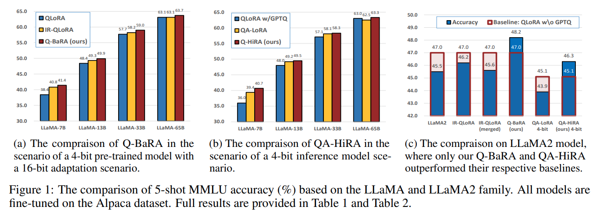

Q-BaRA 와 QA-HiRA 는 둘 다 구현이 쉽고 다양한 적용 시나리오를 가진다. 저자는 LLaMA 와 LLaMA2 model family 에 이 방법들을 평가해서 뛰어난 성능을 확인했다. 

- Fig. 1a 와 Fig. 1b 는 각각 4-bit pre-trained model 에 16-bit adaptation 을 쓴 Q-BaRA 와 4-bit inference model 인 QA-HiRA 를 다른 fine-tuning 방법들과 비교한다. 
- Q-BaRA 는 항상 최고 accuracy 를 내고, QA-HiRA 는 4-bit inference model 에서 다른 방법들을 앞서며, 16-bit adaptation 을 쓴 대부분의 baseline 을 넘는다. 
- 또한, LLaMA2 에서 Fig. 1c 처럼 Q-BaRA 와 QA-HiRA 만 QLoRA baseline 을 넘어서며, 저자의 방법의 generalization 을 보여준다. 
- 게다가 Q-BaRA 와 QA-HiRA 는 추가 PTQ 나 extra trainable parameter 가 필요 없다. 그러니까 adaptation 의 input 과 output 복잡성을 줄이고 adaptation capacity 를 높이면, quantized pre-trained model 압축 상황에서 LLM 의 fine-tuning 성능이 좋아진다는 게 분명하다.

# 2 Related Work

#### Quantization of LLMs

Quantization 은 Large Language Model (LLM) 을 압축하는 중요한 전략으로, parameter 와 activation 의 bit-width 를 줄여서 efficiency 와 scalability 를 높인다. LLM 의 high training cost 때문에 문헌은 주로 post-training quantization 에 초점을 맞춘다. 이는 pre-trained model 에 lower bit-width representations 를 적용한다. 

계산 과정에서 outlier 를 다루는 건 큰 도전인데, outlier 는 중요하지만 큰 quantization error 를 만든다. 몇몇 접근법은 outlier 를 따로 처리하거나, calibration data 를 써서 post-quantization error 를 줄인다. 하지만 quantized model 의 성능은 여전히 영향을 받고, 추가 computation overhead 가 종종 필요하다.

#### Fine-tuning with Low-Rank Adaptation

Low-Rank Adaptation (LoRA) 는 PEFT 에서 널리 쓰이는 방법으로, pre-trained model weight 를 고정하고 layer 에 trainable rank decomposition matrix 를 주입한다. 이 방법은 downstream task 의 trainable parameter 수를 크게 줄인다. 하지만 실제 추가 fine-tuning 성능과 큰 memory cost 가 생긴다. 그래서 최근 연구들은 low-rank matrix 의 fine-tuning 을 최적화하거나, model compression 기술과 통합하는 데 초점을 맞춘다.

#### Combination of adaptation and quantization

- QLoRA 는 efficient fine-tuning 방법으로, pre-trained parameter 에 4-bit NormalFloat representations 를 쓰고 LoRA 기반 fine-tuning 을 해서 memory usage 를 크게 줄이지만, suboptimal model 을 만든다. 
- LoftQ 는 QLoRA 의 adapter 초기화를 최적화해서 pre-trained model 의 quantization error 를 줄이지만, fine-tuning 중 최적화는 다루지 않고 추가 computation overhead 를 낸다. 
- QA-LoRA 는 GPTQ 로 pre-trained model 을 압축한 뒤 Quantization Aware Training (QAT) 으로 fine-tuning 해서 fine-tuned adapter parameter 를 low-bit-width representations 의 pre-trained model 에 합친다. 
- 하지만 GPTQ 는 추가 computation 이 필요하고, QA-LoRA 의 QAT 방법은 큰 정보 손실을 일으켜 model 성능이 떨어진다. 
- IR-QLoRA 는 pre-trained model 에 Information Calibration Quantization (ICQ) 과 fine-tuning 중 Information Elastic Connection (IEC) 으로 성능을 높인다. 하지만 ICQ 는 추가 computation 이 필요하고, IEC 를 쓴 adapter 는 base layer 와 계산적으로 동일하지 않아 pre-trained parameter 와 lossless merging 이 안 된다.

# 3 The Proposed Approach

## 3.1 Preliminaries

#### Baseline: Low-rank adaptation and low-bit quantization

저자는 LoRA 부터 표기법을 시작한다. LoRA 는 two matrices 의 곱으로 fine-tuning 중 parameter 변화를 근사해서 efficient fine-tuning 을 가능하게 한다. 

- $\mathbf{W}$ 는 $D_{in} \times D_{out}$ size 인 pre-trained parameter matrix 이고, 
- $x$ 는 $D_{in}$ length 인 input feature vector 다. 
- $D_{out}$ length 인 output feature $y$ 는 $y = \mathbf{W}^{\top} x$ 로 계산된다.
- LoRA 는 dimension $D_{in} \times D_{rank}$ 와 $D_{rank} \times D_{out}$ 인 two matrices $\mathbf{A}$ 와 $\mathbf{B}$ 를 도입한다. 
  - 여기서 $D_{rank} \ll \min(D_{in}, D_{out})$ 다. 

이로써 product $\mathbf{A B}$ 는 small parameter 로 $\mathbf{W}$ 와 같은 크기의 low-rank matrix 를 만든다. Fine-tuning 중 계산은 $y = \mathbf{W}^{\top} x + s \cdot \Delta \mathbf{W}^{\top} x = \mathbf{W}^{\top} x + s \cdot (\mathbf{A B})^{\top} x$ 로 조정된다. 

- 여기서 $s$ 는 scaling factor 다. 
- large parameter matrix $\mathbf{W}$ 는 고정되고, 
- $\mathbf{A}$ 와 $\mathbf{B}$ 만 업데이트돼서 trainable parameter 수가 크게 줄어든다. 

Fine-tuning 후 adapter parameter 는 inference 를 위해 pre-trained parameter 와 합쳐져서 $\mathbf{W}^{\prime} = \mathbf{W} + s \cdot \Delta \mathbf{W} = \mathbf{W} + s \cdot \mathbf{A B}$ 가 된다.

Quantization 은 LoRA 를 기반으로 pre-trained parameter 에 low bit-width representations 를 써서 fine-tuning 에 필요한 memory 를 더 줄일 수 있다. 널리 쓰이는 quantization 방법은 block-wise quantization 으로, parameter matrix $\mathbf{W}$ 를 small blocks 로 나누고 각 block 을 독립적으로 quantize 한다. 각 block 의 quantization 은 이렇게 표현된다:  

$$
\begin{equation}
    \hat{w} = \alpha \cdot \hat{w} + \beta = \alpha \cdot \left\lceil \frac{w - \beta}{\alpha} \right\rfloor + \beta
\end{equation}
$$

- 여기서 $\hat{w}$ 는 $w$ 의 $N$-bit representations 이고, 
- $\left\lceil \cdot \right\rfloor$ 는 rounding operation 으로 값을 low bit-width representations space 에 매핑한다. 
- $\alpha$ 와 $\beta$ 는 dequantization 을 위한 block parameter 와 함께 quantization factor pair 이다. 

min-max quantization 을 적용하면 $\alpha = (w_{max} - w_{min}) / (2^N - 1)$ 이고 $\beta = w_{min}$ 다. 주로 0 을 중심으로 symmetric distributions 를 타겟으로 하는 absmax quantization 에선 $\alpha = \operatorname{absmax}(w) / (2^N - 1)$ 이고 $\beta = 0$ 이다. LoRA 와 quantization 을 결합하면 fine-tuning 계산은 이렇게 된다:  

$$
\begin{equation}
    y = \tilde{\mathbf{W}}^{\top} x + s \cdot (\Delta \mathbf{W})^{\top} x = \tilde{\mathbf{W}}^{\top} x + s \cdot (\mathbf{A B})^{\top} x
\end{equation}
$$

- 여기서 $\tilde{\mathbf{W}}$ 는 pre-trained model 의 quantized parameter 다. 

이 접근법으로 LLM 의 fine-tuning 은 최소 GPU 수로 가능하다 (e.g., 65B parameter model 을 single 48GB GPU 로 fine-tuning). 하지만 quantized pre-trained model $\overline{\mathbf{W}}^{\top}$ 와 side weight $s \cdot \mathbf{A B}$ 는 따로 저장되거나 high-precision (BF16 또는 FP16) 표현으로 다시 합쳐져야 한다. 게다가 quantization 으로 인한 accuracy 저하는 fine-tuning 으로 완전히 보상되지 않는다.

#### Our objective: Efficient yet effective adaptation and deployment

저자의 목표는 original efficiency 를 유지하면서 다음을 달성하는 거다. 

- 먼저, LoRA 로 fine-tuning 한 정확한 quantized LLM 을 얻는 거다. 또한, fine-tuning 후 fine-tuned weight 와 pre-trained weight 를 lossless 로 합쳐서 inference 배포를 쉽게 하는 거다. 
- 최근 작업들은 이 두 목표를 이루려 하지만, 추가 computation 을 써도 둘 다 달성하지 못한다. 
  - 구체적으로, IR-QLoRA 는 fine-tuning 으로 더 나은 성능을 목표로 한다. 하지만 accuracy 향상은 추가 computation 과 trainable parameter 에 의존한다. 
  - 게다가 shortcut 같은 구조는 computational graph 를 바꿔서 합쳐진 model 이 원래와 기능적으로 동일하지 않게 된다. 
  - QA-LoRA 는 QAT fine-tuning 방법으로 side weight $s \cdot \mathbf{A B}$ 를 quantized pre-trained model $\overline{\mathbf{W}}^{\top}$ 에 합치게 한다. 
  - 하지만 GPTQ 로 pre-trained model 을 quantize 하는 데 calibration 용 computation 이 필요하고, fine-tuned model 의 accuracy 는 한계에 훨씬 못 미친다.

## 3.2 Balanced-rank Adaptation

저자는 quantized 시나리오에서 fine-tuned model 의 성능 저하가 주로 low-rank adapter 의 부족한 capacity 때문이라는 걸 알아냈다. 

먼저, DNN training 은 충분한 fitting capacity 에 의존한다는 게 잘 알려져 있다. Fine-tuning 에서 low-rank adaptation 의 효과는 pre-trained model 이 이미 충분한 지식을 배웠다는 데 기반한다. 하지만 pre-trained model 이 low-precision quantization 을 거치면, extremely low-rank 의 adaptation 으로 fine-tuning 하는 게 훨씬 어려워진다. 또한, layer 의 input 과 output 은 어느 정도 redundancy 를 가진다. 이 redundancy 는 최종 성능에 미치는 영향이 작지만, 이런 redundant information 처리는 low-rank adapter 의 fine-tuning 난이도를 높인다.

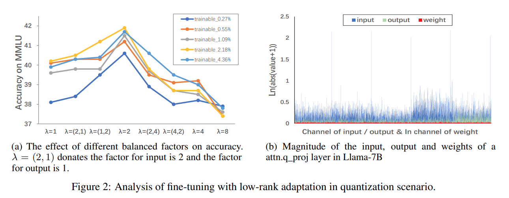

저자는 $\lambda$ 를 balancing factor 로 써서 input 과 output 의 compression factor 와 rank 확장의 multiplier 를 나타낸다. QLoRA 기반 실험을 해서 서로 다른 $\lambda$ 가 fine-tuned model 의 accuracy 에 미치는 영향을 기록했다 (Fig. 2a). 결과는 이렇다:  
1) $\lambda = 2$ 는 서로 다른 trainable parameter 수에서 항상 최고 결과를 낸다. 이는 optimal balance 점을 보여준다.  
2) $\lambda > 2$ 일 때 accuracy 가 많이 떨어진다. input 과 output 에서 중요한 정보 손실이 과도하다는 뜻이다.  
3) $\lambda = 1$ 일 때 fine-tuning accuracy 는 parameter 수에 따라 크게 달라진다 (37.6 ~ 39.7). 저 rank adaptation 으로 parameter 가 너무 적으면 충분한 지식을 잡아내지 못한다는 거다. 

$\lambda$ 가 커질수록 이 차이가 줄어든다. 높은 $\lambda$ 가 fine-tuning 복잡성과 adapter fitting capability 간 격차를 줄인다는 뜻이다 (36.9 ~ 37.4, $\lambda = 8$ 일 때).

이 분석을 바탕으로 저자는 Quantized LLMs with Balanced-rank Adaptation (Q-BaRA) 를 제안한다. 이 방법은 adapter 의 input $x$ 에 $\textrm{AvgPool}(\lambda)$ 을 하고 output $y$ 에 $\textrm{repeat\_interleave}(\lambda)$ 를 해서 (adapter 의 $D_{in}$ 과 $D_{out}$ dimension 을 줄여서) low-rank adapter 의 fine-tuning 난이도를 낮춘다. 동시에 adapter 의 rank $D_{rank}$ 를 $\lambda$ 배 늘려서 effective representation capacity 를 강화한다 (Fig. 3 참고). 저자는 hyperparameter $\lambda = 2$ 로 설정한다. 이 접근은 input 과 output, 그리고 rank 의 optimal balance 를 찾아서 같은 trainable parameter 수로 fine-tuning 을 쉽게 한다.

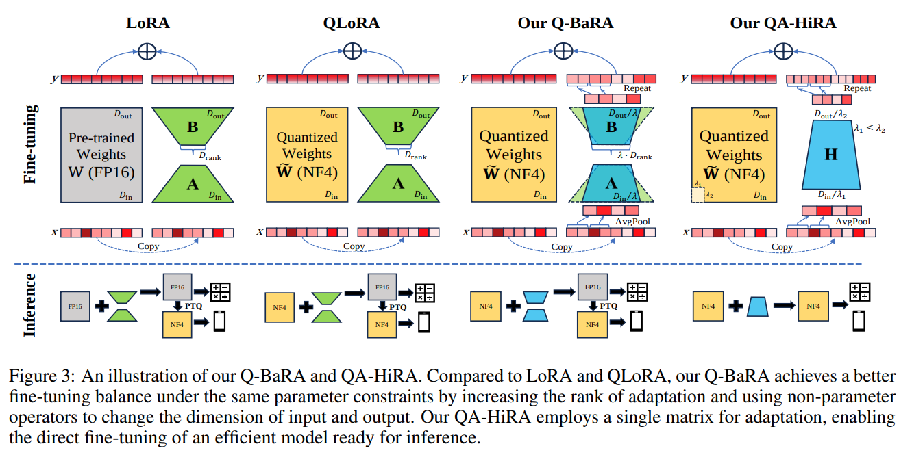

#### Merging Q-BaRA adaptation into pre-trained model

저자의 baseline, 즉 LoRA 나 QLoRA 의 큰 장점은 low-rank adaptation $\Delta W$ 가 pre-trained model $W$ 나 $\tilde{W}$ 와 같은 dimension 을 가진다는 거다. 이는 pre-trained model 에 merging 할 수 있게 해서 inference 때 additional computation 이 필요 없게 한다. 하지만 Q-BaRA 의 adaptation weight $\Delta W_{BaRA}$ 는 shape 이 ($D_{in}/\lambda_1, D_{out}/\lambda_1$) 라서 Q-BaRA 를 효과적으로 통합할 방법을 설계해야 한다.

Q-BaRA 가 input 만 압축할 때 계산을 분석해보자. $\textrm{AvgPool}(\lambda_1)$ operation 은 $D_{in}$ length 인 $x = (x_1, x_2, \ldots, x_{D_{in}})^\top$ 를 $D_{in}/\lambda_1$ length 인 $x^{pool} = \left( \frac{\sum_{i=1}^{\lambda_1} x_i}{\lambda_1}, \frac{\sum_{i=\lambda_1+1}^{2\lambda_1} x_i}{\lambda_1}, \ldots, \frac{\sum_{i=D_{in}-\lambda_1+1}^{D_{in}} x_i}{\lambda_1} \right)^\top$ 로 바꾼다. 그리고 adaptation weight $\Delta W_{BaRA}^{in}$ 은 ($D_{in}/\lambda_1, D_{out}$)  shape 이다. 계산은 이렇게 표현된다:

$$
\begin{equation}
(\Delta W_{BaRA}^{in})^\top x^{pool} =
\end{equation}
$$

$$
\left( \begin{array}{cccc}
w_{11}^{in} & w_{21}^{in} & \cdots & w_{D_{in}/\lambda_1,1}^{in} \\
w_{12}^{in} & w_{22}^{in} & \cdots & w_{D_{in}/\lambda_1,2}^{in} \\
\vdots & \vdots & \ddots & \vdots \\
w_{1,D_{out}}^{in} & w_{2,D_{out}}^{in} & \cdots & w_{D_{in}/\lambda_1,D_{out}}^{in}
\end{array} \right)
\left( \begin{array}{c}
\frac{\sum_{i=1}^{\lambda_1} x_i}{\lambda_1} \\
\frac{\sum_{i=\lambda_1+1}^{2\lambda_1} x_i}{\lambda_1} \\
\vdots \\
\frac{\sum_{i=D_{in}-\lambda_1+1}^{D_{in}} x_i}{\lambda_1}
\end{array} \right)
= \frac{1}{\lambda_1} 
\left( \begin{array}{c}
w_{11}^{in} \sum_{i=1}^{\lambda_1} x_i + \cdots + w_{D_{in}/\lambda_1,1}^{in} \sum_{i=D_{in}-\lambda_1+1}^{D_{in}} x_i \\
\vdots \\
w_{1,D_{out}}^{in} \sum_{i=1}^{\lambda_1} x_i + \cdots + w_{D_{in}/\lambda_1,D_{out}}^{in} \sum_{i=D_{in}-\lambda_1+1}^{D_{in}} x_i
\end{array} \right)
$$

이는 baseline 과 동등하다. 여기서 multiplication 은 ($D_{in}, D_{out}$) shape 인 $\Delta W$ 와 $D_{in}$ length 인 $x$ 사이에서 이뤄진다. 단, $w_{m,n}^{in} = \lambda_1 w_{\lambda_1 m + 1,n} = \lambda_1 w_{\lambda_1 m + 2,n} = \cdots = \lambda_1 w_{\lambda_1 m + \lambda_1,n}$ 이 모든 $m \in [0, D_{in}/\lambda_1) \cap \mathbb{Z}$ 와 $n \in [0, D_{out}] \cap \mathbb{Z}$ 에 대해 성립해야 한다.

Q-BaRA output 만 고려할 때, output $y^{re} = (y_1^{re}, y_2^{re}, \cdots, y_{D_{out}/\lambda_2}^{re})$ 는 $D_{out}/\lambda_2$ length 다. 그러면 $\textrm{repeat\_interleave}$ operation 은 $y^{re}$ 를 $D_{out}$ length 인 $y = (y_1^{re}, y_1^{re}, \cdots, y_1^{re}, y_2^{re}, y_2^{re}, \cdots, y_2^{re}, \cdots, y_{D_{out}/\lambda_2}^{re})$ 로 확장한다. 

마찬가지로, $w_{m,n}^{out} = w_{m,\lambda_2 n + 1} = w_{m,\lambda_2 n + 1} = \cdots = w_{m,\lambda_2 n + \lambda_2}$ 가 모든 $m \in [0, D_{in}) \cap \mathbb{Z}$ 와 $n \in [0, D_{out}/\lambda_2) \cap \mathbb{Z}$ 에 대해 성립하면 baseline 과 동등하다.

이 둘을 합치면 ($D_{in}, D_{out}$) 인 $\Delta W$ shape 를 얻을 수 있는데, 이는 Q-BaRA 를 사용한 fine-tuning 과 동등하다. 이 동등한 $\Delta W$ 는 $\frac{D_{in} D_{out}}{\lambda_1 \lambda_2}$ 개의 $\lambda_1 \times \lambda_2$ size block 으로 나뉘고, 각 block 의 element 값은 모두 같다. 저자의 Q-BaRA 에선 $\lambda_1 = \lambda_2 = 2$ 로 설정했다.

저자의 Q-BaRA 는 코드 몇 줄 삽입/수정으로 구현할 수 있다 (Algorithm 1 참고).

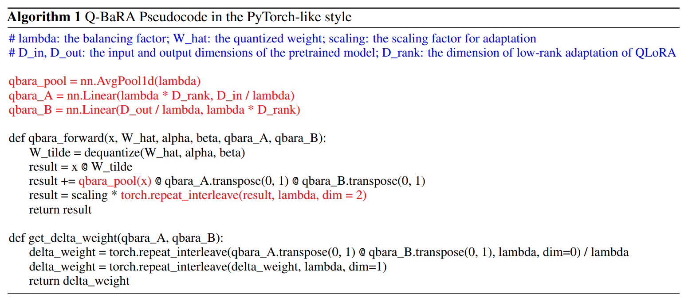

## 3.3 Block-wise Quantization with Higher-rank Adaptation

일부 시나리오에선 FP16 이나 BF16 같은 high-precision data format 에 의존하지 않고 low-precision inference model 이 필요하다. 이를 위해 Hugging Face 는 fine-tuned adaptation 을 high precision 으로 pre-trained model 과 합친 뒤 Post-Training Quantization (PTQ) 으로 압축하라고 권장한다. 이는 가능하지만 PTQ 는 필연적으로 accuracy 저하를 가져온다. 그러니까 최적 접근은 fine-tuning 을 통해 바로 low-precision inference model 을 얻는 거다.

Quantized pre-trained model 은 Eq. 1 에서처럼 block-wise 방식으로 triplet ($\hat{w}, \alpha, \beta$) 로 표현된다. 여기서 $\hat{w}$ 는 rounding operation $\lceil \cdot \rceil$ 에 대응하는 discrete series 의 일부고, $\alpha$ 와 $\beta$ 는 high-precision floating-point number 로 continuous 하다. Adaptation weight $\Delta W$ 가 quantized pre-trained model 에 merging 되려면 각 block 안에서 $(\Delta w - \beta)/\alpha$ 가 rounding operation 의 discrete series 에 맞는 series 를 형성해야 한다. 이 조건을 맞추는 건 어렵다. 특히 각 block 이 서로 다른 $\alpha$ 와 $\beta$ 에 대응하기 때문이다.

그래서 제약을 완화해야 한다. 실현 가능한 해결책은 각 block 안 모든 $\Delta w$ 를 같게 만드는 거다. 그러면 $\Delta w$ 를 단순히 $\beta$ 조정으로 볼 수 있어서 QAT 를 가능하게 한다. Sec. 3.2 에서 분석했듯이, 이는 저자의 Q-BaRA 방법으로 쉽게 달성된다. Q-BaRA fine-tuning 의 $\Delta W$ 에서 $\lambda_1 \times \lambda_2$ size block 마다 element 가 모두 같다. $\lambda_1$ 과 $\lambda_2$ 를 quantization block size 에 맞추면 된다. 하지만 pre-trained model 의 quantization 은 보통 block_size 가 32 나 64 를 쓰는데, 저자의 Q-BaRA 설정은 $\lambda_1 = \lambda_2 = 2$ 다. 즉, input 과 output 을 더 압축해야 해서 $\lambda_1, \lambda_2 \in [4, 8]$ 이 된다. 이런 심한 information loss 는 Q-BaRA 의 optimal balance 점에서 멀어진다. 그래서 저자는 two low-rank matrices 를 버리고 single matrix 를 써서 adaptation 의 rank 를 최대한 확장한다. 이렇게 model 의 fine-tuning capability 를 높인다. 또 Fig. 2a 에서 input compression 이 output compression 보다 accuracy 에 훨씬 큰 영향을 준다는 걸 알았다. Adaptation 의 input 은 이전 pre-trained model layer 의 output 을 포함하지만, output 은 adaptation 의 정보 처리만 반영하기 때문이다. Fig. 2b 는 input 이 훨씬 더 많은 정보를 담고 있다는 걸 보여준다. magnitude 가 더 크고 outlier 도 두드러진다.

이 분석을 바탕으로 저자는 Quantization-Aware Fine-tuning with Higher Rank Adaptation (QA-HiRA) 를 제안한다. 

- 이 접근은 adaptation 의 input 과 output compression 을 pre-trained model 의 block-wise quantization 과 결합해서 fine-tuning 을 quantized $\beta$ 업데이트로 만든다. 이렇게 QAT 를 달성한다. 
- 게다가 input 과 output 이 많이 압축될 때 single matrix 를 써서 fine-tuning 에 higher rank 를 얻는다. 
- QA-HiRA 의 설명과 비교는 Fig. 3 을 참고해라. 저자의 QA-HiRA 도 코드 몇 줄 삽입/수정으로 구현할 수 있다 (Algorithm 2 참고).

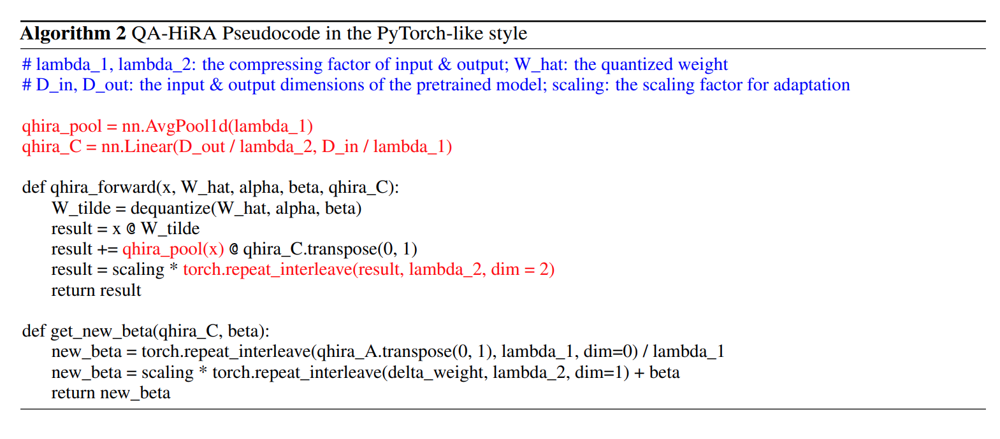

# 4 Experiments

## 4.1 Settings

저자는 Q-BaRA 와 QA-HiRA 를 LLaMA 와 LLaMA2 family (7B, 13B, 30B, 65B) 에 적용해서 Alpaca 와 Flan v2 dataset 에서 parameter-efficient fine-tuning 을 구현한다. 평가로는 Massively Multitask Language Understanding (MMLU) 와 zero-shot CommonsenseQA benchmark (e.g., HellaSwag, PIQA, WinoGrande, ARC, BoolQ, OpenBookQA) 를 사용한다. 공정성을 위해 QLoRA, IR-QLoRA, QA-LoRA, PEQA, GPTQ 의 공식 코드와 설정을 엄격히 따른다.

## 4.2 Main Results and Efficiency

#### Comparison against recent competitors of fine-tuning LLaMA for MMLU

저자는 먼저 LLaMA model 을 Q-BaRA 와 QA-HiRA 로 fine-tuning 해서 MMLU 에서 성능을 평가했다. Tab. 1 에서 Q-BaRA 와 QA-HiRA 를 state-of-the-art (SOTA) LoRA-fine-tuning quantization 방법인 QLoRA, QA-LoRA, IR-QLoRA 와 비교한다. LoRA 를 안 쓰고 quantized scaling 을 fine-tuning 하는 PEQA 와도 비교한다. Q-BaRA 와 QA-HiRA 는 서로 다른 시나리오를 타겟으로 하니까 따로 비교한다. 종합 결과는 Q-BaRA 와 QA-HiRA 가 각 시나리오에서 모든 비교 quantization 방법들을 확실히 앞선다는 걸 보여준다.

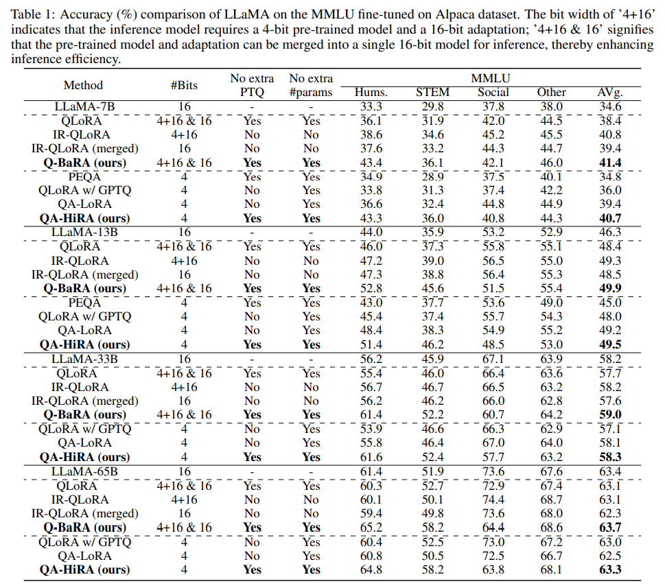

- Q-BaRA 는 다양한 크기의 model 에서 최고 accuracy 를 낸다. 가장 가까운 방법인 QLoRA 와 비교하면 Q-BaRA 가 accuracy 에서 큰 향상을 보인다. 
- Accuracy 면에서 가장 경쟁력 있는 IR-QLoRA 와 비교해도, Q-BaRA 는 pre-trained model quantization 에 추가 최적화나 trainable parameter 추가 없이 higher accuracy 를 낸다. 
- 게다가 IR-QLoRA 는 adaptation 의 computational graph 를 수정해서 pre-trained model 과 adaptation 을 lossless 하게 합칠 수 없어서 inference model 효율이 떨어진다. 그래서 IR-QLoRA 는 merging 후 성능이 저하되지만, Q-BaRA 는 lossless merging 이 가능하다.

---

- QA-HiRA 는 fine-tuning 으로 바로 4-bit inference model 을 만들 수 있어서 edge device 배포에 더 적합하다. 
- QA-HiRA 가 QLoRA fine-tuning 후 GPTQ compression 이나 최근 SOTA QAT fine-tuning 방법인 QA-LoRA 같은 비슷한 방법들보다 accuracy 에서 확실한 우위를 보인다. 
- 심지어 대부분 16-bit fine-tuned model 보다도 accuracy 가 높다. 특히 QA-HiRA 도 pre-trained model quantization 에 추가 최적화나 trainable parameter 가 필요 없다.

#### Performance on LLaMA2

저자는 LLaMA2 에서도 방법의 효과를 검증해서 Q-BaRA 와 QA-HiRA 의 generalization 성능을 보여준다 (Tab. 2 참고). 

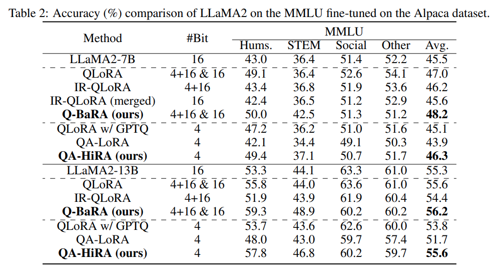

- Vanilla QLoRA (GPTQ 유무 포함) 를 baseline 으로 해서 뛰어난 model generalization 능력을 보인다. 하지만 현재 SOTA 변형 (IR-QLoRA, QA-LoRA) 은 성능이 떨어진다. 
- 오직 Q-BaRA 와 QA-HiRA 만 baseline 보다 높은 accuracy 를 낸다. 
  - 이 결과는 Q-BaRA 와 QA-HiRA 가 서로 다른 LLM family 에서 강한 generalization 을 보인다는 걸 나타낸다.

#### Fine-tune performance using Flan v2 dataset

저자는 Flan v2 dataset 으로 fine-tuned LLaMA 의 few-shot MMLU accuracy (%) 를 평가해서 다른 dataset 에서도 방법의 성능을 검증했다. 

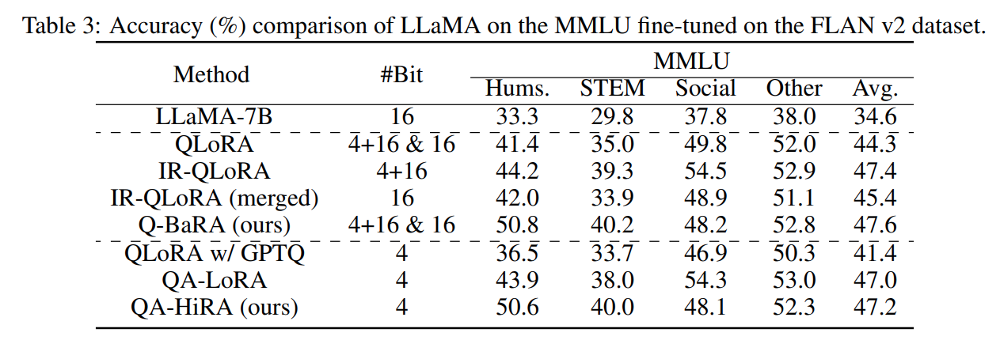

Tab. 3 에 따르면 Q-BaRA 와 QA-HiRA 모두 각 시나리오에서 최고 accuracy 를 낸다.

#### Performance on Commonsense QA

LLaMA-7B 와 LLaMA2-7B 에서 Q-BaRA 와 QA-HiRA 의 zero-shot commonsense QA 성능도 평가했다 (Tab. 4 요약). 

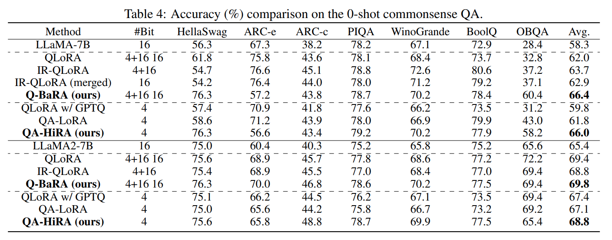

- MMLU 결과와 매우 비슷하다. Q-BaRA 는 계속해서 최고 성능을 내고, QA-HiRA 도 4-bit inference model 에서 다른 방법들을 크게 앞선다. 
- 특히 LLaMA2 에서 저자의 방법만 QLoRA 와 QLoRA 후 GPTQ 로 얻은 4-bit model 을 넘어서는데, 다른 방법들은 이 기준을 넘지 못한다.

#### The efficiency of our Q-BaRA and QA-HiRA

Q-BaRA 와 QA-HiRA 모두 효율적인 fine-tuning 능력을 보여준다. Tab. 5 에서 trainable parameter 수와 fine-tuning 시간 비교를 한다. 

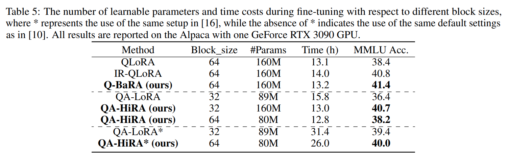

- IR-QLoRA 는 trainable parameter 를 거의 추가 안 하지만 fine-tuning 계산 수정 때문에 시간이 더 걸린다. 
- Q-BaRA 는 QLoRA 와 같은 trainable parameter 수를 가지면서 non-parameter operator 추가로 fine-tuning 시간이 미세하게 늘어나지만 accuracy 는 크게 향상된다. 
- block_size (i.e., QA-HiRA 의 $\lambda_1 \lambda_2$) 가 32일 때 QA-HiRA 는 QLoRA 와 같은 trainable parameter 수로 training 시간과 accuracy 를 최적화한다. 
- block_size 가 64일 때 QA-HiRA 는 QA-LoRA 보다 trainable parameter 가 약간 적으면서도 higher accuracy 와 less fine-tuning 시간으로 낸다.

## 4.3 Ablation Study

#### Impact of the LoRA rank

Q-BaRA 에서 저자는 input 과 output 의 balancing factor $\lambda$ 를 rank 와 동기화해서 QLoRA 와 같은 parameter 수를 유지한다. 이제 LoRA rank 가 저자의 방법에 미치는 영향을 본다. 여러 $\lambda$ 값 아래 다른 rank 로 model 을 fine-tuning 하면서 다른 hyperparameter 는 고정한다. 여기서 $\lambda=1$ 은 QLoRA 와 같고, $\lambda=2$ 는 저자의 Q-BaRA 다.

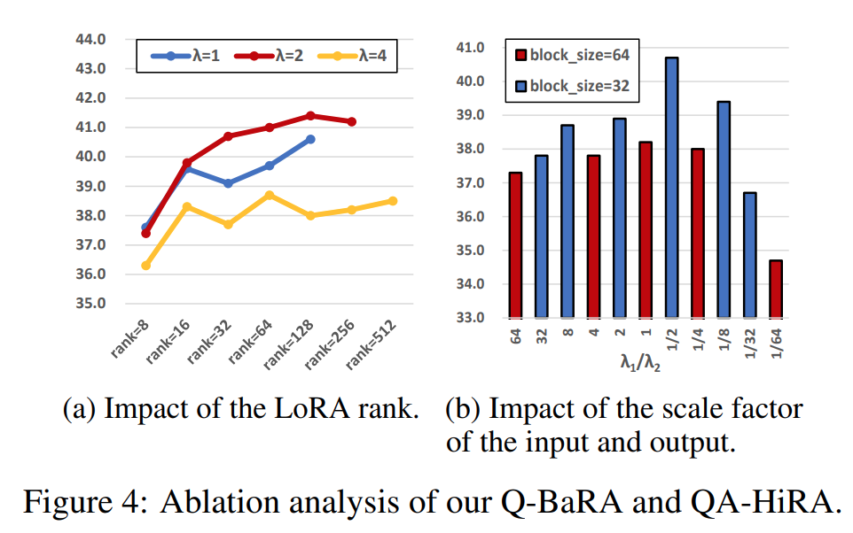

- Fig. 4a 에 따르면 rank 가 극단적으로 낮을 때 accuracy 가 떨어진다. 하지만 rank 가 커질수록 accuracy 가 좋아지고 안정화된다. 
- 또한, $\lambda=2$ 가 일반적으로 더 높은 accuracy 를 낸다. input 과 output 을 적절히 압축하는 게 adaptation fine-tuning 에 도움이 된다는 걸 검증한다.

#### Impact of the balancing factor of the input and output

QA-HiRA 에서 저자는 $\lambda_1 \lambda_2 = block_size$ 를 요구해서 가능한 조합이 많다. 같은 block_size 아래 서로 다른 $\lambda_1$ 과 $\lambda_2$ 조합이 accuracy 에 미치는 영향을 본다.

- Fig. 4b 는 $\frac{\lambda_1}{\lambda_2}$ 가 1이거나 약간 작을 때 성능이 더 좋다는 걸 보여준다. 
- 이는 저자의 방법과 맞는다. input 과 output 의 balanced compression 이 선호되고, input 이 output 보다 더 가치 있다는 뜻이다.

#### Impact of different scale operators

Adaptation 압축에 다른 non-parameter operator 의 효과를 보기 위해 다른 scale operator 를 썼다. 우리가 쓴 $\textrm{AvgPool}$ & $\textrm{repeat\_interleave}$ 외에 $\textrm{truncation}$ & $\textrm{supplement\_0}$ 과 interval sampling & interpolation 도 시도했다. 구체적인 설명은 이렇다:  
- $\textrm{AvgPool}$ & $\textrm{repeat\_interleave}$: Sec. 3.2 참고.  
- $\textrm{truncation}$ & $\textrm{supplement\_0}$: input 을 일정 비율로 앞부분만 남기고 자른다. output 은 zero-padding 으로 원래 크기로 복원한다.  
- $\textrm{interval\_sampling}$ & $\textrm{interpolation}$ : 채널 값을 일정 간격으로 샘플링한다. output 은 zero-interpolation 으로 원래 크기로 복원한다.

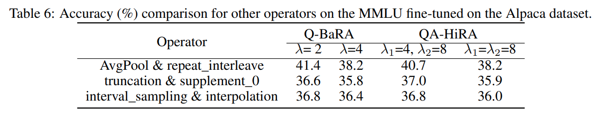

Tab. 6 에 따르면 다른 scaling operator 는 저자의 $\textrm{AvgPool}$ & $\textrm{repeat\_interleave}$ 보다 효과가 훨씬 떨어진다. 특정 채널에 outlier 가 있어서 높은 정보가 포함되는데, 이 outlier 를 잃으면 성능에 큰 영향을 준다. 게다가 저자의 $\textrm{AvgPool}$ & $\textrm{repeat\_interleave}$ operator 는 pre-trained model 과 merging 에 더 유리해서 lossless inference model 을 만든다.

# 5 Conclusion

이 논문에서 저자는 quantized pre-trained model 을 fine-tuning 할 때 imbalance 를 찾아냈다. 

adapter 의 input 과 output 이 너무 복잡한 반면, adaptation 의 effective trainability 는 낮다. 그래서 저자는 Q-BaRA 를 제안한다. 이는 adapter 의 input 과 output 을 단순화하고 adapter 의 capability 를 높여서 quantized model 의 fine-tuning 에 최적 balance 를 맞춘다. 

Fine-tuned LLM 을 low-precision inference model 로 배포해야 하는 경우를 위해 QA-HiRA 도 소개한다. 

- 이 방법은 같은 balancing 원칙을 기반으로, adapter 의 input 과 output 을 pre-trained model 의 block-wise quantization 에 맞춰 크게 단순화하고 single matrix 로 higher rank 를 달성한다. 
- Q-BaRA 와 QA-HiRA 는 둘 다 구현이 쉽고, 여러 model 과 dataset 에서 강력한 성능과 generalization 을 보여준다. 저자는 LLaMA 와 LLaMA2 model family 에서 광범위한 실험으로 이 방법들의 효과를 검증했다.