논문 및 이미지 출처 : <https://aclanthology.org/2024.findings-emnlp.444v2.pdf>

# Abstract

Low-Rank Adaptation (LoRA)은 대표적인 Parameter-Efficient Fine-Tuning (PEFT) 방법으로, Large Language Models (LLMs)에서 소수의 weight 만 업데이트해서 training 효율을 크게 높인다. 

최근에는 LoRA 방법에 _weight-only quantization_ 기법을 적용해서 fine-tuning 의 memory footprint 을 줄이기도 한다. 하지만 LoRA 파이프라인에 _weight-activation quantization_ 을 적용하는 건 아직 잘 탐구되지 않았는데, 저자는 activation outlier 때문에 성능이 많이 떨어지는 것을 관찰한다. 

이번 연구에서 저자는 **RoLoRA** 라는 걸 제안하는데, 이는 LoRA 기반으로 weight-activation quantization 을 효과적으로 처리하는 첫 번째 방법이다. 

- RoLoRA 는 rotation 을 사용해서 outlier 를 없애고, rotated LLMs 에서 outlier-free 특성을 유지하도록 rotation-aware fine-tuning 을 제안한다. 
- 실험 결과 RoLoRA 는 low-bit LoRA 의 convergence 와 post-training quantization robustness 를 꾸준히 개선한다. 
- LLaMA2-7B/13B, LLaMA3-8B model 에서 평가했는데, commonsense reasoning task 에서 4-bit weight-activation quantized LLaMA2-13B 의 accuracy 가 LoRA baseline 대비 최대 29.5% 절대값으로 오른다. 
- Large Multimodal Models (LLaVA-1.5-7B)에서도 효과를 입증했다.

# 1 Introduction

Large Language Models (LLMs)인 GPT-4 나 LLaMA 가 최근 여러 task 에서 성공을 거두는 걸 봤지만, model size 가 커지고 training cost 가 늘어나면서 model compression 과 Parameter-Efficient Fine-Tuning (PEFT) 방법의 필요성이 대두된다. Low-rank Adaptation (LoRA)은 가장 인기 있는 PEFT 방법으로, LLMs 의 fine-tuning efficiency 을 크게 높인다.

최근 quantization 기법이 LoRA 에 통합되면서 high-precision parameter 를 INT4 같은 low-bit 형식으로 바꾼다. 

- 기존 quantization-LoRA 방식은 fine-tuning 중 memory cost 를 줄이고, 어떤 방식은 inference cost 도 줄여서 quantized LLMs 를 바로 만든다. 
- 하지만 이는 _weight-only quantization_ 만 다루고, LoRA 의 _weight-activation quantization_ 은 거의 탐구되지 않았다. 
- weight 와 activation 을 둘 다 low-bit 로 quantize 하면 run-time GPU memory 를 더 아끼고 compute-intensive matrix-multiplication 연산을 빠르게 할 수 있다. 

저자는 4-bit 나 6-bit weight-activation quantization 을 LoRA fine-tuning 에 적용하면 LLMs 에서 accuracy 가 많이 고도로 떨어지는 것을 관찰한다. 이는 weight 와 activation distribution 에 outlier 때문인데, 이는 quantization range 를 늘려서 quantization error 를 키운다.

- Post-training quantization 연구 커뮤니티에서는 outlier 문제를 해결하려고 mixed-precision subgrouping 이나 activation 에서 weight 로 outlier 를 옮기는 방법을 썼다. 
- 최근에는 LLMs 의 weight matrices 에 rotation 을 적용해서 activation outlier 를 없애고 computational invariance 를 유지하는 게 효과적이었다고 한다. 
- 하지만 이런 방법들은 post-training 관점에서 문제를 해결한 거고, pre-training 과 fine-tuning 중에 outlier 가 생기고 distribution 이 변한다는 점은 무시했다. 

이번 연구에서 저자는 LoRA fine-tuning 설정에서 rotation 을 활용해서 outlier 를 제거하고, rotation 과 LoRA 를 동적으로 통합해서 outlier-free 특성을 유지하며 weight-activation quantization 을 개선하는 최적의 솔루션을 탐구한다.

이에 동기받아, 저자는 pre-trained LLMs 에 in-block 및 between-block rotation 을 처음 적용한 후, rotation-aware fine-tuning 을 활용하여 outlier 가 없는 fine-tuned LLM 을 생성하는 **Rotated outlier-free LowRank Adaptation (RoLoRA)** 를 제안한다 (Fig. 1). 저자는 approximation error analysis 을 기반으로 optimal rotation-aware fine-tuning 방식을 탐구한다.

광범위한 실험 결과, 다양한 LLM, tasks, 그리고 양자화 설정에서 RoLoRA 의 효과를 입증한다. 

- RoLoRA 는 weights 및 activation values 에 대한 4-bit quantization (W4A4) 성능을 LoRA 에 비해 MMLU benchmark 에서 최대 14.6 points 향상시킨다. 
- 기존의 low-bit LoRA 방법들과 비교했을 때, RoLoRA 는 이전 SOTA 인 IR-QLoRA 를 MMLU benchmark 에서 최대 6.0 points 초과 달성하며 성능을 능가한다. 
- RoLoRA 는 동일한 설정에서 LoRA 와 비교해 fine-tuning overhead 가 거의 없어 매우 효율적이다. 또한, LLaVA 같은 Large Multi-modal Models (LMM) 의 양자화 견고성을 향상시킬 수 있으며, W4A4 quantization 후에도 멀티모달 이해 능력이 크게 유지되는 것을 확인했다 (Tab. 1).

요약하자면, 본 연구의 기여는 다음과 같다:
- 저자는 LoRA 와 quantization settings 를 통합하여 rotation 을 탐구하는 최초의 방법인 **RoLoRA** 를 제안한다.
- RoLoRA 는 fine-tuned LLM 의 _weight-activation quantization_ 을 견고하게 지원하며, 특히 W4A4 및 W6A6 같은 low-bit setting 에서 효과적이다.
- 저자는 LLaMA 시리즈(2-7B, 2-13B, 3-8B)에 대해 다양한 quantization 방식(RTN/GPTQ), bitwidth(W4A4/W6A6), benchmarks(zero-shot commonsense, MMLU)에서 RoLoRA 의 효과를 검증했다. 또한, RoLoRA 가 LMM 에도 적용될 수 있음을 입증했다.

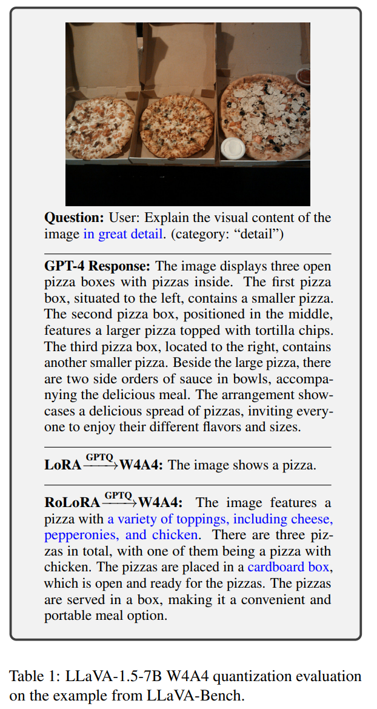

# 2 Related Work

#### Quantization

Quantization 방법은 training 과 inference efficiency 를 높이는 강력한 도구다. 

핵심은 full-precision weight 와 activation 을 lower-precision 으로 바꾸는 거다. 대부분의 LLM quantization 기법은 post-training quantization (PTQ) 범주에 속하는데, 이는 long training 없이 model 을 바로 quantize 한다. 

이런 LLM PTQ 방법 중 대부분은 weight-only quantization 을 적용하고, weight-activation quantization 을 탐구하는 건 드물다. Weight-only quantization 과 달리 weight 와 activation 을 둘 다 quantize 하면 low-precision multiply-accumulation (MAC) unit 을 쓸 수 있다. 핵심 문제는 activation 의 outlier 가 high quantization error 를 일으킨다는 거다. 

이번 연구는 LoRA pipeline 에서 weight-activation quantization 에 초점을 맞춘다.

#### LoRA

LLM sacle 이 계속 커지면서 full parameter fine-tuning 은 계산적으로 힘들어졌다. 그래서 Parameter-Efficient Fine-Tuning (PEFT) 방법이 생겼는데, 이는 parameter 의 small subset 만 training 해서 비용을 줄인다. 

Low-Rank Adaptation (LoRA)은 flexibility 와 효율성 때문에 가장 많이 쓰이는 PEFT 방법이다. 더욱 최근엔, LoRA variants 가 LoRA 의 효과성 및 효율성을 더욱 향상시킨다. LoRA 및 quantization 을 통합하는 것이 LoRA fine-tuning 에서의 GPU memory 를 절약하는 quantization 방향으로 유망해졌다.

- low-bit finetuning 의 정보 왜곡을 줄이기 위해, QLoRA 를 향상시키는 다양한 연구들이 제안되었다.
- 하지만, 이 방법들은 fine-tuning 에 weight 에만 quantization 을 적용하여 memory 사용을 줄인다.

이 연구에선 _weight-activation quantization_ 의 robustness 를 고려하는 첫 quantized LoRA 연구다.

# 3 Preliminary and Motivation

## 3.1 Low-Rank Adaptation (LoRA)

Pre-trained weight matrix $W_0 \in \mathbb{R}^{d \times k}$ 가 있을 때, LoRA 는 weight update $\Delta W \in \mathbb{R}^{d \times k}$ 를 low-rank decomposition 으로 모델링한다. 이는 $A B$ 로 표현되는데, 여기서 $A \in \mathbb{R}^{d \times r}$ 와 $B \in \mathbb{R}^{r \times k}$ 는 low-rank matrix 이고, $r \ll \min(d, k)$ 다. 그러니까 fine-tuned weight $W'$ 는 이렇게 된다:

$$
\begin{equation}
    W' = W_0 + \Delta W = W_0 + A B
\end{equation}
$$

- 여기서 $W_0$ 는 fine-tuning 중에 고정되고, underlined parameter 가 training 된다. 
- 또 Eq. (1) 에 기반하면, learned $\Delta W$ 를 pre-trained weight $W_0$ 와 합쳐서 deployment 전에 $W'$ 를 얻을 수 있다. 
- $W'$ 와 $W_0$ 가 둘 다 $\mathbb{R}^{d \times k}$ dimension 에 속하므로 LoRA 와 관련 variant 는 original model 대비 inference 에서 extra latency 를 안 만든다.

## 3.2 Outlier in Transformer

BERT 나 ViT 같은 small-scale transformer model 부터 weight 와 activation distribution 에 outlier 가 있다는 게 밝혀졌다. LLMs 에서도 이런 outlier 가 관찰된다. 

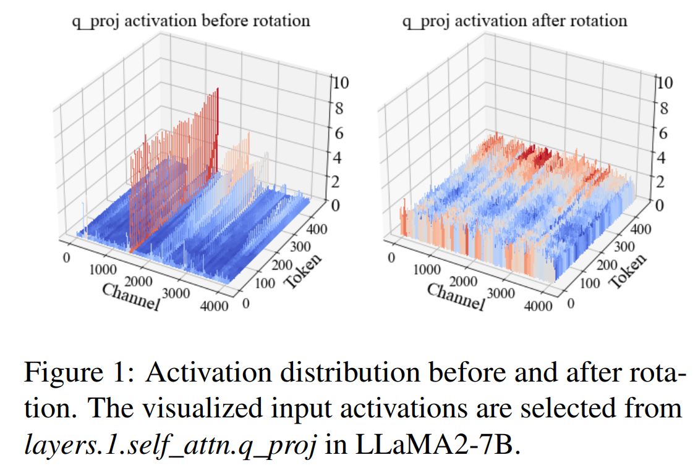

- Fig. 1 왼쪽을 보면 activation outlier 가 channel 마다 분포되어 있다. 
- 이 outlier 는 transformer 의 representative capacity 를 높이지만, quantization 에 비선형적인 문제를 가져온다.

Quantization 에서 이 outlier 문제를 해결하려는 기존 솔루션은 대부분 세 가지 유형으로 나눌 수 있다:  
- 이런 outlier values 를 higher precision 을 가진 sub-group 으로 분리하는 방법이 있다. 예로 `LLM.int8`, Atom, QuiK, AdaDim 같은 것들이 있다. 하지만 grouping 과 mixed-precision 때문에 overhead 가 만만치 않다.  
- Quantization 의 어려움을 activation 에서 weight 로 옮기는 방법도 있다. SmoothQuant 나 OmniQuant 같은 경우가 있다. 근데 이런 방법들은 weight quantization robustness 에 부정적인 영향을 주고, W4A4 시나리오에서는 실패한다.  
- Activation 이나 weight matrices 를 rotate 해서 outlier 를 없애는 방법도 있다. QuaRot 이나 SpinQuant 같은 것들이 대표적이다. 이 방법들 중에서 최근 rotation 기반 솔루션이 더 뛰어난 효과를 보여준다. 하지만 이전 rotation 기반 방법들은 post-training 관점에서 outlier 문제를 다뤘고, PEFT 설정에서는 탐구되지 않았다.  

그래서 이런 질문이 생긴다: Rotated LLMs 의 outlier-free 특성을 PEFT 동안 유지하고 그 이점을 누릴 수 있을까? 저자는 이번 연구에서 그 목표를 달성할 수 있다는 걸 보여주고, 더 나아가 가장 유망한 rotation-based fine-tuning 솔루션을 조사한다.

## 3.3 Eliminating Outlier with Rotation

Rotation matrix $R$ 은 orthogonal matrix 로 정의되는데, $|R| = 1$ 이고, $R R^\top = \mathbf{I}$ 라는 orthogonal matrix 특성을 따른다. $R$ 의 entry 가 +1 이나 -1 이면 Hadamard matrix $H$ 가 된다. 이 정의에 따르면 $2^k$ entry 가 있는 $H$ 를 Hadamard transform 기반으로 효율적으로 만들 수 있다:

$$
\begin{equation}
    H_{2^k} = \begin{bmatrix} H_{2^{k-1}} & H_{2^{k-1}} \\ H_{2^{k-1}} & -H_{2^{k-1}} \end{bmatrix} = H_2 \otimes H_{2^{k-1}}
\end{equation}
$$

- 여기서 $\otimes$ 는 Kronecker product 를 뜻한다. 
- Rotation 은 $d \times d$ Hadamard matrix $H_d X$ 와의 matrix-vector product 가 $\mathcal{O}(d \log_2(d))$ operation 만 필요해서 매우 효율적이다. 

이전 연구에서 pre-norm transformer 의 weight 에 rotation 을 적용하면 computational consistency 를 유지할 수 있고, weight 와 activation distribution 에서 outlier 를 더 줄일 수 있다는 게 밝혀졌다. 구체적으로, weight matrices 를 rotation matrix 와 곱하면 큰 값과 작은 값의 weight 가 통계적으로 섞여서 더 Gaussian-like distribution 을 만들고, 그래서 outlier 가 적고 quantize 하기 쉬운 activation 을 만든다. Rotation 의 outlier 제거 효과는 이론적으로도 증명되었다.

# 4 Method

Activation outlier 의 기존 문제와 rotation-based solution 의 성공에 동기부여를 받아서, 저자는 Rotated outlier-free Low-Rank Adaptation (RoLoRA) 을 소개한다. 

RoLoRA 는 처음에 in-block 과 between-block rotation 을 pre-trained LLMs 에 적용하고, rotated LLMs 에서 rotation-aware fine-tuning 을 통해 optimal outlier-free 특성을 유지해서 weight-activation quantization 에 강한 fine-tuned LLMs 를 만든다.

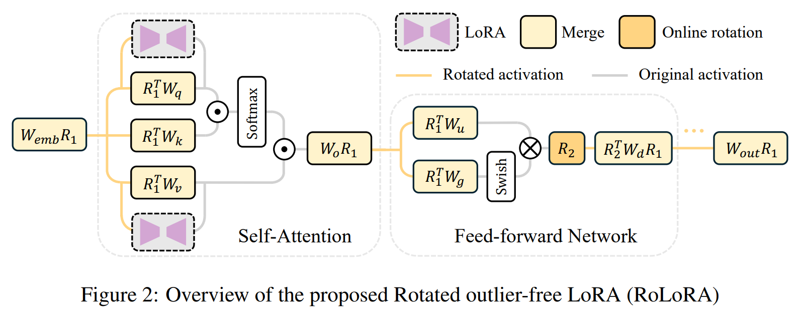

## 4.1 Applying Rotation

Fine-tuning 을 rotation 으로 시작하기 전에, model 을 수정해서 rotation 전후에 computational invariance 를 유지한다. 먼저 normalization module 에서 scaling operation 이 없도록 한다. LLaMA 시리즈에서는 RMSNorm scale parameter $\alpha$ 를 RMSNorm layer 바로 뒤의 weight matrix 에 흡수해서 구현할 수 있다.

그 다음, between-block rotation 을 해서 between-block activation 의 outlier 를 없앤다. Fig. 2 에서 보듯이 LLM 의 weight matrix 를 두 그룹으로 나눈다: _left-side weight_ ($W_q, W_k, W_e$ in self-attention module, $W_{up}, W_{gate}$ in feedforward network module)와 _right-side weight_ ($W_o$ in self-attention module, $W_{down}$ in feed-forward network module). 이 두 그룹의 weight 에 대해 다른 rotation 전략을 쓴다:

$$
\begin{equation}
    W_{\text{left}}^R \leftarrow R W_{\text{left}}, \quad W_{\text{right}}^R \leftarrow W_{\text{right}} R^{-1}
\end{equation}
$$

- 여기서 rotation $R$ 은 무작위로 생성된 Hadamard matrix 이다. 
- 또 embedding layer 전에 input $X$ 를 $X \leftarrow X R^{-1}$ 로 rotate 하고, _lm_head_ 후에 output $Y$ 를 $Y \leftarrow R Y$ 로 rotate 해서 model 의 final output 이 original model 과 동일하게 한다. 
- Rotation 과정에서 overflow 문제를 피하려고 FP16 weight 를 FP64 로 변환한 뒤 곱셈 후 다시 되돌린다. 

Weight precision 변환은 rotation merging 시작할 때 한 번만 하고, rotated weight 의 precision 은 fine-tuning 과 inference 동안 FP16 으로 유지된다. 실제 inference 에서는 precision 이 항상 low-bit (W4A4/W6A6)이니까 변환 overhead 는 없다. 이 rotation 은 training 과 inference 전에 적용되는데, original weight 에 merging 한 후에는 overhead 가 없다는 뜻이다.

- Weights 에 직접 적용하는 rotation 은 between-block activation 의 outlier 를 효과적으로 줄인다. 
  - 이 연산을 Between-Block Rotation (BBR) 이라고 부른다. 
  - Fig. 1 에서 BBR 을 적용한 효과를 보여주는데, activation distribution 이 더 부드럽고 분산돼 있다. 
  - 하지만 또 다른 문제는 이 module 들의 activation 이 여전히 outlier 에 시달린다는 거다. 
  - 특히 FFN 에서 두드러지는데, 이전 연구에서 논의되었다. 
- BBR 같은 rotation 을 직접 적용할 수 없는 이유는 FFN 에 SwiGLU 같은 non-linear operation 때문이다. 
  - 이걸 해결하려고 $W_{down}$ 에 activation input 을 넣기 전에 online rotation node 를 쓴다. 
  - 이 online rotation 은 fast Hadamard kernel 을 따라 구현했는데, activation 을 동적으로 rotate 하는 layer 로 볼 수 있다. 
  - 이 online rotation 연산은 CUDA 에서 fast Hadamard kernel 을 사용하니까 효율이 높고, training 과 inference 동안 overhead 가 거의 없다. 이걸 In-Block Rotation (IBR)이라고 부른다. 
  - IBR 은 self-attention module 에도 적용할 수 있는데, Tab. 7 실험에서 이 rotation 으로 성능 향상이 없다는 걸 확인했다.

## 4.2 Rotation-aware Fine-tuning

BBR 과 IBR 을 둘 다 적용하면 between-block 과 in-block activation outlier 가 없어진다. 이 특성은 QLoRA training 중 quantization error 를 낮춰서 gradient estimation 을 더 정확하게 하고 fine-tuning optimization 을 부드럽게 한다. 하지만 기존 연구에서 fine-tuning 과 pre-training 중에 outlier 가 distribution 이 변하거나 새로 생긴다는 걸 밝혔다. 

이는 rotation 을 LoRA 에 동적으로 통합해서 outlier-free 특성을 효과적으로 유지해야 하는 새로운 문제를 낳는다. optimal rotation-aware fine-tuning 방식을 설계하려면 rotation 을 적용했을 때 approximation 난이도를 먼저 분석한다. 특정 downstream task 에 optimal weight distribution 이 $W^*$ 라고 가정하고, LoRA weight $A B$ 를 pre-trained weight $W_0$ 와 합쳐서 근사한다. LoRA fine-tuning 의 optimization 은 이렇게 나타낼 수 있다:

$$
\begin{equation}
    \min_{A, B} \| W^* - (W_0 + A B) \|_F
\end{equation}
$$

- 여기서 $\| \cdot \|_F$ 는 Frobenious norm 이다. 

Rotated model 에 LoRA module 을 넣기 위해 두 가지 rotation-aware fine-tuning 방식, 즉 LoRA After Rotation (LAR)과 LoRA Before Rotation (LBR)을 제안했다. 이는 Fig. 3 에 나와 있다.

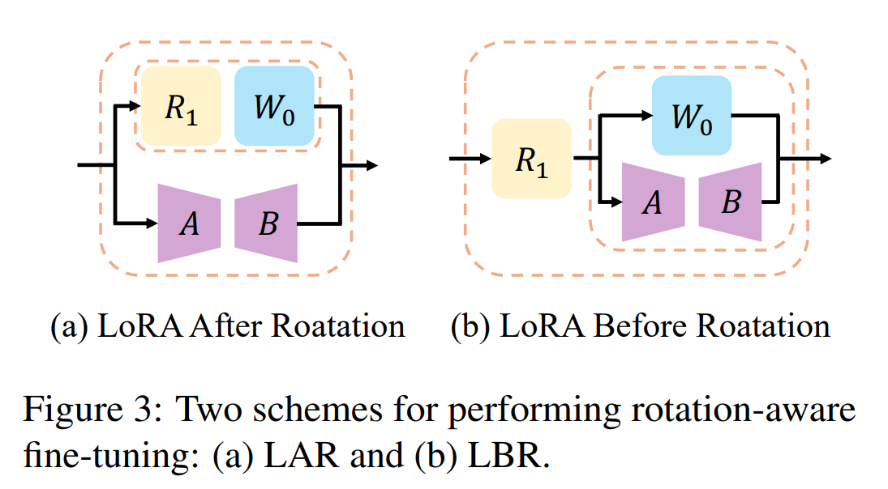

- LAR 에서는 먼저 rotation matrix 를 pre-trained weight 와 합친 뒤 $R_1 W_0 + A B$ 를 써서 $W^*$ 를 근사한다.
- LBR 에서는 LoRA weight 를 먼저 합친 뒤 $R_1 (W_0 + A B)$ 로 rotate 한다.

optimal weight 가 full-finetuning 결과 $W_{FT}$ 라고 가정하면, 이 두 방식의 optimization 은 이렇게 된다:

- LAR: $$
- LBR: $$

$$
\begin{equation}
    \begin{aligned}
        & \text{LAR: } \min_{A, B} \| A B - O_{\text{LAR}} \|_F, O_{\text{LAR}} = W_{FT} - R_1 W_0 \\
        & \text{LBR: } \min_{A, B} \| A B - O_{\text{LBR}} \|_F, O_{\text{LBR}} = R_1^{-1} W_{FT} - W_0
    \end{aligned}
\end{equation}
$$

final optimization 은 완전히 달라진다. Approximation target $O_{\text{LAR}}$, $O_{\text{LBR}} \in \mathbb{R}^{d \times k}$ 에 SVD 를 적용해서 $O = U S V^T$ 로 분해한다. first $r$ dimensions 의 principal singular value 와 vector 를 사용해서 rank $r$ 인 LoRA weight 를 초기화한다:

$$
\begin{equation}
    A = U_{[:,:r]} S_{[:r,:r]}^{1/2} \in \mathbb{R}^{d \times r}, \quad B = S_{[:r,:r]}^{1/2} V_{[:,:r]}^T \in \mathbb{R}^{r \times k}
\end{equation}
$$

다양한 rank $r$ 선택의 approximation error 를 검증해서 두 rotation 방식에서 LoRA 를 시뮬레이션했다. 

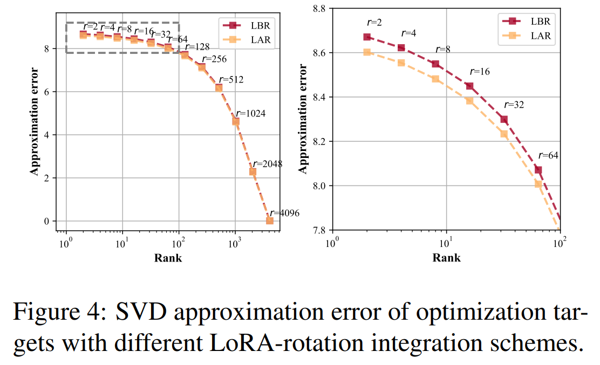

- Pre-trained LLaMA2-7B 를 $W_0$ 로, Alpaca dataset 에서 full-parameter fine-tuned model 을 $W_{FT}$ 로 써서 실험했는데, 결과는 Fig. 4 에 나와 있다. 
- 결과에 따르면 LAR 은 low-rank 설정에서 LBR 보다 approximation error 가 낮아서 rotation-aware fine-tuning 에 더 나은 설계라는 걸 알 수 있다. 
- 더 나은 approximation 은 rotation matrix 와 LoRA weight 로 두 단계 merging 한 후에도 final weight 가 outlier-free 특성을 유지할 수 있다는 걸 보여준다. 이는 Sec. 5.5 의 ablation 실험으로 더 검증되었다.

LAR 설정에서 optimal rotation-aware fine-tuning 방식 덕분에 LLM fine-tuning 동안 outlier-free 특성을 효과적으로 유지할 수 있다. 이는 Fig. 5 에 나와 있다.

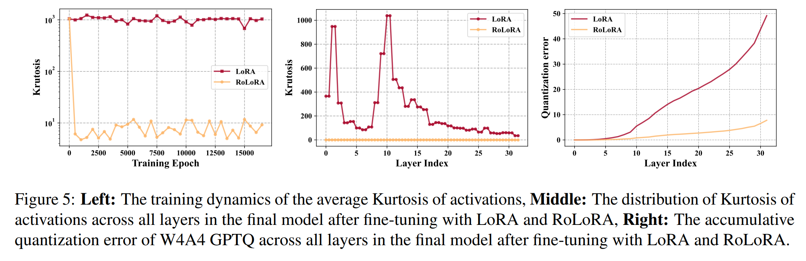

# 5 Experiments

## 5.1 Settings

#### Model, LoRA, Quantizer

Model, LoRA, Quantizer 실험에 쓴 model 은 LLaMA2-7B/13B 와 LLaMA3-8B 다. Training pipeline 은 LLaMA-Factory setting 을 따른다. Fine-tuning dataset 은 Alpaca 로, 52K sample 이 있다. Weight PTQ 방법은 baseline Round-To-Nearest (RTN)와 널리 쓰이는 GPTQ 다. Activation quantizer 는 모든 실험에서 RTN 을 쓰고, weight 는 per-channel symmetric quantization, activation 은 per-tensor quantization 을 쓴다.

#### Tasks

RoLoRA 는 EleutherAI evaluation harness 를 사용한 7 zero-shot commonsense reasoning tasks 에서 검증했다. 

이 task 에는 BoolQ, PIQA, HellaSwag, WinoGrande, ARCeasy, ARC-challenge, OBQA 가 포함된다. 또 Massively Multitask Language Understanding (MMLU) benchmark 의 accuracy 도 보고한다.

#### Baselines

저자는 실험 두 가지 설정으로 한다.
- FP16 fine-tuning 으로 RoLoRA 를 해서 W4A4 와 W6A6 quantization 결과를 LoRA 와 비교한다.
- 4-bit weight quantization 으로 RoLoRA fine-tuning 을 해서 W4A4 성능을 QLoRA, LoftQ, IR-LoRA 같은 다른 low-bit LoRA 방법과 비교한다. 이를 QRoLoRA 라고 부른다.

## 5.2 Main Results

RoLoRA 를 FP16 fine-tuning 에서 LoRA 와 먼저 평가하고, fine-tuned LLMs 에 _weight-activation PTQ_ 를 적용했다. 공정한 비교를 위해 RoLoRA 와 LoRA 는 같은 설정(rank, epoch, learning rate 등)을 쓴다. 

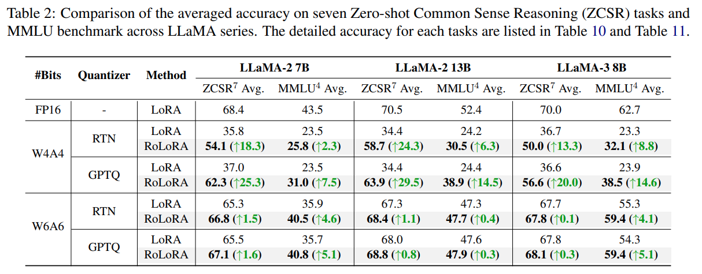

- Tab. 2 를 보면 RoLoRA 는 LLaMA 시리즈의 quantization robustness 를 여러 설정에서 높인다. 특히 W4A4 low-bit setting 에서 RoLoRA 는 LoRA 대비 ZCSR 에서 최대 29.5%, MMLU 에서 14.6% 절대값으로 성능이 오른다. 
- MMLU 는 네 개 선택지 있는 multiple-choice 질문이지만, 상대 accuracy 가 25% 아래여도 의미가 있다. 왜냐하면 일부 low-bit quantized LLMs 는 네 개 선택지 중 하나를 고르라는 instruction 도 못 따라가기 때문이다. 
- 저자의 방법은 reasoning 성능을 더 잘 보존해서 LLaMA 가 대부분 질문에 의미 없는 token 을 생성하기보다는 instruction 을 따라 답을 낸다. 게다가 RoLoRA 는 LLaMA 시리즈의 W6A6 quantization 을 여러 task 에서 거의 손실 없이 가능하게 한다.

RoLoRA 를 QLoRA 와 여러 baseline 방법(LoftQ, IR-QLoRA 포함)과 4-bit fine-tuning 에서 더 평가하고, low-bit fine-tuned LLaMA2-7B 에 W4A4 PTQ 를 적용했다. 7 commonsense reasoning tasks 와 4 MMLU subtasks 의 성능은 Tab. 3 에 자세히 나와 있다. 

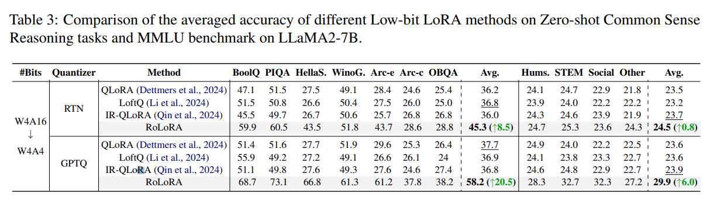

- RoLoRA 는 같은 quantizer 를 써도 quantized model 의 성능을 꾸준히 높인다. 특히 W4A4 GPTQ 에서 RoLoRA 는 QLoRA 보다 commonsense reasoning task 의 average accuracy 에서 20.5% 앞선다. 
- FP16 과 4-bit fine-tuning 실험에서 RoLoRA 는 GPTQ 로 quantize 된 LLMs 에서 더 높은 성능 향상을 보인다. 이는 RoLoRA 가 fine-tuning 에서 outlier-free activation 을 유지한다는 주장과 맞아떨어진다. 
- GPTQ 는 weight 의 quantization error 만 낮추고 activation 에는 도움이 안 되기 때문이다.

## 5.3 Visual Instruction Tuning

RoLoRA 의 효과를 visual instruction tuning task 에서 LLaVA-1.5-7B 로 더 검증한다. LLaVA-1.5-7B 는 language model Vicuna-7B 와 vision encoder CLIP ViT-L-336px 로 구성된다. LLaVA-1.5-7B 를 LLaVA-Instruct-150K 에서 fine-tuning 한다. Language model 만 quantization 하고, quantized Vicuna 와 full-precision vision encoder 로 LLaVA 를 LLaVA-bench (COCO)에서 GPT-4 로 평가한다.

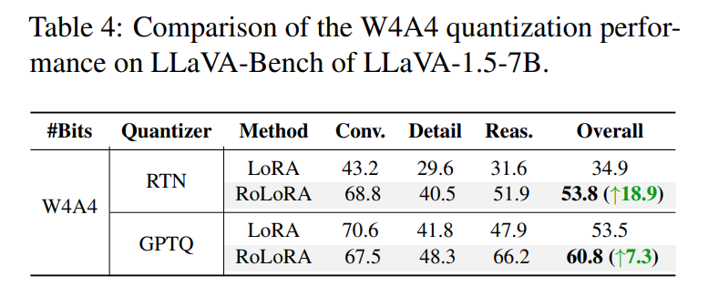

- Conversation, detail description, complex reasoning 에 걸친 상대 score 는 Tab. 4 에 보고되는데, 결과에서 RoLoRA 가 quantization robustness 를 개선하고 PTQ 동안 multi-modal 능력을 더 잘 유지한다는 걸 볼 수 있다. 전체 score 는 최대 18.9 까지 오른다. 
- 주어진 이미지에서 detail description task 의 예도 Tab. 1 에 제공한다. 
- W4A4 LoRA model 은 이미지에 대해 대충 표면적인 설명만 주지만, W4A4 RoLoRA model 은 topping 과 container 같은 세부 사항을 완전히 설명한다.

## 5.4 Compatibility with other LoRA variants

저자의 방법을 대표적인 LoRA variant 인 DoRA 로 더 검증한다. DoRA 는 pre-trained weight 를 magnitude 와 directional component 로 분해하고 둘 다 finetune 한다. 저자도 rotation-aware fine-tuning step 에서 이 방식을 따라 RoDoRA 라고 부른다.

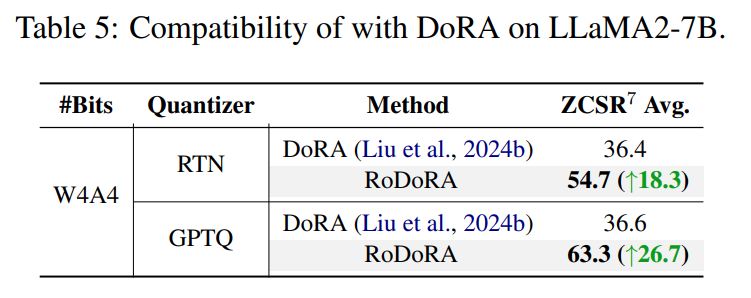

- Tab. 5 에서 보듯이 RoDoRA 는 RTN 과 GPTQ 를 quantizer 로 썼을 때 W4A4 LLaMA2-7B 에서 각각 18.3%와 26.7% 더 높은 accuracy 를 달성한다. 
- RoDoRA 의 결과는 RoLoRA 도 능가하는데, 저자의 방법이 SOTA LoRA variant 와 호환되고 weight-activation quantization 성능을 더 높일 가능성이 있다는 걸 보여준다.

## 5.5 Ablation Study and Analysis

#### When to Apply Rotation? 

Rotation-Aware Fine-tuning (RAF) 방식은 LoRA fine-tuning 전에 LLMs 를 rotate 하지만, 이미 fine-tuning 된 LoRA model 에 rotation 을 직접 적용할 수도 있다. 이 가능한 LoRA→Rotate→PTQ 패러다임은 post-training rotation 이라고 부른다. 

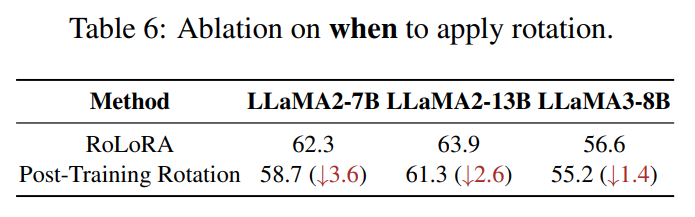

Post-training rotation 을 RoLoRA 와 같은 training 설정으로 LLaMA 시리즈에서 평가한다. W4A4 GPTQ 성능은 7 zero-shot commonsense reasoning tasks 에서 Tab. 6 에 나와 있다. 결과는 LoRA 전에 rotation 을 적용하면 fine-tuned LLMs 의 quantization robustness 를 꾸준히 높일 수 있다는 걸 나타낸다.

#### Where to Apply Rotation?

Fig. 2 에서 저자의 pipeline 에 두 가지 rotation 유형, 즉 all weight matrices 에 적용되는 Between-Block Rotation 과 FFN 의 _down_proj_ 에 적용되는 In-Block Rotation 을 소개한다. 

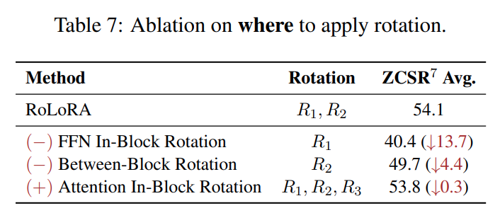

- Sec. 4.1 에서 논의했듯이, self-attention 에 비슷한 head-wise IBR $R_3$ 를 적용할 수도 있다. 
- $R_3$ 는 Fig. 2 의 $W_v$ 와 $W_o$ 를 $W_v^R \leftarrow W_v R_3$, $W_o^R \leftarrow R_3^{-1} W_o$ 로 rotate 한다. 
- 이런 rotation target 선택은 LLaMA2-7B W4A4 PTQ 로 Tab. 7 에서 검증된다. 결과는 $R_1$ 과 $R_2$ 만 적용하는 게 outlier 를 없애는 데 최선이라는 걸 시사한다.

#### How to Apply LoRA? 

Sec. 4.2 에서 두 가지 rotation-aware fine-tuning 방식, 즉 LoRA After Rotation (LAR)과 LoRA Before Rotation (LBR) 을 Fig. 3 에 제안한다. 

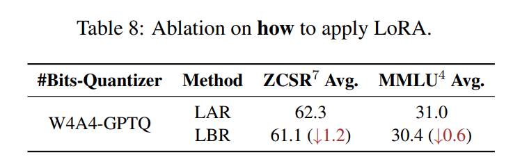

- LAR 이 full-finetuning 과 비교한 approximation error 분석에서 더 나은 패러다임임을 증명한다. 
- Tab. 8 에서 LLaMA2-7B 의 fine-tuning 에서 두 방식의 W4A4 quantization 성능을 정량적으로 비교한다. 
- LAR 방식이 더 나은 효과를 보여주는데, Fig. 4 의 approximation 분석과 일치한다.

#### Outliers

LLM fine-tuning 동안 outlier-free 특성을 유지하는 건 RoLoRA 의 가장 중요한 동기다. Outlier 제거 효과를 정량적으로 검증하려고 activation 의 kurtosis $\kappa = \frac{\sum_i^k (x_i - \mu)^4}{\sigma^4 + \epsilon}$를 써서 outlier 존재를 잰다. 

여기서 $\mu$ 와 $\sigma$ 는 각각 activation distribution 의 empirical mean 및 standard deviation 이다. 일반적으로 large kurtosis value 는 heavy tail 과 higher outlier likelihood 를 가진 activation distribution 을 나타낸다. LoRA 와 RoLoRA 로 fine-tuning 중 kurtosis dynamic 을 Fig. 5 에서 시각화한다. 

- Training 초반 epoch 에서 rotation 은 activation outlier 를 효과적으로 억제한다. 
- Rotation-aware fine-tuning 은 이 최적 특성을 유지할 수 있다. 
- RoLoRA 로 fine-tuning 후 Fig. 5 에서 보듯이 all layers 의 kurtosis $\kappa$ 가 크게 줄어들어 LoRA baseline 보다 낮은 quantization error 를 낳는다. 
- RoLoRA 와 LoRA 의 activation distribution 을 layer 별로 비교한 건 Appendix 의 Fig. 7 에 있다.

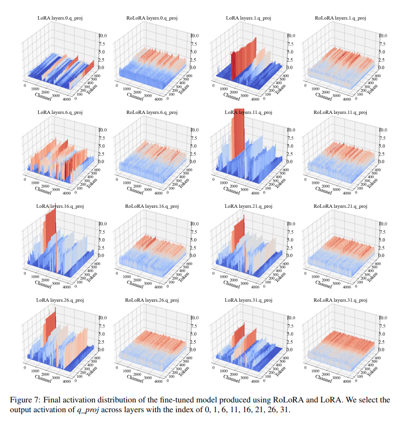

#### LoRA rank settings

LoRA 와 RoLoRA 의 robustness 를 다양한 rank settings $r \in \{4, 8, 16, 32, 64\}$ 로 LLaMA2-7B fine-tuning 하고 zero-shot commonsense reasoning task 에서 평가한다. RoLoRA 와 LoRA 의 optimal rank setting 은 각각 16 과 32 다. 

lower optimal rank 는 RoLoRA 가 trainable parameter 를 줄일 가능성을 나타낸다. 전반적으로 RoLoRA 는 rank setting 과 관계없이 LoRA 를 꾸준히 능가해서 robustness 를 보여준다.

Efficiency RoLoRA 의 fine-tuning efficiency 를 보면 추가 training time 은 online rotation operation ($R_2$ in Fig. 2) 에서만 생긴다. 다른 rotation ($R_1$ in Fig. 2) 은 original weight 에 바로 합칠 수 있다. 추가 matrix multiplication 이 하나뿐이고, 늘어난 rotation parameter 는 이론적으로 무시할 만하다. RoLoRA 와 LoRA 의 fine-tuning cost 를 같은 설정 (rank $r = 16$, batch size 8, 총 3 epoch)으로 Tab. 9 에서 보고한다. RoLoRA 는 W4A4 quantized LLaMA2-7B 성능을 매우 낮은 추가 overhead 로 크게 개선한다.

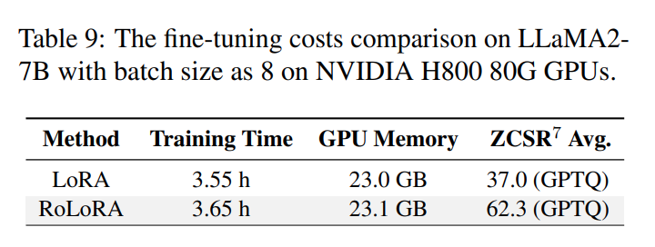

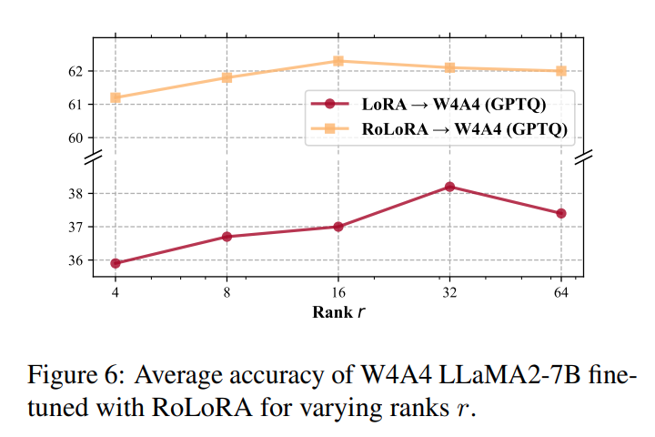

# 6 Conclusion

이 논문에서 RoLoRA 를 제시한다. 

이는 LoRA 에서 weight-activation quantization 가능성을 탐구한 첫 작업이다. RoLoRA 는 rotation 을 적용해서 activation distribution 의 outlier 를 없애고, rotation-aware fine-tuning 으로 outlier-free 특성을 유지한다. 

Rotation 을 LoRA 에 통합하는 방법을 이론적, 실험적으로 조사한다. RoLoRA 는 W4A4 와 W6A6 LLMs 의 성능을 여러 task 에서 같은 training 비용으로 크게 개선한다. 게다가 RoLoRA 는 visual instruction tuning 에도 도움을 준다.

# Limitation

이 작업에서 우리는 rotation 기반 fine-tuning 방법을 제안한다. 이건 outlier-free 특성을 유지해서 low-bit weight-activation PTQ 의 quantization robustness 를 효과적으로 개선한다. 

Fine-tuning 은 NVIDIA H800 GPU 에서 했는데, 최근 NVIDIA Blackwell-architecture GPU 의 4-bit floating point 지원은 efficiency 를 더 개선할 수 있다. 이 한계를 고려해서 미래 작업에서 개선할 계획이다.
