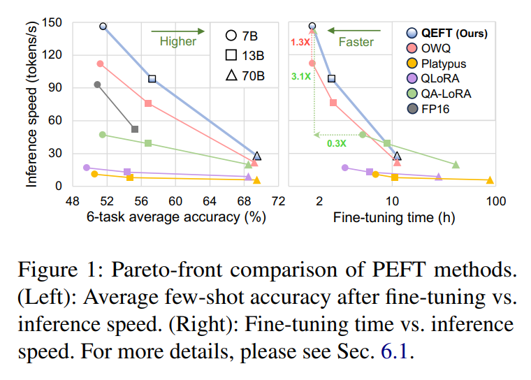
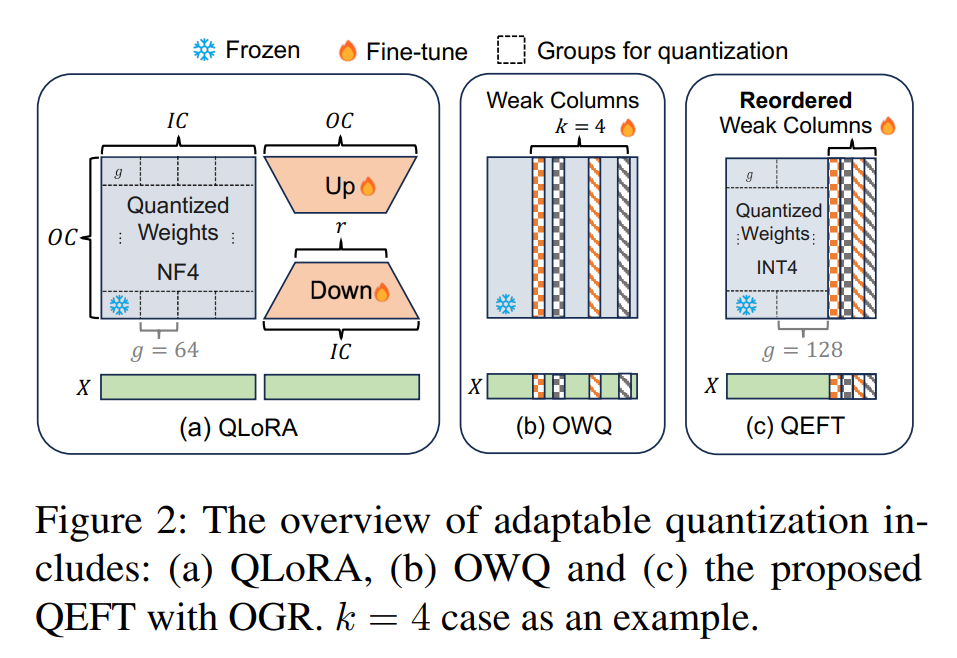
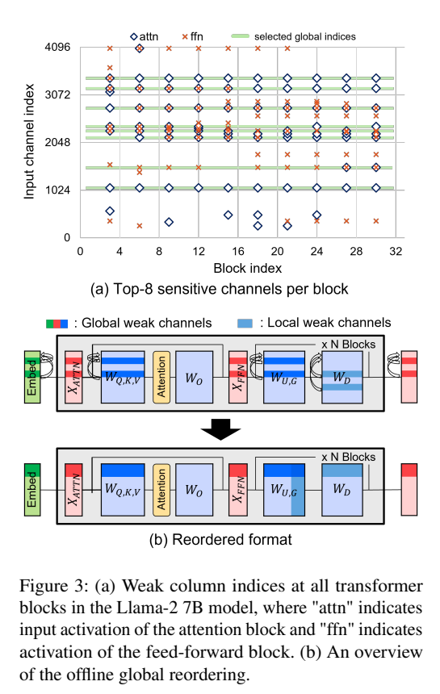
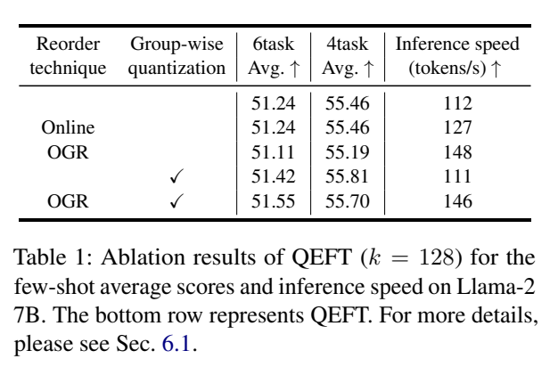
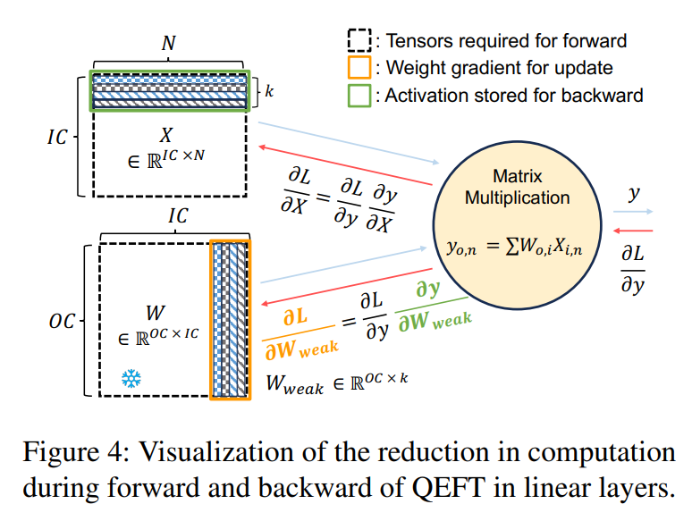
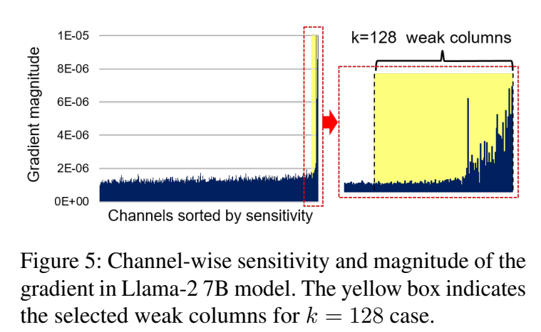
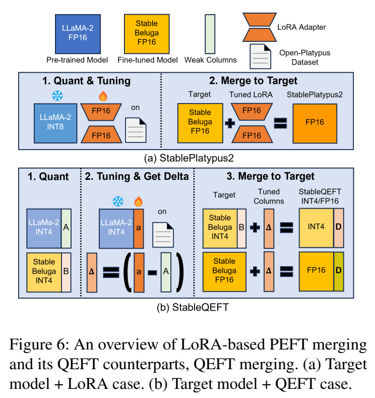
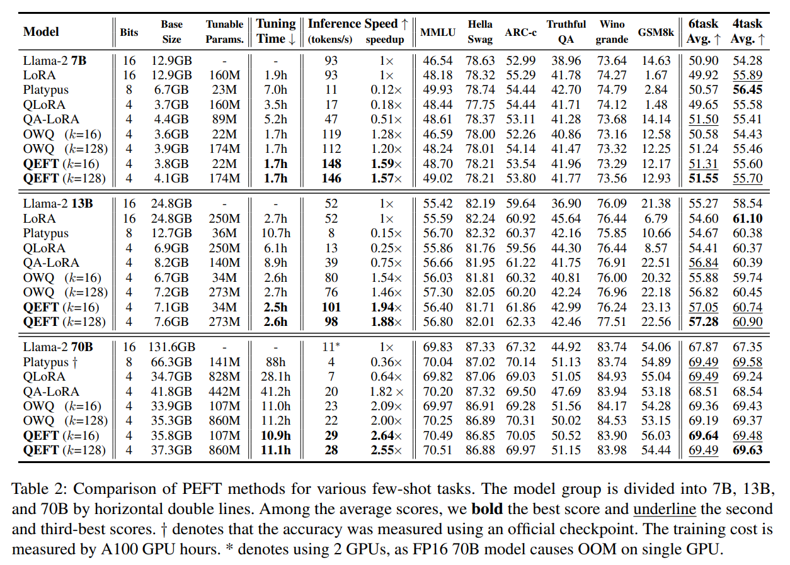
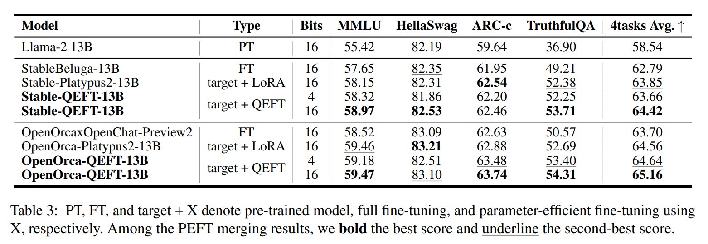
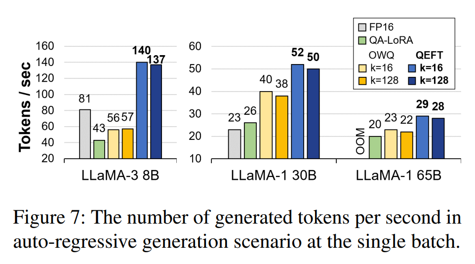

논문 및 이미지 출처 : <https://aclanthology.org/2024.findings-emnlp.811.pdf>

# Abstract

Large language model (LLM) 의 fine-tuning 사용이 빠르게 늘어나면서 inference efficiency 를 유지하면서 fine-tuning 을 최적화하는 게 매우 중요해졌다. 하지만 이는 inference speed, fine-tuning speed, memory consumption, 그리고 가장 중요한 model quality 등 모든 면에서 개선이 필요한 어려운 과제다. 이전 연구들은 quantization 과 fine-tuning 을 결합해서 이걸 해결하려 했지만, 네 가지 측면을 동시에 향상시키는 데 실패했다. 

이번 연구에서 저자는 **Quantization for Efficient Fine-Tuning (QEFT)** 라는 새로운 가벼운 기술을 제안한다. QEFT 는 inference 와 fine-tuning 을 둘 다 빠르게 하고, 탄탄한 이론적 기반을 제공하며, 높은 유연성을 갖췄고, good hardware compatibility 를 유지한다. 

광범위한 실험을 통해 QEFT 가 full-precision parameter-efficient fine-tuning 의 quality 와 versatility 를 맞추면서도 fewer resources 를 쓴다는 걸 보여준다.

# 1 Introduction

Large language model (LLM) 의 뛰어난 zero-shot 성능은 그 인기에 크게 기여하지만, versatility 와 adaptability 도 널리 채택되는 데 중요한 요소다. Transfer learning 과 fine-tuning 을 통해 LLM 은 새로운 데이터 타입을 포함한 unseen 또는 complex tasks 를 처리할 수 있게 확장되는데, 이는 다양한 application 에서 새로운 가능성을 열어준다. Efficient inference 와 fine-tuning 이 점점 중요해지면서, 이 논문은 LLM 의 inference 와 fine-tuning efficiency 를 높이는 방법을 탐구한다.

과거 연구를 보면 inference efficiency 를 높이기 위해 pruning, speculative decoding, KV caching, 그리고 특히 weight quantization 같은 여러 방법이 제안됐다. 하지만 fine-tuning 에 대한 가벼운 접근법을 다룬 연구는 상대적으로 제한적이다. Fine-tuning 과 inference 를 둘 다 고려할 때 최적화해야 할 요소들, 즉 inference speed, training speed, memory consumption, accuracy 등이 매우 다양해지기 때문이다. 이 모든 조건을 동시에 균형 있게 맞추는 건 큰 도전이다.

이런 맥락에서 LoRA 는 pre-trained weight 를 freeze 하고 업데이트되는 decomposed path 를 추가함으로써 parameter-efficient fine-tuning (PEFT) 을 가능하게 하는 대표적인 연구다. 이 접근법은 제한된 자원으로 LLM 을 유연하게 업데이트할 수 있는 새로운 기회를 열어주고, 수많은 새로운 application 이 등장하게 했다. 게다가 여러 연구는 weight quantization 과 LoRA 를 조화시켜 두 방법의 장점을 모두 취하려고 발전시켜 왔다. 

- 예로 QLoRA 와 QA-LoRA 에서는 pre-trained weight 를 quantization 후 고정하고, FP16 low-rank path 만 추가해서 독점적으로 업데이트한다. 
- 하지만 QLoRA 는 inference speed 가 느리고, 두 방법 모두 fine-tuning overhead 가 눈에 띈다. 
- 여러 최적화를 병렬로 적용하는 것만으로는 inference 와 fine-tuning 의 모든 면에서 개선을 이루기 쉽지 않다.

이번 연구에서 저자는 inference 와 training 에서 최적의 성능을 내도록 설계된 새로운 quantization 기술인 **Quantization for Efficient Fine-Tuning (QEFT)** 을 제안한다. 이 방법은 OWQ 의 data format 을 활용해서 quantization 에 취약한 weak column 을 FP16 으로 저장하고, 대부분의 weight 는 4-bit 이하로 저장하며, fine-tuning 중에는 weak column 만 업데이트한다. 이 접근법은 quantization 의 장점을 누리면서 PEFT 를 구현할 수 있게 한다.

하지만 QEFT 는 고유한 혁신을 제공한다.
- 먼저 OWQ 는 linear layer 의 weight 에서 column 의 불규칙한 mixed precision 때문에 hardware compatibility 가 낮다. 반면 QEFT 는 새로운 **Offline Global Reordering (OGR)** 을 기반으로 structured mixed precision phenotype 을 달성해서 hardware compatibility 를 개선하고, Fig. 1 에서 보듯 training 과 inference 에서 큰 speed 향상을 가져온다.  
- 또한 QEFT 는 fine-tuning 후 loss value 를 최소화하기 위해 weak column 을 선택하는 이론적 framework 를 제공한다.  
- 마지막으로 LoRA 와 다르게 구현됐지만, QEFT 가 이전에 LoRA 를 사용한 application 을 대체하고 적용될 수 있다는 걸 검증해서 유연성을 보여준다.

다양한 실험을 통해 QEFT 가 inference speed, training speed, model quality 면에서 SOTA 방법임을 증명했다. OWQ 보다 약간 더 많은 memory 를 쓰지만, QEFT 는 다른 모든 면에서 OWQ 를 능가하고 다른 baseline 도 모든 영역에서 앞선다.

# 2 Related Work

## 2.1 Weight-only Quantization of LLMs

Weight-only quantization 은 LLM 의 가장 성공적인 최적화 방법 중 하나로, model 의 footprint 를 크게 줄이고 generation 중 memory bottleneck 을 완화해서 inference 를 눈에 띄게 가속한다. OPTQ 는 OPT-175B model 을 sub-4-bit 로 quantize 해도 accuracy 저하 없이 가능하다는 걸 처음 보여줬다. 게다가 이 low-precision 접근법은 memory bottleneck 을 해결해서 실제 GPU 장치에서 성능 이점을 얻는다. AWQ 와 TEQ 는 fine-grained group-wise quantization 으로 model quality 를 개선한다.

## 2.2 Parameter-efficient Fine-tuning (PEFT)

PEFT 는 LLM 의 fine-tuning cost 을 최소화하도록 설계돼 새로운 문제를 저렴하게 해결할 잠재력을 열어준다. LoRA 는 pre-trained weight 를 freeze 하고 low-rank parameter 를 추가해서 fine-tuning 중에만 업데이트하는 대표적인 연구다. LoRA 는 제약된 update scheme 으로 LLM 이 unseen task 에 놀랍게 적응하는 PEFT 의 잠재력을 보여준다.

## 2.3 Quantization-aware PEFT

QLoRA 는 LoRA 개념을 확장해서 weight quantization 을 통합하고, pre-trained weight 를 quantization 으로 압축한다. 이는 fine-tuning 과정을 더 가볍게 하지만, 추가 FP16 path 가 quantized base weight 에 자유롭게 합쳐질 수 없어서 inference 성능이 느려진다.

QA-LoRA 는 updated weight 를 low-precision weight 의 zero-point 위에 합치는 다른 접근법을 제공한다. 이는 QLoRA 와 달리 fine-tuning 후 high-precision path 가 필요 없고, 비슷한 fine-tuning quality 를 보여주지만, 여전히 큰 fine-tuning overhead 가 있고, PEFT merging 같은 고급 LoRA application 에 대한 유연성은 탐구되지 않았다.

## 2.4 Outlier-aware Weight Quantization

최근 OWQ 는 weight-only quantization 을 위한 intra-layer mixed precision quantization scheme 을 도입했다. OWQ 에서 목표는 layer-wise error 를 줄이는 건데, $i$-th output channel 에 대한 error 는 다음과 같이 분해된다:

$$
\begin{equation}
    E_i = \| W_{i,:} X - \hat{W}_{i,:} X \|_2^2 \approx \Delta W_{i,:} H \Delta W_{i,:}^T
\end{equation}
$$

Weight matrix 의 Hessian 은 specific weight 의 sensitivity 를 추정하는 데 중요한 역할을 한다. 하지만 같은 output channel 의 weight 는 동일한 Hessian 값 $H^{(i)}$ 를 공유한다:

$$
\begin{equation}
    H^{(i)} = H = \frac{\partial^2 E_i}{\partial W_{i,:}^2} = 2 X X^T
\end{equation}
$$

이 공식에서 activation outlier 가 weight quantization 만 적용해도 specific weight column 의 sensitivity 를 크게 높인다는 걸 관찰했다. OWQ 에서는 $j$-th column 의 quantization sensitivity 를 다음과 같이 계산한다:

$$
\begin{equation}
    \text{sensitivity}_j = \lambda_j \left\| \Delta W_{i,j} \right\|_2^2
\end{equation}
$$

- 여기서 $\lambda$ 는 Hessian 의 diagonal element 다. 
- 그 후 top-$k$ sensitive column (weak column) 을 FP16 으로 보존하고 나머지 robust weight 만 4-bit 또는 3-bit 로 압축한다.

OWQ 는 평균 0.01 bit 추가로 model quality 를 크게 향상시킨다. 하지만 mixed-precision format 은 GPU 와 non-GPU 환경 모두에서 배포에 어려움을 겪어서 실질적 이점이 제한된다.

## 2.5 Weak Column Tuning

OWQ 는 mixed-precision 으로 PEFT 를 가능하게 하는 개념도 도입했다. Weak Column Tuning (WCT) 라는 이 아이디어는 FP16 weak column 을 task-specific 방식으로 업데이트하고 나머지 quantized data 는 freeze 한다. 

OWQ 의 WCT 는 inference 와 fine-tuning 모두에서 low precision 의 장점을 유지하지만 몇 가지 한계가 있다:  
- WCT 는 weak column 기반 tuning parameter 선택의 최적성을 보장하는 이론적 지원이 부족하다. 특정 task 에 대한 feasibility 만 증명됐을 뿐이다.  
- WCT 의 versatility 는 아직 검증되지 않아 LoRA 기반 접근법보다 덜 선호된다.  
- 가장 중요한 건 OWQ 의 불규칙한 mixed-precision weight 가 acceleration 에 어려움을 준다는 점이다.

# 3 Detailed Overview of QEFT

이번 연구에서 저자는 QEFT 를 소개한다. 이는 mixed-precision quantization 으로 inference 와 fine-tuning 에서 higher speed 를 달성하고, hardware-friendly 하며 expressiveness 덕분에 better fine-tuned quality 를 제공한다. 이 섹션에서 QEFT 를 자세히 설명하고, Sec. 4 에서 fine-tuning 능력을 다룬다. 그 다음 Sec. 5 에서 versatility 를 검증하는 고급 예시인 PEFT merging 을 논의한다.

## 3.1 Data Structure and Quantization Process

QEFT 는 LLM 의 linear layer 의 dense weight 에 mixed-precision quantization 을 적용한다. Quantization 후에는 세 가지 data component 가 생성된다:  
- Dense low-precision matrix  
- Group-wise quantization parameter  
- High-precision weak column  

Fig. 2(c) 에 나와 있듯이 OWQ 와 비슷하게 $k$ sensitive columns 를 찾아서 FP16 으로 보존한다. 하지만 구현의 핵심 차이는 QEFT 가 Sec. 3.2 에서 설명하는 새로운 Offline Global Reordering (OGR) 을 써서 OWQ 의 불규칙성(Fig. 2(b))과 달리 structured format 을 보장한다는 점이다.

그 후 나머지 weight 는 4-bit 이하로 저장된다. OWQ 의 per-channel quantization 기반 quantization error 를 더 줄이기 위해 group-wise quantization 을 도입한다. 그래서 adjacent $g$ weights 가 같은 quantization parameter (scaling factor 와 zero-point) 를 공유한다. 각 group 에 대해 truncation 후 weight 의 squared error 를 최소화하는 quantization parameter 를 찾기 위해 grid search 를 한다. 그 다음 searched parameter 를 사용해 OPTQ 를 적용해서 optimal low-precision mapping 을 찾는다. OPTQ 는 original channel-wise min-max quantization 에 의존하지만, 저자는 group-wise quantization 과 truncation 의 장점을 활용해서 high-quality quantized weight 를 얻는다.

## 3.2 Offline Global Reordering

OWQ 에서 mixed-precision 은 acceleration 을 어렵게 한다. Weak column 의 index 는 offline 에서 미리 정해지고 activation outlier 의 위치와 연관되지만(Fig. 2(b)), 불규칙한 mixed-precision format 은 decompression 과정에서 여러 branch 를 도입해서 구현이 복잡해지고 느려진다. 게다가 이런 특성은 in-DRAM accelerator 나 NPU 같은 신흥 hardware 에서 일반적으로 dense computation 만 지원하기 때문에 지원하기 어렵다.

이 한계를 해결하려면 data representation 을 predictability 와 continuity 를 위해 수정해야 한다. 이전 노력은 inference 중 normalization layer 에서 activation 을 reordering 해서 high-precision weight 를 한쪽으로 모으고 low-precision weight 와 분리했다. 이는 dense matrix multiplication 으로 computation 을 가속하지만, online reordering 은 추가 inference latency 를 발생시켜 quantization 의 이점을 상쇄한다.

Online 비용 없이 불규칙성을 없애기 위해 저자는 Offline Global Reordering (OGR) 라는 새로운 개념을 도입한다. 

- 이는 layer 간 outlier channel index 가 크게 겹친다는 핵심 관찰에서 비롯된다. 
- Fig. 3(a) 에서 Llama-2 7B model 의 각 transformer block 에 대해 top-8 weak column 의 layer-wise index 를 시각화한 걸 보면 이 겹침을 알 수 있다. 
  - 이 겹침은 outlier activation 이 residual connection 을 통해 후속 layer 로 전파되면서 weak column index 가 layer 간에 정렬되기 때문에 생긴다. 
- 이 관찰을 바탕으로 저자는 Fig. 3(a) 에서처럼 전체 network 에 걸친 common (global) weak column 을 식별하고 사용한다. 
- Weight perturbation 은 layer 간에 크게 달라질 수 있으므로 Eq. (3) 의 $\lambda_j \left\| \Delta W_{i,j} \right\|_2^2$ 대신 $\lambda_j$ 만 사용한다. 
  - 이 metric 의 최적성은 Sec. 4 에서 논의된다.

Global weak column 이 선택되면 Fig. 3(b) 에서처럼 embedding 과 head layer 의 weight 와 transformer block 내 layer 를 offline 으로 재배열할 수 있다. Model 을 global 하게 reordering 하면 각 linear layer 의 weak column 이 structured dense matrix 를 형성하고, 해당 activation 도 연속적으로 위치한다. 예외는 attention output projection layer 인 $W_O$ 다 (Fig. 3(b)). Multi-head attention mechanism 을 유지하려면 $W_O$ weight 에 reordering 을 적용할 수 없다. 이 경우 mixed-precision format 을 reordering 없이 사용한다.

Tab. 1 은 QEFT 에서 제안된 component 의 효과를 Llama-2 7B 로 보여준다.

- 참고로 OWQ 설정에서 시작해서 online reordering 과 OGR 의 영향을 각각 측정했다. 
- Table 은 online reordering 이 overhead 때문에 제한된 이점만 제공하는 반면, OGR 은 inference 를 크게 가속한다는 걸 나타낸다. 
- Weak column 이 대부분 겹치지만, global weak column 을 사용하면 겹치지 않는 column index 가 적어서 약간의 accuracy 저하가 있을 수 있다. 
- Pareto-front 솔루션을 실현하려면 이 저하를 해결하고 OWQ 의 channel-wise quantization 대신 group quantization 을 고려한다. 
- 기본 group size 는 128 을 썼고, 이는 quantization error 를 줄여 fine-tuned 성능을 개선하며, 저자의 최적화된 kernel 덕분에 hardware overhead 는 무시할 만하다. 
- Group-wise parameter 수가 늘어나면서 memory usage 가 3923MB 에서 4107MB 로 약간 증가한다. 
- 결과는 OGR 과 group quantization 을 같이 쓰는 게 최선이고, globally reordered model 은 각 layer 에서 최적 선택과 거의 같은 few-shot score 를 보이면서 inference speed 를 크게 높인다.

### 3.2.1 GPU Acceleration Kernel for QEFT

QEFT 의 잠재력을 최대한 끌어내기 위해 reordered format 에 맞춘 customized matrix-vector multiplication GPU kernel 을 개발했다. 이 kernel 은 먼저 quantized dense matrix 를 FP16 format 으로 dequantize 해서 activation 과 곱한다. 그 다음 high-precision dense weight 와 activation 의 multiplication 을 수행한다. OGR 덕분에 두 dense computation 을 매끄럽게 적용할 수 있고, 실제로는 single kernel 로 fusion 된다. 이 customized kernel 이 inference 성능에 미치는 영향은 Sec. 6.4 에서 검증된다.

## 3.3 Efficient Backward Computation

QEFT 를 활용하면 fine-tuning 에 또 다른 큰 장점이 생긴다. 

- Fig. 4 에서 보듯이 linear layer 의 backward computation 은 input $X$ 와 weight $W$ 에 대한 gradient 를 계산하는 두 GeMM operation 을 포함한다. 
- LoRA 기반 접근법과 달리 QEFT 는 rectangular-shaped trainable weight 에 대해서만 gradient 를 계산해서 weight gradient 의 전체 FLOPs 를 $k/IC$ 로 줄인다. 이 감소는 fine-tuning 동안 큰 성능 이점을 준다. 
- 게다가 Fig. 4 에서처럼 weak column 에 해당하는 activation subset 만 저장하면 된다. 
- Weak column 의 weight gradient 는 entire activation tensor 없이 계산할 수 있어서 memory footprint 도 $k/IC$ 로 줄어든다. 
- QEFT 의 중요한 점은 OGR 기반 구조적 data representation 을 써서 PyTorch 같은 기존 framework 에서 backward 구현이 쉽다는 거다.

# 4 Optimal Weak Column Selection

QEFT 는 fine-tuning 과 inference 에 효율적이면서도 뛰어난 fine-tuning quality 를 제공한다. 이 섹션에서 저자는 weak column  را mask 로 선택해서 tunable parameter 로 사용하는 게 sparse PEFT 후 loss value 를 최소화하는 최적 전략이라는 이론적 지원을 증명한다. 조건은 다음과 같다:  
- 각 linear layer 에 fixed budget 이 할당된다.  
- Selection 은 per-channel granularity 로 적용된다.  

먼저 sparse PEFT 를 다음과 같이 공식화한다:

$$
\begin{equation}
  \min_{\Delta \theta, M} L\left( \theta^0 + M \Delta \theta \right)
\end{equation}
$$

- 여기서 $\theta^0 \in \mathbb{R}^{OC \times IC}$ 는 pre-trained weight 이고, 
- $OC$ 와 $IC$ 는 각각 output 과 input channel dimension 이다. 
- $\Delta \theta \in \mathbb{R}^{OC \times IC}$ 는 updated weight, 
- $L$ 은 target loss function, 
- $M \in \mathbb{R}^{IC \times IC}$ 는 channel-wise parameter mask 다. 
- 여기서 $M_{i,j} = 0$ if $i \neq j$ 이거나 $M_{i,j} \in \{0,1\}$ otherwise 다. 

Fine-tuning 효과를 극대화하려면 loss 를 최소화할 적절한 $M$ 을 선택해야 한다. Second-order approximation 방법에 따르면 gradient 의 magnitude 를 기반으로 최적 mask 를 찾을 수 있다.

#### Theorem.

$$
\text{if } \hat{M}_u - 1 \left( \sum_{j=1}^m 1 \left( \left| \frac{\nabla L(\theta^0)_j^2}{h_i} \right| > \left| \frac{\nabla L(\theta^0)_j^2}{h_j} \right| \right) \geq m - k \right),
$$

여기서 $\nabla L(\theta^0)_i$ 는 $\nabla L(\theta^0)$ 의 $i$-th element 이므로

$$
\inf_{\Delta \theta} L\left( \theta^0 + \hat{M} \Delta \theta \right) \leq \inf_{\Delta \theta, \|M\|_0 = k;} L\left( \theta^0 + M \Delta \theta \right).
$$

이 theorem states 는 loss 의 infimum 을 최소화하는 mask $\hat{M}$ 이 $\left| \nabla L(\theta^0)_i^2 \right|$ values 가 가장 큰 top $k$ index 를 선택해서 구성될 수 있다는 걸 말한다. Channel-wise parameter mask 제약에서 largest $\left| \nabla L(\theta^0)_{i,i}^2 \right|$ values 인 index 를 골라서 fine-tuning 후 loss 를 최소화하는 $\hat{M}$ 을 만들 수 있다.

QEFT 에서 tunable weak column 은 Eq. (3) 에 의해 선택되는데, 이는 $\lambda_i$ 와 weight perturbation 기반이다. 한편 linear layer 의 weight gradient 는 chain rule 로 계산된다:

$$
\begin{equation}
  \nabla L(\theta) = \frac{\partial L}{\partial \theta} = \frac{\partial L}{\partial y} \frac{\partial y}{\partial \theta} = \frac{\partial L}{\partial y} X^T
\end{equation}
$$

- 여기서 $X$ 는 activation 이고 $y = \theta X$ 다. 
- 중요한 건 activation outlier 가 weak column 선택 (Eq. (3))과 weight gradient 를 둘 다 지배해서 QEFT 의 selection metric 이 largest $\left| \nabla L(\theta^0)_{i,i}^2 \right|$ values 인 column 을 선택하는 데도 유효하다는 점이다.

Fig. 5 는 Eq. (3) 와 $\left| \nabla L(\theta^0)_{i,i}^2 \right|$ 간 상관관계를 보여준다. Quantization sensitivity 로 channel 을 정렬하면 top-$k$ channel (weak column) 이 largest gradient magnitude 인 column 과 일치한다. 이는 저자가 quantization sensitivity 를 고려해 weak column 을 선택했지만 fine-tuning quality 도 고려된다는 걸 의미한다.

# 5 Advanced Application: PEFT Merging

QEFT 는 efficient inference 와 fine-tuning 을 위해 설계됐지만, LoRA 기반 접근법의 대안이 될 만큼 일반적이어야 한다. 이를 검증하기 위해 LoRA 의 고급 application 인 PEFT merging 에 QEFT 를 적용했다. Fig. 6 은 이 과정의 개요를 보여준다. 

- Figure 에서 보듯이 LoRA adapter 는 Open-Platypus dataset 으로 Llama-2 model 에서 fine-tune 된다. 
- Fine-tuning 후 updated weight 는 StableBeluga model 에 전송되는데, 이 model 도 Llama-2 로 초기화됐지만 다른 dataset 으로 fine-tune 된 거다. 그러면 Stable-Platypus2 가 만들어진다. 
- Semantic 차이가 있을 수 있음에도 Stable-Platypus2 는 놀랍게도 merge 전 각 model 보다 나은 quality 를 보인다.

QEFT 의 merging 능력을 평가하려고 비슷한 접근법인 QEFT merging 을 시도했다. Quantized Llama-2 model 을 만들고 Open-Platypus dataset 으로 weak column 을 fine-tune 한다. Weak column 의 update ($\Delta = B - A$) 는 StableBeluga model 에 합쳐진다. 

Target model 이 full-precision model 이면 weak column index 에 따라 update 를 추가한다. Quantized StableBeluga 면 해당 weak column 에 update 를 추가한다. QEFT merging 도 놀랍게도 잘 작동한다는 걸 보여준다.

# 6 Experiments

## 6.1 Experiments Setting

QEFT 의 우수함을 보여주기 위해 저자는 폭넓은 분석을 진행했다. Fine-tuning 환경은 baseline 인 Platypus 의 설정을 따른다. OpenPlatypus dataset 을 fine-tuning 에 사용했는데, 이는 11 open-source datasets 에서 중복과 불필요한 부분을 걸러낸 거다. Open-Platypus dataset 이 STEM 과 logic question 영역에 초점을 맞췄기 때문에, 저자는 Platypus 의 evaluation 방법도 채택했다. 이는 open-llm-leaderboard 에서 가져온 few-shot task 들을 포함한다.

최신 leaderboard version 에 맞춰서, 저자는 6 tasks (MMLU, HellaSwag, ARC-c, TruthfulQA, Winogrande, GSM8k) 의 점수와 그 평균을 보고해서 fine-tuning 성능을 평가한다. 추가로, 이전 연구에서 사용된 4 tasks (MMLU, HellaSwag, ARC-c, TruthfulQA) 의 평균 점수도 보고한다. Few-shot accuracy 는 lm-eval-harness 로 측정했다. 

- 저자는 AdamW optimizer 를 batch size 16 으로 사용했다. 
- Learning rate 는 constant 로 설정해서 $k=16$ 일 때는 $1 \times 10^{-5}$, $k=128$ 일 때는 $5 \times 10^{-6}$ 를 썼다. 
- 70B model 에서 OPTQ reconstruction 이 overfitting 문제를 일으키는 걸 확인했는데, 이는 이전 연구에서도 발견된 거다. 그래서 4-bit Llama-2 70B 결과에는 OPTQ 대신 간단한 round-to-nearest quantization 을 사용했다.

## 6.2 Overall Fine-tuning Results

QEFT 의 우수함을 비교하기 위해 5개 대표적인 방법(LoRA, Platypus, QLoRA, QA-LoRA, OWQ)을 골랐다. 

- Platypus 는 base model 에 8-bit quantization 을 쓰고 FFN 에만 LoRA module 을 넣는다. 
- QLoRA/QA-LoRA 와 OWQ 는 4-bit quantization 을 사용해서 quality 와 performance 비교에 포함했다. 
- QLoRA/QA-LoRA 는 all linear layers 에 LoRA module 을 적용하고, OWQ 는 all linear layers 에서 $k$ 개 weak column 을 FP16 으로 유지한다. 
- Tunable parameter 수로 보면 $k/2 \approx r$ 인데, 각 LoRA module 이 두 개의 $d \times r$ adapter 를 쓰기 때문이다.

저자는 control group (LoRA, Platypus, QLoRA, QA-LoRA, OWQ) 의 결과를 모두 재현했다. 단, Platypus 70B 는 자원이 많이 필요하고(8xA100 GPU 필요) training time 이 길어서 제외했다. 대신 Huggingface 에서 제공하는 공식 pre-trained weight 를 사용했다. OWQ 는 tuning code 가 없어서 저자의 설정으로 구현했다. 그래서 OWQ tuning 도 QEFT 의 customized code 를 써서 가속했다. 게다가 inference 와 달리 fine-tuning 중에는 computation 이 대부분 compute-bound matrix multiplication 이다. 이 경우 OGR 의 speed 이득은 단순한 dequantization 과정에서만 나오는데, OWQ 에 비해 training time 감소가 미미하다 (약 0.1시간 줄어듦).  
실험 결과는 Tab. 2 에 자세히 나와 있다. 

- QEFT 는 13B model 에서 다른 quantization-aware PEFT 들을 확실히 앞선다. 하지만 7B model 에서는 Platypus 가 tuning 성능이 제일 좋다. 
- 주로 small model 에서 quantization 으로 인한 accuracy 저하가 두드러지기 때문이다. 그래도 base size (6.7GB vs. 4.1GB) 를 고려하면 QEFT 의 성능이 돋보인다. 
- 심지어 7B 에서도 $k=128$ 인 QEFT 는 다른 4-bit baseline 보다 나은 결과를 보여주고, 13B 에서는 $k=16$ 만으로도 다른 방법들을 앞선다.  
- 흥미롭게도 Platypus, LoRA, QLoRA 는 7B 와 13B 에서 GSM8k 점수가 계속 낮다. 이는 기존 4개 benchmark 에 지나치게 맞춰진 tuning 때문일 수 있다.

---

- Platypus 는 70B model fine-tuning 에 4xA100 GPU 를 22시간 썼다고 보고했다. 반면 QEFT 는 single A100 GPU 로 11시간 만에 끝낸다. 
- GPU 시간으로 보면 약 8배 가속된 거다. 이는 제안한 방법의 memory-time efficiency 를 잘 보여준다. 
- Training cost 가 1/8 에 불과해도 QEFT-based model 의 fine-tuned quality 는 Platypus-70B 와 비슷하거나 더 낫고, baseline Llama-2 70B 를 크게 앞선다. 
- 다른 4-bit 방법들과 비교해도 QEFT 는 계속 better accuracy 를 보여준다. 특히 QEFT 는 LoRA 기반 접근법보다 tuning time 이 훨씬 짧다.

## 6.3 PEFT Merging Results

Tab. 3 은 두 개의 fully fine-tuned model (StableBeluga 와 OpenOrca) 에 대한 PEFT merging 결과를 보여준다. 

- Platypus 연구의 merging 전략 목표를 따라, 저자는 4 tasks (MMLU, HellaSwag, ARC-c, TruthfulQA) 점수를 보고해서 상호보완 효과를 평가한다. 
- QEFT merging 은 fully fine-tuned model 의 weak column 에 해당하는 weight 만 수정하지만, all QEFT merging 경우에서 MMLU, ARC, TruthfulQA 점수가 같이 오른다. 그러니까 tuned weak column 을 merging 하면 reasoning 능력과 knowledge 능력이 둘 다 좋아진다는 거다.  
- 게다가 quantized target model (표에서 4-bit 로 표시) 과의 QEFT merging 은 FP16 LoRA merging 과 비슷한 accuracy 를 보여준다. 
- 이 경우 QEFT format 덕분에 merged model size 가 줄어들고 inference 도 더 빨라진다. 두 merging 기술 모두 model quality 를 높이는 데 아주 유용하다. 이 관찰은 QEFT 가 PEFT merging 개념과 잘 맞는다는 걸 확인해준다.

## 6.4 Inference Acceleration

이 섹션에서 저자는 QEFT 가 auto-regressive generation 시나리오에서 어떤 performance 이득을 주는지 보여준다. A100 80GB GPU 에서 LLaMA family 의 inference speed 를 benchmark 했다. Full-precision model 과 다른 tuning 방법들을 baseline 으로 썼다. 이 실험에서 저자는 FasterTransformer 의 optimized multi-head attention kernel 과 layer normalization kernel 을 모든 방법에 사용했다. 단, QA-LoRA 는 AutoGPTQ framework 를 쓰기 때문에 예외다. 결과는 batch size 1로 256개 token 을 생성한 초당 토큰 수의 중앙값으로 보고한다.

- Tab. 2 에 보듯이 LoRA 기반 방법들의 low-rank path 는 inference 에 bottleneck 을 만든다. 
- 전체 speed 를 눈에 띄게 줄인다. 게다가 Tab. 2 와 Fig. 7 에서 설명하듯이 OWQ 도 optimized kernel 을 쓰지만, QEFT 는 Llama-1/3 모든 model size 에서 OWQ 대비 약 30% speed-up 을 꾸준히 달성했다. 
- 이 개선은 OGR 을 통해 mixed-precision 연산의 주요 overhead 인 불규칙한 memory access 를 없앤 덕분이다. 특히 QEFT 는 Llama-3 8B model 에서 OWQ 보다 약 2.4배 빠르다. 
- QEFT 의 kernel 이 작은 linear layer 와 group query attention 을 가진 model 에서도 높은 병렬 throughput 을 보여주기 때문이다.

# 7 Conclusion

LLM 의 storage 와 computation 요구는 널리 쓰이는 데 큰 장벽을 만든다. Quantization 과 PEFT 가 각각 inference 와 fine-tuning 을 최적화하지만, 이 둘의 조화는 간과되곤 한다. 

이번 연구에서 저자는 QEFT 를 소개한다. 

- 이는 fine-tuning compatibility 를 보장하면서 hardware compatibility 를 우선시하도록 설계됐다. 
- 저자의 실험은 QEFT 가 가장 빠른 fine-tuning 을 달성하고 최고 accuracy 를 낸다는 걸 확인했다. 
- 게다가 QEFT 는 inference 에서도 뛰어난 성능을 보여줘서 모든 면에서 탁월함을 강조한다.

# Limitations

Model quantization 과 parameter-efficient fine-tuning 은 training 중 regularizer 역할을 할 수 있지만, explicit regularization 메커니즘이 fine-tuning 결과 안정화에 종종 도움이 된다. 실제로 LoRA module 에는 stable training 을 보장하기 위해 Dropout 같은 추가 regularizer 가 사용된다. 하지만 QEFT 에는 현재 Dropout 같은 regularizer 가 포함되어 있지 않다. 

저자의 실험에서 overfitting 징후가 뚜렷이 보이진 않았지만, 이 한계는 특정 task 에 따라 해결되지 않은 overfitting 문제를 일으킬 수 있다. 앞으로 regularization 후보를 탐구하는 게 미래 방향이다.

Performance 면에서 QEFT 는 FP16 을 low-precision 표현으로 바꾸는 데 시간이 걸린다. 보통 Llama-2 13B model 의 변환 과정은 약 1시간 걸리고, 자세한 건 Tab. 8 에 있다. 이 변환 비용은 일회성이라 Tab. 2 에 포함시키지 않았다. Quantized model 을 여러 downstream task 에 재사용하면 비용이 상쇄된다. 하지만 LLM 용량이 더 커지면 이 변환 비용을 고려해야 할 수도 있다.  

Global weak column 을 정해서 OGR 의 이점을 누릴 수 있지만, ‘out_proj’ weight 는 offline 이나 이전 layer 의 equivalent out channel reordering 으로 재배열되지 않는다. 그래서 ‘out_proj’ 의 reordering 은 OWQ 기반 customized kernel 을 써서 실시간으로 처리해야 한다. 이는 QEFT 의 high-throughput generation 시스템의 장점을 방해한다.