논문 및 이미지 출처 : <https://arxiv.org/pdf/2210.17323>

# Abstract

Generative Pre-trained Transformer model 은 GPT 또는 OPT 로 알려져 있으며, 복잡한 language modelling task 전반에서의 획기적인 성능으로 두각을 나타내지만, 동시에 극도로 높은 computation 및 storage cost 를 가진다. 

* 구체적으로, 거대한 size 로 인해 large 하고 high-accuracy 한 GPT model 의 경우 inference 조차도 여러 개의 고성능 GPU 를 필요로 할 수 있으며, 이는 이러한 model 의 usability 를 제한한다. 
* model compression 을 통해 이러한 부담을 완화하려는 연구가 등장하고 있지만, 기존 compression technique 의 applicability 와 performance 는 GPT model 의 scale 과 complexity 로 인해 제한된다. 

본 논문에서는 이러한 문제를 다루며, approximate second-order information 에 기반한 새로운 one-shot weight quantization method 인 GPTQ 를 제안한다. 

* 이 방법은 high-accuracy 이면서 high-efficiency 를 동시에 달성한다. 
* 구체적으로, GPTQ 는 약 4 GPU hour 만에 175 billion parameter 를 가진 GPT model 을 quantize 할 수 있으며, weight 당 bitwidth 를 3 bit 또는 4 bit 로 줄이면서도 uncompressed baseline 대비 거의 무시할 수 있는 accuracy degradation 만을 유발한다. 
* 제안 방법은 기존에 제안된 one-shot quantization method 대비 compression gain 을 2 배 이상 향상시키면서 accuracy 를 유지하며, 처음으로 175 billion-parameter model 을 single GPU 상에서 generative inference 로 실행할 수 있게 한다. 
* 더 나아가, weight 를 2-bit 또는 ternary quantization level 로 quantize 하는 extreme quantization regime 에서도 합리적인 accuracy 를 제공할 수 있음을 보인다. 

실험적으로 이러한 개선이 FP16 대비 end-to-end inference speedup 으로 이어질 수 있음을 보이며, high-end GPU 인 NVIDIA A100 에서 약 3.25×, 보다 cost-effective 한 NVIDIA A6000 에서 약 4.5× 의 speedup 을 달성한다.

# 1. Introduction

Transformer family 에 속하는 pre-trained generative model 은 GPT 또는 OPT 로 일반적으로 알려져 있으며, 복잡한 language modelling task 에서 획기적인 성능을 보여주어 학문적 및 실무적 측면에서 막대한 관심을 받아왔다. 이러한 model 의 usability 에 대한 주요 장애물 중 하나는 computation 및 storage cost 이며, 이는 알려진 model 중에서도 가장 높은 수준에 속한다. 

* 예를 들어, 가장 우수한 성능을 보이는 model variant 인 GPT3-175B 는 약 175 billion parameter 를 가지며, training 에 수십에서 수백 GPU year 를 요구한다. 

pre-trained model 에 대한 inference 라는 상대적으로 단순한 task 조차도 매우 도전적이다. 

* 예를 들어, GPT3-175B 의 parameter 는 compact 한 float16 format 으로 저장하더라도 326 GB (1024 단위 기준) 의 memory 를 차지한다. 
* 이는 최고 사양의 single GPU capacity 를 초과하므로, inference 는 multi-GPU deployment 와 같은 더 복잡하고 비용이 큰 setup 을 필요로 한다.

이러한 overhead 를 제거하기 위한 표준적인 접근법은 model compression 이지만, 놀랍게도 inference 를 위한 이러한 model 의 compression 에 대해서는 알려진 바가 많지 않다. 그 이유 중 하나는 low-bitwidth quantization 이나 model pruning 과 같은 보다 복잡한 method 가 일반적으로 model retraining 을 요구하며, 이는 billion-parameter model 에 대해 극도로 비용이 크기 때문이다. 

대안적으로, retraining 없이 one shot 으로 model 을 compress 하는 post-training method 는 매우 매력적이다. 그러나 이러한 method 중 정확도가 높은 variant 는 복잡하며, billion 단위 parameter 로 scale up 하는 것이 어렵다. 현재까지 GPT-175B scale 에 적용된 것은 round-to-nearest quantization 의 기본적인 variant 뿐이다. 

이러한 방법은 8-bit weight 와 같은 낮은 compression target 에서는 잘 동작하지만, 더 높은 compression rate 에서는 accuracy 를 유지하지 못한다. 따라서 높은 compression rate 에서 one-shot post-training quantization 이 일반적으로 가능한지 여부는 여전히 열린 문제로 남아 있다.

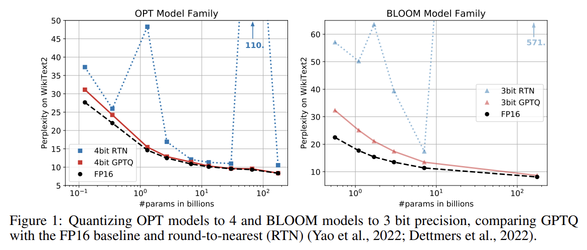

#### Contribution

본 논문에서는 GPTQ 라 불리는 새로운 post-training quantization method 를 제시한다. 

* 이 방법은 수백 billion parameter 를 가진 model 에 대해서도 수 시간 이내에 실행할 수 있을 만큼 efficient 하며, parameter 당 3 bit 또는 4 bit 로 compress 하더라도 유의미한 accuracy loss 가 발생하지 않을 만큼 precise 하다. 
  * 예를 들어, GPTQ 는 현재 공개된 최대 규모 model 인 OPT-175B 와 BLOOM-176B 를 약 4 GPU hour 만에 quantize 할 수 있으며, 매우 엄격한 accuracy metric 으로 알려진 perplexity 의 증가가 최소화된다.
* 또한 제안 방법은 model 을 component 당 2 bit, 혹은 ternary value 로 quantize 하는 extreme quantization regime 에서도 robust 한 결과를 제공함을 보인다. 
  * 실용적인 측면에서, 저자는 resulting compressed model 을 generative task 에 대해 효율적으로 실행할 수 있는 execution harness 를 개발한다. 
  * 구체적으로, compressed OPT-175B model 을 처음으로 single NVIDIA A100 GPU 상에서 실행할 수 있으며, 혹은 보다 cost-effective 한 NVIDIA A6000 GPU 두 개만으로도 실행할 수 있다. 
  * 또한 compression 을 활용하여 memory loading 을 가속할 수 있는 bespoke GPU kernel 을 구현하여, A100 GPU 에서 약 3.25×, A6000 GPU 에서 약 4.5× 의 speedup 을 달성한다.

저자의 지식으로는, 수백 billion parameter 를 가진 극도로 정확한 language model 을 3–4 bit/component 로 quantize 할 수 있음을 보인 것은 본 연구가 최초이다. 

기존 post-training method 는 8 bit 에서만 accuracy 를 유지하였으며, training-based technique 는 one to two order of magnitude 더 작은 model 만을 다루었다. 이러한 높은 수준의 compression 은 network 가 overparameterized 되어 있다는 점에서 자연스러워 보일 수 있으나, 결과에 대한 상세한 분석에서 보이듯이 compression 은 language modeling accuracy (perplexity), bit-width, 그리고 original model size 사이에 비자명한 tradeoff 를 유발한다. 

본 연구가 이 분야의 추가적인 연구를 촉진하고, 이러한 model 을 보다 넓은 사용자에게 제공하는 데 한 걸음 더 다가가기를 기대한다. 

* 한계점으로는, 현재 method 가 mixed-precision operand (e.g., FP16 × INT4) 에 대한 hardware support 가 주류 architecture 에 존재하지 않기 때문에 실제 multiplication 에 대한 speedup 을 제공하지 못한다는 점이 있다. 
* 또한 현재 결과에는 activation quantization 이 포함되어 있지 않으며, 이는 목표 scenario 에서 주요 bottleneck 이 아니기 때문이다. 그러나 이는 orthogonal technique 을 통해 지원될 수 있다.

# 2. Related Work

Quantization method 는 크게 두 가지 범주로 나뉜다. 하나는 training 중 quantization 이며, 다른 하나는 post-training method 이다. 

* 전자는 rounding operation 에 대한 approximate differentiation mechanism 을 사용하여, 일반적으로 extensive 한 retraining 및/또는 finetuning 과정 동안 model 을 quantize 한다. 
* 반면, post-training (“one-shot”) method 는 비교적 적은 resource 를 사용하여 pre-trained model 을 quantize 하며, 일반적으로 수천 개의 data sample 과 수 시간의 computation 만을 필요로 한다. 

post-training 접근법은 full model training 이나 finetuning 조차도 비용이 매우 큰 massive model 에 대해 특히 흥미롭다. 

본 논문에서는 이 scenario 에 초점을 맞춘다.

#### Post-training Quantization.

대부분의 post-training method 는 vision model 에 초점을 맞추어 왔다. 일반적으로 정확도가 높은 method 는 개별 layer 또는 연속된 소수의 layer block 을 quantize 하는 방식으로 동작한다. (자세한 내용은 Sec. 3 을 참조한다.) 

* AdaRound method 는 penalty term 을 annealing 하여 data-dependent rounding 을 계산하며, 이는 weight 가 quantization level 에 해당하는 grid point 로 이동하도록 유도한다. 
* BitSplit 은 residual error 에 대한 squared error objective 를 사용하여 quantized value 를 bit 단위로 구성한다. 
* AdaQuant 는 straight-through estimate 에 기반한 direct optimization 을 수행한다. 
* BRECQ 는 objective 에 Fisher information 을 도입하고, single residual block 내의 layer 를 공동으로 최적화한다. 
* 마지막으로 Optimal Brain Quantization (OBQ) 은 고전적인 Optimal Brain Surgeon (OBS) second-order weight pruning framework 를 quantization 에 적용하도록 일반화한다. 
* OBQ 는 quantization error 순서에 따라 weight 를 하나씩 quantize 하며, 항상 남아 있는 weight 를 조정한다. 이러한 접근법은 약 100 million parameter 까지의 model 에 대해서는 수 GPU hour 내에 좋은 결과를 낼 수 있지만, 이보다 수 차례 이상 큰 network 로 scale up 하는 것은 어렵다.

#### Large-model Quantization. 

최근 BLOOM 이나 OPT-175B 와 같은 language model 의 open-source release 와 함께, inference 를 위해 이러한 거대 network 를 compress 하는 affordable method 를 개발하려는 연구가 시작되었다. 

기존의 모든 연구—ZeroQuant, `LLM.int8()`, nuQmm—는 vector-wise 와 같은 quantization granularity 를 신중히 선택하지만, 매우 large model 에 대해 허용 가능한 runtime 을 유지하기 위해 결국 weight 를 nearest quantization level 로 round 하는 RTN 방식만을 사용한다. 

* ZeroQuant 는 AdaQuant 와 유사한 layer-wise knowledge distillation 을 추가로 제안하지만, 이 접근법을 적용할 수 있는 가장 큰 model 은 1.3 billion parameter 에 불과하다. 
  * 이 scale 에서도 ZeroQuant 는 약 3 hour 의 computation 을 필요로 하며, GPTQ 는 이보다 100× 큰 model 을 약 4 hour 만에 quantize 한다. 
* `LLM.int8()` 은 일부 feature dimension 에서 activation outlier 가 large model 의 quantization 을 깨뜨린다는 점을 관찰하고, 해당 dimension 을 higher precision 으로 유지하여 이 문제를 해결한다. 
* 마지막으로 nuQmm 은 특정 binary-coding 기반 quantization scheme 을 위한 efficient 한 GPU kernel 을 개발한다.

이러한 연구 흐름과 비교하여, 본 논문은 훨씬 더 복잡하고 정확한 quantizer 가 large model scale 에서도 효율적으로 구현될 수 있음을 보인다. 구체적으로, GPTQ 는 유사한 accuracy 를 유지하면서 기존 technique 대비 compression 양을 2 배 이상 증가시킨다.

# 3 Background

#### Layer-Wise Quantization.

높은 수준에서 볼 때, 제안 방법은 state-of-the-art post-training quantization method 와 동일한 구조를 따른다. 즉, layer 별로 quantization 을 수행하며, 각 layer 에 대해 대응되는 reconstruction problem 을 푼다. 

구체적으로, $W_\ell$ 을 linear layer $\ell$ 에 해당하는 weight 라 하고, $X_\ell$ 을 network 를 통과하는 $m$ 개의 data point 에 대해 해당 layer 의 input 이라 하자. 

이때 objective 는 full precision layer output 대비 squared error 를 최소화하는 quantized weight matrix $\widehat{W}$ 를 찾는 것이다. 이를 형식적으로 표현하면 다음과 같다.

$$
\arg\min_{\widehat{W}} \| W X - \widehat{W} X \|_2^2 .
\tag{1}
$$

또한, 기존 연구와 유사하게 $\widehat{W}$ 에 대한 quantization grid 는 process 이전에 고정되어 있다고 가정하며, 개별 weight 는 자유롭게 이동할 수 있다고 가정한다.

#### Optimal Brain Quantization.

제안 접근법은 앞서 정의한 layer-wise quantization problem 을 해결하기 위해 최근 제안된 OBQ method 를 기반으로 한다. 여기에 large language model 로 scale up 할 수 있도록 일련의 주요 수정 사항을 적용하여, computation 측면에서 3 order of magnitude 이상의 speedup 을 제공한다. 이해를 돕기 위해, 먼저 original OBQ method 를 간략히 요약한다.

OBQ method 는 Eq. (1) 이 $W$ 의 각 row 에 대한 squared error 의 합으로 표현될 수 있다는 관찰에서 출발한다. 이후 OBQ 는 각 row $w$ 를 독립적으로 처리하며, 한 번에 하나의 weight 를 quantize 하되, single weight 를 quantize 하며 발생하는 error 를 보상하기 위해 아직 quantize 되지 않은 모든 weight 를 항상 업데이트한다. 

해당 objective 는 quadratic 이며, Hessian 은 $H_F = 2 X_F X_F^{\top}$ 로 주어진다. 여기서 $F$ 는 remaining full-precision weight 의 집합을 의미한다. 이때 다음으로 quantize 할 greedy-optimal weight $w_q$ 와, $F$ 에 속한 모든 weight 에 대한 optimal update $\delta_F$ 는 다음과 같은 공식으로 주어진다. 여기서 $\mathrm{quant}(w)$ 는 $w$ 를 quantization grid 상의 nearest value 로 round 한다.

$$
w_q = \arg\min_{w_q}
\frac{(\mathrm{quant}(w_q) - w_q)^2}{[H_F^{-1}]_{qq}},
\quad
\delta_F = -
\frac{w_q - \mathrm{quant}(w_q)}{[H_F^{-1}]_{qq}}
\cdot (H_F^{-1})_{:,q}.
\tag{2}
$$

OBQ 는 이 두 equation 을 사용하여 $w$ 의 모든 weight 가 quantize 될 때까지 반복적으로 quantization 을 수행한다. 이는 expensive 한 $H^{-1}$ 의 full recomputation 을 피하기 위해, $w_q$ 를 quantize 한 이후에 필요한 $H$ 의 $q$ 번째 row 와 column 을 inverse 상에서 Gaussian elimination 한 step 으로 제거함으로써 효율적으로 수행된다. 즉, 업데이트된 inverse 는 다음과 같이 주어진다.

$$
H^{-1}_{-q} =
\left(
H^{-1}
-

\frac{1}{[H^{-1}]_{qq}}
H^{-1}_{:,q} H^{-1}_{q,:}
\right)_{-p}.
\tag{3}
$$

이 method 는 여러 row 의 $W$ 를 병렬로 처리하는 vectorized implementation 을 제공한다. 결과적으로 medium-sized model 에 대해서는 합리적인 runtime 을 달성할 수 있다. 

예를 들어, ResNet-50 model (25M parameter) 을 single GPU 에서 약 1 hour 만에 fully quantize 할 수 있으며, 이는 state-of-the-art accuracy 를 달성하는 다른 post-training method 와 유사한 수준이다. 그러나 $d_{\text{row}} \times d_{\text{col}}$ matrix $W$ 에 대해 OBQ 의 runtime 이 $O(d_{\text{row}} \cdot d_{\text{col}}^3)$ 의 cubic input dependency 를 가지므로, billion parameter 를 가진 model 에 적용하는 것은 극도로 비용이 크다.

# 4 The GPTQ Algorithm

#### Step 1: Arbitrary Order Insight.

이전 절에서 설명했듯이, OBQ 는 greedy order 로 weight 를 quantize 한다. 즉, 현재 시점에서 추가적인 quantization error 가 가장 작은 weight 를 항상 선택한다. 흥미롭게도, 이러한 자연스러운 전략이 실제로 매우 잘 동작하는 것으로 보이지만, weight 를 arbitrary order 로 quantize 하는 것과 비교했을 때의 개선 효과는 일반적으로 작으며, 특히 large 하고 heavily-parameterized 된 layer 에서 그러하다. 이는 개별적으로 큰 error 를 가지는 quantized weight 의 수가 약간 줄어들더라도, 이러한 weight 가 process 후반부에 quantize 되면서 보상에 활용할 수 있는 unquantized weight 의 수가 적어지는 효과로 상쇄되기 때문인 것으로 보인다. 이제 고정된 어떤 order 라도, 특히 large model 에서 잘 동작할 수 있다는 이 insight 가 흥미로운 함의를 가진다는 점을 논의한다.

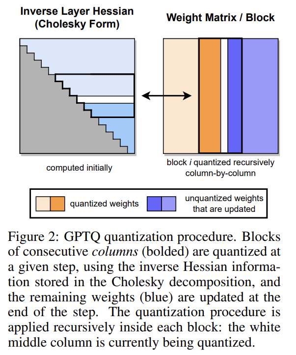

기존 OBQ method 는 $W$ 의 row 를 서로 독립적으로, 대응되는 error 에 의해 정의된 특정 order 로 quantize 한다. 반면, 본 논문에서는 모든 row 의 weight 를 동일한 order 로 quantize 하는 것을 목표로 하며, 이것이 original solution 과 유사한 final squared error 를 산출함을 보인다. 

그 결과, unquantized weight 의 set $F$ 와 이에 대응되는 $H_F^{-1}$ 는 모든 row 에 대해 항상 동일하게 유지된다 (Fig. 2 참조). 보다 구체적으로, 이는 $H_F$ 가 layer input $X_F$ 에만 의존하며, weight 자체에는 의존하지 않기 때문이다. 따라서 Eq. (3) 에 의해 주어지는 $H_F^{-1}$ 의 update 는 weight 당 한 번, 즉 $d_{\text{row}} \cdot d_{\text{col}}$ 번 수행할 필요가 없고, column 당 한 번, 즉 $d_{\text{col}}$ 번만 수행하면 된다. 이로 인해 전체 runtime 은 $O(d_{\text{row}} \cdot d_{\text{col}}^3)$ 에서 $O(\max{d_{\text{row}} \cdot d_{\text{col}}^2, d_{\text{col}}^3})$ 로 감소하며, 이는 $\min{d_{\text{row}}, d_{\text{col}}}$ 배의 개선에 해당한다. large model 에 대해서는 이 차이가 수 order of magnitude 에 달한다.

그러나 이 algorithm 을 실제로 매우 large model 에 적용하기 위해서는, 추가적인 두 가지 주요 문제를 해결해야 한다.

#### Step 2: Lazy Batch-Updates.

첫째, 앞서 설명한 scheme 을 직접 구현하면 실제로는 빠르지 않다. 그 이유는 algorithm 이 lower compute-to-memory-access ratio 를 가지기 때문이다. 예를 들어, Eq. (3) 은 잠재적으로 매우 큰 matrix 의 모든 element 를 update 해야 하지만, 각 entry 당 사용되는 FLOP 수는 매우 적다. 이러한 연산은 modern GPU 의 막대한 compute capability 를 충분히 활용하지 못하며, lower memory bandwidth 에 의해 bottleneck 이 된다.

다행히도, 다음과 같은 관찰을 통해 이 문제를 해결할 수 있다. column $i$ 에 대한 final rounding decision 은 해당 column 에 수행된 update 에 의해서만 영향을 받으며, 이후 column 에 대한 update 는 이 시점에서는 무관하다. 이를 통해 update 를 “lazily batch” 할 수 있으며, 그 결과 GPU utilization 을 크게 향상시킬 수 있다. 구체적으로, algorithm 을 한 번에 $B = 128$ 개의 column 에 대해 적용하고, update 를 해당 column 과 이에 대응되는 $H^{-1}$ 의 $B \times B$ block 내부로 제한한다 (Fig. 2 참조). block 이 완전히 처리된 이후에만, 아래에 제시된 multi-weight version 의 Eq. (2) 와 Eq. (3) 을 사용하여 전체 $H^{-1}$ 와 $W$ matrix 에 대한 global update 를 수행한다. 여기서 $Q$ 는 index 집합을 의미하며, $H^{-1}_{-Q}$ 는 해당 row 와 column 이 제거된 inverse matrix 를 의미한다.

$$
\delta_F = -(w_Q - \mathrm{quant}(w_Q))([H_F^{-1}]_{QQ})^{-1}(H_F^{-1})_{:,Q},
\tag{4}
$$

$$
H^{-1}_{-Q} =
\left(
H^{-1} - H^{-1}_{:,Q}([H^{-1}]_{QQ})^{-1}H^{-1}_{Q,:}
\right)_{-Q}.
\tag{5}
$$

이 전략은 theoretical compute amount 자체를 줄이지는 않지만, memory-throughput bottleneck 을 효과적으로 해결한다. 그 결과, 실제로 very large model 에 대해 약 한 order of magnitude 의 speedup 을 제공하며, 이는 본 algorithm 의 핵심 구성 요소이다.

#### Step 3: Cholesky Reformulation.

마지막으로 해결해야 할 기술적 문제는 numerical inaccuracy 이다. 이는 특히 앞선 step 에서 논의한 block update 와 결합될 때, 기존 model scale 에서 심각한 문제가 될 수 있다. 구체적으로, $H_F^{-1}$ matrix 가 indefinite 해지는 경우가 발생할 수 있으며, 이 경우 algorithm 이 남아 있는 weight 를 잘못된 방향으로 과도하게 update 하여, 해당 layer 의 quantization 이 임의로 나쁜 결과를 초래할 수 있다. 실제로 이러한 현상이 발생할 확률은 model size 가 커질수록 증가하며, 수 billion parameter 를 초과하는 model 에서는 적어도 몇 개의 layer 에서 거의 확실히 발생함을 관찰하였다. 주요 원인은 Eq. (5) 의 반복적 적용으로, 특히 추가적인 matrix inversion 을 통해 다양한 numerical error 가 누적되기 때문이다.

smaller model 에 대해서는 dampening, 즉 $H$ 의 diagonal element 에 작은 상수 $\lambda$ (항상 average diagonal value 의 1% 를 사용한다) 를 더하는 것으로 numerical issue 를 피할 수 있다. 그러나 larger model 에서는 보다 robust 하고 일반적인 접근법이 필요하다.

이를 위해, $H_{F_q}^{-1}$ 에서 실제로 필요한 정보는 weight $q$ 를 quantize 할 때의 unquantized weight 집합 $F_q$ 에 대한 row $q$, 보다 정확히는 diagonal element 부터 시작하는 해당 row 의 element 들뿐이라는 점에 주목한다. 그 결과, memory consumption 을 크게 증가시키지 않으면서, 보다 numerically stable 한 method 를 사용하여 이러한 row 를 모두 사전에 계산할 수 있다. 

실제로 symmetric 한 $H^{-1}$ 에 대해 Eq. (3) 을 통한 row removal 은, row $q$ 를 $([H_{F_q}^{-1}]_{qq})^{1/2}$ 로 나누는 minor 한 차이를 제외하면 Cholesky decomposition 과 본질적으로 동일하다. 따라서 state-of-the-art Cholesky kernel 을 활용하여 $H^{-1}$ 에서 필요한 모든 정보를 upfront 로 계산할 수 있다. 

mild 한 dampening 과 결합하면, resulting method 는 huge model 에 대해서도 문제 없이 실행될 만큼 robust 하다. 추가적으로, 잘 최적화된 Cholesky kernel 을 사용함으로써 further speedup 도 얻을 수 있다. 다음에서는 algorithm 의 Cholesky version 에 필요한 모든 작은 변경 사항을 상세히 설명한다.

#### The Full Algorithm.

마지막으로, 앞서 논의한 optimization 을 모두 포함한 GPTQ 의 전체 pseudocode 를 Algorithm 1 에 제시한다.

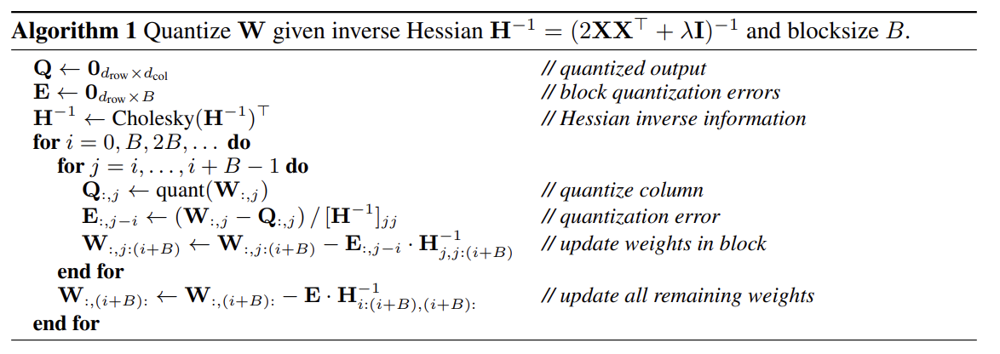

# 5 Experimental Validation

#### Overview.

1. 실험은 먼저 runtime 이 합리적인 smaller model 에 대해, GPTQ 의 accuracy 를 accurate 하지만 expensive 한 다른 quantizer 와 비교하여 검증하는 것으로 시작한다. 
2. 다음으로, very large model 에서 GPTQ 의 runtime scaling 을 분석한다. 
3. 이후, BLOOM 및 OPT model family 전체에 대해 3-bit 및 4-bit quantization 결과를 제시하고, challenging 한 language generation task 에서 perplexity 를 통해 평가한다. 
4. 또한, granularity 를 연속된 작은 weight block 으로 줄였을 때 2-bit quantization 에서도 제안 방법이 안정적임을 보인다. 
   * 이러한 perplexity 분석을 보완하기 위해, quantized model 을 일련의 standard zero-shot task 에서도 평가한다. 
5. 마지막으로, 공개된 model 중 가장 큰 두 model 인 Bloom176B 와 OPT-175B 에 대해 여러 task 에서 상세한 평가를 수행한다. 

이 model 들에 대해서는 inference 에 필요한 GPU 수 감소와 generative task 에서의 end-to-end speedup 이라는 실질적인 개선도 함께 제시한다.

#### Setup.

* 저자는 PyTorch 를 사용하여 GPTQ 를 구현하였고, BLOOM 및 OPT model family 의 HuggingFace integration 을 사용하였다. 
* 모든 model (175 billion parameter variant 포함)은 80 GB memory 를 가진 single NVIDIA A100 GPU 를 사용하여 quantize 하였다. 
* 전체 GPTQ calibration data 는 C4 dataset 에서 무작위로 추출한 2048 token segment 128 개로 구성되며, 이는 무작위로 crawl 된 website 에서 발췌한 generic text data 이다. 
  * 이는 GPTQ 가 task-specific data 를 전혀 보지 않는다는 것을 의미하며, 따라서 결과는 실제로 “zero-shot” 상태를 유지한다. Dettmers et al. 과 유사하게, min-max grid 상에서 standard uniform per-row asymmetric quantization 을 수행한다. 
* 추가적인 evaluation detail 은 Appendix A.2.1 에 제시되어 있다.

전체 compression procedure 가 full precision model 을 실행하는 데 필요한 GPU memory 보다 훨씬 적은 memory 로 수행될 수 있도록 하기 위해, 몇 가지 주의가 필요하다. 

* 구체적으로, 저자는 6 개의 layer 로 구성된 하나의 Transformer block 만을 한 번에 GPU memory 로 load 한 뒤, layer-Hessian 을 누적하고 quantization 을 수행한다. 
* 이후, 현재 block 의 input 을 fully quantized 된 block 에 다시 통과시켜, 다음 block 의 quantization 을 위한 새로운 input 을 생성한다. 
  * 따라서 quantization process 는 full precision model 에서의 layer input 이 아니라, 이미 부분적으로 quantized 된 model 에서의 실제 layer input 에서 동작한다. 
* 저자는 이 방식이 추가 비용이 거의 없이 눈에 띄는 성능 향상을 가져온다는 것을 확인하였다.

#### Baselines.

주요 baseline 은 RTN 으로, GPTQ 와 정확히 동일한 asymmetric per-row grid 상에서 모든 weight 를 nearest quantized value 로 rounding 하는 방식이다. 이는 `LLM.int8()` 의 state-of-the-art weight quantization 과 정확히 대응된다. 이 방법은 단순히 direct rounding 만을 수행하므로, 수 billion parameter 를 가진 network 에 대해서도 runtime 이 잘 scale 하며, 현재 very large language model quantization 에 관한 모든 연구에서 표준적으로 사용되고 있다. 

이후 논의하듯이, AdaRound 나 BRECQ 와 같은 보다 정확한 method 는 현재 수 billion parameter 를 가진 model 에 대해서는 너무 느리며, 이는 본 연구의 주요 초점이 아니다. 그럼에도 불구하고, GPTQ 가 small model 에 대해서는 이러한 method 와 경쟁력 있는 성능을 보이면서도, OPT-175B 와 같은 huge model 까지 scale 된다는 점을 함께 보인다.

#### Quantizing Small Models.

첫 번째 ablation study 로, GPTQ 의 성능을 ResNet18 및 ResNet50 에서 state-of-the-art post-training quantization (PTQ) method 와 비교한다. 이 model 은 (Frantar et al.) 과 동일한 setup 에서 사용되는 표준 PTQ benchmark 이다. 

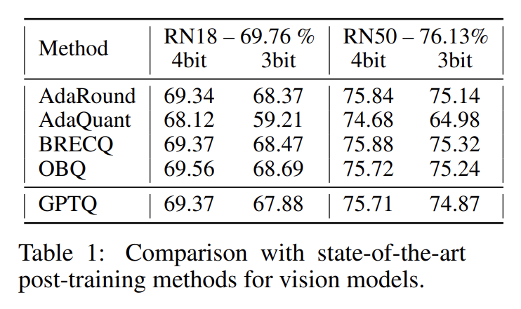

* Tab. 1 에서 볼 수 있듯이, GPTQ 는 4-bit 에서 동등한 성능을 보이며, 3-bit 에서는 가장 정확한 method 대비 약간 낮은 성능을 보인다. 
* 동시에, 기존 PTQ method 중 가장 빠른 AdaQuant 대비로는 크게 우수한 성능을 보인다. 
* 또한, two smaller language model 인 BERT-base 와 OPT-125M 에 대해 full greedy OBQ method 와 비교한다. 결과는 Appendix Tab. 8 에 제시되어 있다. 4-bit 에서는 두 method 가 유사한 성능을 보이며, 3-bit 에서는 GPTQ 가 놀랍게도 약간 더 나은 성능을 보인다. 
  * 이는 early outlier rounding 과 같은 OBQ 의 추가 heuristic 이 non-vision model 에서 최적의 성능을 내기 위해서는 세심한 조정이 필요하기 때문일 수 있다. 
* 전반적으로, GPTQ 는 smaller model 에 대해 state-of-the-art post-training method 와 경쟁력 있는 성능을 보이면서도, 약 1 hour 가 아닌 1 minute 미만의 시간만을 필요로 한다. 이는 훨씬 larger model 로의 scaling 을 가능하게 한다.

#### Runtime.

다음으로, single NVIDIA A100 GPU 상에서 GPTQ 를 사용한 full model quantization time 을 측정하며, 결과는 Tab. 2 에 제시되어 있다. 

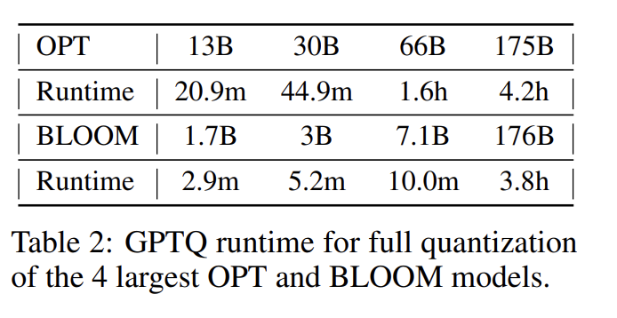

* 결과에서 볼 수 있듯이, GPTQ 는 1–3 billion parameter model 을 수 minute 내에, 175B model 을 수 hour 내에 quantize 한다. 
* 참고로, straight-through 기반 method 인 ZeroQuant-LKD 는 동일한 hardware 에서 1.3B model 에 대해 3 hour 의 runtime 을 보고하였으며, 이를 선형적으로 extrapolate 하면 175B model 에 대해서는 수백 hour, 즉 수 주에 달하는 시간이 필요하다. 
* adaptive rounding 기반 method 는 일반적으로 훨씬 더 많은 SGD step 을 사용하므로, 이보다도 더 expensive 하다.

#### Language Generation.

large-scale study 의 시작으로, 저자는 OPT 및 BLOOM model family 전체를 3-bit 및 4-bit 로 compress 한다. 이후 WikiText2 (Fig. 1 및 Tab. 3, Tab. 4 참조), Penn Treebank (PTB), C4 에서 여러 language task 에 대해 model 을 평가한다 (후자의 두 dataset 은 Appendix A.3 에 제시된다). 이러한 perplexity 기반 task 에 초점을 맞추는 이유는, 이들이 model quantization 에 특히 민감한 것으로 알려져 있기 때문이다. 

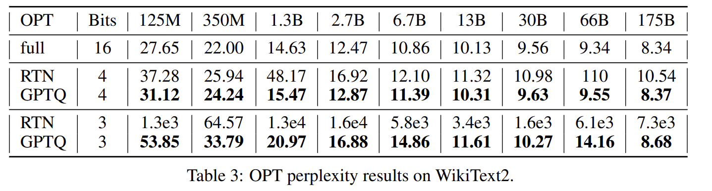

* OPT model 에서 GPTQ 는 RTN 을 명확하게, 그리고 큰 차이로 능가한다. 
  * 예를 들어, 175B model 에서 4-bit 기준 GPTQ 는 perplexity 가 단지 0.03 만 증가하는 반면, RTN 은 2.2 point 하락하여, 10× 더 작은 full-precision 13B model 보다도 성능이 나쁘다. 
* 3-bit 에서는 RTN 이 완전히 붕괴되는 반면, GPTQ 는 특히 larger model 에서 여전히 합리적인 perplexity 를 유지한다. 

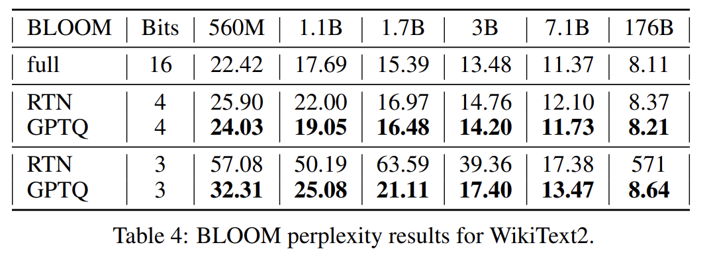

* BLOOM 역시 유사한 패턴을 보이지만, method 간 격차는 전반적으로 다소 작으며, 이는 해당 model family 가 quantize 하기에 더 쉬울 수 있음을 시사한다. 
* 한 가지 흥미로운 경향은 (Fig. 1 참조), OPT-66B 를 제외하면 larger model 이 일반적으로 quantize 하기에 더 쉽다는 점이다. 
  * 이는 practical application 측면에서 긍정적인 소식인데, 이러한 경우가 compression 이 가장 필요한 경우이기 때문이다.

#### 175 Billion Parameter Models.

다음으로, 가장 큰 dense openly-available model 인 BLOOM-176B 와 OPT-175B 를 분석한다. Tab. 5 는 Wikitext-2, PTB, C4 전반의 결과를 요약한다. 

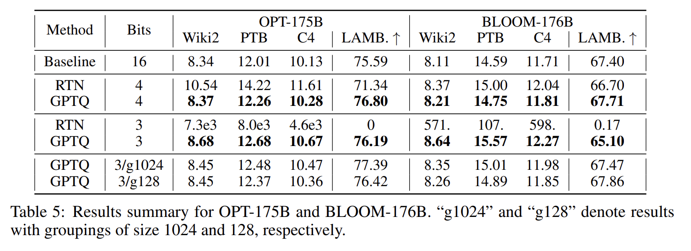

* 4-bit 에서 GPTQ model 은 full-precision version 대비 perplexity 가 최대 0.25 이하로만 증가하며, 특히 OPT-175B 에서 RTN 결과와는 큰 차이를 보인다. 
* 3-bit 에서는 RTN 이 붕괴되는 반면, GPTQ 는 대부분의 task 에서 여전히 좋은 성능을 유지하며, 5× 이상 compression 에서도 0.3–0.6 point 만 손실된다. 
* GPTQ 의 accuracy 는 finer-granularity grouping 을 통해 추가로 향상될 수 있다. 
  * 예를 들어, group-size 1024 (약 0.02 extra bit) 는 평균적으로 perplexity 를 약 0.2 개선하며, group-size 128 (약 0.15 extra bit) 는 추가로 0.1 을 더 개선하여, uncompressed accuracy 대비 0.1–0.3 차이만 남긴다. 
* grouping 은 GPTQ 와 매우 잘 상호작용하는데, 이는 group parameter 가 각 layer 의 quantization 과정 중에, 항상 가장 최신으로 update 된 weight 를 사용하여 결정될 수 있기 때문이다.

#### Practical Speedups.

마지막으로, practical application 을 살펴본다. 흥미로운 use-case 로 OPT-175B model 에 초점을 맞춘다. 이 model 을 3-bit 로 quantize 하면, embedding 과 output layer 를 full FP16 precision 으로 유지한 상태에서도 약 63 GB 의 memory 만을 차지한다. 

또한, generation task 에서 흔히 사용되는 optimization 인 모든 layer 에 대한 key 와 value 의 complete history 를 저장하는 데에는, 최대 2048 token 기준으로 추가로 약 9 GB 가 필요하다. 

결과적으로, 전체 quantized model 을 single 80 GB A100 GPU 에 실제로 적재할 수 있으며, inference 중에 필요할 때 layer 를 dynamic 하게 dequantize 하여 실행할 수 있다 (4-bit 에서는 model 이 완전히 적재되지 않는다). 참고로, standard FP16 execution 은 5×80 GB GPU 를 필요로 하며, state-of-the-art 8-bit `LLM.int8()` quantizer 는 3 개의 GPU 를 필요로 한다.

---

다음으로, latency 감소를 목표로 language generation 을 고려한다. `LLM.int8()` 은 memory cost 는 줄이지만 runtime 은 FP16 baseline 과 동일한 반면, 저자는 quantized model 이 이 application 에서 유의미한 speedup 을 달성할 수 있음을 보인다. 

* language generation 에서 model 은 token 을 하나씩 처리하고 출력하며, OPT-175B 의 경우 token 당 수백 millisecond 가 소요될 수 있다. 
* user 가 generated result 를 받는 속도를 높이는 것은 쉽지 않은데, 이는 computation 이 matrix-vector product 에 의해 지배되기 때문이다. 
* matrix-matrix product 와 달리, 이러한 연산은 주로 memory bandwidth 에 의해 제한된다. 
* 저자는 필요 시 weight 를 dynamic 하게 dequantize 하면서 matrix-vector product 를 수행하는 quantized-matrix full-precision-vector product kernel 을 개발함으로써 이 문제를 해결한다. 

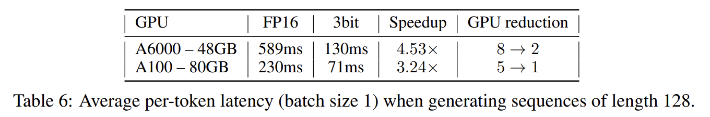

* 주목할 점은, 이 kernel 이 activation quantization 을 전혀 필요로 하지 않는다는 것이다. dequantization 은 추가적인 compute 를 소모하지만, 접근해야 할 memory 양이 훨씬 적어져, Tab. 6 에서 보이듯이 상당한 speedup 을 제공한다. 
* 이러한 setting 에서는 communication cost 가 무시할 수 있을 만큼 작으며, speedup 의 거의 전부가 제안 kernel 에서 비롯됨을 확인한다 (자세한 내용은 Appendix A.2.2 참조).
  * 예를 들어, 제안 kernel 을 사용하면 single A100 GPU 상에서 실행되는 3-bit OPT-175B model 은 average token time 기준으로 FP16 version (5 GPU 사용) 대비 약 3.25× 빠르다. 
* memory bandwidth 가 훨씬 낮은 보다 접근 가능한 GPU 인 NVIDIA A6000 에서는 이 전략이 더욱 효과적이다. 2× A6000 GPU 에서 3-bit OPT-175B model 을 실행하면, FP16 inference (8 GPU 사용) 의 latency 589 millisecond 가 130 millisecond 로 감소하여, 4.5× 의 latency reduction 을 달성한다.

#### Zero-Shot Tasks.

주요 초점은 language generation 이지만, quantized model 의 성능을 LAMBADA, ARC (Easy 및 Challenge), PIQA 와 같은 인기 있는 zero-shot task 에서도 평가한다. 

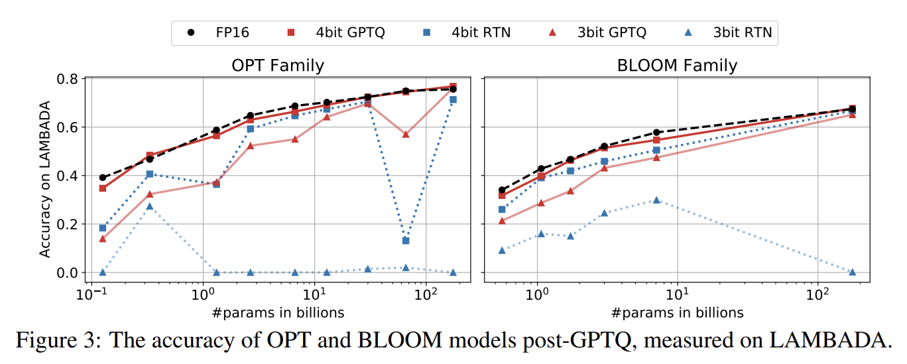

* Fig. 3 은 LAMBADA 에서의 model performance 를 시각화하며, Tab. 5 의 “Lamb.” 결과도 함께 참조할 수 있다. 
* 전반적인 동작은 이전과 유사하다. 예외적인 관찰로는, 1) 4-bit 에서는 quantization 이 model 규모 전반에 걸쳐 상대적으로 “쉬워” 보이며, RTN 조차도 비교적 잘 동작한다는 점과, 2) 3-bit 에서는 RTN 이 붕괴되는 반면 GPTQ 는 여전히 좋은 accuracy 를 제공한다는 점이다. 

추가적인 결과는 Appendix A.4 에 제시한다.

#### Additional Tricks.

지금까지의 실험은 vanilla row-wise quantization 에만 초점을 맞추었지만, GPTQ 는 사실상 어떤 quantization grid 선택과도 호환된다는 점을 강조한다. 예를 들어, 연속된 $g$ 개의 weight group 에 대해 독립적으로 quantization 을 적용하는 standard grouping 과도 쉽게 결합될 수 있다. 

Tab. 5 의 마지막 행에서 보이듯이, 이는 3-bit 에서 가장 large model 에 대해 눈에 띄는 추가 accuracy 향상을 가져온다. 

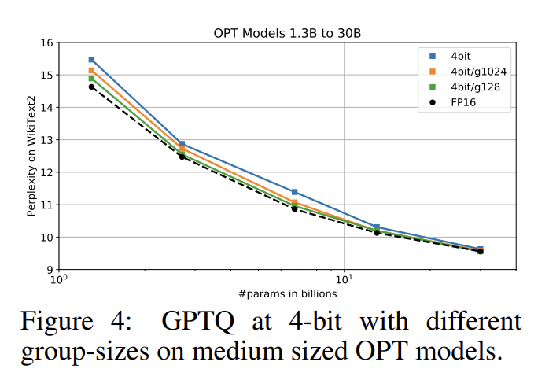

또한 Fig. 4 에서 시각화된 바와 같이, medium-sized model 에 대해서도 4-bit precision 에서 accuracy loss 를 크게 줄인다.

#### Extreme Quantization.

마지막으로, grouping 은 component 당 평균 약 2-bit 수준의 extreme quantization 에서도 합리적인 성능을 달성할 수 있게 한다. Tab. 7 은 가장 큰 model 을 다양한 group-size 로 2-bit 로 quantize 했을 때의 WikiText2 결과를 보여준다. 

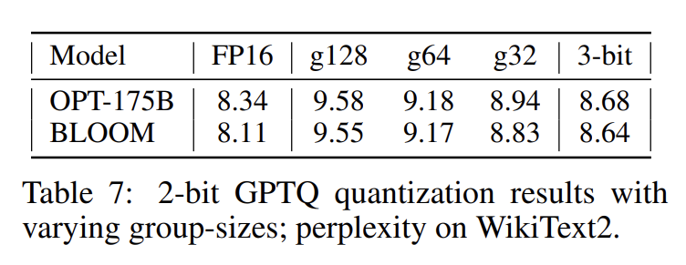

* 약 2.2 bit (group-size 128; group 당 FP16 scale 과 2-bit zero point 사용) 에서는 perplexity 증가가 이미 1.5 point 미만이며, 약 2.6 bit (group-size 32) 에서는 0.6–0.7 로 감소한다. 
  * 이는 vanilla 3-bit 보다 약간 나쁜 수준에 불과하며, practical kernel implementation 측면에서 흥미로울 수 있다. 
* 더 나아가, group-size 를 8 로 줄이면 ternary ($-1, 0, +1$) quantization 을 적용할 수 있으며, 이는 OPT-175B 에서 WikiText2 PPL 9.20 을 달성하여, 1 point 미만의 성능 저하만을 보인다. 
  * 이는 앞선 2-bit 결과 대비 평균 compression 은 다소 나쁘지만, FPGA 와 같은 custom hardware 에서는 효율적으로 구현될 수 있다. 
* 요약하면, 이러한 결과는 very large language model 에 대해 average value 당 3-bit 보다 더 낮은 수준까지도 highly-accurate 한 one-shot compression 을 달성할 수 있음을 보여주는 고무적인 첫 단계라 할 수 있다.

# 6 Summary and Limitations

저자는 truly large language model 을 quantize 하기 위한 approximate second-order method 인 GPTQ 를 제시하였다. 

GPTQ 는 공개된 최대 규모 model 중 일부를 3-bit 및 4-bit 까지 정확하게 compress 할 수 있으며, 이는 usability 의 유의미한 향상과 함께, 낮은 accuracy loss 하에서 end-to-end speedup 을 제공한다. 이러한 method 가 더 많은 연구자와 practitioner 에게 이러한 model 을 접근 가능하게 만들기를 기대한다. 

동시에, 몇 가지 중요한 한계점도 강조한다. 기술적인 측면에서, 제안 방법의 speedup 은 memory movement 감소에서 비롯되며, computation 자체의 감소로 이어지지는 않는다. 또한 본 연구는 generative task 에 초점을 맞추고 있으며, activation quantization 은 고려하지 않는다. 이는 향후 연구를 위한 자연스러운 방향이며, carefully-designed GPU kernel 과 기존 technique 을 통해 달성 가능하다고 본다.
