논문 및 이미지 출처 : <https://arxiv.org/pdf/2304.09145>

# Abstract

Transformer language model 의 post-training quantization (PTQ) 은 activation 에 존재하는 해로운 outlier 로 인해 중대한 도전에 직면한다. 저자는 이러한 outlier 가 특정 channel 에 집중되어 있으며, channel 간에 비대칭적으로 분포한다는 것을 관찰한다.

* 이 문제를 해결하기 위해, 저자는 비대칭성을 다루기 위한 channel-wise shifting 과 집중 현상을 다루기 위한 channel-wise scaling 을 포함하는 **Outlier Suppression+ (OS+)** framework 를 제안한다.
  * 저자는 이러한 연산이 동등성을 유지하면서 후속 module 로 원활하게 migration 될 수 있음을 보인다.
* 둘째, 저자는 효과적인 shifting 및 scaling 값을 계산하기 위한 빠르고 안정적인 scheme 을 제안한다.
  * channel-wise shifting 은 각 channel 의 중심을 정렬하여 outlier 비대칭성을 제거한다.
  * channel-wise scaling 은 migration 및 quantization 으로 인해 발생하는 변화를 정량적으로 평가하여 quantization burden 균형을 개선한다.

저자는 BERT, OPT, BLOOM, BLOOMZ, LLaMA 를 포함한 model 에 대해 standard quantization 및 fine-grained quantization 설정 모두에서 OS+ 를 검증한다.

다양한 task 전반에 걸친 종합적인 결과는 저자의 방법의 우수성을 입증한다.

특히, standard quantization 에서 OS+ 는 8-bit 및 6-bit 설정에서 small model 과 large language model 모두에 대해 floating-point 성능에 근접한 성능을 달성한다.

또한, 저자는 4-bit BERT 에서 15.5% 향상을 달성하여 새로운 state-of-the-art 를 수립한다.

# 1 Introduction

Transformer language model (e.g., BERT, LLMs) 은 뛰어난 성능과 scalable model size 로 인해 상당한 주목을 받아왔다. 이러한 model 은 수억 개의 parameters 에서 수천억 개의 parameters 로 발전해왔다. 이는 실제 deployment 를 위해 compression technique 의 사용을 필요로 한다. 이러한 technique 중에서 quantization 은 memory footprint 와 computation overhead 를 모두 줄이기 위한 일반적이고 주요한 paradigm 으로 부상하였다.

그러나 quantization, 특히 제한된 data 및 GPU 자원 설정에서의 post-training quantization 은 이러한 model 에서 점점 더 어려워지고 있다 (e.g., BERT 에서 12% accuracy drop 및 OPT-175B 에서 catastrophic degradation). 이는 activation 에 존재하는 해로운 outlier 때문이며 (e.g., distribution 의 range 가 BERT 에서는 80, OPT 에서는 140 에 달할 수 있음), discrete number 가 continuous number 를 정확하게 표현하는 것을 방해한다.

이러한 bottleneck 을 해결하기 위해, 연구자들은 심층적인 분석을 수행하고 outlier 가 주로 특정 channel 에 집중된다는 것을 발견하였다.

* 일부 연구는 fine-grained quantization scheme 을 제안하고 outlier channel 에 대해 추가 bit level 을 제공한다. 그러나 이는 quantization acceleration 효과를 저해할 수 있다.
* 다른 연구는 activation scaling 을 통해 outlier 를 scale down 하고 scaling value 를 후속 weight 로 migration 하여 FP 동등성을 유지한다. 그러나 이 방법은 migration 및 quantization 으로 인해 발생하는 변화를 최소화하는 것을 고려하지 않고 scaling value 를 결정하며, 저자는 이것이 sub-optimal 하다고 판단한다.

한편, 저자는 기존 연구에서 간과되었으나 large tensor range 의 원인이 되는 새로운 outlier 특성을 추가로 확인하였다.

본 논문에서 저자는 channel-wise shifting 과 channel-wise scaling 으로 구성된 **Outlier Suppression+ framework** 를 제안하여, FP output 을 동등하게 유지하면서 더 나은 quantization 성능을 효과적으로 달성한다.

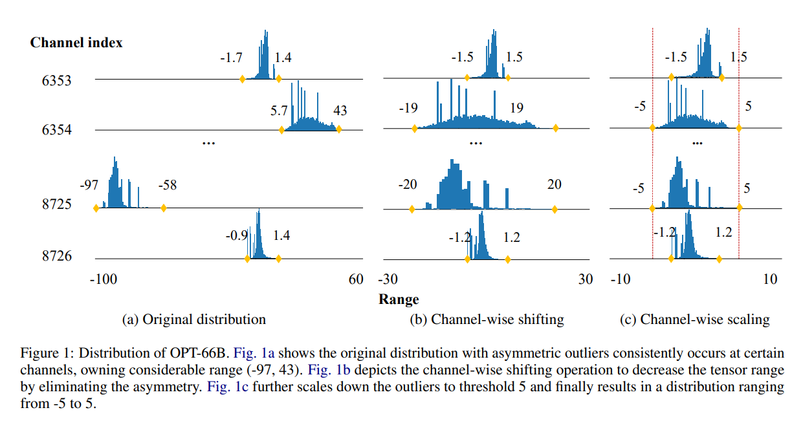

* 첫째, 저자는 outlier 가 channel 간에 비대칭적인 형태를 보인다는 새로운 특징을 발견하였다 (e.g., Fig. 1a 에서 OPT-66B 의 한 problematic channel 은 -97 에서 -58 까지의 음수 구간을 차지하는 반면, 다른 channel 은 5.7 에서 43 까지의 양수 값을 가진다). 
  * 이러한 outlier 의 비대칭적 표현은, 각 channel 의 range 가 39 와 같이 상대적으로 작더라도, 전체 tensor range 가 140 과 같이 매우 넓어지게 만들 수 있다.
  * 따라서 저자는 channel-wise shifting 연산을 제안하여, channel 간 activation 을 이동시켜 비대칭성의 영향을 제거한다. 
  * 또한, 집중된 outlier 특성을 다루기 위해 channel-wise scaling 을 함께 적용한다. 
  * 이러한 연산의 역효과를 후속 module 로 원활하게 전달하여 FP model 과의 동등성을 유지하기 위해, 통합된 migration pattern 을 도입한다.
* 둘째, 저자는 효과적인 shifting 및 scaling 값을 결정하기 위한 정교한 scheme 을 설계한다.
  * shifting vector 는 각 channel 의 중심을 정렬하여 전체 tensor range 를 최대 channel range 로 감소시킨다.
  * scaling value 는 migration 및 quantization 으로 인해 activation 과 weight 에서 발생하는 상호작용적 output 변화를 정량적으로 최소화하며, 빠르고 안정적인 search procedure 를 통해 균형 잡힌 quantization burden 을 달성한다.

저자의 algorithm 은 효율적으로 수행될 수 있으며, 실제 hardware 상에서 높은 경제성을 가진다. 수 분 내에 보다 quantization-friendly 한 model 을 생성할 수 있으며, LLM 에 대해 추가적인 inference burden 을 요구하지 않는다.

이에 따라 저자의 주요 기여는 다음 세 가지로 요약된다.

1. 저자는 channel 간 비대칭적 형태를 보이는 새로운 outlier 특성을 발견하고, outlier 의 집중 특성을 다루기 위한 channel-wise scaling 과 함께 channel-wise shifting 연산을 제안한다. 
   * 또한, 이들의 역효과를 후속 module 로 migration 하는 통합된 pattern 을 설계하여 FP network 와의 동등성을 보장한다.
2. 저자는 효과적인 shifting 및 scaling 값을 결정하기 위한 빠르고 안정적인 방법을 제안한다. 
   * shifting value 는 channel 간 비대칭성을 제거하고, scaling value 는 정량적 최적화 목표를 향해 outlier channel 을 scale down 한다.
3. 저자는 standard quantization 및 fine-grained quantization 설정 모두에서 저자의 방법의 효능을 평가한다.
   * standard 설정에서, OS+ 는 8-bit 및 6-bit BERT, OPT, BLOOM, BLOOMZ 에서 floating-point 에 근접한 성능을 달성한다.
   * fine-grained 설정에서, OS+ 는 per-token quantization 을 사용하는 4-bit LLaMA 에서 9.41% 향상을 달성하며, per-group quantization 을 사용하는 4-bit OPT 에서 lossless 결과를 얻는다.

# 2 Related work

지면의 한계로 인해, 저자는 여기에서 가장 관련성이 높은 논문만을 소개하며, 전체 related work 는 Appendix A 에 제시한다.

PTQ 영역에서, 연구자들은 transformer language model 의 성능 저하가 activation 에 존재하는 극단적인 outlier 에 기인한다는 것을 발견하였다. 이러한 outlier 는 channel 측면과 token 측면 모두에서 특수한 특성을 보인다. 따라서 저자는 두 가지 측면에서 관련 연구를 소개한다.

#### Channel aspect

Outlier 는 서로 다른 input 에 대해서도 특정 channel 에 지속적으로 나타난다.

* Bondarenko et al. 은 서로 다른 channel group 에 대해 서로 다른 quantization parameter 를 사용하는 per-embedding-group quantization scheme 을 사용한다.
* Dettmers et al. 은 6 을 초과하는 signal 을 보유한 problematic channel 에 대해 FP16 representation 을 사용하는 것을 제안한다.
* Wei et al. 은 Gamma Migration 이라는 구성 요소를 포함하는 outlier suppression (OS) framework 를 도입한다. Outlier 가 특정 channel 에 축적된다는 관찰에 기반하여, scaling vector 를 사용해 outlier 를 scale down 하고 이를 후속 module 로 migration 한다.
* Xiao et al. 은 activation 과 weight 간 range 를 equalize 하여 scaling value 를 계산하는 방법을 추가로 제안하고, large language model 에서 이를 평가한다.
* Guo et al. 은 outlier 인접의 정상 값을 제거하여 outlier 를 위한 공간을 확보하는 방법을 제안하며, 이는 customized GPU support 를 필요로 한다.
* Standard quantization 을 고려할 때, 저자는 Wei et al. 과 Xiao et al. 의 방법이 여전히 channel 간 극단적인 outlier 비대칭성으로 인해 상당 부분의 quantization level 을 낭비하고 있음을 발견하였다.
* 또한, Wei et al. 은 LayerNorm (LN) 의 scaling parameter 를 단순히 outlier scaling vector 로 간주하는데, 이는 항상 outlier 분포와 일치하지 않을 수 있다.
* Xiao et al. 은 heuristic 방식으로 activation 과 weight 의 range 를 equalize 하지만, migration 및 quantization 으로 인해 유발되는 output 변화에 대한 정량적 평가가 부족하다.

#### Token aspect

서로 다른 token 은 서로 다른 수준의 outlier 를 보인다.

* Dettmers et al. 및 Yao et al. 은 각 token 에 대해 동적으로 quantization parameter 를 계산하는 per-token quantization 이라는 새로운 scheme 을 도입한다.
* Wei et al. 은 outlier clipping 의 영향을 조사하고, token-wise 방식으로 적절한 clipping range 를 찾을 것을 제안한다.

본 논문에서는 channel aspect 에 초점을 맞추며, 필요할 경우 이러한 technique 과 결합할 수 있다.

# 3 Preliminary

#### Basic Notations

* 저자는 행렬을 대문자 (e.g., $X$) 로, 벡터를 소문자 (e.g., $x$) 로 표기한다.
* 연산자 $\odot$ 와 $\oslash$ 는 행렬 또는 벡터에 대한 element-wise multiplication 및 division 을 의미한다.
* $W X$ 는 matrix-matrix multiplication 을 의미한다.
* 또한, $X_{t,j}$ 는 transformer model 에서 $t$ 번째 token 과 $j$ 번째 channel 의 element 를 나타낸다.
* $Q(\cdot)$ 는 quantization function 을 나타낸다.

#### Quantization

저자는 여기에서 standard quantization 을 per-tensor activation quantization 과 per-channel 또는 per-tensor weight quantization 으로 지칭한다. 이러한 scheme 은 integer matrix multiplication 을 분리하지 않는다.

* per-tensor 는 각 tensor 에 대해 quantization parameter 를 할당하는 것을 의미한다.
* per-channel 은 각 output channel 에 대해 quantization parameter 를 할당하는 것을 의미한다.

또한, 일부 fine-grained 방식으로는 per-token 및 per-group 을 주로 고려한다.

* per-token 은 각 token 에 대해 quantization parameter 를 계산한다.
* per-group 은 각 group 에 대해 quantization parameter 를 계산한다.

# 4 Method

저자는 먼저 동등성을 유지하는 shifting 및 scaling 연산을 제시하고, 이후 이들의 효과적인 값을 결정하는 방법을 소개한다.

## 4.1 Equivalent shifting and scaling

본 절에서는 outlier 의 특성을 종합적으로 분석하고, 이에 기반하여 shifting 및 scaling 연산의 설계를 자연스럽게 도입한 뒤, 통합된 migration pattern 을 제시한다.

### 4.1.1 Outlier shifting and scaling

#### Channel-wise shifting

Transformer, 특히 LLM 에서, 저자는 outlier 가 channel 간에 비대칭적인 거동을 보인다는 것을 발견한다. Fig. 1a 를 상기하면, 8725 번째 channel 은 강한 음수 구간 $(-97, -58)$ 을 가지는 반면, 또 다른 channel 은 양수 구간 $(5.7, 43)$ 을 지배한다.

이러한 비대칭성으로 인해, 각 channel 의 range 가 상대적으로 작더라도 (e.g., outlier channel 의 경우 40 및 39, 정상 channel 의 경우 매우 작은 값), 전체 tensor 의 range 는 $-97$ 에서 $43$ 까지와 같이 크게 팽창하여 (e.g., 140) quantization 성능에 부정적인 영향을 미친다.

이 문제를 해결하기 위해, 저자는 다음과 같은 연산을 통해 비대칭성의 영향을 제거할 수 있는 **channel-wise shifting** 을 제안한다.

$$
\widetilde{X}' = X - z, \tag{1}
$$

* 여기서 $z$ 는 row vector ($z \in \mathbb{R}^n$) 로, 각 channel 에 대해 activation 을 이동시킨다.

Sec. 4.2.1 에서 소개할 정교하게 설계된 $z$ 를 사용하면, 새로운 tensor $\widetilde{X}'$ 는 outlier 비대칭 특성을 제거할 수 있다. 예를 들어, Fig. 1b 에서 각 channel 의 중심을 정렬하면, 전체 tensor range 는 140 에서 최대 channel range 인 40 으로 감소한다.

마지막으로, 이 연산은 symmetric quantization 을 위한 기존 shifting 연산과는 다르다. 이는 channel-wise 로 작동하며, per-tensor quantization 에 더 적합한 분포를 제공한다.

#### Channel-wise scaling.

Channel 간 비대칭 특성 외에도, outlier 가 여러 input 에 걸쳐 특정 channel 에 집중적으로 축적되는 outlier concentration 현상이 존재한다. 예를 들어, Fig. 1a 에서 8725 번째 및 6354 번째 channel 은 다른 channel 보다 더 극단적인 값을 가진다.

따라서 shifting 이후, quantization 의 난이도를 더욱 완화하기 위해 channel-wise scaling 을 적용한다.

$$
\widetilde{X} = (X - z) \oslash s. \tag{2}
$$

위 식에서, row vector $s \in \mathbb{R}^n$ 는 각 channel 에 대해 shifting 된 tensor 를 scale 하여 최종적인 quantization-friendly activation $\widetilde{X}$ 를 생성한다.

예를 들어, Fig. 1c 에서 signal 이 5 를 초과하는 channel 을 scale down 하면, 크기 10 의 tensor 를 얻을 수 있다. $s$ 의 구체적인 계산은 Sec. 4.2.2 에서 제시한다.

#### Implementation

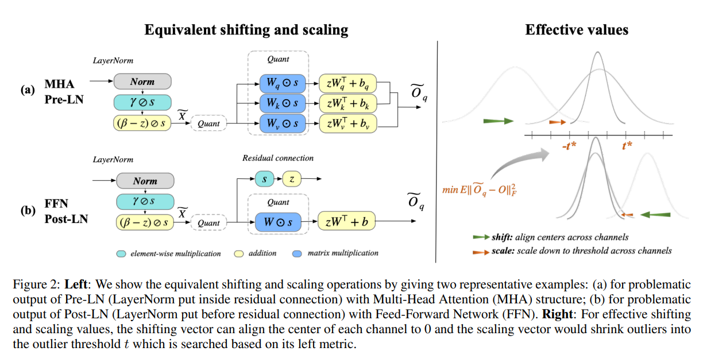

이러한 연산은 쉽게 구현될 수 있다. Fig. 2 의 LayerNorm 출력의 경우를 예로 들면, linear transformation parameter 인 $\beta$ 와 $\gamma$ 를 각각 $(\beta - z) \oslash s$ 및 $\gamma \oslash s$ 로 대체하면 shifting 및 scaling 효과를 달성할 수 있다.

다른 경우에는, 이전 DeQuant function 의 parameter 를 업데이트하면 된다.

### 4.1.2 Unified migration pattern

Eq. (1) 및 Eq. (2) 에서 언급한 바와 같이, 저자는 problematic activation 이 quantization 에 더 강건하도록 $z$ 를 subtract 하고 $s$ 로 divide 한다. FP model 과의 동등성을 유지하기 위해, reversed shifting 및 scaling vector 를 후속 module 로 전달하는 통합된 migration pattern 을 제안한다.

저자는 두 가지 일반적인 구조에서 이 algorithm 의 타당성을 보인다.

#### Linear Layer

먼저, linear (convolutional) layer 가 바로 뒤따르는 일반적인 상황을 고려한다.

위 연산을 되돌리면, $(\widetilde{X} \odot s + z) W^\top + b$ 가 되며, 이는 다음 layer 의 $W \in \mathbb{R}^{m,n}$ 및 $b \in \mathbb{R}^m$ 를 업데이트하는 것과 동등하다.

$$
(\widetilde{X} \odot s + z) W^\top + b \\
= (\widetilde{X} \odot s) W^\top + z W^\top + b \\
= \widetilde{X} (W^\top \odot s^\top) + (z W^\top + b). \tag{3}
$$

Eq. (3) 에 따라, weight 와 bias 는 각각 $s$ 와 $z$ 를 흡수할 수 있으며, 다음과 같이 표현된다.

$$
\widetilde{W} = W \odot
\begin{bmatrix}
s_1 & s_2 & \dots & s_n \\
s_1 & s_2 & \dots & s_n \\
\vdots & \vdots & \ddots & \vdots \\
s_1 & s_2 & \dots & s_n
\end{bmatrix}, \quad \tag{4}
\tilde{b} = z W^\top + b.
$$

예를 들어, Fig. 2(a) 에서 attention 구조 내의 LayerNorm 출력과 같은 challenging activation 의 경우, 모든 후속 weight 및 bias 는 추가적인 computation burden 없이 shifting 및 scaling 신호를 흡수할 수 있다.

#### Residual connection

둘째, LayerNorm 구조 (Post-LN) 이후 residual connection 이 적용되고 quantized input 으로 전달되는 경우를 고려한다.

Fig. 2b 에서 보이는 것처럼, linear layer 변환 외에도, identity function 은 동등성을 유지하기 위해 channel-wise multiplication 및 addition 으로 대체된다.

이로 인해 증가하는 계산은 Sec. 5.5 에서 보이듯이 inference burden 에 거의 무시할 수 있는 수준의 영향을 미친다.

마지막으로, $s$ 와 $z$ 는 token 및 batch 간에 공유되는 parameter 이므로, 통합된 migration pattern 은 대부분의 경우 추가적인 computation 없이 동일한 output 을 생성할 수 있다.

## 4.2 Effective shifting and scaling

동등성을 유지하는 shifting 및 scaling 연산을 기반으로, 본 절에서는 효과적인 값을 찾기 위한 빠르고 안정적인 scheme 을 제안한다.

### 4.2.1 Shifting values

Shifting vector 의 설계는 channel 간 비대칭성의 영향을 제거하는 것을 목표로 한다. 이를 위해, 각 channel 의 중심을 0 에 정렬하여 outlier channel 이 양수 또는 음수 한쪽에만 치우치지 않도록 한다.

구체적으로, $z$ 는 각 channel 의 최소값과 최대값의 평균으로 정의된다.

$$
z_j = \frac{\max(X_{:,j}) + \min(X_{:,j})}{2}. \tag{5}
$$

이제 channel-wise shifting 을 적용하면, 전체 tensor range 는 비대칭적 outlier 에 의해 결정되지 않고, 가장 큰 channel range 로 축소된다.

### 4.2.2 Scaling values

Scaling vector 의 설계는 outlier 를 추가로 scale down 하면서, 후속 weight quantization 에 미치는 영향을 최소화하는 것을 목표로 한다. 아래에서는 이를 위한 optimization objective 및 procedure 를 소개한다.

#### Challenges

Eq. (4) 의 동등 변환을 상기하면, scaling 은 weight 또한 함께 scale 하며, 이는 weight quantization 성능 저하를 유발할 수 있다. 따라서 activation 과 weight 사이에서 quantization balance 를 달성하기 위해 정교한 scaling value 계산이 필요하다.

그러나 기존 연구는

* 후속 weight 에 미치는 영향을 무시하거나
* activation 과 weight 의 range 를 단순히 equalize 하는 heuristic 방법을 사용한다.

저자는 핵심이 migration 및 quantization 으로 인해 발생하는 activation 과 weight 의 상호작용적 output 변화(interactive output change) 를 최소화하는 것이라고 본다 (자세한 분석은 Tab. 6 참조).

이에 따라 새로운 optimization objective 를 제안한다.

#### Optimization objective

먼저, problematic activation 이 하나의 linear layer 의 input 으로 작용하는 간단한 경우를 고려한다 (e.g., Fig. 2b).

Activation 과 weight 의 quantization error 를 각각 최소화하는 대신 $\min_s \mathbb{E}\left[\|Q((X - z)\oslash s) - (X - z)\oslash s\|_F^2\right]$ 및 $\min_s \mathbb{E}\left[\|Q(W \odot s) - W \odot s\|_F^2\right]$

저자는 task loss 관점에서 matrix multiplication output 을 직접 고려한다.

Scaling 및 quantization 이후의 output 과 원래 FP output 간의 차이를 최소화하는 objective 는 다음과 같다.

$$
\min_s
\mathbb{E}\big[ \big\| \underbrace{Q((X - z)\oslash s) Q(W \odot s)^\top + \tilde{b}}_\text{output after scaling and quantization} \\
- \underbrace{(XW^\top + b)}_\text{original FP output} \big\|_F^2 \big], \tag{6}
$$

* 여기서 mean squared error (MSE) 가 차이를 정량화하는 데 사용된다.

***Multiple linear layers***

Attention 구조 (Fig. 2a) 와 같이 여러 linear layer 가 존재하는 경우를 고려한다. 이 경우 세 개의 weight 가 동일한 scaling vector 에 의해 scale 되며, 동일한 suppressed activation 과 곱해진다.

Scaled 및 quantized matrix 로부터 생성된 output 을 각각 $Q_{eq}, K_{eq}, V_{eq}$ 라 하고, 원래 output 을 $Q, K, V$ 라 하자.

세 linear layer 각각에 대해 Eq. (6) 을 적용하여 단순 합산하면, 각 layer 의 중요도 및 사용 목적을 적절히 반영하기 어렵다.

따라서 attention mechanism 을 post-process function 으로 사용하여 scaling 및 quantization 정보를 합리적으로 조직한다.

$$
\min_s
\mathbb{E}\big[
\big\|
\text{softmax}(Q_q K_q^\top)V_q - \text{softmax}(Q K^\top)V
\big\|_F^2
\big]. \tag{7}
$$

표기 단순화를 위해 normalization 과 masking 은 생략하였다. 첫 두 linear layer 의 정보는 attention map 내에 포함되어 있다.

#### Optimization procedure

위 objective 를 최적화하기 위해, scaling vector 를 탐색하는 빠르고 안정적인 procedure 를 제안한다.

1. Outlier 가 존재하는 channel 만 scale down 하는 것이 더 나은 성능을 제공한다는 것을 발견하였다.
   * 정상 activation 을 가진 channel 은 input 간 변동성이 크므로 적절한 scaling value 를 찾기 어렵다.
   * 또한 이들은 quantization 성능 저하의 주된 원인이 아니므로 scaling 이 필요하지 않다.
2. Outlier threshold $t$ 라는 대체 변수를 최적화한다.
   * Activation range 가 $t$ 를 초과하는 channel 만 $(-t, t)$ 범위로 압축한다.
   * 나머지 channel 은 그대로 유지한다.

여기서 $t$ 는

* 어떤 channel 을 scale down 할지
* 최종 scaled activation range
* 후속 weight 에 적용될 scaling value 를 동시에 결정한다.

이 기법은 다수의 변수 $s$ 를 포함한 복잡한 문제를 단일 변수 $t$ 로 단순화한다. 이후 grid search 를 통해 Eq. (6) 및 Eq. (7) 을 최소화하는 $t$ 를 찾는다.

효과적인 $t$ 를 얻은 후, scaling vector 는 다음과 같이 계산된다.

$$
s_j = \max\big( 1.0, \frac{\max(X_{:,j} - z_j)}{t} \big). \tag{8}
$$

# 5 Experiments

본 실험의 목적은 다음을 보이는 것이다.

I. standard quantization 설정에서 small language model 과 large language model 모두에 대해 OS+ 가 만족스러운 예측 성능을 제공함을 보인다.
II. fine-grained quantization 과 결합하여 더 낮은 bitwidth 에서도 OS+ 가 일관된 성능을 유지함을 보인다.
III. ablation study 를 수행한다.
IV. computation complexity 와 같은 분석을 수행한다.

## 5.1 Set up

#### Quantization setting

Standard quantization 과 fine-grained quantization 을 모두 고려한다.

* Standard 설정에서는 Wei et al. 및 NVIDIA 와 동일한 quantization node 를 사용한다.
  * Activation 은 항상 per-tensor quantization 을 사용한다.
  * Weight 는 per-tensor (가장 빠른 속도) 및 per-channel (높은 성능) quantization 을 모두 고려한다.
* Fine-grained 설정에서는
  * per-token quantization
  * per-group quantization 을 사용한다.

***Notation***

INT8, INT6, INT4 는 activation 과 weight 의 bitwidth 를 의미한다.

* INT8* 는 per-tensor weight quantization 을 의미한다.
* per-token 및 per-group quantization 은 이후 표에서 별도로 표기한다.

#### Models and tasks

Small language model 과 large language model 모두에서 실험을 수행한다.

1. BERT (base 및 large) 는 GLUE benchmark 에서 평가한다.
2. Large model 로는 다음을 사용한다.
   * OPT (13B–175B)
   * BLOOM (176B)
   * BLOOMZ (176B)
   * LLaMA (7B, 13B, 30B, 65B)

Zero-shot task 로는 language modeling, multiple choice, commonsense reasoning 등을 포함한다.

평가 코드는 *lm-harness-evaluation* 을 기반으로 한다.

#### Baselines

* BERT 의 경우
  * MinMax
  * Percentile
  * OMSE
  * PEG
  * Outlier Suppression
* Large model (OPT, BLOOM, LLaMA) 의 경우
  * ZeroQuant
  * SmoothQuant

자세한 사항은 Appendix C 를 참조한다.

#### Implementation

Training dataset 에서 무작위로 128 개 sample 을 선택한다.

* GLUE 에서는 in-domain data 를 사용한다.
* Zero-shot task 에서는 PILE dataset 을 사용한다.

절차는 다음과 같다.

1. 한 batch 의 data 로 shifting 및 scaling vector 를 계산한다.
2. 이후 calibration 을 수행한다.

자세한 사항은 Appendix C 에 제시한다.

## 5.2 Standard quantization with OS+

본 절에서는 OS+ 가 standard quantization 에서 small model 과 LLM 모두에 대해 어떻게 만족스러운 결과를 달성하는지 보인다.

#### BERT

Tab. 1 은 일반적인 PTQ algorithm 의 예측 결과를 제시한다.

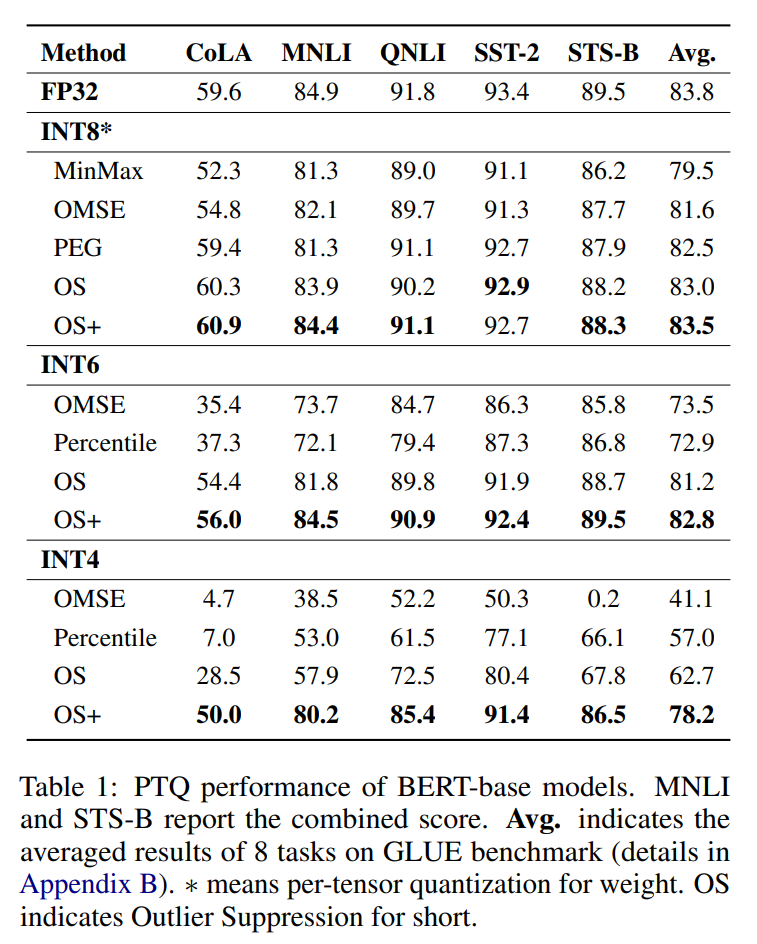

* 대부분의 방법은 INT8* 에서는 좋은 성능을 보이지만, lower bit 에서는 실패한다.
* 저자의 방법은 모든 bitwidth 에서 일관되게 우수한 성능을 달성한다.
  * Wei et al. 과 비교하면, 6-bit 에서 1.6% 향상
  * 4-bit 에서 15.5% 향상을 달성한다.

요약하면,

* High bit 에서는 floating-point 에 근접한 성능을 달성한다.
* 4-bit 에서도 성능 격차를 5.6% 까지 줄인다.

#### OPT and BLOOM

Standard quantization 설정에서 8-bit 및 6-bit 정확도를 Tab. 2 에 제시한다.

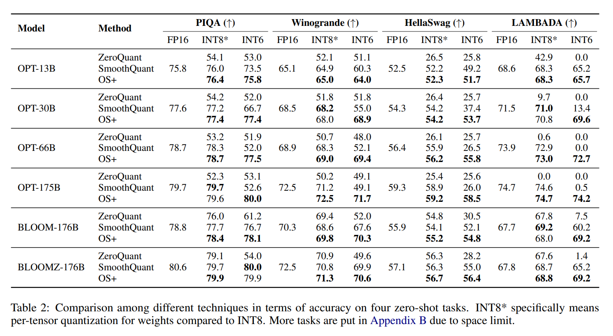

* OS+ 는 ZeroQuant 보다 큰 폭으로 우수하다.
* SmoothQuant 는 6-bit 175B 와 같이 outlier 가 심한 어려운 설정에서 상당한 accuracy drop 을 보인다.
* 반면, 저자의 방법은 다음과 같은 향상을 보인다.
  * HellaSwag 에서 32.5% 상승
  * PIQA 에서 27.4% 상승
* BLOOM model 의 경우, OPT 보다 quantization 난이도가 낮으며 method 간 accuracy drop 이 작다.
* 그럼에도 불구하고, 6-bit 에서 약 2% point 의 추가 향상을 달성한다.

결론적으로,

* 8-bit 에서는 FP 결과에 근접한다.
* 6-bit 에서는 약 1 point 의 accuracy 감소만 발생한다.

## 5.3 Fine-grained quantization with OS+

본 절에서는 OS+ 를 fine-grained quantization 과 결합하여, 4-bit 와 같은 극저 bit 설정에서의 적용 가능성을 검증한다.

#### Per-token Quantization

Per-token quantization 은 각 token 에 대해 quantization parameter 를 동적으로 계산한다. 이는 특히 lower-bit quantization 과 긴 출력 (e.g., WikiText2) 에서 더 나은 성능을 제공한다.

검증을 위해 LLaMA model 을 사용한다.

LLaMA 는 FFN 의 마지막 layer 에서 두 activation 의 element-wise multiplication 을 input 으로 사용하는 구조를 가진다. 이는 600 을 초과하는 매우 큰 signal 을 생성할 수 있다.

이러한 도전을 고려하여,

* 해당 layer 를 quantization 하는 경우
* quantization 하지 않는 경우

를 각각 Tab. 3 과 Tab. 10 에 제시한다.

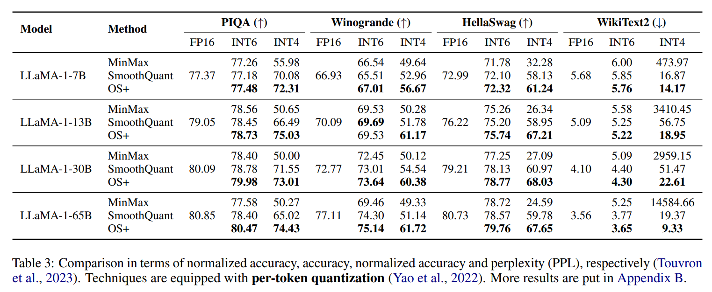

결과는 다음과 같다.

* 6-bit 에서 lossless 성능을 달성한다.
* SmoothQuant 는 Tab. 10 에서 여전히 성능 저하를 보인다.
* 4-bit 에서도 OS+ 는 우수한 성능을 보인다.
  * Winogrande 에서 10.58% 향상
  * WikiText2 에서 PPL 10.04 감소

#### Per-group Quantization

Per-group quantization 은 각 group 에 대해 quantization parameter 를 설정하는 더 세밀한 방법이다.

OPT 의 4-bit quantization 이 매우 어려운 점을 고려하여, group size 1024 및 512 를 사용하는 예를 제시한다.

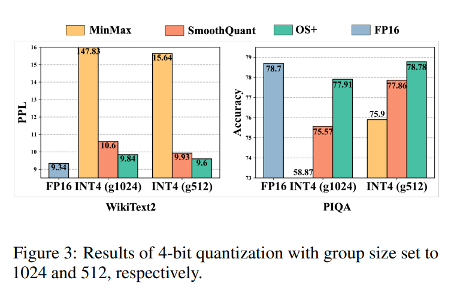

Fig. 3 은 다음을 보여준다.

* OS+ 는 다른 방법보다 지속적으로 우수하다.
* group size 1024 와 같은 더 어려운 설정에서도 경쟁력을 유지한다.

## 5.4 Ablation study

#### Design choices of scaling values

본 절에서는 서로 다른 scaling vector 설계를 비교한다.

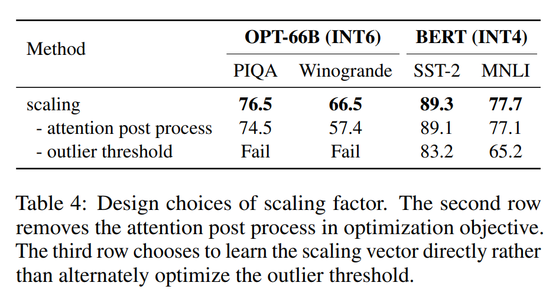

* Tab. 4 의 두 번째 행은 attention post-processing (Eq. (7)) 을 제거한 결과를 보여준다. 
* 여러 linear layer 의 loss 를 단순 합산하는 방식은 바람직하지 않으며, OPT 에서 약 2% 및 10% 의 성능 저하를 초래한다.
* 세 번째 행은 outlier threshold 를 제거하고 scaling value 를 직접 학습하는 방식을 보여준다. 
* 저자는 이 과정이 불안정하며 적절한 hyperparameter 가 필요하고, LLM 에서는 실패를 초래함을 발견하였다. 
* Sec. 4.2.2 에서 언급한 바와 같이, 이러한 불안정성은 magnitude 가 서로 다른 정상 channel 에 대해 sub-optimal 한 scaling value 가 선택되기 때문일 수 있다.

#### Effect of each operation

Tab. 5 에서 각 연산의 효과를 확인할 수 있다.

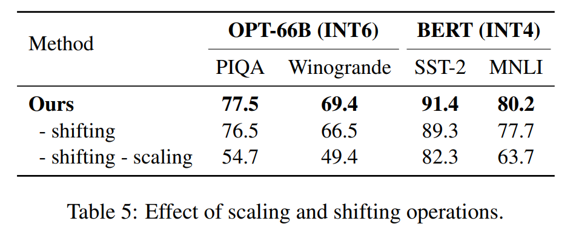

* Shifting 연산을 제거하면, 어려운 설정에서 accuracy 가 약 1%–3% 감소한다.
  * Channel-wise shifting 이 quantization 난이도를 완화하지 않으면, scaling factor 는 outlier 를 효과적으로 억제하면서 weight quantization burden 을 허용 가능한 수준으로 유지하기 어렵다.
* Scaling 효과를 제외하면 성능은 크게 감소하며, LLM 에서는 심지어 결과가 붕괴된다.

## 5.5 Analysis

#### Different activation scaling

Scaling value 는 activation 과 weight 모두에 작용하므로, 개별 tensor 의 quantization error 를 줄이는 것이 반드시 output 변화의 최소화를 보장하지 않는다. Output 은 이후 forward pass 에 전달되는 activation 과 weight 의 정보를 모두 포함하기 때문이다.

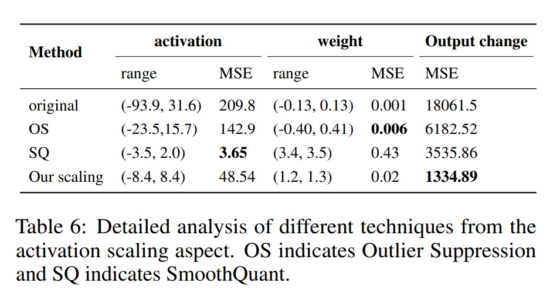

예를 들어, Tab. 6 에서

* 고정된 scaling value 를 사용하는 Outlier Suppression 은 weight 에 대해 가장 작은 quantization error 를 보인다.
* Heuristic 방식을 사용하는 SmoothQuant 는 activation 에 대해 가장 작은 quantization error 를 보인다.
* 그러나 두 방법 모두 output 에 대한 quantization error 는 최소가 아니다.
* 이는 output 을 직접 최적화하는 것이 중요함을 보여주며, 저자의 방법은 바로 이를 수행한다. 따라서 최종적으로 가장 우수한 성능을 달성할 수 있다.

#### Model storage and accuracy

서로 다른 크기의 model 을 고려하여, quantization 설정에서 storage 와 accuracy 간의 관계를 분석한다.

Fig. 4 는 동일한 model 에 대해 서로 다른 quantization bitwidth 를 적용한 결과를 보여준다.

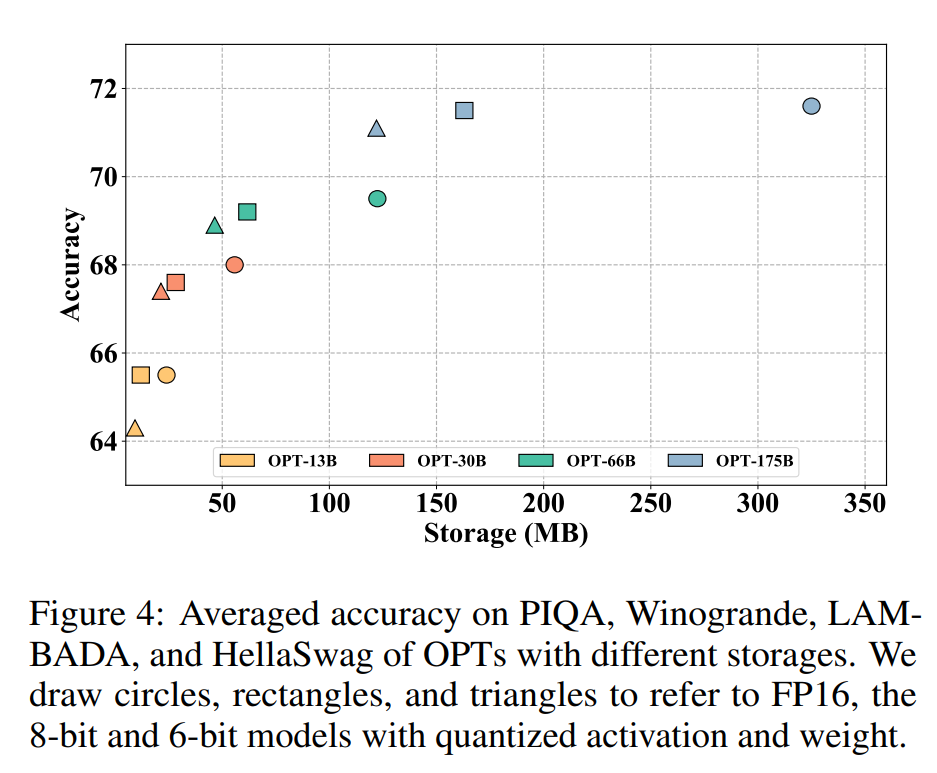

* 8-bit quantization 은 storage 를 약 절반으로 줄이면서도 원래 성능을 대부분 유지한다.
* 6-bit quantization 은 특히 larger model 에서 성능 저하가 더 적다.
* 또한, 동일한 storage 제약 하에서 quantized large model 은 small FP model 보다 일반적으로 더 우수한 성능을 보인다.
* 이는 model robustness 와 관련될 수 있으며, special outlier 를 적절히 처리하면 large model 이 compression 에서 더 많은 이점을 얻을 수 있음을 시사한다.

#### Computation Complexity

Calibration 및 deployment 단계에서의 computation complexity 를 설명한다.

* Calibration 과정에서, OS+ 는 효율적이며 OPT-175B 에 대해 offline 환경에서 약 20 분 만에 scaling 및 shifting value 를 생성할 수 있다.
* 동등 변환을 사용하므로 추가 training 이 필요하지 않으며, post-training setting 에서 적용 가능하다.

Deployment 단계에서 inference 효율을 latency 측면에서 분석한다.

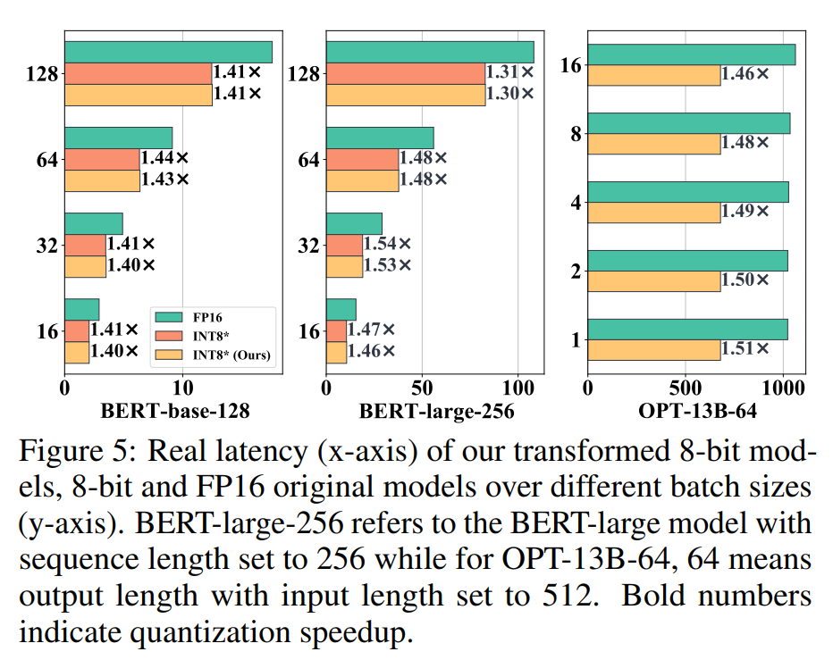

* Channel-wise shifting 및 scaling 은 기존 parameter 를 업데이트하고 후속 weight 로 migration 하는 방식으로 구현된다.
* LLM 의 경우 추가적인 computation burden 를 유발하지 않으며, Fig. 5 에서 보이듯이 1.5× speedup 을 달성한다.
* BERT model 의 경우에만 residual connection 의 identity function 이 channel-wise multiplication 및 addition 으로 대체된다.
* 이러한 overhead 는 매우 작으며, Fig. 5 에서 보이듯이 유사한 latency speedup 을 달성한다.

# 6 Conclusion

저자는 LLM 및 기타 transformer 에서 비대칭적이고 일관되게 나타나는 outlier 를 처리하기 위한 Outlier Suppression+ framework 를 제시하였다.

본 framework 는 scaling 및 shifting 연산으로 구성되며, 간단하면서도 효율적이고 효과적으로 구현될 수 있다.

실험 결과는 저자의 방법이 outlier 를 효과적으로 억제함을 보여준다.

# Limitations

저자는 outlier 의 특성을 관찰하고 이를 처리하기 위한 방법을 제안하였으나, 이러한 outlier 가 발생하는 근본적인 원인과 속성은 완전히 이해되지 않았다.

이는 training pipeline, 즉 procedure 및 hyperparameter 에 대한 심층 분석을 요구할 수 있다.

이러한 분석은 시간이 많이 소요되지만, FP 및 quantized 설정 모두에 이점을 제공할 수 있다.

