논문 및 이미지 출처 : <https://arxiv.org/pdf/2306.00978>

# Abstract

Large language models (LLMs) 은 수많은 AI application 을 변화시켰다. *on-device* LLM 은 점점 더 중요해지고 있다. edge device 에서 LLM 을 로컬로 실행하면 cloud computing cost 를 줄일 수 있고 사용자 privacy 를 보호할 수 있다. 그러나 천문학적인 model size 와 제한된 hardware resource 가 중요한 deployment challenge 를 초래한다. 

저자는 LLM low-bit weight-only quantization 을 위한 hardware-friendly 접근인 Activation-aware Weight Quantization (AWQ) 를 제안한다. 

* AWQ 는 LLM 에서 모든 weight 가 동일하게 중요하지는 않다는 점을 발견한다. 1% 의 salient weight 만 보호해도 quantization error 를 크게 줄일 수 있다. 
  * salient weight channel 을 식별하기 위해서는 weight 가 아니라 activation distribution 을 참고해야 한다. 
* hardware-inefficient mix-precision quantization 을 피하기 위해, 저자는 salient channel 을 scaling up 하면 quantization error 를 줄일 수 있음을 수학적으로 유도한다. 
* AWQ 는 salient weight channel 을 scaling 하여 이를 보호하기 위한 **equivalent transformation** 을 사용한다. 
  * scale 은 activation statistic 을 offline 으로 수집하여 결정된다. 
* AWQ 는 어떤 backpropagation 이나 reconstruction 에도 의존하지 않으므로, calibration set 에 overfitting 하지 않고 서로 다른 domain 과 modality 로 generalization 된다. 

AWQ 는 다양한 language modeling 및 domain-specific benchmark (coding 및 math) 에서 기존 연구를 능가한다. 

* 더 나은 generalization 덕분에, instruction-tuned LM 에 대해 뛰어난 quantization performance 를 달성하며, 처음으로 multi-modal LM 에 대해서도 이를 달성한다. 
* AWQ 와 함께, 저자는 4-bit on-device LLM/VLM 을 위해 맞춤화된 효율적이고 유연한 inference framework 인 TinyChat 을 구현한다. 
* kernel fusion 과 platform-aware weight packing 을 통해, TinyChat 은 desktop 및 mobile GPU 모두에서 Huggingface FP16 implementation 대비 3× 이상 speedup 을 제공한다. 
* 또한 mobile GPU 에서 70B Llama-2 model 의 deployment 를 democratize 한다.

# 1 Introduction

edge device 에서 large language models (LLMs) 를 직접 deployment 하는 것은 중요하다. on-device 사용은 데이터를 cloud server 로 전송하면서 발생하는 delay 를 제거하고, LLM 이 offline 으로 동작하게 하며, 이는 virtual assistant, chatbot, autonomous vehicle 과 같은 real-time application 에 유익하다. 

centralized cloud infrastructure 를 유지하고 확장하는 것과 관련된 operational cost 또한 줄일 수 있다. on-device LLM 은 sensitive information 을 local 에 유지하여 data security 를 강화하고, data breach 가능성을 줄인다. transformer-based architecture 에 기반한 LLM 은 다양한 benchmark 에서 인상적인 performance 로 큰 관심을 받았다. 그러나 큰 model size 는 높은 serving cost 로 이어진다. 예를 들어 GPT-3 는 175B parameters 를 가지며, 이는 FP16 에서 350 GB 이고, 최신 B200 GPU 조차 192 GB memory 만 가지며, edge device 는 말할 것도 없다.

LLM 을 위한 low-bit weight quantization 은 on-device LLM inference 의 memory footprint 를 크게 줄일 수 있지만 어렵다. **Quantization-aware training (QAT)** 은 높은 training cost 때문에 효율적이지 않으며, **post-training quantization (PTQ)** 은 low-bit setting 에서 큰 accuracy degradation 을 겪는다. 

가장 가까운 연구는 GPTQ 인데, 이는 second-order information 을 사용해 error compensation 을 수행한다. 그러나 reconstruction 중 calibration set 에 overfitting 할 수 있으며, out-of-distribution domain 에서 learned feature 를 왜곡할 수 있는데 (Fig. 8), 이는 LLM 이 generalist model 이기 때문에 문제가 된다.

이 논문에서 저자는 LLM 을 위한 hardware-friendly low-bit weight-only quantization method 인 Activation-aware Weight Quantization (AWQ) 를 제안한다. 저자의 방법은 weight 가 LLM performance 에 대해 동일하게 중요하지 않다는 관찰에 기반한다. 

* salient weight 의 작은 fraction (0.1%–1%) 이 존재하며, 이 salient weight 를 quantization 하지 않으면 quantization loss 를 유의미하게 줄일 수 있다 (Tab. 1). 
* salient weight channel 을 찾기 위해 핵심 insight 는, weight-only quantization 을 수행하더라도 weight distribution 이 아니라 activation distribution 을 참고해야 한다는 점이다. 
* larger activation magnitude 에 대응하는 weight channel 이 더 salient 한데, 이는 이들이 더 중요한 feature 를 처리하기 때문이다. 
* hardware-inefficient mixed-precision implementation 을 피하기 위해, 저자는 weight quantization 에서의 error 를 분석하고 salient channel 을 scaling up 하면 상대적인 quantization error 를 줄일 수 있음을 유도한다 (Eq. 2). 
* 이 intuition 을 따라, 저자는 full-weight quantization 하에서 quantization error 를 최소화하는 optimal scaling 을 자동으로 탐색하는 per-channel scaling method 를 설계한다. 
* AWQ 는 어떤 backpropagation 이나 reconstruction 에도 의존하지 않으므로, calibration set 에 overfitting 하지 않으면서 다양한 domain 과 modality 에서 LLM generalization ability 를 잘 보존한다.

AWQ 를 구현하기 위해, 저자는 4-bit LLM 의 이론적 memory saving 을 측정된 speedup 으로 변환하는 효율적인 inference framework 인 TinyChat 을 설계한다. 

* 저자의 framework 는 on-the-fly dequantization 을 통해 linear layer 를 크게 가속한다. 
* 또한 efficient 4-bit weight packing 과 kernel fusion 을 활용해 inference overhead (e.g., intermediate DRAM access 및 kernel launch overhead) 를 최소화하여, computer 가 byte-aligned 임에도 weight 를 4-bit 로 quantizing 함으로써 얻는 speed up 을 더 잘 실현한다.

experiment 는 AWQ 가 다양한 task 에서 서로 다른 model family (e.g., LLaMA, OPT) 및 model size 에 대해 기존 연구를 능가함을 보인다. 

* 더 나은 generalization 덕분에, instruction-tuned LM (e.g., Vicuna) 에 대해서도 좋은 quantization performance 를 달성하고, 처음으로 multi-modal LM (OpenFlamingo) 에 대해서도 이를 달성한다. 
* TinyChat 은 또한 약 $4\times$ 더 낮은 memory footprint 를 측정된 speedup 으로 추가 변환한다. 
* desktop, laptop, mobile GPU 에서, 저자는 다양한 LLM spectrum 전반에 걸쳐 Huggingface 의 FP16 implementation 대비 평균 3.2–3.3× speedup 을 일관되게 관측한다. 
* 더 나아가, 64 GB memory 를 가진 single NVIDIA Jetson Orin 에서 Llama-2-70B model 을 손쉽게 deployment 할 수 있게 한다. 
* 또한 8 GB memory 만 가진 laptop RTX 4070 GPU 에서 13 billion parameter LLM 을 30 tokens/second 의 interactive pace 로 democratize 한다. 

AWQ 는 industry 및 open-source community 에 의해 널리 채택되었다: HuggingFace Transformers, NVIDIA TensorRT-LLM, Microsfot DirectML, Google Vertex AI, Intel Neural Compressor, Amazon Sagemaker, AMD, FastChat, vLLM, LMDeploy 이며, single H200 GPU 에서 Falcon180B 를 deployable 하게 만든다.

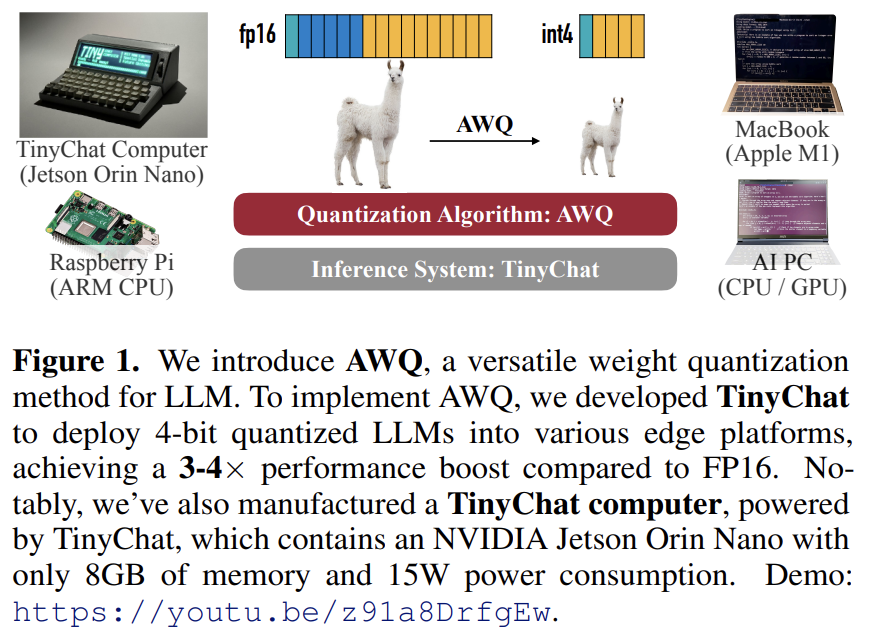

# 2 Related Work

Model quantization methods. Quantization 은 deep learning model 의 bit-precision 을 줄이는 방법이며, 이는 model size 를 줄이고 inference 를 가속하는 데 도움이 된다. Quantization technique 은 일반적으로 두 가지 category 로 나뉜다.

* quantization-aware training (QAT, backpropagation 에 의존하여 quantized weight 를 update 함)
* post-training quantization (PTQ, 보통 training-free)

QAT method 는 LLM 과 같은 large model 로 쉽게 scale up 하기 어렵다. 따라서 일반적으로 LLM 을 quantize 하기 위해 PTQ method 를 사용한다.

Quantization of LLMs. LLM quantization 에 대해 사람들은 두 가지 setting 을 연구한다.

1. W8A8 quantization: activation 과 weight 를 모두 INT8 로 quantize 한다
2. low-bit weight-only quantization (e.g., W4A16): weight 만 low-bit integer 로 quantize 한다

저자는 hardware barrier (smaller memory size 필요) 를 줄일 뿐만 아니라 token generation 을 가속하기 때문에 (memory-bound workload 를 완화함) 이 연구에서 두 번째 setting 에 초점을 맞춘다. vanilla round-to-nearest baseline (RTN) 을 제외하면, GPTQ 가 저자의 연구와 가장 가깝다. 그러나 GPTQ 의 reconstruction process 는 calibration set 에 대한 over-fitting issue 를 유발하며, 다른 modality 및 domain 에서 LLM 의 generalist ability 를 보존하지 못할 수 있다. 또한 일부 model (e.g., LLaMA-7B 및 OPT66B) 에서 동작하기 위해 reordering trick 이 필요하다. general-purpose hardware 를 대상으로 설계된 quantization method 외에도, SpAtten 은 softmax calculation 에 사용되는 bit 수를 점진적으로 늘리는 progressive approach 를 설계한다.

System support for low-bit quantized LLMs. low-bit quantized LLM 은 inference cost 를 줄이기 위한 인기 있는 setting 이다. practical speed-up 을 달성하기 위한 system support 가 존재한다. 

* GPTQ 는 OPT model 을 위한 INT3 kernel 을 제공하며, GPTQ-for-LLaMA 는 Triton 의 도움으로 INT4 reordered quantization 에 대한 kernel support 를 확장한다. 
* FlexGen, llama.cpp* 및 exllama† 는 I/O cost 와 offloading 을 줄이기 위해 group-wise INT4 quantization 을 수행한다. 
* FasterTransformer 는 weight-only per-tensor quantization 을 위한 FP16×INT4 GEMM 을 구현하지만 group quantization 은 지원하지 않는다. 
* LUT-GEMM 은 lookup table 의 도움으로 GPU CUDA core 에서 bitwise computation 을 수행한다. 

저자와 동시 연구인 MLC-LLM 은 강력한 TVM backend 덕분에 여러 edge CPU 및 GPU platform 에서 강한 결과를 제공한다.

# 3 AWQ: Activation-aware Weight Quantization

Quantization 은 floating-point number 를 lower-bit integer 로 mapping 한다. 이는 LLM 의 model size 와 inference cost 를 줄이기 위한 효과적인 방법이다. 이 section 에서 저자는 먼저 “더 중요한” weight 를 보호함으로써 training/regression 없이 accuracy 를 개선하는 weight-only quantization method 를 제안한다. 그리고 quantization error 를 줄이는 optimal scaling 을 탐색하기 위한 data-driven method 를 개발한다 (Fig. 2).

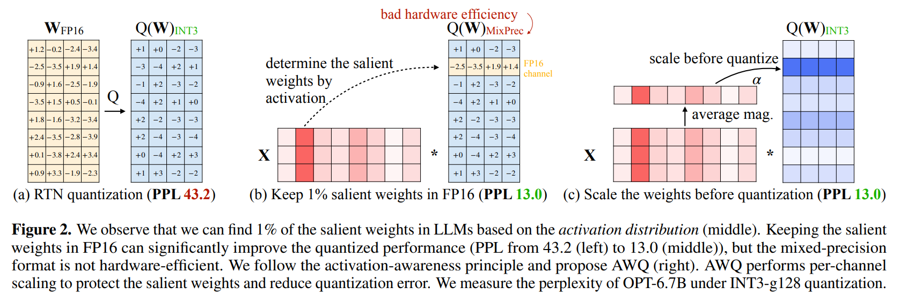

## 3.1 Improving LLM Quantization by Preserving 1% Salient Weights

저자는 LLM weight 가 동일하게 중요하지 않음을 관찰한다. 즉, 다른 weight 대비 LLM performance 에 훨씬 더 중요한 salient weight 의 작은 fraction 이 존재한다. 이러한 salient weight 의 quantization 을 생략하면 어떤 training 이나 regression 없이도 quantization loss 로 인한 performance degradation 을 완화하는 데 도움이 된다 (Fig. 2(b)). 이 아이디어를 검증하기 위해, 저자는 Tab. 1 에서 일부 weight channel 을 생략할 때 quantized LLM 의 performance 를 benchmark 한다. 

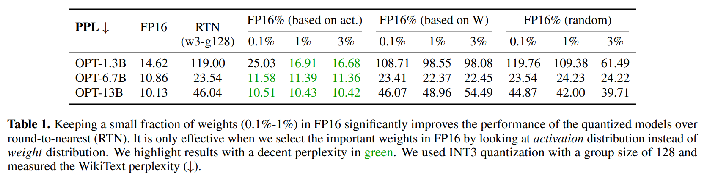

저자는 일부 비율의 weight channel 을 FP16 로 유지하면서 INT3 quantized model 의 performance 를 측정했다. weight 중요도를 결정하기 위해 널리 사용되는 method 는 magnitude 또는 $L2$-norm 을 보는 것이다. 하지만 저자는 norm 이 큰 weight channel 을 생략하는 것 (i.e., FP16% (based on W)) 이 quantized performance 를 유의미하게 개선하지 못하며, random selection 과 유사한 정도의 marginal improvement 로 이어짐을 발견한다. 

흥미롭게도 activation magnitude 를 기반으로 weight 를 선택하면 FP16 로 유지하는 channel 이 0.1%–1% 뿐이더라도 performance 를 크게 개선할 수 있다. 저자는 magnitude 가 더 큰 input feature 가 일반적으로 더 중요하다고 가정한다. 대응하는 weight 를 FP16 로 유지하면 이러한 feature 를 보존할 수 있고, 이것이 더 나은 model performance 에 기여한다.

#### Limitations

weight 의 0.1% 를 FP16 로 유지하는 것만으로도 (total bits 로 측정되는) model size 의 눈에 띄는 증가 없이 quantized performance 를 개선할 수 있지만, 이러한 mixed-precision data type 은 system implementation 을 어렵게 만든다. 저자는 중요한 weight 를 실제로 FP16 으로 유지하지 않고도 이를 보호하는 method 를 고안해야 한다.

## 3.2 Protecting Salient Weights by Activation-aware Scaling

저자는 hardware inefficiency issue 를 겪지 않는 per-channel scaling 으로 salient weight 의 quantization error 를 줄이는 alternative method 를 제안한다.

#### Analyzing the quantization error.

저자는 weight-only quantization 에서의 error 를 분석하는 것으로 시작한다. weight $w$ 의 group/block 을 고려하자. linear operation 은 $y = wx$ 로 쓸 수 있고, quantized counterpart 는 $y = Q(w)x$ 이다. 구체적으로 quantization function 은 다음과 같이 정의된다:

$$
Q(w) = \Delta \cdot \mathrm{Round}\left(\frac{w}{\Delta}\right), \ \Delta = \frac{\max(|w|)}{2^{N}-1}, \tag{1}
$$

* 여기서 $N$ 은 quantization bit 수이고, 
* $\Delta$ 는 absolute maximum value 로 결정되는 quantization scaler 이다. 

이제 weight element $w \in w$ 를 고려하자. 만약 $w$ 에 $s > 1$ 을 곱하고 $x$ 를 역으로 scaling 하면, $Q(w \cdot s)(x/s)$ 를 얻게 되며, 이는 다음과 같다:

$$
Q(w \cdot s)\cdot \frac{x}{s} = \Delta' \cdot \mathrm{Round}\left(\frac{ws}{\Delta'}\right)\cdot x \cdot \frac{1}{s}, \tag{2}
$$

* 여기서 $\Delta'$ 는 $s$ 를 적용한 뒤의 새로운 quantization scaler 이다. 

저자는 경험적으로 다음을 발견한다.

1. $\mathrm{Round}(\cdot)$ 에서의 expected error (이를 $\mathrm{RoundErr}(\cdot)$ 로 표기) 는 변하지 않는다. round function 은 floating-point number 를 integer 로 mapping 하며, error 는 대략 $[0, 0.5]$ 에서 uniform 하게 분포해 평균 error 가 0.25 가 된다. 즉, $\mathrm{RoundErr}(\cdot) \sim 0.25$ 이다.
2. single element $w$ 를 scaling up 하는 것은 보통 group $w$ 의 maximum value 를 바꾸지 않는다. 따라서 $\Delta' \approx \Delta$ 이다.
3. $\Delta$ 와 $x$ 는 FP16 으로 표현되므로 quantization error 가 없다.

따라서 equation (1) 과 (2) 에서의 quantization error 는 다음과 같이 표현될 수 있다.

$$
\mathrm{Err}(Q(w)x) = \Delta \cdot \mathrm{RoundErr}\left(\frac{w}{\Delta}\right)\cdot x
$$

$$
\mathrm{Err}\left(Q(w\cdot s)\left(\frac{x}{s}\right)\right) = \Delta' \cdot \mathrm{RoundErr}\left(\frac{ws}{\Delta'}\right)\cdot x \cdot \frac{1}{s} \tag{3}
$$

* new error 와 original error 의 ratio 는 $\frac{\Delta'}{\Delta}\cdot \frac{1}{s}$ 이다. 
* $\Delta' \approx \Delta$ 이고 $s > 1$ 이므로, salient weight $w$ 에 대해 relative error 가 더 작아진다.

이 아이디어를 검증하기 위해, 저자는 OPT-6.7B model 에 대해 1% salient channel 에 $s > 1$ 을 곱하고, Tab. 2 에서 각 group 에 대한 $\Delta$ 변화량을 측정한다. 

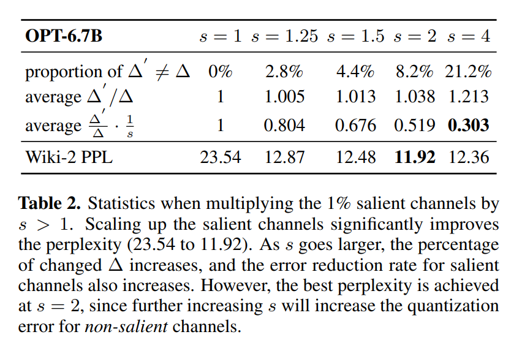

* 저자는 salient channel 을 scaling up 하는 것이 꽤 효과적임을 발견한다. 
* perplexity 는 $s = 1$ (단순 RTN) 에서 23.54 이고 $s = 2$ 에서 11.92 로 개선된다. 
* $s$ 가 커질수록 변화된 $\Delta$ 의 percentage 는 일반적으로 커지지만, $s < 2$ 에서는 그 percentage 가 여전히 매우 작다 (5% 미만). 
* salient channel 에 대한 relative error 는 $s$ 가 증가할수록 계속 더 작아진다. 그럼에도 best PPL 은 실제로 $s = 2$ 에서 나타난다. 
  * 이는 매우 큰 $s$ 를 사용하면 $\Delta$ 가 증가할 때 non-salient channel 의 relative error 를 증가시키기 때문이다 (non-salient channel 의 error 는 $\frac{\Delta'}{\Delta}$ 에 의해 amplified 되며, $s = 4$ 에서 channel 의 21.2% 는 ratio 가 1 보다 크다). 
  * 이는 model 의 overall accuracy 를 손상시킬 수 있다. 따라서 salient weight 를 보호할 때 non-salient channel 에서의 error 도 함께 고려해야 한다.

#### Searching to scale. 

salient weight 와 non-salient weight 를 모두 고려하기 위해, 저자는 어떤 layer 에 대해 quantization 이후 output difference 를 최소화하는 optimal (input channel 별) scaling factor 를 자동으로 탐색하기로 한다. 형식적으로, 저자는 다음 objective 를 optimize 하고자 한다:

$$
s^{*} = \arg\min_{s} L(s)
$$

$$
L(s) = \left\| Q\left(W \cdot \mathrm{diag}(s)\right)\left(\mathrm{diag}(s)^{-1}\cdot X\right) - WX \right\| \tag{4}
$$

* 여기서 $Q$ 는 weight quantization function (e.g., group size 128 인 INT3/INT4 quantization) 을 의미하고, 
* $W$ 는 FP16 의 original weight, 
* $X$ 는 small calibration set 에서 cache 한 input feature 이다 (저자는 특정 task 에 overfit 하지 않기 위해 pre-training dataset 에서 작은 calibration set 을 취한다). 
* $s$ 는 (input) channel 별 scaling factor 이다. 
* $\mathrm{diag}(s)^{-1}\cdot X$ 에 대해 이는 보통 이전 operator 로 fuse 될 수 있다. 

quantization function 은 differentiable 하지 않으므로, 저자는 vanilla backpropagation 으로 문제를 직접 optimize 할 수 없다. approximated gradient 에 의존하는 일부 technique 이 존재하지만, 저자는 이것도 unstable convergence 를 겪는다고 발견한다.

process 를 더 stable 하게 만들기 위해, 저자는 scaling factor 선택에 영향을 주는 factor 를 분석하여 optimal scale 을 위한 search space 를 정의한다. 이전 section 에서 보인 것처럼, weight channel 의 saliency 는 activation scale 에 의해 결정된다 (따라서 “activation-awareness”). 따라서 저자는 매우 간단한 search space 를 사용한다:

$$
s = s_{X}^{\alpha}, \ \alpha^{*} = \arg\min_{\alpha} L\left(s_{X}^{\alpha}\right) \tag{5}
$$

* $s_{X}$ 는 activation 의 평균 magnitude (channel 별) 이며, 
* 저자는 single hyper-parameter $\alpha$ 를 사용해 salient channel 과 non-salient channel 보호 사이의 균형을 잡는다. 
* 저자는 $[0, 1]$ interval 에서 빠른 grid search 로 best $\alpha$ 를 찾을 수 있다 (0 은 scaling 하지 않음을 의미하고, 1 은 저자의 search space 에서 가장 aggressive scaling 에 해당한다). 
* 저자는 또한 quantization 의 MSE error 를 최소화하기 위해 weight clipping 을 추가로 적용한다. 

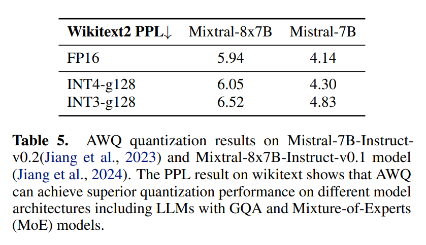

* 저자는 Tab. 5 에서 INT3-g128 quantization 하의 OPT model 에 대한 ablation study 를 제공하며, AWQ 가 일관되게 round-to-nearest quantization (RTN) 을 능가하고 mixed-precision (1% FP16) 과 comparable performance 를 달성하면서도 더 hardware-friendly 함을 보인다.

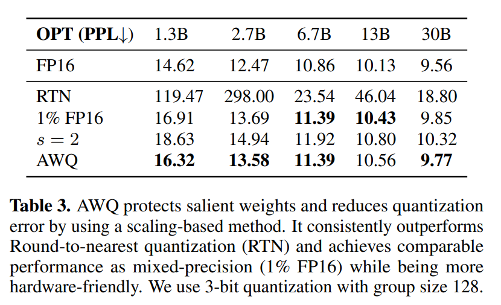

#### Advantages.

저자의 method 는 regression 이나 backpropagation 에 의존하지 않으며, 이는 많은 QAT method 가 요구하는 것이다. 또한 channel 별 평균 magnitude 만 측정하므로 calibration set 에 대한 의존이 최소이며, 이는 over-fitting 을 방지한다 (Fig. 8). 따라서 저자의 method 는 quantization process 에 필요한 data 가 더 적고, calibration set distribution 밖에 있는 LLM knowledge 를 보존할 수 있다. 더 자세한 내용은 Sec. 5.3 를 보라.

# 4 TinyChat: Mapping AWQ onto Edge Platforms

AWQ 는 LLM size 를 크게 줄일 수 있다. 그러나 W4A16 (4-bit weight, 16-bit activation) quantization 에서의 이론적 memory saving 을 측정된 speedup 으로 변환하는 것은 간단하지 않다. 

SmoothQuant 과 같은 대안적 W8A8 quantization method 는 storage 와 computation 모두에 대해 동일한 data precision 을 유지한다. 이는 dequantization procedure 가 computation kernel 의 epilogue 에 매끄럽게 통합되도록 한다. 반면 W4A16 quantization 은 memory access 와 computation 에 서로 다른 data type 을 사용한다. 

그 결과 optimal performance 를 위해 dequantization 이 primary computation loop 에 포함되어야 하며, 이는 implementation challenge 를 야기한다. 이를 해결하기 위해, 저자는 AWQ model inference 를 위한 민첩한 system 인 TinyChat 을 소개한다. 이는 PyTorch frontend 와 device-specific instruction set (e.g., CUDA/PTX, Neon, AVX) 을 활용하는 backend 를 갖는다.

## 4.1 Why AWQ Helps Accelerate On-Device LLMs

edge 에서 quantized LLM 의 acceleration opportunity 를 이해하기 위해, 저자는 RTX 4090 GPU 에서 LLaMA-7B model 의 latency breakdown 을 profiling 하는 것으로 시작한다. 저자는 edge use case 를 위해 inference batch size 를 1 로 채택하고, NVIDIA FasterTransformer 로 FP16 에서 model 을 구현한다.

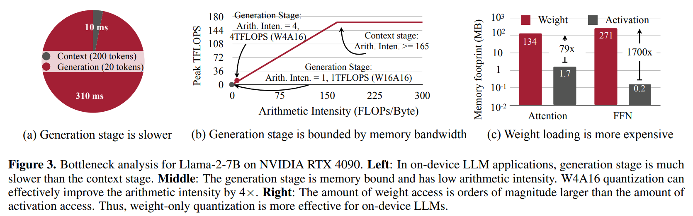

#### Context vs generation latency. 

Fig. 3(a) 와 같이, 20 token 을 생성하는 데 310 ms 가 걸리는 반면, 200 token 을 가진 prompt 를 summarizing 하는 데는 10 ms 만 걸린다. 결과적으로 generation phase 는 context stage 보다 훨씬 느리며, 특히 on-device interactive application 에서 그렇다.

#### Generation stage is memory-bound. 

generation phase 를 가속하기 위해, 저자는 Fig. 3(b) 에서 roofline analysis 를 수행한다. 4090 GPU 는 peak computation throughput 165 TFLOPS 와 memory bandwidth 1 TB/s 를 가진다. 따라서 arithmetic intensity (FLOPs 와 memory access 의 ratio) 가 165 보다 작은 workload 는 4090 GPU 에서 memory bounded 이다. 

주목할 점은 FP16 으로 실행될 때 on-device LLM 의 generation stage 는 arithmetic intensity $\approx 1$ 이라는 것이다. 이는 workload 의 memory-bound nature 를 강조한다. 어떤 model 의 FLOPs 는 고정되어 있으므로, peak performance 를 개선하는 유일한 방법은 total memory traffic 양을 줄이는 것이다. AWQ 는 weight memory 를 4 배 줄인다.

#### Weight access dominates memory traffic. 

따라서 저자는 Fig. 3(c) 에서 weight 와 activation 에 대한 memory access 를 추가로 breakdown 한다. 

on-device LLM 에서 weight access 가 memory traffic 을 지배함이 명확하다. model weight 를 4-bit integer 로 quantizing 하면 arithmetic intensity 를 대략 4 FLOPs/Byte 로 증가시켜 Fig. 3(b) 에서 4 TFLOPS peak performance 로 이어진다. weight-only quantization 은 weight 에 대해 더 낮은 bit width (따라서 더 높은 이론적 performance upper bound) 를 만들기 때문에, on-device LLM application 에서 AWQ 가 이 setting 을 따르는 것은 자연스럽다.

## 4.2 Deploy AWQ with TinyChat

이를 바탕으로, 저자는 4-bit weight quantization 이 4× 의 theoretical peak performance 로 이어질 수 있음을 보였다. 

저자는 이 speedup 을 실현하기 위해 TinyChat 을 추가로 설계한다. GPU 에서 저자는 attention, layer normalization, linear projection kernel 을 포함한 essential component 구현에만 집중한다. flexible frontend 는 쉬운 customization 과 새로운 model 에 대한 빠른 support 를 가능하게 한다. 

4-bit AWQ 를 사용한 TinyChat 은 GPU 에서 서로 다른 LLM family 전반에 걸쳐 Huggingface FP16 implementation 대비 3× 이상 speedup 을 달성한다. CPU 에서 저자는 overhead 를 최소화하기 위해 전체 computation graph 를 C++ 로 lowering 한다.

#### On-the-fly weight dequantization. 

quantized layer 에 대해, hardware 는 INT4 와 FP16 사이의 multiplication instruction 을 제공하지 않으므로, matrix computation 을 수행하기 전에 integer 를 FP16 으로 dequantize 해야 한다. 저자는 dequantization kernel 을 matrix multiplication kernel 과 fuse 하여 dequantized weight 를 DRAM 에 쓰는 것을 피한다. 이러한 fusion 은 matrix-matrix (MM) 및 matrix-vector (MV) product kernel 모두에 적용된다.

#### SIMD-aware weight packing. 

on-the-fly weight dequantization 은 intermediate DRAM access 를 줄이지만 여전히 expensive 하다. 

예를 들어 단일 4-bit weight 를 dequantize 하는 과정은 1 shift, 1 bitwise AND, 1 FMA scaling operation 을 포함하지만, dequantized weight 는 오직 1 FMA computation 만 수행한다. 이 과정은 vectorized instruction 을 선호하는 SIMD architecture 의 CPU 에서 특히 비용이 크다. 이를 완화하기 위해, 저자는 device SIMD unit 의 bitwidth 에 맞춘 platform-specific weight packing 을 제안한다. 

Fig. 4 는 128-bit SIMD register 를 가진 ARM CPU 에 대한 저자의 strategy 를 보여주며 최대 1.2× speedup 을 제공한다. 

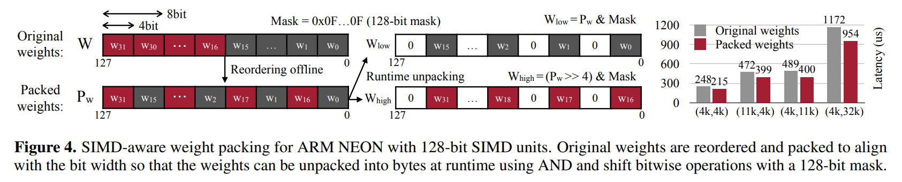

* 여기서 각 register 는 32 개의 4-bit weight 를 담고, $w0, w16, w1, w17, \ldots, w15, w31$ 순서로 배치된다. 
* 이 approach 는 conventional packing ($w0, w1, \ldots, w31$) 에서 weight 당 3 scalar instruction 이 필요한 것과 달리, 32 weight 를 모두 unpack 하는 데 단 3 개의 SIMD instruction 만 요구한다. 
* 일반적으로 $2^{n}$-bit SIMD register 에서, 인접 weight 는 index 가 $\frac{1}{8}\times 2^{n}$ 만큼 차이가 나는데, 각 register 가 $\frac{1}{8}\times 2^{n}$ 개의 8-bit integer 를 담을 수 있기 때문이다. 
* GPU 에서 저자는 $w_{0,2,4,6,1,3,5,7}$ 형태로 8 weight 를 packing 하는 것이 더 효율적임을 발견한다.

#### Kernel fusion. 

저자는 on-device LLM inference 를 최적화하기 위해 kernel fusion 을 광범위하게 적용한다. layer normalization 에 대해, 저자는 모든 operator (e.g., multiplication, division, square root) 를 single kernel 로 fuse 한다. 

* attention layer 에 대해, 저자는 QKV projection 을 single kernel 로 fuse 하고, on-the-fly positional embedding calculation 도 수행한다. * 또한 KV cache 를 pre-allocate 하고 attention kernel 내에서 cache update 를 수행한다. 
* kernel fusion 은 Falcon 및 StarCoder 처럼 forward pass implementation 이 비효율적인 model 에서 특히 유용하다. 

주목할 점은 4090 GPU 에서 각 FP16 kernel 의 computation time 이 0.01 ms 수준이며, 이는 GPU kernel launch overhead 와 comparable 하다는 것이다. 따라서 kernel fusion 을 통해 kernel call 수를 줄이면 direct speedup 으로 이어진다.

# 5 Experiments

## 5.1 Settings

#### Quantization. 

저자는 이 work 에서 weight-only grouped quantization 에 초점을 맞춘다. 기존 연구에서 보인 것처럼, grouped quantization 은 performance/model size trade-off 를 개선하는 데 항상 도움이 된다. 저자는 달리 명시되지 않는 한 group size 128 을 work 전반에서 사용했다. 

저자는 INT4/INT3 quantization 에 초점을 맞추는데, 이는 LLM performance 를 대부분 보존할 수 있기 때문이다. AWQ 를 위해, 저자는 특정 downstream domain 에 overfit 하지 않기 위해 Pile dataset 에서 작은 calibration set 을 사용했다. Eq. 5 에서 optimal $\alpha$ 를 탐색하기 위해 grid size 20 을 사용했다.

#### Models. 

저자는 LLaMA family 와 OPT family 에서 저자의 method 를 benchmark 했다. BLOOM 과 같은 다른 open LLM 도 있지만, 일반적으로 quality 가 더 나쁘므로 study 에 포함하지 않는다. 저자는 추가로 instruction-tuned model Vicuna 와 visual language model OpenFlamingo-9B 및 LLaVA-13B 를 benchmark 하여 저자의 method 의 generability 를 보인다.

#### Evaluations. 

기존 literature 를 따라, 저자는 주로 language modeling task (WikiText-2 에서 perplexity evaluation) 에서 quantized model 을 profiling 했는데, perplexity 가 LLM performance 를 안정적으로 반영할 수 있기 때문이다.

#### Baselines. 

저자의 primary baseline 은 vanilla round-to-nearest quantization (RTN) 이다. 이는 group size 128 같은 작은 group size 를 사용할 때 실제로 꽤 강하다. 저자는 또한 LLM weight quantization 을 위한 state-of-the-art method 인 GPTQ 와 비교한다. 

GPTQ 에 대해, 저자는 “reorder” trick 을 사용하는 updated version (GPTQ-Reorder 또는 GPTQ-R) 과도 비교한다. ZeroQuant, AdaRound, BRECQ 같은 다른 technique 은 quantized weight update 를 위해 backpropagation 에 의존하며, 이는 large model size 로 쉽게 scale up 하지 못할 수 있다. 또한 GPTQ 를 능가하지 못하므로 study 에 포함하지 않는다.

## 5.2 Evaluation

#### Results on LLaMA models. 

저자는 다른 open-source LLM 대비 superior performance 때문에 LLaMA model (LLaMA 및 Llama-2) 에 초점을 맞춘다. 또한 이는 많은 인기 open-source model 의 foundation 이다. 저자는 Tab. 4 에서 quantization 전후의 perplexity 를 평가한다. 

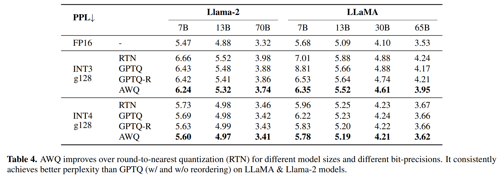

AWQ 는 서로 다른 model scale (7B–70B) 및 generation 전반에서 round-to-nearest (RTN) 및 GPTQ (reordering 유무 모두) 를 일관되게 능가한다.

#### Results on Mistral / Mixtral models. 

저자는 또한 Mistral 및 Mixtral model 에서 AWQ 를 평가했는데, 이들은 각각 가장 인기 있는 open-source LLM 과 Mixture-of-Experts (MoE) model 중 하나이다. 결과는 AWQ 가 Mistral 과 Mixtral 모두에서 superior performance 를 달성함을 나타낸다. 이는 AWQ 가 다양한 model architecture 전반에서 효과적임을 보여준다.

#### Quantization of instruction-tuned models. 

instruction tuning 은 model performance 와 usability 를 크게 개선할 수 있다. 이는 model deployment 전의 essential procedure 가 되었다. 저자는 Fig. 5 에서 인기 instruction-tuned model Vicuna 에 대한 저자의 method performance 를 추가로 benchmark 한다. 

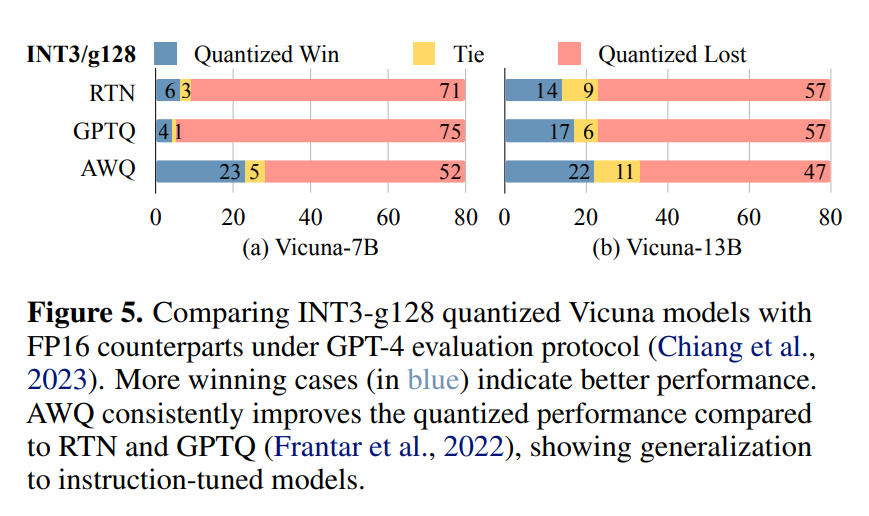

* 저자는 80 개 sample question 에 대해 FP16 counterpart 대비 quantized model performance 를 평가하기 위해 GPT-4 score 를 사용했다. 
* 저자는 ordering effect 를 제거하기 위해 두 order (quantized-FP16, FP16-quantized) 모두로 response 를 비교했는데 (저자는 GPT-4 가 첫 input 의 rating 을 높이는 경향이 있음을 발견했다), 그 결과 160 trial 이 된다. 
* AWQ 는 두 scale (7B 및 13B) 모두에서 INT3-g128 quantized Vicuna model 을 RTN 및 GPTQ 대비 일관되게 개선하며, instruction-tuned model 로의 generability 를 보여준다.

#### Quantization of multi-modal language models. 

large multi-modal model (LMMs) 또는 visual language model (VLMs) 은 vision input 으로 확장된 LLM 이다. 이러한 model 은 image/video input 에 conditioned 된 text generation 을 수행할 수 있다. 저자의 method 는 calibration set 에 대한 overfitting issue 가 없기 때문에, VLM 에 직접 적용되어 accurate 하고 efficient 한 quantization 을 제공할 수 있다. 저자는 COCO captioning dataset (Tab. 6) 에서 OpenFlamingo-9B model (open-source reproduction) 로 experiment 를 수행한다. 

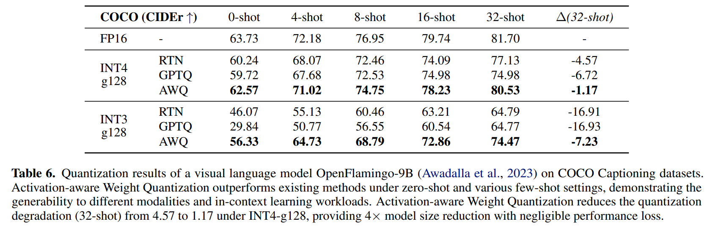

* 저자는 서로 다른 few-shot setting 하에서 5k sample 의 average performance 를 측정했다. 
* 저자는 model size 를 지배하는 language part 만 quantize 한다. AWQ 는 zero-shot 및 다양한 few-shot setting 하에서 기존 method 를 능가하며, 서로 다른 modality 및 in-context learning workload 로의 generability 를 보인다. 
  * 이는 INT4-g128 하에서 quantization degradation (32-shot) 을 4.57 에서 1.17 로 줄이며, negligible performance loss 로 4× model size reduction 을 제공한다. 
* AWQ 의 generability 를 더 보이기 위해, 저자는 SoTA multi-image visual language model 중 하나인 VILA 에서도 AWQ 를 평가했다. 

Tab. 7 의 결과는 AWQ 가 11 개 visual-language benchmark 에서 lossless quantization performance 를 달성함을 보여준다. 

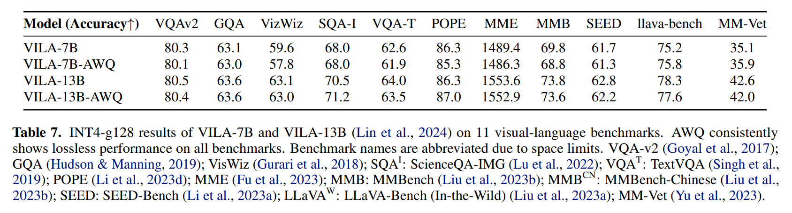

저자는 또한 Fig. 7 에서 RTN 대비 저자의 장점을 보이기 위해 일부 qualitative captioning result 를 제공한다. 

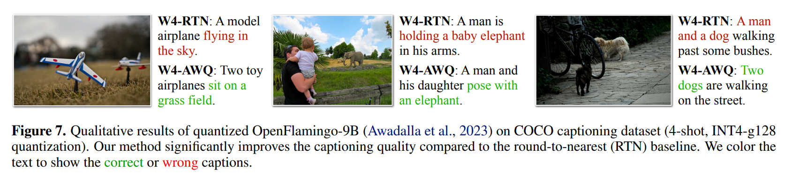

저자의 method 는 LMM/VLM quantization 을 위한 push-the-button solution 을 제공한다. 저자의 지식에 따르면, 이는 VLM low-bit quantization 에 대한 첫 study 이다.

#### Visual reasoning results. 

저자는 Fig. 6 에서 LLaVA-13B model 의 qualitative visual reasoning example 도 추가로 제공한다. 

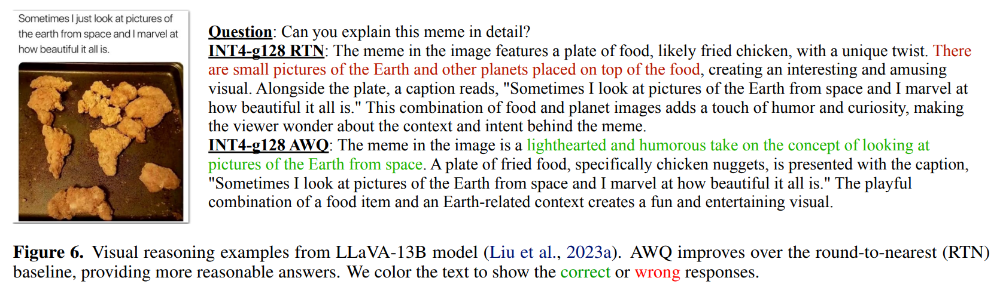

* AWQ 는 INT4-g128 quantization 에서 round-to-nearest (RTN) 대비 response 를 개선하여 더 reasonable 한 answer 로 이어진다. 
* 첫 번째 example 에서, AWQ model 은 space 에서 Earth 를 볼 때와 유사하다는 점에서 meme 을 이해할 수 있지만, RTN 은 잘못된 description 을 생성한다 (red 로 표시됨).

#### Results on programming and math tasks.

complex generation 이 포함된 task 에서 AWQ performance 를 더 평가하기 위해, 저자는 MBPP 와 GSM8K 에서도 AWQ 를 test 했다. MBPP 는 약 1,000 개의 Python programming problem 으로 구성되며, entry level programmer 가 풀 수 있도록 설계되었고 programming fundamental, standard library functionality 등을 포함한다. 

GSM8K 는 multi-step reasoning 이 필요한 basic math problem 에 대한 question answering task 를 지원하기 위해 만들어졌다. 저자는 CodeLlama-7b-Instruct-hf 와 Llama-2 를 INT4-g128 로 quantize 하고 programming 및 math dataset (Tab. 8) 에서 experiment 를 수행한다. 

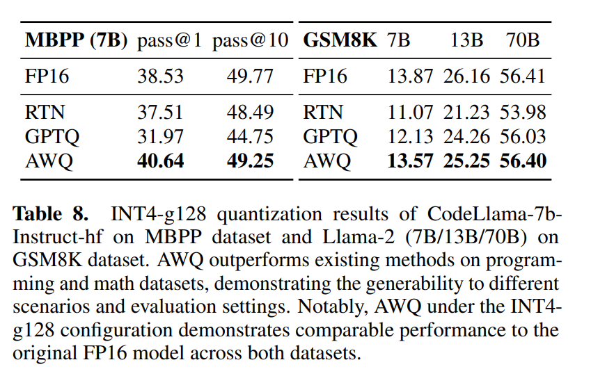

AWQ 는 두 dataset 모두에서 기존 method 를 능가하며, complex generation 으로의 generability 를 보인다. INT4-g128 configuration 에서 AWQ 는 두 dataset 모두에서 original FP16 model 과 comparable performance 를 보여준다.

#### Extreme low-bit quantization. 

저자는 제한된 device memory 를 수용하기 위해 LLM 을 INT2 로 추가 quantize 한다 (Tab. 9). 

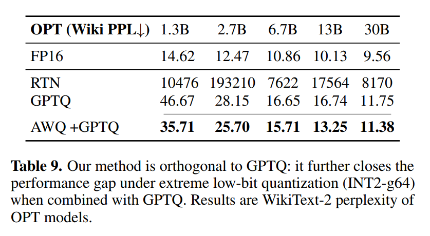

* RTN 은 완전히 실패하며, AWQ 는 GPTQ 위에 상당한 perplexity improvement 를 가져온다. 저자의 method 는 GPTQ 와 orthogonal 하다. 
* 저자는 저자의 method 를 GPTQ 와 결합하여 INT2 quantization performance 를 추가로 개선할 수 있으며, 이를 더 practical setting 으로 만들 수 있다.

## 5.3 Data Efficiency and Generalization

#### Better data-efficiency for the calibration set. 

저자의 method 는 regression/backpropagation 에 의존하지 않기 때문에 더 작은 calibration set 을 요구한다. 저자는 calibration set 에서 average activation scale 만 측정하며, 이는 data-efficient 하다. 

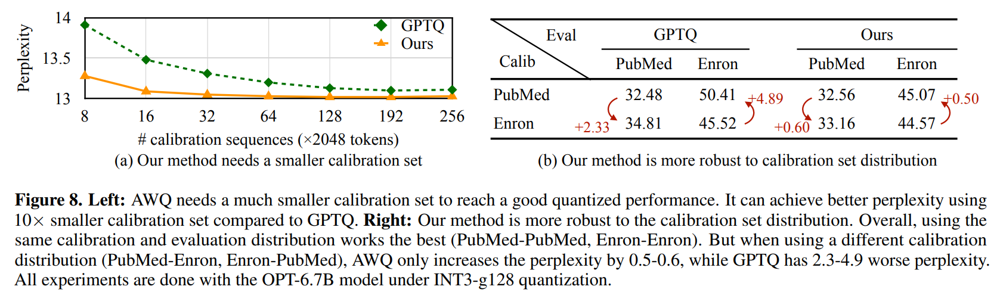

* 이 아이디어를 보이기 위해, 저자는 Fig. 8(a) 에서 OPT-6.7B model 의 INT3-g128 quantization 에서 perplexity 를 비교한다. 
* AWQ 는 좋은 quantized performance 에 도달하기 위해 훨씬 더 작은 calibration 이 필요하다. 
* GPTQ 대비 10× smaller calibration set (16 sequence vs. 192 sequence) 을 사용해 더 나은 perplexity 를 달성할 수 있다.

#### Robust to the calibration set distributions. 

저자의 method 는 calibration set distribution 에 덜 민감한데, calibration set 에서 average activation scale 만 측정하기 때문이며, 이는 서로 다른 dataset distribution 에서 더 generalizable 하다. 저자는 Fig. 8(b) 에서 서로 다른 calibration set distribution 의 effect 를 추가로 benchmark 했다. 저자는 Pile dataset 에서 PubMed Abstracts 와 Enron Emails 의 두 subset 을 취했다. 저자는 각 subset 을 calibration set 으로 사용하고, quantized model 을 두 set 모두에서 평가한다 (calibration set 과 evaluation set 은 overlap 없이 split 되며, evaluation 에 1k sample 을 사용했다). 전반적으로, 동일한 calibration 과 evaluation distribution 을 사용하는 것이 가장 잘 동작한다 (PubMed-PubMed, Enron-Enron). 그러나 다른 calibration distribution 을 사용할 때 (PubMed-Enron, Enron-PubMed), AWQ 는 perplexity 를 0.5–0.6 만 증가시키는 반면, GPTQ 는 2.3–4.9 더 나쁜 perplexity 를 가진다. 이는 calibration set distribution 에 대한 AWQ robustness 를 보여준다.

## 5.4 Speedup Evaluation

#### Settings. 

Fig. 9 에서 저자는 TinyChat 의 system acceleration result 를 보인다. TinyChat 은 linear layer 와 quantized weight 가 없는 layer 를 모두 최적화한다. 

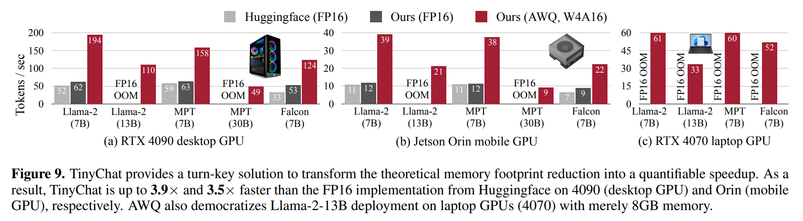

* 저자는 exllama 에서 설명된 protocol 을 따라 RTX 4090 과 Jetson Orin 에서 benchmarking experiment 를 수행한다. 
* 저자는 모든 LLM 에 대해 batch size $= 1$ inference 를 fixed prompt length 4 token 으로 수행한다. 
* 저자는 각 inference run 에 대해 200 token 을 generate 하고, median latency 를 최종 result 로 계산한다.

#### Results. 

Fig. 9(a) 와 같이, TinyChat 은 4090 에서 Huggingface FP16 implementation 대비 3 개 LLM family (Llama-2, MPT, Falcon) 에 2.7–3.9× speedup 을 제공한다. 

* Llama-2-7B 에 대해, 저자는 FP16 kernel fusion 으로 inference speed 를 52 tokens/s 에서 62 tokens/s 로 개선한다. 
* stronger FP16 baseline 위에서, 저자는 빠른 quantized linear kernel 로부터 3.1× additional speedup 을 추가로 얻는다. 
* Falcon-7B 에 대해, official implementation 은 inference 동안 KV cache 를 올바르게 지원하지 못했으므로, 다른 model 대비 훨씬 느리다. 
  * 이 경우 저자의 FP16 optimization 은 1.6× 의 더 큰 speedup 을 가져온다. 
* memory 가 8 GB 뿐인 laptop 4070 GPU 에서도, 저자는 Llama-2-13B model 을 33 tokens/s 로 실행할 수 있는데, FP16 implementation 은 7B model 도 fit 하지 못한다. 저자는 또한 Tab. 10 에서 visual-language model acceleration result 를 보인다. 

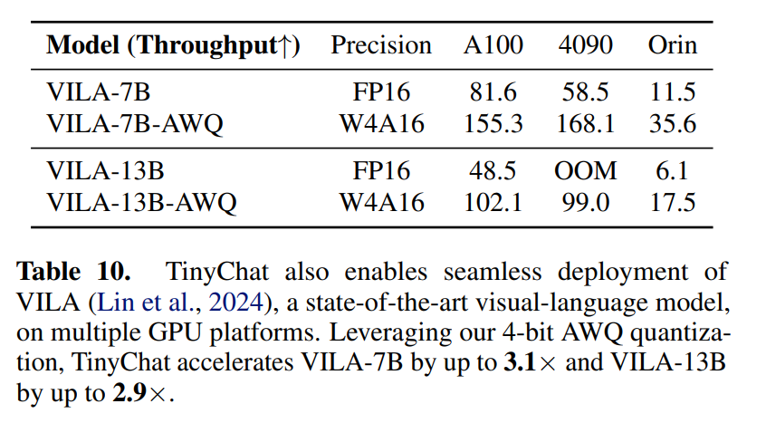

* TinyChat 은 NVIDIA Jetson Orin 에서 VILA-7B 와 VILA-13B 모두에 약 3× speedup 을 가져온다. 
* 주목할 점은, 저자는 모든 AWQ model 에 대한 forward pass 를 native PyTorch API 로 구현하며, 이 code 는 다양한 GPU architecture 에서 재사용된다는 것이다. 따라서 TinyChat 은 exceptional extensibility 를 제공한다.

#### Comparisons against other systems. 

저자는 Fig. 10 에서 TinyChat 을 기존 edge LLM inference system 인 AutoGPTQ, llama.cpp, exllama 와 비교한다. 

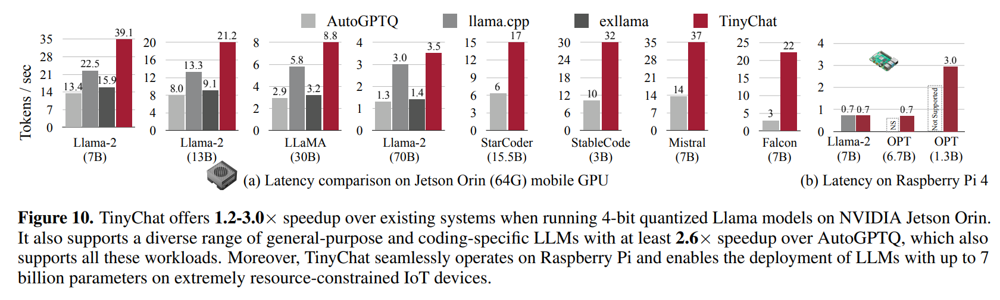

* 저자의 system 은 Orin 에서 llama.cpp 대비 최대 1.7× speedup 을 달성한다. 
* 더 나아가 llama.cpp 와 exllama 는 adaptability 가 제한적이며, 주로 LLaMA 및 Llama-2 model 에 맞춰져 있다. 
* 반면 TinyChat 은 StarCoder, StableCode (GPTNeoX), Mistral, Falcon 을 포함한 광범위한 application 을 지원하면서 AutoGPTQ 대비 일관되게 유의미한 speedup 을 제공한다. 
* TinyChat 은 심지어 resource-constrained Raspberry Pi 4B 에서도 LLM deployment 를 democratize 하여, 7B model 에 대해 0.7 tokens/s 를 달성한다.

# 6 Conclusion

이 work 에서 저자는 low-bit weight-only LLM compression 을 위한 단순하지만 효과적인 method 인 Activation-aware Weight Quantization (AWQ) 를 제안한다. 

LLM 에서 weight 가 동일하게 중요하지 않다는 관찰에 기반하여, AWQ 는 salient weight 의 quantization loss 를 줄이기 위해 per-channel scaling 을 수행한다. AWQ 는 calibration set 에 over-fit 하지 않으며, 다양한 domain 과 modality 에서 LLM generalist ability 를 보존한다. 이는 language modeling 에서 기존 연구를 능가하며, instruction-tuned LM 및 multi-modal LM 에 적용 가능하다. 저자의 TinyChat system 은 AWQ 로 달성된 이론적 memory saving 을 desktop 및 mobile GPU 에서 Huggingface FP16 implementation 대비 3.2–3.3× 측정 speedup 으로 추가 변환하여, edge 에서 LLM deployment 를 democratize 한다.

