논문 및 이미지 출처 : <https://arxiv.org/pdf/2306.02272>

# Abstract

수백 billion parameters 를 가진 large language models (LLMs) 는 inference 를 위해 강력한 server-grade GPUs 를 필요로 하며, 이는 실용적 deployment 를 제한한다. 이 challenge 를 해결하기 위해, 저자는 low-precision representation 을 통해 LLM 의 footprint 를 최소화하는 것을 목표로 하는 **outlier-aware weight quantization (OWQ)** method 를 소개한다. 

* OWQ 는 quantization 에 민감한 structured weights 의 small subset 을 우선시하여 이를 high-precision 으로 저장하고, 나머지 dense weights 에는 highly tuned quantization 을 적용한다. 
* 이 sensitivity-aware mixed-precision scheme 은 quantization error 를 눈에 띄게 줄이며, 광범위한 experiments 는 OWQ 를 사용한 3.1-bit models 이 OPTQ 로 최적화된 4-bit models 과 유사한 성능을 보인다는 것을 보여준다. 
* 또한 OWQ 는 task-specific adaptation 을 위한 parameter-efficient fine-tuning 인 **weak column tuning (WCT)** 를 통합하여, optimized format 에서 최소한의 memory overhead 로 정확한 task-specific LLM adaptation 을 가능하게 한다. 
* OWQ 는 LLM optimization literature 의 flexibility, efficiency, practicality 측면에서 주목할 만한 advancement 를 나타낸다.

# Introduction

large language models (LLMs) 은 광범위한 복잡한 language tasks 에서 인상적인 generation performance 를 보여주며, LLM 기반 applications 의 폭발적 성장을 촉발한다. 그러나 방대한 memory 및 computation 요구는 training 뿐 아니라 inference 에서도 LLMs 의 광범위한 사용에 대한 주요 장애물이다. 예를 들어, fp16 을 사용할 때 GPT3-175B model 은 model parameters 를 저장하는 데만 약 330 GB 의 공간이 필요하며, 이는 결국 multiple server-grade GPUs 로 system 을 구축하는 데 수십만 달러의 비용이 든다. LLMs 의 광범위한 채택을 위해서는 이러한 serving costs 를 최소화하는 것이 중요하다.

최근 weight quantization 은 LLMs 를 위한 매력적인 optimization method 로 부상했다. 

* parameters 를 low-precision representation 으로 저장함으로써 storage space 를 상당히 절약할 수 있으며, 이는 memory bottlenecks 및 reduced communication costs 를 해결하여 performance benefits 도 도입한다. 
* advanced studies 는 3-bit weight 와 fp16 activation 을 사용하는 matrix multiplication 이 single GPU 에서 fp16 weight 및 activation 을 multiple GPUs 에서 사용하는 경우와 비교해 현저한 performance improvements 를 보인다는 것을 보여주었다. 
* LLMs 의 weight quantization 은 LLMs 의 memory 및 performance issues 를 공동으로 해결할 수 있다.

이전에 OPTQ, 즉 GPTQ 는 optimal brain compression (OBC) algorithm 에 기반한 layer-wise post-training quantization (PTQ) method 를 소개했다. 

* 특히 compressed 3-bit OPT-175B model 은 fp16 OPT-30B model 보다 더 높은 성능을 보이는데, 두 model 은 유사한 memory footprints 를 가진다. 
* compressed model 은 이제 약 63 GB 를 차지하여 single A100 GPU 에서 deployment 가 가능하다. 그러나 개선의 여지가 있다. 
* OPT-175B 는 3-bit quantization 에서 여전히 일부 degradation 을 경험하며, 이 effect 는 더 작은 models 에서 더 두드러진다. 
* 다양한 model sizes 가 서로 다른 scenarios 에 최적이라는 점을 고려하면, 그 accuracy 를 유지하는 것은 매우 중요하다.

한편, weight quantization 은 task-specific fine-tuning 으로도 application 을 확장한다. 

* 예를 들어 QLoRA 는 quantized LLMs 를 target tasks 에 대해 fine-tuning 할 수 있게 하며, 이를 위해 quantized dense matrix 에 low-rank high-precision tensors 를 통합한다. 
  * 이 과정에서 added tensors 만 update 되고, quantized path 는 변하지 않은 채로 유지된다. 
  * 이 method 는 reduced memory consumption 으로 efficient fine-tuning 을 가능하게 하면서, fine-tuning 동안 quantization errors 라는 drawback 을 완화할 수 있기 때문에 주목을 받고 있다. 
* 그러나 low-precision dense matrix 의 quality 는 종종 간과되는데, 이는 suboptimal quality 가 fine-tuning 의 benefits 를 감소시킬 수 있음에도 불구하고 그렇다. 
* adaptation 을 위해서도 high-quality weight quantization 은 필수적이다.

본 논문에서 저자는 **Outlier-aware Weight Quantization (OWQ)** 라는 새로운 weight quantization technique 를 소개한다. 

* OWQ 는 LLMs 의 고유한 characteristics, 즉 activation outliers 의 존재를 고려하여 특별히 설계되었다. 
* 저자의 analysis 는 이러한 outliers 가 weight quantization 의 quality degradation 에서 핵심적인 역할을 한다는 것을 드러낸다. 
* 이 finding 에 기반하여, 저자는 각 weight column 의 sensitivity 를 고려하는 mixed-precision quantization 을 적용하는 OWQ 를 설계한다. 
* 광범위한 analysis 는 3.1-bit OWQ model 이 4-bit OPTQ model 과 comparable quality 를 가진다는 것을 보여준다.

또한 저자는 OWQ 에 기반한 효과적인 fine-tuning method 인 Weak Column Tuning (WCT) 를 소개한다. 

* 이는 fine-tuning 및 inference 동안 OWQ 의 benefit 을 공유하므로, network 가 minimal memory overhead 로 target task 로 update 될 수 있고 inference 동안 accelerated 된다. 
* 더 나아가 WCT 기반 fine-tuning model 은 기존 methods 보다 fewer trainable parameters 로 adaptation 하며, OWQ 로 quantized 된 weights 의 superior representation quality 때문에 기존 methods 를 outperforms 한다. 
* 저자의 지식으로는, 이는 extremely low-precision weight quantization 에서 activation outliers 의 존재를 고려하고 이를 fine-tuning 과 긴밀히 통합한 최초의 study 이다.

# Background and Related Works

## Quantization and LLMs

quantization 은 network 의 quality 를 유지하면서 low-precision 의 benefit 을 활용하는 것을 목표로 하는 널리 사용되는 optimization technique 이다. primary benefit 이 size reduction 인 반면, quantization 은 low-precision operations 지원을 통해 performance 를 크게 accelerate 할 수도 있다. 그러나 trade-off 가 존재한다. 

quantization 은 quality degradation 으로 이어질 수 있으며, 수많은 studies 가 이를 해결하는 것을 목표로 해왔다. 초기 studies 는 additional training 을 통해 quality 를 복원하려는 quantization-aware training (QAT) 에 초점을 맞추었다. 그러나 quantization 에 대한 이해가 성장하고 다양한 techniques 가 등장하면서, training 없이도 quality preservation 을 가능하게 하는 post-training quantization (PTQ) 이 활발히 연구되었다.

LLM 은 상당한 storage space 와 computational resources 를 필요로 하기 때문에, quantization 을 통한 optimization 을 적용하는 것이 중요하다. 일반적으로 QAT 는 quantization error 를 최소화하기 위해 extremely low-bit precision 에서 선호되어 왔다. 그러나 training environment 의 high cost 때문에 LLM quantization 에서는 덜 선호된다. 대신 PTQ 가 LLM quantization 에서 중요한 topic 으로 부상했다. 이 field 에는 두 가지 뚜렷한 approaches 가 있다. 

하나는 capacity reduction 과 acceleration 을 모두 고려하여 activations 와 weights 를 모두 int8 로 quantize 하는 접근이다. 반면 두 번째 접근은 weights quantization 만 sub-4-bit precision 으로 수행하는 데 집중한다. 본 논문에서 저자는 후자의 접근과 alignment 한다. weight quantization 에 집중하면서도, 저자는 activation quantization 에 관한 int8 관련 research 로부터 중요한 inspiration 을 받아 novel quantization scheme 을 고안한다.

## Int8 Quantization for Activation and Weight

int8 multiplication 은 fp16 baselines 와 비교해 최대 2x 의 performance improvements 와 5x 를 넘는 energy consumption reduction 을 제공할 수 있다. 수많은 studies 는 LLMs 의 matrix multiplication operations 에서 activation 과 weight 를 모두 int8 로 quantize 하는 것을 목표로 한다. 그러나 이러한 studies 는 activation quantization 에서 LLMs 의 unique challenge 를 확인한다. 

LLMs 는 intermediate activations 에서 다른 값들보다 훨씬 큰 values 를 가지는 소수의 outliers 를 보이며, 이러한 outliers 는 특정 feature dimensions 에 집중된다. 이러한 outliers 의 values 를 보존하는 것은 activation quantization 이후 accuracy 를 유지하는 데 중요하다고 알려져 있다.

본 study 에서는 weight quantization 만 적용하지만, activation outliers 의 존재가 여전히 weight quantization 의 sensitivity 에 영향을 미친다는 것을 확인한다. 또한 activation outliers 를 고려하는 것이 accurate weight quantization 에 필수적임을 보여준다.

## OPTQ: Weight Quantization for LLMs

OPTQ 는 LLMs 를 위한 weight quantization field 에서 state-of-the-art research 이다. 이는 Optimal Brain Compression (OBC) 에 기반하며, layer-wise quantization errors 에 대한 Hessian-based metric 을 사용해 element-wise quantization (pruning) 및 compensation 을 수행한다 (Eq. (1) 및 Eq. (2)). 이 approach 는 straight-through estimator 에 기반한 gradient descent 를 통해 quantization 을 적용하거나 rounding-to-nearest mechanism 을 적용한 previous studies 와 다르다.

$$
w_q = \arg\min_{w_q}\frac{(\text{quant}(w_q)-w_q)^2}{[H_F^{-1}]_{qq}},
$$

$$
\delta_F=-\frac{w_q-\text{quant}(w_q)}{[H_F^{-1}]_{qq}}\cdot (H_F^{-1})_{:,q}
$$

OPTQ 는 output channel dimension 의 각 element 에 대해 quantization 을 parallelize 하도록 OBC 를 optimized 하여 rapid quantization 을 가능하게 한다. 이는 LLMs 에서 sub-4-bit quantization 의 potential 을 보여주지만, model size 를 줄이거나 problem’s complexity 를 증가시키면 fp16 baselines 와 비교해 accuracy 가 감소한다. 

본 논문에서 저자는 activation outliers 로 인해 quantization 에 vulnerable 한 weights 에 selectively high-precision 을 적용하고, 나머지 weights 에는 additional error reduction 을 위한 quantization configuration tuning 에 기반한 modification 과 함께 OPTQ 를 적용할 것을 제안한다. 이러한 enhancements 는 OPTQ 의 quantization speed 를 유지하면서 quantization error 를 크게 줄일 수 있다.

## Parameter-Efficient Fine-Tuning (PEFT)

specific tasks 를 위한 LLMs 의 fine-tuning 은 unseen 또는 complex tasks 에서 performance 를 향상시킬 수 있지만, parameters 수가 매우 크기 때문에 hyperscale computation system 을 요구하며 이는 high costs 때문에 종종 impractical 하다. 따라서 이러한 문제를 해결하기 위해 Parameter-Efficient Fine-Tuning (PEFT) schemes 가 소개되었다. 

* LoRA 는 pre-trained weights 를 freezing 하는 대신 low-rank decomposition 을 통해 learnable parameters 의 작은 fraction 을 통합함으로써 PEFT 를 exemplify 한다. 
  * added parameters 만 update 되므로, LoRA 는 훨씬 적은 memory 로 adaptation 될 수 있다. 
* QLoRA 는 dense weights 를 quantized weights 로 대체하여 memory consumption 을 추가로 줄이고 fine-tuning process 를 더 lightweight 하게 만든다. 
* fine-tuning 은 quantization errors 를 완화할 수 있으므로, QLoRA 는 practical 하고 task-specific deployment 를 위한 바람직한 optimization 으로 부상한다. 

본 study 에서 저자는 OWQ-compatible PEFT scheme 을 소개한다. OWQ 의 superior representation quality 는 QLoRA 보다 낮은 resource overhead 로 PEFT 이후 exceptional performance 를 산출한다.

# Problem Definition and Motivation

이 section 에서 저자는 idea 를 소개하기 전에, 먼저 problem 을 정의하고 findings 를 명확히 설명한다. 제안된 OWQ 는 minimal quality degradation 으로 LLMs 의 weights 에 대해 layer-wise uniform quantization 을 적용하도록 설계된다. 

input feature $X \in \mathbb{R}^{C_{in}\times N}$ 이 주어졌다고 하자. 여기서 $C_{in}$ 은 input channels 의 수를 나타내고 $N$ 은 input 의 sequence length 이다. $C_{out}$ 개의 output features 를 위한 full-precision weight matrix $W \in \mathbb{R}^{C_{out}\times C_{in}}$ 는 quantization 전후의 output activations 차이를 최소화하도록 low-precision 으로 mapping 된다. 

squared error 를 최소화하는 quantized weight $\hat{W}$ 를 찾기 위한 objective function 은 다음과 같이 정의된다:

$$
\arg\min_{\hat{W}} E = \arg\min_{\hat{W}} \lVert WX-\hat{W}X\rVert_2^2
\quad \text{s.t.}\quad C(\hat{W}) < C_t,
\tag{3}
$$

* 여기서 $C(\cdot)$ 는 compression ratio 를 나타내고 
* $C_t$ 는 target compression ratio 이다. 
* layer-wise quantization process 는 model input 에서 output 으로 sequentially 적용되어, model 내의 모든 weights 가 quantized 되도록 보장한다. 
* 저자는 embedding 및 head weights 는 full-precision 으로 유지한다.

## Layer-wise Quantization and Hessian of Weights

이 subsection 에서 저자는 quantization context 에서 weight sensitivity 와 activation outliers 사이의 relationship 에 관한 insight 를 설명한다. 즉, activation outliers 와 연결된 weights 는 특히 quantization 에 취약하다는 것이다. 이러한 이해가 OWQ 의 core motivation 이 된다.

처음에 저자는 Eq. (3) 의 squared error term 을 restructure 하여, weight matrix 내 각 output channel 에 대한 squared errors 의 sum 으로 나타낸다. 그 결과는 $\sum_{i=1}^{C_{out}} \lVert W_{i,:}X-\hat{W}_{i,:}X\rVert_2^2$ 이다. 이 

decomposition 은 overall error 가 각 output channel 에 대한 individual errors 로 분해된다는 점을 분명히 보여준다. modified equation 을 통해, 저자의 focus 는 두 가지 key aspects 로 이동한다.

첫째, output channels 간 Hessian interaction 이 없다는 점이 중요하다. 구체적으로, layer-wise quantization error 에 대한 individual Hessians 는 $H^{(i)} \in \mathbb{R}^{C_{in}\times C_{in}}$ 로 표기되며, 다음과 같이 동일한 값을 가진다:

$$
H^{(i)} = H
= \frac{\partial^2 E_i}{\partial W_{i,:}^2}
= 2XX^T.
\tag{4}
$$

둘째, previous studies 에서 관찰된 것처럼, individual error term 은 Taylor expansion 을 사용해 근사될 수 있다. $\Delta W_{i,:} = W_{i,:}-\hat{W}_{i,:}$ 로 두면, $i$-th output channel 에 대한 error 는 다음과 같이 표현된다:

$$
E_i=\lVert W_{i,:}X-\hat{W}_{i,:}X\rVert_2^2 \approx \Delta W_{i,:} H \Delta W_{i,:}^T.
\tag{5}
$$

detailed proof 는 appendix 를 참고하라고 한다. 이 equation 은 layer-wise quantization context 에서 output error 가 Hessian 과 weight perturbation magnitude 에 직접적으로 관련됨을 보여준다.

이 observations 를 염두에 두고, 저자는 LLMs 에 activation outliers 가 존재한다는 사실을 인정함으로써 흥미로운 insight 를 도출할 수 있다고 말한다. previous studies 는 LLM activation 의 특정 feature dimensions 가 다른 값들보다 훨씬 큰 values 를 가진 outliers 를 포함한다고 보고했다. 

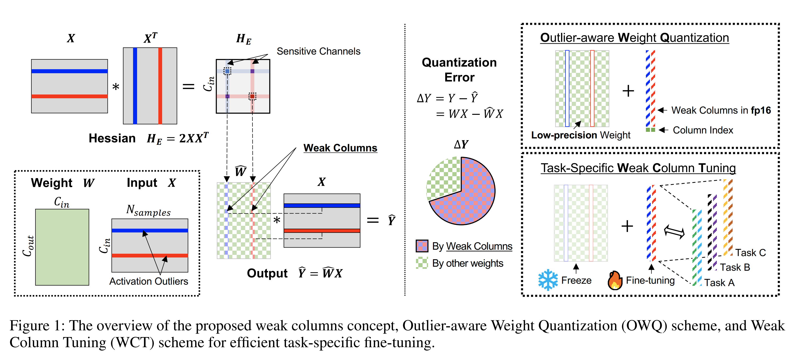

* Fig. 1 Left 에서 보이듯이, 이러한 activation outliers 는 $H$ 의 일부 elements 가 exceptionally high values 를 갖게 만든다. 
* Hessian values 의 이러한 abnormal surge 는 해당 weight channels 의 quantization 에 대한 sensitivity 를 증가시킨다. 
* 구체적으로 Eq. (5) 에서 나타나듯이, 동일한 정도의 weight perturbation 이 존재하더라도, $H$ 의 일부 large elements 때문에 output 의 ensuing change 는 상당히 더 커질 수 있다. 
* 저자는 quantization 에 취약한 weights 를 weak column 이라고 부르며, 구체적으로는 특정 input channel 에서 activation outliers 와 연관된 weights 를 의미한다.

따라서 weight quantization process 동안 모든 weights 를 동일한 bit-width 로 quantize 하면, activation outliers 에 대응하는 weak columns 에서 발생하는 quantization error 가 output 에 큰 perturbation 을 유발할 수 있고, 그 결과 notable quantization error 로 이어질 수 있다. 

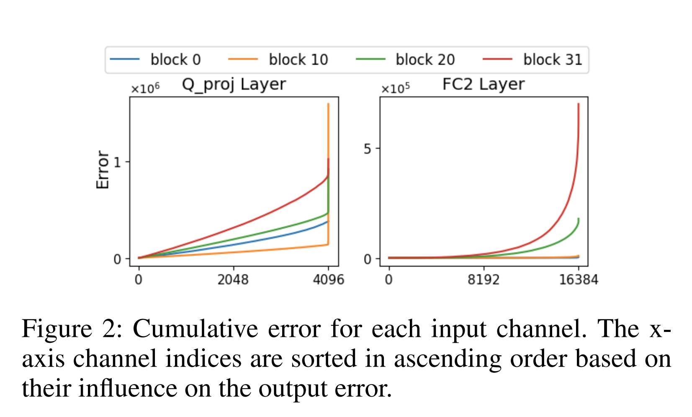

* Fig. 2 는 이러한 주장을 지지하며, error 의 큰 부분이 제한된 수의 channels 에서 기인하고, 이는 weak columns 와 align 한다고 나타낸다. weak columns 로부터의 error 를 최소화하기 위해서는, 이러한 columns 를 특별히 다루는 것이 필수적이다.

# OWQ: Outlier-aware Weight Quantization

이 issue 를 해결하기 위해, 저자는 Outlier-aware Weight Quantization (OWQ) 라는 novel concept 를 소개한다. OWQ 는 두 단계로 구성된다. 먼저 weak columns 를 식별하고 이들을 quantization 에서 제외한다. 그 다음 남은 weights 를 극단적으로 low-precision 으로 quantize 하는데, 이때 정교하게 tuned 된 quantization parameters 를 사용한다. 제안된 OWQ scheme 의 overview 는 Fig. 1 Left 에 제시되어 있다. 이 section 에서 저자는 OWQ implementation 의 details 를 철저히 논의한다.

Eq. (4) 에서 저자는 Hessian matrix 와 activation outliers 로 인해 발생하는 sensitivity 사이의 relationship 을 강조했다. 또한 Eq. (5) 에서 final error 가 Hessian matrix 와 함께 perturbations 의 quadratic terms 에 의해 영향을 받는다는 것을 보였다. 이러한 insights 에 기반하여, 저자는 $j$-th weight column 의 sensitivity 를 다음과 같이 정의한다:

$$
\text{sensitivity}_j = \lambda_j \lVert \Delta W_{:,j}\rVert_2^2,
\tag{6}
$$

* 여기서 $\lambda_j$ 는 Hessian matrix 의 $j$-th diagonal element 이다. 
* individual columns 의 sensitivity 를 분석함으로써, 저자는 quantization 에 취약하여 higher precision 을 필요로 하는 weak columns 를 효과적으로 식별할 수 있다. 
* 목표가 특정 개수 $(k)$ 의 weak columns 를 선택하는 것이라면, 제안된 metric 을 사용해 sensitivity values 에 기반하여 top-$k$ sensitive columns 를 선택한다.

hessian-based metrics 는 previous studies 에서 자주 사용되어 왔다는 점을 언급할 가치가 있다. 저자의 work 는 quantization domain 의 granularity 와 detailed expression 에서 distinctive difference 가 있지만, 저자의 observation 은 기존 studies 의 intuition 과 잘 align 한다.

weak columns selection 이후, remaining weights 는 low-precision 으로 quantized 된다. 어떤 low-precision quantization scheme 이든 적용 가능하지만, 저자는 OPTQ 를 사용한다. OPTQ 또한 sequential column-wise quantization 을 사용하므로, weak columns 를 제외한 weights 는 OPTQ framework 에 seamless 하게 통합될 수 있다. 

또한 weak columns 는 OPTQ process 동안 발생하는 errors 를 더 완화하는 데 사용될 수 있다는 점에 주목하라. OPTQ 는 Eq. (2) 에서 보이듯이 current step 에서 weight columns 를 quantizing 하면서 발생하는 errors 를 compensate 하기 위해, remaining unquantized weights 를 update 한다. OPTQ 를 사용하기 전에 high-precision weak columns 를 weight 의 end 로 rearrange 하면, OPTQ process 동안 다른 columns 에서 발생하는 quantization errors 가 weak columns 에 의해 크게 compensated 될 수 있다. weak columns 는 full-precision 으로 유지되므로, 다른 모든 columns 가 quantized 되더라도 이러한 compensated values 는 보존될 수 있다.

weak columns 를 식별하고 remaining weights 를 quantizing 한 뒤, 저자는 weak columns 를 fp16 으로 저장하고 column 당 extra single integer 를 사용한다. 이 integer 는 weak columns 의 column index 를 나타낸다. 또한 저자는 weak columns positions 가 zero-filled 된 low-precision matrix 를 저장한다. 따라서 OPTQ 와 비교할 때, additional storage overhead 는 weak columns 로 인해 발생하는 것뿐이다. 이 overhead 는 negligible (≈ 0.3%) 이지만, accuracy 는 크게 개선된다. 

또한 저자는 real GPU 에서 OWQ format 을 위한 specialized acceleration 도 제공한다. implementation 에 대한 comprehensive explanation 은 “Acceleration on Real Device” section 에서 제공된다고 한다.

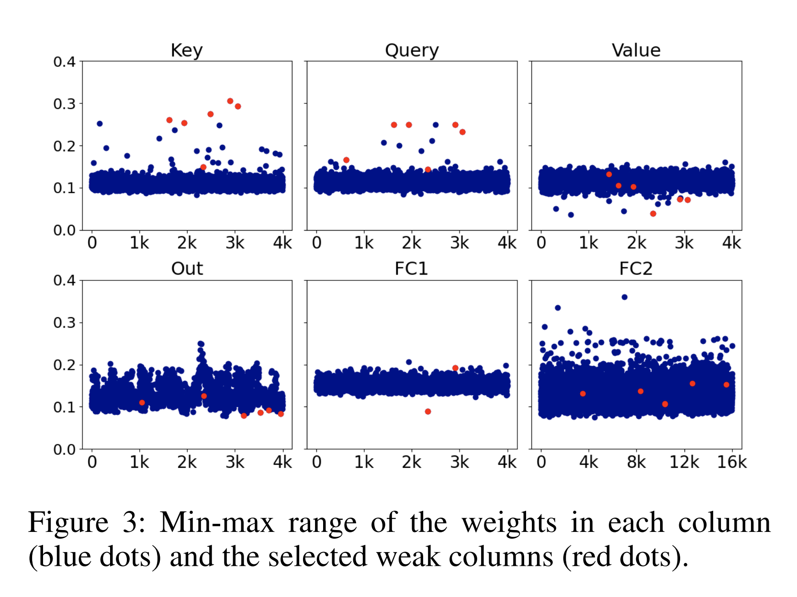

* 추가로, Fig. 3 에서 보이듯이, 저자의 approach 는 기존 outlier-aware quantization studies 와 뚜렷하게 다르다. 
* naming 은 유사하지만 outcome 은 완전히 다르다. 해당 studies 에서는 quantization 전후의 weights error 를 최소화하기 위해 magnitude 만을 기준으로 outlier weights 를 quantization 에서 제외한다. 
* 그러나 저자의 method 는 output activation 의 error 를 최소화한다. figure 에서 보이듯이, weights 는 magnitude 가 아니라 sensitivity 에 기반해 선택된다.

## Quantization Configuration Search

저자는 weak columns 를 제외한 dense weights 의 quantization 에 OPTQ 를 사용한다고 언급했다. 그러나 quantization error 를 추가로 줄이기 위해 OPTQ 에 중요한 modification 을 적용했다. 

* OPTQ 는 원래 straightforward min-max quantization approach 에 의존하지만, 저자는 truncation 의 benefits 를 통합했다. 
* 많은 previous studies 는 truncation 이 overall quantization error 를 크게 줄여 output 의 quality 를 크게 개선한다고 지적했다. 
* OWQ 에서 저자는 quantization range 를 좁히기 위해, step size 와 zero point 같은 quantization configurations 를 simple 2D grid search 로 search 했다. 
* quantization 전후의 difference 를 최소화하는 parameters 의 optimal values 를 truncation 을 포함한 rounding to the nearest 를 통해 search 하고, search 된 values 위에 OPTQ 를 적용한다.

이 modification 은 overall reconstruction error 를 크게 줄여 quality 를 현저히 개선한다. 

* OWQ 에서 OPT-6.7B 에 대해 WikiText-2 perplexity 가 12.14 에서 11.21 로 낮아진다. 
* 흥미로운 observation 은 truncation 을 conventional OPTQ 에 적용하면 output quality 가 degrade 된다는 점인데, OPT-6.7B 에서 WikiText-2 perplexity 가 12.88 에서 48.26 으로 증가한다. 
* 저자는 transformer blocks 의 key 및 query layers 에서 weak columns 가 exceptionally large values 를 가진다는 것을 관찰했다. 
  * 이를 truncating 하면 substantial error 로 이어져 accuracy 가 크게 감소한다. 
  * 그러나 저자의 approach 에서는 weak columns 를 full-precision 으로 유지하기 때문에 이러한 error 가 회피된다. 
* 저자는 이 enhancement 가 OWQ 의 중요한 advantage 라고 주장하며, low-precision matrix 의 representation quality 를 notably 개선한다고 말한다.

## PEFT with Weak Column Tuning

pre-trained LLMs 에 적용될 때 OWQ 는 minimal quality degradation 을 유발하여, model 이 zero-shot generative performance 를 유지할 수 있게 한다. 그럼에도 output quality 를 더 boost 하기 위해, newly introduced tasks 에서는 fine-tuning 이 필요할 수 있다. 

이 context 에서 저자는 Fig. 1 Right 에 illustrated 된 Weak Column Tuning (WCT) scheme 를 제시한다. 

* WCT 는 먼저 base model 을 OWQ 로 quantize 한 다음, OWQ 의 결과로 high-precision 을 유지한 weak columns 만 fine-tunes 한다. 
* OWQ 에서 저자는 channel-wise sensitivity 로 weak columns 를 식별하고 이들을 high-precision 으로 유지하는데, 이는 이러한 sensitive columns 의 slight alterations 가 output 에 substantial impact 를 준다는 의미다. 
* 또한 이들은 high-precision (fp16) 이므로 values 를 자유롭게 수정할 수 있다. 
* 경험적으로, 저자는 이러한 weak columns 를 update 하는 것이 quantized network 가 desired task 로 adaptation 하는 것을 촉진한다는 것을 발견했다. 
  * 이 update 동안 low-precision dense matrix 는 static 으로 유지된다는 점에 주목할 가치가 있다.

learnable weak columns 는 overall parameters 의 작은 fraction 만을 나타내므로, updates 는 negligible memory overhead 로 이어진다. 더 나아가 fine-tuning 이후에도 OWQ format 이 보존되어, 저자는 OWQ 를 위한 customized kernel 로 acceleration benefits 를 활용할 수 있다. 

또한 per-task weak columns 를 할당함으로써, memory footprint 의 majority 를 구성하는 dense low-precision matrix 를 shared utilization 하면서 minimal memory overhead 로 multiple task-specific models 를 serve 할 수 있다.

OWQ 의 versatile adaptability 는 applications 범위를 넓힌다. 또한 “Experiment” section 에서 보이듯이, WCT 는 memory usage 와 output quality 양 측면에서 leading fine-tuning methods 를 surpass 한다. 이는 OWQ 가 dense low-precision representation 의 quality 를 개선하고, sensitive columns 가 미리 pre-picked 되어 update target 으로 사용되기 때문이다. 이러한 factors 는 fine-tuned network 의 quality 를 크게 향상시킨다. details 는 “Comparison of PTQ Methods used in WCT” section 을 참고하라고 한다.

# Experiments

## Experimental Setup

저자는 제안한 method 의 뛰어난 performance 를 검증하기 위해, OPT 및 LLaMA families 와 같은 large-scale LLMs 에 대한 quantization results 를 제시한다. 

* 저자의 primary baseline 은 OPTQ 이므로, 그와 동일한 experimental settings 를 적용한다. 
  * 예를 들어 calibration dataset 은 C4 dataset 에서 random 으로 추출한 2048 token segments 128 개로 구성된다. 
* experiments 는 main memory 80 GB 를 가진 single NVIDIA A100 GPU 또는 memory 24 GB 를 가진 RTX3090 GPU 에서 수행되었다. 
* OPTQ 와 마찬가지로, 저자의 method 는 re-training 없이 target model 을 quantize 한다. 
* zero-shot 또는 few-shot performance 를 측정하기 위해, 저자는 open-source evaluation repository 인 EleutherAI/lm-evaluation-harness 를 사용한다. 
* 저자는 서로 다른 seeds 로 수행한 3 experiments 에 기반한 error margin 과 함께 numbers 를 보고한다.

baselines 인 3-bit 및 4-bit OPTQ results 와 비교하여, 저자는 각각 extra 0.01 bit 및 0.1 bit overhead 를 갖는 두 variants 를 제시한다. 

* 4-bit baseline 에 대해서는 0.01 bit overhead 가 sufficient 하다고 저자는 확인했다. 
* extra bit 의 additional storage area 는 transformer block 내 linear layers 전반에 걸쳐 균등하게 distributed 된다. 
  * 예를 들어, six linear layers (key, query, value, out, fc1, fc2) 를 가진 OPT model 에서, key layers 의 weak columns 는 3.01-bit configuration 에서 평균 0.00167 bit 에 기여한다 (key weight matrix 의 0.15% columns). 이 extra bit 는 mixed-precision representation 의 all overhead 를 cover 한다. 
* OPT-175B model 을 평균 3.01 bits 로 quantize 하면, 약 63.1 GB 의 storage space 를 사용하는 3-bit OPT-175B OPTQ model 과 비교해 약 260 MB 의 additional storage 가 필요하다. 
* 모든 experiments 는 HuggingFace integration 과 함께 PyTorch 2.0 framework 를 사용하여 수행되었다.

OPTQ papers 에서 논의되지는 않았지만, “act-order” (AO) option 이 최근 OPTQ 의 official GitHub 에 추가되었다. 이 option 은 activation magnitude 에 따라 columns 를 order 로 quantize 하며, columns 를 sequentially quantize 했던 earlier OPTQ approach 와 구별된다. 

유사하게, “true-sequential” (TS) option 도 도입되었는데, 이는 block 내에서 previous layers 로부터의 quantization error 를 고려하면서 sequentially quantization 을 적용한다. 두 methods 는 OPTQ 의 accuracy 를 boost 하며, comprehensive comparison 을 위해 저자는 기본적으로 “TS + AO” configuration 의 OPTQ results 를 제공한다. 별도의 언급이 없는 한, 저자는 OWQ 에 이러한 options 를 사용하지 않는다.

## Results of Perplexity Measure

제안된 model 의 accuracy 는 WikiText2, Penn Treebank (PTB), C4 를 포함한 multiple language tasks 에 대한 evaluation 을 통해 assessed 된다. perplexity-based tasks 는 model quantization 에 특히 sensitive 하며, perplexity numbers 는 quantized model 의 generative performance 를 나타내는 indicators 로 사용된다. 

WikiText2 에 대한 results 는 Tab. 1 및 Tab. 2 에서 찾을 수 있고, PTB 및 C4 에 대한 results 는 appendix 에 제공된다고 한다.

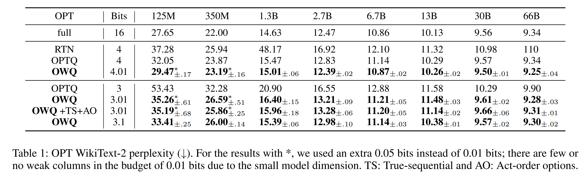

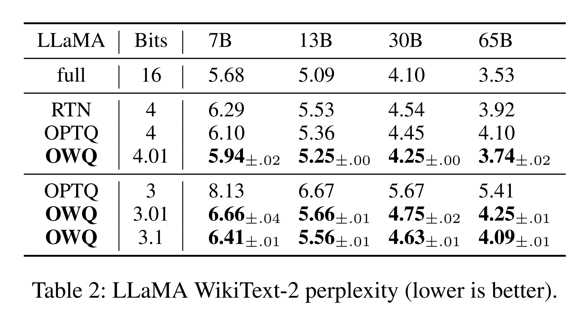

results 는 OWQ 가 model size 와 무관하게 LLM families 전반에서 일관되게 substantial quality improvements 를 제공한다는 것을 명확히 보여준다. 

* 3.01-bit OWQ model 은 3-bit OPTQ model 에서 관찰되는 quality degradation 을 효과적으로 완화하며, 3.1-bit model 은 4-bit OPTQ model 과 comparable performance 를 달성한다. 
* 또한 OWQ 4.01-bit 는 noteworthy improvements 를 산출하며, 이는 weak columns 를 다루는 것의 significance 를 강조한다. 
* 이러한 results 는 quantization 이후 model quality 를 보존하는 데 있어 저자의 approach 의 importance 와 effectiveness 를 뒷받침한다.

흥미로운 finding 은 OWQ 를 적용할 때 13 billion parameters 미만의 OPT models 에서 model quality 가 크게 개선된다는 점이다. 

* previous studies 는 6.7 billion parameters 를 초과하는 models 에서 activation outliers 의 존재를 강조했지만, 더 작은 models 도 moderately large channels 를 가지는 경우 mixed precision quantization 으로부터 여전히 benefit 을 얻을 수 있다. 
* 이는 model size 와 무관하게, weak columns 라는 concept 이 LLMs 의 quality 를 향상시키는 데 여전히 valid 하고 effective 함을 시사한다.

또한 OWQ 는 TS + AO 를 적용한 OPTQ 보다 일관되게 우수하지만, TS + AO 는 OWQ 에 performance benefits 를 제공하지 않는다는 점에 유의하라고 한다 (Tab. 1). 

* 이러한 options 에 대한 theoretical interpretation 은 제안되지 않았지만, 저자의 study 는 “act-order” 의 benefits 가 sensitivity-aware quantization 에서 기인한다고 제안한다. 
* 이는 sensitive columns 부터 시작하는 sequential quantization 을 적용하면 OPTQ 의 performance 가 개선된다는 것을 의미한다. 
* 그러나 act-order 만으로는 low-precision domain 내에서 weak columns 로 인해 발생하는 quality degradation 을 충분히 완화할 수 없다. 
* 흥미롭게도, OWQ 를 사용하면 quantization error 가 이미 크게 줄어들기 때문에 TS 의 benefit 도 완화된다.

## Results of Various Few-shot Tasks

저자는 다양한 few-shot language tasks 에 대해 추가 experiments 를 수행했다. benchmark 로서 Huggingface H4 team 의 “Open LLM Leaderboard” 를 참조하여, ARC-challenge (25-shot), Hellaswag (10-shot), MMLU (5-shot) 의 average scores 에 의존했다. 

특히 MMLU 는 57 tasks 의 collection 이다. 이 benchmarks 는 few-shot contexts 에서 다양한 fields 전반의 reasoning 및 general knowledge 범위를 테스트하기 때문에 선택되었다. 

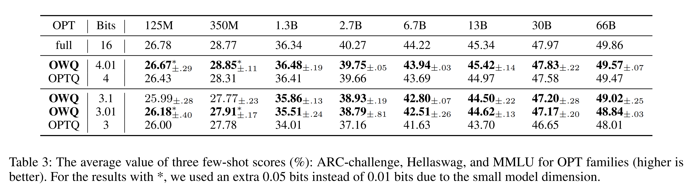

* Tab. 3 및 Tab. 4 의 average scores 는 제안된 OWQ 가 125m 에서 66B 까지 다양한 model sizes 에서 OPTQ 보다 일관되게 superior 하다는 것을 저자에게 확신시킨다. 

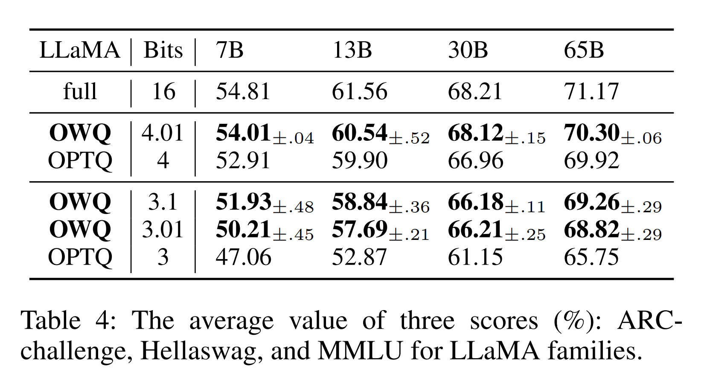

* 특히 Tab. 4 에서, OPTQ 에 TS 및 AO options 를 사용했음에도 불구하고 LLaMA families 에 대해 OPTQ 3-bit 와 OWQ 3.01-bit 사이의 considerable gap 을 확인할 수 있다. 
* 저자의 method 의 strength 는 universality 에 있으며, minimal storage overhead 로 generative models 의 performance 를 일관되게 boosting 한다.

## Acceleration on Real Device

저자는 low-precision acceleration 의 advantages 를 보여주기 위해 OWQ 를 위한 customized CUDA kernel 을 개발했고, A100 GPU 에서 latency overhead 를 평가했다. 

먼저 저자는 low-precision matrix 를 fp16 format 으로 decompressed 하고 dense GeMV multiplication 을 수행했다. 

이 stage 에서 overhead 는 OPTQ 의 customized kernel 과 동일하다. 추가로 저자는 weak columns 를 위한 activation input channels 를 on-the-fly 로 select 하고, 이들에 대해서만 another GeMV kernel 을 사용한다. 이 approach 는 irregular memory access issues 를 효과적으로 회피한다. Tab. 5 는 다양한 model sizes 에 대해 OWQ 3.01-bit 의 kernel overhead 를 보여준다. 

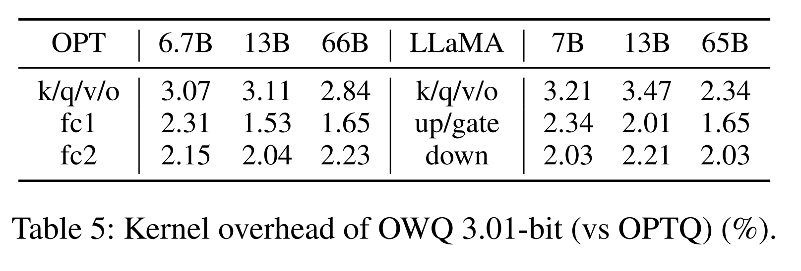

* mixed-process computation 은 LLaMA 7B model 에서 OPTQ kernel 의 3-bit acceleration 과 비교해 latency 를 단지 3.21% 만 추가하며, larger models 에서는 overhead 가 일반적으로 amortized 된다.

## Quantization Speed

LLM quantization 에서는 quantization algorithm 의 speed 가 중요하다. 

* OWQ 는 OPTQ 에 비해 weak column selection 및 hyperparameter tuning 을 위한 operations 를 추가하지만, OPTQ 와 Hessian 을 공유하기 때문에 OWQ 의 overhead 는 최소화된다. 
* 또한 true-sequential option 을 OPTQ 에 적용하면 OPTQ 에 extra runtime 이 추가되어 OWQ quantization time 과의 gap 이 더 줄어든다. 
* A100 GPU 에서 OWQ 는 66B model 을 3 hours 미만으로 quantize 할 수 있어, practicality 를 제시한다.

## Results of WCT-based Fine-tuning

task-specific adaptation 을 위한 Weak Column Tuning (WCT) 의 superior performance 를 검증하기 위해, 저자는 LLaMA 7B model 을 4-bit quantization 으로 WCT 를 사용해 fine-tuned 한 뒤 results 를 비교했다. 

* QLoRA 의 results 를 얻기 위해 저자는 official checkpoint 를 사용했다. 
* fair comparison 을 위해, 저자는 QLoRA 가 사용한 OpenAssistant dataset 의 동일 subset 을 사용했다. 
* 저자는 Vicuna Benchmark 의 80 questions 에 대해 두 models 가 생성한 results 를 GPT-4 에 input 하여 어느 쪽이 더 나은지 결정하는 방식으로 performance 를 평가했다. 
* previous work 에서 보고된 바와 같이, 저자는 GPT-4 가 주어진 pair of systems 에서 first 로 나타나는 system 을 favor 하여 higher score 를 주는 bias 를 발견했다. 
* 이 bias 를 제거하기 위해 저자는 ordering cases 를 모두 evaluate 하고 total 160 evaluations 의 results 를 보고한다. 
* LoRA 와 QLoRA 는 모두 adapter modules 의 64 rank 를 사용한다. 모든 generations 에 대해 저자는 nucleus sampling 을 $p=0.9$ 와 temperature 0.7 로 사용했다.

WCT experiments 에서 $r=k$ 는 각 layer 에 대해 $r$ weak columns 를 가지는 configuration 을 의미한다. 

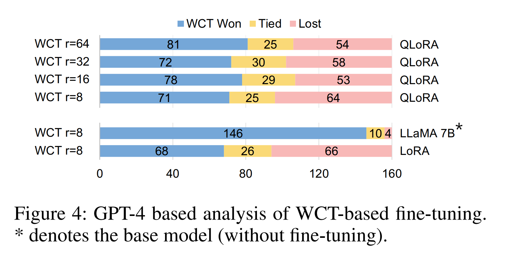

* Fig. 4 에서 보이듯이, 64 weak columns 를 사용한 WCT ($r=64$) 는 QLoRA 를 surpass 한다. 
  * 즉, GPT-4 는 WCT 를 사용한 tuning results 를 더 자주 better 로 평가했다 ($r=64$ case 에서 81 vs 54). 
* 놀랍게도, 단지 8 weak columns 만을 사용하는 WCT 는 (QLoRA 대비 learnable parameters 의 6.8% 만 사용함) QLoRA 를 outperforms 하고 full-precision LoRA 와 comparable results 를 산출한다. 
* compressed weight 의 quality 가 full-precision model 과 동등한 수준이기 때문에, OWQ 와 결합된 WCT 는 inference 동안 overall memory usage 의 24.4% 만으로 full-precision LoRA 와 matching 하는 performance 를 제공한다. 
* WCT 는 update 에 highly sensitive 한 weak columns 만 update 한다. 이 feature 는 WCT 가 conventional LoRA 보다 smaller rank 로 accuracy 를 compensate 하게 만든다. 
* OWQ + WCT 를 사용하면, inference 뿐 아니라 task-specific adaptation 에서도 quantization 의 benefits 를 누릴 수 있다.

## Comparison of PTQ Methods used in WCT

저자는 WCT 에서 fixed dense weights 를 quantizing 하는 데 사용되는 여러 quantization methods 를 비교하고, sophisticated quantization method 가 fine-tuning 이후 performance 에 중요함을 검증한다. 서로 다른 quantization methods 로 LLaMA-7B model 을 quantizing 한 뒤, WCT 로 refined 된 models 는 Vicuna Benchmark 의 questions 에 대해 answers 를 generate 하며, answers 의 quality 는 GPT-4 기반 evaluation 으로 비교된다. 

모든 quantization methods 에 대해 저자는 weak columns 의 수로 $r=8$ 을 사용했고, per-channel granularity 를 가진 linear asymmetric quantization 을 사용했다. quantization 으로 인한 performance loss 는 fine-tuning 으로 compensate 될 수 있지만, Fig. 5 는 fine-tuning 이전의 quantized model quality 가 fine-tuning 이후 performance 에 영향을 준다는 것을 보여준다.

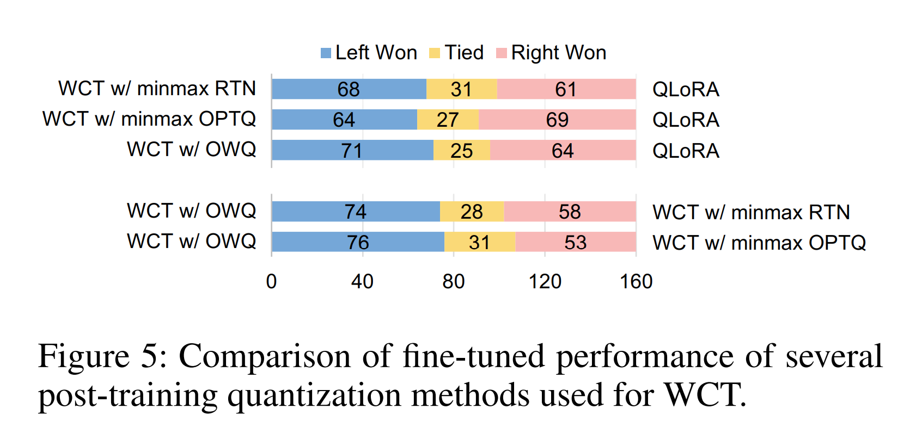

## Comparison with Group-wise Quantization

fine-grained granularity 에서 uniform quantization 을 적용하면 quantization error 를 크게 줄일 수 있지만, quantization hyperparameters 를 위한 일부 storage overhead 가 도입된다. OPTQ 는 row vectors 를 groups (e.g., group size 128 또는 1024) 로 나누고, 서로 다른 configurations 로 independent 하게 uniform quantization 을 적용하는 방식으로 이 approach 를 활용한다. 

이 expansion 은 OWQ 와 orthogonally 하게 적용될 수 있으므로, 저자는 OWQ 와 이를 결합하여 improvements 를 평가할 수 있다. 

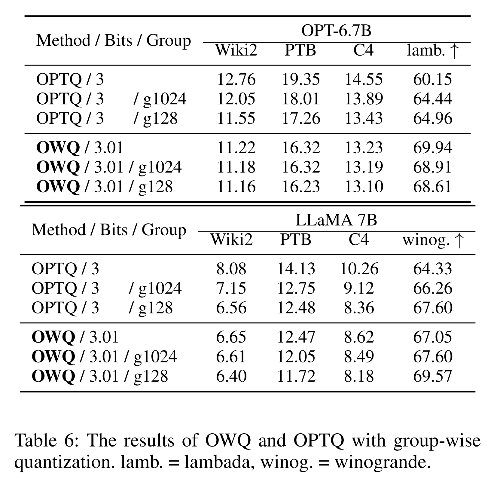

* Tab. 6 의 results 는 OWQ 가 이미 3-bit model 의 quality 를 크게 향상시키기 때문에 fine-grained quantization 으로부터의 improvement 가 negligible 함을 보여준다. 
* 또한 128 group size 의 grouped OPTQ 와 비교하면, 3.01-bit OWQ 의 storage overhead 는 grouped OPTQ overhead 의 약 10% 에 불과하면서, comparable 또는 better perplexity 및 zero-shot accuracy 를 달성한다. 따라서 OWQ 는 grouping technique 에 대한 superior solution 이다.

## Weak Column Selection Metrics

본 논문에서 저자는 layer output error 를 최소화하기 위해 weak column selection 에 Hessian matrix 와 weight perturbations 를 모두 사용하는 것을 제안한다 (Eq. (6)). Tab. 7 은 다양한 weak column selection metrics 에 대한 perplexity results 를 추가로 제시한다. 

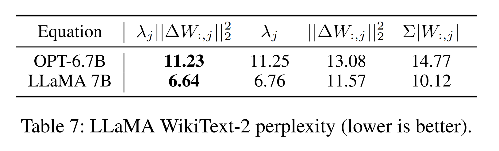

* 1st ($\lambda_j \lVert \Delta W_{:,j}\rVert_2^2$, 저자의 proposed selection metric) 및 2nd ($\lambda_j$, Hessian only) columns 의 results 가 3rd ($\lVert \Delta W_{:,j}\rVert_2^2$, weight error only) 보다 상당히 더 좋다는 것은 명백하다. 
* 이는 (1) layer-wise error minimization 이 final accuracy 를 위한 valid objective 이며, (2) 단순히 weight error minimization 에만 집중하기보다는 output activation error 에 기여하는 all factors 를 account 하는 것이 필요함을 나타낸다.

## Varying Ratios of Weak Columns

저자는 Tab. 8 에서 varying ratios 에 대한 perplexity, latency, memory usage 의 trade-offs 를 보고한다. 

이러한 overhead results 는 OPTQ 3-bit baseline 과 비교된다.

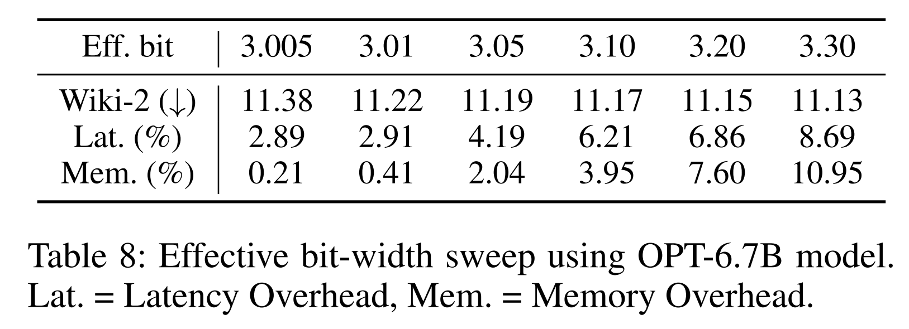

* 단지 3.005 bits 만으로도 model 은 negligible overhead 로 OPTQ 3-bit performance 를 이미 surpass 한다. 
* 그러나 bit width 가 증가함에 따라 performance gain 은 saturates 하는 반면 overhead 는 계속 증가한다. 
* activation outliers 는 소수 dimensions 에만 제한되어 있으므로, small number 의 weak columns 만으로도 noticeable performance improvements 로 이어질 수 있다. main tables 에서 저자는 3.01 및 3.1-bit 라는 두 specific ratios 에 초점을 맞추었는데, 이는 trend 를 효과적으로 보여주기 때문이다.

# Conclusion

activation outliers 의 존재는 LLM activation quantization 에서 중요한 challenge 로 확인되어 왔다. 

저자는 weight quantization 에서도 activation outliers 가 특정 weight columns 의 sensitivity 를 증가시켜, low-precision domain 에서 significant quality degradation 으로 이어질 수 있음을 발견했다. 이를 극복하기 위해 저자는 novel quantization scheme 인 OWQ 를 소개했다. 

기존 3-bit quantization methods 와 비교해, OWQ 는 negligible storage 및 computation overhead 만으로 quality 를 notably 개선하면서 low-precision compression 의 benefit 을 유지한다. 또한 저자는 minimal memory overhead 로 task-specific adaptation 을 가능하게 하고 outstanding performance 를 보이는 WCT scheme 를 소개한다. 저자는 이러한 insights 가 LLMs 의 widespread adoption 을 촉진할 것이라고 믿는다.
