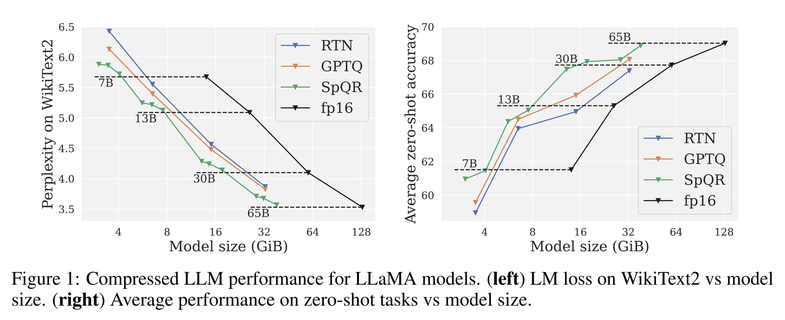
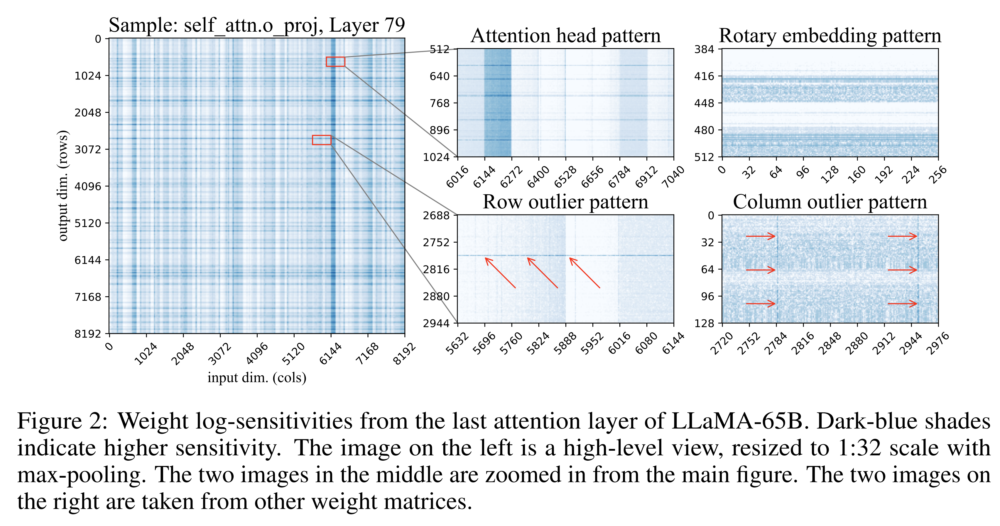
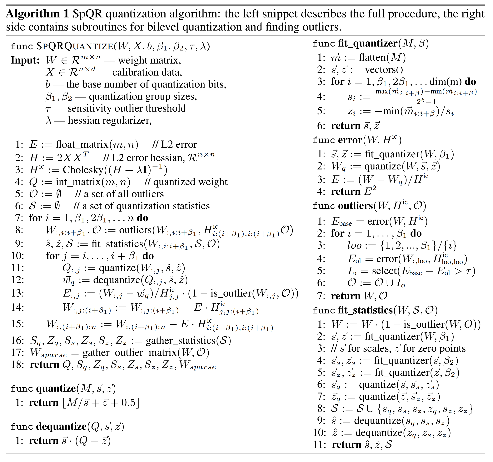
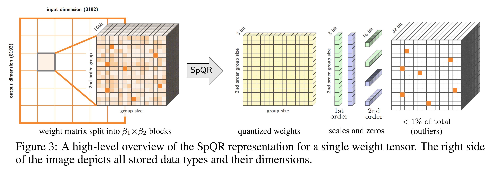
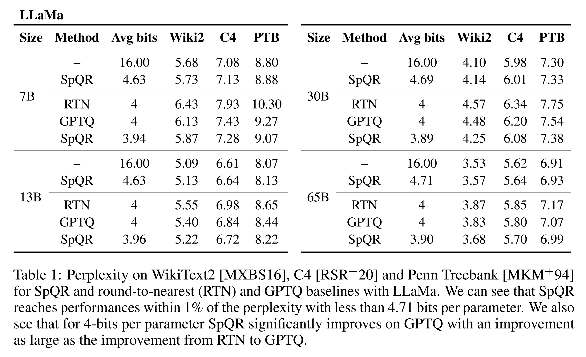
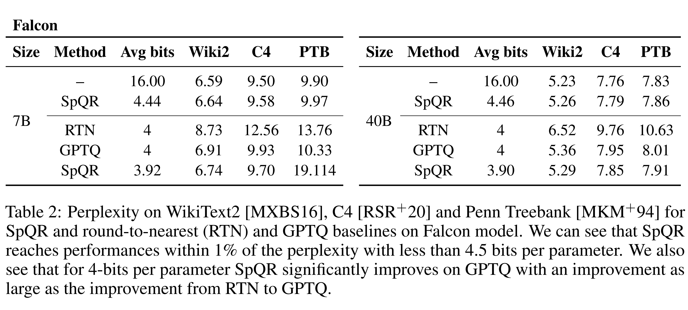
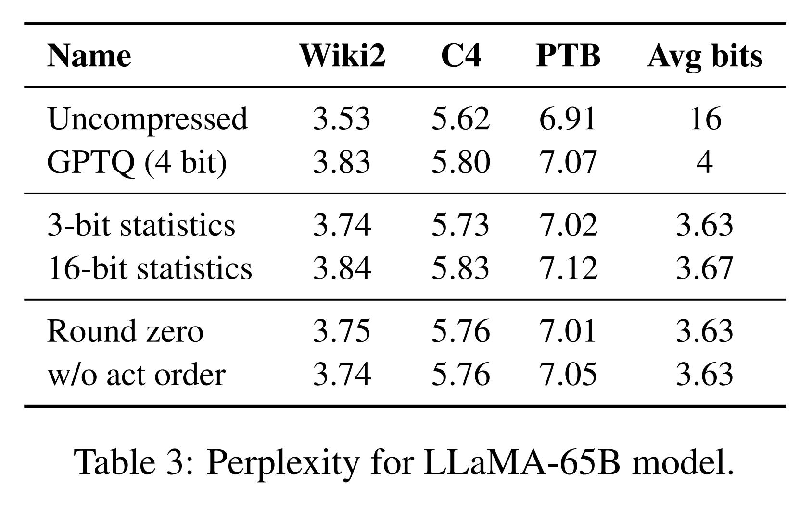
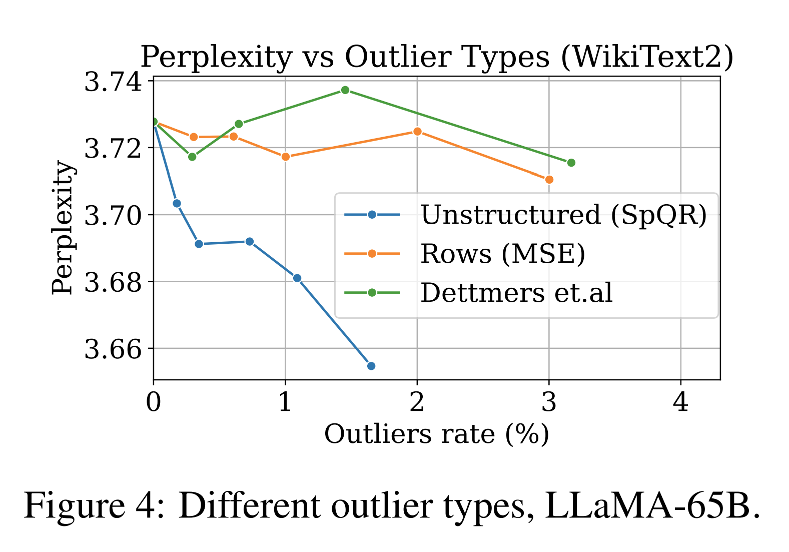
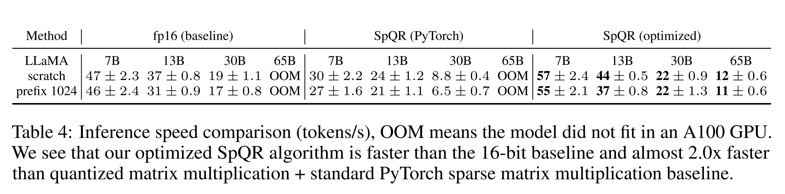

# Abstract

Recent advances in large language model (LLM) pretraining 은 인상적인 능력을 가진 고품질 LLM 로 이어졌다. 이러한 LLM 을 parameter 당 3–4 bit 로 quantization 하여 압축함으로써, 노트북이나 모바일 폰과 같은 memory 제한 device 에 적합하게 만들 수 있으며, 개인화된 사용을 가능하게 한다. 그러나 parameter 당 3–4 bit 로의 quantization 은 일반적으로 중간에서 높은 수준의 accuracy 손실을 초래하며, 특히 edge deployment 에 적합한 1–10B parameter 범위의 소형 model 에서 그 영향이 크다. 

이러한 accuracy 문제를 해결하기 위해, 저자는 **Sparse-Quantized Representation (SpQR)** 이라는 새로운 compressed format 과 quantization technique 을 소개한다. 이 방법은 기존 방법과 유사한 compression 수준을 유지하면서도, model scale 전반에 걸쳐 처음으로 **near-lossless** LLM compression 을 가능하게 한다.

* SpQR 은 특히 large quantization error 를 유발하는 **outlier weight** 를 식별하고 분리하여, 이를 higher precision 으로 저장하는 방식으로 동작한다. 동시에 나머지 모든 weight 는 3–4 bit 로 압축한다. 
* 그 결과, 고정확도의 LLaMA 와 Falcon LLM 에 대해 perplexity 기준 상대적 accuracy 손실이 1% 미만을 달성한다. 
* 이는 33B parameter LLM 을 단일 24 GB consumer GPU 에서 성능 저하 없이 실행할 수 있게 하며, 15% 의 speedup 을 제공함으로써 강력한 LLM 을 소비자에게 어떠한 단점 없이 제공하는 것을 가능하게 한다.

SpQR 은 weight 를 해당 format 으로 encoding 하는 효율적인 algorithm 과, runtime 에서 이를 효율적으로 decoding 하는 algorithm 을 함께 제공한다. 

구체적으로, 저자는 SpQR 을 위한 효율적인 GPU inference algorithm 을 제안하며, 이는 유사한 accuracy 를 유지하면서 16-bit baseline 보다 더 빠른 inference 를 제공하고, 4 배 이상의 memory compression 이득을 가능하게 한다.

# 1 Introduction

Pretrained large language model (LLM) 은 task-specific performance 에서 시작하여, instruction 으로 prompting 될 경우 general task 에서도 우수한 성능을 보이는 수준으로 빠르게 발전했다. 이러한 성능 향상은 training data 와 parameter 의 scaling 에 기인하지만, 최근 경향은 inference 시 사용이 더 용이한, 더 많은 data 로 학습된 소형 model 에 초점을 맞춘다. 

* 예를 들어, 1T token 으로 학습된 7B parameter LLaMA model 은 GPT-3 보다 25 배 작음에도 불구하고 평균 성능이 약간 낮은 수준을 달성했다. 
* 현재의 LLM compression technique 은 이러한 model 을 성능을 유지한 채 약 4 배까지 추가로 축소할 수 있다. 
  * 이는 memory 요구 사항을 크게 줄이면서, 가장 큰 GPT-3 model 과 비교 가능한 성능 수준을 제공한다. 

이러한 개선을 통해, 성능이 우수한 model 은 노트북과 같은 end-user device 에서 효율적으로 제공될 수 있다.

주요 과제는 이러한 device 에 적합하도록 model 을 충분히 압축하면서도 generative quality 를 유지하는 것이다. 구체적으로, 기존의 3–4 bit quantization technique 은 정확하더라도 여전히 상당한 accuracy 저하를 초래한다는 것이 보고되었다. LLM generation 은 이전에 생성된 token 에 의존하는 sequential process 이기 때문에, 작은 상대적 error 도 누적되어 출력이 심각하게 손상될 수 있다. 신뢰할 수 있는 품질을 보장하기 위해서는, 16-bit model 과 비교하여 predictive performance 를 저하시키지 않는 low-bitwidth quantization 을 설계하는 것이 중요하다.

이 연구에서는 **Sparse-Quantized Representations (SpQR)** 를 소개한다. 

* SpQR 은 hybrid sparse-quantized format 으로, 정확한 pretrained LLM 을 parameter 당 3–4 bit 로 압축하면서도 near-lossless 특성을 유지한다. 
* 구체적으로, SpQR 은 dense baseline 대비 perplexity 로 측정한 end-to-end accuracy error 를 상대적으로 1% 미만으로 유지하면서 이러한 compression ratio 를 달성할 수 있는 최초의 weight quantization 방법이다. 
* SpQR 은 두 가지 핵심 혁신을 결합한다. 
  1. quantization 시 비례적으로 큰 error 를 유발하는 outlier weight 를 분리하여, 이들 weight 는 high precision 으로 유지하고 나머지 weight 는 예를 들어 3-bit 와 같은 훨씬 낮은 format 으로 저장한다. 
  2. 둘째, 매우 작은 group size, 예를 들어 16 개의 연속된 element 를 사용하는 grouped quantization 의 변형을 구현하며, quantization scale 자체도 3-bit representation 으로 quantize 할 수 있음을 보인다.

주어진 pretrained LLM 을 SpQR format 으로 변환하기 위해, 저자는 GPTQ 에서 최근 도입된 post-training quantization (PTQ) approach 의 확장된 버전을 채택한다. 

이 방법은 calibration data 를 uncompressed model 에 통과시킨 뒤, 각 layer 를 압축하기 위해 uncompressed model 의 output 과 quantized weight 의 output 간의 $L_2$ error 에 대해 layer-wise solver 를 적용한다. 저자의 접근법은 이 과정을 두 단계로 분리한다. 

1. “**outlier detection**” 단계로, 직접적인 quantization 이 layer output behavior 에 과도한 영향을 미치는 weight 를 분리한다. 
2. 실제 compression 단계로, 대부분(≥ 99%)의 weight 를 low-bitwidth 로 압축하고, outlier 를 추출하며, quantization metadata 를 추가로 압축하여 전체 representation 을 더욱 효율적으로 만든다.

저자의 방법은 LLM weight quantization error 가 vertical 및 horizontal group correlation 을 모두 보인다는 새로운 분석에 기반한다. 이는 input feature dimension 과 output hidden dimension 에 대응되는 체계적으로 큰 error 를 의미한다. Input feature outlier 는 이전 연구에서 이미 관찰되었지만, 본 연구는 특정 output hidden dimension 에 대해서도 유사한 outlier 가 존재함을 처음으로 입증한다. 

* Input feature outlier 와 달리, output hidden dimension outlier 는 특정 output hidden dimension 에 대해 작은 segment 에서만 발생한다. 
* 저자의 quantization algorithm 은 이러한 outlier 를 분리하고, 주어진 model 을 SpQR format 으로 효율적으로 encoding 한다.

이로부터 생성되는 구조를 활용하기 위해, 저자는 **compressed sparse row (CSR) format** 에 기반한 specialized sparse-matrix multiplication algorithm 을 개발한다. 

* SpQR 을 token-by-token generation 에 사용하기 위해, 이 sparse algorithm 을 3–4 bit weight 를 위한 dense-quantized matrix multiplication 과 결합한다. 
* 이를 통해 SpQR 은 language modeling loss 또는 perplexity 로 측정한 accuracy 저하 없이 LLM 의 memory footprint 를 약 3.4 배 이상 감소시키며, 동시에 16-bit inference 와 비교하여 LLM generation 속도를 20–30% 향상시킨다.

# 2 Related Work

본 절에서는 관련된 post-training quantization (PTQ) 방법에 초점을 맞추며, quantization 전반에 대한 배경은 Gholami et al 의 최근 survey 를 참고하도록 독자를 안내한다. PTQ 방법은 제한된 양의 calibration data 를 기반으로, 다양한 크기의 model 을 one-shot 방식으로 압축하는 데 널리 사용되는 접근법이다. 이들은 보통 정확한 solver 를 사용하며, 주로 layer-wise 또는 group-wise compression sub-problem 에 초점을 둔다. 

AdaRound, BitSplit, AdaQuant, BRECQ, OBQ 와 같은 대부분의 PTQ 방법은 100M parameter 미만의 vision model 이나 소규모 language model 을 대상으로 설계되었다. 이러한 최근 접근법들은 모두 정확한 solver 를 사용하는 경향이 있는데, 이는 GPT 규모의 model 이 10–1000 배 더 크기 때문에 computational 또는 memory cost 측면에서 확장되지 않는다.

최근에는 이러한 대규모 model 에까지 확장 가능한 정확한 post-training 방법을 얻는 데 상당한 관심이 집중되고 있다. Computational constraint 로 인해, ZeroQuant, LLM.int8(), nuQmm 과 같은 초기 연구는 weight 를 가장 가까운 quantization level 로 직접 rounding 하는 방식을 사용하였으며, 공간과 accuracy 간의 trade-off 를 조절하기 위해 quantization granularity, 즉 group size 를 조정하였다. 

* LLM.int8() 은 “outlier feature” 를 분리하여 더 높은 bit-width 로 별도 quantization 할 것을 제안했다. 
  * 이러한 접근법들은 quantization granularity 가 충분히 작을 경우, 예를 들어 LLaMA-7B 를 4-bit weight quantization 할 때 상대적 LM Loss 증가가 약 5.5% 수준에 그치는 등 비교적 낮은 quantization error 를 유도할 수 있다. 
* GPTQ 는 layer-wise squared error 를 최소화하는 문제에 대해 approximate large-scale solver 를 사용하는 더 높은 accuracy 의 접근법을 제안하였으며, 동일한 설정에서 약 4% 의 LM Loss 증가를 보인다.
* Dettmers et al 은 이러한 방법들에 내재된 accuracy–compression trade-off 를 심층적으로 분석하여, round-to-nearest 기반 방법에서는 4-bit quantization 이 최적의 지점임을 확립하였고, GPTQ 와 같은 data-aware 방법을 통해 더 높은 compression 이 가능함을 보였다. 
* SparseGPT 는 LLM weight 를 중간 수준의 sparsity 로 sparsify 하는 것과 동시에, 남은 weight 를 고정된 bit-width 로 quantization 하는 접근법을 제시했다. 

기존 방법들의 공통적인 한계는 원래 model 대비 accuracy 손실이 여전히 상당하다는 점이다. 이는 Tab. 1 에서 확인할 수 있으며, 특히 7–13B parameter 범위의 비교적 작고 배포가 용이한 model 에서 accuracy 저하가 두드러진다. 저자는 이 문제를 분석하고, 해당 영역에서 near-lossless 3–4 bit compression 을 가능하게 하는 새로운 compression format 을 제시한다.

관련된 또 다른 문제는 activation 과 weight 를 동시에 quantization 하는 것이다. 초기 연구에서는 activation 과 weight 모두를 8-bit 로 quantization 하더라도 비교적 낮은 accuracy 영향만 발생함을 보였다. 이러한 보완적 연구들은 LLM compression error 의 원인에 대해 흥미로운 통찰을 제공한다. 특히, 일부 연구는 대규모 LLM 의 input/output 에서 값이 현저히 큰 “outlier feature” 가 존재함을 관찰하고, 이들이 높은 quantization error 를 유발한다는 점을 지적하며, 다양한 완화 전략을 제안한다.

저자는 이러한 현상을 weight quantization 의 관점에서 분석한다. 

* 구체적으로, weight matrix 에서 input feature outlier 를 넘어서는 outlier structure 를 조사한다. 
* 분석 결과, 현재 layer 의 input feature outlier 와 이전 layer 의 hidden unit outlier weight 사이에는 상관관계가 존재하지만, 엄격한 일대일 대응 관계는 아님을 확인한다. 
* 이러한 부분적으로 구조화된 outlier pattern 은 기존 연구에서 발견된 column 구조의 outlier feature 만을 활용하는 algorithm 을 넘어서는, 보다 세밀한 hybrid compression format 을 요구한다.

Hybrid sparse-quantized format 은 일반적인 deep network 에 대해서도 연구되어 왔다. 일부 효율적인 CPU inference engine 은 4 개의 연속된 weight 로 구성된 block 이 완전히 sparse 이거나 8-bit format 으로 quantized 되는 block sparse-and-quantized format 을 지원한다. 

GPU 역시 유사한 compound format 을 지원하는데, 이 경우 4 개의 weight 중 2 개는 zero 이고, 나머지 non-zero weight 만 quantization 된다. FBGEMM package 는 normalization 에 대한 영향을 줄이기 위해 특정 “outlier” weight 를 별도로 quantization 하는 format 을 제안하였다. 그러나 이 format 에서는 “outlier” weight 역시 일반 weight 와 동일한 bit-width, 즉 8-bit 로 quantization 되며, post-training 단계에서 model 을 해당 format 으로 변환하는 절차가 제시되지 않는다. 이에 반해, 저자의 기여는 다음과 같다.

* output error 를 크게 유발하는 weight 를 outlier 로 식별하는 효율적이고 정확한 post-training compression algorithm 을 제시한다.
* outlier 를 일반 weight 보다 더 높은 bit-width 로 압축하는 format 을 제안한다.
* outlier 를 block 단위로 저장하여 GPU kernel 을 효율적으로 구현할 수 있는 format 을 제안하고, 이에 대한 GPU kernel 도 함께 제공한다.

# 3 Quantization sensitivity of LLM weights

## 3.1 Parameter sensitivity under quantization

neural network 에서 모든 parameter 가 동일하게 중요하지는 않다. 직관적으로, 어떤 weight 는 rounding error 가 큰 경우, 즉 quantization point 에 가깝지 않은 경우, 그리고/또는 일반적으로 곱해지는 input 이 커서 작은 rounding error 조차 증폭시키는 경우 quantization 에 민감하다고 볼 수 있다. 

그러나 이러한 단순한 sensitivity 개념은 LLM 이 매우 큰 vector 위에서 동작하며, 그 안에 상당한 correlation 이 존재한다는 사실을 무시한다. 예를 들어, weight $w_a$ 가 큰 rounding error 를 가질 수 있지만, 다른 weight $w_b$ 와 강하게 상관되어 있어 $w_a$ 를 올림 rounding 하면서 발생한 error 가 $w_b$ 를 내림 rounding 함으로써 잘 상쇄될 수 있다. 

이러한 아이디어는 최신 quantization algorithm 에서 활용되며, 특히 low bitwidth 에서 vanilla rounding 대비 큰 성능 향상을 가져올 수 있다. 이러한 sensitivity 측면을 제대로 포착하기 위해서는 보다 견고한 정의가 필요하다.

Computational tractability 를 위해, 저자는 소량의 calibration input $X$ 를 사용하여 layer 단위로 sensitivity 를 평가한다. 이 $X$ 는 해당 layer 까지 model 을 실행하여 수집된다. Layer 의 weight matrix $W$ 에서 어떤 weight $w_{ij}$ 의 sensitivity $s_{ij}$ 를, 이 weight 가 quantize 되었을 때 원래 prediction 과의 squared difference 를 최소화하는 값으로 정의한다. 즉, $w'_{ij} = \mathrm{quant}(w_{ij})$ 일 때 다음과 같이 정의한다.

$$
s_{ij} = \min_{W'} \lVert WX - W'X \rVert_2^2 \quad
\text{s.t. } w'_{ij} = \mathrm{quant}(w_{ij})
\tag{1}
$$

* 중요하게도, $W'$ 에서 $w'_{ij}$ 를 제외한 모든 weight 는 quantize 될 필요가 없는 임의의 값을 가질 수 있으며, 이를 통해 $w_{ij}$ 를 rounding 하면서 발생하는 quantization error 를 보상할 수 있다. 
  * 이는 앞서 논의한 correlation 측면을 포착한다. 
* 또한 continuous value 를 허용하므로, 이 문제는 closed-form solution 을 가진다. 
  * 이는 generalized Optimal Brain Surgeon framework 를 따르면 구할 수 있으며, 이때 $(XX^\top)^{-1}$ 은 해당 optimization problem 에 대응되는 inverse Hessian matrix 이다.

$$
s_{ij} =
\frac{(w_{ij} - \mathrm{quant}(w_{ij}))^2}
{2(XX^\top)^{-1}}
\tag{2}
$$

* 이 saliency measure 는 GPTQ 와 같은 quantization solver 를 통해 효율적으로 근사할 수 있다. 
* 보다 구체적으로, GPTQ 는 weight matrix 를 column-by-column 으로 quantize 하면서, 각 단계에서 아직 quantize 되지 않은 부분을 조정하여 quantization error 를 보상한다. 
* 따라서 sensitivity 를 사전에 정적으로 결정하는 대신, algorithm 이 각 column 을 처리하는 동안 동적으로 계산할 수 있으며, 이는 아직 quantize 되지 않은 weight 에 해당하는 Hessian 부분행렬의 inverse 를 사용한다. 
* 이 matrix 는 이미 GPTQ 에서 효율적으로 계산되므로, 추가적인 overhead 는 발생하지 않는다. 

이 접근법의 주요 장점은 $s_{ij}$ 가 항상 가장 최신의 $w_{ij}$ 값을 기준으로 결정되어, 이전에 quantize 된 weight 로 인한 조정 효과까지 반영한다는 점이다.

## 3.2 Exploring parameter sensitivity

본격적인 방법인 SpQR 을 정의하기에 앞서, 저자는 parameter sensitivity 에 대한 동기 부여 분석을 제공하며, 이를 통해 sensitive weight 의 위치가 weight matrix 내에서 무작위가 아니라 특정한 구조를 가진다는 점을 밝힌다. 

Quantization 과정에서 이러한 구조적 요소를 강조하기 위해, 인기 있고 정확도가 높은 LLaMA-65B model 에 대해 per-weight sensitivity 를 계산하고 이를 시각화한다. Quantization 방법으로는 weight grouping 없이 3-bit GPTQ quantization 을 사용한다. 

Calibration dataset 으로는 C4 를 사용하며, 2048 token 으로 구성된 128 개 sequence 에 대해 error 를 추정한다. Fig. 2 는 LLaMA-65B 의 마지막 self-attention layer 에서 output projection 을 보여준다.

* Sensitivity 분석을 통해, weight matrix 에서 여러 pattern 이 관찰되며, 이는 종종 단일 row 나 column 에서 나타난다. 
* LLaMA-65B 의 대형 weight matrix 는 row 와 column 수가 매우 많아 기본 크기인 $8k \times 32k$ pixel 이미지로는 표현하기 어렵기 때문에, 시각화를 위해 max pooling 을 적용한다. 
  * 즉, $32 \times 32$ row 와 column 으로 이루어진 각 block 에서 최대 sensitivity 값을 취한다. 
  * 이 max pooling 은 가장 왼쪽 이미지에만 적용된다. 

이러한 시각화를 통해, quantization error pattern 이 attention layer 와 multilayer perceptron (MLP) 과 같은 layer type, 그리고 layer depth 에 따라 달라짐을 확인한다. 특히, 더 깊은 layer 일수록 더 민감한 outlier 가 많이 존재함을 발견한다. 추가 결과는 Appendix A 에 제시한다. 이후, attention weight matrix 를 예시로 사용하여 outlier structure 를 분류하며, 다음과 같은 관찰을 얻는다.

* **Row outliers**: Fig. 2 하단 중앙에 나타나며, 하나의 output unit 내에서 높은 sensitivity 영역으로 보인다. 일부 pattern 은 전체 row 에 걸쳐 나타나고, 다른 일부는 부분적으로 나타난다. 
  * Attention layer 에서는 일부 partial row outlier 가 특정 attention head 의 subset 에 대응된다. 
  * **Column outliers** 는 Fig. 2 하단 오른쪽에 나타나며, 모든 row 에 걸쳐 특정 input dimension (column) 에서 높은 sensitivity 를 보인다. 이는 Dettmers et al 에서 보고된 “outlier feature” 현상과 상관된다.
* **Sensitive attention heads**: Fig. 2 상단 중앙에서 폭이 128 인 규칙적인 stripe 가 하나의 attention head 에 해당하는 모든 weight 를 강조한다. 
  * 이는 일부 attention head 가 더 중요한 기능을 수행하기 때문일 수 있다. 이러한 stripe 는 attention Q 와 K projection 에서는 horizontal, output projection 에서는 vertical 로 나타나며, value projection 이나 MLP weight 에서는 나타나지 않는다. 
  * 주목할 점은, 민감한 head 내부에서도 개별 weight sensitivity 에 상당한 variation 이 존재한다는 것이다.
* **Rotary embedding pattern**: sensitivity 가 64 unit 주기로 반복되는 vertical pattern 이 관찰된다. 
  * 이는 rotary embedding 사용에 기인한 것으로 해석된다. 각 attention head (dimension = 128) 는 두 부분으로 나뉘며, 앞의 64 는 cosine 으로 “rotation” 되고, 나머지 64 는 sine 을 사용한다. 
  * Sine 과 cosine rotation 은 동일한 frequency 집합을 사용한다. 
  * 일반적으로,  low-frequency sine 과 cosine 에 대응되는 weight 가 high-frequency 에 비해 더 민감하며, 이는 Fig. 2 상단 오른쪽에 나타난다. 
  * 예상대로, 이 pattern 은 rotary embedding 을 사용하지 않는 layer 에서는 나타나지 않는다.
* **Unstructured outliers**: 위의 pattern 외에도, 각 layer 에는 어떠한 구조에도 속하지 않는 개별적인 sensitivity weight 가 다수 존재한다. 
  * 이러한 unstructured outlier 는 input index 가 가장 큰 column, 즉 이미지의 오른쪽 부분에서 더 자주 발생한다. 
  * 이 효과는 heatmap 에서 확인하기 어려워, Appendix A 에 추가적인 figure 와 통계적 검정을 제시한다. 
  * 저자는 이것이 GPTQ algorithm 의 artefact 일 가능성이 크다고 본다. 
  * GPTQ 는 아직 압축되지 않은 weight 를 사용하여 error 를 보상하면서 순차적으로 압축하기 때문에, 가장 오른쪽 batch 의 weight 가 가장 많은 error 를 누적하게 된다.

이러한 관찰을 바탕으로, 다음 절에서는 이러한 다양한 outlier type 을 모두 지원할 수 있는 compressed representation 을 제안한다.

# 4 SpQR: A Sensitivity-aware compressed representation

## 4.1 Overview

기존 LLM quantization algorithm 은 low-sensitivity weight 와 high-sensitivity weight 를 동일하게 취급한다. 그러나 앞선 논의는 이러한 접근이 sub-optimal quantization 으로 이어질 수 있음을 시사한다. 

이상적으로는 representation 이 민감한 weight 에 더 많은 “size budget” 을 할당해야 한다. 그러나 이러한 weight 는 weight matrix 전반에 걸쳐 개별 weight 또는 부분 row, attention head 와 같은 소규모 group 형태로 흩어져 있다. 이러한 구조를 포착하기 위해, 저자는 quantization 절차에 두 가지 변화를 도입한다. 하나는 작은 민감 group 을 포착하기 위한 것이고, 다른 하나는 개별 outlier 를 포착하기 위한 것이다.

#### Capturing small groups of weights with bilevel quantization

이전 절에서, 일부 attention head 와 partial row outlier 에서 보았듯이, weight 가 작은 연속 group 내에서는 유사하게 동작하지만 group 간에는 급격한 변화가 발생하는 여러 사례를 관찰했다. 

표준 접근법을 적용하면, 이러한 weight 가 동일한 quantization statistics 를 공유하는 하나의 group 으로 묶이는 경우가 많다. 이러한 경우를 줄이기 위해, 저자는 매우 작은 group size 를 사용하는 groupwise quantization 을 적용한다. 

구체적으로, 일반적으로 $\beta_1 = 8$–$32$ 개의 weight 를 하나의 group 으로 사용한다. 즉, 연속된 $\beta_1$ 개의 weight 마다 별도의 quantization scale 과 zero-point 를 둔다. 이 선택은 기존 직관과는 반대되는데, 예를 들어 Yao et al 은 작은 group 이 quantization statistics 저장에 따른 overhead 로 인해 precision 이점을 상쇄한다고 주장하며 이를 권장하지 않는다.

이 문제를 해결하기 위해, 저자는 groupwise statistics 자체를 weight 에 사용한 것과 동일한 quantization algorithm, 즉 asymmetric (min-max) quantization 으로 다시 quantize 한다. Min-max quantization 의 특성상, quantized value 의 범위는 가장 큰(또는 가장 작은) quantization scale 을 가진 group 에 맞춰지므로, 해당 group 은 완벽하게 quantize 된다. 다시 말해, $\beta_2 = 16$ 개의 연속된 groupwise statistic 을 함께 묶어 동일한 bit 수로 quantize 하여, 비정형적인 quantization parameter 를 가진 group 이 더 많은 “quantization budget” 을 사용하도록 한다. 

마지막으로, 1 단계와 2 단계 quantization 은 모두 quantization 과정 내부에서 직접 수행되어, algorithm 이 가능할 경우 2 단계 quantization error 까지도 보상할 수 있도록 한다.

#### High-sensitivity outliers

분석 결과, 소수의 민감한 weight 가 self-attention 에서는 소규모 group 으로, MLP 에서는 개별적인 “outlier” 로 나타나는 경우가 존재함을 확인했다. 일부 경우에는 전체 weight 의 1% 가 전체 quantization error 의 75% 이상을 차지한다. 이러한 weight 는 높은 수준의, 감소시키기 어려운 error 를 유발하므로, 저자는 이 outlier 를 high precision (16-bit) 으로 유지하기로 선택한다. 

이러한 outlier 는 종종 비정형적이므로, compressed-sparse-row (CSR) representation 과 유사한 row-wise 방식으로 개별적으로 encoding 한다. 이는 개별 outlier 와 앞서 정의한 group 에 속하지 않는 소규모 구조 모두를 표현할 수 있다.

Outlier 를 검출하는 절차는 Alg. 1 에 상세히 설명되어 있으며, 대략 두 단계로 구성된다.

1. Outlier 를 찾아 16-bit weight 로 분리한다.
2. Outlier 가 아닌 “base” weight 를 3–4 bit 로 quantize 하고, 남은 quantization error 를 16-bit outlier weight 로 전달한다.

---

* Outlier 분리 단계에서 algorithm 은 Eq. (2) 의 sensitivity criterion 에 기반한 filtering technique 을 사용하여 outlier 를 base weight 에서 분리한다. 
  * 전역적으로, 각 matrix 에 대해 sensitivity threshold $\tau$ 를 선택하여 전체 model 에서 원하는 outlier 수, 일반적으로 전체 weight 의 약 1% 를 얻는다. 
  * 구체적으로, 어떤 weight 는 16-bit 로 유지함으로써 Eq. (2) 의 error 를 최소 $\tau$ 만큼 감소시킬 수 있을 때 outlier 로 간주된다.
* 첫 번째 outlier detection 단계 이후, algorithm 은 동일한 quantization group 에 속한 outlier 를 모두 무시한 채 base weight 를 quantize 한다. 따라서 quantization statistics, 예를 들어 scale 은 outlier 를 제외하고 계산된다. 
  * 이는 min-max scale 이 크게 줄어드는 등 error 측면에서 상당한 개선을 가져온다. 
  * 이후 algorithm 은 GPTQ 를 적용하여 나머지 weight 를 quantize 한다. 
  * 흥미롭게도, [DLBZ22] 와 달리 어떤 weight 는 그 자체로 error 를 유발하기 때문만이 아니라, GPTQ algorithm 이 해당 weight 를 사용해 다른 많은 weight 의 error 를 보상할 수 있는 경우에도 outlier 로 선택될 수 있다. 
  * 따라서 최종 16-bit 값은 원래 weight 가 아니라, output error 를 최소화하도록 조정된 weight 가 된다. 

이와 같이 SpQR 은 단순한 outlier 검출을 넘어, quantization 과정에서 발생하는 outlier 를 분리하고 처리하는 보다 일반적인 개념으로 확장된다. 마지막으로, algorithm 은 sparse outlier matrix 와 bilevel quantization 을 적용한 최종 quantization statistics 를 수집 및 압축하여, compressed weight 와 그 metadata 를 반환한다.

#### Implementation details

저자의 algorithm 은 여러 최적화를 포함한다. 작은 group size 를 사용하므로, 하나의 group 이 모두 양수이거나 모두 음수인 경우가 자주 발생한다. 

표준 quantizer 는 maximum value 가 양수이고 minimum value 가 음수일 것을 요구하지만, 작은 group size 에서는 이 제약을 제거하는 것이 약간 더 나은 품질을 제공한다. 또한 quantization statistics 를 quantize 하는 과정의 부산물로, non-integer zero-point 를 허용할 수 있다. 이러한 요소들과 다른 SpQR 구성 요소에 대한 ablation 은 Sec. 5 에서 수행한다.

## 4.2 Implementing and Leveraging the Sparse Quantized Representation

저자의 algorithm 은 homogeneous weight 를 서로 다른 크기와 precision 을 가지는 여러 data structure 로 변환한다. 전체적으로 representation 은 (1) quantized weight, (2) 1 단계 quantized quantization statistics 와 2 단계 quantization statistics, (3) CSR outlier index 와 value 로 구성된다. SpQR 의 전체 구조는 Fig. 3 에 요약되어 있으며, 각 구성 요소를 아래에서 설명한다.

#### Storing quantized groups

모든 non-outlier weight 는 다음을 포함하는 구조로 encoding 된다.

* $b_w$-bit 개별 weight
* 크기 $B_w$ 의 각 group 에 대해 $b_q$-bit scale 과 zero-point
* $B_q$ 개의 quantization scale 과 zero-point 를 quantize 하기 위한 16-bit statistics

SpQR representation 의 구체적인 예로 $b_w = b_q = 3$ 이고 $B_w = B_q = 16$ 인 경우를 고려한다. 

* Weight matrix 는 $B_q \times B_w = 256$ 개 weight 로 이루어진 group 으로 분할된다. 각 group 은 256 개의 개별 $b_w = 3$-bit code 를 포함한다. 
* 매 16 개의 weight 는 별도의 3-bit scale 과 zero-point 를 사용한다. 
* 마지막으로, 전체 group 에 대해 2 단계 quantization 을 수행하기 위한 네 개의 16-bit scalar 가 존재한다. 

GPU memory access 를 단순화하기 위해, 저자는 outlier weight 에 대한 quantized value 를 원래 위치에 유지하고, 이를 보상하도록 16-bit version 을 조정한다. 또한 각 group 에 대해 quantized weight 와 quantized quantization statistics 를 연속적인 memory 영역에 저장한다. 다른 hardware, 예를 들어 mobile CPU 에서 실행할 경우, outlier 의 quantized version 을 제거하여 memory footprint 를 추가로 줄이는 것도 가능하다. 이 방향은 향후 연구로 남긴다.

#### Storing outliers

Outlier 는 비정형적이므로, 저장을 위해 먼저 row 기준으로, 다음으로 column 기준으로 정렬하여 동일한 row 에 속한 outlier 가 memory 상에서 연속적으로 배치되도록 한다. 각 outlier 에 대해 두 개의 scalar 를 저장한다. 

하나는 16-bit weight value 이고, 다른 하나는 16-bit column index 이다. 또한 각 row 에 대해 하나의 32-bit number 를 저장하는데, 이는 현재 row 까지 누적된 outlier 수를 나타내며 efficient inference 를 위해 사용된다. 이 방식은 민감한 weight 하나당 평균적으로 32.03–32.1 bit 의 storage cost 를 요구한다. Outlier 를 group 화하면 이 비용을 크게 줄일 수 있지만, 이는 향후 연구로 남긴다.

#### Inference with SpQR

저자의 접근법의 실용성을 보이기 위해, SpQR format 을 위한 효율적인 GPU 기반 decoding implementation 을 설계하며, 주요 use-case 로 널리 사용되는 token-by-token LLM generation 에 초점을 맞춘다.

Autoregressive inference 는 GPU 에서 memory-bound 이므로, 높은 compression rate 는 decoding overhead 를 상당 부분 상쇄할 수 있다는 점을 활용한다. 상위 수준에서 algorithm 은 group statistics 와 quantized weight 를 shared memory (SRAM) 로 로드하고, 이를 16-bit 로 dequantize 한 뒤, 16-bit input 과 matrix multiplication 을 수행한다. Outlier 처리를 위해, row 에서 발생하는 outlier 를 활용하는 sparse matrix algorithm 을 설계한다. 대략적인 동작 과정은 다음과 같다.

1. Matrix 를 동일한 크기의 block 으로 분할한다.
2. 각 GPU core (thread block) 가 outlier 의 큰 slice 를 shared memory (SRAM) 로 로드한다.
3. 각 GPU core 가 outlier 가 해당 segment 에 속하는지 여부를 판단한다.
4. 해당 weight 를 main memory 에서 로드한 뒤 matrix multiplication 을 수행한다.

이 algorithm 은 단계 (1)–(3) 을 통해 load balancing 을 수행하며, 단계 (4) 에서는 outlier 의 row 형태 pattern 으로 인해 주로 contiguous memory access 가 이루어진다. Sec. 5 에서, 이러한 custom approach 가 PyTorch 의 sparse matrix algorithm 보다 더 빠르다는 것을 보인다.

# 5 Experimental Validation

#### Experimental setup

저자는 세 가지 주요 설정에 초점을 맞춘다.

1. SpQR 이 16-bit model 성능을 perplexity 기준 1% 이내에서 재현할 수 있는 가장 compact 한 representation 이 무엇인지 평가한다.
2. 방법 간 parameter 당 평균 bit 수를 통제한 상태에서, SpQR 의 성능을 round-to-nearest 및 GPTQ baseline 과 비교한다.
3. model size 와 성능 간의 최적 trade-off 가 무엇인지 분석한다.

이러한 설정을 위해, 저자는 공개된 LLM 에 대해 전체 SpQR algorithm 을 평가한다. 

* LLaMA $\{7, 13, 30, 65\}$B model family 와 Falcon $\{7, 40\}$B model family 를 대상으로 한다. 
* LLaMA model 은 RedPajama dataset 을 사용해 quantization 하고, Falcon model 은 RefinedWeb dataset 을 사용한다. 
* 이 dataset 들은 각각 LLaMA 와 Falcon training data 의 공개 복제본이다. 또한 OPT model 에 대한 perplexity 결과는 Appendix F 에 제공한다.

SpQR 은 두 가지 다른 post-training quantization scheme 과 비교된다. 

* 하나는 GPTQ 이고, 다른 하나는 대부분의 LLM compression 방법에서 사용되는 simple rounding-to-nearest (RTN) quantization 이다. 
* 두 baseline 모두 최적의 quality–size trade-off 를 제공하는 4-bit quantization 을 사용한다. 
* SpQR 의 경우 3-bit 와 4-bit base quantization 을 모두 고려하지만, outlier 존재로 인해 최종 model size 는 약간 더 커질 수 있다.

Quantized model 성능 평가는 두 가지 metric 으로 수행된다. 

1. WikiText2, Penn Treebank, C4 dataset 에서 측정한 perplexity 를 사용한다. 
2. 다섯 가지 zero-shot task 에서의 accuracy 를 측정한다. 

해당 task 는 WinoGrande, PiQA, HellaSwag, ARC-easy, ARC-challenge 이다. 평가는 LM Evaluation Harness 를 권장 parameter 와 함께 사용하여 수행한다. 전체 configuration 은 Appendix B 에 제공되며, 저자는 관련 code 를 공개할 계획이다. 구현은 가장 큰 model size (65B) 에 대해 NVIDIA A100 에서 약 4.5 시간, A6000 에서 약 6 시간이 소요된다.

Model size 를 통제하기 위해, RTN 과 GPTQ 는 4-bit base quantization 으로 평가한다. 

* SpQR 은 3-bit base quantization, 1 단계 quantization 에서 group size 8 과 3-bit, 2 단계 quantization 에서 group size 64 를 사용하며, parameter 당 평균 bit 수가 4-bit 미만이 되도록 가능한 한 많은 outlier 를 포함한다. 
* 저자는 near-lossless compression 을 목표로 하며, MLCommons benchmark 의 정의를 채택하여 uncompressed baseline 대비 1% error 를 기준으로 한다. 모든 SpQR 평가에서 sensitivity threshold $\tau$ 는 outlier 비율이 1% 미만이 되도록 선택된다.

#### Main Results

Fig. 1 은 WikiText2 에서의 LLaMA model perplexity 와 zero-shot task accuracy 에 대해, 실제 model size 대비 성능을 측정한다. SpQR 은 유사한 model size 에서 GPTQ 와 RTN 대비 상당한 성능 향상을 보이며, 특히 소형 model 에서 그 차이가 크다. 

이러한 개선은 SpQR 이 더 높은 compression 을 달성함과 동시에 loss degradation 을 줄이기 때문에 발생한다. 또한 perplexity 기준으로 16-bit 성능의 1% 이내에 도달하는 데 필요한 parameter 당 bit 수를 측정하면, Fig. 1 은 SpQR 이 parameter 당 4.6–4.71 bit 로 모든 model 에 대해 최대 1% 오차 이내에서 non-quantized model 에 근접함을 보여준다. 정확한 수치는 Tab. 1 과 Tab. 2 에 제시된다.

* 두 번째 결과 세트는 Tab. 1 의 LLaMA model 과 Tab. 2 의 Falcon model 에 대해, parameter 당 4 bit 로 model size 를 통제한 상태에서 SpQR 과 baseline 방법을 비교한다. 
* 이 결과는 SpQR 이 기존 방법 대비 명확한 개선을 보이며, SpQR 과 차선의 방법인 GPTQ 간의 격차가 GPTQ 와 단순 RTN 간의 개선 폭에 필적할 정도로 크다는 점을 보여준다. 
* 4-bit 설정에서 SpQR 은 GPTQ 대비 16-bit baseline 에 대한 error 를 절반 수준으로 감소시킨다.

#### Ablations

SpQR representation 은 표준 quantization 방법과 두 가지 주요 측면에서 다르다. 

첫째는 작은 quantization group size 를 사용하는 bilevel quantization 이고, 둘째는 unstructured outlier 이다. 작은 group size 의 효과를 이해하기 위해, 저자는 3-bit SpQR 에서 group size 16 을 사용하고 3-bit bilevel quantization 으로 압축한 설정과, group size 48 을 사용하고 quantization statistics 를 16-bit 로 유지한 설정을 비교한다. 

두 설정 모두 parameter 당 평균 약 3.6 bit 를 사용한다. 단순화를 위해, 두 경우 모두 outlier 는 사용하지 않는다. 

* 결과는 Tab. 3 에 보고되며, “3-bit statistics” 항목은 group size 16 과 3-bit statistics 를 의미하고, “16-bit statistics” 는 group size 16 과 16-bit statistics 를 의미한다. 
* 동일한(또는 약간 더 작은) memory footprint 에서, quantized statistics 를 사용하는 것이 language modeling loss 를 유의미하게 개선함을 확인한다.

다음으로, unstructured outlier 사용이 필요한지를 검토하며, 두 가지 outlier 유형을 비교한다. 

* 첫째, Dettmers et al 의 criterion 을 사용하여 column outlier 를 찾고 이를 더 높은 precision 으로 quantize 한다. 
* 둘째는 전체 row (output unit / hidden unit / neuron) 를 outlier 로 취급하는 방식이다. 

이를 위해, 먼저 outlier 없이 SpQR 을 실행한 후, quantization error, 즉 layer prediction 간 MSE 가 가장 큰 $k$ 개의 output unit 을 선택하여 해당 row 전체를 16-bit outlier 로 처리한다. 

이 세 가지 outlier 유형을 3-bit SpQR 위에서 비교하며, 결과는 Fig. 4 에 제시된다. 

* 전반적으로, unstructured outlier 는 row 기반 outlier 나 Dettmers et al 의 criterion 보다 perplexity 를 훨씬 더 빠르게 감소시키며, 서로 다른 memory footprint 를 고려하더라도 우수한 성능을 보인다.

마지막으로, Sec. 4 말미에서 도입한 사소한 hyperparameter 변경의 영향을 분석한다. 

* Tab. 3 (하단) 에서는 이러한 변경을 적용하지 않은 경우의 quantization error 를 평가한다. “Round zero” 항목은 zero-point 를 3-bit integer 로 제한한 SpQR 변형에 해당한다. 
* 이는 SpQR 의 memory footprint 를 줄이지만, perplexity 는 중간 정도로 증가한다. 또한 “act order” flag 를 사용하지 않은 SpQR 도 평가한다. 
* 이 옵션은 GPTQ algorithm 의 일부로 도입된 것으로, inverse Hessian 의 diagonal 에 따라 input dimension 을 재정렬한다. 이 heuristic 은 loss 를 약간 개선하지만, quantized group 이나 outlier 로 인한 개선만큼 크지는 않다.

요약하면, 작은 quantized group 과 unstructured outlier 는 각각 독립적으로 perplexity 를 개선하며, 대안적 전략보다 더 나은 성능을 보인다. SpQR 은 GPTQ activation order heuristic 의 사용으로도 이점을 얻지만, 그 효과는 outlier 나 작은 group 에 비해 작다. 그럼에도 불구하고, 공정한 비교를 위해 GPTQ baseline 에도 동일한 activation order heuristic 을 적용한다. SpQR 의 설계 공간을 추가로 탐색하기 위해, Appendix C 에 추가적인 hyperparameter study 를 제공한다.

## Inference Time

마지막으로, autoregressive inference 에서 SpQR 의 inference 속도를 평가하며, 단일 A100 GPU 에서 batch size 1 로 token generation latency 를 측정하는 데 초점을 맞춘다. Inference 속도는 두 가지 설정에서 측정한다.  
i) 처음부터 100 token 을 생성하는 경우  
ii) 1024-token prefix (prompt) 위에 100 token 을 추가하는 경우

저자는 제안한 specialized sparse matrix multiplication algorithm 을 PyTorch 에 구현된 sparse matrix algorithm (cuSPARSE) 과 비교하며, 16-bit baseline 과도 비교한다. 측정 지표는 전체 SpQR algorithm, 즉 dense 와 sparse multiplication 부분을 모두 포함한 end-to-end latency 로, 초당 inference step 수로 측정한다.

결과는 Tab. 4 에 제시된다.

* PyTorch 의 표준 sparse matrix multiplication 은 16-bit inference 보다 빠르지 않은 반면, 저자가 제안한 specialized sparse matrix multiplication algorithm 은 약 20–30% 의 speedup 을 제공함을 확인한다.

# 6 Discussion & Limitations

저자는 sensitive outlier 를 더 높은 precision 으로 quantize 하여, parameter 당 평균 4.75 bit 미만으로도 16-bit accuracy 에 근접한 near-lossless 성능을 달성하는 quantization 접근법인 SpQR 을 제시했다. 또한 parameter 당 최소 3.36 bit 까지 압축하더라도 더 나은 quality–size trade-off 를 달성하여, SpQR 이 memory 제한 device 를 위한 model compression 에 이상적인 방법임을 보였다.

이러한 유망한 결과에도 불구하고, 몇 가지 한계가 존재한다. 가장 큰 한계는 quantized LLM 의 generative quality 를 직접 평가하지 않고, zero-shot accuracy 와 perplexity 관점에서의 predictive performance 만을 평가했다는 점이다. Perplexity 측정과 generation quality 가 강하게 연관되어 있다고 저자는 믿고 있지만, 이는 향후 연구에서 검증하고자 하는 가설이다. 또한 outlier 를 포함한 computation 을 가속하기 위해 sparse matrix multiplication algorithm 을 설계했지만, sparse matrix multiplication 과 일반 quantized matrix multiplication 을 fusion 하지는 않았다. 이러한 접근은 inference time 성능을 더욱 향상시킬 수 있지만, 구현이 매우 어렵다. 따라서 이러한 algorithm 의 구현은 향후 연구 과제로 남긴다.

