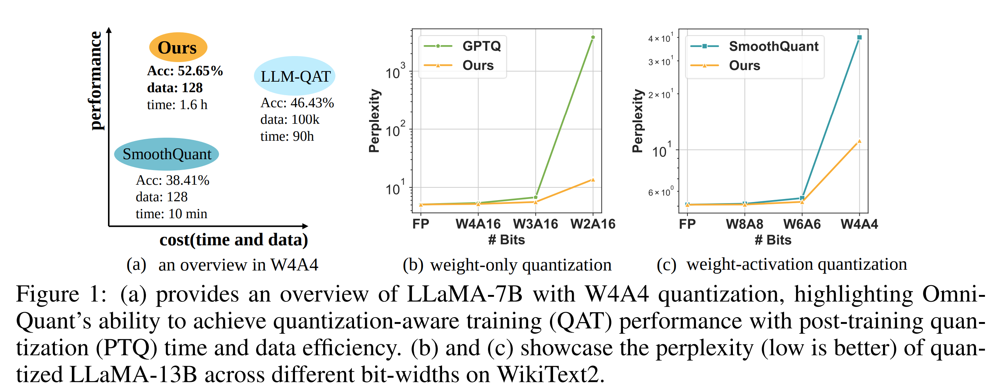
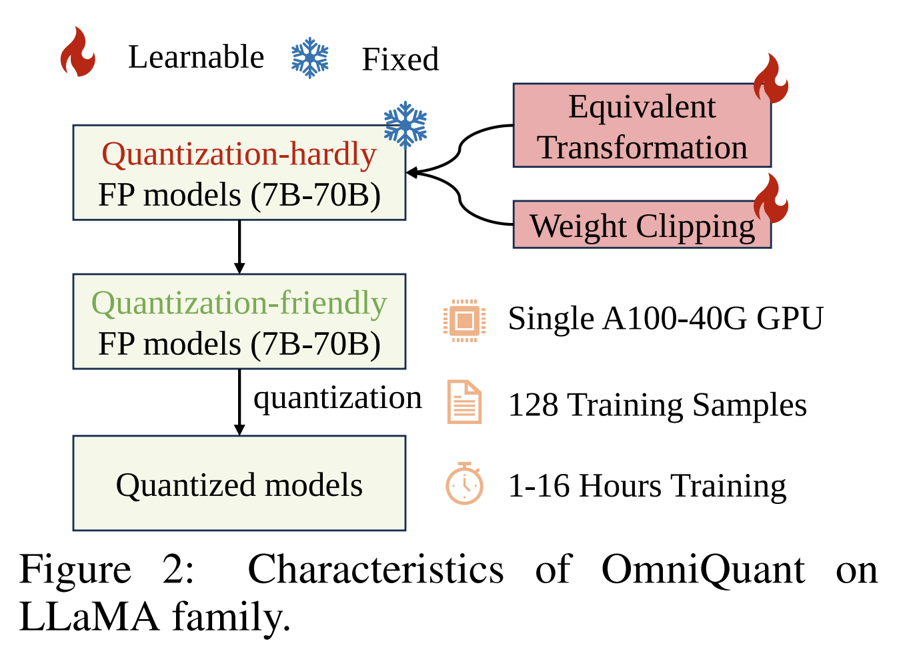
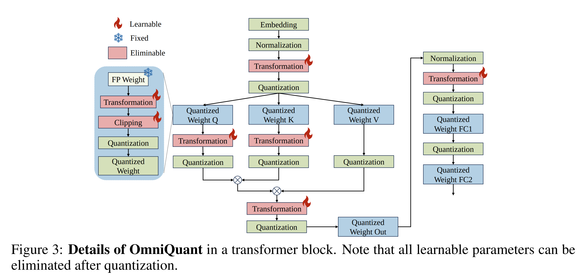
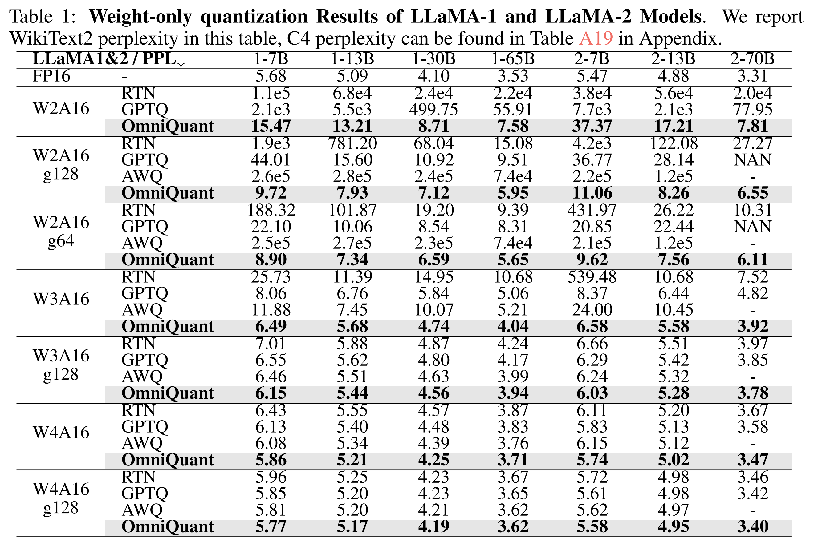
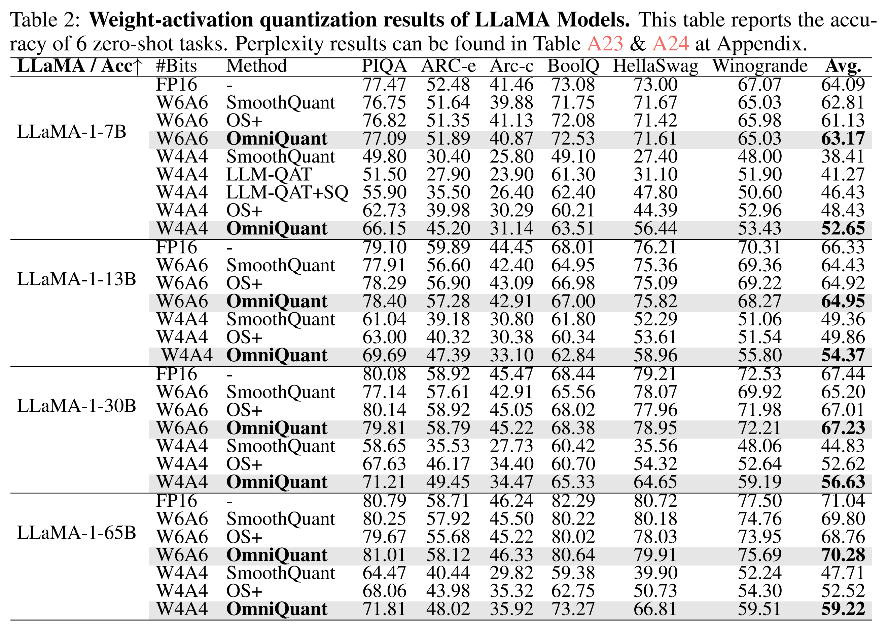
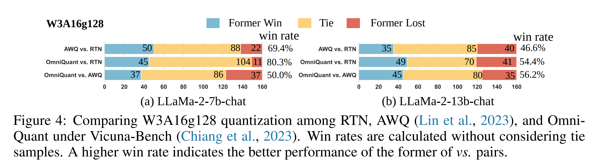
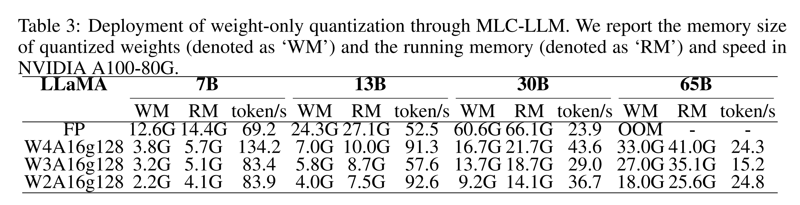

논문 및 이미지 출처 : <https://arxiv.org/pdf/2308.13137>

# Abstract

Large language models (LLMs) 은 natural language processing tasks 를 혁신적으로 변화시켰다. 그러나 이들의 실제 deployment 는 막대한 memory 및 computation 요구 사항으로 인해 제약을 받는다. 최근의 post-training quantization (PTQ) 방법은 memory footprint 를 줄이고 LLM 의 computational efficiency 를 향상시키는 데 효과적이지만, quantization parameters 를 hand-craft 하므로 특히 extremely low-bit quantization 에서 낮은 성능을 초래한다.

이 문제를 해결하기 위해 저자는 LLM 을 위한 **Omnidirectionally calibrated Quantization (OmniQuant)** 기법을 제안한다. 이 방법은 다양한 quantization settings 에서 우수한 성능을 달성하면서도 여러 quantization parameters 를 효율적으로 최적화함으로써 PTQ 의 computational efficiency 를 유지한다.

OmniQuant 는 **Learnable Weight Clipping (LWC)** 과 **Learnable Equivalent Transformation (LET)** 을 포함하는 두 가지 혁신적인 구성 요소로 이루어진다.

* LWC 는 clipping threshold 를 최적화하여 weight 의 extreme values 를 조절한다.
* LET 는 activation outliers 문제를 activation 에서 weight 로 quantization 의 어려움을 이동시킴으로써 해결한다.

Block-wise error minimization 을 사용하는 differentiable framework 내에서 동작함으로써, OmniQuant 는 weight-only quantization 과 weight-activation quantization 모두에 대해 quantization process 를 효율적으로 최적화할 수 있다.

예를 들어, LLaMA-2 model family 의 7–70B 규모는 128 samples 를 사용하여 단일 NVIDIA A100 40GB GPU 상에서 1–16 시간 내에 OmniQuant 로 처리될 수 있다.

광범위한 실험은 W4A4 (4-bit weight, 4-bit activation), W6A6, W4A16, W3A16, W2A16 과 같은 다양한 quantization configurations 전반에서 OmniQuant 의 우수한 성능을 검증한다. 또한 OmniQuant 는 instruction-tuned models 에서도 효과를 보이며, 실제 device 상에서 inference speed 향상과 memory reduction 측면에서 주목할 만한 개선을 제공한다.

# 1 Introduction

GPT-4 및 LLaMA 와 같은 Large language models (LLMs) 은 다양한 natural language benchmarks 전반에서 인상적인 성능을 보여주었다. 또한 LLM 에 내재된 language understanding capability 는 multimodal models 로 성공적으로 전이될 수 있다. 이에 따라 LLM 은 artificial general intelligence 의 전구체로 간주될 수 있다. 그러나 LLM 의 막대한 computation 및 memory 요구 사항은 상당한 도전 과제를 제기한다. 예를 들어, GPT-3 model 은 FP16 format 으로 parameters 를 로드하는 데 350G 의 memory 를 필요로 하며, 이는 inference 를 위해 최소 5 개의 A100-80G GPU 가 필요함을 의미한다. 이러한 높은 computation 자원 요구와 이에 따른 communication overhead 는 실제 application 에서 LLM 의 실질적 deployment 를 저해한다.

Quantization 은 LLM 에서 computation 및 memory overhead 를 완화하는 유망한 방법으로 입증되었다. 일반적으로 quantization 은 post-training quantization (PTQ) 과 quantization-aware training (QAT) 의 두 가지 유형으로 구분된다. 

* QAT 는 PTQ 보다 더 경쟁력 있는 accuracy 를 달성할 수 있으나, 전체 model 이 quantization process 를 인지한 상태에서 training 되므로 높은 training cost 로 인해 실용적이지 않다. 
* 그 결과, 기존 LLM quantization 방법에서는 PTQ 가 일반적으로 활용된다. 예를 들어, 다수의 PTQ 방법은 weight-only quantization 을 통해 memory consumption 을 줄이는데, 이는 weight 를 quantize 하고 activation 은 full-precision 으로 유지하는 방식이다. 
* computation overhead 를 추가로 줄이기 위해, 또 다른 연구 흐름은 weight-activation quantization 을 채택하여 weight 와 activation 을 모두 low-bit values 로 quantize 하고 low-bit matrix multiplication 을 수행한다.

기존 quantization 방법은 W4A16 (i.e., 4-bit weight 및 16-bit activation) 과 같은 weight-only quantization 및 W8A8 weight-activation quantization 등 다양한 시나리오에서 상당한 성과를 보였다. 

* 그러나 Fig. 1 (b & c) 에서 보이듯이, W2A16 및 W4A4 와 같은 low-bit quantization 환경에서는 일반적으로 성능 저하가 크게 발생한다. 
* 이러한 성능 저하는 기존 방법이 migration strength 및 scaling parameters 와 같은 hand-crafted quantization parameters 에 주로 의존하기 때문이며, 이는 낮은 성능으로 이어진다.

Quantization-Aware Training (QAT) 은 최적의 quantization configuration 을 찾는 데 효과적이지만, training 및 data efficiency 측면에서 상당한 overhead 를 초래한다. 따라서 LLMQAT 과 같은 QAT 기반 기법으로 LLM 을 효율적으로 quantize 하는 것은 어렵다. 예를 들어, GPTQ 는 PTQ 기반 접근법으로, single A100 GPU 에서 128 samples 를 사용하여 LLaMA-13B 의 quantization 을 1 시간 내에 완료할 수 있다. 반면 LLM-QAT 는 100k samples 와 수백 GPU 시간 이 필요하다. 이는 다음과 같은 핵심 질문으로 이어진다. *PTQ 의 시간 및 data efficiency 를 유지하면서 QAT 수준의 성능을 달성할 수 있는가?*

본 논문은 위 질문에 효과적으로 답하는 새로운 quantization 기법 **OmniQuant** 를 제안한다. 

* OmniQuant 는 Fig. 1 에서 보이듯이 PTQ 의 시간 및 data efficiency 를 유지하면서, 특히 low-bit 환경에서 다양한 quantization 시나리오 전반에 걸쳐 state-of-the-art 성능을 달성한다. 
* QAT 가 번거로운 weight optimization 을 포함하는 것과 달리, OmniQuant 는 원래의 full-precision weight 를 고정하고 소수의 learnable quantization parameters 만을 도입한다. 
* Fig. 2 에 나타난 바와 같이, OmniQuant 는 서로 다른 유형의 learnable quantization parameters 를 포함하는 두 가지 핵심 구성 요소로 이루어진다.
  * Learnable Weight Clipping (LWC): clipping threshold 를 최적화하여 weight 의 extreme values 를 조절한다.
  * Learnable Equivalent Transformation (LET): transformer encoder 내에서 수학적으로 동등한 transformation 을 학습함으로써 activation outliers 문제를 해결한다.

OmniQuant 는 LLM 전체의 모든 parameters 를 동시에 최적화하는 대신, block-wise quantization error minimization framework 하에서 한 layer 의 parameters 를 순차적으로 quantize 한다. 

* 이러한 방식으로 OmniQuant 는 단순한 Stochastic Gradient Descent (SGD) algorithm 을 사용하여 효율적으로 최적화될 수 있다. 
* Differentiable optimization 덕분에 LWC 와 LET 는 quantization 과정에 원활하게 통합된다. 
* LWC 는 weight quantization 의 어려움을 완화하며, LET 는 quantization 의 어려움을 activation 에서 weight 로 이동시켜 weight-only 및 weight-activation quantization 모두에 대해 범용적인 quantization framework 를 형성한다.
* 주목할 점은, LWC 의 clipping threshold 와 LET 의 equivalent factors 는 quantized weights 에 fuse 될 수 있으므로, quantized model 에 추가적인 computation 이나 parameters 를 도입하지 않는다.

Fig. 2 에 나타난 바와 같이, OmniQuant 는 제한된 자원 환경에서도 구현이 용이하다. 

* 특히 LLaMA-2 model family (7B–70B) 를 예로 들면, 모든 model 은 단일 NVIDIA A100 40GB GPU 에서 128 training samples 만을 사용하여 quantize 될 수 있다. 
* Training 시간은 quantized model 의 크기 (7B–70B) 에 따라 1–16 시간 범위이다. 
* Differentiable optimization 을 통한 LWC 와 LET 의 통합 덕분에, OmniQuant 는 다양한 quantization settings 에서 기존 PTQ 기반 방법보다 우수한 성능을 보인다. 
  * 예를 들어, LLaMA-13B 를 W2A16 으로 quantize 할 경우, OmniQuant 는 perplexity 13.21 을 달성하는 반면, GPTQ 는 Fig. 1 에서 보이듯 perplexity 가 3832 로 크게 증가한다. W4A4 quantization 에서도 유사한 성능 향상이 관찰된다.

OmniQuant 의 기여는 다음과 같이 요약된다.

1. 저자는 원래의 full-precision weights 를 고정하면서 제한된 수의 learnable parameters 를 도입하는 새로운 LLM quantization pipeline OmniQuant 를 제안한다. OmniQuant 는 gradient update 를 quantization 에 도입하면서도 PTQ 의 시간 및 data efficiency 를 유지한다.
2. OmniQuant 는 Learnable Weight Clipping (LWC) 및 Learnable Equivalent Transformation (LET) 으로 구성된다. 이 전략은 full-precision weights 및 activations 를 quantization 에 더욱 적합하게 만든다.
3. 광범위한 실험을 통해 OmniQuant 가 W4A16, W3A16, W2A16, W6A6, W4A4 와 같은 다양한 quantization settings, OPT, LLaMA, LLaMA-2, LLaMA-2-chat, Falcon 과 같은 여러 model family, 그리고 125M–180B 범위의 다양한 model size 전반에서 기존 방법을 능가함을 보인다. 또한 실제 device 상에서의 computation speedup 및 memory reduction 도 입증한다.

# 2 Related Work

## 2.1 Quantization Methods

Quantization 은 neural network 의 bit-precision 을 낮춤으로써 model size 를 줄이고 inference 속도를 향상시킨다. 현재 방법은 크게 Quantization Aware Training (QAT) 과 Post-training Quantization (PTQ) 로 구분된다. QAT 는 training 과정에서 quantization 을 시뮬레이션하여 성능을 유지하지만, 높은 training cost 로 인해 LLM 에는 적합하지 않다.

PTQ 기법인 AdaRound 및 BRECQ 는 optimal rounding 을 결정하기 위해 gradient optimization 을 사용하지만, 대규모 model 에서 모든 weight 를 tuning 하는 것은 많은 시간이 소요된다. 따라서 대부분의 LLM quantization 방법은 training-free PTQ 를 우선시하며, 이는 lower-bit 환경에서 성능을 제한하는 경향이 있다.

저자의 목표는 QAT 의 접근 방식을 모방하여 LLM quantization 에 gradient update 를 통합하면서도 PTQ 의 efficiency 를 유지하는 것이다.

## 2.2 Quantization of LLM

Quantized object 의 관점에서, 기존 LLM quantization 은 weight-only quantization 과 weight-activation quantization 의 두 분야로 분류될 수 있다.

#### Weight-only quantization

Weight-only quantization 은 weight 를 low-bit values 로 변환하는 데 초점을 둔다. 예를 들어, GPTQ 는 3/4-bit quantization 을 위해 block-wise reconstruction 을 사용한다. SpQR, OWQ, AWQ 는 높은 magnitude 의 activation 과 연관된 weight 의 중요성을 강조한다.

* SpQR 및 OWQ 는 중요한 weight 를 보호하기 위해 mixed-precision quantization 을 사용한다.
* AWQ 는 mixed-precision 의 hardware inefficiency 를 피하기 위해 channel-wise scaling 을 사용한다.

QLoRA 및 INT2.1 는 parameter-efficient fine-tuning 을 통해 quantized model 의 capability 를 복원한다. 이에 반해, 저자의 방법은 quantization process 자체를 직접 개선하며, OmniQuant 는 QLoRA 및 INT2.1 과 상호보완적이다.

#### Weight-activation quantization

Weight-activation quantization 은 weight 와 activation 을 모두 압축한다. SmoothQuant, LLM.int8(), Outlier Suppression 은 activation outliers 를 제어하여 W8A8 quantization 을 달성한다.

* LLM.int8() 는 mixed-precision decomposition 을 사용한다.
* SmoothQuant 및 Outlier Suppression 은 channel-wise scaling 을 사용한다.
* Outlier Suppression+ 는 W6A6 quantization 을 위해 channel-wise shifting 을 추가한다.

이전의 heuristic design 과 달리, 저자는 gradient optimization 을 사용하고 equivalent transformation 을 attention mechanism 으로 확장하여 K/V cache quantization 을 더욱 향상시킨다.

최근 RPTQ 및 LLM-QAT 는 W4A4 quantization 을 달성하였다. 그러나 RPTQ 는 deployment 에 비우호적인 group-wise activation quantization 을 채택하며, LLM-QAT 는 시간 소모가 큰 QAT 를 사용한다. 이에 반해 저자는 deployment-friendly 한 per-token quantization 을 통해 W4A4 quantization 을 달성하면서 PTQ 의 efficiency 를 유지한다.

# 3 OminiQuant

#### Challenge of LLM quantization

LLM quantization 에는 두 가지 주요 어려움이 존재한다.

1. activation 에 outlier channels 가 존재하기 때문에 activation quantization 이 어렵다. 
   * Weight distribution 이 flat 하고 uniform 하다는 점을 고려하여, SmoothQuant 및 Outlier Suppression+ 는 사전에 정의된 migration strength 또는 grid-search 기반 optimization 을 통해 quantization 의 어려움을 activation 에서 weight 로 이동시킨다.
2. activation 에 대응하는 weight 의 중요성으로 인해 weight 의 quantization error 역시 최종 성능에 핵심적인 역할을 한다. 
   * SpQR 및  는 중요한 weight 를 full-precision 으로 유지할 것을 제안하며, AWQ 는 grid-search 기반 channel-wise scaling 으로 이러한 weight 를 보호한다.

이러한 방법은 다양한 LLM compression 에서 일정한 성공을 거두었으나, migration strength 및 scaling factors 와 같은 hand-crafted quantization parameters 의 조잡한 설계로 인해 suboptimal performance 를 초래하며, 특히 extremely low-bit quantization 에서는 효과적으로 대응하지 못한다.

본 절에서는 quantization parameters 를 보다 유연하게 학습하는 differentiable quantization 기법 OmniQuant 를 소개한다. 이를 위해 OmniQuant 는 Sec. 3.1 에 제시된 block-wise quantization error minimization framework 로 구현된다. 또한 상기한 LLM quantization 의 문제를 해결하기 위해 다음 두 가지 learnable quantization 전략을 설계한다.

* Learnable Weight Clipping (LWC): weight quantization 의 어려움을 완화한다.
* Learnable Equivalent Transformation (LET): quantization 의 어려움을 activation 에서 weight 로 추가적으로 이동시킨다.

LWC 와 LET 는 각각 Sec. 3.2 및 Sec. 3.3 에서 설명한다.

## 3.1 Block-wise Quantization Error Minimization

AdaRound 및 BRECQ 와 같은 기존 gradient optimization 기반 PTQ 방법은 수십억 개의 parameters 를 갖는 model 에 적용하기 어렵다. 이는 solution space 가 방대하여 최적화가 어렵기 때문이다. 전체 model 을 tuning 하는 대신, 저자는 block-wise quantization error minimization 기반의 새로운 optimization pipeline 을 제안하며, 추가적인 quantization parameters 를 differentiable 하게 최적화한다.

Optimization 목표는 다음과 같이 정식화된다.

$$
\arg \min_{\Theta_1, \Theta_2}
\left\| \mathcal{F}(W, X) - \mathcal{F}\left(Q_w(W; \Theta_1, \Theta_2), Q_a(X, \Theta_2)\right)\right\|
\tag{1}
$$

여기서

* $F$ 는 LLM 의 transformer block 에 대한 mapping function 을 나타낸다.
* $W$ 와 $X$ 는 각각 full-precision weight 와 activation 이다.
* $Q_w(\cdot)$ 와 $Q_a(\cdot)$ 는 각각 weight 및 activation quantizer 이다.
* $\Theta_1$ 및 $\Theta_2$ 는 각각 LWC 와 LET 의 quantization parameters 이다.

Eqn. ${1}$ 의 block-wise quantization 은 하나의 transformer block 의 parameters 를 순차적으로 quantize 한 후 다음 block 으로 이동한다.

Block-wise minimization 은 두 가지 장점을 가진다.

* LWC 와 LET 의 quantization parameters 를 공동으로 최적화할 수 있어 weight-only 및 weight-activation quantization 을 모두 포괄할 수 있다.
* 최소한의 자원으로 쉽게 최적화할 수 있다. OmniQuant 는 소수의 quantization parameters 만을 최적화하므로, 기존 PTQ 기반 방법에서 전체 weight 를 최적화하는 것보다 훨씬 용이하다.

실험적으로, LLaMA-2 family 의 모든 model 은 128 training samples 만을 사용하여 단일 NVIDIA A100 40GB GPU 에서 quantize 될 수 있음을 확인하였다.

## 3.2 Learnable Weight Clipping

OmniQuant 는 LLM 에서 weight quantization 의 어려움을 줄이기 위해 **Learnable Weight Clipping (LWC)** module 을 사용한다. 기존의 learnable clipping threshold 기반 방법과 유사하게, LWC 도 clipping threshold 를 최적화하여 weight 의 optimal dynamic range 를 결정한다.

그러나 PACT 및 LSQ 와 같은 기존 방법을 직접 적용할 경우 만족스럽지 않은 성능이 나타난다.

기존 방법처럼 clipping threshold 를 직접 학습하는 대신, LWC 는 다음과 같이 clipping strength 를 최적화한다.

$$
W_q = \mathrm{clamp}\left(\left\lfloor \frac{W}{h} \right\rceil + z, 0, 2^N - 1 \right),
\quad \text{where}\ 
h = \frac{\gamma \max(W) - \beta \min(W)}{2^N - 1},
\quad
z = -\left\lfloor \frac{\beta \min(W)}{h} \right\rceil
\tag{2}
$$

여기서

* $\lfloor \cdot \rceil$ 은 round operation 을 의미한다.
* $N$ 은 target bit 수이다.
* $W_q$ 와 $W$ 는 각각 quantized weight 와 full-precision weight 이다.
* $h$ 는 weight 의 normalization factor 이며, $z$ 는 zero-point 값이다.
* clamp 는 값을 $[0, 2^N - 1]$ 범위로 제한한다.

Eqn. ${2}$ 에서 $\gamma \in [0,1]$ 및 $\beta \in [0,1]$ 는 각각 weight 의 upper bound 및 lower bound 에 대한 learnable clipping strength 이다. $\gamma$ 와 $\beta$ 는 sigmoid function 으로 구현된다. 따라서 Eqn. ${1}$ 에서 $\Theta_1 = \{ \gamma, \beta \}$ 가 된다.

$\gamma = 1$ 및 $\beta = 1$ 일 때, LWC 는 기존 연구에서 사용된 vanilla MinMax quantization 방식으로 환원된다. MinMax quantization 의 장점을 계승함으로써, LWC 는 clipping strength 만을 조정하여 optimal clipping threshold 를 결정하므로 optimization difficulty 를 줄인다.

Optimal threshold 로 clipping 된 original weight 는 quantization 이 용이해진다. Tab. 1 의 실험 결과는 제안된 learnable weight clipping 방법이 기존 weight-only quantization 기법을 크게 능가함을 보여준다.

## 3.3 Learnable Equivalent Transformation

LWC 가 clipping threshold 최적화를 통해 quantization-friendly 한 weight 를 가능하게 하는 것과 더불어, 저자는 **Learnable Equivalent Transformation (LET)** 을 통해 weight-activation quantization 의 어려움을 추가적으로 완화한다. 

Activation map 에 존재하는 outliers 는 특정 channel 에 체계적으로 집중되는 특성을 가진다. 기존 방법인 SmoothQuant 는 수학적으로 동등한 transformation 을 통해 quantization 의 어려움을 activation 에서 weight 로 이동시킨다. 그러나 이들은 equivalent parameters 를 hand-craft 하여 suboptimal 결과를 초래한다.

Block-wise quantization error minimization 의 도입 덕분에, LET 는 optimal equivalent parameters 를 differentiable 하게 결정할 수 있다. SmoothQuant 및 Outlier Suppression+ 에 영감을 받아, 저자는 channel-wise scaling 및 channel-wise shifting 을 사용하여 activation distribution 을 조작하고 outlier 문제에 효과적으로 대응한다. 특히 Fig. 3 과 같이 linear layer 와 attention operation 모두에서 equivalent transformation 을 적용한다.

#### Linear layer

Linear layer 는 input token sequence $X \in \mathbb{R}^{T \times C_{in}}$ 을 입력으로 받으며, 여기서 $T$ 는 token length 이다. 이는 weight matrix $W \in \mathbb{R}^{C_{in} \times C_{out}}$ 및 bias vector $B \in \mathbb{R}^{1 \times C_{out}}$ 와의 연산으로 표현된다.

수학적으로 동등한 linear layer 는 다음과 같이 표현된다.

$$
Y = XW + B
= \underbrace{[(X - \delta) \oslash s]}_{\tilde{X}}
\cdot
\underbrace{[s \odot W]}_{\tilde{W}}
+
\underbrace{[B + \delta W]}_{\tilde{B}}
\tag{3}
$$

여기서

* $Y$ 는 output 이다.
* $s \in \mathbb{R}^{1 \times C_{in}}$ 및 $\delta \in \mathbb{R}^{1 \times C_{in}}$ 는 각각 channel-wise scaling 및 shifting parameters 이다.
* $\tilde{X}, \tilde{W}, \tilde{B}$ 는 각각 equivalent activation, weight, bias 이다.
* $\oslash$ 및 $\odot$ 는 elementwise division 및 multiplication 이다.

Eqn. ${3}$ 에 의해 activation 은 quantization-friendly 하게 변환되며, 그 대가로 weight 의 quantization difficulty 가 증가한다. 이러한 맥락에서 Sec. 3.2 의 LWC 는 weight 를 quantization-friendly 하게 만들어 LET 기반 weight-activation quantization 의 성능을 향상시킨다.

변환된 activation 과 weight 에 대해 최종적으로 다음과 같이 quantization 을 수행한다.

$$
Y = Q_a(\tilde{X}) Q_w(\tilde{W}) + \tilde{B},
\tag{4}
$$

여기서

* $Q_a$ 는 vanilla MinMax quantizer 이다.
* $Q_w$ 는 learnable weight clipping (i.e., LWC) 이 적용된 MinMax quantizer 이다.

$\tilde{X}$ 의 scaling 및 shifting parameters 는 이전 normalization 또는 linear layer 에 흡수될 수 있으며, $\tilde{W}$ 의 scaling factors 는 original linear weight $W$ 에 fuse 될 수 있다. 따라서 Eqn. ${3}$ 의 equivalent transformation 은 추가적인 parameters 나 cost 없이 quantization error 를 효과적으로 줄인다.

저자는 Fig. 3 에 나타난 바와 같이 FFN 의 두 번째 linear layer 를 제외한 모든 linear layer 에 이 equivalent transformation 을 적용한다. 이는 non-linear layer 이후 feature 의 높은 sparsity 로 인해 learnable equivalent transformation 적용 시 gradient 가 불안정해지기 때문일 가능성이 있다.

#### Attention operation

Linear layer 외에도 attention operation 은 전체 computation 에서 상당한 비중을 차지한다. 또한 LLM 의 auto-regressive 특성으로 인해 각 token 의 key-value (KV) cache 를 저장해야 하며, 이는 긴 sequence 에 대해 상당한 memory 요구를 초래한다. 따라서 weight-activation quantization 설정에서 Q/K/V matrix 역시 low-bit 로 quantize 한다.

Self-attention affinity matrix 에 대한 learnable equivalent transformation 은 다음과 같이 표현된다.

$$
P = \mathrm{Softmax}(QK^T)=

\mathrm{Softmax}(\underbrace{(Q \oslash s_a)}_{\tilde{Q}}\underbrace{(s_a \odot K^T)}_{\tilde{K}^T}).
\tag{5}
$$

여기서

* $s_a \in \mathbb{R}^{1 \times C_{out}}$ 는 affinity matrix 의 scaling factor 이다.

Eqn. ${4}$ 와 유사하게, quantized affinity matrix 계산은 다음과 같이 표현된다. $P = \mathrm{Softmax}(Q_a(\tilde{Q}) Q_a(\tilde{K}^T))$

여기서도 $Q_a$ 는 MinMax quantization scheme 이며, $\tilde{Q}$ 및 $\tilde{K}$ matrix 를 quantize 한다.

Eqn. ${4}$ 및 Eqn. ${5}$ 로부터, Eqn. ${1}$ 에서 $\Theta_2 = \{ \delta, s, s_a \}$ 임을 알 수 있다.

Eqn. ${5}$ 에서 $\tilde{Q}$ 및 $\tilde{K}$ 의 channel-wise scaling factors 는 각각 query 및 key projection 의 linear weight 에 흡수될 수 있다. 또한 $V$ 에 대한 명시적 transformation 은 생략되는데, 이는 output projection linear layer 와 연관된 inverse transformation 에 의해 이미 channel-wise 로 분포가 조정되었기 때문이다.

# 4 Experiments

## 4.1 Settings

#### Quantization

저자는 weight-only quantization 과 weight-activation quantization 모두에 대해 실험을 수행한다.

Weight-only quantization 의 기본 설정은 per-channel INT4 / INT3 / INT2 weight quantization 이다. Group-wise weight quantization 은 ‘g’ 로 표기한다. 예를 들어, W3A16g128 은 128 group size 를 갖는 3-bit weight-only quantization 을 의미한다.

Weight-activation quantization 의 기본 설정은 per-channel INT6 / INT4 weight 와 per-token activation quantization 이다. 모든 intermediate activation 은 low-bit 로 quantize 되며, SoftMax output 은 long-tail distribution 으로 인해 uniform quantization 에 적합하지 않으므로 full precision 으로 유지한다.

#### Training

Channel-wise scaling factor 는 SmoothQuant 로 초기화하고, channel-wise shifting factor 는 Outlier Suppression+ 로 초기화한다.

Learnable parameters 를 최적화하기 위해 weight decay 가 0 인 AdamW optimizer 를 사용한다. Learnable weight clipping 과 equivalent transformation 의 learning rate 는 각각 $5 \times 10^{-3}$ 및 $1 \times 10^{-2}$ 로 설정한다.

Calibration dataset 은 WikiText-2 에서 무작위로 선택된 2048-token segment 128 개로 구성된다. 전체 training 과정은 단일 NVIDIA A100 GPU 에서 batch size 1 로 20 epochs 동안 수행된다. 단, W2A16 quantization 의 경우 40 epochs 를 사용한다.

Weight-activation quantization 에서는 learnable weight clipping 과 equivalent transformation 을 모두 활성화한다. Weight-only quantization 의 경우, OPT model 에서는 두 방법을 모두 사용하지만, LLaMA 에서는 clipping 만 사용한다. 이는 Tab. A3 에서 LLaMA 에 대해 equivalent transformation 의 이점이 미미함을 보이기 때문이다.

#### Models

저자는 다음 model 들에서 실험을 수행한다.

* OPT (125M–66B)
* LLaMA (7B–65B)
* LLaMA-2 (7B–70B)
* Falcon-180B
* LLaMA-2-Chat

본 논문에서는 LLaMA 결과를 중심으로 제시하며, 다른 model 에 대한 상세 결과는 Appendix 의 Sec. A8 에 제공한다.

#### Evaluation

기존 연구를 따라, quantized model 은 language generation 실험에서의 perplexity 로 평가한다. 평가 dataset 은 다음과 같다.

* WikiText-2
* Penn Treebank (PTB)
* C4

또한 zero-shot task 에서 accuracy 를 평가한다.

* PIQA
* ARC
* BoolQ
* HellaSwag

Language generation 실험은 GPTQ 설정을 따르며, 모든 zero-shot task 실행에는 lm-eval-harness 를 사용한다.

#### Baselines

Weight-only quantization 에 대해서는 다음 방법과 비교한다.

* RTN (round-to-nearest)
* GPTQ
* AWQ

Weight-activation quantization 에 대해서는 다음과 비교한다.

* SmoothQuant
* Outlier Suppression+
* RPTQ
* LLM-QAT

공정한 비교를 위해 SmoothQuant 및 Outlier Suppression+ 는 per-channel weight quantization 과 per-token activation quantization 설정으로 재현한다.

## 4.2 WEIGHT-ONLY QUANTIZATION RESULTS

LLaMA family 의 결과는 Tab. 1 에 제시되어 있으며, OPT 의 결과는 Appendix 의 Sec. A8 에 제공된다. 

* 표에서 확인할 수 있듯이, OmniQuant 는 다양한 LLM family (OPT, LLaMA-1, LLaMA-2) 및 여러 quantization configuration (W2A16, W2A16g128, W2A16g64, W3A16, W3A16g128, W4A16, W4A16g128) 전반에서 기존 LLM weight-only quantization 방법을 일관되게 능가한다.
* 이는 OmniQuant 가 다양한 quantization configuration 에 적응 가능한 범용성을 지님을 시사한다. 
  * 예를 들어, AWQ 는 group-wise quantization 에서 특히 효과적이지만, OmniQuant 는 channel-wise 및 group-wise quantization 모두에서 우수한 성능을 보인다. 
  * 또한 quantization bit 수가 감소할수록 OmniQuant 의 성능 이점은 더욱 두드러진다.

## 4.3 Weight-Activation Quantization Results

Weight-activation quantization 에서 저자의 주요 초점은 W6A6 및 W4A4 quantization 이다. SmoothQuant 가 full-precision model 대비 거의 lossless 한 W8A8 quantization 을 달성할 수 있으므로, W8A8 은 제외한다.

LLaMA family 의 결과는 Tab. 2 에, OPT 의 결과는 Appendix 의 Tab. A25 에 제시되어 있다. 

* Tab. 2 는 LLaMA weight-activation quantization 의 zero-shot task accuracy 를 보여준다. 특히 W4A4 quantization 에서 OmniQuant 는 다양한 model 에 대해 평균 accuracy 를 +4.99% ∼ +11.80% 향상시킨다.
* 주목할 점은 LLaMA-7B 에서 OmniQuant 가 최신 QAT 방법인 LLM-QAT 보다 +6.22% 더 높은 성능을 달성한다는 점이다. 
  * 이는 추가적인 learnable parameters 를 도입하는 방식이 QAT 의 global weight tuning 보다 더 효과적임을 보여준다.

## 4.4 Quantization of Instruction-tuned Models

저자의 방법의 일반화 능력을 검증하기 위해, chatbot 용 instruction-tuned model 인 LLaMA-2-Chat 에 대해 quantization 을 수행한다.

GPT-4 기반 evaluation protocol 을 사용하여 Vicuna benchmark (80 개 질문) 에서 성능을 평가한다. Position bias 를 제거하기 위해 각 쌍을 두 순서로 비교하여 총 160 회 비교를 수행한다.

Fig. 4 는 RTN, AWQ, OmniQuant 를 비교한다.

* LLaMA-2-7B-Chat 에서 OmniQuant 는 AWQ 와 동일한 50% win rate 를 보이며, RTN 대비 더 높은 승률 (80.3% vs. 69.4%) 을 기록한다.
* LLaMA-2-13B-Chat 에서 AWQ 는 RTN 보다 뒤처지지만, OmniQuant 는 quantized model 성능을 일관되게 향상시킨다.

## 4.5 Acceleration of Real Device

MLC-LLM 은 다양한 hardware 에서 language model 을 배포할 수 있는 유연한 solution 을 제공하며, 특히 CUDA 환경에서 quantized model 배포에 강점을 가진다.

OmniQuant 의 강점 중 하나는 quantized model 에 추가 연산을 요구하지 않는다는 점으로, MLC-LLM 이 OmniQuant 로 생성된 model 을 원활히 실행할 수 있다.

Tab. 3 은 NVIDIA A100 80GB 상에서 LLaMA family 의 memory 요구량 및 inference speed 를 보여준다.

* Weights Memory (WM): quantized weight 저장에 필요한 memory
* Running Memory (RM): inference 에 필요한 memory (일부 activation 이 유지되므로 더 큼)
* Inference speed: 512 tokens 생성 기준
* Quantized model 은 16-bit full-precision model 대비 memory usage 를 크게 줄인다. 예를 들어, W4A16g128 및 W2A16g128 quantization model 은 inference speed 를 거의 2 배 향상시킨다.

다만, MLC-LLM 의 INT3 / INT2 지원은 현재 최적화가 충분하지 않으며, 특히 INT3 에서 제한적이다. 

INT3 / INT2 quantization 속도 향상은 향후 연구 과제로 남겨둔다. 또한 W4A4 및 W6A6 quantization 은 현재 hardware 의 out-of-the-box 지원이 부족하므로, 본 연구에서는 weight-only quantization 의 deployment 만을 다룬다.

# 5 Conclusion

저자는 weight-only 및 weight-activation quantization 을 low-bit format 으로 확장하는 방법 OmniQuant 를 제안하였다. OmniQuant 의 핵심 원리는 원래의 full-precision weight 를 유지하면서 learnable parameters 를 추가하는 것이다.

Learnable weight clipping 과 learnable equivalent transformation 을 통해 weight 및 activation 을 quantization 에 적합하도록 최적화한다. Gradient update 를 도입하면서도, OmniQuant 는 기존 PTQ 방법과 유사한 training efficiency 를 유지한다.

OmniQuant 는 language generation 및 zero-shot task 에서 기존 방법을 능가하며, instruction-tuned LLM 에도 적합하다. 또한 추가된 parameters 가 흡수될 수 있으므로 hardware compatibility 역시 보장한다.

