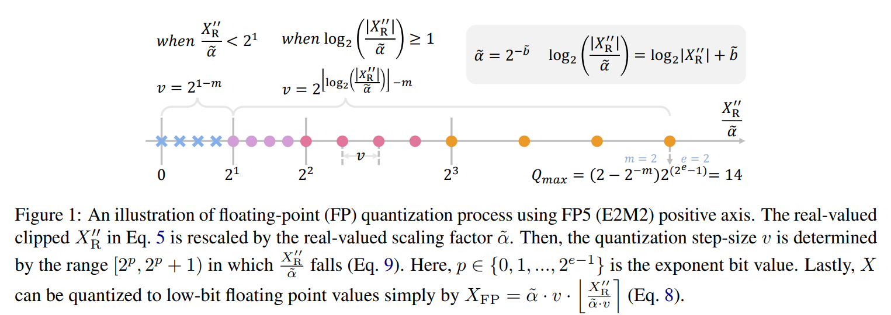
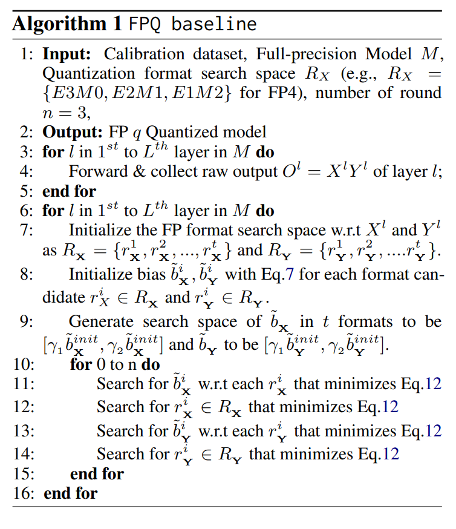
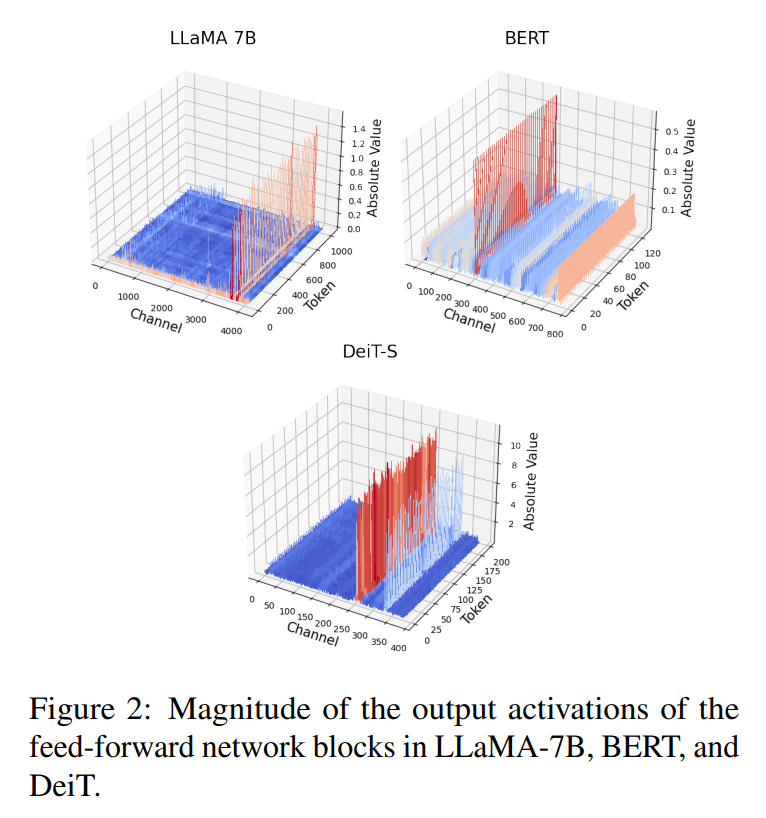
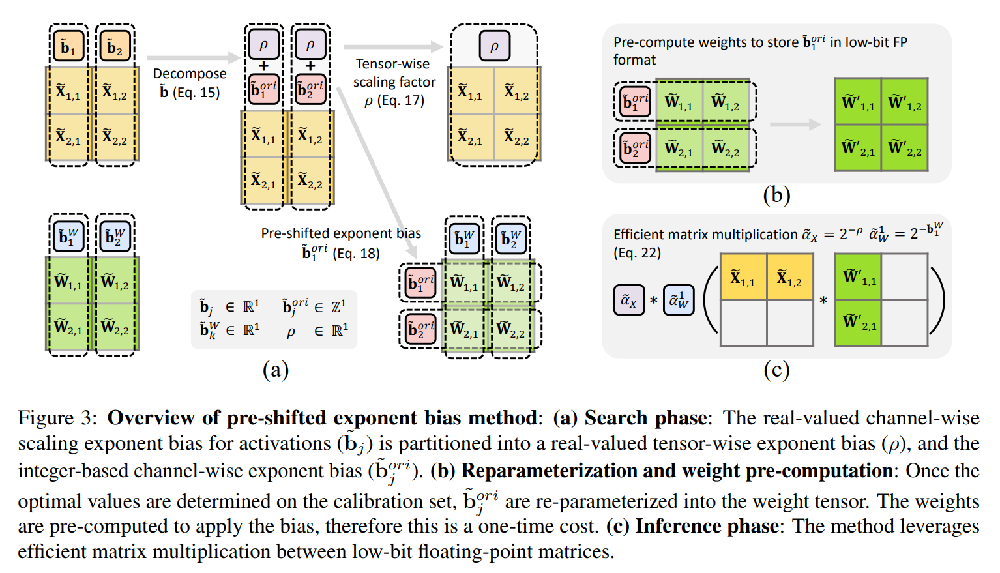
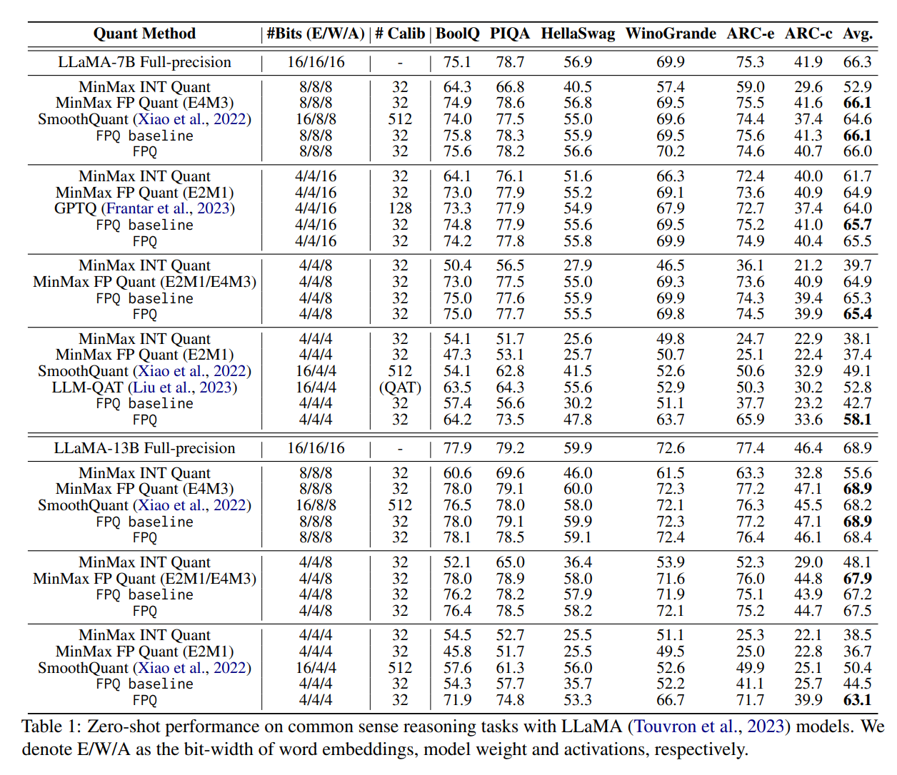
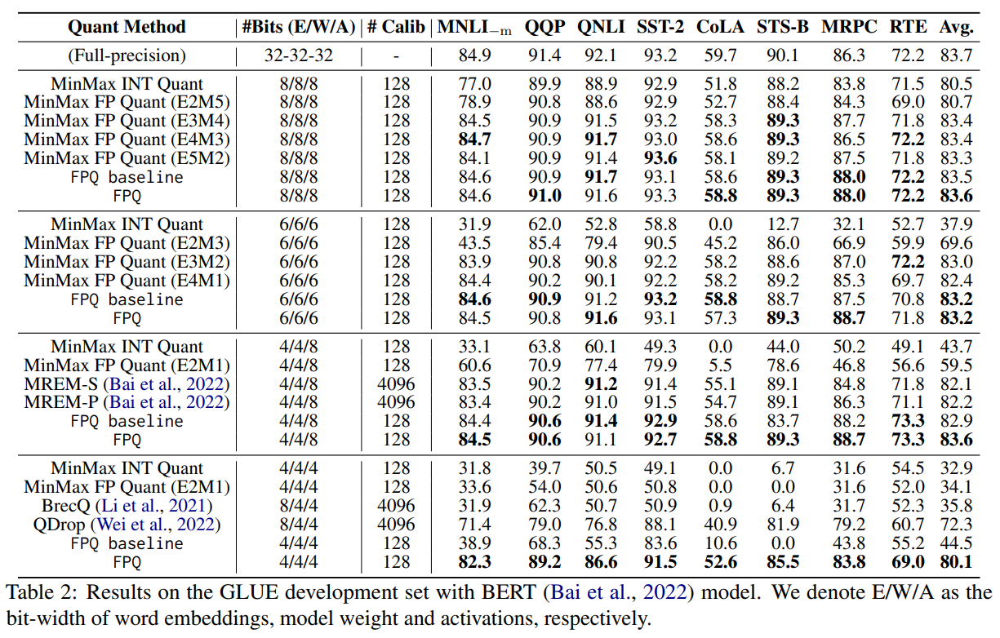
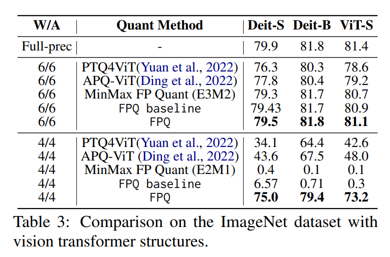
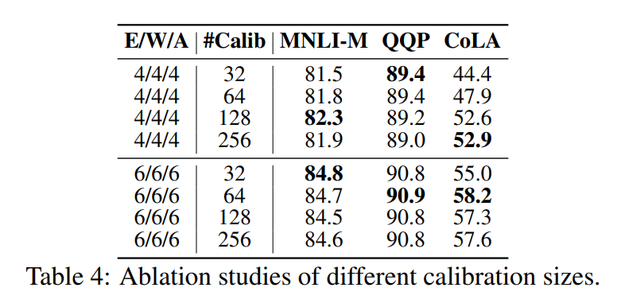
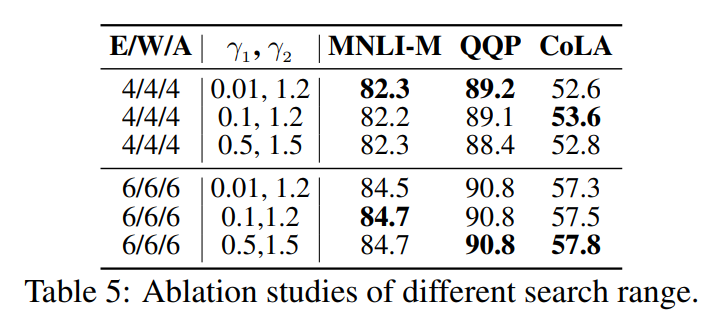
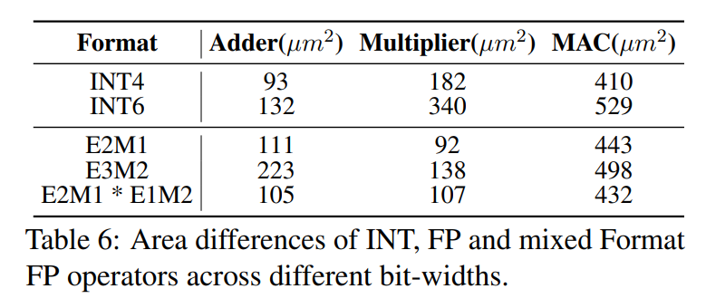

논문 및 이미지 출처 : <https://arxiv.org/pdf/2310.16836>

# Abstract

저자는 LLM-FP4 를 제안하여 large language models (LLMs) 의 weights 와 activations 을 post-training 방식으로 4-bit floating-point values 까지 quantization 한다. 기존 post-training quantization (PTQ) 방법들은 주로 integer 기반이며, 8 bit 이하의 bit width 에서 성능이 급격히 저하되는 문제가 있다. Integer quantization 과 비교할 때, floating-point (FP) quantization 은 더 유연하며 long-tail 또는 bell-shaped distributions 를 더 잘 처리할 수 있고, 여러 hardware platforms 에서 기본 선택지로 자리 잡았다.

* FP quantization 의 한 가지 특징은 성능이 exponent bits 와 clipping range 의 선택에 크게 의존한다는 점이다. 이에 대해, 저자는 최적의 quantization parameters 를 탐색하여 강력한 FP-PTQ baseline 을 구축한다.
* 또한 저자는 activation distributions 에서 높은 inter-channel variance 와 낮은 intra-channel variance 패턴을 관찰하였으며, 이는 activation quantization 의 난이도를 증가시킨다. 
* 이 패턴은 LLMs, BERT, Vision Transformer models 과 같이 다양한 task 를 위해 설계된 transformer models 전반에 걸쳐 일관되게 나타남을 확인하였다.

이를 해결하기 위해, 저자는 **per-channel activation quantization** 을 제안하고, 이러한 추가 scaling factors 를 weights 의 exponential biases 로 re-parameterization 할 수 있음을 보이며, 이로 인해 발생하는 cost 는 무시할 수 있는 수준임을 보인다.

저자의 방법은 최초로 LLaMA-13B 에서 weights 와 activations 을 모두 4-bit 까지 quantization 할 수 있으며, common sense zero-shot reasoning tasks 에서 평균 63.1 점을 달성한다. 이는 full-precision model 대비 5.8 점 낮은 수치에 불과하며, 이전 state-of-the-art 대비 12.7 점을 크게 상회하는 결과이다.

# 1 Introduction

transformer architecture 가 도입된 이후, transformers 는 recursive neural networks 를 대체하며 수많은 natural language processing (NLP) tasks 에서 지배적인 architecture 로 자리 잡았다. GPT 와 같은 모델의 등장은 transformer 의 영향력을 더욱 확대시켰으며, 이 architecture 의 대중성을 새로운 수준으로 끌어올렸다.

한편 transformer 의 활용 범위는 NLP 를 넘어 vision, audio 등 다양한 domain 으로 확장되고 있다. 서로 다른 modalities 에 대해 통합된 architecture 를 사용하는 이러한 추세는 deep learning 분야에서 획기적인 발전을 의미한다.

그러나 transformer 성능의 향상은 model size 와 computational costs 의 증가를 동반한다. 이는 memory 또는 computation resources 가 제한된 환경에서 transformer models 의 잠재력을 충분히 활용하는 데 상당한 도전 과제가 된다. transformer 에 대한 광범위한 연구와 채택에도 불구하고, transformer compression 분야는 상대적으로 충분히 탐구되지 않았다.

이러한 공백을 해소하기 위해, 본 연구는 transformer compression, 특히 floating-point post-training quantization 기법에 초점을 맞춘다.

* Post-training quantization (PTQ) 은 최소한의 fine-tuning 요구 사항으로 간단하게 사용할 수 있다는 장점을 가진다. 
* 기존 transformer 대상 PTQ 방법들은 주로 integer (INT) quantization 에 집중해 왔으며, 이는 특정 시나리오에서는 효과적일 수 있으나 bit width 가 8 bit 이하로 낮아질 경우 성능이 급격히 저하되는 문제가 있다.

반면 floating-point (FP) quantization 은 보다 유연한 대안으로 주목받고 있으며, 다양한 activation 및 weight distributions 을 더 잘 수용할 수 있다. 실제로 FP8 은 NVIDIA H100 을 포함한 여러 hardware platforms 에서 기본 선택지로 채택되고 있다.

* Integer (INT) quantization 과 달리, floating-point (FP) quantization 에서는 적절한 exponent bits 와 scale parameters 를 선택하는 것이 중요한 과제로 작용한다. 
* 부적절한 parameter 선택은 낮은 성능 또는 발산하는 quantization 결과를 초래할 수 있다.

이 문제를 해결하기 위해, 저자는 layer-wise reconstruction 을 활용하여 최적의 exponent bits 와 maximum values 를 공동으로 탐색하는 견고한 FP quantization recipe 를 제안한다. 

* 기존에 exponent bits 에 gradient updates 를 적용하는 방법과 비교할 때, 저자의 search-based 방법은 더 안정적이며 일관되게 우수한 quantization 결과를 제공하여 FP-PTQ 를 위한 강력한 baseline 을 확립한다.
* 또한 저자의 분석은 transformer 에서 activation distributions 이 높은 inter-channel variance 와 낮은 intra-channel variance 로 특징지어지는 흥미로운 패턴을 드러낸다. 
* 유사한 관찰은 이전 연구에서도 보고된 바 있으나, 저자는 이러한 패턴이 특정 task 에 국한되지 않고 transformer architecture 에 내재된 특성임을 주장한다. 이는 large language models 뿐만 아니라 BERT model 과 vision transformers 에서도 일관되게 관찰된다.

이러한 발견에 동기를 받아, 저자는 transformer 의 FP quantization 을 위한 새로운 **pre-shifted exponent bias** 를 제안한다. 

* 구체적으로, calibration data 로부터 계산된 **per-channel activation variance** 를 활용하고, 이러한 scale 을 대응되는 **FP quantized weight vectors** 의 exponential bias 로 re-parameterization 한다. 
* 이 접근은 높은 inter-channel variance 로 인한 문제를 효과적으로 해결하면서도 계산 비용을 거의 증가시키지 않는다.

요약하면, 본 논문은 transformer architectures 에 대한 floating-point post-training quantization (PTQ) 을 연구하며, 주요 기여는 다음과 같다.

* 저자는 최적의 exponent bias 와 maximal quantization value 를 결정하기 위한 search-based framework 를 제안한다. 이 방법은 안정성과 성능 측면에서 기존 기법을 능가하며, floating-point post-training quantization 을 위한 강력한 baseline 을 확립한다.
* 저자는 transformer 의 높은 inter-channel variance 문제를 효과적으로 해결하는 새로운 기법인 pre-shifted exponent bias 를 제안하며, 이는 계산 overhead 가 거의 없다.
* 실험 결과, 제안된 방법은 LLaMA-13B 에 대해 weights 와 activations 을 FP4 로 quantization 한 최초의 실용적인 모델을 제공하며, zero-shot reasoning tasks 에서 full-precision model 대비 단 5.8 점의 성능 저하만을 보인다. 이는 이전 SoTA 대비 격차를 약 70% 감소시킨다.
* 또한 저자의 방법은 BERT 와 vision transformers 로 확장되며, GLUE dataset 에서 이전 최고 4-bit quantized BERT 대비 7.8 점 높은 성능을 달성하고, ImageNet dataset 에서 4-bit DeiT-S 에 대해 기존 SoTA ViT quantization 방법 대비 31.4 점 높은 accuracy 를 달성한다.

# 2 Related Works

## 2.1 Post-Training Quantization

Model quantization 은 weight fine-tuning 을 위한 추가 training 을 수행하는지 여부에 따라 quantization-aware training (QAT) 과 post-training quantization (PTQ) 로 크게 구분된다. 대부분의 PTQ 연구는 주로 convolutional neural networks (CNNs) 에 초점을 맞추었다.

그러나 transformer 기반 models 의 인기가 증가함에 따라, transformers 에 PTQ 를 적용하려는 연구는 제한적으로만 수행되었다. 또한 기존 연구들은 주로 visual transformer models 에 집중되어 있으며, bit width 가 8 bit 이하로 낮아질 경우 성능이 크게 저하되는 문제가 있다.

따라서 본 연구에서는 language transformers 에 대한 low-bit PTQ 의 도전 과제를 심층적으로 분석한다.

## 2.2 Floating-Point Quantization

Floating-point (FP) quantization 은 long-tail distributions 을 처리할 수 있는 능력과 더 높은 유연성으로 인해 integer quantization 의 유망한 대안으로 부상하였다. 또한 H100 과 같은 최신 GPUs 는 FP quantization 을 지원한다.

그럼에도 불구하고 FP quantization 에 대한 연구는 매우 제한적이다. 일부 연구는 vision tasks 를 중심으로 한 일반적인 FP8 quantization scheme 를 제안하였으며, 다른 연구는 LLMs 에 대해 FP 와 INT formats 의 혼합 quantization 을 채택하였다.

본 연구에서는 language transformer models 압축을 위한 low-bit floating-point PTQ 의 일반적인 가이드라인으로 FPQ baseline 을 제안한다.

# 3 Preliminaries

## 3.1 Formulation of Floating-Point Variables

standard floating-point number 는 다음과 같이 표현된다:

$$
X_{FP} = (-1)^s 2^{p-b} \left( 1 + \frac{d_1}{2} + \frac{d_2}{2^2} + \dots + \frac{d_m}{2^m} \right) \tag{1}
$$

여기서

* $s \in {0, 1}$ 는 sign bit 이다.
* $d_i \in {0, 1}$ 는 $i$ 번째 mantissa bit 이며, $m$ 은 mantissa bits 의 개수를 의미한다.
* $p$ 는 $[0, 2^e - 1]$ 범위의 정수이며, $e$ 는 exponent bits 의 개수이다.
* $b$ 는 integer exponent bias 이다.
* Exponent bits 가 $j$ 개이고 mantissa bits 가 $k$ 개인 floating point format 은 $E_j M_k$ 로 표기한다.

## 3.2 Floating-Point Quantization Process

Integer quantization 에서 real-valued variable $X_R$ 는 다음과 같이 integer $X_{INT}$ 로 quantization 된다:

$$
X_{INT} = \alpha \left\lfloor \text{Clip}\left( \frac{X_R}{\alpha}, Q_{\min}, Q_{\max} \right) \right\rceil \tag{2}
$$

* 여기서 $\lfloor \cdot \rceil$ 은 rounding function 이다.
* $X_R$ 는 real-valued variable 이며, 
* $\alpha$ 는 full-precision scaling factor 이고, 
* $Q_{\min}, Q_{\max}$ 는 quantization range 의 최소/최대값이다.

유사하게, real-valued variable $X_R$ 는 두 단계로 floating-point $X_{FP}$ 로 변환된다.

#### (1) Scale and clip

FP quantization 에서도 quantization 이전에 real-valued variable 을 scale 및 clip 한다:

$$
X'_R = \text{Clip}(X_R, Q_{\min}, Q_{\max}) \tag{3}
$$

Signed floating-point quantization 의 최소/최대값 범위는 Eq. 1 로부터 다음과 같이 계산된다:

$$
Q_{\max} = -Q_{\min} = (2 - 2^{-m}) 2^{2^e - b - 1} \tag{4}
$$

* 여기서 integer exponent bias $b$ 는 $Q_{\max}$ 와 $Q_{\min}$ 을 제어하는 또 다른 hyperparameter 이며, 
* 이는 $\alpha$ 와 유사한 기능을 수행한다.

따라서 단순화를 위해 Eq. 3 을 다음과 같이 재정의한다:

$$
X''_R = \text{Clip}(X_R, \tilde{Q}_{\min}, \tilde{Q}_{\max}), \tag{5}
$$

여기서

$$
\begin{align*}
\tilde{Q}_{\max} = \alpha Q_{\max} &= \alpha \cdot (2 - 2^{-m}) 2^{2^e - b - 1} \\
&= \alpha \cdot 2^{-b} \cdot (2 - 2^{-m}) 2^{2^e - 0 - 1} \\
&= 2^{-\tilde{b}} \cdot (2 - 2^{-m}) 2^{2^e - 0 - 1}
\end{align*} \tag{6}
$$

* 여기서 tensor-wise real-valued scaling factor $\alpha$ 와 integer exponent bias $b$ 를 결합하여 새로운 scaling factor $\tilde{\alpha} = 2^{-\tilde{b}} = 2^{-b} \cdot \alpha$ 를 형성한다.

$\tilde{b}$ 는 완화된 tensor-wise real-valued exponent 이며, Eq. 6 으로부터 원하는 clipping value $\tilde{Q}_{\max}$ 를 이용하여 다음과 같이 계산할 수 있다:

$$
\tilde{b} = 2^e - \log_2 \tilde{Q}_{\max} + \log_2 (2 - 2^{-m}) - 1 \tag{7}
$$

#### (2) Compare and quantize

Integer quantization 은 단순히 rounding function 을 사용하여 real-valued variables 를 quantized variables 로 변환한다. 반면 floating-point quantization 에서는 quantization levels 과 비교하는 추가 단계가 존재한다:

$$
X_{FP}
= \tilde{\alpha} \cdot v \cdot
\left\lfloor
\frac{X''_R}{\tilde{\alpha} \cdot v}
\right\rceil \tag{8}
$$

여기서

* $X''_R$ 는 clipped real-valued variable (Eq. 5) 이다.
* $\tilde{\alpha}$ 는 tensor-wise floating-point scaling factor 이다.
* $v$ 는 2 의 정수 거듭제곱이다.

$v$ 는 다음과 같이 정의된다:

$$
v =
\begin{cases}
2^{\lfloor \log_2 |X''_R| + \tilde{b} \rfloor - m}
& \text{if } \lfloor \log_2 |X''_R| + \tilde{b} \rfloor \ge 1 \\
2^{1-m}
& \text{otherwise}
\end{cases} \tag{9}
$$

* 여기서 quantization level $v$ 는 $\frac{X''_R}{\tilde{\alpha}}$ 의 magnitude, 즉 $X''_R \cdot 2^{\tilde{b}}$ 에 따라 선택된다. 

이후 Eq. 8 을 통해 floating-point quantized variables 를 도출할 수 있다.

## 3.3 Floating-Point Matrix Multiplication

Floating-point quantized variables 를 사용한 matrix multiplication 은 다음과 같이 표현된다:

$$
O_{out}^{i,k}
= X_{FP}^{i,:} W_{FP}^{:,k}
= \tilde{\alpha}_X \tilde{\alpha}_W^k
\tilde{X}_{FP}^{i,:}
\tilde{W}_{FP}^{:,k} \tag{10}
$$

* 여기서 per-tensor activation quantization 과 per-channel weight quantization 을 가정한다.

* $X_{FP}^{i,:}$ 는 activation matrix 의 $i$ 번째 row 이다.
* $W_{FP}^{:,k}$ 는 weight matrix 의 $k$ 번째 column 이다.

따라서 output matrix 의 각 element $O_{out}^{i,k}$ 는 두 real-valued scalars $\tilde{\alpha}_X$ 와 $\tilde{\alpha}_W^k$ 의 곱과, 대응되는 quantized activation 및 weight vectors 의 곱으로 계산된다.

이와 같은 효율적인 matrix multiplication 을 지원하는 모든 가능한 quantization granularity 옵션은 Appendix D 에서 제시된다.

# 4 Method

본 절에서는 먼저 joint format 및 max value search 를 소개하며, 이는 강력한 baseline 을 확립하고 8-bit 및 6-bit quantization 에서 이미 state-of-the-art 성능을 달성한다. 이후 transformer models 에서 치명적인 high inter-channel activation variance 문제를 해결하고 quantization 한계를 4-bit 까지 확장하기 위한 효율적인 pre-shifted exponent bias 를 제안한다.

## 4.1 Joint Format and Max Value Search

Post-training quantization 의 목적은 quantization 으로 인해 pre-trained real-valued network 에 도입되는 perturbation $\delta X = X_{FP} - X_R$ 를 최소화하는 것이다:

$$
\min \mathbb{E} \big[ \mathcal{L}(X_R + \delta X) - \mathcal{L}(X_R) \big] \tag{11}
$$

본 연구에서는 quantized model 의 intermediate output 변화와 Eq. 11 사이에 양의 상관관계가 존재한다고 가정하는 설정을 채택한다. 따라서 quantized layer 의 intermediate output $\hat{O}$ 와 원래 layer 의 output $O$ 사이의 거리를 최소화하는 것은 Eq. 11 을 최소화하는 것으로 이어진다.

이에 따라 objective loss metric 은 다음과 같이 정의된다:

$$
\min (\hat{O} - O)^2 \tag{12}
$$

이 metric 은 이후 제안하는 framework 에서 최적의 FP quantization function 을 탐색하는 데 사용된다.

FP quantization 의 어려움은 quantization format 과 clipping range 에 대한 높은 민감성에서 비롯된다. 부적절한 format 선택은 catastrophic error rate 를 초래한다. 또한 최적의 clipping range 는 사용되는 format 에 따라 달라진다.

기존 floating-point (FP) quantization-aware training (QAT) 연구에서는 gradient 를 이용하여 FP format 과 maximum value 를 동시에 학습하는 방법을 제안하였다. 그러나 저자는 PTQ 환경에서 이 방법이 over-fitting 문제를 겪으며, accuracy 가 naïve MinMax method 보다도 낮아지는 현상을 관찰하였다.

이에 따라 저자는 format 과 그에 대응하는 clipping range 를 jointly 결정하는 search-based algorithm 을 제안한다.

Search 과정은 layer-by-layer 로 수행되며, Eq. 12 를 최소화하는 metric 을 기준으로 한다.

각 sub-module 에 대응되는 matrix multiplication 의 output 을 다음과 같이 정의한다: $O = X Y$

* 여기서 $Y$ 는 weight tensor $W$ 이거나 다른 activation tensor 일 수 있다.

$q$-bit FP format 의 search space 는 exponent bit 가 0 인 format 을 제외한 모든 format 을 포함한다. exponent bit 가 1 인 경우 이미 INT quantization 으로 퇴화하기 때문이다.

저자는 scaling factor 의 logarithm 과 동일한 real-valued exponent bias $\tilde{b}$ 를 탐색한다.

$\tilde{b}_X$ 와 $\tilde{b}_Y$ 는 각각 $Q_{\max} = \max |X_R|$ 및 $\max |Y_R|$ 로 설정하여 Eq. 7 을 통해 초기화한다.

이후 $\tilde{b}_X$ 와 $\tilde{b}_Y$ 의 search space 를 다음과 같이 정의한다:

* 구간 $[\gamma_1 \tilde{b}^{init}_X, \gamma_2 \tilde{b}^{init}_X]$
* 구간 $[\gamma_1 \tilde{b}^{init}_Y, \gamma_2 \tilde{b}^{init}_Y]$

여기서

* $\gamma_1 = 0.01$
* $\gamma_2 = 1.2$
* $k = 100$

으로 설정하며, 각 구간을 선형적으로 $k$ 개의 interval 로 분할한다.

Search 과정은 모든 matrix multiplication layers 에 대해 병렬로 수행된다. 알고리즘은 두 부분으로 나뉜다.

1. Forward propagation 을 수행하여 각 layer $l$ 의 intermediate raw output 을 저장한다.
2. Reconstruction metric (Eq. 12) 을 최소화하도록 각 layer 에 대해 optimal format 과 biases 를 세 차례 반복하여 갱신한다.

저자는 이 search-based framework 를 **Floating Point Quantization Baseline (FPQ baseline)** 이라 명명한다.

이 FPQ baseline 은 이미 8-bit 및 6-bit 설정에서 state-of-the-art 성능을 달성한다.

## 4.2 Pre-Shifted Exponent Bias

Transformer architectures 에서 저자는 높은 inter-channel variance 라는 흥미로운 현상을 관찰하였다. 

* Fig. 2 에서 보이듯이, 동일한 channel 내의 값들의 magnitude 는 서로 유사하지만, 서로 다른 channel 간에는 상당한 차이를 보인다. 
* 이 현상은 language models (예: LLaMA, BERT) 뿐만 아니라 vision transformer models 에서도 뚜렷하게 나타난다.

Outlier channels 는 다른 channel 들보다 수 자릿수 이상 큰 값을 가지는 경우가 많으며, 이로 인해 quantized tensor 의 quantization precision 을 지배하게 된다. 그 결과, 작은 magnitude 를 가지는 channel 들은 representation capacity 가 감소하게 된다. 따라서 tensor-wise 또는 token-wise scaling factor 만으로는 activation quantization 을 정확하게 수행하기에 충분하지 않다.

그러나 activation 에 per-channel scaling factor 를 적용하면 효율적인 matrix multiplication 에 어려움이 발생한다. 이는 scaling factor 가 multiplication 방향을 따라 공유되는 상수가 아니기 때문에 Eq. 10 과 같이 분리하여 표현할 수 없기 때문이다.

이를 해결하기 위해 저자는 **pre-shifted exponent bias** 를 제안한다. 이 방법은 activation 으로부터 per-channel scaling factor 를 계산한 뒤, 이를 대응되는 weight 의 exponent bias 로 re-parameterization 한다. 이 접근은 높은 inter-channel variance 문제를 효과적으로 처리하면서도 per-tensor quantization 과 거의 동일한 효율을 유지한다.

---

Eq. 7 에서 tensor-wise integer exponent bias $b$ 를 추출하고 이를 real-valued scaling factor $\alpha$ 와 결합하여 새로운 scaling factor 를 형성하였다: $\tilde{\alpha} = 2^{-\tilde{b}} = 2^{-b} \cdot \alpha$

따라서 floating-point quantization 공식 (Eq. 13) 은 다음과 같이 표현된다:

$$
X_{FP}
= 2^{-\tilde{b}}
(-1)^s
2^{p-0}
\left(
1 + \frac{d_1}{2}

+ \frac{d_2}{2^2}
+ \dots
+ \frac{d_m}{2^m}
  \right) \tag{13}
$$

Bias 가 scaling factor 에 흡수된 이후에는, FP 공식 내의 원래 bias 항 $(b^{ori})$ 는 항상 0 이 된다.

Inter-channel variance 를 처리하기 위해, 저자는 integer exponent bias 를 per-channel variant 로 설정한다: $b^{ori} \in \mathbb{Z}^c$

---

Channel-wise integer bias vector $b^{ori}$ 계산은 다음과 같이 수행된다.

먼저 per-channel maximum value 로부터 초기 per-channel real-valued scaling factor $2^{-\tilde{b}_j}$ 를 계산한다:

$$
\tilde{b}_j = 2^e - \log_2 \left( \max \left( |X_R^{:,j}| \right) \right) + \log_2 (2 - 2^{-m}) - 1 \tag{14}
$$

* 여기서 $X_R^{:,j}$ 는 activation matrix 의 $j$ 번째 channel 을 의미한다.

그 다음, $\tilde{b}$ 를 tensor-wise real-valued scaling factor 와 channel-wise integer scaling factor 로 분리한다:

$$
\begin{align*}
\tilde{b} &= \tilde{\rho} + b^{ori} \\
& = \tilde{\rho} + \text{clip} \left( \lfloor \tilde{b} - \tilde{\rho} \rceil, 0, 2^e - 1 \right)
\end{align*} \tag{15}
$$

* 여기서 $\tilde{\rho} \in \mathbb{R}^1$
* $b^{ori} \in \mathbb{Z}^c$

Activation tensor 의 $j$ 번째 channel 의 한 원소는 다음과 같이 재작성된다:

$$
\begin{align*}
  X_{FP} &= 2^{-\tilde{b}_j} (-1)^s 2^{p-0} \left( 1 + \frac{d_1}{2} + \dots + \frac{d_m}{2^m} \right) \\
  &= 2^{-\tilde{\rho}} (-1)^s 2^{p-b^{ori}_j} \left( 1 + \frac{d_1}{2} + \dots + \frac{d_m}{2^m} \right)
\end{align*} \tag{16}
$$

* 여기서 $b^{ori}$ 는 $[0, 2^e - 1]$ 범위의 정수로 제한되며, 표준 floating-point 계산과 호환된다.

그러나 inference 시 각 channel 에 서로 다른 bias 를 적용하면 hardware 연산이 추가될 수 있다. 이를 방지하기 위해 저자는 per-channel activation bias 를 weight tensor 로 re-parameterization 하고 calibration set 을 사용하여 weight 를 사전 계산한다. 이로써 exponent bias shifting 은 calibration 단계에서만 수행된다.

이후 activation tensor 의 $j$ 번째 channel 의 원소는 다음과 같이 된다:

$$
X_{FP} = 2^{-\tilde{\rho}} (-1)^s 2^{p-0} \left( 1 + \frac{d_1}{2} + \dots + \frac{d_m}{2^m} \right) \tag{17}
$$

대응되는 weight tensor 의 $j$ 번째 row 의 원소는 다음과 같다:

$$
W_{FP} = 2^{-\tilde{b}^W} (-1)^s 2^{p-b^{ori}_j} \left( 1 + \frac{d_1}{2} + \dots + \frac{d_m}{2^m} \right) \tag{18}
$$

따라서 Eq. 10 의 효율적인 matrix multiplication 은 다음과 같이 재정의된다:

$$
O_{out}^{i,k} = X_{FP}^{i,:} W_{FP}^{:,k} = \tilde{\alpha}_X \tilde{\alpha}_W^k \tilde{X}_{FP}^{i,:} \left( \beta \odot \tilde{W}_{FP}^{:,k} \right) \tag{19}
$$

여기서

* $\odot$ 는 element-wise multiplication 이다.
* $\beta = 2^{-b^{ori}}$
* $(\beta \odot \tilde{W}^{FP}_{:,k})$ 는 미리 계산되어 low-bit FP format 으로 저장될 수 있다.

이 방법은 모든 fully-connected layers 의 quantization 에 적용된다.

Search 과정에서, 저자는 $\tilde{\rho}_X$ 를 $\min_j (\tilde{b}_j)$ 로 초기화한다. 이후 $\tilde{b}_X$ 는 Eq. 14 로 계산된 bias 로 고정하고, $\tilde{\rho}_X$ 를 $[\gamma_1 \tilde{\rho}^{init}_X, \gamma_2 \tilde{\rho}^{init}_X]$ 범위에서 탐색한다.

Pre-shifted exponent bias 방법을 joint format 및 max-value search framework (FPQ baseline) 와 결합한 전체 방법을 저자는 **FPQ (Floating Point Quantization)** 라 명명한다.

# 5 Experiments

제안한 방법의 효과를 검증하기 위해, 저자는 5.2.1 절과 5.2.2 절에서 LLaMA 및 BERT models 에 대해 실험을 수행한다. 또한 5.2.3 절에서는 제안한 방법이 vision transformer architectures 에도 잘 일반화됨을 보인다.

5.3 절에서는 calibration size 와 search range 에 대한 ablation studies 를 제시하며, 5.4 절에서는 FP operators 구현에 따른 hardware cost 를 분석한다.

## 5.1 Experiments Details

저자는 activation 에 대해 per-tensor quantization 을 적용하고, weight 에 대해서는 per-channel quantization 을 적용한다. Layer reconstruction 은 기존 설정을 따르며, parallel quantization 또한 선행 연구의 방식을 따른다. 구현 세부 사항에 대한 보다 자세한 논의는 Appendix F 에 제시된다.

* **LLaMA models**
  * Fully-connected layers 의 모든 weight 및 activation tensors 를 quantization 하여 기존 연구와 공정한 비교를 수행한다.
* **BERT 및 ViT models**
  * Fully-connected layers 뿐만 아니라 self-attention module 의 activation-activation multiplication tensors 도 quantization 한다.

BERT 및 ViT models 에 FPQ 를 적용할 때는 reconstruction metric (Eq. 12) 대신 Hessian approximation loss metric 을 사용한다. 이에 대한 자세한 내용은 Appendix A 에 기술된다.

## 5.2 Main Results

### 5.2.1 LLM Zero-Shot Reasoning

저자는 LLaMA-7B 및 LLaMA-13B 에 대해 common sense zero-shot reasoning tasks 에서 FPQ 의 효과를 평가한다.

Calibration data 로는 C4 dataset 에서 길이 2048 tokens 인 random segments 32 개를 sampling 하여 사용한다. Data preprocessing 및 score 계산은 EleutherAI evaluation harness 를 기반으로 수행한다.

Tab. 1 에서 FPQ 를 다음 방법들과 비교한다:

* Floating-point PTQ baselines
* State-of-the-art PTQ 및 QAT methods
  * SmoothQuant
  * GPTQ
  * LLM-QAT

---

* Naïve MinMax INT Quantization 을 제외한 모든 방법은 LLaMA-7B 및 LLaMA-13B 에서 8-bit 설정에서 유사한 성능을 보인다.
* Naïve MinMax FP Quantization 은 거의 lossless 결과를 달성하며, state-of-the-art integer PTQ 방법인 SmoothQuant 를 능가한다.
* 이는 floating-point quantization 이 transformer distributions 을 처리하는 데 본질적으로 강한 능력을 가짐을 시사한다.

그러나 4/4/4 ultra-low bit 설정으로 precision 을 낮추면 다음과 같은 문제가 발생한다:

* MinMax FP Quant:
  * LLaMA-7B 에서 28.9% accuracy 감소
* FPQ baseline (search 만 적용, pre-shifted bias 없음):
  * LLaMA-7B 에서 23.8% accuracy 감소

이 극단적 설정에서는 기존 state-of-the-art 방법들도 심각한 성능 저하를 보인다:

* SmoothQuant
* LLM-QAT

이에 비해 FPQ 는 ultra-low bit 설정에서도 강력한 성능을 보인다.

* 4/4/4 bit-width 에서
  * LLaMA-7B: 8.2% accuracy 감소
  * LLaMA-13B: 5.8% accuracy 감소
* 이는 SmoothQuant 대비 큰 폭의 개선이며, 더 낮은 bit-width 와 더 작은 calibration size 를 사용했음에도 우수한 결과를 달성한다.
* 또한, LLaMA-7B 4/4/4 설정에서 LLM-QAT 대비 5.3% accuracy 향상
* LLaMA-7B 4/4/16 설정에서 GPTQ 대비 1.5% accuracy 향상

실무 관점에서 중요한 것은 bit-width 에 따라 적절한 quantization 방법을 선택하는 것이다. 저자는 accuracy 와 search/optimization efficiency 사이의 trade-off 를 고려하여 다음과 같은 권고안을 제시한다.

1. **8/8/8 설정**
   * MinMax FP Quant 과 다른 방법들 간 성능 차이가 매우 작다.
   * MinMax 방법은 search 과정이 필요 없다.
     → 따라서 8/8/8 설정에서는 MinMax FP Quant 사용을 권장한다.
2. **더 낮은 bit 설정 (특히 activation 4-bit)**
   * 정확도 저하를 최소화해야 하는 경우
     → FPQ 사용을 권장한다.
   * FPQ 는 negligible inference overhead 로 accuracy degradation 을 크게 줄인다.

### 5.2.2 BERT Model

저자는 BERT model 에 대해 GLUE tasks 에서 제안한 quantization 기법을 평가한다. Full-precision BERT-base models 는 GLUE datasets 에 대해 fine-tuning 된 모델을 Huggingface public repository 로부터 가져온다. Calibration set 으로는 training set 에서 무작위로 128 개의 데이터를 sampling 하여 사용한다.

Tab. 2 에서 FPQ 는 다음과 같은 우수한 성능을 보인다:

* 4/4/4 bit 설정에서
  * BrecQ 대비 평균 44.3% 절대 accuracy 향상
  * QDrop 대비 7.9% 향상

또한 4-bit weight 와 8-bit activation 설정에서:

* MREM-S / MREM-P 는 4096 개의 calibration data 를 사용했음에도 Full-precision model 대비 1.6% / 1.5% accuracy 차이를 보인다.
* FPQ 는 단 128 개의 calibration data 만으로 거의 accuracy loss 없이 성능을 유지한다.

### 5.2.3 Generalizability on Vision Transformer

Fig. 2 에서 보인 것처럼, vision transformers 역시 language transformers 와 동일하게 높은 inter-channel variance 와 낮은 intra-channel variance 라는 activation distribution 패턴을 보인다.

이에 따라 저자는 제안한 방법을 ViT 에 확장하고, ImageNet classification task 에서 floating-point PTQ baselines 및 state-of-the-art PTQ 방법과 비교하였다.

Tab. 3 의 결과는 language models 에서의 관찰과 일관된다:

* 기존 state-of-the-art integer 기반 방법들은 transformer 를 low-bit 로 quantization 할 경우 reasonable accuracy 를 유지하는 데 어려움을 겪는다.
* 반면 FPQ 는 다음과 같은 결과를 보인다:
  * 6-bit 설정에서 PTQ4ViT 및 APQ-ViT 를 능가
  * DeiT-S 4-bit 설정에서 
    * PTQ4ViT 대비 40.9% 절대 accuracy 향상
    * APQ-ViT 대비 31.5% 절대 accuracy 향상
* 이는 FPQ 가 vision transformer 에도 강하게 일반화됨을 보여준다.

## 5.3 Ablation Study

저자는 calibration size 가 FPQ 에 미치는 영향을 분석한다. Calibration size 를 ${32, 64, 128, 256}$ 로 변화시키고 MNLI, QQP, CoLA 에서 평가한다.

Tab. 4 의 결과는 다음과 같다:

* MNLI 및 QQP 는 calibration size 변화에 대해 비교적 robust 하다.
* CoLA 는 variance 가 상대적으로 더 크다.
* FPQ 는 128 개의 calibration data 에서 우수한 성능을 보인다.
* 심지어 32 개의 calibration data 만 사용해도 competitive accuracy 를 유지한다.

즉, FPQ 는 calibration data 가 제한적인 상황에서도 안정적인 성능을 보인다.

FPQ 의 search range 에 대한 robustness 도 분석한다.

세 가지 설정을 비교한다:

* $(0.01, 1.2)$
* $(0.1, 1.2)$
* $(0.5, 1.5)$

MNLI, QQP, CoLA 에서 평가한 Tab. 5 의 결과는 다음과 같다:

* 특정 search range 가 모든 task 에서 일관되게 가장 우수하지는 않다.
* 예를 들어:
  * $(0.01, 1.2)$ 는 MNLI 및 QQP 에서 $(0.5, 1.5)$ 보다 우수
  * 그러나 4-bit 설정의 CoLA 에서는 약간 열세

전반적으로, search range 가 지나치게 aggressive 하지 않은 한 FPQ 는 다양한 $(\gamma_1, \gamma_2)$ 설정에 대해 robust 하다.

## 5.4 Hardware Cost

저자는 low-bit INT, FP, 그리고 mixed-format FP multiplication operators 의 hardware utilization 을 hardware area 관점에서 분석한다.

분석 대상:

* Adder
* Multiplier
* Multiply-Accumulate (MAC) units

Mixed-format FP 는 서로 다른 FP format 간 곱셈을 의미한다. 예를 들어, $E2M1$ 과 $E1M2$ 의 곱셈이다.

MAC operator 는 Verilog HDL 로 구현되었으며, Cadence Genus 를 이용하여 TSMC 40nm technology 및 0.5GHz clock frequency 하에서 synthesized area 를 측정하였다.

Tab. 6 의 결과는 다음과 같다:

* INT 의 경우
  * Multiplier 가 주요 hardware cost 요소이다.
* FP 의 경우
  * Adder 가 주요 hardware cost 요소이다.
* FP4 와 INT4 adder 간 hardware cost 차이는 작다.
* 그러나 INT 는 multiplier 에서 FP 대비 약 2 배의 hardware cost 를 가진다.
* Mixed-format FP4 operator 는 standard FP4 operator 와 유사한 hardware area 를 가진다.

이 결과는 다음을 시사한다:

* 제안한 FPQ 는 standard FP operators 대비 hardware overhead 가 거의 없다.
* FP 의 hardware cost 는 INT 와 비교해도 유사한 수준이다.

# 6 Conclusion

본 논문은 natural language transformer architectures 에 대해 weights, activations, embeddings 를 포함한 4-bit floating-point post-training quantization 의 최초 성공 사례를 제시한다. 이는 large language models 과 BERT model 모두를 포함한다.

또한 제안한 방법을 vision transformers 에 확장하였으며, 강한 generalization 능력을 확인하였다.

제안한 접근은 다음 두 가지 핵심 요소로 구성된다:

* Practical search-based technique
  * 강력한 baseline 을 확립
  * 6-bit 및 8-bit quantization 에서 state-of-the-art 성능 달성
* Pre-shifted exponent bias
  * Transformer 의 높은 inter-channel variance 문제를 해결
  * 정확한 4-bit quantization 을 효과적으로 달성

이를 통해 FPQ 는 ultra-low bit floating-point quantization 을 실용적인 수준으로 끌어올렸다.
