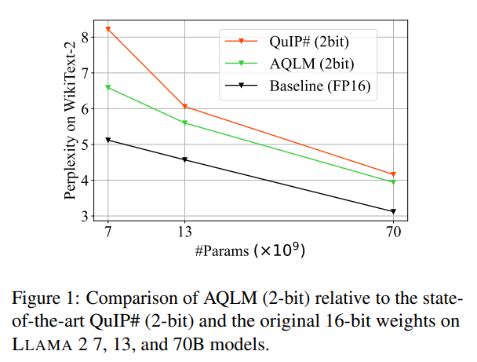
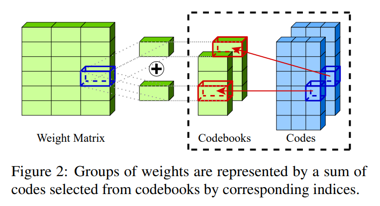
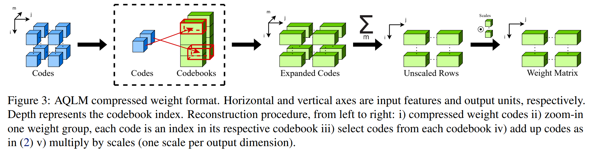
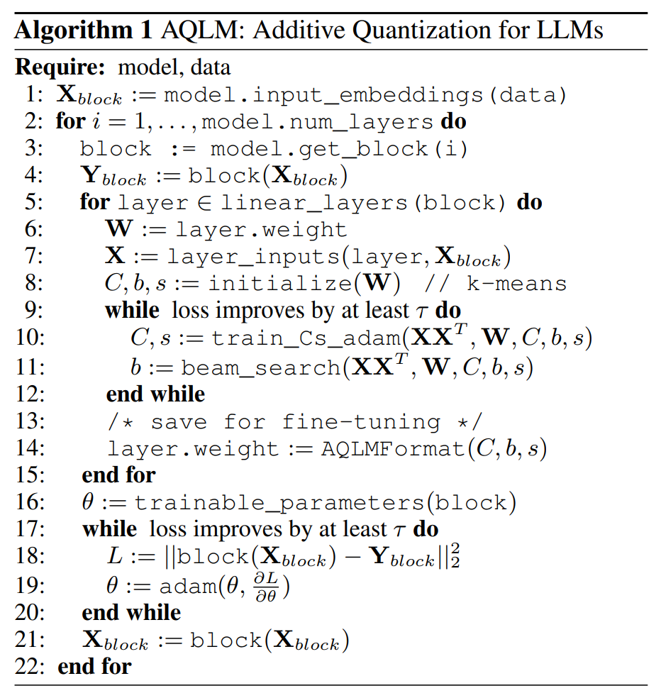
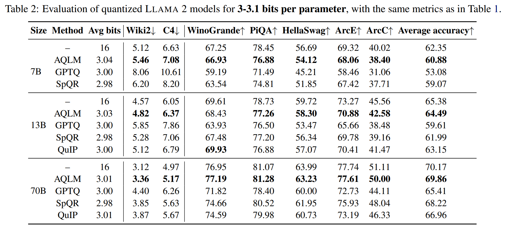
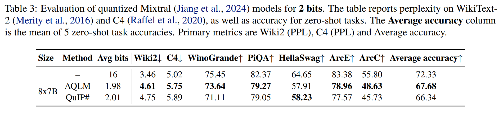
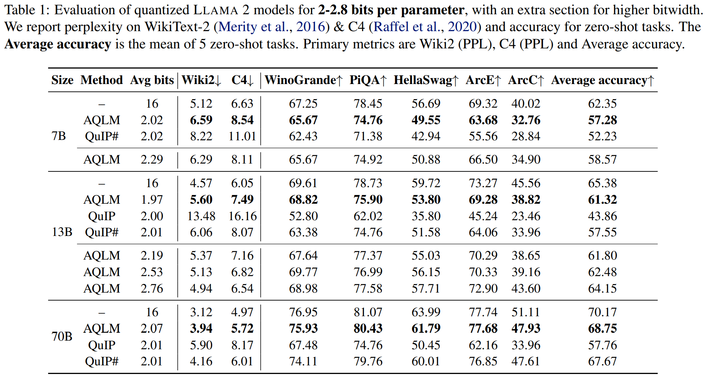
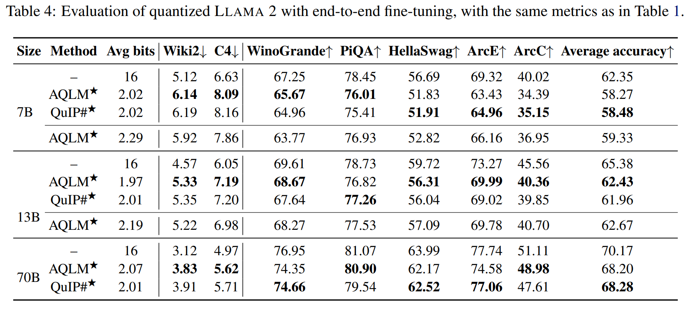
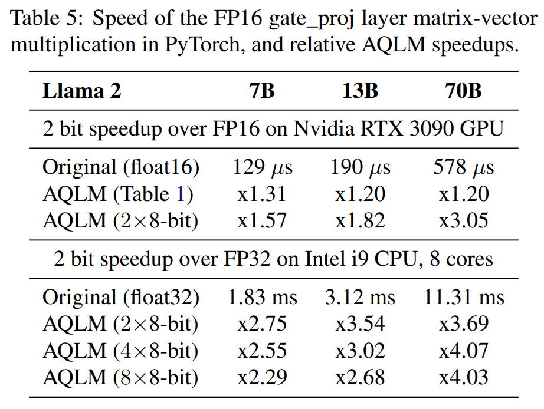

논문 및 이미지 출처 : <https://arxiv.org/pdf/2401.06118>

# Abstract

정확한 open large language models (LLMs) 의 등장 은, 이들을 end-user device 에서 실행할 수 있도록 하는 performant quantization techniques 를 향한 경쟁을 촉발하였다. 본 논문에서 저자는 “extreme” LLM compression 문제—parameter 당 2 ~ 3 bits 와 같은 극도로 낮은 bit 수를 목표로 하는 것—를 Multi-Codebook Quantization (MCQ) 의 고전적 방법 관점에서 재조명한다.

저자의 algorithm 인 **AQLM** 은, information retrieval 분야의 고전적 **Additive Quantization (AQ)** 접근을 일반화하여 LLM compression 의 state-of-the-art 를 발전시킨다. 이는 다음 두 가지 혁신을 통해 이루어진다.

1. input-adaptive 방식으로 weight matrices 에 대해 learned additive quantization 을 수행한다.
2. 각 transformer block 전반에 걸쳐 codebook parameters 를 joint optimization 한다.

전반적으로, AQLM 은 parameter 당 3 bits 미만으로 compress 할 때 accuracy-vs-model-size 측면에서 Pareto optimal 인 최초의 scheme 이며, extreme compression (2 bit) 구간에서 기존의 모든 알려진 scheme 대비 유의미한 성능 향상을 달성한다.

또한, AQLM 은 실용적이다. 저자는 token generation 을 위한 빠른 GPU 및 CPU 구현을 제공하며, 이를 통해 훨씬 작은 memory footprint 로 실행하면서도 속도 측면에서 최적화된 FP16 구현과 동등하거나 이를 능가하는 성능을 달성한다.

# 1. Introduction

generative large language models (LLMs) 의 급속한 발전은 정확한 open LLM 의 가용성에 힘입어 대규모 산업적 및 대중적 관심을 촉발하였다. 이러한 open LLM 에는 LLAMA 1 및 2, Falcon, BLOOM, OPT, NeoX/Pythia 등이 포함된다. Open model 의 주요 장점 은, 연산 및 memory 비용을 commodity hardware 상에서 감당 가능한 수준으로 줄일 수 있다는 가정 하에, end-user 가 이를 로컬에서 inference 하거나 fine-tuning 할 수 있다는 점이다.

이에 따라 compressed LLM 에 대한 inference 및 fine-tuning 방법들이 다수 제안되었다. 현재 LLM 의 정확한 post-training compression 을 위한 주요 접근법 은 quantization 이다. Quantization 은 model weight (및 경우에 따라 activation) 가 저장되는 bit-width 를 줄임으로써 model footprint 및 memory transfer 를 개선한다.

대체로, LLM weight 는 “direct” quantization 을 통해 압축된다. 이는 각 matrix subcomponent 에 대해 적절한 quantization grid 와 normalization 을 먼저 선택한 후, 각 weight 를 grid 에 매핑하는 방식이다. 이 매핑은 direct rounding 을 통해 수행되거나, 혹은 보다 복잡한 allocation 방식을 통해 수행된다.

Quantization 은 자연스럽게 compression-vs-accuracy trade-off 를 유도하며, 이는 일반적으로 model size 와 model perplexity (PPL) 간의 관계로 측정된다. 기존 접근법 은 element 당 3–4 bits 수준에서 비교적 낮은 accuracy loss 를 달성할 수 있으며, 특히 매우 큰 model 의 경우 element 당 2 bits 또는 그 이하로도 안정적으로 compress 할 수 있다. 그러나 대부분의 경우, 낮은 bit 수 는 상당한 accuracy 저하, 높은 구현 복잡도, 그리고 runtime overhead 를 수반한다.

특히 실용적 관점에서, 현재 기술로 2-bit 범위의 “extreme” quantization 을 수행하는 것은, 단순히 더 작은 base model 을 사용하여 이를 3–4 bits per parameter 로 quantization 하는 것보다 열등하다. 후자의 경우 동일한 byte 단위 model size 에서 더 높은 accuracy 를 제공하기 때문이다.

#### Contribution

본 연구에서 저자는 **Multi-Codebook Quantization (MCQ)** 기법이 LLM weight compression 으로 확장될 수 있음을 최초로 보임으로써 LLM compression 의 state-of-the-art 를 향상시킨다.

MCQ 는 information retrieval 분야의 방법군으로, vector database 를 압축하여 효율적인 search 를 가능하게 하는 특수화된 quantization algorithm 들로 구성된다. Direct quantization 과 달리, MCQ 는 quantized value 간의 mutual information 을 활용하여 여러 값을 공동으로 압축한다.

보다 구체적으로, 저자는 Additive Quantization (AQ) 을 LLM weight compression 문제로 확장하여, 각 layer 및 Transformer block 의 output 이 근사적으로 보존되도록 한다. 이 확장은 고전적인 AQ optimization 문제를 다음과 같이 재정식화한다.

* 입력 token distribution 하에서 LLM layer output 의 error 를 줄이도록 한다.
* 표준 AQ 와 같이 weight 자체만을 보존하는 것이 아니라, layer block 전반에 걸쳐 code 를 joint optimization 한다.

저자는 이 절차를 Additive Quantization of Language Models (AQLM) 이라 명명한다. 일부 extreme LLM quantization 접근법 이 outlier quantization 을 분리하기 위해 hybrid sparse-quantized format 을 요구하는 것과 달리, AQLM 은 단순한 homogeneous format 으로 model 을 quantization 하며, 이는 실무적으로 지원하기 용이하다.

저자의 주요 기여 는 다음과 같다.

1. AQLM algorithm 을 제안한다. 이는 AQ 를 LLM weight 의 post-training compression 으로 확장하며, 다음 두 가지 혁신을 포함한다.
   * (1) AQ 의 기반이 되는 MAP-MRF optimization 문제를 instance-aware 하게 적응시켜, layer calibration input 및 output activation 을 고려한다.
   * (2) layer-wise optimization 을 보완하기 위해, calibration data 만을 사용하여 여러 layer 에 걸쳐 quantization parameter 를 joint optimization 하는 효율적인 intra-block tuning 기법을 도입한다.
2. LLAMA 2 계열의 정확한 open LLM 을 대상으로, parameter 당 2–4 bits 의 compression rate 에서 알고리즘 의 효과를 평가한다.
   * AQLM 은 표준 2–4 bit compression 범위 전반에서 기존 state-of-the-art 를 능가하며, 특히 extreme 2-bit quantization 에서 가장 큰 개선을 보인다 (Fig. 1 참조).
   * code width 및 codebook 수 와 같은 다양한 algorithm parameter 의 영향에 대한 상세한 ablation 을 제공한다.
   * 최근 Mixtral model 에 대해서도 분석을 확장한다.
   * 후속 연구에서 제안된 개선된 fine-tuning algorithm 과 AQLM 을 결합하여 평가하며, 2-bit 및 3-bit model 에서 accuracy 가 추가적으로 향상됨을 보인다.
3. AQLM 의 실용성을 보인다.
   * 특정 encoding 에 대해 효율적인 GPU 및 CPU kernel 구현을 제공한다.
   * end-to-end generation 을 지원한다.
   * 실험 결과, 제안 방법 은 속도 측면에서 floating point baseline 과 동등하거나 이를 능가하면서도 memory footprint 를 최대 8 배까지 줄인다.
   * 구체적으로, AQLM 은 GPU 에서 약 30% 의 layer-wise speedup 을 달성하며, CPU inference 에서는 최대 4 배의 속도 향상을 달성한다.

# 2. Background & Related Work

## 2.1. LLM Quantization

LLM 에 적용 가능한 post-training quantization (PTQ) 방법의 초기 연구들 은 ZeroQuant, LLM.int8(), nuQmm 등이 있으며, 이들은 direct round-to-nearest (RTN) projection 을 사용하고 quantization granularity 를 조정하여 memory efficiency 와 accuracy 간 균형을 맞추었다.

* GPTQ 는 layer-wise $\ell_2$ error 를 최소화하기 위한 approximate large-scale solver 를 통해 보다 정확한 data-aware 접근을 제안하였다. 
* Dettmers & Zettlemoyer 는 이러한 초기 방법들의 accuracy-compression trade-off 를 분석하였으며, RTN quantization 에서는 4-bit quantization 이 최적일 수 있음을 제시하였다. 
* 또한 GPTQ 와 같은 data-aware 방법은 weight 당 4 bits 미만의 더 높은 compression 을 허용하면서 Pareto optimality 를 유지할 수 있음을 관찰하였다.

저자의 연구는 이 Pareto frontier 를 최초로 weight 당 3 bits 미만으로 확장한다.

병렬 연구로, weight 와 activation 을 모두 8-bit 로 quantization 한 연구들 은 대규모 LLM 에서의 “outlier feature” 가 상당한 error 를 유발함을 지적하였고, 이에 대한 다양한 완화 전략이 제안되었다. 최근에는 output error 에 큰 영향을 미치는 weight outlier 의 quantization 어려움에 초점을 둔 개선 기법들이 등장하였다.

* SpQR 은 outlier 를 고정밀도의 고도로 sparse matrix 로 저장하는 방식으로 이를 해결한다.
* AWQ 는 activation magnitude 가 가장 큰 channel 에 대해 per-channel scaling 을 적용하여 중요한 weight 의 quantization error 를 줄인다.
* SqueezeLLM 은 diagonal Fisher 를 Hessian 의 proxy 로 사용하고, K-means clustering 을 통해 non-uniform quantization 을 수행한다.

현재 공개된 state-of-the-art 방법은 QuIP 이다. 저자의 연구와 동시에 QuIP 의 개선 버전인 QuIP# 이 제안되었다. 이 방법들은 대략적으로 다음과 같이 동작한다.

* 먼저 weight 에 rotation matrix 를 곱하여 이를 “smoothening” 한다.
* 이후 이를 lattice 위로 매핑한다.

높은 수준에서, QuIP 및 QuIP# 은 초기 weight 와 calibration data 가 주어졌을 때 각 layer 에 대해 “worst-case” error 를 최소화하는 것을 목표로 한다. 예를 들어 QuIP# 에서는 rotated weight 의 분포가 Gaussian 을 근사하도록 하고, encoding lattice (E8P) 는 “rounding” error 를 최소화하도록 선택된다.

이에 반해, 저자의 접근은 다른 weight encoding 방식을 사용한다 (codebook 은 additive 구조를 가진다). 또한 고정된 codebook 대신 learned codebook 을 사용한다. 따라서 저자의 통찰 은 rotation 을 제거하고 calibration set 상에서 codebook 을 직접 optimization 함으로써 더 높은 accuracy 를 달성할 수 있다는 점이다. 나아가, 서로 다른 layer 의 codebook 이 calibration data 상에서 joint fine-tuning 을 통해 공동 학습될 수 있음을 보인다.

## 2.2. Quantization for Nearest Neighbor Search

저자의 연구는 approximate nearest neighbor search (ANN) algorithm 에 기반한다. PTQ 와 달리, ANN quantization 은 vector database 를 압축하여, 주어진 query point 집합에 대해 similarity 계산 및 nearest neighbor 탐색을 효율적으로 수행하는 것을 목표로 한다.

높은 compression 을 위해, 현대 ANN search algorithm 은 vector quantization (VQ) 을 사용한다. VQ 는 여러 vector dimension 을 jointly quantization 한다. 이를 위해 “codebook” 을 학습하는데, 이는 데이터를 encoding 하는 데 사용할 수 있는 learnable candidate vector 집합이다.

주어진 database vector 를 encoding 하기 위해, VQ 는 이를 여러 sub-group 으로 분할한 뒤 각 group 을 learned codebook 에서 하나의 vector 를 선택하여 encoding 한다. Similarity search 를 위해 Euclidean distance 또는 dot-product 계산을 효율적으로 수행하는데, 이는 dot-product 의 linearity 를 활용한다.

ANN search 를 위한 quantization 방법은 VQ 를 일반화하며 multi-codebook quantization (MCQ) 라고 불린다. MCQ 방법은 일반적으로 query 측에서는 information loss 를 유발하지 않으며, 이로 인해 memory-efficient ANN 에서 선도적인 접근법이 된다. 이하에서 MCQ 를 간략히 검토한다.

#### Product Quantization (PQ)

Product quantization (PQ) 는 MCQ 의 초기 형태로, 각 vector $x \in \mathbb{R}^D$ 를 $M$ 개의 $D/M$ 차원 codebook ${ C_1, \dots, C_M }$ 으로부터 선택된 $M$ 개의 codeword 의 concatenation 으로 encoding 한다. 각 codebook 은 $K$ 개의 codeword 를 포함한다.

PQ 는 vector 를 $M$ 개의 subvector 로 분해하고, 각 subvector 에 대해 별도의 codebook 을 사용하여 VQ 를 적용한다. 따라서 각 vector $x$ 는 index tuple ${ i_1, \dots, i_M }$ 로 encoding 되며, 다음과 같이 근사된다: $x \approx [c_{1 i_1}, \dots, c_{M i_M}]$

Fast Euclidean distance 계산은 lookup table 을 통해 가능하다.

$$
\| q - x \|^2 \approx \left\| q - [c_{1 i_1}, \dots, c_{M i_M}] \right\|^2
= \sum_{m=1}^{M} \| q_m - c_{m i_m} \|^2
$$

* 여기서 $q_m$ 은 query $q$ 의 $m$-th subvector 이다. 
* Query subvector 와 codeword 간 거리를 미리 계산해두면, 위 합은 $M$ 번의 lookup 과 덧셈으로 계산할 수 있다.

Product 기반 근사는 $D/M$ 차원 component 가 서로 독립적인 분포를 가질 때 더 잘 동작하므로, 이후 연구들은 더 나은 transformation 을 찾는 데 집중하였다.

또한 다른 similarity function 에 대해서는 maximum inner product search (MIPS) 를 위한 quantization 방법도 제안되었다. 

* 이 방법은 database vector 와 query vector 간 inner product 의 quantization error 를 최소화하는 constrained optimization 문제를 푼다. 
* 위와 유사하게, query $q$ 와 모든 code 간 dot-product 를 미리 계산한 뒤 부분 dot-product 를 더하여 전체 similarity score 를 복원한다.

#### Non-orthogonal Quantizations

후속 연구들은 Product Quantization 의 아이디어를 일반화하여, 각 vector 를 concatenation 대신 $M$ 개 codeword 의 합으로 근사하였다. 이 방식은 여전히 효율적이면서 approximation accuracy 가 향상된다.

Residual Vector Quantization 은 원래 vector 를 quantization 한 뒤, 이전 단계의 approximation residual 을 반복적으로 quantization 한다.

Additive Quantization (AQ) 은 보다 일반적이며, 서로 다른 codebook 의 codeword 간에 제약을 두지 않는다. 일반적으로 AQ 는 가장 작은 compression error 를 제공하지만, 큰 $M$ 에 대해서는 training 이 더 복잡하다. 이에 대해서는 Sec. 3 에서 상세히 논의한다.

최근 연구들은 Additive Quantization 의 아이디어를 확장하여 더 효과적인 codebook 학습 절차를 제안하였다.

* Composite Quantization (CQ) 는 서로 다른 codebook 의 codeword 간 inner product 를 고정값으로 유지하도록 codebook 을 학습한다.
* 현재 state-of-the-art compression accuracy 는 LSQ 방법에 의해 달성된다.

#### Vector Quantization for Model Compression

machine learning 맥락에서 vector quantization 을 활용하려는 연구도 활발히 이루어졌다. 예를 들어, multi-codebook quantization 을 deep learning model 내 word embedding 압축에 활용한 연구들이 있다.

또 다른 연구 흐름은 linear model 또는 deep model 내 linear layer 에 vector quantization 을 적용하였다. PQ 와 유사하게, 이러한 기법들은 input 과 모든 code 간 inner product 를 미리 계산한 뒤 lookup 을 통해 linear layer 를 계산하여 inference 를 가속화한다.

그러나 이러한 algorithm 은 상당한 prediction error 를 유발하여 deep model 을 효과적으로 compress 하지 못한다. 따라서 저자는 MCQ 를 LLM 에 성공적으로 적응하고 확장한 최초의 연구라고 판단한다.

# 3. AQLM: Additive Quantization for LLMs

## 3.1. Overview

저자는 **additive quantization (AQ)** 이 post-training quantization (PTQ) 과 관련된 문제를 해결한다는 관찰에서 출발한다. 두 설정 모두 “input” vector 집합의 존재를 가정한다. 즉,

* AQ 에서는 input data,
* PTQ 에서는 weight matrix 의 row

가 이에 해당한다.

목표는 query vector (AQ 의 경우) 또는 layer input embedding (PTQ 의 경우) 에 대한 dot product similarity 를 보존하면서 이러한 input 을 압축하는 것이다. 두 방법의 차이점은, AQ 는 query 분포가 알려져 있지 않다고 가정하는 반면, PTQ 방법들은 calibration data 집합으로부터의 sample input embedding 에 대해 optimization 하는 것만으로 충분하다는 점을 보인다는 것이다.

높은 수준에서, 저자는 다음 문제를 푸는 것에서 시작한다.

input feature 가 $d_{in}$, output feature 가 $d_{out}$ 인 linear layer 가 있고, 그 weight 가 $W \in \mathbb{R}^{d_{out} \times d_{in}}$, calibration input 이 $X \in \mathbb{R}^{d_{in} \times n}$ 이라고 하자.

original layer 와 compressed layer 의 output 간 squared error 를 최소화하는 quantized weight $\widehat{W}$ 를 찾는다.

$$
\arg\min_{\widehat{W}} | W X - \widehat{W} X |_2^2.
\tag{1}
$$

* 이후, $\widehat{W}$ 가 AQ 를 사용하여 quantization 된다고 가정하고, 표준 표기법을 따른다. 

AQ 는 weight row 를 연속된 $g$ 개 element 로 이루어진 group 으로 분할하고, 각 group 을 여러 개의 learned codebook ${ C_1, \dots, C_M }$ 로부터 선택된 $M$ 개 vector 의 합으로 표현한다. 각 codebook 은 $2^B$ 개 vector (즉, $B$-bit code) 를 포함한다.

각 weight group 은 각 codebook 에서 하나의 code 를 선택하고 이를 합산하여 encoding 된다. 이 선택을 one-hot vector $b_m$ 로 표현하면, 하나의 group 은 다음과 같이 표현된다: $\sum_{m=1}^{M} C_m b_{i j m}.$

이는 group 당 훨씬 더 복잡한 coding 을 사용한다는 점을 제외하면, PTQ algorithm 과 유사하다.

전체 weight 를 표현하기 위해서는 단순히 이를 concatenation 한다.

$$
\widehat{W}_i = \sum_{m=1}^{M} C_m b_{i,1,m} \oplus \dots \oplus \sum_{m=1}^{M} C_m b_{i,d_{in}/g,m},
\tag{2}
$$

* 여기서 $\oplus$ 는 concatenation 을 의미하며,
* $b_{i j m} \in \mathbb{R}^{2^B}$ 는 $i$-th output unit, $j$-th input dimension group, $m$-th codebook 에 대한 one-hot code 를 나타낸다.

저자의 algorithm 은 다음을 학습한다.

* codebook $C_m \in \mathbb{R}^{g \times 2^B}$,
* discrete code 를 나타내는 one-hot tensor
  $b \in \mathbb{R}^{d_{out} \times d_{in}/g \times M \times 2^B}$.

이 scheme 은 각 $g$ 개 weight group 을 $M \cdot B$ bits 로 encoding 하며, 추가적으로 FP16 codebook 을 위해 $g \cdot 2^B \cdot 16$ bits 를 필요로 한다.

이때 optimization 문제는 다음과 같이 된다.

$$
\arg\min_{C,b}
\big\|
W X -
\left(
\text{Concat}_{i,j}
\sum_{m=1}^{M} C_m b_{i,j,m}
\right)
X
\big\|_2^2.
\tag{3}
$$

이 weight representation 을 학습하기 위해, 저자는 Chen et al. 의 residual K-means 를 사용하여 codebook $C$ 와 code $b$ 를 초기화한다.

초기화 절차는 다음과 같다.

1. weight group 에 대해 K-means clustering 을 수행하고, cluster index 를 저장한다.
2. 각 weight 에서 가장 가까운 cluster 를 빼서 quantization error 를 계산한다.
3. quantization error 에 대해 다시 K-means clustering 을 수행한다.

따라서 각 후속 codebook 은 이전 codebook 들이 남긴 quantization error 를 보상하도록 초기화된다.

초기화 이후, 저자는 다음 과정을 반복한다.

* discrete code $b_{i,j,m}$ 를 업데이트한다.
* codebook $C_m$ 를 업데이트한다.

이 과정을 loss function (3) 이 지정된 tolerance 내에서 더 이상 개선되지 않을 때까지 반복한다.

code 는 discrete 이고 codebook 은 continuous 이며, 또한 여러 상호작용하는 layer 에 대해 optimization 이 수행되기 때문에, 저자의 접근은 세 단계로 구성된다. 이는 Algorithm 1 에 설명되어 있으며, 이후 절에서 상세히 기술된다.

## 3.2. Phase 1: Beam Search for Codes

먼저, AQLM 은 MSE objective (3) 를 최소화하기 위해 code $b_{i,j,m}$ 를 업데이트한다. Babenko & Lempitsky 및 Martinez et al. 과 유사하게, 저자는 MRF solver 를 활용하기 위해 objective 를 fully-connected discrete Markov Random Field (MRF) 형태로 재정식화한다.

유도 과정을 단순화하기 위해, 먼저 특수한 경우를 고려한다.

* 단일 output unit ($d_{out} = 1$)
* 단일 quantization group ($g = d_{in}$)

이 경우 concatenation 연산자를 제거할 수 있으며, objective 는 다음과 같다: $\| W X - \sum_{m=1}^{M} C_m b_m X \|_2^2.$

이를 제곱 차이 전개를 통해 다시 쓰면 다음과 같다.

$$
\| W X - \sum_{m=1}^{M} C_m b_m X \|_2^2 = \| W X \|_2^2 \\
- 2 \left\langle
W X,
\sum_{m=1}^{M} C_m b_m X
\right\rangle_F
+
\big\|
\sum_{m=1}^{M} C_m b_m X
\big\|_2^2.
\tag{4}
$$

* 여기서 $\langle \cdot, \cdot \rangle_F$ 는 두 matrix 간 Frobenius inner product 를 의미한다.
* 첫 번째 항 $\| W X \|_2^2$ 는 $b$ 와 무관하므로 무시할 수 있다.
* 세 번째 항은 pairwise dot product 형태로 확장된다:

$$
\big\|
\sum_{m=1}^{M} C_m b_m X
\big\|_2^2
=
\sum_{i=1}^{M}
\sum_{j=1}^{M}
\langle
C_i b_i X,
C_j b_j X
\rangle_F.
\tag{5}
$$

* 두 번째 및 세 번째 항은 모두 $C_m b_m X$ 형태의 matrix 에 대한 Frobenius inner product 를 포함한다. 
* 그러나 $X \in \mathbb{R}^{d_{in} \times n}$ 이므로, 해당 matrix 의 크기는 calibration dataset 크기 $n$ 에 비례하여 커진다.

이를 피하기 위해 다음과 같이 재작성한다.

$$
\langle
C_i b_i X,
C_j b_j X
\rangle_F
=

\langle
C_i b_i X X^T,
C_j b_j
\rangle_F.
\tag{6}
$$

따라서 $X X^T \in \mathbb{R}^{d_{in} \times d_{in}}$ 를 사전에 계산할 수 있다. 이후 유도에서 다음과 같은 표기를 사용한다: $\langle A, B \rangle_{X X^T} \stackrel{def}{=} \langle A X X^T, B \rangle_F.$

이를 이용하면 식 (4) 는 다음과 같이 정리된다.

$$
\| W X - \sum_{m=1}^{M} C_m b_m X \|_2^2 = \| W X \|_2^2 \\
- 2 \sum_{m=1}^{M}
\langle
W,
C_m b_m
\rangle_{X X^T}
+
\sum_{i=1}^{M}
\sum_{j=1}^{M}
\langle
C_i b_i,
C_j b_j
\rangle_{X X^T}.
\tag{7}
$$

이제 마지막으로, 이를 다음 두 경우로 일반화한다.

* $d_{out} > 1$
* $g \neq d_{in}$

* **다중 output ($d_{out} > 1$)**
  * 원래 objective (3) 는 output unit 에 대해 additive 하다. 따라서 각 output dimension 에 대해 식 (7) 을 독립적으로 적용한 뒤 결과를 합산하면 된다.
* **다중 input group ($g \neq d_{in}$)**
  * 각 group 을 별도의 codebook 으로 간주하되, 활성 group 에 해당하는 code 만 nonzero 가 되도록 한다. 
  * 따라서 각 codebook 을 $d_{in}/g$ 번 반복하고, 활성 group 위치에 맞추어 zero padding 한다.

이제 식 (4) 를 최소화하는 문제는 다음과 동등함이 분명해진다.

* unary potential: $\langle W, C_m b_m \rangle_{X X^T}$
* pairwise potential: $\langle C_i b_i, C_j b_j \rangle_{X X^T}$

를 갖는 Markov Random Field 에서의 MAP inference 문제와 동등하다.

정확한 최적해를 찾는 것은 불가능하지만, 기존 연구는 이러한 유형의 MRF 를 beam search 또는 ICM 을 통해 근사적으로 해결할 수 있음을 보였다.

저자는 Babenko & Lempitsky 의 beam search algorithm 을 변형하여 사용한다.

이 algorithm 은 다음과 같이 동작한다.

* 이전 solution 에서 시작하여, 상위 $k$ 개 (beam size) code configuration 을 유지한다.
* 각 단계에서 하나의 code 를 교체하려 시도한다.
* 해당 code 의 모든 $2^B$ 가지 대안을 시험하고, MSE (식 (7)) 기준으로 상위 $k$ 개를 선택한다.

loss function 이 additive 구조이므로, 하나의 code 변경은 일부 loss component 에만 영향을 미친다. 따라서 다음과 같이 효율적으로 계산할 수 있다.

* 기존 loss 값에서 시작한다.
* 이번 iteration 에서 변경된 component 만 더하고 뺀다.

이 소수의 loss component 는 beam search 이전에 $X X^T$ 와 곱해둠으로써 효율적으로 계산된다.

beam search 는 모든 $d_{out}$ output unit 에 대해 병렬로 수행된다. 이는 한 output unit 의 encoding 이 다른 unit 의 objective (7) 에 영향을 주지 않기 때문에 가능하다.

beam search 가 반드시 최적의 해결 방법은 아니다. Retrieval 을 위한 AQ 변형들은 randomized ICM 을 사용하여 더 빠르게 solution 을 찾는다. 그러나 본 연구에서는 PyTorch/JAX 와 같은 ML framework 에서 구현이 용이하다는 이유로 beam search 를 선택하였다.

## 3.3. Phase 2: Codebook Update

두 번째 단계에서는 beam search 와 동일한 squared error 를 최소화하는 최적의 codebook vector ${ C_1, \dots, C_M }$ 를 찾는다. Code $b$ 를 상수로 간주하면, 식 (3) 의 최소화는 $C_m$ 에 대한 least squares 문제로 변환된다.

기존 AQ algorithm 은 각 vector dimension 이 독립적으로 optimization 될 수 있다는 사실을 이용하여 이 문제를 closed form 으로 해결한다. 그러나 본 문제는 $X X^T$ 의 존재로 인해 더 복잡하다. 하나의 codebook coordinate 의 최적값이 다른 모든 coordinate 의 값에 의존하기 때문이다.

이론적으로는 $C_m$ 를 closed form 으로 optimization 할 수 있으나, 이는 큰 matrix 의 역행렬 계산 또는 이 문제에 특화된 iterative least squares solver (e.g., conjugate gradients) 를 필요로 한다.

단순성을 위해, 현재 구현에서는 이 최소화 문제를 근사적으로 해결하기 위해 Adam 을 사용한다. 실제로 codebook tuning 단계는 전체 계산 시간 중 작은 비율만을 차지한다.

Objective 는 다음과 같이 계산된다.

$$
\| W X - \widehat{W} X \|_2^2
= \| (W - \widehat{W}) X \|_2^2 \\
=
\big\langle
(W - \widehat{W}) X X^T,
(W - \widehat{W})
\big\rangle_F,
\tag{8}
$$

* 여기서 $\widehat{W}$ 는 식 (2) 의 quantized weight matrix 이며, $X X^T$ 는 사전 계산된다.

저자는 full-batch gradient descent (non-stochastic) 를 반복하여 이 objective 를 optimization 한다. 각 update 단계에서, 구현은 learning rate $10^{-4}$ 로 100 회의 Adam step 을 수행한다.

그러나 최종 결과는 이러한 hyperparameter 에 민감하지 않다. 더 적은 step 수 또는 더 작은 learning rate 로 학습해도 동일한 loss 에 도달하지만, 수렴 속도가 느려질 뿐이다. 향후에는 codebook 전용 least squares solver 로 전환함으로써 이러한 hyperparameter 를 제거할 수 있다.

또한 다른 algorithm 과 유사하게, per-unit scale $s \in \mathbb{R}^{d_{out}}$ 도 함께 학습한다. 이는 다음과 같이 초기화된다: $s_i := | W_i |_2,$ 그리고 codebook 과 동일한 optimizer 를 사용하여 함께 업데이트된다 (Algorithm 1 의 line 10).

## 3.4. Phase 3: Fine-Tuning for Intra-Layer Cohesion

지금까지의 algorithm 은 각 weight matrix 를 model 의 나머지 부분과 독립적으로 compress 한다. 그러나 실제로는 quantization error 가 서로 다른 matrix 간에 상호작용한다. 이 문제는 특히 extreme (2-bit) compression 에서 더 중요하며, 이 경우 quantization error 가 더 크다.

기존 연구는 quantization-aware training (QAT) 을 통해 이 문제를 해결한다. 이 접근은 전체 model 을 한 번에 compress 하지 않고, parameter 를 점진적으로 quantization 하면서 나머지 parameter 를 학습시켜 quantization error 를 보상한다.

그러나 본 설정에서 QAT 를 수행하는 것은 비현실적이다. 대부분의 최신 LLM 은 training 또는 fine-tuning 비용이 매우 크기 때문이다. 따라서 대부분의 LLM PTQ algorithm 은 동일한 linear layer 내부의 parameter 만 조정한다.

저자는 중간 접근법을 선택한다. 즉, 개별 linear layer 수준이 아니라 transformer block 수준에서 optimization 을 수행한다. 하나의 transformer block 은 일반적으로 4–8 개의 linear layer (multi-head self-attention 구성 요소) 와 하나의 MLP layer 로 구성된다.

단일 transformer block 내 모든 linear layer 를 quantization 한 후, 해당 block 의 나머지 parameter 를 fine-tuning 하여 원래 transformer block output 을 더 잘 근사하도록 한다. 이는 weight representation (식 (2)) 을 통해 backpropagation 함으로써 수행된다.

구체적으로, PyTorch autograd engine 을 사용하여 다음을 미분한다: $\| \text{block}(X_{block}) - Y_{block} \|_2^2,$

* 여기서 $X_{block}$ 은 해당 transformer block 의 input activation,
* $Y_{block}$ 은 quantization 이전에 기록된 $\text{block}(X_{block})$ 의 output activation 이다.

학습 대상 parameter 는 다음과 같다.

* codebook $C_m$,
* scale vector $s$,
* 모든 non-quantized parameter (e.g., RMSNorm scale 및 bias).

반면, code $b_{i,j,m}$ 는 고정된 상태로 유지한다.

Sec. 3.3 과 유사하게, Adam 을 사용하여 quantization 이전 block output 에 대한 MSE 를 최소화한다. 이 단계는 개별 layer quantization 과 동일한 calibration data 를 사용한다. 전체 절차는 Algorithm 1 에 요약되어 있다.

* block 단위 fine-tuning 은 개별 linear layer 수준보다 계산 비용이 더 들지만, 여전히 단일 GPU 상에서 billion-parameter model 을 합리적인 시간 내에 quantization 하는 것이 가능하다. 
* 또한 학습되는 parameter 수가 적기 때문에 optimizer state 를 위한 VRAM 사용량도 작다.

이 fine-tuning 은 좋은 초기값에서 시작하므로 몇 차례 iteration 후 수렴한다. 실제로 transformer layer fine-tuning 은 전체 calibration 시간 중 소수 (약 10–30% 이하) 만을 차지한다.

# 4. Experiments

저자는 modern LLM 에 대한 post-training quantization 의 전형적인 시나리오에서 AQLM algorithm 을 평가한다. 평가 는 LLAMA 2 model family 를 중심으로 수행된다. 이는 fine-tuned model 또는 일반적인 LLM application 의 popular backbone 이기 때문이다. 또한 Mistral-family model 에 대한 결과도 제시한다.

* Sec. 4.1 에서는 다양한 LLAMA 2 model 및 quantization bit-width 에 대해 전체 AQ 절차를 평가한다.
* Sec. 4.3 에서는 개별 AQ 구성 요소 및 구현 세부 사항에 대한 ablation 분석을 제시한다.

## 4.1. Compression Quality for Modern LLMs

저자는 WikiText-2 및 C4 validation set 에서 perplexity (PPL) 를 보고한다. 또한 LM Eval Harness 를 통해 다음 zero-shot task 에서 accuracy 를 측정한다.

* WinoGrande
* PiQA
* HellaSwag
* ARC-easy
* ARC-challenge

평가 설정은 GPTQ 의 설정을 따른다. AQLM 및 baseline 구성은 Appendix C 에 제공된다.

저자는 세 가지 주요 compression 목표를 고려한다.

* 2–2.8 bits
* 3–3.1 bits
* 4–4.1 bits

여기서 평균 bits per parameter 는 quantized weight 만을 고려하며, floating precision 으로 유지되는 parameter 는 포함하지 않는다. Model size 추정의 세부 사항은 Appendix H 에 제공된다.

비교 대상은 다음과 같다.

* GPTQ (3 & 4 bits)
* SpQR (3 & 4 bits)
* QuIP (2, 3 & 4 bits)
* QuIP# (2 & 4 bits)

GPTQ 및 SpQR 은 기술적으로 2-bit quantization 을 지원하지만, 2–3 bit 범위에서 성능이 저조하다. QuIP 의 경우, 저자가 수정한 구현은 LLAMA 2 13B 및 70B 에서는 허용 가능한 성능을 보이나, 7B model 에서는 성능이 낮다.

각 algorithm 은 RedPajama dataset 의 subset 을 사용하여 calibration 되었으며, sequence length 는 4096 이다.

각 방법의 정확한 bit-width 는 codebook 수 및 code width 와 같은 parameter 에 의해 결정된다.

* 2–2.8 bits 및 3–3.1 bits 결과는 Tab. 1 및 Tab. 2 에 보고된다.
* 4–4.1 bits 결과는 Appendix F.2 에 제시된다.

결과는 AQLM 이 모든 설정에서 이전 최고 PTQ algorithm 을 능가함을 보여준다. 특히 높은 compression 에서 그 차이가 크다.

이 성능 향상은 다음 두 측면 모두에서 관찰된다.

* WikiText-2 및 C4 validation set 에서의 PPL
* zero-shot task 에서의 accuracy

특히 parameter 당 2–2.1 bits 의 “extreme” compression 구간에서 가장 큰 accuracy 향상이 관찰된다. 이 구간에서는 모든 방법에서 uncompressed model 대비 성능 저하가 크게 나타난다.

#### Mixtral Quantization

Tab. 3 은 Mixtral MoE 에 대한 결과를 제시하며, 2-bit 설정에서 QuIP# 과 비교한다 (전체 결과는 Appendix F.1 참조).

* 이 경우에도 AQLM 이 QuIP# 을 능가한다. LLAMA 2 model 대비 margin 은 다소 작지만, Arc Challenge 와 같은 “어려운” task 에서는 여전히 유의미한 개선 (+3 point) 이 나타난다.

#### Pareto Optimality of AQLM

이러한 error 개선은, 주어진 memory budget 내에서 accuracy 를 최대화하는 “최적” model variant 선택 문제를 제기한다.

Dettmers & Zettlemoyer 를 따라, quantized model 이 동일하거나 더 작은 total size (bytes) 에서 accuracy 를 최대화하면 Pareto-optimal 이라고 정의한다.

이전 방법들은 2-bit 설정에서 Pareto-optimal 이 아니다. 예를 들어,

* 이전 최고 2-bit LLAMA 2 13B (QuIP#) 는 WikiText-2 PPL 6.06 을 달성한다.
* 그러나 더 작은 7B model 을 4-bit quantization 하면 PPL 5.21 로 더 낮은 값을 얻을 수 있다 (Appendix Tab. 10 참조).

동일 model 에 대해 AQLM 을 정확히 2-bit 로 compress 한 경우도 Pareto-optimal 이 아니다. 이는 LLAMA 2 7B 에 대한 4-bit AQLM (5.21) 이 2-bit AQLM (5.59) 보다 우수하기 때문이다.

Pareto-optimal bit-width 를 찾기 위해, 저자는 2–3 bits 범위에서 실험을 수행하고 이를 Tab. 1 (horizontal bar 아래) 에 보고한다.

* 결과적으로, AQLM 의 Pareto-optimal bit-width 는 parameter 당 약 2.5 bits 부근으로 보인다 (Tab. 1). 
* 이 지점에서 LLAMA 2 7B 에 대한 5-bit AQLM (Appendix Tab. 10) 과 유사한 성능을 달성한다.
* 또한 13B model 에 대한 2.76-bit AQLM 은 uncompressed 7B model 을 능가한다.
* 따라서 AQLM 은 parameter 당 3 bits 미만에서 Pareto-optimality 를 달성한 최초의 algorithm 이다.

## 4.2. End-to-End Fine-Tuning Experiments

QuIP# 의 후속 연구는 Sec. 3.4 의 block-wise protocol 을 개선하여, KL divergence 를 최소화하도록 전체 model 을 fine-tuning 한다. 여기서는 이러한 end-to-end fine-tuning 이 AQLM 에 어떻게 적용되는지 분석한다.

저자는 QuIP# 의 설정을 따르며, 기본 parameter 로 end-to-end fine-tuning 을 수행한다 (Appendix A 참조). Tab. 4 는 2-bit quantization 에 대해 AQLM 및 QuIP# 의 end-to-end fine-tuning 결과를 보고한다. 추가 결과는 supplementary material 의 Tab. 6, 13, 15 에 제시된다.

두 버전을 구분하기 위해, end-to-end fine-tuning 이 적용된 quantized model 은 ⋆ 로 표시한다.

전반적으로, end-to-end fine-tuning 은 QuIP# 및 AQLM 모두에서 성능을 향상시키며, 두 방법은 유사한 accuracy 에 도달한다. 또한 다음과 같은 경향이 관찰된다.

* 2-bit quantized model 에서 end-to-end fine-tuning 의 성능 향상 효과가 가장 크다.
* 3-bit 이상에서는 diminishing return 이 나타난다.
* 마지막으로, 13B model 에 대한 2.19-bit AQLM + end-to-end fine-tuning 은 uncompressed 7B model 과 유사한 성능을 보이며, zero-shot task 에서 Pareto optimality 를 달성한다.

## 4.3. Ablation Analysis

Appendix E 에서는 initialization, alternating optimization, fine-tuning 영향, hyperparameter 민감도 등 주요 설계 선택을 분석한다.

요약하면 다음과 같다.

1. **Initialization**
   * residual K-means initialization 은 빠른 수렴에 매우 중요하다. 
   * Random initialization 과 비교할 때, 훨씬 적은 training iteration 으로 수렴한다.
2. **Hyperparameter 구성 비교**
   * 동일한 bit-width 에 대해 다음을 변화시키며 비교한다.
     * codebook 개수
     * group size
3. **Calibration Fine-Tuning 검증**
   * 다음 세 가지 설정을 비교한다.
     * (1) fine-tuning 없음
     * (2) non-linear layer (e.g., RMSNorm) 만 fine-tuning, codebook 은 고정
     * (3) codebook 만 fine-tuning, 다른 layer 는 고정
   * 결과는 다음을 보여준다.
     * codebook parameter 의 fine-tuning 이 accuracy 에 가장 큰 영향을 준다.
     * RMSNorm 만 fine-tuning 하는 경우 영향은 미미하다.
   * 이는 learned codebook 을 위해 calibration set 을 활용하는 설계 선택을 정당화한다.
4. **Calibration 데이터 크기 영향**
   * sample sequence 수를 128 에서 4096 범위로 증가시키면 PPL 이 점진적으로 개선되지만, diminishing return 이 존재한다.
     * 이는 초기 AQLM calibration 과 fine-tuning 모두에 해당된다.
   * 이 점에서 AQLM 은 larger calibration set 의 혜택을 더 크게 받는다 (QuIP# 와 유사). 
   * 반면 GPTQ 와 같은 direct method 는 약 256 input sequence 에서 accuracy 가 포화된다.
5. **Bit Budget 분배 전략 비교**
   * 동일한 bit budget 에 대해 다음을 비교한다.
     * 더 긴 code (e.g., 1×15)
     * 더 많은 codebook + 짧은 code (e.g., 2×8)

## 4.4. Inference Speed

AQLM 의 주요 목표는 주어진 model size 에서 accuracy 를 최대화하는 것이지만, inference latency 측면에서도 실용적일 수 있다. 이를 보이기 위해, 저자는 hardware-friendly configuration 에 대해 효율적인 GPU 및 CPU kernel 을 구현하였다. 결과는 Tab. 5 에 제시된다.

GPU inference 에서는 다음 configuration 을 대상으로 하였다.

* 16-bit codebook 사용
  * LLAMA 2 70B: 2.07 bits
  * LLAMA 2 13B: 2.19 bits
  * LLAMA 2 7B: 2.29 bits
* 2×8-bit codebook model (WikiText-2 PPL 6.57, Tab. 12 참조)

각 model 에 대해 standard layer 의 matrix-vector multiplication subroutine 성능을 benchmark 하였다. 결과는 다음을 보여준다.

* AQLM 은 FP16 과 유사하거나 더 빠른 속도로 실행 가능하다.
* HuggingFace 통합 기반 end-to-end generation 결과는 Appendix I 에 제시된다.
  * 예: LLAMA 2 70B 에서 약 14 tokens/s 달성

또한 다음 관찰이 있다.

* 여러 개의 작은 codebook 은 GPU cache 활용을 효율적으로 만들어 더 큰 speedup 을 제공한다.
* 그러나 accuracy 는 약간 감소한다.

Sec. 2.2 에서 논의했듯이, additive quantization 은 codebook 크기가 작을 경우 dot product 를 효율적으로 계산할 수 있다.

AQLM 에 이를 적용하는 한 가지 방법은 16-bit codebook 을 여러 개의 8-bit codebook 으로 대체하는 것이다. 이는 quantization error 를 증가시키지만, 여전히 baseline 대비 더 높은 accuracy 를 유지한다 (Appendix Tab. 9 참조).

Tab. 5 결과는 다음을 보여준다.

* CPU 에서 FP32 대비 최대 4 배 빠른 inference 가 가능하다.

# 5. Conclusion and Future Work

저자는 LLM compression 을 위한 새로운 additive quantization 형태인 AQLM 을 제안하였다. 이는 weight 당 2-bit 및 3-bit 구간에서 LLM quantization 의 state-of-the-art 를 크게 향상시킨다.

AQLM 은 RTN 또는 GPTQ 와 같은 direct post-training quantization 방법보다 계산 비용이 크다. 이는 더 복잡한 coding representation 을 사용하기 때문이다.

그러나 이러한 정교한 encoding 및 decoding 구조에도 불구하고, AQLM 은 CPU 및 GPU 모두에서 효율적으로 구현될 수 있음을 보였다.

전반적으로, AQLM 을 사용하면 massive LLM 을 적은 memory 로도 정확하고 효율적으로 실행할 수 있다는 점은 주목할 만하다.

저자는 다음과 같은 향후 연구 방향을 제시한다.

1. **Fine-Tuning 전략 개선**
   Sec. 4.2 에서 더 나은 fine-tuning algorithm 이 quantized model accuracy 를 크게 향상시킬 수 있음을 확인하였다. 향후에는 fine-tuning algorithm 에 대한 보다 체계적인 탐색이 필요하다.

2. **다른 Quantization 시나리오로의 확장**
   본 연구는 LLM quantization 에 초점을 두었지만, underlying algorithm 은 다음과 같은 문제에도 적용 가능하다.

   * computer vision model quantization
   * 긴 sequence 에 대한 LLM attention cache 압축
   * 기타 유사 문제

이와 같은 방향은 AQLM 의 일반성과 확장 가능성을 보여주는 유망한 연구 주제이다.
