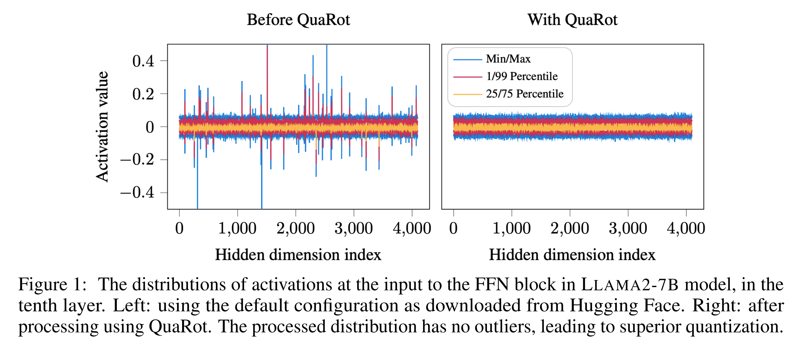
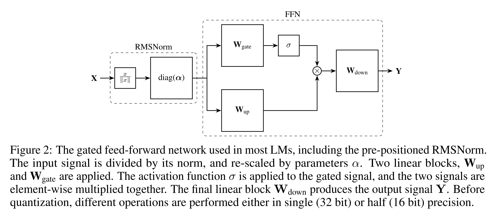
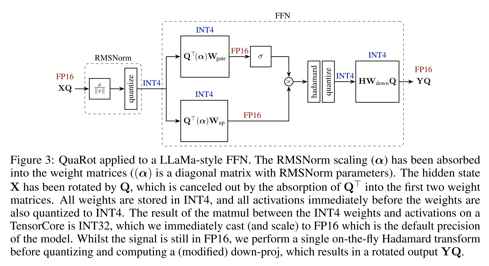
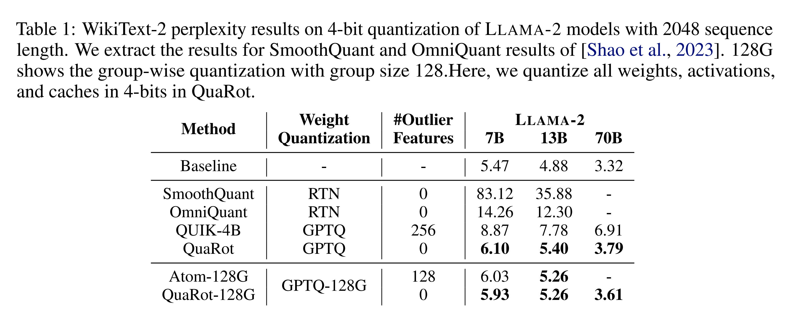
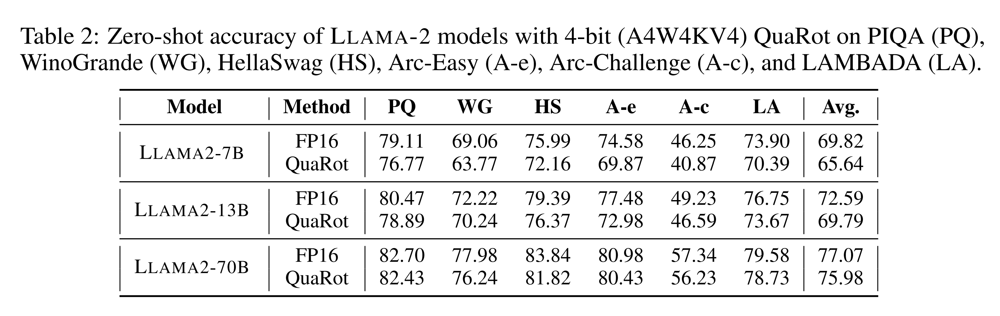
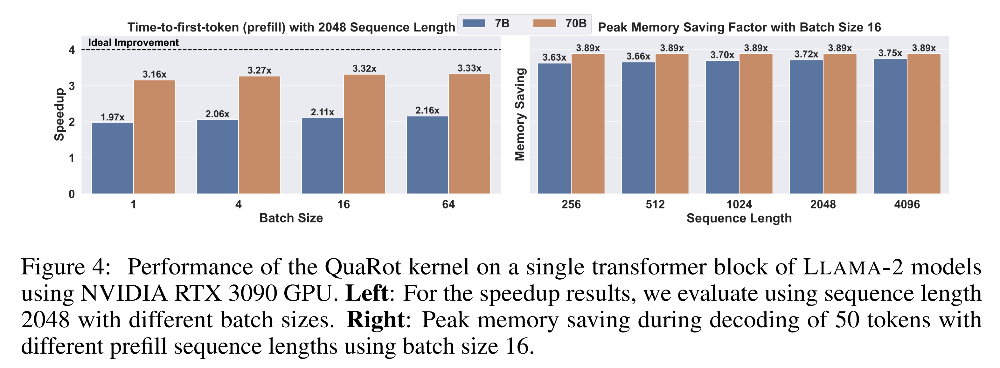
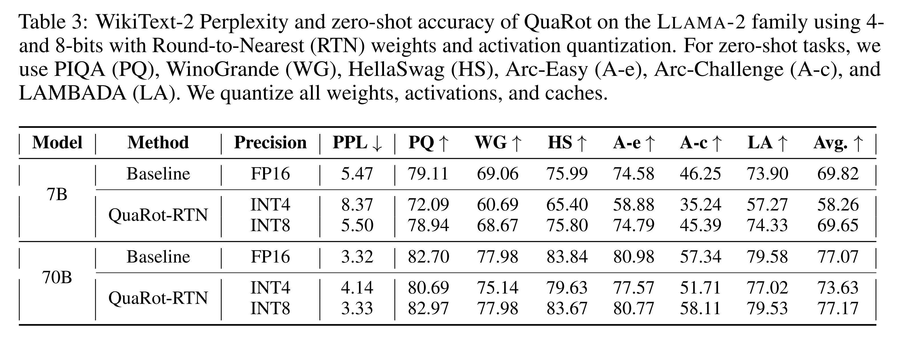
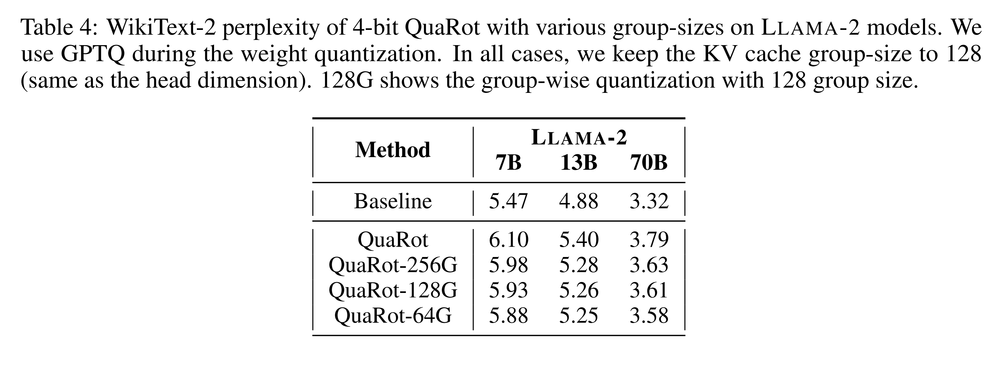

논문 및 이미지 출처 : <https://arxiv.org/pdf/2404.00456>

# Abstract

저자는 Rotations 에 기반한 새로운 Quantization scheme 인 **QuaRot** 을 소개한다. 

* QuaRot 은 *모든 weights, activations, 그리고 KV cache 를 포함*하여 LLM 을 *end-to-end 로 4 bits* 로 quantize 할 수 있다. 
* QuaRot 은 LLM 을 output 을 변경하지 않으면서 hidden state 로부터 outliers 를 제거하는 방식으로 rotate 하여 quantization 을 더 용이하게 만든다. 
* 이러한 computational invariance 는 LLM 의 hidden state (residual) 에 적용되며, feed-forward components 의 activations, attention mechanism 의 일부 요소들, 그리고 KV cache 에도 적용된다. 
* 그 결과, higher precision 으로 유지하기 위해 식별된 어떤 channel 도 없이, 모든 matrix multiplications 이 4 bits 로 수행되는 quantized model 이 생성된다.

4-bit 로 quantized 된 LLAMA2-70B model 은 WikiText-2 perplexity 에서 최대 0.47 의 loss 만을 보이며, zero-shot performance 의 99% 를 유지한다. 또한 저자는 QuaRot 이 calibration data 없이 round-to-nearest quantization 을 사용하여 lossless 6 및 8 bit LLAMA-2 models 을 제공할 수 있음을 보인다. Code 는 github.com/spcl/QuaRot 에 공개되어 있다.

# 1 Introduction

Large language models (LLMs) 은 수많은 applications 으로 인해 점점 더 중요해지고 있다. 그러나 이러한 model 을 실제로 사용하는 과정, 즉 inference 는 상당한 computation, memory, 그리고 energy 를 요구하며, 특히 model 이 큰 prompt 를 처리하고 이를 각 layer 에 cache 해야 하는 prefill phase 에서 그 부담이 크다. Quantization 은 forward pass 동안 data types 를 더 낮은 precision 으로 유지함으로써 memory 및 compute 문제를 동시에 개선하는 가장 중요한 기법 중 하나이다.

* *prefill stage* 는 compute-bound 로 알려져 있으므로, joint quantization 은 parameters 와 KV cache 의 precision 을 낮추어 memory usage 를 줄이는 동시에, inputs (activations 로 알려짐) 또한 low precision 으로 quantize 하여 forward pass 를 low precision 으로 계산하는 것을 목표로 한다. 
* 그러나 activations 은 매우 큰 값을 가지는 outlier elements (Fig. 1 참조) 를 포함하고 있어 quantization 이 어렵다. 
* 특히 4-bit 의 경우, activation quantization 은 weight quantization 보다 훨씬 더 어렵다. 
* 기존 연구는 calibration set 을 사용하여 이러한 outlier features 를 특성화하고, inference 동안 이를 더 높은 precision 으로 유지하는 방식을 사용한다.

본 연구에서 저자는 **randomized Hadamard transformations** 를 사용하여 model 의 inputs 를 rotate 함으로써 outlier features 문제를 해결한다. 

* 저자는 computational invariance 아이디어를 활용하고 Hadamard transformations 를 weight matrices 에 fuse 하여, outlier features 가 제거된 동등한 network 를 구성한다. 
* 이를 통해 weights, activations, 그리고 KV caches 를 4 bits 로 quantize 하면서도 정확도 저하를 최소화할 수 있다.

저자의 주요 기여는 다음과 같다.

* randomized Hadamard transformations 를 추가적인 model 수정 없이 weight matrices 에 적용할 수 있음을 보인다. 이를 통해 outlier features 를 완전히 제거하고, model 의 output 을 변경하지 않으면서 activations 을 쉽게 quantize 할 수 있다. 이는 structured pruning 맥락에서 제안된 SliceGPT 의 computational invariance 아이디어를 확장한 것으로 볼 수 있다.
* attention module 에 online Hadamard transformations 를 적용하여 keys 와 values 의 outlier features 를 제거하고, KV cache 의 quantization 을 가능하게 하도록 확장한다.
* 위의 수정 사항을 통해 QuaRot 은 모든 weights, activations, 그리고 KV caches 를 integer quantization 으로 quantize 하여 4-bit LLM inference 를 가능하게 한다. 저자는 QuaRot 을 위한 효율적인 kernel support 를 제공한다. LLAMA2-70B model 에서 QuaRot 은 (batch size 64, sequence length 2048 기준) prefill 단계에서 최대 $3.33 \times$ speedup 을 달성하며, decoding stage 동안 $3.89 \times$ memory saving 을 제공하고, WikiText-2 perplexity loss 는 최대 0.47 에 불과하다. QuaRot 은 zero-shot tasks 정확도의 99% 를 유지하며, 단순한 round-to-nearest quantization 을 사용한 6 및 8-bit quantization 이 lossless 임을 보인다.

# 2 Related Work

대부분의 quantization scheme 은 weight-only quantization 을 사용하여 LLM 을 compress 하는 데 초점을 맞춘다. 이러한 방법들은 각 weight 를 low-precision representation 으로 downcast 한 후 실제 computation 전에 다시 upcast 한다. 따라서 주요 computation 은 여전히 high precision 으로 수행된다. 여러 연구는 weights 와 달리 activations 의 quantization 이 outlier features 로 인해 어렵다는 점을 보였다.

* 8-bit 의 경우, LLM.int8() 은 inference 동안 outlier features 를 식별하여 이를 16 bits 로 유지하지만, 이는 성능 저하를 초래한다. 
* SmoothQuant 는 calibration set 으로부터 scaling factors 를 사용하여 features 를 normalize 함으로써 8-bit 경우의 문제를 해결하지만, 추가적인 hyper-parameters 를 도입하는 비용이 따른다. 
* 4-bit quantization 의 경우, 최근 연구들은 outlier features 를 offline 으로 식별하고 이를 high precision 으로 유지한다. 
* Atom 은 outliers 가 존재하는 상황에서 mixed-precision MatMul 을 위한 복잡한 kernel 을 개발하였으며, QUIK 은 down-projection layer 를 8 bits 로 유지한다.

두 가지 weight-only quantization 방법인 QuIP 과 QuIP# 은 rotation 을 적용하여 quantization 을 개선하는 방안을 고려하였다. 

* Chee et al. 은 incoherence processing 아이디어를 도입하여 각 weight matrix 의 좌우에 rotation matrices 를 적용하고, weight-quantization objective 최소화에 사용되는 Hessian 에도 이를 적용하였다. 
* Xi et al. 은 training 동안 유사한 아이디어를 사용하여 forward pass 의 각 linear layer 에 정확한 Hadamard transformations 를 적용하였다.

마지막으로, KV cache quantization 은 generation phase 동안 cached keys 와 values 를 compress 하는 또 다른 연구 분야이다. 이는 large batch size 와 long-context length generation 에서 특히 중요하며, 이러한 경우 KV cache 가 주요 memory bottleneck 이 되기 때문이다. 

* Sheng et al. 은 4-bit group-wise quantization 을 사용하여 KV cache 를 quantize 하였다. 
* KVQuant 는 이를 3-bit quantization 으로 확장하였으며, KIVI 는 2-bit KV cache quantization 에서 유망한 결과를 보였다. 이러한 방법들은 keys 에도 outliers 가 존재함을 보이며, feature-wise quantization, non-uniform representation, 그리고 high precision outliers 유지와 같은 복잡한 기법들을 적용하여 quantized KV cache 의 정확도를 복원한다.

본 연구에서 저자는 incoherence processing 을 통해 weights 의 quantization 을 개선하기 위해 Hadamard transform 을 채택한다. 

forward pass 동안 Hadamard transform 을 되돌리는 대신, SliceGPT 에서 제안된 computational invariance theorem 을 활용하여 가능한 경우 해당 transformations 를 weights 에 fuse 한다. forward pass 에서 각 weight-matrix 당 두 번의 Hadamard transforms 가 필요한 대신, QuaRot 은 transformer layer 당 단 $1 \frac{1}{2}$ 번의 Hadamard transforms 만을 필요로 한다.

또한 computational invariance 는 activations 에도 incoherence processing 이 적용됨을 의미하며, 이를 통해 activations 을 효과적으로 quantize 할 수 있게 된다. 더 나아가 저자는 attention block 에도 유사한 기법을 적용하여 KV cache 를 4 bits 로 quantize 하면서도 정확도 손실을 최소화한다.

# 3 Background

여기서는 QuaRot 에 필요한 몇 가지 수학적 개념과 표기법을 소개한다.

## 3.1 Orthogonal, Rotation and Hadamard Matrices

orthogonal matrix $Q$ 는 $QQ^{\top} = I$ 를 만족하는 정사각 행렬이다. 본 연구에서는 real orthogonal matrices 만을 고려한다. rotation matrix 는 orthogonal matrix 이다. Hadamard matrix 는 원소가 $\{+1,-1\}$ 에서 추출된 orthogonal matrix 이다.

Walsh-Hadamard matrix 는 크기 $d = 2^n$ 인 정사각 행렬로, 다음과 같이 정의된다.

$$
H_2 = \frac{1}{\sqrt{2}}
\begin{bmatrix}
1 & 1 \\
1 & -1
\end{bmatrix}\ \text{and} \ 
H_{2^n} = H_2 \otimes H_{2^{n-1}}. \tag{1}
$$

이 항등식들은 Walsh-Hadamard transform 을 유도하며, 이는 matrix-vector 곱 $Hx$ 를 $O(d \log_2(d))$ 연산으로 계산할 수 있게 한다.

행렬 크기가 $2^n$ 이 아닌 경우, Hadamard matrix 의 존재는 보장되지 않는다. 알려진 Hadamard matrices 목록은 Sloane 이 제공한다. 크기 $d \neq 2^n$ 인 Hadamard matrix 가 필요한 경우, $d = 2^n m$ 으로 분해하며, 여기서 $m$ 은 알려진 Hadamard matrix 의 크기이다. 이후 Kronecker 구성 $H_d = H_{2^n} \otimes H_m$ 을 사용한다. 이 방식은 $H_d x$ 를 $O(d(m+n))$ 연산으로 계산할 수 있게 한다.

Tseng et al. 을 따라, 필요할 때 randomized Hadamard matrices 를 사용한다. $s$ 를 ${+1,-1}$ 에서 무작위로 추출한 값들로 구성된 vector 라 하고, $\tilde{H} = H \operatorname{diag}(s)$ 로 정의한다. $\tilde{H}$ 또한 orthogonal matrix 임은 자명하다.

## 3.2 Incoherence Processing

incoherence processing 아이디어는 Chee et al. 에 의해 weight-only LLM quantization 을 위한 weight normalization 맥락에서 도입되었다. weight matrix $W$ 가 다음을 만족하면 $\mu$-incoherent 라고 정의한다.

$$
\max(W) \le \mu \frac{\|W\|_F}{\sqrt{mn}}. \tag{2}
$$

* 여기서 $\max$ 는 행렬의 element-wise 최대값이며, 
* $mn$ 은 전체 원소 수이다. 

incoherence 가 높은 weight matrix 는 quantization 이 어렵다. 가장 큰 원소가 평균적인 원소의 크기에 비해 outlier 가 되기 때문이다. Chee et al. 은 weight matrix 의 좌우에 orthogonal matrix 를 곱하면 incoherence 를 줄일 수 있으며, 이를 통해 행렬을 더 쉽게 quantize 할 수 있음을 보였다.

본 연구에서는 유사한 기법을 채택하여 weight matrices 에 orthogonal matrices 를 곱함으로써 incoherence 를 개선하되, forward pass 에 추가되는 연산은 더 적게 유지한다. 중요한 점은, activations 에도 incoherence processing 을 적용하여 weight 와 activation quantization 을 동시에 개선한다는 것이다. Fig. 1 은 LLAMA-2 의 activations 에 incoherence processing 을 적용한 효과를 보여준다.

## 3.3 Transformer Structures

Large Language Models 는 attention 과 feed-forward layers 가 반복되는 neural networks 이다. Fig. 2 와 Fig. 5 를 통해 이러한 block 구조에 대한 표기법을 소개한다.

network 구조는 “pre-norm” 방식이라고 가정한다. 즉, 각 block 은 LayerNorm 또는 RMSNorm 연산에 의해 선행된다. 또한 feed-forward network 는 LLAMA-2 와 같이 gated architecture 를 사용한다고 가정하지만, 본 방법론은 MLP architectures 에도 쉽게 적용 가능하다.

## 3.4 Computational Invariance

computational invariance theorem 은 transformer 의 weights 와 block 사이 activations 이 orthogonal matrix 를 사용하여 변환되더라도 model output 이 변하지 않음을 주장한다. 여기서는 주요 아이디어를 간략히 설명한다.

$W_{in}$ 이 transformer block 의 왼쪽에 위치하는 weight matrix (e.g., Fig. 2 의 $W_{gate}, W_{up}$ 또는 Fig. 5 의 $W_k, W_q, W_v$) 라고 하자. 이때 왼쪽에 orthogonal matrix $Q$ 를 곱하고, 그 효과를 상쇄하기 위해 출력 matrix ($W_{down}, W_{out}$) 에 $Q^{\top}$ 를 곱할 수 있다.

이 성질은 두 block 사이에 RMSNorm 이 적용되더라도 성립한다. 단, RMSNorm block 내에서 재스케일링이 발생하지 않는 경우에 한한다. 실제 구현에서는 재스케일링을 먼저 인접 weight matrices 에 흡수한다. 개념적으로 이는 RMSNorm 이 activations 를 그 norm 으로 나누기 때문이며, activations 에 rotation $Q$ 를 적용하더라도 norm 은 변하지 않기 때문이다.

다음과 같은 교환 성질이 성립한다.

$$
\mathrm{RMSNorm}(X) = \mathrm{RMSNorm}(XQ^{\top})Q. \tag{3}
$$

여기서 RMSNorm 은 activations $X$ 의 각 행 $x_i$ 에 대해 $x_i \leftarrow x_i / \|x_i\|$ 로 적용된다고 가정한다.

이는 출력 matrix 에 $Q^{\top}$ 를 곱하면 linear layer 의 출력이 $XQ^{\top}$ 가 되고, 이것이 normalize 된 뒤 다음 block 으로 전달될 때 해당 block 의 입력 weight matrix 가 $QW$ 로 바뀌어 있으므로, 결과적으로 원래의 activations 이 변경 없이 출력됨을 의미한다.

# 4 Method

QuaRot 은 두 단계로 구성된다.

첫 번째 단계에서는 model weights 를 full precision 상태에서 조작하고, model 의 forward pass 에 두 개의 추가 Hadamard 연산을 삽입한다.

두 번째 단계에서는 기존 방법을 사용하여 weights 를 quantize 하고, activations (및 cache) 의 on-line quantization 을 가능하게 하기 위해 forward pass 에 quantization 연산을 추가한다. 기본적으로 weights 의 quantization 에는 GPTQ 를 사용하며, activations 은 단순한 round-to-nearest 방식으로 on-the-fly quantize 된다. 

Fig. 3 과 Fig. 6 은 QuaRot 수정 사항이 반영된 forward pass 의 block diagram 을 보여주며, 여기에는 수정된 weight matrices, 삽입된 block, 그리고 weights 와 activations 의 bit-width 가 포함된다.

## Stage 1a: Weight Modification

먼저 computational invariance 를 활용하여 각 weight matrix 에 orthogonal matrix 를 곱한다. 이를 가능하게 하기 위해 LayerNorm 또는 RMSNorm 의 linear 부분을 인접한 weight matrices 에 fuse 한다. Fig. 3 은 transformer 의 feed-forward block 이 어떻게 수정되는지를 보여준다. RMSNorm 의 scaling 연산 $\operatorname{diag}(\alpha)$ 를 제거하고 이를 이후 weight matrices 에 흡수한다.

model 의 hidden dimension 과 일치하는 크기의 randomized Hadamard matrix 를 선택하여 각 weight matrix 에 pre- 또는 post-multiply 한다. Fig. 3 과 Fig. 6 에서 이 행렬은 $Q$ 로 표기된다. 예를 들어, key-projection weight matrix $W_k$ 는 다음과 같이 수정된다.

$$
W_k \leftarrow Q^{\top} \operatorname{diag}(\alpha) W_k. \tag{4}
$$

다른 weight matrices 에 대해서도 유사하게 적용된다. block 의 출력 측에 위치하는 matrices 는 $Q$ 로 post-multiply 된다.

이러한 weight modification 은 computational invariance theorem 에 따라 (충분한 precision 을 가정하면) model 의 output 에 영향을 주지 않는다. 수정된 weights 는 QuIP# 에서 사용된 수정 방식과 유사하게 weights 의 incoherence 를 감소시키지만, 본 방법은 run-time 에 추가적인 처리를 요구하지 않는다.

또한 transformer block 사이를 전달되는 activation matrix 역시 incoherence processing 이 적용되어 $X \leftarrow XQ$ 로 변환된다. Fig. 1 은 이러한 처리 결과를 보여준다. 처리된 activations 에는 더 이상 outliers 가 존재하지 않는다.

## Stage 1b: Rotate FFN Activations

위의 weight modification 이 적용되면, 여러 weight matrices 의 한쪽에 Hadamard matrix 가 곱해지고 activations 도 변경된다. 이제 각 block 내부의 activations 의 quantization 을 더욱 개선해야 하며, 이를 위해 on-line Hadamard 연산을 삽입한다.

먼저 feed-forward network 에 down-projection matrix 이전에 Hadamard 연산을 삽입한다. 이 연산은 full precision 으로 수행되며, Tseng et al. 을 따른 fast kernel 로 구현된다. 이 연산은 network 의 down-projection matrix 에 Hadamard matrix 를 fuse 함으로써 암묵적으로 되돌려진다: $W_{down} \leftarrow H W_{down}.$

global matrix $Q$ 와 결합하면, down-projection matrix 는 이제 $H W_{down} Q$ 가 된다 (Fig. 3 참조).

## Stage 1c: Attention Value Projection

다음으로, 각 attention block 에 추가적인 Hadamard 연산을 적용한다. 이 수정은 일부는 on-line 으로 수행되고, 일부는 weight matrices 에 fuse 된다.

먼저 attention 계산에서 $W_v$ 와 $W_{out}$ matrices 가 각 head 내부에서 암묵적으로 함께 곱해진다는 점을 주목한다. attention 계산은 다음과 같다.

$$
Y = \operatorname{concat}[(P_1 V_1)\dots(P_{n_h} V_{n_h})] W_{out} \tag{5}
$$

$$
= \sum_{h=1}^{n_h} P_h X W_v^{(h)} W_{out}^{(h)}. \tag{6}
$$

* 여기서 $P_h$ 는 keys 와 values 로부터 softmax 를 통해 계산된 sequence-length 크기의 정사각 행렬이며, 
* $V_h = X W_v^{(h)}$ 는 한 head 의 value matrix 이다.

이 구조는 각 head 의 차원 $d_h$ 에 맞는 Hadamard matrix $H_{d_h}$ 를 사용하여 $W_v$ 와 $W_{out}$ 에 추가 처리를 수행할 기회를 제공한다.

$$
W_v^{(h)} \leftarrow W_v^{(h)} H_{d_h}, \quad
W_{out}^{(h)} \leftarrow H_{d_h} W_{out}^{(h)}. \tag{7}
$$

이를 Eq. (6) 에 대입하면 attention 의 계산 결과는 변하지 않음을 확인할 수 있다. 각 head 의 weights 가 실제 표현에서는 concatenate 되어 있으므로, 하나의 Kronecker 구조 곱으로 표현할 수 있다.

$$
W_v \leftarrow W_v (I \otimes H_{d_h}), \quad
W_{out} \leftarrow (I \otimes H_{d_h}) W_{out}. \tag{8}
$$

* 이 변환은 weight matrices 에 head-wise 로 적용되며, multi-head attention block 이 출력하는 activations 또한 head-wise 로 rotate 된다.

attention activations 에 대해 head 간 transform 을 공유하는 “full” Hadamard 연산을 수행하기 위해 다음 항등식을 사용한다.

$$
H_{n_h \times d_h} = (I \otimes H_{d_h})(H_{n_h} \otimes I). \tag{9}
$$

* 이는 head 수 $n_h$ 와 각 head 의 차원 $d_h$ 가 모두 $2$ 의 거듭제곱일 때 성립한다.
* 이미 $(I \otimes H_{d_h})$ 를 $W_v$ 와 $W_{out}$ 에 적용하였으므로, 이제 $(H_{n_h} \otimes I)$ 를 $W_{out}$ 에 적용하여 $W_{out} \leftarrow H W_{out}$ 으로 완전한 변환을 구성한다. 
* 또한 forward pass 에서 attention activation $Z$ 에 대해 $Z \leftarrow Z (H_{n_h} \otimes I)$ 를 계산하는 block 을 삽입한다. 

Fig. 6 에서 이 block 은 Hadamard heads 로 표시된다. 이 연산은 Kronecker 구조를 처리하기 위한 reshape 와 Walsh-Hadamard transform 을 사용하여 효율적으로 계산된다.

## Stage 1d: Key Rotation

위 방법을 통해 value vectors 는 성공적으로 quantize 할 수 있다. 그러나 attention module 의 key vectors 또한 outliers 문제를 겪는 것으로 알려져 있다. 유사하게 Hadamard rotation 을 사용하여 이 문제를 완화하고, fully quantized KV cache 를 가능하게 한다.

attention score $P_1, \dots, P_{n_h}$ 는 다음과 같이 계산된다.

$$
Q \leftarrow \operatorname{Pos}(X W_q)
= \operatorname{concat}[\operatorname{Pos}(Q_1), \dots, \operatorname{Pos}(Q_{n_h})] \tag{10}
$$

$$
K \leftarrow \operatorname{Pos}(X W_k)
= \operatorname{concat}[\operatorname{Pos}(K_1), \dots, \operatorname{Pos}(K_{n_h})] \tag{11}
$$

$$
P_h \leftarrow \operatorname{Softmax}\big(\alpha \operatorname{Pos}(Q_h)\operatorname{Pos}(K_h)^{\top} \odot M \big). \tag{12}
$$

* 여기서 $\alpha$ 는 보통 $\frac{1}{\sqrt{d_h}}$ 로 설정되는 Softmax scale 이며, 
* $M$ 은 attention mask (e.g., causal) 이고, $\operatorname{Pos}$ 는 positional embedding 이다. 
* 최근 방법들 (e.g., RoPE) 은 positional 정보를 key 와 query vector 에 직접 추가한다.

앞서 $W_v$ 와 $W_{out}$ 에서 보았던 것과 동일한 상호작용이 $Q$ 와 $K$ 사이에도 존재한다. 그러나 $\operatorname{Pos}$ 의 존재로 인해 Hadamard matrix 를 $W_q$ 와 $W_k$ 에 직접 fuse 할 수 없다. 따라서 on-line head-wise Hadamard rotation 을 사용하여 queries 와 keys 모두를 rotate 한다.

$$
Q \leftarrow \operatorname{Pos}(X W_q)(I \otimes H_{d_h})
= \operatorname{concat}[\operatorname{Pos}(Q_1)H_{d_h}, \dots, \operatorname{Pos}(Q_{n_h})H_{d_h}] \tag{13}
$$

$$
K \leftarrow \operatorname{Pos}(X W_k)(I \otimes H_{d_h})
= \operatorname{concat}[\operatorname{Pos}(K_1)H_{d_h}, \dots, \operatorname{Pos}(K_{n_h})H_{d_h}]. \tag{14}
$$

queries 와 keys 모두가 동일하게 rotate 되므로 최종 attention score 는 변하지 않는다.

대안으로는 positional encoding 을 적용하기 전에 keys 를 cache 하는 방법 (Pre-RoPE Caching) 이 있다. 이 방식은 positional encoding 이전에 inverse rotation 을 on-line 으로 적용해야 하지만, query vector rotation 은 필요 없다. 그러나 각 query 마다 keys 와 values 를 rotate 해야 하는 추가 overhead 가 발생한다. decoding 시점에는 하나의 query vector 와 많은 cached key vectors 가 존재하므로, 본 연구에서는 Post-RoPE caching 을 사용한다. 이를 통해 decoding 단계에서 매 token 마다 단일 Hadamard transformation 만을 적용하면 된다.

요약하면, special Hadamard blocks 의 삽입과 weight 조정을 포함한 forward pass 수정은 model 의 계산 결과를 변경하지 않는다. block 사이 activations 은 Hadamard matrix 에 의해 곱해지며, block 내부 activations 은 on-line Hadamard transforms 로 처리되고, 이는 대응되는 weight matrix 수정에 의해 상쇄된다. 이제 weights 와 activations 을 quantize 할 준비가 되었다.

## Stage 2a: Weight Quantization

network 의 weights 에 GPTQ 를 적용하여 quantize 한다. 앞서 수행한 forward-pass 수정 이후에는 어떤 quantization method 도 적용 가능하다. 이후 절들에서는 GPTQ 대신 단순한 round-to-nearest (RTN) scheme 도 적용할 수 있으며, 이 경우 일부 정확도 손실이 발생함을 보인다.

## Stage 2b: Online Quantization Operations

weights 가 quantize 되면, 이제 forward pass 에 activations 을 quantize 하는 연산을 적용할 준비가 된다. PyTorch 구현을 따라, scaling 이 제거된 RMSNorm 의 계산은 FP32 로 유지한다.

linear layers 의 입력은 symmetric per-token 방식 (입력 matrix 의 각 row 기준) 으로 quantize 한다. symmetric quantization 동안, 각 token 의 row scale 은 해당 row 의 최대 절댓값을 INT4 에서 표현 가능한 최대값인 7 로 나누어 계산한다. 이후 각 row 를 해당 scale 로 나누고, 결과를 가장 가까운 정수로 round 한다.

dequantization 은 다음과 같이 수행된다. GEMM 의 INT32 출력을 FP16 으로 casting 한 뒤, 해당 row 의 scale (입력 scale) 과 column 의 scale (weight scale) 을 곱한다.

## Stage 2c: Quantized Attention

attention 은 sequence 길이가 길고 batch size 가 클수록 memory-bound 특성이 강해진다. keys 와 values 를 모두 rotate 하였으므로, KV cache 를 낮은 bit-width 로 성공적으로 quantize 할 수 있다. 이는 필요한 IO 연산 수를 줄여준다.

queries 는 FP16 으로 유지하며, Flash Attention 과 유사한 online softmax 계산을 사용한다. KV vectors 의 일부 segment 가 memory 에서 load 된 후, 이를 dequantize 하고 FP16 에서 dot product 를 계산한다.

# 5 Experimental Validation

## Setup

저자는 PyTorch framework 위에서 Hugging Face 를 사용하여 QuaRot 을 구현한다. 입력 quantization 에는 per-token symmetric quantization (입력 matrix 의 각 row 당 하나의 scale) 을 사용하며, 모든 실험에서 clipping ratio 는 0.9 로 고정한다. KV cache 는 group size 128 의 asymmetric quantization 으로 quantize 하며, clipping ratio 는 0.95 로 설정한다.

weight quantization 에는 round-to-nearest (RTN) 와 GPTQ 를 사용한다. per-column (per-channel) symmetric quantization 을 적용하며, clipping ratio 는 squared error 에 대한 linear search 를 통해 결정한다. GPTQ quantization 과정에서 WikiText-2 training set 의 128 samples (sequence length 2048) 를 calibration set 으로 사용한다.

단일 NVIDIA A100 GPU 에서 LLAMA2-70B 에 QuaRot modification 을 적용하는 데 5 분이 소요되며, GPTQ 로 model 을 quantize 하는 데 추가로 2 시간이 소요된다. LLAMA-3 결과는 Appendix A.8 에 제시된다.

## Models, Tasks, and GPUs

저자는 LLAMA-2 family 를 대상으로 language generation 과 zero-shot tasks 에서 QuaRot 을 평가한다. 4-bit matrix-multiplication 을 수행하기 위해 CUTLASS library 를 사용하여 low-level CUDA kernel 을 구현한다. KV cache quantization 은 FlashInfer library 를 사용한다. consumer-type GPUs 를 대상으로 하므로, 모든 성능 실험은 NVIDIA RTX 3090 GPU 에서 수행한다.

## 5.1 Accuracy Results

#### Language Generation Tasks

먼저 language generation task 에서 QuaRot 의 정확도를 평가한다. Tab. 1 은 GPTQ 로 weights 를 quantize 했을 때 WikiText-2 에서의 LLAMA-2 model 의 perplexity 를 보여준다.

* 4-bit SmoothQuant, OmniQuant, 그리고 모든 layer (down-projection 포함) 를 4 bits 로 유지한 QUIK 결과와 비교한다. 
* QuaRot 은 재학습 없이 (OmniQuant 과 달리), 또한 higher precision outlier features 유지나 asymmetric quantization 없이 (QUIK 과 달리), 최대 0.63 perplexity loss (LLAMA2-70B 에서는 0.47) 로 기존 방법을 모두 능가한다.
* 또한 Atom 과 비교하기 위해 weight 와 activations 에 동일한 group 수로 group-wise quantization 을 적용한다. 
* 이 설정에서 QuaRot 은 higher precision features 나 re-ordering 과 같은 추가 연산이 필요 없다. 
* QuaRot 은 7B model 에서 Atom 보다 0.1 perplexity 만큼 더 우수하며, 13B model 에서는 Atom 과 동일한 perplexity 를 달성한다.

#### Zero-Shot Tasks

다음으로 여섯 가지 zero-shot tasks 에서 QuaRot 을 평가한다: PIQA, WinoGrande, HellaSwag, LAMBADA (OpenAI), 그리고 Arc (Easy 및 Challenge). 실험에는 LM Evaluation Harness 를 기본 설정으로 사용한다.

Tab. 2 는 각 task 및 평균 score 에 대한 정확도를 보여준다.

* LLAMA-2 family 에서 QuaRot 은 평균 score 기준 최대 4.18% (70B model 에서는 1.09%) 의 loss 만으로 정확도를 유지한다.

## 5.2 Performance Analysis

저자는 CUDA 12.1 과 PyTorch 위에서 QuaRot 을 구현하고, TensorCore 에서 INT4 matrix multiplication (결과는 INT32 accumulator 에 저장) 을 수행하기 위해 CUTLASS 를 사용한다.

이 절에서는 NVIDIA RTX 3090 GPU 에서 prefill 과 decoding 단계 모두에 대해 kernel 성능을 평가한다. 큰 batch size 에서는 전체 model 이 GPU cluster 에 적합하지 않으므로, 단일 transformer block 기준으로 실험을 수행한다. 추가적인 kernel 성능 분석 및 전체 결과는 Appendix A.10 에 제공된다.

#### Prefill Stage Performance Increases

compute-bound 인 prefill stage 에 대해, sequence length 2048 에서 다양한 batch size 에 대한 speedup 을 Fig. 4 (Left) 에 제시한다.

* LLAMA2-7B model 에서 FP16 구현 대비 1.97×–2.16× speedup 을 달성한다. 
* batch size 가 증가할수록 computation 이 bottleneck 이 되므로 speedup 이 증가한다. LLAMA2-70B model 에서는 최대 3.33× speedup 을 달성한다.
* kernel 최적화 (e.g., quantization 연산을 MatMul 과 fuse) 를 수행하면 성능은 더욱 개선될 수 있다.

#### Decoding Stage Memory Saving

마지막으로 decoding stage 의 주요 bottleneck 인 memory 사용량 감소를 평가한다. Fig. 4 (Right) 는 LLAMA-2 models 에서의 peak memory saving 을 보여준다. LLAMA2-7B 와 LLAMA2-70B 결과를 모두 제시한다.

* 두 model 모두 decoding stage 에서 FP16 대비 최소 3.63× peak memory saving 을 달성한다. LLAMA2-7B 는 LLAMA2-70B 가 grouped-query attention 을 사용하기 때문에 KV cache 가 더 크다.
* LLAMA2-7B model 에서는 sequence length 가 증가할수록 memory saving 이 증가하여 최대 3.75× 에 도달한다. 
* LLAMA2-70B model 에서는 거의 모든 경우에서 3.89× saving 을 달성한다.
* 전체 model 기준 (여기서는 단일 layer 기준) 으로는 layer 수가 증가할수록 memory 내 constant size object 의 영향이 상대적으로 감소하므로, memory saving 효과는 더욱 커질 것으로 예상한다.

## 5.3 Ablation Studies

QuaRot 의 다양한 요소를 평가하기 위해, 저자는 Round-to-Nearest weight quantization, 서로 다른 group size 를 사용하는 group-wise quantization, 그리고 다양한 bit-width 조합의 KV cache quantization 을 평가한다 (Appendix A.3).

또한 weight-only quantization scheme 에 Hadamard transformation 을 적용하는 역할을 분석하고 (Appendix A.4), Hadamard matrices 대신 random orthogonal matrices 를 사용하는 경우도 조사한다 (Appendix A.5). 마지막으로 FP16 Hadamard transformation 을 적용했을 때 quantized model 의 정확도를 평가한다 (Appendix A.7).

### Round-to-Nearest Weight Quantization

QuaRot 에서 weight quantization 의 기본 선택은 GPTQ 이다. 여기서는 Round-to-Nearest (RTN) 를 사용한 weight quantization 의 역할을 분석한다.

Tab. 3 은 RTN weight quantization 을 적용하면 8 bits 에서 FP16 model 정확도를 완전히 유지함을 보여준다. 

* RTN 은 quantization 과정에서 calibration set 이나 hyper-parameter 가 필요하지 않다는 점에 주목한다.
* Tab. 3 과 Tab. 2 를 비교하면, 4 bits 설정에서 QuaRot-RTN 과 QuaRot-GPTQ 간의 성능 격차는 model 크기가 증가함에 따라 감소한다 (LLAMA2-7B 에서 2.27, LLAMA2-70B 에서 0.34). 
  * 이는 작은 model 에서는 GPTQ 가 더 적합한 선택임을 시사한다. 보다 상세한 결과는 Appendix A.6 에 제시된다.

#### Group-wise Quantization

Tab. 4 는 activations 과 weights 에 서로 다른 group size 를 적용한 QuaRot 의 정확도를 보여준다.

* 결과는 group size 와 정확도 간의 명확한 trade-off 를 보여준다. 작은 group size 는 더 높은 정확도를 제공하지만, 각 group 별 scale 을 저장하기 위해 더 많은 bits 가 필요하고, 더 복잡한 matrix-multiplication kernel 을 요구한다.

# 6 Conclusion

저자는 Hadamard matrices 를 사용하여 pre-trained LLM 의 activations 과 KV cache 의 outliers 를 제거하는 방법인 QuaRot 을 제안한다. 이를 통해 (저자의 지식 범위 내에서) 최초로 end-to-end 4-bit quantization 을 가능하게 한다.

LLAMA2-70B 를 QuaRot 으로 4 bits 로 quantize 하면, FP16 baseline 대비 downstream task 성능의 99% 를 유지하면서, RTX 3090 GPU 에서 prefill 단계 동안 2.16× speedup 을 달성하고, decoding 단계에서는 최대 3.39× memory saving 을 제공한다. 또한 모든 LLAMA-2 models 를 6 및 8 bits 로 quantize 할 경우 lossless 성능을 달성한다.

QuaRot 을 확장할 수 있는 방향으로는 residual 의 quantization 과 mixture-of-experts architectures 로의 확장이 있다.

hardware 측면에서는, QuaRot 을 통한 end-to-end INT4 inference 가 최근 발표된 NVIDIA B200 GPU architecture 와 유사한 speedup 을 제공할 수 있으며, floating point (FP4) format 대비 훨씬 낮은 비용으로 구현할 수 있을 것으로 기대된다.
