논문 및 이미지 출처 : <https://arxiv.org/pdf/2405.16406>

# Abstract

Post-training quantization (PTQ) 기법을 weights, activations, 그리고 KV cache 에 적용하면 Large Language Models (LLMs) 의 memory usage, latency, 그리고 power consumption 을 크게 줄이지만, outliers 가 존재할 때 큰 quantization errors 를 유발할 수 있다. 

activation 또는 weight matrices 를 rotating 하면 outliers 를 제거하는 데 도움이 되며 quantization 에 이득이 된다. 

* 본 연구에서 저자는 full-precision Transformer architectures 에서 동일한 outputs 를 산출하면서도 quantization accuracy 를 향상시키는, 적용 가능한 **rotation parameterizations** 의 모음을 식별한다. 
* 또한 저자는 일부 random rotations 가 다른 것들보다 훨씬 더 나은 quantization 을 유도하며, downstream zero-shot reasoning performance 에서 최대 13 points 차이가 난다는 것을 발견한다. 

그 결과 저자는 quantized network accuracy 를 최적화하기 위해 learned rotation matrices 를 통합하는 새로운 접근인 **SpinQuant** 를 제안한다. 

* weight, activation, 그리고 KV-cache 에 대해 4-bit quantization 을 적용할 때, SpinQuant 는 LLaMA-2 7B model 에서 zero-shot reasoning tasks 상의 accuracy gap 을 full precision 대비 단지 2.9 points 로 좁히며, LLM-QAT 를 19.1 points, SmoothQuant 를 25.0 points 만큼 상회한다. 
* 더 나아가 SpinQuant 는 outliers 를 제거하기 위해 random rotations 를 적용하는 동시대 연구인 QuaRot 보다도 더 좋은 성능을 보인다. 
* 특히 quantize 하기 어려운 LLaMA-3 8B models 에 대해, SpinQuant 는 QuaRot 대비 full precision 과의 gap 을 상대적으로 최대 45.1% 까지 줄인다.

# 1 Introduction

Large Language models (LLMs) 은 많은 분야 전반에 걸쳐 인상적인 performance 를 보여 왔다. SoTA open source models (e.g., LLaMA, Mistral, etc) 과 proprietary LLMs (e.g., GPT, Gemini, etc) 는 general purpose chatting assistants, medical diagnosticians, computer game content generators, coding co-pilots, 그리고 그 외 다양한 용도에 사용되어 왔다.

이처럼 높은 수요를 제공하기 위해 inference cost 는 실제 이슈가 된다. 많은 효과적인 기법들이 개발되어 왔다. 효과적인 기법 범주 중 하나인 Post-training Quantization (PTQ) 는 weights (또는 activations) 를 low-precision 으로 quantize 하여 memory usage 를 줄이며, latency 를 크게 개선할 수 있다. 이는 server-side inference 뿐 아니라, small-sized LLMs 를 사용하는 on-device 시나리오에서도 중요하다.

quantization 을 적용할 때, outliers 는 quantization range 를 늘려 대부분의 values 에 대해 사용 가능한 effective bits 를 줄이기 때문에 여전히 해결되지 않은 도전 과제로 남아 있다. 이전 연구는 weights 와 activations 사이에서 quantization difficulty 를 trade-off 하거나, outliers 를 처리하기 위해 mixed-precision 을 사용하는 방식으로 이 문제를 완화한다. 

본 연구에서 저자는 새로운 관점에 초점을 둔다. 즉, weight matrix 에 rotation matrix 를 곱해 outliers 를 줄이고 quantizability 를 향상시키는 것이다. 저자는 rotational invariance 의 성질을 활용해 identity mapping 으로부터 rotation matrices 를 쌍으로 구성하며, 이를 전체 network outputs 에 영향을 주지 않으면서 인접한 weights 에 통합할 수 있다. 이러한 random rotations 를 적용함으로써, 저자는 outlier-less 한 weight 또는 activation entries 분포를 만들어 quantization 을 쉽게 한다.

random rotation 을 사용하는 것만으로도 통계적으로는 잘 동작하지만, 저자는 서로 다른 rotation matrices 에 따라 quantized network 의 performance 가 크게 달라질 수 있음을 발견한다. 예를 들어 downstream zero-shot reasoning tasks 에 대한 averaged accuracy 는 rotation 이 달라지면 최대 13 points 까지 변할 수 있다. 그 결과 저자는 fixed weight parameters 를 둔 채 rotation matrix 를 통합하고 최적화하여 quantized network 의 final loss 를 최소화하는 **SpinQuant** 를 제안한다. 

이를 위해 저자는 orthonormal matrices 최적화에 능숙한 기법인 Cayley SGD 를 사용한다. 이 최적화는 full-precision network output 을 바꾸지 않지만, intermediate activations 와 weights 를 더 quantization-friendly 하게 만들도록 정제한다.

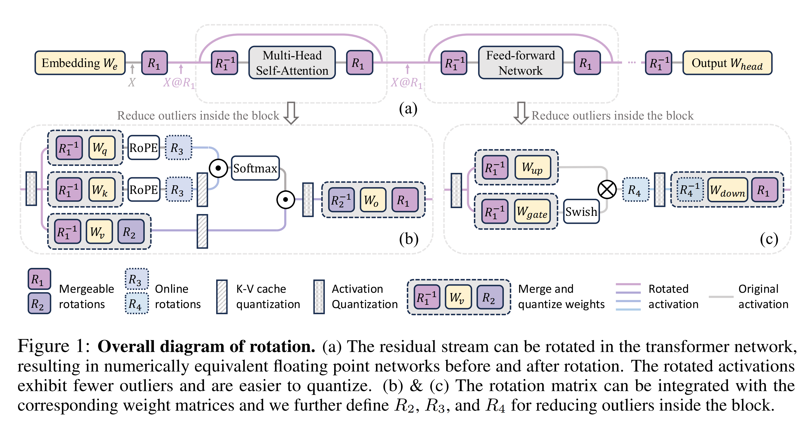

SpinQuant 에서 저자는 서로 다른 complexity levels 에 맞춘 두 가지 rotation strategies 를 도입한다: 

* $\texttt{SpinQuant}_\text{no had}$ 와 $\texttt{SpinQuant}_\text{had}$. 여기서 had 는 hadamard rotation matrix 를 의미한다. 
* $\texttt{SpinQuant}_\text{no had}$ 에서는 Fig. 1(b) 에서 보이듯이 shortcut rotation (R1) 과 WvWo pair rotation (R2) 을 구현하며, 이는 각각의 weight matrices 로 직접 흡수될 수 있다. 
  * inference 동안에는 original weights 를 rotated quantized weights 로 단순히 교체하기만 하면 되며, forward pass 에서의 수정이 필요 없다. 
* 반대로 $\texttt{SpinQuant}_\text{had}$ 는 KV cache 또는 activations 에 대한 low-bit quantization (e.g., 4-bit) 시나리오를 위해 설계되며, MLP block 내부와 KV cache 안의 activation outliers 를 다루기 위해 online Hadamard rotation matrices (R3, R4) 를 추가로 통합한다.

SpinQuant 의 효과를 엄밀히 평가하기 위해, 저자는 LLaMA-2 models (7B/13B/70B), LLaMA-3 models (1B/3B/8B), 그리고 Mistral 7B model 을 포함하는 선도적인 Large Language Models (LLMs) 7 개에 걸쳐 포괄적인 experiments 를 수행한다. 본 연구의 핵심 기여는 다음과 같다:

* 저자는 weight 및 activation distributions 에서 outliers 를 완화하기 위해 learned rotations 를 사용하는 최초의 방법인 SpinQuant 를 소개하며, 이를 통해 quantized LLMs 의 performance 를 향상시킨다.
* 저자는 random rotations 가 quantized network performance 에 상당한 variance 를 도입함을 밝힌다. 
  * 저자는 Stiefel manifold 내에서 rotation matrices 를 최적화하여 rotated quantized network 의 final loss 를 직접 최소화하는 방법을 제안한다. 
  * ablation studies 는 learned rotations 가 random rotations 를 일관되게 상회하며, 최대 16.2 points 개선을 보인다는 것을 검증한다.
* $\texttt{SpinQuant}_\text{no had}$ 는 network architecture 를 변경하지 않고 rotation matrices 를 pre-trained weights 에 병합하여, Mistral-7B model 의 zero-shot commonsense reasoning tasks 에서 W4A8KV8 quantization performance gap 을 12.1 에서 1.6 으로 크게 줄인다. 
* 또한 $\texttt{SpinQuant}_\text{no had}$ W4A8 quantization 은 LLaMA-2 에서 QuIP# 및 OminiQuant 와 같은 SoTA weight only quantization methods 와 comparable performance 를 달성한다.
* $\texttt{SpinQuant}_\text{had}$ 는 LLaMA-2 7B 에서 극단적인 W4A4KV4 quantization settings 하에 average accuracy 64.0 을 달성한다. 
  * 이는 full-precision network 대비 단지 2.9 point gap 에 해당하며, 동일한 precision conditions 에서 22.0 point gap 을 보였던 이전의 LLM-QAT 접근 대비 큰 개선이다.

# 2 Motivation

Quantization 은 memory 를 절약하고 latency 를 낮추기 위해 neural network 에서 weights (and/or activations) 의 precision 을 낮춘다. quantization process 는 다음과 같이 정식화될 수 있다:

$$
X_Q = \alpha \left\lfloor \frac{X_R - \beta}{\alpha} \right\rceil + \beta
\tag{1}
$$

* 여기서 symmetric quantization 에서는 $\alpha = \frac{\max\left(\lvert X_R \rvert\right)}{2^{N-1}-1}$, $\beta = 0$ 이고, 
* asymmetric quantization 에서는 $\alpha = \frac{\max(X_R)-\min(X_R)}{2^N-1}$, $\beta = \min(X_R)$ 이다. 
* 여기서 $X_Q$ 는 quantized tensor 이고 $X_R$ 는 real-valued FP16 tensor 이다. 
* $N$ 은 bit 수이다. 

Large language models (LLMs) 에서 outliers 의 존재는 weight/activation values 의 range 를 확장시키고 normal values 에 대한 reconstruction errors 를 증가시킨다 (Fig. 2 (a)&(c)).

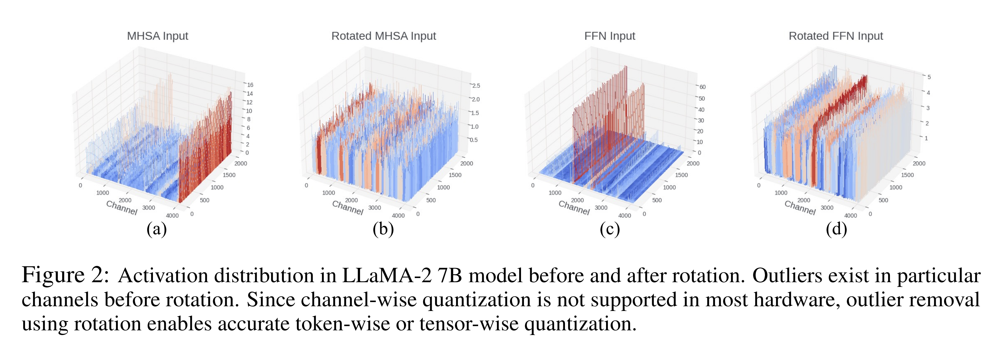

## 2.1 Outlier Reduction

outliers 의 영향을 완화하는 많은 방법들이 존재한다. 

본 논문에서 저자는 outliers 를 줄이기 위해 optimized rotation 을 사용하는 것을 제안한다. 직관적으로 random rotation matrix 는 큰 weights 와 작은 weights 를 통계적으로 섞어 outliers 가 더 적은 well-behaved distribution 으로 만들며, 그 결과 quantize 하기 더 쉬워진다.

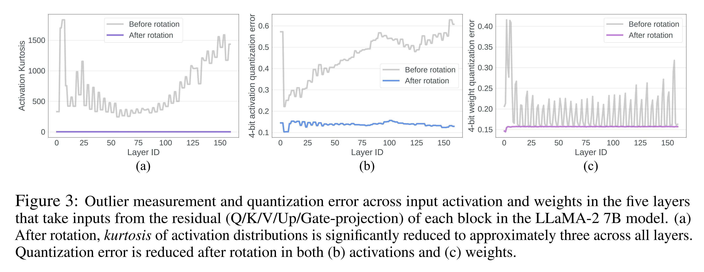

* Fig. 3 (a) 는 rotation 전후 activations 의 Kurtosis $\kappa$ 측정을 예시한다. $\kappa$ 는 real-valued random variable 의 probability distribution 이 얼마나 “tailed” 한지를 정량화한다. 
  * larger $\kappa$ 는 더 많은 outliers 를 의미하며, $\kappa \approx 3$ 은 Gaussian-like distribution 을 시사한다. 
  * Fig. 3 (a) 에서 transformer 의 activation distribution 은 많은 outliers 를 포함하며, 많은 layers 의 $\kappa$ 가 200 을 초과한다. 
* 그러나 이 activations 에 random rotation matrix 를 곱한 뒤에는 모든 layers 에 걸친 $\kappa$ 가 대략 3 이 되어, quantize 하기 더 쉬운 Gaussian-shaped distribution 을 나타낸다. 
  * 이는 Fig. 3 (b) 에서도 뒷받침되는데, rotation 후 activation tensor 의 quantization error 가 유의미하게 감소한다.

## 2.2 Random Rotations Produce Large Variance

흥미롭게도, 통계적으로 random rotation 이 더 나은 quantization 으로 이어지지만, 모든 random rotations 가 동일한 quantization outcome 을 주지는 않는다. 이를 보이기 위해 저자는 rotated version 의 LLaMA-2 7B 를 4-bit weight 및 4-bit activation 으로 quantize 한 설정에서, 100 번의 randomized trials 하에 zero-shot average accuracy 를 테스트했다. 

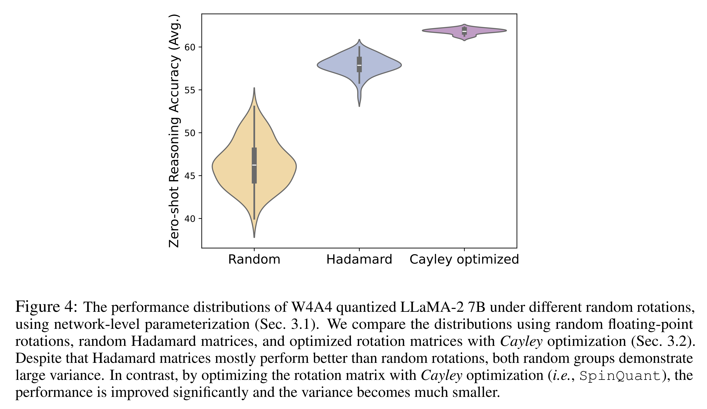

* Fig. 4 에서 보이듯이 performance variance 는 상당하며, 최상의 random rotation matrix 는 최악의 것보다 13 points 더 높은 성능을 보인다. 
* random Hadamard matrices 는 random rotation matrices 보다 더 좋은 성능을 보이며, 이는 Hadamard matrices 가 weight maximal value 에 대해 더 타이트한 bounds 를 제공한다는 발견과 일치한다. 
* 그러나 random Hadamard rotation matrices 조차도 final performance 에서 무시할 수 없는 variance 를 보이며, 그 크기는 6 points 에 달한다.

여러 rotation trials 전반에 걸친 큰 variance 를 고려할 때, 자연스러운 질문이 제기된다: *quantization 의 이점을 최대화하도록 rotation 을 최적화할 수 있는가?* 저자는 7 개 models 및 4 개 low-bit quantization settings 전반에서 일관되게 높은 accuracy 를 달성하는, quantization-oriented rotation learning 을 갖춘 실행 가능한 framework 를 제시함으로써 이 질문에 대해 긍정적으로 답한다.

# 3 Method

이 절에서 저자는 quantization loss 를 목표로 LLMs 에 rotations 를 통합하고 최적화하는 framework 인 SpinQuant 를 소개한다. 

저자는 먼저 popular LLM architectures 의 rotation parameterization 을 정의하는데, 여기에는 rotationally invariant full-precision network 를 만들어내는 두 개의 mergeable rotation matrices (R1, R2) 와, extreme activation 및 KV-cache quantization 에서 outliers 를 추가로 줄이기 위한 두 개의 online Hadamard rotation (R3, R4) 이 포함된다. 이어서 저자는 target loss 에 대해 Stiefel manifold 위에서 이러한 rotation matrices 를 최적화하는 방법을 제시한다.

## 3.1 Rotation Parameterization

#### Rotating activations in residual

Fig. 1(a) 에서 보이듯이, 저자는 embedding output $X$ 에 random rotation matrix (R1) 를 곱해 residual path 의 activations 를 rotate 한다. 이 rotation 은 outliers 를 제거하고 residual 로부터 읽는 fully-connected layers 로 들어가는 input activations 의 quantization 을 쉽게 한다. 

numerical invariance 를 유지하기 위해, 저자는 attention block 과 feed-forward network 를 통과하기 전에 activation 에 $R_1^\top$ ($= R_1^{-1}$) 를 곱해 rotation 을 되돌린다. attention block 과 feed-forward network 는 non-linearity 를 포함한다. quantization 이 없을 때는 어떤 rotation 을 적용하더라도 full-precision network 는 그대로 유지된다. 

rotation matrices 는 Fig. 1(b)&(c) 에서 보이듯이 대응하는 weight matrices 로 merge 될 수 있다. absorption 이후에는 network 에 새로운 parameters 가 도입되지 않는다. 이제 저자는 floating-point network 의 accuracy 나 parameter count 에 영향을 주지 않고 R1 을 자유롭게 수정할 수 있다.

#### Rotating activations in the attention block

Fig. 1(b) 에서 묘사되듯이, attention block 에서 저자는 value matrix 를 $R_2$ 를 곱해 rotate 하고, out-projection layer 로 들어가는 activations 를 head-wise 하게 $R_2^\top$ 를 곱해 rotate 할 것을 제안한다. $R_2$ 는 $(D_{head}, D_{head})$ shape 을 가지며 layer 별로 독립적으로 선택될 수 있다. 

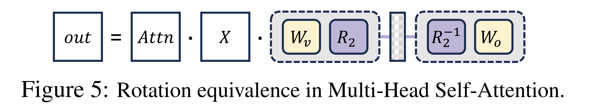

* numerical in-variance 는 Fig. 5 에서 설명되는데, $R_2$ 와 $R_2^\top$ 사이에는 operators 가 없기 때문에 full-precision network 에서 이 두 rotations 는 상쇄될 수 있다. 
* 동시에 이는 value cache 및 out-projection layer 로의 input activations 에 대한 quantization 을 개선하면서도 network 에 어떤 새로운 parameters 도 도입하지 않는다.

저자는 R1 과 R2 만 삽입하고 최적화한 방법을 $\texttt{SpinQuant}_\text{no had}$ 로 표기하며, 이는 이전 quantization methods 대비 유의미한 accuracy improvement 를 쉽게 달성하고, W4A8 quantized LLMs 와 해당 full-precision counterparts 사이의 gap 을 zero-shot commonsense reasoning averaged accuracy 기준으로 $0.1 - 2.5$ points 까지 줄일 수 있다.

#### Additional unabsorbed rotations

lower bit (e.g., 4-bit) activation quantization 에 대해 outlier suppression 을 더 강화하기 위해, 저자는 feed-forward block 내부에 Hadamard matrix multiplication (Fig. 1(c) 의 R4) 을 통합하여 down projection layer 로 들어가는 input 의 outliers 를 줄인다. 이는 (Tseng et al., 2024; Ashkboos et al., 2023b) 와 유사하다. 

Hadamard rotation 은 fast hadamard transform 으로 계산될 수 있으며 inference latency 에 marginal overhead 만을 추가한다. 유사하게, low-bit KV cache quantization 이 필요할 때 Hadamard matrix (Fig. 1(b) 의 R3) 를 삽입할 수 있다. 저자는 모든 rotations 를 갖춘 결과 방법을 $\texttt{SpinQuant}_\text{had}$ 로 표기한다. 다음으로 저자는 이러한 rotations 를 공동으로 최적화하는 방법을 보인다.

## 3.2 Cayley-Optimized Rotation

Fig. 1 에서 보이듯이, 저자는 네 개의 rotation matrices (R1, R2, R3, R4) 를 통합하면 full-precision network 에서 numerical consistency 를 보존하면서 quantization performance 를 개선할 수 있음을 확인했다. 

R3 와 R4 는 online rotation operations, 즉 weight matrix 에 흡수될 수 없는 연산이므로, 저자는 이를 Hadamard matrices 로 유지한다. 이는 online Hadamard transforms 가 유의미한 overhead 없이 효율적으로 구현될 수 있기 때문이다. 

그런 다음 저자는 optimization objective 를, quantized network 의 final loss 를 최소화하는 optimal rotation matrix $R_1$ 과 $R_2$ 를 찾는 것으로 정의한다:

$$
\arg\min_{R \in M} L_Q(R_1, R_2 \mid W, X)
\tag{2}
$$

* 여기서 $M$ 은 Stiefel manifold, 즉 모든 orthonormal matrices 의 집합을 나타낸다. 
* $L_Q(\cdot)$ 는 calibration set 에서의 task loss (e.g., cross-entropy) 를 의미한다. 
* 이는 fixed pretrained weights $W$, input tensor $X$, 그리고 network 내의 quantization function $Q$ 가 주어졌을 때 ${R_1, R_2}$ 의 function 이다.

Stiefel manifold 위에서 rotation matrix 를 최적화하기 위해, 저자는 *Stiefel* manifold 상의 효율적인 optimization algorithm 인 Cayley SGD method 를 사용한다. 더 구체적으로, 각 iteration 에서 rotation $R$ 의 update 는 다음과 같이 parameterize 된다:

$$
R' = \Delta R(Y)R := \left(I - \frac{\alpha}{2}Y\right)^{-1}\left(I + \frac{\alpha}{2}Y\right)R
\tag{3}
$$

* 여기서 $\Delta R(Y) := \left(I - \frac{\alpha}{2}Y\right)^{-1}\left(I + \frac{\alpha}{2}Y\right)$ 는 skew-symmetric matrix $Y$ (i.e., $Y^\top = -Y$) 의 *Cayley* Transform 이다. 
* $Y$ 는 loss function 의 gradient $G := \nabla_R L_Q$ 의 projection $\hat{G}$ 로부터 계산된다:

$$
Y = \hat{G} - \hat{G}^\top,\quad
\hat{G} := GR^\top - \frac{1}{2}RR^\top GR^\top
\tag{4}
$$

* $\Delta R(Y)$ 는 항상 orthonormal 이며, 따라서 $R$ 이 orthonormal 이면 $R'$ 또한 orthonormal 임이 보장된다 ($R'^\top R' = I$). 
* Eqn. 3 은 matrix inverse 를 요구하지만, 새로운 rotation matrix $R'$ 는 효율적인 fixed point iteration 으로 계산될 수 있다. 
* 전체적으로 이 접근은 naive SGD algorithm 대비 iteration 당 computation time 이 약 $\sim 2$ 배만 증가한 상태에서 orthonormality 성질을 유지한다.

저자는 network 의 underlying weight parameters 를 frozen 한 채로, *Cayley* SGD method 를 적용해 Eqn. 2 를 ${R_1, R_2}$ 에 대해 푼다. ${R_1, R_2}$ 는 weight size 의 약 $\sim 0.26%$ 만을 차지하며 orthonormal 로 constrained 된다. 결과적으로 underlying floating-point network 는 변하지 않으며, rotation 은 quantization performance 에만 영향을 준다.

WikiText2 calibration dataset 의 800-sample 에 대해 100 iterations 동안 *Cayley* optimization 으로 rotation 을 update 하면, Fig. 4 에서 보이듯이 100 개 random seeds 에서의 best random matrix 및 random Hadamard matrix 를 상회하는 rotation matrix 를 얻는다. 

*Cayley*-optimized rotation 은 서로 다른 random seeds 에서 시작하더라도 minimal variance 를 보인다. rotation matrices 는 optimization 을 위해 random Hadamard matrices 로 initialize 되며, Sec. 4.3.3 의 ablation study 는 optimized rotation 이 random rotation initialization 에 대해서도 robust 하다는 것을 보인다.

# 4 Experiments

저자는 LLaMA-2 models (7B/13B/70B), LLaMA3 models (1B/3B/8B), 그리고 Mistral 7B model 에서 experiments 를 수행한다. 

저자가 제안한 SpinQuant 의 평가는 8 개의 zero-shot commonsense reasoning tasks 에서 수행된다. 이 tasks 는 BoolQ, PIQA, SIQA, HellaSwag, WinoGrande, ARC-easy 및 ARC-challenge, 그리고 OBQA 를 포함한다. 추가로 저자는 평가를 위해 WikiText2 testset 에서 perplexity score 도 보고한다.

## 4.1 Experimental Settings

* 저자는 Cayley SGD 를 사용해 rotation matrix $R_1$ 과 $R_2$ 를 최적화하며, 두 rotation 은 모두 random Hadamard matrix 로 initialize 되고 모든 network weights 는 constant 로 유지된다. 
  * $R_1$ 은 residual rotation 이며 $(D_{token}, D_{token})$ shape 이다. 
  * $R_2$ 는 각 attention block 에서의 head-wise rotation 이며 $(D_{head}, D_{head})$ shape 이고, 각 layer 에서 별도로 learned 된다. 
* learning rate 는 1.5 에서 시작해 0 으로 linearly decay 된다. 
* 저자는 WikiText-2 에서 800 samples 를 사용해 100 iterations 동안 rotation 을 최적화한다. 
* 이는 LLaMA-3 1B/3B/8B 에 대해 각각 약 $\sim 13/18/30$ minutes 가 걸리고, LLaMA-2 7B/13B 에 대해 각각 약 $\sim 25/30$ minutes 가 걸린다. 
* LLaMA-2 70B 에는 약 $\sim 3.5$ hours 가 걸리고, Mistral-7B 에는 약 $\sim 16$ minutes 가 걸린다.

---

* main results 에서 저자는 activations 가 quantized 된 network 에 대해 rotation 을 최적화하며, weights 는 16-bit 로 유지된다. 
* rotation 을 학습한 뒤, 저자는 rotated weights 에 GPTQ 를 적용한다. 이때 저자는 standard GPTQ settings 를 따르며, WikiText2 에서 sequence length 2048 인 128 samples 를 GPTQ quantization 을 위한 calibration set 으로 사용한다. 
* main table 에서는 GPTQ 를 적용한 SpinQuant 의 결과를 제시하며, ablation study 에서는 simple round-to-nearest (RTN) quantization 을 적용한 결과도 함께 보인다.

## 4.2 Main Results

저자는 서로 다른 시나리오를 수용하기 위해 두 가지 rotation schemes 인 $\texttt{SpinQuant}_\text{no had}$ 와 $\texttt{SpinQuant}_\text{had}$ 를 제시한다. Tab. 1 에서 저자는 7 개 models 과 가장 흔히 사용되는 4 가지 bit-width settings 을 사용해, 실제로 어떤 rotation scheme 을 선택해야 하는지에 대한 guideline 을 제공한다.

Recap: $\texttt{SpinQuant}_\text{no had}$ 는 learned rotation $R_1$ 과 $R_2$ 만 사용하며, rotation 이 learned 된 이후 inference time 에 대응하는 model weights 로 merge 될 수 있다. 

$\texttt{SpinQuant}_\text{no had}$ 를 사용하면 original model weights 를 rotated model weights 로 교체하기만 하면 되며, forward pass 의 수정이나 추가적인 kernel support 가 필요 없다. 반면 $\texttt{SpinQuant}_\text{had}$ 는 learned rotations ($R_1, R_2$) 과 online Hadamard rotations ($R_3, R_4$) 를 모두 포함한다. 

inference time 에 $R_3$ 와 $R_4$ 는 fast Hadamard kernel 로 계산될 수 있으며, 저자는 Sec. 4.5 에서 online Hadamard rotation 이 network latency overhead 를 약 $\sim 8%$ 만 증가시킨다는 것을 보인다.

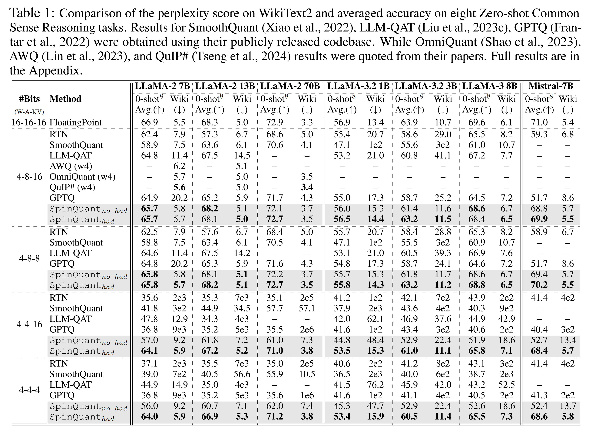

* Tab. 1 에서 보이듯이, weights 가 4-bit 로 quantized 되고 activations 가 8-bit 로 quantized 되는 시나리오에서는 $\texttt{SpinQuant}_\text{no had}$ 를 사용하면 쉽게 좋은 performance 를 달성할 수 있다. 
  * 예를 들어 $\texttt{SpinQuant}_\text{no had}$ 는 4-8-8 quantized Mistral 7B 를 10.5 points 향상시킨다. 
* llama3-8B 에서 $\texttt{SpinQuant}_\text{no had}$ 는 4-8-16 setting 에서 GPTQ 대비 4.1 point 이상 개선을 달성하며, full-precision network 와의 gap 을 단지 1.0 point 로 남긴다. 
  * 이러한 settings 처럼 activations 가 극단적으로 quantized 되지 않은 경우에는 $\texttt{SpinQuant}_\text{no had}$ 가 실용적인 해결책이며, 추가적인 online Hadamard rotation 을 더해도 이득은 marginal 하다.

---

* 반대로 activations 가 4 bits 로 quantized 될 때는 accuracy 가 크게 떨어지고, 대부분의 이전 방법들은 의미 있는 결과를 내지 못한다. 
* $\texttt{SpinQuant}_\text{no had}$ 는 이러한 상황에서 gap 을 최대 20 points 까지 줄인다. 
* 4-4-4 quantized LLaMA-2 models 에서 $\texttt{SpinQuant}_\text{no had}$ 는 LLM-QAT 를 7B model 에서 11.1 points 상회하고, 13B model 에서는 SmoothQuant 를 20.2 points 상회하며, 그 결과 corresponding full-precision network 와의 gap 을 각각 22.0/27.8 points 에서 10.9/7.6 points 로 줄인다. 
* 그럼에도 full-precision network 와의 gap 은 여전히 무시하기 어렵다. 
* 이 시나리오에서 $\texttt{SpinQuant}_\text{had}$ 는 accuracy 를 5 points 이상 추가로 개선하고, respective FP network 와의 gap 을 2-4 points 로 줄인다. 
* 4-4-4 quantized LLaMA-2 7B/13B/70B models 에서 $\texttt{SpinQuant}_\text{had}$ 는 corresponding full-precision network 대비 2.9/1.4/1.7 의 accuracy gap 만 남기며, 이전 SoTA methods 를 각각 19.1/16.4/15.3 points 만큼 크게 상회한다.

---

* 추가로, OmniQuant, AWQ, QuIP# 와 같은 SoTA weight-only quantization methods 와 비교했을 때, SpinQuant 는 4-bit weights 및 8-bit activations 설정에서 Wiki dataset 상의 evaluation perplexity 가 유사하며, advance vector quantization technique 를 사용하지 않는다. 
* 이러한 결과는 SpinQuant 가 다양한 시나리오에 적합하며 state-of-the-art performance 를 달성한다는 것을 보여준다.

## 4.3 Ablation Studies

### 4.3.1 Learned Rotation vs Random Rotation

Tab. 2 에서 저자는 random Hadamard rotations 사용과 SpinQuant 의 optimized rotations 사용을 대비한다. 

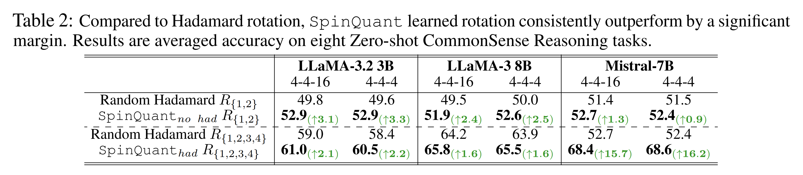

* learned rotations 를 사용하면, R1,2 settings 이든 R1,2,3,4 settings 이든, 다양한 models 및 bit-width configurations 전반에서 accuracy 가 일관되게 향상된다. 
* 특히 Mistral-7B 의 quantization 에서 $\texttt{SpinQuant}_\text{had}$ 는 random Hadamard rotations 를 사용하는 것 대비 15.7 points 를 초과하는 improvement 를 확보한다. 
* rotation optimization 이 minimal time cost (smaller models 에서는 30 minutes, 70B model 에서는 최대 3.5 hours) 만을 유발한다는 점을 고려할 때, 저자는 LLMs 의 precise quantization 을 위해 optimized rotations 채택을 권장한다.

### 4.3.2 Compatibility with GPTQ

weights 와 activations 가 모두 quantized 되는 맥락에서, 저자는 learned rotations 가 weight quantization 과 activation quantization 모두에 효과적으로 적응하는 경향이 있음을 관찰한다. 

GPTQ 는 weight quantization 으로 인한 errors 를 완화하는 데 크게 도움이 되지만 activation quantization 은 그대로 남겨 둔다. 따라서 저자는 activations 만 quantized 된 network 에 대해 rotation matrices 를 최적화하기로 선택한다. 이 접근은 rotation 이 activation quantization error 를 더 효율적으로 관리하도록 하면서, weight quantization error 는 GPTQ 가 처리하도록 남겨 둔다. 

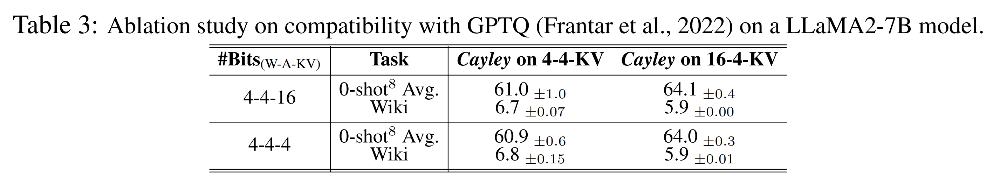

* Tab. 3 에서 보이듯이, 이 수정은 LLaMA-2 7B model 의 W4A4 및 W4A4KV4 settings 모두에서 더 우수한 performance 로 이어졌으며, 이것이 저자가 본 논문 나머지 전반에서 사용하기로 선택한 configuration 이다.

### 4.3.3 Rotation Type

Tab. 4 에서 저자는 analysis 를 위해 round-to-nearest quantization 을 사용하며, random orthogonal floating-point rotation matrices 와 random Hadamard matrices 가 quantization accuracy 에 미치는 영향을 평가한다. 

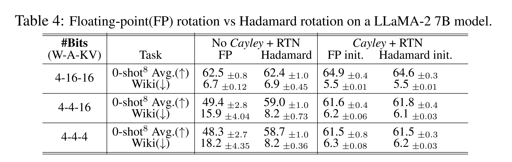

* optimization 이전에는 Hadamard matrices 가 floating-point rotation matrices 대비 더 좋은 quantized network performance 를 산출한다. 
* 그러나 optimization 이후에는 floating-point 이든 Hadamard 이든 initial choice of rotation 의 중요성이 낮아진다. 
  * 이는 loss-aware rotation optimization 이 quantization error 를 효과적으로 최소화하는 optimal local minima 를 찾을 수 있기 때문일 가능성이 높으며, 그 결과 rotation initialization type 변화에 대한 robustness 가 향상된다.

### 4.3.4 Comparison with QuaRot

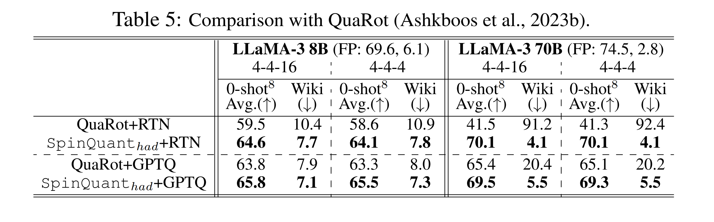

* QuaRot 는 quantized networks 에서 상당한 accuracy variances 를 보이는데, round-to-nearest methods 로 70B model 을 W4A4 및 W4A4KV4 로 quantize 할 때 각각 28.1 및 33.2 points 의 drop 을 경험한다. 
  * 이러한 degradation 은 high variance 를 도입하고 robustness 를 저해하는 random rotation matrix 사용에 내재한 noise 에서 비롯된다.
* 반면 $\texttt{SpinQuant}_\text{had}$ 는 다양한 configurations 전반에서 일관되게 높은 accuracy 를 유지하며, QuaRot 대비 2.0 부터 28.6 points 까지의 improvements 를 달성한다 (Tab. 5). 
* 또한 $\texttt{SpinQuant}_\text{had}$ 는 더 적은 online Hadamard matrices 를 사용한다 ($\texttt{SpinQuant}_\text{had}$ 는 block 당 2 개, QuaRot 는 block 당 4 개).

---

* 더 나아가 SpinQuant 에서 R2 의 통합은 block 내부 outliers 를 효과적으로 줄여, $\texttt{SpinQuant}_\text{no had}$ 가 W4A8 settings 에서 optimal performance 를 제공할 수 있게 한다. 
* $\texttt{SpinQuant}_\text{no had}$ 는 model weights 를 rotated weights 로 단순히 대체하는 것만으로 달성될 수 있어, model architecture 수정과 special kernel support 가 필요한 QuaRot 대비 더 straightforward 하고 efficient 한 접근이 된다.

## 4.4 Illustrative Analysis of the Rotation Efficacy

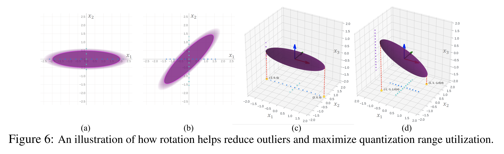

network weights 와 activations 를 rotate 하는 근거는 간단한 예시로 설명될 수 있다. activation ($X$) 이 2D vector 로 표현된다고 하자. 여기서 한 entry $x_1$ 이 $x_2$ 보다 일관되게 더 큰 magnitude 의 activations 를 받는다 (Fig. 6(a) 참조). 이 components 를 함께 quantize 하면 보통 quantization range 가 $x_1$ 에 의해 지배되며, 그 결과 $x_2$ 에 대한 precision 이 손상된다.

information entropy 관점에서, 각 axis 를 확장해 사용 가능한 quantization range 를 최대한 활용하면 각 axis 의 representational capacity 가 최대화된다. 따라서 matrix rotation 은 직관적인 해결책으로 등장한다. 2D 시나리오에서 axis 를 $45^\circ$ 만큼 rotate 하면 axes 간 value representation range 가 균등해진다 (Fig. 6(b) 참조). activation distribution 을 정확히 알지 못한 채 network 를 black box 로 가정하면, 모든 axes 를 최대 각도 (2D 에서는 $45^\circ$) 만큼 균일하게 rotate 하는 것은 각 axis 전반에서 distribution evenness 를 최적화할 수 있으며, 이는 Hadamard rotation 이 random rotation matrices 보다 종종 더 나은 성능을 보이는 이유를 부분적으로 설명한다.

이를 더 확장하면, activation distribution 을 알고 있다면, quantization 동안 network 를 white box 로 다루어 Hadamard 보다 더 optimal 한 rotations 를 식별할 수 있다. 예를 들어 Fig. 6(c-d) 의 3D 시나리오에서 $x_1$ 의 magnitude 가 $x_2$ 와 $x_3$ 의 4 배라고 하자. $x_3$ 와 $x_2$ 를 따라 distribution 을 $45^\circ$ rotate 하면 maximum values 가 $[2, 0.5, 0.5]$ 에서 $[1, 1, 1.414]$ 로 재분배된다. 그러나 더 optimal 한 rotation strategies 가 존재할 수도 있으며, rotation 을 learn 하면 주어진 distribution 에 대해 가장 효과적인 rotation 을 pinpoint 하는 데 도움이 될 수 있다.

이는 흥미로운 연구 방향을 연다. 예를 들어 outlier axes 와 magnitudes 가 알려진 activation distribution 이 주어졌을 때, 서로 다른 axes 전반에서 magnitude 를 균등하게 분배하는 optimal rotation matrix 에 대한 closed-form solution 을 도출할 수 있는지의 문제이다. 또한 이론적으로 계산된 이 rotation 이 최고의 quantization performance 를 산출하는지에 대한 질문도 제기된다. 저자는 이 질문을 향후 연구로 남긴다.

## 4.5 Speed Measurement

저자는 MacBook M1 Pro CPU (OS version 14.5) 에서 LLaMA-3 8B model 의 W16A16 및 W4A8 configurations 에 대해 end-to-end speed measurement 를 수행한다. Tab. 6 의 결과는 4-bit quantization 이 16-bit model 대비 약 $\sim 3 \times$ speedup 을 제공함을 보여준다. 

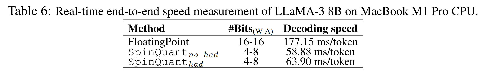

* $\texttt{SpinQuant}_\text{had}$ 와 $\texttt{SpinQuant}_\text{no had}$ 를 비교하면, online Hadamard processing 은 latency 를 modest 하게 8% 증가시킨다. 따라서 이는 trade-off 이다. 
  * 즉, 간단함을 위해 online Hadamard 없이 $\texttt{SpinQuant}_\text{no had}$ 를 사용하느냐, 아니면 lower-bit activation quantization 에서 더 높은 accuracy 를 위해 online Hadamard rotations 를 포함하는 $\texttt{SpinQuant}_\text{had}$ 를 사용하느냐의 선택이다.

# 5 Related Work

#### Quantization

Neural network quantization 은 model size compression 및 storage reduction 을 위한 효과적인 도구로 입증되어 왔다. 그러나 large language models (LLMs) 에서 quantization 은 수많은 outliers 의 존재로 인해 고유한 도전 과제를 제시한다. 이러한 outliers 는 quantization range 를 지배하여, 대부분의 values 에 대해 effective bits 가 몇 개만 남게 만든다. 

LLM quantization 의 어려움을 해결하기 위해 다양한 전략이 제안되어 왔다. 여기에는 outliers 를 분리하고 mixed precision 을 사용하는 방법, Hessian-based methods 를 사용해 quantization difficulty 를 완화하는 방법, weights 와 activations 사이에서 outliers 를 trade 하는 방법, weight equalization 을 활용하는 방법, outlier suppression, channel reassembly, 그리고 pre-training 동안 outliers 를 다루기 위한 architectural modifications 를 제안하는 방법까지 포함된다. 

최근 두 편의 QuIP 논문은 random rotation matrices 를 사용한 incoherence processing 과, compression 을 위해 weights 에 vector quantization 을 적용하는 방법을 소개한다. 그러나 이는 extra overhead 를 도입하며, vector quantization kernels 의 가용성 측면에서 LLM 이 배포되는 devices 에 일부 constraints 를 부과한다.

#### Optimization in orthonormal space

rotation matrices 의 optimization 은 모든 orthonormal matrices 를 포함하는 Stiefel Manifold 내에서 수행된다. 

이 manifold 위에 머무르면서 optimization 을 수행하는 방법으로는 e.g., skew-symmetric matrix 를 parameterize 하고 그 위에 Cayley transformation 을 적용하는 방법, 또는 matrix exponential 을 사용하는 방법이 있다. 그러나 이러한 방법들은 매 iteration 마다 적용되는 expensive inverse 또는 matrix-exponential functions 에 의존한다. 대신 저자는 Cayley SGD 라는 더 효율적인 방법을 따른다. 이는 arbitrary loss functions 에 대해 rotation matrix $R$ 을 효율적으로 optimize 하는 데 적용될 수 있다. Cayley SGD 는 Cayley Transform 의 iterative approximation 에 의존하며, 이는 오직 matrix multiplications 로만 수행된다.

# 6 Conclusion

본 논문에서 저자는 learned rotation 을 사용하여 full precision 과 4-bit weight, activation, 그리고 kv-cache quantization 사이의 performance gap 을 효과적으로 줄이는 새로운 quantization technique 인 SpinQuant 를 제시한다. 

핵심적으로 SpinQuant 는 LLM models 의 rotation invariance property 를 활용하여, weights 및 intermediate activations 에서 outliers 를 줄이는 rotation matrices 를 삽입하되 network 의 full-precision output 을 수치적으로 동일하게 유지한다. 또한 SpinQuant 는 rotation matrices 최적화를 위해 Cayley SGD 를 통합하여, improved 하고 robust 한 quantization outcomes 를 산출한다. 중요하게도 SpinQuant 는 더 advanced weight quantization techniques (e.g., GPTQ) 와 compatible 하며, state-of-the-art performance 를 보여준다.
