논문 및 이미지 출처 : <https://arxiv.org/pdf/2406.01721>

# Abstract

Large language models (LLMs) 의 quantization 은 특히 low-bit representation 의 효율성을 저해하는 outlier activation 의 존재로 인해 상당한 도전에 직면한다. 기존 접근법은 주로 상대적으로 큰 magnitude 를 가지며 모든 token 전반에 걸쳐 나타나는 Normal Outliers 를 처리하는 데 집중한다. 그러나 이러한 방법은 훨씬 더 큰 값을 보이는 Massive Outliers 를 smoothing 하는 데 어려움을 겪으며, 이는 low-bit quantization 에서 상당한 성능 저하를 초래한다.

본 논문에서 저자는 rotation 및 permutation transformation 을 활용하여 massive outlier 와 normal outlier 를 보다 효과적으로 완화하는 새로운 접근법인 DuQuant 를 제안한다.

* 첫째, DuQuant 는 특정 outlier dimension 을 prior knowledge 로 활용하여 rotation matrix 를 구성하고, block-wise rotation 을 통해 outlier 를 인접 channel 로 재분배한다.
* 둘째, 저자는 block 간 outlier 분포를 균형 있게 만들고 block-wise variance 를 줄이기 위해 zigzag permutation 을 추가로 적용한다.
* 이후 추가적인 rotation 을 수행하여 activation landscape 를 더욱 smoothing 하며, 이를 통해 model 성능을 향상시킨다.

DuQuant 는 quantization 과정을 단순화하면서도 outlier 관리에 탁월한 성능을 보인다. 다양한 크기와 유형의 LLM 에 대해 여러 task 에서 실험한 결과, 4-bit weight-activation quantization 조건에서도 state-of-the-art baseline 을 능가하는 성능을 달성한다.

# 1 Introduction

Large language models (LLMs) 는 광범위한 natural language processing task 전반에서 탁월한 성능을 입증하였다. 그러나 수십억 개의 parameters 는 특히 memory usage 와 inference speed 측면에서 resource-constrained edge device 상의 deployment 에 상당한 어려움을 초래한다. 이러한 문제에 대응하기 위해, network quantization 방법이 광범위하게 연구되었다. 이는 floating-point parameters 를 low-bit format 으로 변환하여 memory usage 를 최소화하고, activation 과 weight 를 동시에 quantization 하여 matrix multiplication 과정을 가속함으로써 inference 를 빠르게 한다.

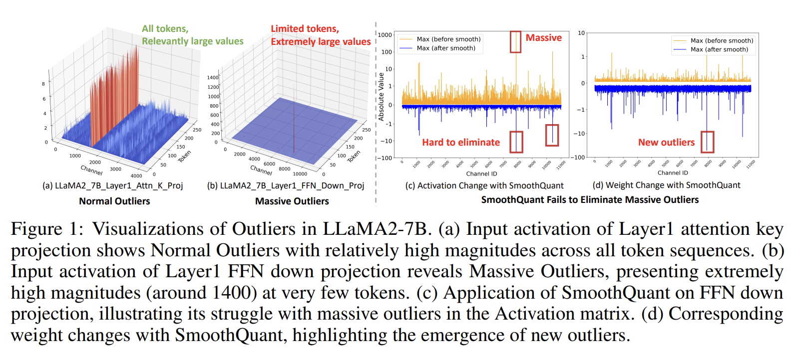

LLM quantization 방법에서 주요 문제 중 하나는 activation outlier 의 존재이다. 

* 이는 quantization step size 를 증가시키고, 결과적으로 상당한 accuracy loss 를 유발한다. 
  * 이 문제를 완화하기 위해, 최근 연구는 모든 token 전반에 걸쳐 여러 channel 에 지속적으로 존재하는 Normal Outliers 를 처리하는 다양한 방법을 개발하였다. 
* 그러나 Normal Outliers 외에도 Massive Outliers 라 불리는 또 다른 유형의 activation outlier 가 존재한다. 
  * 이러한 outlier 는 Fig. 1(b) 에 나타난 바와 같이, 매우 큰 값을 가지며 일부 token 에서만 제한적으로 발생하는 특성을 가진다. 
* 안타깝게도 기존 LLM quantization 방법은 이러한 Massive Outliers 를 효과적으로 처리하는 데 어려움을 겪는다.

---

* 예를 들어, SmoothQuant 는 activation outlier 의 일부를 weight 측으로 이동시키기 위해 smooth factor 를 사용하지만, Fig. 1(c)(d) 에서 보이듯이 극도로 큰 값을 가지는 Massive Outliers 는 여전히 효과적으로 처리하지 못한다. 
* 한편, OmniQuant 와 AffineQuant 는 Massive Outliers 의 존재로 인해 training instability 문제를 보인다. 
* 따라서 Normal Outliers 와 Massive Outliers 를 모두 효과적으로 처리할 수 있는 LLM quantization 접근법이 절실히 요구된다.

이러한 도전을 해결하기 위해, 저자는 **Dual transformations Quantization (DuQuant)** 방법을 제안한다. 

* 저자의 동기는 activation outlier 값을 서로 다른 channel 로 재분배하여 quantization 을 보다 용이하게 만드는 것이다. 
* 구체적으로, 저자는 orthogonal rotation matrix 와 orthogonal permutation matrix 를 구성한다. 
* 이 행렬들을 activation 에 곱함으로써 activation 에 대한 column transformation 을 효과적으로 수행할 수 있으며, 이를 통해 outlier 의 재분배가 가능해진다.

Rotation transformation 측면에서, 저자는 먼저 outlier 가 존재하는 특정 dimension 을 prior knowledge 로 식별하고, greedy algorithm 을 사용하여 rotation matrix 를 구성한다. 

* 곱셈 효율성을 향상시키기 위해, 각 matrix 가 activation 의 일부만을 담당하도록 diagonal block-wise rotation matrix 를 활용한다. 
  * 그러나 이러한 방식은 서로 다른 block 간 outlier magnitude 가 불균형하게 분포하는 결과를 초래할 수 있다. 
* 이를 해결하기 위해 저자는 activation channel 을 재정렬하는 zigzag permutation 을 제안하며, 이는 서로 다른 block 간 보다 균일한 분포를 촉진한다. 
* 구체적으로, 가장 높은 activation 값을 가지는 channel 을 block 들에 걸쳐 앞뒤로 번갈아가며 분배한다.

Outlier magnitude 가 균일하게 분포된 block 이 형성된 이후, 저자는 각 block 내부에서 outlier 를 추가로 재분배하기 위해 또 다른 rotation transformation 을 적용한다. 

* 이때, rotation 및 permutation matrix 의 transpose 를 weight matrix 와 동시에 곱하여 linear layer 의 동등성을 유지하면서 weight 또한 smoothing 한다. 
* 이론적 분석은 이러한 rotation 및 permutation transformation 이 outlier 로 인해 유발되는 quantization 문제를 크게 완화함을 확인한다.

그 결과, DuQuant 는 QuaRot 대비 다음과 같은 명확한 장점을 제공한다.

* DuQuant 의 optimal rotation matrix 는 prior knowledge 에 기반한 greedy search 를 통해 도출되며, QuaRot 의 Hadamard rotation 보다 outlier 관리에서 우수한 성능을 보인다.
* 제안된 zigzag permutation 은 block 간 activation variance 를 크게 감소시켜 massive outlier 처리에서 뚜렷한 이점을 제공한다.
* weight 와 activation 을 공동으로 smoothing 함으로써, DuQuant 는 QuaRot 에서 요구되는 시간 소모적인 GPTQ algorithm 을 필요로 하지 않는다.

광범위한 실험 결과는 DuQuant 가 다양한 benchmark 에서 기존 4-bit weight-activation quantization baseline 을 크게 능가함을 보여준다. 특히, DuQuant 는 모든 LLaMA model size 에 대해 Commonsense QA task 에서 5% 의 성능 향상을 달성하였으며, Vicuna-v1.5-13B 에 대해 zero-shot MMLU benchmark 에서 10% 의 향상을 기록하였다.

또한, 실제 application 에서 LLaMA2-7B model 을 사용할 경우, DuQuant 는 pre-filling phase 를 최대 2.08 배 가속하고 decoding phase 동안 memory usage 를 3.50 배 감소시킨다. 이때 성능 저하는 최소 수준으로, FP16 model 대비 perplexity 는 0.61 증가하고 accuracy 는 2.71% 감소에 그친다. 이러한 결과는 DuQuant 가 quantized LLM 의 효율성과 수용 능력을 효과적으로 향상시킴을 보여준다.

# 2 Motivation

#### Normal Outliers and Massive Outliers

이전 연구들은 model compression 관점에서 LLM 의 activation outlier 가 제기하는 문제를 강조하였다. 이러한 outlier feature 는 특정 feature dimension 에서 일관되게 큰 값을 나타내며, 모든 token sequence 에 걸쳐 존재한다. 저자는 이를 Normal Outliers 라고 부른다.

최근에는 LLM 에서 Massive Outliers 라 불리는 또 다른 유형의 outlier 가 관찰되었다. Normal outlier 와 massive outlier 의 주요 차이점은 다음과 같다.

1. Normal outlier 는 모든 token sequence 전반에 걸쳐 지속적으로 존재하는 반면, massive outlier 는 제한된 수의 token 에만 국한된다.
2. Massive outlier 는 현저히 더 큰 magnitude 를 가지며, 종종 100 을 초과하고 다른 activation 의 median 값보다 약 1000 배 더 크다.

저자는 본 연구에서 이 두 가지 상이한 outlier 유형이 quantization 에 미치는 영향을 보다 심층적으로 분석한다.

#### Massive Outliers Exist at the Second Linear Layer of FFN Module

이전 연구들이 Transformer block 의 출력에서 massive outlier 를 관찰한 것과 달리, 저자는 FFN module 내 down-projection layer 의 입력에서 이러한 극도로 큰 activation 이 존재함을 처음으로 발견하였다.

Fig. 1 에 나타난 바와 같이, 

* LLaMA2-7B model 의 Layer 1 에서 down-projection layer 의 입력은 약 1400 에 달하는 단일 activation 을 포함한다. 
* 이 activation 은 하나의 token 에만 존재하므로 massive activation 으로 분류된다. 
* 이러한 현상은 Appendix I 에서 제시된 바와 같이, 서로 다른 layer 및 다양한 model size 에서 일관되게 관찰된다.

#### Massive Outliers Enlarge Quantization Difficulty

이전 연구들은 outlier feature 를 제거하기 위한 다양한 접근법을 제안하였지만, massive outlier 를 효과적으로 처리하는 데에는 여전히 한계를 보인다. 예를 들어, SmoothQuant 는 activation 을 channel 별 smoothing factor 로 나누고 이를 weight matrix 에 곱함으로써 quantization difficulty 를 activation 에서 weight 로 이전하려 한다.

그러나 저자는 down-projection layer 입력에서 이러한 이전이 down-projection weight 에 뚜렷한 outlier 를 유발함을 관찰하였다. 이는 massive outlier 로 인해 smoothing factor 가 매우 커지기 때문이다.

또한, 극도로 큰 outlier 는 optimization 기반 방법에서 loss explosion 문제를 유발할 수 있다. OmniQuant 와 AffineQuant 는 unstable gradient 로 인해 down-projection layer 에 대한 learnable parameter 를 제외해야 했다.

4-bit quantization 에서 관찰된 낮은 accuracy 로 인해, QUIK 은 down-projection layer 에 INT8 quantization 을 적용하였으며, Atom 은 128 개의 outlier channel 에 INT8 quantization 을 적용하였다.

따라서 massive outlier 는 기존 방법이 완전히 해결하지 못하는 새로운 quantization 문제를 야기한다. 이러한 관찰은 저자로 하여금 rotation 및 permutation transformation 을 개발하도록 동기를 부여하였다. 제안된 방법은 massive outlier 와 normal outlier 를 모두 효과적으로 처리하며, state-of-the-art 성능을 달성한다.

# 3 Method

본 절에서는 outlier 의 분포를 심층적으로 분석하고, 제안하는 DuQuant 방법을 소개한다. DuQuant 방법은 다음 두 가지 핵심 구성 요소로 이루어진다.

1. feature outlier 의 국소적 재분배를 담당하는 block-diagonal rotation matrix
2. 서로 다른 block 간 outlier 의 전역적 재정렬을 담당하는 zigzag permutation

## 3.1 Preliminaries

LLM 의 각 transformer block 내 공통 module 인 Multi-head Self-Attention (MSA) 와 Feed-Forward Network (FFN) 는 기본적으로 linear layer 로 구성되며, 다음과 같이 표현된다: $Y = X \cdot W \in \mathbb{R}^{T \times C_{out}}$

* 여기서 $X \in \mathbb{R}^{T \times C_{in}}$ 는 activation input 이고,
* $W \in \mathbb{R}^{C_{in} \times C_{out}}$ 는 weight matrix 이다.

본 논문에서는 hardware 지원을 개선하기 위해 activation 과 weight 모두에 대해 integer uniform quantization 을 적용한다. 구체적으로, $b$-bit quantization 과정은 FP16 tensor $X$ 를 low-bit integer $X_q$ 로 사상한다.

$$
X_q = \mathrm{clamp}\left( \left\lfloor \frac{X}{\Delta} \right\rceil + z,\ 0,\ 2^b - 1 \right) \tag{1}
$$

여기서

$$
\Delta = \frac{\max(X) - \min(X)}{2^b - 1},
\qquad
z = - \left\lfloor \frac{\min(X)}{\Delta} \right\rceil
$$

* $\lfloor \cdot \rceil$ 는 nearest rounding operation 을 의미하며,
* $\Delta$ 는 quantization step size,
* $z$ 는 zero point 이다.

기존 연구를 따라, activation 에는 per-token quantization 을 적용하고, weight 에는 per-channel quantization 을 적용한다. 이는 activation 의 각 token ($\Delta_X \in \mathbb{R}^{T \times 1}$) 과 weight 의 각 output channel ($\Delta_W \in \mathbb{R}^{1 \times C_{out}}$) 에 서로 다른 step size 를 할당하는 것을 의미한다.

## 3.2 The proposed DuQuant Method

Sec. 2 에서 언급한 Normal Outliers 문제를 해결하기 위해, 기존 quantization 방법들은 smooth technique 을 주로 사용한다. 예를 들어 SmoothQuant 와 OmniQuant 는 channel 별 smoothing diagonal matrix $\Lambda$ 를 활용하여 activation 과 weight matrix 를 scaling 한다.

이 경우 linear layer 는 다음과 같이 재작성된다: $Y = X \cdot W = (X \cdot \Lambda)(\Lambda^{-1} \cdot W)$

$\Lambda$ 의 diagonal element $\Lambda_j$ 는 다음과 같이 계산된다: $\Lambda_j = \frac{\max(|X_j|)^{\alpha}}{\max(|W_j|)^{1-\alpha}}$

* 여기서 $\alpha$ 는 migration strength 를 나타내는 hyper-parameter 이다.

이러한 smoothing 기법은 quantization difficulty 를 activation 에서 weight 로 이동시킬 수 있으나, Fig. 1 에서 보이듯 

* Massive Outliers 를 효과적으로 처리하지 못한다. Massive outlier 가 매우 큰 scaling factor $\Lambda_j$ 를 유발하고, 
* 이는 weight matrix 에 새로운 outlier 를 생성하여 4-bit quantization 에서 성능 저하를 초래한다.

이러한 관찰에 기반하여, 저자는 smooth technique 을 기반으로 Rotation 과 Permutation transformation 을 결합한 DuQuant 방법을 제안한다. 제안된 방법은 activation space 내 feature 를 재분배하여 Normal Outliers 와 Massive Outliers 모두의 영향을 완화하는 것을 목표로 한다.

#### The Rotation Transformation

Smooth technique 과 달리, 저자의 목표는 rotation matrix 를 적용하여 row 또는 column transformation 을 수행함으로써 Normal 및 Massive outlier 의 영향을 완화하는 것이다.

이상적인 rotation matrix $R$ 는 다음 조건을 만족해야 한다.

1. $R$ 는 orthogonal matrix 로서 $RR^{\top} = I, |R| = \pm 1$ 이를 통해 linear layer 는 다음과 같이 재구성된다: $Y = X \cdot W = (X R)(R^{\top} W)$
2. $R$ 는 outlier 의 위치를 효과적으로 겨냥하고, matrix multiplication 을 통해 이를 완화할 수 있어야 한다.

그러나 Massive Outliers 는 activation space 내에서 무작위적으로 분포하는 경향이 있어, 단일 rotation transformation 으로 이상적인 $R$ 을 직접 찾는 것은 어렵다.

이를 해결하기 위해, 저자는 prior knowledge 를 활용한 greedy search 로 근사 rotation matrix $\hat{R}$ 을 계산한다.

$\hat{R}$ 계산 과정은 다음 단계로 구성된다.

**Step 1: Outlier dimension 식별**

Outlier 가 주로 집중된 feature dimension $d^{(1)}$ 을 다음과 같이 정의한다: $d^{(1)} = \arg \max_j \left( \max_i |X_{ij}| \right)$

* 여기서 $X_{ij}$ 는 $X$ 의 $i$-th row, $j$-th column 의 원소이다.

**Step 2: Rotation matrix 구성**

탐색된 dimension $d^{(1)}$ 를 기반으로 rotation matrix 를 다음과 같이 구성한다.

$$
R_1 = E_{d^{(1)}} \tilde{R} Q E_{d^{(1)}}, \quad Q =
\begin{bmatrix}
1 & O \\
O & Q'
\end{bmatrix}
$$

* $E_{d^{(1)}}$ 는 activation 의 첫 번째 column 과 $d^{(1)}$-th column 을 교환하는 switching matrix 이다.
* $\tilde{R}$ 는 orthogonal initialization 된 rotation matrix 로, 첫 번째 row 가 균등 분포되도록 설계된다. 이는 $E_{d^{(1)}}$ 적용 이후 첫 번째 column 의 outlier 를 완화하기 위함이다.
* $Q'$ 는 random orthogonal matrix 로, 첫 번째 column 은 유지한 채 나머지 column 에 무작위 rotation 을 적용하여 randomness 를 증가시킨다.

**Step 3: Greedy search 누적**

Greedy search step 수를 $N$ 이라 하면, 근사 rotation matrix 는 다음과 같다: $\hat{R} = R_1 R_2 \cdots R_n$.

* 여기서 $n = \arg \min_{k \in [1:N]} \left( \max_{i,j} |(X R_1 \cdots R_k)_{ij}| \right)$
* 각 $R_i$ 는 Eqn. (2) 및 식별된 feature dimension $d^{(i)}$ 에 따라 구성된다.

이와 같은 구성 방식은 단순히 무작위 orthogonal rotation 을 사용하는 것과 달리, 큰 magnitude 의 outlier 를 효과적으로 완화할 수 있도록 보장한다.

---

이와 같은 구성 방식을 통해, 단순히 무작위로 선택된 orthogonal rotation matrix 를 사용하는 것과 달리, 근사된 최적 rotation matrix $\hat{R}$ 가 큰 magnitude 를 가지는 outlier 를 효과적으로 완화할 수 있음을 보장할 수 있다.

그러나 전체 rotation matrix 를 직접 구성하는 것은 시간 소모가 크고 상당한 memory overhead 를 초래한다. 빠른 matrix multiplication 을 위해, 기존 연구를 따라 rotation matrix $\hat{R} \in \mathbb{R}^{C_{in} \times C_{in}}$ 를 block-wise 방식으로 근사한다.

$$
\hat{R} = \mathrm{BlockDiag}(\hat{R}_{b_1}, \ldots, \hat{R}_{b_K}) \tag{3}
$$

여기서

* $\hat{R}_{b_i} \in \mathbb{R}^{2^n \times 2^n}$ 는 $i$-th block 에 해당하는 정방 행렬이며, 앞서 제시한 세 단계에 따라 구성된다.
* block 개수는 $K = \frac{C_{in}}{2^n}$

이와 같은 block-diagonal 구조는 계산 효율성을 유지하면서도 outlier 완화 효과를 확보할 수 있도록 한다.

#### The Permutation Transformation

시간 및 storage 효율성을 위해 block-diagonal rotation matrix $\hat{R}$ 를 사용하지만, 이는 local 정보에만 집중하기 때문에 outlier 를 추가로 감소시키는 데 한계가 존재한다. 각 작은 block 내부에서만 rotation 이 수행되므로, 서로 다른 block 간 정보를 통합하여 outlier 를 더욱 줄일 수 없다.

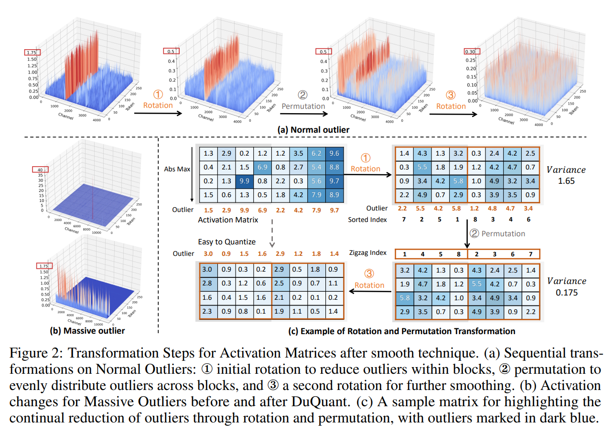

* 그 결과, Fig. 2 에서 보이듯 한 block 은 상대적으로 큰 outlier 를 가지는 반면 다른 block 은 작은 outlier 를 가질 수 있으며, 이는 block 간 높은 variance 를 초래한다. 
* 따라서 block-diagonal rotation matrix 만으로는 전체 outlier 를 효과적으로 줄이기에 충분하지 않다.

전체 outlier 를 효과적으로 완화하기 위해서는 여러 block 간 outlier magnitude 를 균형 있게 만드는 것이 필수적이다.

각 작은 block 내부에서 dimension $d_j$ 의 가장 큰 outlier 를 $O_j$ 로 표기한다. 또한 $M_{b_i}$ 는 $i$-th block 에 속한 모든 $O_j$ 의 평균값을 의미하며, $i = 1, 2, \ldots, K$ 이다.

이때 여러 block 간 activation magnitude 의 variance 는 다음과 같이 표현된다.

$$
\mathrm{Var}([M_{b_1}, M_{b_2}, \ldots, M_{b_K}]) \tag{4}
$$

이 variance 를 최소화하고 전체 outlier 를 더욱 감소시키기 위해, 저자는 zigzag permutation 을 도입한다.

* 구체적으로, 가장 큰 activation 을 가지는 channel 을 첫 번째 block 에 할당하는 zigzag sequence 를 생성한다. 
* 이후 다음으로 큰 activation 을 가지는 channel 을 block $K$ 까지 내림차순으로 순차 할당한다. 
* 마지막 block 에 도달하면 순서를 반대로 하여, 그 다음으로 큰 activation 을 가지는 channel 부터 오름차순으로 재할당한다. 
* 이러한 앞뒤(back-and-forth) 패턴을 전체 block 에 걸쳐 반복함으로써, 특정 block 이 지속적으로 가장 크거나 가장 작은 activation channel 만을 받지 않도록 한다.

구성된 permutation 은 orthogonal matrix $P$ 로 표현되며, 다음을 만족한다: $PP^{\top} = I, |P| = \pm 1$

**zigzag permutation** 을 적용하면 block 간 outlier 가 균형 있게 분포되며, 이후 추가적인 rotation transformation 을 통해 outlier 를 더욱 smoothing 할 수 있다. Fig. 2 는 이러한 outlier 완화 과정을 시각적으로 보여준다.

#### The Overall DuQuant Method

Normal Outliers 와 Massive Outliers 를 모두 완화하기 위해, 저자는 다음 절차를 따른다.

1. 먼저 smooth technique 을 적용하여 quantization difficulty 를 activation 에서 weight 로 이동시킨다.
2. block-diagonal rotation matrix $\hat{R}^{(1)}$ 을 적용하여 activation space 내에서 feature outlier 를 국소적으로 재분배한다.
3. zigzag permutation matrix $P$ 를 적용하여 서로 다른 block 간 outlier 를 전역적으로 균형화한다.
4. 이후 두 번째 block-diagonal rotation matrix $\hat{R}^{(2)}$ 를 적용한다.

이를 종합하면 transformer 내 linear layer 는 다음과 같이 재작성된다.

$$
Y = X \cdot W
= \big[(X \cdot \underbrace{\Lambda)\hat{R}_{(1)} \cdot P \cdot \hat{R}_{(2)}}_G \big]
\cdot
\big[\underbrace{\hat{R}_{(2)}^\top \cdot P^{\top} \cdot \hat{R}_{(1)}^\top(\Lambda^{-1}}_{G^{-1}}\cdot W)\big], \tag{5}
$$

* 여기서 $P$ 는 zigzag 방식으로 학습된 orthogonal permutation matrix 이고,
* $\hat{R}_{(1)}$, $\hat{R}_{(2)}$ 는 각각 첫 번째와 두 번째 block-diagonal rotation matrix 이다.

#### Remark 1

제안된 DuQuant 방법은 weight matrix 또한 동시에 smoothing 할 수 있다. 기존 smooth technique 은 효과적이지만, down-projection layer 의 weight matrix 에 뚜렷한 outlier 를 유발하여 성능 저하를 초래할 수 있다.

그러나 DuQuant 에서는 설계된 rotation transformation 이 activation input 뿐 아니라 weight matrix 에도 동시에 적용된다. 그 결과, smooth technique 로 인해 유발된 outlier 가 근사 rotation matrix $\hat{R}$ 를 통해 완화되어, 보다 부드럽고 quantization 친화적인 weight matrix 가 생성된다.

또한 이 접근은 Atom 과 QuaRot 에서 사용된 GPTQ 와 같은 복잡한 weight quantization 기법에 대한 의존성을 제거한다.

#### Remark 2

computation 및 memory cost 를 더욱 줄이기 위해, 저자는 가장 큰 outlier 를 포함하는 $k$-th block 에 대해 $\hat{R}_{b_k}$ 를 먼저 구성한다. 이후 모든 $1 \le i \le K$ 에 대해 $\hat{R}_{b_i} = \hat{R}_{b_k}$ 로 설정한다.

이 전략은 outlier 영향을 효과적으로 완화하는 동시에 block rotation matrix 개수를 $K$ 에서 1 개로 줄여 computation 및 memory 요구량을 크게 감소시킨다.

Eqn. (5) 에서의 가역 행렬 $G$ 를 도입하면 $X$ 와 $W$ 의 quantization 이 훨씬 용이해진다. 결과적으로 quantization 과정은 다음과 같이 작동한다: $Y = (XG)(G^{-1}W) = \hat{X} \cdot \hat{W} \approx \Delta_{\hat{X}} \Delta_{\hat{W}} (\hat{X}_q - z_{\hat{X}}) (\hat{W}_q - z_{\hat{W}})$

## 3.3 Theoretical Analysis

제안된 DuQuant 방법의 효과를 더욱 입증하기 위해, 저자는 rotation 및 permutation transformation 에 대한 이론적 분석을 수행한다.

* Theorem 1 은 각 block 내부에서 구성된 rotation matrix 가 greedy search 를 통해 최대 outlier 를 효과적으로 완화함을 보인다.
* Theorem 2 는 zigzag permutation 이 서로 다른 block 간 공유되는 균형 잡힌 upper bound 를 보장함을 보인다. 이는 Eqn. (4) 에서 제시된 variance 를 효과적으로 감소시키며, rotation matrix 가 추가적으로 outlier 를 감소시키는 데 기여함을 시사한다.

자세한 증명은 Appendix B 에 제시되어 있다.

#### Theorem 1 (Rotation)

Activation input $X \in \mathbb{R}^{T \times C_{in}}$ 에 대해, $\hat{R} \in \mathbb{R}^{2^n \times 2^n}$ 는 Eqn. (3) 에 따라 구성된 diagonal block matrix 이다.

특정 block $b_i$ 에 대해, 입력의 $j$-th dimension $d_j$ 에서의 최대 outlier 를 $O_j(\cdot)$ 로 정의하면, 다음이 성립한다.

$$
\max_{1 \le j \le 2^n}
O_j (X_{b_i} \hat{R}_{b_i})
\le
\max_{1 \le j \le 2^n}
O_j (X_{b_i}). \tag{6}
$$

#### Theorem 2 (Zigzag Permutation)

Activation input $X \in \mathbb{R}^{T \times C_{in}}$ 는 $K = C_{in}/2^n$ 개의 block 으로 분할된다.

$O_j$ 를 $X$ 의 dimension $d_j$ 에서의 최대 outlier 라 하고, 이를 큰 값에서 작은 값 순으로 재정렬한 것을 $O^{(1)}, O^{(2)}, \ldots, O^{(C_{in})}$ 로 표현한다.

또한 $M_{b_i}$ 는 $i$-th block 의 모든 $O_j$ 의 평균값이다.

다음과 같이 정의하자: $\delta := \max { |O^{(i+1)} - O^{(i)}| }, \quad i = 1, 2, \ldots, C_{in}-1$

Sec. 3.2 에서 설명한 zigzag permutation 을 적용하면, 각 block 의 평균값 $M_{b_i}$ 는 다음을 만족한다.

$$
M_{b_i}
\le
O^{(1)} +
\frac{(2^n K - 1)(2^{n-1} - 1)}{2^n}
\delta,
\quad i = 1, 2, 3, \ldots, K. \tag{7}
$$

# 4 Experiment

#### Models and Evaluations

저자는 다음과 같은 pre-trained LLM 에 DuQuant 를 적용한다.

* LLaMA (7B–65B)
* LLaMA2 (7B–70B)
* LLaMA3 (8B, 70B)
* Mistral
* Phi2

또한 instruction-tuned LLM 인 Vicuna-v1.5 (7B–13B) 에도 적용한다.

Quantized pre-trained LLM 은 language generation task 와 commonsense QA task 에서 평가한다. 구체적으로 다음을 측정한다.

* WikiText2 및 C4 dataset 에서 perplexity
* PIQA, ARC, BoolQ, HellaSwag, WinoGrande dataset 에서 zero-shot accuracy

또한 quantized Vicuna model 에 대해 다음 benchmark 를 평가한다.

* MMLU
* MT-Bench
* LongBench 에서 long-form generation 성능

#### Implementation Details

기존 연구를 따라, 저자는 다음을 적용한다.

* per-token activation quantization
* per-channel weight quantization

SmoothQuant 에 의해 W8A8 quantization 이 precision 손실이 거의 없다고 알려져 있으므로, 본 논문의 주요 평가는 weight 와 activation 모두에 대해 4-bit 및 6-bit quantization 에 초점을 둔다.

구체적으로, SoftMax output 을 제외한 모든 intermediate activation 을 quantization 한다.

저자는 두 가지 quantized model 을 개발하였다.

* DuQuant
* DuQuant$_\text{+LWC}$

DuQuant 의 경우:

* round-to-nearest quantization 사용
* activation clipping ratio = 0.9
* weight clipping ratio = 0.8

DuQuant$_\text{+LWC}$ 는 OmniQuant 의 learnable weight clipping (LWC) 기법을 통합한다.

LWC 는 $\gamma, \beta \in [0,1]$ 인 training parameter 를 사용하여 weight 를 조정하고, Eqn. (1) 의 step size 를 다음과 같이 계산한다.

$$
\Delta = \frac{\gamma \max(X) - \beta \min(X)}{2^b - 1}
$$

중요하게도, smoothing diagonal matrix 와 learned weight clipping factor 는 quantized weight 에 통합될 수 있으며, 추가적인 computation 또는 memory cost 를 유발하지 않는다. 보다 상세한 hyper-parameter 는 Appendix C 에 제시되어 있다.

#### Baselines

다음 state-of-the-art weight-activation PTQ 방법과 비교한다.

* SmoothQuant
* Outlier Suppression+
* OmniQuant
* QLLM
* AffineQuant
* Atom

Atom 의 경우 group-wise asymmetric quantization 없이 결과를 재현하였다.

## 4.1 Main Results

#### Quantization of LLaMA1 and LLaMA2 Models

저자는 LLaMA1 및 LLaMA2 model 에 대해 DuQuant 와 여러 SOTA baseline 을 종합적으로 비교하였다. 본 절에서는 W4A4 quantization 결과를 제시하며, W6A6 결과는 Appendix D 에 제시되어 있다.

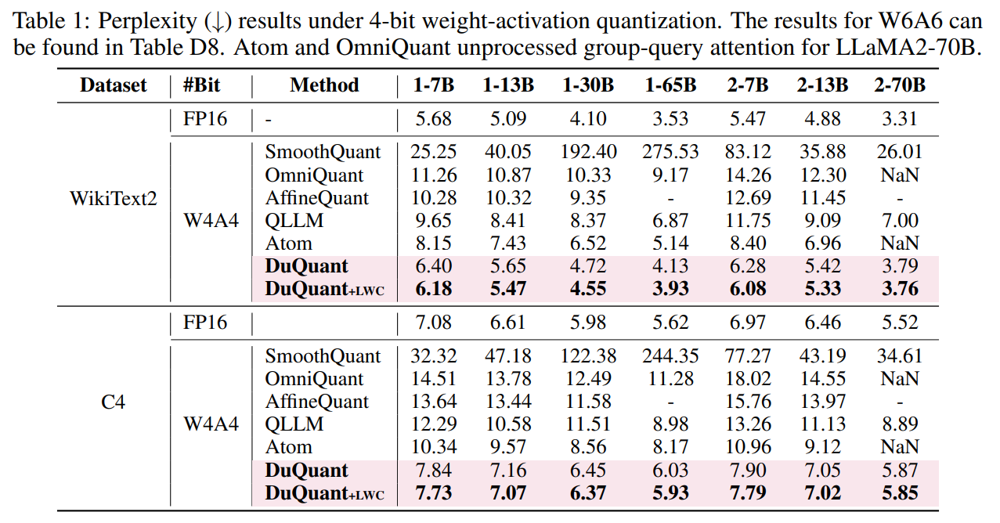

* Tab. 1 은 DuQuant quantized model 이 WikiText2 와 C4 dataset 모두에서 다른 baseline 대비 현저히 우수한 성능을 보임을 나타낸다. 
* 특히 LWC 기법은 model capacity 를 더욱 향상시키며, DuQuant$_\text{+LWC}$ 는 FP16 model 과 유사한 성능을 달성한다.

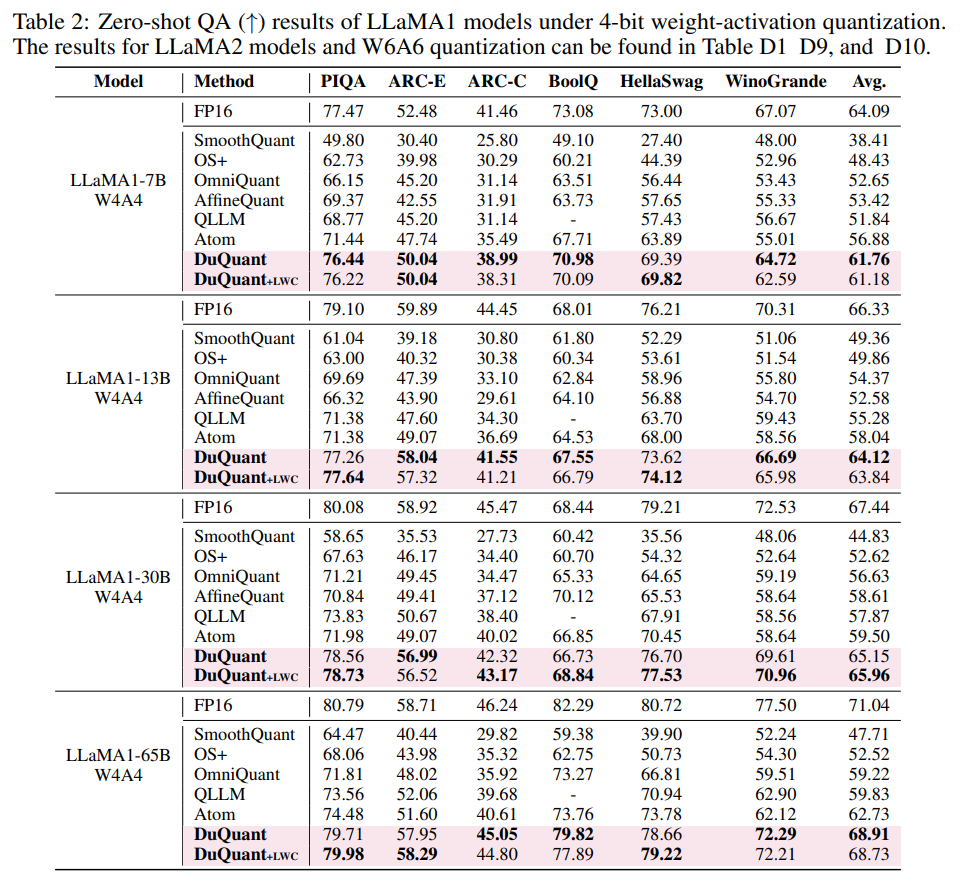

* Tab. 2 와 Tab. D1 은 Commonsense QA task 에서 W4A4 quantization 의 zero-shot accuracy 를 보여준다. 
* DuQuant 는 평균 accuracy 를 크게 향상시킨다.
  * QLLM 대비 +9%
  * Atom 대비 +5%

모든 model size 에서 이러한 향상이 관찰된다. 이는 rotation 및 permutation transformation 이 outlier feature 를 효과적으로 제거하여 새로운 SOTA 성능을 확립함을 보여준다.

#### Quantization of Instruction-tuned Models

DuQuant 의 일반화 성능을 평가하기 위해 Vicuna-v1.5 model 을 quantization 한다.

Tab. 3 은 MMLU benchmark 에서 모든 task category 에 걸쳐 DuQuant quantized model 이 baseline 을 능가함을 보여준다.

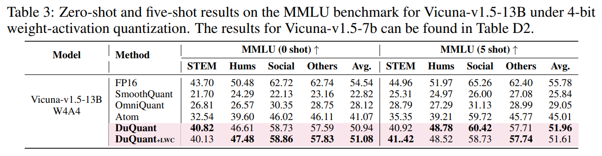

* 특히 Vicuna-13B 의 경우:
  * zero-shot 설정에서 Atom 대비 +10.01%
  * five-shot 설정에서 +6.95%
* 또한 MT-Bench 에서 Atom 및 OmniQuant 와 비교하였으며, GPT-4 를 사용하여 quantized model 의 답변을 평가하였다.

Fig. 3 에서 보이듯 DuQuant quantized model 은 win rate 측면에서 Atom 및 OmniQuant 를 크게 능가한다.

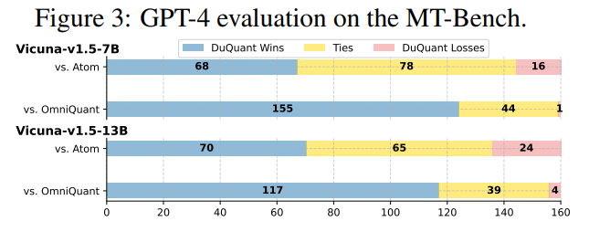

* 예를 들어 Vicuna-7B 의 경우:
  * Atom 에 16 회 패배
  * OmniQuant 에 1 회 패배
  * Atom 대비 68 승
  * OmniQuant 대비 155 승

#### Evaluation of Long-context Generation

Long-text generation 능력을 추가로 평가하기 위해 LongBench 에서 SOTA baseline 과 비교하였다.

Vicuna model 에 대해 maximum sequence length 를 3500 으로 설정하였다. 결과는 Tab. 4 에 제시되어 있다.

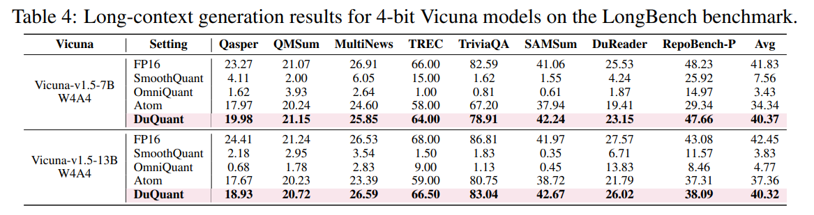

* DuQuant 는 FP16 model 과 유사한 성능을 달성하며, dual transformation 의 효과를 입증한다. 
* 다양한 subtask 에 대한 상세 결과는 Tab. D3, D4 에 제시되어 있다.

#### Quantization of LLaMA3 Models

LLaMA3 는 다양한 task 에서 우수한 성능을 보이지만, low-bit quantization 에서 큰 성능 저하를 겪는 것으로 알려져 있다.

이를 해결하기 위해 저자는 LLaMA3-8B 에 DuQuant 를 적용하였다.

Tab. 5 는 perplexity 및 zero-shot accuracy 결과를 보여준다.

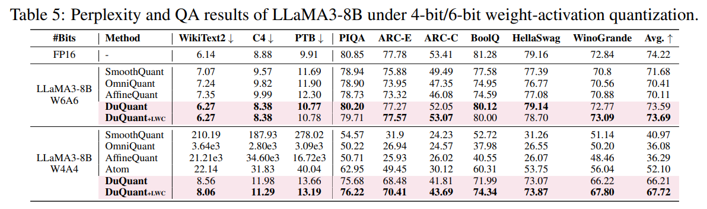

* W6A6 설정에서 DuQuant 는 FP16 model 과 유사한 성능을 달성한다.
* W4A4 설정에서도 다른 방법이 성능 저하를 보이는 반면, DuQuant 는 경쟁력 있는 성능을 유지한다.

저자는 이러한 성공을 dual transformation 을 통한 고급 outlier 처리 능력에 기인한다고 분석한다. 이는 특정 model 에 국한되지 않는 일반적인 강건성을 보여준다.

## 4.2 Ablation Study

#### Module-wise Impact

저자는 DuQuant 내 네 가지 연산을 ablation 하였다.

1. SmoothQuant 와 유사하게 smoothing 기술만 적용
2. smoothing 이후 rotation 1 회 적용
3. smoothing 없이 rotation → permutation → rotation 순서 적용
4. 전체 DuQuant 방법 적용

Tab. 6 에 따르면, smoothing 연산은 activation outlier 를 weight 로 이동시키는 기본적인 역할을 수행한다. 

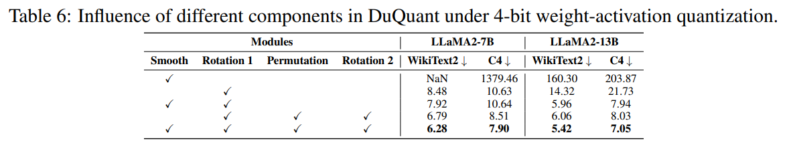

* 첫 번째 rotation 은 model 성능을 크게 향상시키며, 경쟁력 있는 PPL 결과를 달성한다. 
* 마지막으로 permutation 과 두 번째 rotation 을 결합하면 quantized model 성능이 추가적으로 향상된다.

#### Influence of Normal/Massive Outliers

본 절에서는 massive outlier 와 normal outlier 가 quantization 에 미치는 영향을 종합적으로 분석한다.

저자는 massive outlier 가 주로 FFN module 의 down-projection 에서 발생함을 관찰하였다. 그 영향을 분리하기 위해 rotation 및 permutation transformation 을 제거하고, down-projection 입력에 smoothing 기술만 적용하였다.

그 결과 LLaMA2-7B 와 LLaMA-13B 의 perplexity 가 크게 악화되었으며, 이는 Tab. 7 에 제시되어 있다.

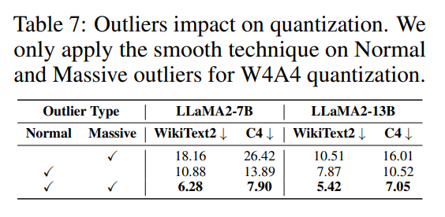

반면 normal outlier 에 대해 rotation 및 permutation 을 제거한 경우, 성능 저하는 관찰되었으나 massive outlier 제거 시보다 그 정도가 덜 심각하였다.

이 결과는 다음을 시사한다.

* Massive outlier 는 quantization 에 더 큰 영향을 미치며, 이는 Sec. 2 의 주장과 일치한다.
* Smoothing 기술만으로는 특히 massive outlier 의 영향을 완전히 완화하기 어렵다.
* 제안된 rotation 및 permutation 방법은 두 유형의 outlier 모두에 대해 매우 효과적이며, 우수한 성능으로 이어진다.

#### Comparison with QuaRot

최근 QuaRot 는 Hadamard rotation 을 도입하여 outlier feature 를 제거하였다. 이에 따라 저자는 DuQuant 와 QuaRot 의 주요 차이를 분석하였다.

공정한 비교를 위해 동일한 quantization 설정으로 QuaRot 를 재구현하였다. 결과는 다음을 보여준다.

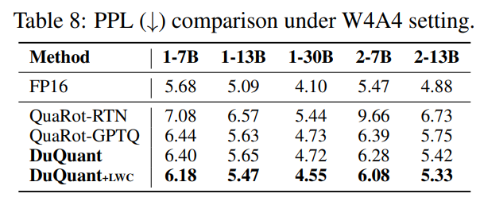

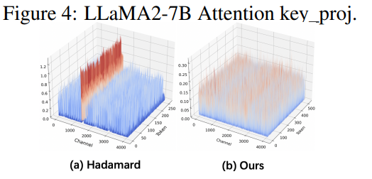

* DuQuant 에서 구성한 rotation matrix 는 무작위 초기화된 Hadamard matrix 를 사용하는 QuaRot 보다 우수하다. 
  * Fig. 10 에서 보이듯 DuQuant 는 activation 을 보다 효과적으로 smoothing 한다. 
  * 이는 prior knowledge 를 활용하여 outlier 를 정확히 타겟팅하기 때문이다.
* Tab. 8 의 perplexity 결과에 따르면, QuaRot 는 weight quantization 에 GPTQ 를 사용하지만, DuQuant 는 정교한 outlier 관리 덕분에 RTN quantization 만으로도 경쟁력 있는 성능을 달성한다. 
  * 이는 zigzag permutation 이 model capacity 향상에 기여함을 입증한다.

보다 상세한 비교는 Appendix F 에 제시되어 있다.

#### Permutation Frequency

저자는 DuQuant 에서 rotation 및 permutation 횟수에 대한 ablation 을 수행하였다.

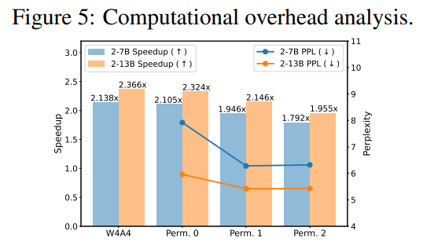

Fig. 5 에서 보이듯,

* “Perm 1” (rotation 2 회 + permutation 1 회) 은
  “Perm 0” (permutation 없음) 대비 더 우수한 성능을 달성한다.

추가적인 computation cost 는 다음과 같다.

* LLaMA2-7B 에서 +8.9%
* LLaMA2-13B 에서 +9.3%

W4A4 설정 대비 이러한 증가가 발생한다.

* 약 2 배 의 speedup 과 인상적인 성능 향상을 고려할 때, 이러한 추가 비용은 허용 가능하다고 판단된다.
* 반면 “Perm 2” 와 같이 permutation 을 더 많이 적용하면 성능 향상이 없으며 inference efficiency 가 감소한다.
* 따라서 “Perm 1” 설정이 perplexity 와 inference speed 간 최적의 균형을 제공하며, DuQuant 의 최적 구성으로 간주된다.

#### Inference Speedup

DuQuant 가 제공하는 inference speedup 을 평가하기 위해, 저자는 기존 연구의 measurement 전략과 W4A4 kernel 을 채택하였다.

LLaMA2 model 의 layer-wise speedup 을 단일 NVIDIA 3090 GPU 상에서 평가하였으며, 결과는 Tab. 9 와 Tab. 10 에 제시되어 있다.

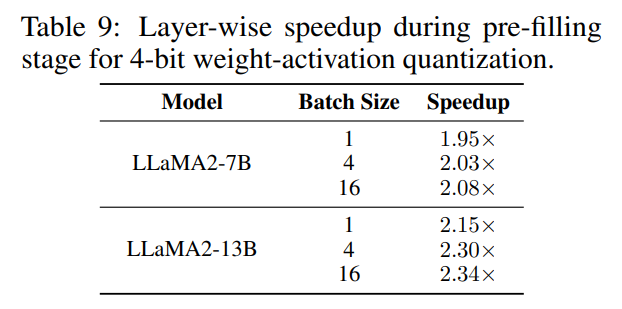

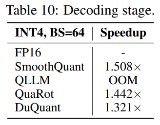

* Pre-filling sequence length = 2048
* Decoding step = 128

**Pre-filling Stage**

* Pre-filling 단계에서 DuQuant 는 다음과 같은 speedup 을 달성한다.
  * LLaMA2-7B: FP16 대비 2.08 배
  * LLaMA2-13B: FP16 대비 2.34 배
* batch size 에 따라 약간의 차이는 존재한다.

**Decoding Stage**

* Decoding 단계에서는 token generation 을 batch 처리하면 throughput 이 크게 증가하며 단점이 없다. 이에 따라 batch size 를 64 로 증가시켰다.
* Tab. 10 의 LLaMA2-7B 결과는 DuQuant 가 QuaRot 과 유사한 speedup 을 달성함을 보여준다.

보다 상세한 분석 및 end-to-end speedup 은 Appendix E.1 에 제시되어 있다.

#### Memory Consumption

단일 NVIDIA 3090 GPU 에서 LLaMA2-7B 에 대해 W4A4 kernel 을 사용하여 peak memory usage 를 측정하였다.

* Pre-filling: 2048 token 처리
* Decoding: 128 step 실행

결과는 Tab. 11 에 제시되어 있다.

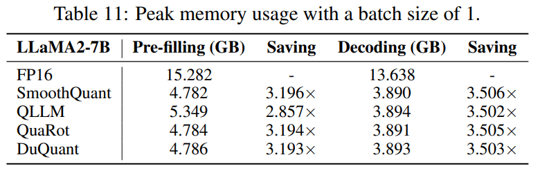

**Pre-filling Stage**

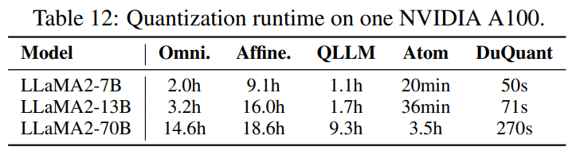

* DuQuant, SmoothQuant, QuaRot 는 최대 3.2 배 의 memory reduction 을 달성한다.
* QLLM 은 상대적으로 낮은 성능을 보인다.

**Decoding Stage**

* DuQuant 는 decoding 단계에서도 높은 memory efficiency 를 유지하며, 우수한 성능을 보인다.

#### Runtime

DuQuant 는 효율성 측면에서 다른 baseline 을 능가한다.

* Block-wise rotation 은 rotation matrix 와 activation matrix 간 빠른 multiplication 을 보장한다.
* Zigzag permutation 은 단순한 channel swap 으로 구성되어 Simulated Annealing 과 같은 복잡한 algorithm 보다 훨씬 빠르다.
* 고급 outlier 관리 덕분에 DuQuant 는 GPTQ 또는 gradient 기반 training 에 의존하지 않는다.

그 결과 Tab. F24 에서 보이듯 빠른 quantization 이 가능하다. 예를 들어, LLaMA2-13B 를 71 초 만에 quantization 하면서도 우수한 성능을 달성한다.

# 5 Conclusion

본 논문은 large language models (LLMs) 에 대한 혁신적인 quantization 전략인 DuQuant 를 제안하였다.

Rotation 과 permutation transformation 을 통합함으로써, DuQuant 는 massive outlier 와 normal outlier 의 영향을 효과적으로 완화한다. 이러한 전략적 재분배는 quantization 과정을 단순화할 뿐 아니라 model 성능의 실질적 향상으로 이어진다.

그 결과 DuQuant 는 4-bit weight-activation quantization 환경에서 새로운 state-of-the-art 성능을 확립한다. 이는 resource-constrained 환경에서 효율적인 LLM 배치를 크게 촉진한다.

