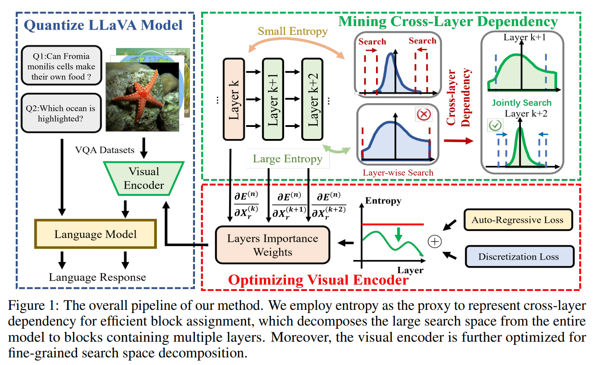
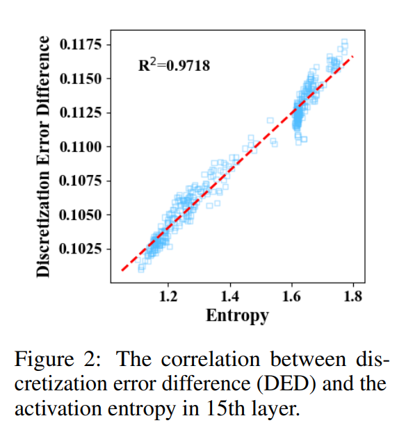
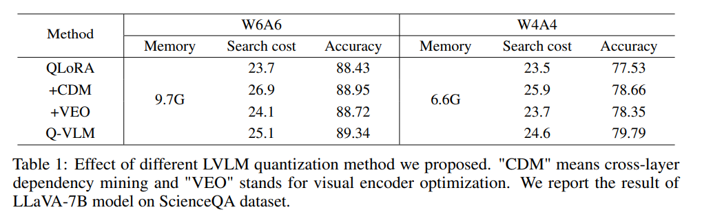
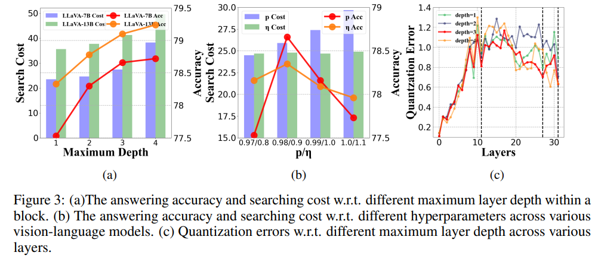
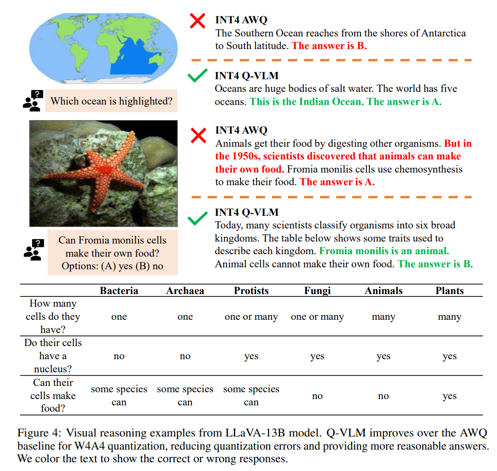
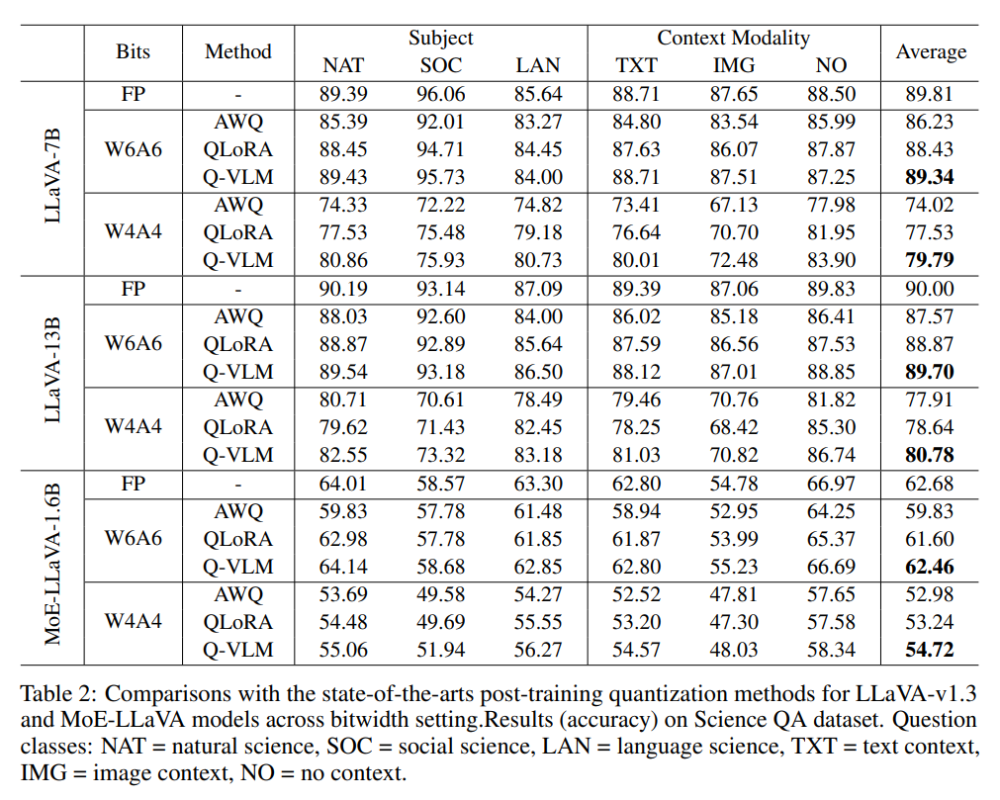
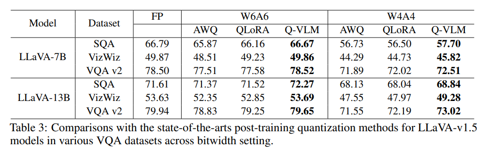
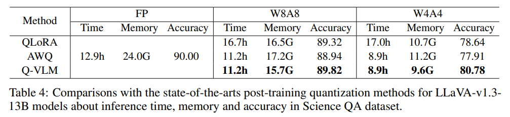

논문 및 이미지 출처 : <https://arxiv.org/pdf/2410.08119>

# Abstract

본 논문에서 저자는 효율적인 multi-modal inference 를 위해 large vision-language models (LVLMs) 의 post-training quantization framework 를 제안한다. 

기존 quantization 방법은 activation discretization errors 를 최소화하면서 layer-wise rounding functions 를 순차적으로 탐색한다. 그러나 이러한 방식은 cross-layer dependency 를 고려하지 않기 때문에 최적의 quantization strategy 를 획득하지 못한다.

이에 반해 저자는 전체 vision-language model 의 output discretization errors 에 중대한 영향을 미치는 cross-layer dependency 를 분석하고, 낮은 search cost 로 최적의 quantization strategy 탐색 과정에 이를 반영한다. 

* 구체적으로, **activation entropy** 와 **output discretization errors** 에 관한 **cross-layer dependency** 사이에 강한 상관관계가 존재함을 관찰한다. 
* 따라서 discretization errors 와 search cost 사이에서 만족스러운 trade-off 를 달성하기 위해 entropy 를 proxy 로 사용하여 block 을 최적으로 분할한다.
* 또한 저자는 visual encoder 를 최적화하여 cross-layer dependency 를 disentangle 함으로써 search space 를 더 세밀하게 decomposition 한다. 
* 이를 통해 quantization accuracy 를 저해하지 않으면서 search cost 를 추가로 감소시킨다. 

실험 결과, 제안 방법은 다양한 multi-modal reasoning task 에서 성능 저하 없이 13B LLaVA model 의 memory 를 2.78 배 압축하고 generate speed 를 1.44 배 향상시킨다.

# 1 Introduction

Large vision-language models (LVLMs) 은 visual question answering, embodied instruction following, robot navigation 과 같은 다양한 multi-modal reasoning task 에서 뛰어난 성능을 달성하였다. 

* 이는 방대한 network parameters 와 대규모 training data 에 기인한다. 
* 그러나 높은 accuracy 와 generalization ability 에도 불구하고, 막대한 computation cost 는 실제 다양한 deployment scenario 에서 resource-limited mobile device 로의 적용을 어렵게 만든다. 
* 또한 LVLMs 는 여러 번의 forward pass 를 통해 response 를 sequential 하게 생성하기 때문에, task 수행 시 computation burden 이 더욱 증가한다. 

따라서 실제 deployment 를 위해 LVLMs 의 model complexity 를 줄이는 것이 매우 중요하다.

Model complexity 를 줄이기 위해 pruning, quantization, low-rank decomposition, efficient architecture design 과 같은 model compression 기법이 제안되었다. 이 중 quantization 은 float number 를 quantized number 로 대체하고 multiply-accumulate (MAC) operation 을 integer arithmetic 으로 대체함으로써 큰 efficiency 향상을 제공한다.

LVLMs 는 training data 확보의 어려움과 막대한 training cost 로 인해 재학습이 사실상 불가능하므로, network parameter 를 고정한 상태에서 작은 calibration set 만을 이용하여 weights 와 activations 의 bitwidth 를 줄이는 post-training quantization 이 활용된다.

Model prediction errors 를 최소화하는 rounding function 을 탐색하는 과정은 매우 큰 search space 로 인해 search cost 가 극도로 높다. 기존 방법은 activation discretization errors 를 최소화하면서 layer-wise rounding functions 를 순차적으로 탐색한다. 그러나 discretization errors 의 cross-layer dependency 를 무시하면 최적의 rounding strategy 를 찾지 못하고 성능이 크게 저하된다.

본 논문에서 저자는 Q-VLM 이라는 정확한 post-training quantization framework 를 제안하여 large vision-language models 의 multi-modal reasoning 을 효율적으로 가속한다. 기존 방법과 달리, 저자는 layer 간 output discretization errors 의 cross-layer dependency 를 분석하고, 이를 활용하여 전체 model 의 quantization noise 를 최소화하는 최적의 rounding functions 를 효율적으로 탐색한다.

구체적으로 다음과 같은 관찰과 설계를 수행한다.

* activation entropy 와 이후 layer 와의 discretization error dependency 사이에 유의미한 상관관계가 존재함을 관찰한다.
* entropy 를 proxy 로 활용하여 전체 model 의 거대한 search space 를 여러 layer 를 포함하는 작은 block 단위로 decomposition 한다.
* 각 block 에 대해 block-wise discretization errors 를 최소화하는 rounding functions 를 탐색한다.

이를 통해 quantized model 은 원래 full-precision model 과 경쟁력 있는 성능을 유지하면서도 추가 search cost 는 미미한 수준에 머문다.

또한 visual encoder 를 최적화하여 cross-layer dependency 를 disentangle 함으로써 search space 를 더 세밀하게 decomposition 한다. 이를 통해 search cost 를 더욱 줄이면서도 정밀한 rounding functions 를 획득한다.

제안한 Q-VLM 은 정밀한 rounding functions 덕분에 4-bit quantization 환경에서도 multi-modal reasoning 에서 타당한 response 를 생성할 수 있다. 또한 13B LLaVA model 기준으로 memory 를 2.78 배 압축하고 generate speed 를 1.44 배 향상시킨다.

저자는 LLaVA model 과 MoE-LLaVA model 을 다양한 bitwidth 설정에서 평가하였다. 다양한 visual question answering dataset 에서의 실험 결과는 Q-VLM 이 기존 state-of-the-art post-training 방법을 search overhead 가 거의 증가하지 않는 수준에서 유의미하게 능가함을 보여준다.

# 2 Related Work

## 2.1 Large Vision-language Model

Large vision-language models (LVLMs) 은 large-scale image-text pair 와 pre-trained large language models (LLMs) 의 강력한 generalization capability 를 기반으로 다양한 downstream task 에 빠르게 적응하며 뛰어난 성능을 달성하였다.

LVLMs 가 추출하는 instruction-following ability 와 multi-modal representation 은 task 전반에 걸쳐 일반적으로 적용 가능하며, 다음과 같은 다양한 multi-modal reasoning task 에 활용된다.

* visual question answering
* embodied instruction following
* robot navigation

초기 연구는 visual-language representation learning 에 LLMs 의 풍부한 commonsense 를 도입하여, visual input 을 conditional information 으로 처리함으로써 LLMs 를 효과적으로 활용하였다.

특히 **BLIP** 은 data filtering technique 를 활용하여 visual question answering (VQA) 및 image captioning 과 같은 task 에서 성능을 향상시켰다. 이러한 model 들은 뛰어난 vision-language reasoning capability 를 보였으나, training 과정에서 명시적인 instruction 이 부재하였기 때문에 zero-shot 능력은 제한적이었다.

최근 연구인 **LLaVA** 와 **InstructBLIP** 은 LVLMs 를 인간의 선호와 더 잘 정렬시키는 방식으로 zero-shot capability 를 향상시키는 것을 목표로 한다. 이들은 visual instruction sample 로 LVLMs 를 finetune 하였으며, model 은 visual information 에 기반하여 인간의 instruction 을 완성하도록 학습된다.

대규모 model size 로 인한 성능 향상에도 불구하고, 높은 computational complexity 와 storage cost 는 LVLMs 가 실제 deployment 환경에서 resource-limited device 에 적용되는 것을 어렵게 만든다.

Lightweight LVLMs 인 **TinyGPT-V** 와 **TinyLLaVA** 는 small-scale model 을 활용하여 효율적인 LVLM architecture design 을 탐구한다. 또한 **MoE-LLaVA** 는 sparse MoE 기반 model 을 구성하여 image feature 와 text feature 를 동시에 처리하면서 sparse pathway 를 식별하고, 더 적은 activated parameter 로도 경쟁력 있는 성능을 달성한다.

그러나 낮은 compression ratio 로 인해 model inference cost 는 여전히 mobile device 나 robot 의 resource budget 을 초과한다.

## 2.2 Post-training Quantization

Network quantization 은 full-precision tensor 를 low-precision value 로 대체하고, multiply-accumulate operation 을 integer arithmetic 으로 변환함으로써 neural network 의 storage 및 computation cost 를 크게 줄인다.

기존 quantization-aware training (QAT) 방법은 rounding 을 위해 전체 training set 으로 network weight 를 finetune 해야 하며, 이는 대부분의 사용자에게 training data 와 resource 접근이 제한된 상황에서 실용성이 낮다.

최근에는 소규모 calibration set 을 활용하여 rounding function 의 optimal threshold 를 탐색함으로써 data 요구량과 optimization cost 를 크게 줄이는 post-training quantization (PTQ) 이 큰 관심을 받고 있다.

다양한 PTQ 접근법은 다음과 같다.

* Choukroun et al. 은 quantized tensor 와 full-precision tensor 간의 $l_2$ distance 를 최소화하여 task 성능 저하를 완화하였다.
* Zhao et al. 은 outlier channel 을 복제하고 값을 절반으로 줄여 clipping loss 를 감소시키면서 rounding error 증폭을 방지하였다.
* Liu et al. 은 vision transformer 에서 self-attention 의 상대적 ranking order 를 유지하여 PTQ 중 정보 손실을 완화하였으며, attention map 과 feature 의 nuclear norm 기반 mixed-precision quantization strategy 를 탐색하였다.

Zero-shot PTQ 는 실제 image data 없이 neural network 를 효율적으로 quantize 하는 방향으로 확장된다.

* Cai et al. 은 생성된 image 의 pixel value 를 최적화하여 full-precision network 의 batch normalization (BN) layer 의 batch statistic 과 정렬되도록 하였다.
* Li et al. 은 patch similarity metric 을 활용하여 서로 다른 patch 간 self-attention 을 다양화함으로써 transformer architecture 로 PTQ framework 를 확장하였다.

한편, PTQ 를 large language models (LLMs) 에 적용할 때는 large model 에서 activation distribution 이 sample 간 매우 크게 변동하기 때문에, learnable rounding function 을 적용하는 대신 각 input sample 마다 optimal rounding function 을 동적으로 탐색한다.

* LLM.int8(), SmoothQuant, ZeroQuant 는 activation outlier 를 equivalent transformation 으로 제거하여 정확한 quantization function learning 을 달성하였다. 그러나 극도로 큰 model 에서는 계산 비용이 지나치게 커 확장에 어려움이 있다.
* GPTQ, AWQ, QLoRA 는 weight quantization 에 low-precision quantization 을 적용하여 computation complexity 를 추가로 줄였다.

그러나 이러한 방법은 layer-wise searching strategy 를 사용하여 rounding function 을 순차적으로 탐색한다. 이는 cross-block dependency 를 고려하지 않기 때문에 최적의 rounding strategy 와 괴리가 발생한다.

# 3 Approach

본 절에서는 먼저 LVLMs 에 대한 post-training quantization 의 preliminaries 를 소개하고, 이후 LVLM quantization 을 위한 cross-layer dependency mining 을 상세히 설명한다. 마지막으로, quantization error 를 최소화하면서 search cost overhead 를 거의 증가시키지 않는 visual encoder optimization 을 제시한다.

## 3.1 Post-training Quantization for LVLMs

Network quantization 은 weights 와 activations 의 bitwidth 를 감소시켜 computation memory 를 절감하고 inference speed 를 가속한다. 기존 quantization-aware training (QAT) 은 원래 full-precision network 의 모든 parameter 를 최적화하여 최적의 quantization 을 달성한다. 그러나 이는 막대한 training cost 와 대규모 training dataset 접근의 어려움 때문에 실용적이지 않다.

Post-training quantization (PTQ) 은 network parameter 를 고정한 상태에서 소규모 calibration set $X$ 를 활용하여 rounding function 의 optimal threshold 를 탐색한다. 이 방식은 data 요구량과 optimization cost 를 크게 줄인다.

구체적으로, quantization function learning 의 최적 해는 전체 model 에 대해 quantized output 과 full-precision output 간의 distribution discrepancy 를 최소화함으로써 얻어진다. 최적화 목적 함수 $J$ 는 다음과 같이 정의된다.

$$
\begin{align*}
  \min_{\{ Q_k \}} J = \left\| W^{(n)}_q X^{(n)}_q - W^{(n)}_r X^{(n)}_r \right\|_2^2 \\
  s.t. \quad X^{(k+1)}_q = Q_k \big( W^{(k)}_q X^{(k)}_q \big)
\end{align*} \tag{1}
$$

여기서

* $W^{(k)}_q$ 와 $X^{(k)}_q$ 는 $k$ 번째 layer 의 quantized weights 와 activations 를 의미한다.
* $W^{(k)}_r$ 와 $X^{(k)}_r$ 는 해당 layer 의 full-precision weights 와 activations 를 의미한다.
* $Q_k$ 는 $k$ 번째 layer 의 rounding function 이다.
* $n$ 은 LVLM 의 전체 layer 수이다.

Layer 수가 증가함에 따라 search space 가 기하급수적으로 증가하기 때문에, optimal rounding function 을 직접 탐색하는 문제는 NP-hard 이다.

따라서 기존 PTQ 방법은 greedy 방식으로 각 layer 의 quantization error 를 최소화하면서 rounding function 을 순차적으로 탐색한다.

$$
\min_{Q_k} J = \left\| W^{(k)}_q X^{(k)}_q - W^{(k)}_r X^{(k)}_r \right\|_2^2 \tag{2}
$$

이때 layer index 는 하위 layer 에서 상위 layer 로 점진적으로 증가하며 rounding function 을 탐색한다.

그러나 이러한 greedy search 는 discretization error 의 cross-layer dependency 를 무시한다. 그 결과, 하위 layer 에서 error 가 작더라도 상위 layer 에서 discretization error 가 누적되어 최종 model output 에서 큰 오차가 발생할 수 있다.

## 3.2 Mining Cross-layer Dependency for LVLM Quantization

식 (1) 의 해를 직접 탐색하는 것은 과도한 search cost 를 초래하며, layer-wise quantization function 을 순차적으로 탐색하는 방식은 suboptimal solution 을 유발한다. 따라서 저자는 전체 model 을 여러 개의 layer 로 구성된 block 단위로 분할한다.

각 block 의 output quantization error 를 고려하여 optimal rounding function 을 탐색하면, search cost 와 quantization accuracy 사이에서 더 나은 trade-off 를 달성할 수 있다. 이는 다음과 같이 정식화된다.

$$
\begin{align*}
  \min_{{ Q_k } \in B_i} J = \left\| W^{(L_i)}_q X^{(L_i)}_q - W^{(L_i)}_r X^{(L_i)}_r \right\|_2^2 \\
  s.t. \quad X^{(k+1)}_q = Q_k \big( W^{(k)}_q X^{(k)}_q \big)
\end{align*}
$$

여기서

* $B_i$ 는 분할된 $i$ 번째 block 을 의미한다.
* $L_i$ 는 block $B_i$ 의 마지막 layer index 이다.

목표는 rounding function 탐색을 위한 optimal block partition 을 획득하는 것이다. 각 block 내부 layer 간 dependency 가 강하도록 구성하는 것이 바람직하다. 이렇게 하면 block output 의 discretization error 를 최소화하는 방식으로 block 내부 layer 의 rounding function 을 jointly 탐색할 수 있으며, 전체 model output error 역시 최소화된다.

---

*Cross-layer dependency* 를 명시적으로 평가하려면 주어진 input 에 대해 LVLM 의 multiple forward pass 가 필요하며, discretization error 간 상관관계를 data statistic 으로 계산해야 한다. 이는 매우 높은 비용을 초래한다.

이를 피하기 위해 저자는 cross-layer dependency 를 근사할 수 있는 효율적인 proxy 를 탐색한다. activation 의 Information Entropy 를 활용하여 homogeneous distribution 을 갖는 sensitive layer 를 판별한다.

Sensitive layer 의 경우, 이전 layer 에서 global optimal value 로부터의 deviation 이 발생하면 현재 layer 에서 더 큰 deviation 으로 이어진다. 따라서 이러한 layer 들을 joint search 하면 block output quantization error 를 줄일 수 있다.

---

한편, 저자는 Fig. 2 에서 가설을 경험적으로 검증한다. Fig. 2 는 SQA 데이터셋을 기반으로 LLaVA 아키텍처의 15 layer 에서 발생한 activations 를 사용하여 생성되었다. 가로축은 activation entropy 를 나타내며, 세로축은 layer-wise search 와 joint search 사이의 discretization error difference (DED) 를 나타낸다.

* 결과적으로, activation entropy 가 높은 sensitive layer 에서는 layer-wise search 와 joint search 간의 discretization error difference (DED) 가 뚜렷하게 나타난다. 
* optimal rounding point 로부터의 편차를 줄이기 위해, strong dependency 를 갖는 이전 layer 와 현재 layer 를 jointly 고려하여 quantization function 을 탐색해야 한다.

현재 layer $k$ 와 다음 layer $k+1$ 사이의 cross-layer dependency $D(k, k+1)$ 는 다음과 같이 정의된다.

$$
D(k, k+1) = -\sum_{ij} p\big(x^{(k)}_{q,ij}, x^{(k+1)}_{q,ij}\big) \log\ p\big(x^{(k+1)}_{q,ij} \mid x^{(k)}_{q,ij}\big) \tag{4}
$$

여기서

* $\chi_k$ 는 $k$ 번째 및 $k+1$ 번째 layer 의 quantized activation $x^{(k)}_q$, $x^{(k+1)}_q$ 의 가능한 값 집합이다.
* $p$ 는 해당 변수의 probability 이다.

$Q_k$ 는 서로 다른 quantization level 에 대해 탐색된다. rounding function 최적화를 위해 uniform quantization 을 사용하며, 이는 실제 hardware 와 높은 호환성을 가진다.

실제 구현에서는 각 element 를 가장 가까운 rounding point 로 deterministic 하게 quantize 한다. quantized tensor 의 entropy 를 계산하기 위해 deterministic quantization 과정을 다음과 같은 distribution 으로 근사한다.

$$
p\big(x^{(k)}_{q,ij}\big) = \frac{
\exp\big(- (x^{(k)}_{r,ij} - q_m)^2 / \Delta \big)
}{
\sum_{m=1}^{M}
\exp\big(- (x^{(k)}_{r,ij} - q_m)^2 / \Delta \big)
} \cdot \delta\big(x^{(k)}_{q,ij} - q_m\big) \tag{5}
$$

여기서

* $\Delta$ 는 두 인접한 rounding point 사이의 간격이다.
* $\delta$ 는 pulse distribution 을 의미한다.
* $q_m$ 은 $M$ 개 quantization level 중 $m$ 번째 rounding point 이다.

두 개의 연속된 layer 사이의 cross-layer dependency 는 sequential 하게 탐색된 rounding function 과 joint 하게 탐색된 rounding function 사이의 discretization error difference (DED) 로 표현될 수 있다. 더 큰 차이는 이전 layer 가 이후 layer 의 discretization error 에 상당한 영향을 미친다는 것을 의미한다.

Fig. 2 는 서로 다른 input sample 전반에 걸쳐 DED 와 activation entropy 사이의 양의 상관관계를 보여주며, 높은 correlation coefficient 를 나타낸다. 더 높은 conditional entropy 는 quantization error 가 누적되면서 activation distribution 이 균질화됨을 의미한다. 이는 이후 layer 에 대한 명확한 영향과 함께 더 큰 cross-layer dependency 를 나타낸다.

비연속 layer $k_r$ 와 $k_s$ 사이의 cross-layer dependency $D(k_r, k_s)$ 는 그 사이의 모든 중간 layer 의 entropy 합으로 정의된다.

$$
D(k_r, k_s) = - \sum_{k=k_r}^{k_s}
\sum_{ij} 
p\big(x^{(k)}_{q,ij}, x^{(k+1)}_{q,ij}\big)
\log
p\big(x^{(k+1)}_{q,ij} \mid x^{(k)}_{q,ij}\big) \tag{6}
$$

---

Block 내부에서 rounding function 을 탐색할 때 layer 수가 지나치게 많아지는 것을 방지하기 위해 각 block 의 최대 layer 수를 제한한다.

획득한 cross-layer dependency 를 기반으로 LVLM 을 다음과 같이 partition 한다.

$$
B_i = \{ \bigcup_{k=k_r}^{k_s} Q_k | D(k_r, k_s) \gt (k_s - k_r) h_0 \} \tag{7}
$$

두 layer 간 평균 cross-layer dependency 가 threshold $h_0$ 보다 크면, 그 사이의 모든 중간 layer 는 하나의 block 으로 묶어 joint rounding function search 를 수행한다. 이는 block output 의 discretization error 가 block 내부 모든 이전 layer 에 민감하기 때문이다.

최종적으로, 각 block 의 output discretization error 를 최소화하는 방식으로 optimal rounding function 을 탐색한다. uniform quantization 의 bound 로는 full-precision tensor distribution 의 optimal percentile $p$ 를 선택한다.

## 3.3 Optimizing Visual Encoders for LVLM Quantization

LVLMs 는 image input 으로부터 informative representation 을 추출하기 위해 visual encoder 를 활용하며, projection layer 를 통해 visual embedding 과 text embedding 을 정렬한다. visual encoder 는 LVLMs 에서 activation 의 distribution 을 크게 변화시키므로, visual encoder 내의 rounding function 은 activation entropy 를 최소화하도록 최적화될 수 있으며, 이를 통해 search efficiency 를 향상시킬 수 있다. 그 결과, 각 block 당 rounding function search 를 수행해야 하는 layer 수가 감소하고 search cost 는 낮은 수준으로 유지된다.

동시에 모든 layer 에 대해 activation entropy 를 최소화하고 cross-layer dependency 를 약화시키는 것은 optimization difficulty 를 초래한다. 이는 LLaMA 에 존재하는 많은 수의 layer 가 일반적으로 visual encoder 에 대해 상충되는 supervision 을 제공하기 때문이다. 서로 다른 layer 는 전체 model 의 output 에 대한 quantization error 에 다양한 영향을 미치므로, 저자는 layer 별로 entropy minimization objective 에 서로 다른 importance weight 를 할당한다. 이러한 weight 는 Jacobian 으로부터 획득된다.

$$
L_{\text{ent}} = 
\sum_{k=1}^{n}
\left\|
\frac{\partial E^{(n)}}{\partial X^{(k)}*r}
\right\|
\cdot
\sum_{ij}
p\big(x^{(k)}_{q,ij}, x^{(k+1)}_{q,ij}\big)
\log
p\big(x^{(k+1)}_{q,ij} \mid x^{(k)}_{q,ij}\big) \tag{8}
$$

여기서

* $E^{(n)}$ 는 model 의 마지막 layer 에서의 quantization error 를 의미한다.
* Jacobian $\left\| \frac{\partial E^{(n)}}{\partial X^{(k)}_r} \right\|$ 는 현재 layer 가 최종 output quantization error 에 미치는 영향을 나타낸다.

Jacobian magnitude 가 클수록 해당 layer 는 전체 discretization error 에 더 큰 영향을 미친다. 이러한 layer 에 더 큰 가중치를 부여하면 cross-layer dependency 를 효과적으로 감소시키면서 model convergence 를 빠르게 유도할 수 있다.

---

한편, 저자의 objective 는 visual encoder 의 output 과 LVLM 의 output 모두에 대한 discretization error 최소화를 포함하며, 이는 visual representation learning 및 multi-model reasoning 에 대한 quantization accuracy 를 향상시킨다:

$$
L_{\text{err}} = \| X_v^q - X_v^r \| + \eta \| X^{(n)}_q - X^{(n)}_r \| \tag{9}
$$

여기서

* $X_v^q$ 와 $X_v^r$ 는 각각 visual encoder 의 quantized output 과 full-precision output 이다.
* $\eta$ 는 visual encoder 와 LVLM 의 discretization error 간 중요도를 조절하는 hyperparameter 이다.

---

최종적으로 visual encoder optimization 을 위한 전체 objective 는 hyperparameter $\lambda_1$ 과 $\lambda_2$ 를 사용하여 다음과 같이 표현된다:

$$
L = L_{\text{reg}} + \lambda_1 L_{\text{ent}} + \lambda_2 L_{\text{err}} \tag{10}
$$

여기서

* $L_{\text{reg}}$ 는 원래 LVLM training 에서 사용된 auto-regressive loss 로, predicted token 과 target token 간 discrepancy 를 최소화한다.
* $\lambda_1$, $\lambda_2$ 는 hyperparameter 이다.

Visual encoder 를 최적화함으로써 layer 수가 더 적은 fine-grained block 단위로 rounding function 을 탐색할 수 있으며, cross-layer dependency 가 약화되었기 때문에 quantization accuracy 는 높은 수준으로 유지되면서 search cost 는 감소한다.

# 4 Experiments

본 절에서는 **LLaVA** 및 **MoE-LLaVA** benchmark 에 대해 **ScienceQA** multi-modal question answering dataset 상에서 광범위한 실험을 수행하여 제안 방법의 효과를 평가한다.

먼저 구현 세부 사항을 소개한다. 이후 cross-layer dependency mining 과 visual encoder optimization 의 효과를 검증하기 위한 ablation study 를 수행한다. 마지막으로, 제안한 Q-VLM 을 state-of-the-art post-training quantization 방법과 비교하여 우수성을 입증한다.

## 4.1 Implementation Details

저자는 multi-modal question answering task 를 위해 사전학습된 weight 를 사용하는 LVLM framework 인 LLaVA 와 MoE-LLaVA 를 post-training quantization 에 활용한다.

* quantized weight 및 activation 의 bitwidth 는 6 및 4 로 설정하여 서로 다른 quality-efficiency trade-off 를 평가한다.
* uniform quantization scheme 을 사용하며, 인접 rounding point 간 간격은 동일하다.
* baseline 방법 및 Q-VLM 모두에 대해 QLoRA 의 quantization function parameter 초기화를 따른다. 이때 full-precision activation 과 quantized activation 간 $l_p$ distance 를 최소화하여 clipping 을 위한 value range 를 최적화한다.
* discretization error 와 search cost 사이의 trade-off 를 고려하여 block 내 최대 layer depth 를 3 으로 설정한다.
* cross-layer dependency mining 을 위해 percentile hyperparameter $p$ 를 1.0 에서 0.98 까지 0.005 간격으로 조정한다.
* 식 (9) 에서 visual encoder optimization 을 위한 discretization loss 의 효과를 확인하기 위해 hyperparameter $\eta$ 를 조정한다.

* LVLM quantization 과정에서 parameter learning 을 위해 dataset 에서 무작위로 64 개의 vision-language pair 를 선택하고, batch size 8 로 calibration set 을 구성한다. 
* quantization function parameter 는 탐색 과정에서 10 epoch 동안 업데이트되며, 최종 획득한 discretization function 을 multi-modal question answering 에 직접 적용한다.

사용된 dataset 은 다음과 같다.

* ScienceQA ( 21k 개 vision-language 객관식 질문 포함 )
* **VizWiz**
* **VQA-v2**

## 4.2 Ablation Study

기존 layer-wise search 방법은 cross-layer dependency 를 무시하므로, 저자는 dependency mining 기반 joint searching strategy 를 도입한다.

Block-wise searching strategy 의 영향을 분석하기 위해 다음을 수행한다.

* 하나의 block 에 포함되는 최대 layer depth 를 변화시키며 discretization error 와 search cost 간 trade-off 를 분석한다.
* percentile hyperparameter $p$ 및 $\eta$ 를 조정하여 cross-layer dependency mining 및 visual encoder optimization 의 영향을 분석한다.
* ScienceQA dataset 에서 무작위로 64 개 vision-language pair 를 선택하여 quantized model 을 finetune 하고 제안 방법의 효과를 검증한다.

Ablation study 의 모든 실험은 ScienceQA dataset 과 LLaVA-v1.3-7B framework 에서 수행된다.

#### Performance w.r.t. Maximum Layer Depth within a Block

Cross-layer dependency 가 존재하는 여러 layer 를 하나의 block 으로 통합하면 전체 model 의 clipping 및 rounding error 에 큰 영향을 줄 수 있다. 그러나 search cost 는 기하급수적으로 증가한다.

Fig. 5a 는 서로 다른 maximum joint layer 수에 대해 제안 방법의 answering accuracy 를 보여준다. layer depth 가 3 을 초과하면 성능 향상은 미미하지만 complexity overhead 는 크게 증가한다.

따라서 이후 실험에서는 LVLM 을 효율적으로 quantize 하면서도 충분한 accuracy 향상을 확보하기 위해 block 당 최대 layer depth 를 3 으로 설정한다.

#### Performance w.r.t. Proposed Methods in Question Answering

LVLM quantization 에서 제안된 각 구성 요소의 효과를 검증하기 위해 다양한 bitwidth 설정에서 ablation study 를 수행한다.

Tab. 4 는 LLaVA-v1.3-7B model 에 대해 서로 다른 bitwidth 에서의 inference memory usage, calibration search cost, answering accuracy 를 보여준다.

* CDM (cross-layer dependency mining) module 은 최종 성능에 중요한 역할을 한다.

  * Cross-layer dependency 를 mining 하고 block-wise optimization 을 적용하면 layer 간 협력이 강화되고 전체 quantization error 가 감소한다.
* VEO (visual encoder optimization) 는 CDM 없이도 LVLM activation distribution 을 크게 변화시켜 discretization function learning 에 기여한다.
* Q-VLM 은 cross-layer dependency 를 disentangle 하여 fine-grained search space decomposition 을 가능하게 하며, 더 낮은 search cost 로 정밀한 rounding function 을 획득한다.

#### Performance w.r.t. Hyperparameters $p$ and $\eta$

Hyperparameter $p$ 는 cross-layer dependency mining 을 위한 search space 를 제어하고, $\eta$ 는 visual encoder 와 LVLM 의 discretization error 간 중요도를 조절한다.

* 큰 $p$ 값은 outlier 영향 감소를 통해 rounding error 를 줄인다.
* 그러나 지나치게 큰 값은 data distribution 의 중요한 정보를 과도하게 clipping 할 수 있다.

Fig. 5b 는 다양한 hyperparameter 설정에 대한 answering accuracy 를 보여준다. 두 parameter 모두 중간값에서 최고 성능을 달성하며, quantization error 와 search space 간 적절한 trade-off 를 형성한다.

#### Visualization Reasoning Examples

Fig. 4 는 ScienceQA dataset 에서 LLaVA-v1.3-13B model 의 qualitative visual reasoning 예시를 보여준다.

W4A4 quantization 설정에서 Q-VLM 은 AWQ baseline 대비 더 합리적이고 구체적인 응답을 생성한다.

* 첫 번째 예시에서 Q-VLM 은 강조된 ocean 에 대한 질문에 정확히 답하지만, AWQ 는 image 정보 이해에 한계를 보인다.
* 두 번째 예시에서 W4A4 환경의 AWQ 는 Fromia monilis 세포가 스스로 음식을 만드는지에 대한 추론에서 중요한 정보를 손실하였다. 반면 Q-VLM 은 정확히 답변하고, 6 개 broad organism kingdom 분류에 대한 table 까지 생성한다.

Q-VLM 은 response 에서 factual error 를 줄임으로써 LVLM 의 visual reasoning capability 를 향상시킨다.

## 4.3 Comparison with the State-of-the-art Methods

본 절에서는 제안한 방법을 state-of-the-art post-training quantization framework 와 비교한다. 저자가 아는 한, W4A4 설정에서 multi-modal LVLM 을 완성한 것은 본 연구가 최초이므로, 공정한 비교를 위해 기존 state-of-the-art PTQ 방법을 조합하여 baseline 을 구성하였다.

* weight quantization 은 AWQ 와 QLoRA 의 실험 설정을 따른다.
* language modal 에서는 activation 값 범위가 channel 간 크게 달라지므로 RPTQ 를 재현하여 per-channel activation quantization 을 적용한다.
* vision modal 에서는 token 간 activation 분산이 크므로 Outlier Suppression 을 따라 per-token quantization 을 적용한다.

Baseline 방법의 answering accuracy 는 공식 공개 code 와 pre-trained model 을 사용하여 측정하였다.

---

Tab. 2 는 다음 LVLM architecture 에 대해 서로 다른 PTQ 방법의 top-1 accuracy 를 비교한다.

* LLaVA-v1.3-7B
* LLaVA-v1.3-13B
* MoE-LLaVA-1.6B

Quantized layer 의 weight bitwidth 는 4 와 6 중 선택된다.

* AWQ 는 salient weight channel 을 보호하기 위해 optimal scale 을 탐색하여 weight quantization error 를 감소시킨다. 그러나 weight-only quantization scaling 은 activation 의 outlier 를 크게 증가시켜 quantization loss 를 초래한다.
* QLoRA + RPTQ 는 activation discretization error 를 최소화하는 layer-wise sequential search 를 수행한다. 그러나 discretization error 의 cross-layer dependency 를 무시하므로 optimal rounding strategy 를 획득하지 못하고 성능이 크게 저하된다.

반면, Q-VLM 은 다음과 같은 전략을 사용한다.

* layer 간 output distribution 의 cross-layer dependency 를 mining 한다.
* 전체 model 의 large search space 를 multiple layer 를 포함하는 block 단위로 decomposition 한다.
* block-wise discretization error 를 최소화하여 suboptimal quantization 을 방지한다.
* visual encoder 를 추가로 최적화하여 cross-layer dependency 를 disentangle 하고 fine-grained search space decomposition 을 수행한다.

그 결과, LLaVA-7B model 의 4-bit 설정에서 ScienceQA dataset answering accuracy 는 QLoRA 대비 2.26 향상된다 ( 79.79 vs. 77.53 ).

Stored rounding parameter 를 사용하므로 baseline 과 Q-VLM 의 computational cost 는 동일하다.

4-bit LVLM 에서 제안 방법의 장점이 더욱 두드러지는데, 이는 low-capacity network 에서 quantization error 와 cross-layer dependency 의 영향이 더 크기 때문이다.

---

일반화 성능을 검증하기 위해 다른 dataset 및 architecture 에 대해서도 평가를 수행하였다.

Tab. 3 은 VQA dataset 에서 다양한 PTQ 방법의 LVLM accuracy 를 보여준다. 

제안 방법은 다양한 dataset 에서 최고 accuracy 를 달성하며, 다양한 downstream task 에 robust 하게 적용 가능함을 보여준다.

Tab. 4 는 각 방법의 efficiency 와 accuracy 를 비교한다.

* AWQ 와 Q-VLM 모두 original full-precision LVLM 대비 search time 과 inference memory 를 감소시킨다.
* Q-VLM 은 CLIP 까지 추가로 quantization 하므로 memory 사용량을 더욱 줄인다.

Mobile device 에 quantized LVLM 을 배포할 경우, memory footprint 가 제한적이므로 Q-VLM 이 더욱 실용적이다.

# 5 Conclusion

본 논문에서는 efficient multi-modal reasoning 을 위한 large vision-language models 의 새로운 post-training quantization framework 를 제안하였다.

기존 방법이 layer 간 협력을 고려하지 않고 layer-wise rounding function 을 순차적으로 탐색하는 것과 달리, 저자는 cross-layer dependency 를 mining 하고 전체 model 의 large search space 를 multiple layer 로 구성된 block 단위로 decomposition 한다.

Entropy proxy 를 활용하여 block-wise discretization error 를 최소화하는 효율적이고 최적의 block partition 을 수행한다. 그 결과, quantized model 은 full-precision counterpart 와 경쟁력 있는 성능을 유지하면서 search cost 는 낮은 수준을 유지한다.

또한 visual encoder 를 최적화하여 cross-layer dependency 를 disentangle 하고 fine-grained search space decomposition 을 수행함으로써 search cost 를 추가로 줄이면서도 정밀한 rounding function 을 획득한다.

광범위한 실험 결과, 제안 방법은 W4A4 설정을 포함하여 다양한 architecture 의 LVLM 에서 성능 저하 없이 높은 압축률을 달성하며, state-of-the-art PTQ 방법 대비 더 높은 answer reasoning 능력을 보인다.

## Limitations

본 연구의 한계는 극저 bitwidth 설정에서 framework 적용 시 성능 저하가 매우 크게 발생한다는 점이다. 이는 foundation model 의 post-training quantization 에서 일반적으로 나타나는 문제이다.

Foundation model 은 mobile device 의 resource limit 를 크게 초과하므로, 향후 연구에서는 cellphone 및 wearable device 와 같은 embedded equipment 에 LVLM 을 배포하기 위한 효율적인 post-training quantization 방법을 설계할 예정이다.

