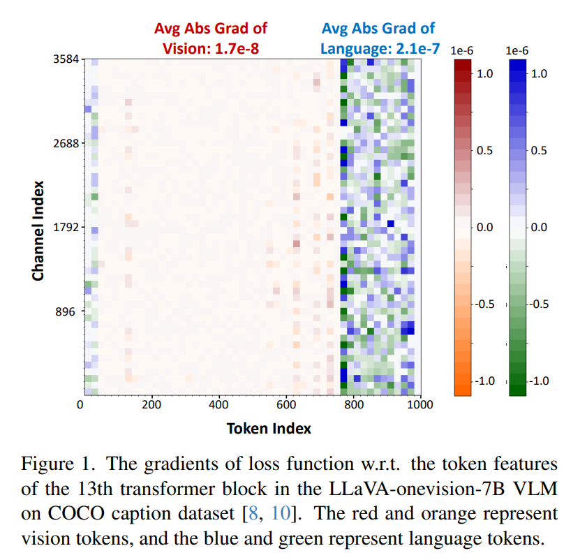
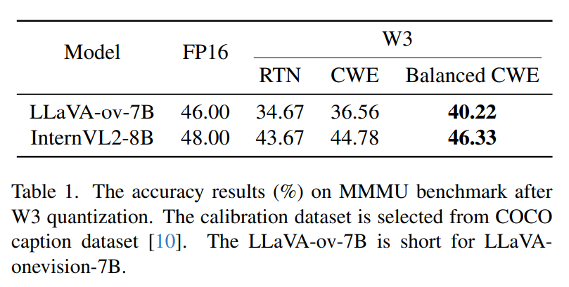
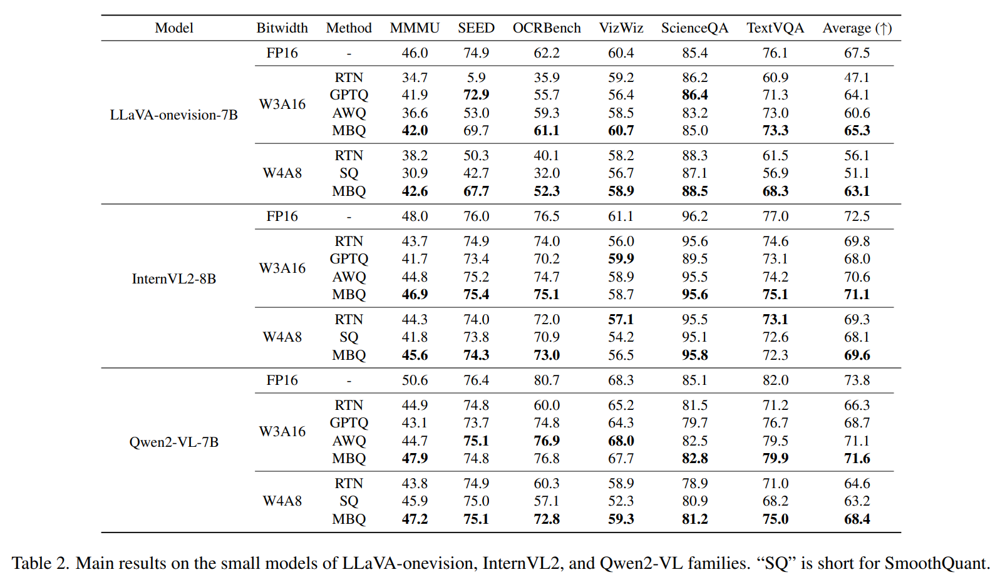
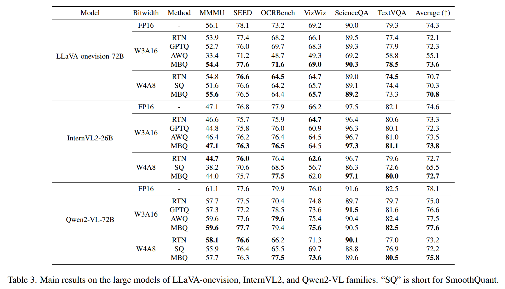
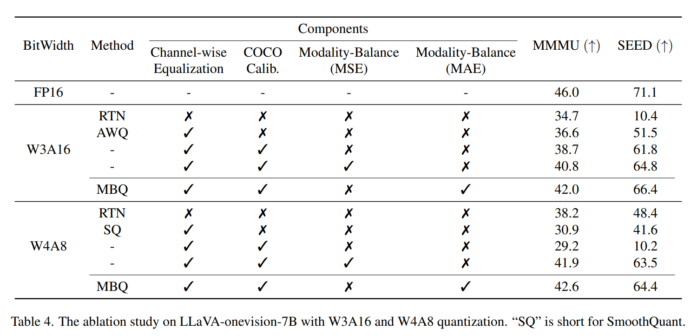
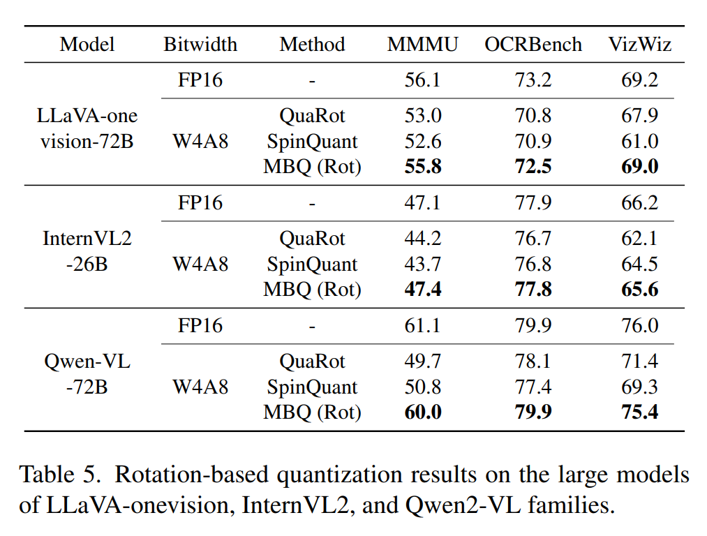
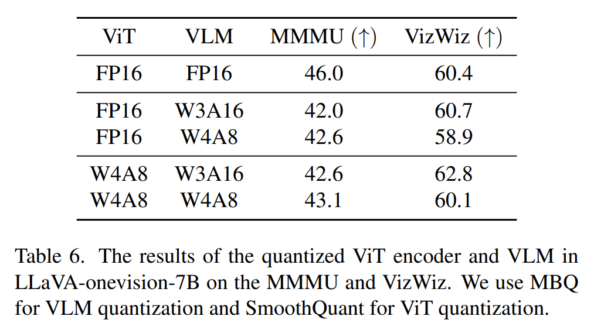
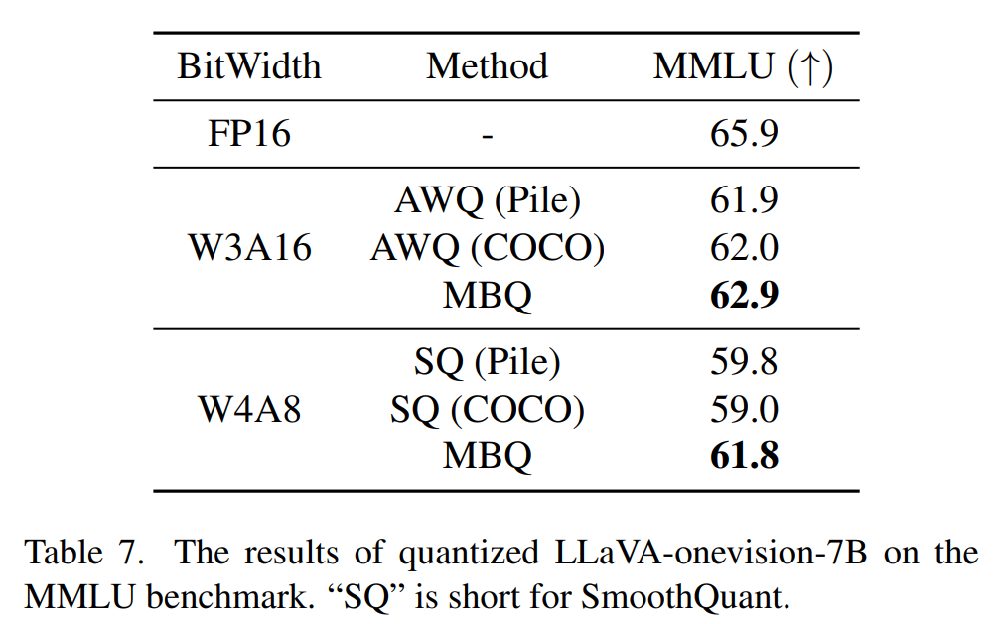
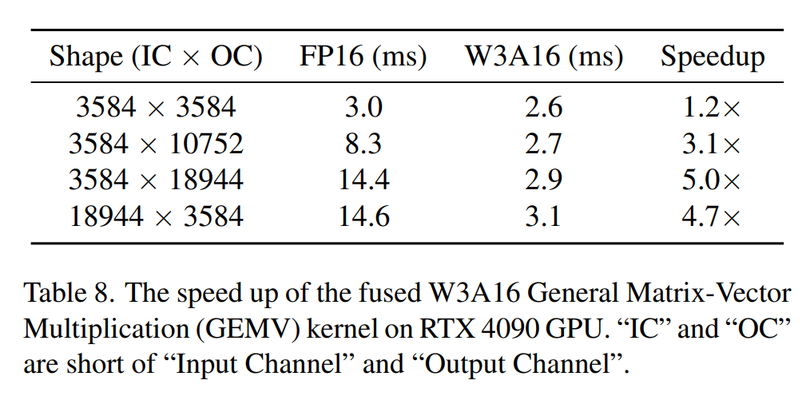
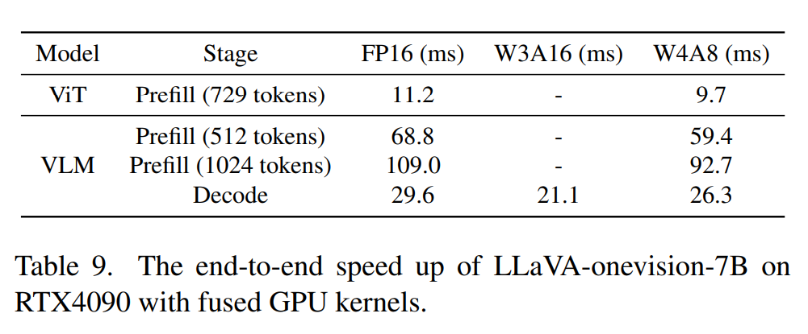

논문 및 이미지 출처 : <https://arxiv.org/pdf/2412.19509>

# Abstract

Vision-Language Models (VLMs) 는 다양한 real-world applications 을 가능하게 한다. VLMs 의 large parameter size 는 큰 memory 및 computation overhead 를 초래하며, 이는 deployment 에 상당한 도전을 제기한다. Post-Training Quantization (PTQ) 은 memory 및 computation overhead 를 줄이기 위한 효과적인 기법이다. 기존 PTQ methods 는 주로 large language models (LLMs) 에 초점을 맞추며, 다른 modality 간의 차이를 고려하지 않는다.

본 논문에서 저자는 large VLMs 에서 language token 과 vision token 간의 sensitivity 에 유의미한 차이가 존재함을 발견한다. 따라서 기존 PTQ methods 와 같이 서로 다른 modality 의 token 을 동일하게 취급하는 것은 sensitivity 가 낮은 modality 를 과도하게 강조하게 되어, 상당한 accuracy loss 를 초래할 수 있다.

이 문제를 해결하기 위해, 저자는 large VLMs 를 위한 간단하면서도 효과적인 방법인 **Modality-Balanced Quantization (MBQ)** 을 제안한다. 구체적으로, MBQ 는 calibration process 동안 modality 간의 서로 다른 sensitivity 를 반영하여 더 나은 quantization parameters 를 찾기 위해 reconstruction loss 를 최소화한다.

광범위한 실험 결과, MBQ 는 7B 에서 70B 규모의 VLMs 에 대해 W3A16 및 W4A8 quantization 설정에서 SOTA baselines 대비 최대 4.4% 및 11.6% 까지 task accuracy 를 향상시킨다. 또한 저자는 dequantization 과 GEMV operators 를 fusion 한 W3A16 GPU kernel 을 구현하였으며, RTX 4090 상에서 LLaVA-onevision-7B 에 대해 1.4× speedup 을 달성한다.

# 1. Introduction

Large Vision-Language Models (VLMs) 는 image captioning, visual question answering (VQA) 등 다양한 real-world tasks 에서 상당한 진전을 이루었다. 그러나 큰 memory 및 computation overhead 로 인해, LLaVA, InternVL, QwenVL 과 같은 기존 large VLMs 는 GPUs 와 같은 일반적으로 사용되는 accelerators 에서 deployment 하기가 어렵다. 예를 들어, 72B parameters 를 갖는 가장 큰 LLaVA-onevision VLM 은 144GB 의 memory 를 요구하며, 이는 A100 GPU 의 80GB memory capacity 를 초과한다.

LLM inference efficiency 를 개선하기 위한 많은 방법들이 이미 제안되었다. 예를 들어,

* quantization
* sparse attention
* efficient decoding strategies 등이 있다.

그 중에서도 Post-Training Quantization (PTQ) methods 는 memory access 및 computation overhead 를 줄여 LLM inference 를 가속하는 데 효과적이다.

* memory access 및 storage overhead 를 줄이기 위해, AWQ, GPTQ, QuIP 등과 같은 weight-only quantization methods 가 개발되었다.
* computation overhead 를 줄이기 위해, SmoothQuant, SpinQuant, FlatQuant, Atom 등과 같은 weight-activation quantization methods 가 적용되었으며, 이를 통해 GPUs 의 빠른 low-precision tensor cores 를 사용할 수 있게 된다.

task accuracy 를 유지하기 위해, calibration process 동안 이러한 methods 는 각 block 의 feature reconstruction error 를 최소화함으로써 optimal scaling factors, channel-wise equalization factors, rotation matrices 등을 탐색한다.

PTQ methods 는 LLMs 에 대해 잘 연구되어 왔지만, multiple modalities 의 token 을 처리하고 cross-modality tasks 를 수행해야 하는 VLMs 에 대한 적합성은 충분히 탐구되지 않았다. 저자의 실험 결과, LLMs 용 SOTA PTQ methods 를 VLMs 에 직접 적용할 경우 상당한 accuracy degradation 이 발생한다.

저자는 그 주요 원인이 기존 methods 가 vision token 과 language token 을 동일하게 취급하여, 두 modality 간의 유의미한 sensitivity 차이를 간과하기 때문이라고 추측한다.

이를 검증하기 위해, COCO dataset 의 image-caption pair 를 입력으로 사용하여, LLaVA-onevision-7B 의 13 번째 layer output feature 에 대한 loss gradient 를 시각화한다. Fig. 1 에서 볼 수 있듯이, language token feature 의 평균 절대 gradient 값은 vision token feature 의 평균 절대 gradient 값보다 10× 이상 크다.

* 이 1 차 근사 분석은 feature 에 동일한 크기의 perturbation 이 가해질 경우, language token 이 vision token 보다 loss function 에 10× 이상 큰 영향을 미칠 수 있음을 시사한다. 
* 따라서 calibration 동안 vision token 과 language token 을 동일하게 취급하면, sensitivity 가 낮은 vision token 을 과도하게 강조하게 되어 눈에 띄는 accuracy loss 를 초래한다.

이러한 sensitivity 차이를 고려하여, 저자는 large VLMs 를 quantize 하기 위한 매우 간단하면서도 효과적인 방법인 **Modality-Balanced Quantization (MBQ)** 을 제안한다.

구체적으로,

* MBQ 는 loss function 에 대한 vision 및 language token feature 의 gradient 를 sensitivity indicator 로 사용한다.
* 이러한 sensitivity indicators 를 reconstruction loss 에 통합하여, weight-only (W3A16, W4A16) 및 weight-activation quantization (W4A8, W8A8) 설정 모두에서 optimal channel-wise equalization factors 를 탐색하는 objective 로 활용한다.

서로 다른 modality 의 효과를 균형 있게 조정함으로써, MBQ 는 quantized VLMs 의 accuracy 를 유의미하게 향상시킨다.

저자는 7B–70B VLMs 에 대해 challenging vision-language benchmarks 상에서 광범위한 실험을 수행한다. 그 결과, MBQ 는 W3A16 및 W4A8 quantization 설정에서 다른 SOTA methods 대비 최대 4% 및 11% 까지 task accuracy 를 향상시킨다.

또한 baseline methods 의 한계를 분석하고, 다음과 같은 다양한 요인에 대해 comprehensive ablation studies 를 수행한다.

* calibration datasets 의 선택
* modality-balancing loss 의 대안적 formulation
* visual encoder 의 quantization 여부

W3A16 quantization 의 경우, 저자는 3-bit dequantization 과 general matrix-vector multiplication (GEMV) 을 fusion 한 GPU kernel 을 설계한다. W4A16, W4A8, W8A8 quantization 에 대해서는 기존 open-source GPU kernels 를 채택하여 inference process 를 가속한다.

다양한 workloads 에 대한 실험 결과, RTX 4090 상에서 LLaVA-onevision-7B 에 대해 최대 1.4× end-to-end speedup 을 달성한다.

# 2. Preliminaries

## 2.1. Quantization Formats

본 논문에서는 VLMs 의 각 linear layer 에서 weight (W) 및 input activation (X) matrices 에 commonly used quantization format 인 uniform integer quantization 을 적용하는 데 초점을 둔다.

---

weight-only quantization 의 경우, 기존 methods 는 일반적으로 weight groups (i.e., group-wise quantization) 에 대해 asymmetric uniform quantization 을 적용한다. 이는 다음과 같이 정의된다.

$$
W_{asym} = \left[ \frac{W_{FP16} - Z}{S_{asym}} \right], \tag{1}
$$

$$
S_{asym} = \frac{\max(W_{FP16}) - Z}{2^N - 1}, \tag{2}
$$

여기서,

* $W_{FP16}$ 는 16-bit floating-point (FP16) value 를 의미한다.
* $W_{asym}$ 는 low-precision integer value 를 의미한다.
* $N$ 은 bit-width 이다.
* $S_{asym}$ 는 scaling factor 이다.
* $Z = \min(W_{FP16})$ 는 asymmetric quantization 의 zero-point 이다.

---

weight-activation quantization 의 경우, symmetric uniform quantization 이 linear layer 의 weight 및 input activation matrices 모두에 대해 일반적으로 사용된다.

$$
W_{sym} = \left[ \frac{W_{FP16}}{S_{sym}} \right], \tag{3}
$$

$$
S_{sym} = \frac{\mathrm{absmax}(W_{FP16})}{2^{N-1} - 1}, \tag{4}
$$

* 여기서 $S_{sym}$ 는 symmetric quantization 의 scaling factor 를 의미한다.

단순화를 위해, 본 논문에서는 quantization format 을 $W_xA_y$ 로 표기하며, 여기서 $x$ 와 $y$ 는 각각 Weight 와 Activation 의 bit-width 를 나타낸다. 예를 들어, W4A8 은 weight 를 4-bit 로, activation 을 8-bit 로 quantize 하는 것을 의미한다.

## 2.2. Channel-Wise Equalization

기존 PTQ methods 는 calibration process 동안 각 transformer block 의 reconstruction error 를 최소화함으로써 quantization 의 optimal hyperparameters 를 자동으로 탐색한다.

일련의 대표적인 methods 는 weight 및 activation matrices 의 outliers 를 완화하기 위해 channel-wise equalization (CWE) 을 수행한다.

구체적으로, 이들은 각 transformer block 에서 Mean Square Error (MSE) loss 를 최소화함으로써 CWE factors $E$ 를 탐색한다. weight-only quantization 을 예로 들면, CWE 의 objective 는 다음과 같다.

$$
E^{*} = \arg\min_{E} \left\| Q(W \ast E)\left(E^{-1} \ast X\right) - WX \right\|^2, \tag{5}
$$

* 여기서 $Q$ 는 quantization function 을 의미한다.

# 3. Method

## 3.1. Sensitivity Varies Across Modalities

Sec. 2.2 에서 소개한 바와 같이, visual-language datasets 를 calibration 에 사용할 경우, CWE 는 calibration process 동안 visual activation 과 language activation 을 동일하게 취급한다.

직관적으로, 저자는 SOTA LLM quantization methods 를 VLMs 에 적용할 때 발생하는 성능 저하가 서로 다른 modality 를 동일하게 취급하는 데에서 기인한다고 추측한다. 이는 다음 두 가지 이유 때문이다.

1. 데이터 관점에서, visual data 는 일반적으로 높은 redundancy 를 가지며 작은 perturbations 에 대해 더 높은 fault tolerance 를 가질 수 있다.
2. 모델 관점에서, Zhang et al. 은 현재 VLMs 의 생성 결과가 입력 image 보다 pre-trained LLMs 에 의해 더 크게 bias 된다는 사실을 발견하였다.

이 직관을 검증하기 위해, 저자는 COCO caption dataset 에서 input vision token 및 language token 에 대한 output token 의 sensitivity 를 평가한다. 구체적으로, image-caption pairs 를 VLMs 의 입력으로 사용하고, SFT (Supervised Fine-Tuning) loss function 에 대해 language token 과 vision token 의 gradient 를 계산한다.

이 gradient 는 language (caption) 및 vision (image) token feature 에 작은 perturbation 이 가해질 때 output language tokens (caption) 에 미치는 영향을 반영한다. attention mechanism 으로 인해, 비록 output language tokens 의 loss 만 고려하더라도, SFT loss 의 gradient 는 각 transformer block 에서 vision tokens 로 backpropagate 된다.

Fig. 1 에서 보이듯이, language tokens 의 평균 절대 gradient 는 vision tokens 의 평균 절대 gradient 보다 한 order of magnitude 더 크다. 이는 유사한 perturbation 이 가해질 경우, vision token 이 SFT loss 에 미치는 영향이 language token 의 약 0.1× 에 불과함을 의미한다.

따라서 language token 과 vision token 을 동일하게 취급하면, vision token 에 대한 VLM 의 낮은 sensitivity 를 활용하여 더 높은 성능을 달성할 기회를 놓치게 된다.

modality-specific sensitivity 를 calibration 동안 반영하는 것이 미치는 영향을 보이기 위해, 저자는 oracle experiment 를 수행한다. vision tokens 의 reconstruction loss 에 0.1 의 modality-balancing factor 를 적용하여 CWE calibration 을 수행한다. balanced CWE 라고 불리는 최적화 objective 는 다음과 같다.

$$
E^{*} = \arg\min_{E} \Big[ \| Q(W \ast E)(E^{-1} \ast X_l) - W X_l \|^2 \tag{6}
$$

$$
+ 0.1 \| Q(W \ast E)(E^{-1} \ast X_v) - W X_v \|^2 \Big], \tag{7}
$$

* 여기서 $X_l$ 과 $X_v$ 는 각각 language token 과 vision token 을 의미한다.

* Tab. 1 에 제시된 ablation study 결과에 따르면, heuristic 하게 선택된 modality-balancing factor 를 사용하더라도 balanced CWE 는 W3 quantization 에서 CWE 대비 1.55% ∼ 3.66% 성능을 향상시킨다. 
* 이러한 유의미한 향상은 서로 다른 modality 간 sensitivity 를 균형 있게 반영하는 것의 중요성을 보여준다.

## 3.2. Modality-Balanced Quantization (MBQ)

vision token 과 language token 간의 sensitivity 차이는 layer 및 VLM family 에 따라 달라질 수 있다. 따라서 자동적인 modality-balancing 접근을 탐색하면 quantized model 의 성능을 더욱 향상시킬 수 있다.

본 절에서는 SFT loss function 의 변화를 직접 최소화함으로써 각 layer 에 대해 optimal Modality-Balanced factors 를 할당하는 접근을 유도한다.

구체적으로, 각 linear layer 의 output activation $Y$ 에 작은 perturbation $\Delta$ 가 가해질 때 SFT loss $L$ 의 변화를 계산하기 위해 다음의 1 차 Taylor 근사를 사용한다.

$$
L(Y + \Delta) \simeq L(Y) + g^{T} \ast \Delta, \tag{8}
$$

* 여기서 $g^{T}$ 는 output activation $Y$ 의 gradient 를 의미한다.

quantization 으로 인해 발생하는 SFT loss 의 변화는 다음과 같이 표현된다.

$$
\begin{align*}
  \| L(\hat{Y}) \| &\simeq \| g^{T} \ast \Delta \| \tag{9} \\
  &= \| g_v^{T} \ast \Delta_v + g_l^{T} \ast \Delta_l \| \tag{10} \\
  &\le \| g_v^{T} \ast \Delta_v \| + \| g_l^{T} \ast \Delta_l \| \tag{11} \\
  &\le \bar{|g_v|} \ast \| \Delta_v \| + \bar{|g_l|} \ast \| \Delta_l \| \tag{12} \\
  &= \bar{|g_v|} \ast \| Y_v - \hat{Y}_v \| + \bar{|g_l|} \ast \| Y_l - \hat{Y}_l \|,
\end{align*}
$$

여기서,

* $Y_v$ 와 $\hat{Y}_v$ 는 각각 FP16 linear layer 및 quantized linear layer 의 output vision tokens 이다.
* $Y_l$ 와 $\hat{Y}_l$ 는 각각 FP16 linear layer 및 quantized linear layer 의 output language tokens 이다.
* $\bar{|g_v|}$ 와 $\bar{|g_l|}$ 는 각 linear layer 의 output vision 및 language tokens 에 대한 평균 절대 gradient 를 의미한다.

본 논문에서는 더 나은 성능을 위해 MBQ 를 channel-wise equalization 과 결합하여 optimal equalization factors 를 탐색한다.

**(1) Prefill stage 가속**

VLMs 의 prefill stage 를 가속하기 위해, 저자는 각 linear layer 의 weight 와 input activation 을 모두 quantize 하여 fast low-precision tensor cores 를 활용한다. objective 는 다음과 같다.

$$
\begin{align*}
  \min_{E} \Big[ \bar{|g_v|} &\ast \| W X_v - Q(W \ast E) Q(E^{-1} \ast X_v) \| \tag{14} \\
+ \bar{|g_l|} &\ast \| W X_l - Q(W \ast E) Q(E^{-1} \ast X_l) \| \Big], \tag{15}
\end{align*}
$$

* 여기서 $X_v$ 와 $X_l$ 는 각각 각 linear layer 의 input vision activation 및 language activation 을 의미한다.

**(2) Decode stage 가속**

VLMs 의 decode stage 를 가속하기 위해, memory overhead 를 줄이기 위해 weight 만 quantize 한다. balanced reconstruction error 를 최소화하는 objective 는 다음과 같다.

$$
\begin{align*}
  \min_{E} \Big[ \bar{|g_v|} &\ast \| W X_v - Q(W \ast E)(E^{-1} \ast X_v) \| \tag{16} \\
+ \bar{|g_l|} &\ast \| W X_l - Q(W \ast E)(E^{-1} \ast X_l) \| \Big], \tag{17}
\end{align*}
$$

Sec. 3.1 에서 heuristic 하게 선택된 MSE 기반 balanced CWE loss 를 직접 사용하는 것과 달리, 본 절에서 유도된 reconstruction error loss 는 Mean Absolute Error (MAE) 에 기반한다. Sec. 4.3 의 ablation study 는 MBQ 에서 MAE 기반 reconstruction loss 를 최소화하는 것이 MSE 기반 loss 를 사용하는 것보다 더 나은 결과를 산출함을 보여준다.

## 3.3. End-to-End Acceleration Implementation

Sec. 6.1 에서 보이듯이, efficient deployment 를 위해 large parameter 를 갖는 VLMs 뿐만 아니라, high-resolution images 를 vision tokens 로 변환할 때 상당한 computation overhead 를 가지는 ViT encoders 또한 quantize 해야 한다.

ViT encoders 는 일련의 image patches 를 입력으로 받아 vision tokens 집합을 출력한다. ViT encoders 의 각 linear layer 의 input activation 은 2D matrices 이며, 주요 computation operator 는 GEMM 이다.

이를 위해,

* ViT encoders 에는 weight-activation quantization 을 적용하고,
* auto-regressive decode stage 를 가속하기 위해 VLMs 에는 weight-only quantization 을 적용한다.

VLMs 에 대해 practical hardware acceleration 을 달성하기 위해, 저자는 dequantization process 와 GEMV operator 를 fusion 한 custom fused W3 quantization GPU kernel 을 설계한다.

* 구체적으로, 8 개의 3-bit weight 를 3 bytes 로 pack 한다.
* fused W3 kernel 은 FP16 weight 대신 W3 weights 를 먼저 load 하여 memory access overhead 를 줄인다.
* 이후 W3 weights 를 FP16 으로 dequantize 한다.
* 마지막으로 fused W3 kernel 은 FP16 tensor core 를 사용하여 computation 을 수행한다.

fused W3 kernel 과 기존 open-source GPU kernel libraries 를 사용함으로써, quantized ViT encoders 및 VLMs 의 inference speed 를 가속할 수 있다. Sec. 4.4 의 상세 실험은 제안된 W3 kernel 의 hardware performance 및 다양한 시나리오에서의 end-to-end speedup 을 보여준다.

# 4. Experiments

## 4.1. Experimental Setups

### 4.1.1. Calibration Datasets

calibration task 는 VLM 의 image detail 이해 능력과 language modeling 능력을 모두 활용해야 한다. “Image captioning” 은 이 두 측면을 모두 다루는 task 중 하나이다.

구체적으로, 저자는 ShareGPT4V 에서 제안된 improved COCO Caption dataset 을 선택하고, 128 개의 image-caption pairs 를 calibration dataset 으로 sampling 한다. Chen et al. 은 GPT4-V 를 사용하여 각 image 에 대해 high-quality caption 을 생성하였다.

각 VLM 에 대해, 해당 image-caption pair 에 대응되는 conversation template 을 적용하여 instructional format 을 생성한다.

### 4.1.2. Evaluation Datasets

quantized model 의 성능을 평가하기 위해, 저자는 LMMs-Eval 을 기반으로 다양한 vision-language benchmarks 에서 실험을 수행한다.

구체적으로 다음 dataset 들을 사용한다.

* OCRBench 및 TextVQA: text recognition 및 comprehension 평가
* VizWiz 및 SEED-Bench: visual perception 평가
* ScienceQA 및 MMMU: visual reasoning 평가

또한 quantized VLM 의 실제 conversational performance 를 보여주기 위해, LLaVA-bench-in-the-wild 및 LLaVA-bench-wilder dataset 에 대한 여러 사례를 Supplementary Sec. 8.2 에 제시한다.

### 4.1.3. Models

저자는 LLaVA-onevision, InternVL2, Qwen2-VL family 에 대해 다양한 quantization methods 를 benchmark 한다. 각 model family 에 대해, 서로 다른 model size 에서 MBQ 의 성능을 보이기 위해 smaller model 과 larger model 을 각각 선택한다.

* **LLaVA-onevision**
  * 7B 및 72B parameters model 사용
  * VLM component: Qwen2-7B / Qwen2-72B
  * ViT encoder: SigLIP-400M
* **InternVL2**
  * 8B 및 26B model 평가
  * VLM component: InternLM2-8B / InternLM2-20B
  * Vision encoder: InternViT-300M / InternViT-6B
* **Qwen2-VL**
  * 7B 및 72B model 사용
  * VLM component: Qwen2-7B / Qwen2-72B
  * Vision encoder: 675M ViT encoder

### 4.1.4. Baselines

**(1) Weight-only quantization**

MBQ 를 다음 방법들과 비교한다.

* vanilla round-to-nearest quantization (RTN)
* AWQ (channel-wise equalization 기반)

설정은 W3A16 이며, 각 방법에 대해 group-wise asymmetric quantization 을 적용하고 group size 는 128 로 유지한다.

**(2) Weight-activation quantization**

MBQ 를 다음 방법들과 비교한다.

* RTN
* SmoothQuant (channel-wise equalization 기반)

설정은 W4A8 이다. SmoothQuant 의 논의에 따라,

* activation 에는 per-token symmetric quantization
* weight 에는 per-channel (output) symmetric quantization 을 적용하여 low-precision tensor cores 를 활용한다.

W4 및 W8A8 에 대한 추가 결과는 Supplementary Sec. 8 에 제시한다.

## 4.2. Main Results

**(1) Weight-only Quantization**

Tab. 2 및 Tab. 3 에서 보이듯이, RTN quantization 결과는 smaller VLMs 가 weight-only quantization 에 더 민감함을 보여준다.

* 7B 및 8B VLMs 의 평균 accuracy loss 는 9.6%
* 26B 이상 VLMs 의 평균 accuracy loss 는 1.5%

이 경향은 LLMs 에서의 관찰과도 일치한다. 제안된 MBQ 는 서로 다른 family 전반에서 AWQ baseline 을 유의미하게 능가한다.

* LLaVA-onevision family:
  * 7B VLM 에서 AWQ 대비 평균 4.2% accuracy 향상
  * 72B VLM 에서 AWQ 대비 평균 18.5% accuracy 향상

특히 LLaVA-onevision-72B 에서 AWQ 는 RTN 대비 17% 성능 저하를 보인다. 반면, MBQ 는 평균 accuracy 를 유의미하게 향상시키며 RTN 을 능가한다.

* InternVL2 및 Qwen2-VL family 에서도 MBQ 는 RTN 및 AWQ 대비 약 1% 정도 성능을 향상시킨다.

**(2) Weight-Activation Quantization**

weight-only quantization 과 유사하게, MBQ 는 SmoothQuant 및 RTN baseline 을 유의미하게 능가하며, 최대 11.6% 의 향상을 보인다.

많은 경우에서 SmoothQuant 의 평균 성능은 RTN quantization 보다 낮으며, 특히 InternVL2-26B 의 W4A8 설정에서 두드러진다.

이 결과는 activation quantization 이 포함될 경우, modality-balancing 에 대한 저자의 통찰이 더욱 중요함을 보여준다. modality-balancing 의 핵심 아이디어는 activation 내 서로 다른 modality 간 sensitivity 차이를 다루는 것이기 때문이다.

## 4.3. Ablation Study

### 4.3.1. The Effect of Calibration Datasets

AWQ 및 SmoothQuant 는 LLM quantization 을 위해 설계되었기 때문에, calibration 과정에서 language data 만 포함하는 Pile validation dataset 을 사용한다.

vision-language dataset 을 calibration 에 직접 적용하는 것이 항상 quantized VLM 의 성능을 향상시키는 것은 아니다.

Tab. 4 에서 보이듯이,

* COCO caption dataset 을 calibration dataset 으로 사용할 경우,
  * AWQ W3A16 의 성능은 MMMU 및 SEED dataset 에서 각각 2.1% 및 10.3% 향상된다.
* 그러나, SmoothQuant W4A8 의 경우, MMMU 및 SEED dataset 에서 각각 1.7% 및 31.4% 성능이 감소한다.

저자는 그 이유를 다음과 같이 추측한다.

* weight-activation quantization 은 weight 및 activation quantization error 를 모두 고려해야 한다. 
* activation 에서 vision token 과 language token 간 sensitivity 차이를 무시하면 SmoothQuant 의 성능이 크게 저하되며, 심지어 RTN quantization 보다도 낮아질 수 있다.

## 4.3.2. The Effect of Modality-Balance

Modality-Balancing 은 weight-activation quantization 에서 핵심적인 역할을 하며, weight-only quantization 의 성능 또한 향상시킬 수 있다. Tab. 4 에서 보이듯이, Modality-Balancing (MAE) 의 도움을 통해 COCO calibration 을 적용한 SmoothQuant 는 MMMU 및 SEED 에서 각각 13.4% 및 54.2% 의 성능 향상을 달성한다.

weight-only quantization 의 경우에도, Modality-Balancing (MAE) 는 MMMU 및 SEED 에서 각각 3.3% 및 4.6% accuracy 향상을 이끈다. 이러한 유의미한 성능 향상은 calibration 과정에서 서로 다른 modality 의 sensitivity 차이를 고려하는 것이 중요함을 확인해준다.

저자는 Modality-Balancing (MAE) 가 weight-only 및 weight-activation quantization 모두에서 Modality-Balancing (MSE) 를 일관되게 능가함을 발견한다.

* W3A16 및 W4A8 설정 모두에서,
* MAE 기반 reconstruction loss 는 MMMU 및 SEED dataset 에서 1% 이상의 accuracy 향상을 달성한다.

따라서 저자는 MSE 기반 reconstruction loss 대신, activation 에 대한 SFT loss gradient 로부터 직접 유도된 MAE 기반 reconstruction loss 를 사용할 것을 권장한다.

추가로, MBQ 의 효과를 보여주기 위해 두 가지 reweight 전략을 연구한다.

1. calibration tokens 를 무작위로 두 개의 동일한 그룹으로 나누어 quantization error 를 재가중
   * W3A16 LLaVA-onevision-7B 에서 OCRBench accuracy 는 MBQ 대비 1.3% 낮다.
   * 이는 reweighting 을 적용하지 않은 경우와 유사하다.

2. 각 token 의 gradient 를 직접 사용하여 token-wise quantization error 를 재가중
   * W3A16 LLaVA-onevision-7B 에서 OCRBench accuracy 는 MBQ 대비 1.5% 낮다.
   * 많은 vision token 의 gradient 가 0 이기 때문에 해당 token 의 quantization error 를 반영할 수 없기 때문이다.

이 결과는 MBQ 의 설계가 단순한 token-level reweighting 보다 효과적임을 보여준다.

## 4.3.3. Combine MBQ with Rotation-based Quantization

Tab. 3 에서 보이듯이, large VLMs 에 대해서는 MBQ 가 RTN weight-activation quantization 대비 큰 성능 향상을 보이지 않으며, FP16 VLM 대비 여전히 상당한 성능 격차가 존재한다.

Sec. 3 에서 설명한 바와 같이, 제안된 Modality-Balancing 접근은 block-wise LLM quantization method 와 자연스럽게 결합될 수 있다.

이를 위해, 저자는 SOTA rotation-based quantization technique 와 Modality-Balancing 을 결합하여 MBQ (Rot) 을 제안한다.

* Tab. 5 에서 보이듯이, 세 가지 large VLM 에 대해 W4A8 설정에서 MBQ (Rot) 는 원래 FP16 VLM 대비 1.1% 미만의 accuracy loss 만을 보인다. 
* 또한 다른 SOTA methods 와 비교하여 최대 9.2% 의 성능 향상을 달성한다.

## 4.3.4. Quantize Both Visual Encoder and VLM

Sec. 3.3 에서 ViT encoder 와 VLM 의 서로 다른 efficiency bottleneck 을 분석하였다. real-world applications 에서는 더 높은 acceleration ratio 를 위해 두 component 모두를 quantize 해야 한다.

Tab. 6 에서 LLaVA-onevision-7B 에 대해,

* ViT encoder 는 SmoothQuant 로 quantize 하고
* VLM 은 MBQ 로 quantize 하여

MMMU 및 VizWiz benchmark 에서 accuracy 를 평가한다.

* 실험 결과, ViT encoder 에 W4A8 quantization 을 적용하더라도 유의미한 성능 저하는 발생하지 않으며, 일부 benchmark 에서는 오히려 성능이 향상된다. 
* 이는 Sec. 1 에서 논의한 vision token 의 redundancy 로 인해 ViT encoder 가 quantization 에 크게 민감하지 않기 때문일 수 있다.

따라서 algorithmic 성능 관점에서 ViT encoder 와 VLM 을 함께 quantize 하는 것은 충분히 가능하다.

## 4.3.5. The Performance on Language-only Benchmark

제안된 MBQ 의 핵심 아이디어는 quantization 과정에서 서로 다른 modality 간 sensitivity 를 고려하여 vision-language task 및 language-only task 모두에서 성능을 향상시키는 것이다.

이에 따라, 저자는 LLaVA-onevision-7B VLM 을 다양한 quantization method 로 quantize 하여 MMLU benchmark 에서 평가한다.

* Tab. 7 에서 보이듯이, W3A16 및 W4A8 설정에서 MBQ 는 AWQ 및 SmoothQuant 대비 각각 0.9% 및 2% 의 성능 향상을 달성한다.
* 이 결과는 modality 간 sensitivity 차이를 고려하는 것이 vision-language task 뿐 아니라 language-only task 에서의 성능 유지에도 도움이 됨을 보여준다.

## 4.4. Efficiency Evaluation

### 4.4.1. Single Kernel Performance

저자는 RTX 4090 GPU 에서 제안한 fused W3A16 GEMV kernel 의 속도를 평가한다. LLaVA-onevision-7B 의 서로 다른 weight matrix shape 을 갖는 linear layer 를 대상으로 실험을 수행한다.

Tab. 8 에서 다음 네 가지 weight matrix shape 에 대해 평가한다.

* 3584 × 3584 (out proj layers)
* 3584 × 10752 (qkv proj layers)
* 3584 × 18944 (up proj 및 gate proj layers)
* 18944 × 3584 (down proj layers)

각 shape 에 대해, 제안된 fused W3A16 GEMV kernel 과 original FP16 GEMV kernel 을 비교한다.

평가 결과,

* fused W3A16 GEMV kernel 은 FP16 baseline 대비 1.2× ~ 5.0× speedup 을 달성한다.
* matrix size 가 증가할수록 speedup 이 더욱 커진다.
* 이는 GEMV 가 memory-bound operation 이며, weight matrix 가 클수록 memory access 속도의 영향이 커지기 때문이다. 
* W3A16 quantization 을 적용하면 large matrix GEMV 에서 memory access latency 가 크게 줄어들어 더 큰 speedup 을 달성할 수 있다.

### 4.4.2. End-to-End Performance

제안된 W3A16 GPU kernel 과 Qserve 의 W4A8 GPU kernel 을 사용하여, RTX 4090 에서 LLaVA-onevision-7B 의 ViT encoder 및 VLM 의 latency 를 평가한다. ViT encoder 및 VLM 모두 FlashAttention-2 와 함께 실행한다. 결과는 Tab. 9 에 제시된다.

**(1) ViT encoder**

embedding layer 는 각 input image 를 729 (27 × 27) tokens 로 변환한다. Sec. 3.3 에서 논의한 바와 같이, ViT encoder 는 prefill stage 만 존재하며, 주요 operator 는 compute-bound 인 GEMM 이다.

이 경우 W4A8 kernel 을 적용하여 1.15× speedup 을 달성한다.

**(2) VLM**

Sec. 6.1 에서 논의한 바와 같이, VLM 은 두 개의 distinct stage 를 가지며, 각 stage 는 서로 다른 quantization scheme 을 필요로 한다.

* **Prefill stage 가속**
  * low-precision tensor cores 사용을 위해 weight-activation quantization 적용
  * W4A8 설정에서, input token length 가 512 및 1024 일 때 각각 1.16× 및 1.18× speedup 달성
  * token length 가 증가할수록 speedup 이 증가한다.

* **Decode stage 가속**
  * W3A16 quantization 적용
  * input token length 128, 256, 512, 1024 에서 평균 latency 측정
  * W4A8 및 W3A16 모두 decode stage 를 가속하지만,
  * W3A16 model 은 W4A8 대비 1.23× 더 빠르다.

이는 다음 두 가지 요인에 기인한다.

1. W3A16 model 은 W4A8 대비 large weight matrix 에 대해 memory access overhead 가 더 낮다.
2. W4A8 operator 는 activation 에 대한 추가적인 dynamic quantization 이 필요하여 추가 computation time 이 발생한다.

실제 acceleration 을 위해, 저자는

* ViT encoder 에는 weight-activation quantization 적용
* VLM 의 decode stage 에는 weight-only quantization 적용

을 선택한다.

그 이유는 Tab. 9 에서 보이듯이, FP16 VLM 의 prefill stage 에서 1,024 tokens 처리 시간은 decode stage 에서 단 4 tokens 생성 시간과 유사하기 때문이다. 실제 application 에서는 decode 해야 할 token 수가 많고, decode stage 에서 multiple forward passes 가 필요하여 전체 생성 과정에서 가장 시간이 많이 소요된다. 따라서 VLM 에서는 weight-only quantization 이 더 적합하다.

# 5. Conclusion

본 논문에서 저자는 vision token 과 language token 이 quantization 에 대해 서로 다른 sensitivity 를 가진다는 핵심적인 현상을 규명한다.

이 발견을 바탕으로, weight-only 및 weight-activation quantization 모두에서 quantized VLM 의 accuracy 를 향상시키기 위한 간단하면서도 효과적인 방법인 Modality-Balanced Quantization (MBQ) 을 제안한다.

구체적으로,

* vision token 및 language token 에 대한 SFT loss gradient 를 sensitivity indicator 로 사용하고
* calibration 과정에서 reconstruction loss 를 균형 있게 조정한다.

MBQ 는 다양한 VLM 에 대해 W4A8 및 W3A16 설정에서 기존 SOTA PTQ methods 대비 각각 4.4% 및 11.6% 의 성능 향상을 달성한다.

또한 제안된 W3A16 CUDA kernel 을 통해 FP16 baseline 대비 1.4× decode speedup 을 달성한다.