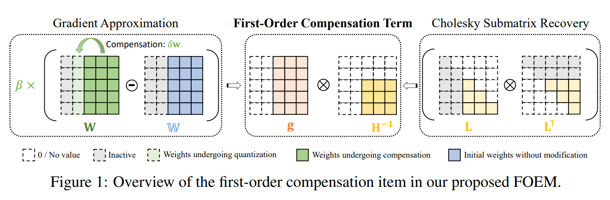
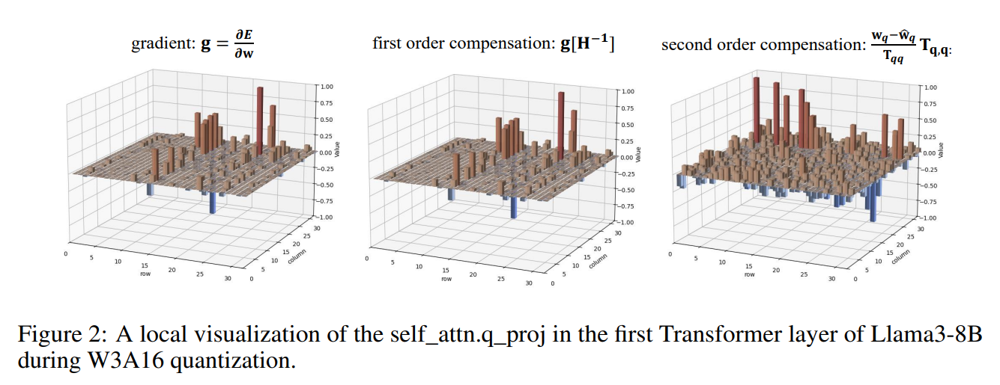
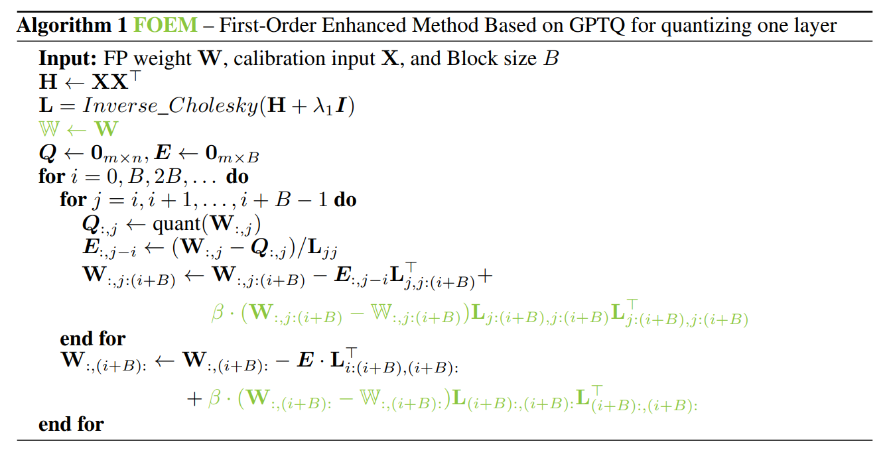
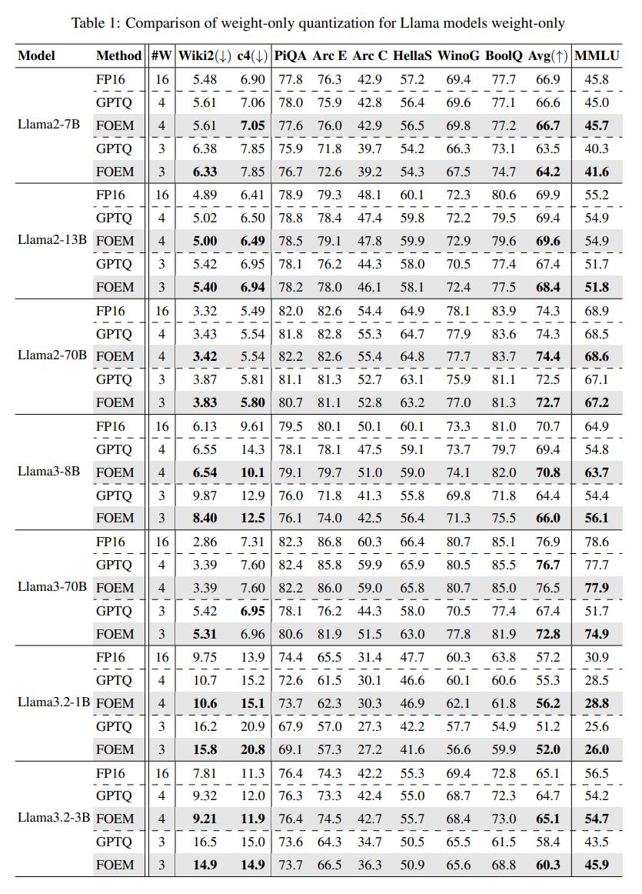
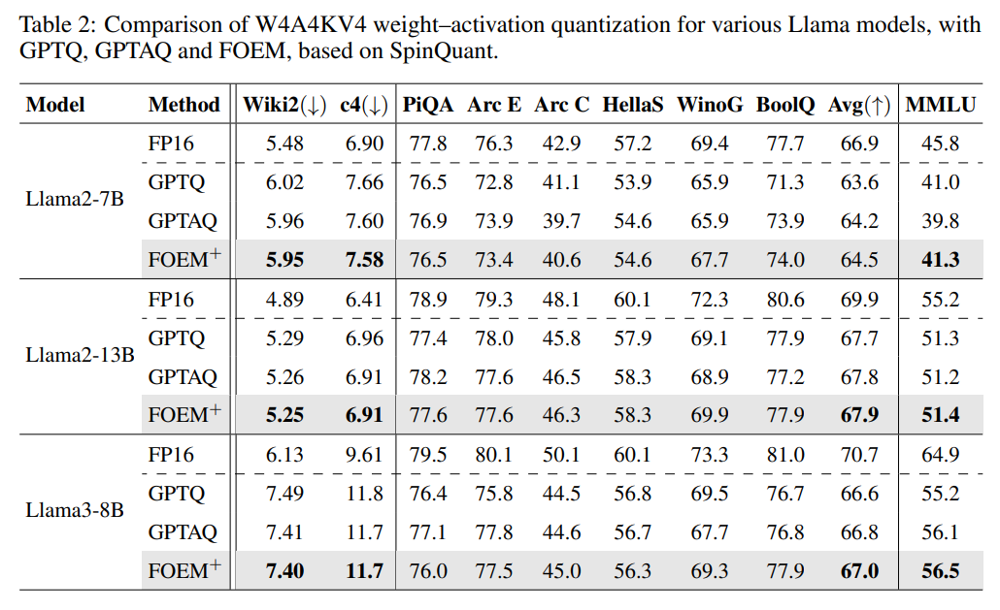
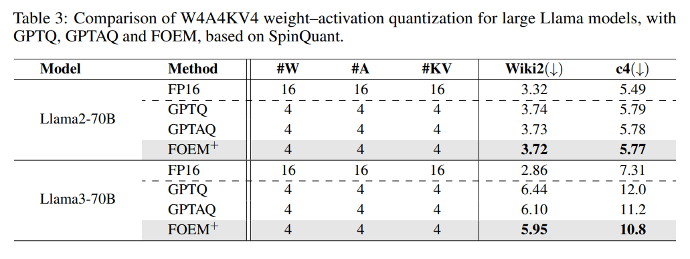
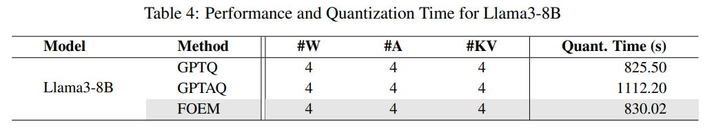

논문 및 이미지 출처 : <https://arxiv.org/pdf/2507.11017v1>

# Abstract

Post-training quantization (PTQ) 은 large language models (LLMs) 을 압축하는 효율적인 접근을 제공하며, memory access 및 computational cost 를 크게 감소시킨다. 기존의 보상 기반 weight calibration 방법은 quantization error 를 모델링하기 위해 종종 second-order Taylor expansion 에 의존하며, 잘 학습된 full-precision model 에서는 first-order 항이 무시할 수 있다고 가정한다. 

그러나 저자는 점진적인 보상 과정이 latent weights 와 해당 full-precision counterpart 사이에 누적된 first-order 편차를 유발한다는 사실을 밝히며, 이 가정이 근본적으로 잘못되었음을 보인다. 

이를 해결하기 위해, 저자는 first-order gradient 항을 명시적으로 포함하여 quantization error 보상을 개선하는 새로운 PTQ 방법인 **FOEM** 을 제안한다. 

* FOEM 은 backpropagation 기반 gradient 계산의 높은 cost 와 제한된 generalization 을 피하기 위해, latent weights 와 full-precision weights 간의 차이를 직접 계산하여 gradients 를 근사한다. 
  * 이 접근은 추가적인 computation overhead 를 최소화한다. 
* 또한 FOEM 은 사전 계산된 Cholesky factor 를 활용하여 Hessian submatrix 의 inverse 를 실시간으로 효율적으로 복원한다. 

다양한 model 과 benchmark 에 대한 광범위한 실험은 FOEM 이 고전적인 GPTQ 방법을 일관되게 능가함을 보인다. 

* 3-bit weight-only quantization 에서 FOEM 은 Llama3-8B 의 perplexity 를 89.6% 감소시키며, Llama3-70B 의 5-shot MMLU accuracy 를 51.7% 에서 74.9% 로 향상시켜 full-precision 성능인 78.6% 에 근접한다. 
* 더 나아가 FOEM 은 GPTAQ 및 SpinQuant 와 같은 고급 기법과 원활하게 통합될 수 있으며, 도전적인 W4A4KV4 설정에서 추가적인 성능 향상을 달성하고, 기존 state-of-the-art 방법을 넘어 full-precision baseline 과의 accuracy 격차를 더욱 축소한다.

# 1 Introduction

Llama 와 같은 large language models (LLMs) 은 language understanding, dialogue systems, code generation, protein prediction 및 design, embodied intelligence 를 포함한 다양한 영역에서 뛰어난 성능과 광범위한 적용 가능성을 보여주었다. model size 와 pretraining data 의 규모가 증가함에 따라 그 능력은 지속적으로 향상된다. 그러나 방대한 parameters 수와 높은 computation 요구는 상당한 memory 및 processing burden 을 초래한다. 이러한 요구는 특히 resource-constrained 환경에서 실제 배포에 실질적인 제약을 만든다.

Quantization 은 고전적인 model compression 기법이다. 이는 model architecture 를 변경하지 않고, 고비트 floating-point parameters 와 activations 를 저비트 fixed-point 형식으로 변환함으로써 memory usage 를 줄이고 computation 을 가속한다. 다양한 quantization 방법 중에서 post-training quantization (PTQ) 은 효율성으로 잘 알려져 있다. 

* 이는 gradient 기반 fine-tuning 을 요구하지 않으며, 높은 bit-width 에서 거의 lossless 성능을 유지할 수 있다. 
* 추가적인 training 을 포함하는 quantization-aware training (QAT) 과 비교할 때, PTQ 는 large language models 에 대해 일반적으로 더 실용적이다. 
* GPTQ 는 large model 에 대한 weight-only quantization 을 위한 대표적인 PTQ 방법이다. 
  * 이는 Taylor expansion 을 사용하여 quantization loss 를 추정하고, Hessian matrix 의 second-order 정보를 활용하여 column-wise quantization 을 수행하며, 이전 quantization 단계에 기반하여 이후 column 의 error 를 보상한다. 
* 이러한 접근은 round-to-nearest (RTN) 과 같은 단순한 방법보다 더 나은 성능을 보이는 경우가 많다. 

그러나 저자는 error reconstruction 및 compensation 에 의존하는 기존 LLM PTQ 방법에서 잠재적인 error 원인을 식별한다.  이러한 방법은 일반적으로 full-precision model 이 이미 충분히 최적화되었다고 가정한다. \

* 이 가정에 기반하여, loss modeling 과정에서 first-order 항을 생략한다. 
* 또한 second-order 및 그 이상의 항을 처리하기 위해 실용적인 근사를 사용한다. 이러한 단순화는 error 의 누적을 초래할 수 있다. 
* 그 결과, 이전 column 이 calibration 된 이후에 조정되는 후속 column 의 latent weights 는 quantization 중 상당한 gradient 를 가질 수 있다. 
* 이러한 gradient 를 무시하면 loss modeling 의 정확도가 낮아지며, 이는 최적이 아닌 보상과 전체 quantization 성능 저하로 이어질 수 있다.

본 연구에서 저자는 first-order gradient 를 포함하여 output error 를 보상하는 개선된 방법 **FOEM** 을 제안한다. 

* backpropagation 을 통해 gradient 를 계산하는 대신, 보상된 latent weights 와 원래 full-precision weights 사이의 차이를 사용하여 이를 근사한다. 
* 이는 비용이 큰 실시간 gradient 계산을 피하고, 소규모 batch calibration data 에 대한 의존을 제거함으로써 generalization 을 향상시킨다. 
* 추가적으로, 사전 분해된 Cholesky factor 를 사용하여 Hessian submatrix 의 inverse 를 즉시 복원함으로써 보상 과정의 효율성을 유지한다.

Llama 계열에 대한 광범위한 실험은 FOEM 이 모든 bit-width 에서 고전적인 GPTQ 방법을 능가함을 보여준다. 

* 예를 들어, 3-bit weight-only quantization 설정에서 perplexity loss 를 최대 89.6% 감소시킨다. 
* 또한 FOEM 은 GPTAQ 및 SpinQuant 와 같은 최신 PTQ 기법과 효과적으로 결합될 수 있으며, LLM quantization 의 accuracy 를 더욱 향상시킨다. 
* weights, activations, KV cache 가 모두 4 bit 로 quantization 되는 도전적인 W4A4KV4 설정에서, 저자의 방법은 Llama3-70B 의 WikiText2 perplexity 를 추가로 0.25 감소시킨다. 
* 이러한 결과는 large language models 의 보다 효율적이고 광범위한 배포를 가능하게 하는 데 있어 저자 방법의 잠재력을 강조한다.

# 2 Related Work

#### Post-training Quantization

Quantization 은 full-precision weights 를 int8 또는 int4 와 같은 low-bit fixed-point 형식으로 매핑함으로써 memory consumption 을 줄일 뿐만 아니라, activations 를 low-bit 표현으로 동적 quantization 하는 것도 가능하게 한다. 이는 low-bit matrix 의 곱셈을 포함한 효율적인 연산을 가능하게 한다. full-precision 에서 low-bit 형식으로 전환할 때 발생하는 accuracy 저하를 완화하기 위해, AdaRound, BRECQ, QDrop 과 같은 reconstruction 기반 방법이 개발되었다. 

이러한 기법은 layer 또는 block 내부에서 quantization error 를 측정하고 이를 최소화하며, ResNet 과 같은 architecture 에서 강력한 성능을 보였다. 그러나 calibration 과정에서 발생하는 상당한 computation cost 로 인해, 이러한 접근은 일반적으로 수십억 개의 parameters 를 포함하는 large language models (LLMs) 에 직접 적용하기에는 어려움이 있다.

#### PTQ Methods for LLMs

LLM 에서 흔히 관찰되는 outlier 특성을 해결하기 위해 다양한 PTQ 전략이 제안되었다. 일부 방법은 outlier 를 더 높은 bit precision 형식으로 유지함으로써 이를 보존한다. 예를 들어 LLM.int8() 및 AWQ 와 같은 방법이 이에 해당한다. 다른 방법은 smoothing 기반 scaling 기법 (예: SmoothQuant, OmniQuant), rotation 기반 변환 (예: QuaRot, SpinQuant), 또는 channel 재배열 방법 (예: RPTQ) 을 활용한다. 이러한 접근은 주로 weights 및 activations 의 분포 특성을 조정하는 데 초점을 맞추며, activations 의 quantization 에서 유망한 결과를 보여주었다.

이러한 변환 기반 방법과 달리, 일반적으로 quantization 이전에 scaling 또는 clipping 을 적용하는 대신, GPTQ 와 같은 기법은 quantization loss 를 명시적으로 모델링하고 calibration 과정에서 full-precision latent weights 를 직접 수정한다. 이러한 loss-aware 전략은 SpinQuant 과 같은 다른 고급 quantization 기법과 효과적으로 결합될 수 있으며, 최근 GPTAQ 와 같은 방법을 통해 상당한 성능 향상을 이끌어냈다.

# 3 Method

## 3.1 Preliminaries

LLM 에서 error 보상을 수행하는 PTQ 방법은 소규모 model 을 위해 처음 개발된 pruning 기법인 OBD 에서 기원한다. 원래 weights 가 $W$ 이고 input 이 $X$ 인 layer 를 고려하자. pruned weights 가 $W = W + \delta w$ 라고 가정하면, 그에 따른 output error $\delta E$ 는 Taylor series expansion 을 통해 다음과 같이 근사할 수 있다:

$$
\delta E =
\left(
\frac{\partial E}{\partial w}
\right)
\delta w^\top
+
\frac{1}{2}
\delta w H \delta w^\top
+
O(\|\delta w\|^3).
\tag{1}
$$

* OBD 는 고차 항을 무시하며, model 이 충분히 최적화되었다는 가정하에 first-order 항 또한 무시할 수 있다고 간주한다. 
* 또한 parameters 간의 독립성을 가정하여, error 추정 시 Hessian matrix 의 대각 원소만을 고려한다.

OBS 는 OBD 에서의 독립성 가정을 반박하고, pruning 으로 인해 도입되는 error 를 보다 정확히 추정하기 위해 전체 Hessian matrix 를 사용하는 방법을 제안하였다. $q$ 번째 parameter 가 pruning 되고, 나머지 parameters 가 전체 loss 를 최소화하도록 조정되는 경우를 고려하자. 최적화 목적은 다음과 같이 정식화된다:

$$
\min_q
\left\{
\min_{\delta w}
\left(
\frac{1}{2}
\delta w H \delta w^\top \ |\ e_q \delta w^\top + w_q = 0
\right)
\right\},
\tag{2}
$$

* 여기서 $q$ 는 pruning 될 weight element 의 index 이며, 
* $e_q$ 는 $q$ 번째 위치에 1 이 있고 나머지는 0 인 unit vector 이다. 
* Lagrange multiplier 방법을 적용하면, Lagrangian 은 다음과 같이 정의된다:

$$
\mathcal{L} =
\frac{1}{2}
\delta w H \delta w^\top
+
\lambda (e_q \delta w^\top + w_q),
\tag{3}
$$

* 여기서 $\lambda$ 는 Lagrange multiplier 이다. 

$\delta w$ 와 $\lambda$ 에 대해 각각 편미분한 뒤 이를 0 으로 두면, $\delta w$ 의 최적해는 다음과 같이 유도된다:

$$
\delta w = - 
\frac{w_q}{[H^{-1}]_{qq}}
[H^{-1}]_{q,:}.
\tag{4}
$$

OBC 는 OBS 에서 pruning 단계마다 inverse Hessian matrix 를 계산하는 것이 특히 large model 에서 계산 비용이 높다는 점을 지적하였다. 이를 해결하기 위해 weight matrix 의 개별 row 로 최적화 범위를 제한하였다. 

Taylor expansion 의 second-order 항만을 고려하면, 목적 함수는 각 row 에 대한 output loss 의 합으로 재정식화될 수 있다:

$$
\sum_{i=1}^{d_{row}}
\| W_{i,:} X - \widehat{W}_{i,:} X \|_2^2.
\tag{5}
$$

각 weight row 에 대응하는 Hessian matrix 는 $H = 2 X X^\top$ 의 형태를 갖는다는 것이 보였다. 특정 weight row 에서 한 column 이 pruning 될 때, 남은 weights 에 대한 inverse Hessian 은 다음과 같은 반복 절차를 통해 효율적으로 갱신될 수 있다:

$$
H^{-1}_{-p} = \left( H^{-1} -
\frac{1}{[H^{-1}]_{qq}}
H^{-1}_{:,p}
H^{-1}_{p,:}
\right)_{-p}.
\tag{6}
$$

이 pruning 기반 정식화는 이후 quantization 으로 확장되었으며, 특정 weight element 가 quantization 된 이후 나머지 column 에 대한 weight update 를 다음과 같이 유도할 수 있다:

$$
\delta w = -
\frac{w_q - \hat{w}_q}{[H^{-1}]_{qq}}
[H^{-1}]_{q,:}.
\tag{7}
$$

GPTQ 는 large language models (LLMs) 에 OBC 를 적용할 때의 계산 비효율성을 추가로 해결하였다. weights 가 quantization 되는 순서는 최종 model 성능에 거의 영향을 미치지 않는다는 관찰을 바탕으로, weight 선택 과정에서 loss 평가 및 sorting 연산을 생략하였다. 계산 효율성을 높이기 위해 GPTQ 는 lazy update 와 Cholesky decomposition 을 도입하였다. 

구체적으로, 초기 inverse Hessian $H^{-1}$ 을 다음과 같이 분해한다: $H^{-1} = L L^\top$, 그리고 상삼각 행렬 $T = L^\top$ 를 이후 과정에서 사용하기 위해 유지한다. 이 접근은 column-wise calibration 및 보상 과정에서 $H^{-1}$ 의 반복적 갱신을 피할 수 있게 하며, 반복적 quantization 과정에서의 weight update 식은 다음과 같이 주어진다:

$$
\delta w = - 
\frac{w_q - \hat{w}_q}{T_{qq}}
T_{q,q:}.
\tag{8}
$$

## 3.2 Analysis of the Neglected First-Order Term

앞서 언급한 방법들은 일반적으로 잘 학습된 model 이 local optimum 에 거의 수렴하였다고 가정하며, 이에 따라 loss 근사에서 first-order 항을 생략하는 것이 정당화된다고 본다. 그러나 저자는 선행 weight column 이 quantization 된 이후, 연속적인 보상 $\delta w$ 로 인해 아직 quantization 되지 않은 나머지 weights $W$ 가 original full-precision 값 $\bar{W}$ 로부터 크게 벗어날 수 있음을 관찰한다. 이러한 누적 편차는 무시할 수 없는 gradient $g = \frac{\partial E}{\partial w}$ 를 유발할 수 있으며, 이에 따라 Taylor expansion 의 first-order 항이 quantized loss function 에서 중요한 기여를 할 수 있다.

따라서 저자는 Eq. (1) 의 loss 정식화에서 first-order 항을 유지한 채, 이것이 최종 loss 및 보상 결과에 미치는 영향을 평가한다. Quantization 전후의 loss 는 다음과 같이 정식화된다:

$$
\delta E
=
g \delta w^\top
+
\frac{1}{2}
\delta w H \delta w^\top.
\tag{9}
$$

$q$ 번째 weight column 을 quantization 할 때, 최적화 목적은 나머지 quantization 되지 않은 column 의 latent weights $\delta w$ 를 조정하여 quantization 으로 인한 loss 를 최소화하는 것이다:

$$
\min_{\delta w}
\left(
g \delta w^\top
+
\frac{1}{2}
\delta w H \delta w^\top
\ | \ 
e_q \delta w^\top + w_q - \hat{w}_q = 0
\right),
\tag{10}
$$

* 여기서 $\hat{w}_q$ 는 $q$ 번째 weight column 의 quantized 값이며, 
* $e_q$ 는 $q$ 번째 위치에 1 이 있는 unit vector 이다.

이 제약 최적화 문제를 해결하기 위해 Lagrange multiplier 방법을 적용하고, Lagrangian 을 다음과 같이 정의한다:

$$
\mathcal{L} = 
g \delta w^\top + 
\frac{1}{2}
\delta w H \delta w^\top +
\lambda (e_q \delta w^\top + w_q - \hat{w}_q).
\tag{11}
$$

$\delta w$ 와 $\lambda$ 에 대해 미분하면 다음을 얻는다:

$$
\begin{cases}
\frac{\partial \mathcal{L}}{\partial \delta w}
=
g + \delta w H + \lambda e_q \\
\frac{\partial \mathcal{L}}{\partial \lambda}
=
e_q \delta w^\top + w_q - \hat{w}_q
\end{cases}
\tag{12}
$$

이를 0 으로 두면 최적의 $\delta w$ 는 다음과 같이 주어진다:

$$
\delta w
= - \frac{w_q - \hat{w}_q}{[H^{-1}]_{qq}}
[H^{-1}]_{:,q} - g [H^{-1}].
\tag{13}
$$

GPTQ 의 Cholesky decomposition 을 적용하면, inverse Hessian 이 $H^{-1} = L L^\top$ 로 분해되고, 상삼각 행렬 $T = L^\top$ 를 유지하므로, update 식은 다음과 같이 단순화된다:

$$
\delta w
= - \frac{w_q - \hat{w}_q}{T_{qq}}
T_{q,q:} - g [H^{-1}].
\tag{14}
$$

Eq. (8) 과 같은 second-order 항만을 사용하는 접근과 비교하면, 저자의 정식화는 $- H^{-1} g$ 라는 추가 항을 도입한다. 이 항은 이전에 quantization 된 column 으로 인해 필요한 보상을 반영한다.

저자는 Llama3-8B 에서 이러한 항들의 크기를 분석하였다. 그 결과, $\frac{w_q - \hat{w}_q}{T_{qq}} T_{q,q:}$ 항은 평균적으로 $10^{-2}$ 수준의 비교적 큰 magnitude 를 유지한다. 또한 $g [H^{-1}]$ 역시 국소 영역에서 유사한 수준의 magnitude 에 도달한다. Fig. 3 에서 보이듯이, $g [H^{-1}]$ 의 값은 기존 연구에서 가정한 것과 달리 결코 무시할 수 없으며, 최종 보상에 상당한 영향을 미치는 것으로 나타난다. 이러한 결과는 first-order 보상 항이 비자명한 역할을 하며, 이를 명시적으로 포함하는 것이 quantization 중 보다 정확한 loss 감소를 가능하게 함을 시사한다.

그러나 이 항을 직접 계산하는 것은 실용적인 어려움을 동반한다. Eq. (6) 에서 설명된 것처럼 $H^{-1}$ 의 반복적 갱신은 large language models 에 대해 계산적으로 부담이 크며, backpropagation 을 통해 gradient $g$ 를 구하는 것 또한 높은 memory 및 computation cost 로 인해 사실상 불가능하다.

# 3.3 Practical First-Order Error Compensation

이러한 계산적 문제를 해결하기 위해, 저자는 quantization 이전에 보상된 weights 와 원래 full-precision weights 사이의 차이를 이용하여 gradient $g$ 를 근사한다. 또한 Cholesky decomposition 에서 얻은 상삼각 행렬을 활용하여 $H^{-1}$ 을 명시적으로 계산하거나 반복적으로 갱신하지 않고도 first-order 보상 항을 효율적으로 계산할 수 있도록 한다.

#### Gradient Approximation

남아 있는 quantized weights $W$ 에 대해 각 보상 단계 이후 backpropagation 을 통해 정확한 gradient 를 계산하는 것은 계산적으로 불가능에 가깝다. 그러나 저자는 first-order gradient 가 주로 $W$ 와 원래 full-precision weights $\bar{W}$ 사이의 편차를 반영한다는 점을 관찰한다. 

pre-trained weights $\bar{W}$ 는 최소 loss 를 갖는 local minimum 에 해당하므로, gradient 는 다음과 같이 근사할 수 있다:

$$
g \approx \beta (W - \mathbb{W}),
\tag{15}
$$

* 여기서 $\beta$ 는 weight space 에서 gradient space 로 매핑하는 scaling factor 이다. 
* 이 근사는 비용이 큰 gradient 계산을 단순한 weight 차이 계산으로 대체하여 효율성을 크게 향상시킨다. 
* 또한 추가적인 calibration data 에 의존하지 않으므로, 얻어진 gradient 방향은 pre-trained LLM 의 generalization 특성을 더 잘 보존한다.

#### Cholesky Submatrix Recovery

GPTQ 와 달리, 저자의 보상 정식화는 전체 inverse Hessian matrix $H^{-1}$ 을 포함한다. 이는 Cholesky decomposition 을 통해 얻은 전역 상삼각 행렬 $T$ 로부터 직접 복원할 수 없다. 그러나 저자는 다음의 항등식을 활용한다:

$$
H^{-1}_{-q} = (2 X_{-q:} X^\top_{-q})
^{-1} = 
T^\top_{q+1:,q+1:}
T_{q+1:,q+1:},
\tag{16}
$$

* 여기서 $X_{-q:}$ 는 $q$ 번째 column 을 제외한 input matrix 이고, 
* $T_{q+1:,q+1:}$ 는 아직 quantization 되지 않은 weights 에 해당하는 $T$ 의 submatrix 이다. 

이 관계는 GPTAQ 에서 정립된 바 있다.

이 동등성을 활용함으로써, Eq. (6) 에서 요구되는 $H^{-1}$ 의 반복적 갱신을 제거할 수 있다. 대신 각 quantization 단계 이후 $T$ 의 관련 submatrix 에 대해 단순한 matrix multiplication 을 수행하면 된다. GPTQ 의 lazy update 전략과 통합되므로, quantization 과정 전반에 걸쳐 활성 submatrix 의 차원이 제한되어 계산 비용은 여전히 낮게 유지된다.

#### Final Optimization Result

위의 두 가지 실용적 기법을 결합하면, 남아 있는 weight matrix $W_{:,q:}$ 에 대한 최종 보상 항은 다음과 같이 유도된다:

$$
\delta w
= - \frac{w_q - \hat{w}_q}{T_{qq}}
T_{q,q:} -
\beta \cdot
(W - \bar{W})
T^\top_{q+1:,q+1:}
T_{q+1:,q+1:}.
\tag{17}
$$

기존 GPTQ 와 비교하면, Eq. (17) 에서 추가로 감산되는 항이 저자의 first-order 보정 효과를 반영한다. GPTQ 의 핵심 전략인 lazy update 메커니즘은 저자의 방법과 완전히 호환되며 수정 없이 그대로 적용할 수 있다.

또한 저자의 접근은 GPTAQ 와도 자연스럽게 확장 가능하다. GPTAQ 는 second-order Taylor expansion 하에서 Frobenius norm regularization 으로부터 유도된 추가 보상 항: $W_{:,q} X_{q,:} X^\top L_{q+1:,q+1:} L^\top_{q+1:,q+1:}$ 을 도입한다. 

이 항은 weight update 과정에서 저자의 first-order 보상 항: $\beta \cdot T^\top_{q+1:,q+1:} T_{q+1:,q+1:} (W - \bar{W})$

을 추가함으로써 원활하게 결합될 수 있다. 이러한 확장과 차이점은 Algorithm 1 에 정리된 저자의 절차에 요약되어 있다.

# 4 Experiment

저자는 FOEM 을 GPTQ 및 GPTAQ 와 같은 고급 quantization 접근과 비교하여 Llama 2 및 Llama3 model 에서 평가하였다. Calibration 을 위해 c4 dataset 에서 sequence length 2048 인 data sequence 128 개를 무작위로 샘플링하였다. Quantization 설정은 group size 128 의 weight-only quantization 과 activation quantization 및 KV cache quantization 을 포함하였다. Activation quantization 에는 기본적으로 SpinQuant 에서 공개한 사전 학습된 rotation matrix 를 사용하였다.

평가 과제는 wikitext2 및 c4 에서의 perplexity (PPL), 그리고 6 개의 대표적인 reasoning benchmark 에 대한 zero-shot accuracy 를 포함한다:

* PIQA
* Winogrande
* ARC-Easy
* ARC-Challenge
* HellaSwag
* BoolQ

저자의 방법은 GPTAQ 와 결합하여 더 나은 결과를 얻을 수 있으므로, 결합된 버전을 FOEM+ 로 표기한다. 저자 방법의 단일 hyperparameter 인 $\beta$ 는 모든 model architecture 및 quantization 설정에서 일관되게 $3 \times 10^{-4}$ 로 설정하였다. Quantization calibration 과정은 단일 NVIDIA A800-80GB GPU 에서 수행되었으며, 70B model 의 평가는 2 × A800 GPU 가 필요하였다.

## 4.1 Accuracy Results

#### Weight-Only Quantization

GPTQ 가 weight-only quantization 에 초점을 맞추고 있다는 점을 고려하여, 저자는 해당 설정에서 포괄적인 평가를 먼저 수행하였다. 실험은 GPTQ 논문에서 제안된 3-bit weight quantization 과, 널리 사용되는 4-bit quantization 을 포함하여 두 가지 bit 설정에서 비교하였다.

Baseline 설정은 symmetric quantization 과 group_size = 128 이다. Tab. 1 에서 제시된 바와 같이, 저자의 방법은 모든 지표에서 GPTQ 대비 우수한 성능을 보인다.

Llama-3-8B model 에 대해:

* 모든 평가 지표에서 GPTQ 대비 일관된 개선을 달성하였다.
* 4-bit quantization 에서 MMLU benchmark 기준 GPTQ 대비 16% 상대적 개선을 보였다.
* C4 perplexity 기준으로 full-precision pre-trained model 대비 단 5% 성능 저하만을 보이며 거의 lossless 성능을 유지하였다.
* Arc Challenge, BoolQ, Winogrande 에서는 원래 full-precision baseline 을 능가하였다.
* 평균 zero-shot 평가 결과에서도 quantized model 이 full-precision baseline 및 GPTQ 구현을 체계적으로 능가하였다.

Llama-3-70B model 의 3-bit quantization (W3A16) 설정에서는:

* 모든 zero-shot 평가 과제에서 GPTQ 대비 현저한 개선을 보였다.
* Winogrande 에서 10.4% absolute improvement 를 달성하였다.
* MMLU benchmark 에서 GPTQ 대비 45% relative improvement 를 기록하였다.

#### Weight-Activation Quantization

W4A4KV4 설정에서의 실험은 activation quantization 을 위한 rotation 기반 기법인 SpinQuant 과 결합했을 때 저자 방법의 효과를 검증한다. 저자는 공개된 사전 학습 rotation matrix 를 추가 tuning 없이 직접 사용하였다.

Llama2-7B/13B 및 Llama3-8B model 에 대해:

* MMLU benchmark 및 zero-shot 과제에서 GPTQ 및 GPTAQ 대비 우수한 성능을 달성하였다.
* Llama2-13B 에서 full-precision model 대비 6.8% accuracy gap 만을 보였다.
* Llama2-7B 에서 GPTQ-V2 대비 4% accuracy 개선을 달성하였다.

GPTQ 및 GPTAQ 가 이미 zero-shot 설정에서 full-precision baseline 에 근접한 경쟁력 있는 성능을 보였음에도, 저자 방법은 accuracy gap 을 더욱 축소하며 새로운 state-of-the-art 결과를 수립하였다.

대규모 model 에서 이러한 이점은 더욱 두드러진다. Llama2-70B 의 경우:

* PPL metric 기준 full-precision 대비 단 12% perplexity degradation 만을 보였다.
* 이는 기존 quantization 기법을 현저히 능가하는 결과이다.

7B/8B 급 소형 model 부터 70B 급 대형 system 에 이르기까지 다양한 architecture 와 평가 프로토콜 전반에서 일관된 개선을 보였으며, 이는 저자 방법이 model 복잡성이 증가할수록 기존 PTQ 방법이 직면하는 최적화 문제를 완화하면서 computation efficiency 와 accuracy preservation 간 균형을 효과적으로 달성함을 보여준다.

Tab. 2 와 Tab. 3 에 전체 실험 결과가 제시되어 있다.

# 4.2 Efficiency Analysis

저자의 방법은 GPTQ 와 비교하여 각 보상 단계마다 first-order 항이 추가되므로 추가적인 matrix multiplication 연산이 요구된다. 이론적으로는 computation overhead 가 증가할 수 있으나, 실험 결과 runtime efficiency 에 미치는 영향은 미미한 것으로 나타났다.

Tab. 4 에서 보이듯이, Llama3-8B 의 weight-only quantization 설정에서 FOEM 은 GPTQ 대비 quantization 시간에서 단 0.6% 증가만을 보였다. 이러한 최소한의 overhead 는 최적화된 Cholesky decomposition 구현과 GPTQ 의 latency-aware update framework 와의 전략적 통합이 결합된 결과이다. 즉, 상당한 computation cost 절감을 달성하면서도 경쟁력 있는 quantization efficiency 를 유지하였다.

이 결과는 수치적 정밀도 향상과 실제 배포 제약 조건 사이의 균형을 달성하는 저자의 이중 최적화 전략이 효과적임을 보여준다.

# 5 Conclusion

본 논문에서 저자는 quantization loss 의 Taylor expansion 에 first-order 항을 포함하여 보다 정확한 error 보상을 가능하게 하는 새로운 PTQ 방법 FOEM 을 제안하였다. 일반적으로 full-precision model 은 충분히 최적화되었다고 가정되지만, quantization 과정에서 보상 항이 적용되면서 아직 quantization 되지 않은 weights 가 원래 값으로부터 점점 벗어나게 됨을 관찰하였다. 그 결과, latent weights 는 quantization 이전 단계에서도 무시할 수 없는 gradient 를 가질 수 있다.

이 문제를 해결하기 위해 FOEM 은 Lagrangian 정식화에 first-order 항을 통합하여 공동 최적화를 수행한다. 유도된 이론적 표현을 바탕으로, gradient 항은 원래 full-precision weights 와 현재 latent weights 간의 차이를 이용하여 효율적으로 근사된다. 이는 computation cost 를 크게 줄이고 calibration data 의 필요성을 제거한다. 또한 사전 계산된 Cholesky factor 를 활용하여 inverse Hessian submatrix 를 실시간으로 복원함으로써 계산 효율성을 유지한다.

FOEM 은 다양한 benchmark 평가에서 GPTQ 를 일관되게 능가하였다. 예를 들어, 3-bit weight-only quantization 설정에서 Llama3-8B 의 perplexity 를 89.6% 감소시켰다. Llama3-70B 에서는 5-shot MMLU accuracy 를 GPTQ 의 51.7% 에서 74.9% 로 향상시켜, full-precision 성능인 78.6% 에 근접하였다. 또한 FOEM 은 GPTAQ 및 SpinQuant 과 같은 state-of-the-art quantization 전략과도 호환되며, efficiency 를 유지하면서 추가적인 성능 향상을 제공한다. 이는 FOEM 이 large language models 의 실용적이고 정확한 배포를 위한 유망한 해결책임을 시사한다.

# Limitations

FOEM 은 quantization loss 의 Taylor expansion 에 first-order 항을 포함함으로써 PTQ 의 accuracy 를 향상시키고, 여러 benchmark 에서 second-order 항만을 사용하는 방법을 일관되게 능가하였다. 그러나 저자의 방법에서 사용한 실용적 gradient 근사는 여전히 보상 과정에서 비최적성을 유발할 수 있다.

따라서 first-order 항에 대한 보다 정확하고 효율적인 gradient 추정 기법을 개발하는 것은 향후 연구의 중요한 방향으로 남아 있다.
