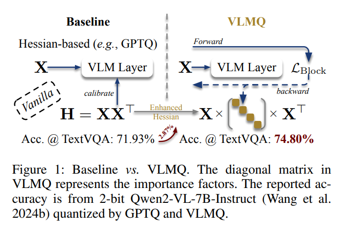
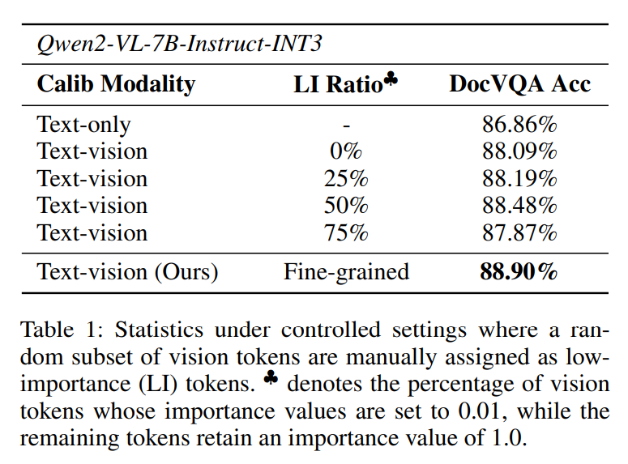
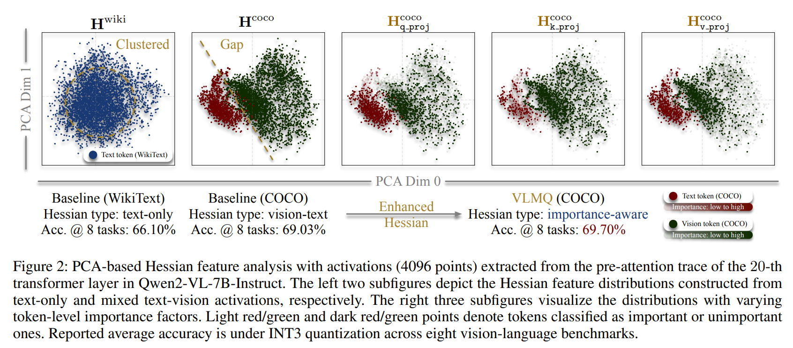
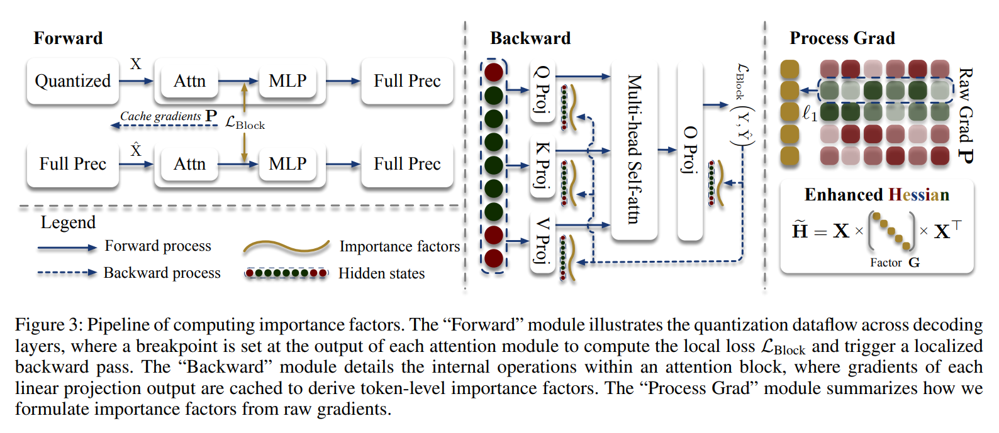
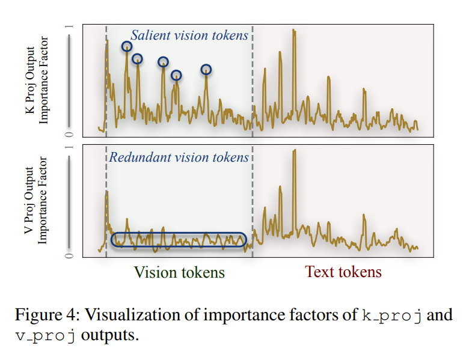
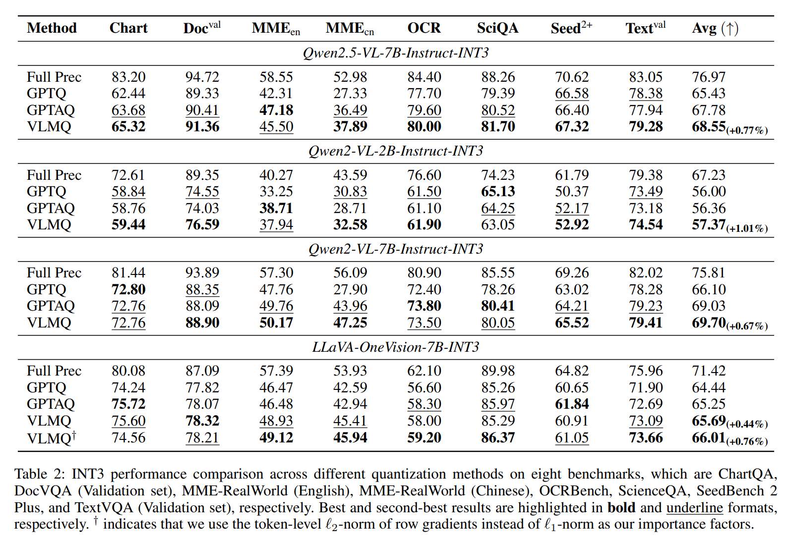
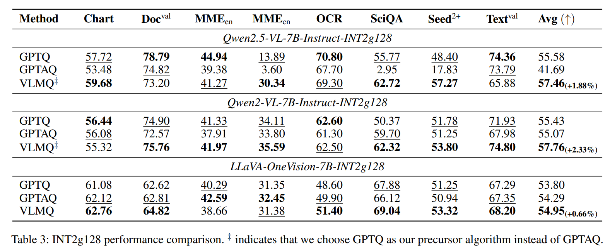
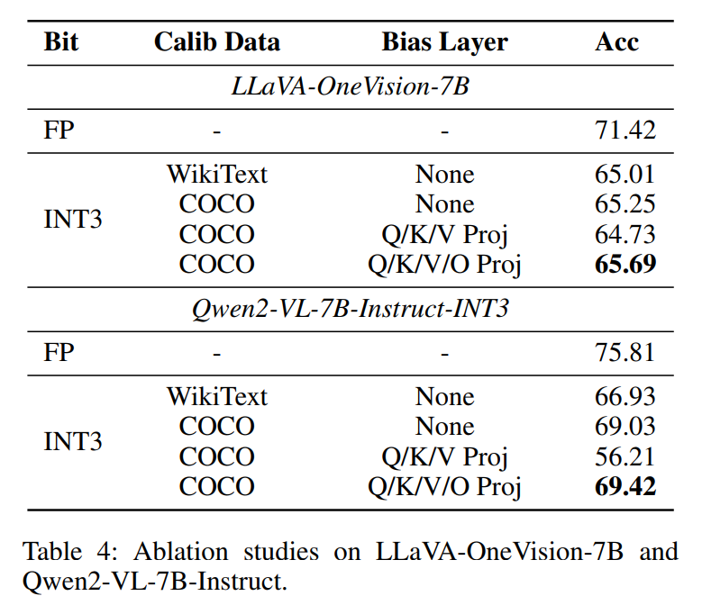
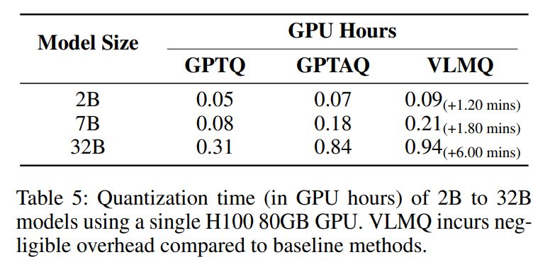

논문 및 이미지 출처 : <https://arxiv.org/pdf/2508.03351>

# Abstract

Post-training quantization (PTQ) 은 재학습 없이 large model 을 압축하고 inference 를 가속하기 위한 효과적인 접근법으로 부상하였다. PTQ 는 large language models (LLMs) 맥락에서 광범위하게 연구되었으나, vision-language models (VLMs) 에 대한 적용 가능성은 아직 충분히 탐구되지 않았다. 본 논문에서 저자는 VLMs 의 modality discrepancy (i.e., 제한된 text tokens vs. 과도하고 중복적인 vision tokens) 를 식별한다. 그러나 기존의 Hessian-based LLM PTQ 방법은 quantization 과정에서 모든 token 을 동일하게 취급하며, 이로 인해 VLMs 에 적용될 경우 심각한 성능 저하가 발생한다. 이러한 관찰에 착안하여, 저자는 VLMs 에 특화된 새로운 importance-aware PTQ framework 인 VLMQ 를 제안한다. 구체적으로, vision token redundancy 를 해결하기 위해 VLMQ 는 다음을 수행한다.

* 1. token-level importance factor 를 포함하는 향상된 Hessian 을 산출하는 importance-aware objective 를 최적화하면서, 병렬화된 weight update 와의 호환성을 유지한다.
* 2. token-level perturbation 과의 이론적 연결에 기반하여, 단일 경량 block-wise backward pass 를 통해 이러한 factor 를 계산함으로써 효율성과 효과성을 보장한다.

0.5B ∼ 32B VLMs 에 대해 8 개 benchmark 에서 수행한 광범위한 평가 결과, 특히 low-bit 설정에서 VLMQ 가 state-of-the-art (SOTA) 성능을 달성함을 보인다. 예를 들어, 2-bit quantization 하에서 MME-RealWorld 에서 16.45% 의 상당한 향상을 달성한다.

# 1 Introduction

large language models (LLMs) 는 다양한 natural language processing 작업 전반에서 뛰어난 발전을 보였으며, 이에 따라 text, image, video 를 포함한 multi-modal input 을 처리하는 vision-language models (VLMs) 개발에 대한 관심이 증가하였다. 그러나 model size 의 전례 없는 scaling 은 실제 resource-limited 환경에서의 deployment 를 복잡하게 만든다. Quantization 방법은 full-precision weight 및 activation (e.g., FP16/BF16) 을 reduced-precision 형식 (e.g., INT8/INT4) 으로 변환함으로써, 경미한 성능 저하를 대가로 memory footprint 와 computation complexity 를 현저히 감소시키는 효과적인 해결책을 제공한다.

Post-training quantization (PTQ) 은 최소한의 computation overhead 와 비용이 큰 fine-tuning 또는 retraining 과정을 우회할 수 있는 능력으로 인해, large-scale model 을 deployment 하기 위한 대표적인 접근법으로 자리 잡았다. LLMs 에 특화된 고급 PTQ 방법을 설계하기 위한 상당한 연구가 이루어졌다. 이러한 접근법은 일반적으로 equivalent transformation, Hessian-based error compensation, incoherence processing 등 다양한 전략을 통해 weight 및 activation distribution 을 정교화하는 것을 목표로 한다.

LLMs 에 PTQ 를 적용하는 데 있어 상당한 진전이 있었으나, 이를 VLMs 로 확장하는 연구는 아직 충분하지 않다. MBQ, MQuant, QSLAW 와 같은 최근의 선구적 연구는 modality imbalance 문제를 강조하며, quantized VLMs 의 성능 향상을 위한 importance-aware 전략을 제안한다. 그러나 이러한 방법들은 다음과 같은 한계를 가진다.

* 비용이 큰 parameter fine-tuning 을 요구하거나,
* inference 시점에서 특수한 조작을 필요로 하거나,
* 비최적의 grid search 에 의존한다.

따라서 calibration 과 inference 모두에서 효율적이고 효과적인 해결책을 제공하지 못한다.

본 연구에서 저자는 VLMs 에서 modality disproportion (i.e., 제한된 text tokens vs. 과도하고 중복적인 vision tokens) 을 식별한다. 여기서 redundancy 는 vision over-representation 으로 지칭한다. GPTQ 와 같은 기존의 Hessian-based PTQ 방법은 layer-wise reconstruction loss 를 최적화할 때 모든 token 을 동일하게 취급한다. 이러한 방법에서 weight quantization 의 핵심 지침으로 작용하는 Hessian matrix 는 token 의 정보성이나 중요도와 무관하게 균등하게 token 기여를 집계하여 추정된다. 이와 같은 token-agnostic formulation 은 지배적이지만 중복적인 vision feature 에 Hessian 이 편향되도록 만들며, 그 결과 sub-optimal weight update 를 초래한다. 따라서 이러한 방법을 VLMs 에 직접 적용하면 심각한 성능 저하가 발생한다.

vision over-representation 의 부작용을 완화하기 위해, 저자는 정제된 objective 를 최적화하는 importance-aware calibration framework 인 **VLMQ** 를 제안한다. 

* Fig. 1 에서 보이듯이, VLMQ 는 salient token 에는 더 높은 importance 를, redundant token 에는 더 낮은 importance 를 부여함으로써 표준 Hessian 을 향상된 변형으로 수정한다. 
* 이는 token-level importance 를 반영하는 augmented Hessian 을 통해 closed-form weight update 를 도출한다. 
* VLMQ 는 기존 Hessian-based PTQ framework 와 완전히 호환되며, Cholesky decomposition 과 같은 효율적인 기법을 그대로 계승할 수 있다. 
* 효과적인 importance factor 를 도출하기 위해, 저자는 먼저 block-level loss perturbation 과 token-level quantization error 간의 이론적 연결을 정립한다. 
* 이러한 통찰에 기반하여, layer-wise gradient-driven importance factor 를 효율적으로 산출하기 위해 단일 경량 **block-wise backpropagation** 접근법을 제안한다.

핵심 기여는 다음과 같다.

* VLMs 에 존재하는 vision redundancy 와 기존 Hessian-based PTQ 방법의 token-agnostic objective 간의 중요한 불일치를 식별한다. 기존 방법은 quantization 과정에서 모든 token 을 동일하게 취급한다. 저자는 이러한 간과된 vision redundancy 가 Hessian 추정을 왜곡하며, 그로 인해 기존 LLM PTQ 방법을 VLMs 에 적용할 때 성능이 저하된다고 설명한다.
* vision token 간 redundancy 를 명시적으로 고려하고 높은 수준의 병렬성을 지원하는 importance-aware objective 로부터 도출된 향상된 Hessian 을 활용하는 PTQ scheme 을 제안한다.
* block-wise loss perturbation 과 first-order token-level activation error 간의 이론적 연결을 제시하고, 이를 바탕으로 gradient-driven importance factor 를 도출하기 위해 단일 경량 block-wise backward pass 를 사용하는 동기를 제공한다. 이 설계는 token 중요도 포착에서 효율성과 효과성을 동시에 달성한다.
* 광범위한 실험을 통해, 특히 ultra-low-bit quantization 설정에서 VLMs 에 대해 저자의 접근법이 우수한 성능을 보임을 입증한다. 예를 들어, state-of-the-art (SOTA) 결과를 달성하며 최대 16.45% 의 accuracy 향상을 기록한다.

# 2 Preliminary

#### Notation

저자는 GPTAQ 의 표기법을 대부분 따른다. 구체적으로, 일반적인 model parameter 인 $N$, $C_i$, $C_o$, $V$ 는 각각 sequence length, in-channel number (hidden size), out-channel number (intermediate size), vocabulary set 을 의미한다.

굵은 소문자와 대문자는 각각 row-vector 와 matrix 를 나타낸다. hat 기호가 붙은 문자 (e.g., $\hat{x}$ 또는 $\hat{W}$) 는 quantization error 로 인해 noise 가 추가된 quantized weight 또는 activation 을 의미한다.

linear operation 은 다음과 같이 기술된다: $Y = WX$

* 여기서 $W \in \mathbb{R}^{C_o \times C_i}$, $X \in \mathbb{R}^{C_i \times N}$ 는 각각 weight 와 activation 을 나타낸다.

indexing 규칙은 다음과 같다.

* $W_{j,:}$ 는 matrix $W$ 의 $j$-번째 row 를 의미한다.
* $W_{:,j}$ 는 matrix $W$ 의 $j$-번째 column 을 의미한다.
* 음수 index 는 matrix 에서 특정 row 를 제거함을 의미한다. 예를 들어, $X_{-1} \in \mathbb{R}^{(C_i - 1) \times N}$ 는 하나의 row 가 제거된 activation 을 의미한다.

#### VLM architecture

VLMs 는 text, image, video 등 서로 다른 modality 의 data 를 처리한다. VLMs 는 세 가지 핵심 구성 요소로 이루어진다.

* visual encoder
* vision-text projector
* Language Model (LM) backbone

주류 decoder-only LM backbone 은 다음과 같은 분포를 출력한다: $P = (p_1, p_2, \dots, p_{N-1}) \in \mathbb{R}^{N \times |\mathcal{V}|}$

그리고 다양한 decoding strategy 를 통해 이를 활용하여 prediction 을 생성한다.

상기 LM backbone 의 각 decoding layer 에 대한 input 은 activation $X \in \mathbb{R}^{C_i \times N}$ 로 정의된다. 여기서 $C_i$ 와 $N$ 은 각각 model dimension (i.e., input channel number) 과 sequence length 를 의미한다. Activation 은 LM backbone 의 $L$ 개 decoding layer 를 거치며 변환된다.

하나의 decoding layer 내부에서 attention stream 과 feed-forward network stream 은 다음과 같이 정의된다.

$$
\text{Attn}(X) = X + \text{MHSA}(X), \tag{1}
$$

$$
\text{MLP}(X) = X + \text{FFN}(X), \tag{2}
$$

* 여기서 $\text{MHSA}(\cdot)$ 는 Q/K/V/O projection 을 포함하는 multi-head self-attention 연산을 의미하며, 
* $\text{FFN}(\cdot)$ 는 Up/Gate/Down projection 을 포함하는 feed-forward data flow 를 의미한다. 
* 단순화를 위해 decoding layer 에 포함된 layer normalization 은 생략한다.

# 3 Related Work

#### PTQ for VLMs

text 와 vision modality 간의 상이한 feature 및 distribution 으로 인해, VLMs 에 대한 PTQ 는 도전적이며 아직 충분히 탐구되지 않았다.

* MQuant 는 modality-specific static quantization 과 attention-invariant flexible switching 을 제안하여 modality gap 과 visual outlier 문제를 해결한다.
* MBQ 는 text token 과 vision token 간 error-sensitivity 가 상이함을 관찰하고, optimal channel-wise equalization scale 을 결정하기 위해 편향된 objective 를 정식화한다.
* QSLAW 는 learning-based 방법으로 quantization step size 를 결정하고, overfitting 문제를 완화하기 위해 importance-aware warmup 을 제안한다.

이들 방법이 modality 차이에 초점을 맞추는 것과 달리, Q-VLM 은 cross-layer dependency 를 포착하고 entropy 기반으로 block 을 분할한다.

#### OBQ, GPTQ, and GPTAQ

Hessian 정보는 quantization error 를 보상하기 위한 calibration guide 로 널리 사용된다.

OBQ 는 model 의 linear layer 에 대한 quantization 을 다음과 같은 반복적 절차로 calibration 한다.

1. 최소 loss 를 유발하는 entry 를 quantize 한다.
2. Hessian $H = XX^\top$ 의 지침에 따라 나머지 미양자화 entry 를 업데이트한다.

GPTQ 는 이 패러다임을 확장하여 다음을 도입한다.

* 고정 순서 entry quantization 을 병렬 방식으로 수행
* lazy block updating
* Cholesky reformulation

이를 통해 효율적인 calibration 을 달성한다.

GPTAQ 는 GPTQ 를 더욱 확장하여 다음과 같은 asymmetric objective 를 최적화한다.

$$
\arg \min_{\hat{w}} = \|\Delta w X - r\|_2^2, \tag{3}
$$

* 여기서 $r = wX - w\hat{X}$ 는 activation residual 이며,
* $\Delta w = \hat{w} - w$ 는 weight perturbation 이다.

최적해는 Lagrangian formulation 을 통해 다음과 같이 도출된다.

$$
\Delta w =
\frac{(\hat{w}_q - w_q)}{H^{-1}_{qq}}
\cdot H^{-1}_{q:}
+ rX^\top H^{-1}_{-q},
  \tag{4}
  $$

* 여기서 $q$ 는 quantized weight element 의 index 이다. 
* GPTAQ 는 model functionality 를 더 잘 보존하면서 정확하고 효율적인 quantization 을 가능하게 한다.

# 4 Motivation

## Visual Over-Representation

visual over-representation 문제는 VLMs 에서 널리 인식된 이슈이다. 최근 연구는 inference 를 가속하면서 성능을 유지하기 위해 vision token reduction 을 탐구하였다.

그러나 GPTQ 와 같은 기존 Hessian-based PTQ 방법은 이러한 redundancy 를 활용하지 못한다. 이들 방법은 표준 optimization objective 로부터 도출된 모든 token 기여를 균등하게 집계하여 Hessian 을 구성한다. 그 결과, redundant vision token 이 activation space 를 지배하는 VLMs 에 적용될 경우 어려움을 겪는다.

이러한 한계는 informative vision token 과 redundant vision token 을 명시적으로 구분하는 importance-aware quantization 전략의 필요성을 제기한다.

## Pilot Study

#### Pilot study on vision-role in quantization

vision token 이 quantization 성능에 미치는 역할을 조사하기 위해, 저자는 vision token 이 Hessian 추정 및 model accuracy 에 미치는 영향을 분석하는 pilot study 를 수행한다.

관찰 결과는 다음과 같다.

1. VLMs 에서 효과적인 quantization 을 위해 vision token 의 포함은 필수적이다.
2. 그러나 과도한 redundant vision token 은 성능 저하를 초래할 수 있다.

redundant token 에 더 낮은 importance 를 부여하면 이러한 성능 저하를 완화할 수 있다. 이를 검증하기 위해, INT3-quantized LLM 을 DocVQA 에서 평가하면서 일부 vision token 을 낮은 importance factor 로 무작위 down-weighting 하였다. 

* Tab. 1 에서 보이듯이, vision token 의 50% 를 low-importance (LI) 로 표시했을 때 model 성능이 최고점을 기록한다. 
* 이는 최적 quantization 을 위해 균형 잡힌 visual input 수준이 중요함을 시사한다.

#### Explanation of the pilot study

관찰된 성능 변동은 Hessian feature shift 에 기인한다고 저자는 분석한다.

* text-only token 은 dominant component space 에서 compact 하고 중앙 집중된 distribution 을 형성한다.
* vision token 을 도입하면 calibration distribution 이 다양화되며 quantization–inference gap 이 완화된다.

그러나 visual over-representation 으로 인해 vision token 을 과도하게 포함하면 Hessian 이 redundant visual feature 쪽으로 편향될 위험이 존재한다.

오른쪽 세 개의 subfigure 에서는 token point 를 importance factor $G$ (후속 절에서 정의) 로 color-code 하였다. modality 간 importance density 의 불균형은 Hessian 을 정보성이 높은 중앙 영역이 아닌 redundant visual margin 쪽으로 왜곡시킬 위험이 있다.

이러한 결과는 redundancy 로 인한 bias 를 상쇄하기 위해 fine-grained importance-aware quantization 이 필요함을 보여준다.

pilot study 는 다음을 보여준다.

* visual input 의 포함은 필수적이다.
* 그러나 과도한 vision token 은 quantization 품질을 저하시킨다.
* 적절한 수준의 down-weighting 이 성능 peak 를 유도한다.

이러한 통찰은 salient vision token 을 선택적으로 강조하고 redundant token 의 부작용을 완화하는 fine-grained importance-aware quantization 전략의 필요성을 강하게 동기 부여한다.

# 5 VLMQ

token 간 importance discrepancy 를 해결하기 위해, 저자는 importance-aware objective 를 최적화하는 정확한 VLMs 용 PTQ 방법인 VLMQ 를 제안한다. 구체적으로 다음과 같다.

1. token 간 상이한 salience 를 포착하기 위해, quantization objective 를 importance-aware 형태로 정제하여 enhanced Hessian 을 도출한다.
2. block-wise loss perturbation 과 layer-wise output error 간의 이론적 연결을 정립하여, 단일 block-wise backward pass 를 통해 gradient-driven importance score 를 효율적으로 계산한다.

## Importance-Aware Objective

Equation 4 는 squared error 를 최소화함으로써 최적의 quantized weight $\hat{w}$ 를 도출한다. 그러나 이는 $Z = WX$ 의 모든 token 이 동일한 기여를 한다고 가정한다. 이러한 균등 처리 방식은 vision over-representation 으로 인해 bias 를 유발할 수 있다.

이를 해결하기 위해, 저자는 token-level importance weighting matrix $G \in \mathbb{R}^{N \times N}$ 를 도입한다. 여기서 $G$ 는 diagonal matrix 이며, $i$-번째 diagonal element 는 출력 token $Z_{:,i}$ 에 할당된 importance 를 나타낸다.

importance factor 를 objective 에 통합하면 다음과 같은 정제된 formulation 이 된다.

$$
\begin{align*}
\arg \min_{\hat{w}}
\left\|
(\Delta w X - r)\sqrt{G}
\right\|_2^2, \\
\text{s.t. } \Delta w e_q^\top + w_q - \hat{w}_q = 0,
\end{align*} \tag{5}
$$

* 여기서 $e_q$ 는 $q$-번째 원소가 1 인 one-hot vector 이다.

이에 대한 Lagrangian 은 다음과 같이 정식화된다.

$$
L =
\left\| (\Delta w X - r)\sqrt{G} \right\|_2^2
+ \lambda ( \Delta w e_q^\top + w_q - \hat{w}_q ). \tag{6}
$$

이를 통해 대응되는 최적 weight update 는 다음과 같다.

$$
\begin{align*}
  \Delta w &= \frac{(\hat{w}_q - w_q)}{[X G X^\top]^{-1}_{qq}} \cdot \tilde{H}^{-1}_{q:} + r G X^\top [X G X^\top]^{-1}_{-q} \\
  &= \frac{(\hat{w}_q - w_q)}{\tilde{H}^{-1}_{qq}} \cdot \tilde{H}^{-1}_{q:} + \tilde{r} \tilde{X}^\top \tilde{H}^{-1}_{-q},
\end{align*} \tag{7}
$$

* 여기서 $\tilde{H} = X G X^\top, \quad \tilde{r} = r \sqrt{G}, \quad \tilde{X} = X \sqrt{G}$ 는 각각 importance-aware Hessian, residual, activation matrix 를 의미한다.

Equation 7 에서 제시된 importance-aware weight update 는 GPTAQ 의 기존 formulation 과 형식적으로 일관성을 유지한다. BoA 가 channel-level 에서 importance 를 부여하는 것과 달리, 저자의 방법은 token-level activation granularity 에서 importance score 를 할당한다.

이 설계는 GPTQ 및 GPTAQ 에서 제안된 병렬화 전략과 직교적이며, Cholesky reformulation 과 같은 효율성 기법을 그대로 계승할 수 있다.

## Gradient-Driven Importance Factors

Fig. 3 은 gradient-driven importance factor 계산의 전체 과정을 보여준다. 이 과정은 다음 세 단계로 구성된다.

* Forward
* Backward
* Gradient Processing

#### Forward

Forward 단계에서는 attention module 직후에 activation hook 을 배치하여 hidden state 를 추출한다. 이를 통해 semi-quantized model 과 auxiliary full precision model 간의 localized loss $L_{\text{Block}}$ 를 계산하고, block 당 한 번의 localized backward pass 를 수행한다.

importance score 도출에서 효율성과 정확성의 균형을 맞추기 위해, block 은 Equation 1 에서 정의된 attention module 로 설정한다. 이는 Q/K/V/O projection 과 residual stream 을 포함하는 multi-head self-attention 을 포함한다.

localized objective 는 block output mean square error (MSE) 로 정의된다.

$$
L_{\text{Block}} =
\left\|
\text{Attn}(X) - \text{Attn}(\hat{X})
\right\|_2^2,
\tag{8}
$$

* 여기서 $X$ 와 $\hat{X}$ 는 각각 full precision activation 과 이전 layer 가 quantized 된 activation 이다.

이론적으로 전체 decoding layer 를 하나의 block 으로 설정할 수 있으나, 이는 상당한 memory overhead 를 초래하여 resource-constrained hardware 에서 비실용적이다.

#### Backward

Backward 단계에서는 attention layer 내부에서 Equation 8 로 정의된 $L_{\text{Block}}$ 에 대해 단일 backpropagation 을 수행하고, 각 linear projection output (i.e., Q/K/V/O projection) 의 gradient 를 cache 하여 token-level importance factor 를 추정한다.

저자는 각 token 의 기여도를 정량화하기 위해 gradient-driven importance factor 를 사용할 것을 제안하며, 이는 Theorem 5.1 에 의해 뒷받침된다.

***Theorem 5.1.***

block-wise loss perturbation $\Delta L_{\text{Block}}$ 는 first-order error 로 다음과 같이 근사될 수 있다.

$$
\Delta \mathcal{L}_{\text{Block}}
\approx
\Delta \theta p^{(\Delta \theta)\top} + \mathcal{O}(|\theta|^2) \approx \Delta z p^{(\Delta z)\top}, \tag{9}
$$

* 여기서 $\theta \in \mathbb{R}^{D}$ 는 quantized 되는 stacking weight 이고, $z \in \mathbb{R}^{Q}$ 는 layer output 이다.

증명은 Appendix A 에 제공된다.

gradient $p^{(\Delta z)}$ 는 layer output error 가 block loss 에 미치는 교란을 측정하며, 이는 token importance 를 평가하는 효과적인 metric 이 된다. 이후 표기 단순화를 위해 $p^{(\Delta z)}$ 의 상첨자를 생략하고 이를 $P \in \mathbb{R}^{C_o \times N}$ 로 reshape 하여 raw gradient 로 사용한다.

#### Process Grad

Process Grad 단계에서는 raw gradient $P$ 로부터 importance factor matrix $G \in \mathbb{R}^{N \times N}$ 를 구성한다.

importance factor 는 다음과 같이 정의된다.

$$
G =
\text{Diag}
\left(
\overline{|P|}_0,
\overline{|P|}_1,
\dots,
\overline{|P|}_{N-1}
\right),
\tag{10}
$$

* 여기서 $n$-번째 token 의 importance 는 gradient 의 $n$-번째 column 의 $\ell_1$-norm 으로 정의된다.

$$
\overline{|P|}_n =
\frac{1}{C_o}
\sum_{i=0}^{C_o - 1}
|P|_{i,n}.
\tag{11}
$$

text token 에 대해서도 importance factor 를 계산하여 modality 간 상대적 기여 균형을 유지한다.

이러한 gradient-driven importance factor 는 다음을 반영한다.

* inter-layer dependency
* 이전 quantized layer 로부터 누적된 error 에 대한 조정 필요성

Fig. 4 는 대표적인 attention block 에서 $k$ proj 및 $v$ proj output 의 importance factor 를 시각화한다. 

token salience 분포는 layer 간 뚜렷하게 상이한 패턴을 보인다.

* $k$ proj output 에서는 일부 vision token 이 salient 하게 식별된다.
* $v$ proj output 에서는 vision token 이 주로 낮은 importance 를 부여받아 redundancy 를 나타낸다.

이 분포는 block-wise loss 에 대한 vision token 의 다양한 기여를 보여주며, fine-grained importance-aware calibration 의 필요성을 다시 한번 강조한다.

전체 model 을 quantize 하기 위해, 저자는 local backpropagation 과 calibration 을 교대로 점진적으로 수행하여 error propagation dynamics 를 보다 잘 포착한다. VLMQ 의 전체 절차는 Appendix C 에 제시된다.

# 6 Experiments

## Implementation Details

#### Models

저자는 공개된 SOTA VLMs 에 대해 실험을 수행한다. 대상 model 은 다음과 같다.

* LLaVA-OneVision-0.5B / 7B
* Qwen2.5-VL-2B / 7B / 32B-Instruct
* Qwen2-VL-7B-Instruct

LLaVA-OneVision series 에 대해서는 LM backbone 으로 Qwen2 를 채택하고, vision encoder 로 SigLIP-400M 을 사용하는 버전을 선택한다.

#### Calibration

MBQ 를 따라 ShareGPT4V 에서 도입한 개선된 COCO Caption dataset 을 사용한다. 무작위로 512 개의 text-image pair 를 calibration set 으로 샘플링한다.

별도 명시가 없는 한, 모든 실험에서 다음 설정을 사용한다.

* dampening ratio $\lambda = 0.01$
* act order 활성화

기타 세부 사항은 Appendix D 에 제시된다.

#### Evaluation

quantized VLMs 의 성능을 LMMs-Eval framework 기반의 다양한 도전적인 vision-language task 에서 광범위하게 평가한다.

사용된 대표 benchmark 는 다음과 같다.

* ChartQA
* DocVQA
* MME-RealWorld
* OCRBench
* ScienceQA
* SeedBench 2 Plus
* TextVQA

이를 통해 text recognition, visual perception, visual reasoning 능력을 종합적으로 측정한다.

모든 실험에서 Flash Attention 을 활성화하고 기본 설정을 사용한다.

## Main Results

#### INT3 quantization

Tab. 2 에서 8 개 vision-language benchmark 에 대해 INT3 quantized model 의 zero-shot 성능을 평가한다.

VLMQ 는 baseline 방법 대비 전반적으로 우수한 성능을 보이며, 평균 accuracy 기준 최대 1.01% 향상을 달성한다.

* Qwen2.5-VL-7B-Instruct-INT3 의 경우, MME-RealWorld (English) 를 제외한 모든 benchmark 에서 GPTQ 및 GPTAQ 대비 우수한 성능을 보인다.
* 특히 다음과 같은 accuracy 향상을 달성한다.
  * ChartQA: +1.64%
  * MME-RealWorld (Chinese): +1.40%
  * ScienceQA: +1.18%

LLaVA-OneVision-7B-INT3 에 대해서는 다른 실험에서 사용한 $\ell_1$-norm 대신 token-level $\ell_2$-norm 을 적용하며, 이는 성능 향상에 경험적으로 유리함을 확인하였다.

#### INT2g128 quantization

Tab. 3 에서는 group size = 128 인 INT2 group-wise quantization 성능을 평가한다.

INT3 설정에서는 GPTAQ 를 기반 algorithm 으로 사용할 경우 전반적으로 양호한 결과를 얻었으나, INT2g128 에 동일한 구성을 적용하면 심각한 성능 저하가 발생한다.

* ultra-low-bit 설정에서 GPTAQ 는 GPTQ 보다도 낮은 성능을 보인다.
* Qwen2-VL-7B-Instruct-INT2g128 의 경우:
  * GPTAQ: 41.69%
  * GPTQ: 55.58%

또한 Qwen2.5-VL-7B-Instruct-INT2g128 는 다음 benchmark 에서 실패한다.

* MME-RealWorld (Chinese): 3.60%
* ScienceQA: 2.95%

가능한 원인으로는, 극저비트 quantization 하에서 GPTAQ 의 residual error 가 이전 quantized layer 로부터 누적되어 지속적으로 증폭되기 때문이라고 분석한다.

누적된 noise 는 주요 weight update 항 $(\hat{w}_q - w_q) / H^{-1}_{qq}$ 을 심각하게 교란하여 quantization 품질을 저하시킨다.

이를 완화하기 위해 foundation algorithm 으로 GPTQ 를 선택하였다. 그 결과 INT2g128 설정에서 VLMQ 는 뚜렷한 성능 향상을 보인다.

* Qwen2.5-VL-7B-Instruct-INT2g128 에서
  * MME-RealWorld (Chinese) benchmark 기준 GPTQ 대비 +16.45% accuracy 향상

## Ablation Study

Tab. 4 에서 Qwen2-VL-7B-Instruction-INT3 및 LLaVA-OneVision-INT3 에 대해 단계별 ablation study 를 수행한다.

주요 관찰은 다음과 같다.

* WikiText 만을 calibration dataset 으로 사용할 경우, 성능이 크게 저하된다. 이는 quantization 시 vision modality 의 포함이 필수적임을 보여준다.
* token-level importance variance 를 도입하면, importance-aware weighting 이 Hessian matrix 에 반영되어 weight update $\Delta W$ 가 개선되고 전반적인 quantization 품질이 향상된다.
* biased calibration strategy 를 o proj 에 적용하는 것이 중요하다.

이는 q proj, k proj, v proj 의 quantization 으로 인해 발생한 error accumulation 때문이라고 분석한다.

o proj 에서 enhanced Hessian 정보를 활용하면 residual block 내부에서 효과적인 error compensation 이 가능하며, 최종적으로 quantization fidelity 가 향상된다.

## Quantization Efficiency

Tab. 5 에서 VLMQ 의 quantization time cost 를 baseline 방법과 비교한다.

VLMQ 는 GPTAQ formulation 과 형식적으로 호환되므로, 다음과 같은 효율성 기법을 그대로 적용할 수 있다.

* Cholesky decomposition
* residual decomposition

VLMQ 는 token-level importance 만을 추가하므로 optimization 과정에 대한 구조적 변경이 최소화된다.

추가 overhead 는 각 decoding layer 당 단일 local forward 및 backward pass 에서 발생하며, 실제로는 무시할 수 있을 정도의 latency 만을 유발한다.

# 7 Conclusion and Limitation

저자는 VLMs 를 위한 새로운 importance-aware PTQ framework 인 VLMQ 를 제안하였다.

기존 LLM PTQ 방법을 VLMs 에 직접 적용할 때 성능 저하를 유발하는 vision over-representation 문제를 식별하였다. 이에 착안하여 importance-aware objective 로부터 도출된 enhanced Hessian 을 명시적으로 활용한다.

VLMQ 는 다양한 vision-language benchmark 에서 quantized VLMs 의 성능을 효과적으로 향상시키며, ultra-low-bit 설정에서도 대규모 VLM 의 practical deployment 를 가능하게 한다.

한계로는, 평가가 주로 image-text task 에 집중되었다는 점이 있다. 그러나 저자는 VLMQ 가 video understanding 이나 language-only task 와 같은 보다 광범위한 application 으로 일반화될 수 있다고 보며, 이는 향후 연구 과제로 남겨둔다.

