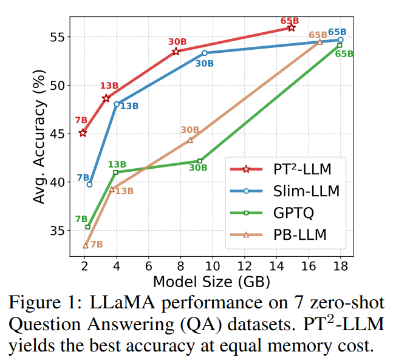
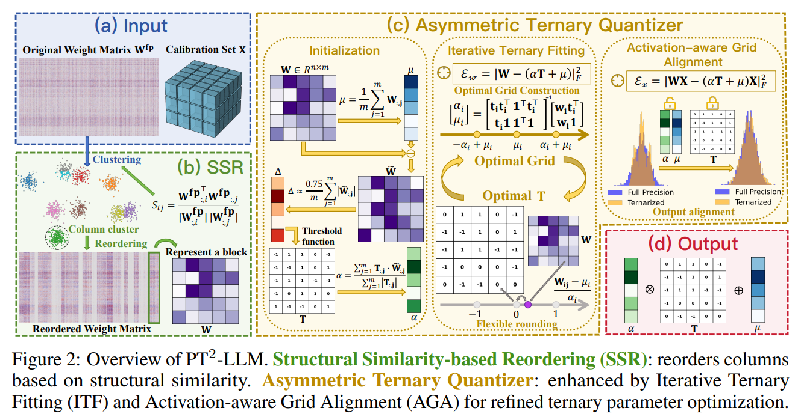
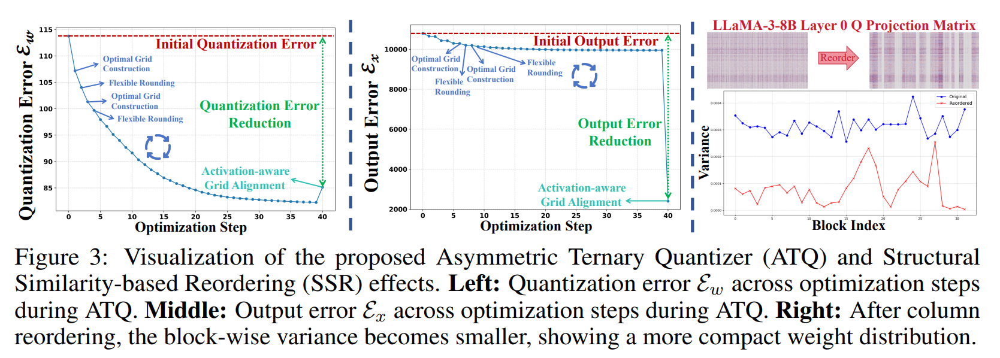
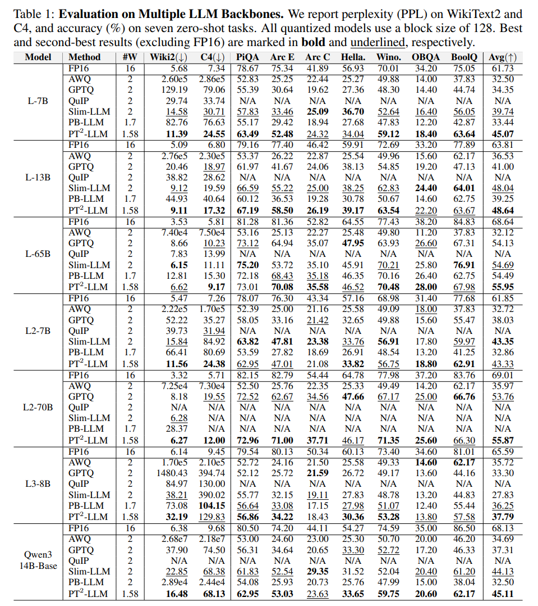
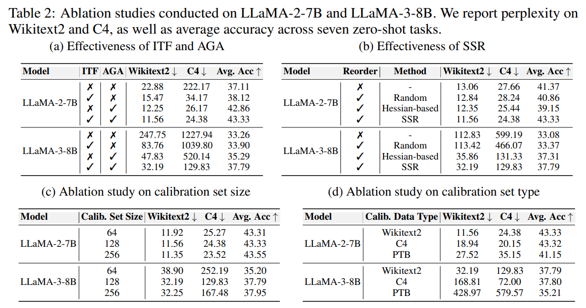
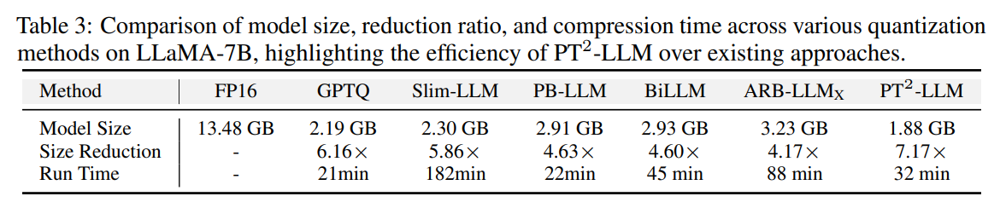
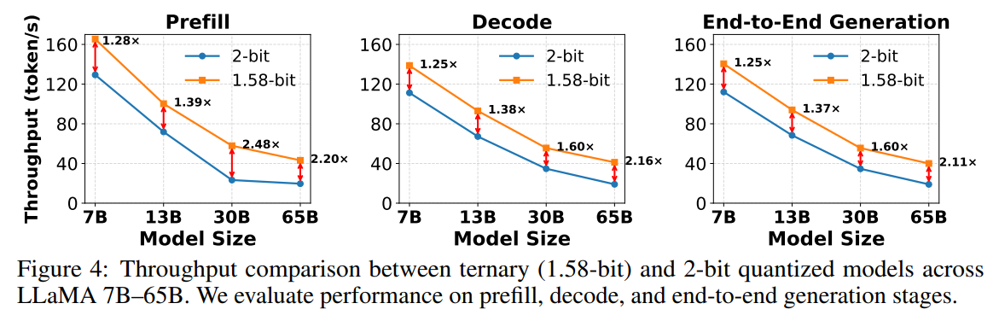

논문 및 이미지 출처 : <https://arxiv.org/pdf/2510.03267>

# ABSTRACT

Large Language Models (LLMs) 는 다양한 task 전반에서 인상적인 성능을 보여주었지만, 그들의 큰 memory 및 compute 요구는 실제 deployment 를 어렵게 만든다.
Ternarization 은 유망한 compression technique 으로 주목받고 있으며, 상당한 크기 감소와 높은 computational efficiency 를 제공한다. 그러나 post-training quantization (PTQ) 설정에서의 잠재력은 충분히 탐구되지 않았다. 이는 training-free parameter optimization 의 어려움과, outlier 및 분산된 weight 로 인한 quantization 난이도 때문이다.

이러한 문제를 해결하기 위해 저자는 LLM 에 특화된 post-training ternarization framework 인 PT$^2$-LLM 을 제안한다. 그 핵심은 두 단계 refinement pipeline 을 갖춘 Asymmetric Ternary Quantizer 이다:

1. Iterative Ternary Fitting (ITF): optimal ternary grid construction 과 flexible rounding 을 번갈아 수행하여 quantization error 를 최소화한다.
2. Activation-aware Grid Alignment (AGA): ternary grid 를 추가적으로 정교화하여 full-precision output 과 더 잘 정렬되도록 한다.

또한 저자는 inter-column structural similarity 를 활용하여 quantization 을 완화하고 outlier 효과를 완화하는 **plug-and-play Structural Similarity-based Reordering (SSR)** 전략을 제안한다. 이는 전체 성능을 더욱 향상시킨다.

광범위한 실험을 통해 PT$^2$-LLM 은 더 낮은 memory cost 로 state-of-the-art (SOTA) 2-bit PTQ 방법과 경쟁력 있는 성능을 달성하며, prefill 과 decoding 모두를 가속하여 end-to-end speedup 을 달성함을 보인다.

# 1 Introduction

Large Language Models (LLMs) 는 language understanding, reasoning, generation 에서 놀라운 발전을 이루었다. 이들은 많은 실제 응용의 기반이 되며 AI 연구의 최전선에 위치한다. 그러나 이러한 성과는 대규모 model parameter 규모에 크게 의존한다. 현대 LLM 은 수십억에서 수천억 개의 parameter 를 포함한다. 예를 들어, DeepSeek-R1 은 671 billion parameter 를 가진다. 이는 막대한 memory consumption 과 intensive computation 요구를 초래한다. 이러한 model 을 실행하려면 강력한 GPU, 대용량 memory, 높은 에너지가 필요하며, 이는 resource-limited 또는 latency-sensitive platform 에서의 deployment 를 어렵게 만든다.

Weight-only quantization 은 weight precision 을 줄여 memory 를 절감하고 inference 를 가속한다. 다양한 방식 중 ternarization 은 weight 를 ${-1, 0, +1}$ 로 제한하여 높은 compression ratio 와 효율적인 computation 을 가능하게 한다.

* low-bit quantization (예: 2–4 bit) 과 비교하면, ternarization 은 대부분의 floating-point multiplication 을 단순 addition 으로 대체하여 computational cost 와 energy cost 를 모두 감소시킨다.
* binarization 과 비교하면, ternarization 은 LLM weight 의 unimodal distribution 에 더 잘 부합하며 더 강한 representational capacity 를 제공하여 더 높은 accuracy 를 달성한다.

효율성과 표현력의 균형 측면에서 ternarization 은 resource-limited LLM deployment 에 적합하다.

최근 ternarization 에 대한 연구는 주로 quantization-aware training (QAT) 에 초점을 맞추었다. 

* QAT 에서는 model 이 ternary constraint 하에서 training 된다. 
  * 이러한 방법은 BERT 나 DiT 와 같은 중간 규모 architecture 에서 주로 탐구되었다. 
* 그러나 QAT 기반 ternarization 을 LLM 에 확장하려는 시도는, 예를 들어 BitNet b1.58 과 같은 접근이 있으나, 막대한 parameter 규모와 training resource, computation budget, full training data 접근 요구 때문에 매우 비현실적이다.

이에 반해 post-training quantization (PTQ) 은 훨씬 실용적이고 효율적인 대안이다. 

* 이는 retraining 이나 전체 training data 접근 없이 full-precision model 을 compact ternary version 으로 빠르게 변환할 수 있어 실제 LLM deployment scenario 에 더 적합하다.
* 그러나 PTQ 기반 ternarization 은 충분히 연구되지 않았다. 

직접 적용할 경우 심각한 성능 저하가 발생하여 model 이 unusable 해지는 경우가 많다. 분석을 통해 저자는 두 가지 주요 과제를 식별한다:

1. QAT 와 달리 PTQ 는 대규모 training data 를 통한 gradient-based update 없이 ternary parameter 를 효율적으로 정교화해야 한다. 이는 핵심적인 어려움이다.
2. ternarization 은 극단적인 low-bit quantization 방식이기 때문에, 분산이 크거나 outlier 가 많은 weight distribution 을 표현하기 어렵고, 큰 quantization error 에 특히 취약하다.

본 논문에서 저자는 LLM 에 특화된 post-training ternarization framework 인 **PT$^2$-LLM** 을 제안한다.

training-free ternary parameter optimization 문제를 해결하기 위해, 저자는 **Asymmetric Ternary Quantizer (ATQ)** 를 제안한다. 이는 두 단계로 정교화된다:

* Iterative Ternary Fitting (ITF): optimal ternary grid construction 과 flexible rounding 을 번갈아 수행하여 quantization error 를 최소화한다.
* Activation-aware Grid Alignment (AGA): calibration data 를 활용하여 ternary output 을 full-precision output 과 더욱 정렬한다.

분산된 weight 와 outlier 문제를 해결하기 위해, 저자는 plug-and-play Structural Similarity-based Reordering (SSR) 전략을 제안한다. 이는 inter-column structural correlation 을 기반으로 column 을 재배치하여 quantization 을 용이하게 한다.

ATQ 와 SSR 이 결합된 PT$^2$-LLM 은 정확하고 robust 한 post-training ternarization 을 가능하게 한다. Fig. 1 에서 보이듯, 동일한 memory budget 하에서 zero-shot QA accuracy 측면에서 SOTA 2-bit PTQ 방법을 능가한다.

저자의 주요 기여는 다음과 같다:

* 저자는 pretrained LLM 을 retraining 없이 ternary grid 로 효율적으로 압축하는 새로운 ternarization framework 인 PT$^2$-LLM 을 제안한다. 이는 LLM 에서 거의 탐구되지 않은 post-training ternarization 문제를 해결한다.
* 저자는 post-training ternarization 을 위한 Asymmetric Ternary Quantizer 를 설계한다. 이는 Iterative Ternary Fitting (ITF) 과 Activation-aware Grid Alignment (AGA) 의 두 training-free 단계로 최적화된다. 이 구성 요소들은 ternary parameter 를 효과적으로 정교화하여 quantization error 를 줄이고 full-precision output 과의 정렬을 향상시킨다.
* 저자는 Structural Similarity-based Reordering (SSR) 전략을 개발한다. 이는 structural similarity 를 기반으로 weight column 을 재배치하여 quantization 난이도를 줄이고 outlier 의 영향을 억제한다.
* 광범위한 실험을 통해 PT$^2$-LLM 은 SOTA 2-bit PTQ 방법과 비교하여 경쟁력 있는 성능을 달성하면서 memory consumption 을 줄이고 inference 를 가속함을 보인다.

# 2 Related Works

## 2.1 Network Ternarization

Ternarization 은 neural networks 의 parameter 를 ${-1, 0, +1}$ 로 제한하여 memory 및 computation 효율성을 높이면서도 강한 representational capacity 를 유지하는 compression 기법이다.

Ternary Weight Networks (TWN) 는 full precision 과의 Euclidean distance 를 최소화하기 위한 scale-aware ternary quantization 을 도입하여 최대 16× compression 을 달성하였다.
Trained Ternary Quantization (TTQ) 는 training 과정에서 ternary weight 값과 그 assignment 를 공동으로 학습하여 accuracy 를 향상시켰다.

이후 연구들은 ternarization 을 activation 에까지 확장하여 완전한 ternary network 를 구현하였으며, 이를 통해 더 높은 efficiency 를 달성하였다.

최근에는 ternarization 을 더 크고 복잡한 model 에 적용하려는 시도가 이루어지고 있다.

* TernaryBERT 는 loss-aware ternarization 과 distillation 을 통해 BERT 를 14.9× 압축하였다.
* TerDiT 는 ternarization 을 4.2B diffusion transformer 까지 확장하였다.
* TernaryLLM 은 learnable scaling 과 feature distillation 을 도입하여 기존 low-bit LLM 보다 우수한 성능을 달성하였다.
* BitNet b1.58 은 LLM 을 위한 ternary-weight training framework 를 제안하여, latency 와 energy consumption 을 줄이면서도 full-precision 에 근접한 accuracy 를 달성하였다.

그러나 기존 ternarization 방법의 대부분은 training 에 의존한다. 이는 실제 deployment 환경에서의 실용성을 제한한다.

## 2.2 Quantization for Large Language Models

Quantization 은 large language models 의 memory footprint 와 inference cost 를 줄이는 방법이며, 일반적으로 quantization-aware training (QAT) 과 post-training quantization (PTQ) 으로 구분된다.

#### Quantization-Aware Training (QAT)

QAT 는 training 과정에 quantization 을 포함시켜, LLM 이 backpropagation 을 통해 robust 한 low-bit representation 을 학습하도록 한다.

* LLM-QAT 과 BitDistiller 는 knowledge distillation 을 활용하여 low-bit quantization 하에서도 accuracy 를 유지한다.
* EfficientQAT 는 two-stage training scheme 을 통해 QAT 의 overhead 를 줄인다.
* Onebit 과 BinaryMoS 는 QAT 를 1-bit 영역까지 확장하였다.

QAT 는 low-bit quantization 환경에서도 성능을 효과적으로 유지할 수 있으나, 높은 computational cost 와 memory cost 가 여전히 주요한 한계로 남아 있다.

#### Post-Training Quantization (PTQ)

QAT 와 달리 PTQ 는 pretrained model 을 retraining 없이 직접 quantize 한다. 이는 LLM deployment 에 더 효율적이고 실용적인 접근이다.

초기 방법들은 grouping label 을 도입하여 quantization 성능을 개선하였다.

* AWQ 와 OWQ 는 salient weight 를 scaling 하는 transformation 을 도입하여 activation 의 expressiveness 와 model capacity 를 보존하고자 하였다.
* GPTQ 는 Hessian-guided error compensation 을 활용하며, GPTAQ 는 asymmetric calibration 을 통해 이를 확장하였다.
* OmniQuant 과 SmoothQuant 는 scale redistribution 을 통해 activation outlier 문제를 해결하였다.
* 최근 연구들은 rotation-based transformation 을 도입하여 low-bit quantization 성능을 개선하였다.

ultra-low-bit 설정에서는 다음과 같은 접근이 제안되었다:

* QuIP 과 QuIP# 는 incoherence processing 을 통해 성능을 향상시켰다.
* Slim-LLM 은 salience-aware mixed-precision scheme 을 사용하였다.

binarization 영역에서는 다음과 같은 1-bit 방법이 경쟁력 있는 결과를 보였다:

* PB-LLM
* BiLLM
* ARB-LLM

sub-1-bit 접근은 평균 bitwidth 를 더욱 줄이면서도 높은 accuracy 를 유지하여 compression 을 더욱 발전시켰다.

저자의 방법은 post-training ternary quantization 범주에 속한다.

# 3 Method

#### Overview

Fig. 2 는 PT$^2$-LLM 의 전체 workflow 를 보여준다.

저자는 먼저 Sec. 3.1 에서 standard symmetric ternarization formulation 과 기본 notation 을 검토한다. 이를 기반으로 Sec. 3.2 에서는 두 개의 training-free 단계인 Iterative Ternary Fitting (ITF) 과 Activation-aware Grid Alignment (AGA) 를 포함하는 Asymmetric Ternary Quantizer 를 소개한다.

이후 Sec. 3.3 에서는 Structural Similarity-based Reordering (SSR) 을 제시하며, structural similarity 기반 column clustering 이 GPTQ framework 내에서 어떻게 효과적으로 결합될 수 있는지를 설명한다.

## 3.1 Preliminary

#### Symmetric Ternarization

Symmetric ternarization 은 full-precision weight 를 ternary 집합 ${-1, 0, +1}$ 로 압축한다. 이는 적절한 scaling 을 적용하여 원래 weight matrix 와 ternary 근사 사이의 차이를 최소화하는 방식으로 수행된다:

$$
\alpha^{*}, T^{*} = \arg \min_{\alpha, T} \| W - \alpha T \|_{F}^{2}, \tag{1}
$$

여기서:

* $W \in \mathbb{R}^{n \times m}$ 는 full-precision weight matrix 이다.
* $\alpha \in \mathbb{R}^{n \times 1}$ 는 row-wise scaling factor 이다.
* $T \in {-1, 0, +1}^{n \times m}$ 는 ternary matrix 이다.

$\alpha$ 와 $T$ 를 공동으로 최적화하면 parameter coupling 이 발생한다. 이를 해결하기 위해 Ternary Weight Networks (TWN) 는 threshold 기반 해법을 제안하였다.

구체적으로, 각 원소 $W_{ij}$ 에 대해 row-wise threshold $\Delta \in \mathbb{R}^{n \times 1}$ 를 사용하여 ternary 값 $T_{ij}$ 를 다음과 같이 결정한다:

$$
T_{ij} =
\begin{cases}
1, & \text{if } W_{ij} > \Delta_i, \\
0, & \text{if } |W_{ij}| \le \Delta_i, \\
-1, & \text{if } W_{ij} < -\Delta_i.
\end{cases} \tag{2}
$$

threshold $\Delta$ 가 고정되면 ternary matrix $T$ 는 결정적으로 정의된다. 이 경우 optimal scaling factor $\alpha$ 는 closed-form solution 으로 계산될 수 있다.

그러나 실제로 $\Delta$ 를 직접 최적화하는 것은 어렵다. 따라서 TWN 은 weight distribution 에 대한 가정을 기반으로 $\Delta$ 를 근사한다. weight 가 uniform 또는 normal prior 를 따른다고 가정하면, $\Delta$ 는 absolute weight 의 평균에 scaling 을 적용한 값으로 근사된다. 이에 따라 optimal $\alpha$ 는 다음과 같이 계산된다:

$$
\Delta \approx \frac{0.75}{m} \sum_{j=1}^{m} |W_{:,j}|, \quad \alpha =
\frac{\sum_{j=1}^{m} T_{:,j} \cdot W_{:,j}}
{\sum_{j=1}^{m} |T_{:,j}|}. \tag{3}
$$

이 근사 방식은 $\alpha$ 와 $T$ 를 분리하여 계산 가능하게 하므로, 빠르고 training-free ternarization 을 가능하게 한다. 이는 PTQ 설정에서 ternary parameter 초기화를 위한 실용적인 해법을 제공한다.

## 3.2 Asymmetric Ternary Quantizer

#### Asymmetric Ternary Initialization

경험적 관찰에 따르면, LLM 의 weight distribution 은 항상 symmetric 하지 않으며, 많은 layer 가 non-zero mean 을 가진다. 이에 대한 추가적인 시각화는 supplementary file 에 제공된다.

Sec. 3.1 에서 논의한 symmetric ternarization 은 QAT 환경에서는 backpropagation 을 통해 weight distribution 을 재형성할 수 있기 때문에 잘 동작한다. 그러나 PTQ 에서는 pretrained weight 가 고정되어 있으므로 이러한 가정이 더 이상 성립하지 않는다.

pretrained weight 의 bias 를 더 잘 반영하기 위해, 저자는 기존 연구를 따라 row-wise offset $\mu \in \mathbb{R}^{n \times 1}$ 를 도입하는 asymmetric ternarization 방식을 채택한다. $\mu$ 는 각 row 의 평균으로 초기화된다. dequantized weight $\widehat{W}$ 는 다음과 같이 계산된다:

$$
\widehat{W} = \alpha T + \mu,
\quad
\mu = \frac{1}{m} \sum_{j=1}^{m} W_{:,j}. \tag{4}
$$

$\alpha$ 와 ternary matrix $T$ 의 초기화는 Sec. 3.1 의 전략을 그대로 따르되, bias 제거를 위해 centered weight matrix $W_f = W - \mu$ 에 적용한다:

$$
\Delta \approx \frac{0.75}{m} \sum_{j=1}^{m} |W_{f:,j}|,
\quad
\alpha =
\frac{\sum_{j=1}^{m} T_{:,j} \cdot W_{f:,j}}
{\sum_{j=1}^{m} |T_{:,j}|}. \tag{5}
$$

* $T$ 는 여전히 Eq. 2 를 사용하여 초기화되며, 
* threshold $\Delta$ 는 $W_f$ 에 적용된다.

이 asymmetric initialization 은 non-zero-mean weight distribution 하에서 post-training ternarization 을 위한 안정적이고 표현력 있는 기반을 제공한다.

#### Iterative Ternary Fitting

초기화 이후, ternarization 의 세 가지 핵심 구성 요소인 scaling factor $\alpha$, shift parameter $\mu$, ternary matrix $T$ 가 결정된다.

$\alpha$ 와 $\mu$ 는 함께 row $i$ 당 세 개의 quantized 값 $\{-\alpha_i + \mu_i, \mu_i, \alpha_i + \mu_i\}$ 로 구성된 ternary grid 를 정의한다.

이 ternary grid 를 weight distribution 에 더 잘 맞도록 정교화하는 것이 quantization quality 향상에 중요하다.

먼저 weight 의 quantization error $\mathcal{E}_w$ 를 다음과 같이 정의한다:

$$
\mathcal{E}_w = \| W - \widehat{W} \|_{F}^{2},
\quad \text{where } \widehat{W} = \alpha T + \mu. \tag{6}
$$

현재 최적화 목표는 ternarization parameter $\alpha$, $\mu$, $T$ 를 최적화하여 $\mathcal{E}_w$ 를 최소화하는 것이다.

$\alpha$ 와 $\mu$ 는 discrete grid value 를 결정하므로 ternary grid parameter 라고 부른다. 신뢰할 수 있는 ternary matrix $T$ 최적화를 위해서는 먼저 고품질 ternary grid 를 구성하는 것이 필수적이다.

$\mathcal{E}_w$ 를 $\alpha_i$ 와 $\mu_i$ 에 대해 미분하면 다음 gradient 를 얻는다:

$$
\frac{\partial \mathcal{E}_w}{\partial \alpha_i} = 2 (\alpha_i t_i + \mu_i \mathbf{1}^{\top} - w_i) t_i^{\top}, \quad \frac{\partial \mathcal{E}_w}{\partial \mu_i} = 2 (\alpha_i t_i + \mu_i \mathbf{1}^{\top} - w_i) \mathbf{1}, \tag{7}
$$

여기서:

* $t_i \in \mathbb{R}^{1 \times m}$ 는 $T$ 의 $i$ 번째 row
* $w_i \in \mathbb{R}^{1 \times m}$ 는 $W$ 의 대응 row
* $\mathbf{1} \in \mathbb{R}^{m \times 1}$ 는 모든 원소가 1 인 column vector

$\alpha_i$ 와 $\mu_i$ 는 각각 $i$ 번째 row 에 대응하는 scaling factor 와 shift 이다.

최적 ternary grid parameter 를 구하기 위해 위 partial derivative 를 0 으로 두면 다음 linear system 을 얻는다:

$$
\frac{\partial \mathcal{E}_w}{\partial \alpha_i} = 0,
\quad
\frac{\partial \mathcal{E}_w}{\partial \mu_i} = 0
\Rightarrow
\begin{bmatrix}
t_i t_i^{\top} & \mathbf{1}^{\top} t_i^{\top} \\
t_i \mathbf{1} & \mathbf{1}^{\top} \mathbf{1}
\end{bmatrix}
\begin{bmatrix}
\alpha_i \\
\mu_i
\end{bmatrix}
=
\begin{bmatrix}
w_i t_i^{\top} \\
w_i \mathbf{1}
\end{bmatrix}. \tag{8}
$$

* 이는 $i$ 번째 row 에 대한 optimal ternary grid 를 효율적으로 계산할 수 있게 한다.

batched 연산을 위해, $\alpha^{*}$ 와 $\mu^{*}$ 의 해를 다음과 같은 vectorized closed-form 으로 재정식화한다:

$$
\alpha^{*}
=
\frac{
m \cdot (W \circ T)\mathbf{1}
-

(T\mathbf{1}) \circ (W\mathbf{1})
}{
m \cdot (T \circ T)\mathbf{1}
-

(T\mathbf{1})^{2}
},

\mu^{*}
=

\frac{
(T \circ T)\mathbf{1} \circ (W\mathbf{1})
-

(T\mathbf{1}) \circ [(W \circ T)\mathbf{1}]
}{
m \cdot (T \circ T)\mathbf{1}
-
(T\mathbf{1})^{2}
}. \tag{9}
$$

여기서:

* $\circ$ 는 element-wise multiplication
* 모든 division 도 element-wise 로 수행된다
* $m$ 은 row 당 element 개수이다

이 vectorized form 은 row 별 parallel closed-form 계산을 가능하게 하여, 고정된 $T$ 하에서 optimal $\alpha^{*}$ 와 $\mu^{*}$ 를 보장한다.

최적 ternary grid 를 얻은 후, full-precision weight 를 해당 grid 에 mapping 하여 $T$ 를 업데이트한다.

고정 threshold 방식은 다양한 weight distribution 에 대해 경직되고 비최적일 수 있다. 따라서 저자는 더 유연한 element-wise ternary rounding 을 채택하여 $\mathcal{E}_w$ 를 최소화한다.

$\alpha^{*}$ 와 $\mu^{*}$ 가 주어졌을 때, 각 원소 $T_{ij}^{*}$ 는 다음 규칙으로 결정된다:

$$
T_{ij}^{*}
=
\arg \min_{t \in \{-1,0,1\}}
|Z_{ij} - t|,
\quad
\text{where }
Z_{ij}
=
\frac{W_{ij} - \mu_i^{*}}{\alpha_i^{*}}. \tag{10}
$$

이는 고정된 $\alpha^{*}$ 와 $\mu^{*}$ 하에서 업데이트된 $T^{*}$ 가 최소 quantization error $\mathcal{E}_w$ 를 달성함을 보장한다. 즉, 현재 grid 에 대해 최적 ternary assignment 가 된다.

optimal ternary grid 와 optimal ternary matrix 를 구하는 과정은 자연스럽게 iterative optimization scheme 을 형성한다.

* Eq. 9 로 grid 를 갱신하고
* Eq. 10 으로 $T$ 를 갱신한다

이 과정을 번갈아 수행하면 각 단계에서 $\mathcal{E}_w$ 가 greedy 하게 감소한다.

Eq. 10 에서 $T$ 가 더 이상 변하지 않을 때 수렴에 도달한다. 이는 ternarized 구조가 안정화되었음을 의미한다.

실제 실험에서는 약 10 회 iteration 내에 수렴한다.

### Activation-aware Grid Alignment

Iterative Ternary Fitting 은 weight quantization error $\mathcal{E}_w$ 를 효과적으로 최소화한다. 그러나 LLM 의 실제 output 은 weight 와 activation 의 상호작용에 의해 결정된다. 이를 반영하기 위해 저자는 activation-aware output error $E_x$ 를 도입한다:

$$
E_x = \| W X - \widehat{W} X \|_{F}^{2},
\quad
\text{where } \widehat{W} = \alpha T + \mu. \tag{11}
$$

여기서:

* $X \in \mathbb{R}^{B \times L \times m}$ 는 calibration data 이다.
* $B$ 는 batch size,
* $L$ 는 sequence length,
* $m$ 는 embedding dimension 이다.

이 formulation 은 quantization 과 model output 을 직접적으로 연결하여, 최적화가 실제 inference 상황을 더 잘 반영하도록 한다.

Iterative Ternary Fitting 과 동일하게, $E_x$ 를 $\alpha_i$ 와 $\mu_i$ 에 대해 미분하고 이를 0 으로 설정하면, 현재 objective 하에서 optimal ternary grid 를 구하는 linear system 을 얻는다. $i$ 번째 row 에 대해 다음과 같이 표현된다:

$$
\frac{\partial E_x}{\partial \alpha_i} = 0,
\quad
\frac{\partial E_x}{\partial \mu_i} = 0
\Rightarrow
\begin{bmatrix}
t_i C t_i^{\top} & \mathbf{1}^{\top} C t_i^{\top} \\
t_i C \mathbf{1} & \mathbf{1}^{\top} C \mathbf{1}
\end{bmatrix}
\begin{bmatrix}
\alpha_i \\
\mu_i
\end{bmatrix}
=
\begin{bmatrix}
w_i C t_i \\
w_i C \mathbf{1}
\end{bmatrix}, \tag{12}
$$
여기서:

$$
C = \sum_{b} \sum_{l} X_{b l} X_{b l}^{\top}.
$$

이 선형 시스템을 풀면 closed-form 해를 얻을 수 있다:

$$
\alpha^{*}
=

\frac{
d \cdot (W \circ T) S \mathbf{1}
-

v \circ (W S \mathbf{1})
}{
d \cdot T^{2} S \mathbf{1}
-

v^{2}
},
\mu^{*}
=
\frac{
T^{2} S \mathbf{1} \circ (W S \mathbf{1})
-
v \circ \big[ (W \circ T) S \mathbf{1} \big]
}{
d \cdot T^{2} S \mathbf{1}
-
v^{2}
}. \tag{13}
$$

여기서:

* $d = \mathbf{1}^{\top} S \mathbf{1}$ 는 scalar
* $v = T S \mathbf{1}$
* $T^{2}$ 와 $v^{2}$ 는 element-wise square
* 모든 division 은 element-wise 로 수행된다

이 activation-aware grid alignment 는 quantized output 과 full-precision output 사이의 일관성을 크게 향상시킨다.

이론적으로는 $E_x$ 를 더 줄이기 위해 $T$ 도 업데이트할 수 있다. 그러나 ITF 와 달리 closed-form optimal solution 이 존재하지 않는다. greedy search 는 가능하지만, 실제 실험에서는 calibration set 에 대한 severe overfitting 이 발생함을 관찰하였다.

따라서 저자는 $T$ 를 고정하고 $(\alpha, \mu)$ 만 한 번 업데이트한다. 이 한 번의 업데이트만으로도 충분히 정확한 근사를 달성한다. overfitting 에 대한 자세한 분석은 supplementary file 에 제시된다.

#### Overall ATQ Workflow

Algorithm 1 에서 보이듯, ATQ 는 다음과 같은 단계로 ternary parameter 를 정교화한다:

1. ITF 를 통해 더 정확한 $T$ 를 학습한다.
2. 이후 AGA 를 적용하여 ternary grid parameter 를 output 에 더 잘 정렬시킨다.
3. 최종적으로 quantized weight 를 얻는다.

Fig. 3 (left 및 middle) 에서는 step 에 따른 quantization error $\mathcal{E}_w$ 와 output error $E_x$ 를 시각화하였다.

* ITF 동안 $\mathcal{E}_w$ 는 지속적으로 감소한다.
* AGA 이후에는 optimization objective 가 변경되므로 $\mathcal{E}_w$ 는 약간 증가한다.
* $E_x$ 는 ITF 동안 완만히 감소하고, AGA 이후에는 급격히 감소한다.

전체적으로 ATQ 는 retraining 없이 weight quantization error 와 output error 를 모두 효과적으로 감소시킴을 보여준다.

## 3.3 Structural Similarity-based Reordering

#### Motivation

GPTQ 를 따라, 저자의 ternarization 은 blockwise 방식으로 수행된다. 즉, 큰 weight matrix 를 고정 크기 block 으로 분할하고 각 block 을 독립적으로 quantize 한다. 이는 전체 matrix 를 한 번에 quantize 하는 것보다 accuracy 를 향상시킨다. 그러나 naive 한 blockwise ternarization 은 여전히 심각한 성능 저하를 유발한다.

저자는 weight distribution 을 분석하여 두 가지 주요 문제를 확인하였다:

1. 하나의 block 내부에서 weight variance 가 매우 높은 경우가 많다. 이 경우 ternarization 이 지나치게 coarse 해져 큰 quantization error 가 발생한다.
2. 많은 layer 가 column-wise bias 를 보인다. 일부 outlier column 이 ternarization range 를 왜곡하여 전체 fidelity 를 저하시킨다.

#### Structure-Aware Column Clustering

이 문제를 해결하기 위해 저자는 column reordering 을 재검토한다. GPTQ 에서는 reordering 이 선택적 기법으로 제시되었다. GPTQ 는 고정된 순서로 weight 를 quantize 할 수 있지만, Hessian 기반 중요도에 따라 column 을 재정렬하면 성능이 향상됨이 보고되었다.

형식적으로 reordering 은 permutation matrix $P$ 를 사용하여 다음과 같이 표현된다:

$$
W' = W P,
\quad
X' = X P,
\quad
X' W'^{\top} = X W^{\top}. \tag{14}
$$

* 여기서 $P$ 는 column 을 단순히 permutation 한다. 
* 따라서 matrix multiplication 의 결과는 변하지 않는다. 
* 또한 $P$ 적용은 실제 multiplication 이 아니라 index reordering 이므로 inference 중 computational overhead 는 거의 없다.

이 formulation 을 기반으로 저자는 reordering 의 잠재력이 충분히 활용되지 않았음을 지적한다.

* 구조적으로 유사하고 수치적으로 가까운 column 을 같은 block 에 배치하면 distribution 이 더 compact 해져 row-wise ternarization 이 개선된다.
* outlier 를 함께 묶으면, normal column 을 왜곡하지 않게 된다. outlier 끼리 모이면 더 이상 상대적인 outlier 가 아니다.

이를 위해 저자는 간단하면서도 효과적인 structure-aware column clustering 방법을 제안한다. 구체적으로, weight column 간 pairwise cosine similarity 를 계산하여 structural similarity 를 측정한다:

$$
S_{ij}
=

\frac{
W_{:,i}^{\top} W_{:,j}
}{
\| W_{:,i} \|_{2}
\| W_{:,j} \|_{2}
}. \tag{15}
$$

* 여기서 $W_{:,i}$ 는 $W$ 의 $i$ 번째 column 이다.

similarity matrix $S$ 를 기반으로 방향이 정렬된 column 을 cluster 하여 ternarization 을 위한 더 homogeneous 한 block 을 구성한다. Fig. 3 (right) 에서 보이듯, reordering 은 block variance 를 감소시키며, 이는 block 내부 weight distribution 이 더 compact 해졌음을 의미한다.

#### Efficient Integration with GPTQ

GPTQ 는 weight 를 block 단위로 quantize 하며, 각 단계 이후 error compensation 을 수행한다. 이러한 inter-block dependency 로 인해, 한 번의 clustering 기반 reordering 만으로는 충분하지 않다. 반면, 매 업데이트마다 재-clustering 을 수행하면 계산 비용이 너무 크다.

accuracy 와 efficiency 의 균형을 위해 저자는 lightweight 전략을 채택한다. 각 업데이트 이후 residual 로부터 mean reference 를 계산하고, 그와 가장 유사한 top-$k$ column 을 선택한다. 여기서 $k$ 는 quantization block size 이다:

$$
B
=
\text{Top-}k
\left(\left\{
\frac{
W_{:,i}^{\top} \bar{w}
}{
\| W_{:,i} \|_{2}
\| \bar{w} \|_{2}
}
\right\}_{i=k}^{m}\right),
\quad
\text{with }
\bar{w}
=

\frac{1}{m}
\sum_{i=k}^{m}
W_{:,i}. \tag{16}
$$

여기서:

* $\bar{w}$ 는 남은 submatrix 의 mean vector
* $B$ 는 가장 유사한 top-$k$ column 집합으로, 다음 quantization block 을 구성한다

저자는 이 lightweight 전략을 Structural Similarity-based Reordering (SSR) 이라 부른다. SSR 은 reordering 의 이점을 유지하면서도 overhead 를 최소화한다.

# 4 Experiments

## 4.1 Experimental Settings

#### Implementation Details

모든 실험은 단일 NVIDIA A800-80GB GPU 상에서 PyTorch 와 Huggingface 를 사용하여 수행된다.

PT$^2$-LLM 은 PTQ framework 이므로 training 이나 gradient backpropagation 이 필요하지 않다. 기존 연구를 따라, calibration data 로 Wikitext2 dataset 에서 128 개의 sample 을 사용하며, 각 sample 의 sequence length 는 2048 이다.

모든 quantized model 은 고정된 block size 128 을 사용한다.

#### Models and Evaluation

저자는 다음 model family 에 대해 포괄적인 실험을 수행한다:

* LLaMA
* LLaMA-2
* LLaMA-3
* Qwen3 series

기존 연구를 따라, model 성능은 perplexity 와 accuracy 두 가지 측면에서 평가한다.

* Perplexity 는 WikiText2 와 C4 dataset 에서 sequence length 2048 token 으로 측정한다.
* Zero-shot accuracy 는 다음 7 개 QA benchmark 에서 평가한다:
  * ARC-c
  * ARC-e
  * BoolQ
  * HellaSwag
  * OBQA
  * PIQA
  * Winogrande

각 benchmark 의 평균 accuracy 도 함께 보고한다.

#### Baselines

저자는 PT$^2$-LLM 을 2-bit 및 sub-2-bit 영역에서 동작하는 다양한 대표적 PTQ 방법과 비교한다.

* Slim-LLM: mixed-precision quantization 기반 강력한 baseline 으로, 평균 2 bit 에서 높은 성능을 달성한다.
* PB-LLM: sub-2-bit 영역을 목표로 하며, 평균 bitwidth 가 저자 방법과 유사하여 중요한 비교 대상이다.
* GPTQ 및 AWQ: 널리 사용되는 PTQ baseline 이다.
* QuIP: 2-bit quantization 을 목표로 하는 방법이다.

## 4.2 Comparisons with State-of-the-art Methods

Tab. 1 은 LLaMA, LLaMA-2, LLaMA-3, Qwen3-base 에 대해 PT$^2$-LLM 과 baseline 의 결과를 요약한다. 보고 항목은 다음과 같다:

* WikiText2 / C4 perplexity
* 7 개 task 의 zero-shot accuracy 및 평균
* 평균 bitwidth

PT$^2$-LLM 은 가장 낮은 bitwidth (1.58) 에서 동작함에도 불구하고, 모든 model size 에서 perplexity 와 평균 accuracy 모두 상위 두 개 성능 내에 일관되게 위치한다.

* GPTQ, AWQ, QuIP 과 같은 2-bit baseline 을 명확히 능가한다.
* 현재 SOTA 2-bit 방법인 Slim-LLM 과 비교할 때, LLaMA-2-7B 를 제외한 모든 model 에서 더 높은 평균 accuracy 를 달성한다. LLaMA-2-7B 에서는 유사한 성능을 보인다.
* 평균 bitwidth 가 유사한 PB-LLM 과 비교하면, PT$^2$-LLM 은 상당한 향상을 달성한다.

예를 들어 LLaMA-7B 에서:

* 평균 accuracy 를 33.44 에서 45.07 로 향상시킨다.
* WikiText2 perplexity 를 86% 감소시킨다.
* 더 적은 memory 를 사용한다.

추가 결과는 supplementary file 에 제공된다.

## 4.3 Ablation Study

#### Effectiveness of ITF and AGA

저자는 Asymmetric Ternary Quantizer 의 두 구성 요소인 Iterative Ternary Fitting (ITF) 과 Activation-aware Grid Alignment (AGA) 의 효과를 검증하기 위해 breakdown ablation 을 수행한다.

Tab. 2a 에서 보이듯:

* ITF 는 baseline 대비 성능을 향상시킨다. 예를 들어 LLaMA-2-7B 에서 Wikitext2 perplexity 를 22.88 에서 15.47 로 감소시킨다.
* AGA 는 평균 accuracy 를 37.11 에서 42.86 으로 향상시킨다.

두 방법을 함께 적용하면 가장 우수한 전체 성능을 달성한다. 이는 두 구성 요소가 상호 보완적이며 설계의 타당성을 입증한다.

#### Effectiveness of SSR

저자는 Structural Similarity-based Reordering (SSR) 이 quantization 성능에 미치는 영향을 평가한다.

Tab. 2b 에서 보이듯:

* reordering 을 제거하면 suboptimal 결과가 나타난다. ternarization 은 scattered weight 와 outlier 에 매우 민감하기 때문이다.
* random reordering 은 거의 효과가 없다.
* Hessian 기반 reordering 은 일부 경우 효과적이지만, block-wise ternarization 의 구조적 문제를 충분히 반영하지 못하는 경우가 많다.
* 반면, 제안한 SSR 은 column-wise similarity 를 촉진하여 더 compact 한 block-wise weight distribution 을 형성하고, block-wise ternarization 에서 outlier 민감도를 감소시켜 일관되게 더 우수한 성능을 보인다.

#### Ablation for Calibration Set Size

저자는 calibration set size 가 PT$^2$-LLM 성능에 미치는 영향을 평가한다.

Tab. 2c 에서 보이듯:

* 더 큰 calibration set 은 perplexity 와 accuracy 에서 소폭의 향상을 가져온다.
* 64 개 sample 은 약간 낮은 성능을 보인다.
* 128 개와 256 개 sample 은 거의 동일한 결과를 보인다.

이는 일정 수준 이상의 calibration size 가 확보되면 강한 robustness 를 보임을 의미한다.

성능과 memory efficiency 간의 균형을 고려하여, 저자는 모든 실험에서 128 개 sample 을 사용한다. 이는 resource-constrained 환경에서 PT$^2$-LLM 의 실용성을 보여준다.

#### Ablation for Calibration Set Type

저자는 calibration dataset 선택이 quantization 에 미치는 영향을 분석한다. WikiText2, C4, PTB 세 dataset 에 대해 ablation 을 수행한다.

Tab. 2d 에서 보이듯:

* WikiText2 와 C4 는 유사한 평균 accuracy 를 보인다.
* PTB 는 데이터 품질이 낮기 때문에 성능이 현저히 떨어진다.
* 또한 WikiText2 또는 C4 로 calibration 하면 해당 dataset 에서 perplexity 가 개선되는 in-domain 이점이 나타난다.

모든 metric 을 종합적으로 고려하고 기존 연구를 따라, 저자는 WikiText2 를 calibration set 으로 채택한다.

## 4.4 Compression Time and Model Size Analyses

저자는 PT$^2$-LLM 을 GPTQ, Slim-LLM, PB-LLM, 그리고 두 가지 binarization 방법인 BiLLM 과 ARB-LLM 과 비교한다.

#### Compression Time

Tab. 3 에서 보이듯, PT$^2$-LLM 은 품질과 효율성 사이에서 우수한 trade-off 를 제공한다.

* LLaMA-7B 를 압축하는 데 32 분이 소요된다.
* 이는 Slim-LLM (182 분), BiLLM (45 분), ARB-LLMX (88 분) 보다 훨씬 빠르다.
* GPTQ 와 PB-LLM 보다 약간 느리지만, 향상된 성능을 고려할 때 overhead 는 작고 수용 가능하다.

#### Model Size

Tab. 3 에서 보이듯, PT$^2$-LLM 은 가장 작은 model size 를 달성한다.

* LLaMA-7B 에서 1.88 GB 를 달성한다.
* 이는 FP16 대비 7.17× compression 에 해당한다.

다음 방법들을 능가한다:

* GPTQ (6.16×)
* Slim-LLM (5.86×)
* PB-LLM (4.63×)
* BiLLM (4.60×)
* ARB-LLMX (4.17×)

binarization 방법은 복잡한 bitmap 설계로 인한 overhead 때문에 compression ratio 가 제한된다.

memory composition 및 storage breakdown 에 대한 자세한 논의는 supplementary file 에 제공된다.

## 4.5 Inference Speed Evaluation

Fig. 4 에서 NVIDIA A800 GPU 상에서 llama.cpp 를 사용하여 inference throughput 을 평가한다.

평가 설정:

* model scale: LLaMA-7B ~ LLaMA-65B
* prefill: sequence length 128
* decode: 256
* end-to-end: 128 + 256

standard 2-bit quantization 과 비교할 때, 1.58-bit PT$^2$-LLM 은 세 단계 모두에서 일관되게 throughput 을 향상시킨다.

특히 LLaMA-65B 에서 end-to-end generation 에 대해 최대 2.1× 가속을 달성한다.

실험 세부 사항은 supplementary file 에 제공된다.

# 5 Conclusion

본 논문에서 저자는 LLM 에 특화된 post-training ternarization framework 인 PT$^2$-LLM 을 제안하였다.

저자의 방법은 두 단계 pipeline 을 갖춘 Asymmetric Ternary Quantizer (ATQ) 를 제안한다:

* Iterative Ternary Fitting (ITF): training-free 방식으로 quantization error 를 감소시킨다.
* Activation-aware Grid Alignment (AGA): ternary output 을 full-precision output 과 더 정밀하게 정렬한다.

또한 저자는 Structural Similarity-based Reordering (SSR) 을 제안한다. 이는 plug-and-play 전략으로 quantization 난이도를 줄이고 outlier 의 영향을 완화한다.

실험 결과, PT$^2$-LLM 은 SOTA 2-bit PTQ 방법과 비교하여 경쟁력 있는 accuracy 를 달성하면서 model size 를 줄이고 inference 를 가속한다.

본 연구는 LLM 의 PTQ 설정에서 ternarization 을 위한 강력한 baseline 을 확립하며, sub-2-bit compression 의 경계를 확장하고 향후 연구를 위한 기반을 마련한다.

