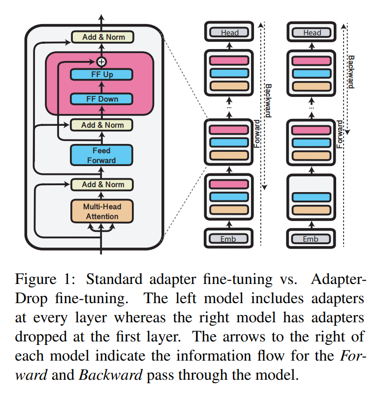
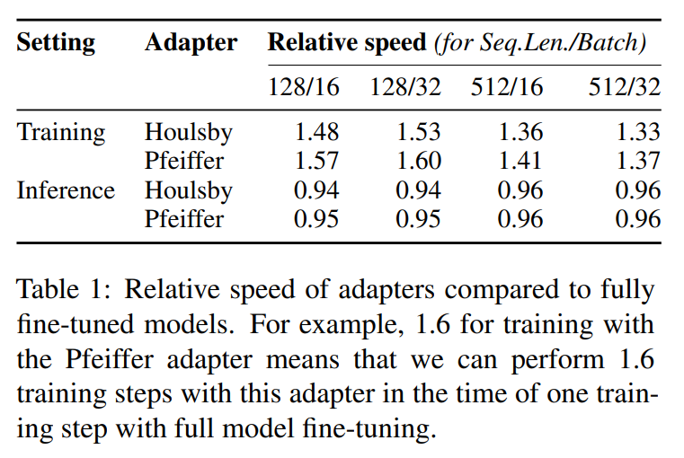
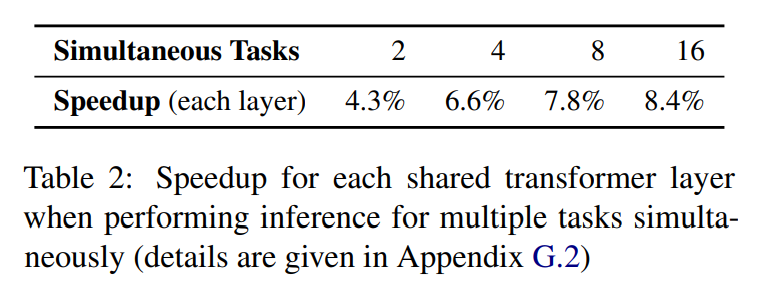
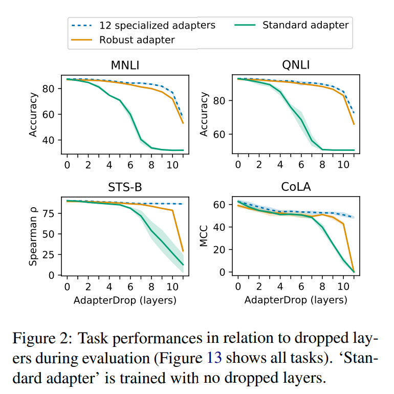
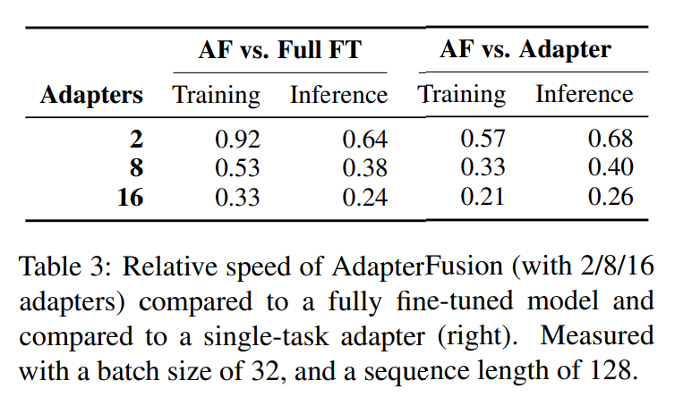
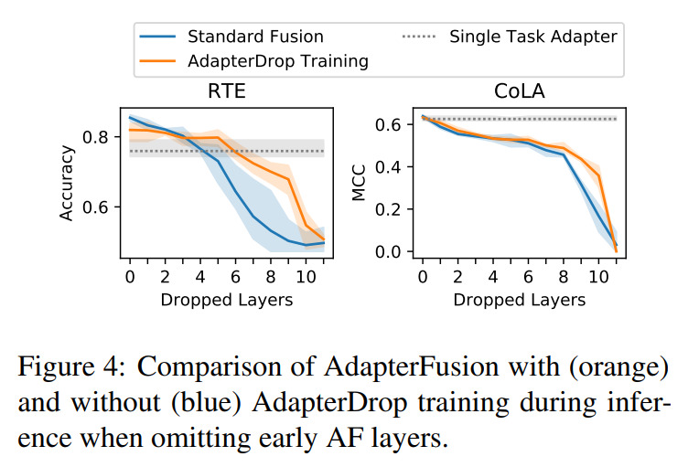
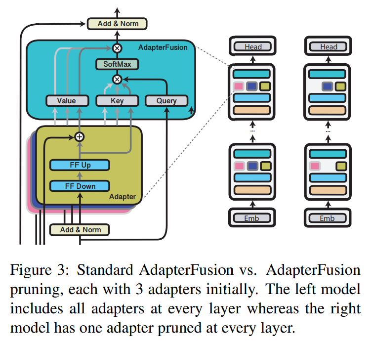
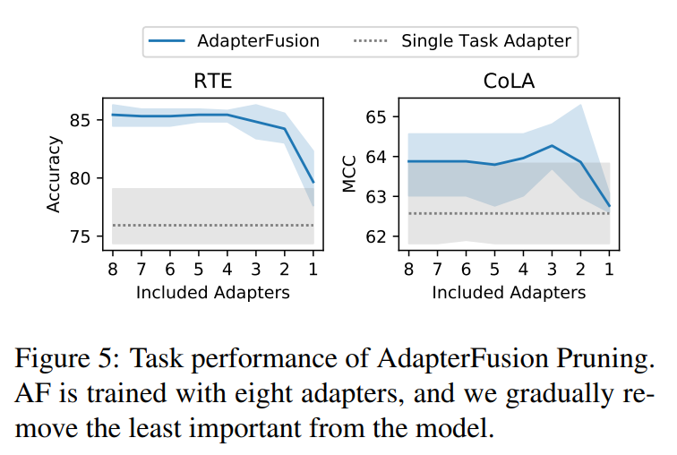

논문 및 이미지 출처 : <https://aclanthology.org/2021.emnlp-main.626.pdf>

# Abstract

Transformer model 은 fine-tuning 비용이 크고, inference 가 느리며, 저장 요구량이 크다. 최근 접근법들은 smaller model 을 학습하거나, model 크기를 동적으로 줄이거나, light-weight adapter 를 학습하는 방식으로 이러한 단점을 해결하고 있다. 

이 논문에서는 **AdapterDrop** 을 제안하는데, 이는 training 및 inference 중 transformer 의 lower layer 로부터 adapter 를 제거하는 방법이며, 위의 세 가지 방향의 개념을 모두 포함한다. 

저자는 AdapterDrop 이 여러 task 에 대해 동시에 inference 를 수행할 때 computational overhead 를 동적으로 줄일 수 있으며, task 성능 저하는 최소화된다는 것을 보인다. 더 나아가 AdapterFusion 에서 adapter 를 가지치기(prune)하여 inference efficiency 를 향상시키면서도 task 성능을 완전히 유지한다.

# 1 Introduction

Transfer learning 은 NLP task 를 해결하기 위한 주요 방법으로 자리잡았으나, transformer-based model 은 수백만에서 수십억 개의 parameter 를 요구할 정도로 매우 깊기 때문에 inference 가 느리고 저장 요구량이 크다. 이러한 단점을 해결하기 위해 최근 세 가지 독립적인 연구 흐름이 발전하였다.

1. smaller 및 faster model 로, distillation 되거나 처음부터 학습된 경우
2. run-time 에 model depth 를 줄여 inference time 을 동적으로 감소시키는 robust transformer
3. model 전체를 fine-tuning 하는 대신 각 layer 에 새로 도입된 weight 집합만 학습하여, task 간 대부분의 parameter 를 공유하는 adapter

Adapter 는 machine translation, cross-lingual transfer, community QA, transfer learning 을 위한 task composition 등 다양한 분야에서 잘 작동하는 것으로 나타났다. 그러나 adapter 의 최근 인기에 비해, parameter efficiency 외의 computational efficiency 는 탐구되지 않았다.

저자는 이 격차를 메우고 training 및 inference 시 두 가지 adapter architecture 의 computational efficiency 를 확립한다. 또한 앞서 언급한 세 가지 방향의 아이디어를 통합하여 adapter-based model 의 효율성을 더욱 향상시키는 다양한 전략을 탐구한다. 저자의 전략은 training 및 inference 시 transformer 로부터 adapter 를 dropout 하는 방식에 기반하며, 이를 통해 사용 가능한 계산 자원에 따라 동적으로 조정 가능한 model 을 얻는다. 또한 제안한 방법은 pre-trained transformer model (e.g., base, large) 에 독립적이므로 광범위하게 적용 가능하다.

**Contributions:**

1. Adapter 의 computational efficiency 를 full fine-tuning 과 비교하여 처음으로 확립한다. Adapter 의 training step 은 일반적인 hyperparameter 선택에서 full model fine-tuning 보다 최대 60% 빠르지만, inference 에서는 4–6% 더 느리다는 것을 보인다. 따라서 adapter 는 training 시간을 단축하려는 연구자나, 광범위한 hyperparameter tuning 이 필요한 상황에 적합하다.
2. AdapterDrop 을 제안한다. 이는 adapter 를 효율적이고 동적으로 제거하는 방법으로, task 성능에 미치는 영향은 최소화된다. Transformer 의 하위 layer 로부터 adapter 를 제거하면 multi-task setting 에서 inference 속도가 상당히 개선된다. 예를 들어, 처음 5 개 layer 에서 adapter 를 제거하면, AdapterDrop 은 8 개 task 를 동시에 inference 할 때 39% 더 빠르다. 이는 각 input 에 대해 여러 예측을 수행해야 하는 model 을 연구하는 데 유용하다.
3. AdapterFusion 에서 adapter composition 중 일부 adapter 를 prune 하고, transfer learning 이후 가장 중요한 adapter 만 유지하여 task 성능을 완전히 보존하면서도 inference 를 더 빠르게 수행한다. 이는 labeled training data 가 적은 상황에서 특히 적합하며, AdapterFusion 은 standard single task model 보다 충분한 개선을 달성할 수 있다.

# 2 Efficiency of Adapters

저자는 먼저 AdapterDrop 을 적용하지 않은 adapter 의 computational efficiency 를 확립한다. 

* Fig. 1 에 나타난 바와 같이, adapter 를 fine-tuning 할 때와 model 전체를 fine-tuning 할 때 forward pass 와 backward pass 에서 상당한 차이가 존재한다. 
* Forward pass 에서는 adapter 가 추가 요소로 인해 복잡성이 증가하지만, backward pass 에서는 전체 model 을 통해 backpropagation 할 필요가 없다. 
* 저자는 AdapterHub.ml framework 를 사용하여 full model fine-tuning 과 Houlsby et al. adapter, Pfeiffer et al. adapter (Fig. 1 에 나타남) 의 training 및 inference 속도를 비교하였다. 
* 측정은 BERT base 의 transformer configuration 으로 수행되었으며, 서로 다른 GPU 에서도 검증되었다.

Tab. 1 은 일반적인 실험 configuration 에 해당하는 측정값을 제공한다.

#### Training.

Adapter 는 full model fine-tuning 과 비교했을 때 상당히 빠를 수 있으며, 일부 configuration 에서는 최대 60% 빠르다. 두 adapter architecture 는 training efficiency 측면에서 큰 차이가 없으나, Pfeiffer adapter 는 구조가 더 단순하여 training step 이 약간 더 빠르다. 차이의 크기는 input size 에 따라 달라지며, 사용 가능한 CUDA core 가 주요한 병목 요소이다. Adapter 와 full fine-tuning 간에 training convergence 에서는 특별한 차이를 관찰하지 못했다.

Training 속도 향상은 gradient computation overhead 의 감소로 설명할 수 있다. Adapter 를 사용할 때 대부분의 parameter 가 고정(frozen)되며, 초반 component 를 통해 backpropagation 할 필요가 없다 (Fig. 1 참조).

#### Inference.

두 adapter architecture 는 fully fine-tuned model 대비 94–96% 속도를 보였으며, 이는 input size 에 따라 달라진다. 이는 대규모로 배포될 경우 상당한 영향을 미칠 수 있다.

# 3 AdapterDrop

저자는 adapter 가 training time 측면에서 더 효율적이라는 것을 확립했으나, 지속 가능하고 eefficient model 에 대한 필요성은 여전히 존재한다.

* 가능한 한 적은 layer 를 통해 backpropagation 하는 것은 adapter training 의 efficiency 를 더욱 향상시킨다. 
* Inference efficiency 는 여러 task 에 대해 동시에 inference 를 수행할 때 transformer 의 lower layer 에서 representation 을 공유함으로써 개선될 수 있다. 
* 즉, 동일한 input 에 대해 여러 개의 independent classification 을 수행하는 경우이다. 

Tab. 2 에서 확인된 바와 같이, 16 개 task 에 대해 layer 하나가 공유될 때마다 model 은 최대 8.4% 빨라졌다.

이러한 관찰에 동기화되어 저자는 AdapterDrop 을 제안한다. 

* 이는 transformer 의 lower layer 로부터 adapter 를 동적으로 제거하는 방법이며 (Fig. 1 참조), 전체 transformer layer 를 dropout 하는 방식과 유사하지만 adapter setting 에 특화된 방법이다. 
* lower layer 는 task performance 에 미치는 영향이 작다는 것이 일반적이기 때문이다.

저자는 AdapterDrop 의 두 가지 training 방법을 연구한다.

1. **Specialized AdapterDrop**: first $n$ 개 transformer layer 로부터 adapter 를 제거하며, $n$ 은 training 동안 고정된다. 이는 각 가능한 $n$ 에 대해 별도의 model 을 생성한다.
2. **Robust AdapterDrop**: 각 training batch 마다 integer $n$ 을 구간 $[0, 11]$ 에서 무작위로 추출한다. 이는 다양한 수의 dropped layer 에 적용 가능한 하나의 robust model 을 생성한다.

AdapterDrop 의 효과성은 RoBERTa base 를 사용하여 GLUE benchmark devset 에서 연구되었다. 

* Fig. 2 에 따르면, Specialized AdapterDrop 은 여러 layer 가 제거되더라도 좋은 성능을 유지한다. 
* first 5 개 layer 를 제거했을 때, Specialized AdapterDrop 은 original performance 97.1% 를 유지하였다 (8 GLUE task 평균, Tab. 8 참조). 
* 또한 Robust AdapterDrop 도 유사한 결과를 보였으며, 5 개 layer 가 제거되었을 때 original performance 95.4% 를 유지하였다. 
* Robust AdapterDrop 의 장점은 동적으로 확장 가능하다는 점이다. 
* 현재 사용 가능한 계산 자원에 따라 동일한 parameter 집합을 사용하면서 layer 를 활성화하거나 비활성화할 수 있다. 반면 Specialized AdapterDrop 은 각 setting 에 대해 별도로 학습해야 한다.
* 효율성 향상은 상당히 클 수 있다. 여러 task 에 대해 동시에 inference 를 수행할 때, 5 layers 가 제거되면 inference 속도는 동시에 수행되는 task 수에 따라 21–42% 빨라졌다 (Tab. 2). 
* Robust adapter 의 training 역시 더 효율적이며, training step 속도를 26% 향상시켰다.

# 4 Efficiency of AdapterFusion

AdapterFusion (AF) 은 여러 task 로부터 학습된 adapter 의 knowledge 를 활용하여, single target task 를 위해 adapter output representation 의 최적 조합을 학습한다 (Fig. 3 참조). 

* AF 는 특히 작은 training set 에서 적절한 model 을 학습하기 어려운 상황에 유용하다. 
* 그러나 AF 는 포함된 모든 adapter 를 순차적으로 거쳐야 하기 때문에 computational cost 가 크다.

Tab. 3 은 training 과 inference 모두에서 차이가 상당할 수 있음을 보여준다.

* 예를 들어, fully fine-tuned model 과 비교했을 때, 8 개 adapter 를 사용하는 AF 는 training 시 약 47% 느리고 inference 시 62% 느리다.

# 5 AdapterDrop for AdapterFusion

AF 의 효율성은 특히 inference 단계에서 개선할 잠재력이 크다. 저자는 AF 를 위한 AdapterDrop 의 두 가지 변형을 제안한다:

1. 전체 AF layer 제거
2. AF model 로부터 중요도가 낮은 adapter pruning

## 5.1 Removing AdapterFusion Layers

저자는 8 GLUE tasks 로부터 adapter 를 결합(fuse)하고, RTE 와 CoLA 에서 AF 의 가장 큰 성능 향상을 관찰하였다. 또한 §3 과 동일한 절차로 robust AF model 을 학습하였다. Test 시 몇 개의 하위 layer 로부터 AF 를 제거하더라도, AdapterDrop 없이 single-task adapter 보다 더 나은 성능을 유지할 수 있는지를 분석하였다.

* Fig. 4 는 RTE 에서 AF 가 first 5 개 layer 까지 AF 를 제거하더라도 single-task adapter 보다 더 나은 성능을 보임을 나타낸다. 
* 이는 inference 효율성을 26% 향상시킨다. 반면, CoLA 에서는 다른 경향을 보인다. 
* first layer 에서 AF 를 제거하면 성능 저하가 두드러지며, single-task adapter 보다 낮은 성능을 보인다. 이는 일부 linguistic task 가 초기 layer 의 정보에 크게 의존한다는 최근 연구와 일치한다.

따라서 AdapterDrop 은 모든 task 에 적합하지 않을 수 있음을 명확히 강조한다. 그러나 Fig. 13 은 CoLA 가 가장 극단적인 사례임을 보여준다. 그럼에도 불구하고, AdapterFusion layer 를 제거할 때는 성능과 효율성 간의 trade-off 가 존재하므로 신중할 필요가 있다.

## 5.2 AdapterFusion Pruning

AF 의 inference 효율성은 결합된 adapter 의 수에 크게 좌우된다 (Tab. 3 참조). 따라서 학습된 AF model 로부터 adapter 를 pruning 함으로써 효율성을 개선할 수 있다 (Fig. 3 참조).

* 저자의 가설은, adapter 가 AF 에 의해 자주 활성화되지 않는다면 output representation 에 크게 기여하지 않으므로 안전하게 제거할 수 있다는 것이다. 
* 각 fusion layer 에서 AF training set 의 모든 instance 를 사용하여 adapter activation 의 평균값, 즉 상대적 중요도를 기록한 후, activation 이 가장 낮은 adapter 를 제거한다.

Fig. 5 는 AF 의 대부분의 adapter 를 제거하더라도 task 성능에 영향을 주지 않음을 보여준다.

* 단 2 개 adapter 만 남겨도, 8 개 adapter 를 사용하는 full AF model 과 유사한 결과를 달성하며 inference 속도를 68% 향상시킨다. 
* 따라서 실제 배포 전에 AdapterFusion pruning 을 수행할 것을 권장한다. 이는 성능을 완전히 유지하면서도 효율성을 달성할 수 있는 간단하면서 효과적인 기법이다.

# 6 Conclusion

Adapter 는 full model fine-tuning 의 적절한 대안으로 부상했으며, 가장 널리 주장된 computational 이점은 smaller model 크기이다. 본 연구에서는 adapter 의 장점이 단순한 parameter efficiency 를 훨씬 넘어선다는 것을 보였다. 두 가지 일반적인 adapter architecture 는 저자의 확장 없이도 training step 이 최대 60% 더 빠르다. 그러나 이러한 개선은 inference 속도가 4–6% 느려지는 비용을 수반한다. 따라서 training 이 더 중요하다면, adapter 는 full model fine-tuning 보다 유리할 수 있다.

AdapterDrop 은 transformer 하위 layer 로부터 다양한 수의 adapter 를 제거함으로써 이러한 장점을 확장한다. Multi-task inference 수행 시 run-time computational overhead 를 동적으로 줄이면서 task 성능은 대부분 유지된다. 이는 하나의 input 에 대해 여러 독립적인 예측을 수행해야 하는 model 연구자들에게 도움이 된다.

마지막으로, 저자는 AdapterFusion model 의 computational efficiency 도 조사하였다. 전체 AdapterFusion layer 를 제거하면 성능과 효율성 사이의 상당한 trade-off 가 발생하였으나, 각 layer 에서 가장 적게 활성화된 adapter 를 pruning 하는 것은 성능을 완전히 유지하면서 model 효율성을 개선할 수 있었다.

저자는 본 연구가 널리 확장될 수 있으며, 효율적인 adapter-based model 을 얻기 위한 더 많은 방향이 존재한다고 믿는다. 예를 들어, 더 효율적인 pre-trained adapter 탐구, layer 간 adapter weight 공유, 학습 단계에서 AdapterFusion adapter pruning 등을 고려할 수 있다. 본 논문의 부록에서는 몇 가지 관련 아이디어에 대한 예비 결과를 제시하며, 이는 향후 연구의 출발점이 될 수 있다.

