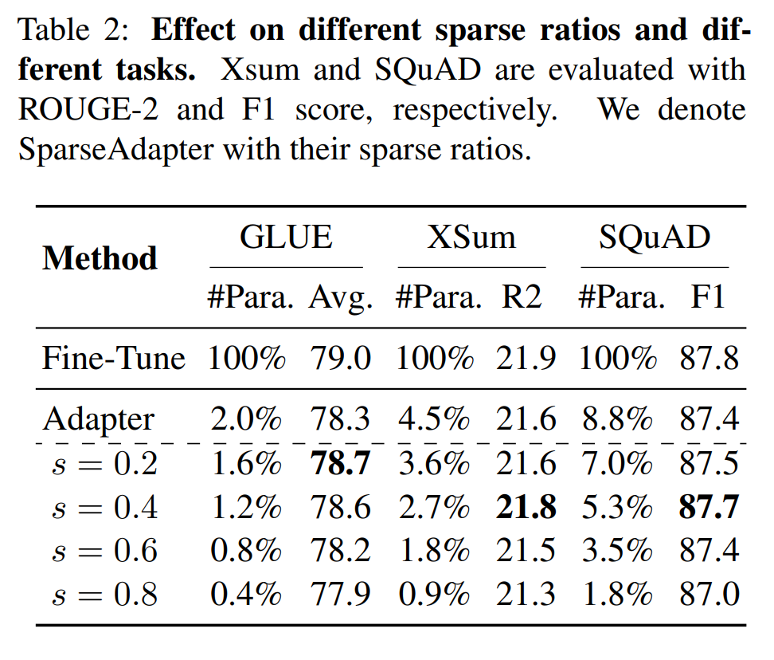

논문 및 이미지 출처 : <https://aclanthology.org/2022.findings-emnlp.160.pdf>

# Abstract

Adapter Tuning 은 pretrained language models (PLMs) 을 고정하고 few extra module 만 fine-tuning 하는 방법으로, full model fine-tuning 에 대한 매력적인 효율적 대안이 되었다. 계산 효율적이지만, 최근 adapters 는 full model fine-tuning 과의 성능을 맞추기 위해 parameters (e.g., bottleneck dimension) 를 증가시키는 경향이 있으며, 저자는 이것이 원래의 의도에 어긋난다고 본다. 

본 연구에서 저자는 network pruning 의 관점에서 adapters 의 parameter-efficiency 를 재검토하고 (이러한 plugin concept 을 **SparseAdapter** 라고 명명한다), sparse ratio 가 최대 80% 까지 도달할 때 SparseAdapter 가 standard adapters 와 비슷하거나 더 나은 performance 를 달성할 수 있음을 발견한다. 

이러한 발견을 바탕으로, 저자는 동일한 parameter budget 하에서 adapters 의 model capacity 를 향상시키기 위한 간단하지만 효과적인 setting **“Large-Sparse”** 를 소개한다. 

3 개의 advanced PLMs 위에서 5 개의 competitive adapters 를 대상으로 한 실험은, 적절한 sparse method (e.g., SNIP) 와 ratio (e.g., 40%) 를 사용할 때 SparseAdapter 가 해당 corresponding counterpart 를 일관되게 능가함을 보여준다. 고무적으로, Large-Sparse setting 으로 추가적인 유의미한 성능 향상을 달성하며, full fine-tuning 을 큰 폭으로 능가한다.

# 1 Introduction

“pretrain-finetune” paradigm 은 natural language processing (NLP) 커뮤니티에서 사실상의 표준이 되었다. pretrained language model (PLM) 이 주어졌을 때, 전통적인 fine-tuning 방식은 각 downstream task 마다 전체 parameters 를 조정하는 full fine-tuning 이다. 그러나 PLMs 의 크기가 점점 커짐에 따라 full fine-tuning 은 지나치게 비용이 커져 PLMs 의 광범위한 task 적용을 제한한다. 따라서 다양한 parameter-efficient fine-tuning 접근법이 탐구되었으며, 이 중 original PLM 을 고정한 채 추가적인 light-weighted module 만 조정하는 Adapter Tuning 은 큰 주목을 받았다.

그러나 기존 adapters 는 full fine-tuning 과 성능을 맞추기 위해 bottleneck dimension 을 증가시키는 경향이 있다. 이는 전체 parameters 와 FLOPs 를 증가시켜 adapters 의 본래 의도를 위반한다. 본 연구에서 저자는 adapters 의 본질적 속성인 parameter-efficiency 를 재검토하여 다음 질문에 답하고자 한다:

1. 현재 adapters 는 더 효율적으로 만들 수 있는가?
2. 동일한 parameter budget 내에서 adapters 의 representation capacity 를 어떻게 증가시킬 수 있는가?

이를 위해 저자는 adapters 의 parameter-efficiency 를 network pruning 의 관점에서 검토한다. network pruning 은 불필요한 parameters 를 제거하고 나머지를 학습시켜 neural networks 의 model size 를 줄이고 효율성을 개선한다. 저자는 이러한 pruned adapters 를 **SparseAdapter** 라고 명명한다.

* 구체적으로, Sec. 2.2 에서 다섯 가지 대표적인 pruning 방법을 체계적으로 조사하여 어떤 sparse ratio 에서 adapters 가 효과성을 유지할 수 있는지를 확인한다. 
* adapters 의 효율적 속성을 유지하기 위해 모든 adapters 는 initialization 시점에서 pruning 되어 추가적인 computation cost 가 발생하지 않도록 한다. 
* 실험 결과 SparseAdapter 는 sparse ratio 가 최대 80% 에 도달했을 때도 standard adapters 와 유사하거나 더 나은 performance 를 달성할 수 있음을 발견했다. 
* 이러한 고무적인 성능은 GLUE benchmark 에서 random pruning 방법을 사용했을 때조차 유지된다 (Fig. 2 참조).

이러한 통찰을 바탕으로 저자는 SparseAdapter 를 위한 매우 단순하지만 효과적인 setting 인 **Large-Sparse** 를 제안한다. 

* 즉, SparseAdapter 의 bottleneck dimension 을 확장하고 이에 상응하는 더 큰 sparse ratio 를 적용하여 (e.g., 2× dimension scaling 과 50% sparse ratio 조합으로 동일한 parameter budget 유지) model capacity 를 증강함으로써 성능을 크게 향상시킬 수 있음을 발견했다.

저자는 제안한 SparseAdapter 개념을 5 advanced adapters (Houlsby, Pfeiffer, LoRA, MAM Adapter, AdapterFusion) 에 대해 검증하였다. 이는 자연어 이해 (GLUE 와 SQuAD) 와 생성 (XSum) benchmark 를 모두 포함한다. 그 결과 적절한 sparsity (e.g., 40%) 를 적용할 경우 SparseAdapter 가 대응되는 baseline 들을 일관되게 능가함을 확인했다. 또한 Large-Sparse setting 에서는 SparseAdapter 가 full fine-tuning 을 크게 초월할 수 있음을 보여주었으며, Fig. 1 에서 예를 들어 79.6 대 79.0 의 성능 차이를 달성하였다.

# 2 Methodology

#### Motivation

Adapters 는 PLMs 에 삽입되는 bottleneck module 로, bottleneck dimension $r$ 과 model dimension $d$ 를 가진다. 표준 Adapter Tuning 에서는 adapter layer 만 학습 가능하고 original parameters 는 고정되며, trainable parameters 의 수가 adapters 의 capacity 를 결정한다. 일반적으로 capacity 를 확장하는 방법은 bottleneck dimension 을 증가시키는 것이지만, 이는 더 많은 computation cost 를 요구하여 adapters 의 본래 의도를 위반한다.

adapters 의 capacity 확장이 parameters 증가를 통해 이루어지는 것이 최적의 선택인지 확인하기 위해, 저자는 adapters 의 본질적 성질인 parameter efficiency 를 재검토하며 불필요한 parameters 를 pruning 한다. 

* Fig. 2 에서 보듯이, random 으로 pruning 된 adapters 도 표준 adapters 와 유사하거나 더 나은 성능을 달성할 수 있으며, 이는 불필요한 parameters 의 존재를 시사한다. 
* 이러한 comparable performance 는 sparsity 가 80% 에 달해도 유지될 수 있다. 
* 이러한 예비 연구는 저자로 하여금 연구 질문 1 과 2 를 심도 있게 탐구하도록 이끈다. 저자는 다양한 pruning 방법의 효과를 체계적으로 조사함으로써 접근하기로 한다.

## 2.1 Pruning Adapters at Initialization

* Fig. 3 에서 보듯이, 저자는 모든 parameters 를 직접 tuning (표준 Adapter Tuning) 하는 대신 불필요한 parameters 를 pruning 한 뒤 SparseAdapter 를 fine-tuning 하고자 한다. 
* initialization 시점에서 pruning 을 수행함으로써 불필요한 parameters 를 초기 단계에서 제거하여 반복적인 pruning 과정의 시간 소모를 피할 수 있다.

구체적으로, layer $l \in \{1, \cdots, L\}$ 에 삽입된 adapter 의 weights $w_l$ 을 고려하자. 이때 parameters 는 binary mask $m_l$ 에 의해 다음과 같이 pruning 된다: $\tilde{w}^l_i = w^l_i \odot m^l_i$

여기서 $\tilde{w}^l_i$ 는 pruning 된 parameter, $w^l_i$ 와 $m^l_i$ 는 각각 $w_l$ 과 $m_l$ 의 $i$ 번째 원소를 의미한다.

target sparsity $s$ 가 주어지면, 모든 parameter $w$ 에 score $z$ 를 할당하고, $z$ 가 임계값 $z_s$ (score 의 $s$ 번째 분위수) 이하인 parameters 를 제거한다. pruning 과정은 Algorithm 1 에 나타난다.

## 2.2 Pruning Methods

#### Random

Random pruning 은 각 parameter 에 대해 $z \sim Uniform(0,1)$ 의 random score 를 할당하고, score 가 가장 낮은 parameters 를 제거한다.

#### Magnitude

Magnitude pruning 은 각 parameter 의 크기를 score 로 설정한다: $z = |w|$. score 가 가장 낮은 parameters 를 제거한다. Magnitude pruning 은 학습 중 혹은 학습 후에 pruning 하는 표준 방식이다. 여기서는 Frankle et al. (2020) 을 따라 initialization 단계에서 magnitude pruning 을 적용한다.

#### Erdos-Rényi (ER)

Mocanu et al. (2018); Evci et al. (2020) 는 각 layer 를 random topology 로 설정하며, 큰 layer 에는 더 높은 sparsity, 작은 layer 에는 더 낮은 sparsity 를 부여한다. layer-wise sparsity 는 다음과 같이 비례한다: $1 - \frac{n_{in} + n_{out}}{n_{in} \cdot n_{out}}$

여기서 $n_{in}$ 과 $n_{out}$ 은 각각 input 과 output neurons 의 수이다.

#### SNIP

Lee et al. (2018) 은 학습 data 의 mini-batch 를 sampling 하여 각 layer 의 gradient $g_l$ 을 계산하고, score 를 $z_l = -w_l \odot g_l$ 로 할당한다. 그 후 가장 높은 score 를 가진 weights 를 한 번의 iteration 에서 제거한다. 이 방법은 loss 에 대한 영향(양수 또는 음수)이 가장 작은 weights 를 제거하는 방식이다.

#### GraSP

Wang et al. (2020) 은 각 layer 에 대해 Hessian-gradient product $h_l$ 을 계산하고, score 를 $z_l = -w_l \odot h_l$ 로 할당한다. 이후 가장 높은 score 를 가진 weights 를 한 번의 iteration 에서 제거한다. 이 방법은 gradient flow 를 감소시키는 weights 를 제거하고, gradient flow 를 증가시키는 weights 는 보존한다.

# 3 Experiments

#### Setup

실험은 세 가지 널리 사용되는 benchmark 에서 수행되었으며, 이해와 생성 task 를 모두 포함한다:

1. **GLUE**: natural language inference, sentiment analysis, sentence similarity evaluation 과 같은 이해 task 를 포함한다.
2. **XSum**: 주어진 기사에 대해 짧은 요약을 생성해야 하는 summarization dataset.
3. **SQuAD v1.1**: 질문과 Wikipedia 문단 쌍으로 구성된 dataset 으로, 모델이 문단에서 질문에 대한 answer span 을 선택해야 한다.

* Optimizer 로 Adam 을 사용하며 $(\beta_1, \beta_2) = (0.9, 0.98)$ 로 설정한다. 
* regularization 을 위해 weight decay 를 0.1 로 두고, learning rate 는 $\{1e^{-5}, 2e^{-5}, 5e^{-5}, 1e^{-4}, 2e^{-4}\}$ 범위에서 grid-search 하며, 전체 training step 의 처음 10% 동안 warm-up 한다. 
* data scale 에 따라 training epoch 은 $\{5, 10, 15, 20\}$, batch size 는 $\{8, 16, 32, 64\}$ 에서 grid-search 한다. 
* maximum length 는 GLUE 에서 512, SQuAD 에서 384 로 설정한다. 
* XSum 에서는 source article 의 max length 를 512, target summary 의 max length 를 128 로 설정한다.

GLUE benchmark 에 대해서는 이전 연구를 따라 BERT 와 RoBERTa 를 downstream training set 에서 fine-tuning 한 뒤, 마지막 checkpoint 를 사용해 dev set 결과를 보고한다. 다른 task 들에 대해서는 test 결과를 보고한다.

## 3.1 Results

#### SparseAdapters with Different Pruning Methods

Tab. 1 에서는 SparseAdapters (Rand., Mag., ER, SNIP, GraSP) 와 standard adapter (Houlsby Adapter) 를 GLUE benchmark 에서 비교하였다.

* backbone PLM 으로는 BERT 와 RoBERTa 를 사용하며, 모든 adapter layer 의 bottleneck dimension 은 64 로 설정한다. 
* Tab. 1 결과, 모든 SparseAdapters 는 Houlsby Adapter 와 비교하여 동등하거나 더 나은 성능을 달성하면서 계산 오버헤드는 더 낮다. 
* 특히 SNIP 기반 SparseAdapter 는 standard adapter 대비 최대 0.6% 평균 향상을 보이며 full fine-tuning 성능에 근접하였다. 따라서 이후 실험에서는 SNIP 기반 SparseAdapter 를 default 설정으로 사용한다.

#### Effect on Different Downstream Tasks

SNIP pruning 방법과 40% sparse ratio 를 적용하여 SparseAdapter 를 GLUE, XSum, SQuAD task 에 대해 검증하였다 (Tab. 2). 

* backbone 으로는 GLUE 에 RoBERTa-base, XSum 에 BART-large, SQuAD v1.1 에 BERT-base 를 사용하였다. 
* XSum 과 SQuAD 에서는 full fine-tuning 성능과 맞추기 위해 bottleneck dimension 을 각각 512 와 256 으로 설정하였다. 
* 결과적으로 SparseAdapter 는 세 가지 task 모두에서 standard adapters 를 능가하였으며, 그 보편성을 입증하였다.

#### Effect on Different Sparse Ratios

Tab. 2 에서는 SparseAdapter (Pfeiffer et al.) 의 sparse ratio 효과를 조사하였다. 

* backbone 으로 BERT-base 와 RoBERTa-base 를 사용하였다. 
* 실험 결과, sparse ratio $s \leq 40%$ 일 때 SparseAdapters 가 standard adapters 를 능가하며, sparse ratio 가 증가해도 안정적인 성능을 유지하였다. 
* 성능과 parameter trade-off 를 고려하여 본 연구에서는 sparse ratio 를 기본값으로 40% 로 설정한다.

#### Effect on Different Adapter Variants

SparseAdapter 는 어떤 adapter variants 와도 결합 가능하므로, Houlsby Adapter 외에 네 가지 추가 variants (Pfeiffer, LoRA, Mix-And-Match Adapters (MAM), AdapterFusion (AF)) 에 대해서도 효과성을 검증하였다. 

backbone 으로는 RoBERTa-base 를 사용하였다. GLUE benchmark 에서 MAM Adapters 관련 이전 연구를 따라, trainable parameters 를 feed-forward layer 의 adapters 와 attention layer 의 Prefix-Tuning 에 균등 분할하였다. 

SparseAdapter 는 trainable parameters 를 40% 줄이면서도 일관되게 accuracy 를 향상시켰으며, 저자의 plug-in 방식의 일반화를 입증하였다. 실험 결과는 Tab. 4 에 제시된다.

#### Augmenting SparseAdapter with Large-Sparse Setting

SparseAdapter 의 강점 중 하나는 동일한 parameter budget 하에서 큰 adapter (즉, 더 큰 sparse ratio 적용) 를 사용하여 capacity 를 증강할 수 있다는 점이다. 이를 Large-Sparse setting 이라고 한다. 

이를 검증하기 위해, bottleneck dimension 을 $\{2\times, 3\times, 4\times\}$ 로 확장하고, 이에 대응하는 sparse ratio 를 $\{50\%, 67\%, 75\%\}$ 로 설정하였다. 

* Tab. 3 결과, parameter 수를 동일하게 유지하면서도 bottleneck dimension 이 커질수록 Large-Sparse setting 은 일관되게 성능을 향상시켰으며, standard adapter 대비 +1.3%, full fine-tuning 대비 +0.6% 평균 향상을 달성하였다.

추가적으로, Fig. 4 에서 Large-Sparse setting 을 적용한 SparseAdapters 와 standard adapters 의 training convergence 속도를 비교하였다.

* SparseAdapters 는 동일한 training 진행 비율에서 성능 우위를 유지하며 최소 25% 더 빠르게 수렴하였다. 
* 두 task 모두에서 Large-Sparse setting 은 더 빠른 수렴 속도와 더 높은 성능을 제공하였다.

# 4 Conclusion

본 연구에서는 network pruning 관점에서 Adapter Tuning 의 parameter efficiency 특성을 체계적으로 재검토하였다. 이를 바탕으로, 기존 adapters 에 적용 가능한 plug-in 전략인 SparseAdapter 를 제안하였다. 실험적 연구 결과, SparseAdapter (특히 Large-Sparse setting 적용 시) 는 NLP 커뮤니티에서 효율적인 transfer learning 의 사실상 표준 전략으로 자리잡을 가능성을 보여주었다.

향후 연구로는 저자가 제안한 SparseAdapter 를 multilingual PLM 기반 machine translation 등 더 많은 task 와 benchmark 에 적용하고, neural network 의 다른 모델들에 대한 parameter efficiency 를 탐구하는 것을 계획한다. 특히 높은 효율성이 요구되는 Prompt 기반 방법론과 같은 시나리오에서의 적용 가능성을 조사할 예정이다.

