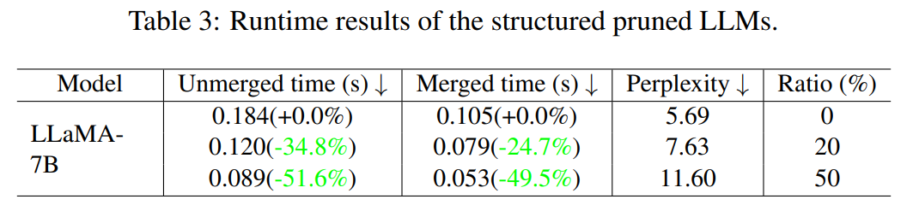

논문 및 이미지 출처 : <https://aclanthology.org/2024.findings-acl.178.pdf>

# Abstract

Large Language Models (LLMs) 인 LLaMA 와 T5 는 finetuning 을 통해 다양한 task 에서 뛰어난 성능을 보여왔다. Low-rank adaption (LoRA) 가 이러한 LLM 들을 downstream task 에 저비용으로 fine-tune 하는 방법으로 등장했지만, 여전히 거대한 model scale 과 computation cost 때문에 실제 배포에는 제약이 따른다. 

Post-training model pruning 은 LLM 을 압축하는 방법을 제공한다. 그러나 현재 LLM 을 위한 pruning 방법들은 LoRA 와 호환되지 않는다. 이는 기존 방법이 LLM 에 대해 unstructured pruning 을 사용하여 LoRA weight 의 병합을 방해하거나, pruning 을 위해 pre-trained weight 의 gradient 에 의존하여 상당한 memory overhead 를 발생시키기 때문이다.

이를 해결하기 위해 저자는 LoRAPrune 이라는 새로운 framework 을 제안한다. LoRAPrune 은 높은 memory 효율성을 유지하면서 정확한 structured pruned model 을 제공한다. 구체적으로, 저자는 LoRA weight 와 gradient 를 활용하여 pre-trained weight 의 gradient 가 아닌 LoRA 기반의 pruning criterion 을 설계하고, 이를 iterative pruning 과정에 통합하여 불필요한 channel 과 head 를 효과적으로 제거한다.

광범위한 실험 결과는 LLaMA 계열 model 에서 LoRAPrune 이 기존 접근법보다 우수한 성능을 보임을 입증한다. 50% compression rate 에서 LoRAPrune 은 LLM-Pruner 보다 우수한 성능을 달성했으며, WikiText2 에서 perplexity 를 4.81, PTB 에서 3.46 감소시키고 memory 사용량을 52.6% 줄였다. 또한 LoRAPrune 은 다양한 LLM 에서 semi-structural pruning 과 동등한 성능을 보여 그 범용성을 입증한다.

# 1 Introduction

Large Language Models (LLMs) 은 다양한 task 에서 뛰어난 성능을 보여주며 강력한 능력을 입증했다. LLM 이 specific task, 예를 들어 chat-bot 과 같은 응용을 수행하도록 하기 위해서는 downstream dataset 에 대해 효율적으로 fine-tuning 되는 경우가 많다. 이를 위해 parameter-efficient fine-tuning (PEFT) 방법들이 제안되었으며, 그중에서도 LoRA 기반 fine-tuning 방법은 널리 사용되고 있다. 그러나 LLM 의 성공은 거대한 scale 과 막대한 computation cost 에 의해 deployment 가 어렵다는 문제와 함께 나타난다.

Neural network pruning 은 널리 사용되는 model compression 기법으로, model 크기와 복잡성을 크게 줄일 수 있다. 최근 post-training pruning 연구에서는 SparseGPT 와 WANDA 와 같은 기법이 높은 성능의 unstructured sparse LLM 을 달성했다. 하지만 unstructured sparse model 은 두 가지 중요한 문제에 직면한다.

1. Unstructured sparse model 은 직접적인 inference 속도 향상을 얻기 어렵다. 충분한 가속 효과를 얻기 위해서는 특수한 hardware 지원이 필요하며, 이는 CPU, DSP, GPU 와 같은 기존 off-the-shelf platform 에서 unstructured pruning 의 이점을 활용하지 못하게 한다.
2. Unstructured sparse model 은 LoRA 와 호환되지 않는다. Fig. 1 (a) 에서 보이는 것처럼, LoRA 가 생성하는 weight $BA$ 는 dense 하므로 이를 unstructured sparse weight 와 병합하는 데 어려움이 따른다. 예를 들어, LoRA 를 병합하지 않을 경우 inference 시간이 약 54% 증가하여 pruning 의 이점을 감소시킨다 (Tab. 3 참조).

하나의 잠재적 해결책은 downstream task 에 대해 LoRA 로 fine-tuning 을 먼저 수행한 뒤 post-training pruning 을 적용하는 것이다. 그러나 tuning 과 pruning 을 분리하면 sub-optimal 한 결과를 초래할 수 있다. 

이를 해결하기 위해 PST 는 unstructured pruning 과 efficient fine-tuning 을 결합하여 LoRA 와 pre-trained weight 를 동시에 pruning 한다. 이 방법은 LoRA weight 의 seamless merge 를 보장하고, LoRA 로 인해 발생하는 추가적인 computation overhead 를 방지한다. 그러나 LoRA 의 unstructured pruning 은 먼저 $BA$ 를 계산한 후 binary mask $M$ 과의 Hadamard product 를 수행해야 하므로 상당한 memory overhead 를 유발한다 (Tab. 1 참조). $BA$ 와 $M$ 은 pre-trained weight 와 동일한 shape 을 가지므로, 예를 들어 LLaMA-65b 를 pruning 할 경우 중간 변수만으로도 NVIDIA A100 (80G) GPU 3 개의 저장 용량이 필요하다. 이는 PST 를 LLM 에 적용할 때 심각한 memory 문제를 야기한다.

반대로 structured pruning 은 LoRA 의 $BA$ 를 저장하지 않고 $A$ 의 structured weight 를 직접적으로 pruning 할 수 있으므로 이러한 문제를 완화할 수 있다. 따라서 LoRA 와 structured pruning 을 결합하여 PEFT 와 일반 hardware platform 에서의 직접적인 가속을 동시에 달성하는 것은 매우 중요한 과제이다.

저자는 LoRA 와 structured pruning 을 통합한 framework 인 **LoRAPrune** 을 제안한다. 

* Fig. 1 (c) 에서 보이는 것처럼, LoRAPrune 은 pre-trained model weight $W_0$ 에서 head, channel 과 같은 structured weight 를 pruning 할 뿐만 아니라 $BA$ 를 먼저 계산하지 않고 LoRA weight $A$ 의 대응되는 weight 도 함께 잘라낸다. 
* 따라서 pruning 과 fine-tuning 이후 LoRA weight 를 pre-trained weight 와 무리 없이 병합할 수 있으며, inference 시 추가적인 computation 이 전혀 필요하지 않다.

Structured pruning 방법에서 자주 사용하는 criterion 은 Fig. 1 (b) 와 같이 gradient 혹은 그 변형을 통해 structural importance 를 추정한다. 그러나 LoRA 는 일반적으로 pre-trained weight 를 고정하고 그 gradient 를 계산하지 않기 때문에, pre-trained weight 의 gradient 에 의존하는 기존 pruning 접근법은 직접 적용할 수 없다. 이에 따라 LoRAPrune 은 오직 LoRA 의 gradient 만을 활용하는 새로운 criterion 을 도입한다. LoRAPrune 은 pre-trained weight 의 gradient 를 직접 계산하지 않고도 LoRA 의 gradient 를 근사치로 사용하여 중요도를 추정한다.

* 이 criterion 을 기반으로 LoRAPrune 은 pruning 과 동시에 efficient fine-tuning 을 수행하여 pruning 된 LLM 의 성능을 복원할 수 있으며, 이 과정에서 small calibration set 만 필요하다. 
* 구체적으로, 각 data batch 마다 importance 를 계산하고 moving average 를 사용하여 importance 를 업데이트한다. 
* 그리고 일정한 iteration 마다 중요하지 않은 structured weight 일부를 제거하며, 원하는 sparsity 수준에 도달할 때까지 이를 반복한다.

다양한 benchmark dataset 과 여러 scale 의 LLM 에 대한 광범위한 실험을 통해, LoRAPrune 이 LLM 을 위한 기존 structured pruning 기법보다 일관되게 더 나은 성능을 보임을 확인했다. 또한 기존 gradient-guided pruning 과 비교했을 때 LoRAPrune 은 memory 와 computation overhead 를 크게 줄여, 단일 GPU 에서 LLaMA-65b 를 동시에 pruning 과 fine-tuning 하는 것이 가능하다.

이 논문의 주요 contribution 은 다음과 같다.

* 저자는 LLM 을 위한 새로운 memory-efficient pruning criterion 인 **LoRA-guided criterion** 을 도입한다. 이는 LoRA 와 무리 없이 통합되며, LoRA 의 gradient 를 활용해 pre-trained weight 의 gradient 를 직접 계산하지 않고도 중요도를 효율적으로 근사할 수 있다.
* LoRA 를 통해 gradient 를 효율적으로 근사하고 weight 를 업데이트할 수 있으므로, LoRAPrune 은 iterative structured pruning 을 가능하게 하며 정확한 small model 을 얻는다. 이 framework 은 pruning 시 높은 memory 효율성을 보장하며 inference 효율성도 확보한다.
* LLaMA model 에 대한 pruning 실험은 LoRAPrune 이 최대 650 억 개의 weight 를 가진 model 에 대해서도 단일 GPU 로 structured pruning 을 효율적으로 수행할 수 있음을 보여준다. 또한 LoRAPrune 이 달성한 pruning 결과는 기존 방법들을 크게 능가한다. 
  * 예를 들어, LLM-Pruner 대비 LoRAPrune 은 52.6% 의 memory 만 사용하면서 WikiText2 에서 perplexity 를 4.81, PTB 에서 3.46 낮추는 성능을 보였다. 또한 LoRAPrune 은 다양한 LLM 에서 semi-structural pruning 과 동등한 성능을 보여 그 범용성을 입증한다.

# 2 Related Work

#### Parameter-efficient fine-tuning

PEFT 방법은 학계와 산업계 모두에서 점점 더 많은 주목을 받고 있다. 이 중 LoRA 는 각 layer 에 trainable low-rank decomposition matrix 를 주입하여 pre-trained weight 에 병합할 수 있도록 하며, inference 시 additional computation 을 피할 수 있다. 이러한 inference efficiency 덕분에 LoRA 기반의 다양한 방법들이 등장했다.

* LongLoRA 는 long context 에 대해 효율적으로 LLM 을 fine-tuning 할 수 있도록 LoRA 를 확장했다.
* AnimateDiff 는 LoRA 를 고정된 text-to-image model 에 삽입하여 personalized generator 를 얻었다.
* QLoRA 는 pre-trained weight 를 4-bit 으로 quantization 한 뒤 LoRA 를 적용하여 downstream task 에서 효율적인 memory 사용을 유지하면서 LLM 을 fine-tuning 한다.

따라서 LoRA 는 LLM 의 fine-tuning 에 있어 필수적이다. 저자의 방법은 LoRA 와 pruning 을 매끄럽게 통합하였으며, LoRA 기반의 다른 PEFT 방법으로도 손쉽게 확장될 수 있다.

#### Neural network pruning

LLM 에서 중요하지 않은 weight 를 제거하여 memory 와 computation cost 를 줄이는 것은 model compression 의 일반적인 접근법이다.

* **Unstructured pruning** 은 neuron 을 직접 잘라내어 높은 압축률을 얻을 수 있지만, unstructured sparsity 가 발생하여 deployment 가 어렵다.
* **Structured pruning** 은 head, channel 과 같은 그룹 단위의 parameter 를 직접 제거하여 deployment 친화적인 구조를 남긴다. 그러나 structured pruning 은 성능 회복을 위해 광범위한 finetuning 이 필요하다. 
  * 예를 들어, Xia et al. 은 pruning 된 model 을 계속 pretraining 하기 위해 500 억 개의 token 을 사용했는데, 이는 hardware 자원 측면에서 매우 비용이 크다.

이에 비해 저자의 방법은 structured pruning 을 활용하여 직접적인 inference 가속을 가능하게 하면서도 training cost 를 수용 가능한 수준으로 유지한다.

#### Pruning criterion

Network 내에서 weight 의 중요도를 결정하는 문제는 여전히 열린 과제이다.

* 일반적인 접근은 parameter magnitude 를 pruning criterion 으로 사용하는 것이다. 하지만 small weights 도 neural network 의 복잡한 구조 때문에 model output 에 큰 영향을 줄 수 있고, 큰 weight 가 반드시 중요한 것은 아닐 수 있다.
* 이에 따라 많은 방법이 Taylor expansion 을 사용하여 pruning 으로 인한 error 를 근사하고 이를 importance estimation 의 criterion 으로 사용한다. Hessian matrix 또는 Hessian inverse 를 계산하지 않기 위해, 일부 방법은 Taylor expansion 의 1차 항만 사용한다.
* LLM-Pruner 또한 1차 항 기반 pruning 을 사용하여 LLM 으로 pruning 기법을 확장했다. 그러나 Taylor expansion 의 1차 항 역시 pre-trained weight 의 gradient 가 필요하다. Tab. 1 에서 보이는 것처럼 pre-trained weight 의 gradient 를 계산하고 저장하는 것은 pruning cost 를 크게 증가시킨다.

이를 피하기 위해 PST 는 LoRA 에서 착안하여 pre-trained weight 의 gradient 를 추가적인 low-rank matrix 로 학습한다. 그러나 PST 는 unstructured pruning 을 수행하고, 매 forward pass 마다 pre-trained weight 와 동일한 shape 의 대규모 mask 를 계산해야 하므로 memory-intensive 하며 LLM 에 적용하기 어렵다.

저자의 criterion 은 LLM-Pruner 와 PST 와 달리 오직 LoRA 의 gradient 에만 의존하며, 비용이 큰 mask computation 이 필요하지 않아 memory-efficient 하다.

# 3 Method

## 3.1 Preliminary

이 절에서는 본 논문에서 사용되는 표기법을 정의한다. 굵은 글자는 matrix 와 vector 를 나타내고, 소문자는 scalar 를 의미한다. “Subscript” 는 matrix 내 요소의 index 를, “Superscript” 는 network 내 layer 의 index 를 나타낸다.

#### Low-rank adaptation

LLM 을 효율적으로 fine-tuning 하기 위해 low-rank adapter 인 LoRA 는 model parameter 의 update 를 제한하여 low intrinsic rank 를 유지한다. Fine-tuning 동안 pre-trained weight 는 고정되어 gradient 계산을 수행하지 않고, 삽입된 LoRA 만 학습 가능하게 둔다.

two low-rank matrices $A \in \mathbb{R}^{r \times k}$ 와 $B \in \mathbb{R}^{d \times r}$ ($r \ll \min(d, k)$) 가 주어졌을 때, linear module 의 update 는 다음과 같이 표현된다.

$$
z = xW_0 + xBA, \tag{1}
$$

* 여기서 $W_0 \in \mathbb{R}^{d \times k}$, $z \in \mathbb{R}^{n \times k}$, $x \in \mathbb{R}^{n \times d}$ 는 각각 pre-trained weight, output, input 을 나타낸다. 
* Adaption 이후 새로운 weight $W$ 는 $W = W_0 + BA$ 로 re-parameterization 된다.

#### Pruning with Taylor expansion

Vanilla pruning 접근법에서 weight $W_{i,j} \in W_0$ 의 중요도는 해당 weight 를 제거했을 때 loss 에 미치는 영향으로 측정할 수 있다. Input $x$ 와 ground-truth prediction $y$ 가 주어졌을 때, $W_{i,j}$ 의 제거로 인한 error 는 다음과 같이 표현된다.

$$
I_{i,j} = \big[ \mathcal{L}(x, y, W_0) - \mathcal{L}(x, y, W_0 | W_{i,j} = 0) \big]^2. \tag{2}
$$

* 각 weight 에 대해 $I_{i,j}$ 를 계산하는 것은 computation cost 가 크다. 따라서 Taylor expansion 을 사용하여 중요도를 근사할 수 있다. 
* First-order Taylor expansion 을 적용하면, 중요도의 근사치는 다음과 같이 표현된다.

$$
\hat{I}_{i,j} = \left( \frac{\partial \mathcal{L}}{\partial W_{i,j}} W_{i,j} \right)^2. \tag{3}
$$

#### Dependency-aware structured pruning

Structured pruning 에서는 pruning 되는 neuron 이 다른 neuron 과의 상호 연결 때문에 dependency 를 가질 수 있음을 고려해야 한다. Weight 간 dependency 는 Fig. 5 에 나타나 있다.

저자는 연결된 weight 를 group 으로 구성하고, 동일 group 내 weight 중요도를 합산하여 group importance 를 추정한다. Formal 하게, $g$-th group 의 중요도는 다음과 같이 정의된다.

$$
\hat{\mathcal{G}}_g = \sum_{W_{i,j} \in \mathbb{G}} \hat{I}_{i,j}, \tag{4}
$$

* 여기서 $\hat{\mathcal{G}} \in \mathbb{R}^{1 \times G}$ 는 group 의 중요도를 나타내고, 
* $G$ 는 하나의 group 내 weight 의 집합, 
* $G$ 는 layer 내 candidate group 의 개수를 의미한다.

## 3.2 Pruning with Low-rank Adaption

#### Motivation

highly-compressed LLM 을 달성하기 위해서는 pre-trained weight 의 중요도를 정확하게 평가하는 것이 필수적이다. 이를 위한 핵심 접근은 Eq. (3) 의 criterion 을 활용하는 것이다. 그러나 LLM 에서 $W_0$ 의 gradient 를 얻는 것은 막대한 연산 자원과 저장 공간이 필요하기 때문에 어렵다. 

반면 LoRA 를 활용한 LLM fine-tuning 이 보편화되고 있으며, 이 과정에서 LoRA 의 weight gradient 만 계산되므로 연산 및 memory 효율성이 매우 높다. 따라서 LoRA 의 weight 와 gradient 만으로 pre-trained weight 의 중요도를 정확히 추정할 수 있는가라는 질문이 생긴다.

#### LoRA-guided criterion

본 연구에서는 downstream task adaption 시 learnable matrix $A$ 와 $B$ 를 삽입하여 $W_0$ 의 중요도를 추정하는 방법을 논의한다.

핵심 아이디어는, $W_0$ 의 요소 $W_{i,j}$ 가 제거될 경우 $(BA)^{i,j} = -W^{i,j}$ 로 설정하는 것이다. 이때 각 parameter 의 중요도는 Eq. (2) 를 다음과 같이 다시 표현할 수 있다.

$$
I_{i,j} = \big[\mathcal{L}(x, y, W) - \mathcal{L}(x, y, W \, | \, (BA)_{i,j} = -W_{i,j})\big]^2. \tag{5}
$$

First-order Taylor expansion 을 적용하여 Eq. (5) 를 근사하면, $W_{i,j}$ 의 중요도 추정값 $\hat{I}_{i,j}$ 는 다음과 같이 표현된다.

$$
\hat{I}_{i,j} = \left[ \frac{\partial \mathcal{L}}{\partial (BA)_{i,j}} \, \big( (BA)_{i,j} + W_{i,j} \big) \right]^2. \tag{6}
$$

* 그러나 Eq. (1) 에서 보이듯이 LoRA 의 연산 순서는 $B$ 를 곱한 후 $A$ 를 곱하는 구조이므로, forward/backward pass 중에 $BA$ 를 직접 얻을 수 없다. 
* 또한 $\frac{\partial \mathcal{L}}{\partial (BA)^{i,j}}$ 를 보존하는 것은 $BA$ 가 $W_0$ 와 동일한 shape 을 가지기 때문에 결국 $\frac{\partial \mathcal{L}}{\partial W^{i,j}}$ 와 동일한 복잡성을 유발한다.
* 이를 해결하기 위해 저자는 two low-rank matrices $A$ 와 $B$ 의 gradient 만 저장 및 사용하여 $\frac{\partial \mathcal{L}}{\partial (BA)}$ 를 근사한다. 
* $(BA)_{i,j}|_{t} = (BA)_{i,j}|_{t-1} - \eta \frac{\partial \mathcal{L}}{\partial (BA)_{i,j}}$ 의 gradient update 를 추정할 수 있으며,
  * 여기서 $(BA)_{i,j}|_{t}$ 및 $(BA)_{i,j}|_{t-1}$ 은 각각 $t$-th 및 $t-1$ 의 $(BA)_{i,j}$ 이다. 
* 외관상으론 $\eta \frac{\partial \mathcal{L}}{\partial (BA)_{i,j}}$ 은 $BA$ 변화량과 동일하며, 다음과 같이 전개할 수 있다.

$$
\eta \frac{\partial \mathcal{L}}{\partial (BA)_{i,j}} = [(BA)_{i,j}|_{t-1} - (BA)_{i,j}|_{t}].
$$

- 여기서,  $(BA)_{i,j}|_{t} = B_{i,:}|_{t}A_{:,j}|_{t}$ 은 $B_{}|_{t}$ 의 $i$-th row 및 $A_{}|_{t}$ 의 $j$-th column 의 곱으로 생성된다.
- 위 가정으로, $\eta\frac{\partial\mathcal{L}}{\partial A_{:,j}} = A_{:,j}|_{t-1} - A_{:,j}|_t$ 및 $\eta\frac{\partial\mathcal{L}}{\partial B_{i,:}} = B_{i,:}|_{t-1} - B_{i,:}|_t$ 을 각각 추정할 수 있다.
- 게다가, $A_{:,j}|_t = A_{:,j}|_{t-1} - \eta\frac{\partial\mathcal{L}}{\partial A_{:,j}}$ 및 $B_{i,:}|_t = B_{i,:}|_{t-1}-\eta\frac{\partial\mathcal{L}}{\partial B_{i,:}}$ 를 얻을 수 있다.
- 이를 계산하면

$$
(BA)_{i,j}|_t = B_{i,:}|_tA_{:,j}|_t = (B_{i,:}|_{t-1} - \eta \frac{\partial \mathcal{L}}{\partial B_{i,:}})(A_{:,j}|_{t-1} - \eta \frac{\partial \mathcal{L}}{\partial A_{:,j}}). \tag{8}
$$

$(BA)_{i,j}|_t$ 를 Eq. 8 에서 이를 Eq. 7 을 대입하면,

$$
\frac{\partial \mathcal{L}}{\partial (BA)_{i,j}} = [\frac{\partial \mathcal{L}}{\partial B_{i,:}} A_{:,j}|_{t-1} + B_{i,:}|_{t-1} \frac{\partial \mathcal{L}}{\partial A_{:,j}} - \eta \frac{\partial \mathcal{L}}{\partial B_{i,:}} \frac{\partial \mathcal{L}}{\partial A_{:,j}}. \tag{9}
$$

단순화를 위해 learning rate $\eta = 1$ 로 설정하면, Eq. 9 에서 Eq. 6 을 대입하여 gradient-based manner 의 중요도를 얻는다.

$$
\hat{I}_{i,j} = [(\frac{\partial\mathcal{L}}{\partial B_{i,:}}A_{:,j} + B_{i,:} \frac{\partial\mathcal{L}}{\partial A_{:,j}} - \frac{\partial\mathcal{L}}{\partial B_{i,:}}\frac{\partial\mathcal{L}}{\partial A_{:,j}} )(W_{i,j}+(BA)_{i,j})]^2. \tag{10}
$$

Fig. 2 에서 보이는 것처럼, **LoRA-guided criterion** 은 Eq. (10) 의 근사를 통해 $A$ 와 $B$ 의 gradient 만 계산하면 되므로 pre-trained weight $W_0$ 의 gradient 를 계산하는 경우보다 memory 와 computation 이 크게 절약된다.

#### Progressive pruning

Structured pruning 을 위한 group importance 를 효율적으로 계산하기 위해 Eq. 10 을 Eq. 4 에 대입할 수 있다. 그러나 single batch data 로 중요도를 추정하고 weight 를 pruning 하면 심각한 bias 와 성능 저하가 발생할 수 있다. 이를 완화하기 위해 moving average 를 적용하여 group importance $\mathcal{G}$ 를 평가하고, 덜 중요한 group 을 점진적으로 제거한다.

구체적으로, $t$-th iteration 에서 group importance 는 다음과 같이 계산된다.

$$
\bar{\mathcal{G}}|_t = \lambda \bar{\mathcal{G}}|_{t-1} + (1 - \lambda) \hat{\mathcal{G}}|_t, \tag{11}
$$

* 여기서 $\bar{\mathcal{G}}|_t$ 는 $t$-th iteration 에서 Eq. (10) 과 Eq. (4) 를 통해 계산된 group importance 점수이며, 
* $\lambda \in [0,1]$ 은 과거 통계와 현재 통계 간의 중요도를 조절한다. 이를 통해 각 group 의 중요도를 효율적이고 정확하게 추정할 수 있다. 
* 이후 중요도가 낮은 group 은 pruning 하며, 이를 위해 각 pruned layer 에 대해 binary mask $M \in {0,1}^{1 \times G}$ 를 설정한다. 
* Binary mask $M$ 은 다음과 같이 정의된다.

$$
M_g = 
\begin{cases} 
1 & \bar{\mathcal{G}}_g > p \\
0 & \bar{\mathcal{G}}_g \leq p
\end{cases}, \tag{12}
$$

* 여기서 $g \in \{1, \dots, G\}$ 는 layer 내 $g$-th group 의 index 이고, 
* $p$ 는 중요도의 threshold 를 의미한다. Threshold 이하의 group 은 pruning 된다.

Mask 가 설정된 이후 각 pruned layer 의 forward 과정은 다음과 같이 표현된다.

$$
z = (xW_0 + xBA) \odot M, \tag{13}
$$

* 여기서 $\odot$ 는 Hardamard product 를 의미하며, broadcast 로 계산할 수 있다.

LoRAPrune 의 전체 알고리즘은 Algorithm 1 에 제시된다.

# 4 Experiments

## 4.1 Experimental Setup

#### Models and metrics

저자의 방법은 LLaMA-1 model family (LLaMA-7B, LLaMA-13B, LLaMA-30B, LLaMA-65B) 에 적용된다. 평가 metric 으로는 WikiText 와 PTB dataset 에 대해 perplexity 를 측정한다. 또한 LLaMA 의 설정을 따라 zero-shot 능력을 평가하기 위해 commonsense reasoning dataset 인 PIQA, HellaSwag, WinoGrande, ARC-easy, ARC-challenge, OpenbookQA 에 대해 zero-shot task classification 을 수행한다. In-context learning 능력은 MMLU dataset 에 대해 5-shot setting 으로 평가한다.

#### Implementation details

LoRAPrune 은 single-shot 방법과 post-training recovery fine-tuning 방법 모두로 실험된다. 

* LLaMA-7B 의 경우 LaMini instruction dataset 으로 iterative pruning 을 수행하고, LLaMA-13B, LLaMA-30B, LLaMA-65B 는 C4 dataset 에서 20k sample 을 추출하여 사용한다. 
* Training configuration 은 batch size 128, learning rate $1e-4$, 총 2 epoch 으로 설정된다. 
* Pre-trained weight 는 고정되므로 memory 절약을 위해 8-bit quantization 옵션을 사용할 수 있다. 
* 모든 model 은 cosine learning rate decay 를 사용하는 AdamW optimizer 로 최적화된다.

#### Contenders

LoRAPrune 은 fine-tuning 여부와 관계없이 다음 pruning 방법들과 비교된다.

* **Magnitude Pruning**: model weight 의 절댓값 기반 pruning.
* **LLM-Pruner**: Eq. (3) 의 criterion 을 사용하는 pruning 방법.
* **WANDA**: input feature 와 pre-trained weight 의 magnitude 기반 pruning.
* **Compresso**: learnable mask 집합을 기반으로 한 pruning 방법.

## 4.2 Main Results

**Zero-shot performance.** 

Tab. 2 는 제안된 방법의 효과를 보여준다.

* LoRAPrune 은 structured sparsity 하에서 다른 대규모 model pruning 방법을 크게 능가한다. 
  * 예를 들어, 50% compression rate 에서 LoRAPrune 은 WikiText2 에서 perplexity 11.60 을 달성했으며, 이는 LLM-Pruner 의 perplexity 16.41 보다 현저히 우수하다. 
* 또한 structured pruning 시나리오에서 WANDA 의 결과를 재현했는데, gradient 기반 pruning 방법인 LLM-Pruner 와 LoRAPrune 보다 성능이 낮음을 확인했다. 
  * 이는 gradient 기반 pruning 접근법의 우월성을 입증한다.
* 주목할 점은, LoRAPrune 이 pre-trained weight 의 gradient 를 효율적으로 근사함으로써 weight 의 8-bit quantization 이 가능하다는 것이다. 
  * 이는 pruning 시 memory 요구량을 크게 줄여준다. 
* 더 나아가 model 이 8-bit quantization 되었을 때도 LoRAPrune 은 여전히 우수한 pruning 결과를 보였다. 

이러한 결과는 LoRAPrune 이 다양한 시나리오와 compression rate 에서 효과적이고 범용적으로 적용 가능함을 보여준다.

#### Few-shot performance

Pruned LLM 이 in-context learning 능력을 유지하는지를 검증하기 위해 MMLU 5-shot setting 에서 평가를 수행했다. 

Tab. 2 에서 보이는 것처럼, LoRAPrune 은 모든 sparsity 비율에서 다른 pruning 방법보다 일관되게 더 높은 점수를 달성했다. 특히 sparsity ratio 20% 에서 LoRAPrune 은 unpruned LLaMA-7B model 과 동등한 성능을 보였다.

#### Acceleration for pruned LLMs

Structured pruning 이 적용된 model 은 일반 GPU 장치에서 직접적인 속도 향상이 가능하다. 2048 token 을 사용하여 100 회 trial 의 평균을 측정했다. 

* LoRA weight 를 pre-trained weight 와 병합한 경우와 병합하지 않은 경우를 비교한 결과, Tab. 3 에서 보이는 것처럼 20% pruning 시 LoRA 를 병합하지 않은 LLM 은 pruning 하지 않은 LLM+LoRA 병합보다 오히려 더 느린 inference 속도를 보였다. 
* 반면 structured pruning 을 적용한 경우, 20% 와 50% compression rate 에서 각각 24.7%, 49.5% 의 inference 시간 단축을 달성했다.

#### Pruning on large-scale LLMs

Pre-trained weight 의 gradient 를 효율적으로 근사하기 때문에 LoRAPrune 은 대규모 LLM 에 대해서도 iterative pruning 을 가능하게 한다. 모든 실험을 single GPU 에서 수행하기 위해 LLaMA-30B 와 LLaMA-65B 의 pre-trained weight 는 8-bit quantization 되었다. 

* Fig. 3 의 실험 결과, LoRAPrune 은 magnitude 기반 방법보다 다양한 scale 에서 뚜렷한 우위를 보였다. 
* 또한 2:4 sparsity model 과 비교했을 때, LoRAPrune 은 sparsity ratio 50% 에서 유사한 pruning 성능을 달성했다. 
* 그러나 2:4 sparsity model 은 LoRA 와 weight 병합에서 추가적인 computation overhead 가 발생하며, inference 가속을 위해 Ampere 아키텍처 기반 NVIDIA GPU 와 같은 특수한 hardware 지원이 필요하다. 
  * 이는 2:4 sparsity model 의 deployment 제약을 크게 증가시킨다.

## 4.3 Ablation Study

#### Efficiency of LoRA-guided criterion vs. vanilla criterion

다양한 pruning criterion 에 대해 GPU memory 와 throughput 측면에서 자원 요구량과 연산 효율성을 비교했다. Baseline 은 Eq. (3) 의 vanilla criterion 으로 설정했다. 각 forward pass 마다 batch size 1 을 사용하고, 이를 128 번 누적했으며, 100 step 동안 결과를 평균했다. 

* Tab. 4 의 비교 결과, LoRA-guided 와 LoRA-guided (8bit) criterion 은 vanilla criterion 대비 GPU memory 사용량을 각각 52.6%, 64.2% 절감했다. 
* 또한 LoRA-guided criterion 은 original gradient 계산이 필요하지 않기 때문에 throughput 이 64.6% 증가하여 pruning 속도가 크게 향상되었다.

#### Efficacy of LoRA-guided criterion vs. vanilla criterion

LoRA-guided criterion (Eq. (10)) 은 vanilla criterion (Eq. (3)) 의 효율적 근사이므로, 두 criterion 간 mask similarity 를 비교하여 효과성을 검증했다. 128 개의 data 를 무작위로 샘플링한 뒤 LoRA gradient 와 vanilla criterion 을 이용해 one-shot pruning 을 수행했다. 

* Fig. 4 에서 보이듯이, lower compression ratio (10%) 에서는 두 criterion 이 생성한 mask 가 높은 일관성을 보였다. 
* Compression ratio 가 증가할수록 mask similarity 는 감소할 수 있으나, LoRAPrune 은 iterative pruning 방식을 사용하여 각 단계에서 가장 중요하지 않은 weight (약 상위 5%) 만 정확히 식별하면 되므로 근사가 충분히 정확하다. 
* 따라서 LoRA-guided criterion 은 비용을 줄이면서도 vanilla criterion 과 동등한 성능을 달성할 수 있다.

# 5 Conclusion

본 논문은 LLM 을 효과적으로 pruning 및 fine-tuning 하여 효율성과 정확성의 trade-off 에서 state-of-the-art 성능을 달성하는 방법을 제안했다. 

구체적으로, LoRA gradient 만 계산하여 parameter 중요도를 평가하는 새로운 **LoRA-guided criterion** 을 제안했으며, 이는 LLM pruning 에 필요한 연산 자원을 크게 절감한다. 이를 기반으로 pre-trained weight gradient 계산이 필요 없는 joint pruning 및 fine-tuning 기법 **LoRAPrune** 을 제시했다. 

다양한 LLM 과 benchmark 에 대한 종합적인 실험은 LoRAPrune 이 기존 pruning 방법보다 우월함을 입증했다. 또한 vanilla criterion 과 비교했을 때 LoRA-guided criterion 은 높은 효율성과 효과성을 동시에 보였다.

향후 연구에서는 더 높은 compression ratio 에서도 LoRAPrune 의 pruning 성능을 강화하는 것을 목표로 한다.

#### Limitation

LoRAPrune 은 pruning 이후 model 성능 복원을 위해 fine-tuning 이 필요하다. 따라서 fine-tuning 이 불가능한 시나리오에서는 LoRAPrune 의 적용이 제한될 수 있다.
