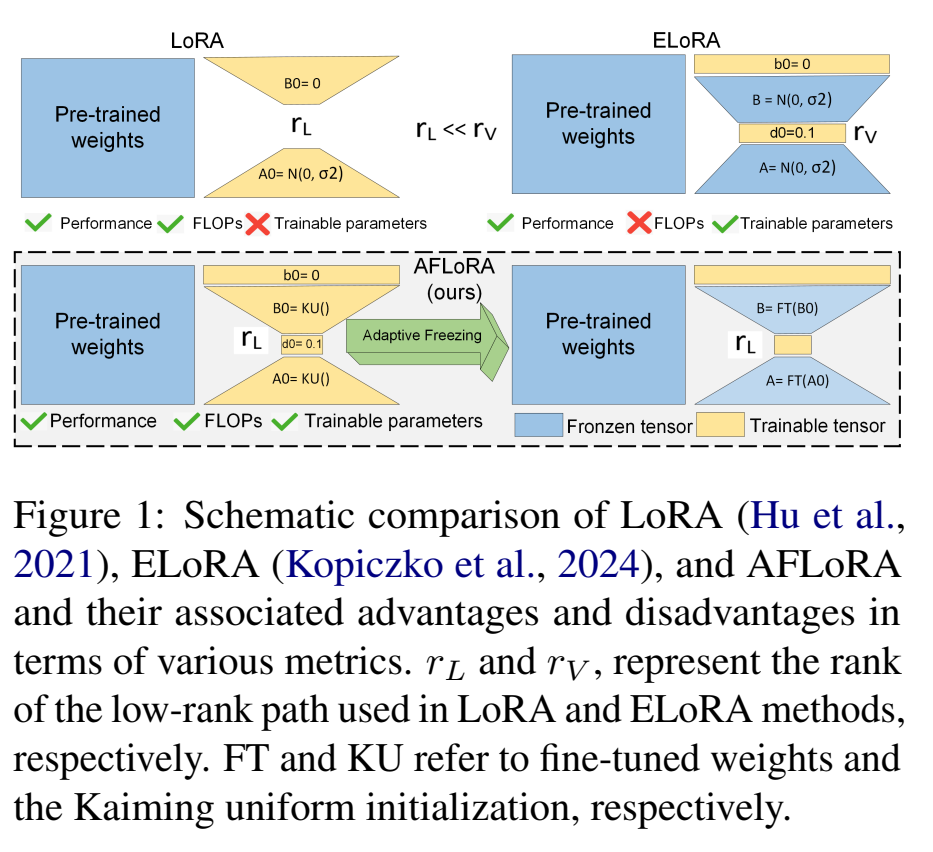
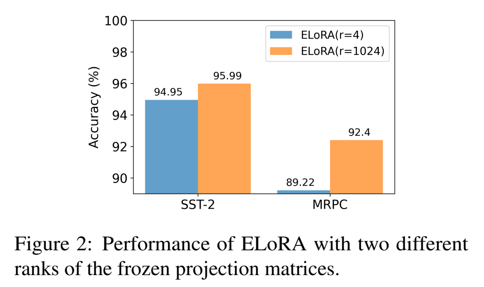
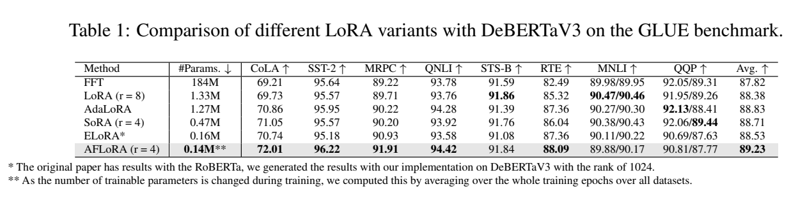
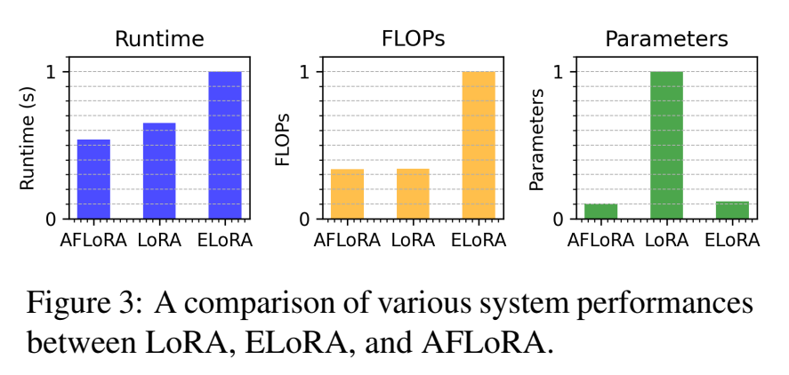
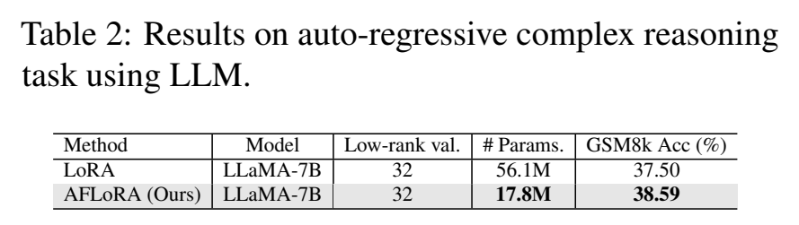
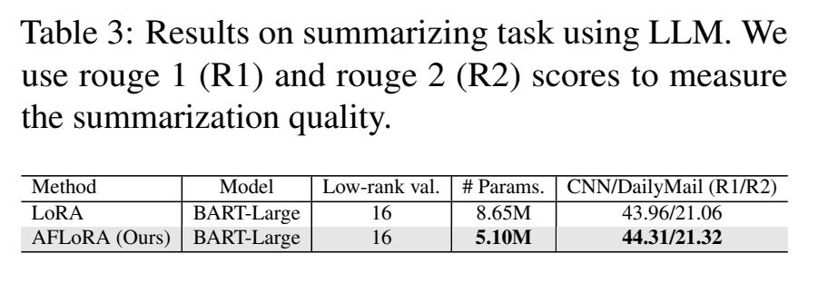
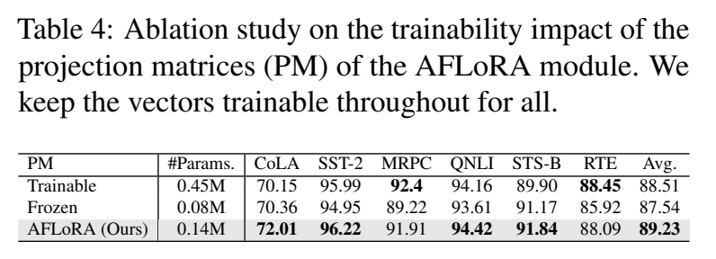
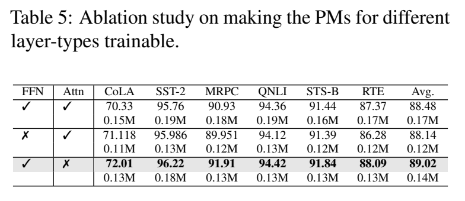
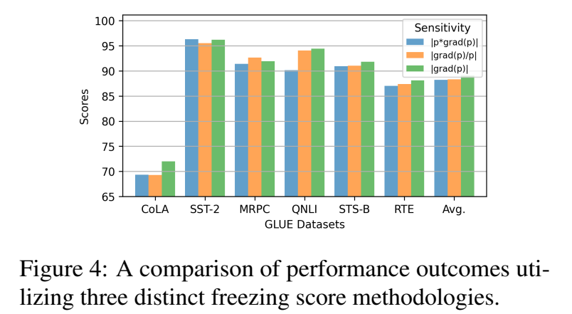
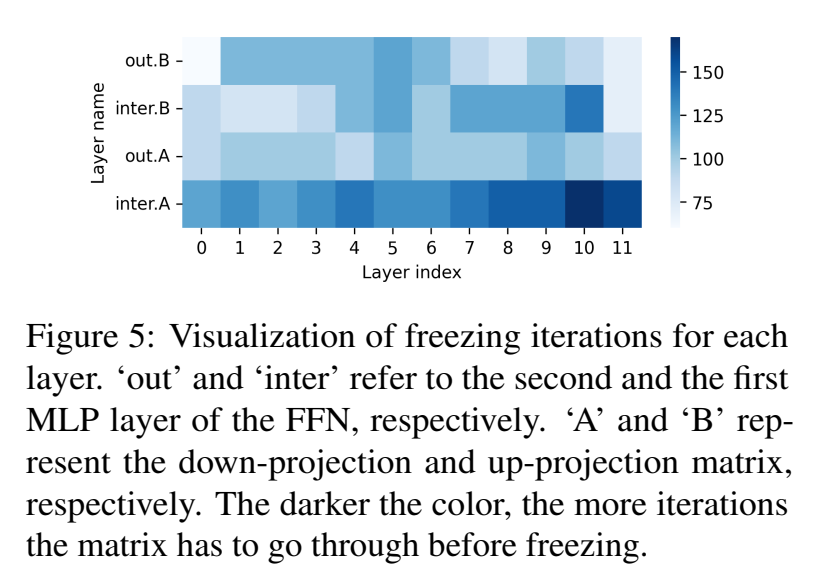

# Abstract

저자는 **adaptive freezing of low rank adaptation (AFLoRA)** 라 불리는 새로운 parameter-efficient fine-tuning (PEFT) 방법을 제안한다. 

* 구체적으로, 각 pre-trained frozen weight tensor 에 대해 trainable low-rank matrix 의 parallel path 를 추가하는데, 이는 down-projection matrix 와 up-projection matrix 로 구성되며, 각각 feature transformation vector 가 뒤따른다. 
* 새로운 freezing score 에 기반하여 fine-tuning 과정에서 이러한 projection matrix 를 점진적으로 freeze 하여 computation 을 줄이고 over-fitting 을 완화한다.

실험 결과, AFLoRA 는 GLUE 와 GSM8k benchmark 에서 최대 1.09% 의 평균 향상과 함께 state-of-the-art 성능을 달성하면서도 평균 trainable parameter 수를 최대 9.5× 줄일 수 있음을 보여준다. 또한 runtime 측면에서 AFLoRA 는 기존 유사한 PEFT 대안들에 비해 최대 1.86× 개선을 달성할 수 있다.

실용적 유용성 외에도, 저자는 LoRA path 가 서로 다른 module 에서 요구하는 trainability 와 projection matrix 에 대한 freezing schedule 에 대한 통찰을 제공한다.

# 1 Introduction

BERT, GPT-3, LLaMA2 와 같은 pre-trained language model 은 다양한 natural language processing (NLP) task 에서 우수한 성능을 보여왔다. 그러나 많은 downstream task 에서 zero-shot 성능은 기대에 미치지 못한다. 이를 해결하기 위한 한 가지 방법은 downstream dataset 에 대해 model 을 full fine-tuning (FFT) 하는 것이다. 하지만 거대한 model parameter 규모로 인해 이 과정은 매우 비용이 크다.

이러한 문제를 해결하기 위해, low rank adaptation (LoRA), adapter tuning, prompt tuning 등 다양한 parameter-efficient fine-tuning (PEFT) 방법이 제안되었다. 

* 이들 방법은 pre-trained model 의 weight 를 직접 조정하지 않고 fine-tuning 을 위해 추가 parameter 를 삽입한다. 
* 특히, LoRA 와 그 변형들은 down-projection matrix 와 up-projection matrix 로 이루어진 trainable low-rank path 를 model 에 추가한다. 
  * 이는 low-rank path 가 trained weight tensor 를 효과적으로 근사할 수 있다는 결과에서 영감을 받은 것이다. 
* ELoRA 는 각 projection matrix 의 출력에 trainable feature transformation vector 를 추가하여 LoRA 를 확장하였다. 
  * 이들은 projection matrix 를 random initialization 이후 freeze 하고, 두 feature transformation vector 만 trainable 상태로 유지해도 SoTA 정확도를 달성할 수 있음을 보였다. 
  * 이 접근법은 trainable parameter 수를 크게 줄이지만, LoRA 와 비교했을 때 projection matrix 를 freeze 하기 위해 더 high rank 가 필요하므로 computation cost 가 증가한다. 

Fig. 1 은 LoRA 와 ELoRA 를 저자의 제안 방법인 AFLoRA 와 비교하여 보여준다.

#### Contributions

fine-tuning 의 trainable parameter 수와 computation cost 를 줄이기 위해 Adaptive Freezing of Low Rank Adaptation (AFLoRA) 를 제안한다. 구체적으로, 저자는 ELoRA 에서 frozen LoRA path 의 rank 요구사항을 먼저 조사하였고, frozen projection matrix (PM) 의 rank 를 줄이면 fine-tuning 성능이 떨어진다는 것을 관찰하였다.

이 통찰에 기반하여, AFLoRA 는 projection matrix 와 feature transformation vector 를 포함하는 low-rank trainable path 로 학습을 시작하고, 일정 epoch 동안 학습한 후 LoRA tensor 의 trainability 요구를 나타내는 새로운 freezing score 에 따라 projection matrix 를 점진적으로 freeze 한다. 이를 통해 over-fitting 문제를 완화하면서 computation efficiency 를 개선할 수 있다.

저자는 AFLoRA 의 효과를 평가하기 위해 다수의 NLP benchmark dataset 에 대해 광범위한 실험을 수행하였고, 정확도, FLOPs, training time 을 여러 기존 방법들과 비교하였다. 그 결과, ELoRA 와 비교했을 때 runtime 은 1.86×, FLOPs 는 2.96× 개선되었으며, 이 두 지표에서 LoRA 와는 유사한 수준을 유지하였다. 또한 LoRA 와 비교했을 때 평균적으로 9.5× 적은 trainable parameter 로 유사하거나 향상된 성능을 달성하였다.

# 2 Related Works

PEFT 는 downstream task 에서 좋은 성능을 내기 위해 소수의 parameter 만 fine-tuning 하는 방법론 집합을 의미한다. 

* 예를 들어, prefix-tuning 은 model 의 input 또는 hidden layer 에 trainable prefix token 을 추가하며, 
* adapter-tuning 은 pre-trained model 의 각 layer 내에 adapter 라 불리는 small neural network layer 를 삽입한다. 
* 반면, LoRA 는 frozen pre-trained weight 와 병렬적으로 low-rank tensor 를 추가한다. 
* AdaLoRA 는 LoRA path 의 rank 를 adaptive 하게 선택할 수 있도록 하였다. 
* 그 외에도 SoRA 와 LoSparse 는 각각 low-rank path 내부 및 외부에서 sparsity 의 영향을 탐구하였다. 
* 최근 ELoRA 는 LoRA path 를 frozen 상태로 두고, two trainable feature transformation vector 를 도입하였다. 

따라서 이 연구는 LoRA path 를 완전히 frozen 시키는 극단적 상황만을 다루며, projection matrix 의 trainability 요구를 연구한 사례는 존재하지 않는다.

# 3 Motivational Case Study

ELoRA 의 frozen projection matrix 에서 high rank 가 필요한 이유를 이해하기 위해, 저자는 SST-2 와 MRPC dataset 에 대해 두 가지 fine-tuning 을 수행하였다. 하나는 ELoRA 의 rank $r=1024$, 다른 하나는 $r=4$ 로 설정하였다. 

* Fig. 2 에서 확인할 수 있듯이, $r=4$ 인 경우 성능이 크게 저하되며, frozen tensor 에 대해 high rank 가 필요함을 보여준다. 
* 이러한 high rank 요구는 ELoRA 가 FLOPs 측면에서 비효율적일 가능성을 시사한다.

# 4 AFLoRA: Methodology

#### Module Structure

Kopiczko et al. 이 제안한 framework 에서 영감을 받아, 저자는 LoRA module 을 다음 네 가지 구성 요소를 포함하도록 설계하였다.

* down-projection linear layer ($loraA$)
* up-projection linear layer ($loraB$)
* $loraB$ 앞뒤에 배치된 두 개의 feature transform vector ($s_d$, $s_b$)

그러나 Kopiczko et al. 과 달리, 저자는 초기에는 projection matrix ($lora_A$, $lora_B$) 와 vector 모두를 trainable 상태로 유지하고, rank 는 매우 낮게 설정한다. module 은 주어진 input $X$ 를 이들 구성 요소를 통해 처리하여 output $Y$ 를 생성한다. layer $l$ 에 대한 전체 연산은 다음과 같이 정의된다.

$$
Y = W_0^l X + \Lambda^l_b B^l \Lambda^l_d A^l X \tag{1}
$$

* 여기서, $A^l$ 과 $B^l$ 은 각각 $lora_A^l$, $lora_B^l$ 의 trainable LoRA tensor 이다. 
* $\Lambda_d$ 와 $\Lambda_b$ 는 각각 $s_d$, $s_b$ 의 vector 이다. 
* $W^l_0$ 는 frozen pre-trained weight 를 나타낸다. 
* 저자는 $A^l$, $B^l$ 에 대해 Kaiming Uniform initialization 을 사용하고, vector 초기화는 Kopiczko et al. 을 따른다.

#### Adaptive Freezing

pruning 연구에서는 weight 의 변화 민감도를 반영하기 위해 magnitude 와 gradient 를 모두 고려한다. weight 값이 작으면 영향력이 적음을 의미하고, gradient 가 작으면 안정성을 의미한다. 이 아이디어에서 영감을 받아, 저자는 "freezing score" 개념을 도입한다. pruning 과 달리 magnitude 는 고려하지 않고 gradient 만을 freezing score 계산의 proxy 로 사용한다. 이는 large magnitude weight 라도 변화가 거의 없다면 small magnitude weight 와 동일하게 freeze 우선순위를 가질 수 있다고 가정하기 때문이다.

이 score 는 training 과정에서 weight 의 변화 정도를 정량화한다. 따라서 weight 변화가 미미해지면 해당 weight 를 frozen 상태로 간주하여 computation 과 에너지 소모를 절감할 수 있다. low-rank tensor $A^l$ 의 freezing score 계산은 다음과 같이 정의된다.

$$
I_{A^l} = |\nabla \mathcal{L}(\theta)|, \bar{I}_{A^l}^{(t)} = \beta_1 \bar{I}_{A^l}^{(t-1)} + (1-\beta_1) I_{A^l}^{(t)} \tag{2}
$$

$$
U_{A^l}^{(t)} = | I_{A^l}^{(t)} - \bar{I}_{A^l}^{(t-1)} |, \bar{U}_{A^l}^{(t)} = \beta_2 \bar{U}_{A^l}^{(t-1)} + (1-\beta_2) U_{A^l}^{(t)} \tag{3}
$$

$$
s_{A^l}^{(t)} = mean(\bar{I}_{A^l}^{(t)} \circ \bar{U}_{A^l}^{(t)}) \tag{4}
$$

* 여기서 iteration $t$ 마다 smoothed gradient $\bar{I}_{A^l}^{(t)}$ 와 uncertainty tensor $\bar{U}_{A^l}^{(t)}$ 를 계산하고, Hadamard product ($\circ$) 를 통해 freezing score $s_{A^l}^{(t)}$ 를 구한다.
* LoRA freezing score 에 threshold 를 적용하기 위해 cubic schedule 을 사용한다. 
  * 구체적으로, 초기 $t_i$ step 동안 projection matrix 는 trainable 상태로 두고, 이후 점진적으로 freeze 한다. 이때 freezing fraction $r(t)$ 는 다음과 같이 정의된다.

$$
r(t) =
\begin{cases}
0 & 0 \leq t < t_i \\
1 - \left(1 - \frac{t - t_i}{T - t_i - t_f}\right)^3 & t_i \leq t < T - t_f \\
1 & \text{otherwise}
\end{cases} \tag{5}
$$

* 여기서 $t$ 는 현재 step, $T$ 는 전체 fine-tuning step 수를 나타낸다. 
* 저자는 $t_i$ 를 한 epoch 에 해당하는 step 으로, $t_f$ 를 전체 training step 의 70% 로 설정하였다.

# 5 Experiments

#### Models & Datasets

저자는 PEFT framework 을 사용하여 DeBERTaV3-base 를 GLUE benchmark 에 대해 fine-tuning 성능을 평가하였다. 각 dataset 에 대한 hyperparameter 설정의 세부 사항은 Appendix A.2 에 제시된다.

#### Performance Comparison

저자는 AFLoRA 의 성능을 benchmark 하고, LoRA 및 그 변형들과 비교하였다. ELoRA 는 저자가 직접 재현하였고, 다른 방법들의 결과는 기존 연구에서 가져왔다. 

* Tab. 1 에서 보듯이, AFLoRA 는 대부분의 dataset 및 평균 성능에서 SoTA 를 달성하면서도 ELoRA 와 유사하고, LoRA 대비 평균적으로 9.5× 적은 trainable parameter 만을 필요로 한다.

#### Runtime & FLOPs Comparison

Fig. 3 은 normalized average training runtime, normalized FLOPs, normalized trainable parameter 를 비교한 것이다. 

* AFLoRA 의 경우 MNLI 와 QQP 를 제외한 여섯 개 GLUE dataset 에 대해 평균값을 계산하였다. 
* LoRA 와 ELoRA 의 경우 trainable parameter 와 FLOPs 는 모든 dataset 에서 고정되어 있으므로, runtime 도 동일한 방식으로 평균을 계산하였다. 
* 그 결과, AFLoRA 는 ELoRA 대비 runtime 과 FLOPs 에서 각각 최대 1.86×, 2.96× 개선을 달성했으며, 이 두 지표에서 LoRA 와는 유사한 수준을 유지하였다. 
* 또한 LoRA 와 비교했을 때 9.5× 적은 parameter 로도 ELoRA 와 유사한 성능을 달성하였다. 
  * 이는 AFLoRA 가 FLOPs 나 시간에서 추가 비용 없이 ELoRA 수준의 parameter efficiency 를 달성할 수 있음을 명확히 보여준다.

#### Results with Large Language Models (LLMs)

저자는 LLaMA-7B 와 BART-Large 에 대해 GSM8k 복잡한 reasoning task 와 CNN/Daily Mail summarization task 에서 AFLoRA 의 fine-tuning 성능을 검증하였다. 

* Tab. 2 에 따르면, GSM8k 에서 AFLoRA 는 LoRA 대비 3.15× 적은 trainable parameter 로도 정확도를 1.09% 개선하였다. 
* CNN/Daily Mail summarization task (Tab. 3) 에서는 1.69× 적은 trainable parameter 로 유사하거나 더 나은 rouge score 를 달성하였다.

# 6 Ablations and Discussions

저자는 GLUE benchmark dataset 중 연산량이 큰 QQP 와 MNLI 를 제외한 여섯 개 dataset 에 대해 ablation study 를 수행하였다.

##### Do we really need adaptive freezing?

세 가지 설정을 비교하였다:

* 모든 LoRA projection matrix (PM) 를 frozen (ELoRA 와 동일)
* 모든 LoRA PM 을 trainable
* 저자의 adaptive freezing 방식

---

* $r=4$ 를 LoRA path 로 설정하고 실험한 결과, PM 을 전부 frozen 하는 것보다 trainable 상태로 두는 것이 평균적으로 더 좋은 성능을 보였다.
* 그러나 AFLoRA 의 adaptive freezing 은 모든 PM 을 trainable 상태로 유지하는 것보다 더 좋은 성능을 보여, overfitting 을 방지하는 regularization 역할을 한다고 볼 수 있다 (Tab. 4).

#### Do we need to keep the PMs trainable for all layer types?

layer type 은 FFN 과 attention 두 가지로 나눌 수 있으며, 저자는 두 layer 모두에 PM 과 feature transformation vector 를 배치하였다. 모든 vector 는 trainable 상태로 두고, PM 의 trainability 필요성을 조사하였다. 

* Tab. 5 결과, FFN 의 PM 을 trainable 상태로 두고 adaptive freezing 하는 경우 가장 좋은 성능을 보였다. 
* 반면 attention layer 의 PM 은 random 값으로 frozen 시켰다. 흥미롭게도 모든 PM 을 처음 trainable 상태로 두었다가 adaptive freezing 을 적용하면, 오히려 FFN 에서만 허용하는 경우보다 성능이 나빠졌다. 
  * 이는 fine-tuning 성능에서 FFN weight 가 더 중요한 역할을 할 수 있음을 시사한다.

#### Ablation with sensitivity choices

Fig. 4 는 세 가지 sensitivity score 를 기반으로 한 ablation 결과를 보여준다:

* $|\text{grad}(p)|$ (AFLoRA 에서 채택한 방식)
* $|p \cdot \text{grad}(p)|$
* $|\text{grad}(p)/p|$

평균적으로 AFLoRA 가 채택한 freezing score 방식이 다른 두 방법보다 일관되게 더 나은 정확도를 달성하였다.

### Discussion on Freezing Trend

저자는 RTE dataset 을 case study 로 하여, 각 layer 의 PM 이 freeze 되기까지 걸리는 iteration 수를 분석하였다. 

* Fig. 5 에 따르면, intermediate linear layer 와 병렬로 연결된 down-projection matrix 는 다른 PM 보다 더 긴 학습 시간을 필요로 했다. 
  * 이는 FFN 의 두 번째 MLP 와 비교했을 때 intermediate layer 의 approximation 능력이 낮음을 시사한다.

# 7 Conclusions

본 논문에서는 LoRA projection matrix 의 trainability 를 freezing score 기반으로 점진적으로 제어하는 adaptive freezing 방법인 AFLoRA 를 제안하였다. LoRA 와 비교했을 때 AFLoRA 는 trainable parameter 수를 최대 9.5× 줄이면서도 GLUE benchmark 에서 평균 0.85% 향상된 성능을 보였다.

# 8 Limitation

다양한 freezing score metric 을 사용한 ablation study 결과, 일부 dataset 에서는 대체 scoring 방법이 AFLoRA 의 방식보다 더 나은 성능을 보였다. 이는 freezing score 를 정교화할 여지가 있음을 시사하며, AFLoRA 의 성능을 추가로 향상시킬 가능성이 있다. 또한 AFLoRA 를 adaptive rank evaluation framework 와 결합하면 PEFT 연구에서 새로운 방향을 열 수 있을 것으로 보이며, 이는 향후 연구 과제로 남겨둔다.