논문 및 이미지 출처 : <https://aclanthology.org/2025.naacl-long.480.pdf>


# Abstract

Transformer-based large-scale pre-trained model 은 큰 성공을 거두었다. Fine-tuning 은 이러한 model 을 downstream task 에 활용하기 위한 표준적인 방법이다. Fine-tuning 방법 중 adapter-tuning 은 대부분의 pre-trained parameter 를 고정한 채 lightweight 하게 trainable module 을 도입하여 parameter-efficient fine-tuning 을 제공한다. 

그러나 기존 adapter-tuning 방법들은 여전히 상당한 자원 사용을 요구한다. 저자의 분석에 따르면, 각 adapter 는 task 성능과 자원 사용에 불균등하게 기여한다. 이 통찰에 기반하여, 저자는 **Selective Adapter FrEezing (SAFE)** 를 제안한다. 

* SAFE 는 중요도가 낮은 adapters 를 점진적으로 조기에 고정하여 불필요한 자원 사용을 줄이는 동시에 성능을 유지한다. 
* 실험 결과, SAFE 는 memory 사용량을 42.85%, computation 양을 34.59%, training 시간을 11.82% 줄이면서 baseline 과 비교해 동등하거나 더 나은 task 성능을 달성한다. 
* 또한 SAFE 는 regularization 효과를 유도하여 loss landscape 을 매끄럽게 하고, model 이 sharp minima 를 피함으로써 더 잘 generalize 할 수 있도록 한다.

# 1 Introduction

Large-scale pre-trained language model (PLM) 은 다양한 task 에서 우수한 성능을 보여왔다. 그러나 PLM 을 처음부터 학습하는 것은 시간과 자원이 많이 소모된다. 따라서 일반적인 방법은 downstream task 에 맞추어 모든 parameter 를 적응시키는 full parameter fine-tuning (full-tuning) 이다.

최근에는 downstream task 에 대해 parameter 의 일부만 최적화하는 Parameter-Efficient Fine-Tuning (PEFT) 이 주목받고 있다. 다양한 PEFT 전략 중에서 adapter-tuning 은 대표적인 방법으로 자리 잡았다. Adapter-tuning 은 각 PLM layer 에 adapter 라는 lightweight module 을 삽입하고, downstream task 에 대해 adapter 만을 학습한다. 


Fig. 1(a) 에 나타나듯이, adapter-tuning 방법은 full-tuning 에 비해 trainable parameter 수를 크게 줄이면서도 downstream task 에서 더 나은 성능을 보인다.

* Adapter-tuning 은 trainable parameter 수를 줄이는 만큼 자원 사용(i.e., memory)도 줄일 것으로 기대된다. 
  * 그러나 parameter-efficiency 가 항상 resource-efficiency 로 이어지지는 않는다. 
* Fig. 1(b) 에 보이듯이, adapter-tuning 은 full-tuning 에 비해 trainable parameter 수를 평균 99.37% 줄이지만, memory 사용량은 평균 22.19% 만 줄인다. 
  * 이는 adapter-tuning 이 전체 memory 사용의 76.00% 를 차지하는 activation memory (backpropagation 중 재사용되는 중간값) 를 줄이지 않고, gradient 와 momentum vector 와 같은 optimizer memory 만 줄이기 때문이다. 
* Model 크기는 급격히 증가하는 반면 GPU memory 용량 증가는 미미하기 때문에, adapter-tuning 은 여전히 memory efficiency 측면에서 한계를 가진다. 
  * 예를 들어, LLaMA-65B 를 fine-tuning 하기 위해서는 780GB 이상의 GPU memory 가 필요하다. 
* Fig. 1(b) 와 같이 resource-efficient 한 fine-tuning 이 가능하다면, commodity GPU memory 내에서 fine-tuning 이 가능해져 연구자와 사용자 모두 접근성을 높일 수 있다.

기존 연구에 따르면 activation memory 는 주로 backpropagation 길이에 의존하며, 이는 backward pass 동안 학습되는 adapter 의 수에 의해 결정된다. 따라서 activation memory 를 줄이기 위해서는 학습되는 adapter 수를 줄이는 것이 중요하다. 그러나 단순히 학습되는 adapter 수를 줄이면 정확도가 저하된다. 여기서 중요한 연구 문제가 등장한다:

**정확도를 희생하지 않고 학습되는 adapter 수를 줄일 수 있는가?**

이를 해결하기 위해, 저자는 individual adapter 가 학습 정확도와 자원 사용에 미치는 영향을 분석하였다 (Sec. 3 의 Fig. 2). 

그 결과 일부 adapter 는 더 이상 정확도 향상에 기여하지 않음에도 불구하고 여전히 학습되어 memory 를 차지하고 있음을 발견하였다. 따라서 downstream task 에 적응하지 않는 adapter 는 조기에 학습을 중단(i.e., freezing)하여 activation memory 를 해제할 수 있다. 또한 이러한 early freezing 은 model 에 regularization effect 를 주어 정확도를 향상시킬 수 있음을 확인하였다.

본 논문에서는 **SAFE (Selective Adapter FrEezing)** 를 제안한다. 

* SAFE 는 학습 초기에 adapter 를 점진적으로 adaptively freezing 한다. 
* 각 epoch 에서 SAFE 는 importance score 를 사용하여 정확도 향상에 상대적으로 덜 기여하는 adapter 를 식별한다. 
* 이후 pre-defined threshold 보다 낮은 importance score 를 가진 adapter 를 freezing 하여 memory 사용량을 줄이고 training time 을 단축한다. 
* 중요도가 낮은 adapter 를 조기에 freezing 하면 학습되는 model 에 regularization 효과를 유도하여 loss surface 를 평탄하게 만든다. 
  * 이는 neural network 최적화 과정에서 higher generalization 성능을 가지는 최적점을 찾는 데 도움을 준다.

저자의 평가에 따르면, SAFE 는 다양한 model 과 downstream task 전반에서 baseline 인 LoRA 와 비교하여 정확도를 희생하지 않고 평균 memory 사용량과 TFLOPs 를 각각 46.89% 와 51.73% 줄인다. 또한 SAFE 는 일부 task 에서는 LoRA 대비 정확도를 최대 4.33% 향상시키면서도 memory 사용량을 53.60% 줄일 수 있다. 이는 regularization 효과에 기인한다.

요약하면, 본 논문의 주요 기여는 다음과 같다:

* Adapter 가 model adaptation 과 자원 사용에 대해 서로 다른 기여도를 보임을 밝힘 (Sec. 3).
* 이 관찰을 바탕으로, 중요도가 낮은 adapter 를 조기에 selective 하게 freezing 하는 resource-efficient fine-tuning 방법 SAFE 를 제안함 (Sec. 4).
* 다양한 downstream task 에서 SAFE 가 baseline 과 비교해 동등하거나 더 나은 성능을 보이는 동시에, regularization 효과를 통해 자원 사용을 크게 줄임을 입증함 (Sec. 5).

# 2 Related Work

#### Parameter-Efficient Fine-Tuning

Large-scale PLM 을 downstream task 에 효율적으로 적응시키기 위해 다양한 adapter-tuning 방법들이 제안되었다. 일반적으로 adapter-tuning 방법은 pre-trained model 의 각 transformer layer 에 작은 학습 가능하고 task-specific 한 adapter module 을 삽입한다. 

Pre-trained weight matrix $W_0 \in \mathbb{R}^{d \times k}$ 와 input $x \in \mathbb{R}^{k \times 1}$ 가 주어졌을 때, adapter-tuning 의 weight update 는 $W_0 + \Delta W$ 로 표현된다. 학습 과정에서 $W_0$ 는 고정되어 gradient update 를 받지 않으며, $\Delta W$ 만이 trainable parameter 를 포함한다. $h = W_0 x$ 일 때, adapter-tuning 에서 수정된 forward pass 는 다음과 같다:

$$
h = W_0x + \Delta W x \tag{1}
$$

Adapter-tuning 의 parameter efficiency 를 더 향상시키기 위해, AdaLoRA 는 adapter 의 importance score 에 따라 trainable parameter 수를 동적으로 조정한다. 즉, 중요도가 낮은 adapter 의 trainable parameter 수를 줄인다. 그러나 Fig. 1 에서 보이듯이, adapter-tuning 은 memory 사용량의 상당 부분을 차지하는 activation memory 를 줄이지 않기 때문에 여전히 많은 memory 를 사용한다.

#### Pruning LLM Model Parameters

Fine-tuning 과정에서 model memory 를 줄이기 위해 structured pruning 과 unstructured pruning 두 가지 방법이 제안되었다. 

* Structured pruning 방법은 LLM 의 channel, layer 와 같은 grouped parameter 를 제거한다. 
  * 그러나 이 방법은 일반적으로 정확도를 저하시킨다. 
  * 또한 낮은 유연성 때문에 압축 비율에도 한계가 있다. 
  * 예를 들어, LLM-Pruner 는 학습 이후의 보정(post-training) 과정을 통해 pruning 으로 인한 정확도 하락을 보완한다.
* 이 한계를 극복하기 위해 unstructured pruning 방법은 구조와 무관하게 weight matrix 의 일부 값을 제거한다. 
  * 그러나 unstructured pruning 역시 정확도 저하를 유발한다.

#### Resource Efficient Fine-Tuning

여러 연구에서는 resource-efficient 한 fine-tuning 을 목표로 했다. 

* AdapterDrop 은 각 학습 단계에서 일부 adapter 를 무작위로 제외한다. 그러나 무작위 선택 때문에 adapter 의 activation memory 를 해제할 수 없다. 
  * 특정 단계에서 제외된 adapter 가 이후 단계에서 다시 학습에 포함될 수 있기 때문이다. 
* SparseAdapter 는 adapter 에 대해 unstructured pruning 을 적용한다. 
  * 그러나 zero 값으로 pruning 된 weight matrix 역시 memory 에 완전히 할당되어야 하기 때문에 실제 memory 사용량은 줄어들지 않는다. 
* LoRAPrune 은 LoRA 에 structured pruning 을 적용하지만, 앞선 방법들과 마찬가지로 정확도에 부정적인 영향을 미친다. 
* MEFT 는 PEFT 에 reversible model 을 적용한다. 
  * Reversible network 를 사용하여 MEFT 는 intermediate activation 을 저장하지 않고 layer 의 accumulated output 으로 activation 을 계산하여 activation memory 를 줄인다. 
  * 그러나 activation 계산이 학습 시간 성능을 심각하게 저하시킨다.

본 연구는 기존 방법과 달리 학습 초기 단계에서 중요도가 낮은 adapter 를 freezing 한다. Frozen adapter 는 forward pass 에서만 사용되므로, 중요도가 낮은 adapter 를 조기에 freezing 하면 backpropagation 길이와 activation memory 를 효과적으로 줄일 수 있다. 또한 이는 model 에 regularization 효과를 유도하여 정확도를 향상시킨다.

# 3 Motivation

이 섹션에서는 resource-efficient fine-tuning 을 위한 핵심 연구 질문을 제시한다. 

```
RQ: Do all adapters contribute equally to the process of adaptation?
```

이를 해결하기 위해, 저자는 각 transformer layer 에 injected adapter 가 정확도와 자원 효율성에 미치는 영향을 분석한다. 구체적으로 BERT$_\text{base}$ model 에 대해 GLUE 의 MNLI 와 QNLI dataset 에서 각 transformer layer 에 adapter 를 하나씩 부착하며 정확도와 memory 사용량을 측정하였다. 

Fig. 2(a) 와 Fig. 2(b) 는 각각 측정된 정확도와 memory 사용량을 보여주며, x 축은 adapter 가 삽입된 transformer layer 의 index 를 나타낸다.

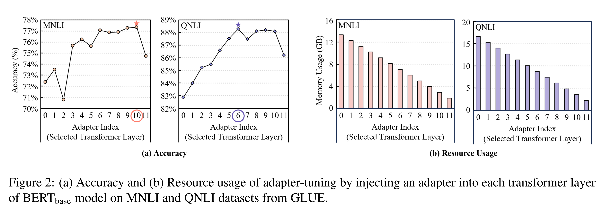

* Fig. 2(a) 에서 볼 수 있듯이, 각 adapter 는 정확도에 서로 다른 영향을 미치며, 그 중요도는 downstream task 에 따라 달라진다. 
* 또한 trainable parameter 수는 동일함에도 불구하고, Fig. 2(b) 에 나타난 바와 같이 output layer 에 가까운 adapter 일수록 자원 사용량이 감소한다. 
* 이러한 관찰은 초기 layer 의 adapter 는 task adaptation 에 기여도가 낮음에도 상당한 자원을 요구한다는 가능성을 시사한다. 
* 즉, 영향력이 적은 adapter 를 선택적으로 비활성화한다면, 자원 효율성과 정확도를 함께 최적화할 수 있다.

Adapter 의 feature representation 이 학습 과정에서 어떻게 변하는지를 더 분석하기 위해, 저자는 각 학습 단계에서의 adapter 와 fine-tuning 수렴 이후 final model 의 adapter 간 representation similarity 를 정량화하였다. Representation similarity 는 기존 연구를 참고하여 Centered Kernel Alignment (CKA) 를 사용하여 계산하였다. 

Fig. 3 은 BERT$_\text{base}$ model 에 대해 GLUE 의 MNLI 와 QNLI dataset 에서 각 adapter 의 학습 과정 동안 측정된 representation similarity 를 시각화한 것이다. 색상이 옅어질수록 feature representation similarity 가 높음을 의미한다.

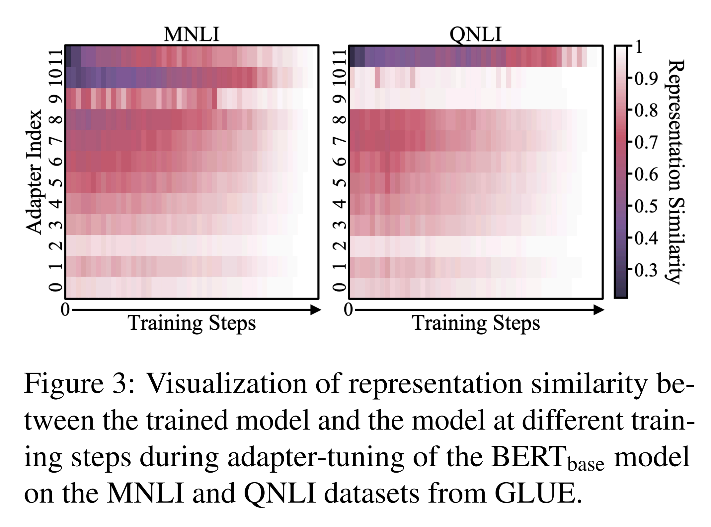

* Fig. 3 에 나타난 바와 같이, 학습 초기 단계에서도 일부 adapter 의 feature representation 은 final model 과 거의 동일하다. 
* 이러한 패턴은 다른 model 과 dataset 에서도 유사하게 관찰된다. 이는 해당 adapter 들이 이미 final model 이 학습해야 할 feature 를 표현하고 있으며, 나머지 학습 단계에서 downstream task 에 추가로 적응할 필요가 없음을 의미한다. 
* 그렇기 때문에 Fig. 2 에서 나타난 것처럼 이러한 adapter 들은 downstream task 의 정확도 향상에 적게 기여한다.

직관적으로 보면, lower adapter 는 일반적으로 input data 의 편향이나 구조적 특성과 같은 기본적인 이해를 학습하는 반면, output 에 가까운 adapter 는 각 task 에 특화된 feature 를 구축한다. 이러한 관찰, 즉 모든 adapter 가 일관되게 adaptation 에 기여하지 않는다는 점에 기반하여, 다음 섹션에서는 상대적으로 중요도가 낮은 adapter 를 조기에 freezing 하는 selective adapter freezing 방법을 제안한다.

# 4 Selective Adapter Freezing (SAFE)

이 섹션에서는 selective adapter freezing 방법인 **SAFE** 를 제안한다. 

SAFE 는 학습 초기 단계에서 중요도가 낮은 adapter 를 점진적으로 freezing 하여 불필요한 computation 과 memory 사용을 줄이면서도 정확도를 유지한다. Fig. 4 는 SAFE 의 개요를 보여준다. SAFE 는 크게 두 단계로 구성된다: **warm-up stage** 와 **freezing stage**.


* **Warm-up stage**: 
  * SAFE 는 여러 epoch 동안 fine-tuning 을 수행하면서 adapter 의 feature representation 변화(i.e., importance score) 를 모니터링한다 (Sec. 4.1). 
  * 모든 adapter 의 importance score 가 연속된 epoch 동안 크게 변하지 않으면, SAFE 는 freezing stage 로 전환된다.
* **Freezing stage**: 
  * SAFE 는 importance score 에 기반하여 적응에 덜 기여하는 adapter 를 점진적으로 freezing 한다 (Sec. 4.2). 
  * 중요도가 낮은 adapter 를 조기에 freezing 함으로써 SAFE 는 model 에 regularization 효과를 유도하고 (Sec. 4.3), 더 나은 성능을 이끈다.

## 4.1 Importance Score

Warm-up stage 에서 SAFE 는 adapter 의 feature representation 변화를 모니터링하여 중요도가 낮은 adapter 를 식별한다. Adapter 의 feature representation 변화를 포착하기 위해 SAFE 는 representation similarity 측정에 널리 사용되는 Centered Kernel Alignment (CKA) 를 사용한다. 이는 기존 연구에서도 활용된 바 있다.

CKA 는 adapter 가 적용된 layer 의 activation 과 original layer 의 activation 간 유사도를 다음과 같이 계산한다:

$$
\text{CKA}_i(X_i, Y_i) = \frac{\| Y_i^T X_i \|_F^2}{\| X_i^T X_i \|_F \, \| Y_i^T Y_i \|_F}
\tag{2}
$$

* 여기서 $X_i$ 와 $Y_i$ 는 각각 adapter 가 적용된 layer 와 original layer 의 activation 이며, 
* $i$ 는 layer index 를 나타낸다. 
* $| \cdot |_F$ 는 matrix 의 Frobenius norm 을 의미한다.

CKA 값이 높을수록 해당 layer 의 feature representation 이 original layer 와 여전히 유사함을 의미한다. 이를 바탕으로, SAFE 는 adapter 의 importance score 를 다음과 같이 정의한다:

$$
\text{Imp}(\text{Adapter}_i) = 1 - \text{CKA}_i(X_i, Y_i)
\tag{3}
$$

즉, CKA 값이 낮을수록 adapter 의 중요도가 높다고 해석되며, 높은 CKA 값을 가지는 adapter 는 downstream task 에 덜 기여하는 것으로 간주된다.

## 4.2 Adapter Freezing

Freezing stage 에서 SAFE 는 adapter 의 importance score 에 기반하여 점진적으로 freezing 을 수행한다. 

* $t_w$-th epoch 에서 SAFE 는 adapter 의 importance score 를 threshold $\tau_T$ 와 비교한다. 
* specific adapter 의 importance score 가 $\tau_T$ 보다 낮으면, SAFE 는 해당 adapter 를 freezing candidate 로 식별한다. 
* 이후 SAFE 는 $t_f$-th epoch 까지 moving threshold 를 기반으로 freezing candidate 를 실제로 freezing 한다. 
* 이때 threshold 는 $t_w$-th epoch 부터 $t_f$-th epoch 사이에서 0 에서 $\tau_T$ 까지 cubic schedule 에 따라 증가한다. 이는 다음과 같이 정의된다:

$$
\tau_t =
\begin{cases}
0, & 0 \leq t < t_w, \\
\tau_T - \tau_T \left( 1 - \frac{t - t_w}{t_f - t_w} \right)^3, & t_w \leq t < t_f, \\
\tau_T, & \text{otherwise},
\end{cases}
\tag{4}
$$

* 여기서 $t$ 는 현재 epoch, 
* $t_w$ 는 warm-up epoch 의 수, 
* $t_f$ 는 freezing 이 완료되는 epoch 수를 의미한다. 

Cubic schedule 은 비선형 증가 패턴을 따르며, 학습 초기에는 빠른 탐색을 가능하게 하고 점차 속도를 늦추어 안정적으로 target point 에 수렴하게 한다. SAFE 는 이러한 특성을 활용하여 학습 초기에는 중요도가 낮은 adapter 를 더 많이 freezing 하고, 점차 freezing 속도를 줄이면서 $\tau_T$ 에 안정적으로 도달한다. Model 의 trainable parameter 수가 줄어듦에 따라 SAFE 는 freezing 되는 adapter 의 수도 점진적으로 줄인다.

## 4.3 Regularization Effect of SAFE

SAFE 는 중요도가 낮은 adapter 를 선택적으로 freezing 함으로써 model 에 regularization 효과를 유도한다. Transformer-based PLM $N_0$ 에서 각 transformer block $T_l$ 은 $l \in \{1, \dots, n\}$ 에 대해 고유한 parameter set $\theta^0_l$ 을 가진다. 

모든 parameter $\theta^0_l$ 을 fine-tuning 하면 연산량이 과도해지므로, lightweight adapter $\Delta \theta_l$ 이 도입된다. Adapter 가 성능 향상에 기여하는 원리를 설명하기 위해 Fu et al. 은 optimization function 을 다음과 같이 공식화하였다:

$$
\min_\theta \mathcal{L}(\theta) + \| (I - M)(\theta - \theta^0) \|^2,
\tag{5}
$$

* 여기서 $\theta = \theta^0 + M \Delta \theta$, $M \in {0, 1}^{m \times m}$, $m = \dim(\theta)$ 이며, 
* $M$ 은 selective parameter 조정을 위한 diagonal matrix 이다. 
* 각 diagonal element $M_{ii} \in {0,1}$ 는 해당 $\Delta \theta_i$ 가 active (1) 상태인지 inactive (0) 상태인지를 나타내며, all off-diagonal elements $M_{ij}$ 는 0 으로 설정된다.

이때 regularization term 은 adapter 가 도입하는 parameter 제약이 downstream task 에서 model 성능을 향상시키는 원리를 설명하는 핵심이다. $\text{rank}(M)$ 은 최대 $m$ 까지 제한되며, 이는 각 transformer block 내에서 parameter adaptation 의 전체 용량을 반영한다. 그러나 이러한 접근은 과도한 computation 으로 이어질 수 있다 (Fig. 1 참조).

반면 본 연구에서는 Sec. 4.2 의 freezing algorithm 을 통해 trainable parameter 수에 맞게 $\text{rank}(M)$ 을 $m$ 에서 축소된 upper bound 로 제한하는 방안을 탐구한다. 예를 들어, Sec. 3 의 분석에서는 각 layer 당 하나의 adapter 만 활성화하도록 trainable parameter 를 제한하였으며, 이 경우 $\text{rank}(M)$ 은 $T_l$ 에 대한 $\Delta W_l$ 의 selective activation 에 의해 $m_l$ 로 제한된다.

이러한 제약은 연산 효율성을 최적화하는 동시에 downstream task 에서 우수한 성능을 발휘하는 데 필요한 적응성을 유지한다. 이는 Sec. 5.3 의 실험 결과에서 확인된다.

# 5 Experiments

## 5.1 Experimental Setting

#### Models

SAFE 의 fine-tuning 효율성을 평가하기 위해 state-of-the-art transformer 기반 model 을 사용하였다. 구체적으로 BERT$_\text{base}$, BERT$_\text{large}$, RoBERTa$_\text{base}$, RoBERTa$_\text{large}$, GPT-2$_\text{medium}$, GPT-2$_\text{large}$, 그리고 LLaMA-27B 를 포함한다.

#### Datasets

위의 model 들은 다양한 NLP application 을 포괄하는 여러 task 에 대해 평가되었다. 여기에는 Natural Language Understanding (NLU), Question Answering (QA), Natural Language Generation (NLG) 이 포함된다. 

* 우선 General Language Understanding Evaluation (GLUE) benchmark 의 8 개 dataset 을 사용하였다. 
* GLUE 는 2 개의 single sentence classification task, 3 개의 similarity 및 paraphrase task, 4 개의 natural language inference task 로 구성된다. 
* 추가적으로, BERT 와 RoBERTa model 계열을 대상으로 SQuAD dataset 에서 실험을 수행하였다. 
* 또한 GPT-2$_\text{large}$ 와 같은 decoder-only model 을 사용하여 End-to-End NLG Challenge 에서 SAFE 의 효과를 검증하였다. 
* 마지막으로, larger model 로의 확장성을 탐구하기 위해 large-scale language model 인 LLaMA-27B 와 WikiText-2 dataset 에 대해 SAFE 를 평가하였다. 

#### Baselines

* SAFE 의 효과성을 평가하기 위해 state-of-the-art PEFT 방법인 LoRA 와 비교하였다. 
* 또한 SAFE 는 다섯 가지 resource-efficient fine-tuning 방법들과 비교되었다. 
* 여기에는 이전 연구, AdapterDrop, SparseAdapter, LoRAPrune, MEFT 가 포함된다. 
* 추가적으로 SAFE 의 성능은 Houlsby, Pfeiffer, BitFit, 그리고 adaptive 방법인 AdaLoRA 와 같은 네 가지 다른 PEFT 방법과도 비교하여 다양한 adapter-tuning framework 에서의 범용성과 적용 가능성을 입증하였다. (세부 결과는 Fig. 1 및 Appendix B 참조).

## 5.2 Main Results

### 5.2.1 Natural Language Understanding

Tab. 1 은 GLUE task 에 대한 다양한 방법의 결과를 보여준다. 

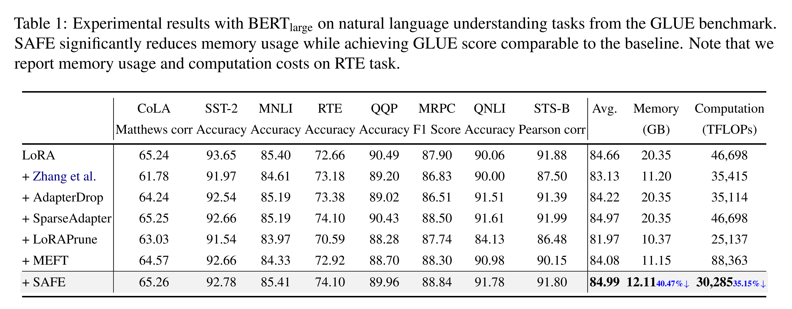

* SAFE 는 학습 과정 전반에서 중요도가 낮은 adapter 의 51.04% 를 조기에 freezing 하므로, memory 사용량을 20.35GB (LoRA) 에서 12.11GB 로 40.47% 줄이고, computation cost (FLOPs) 도 35.15% 감소시킨다. 
* 이러한 자원 효율성 향상에도 불구하고, SAFE 는 평균 GLUE score 를 84.66 (LoRA) 에서 84.99 로 개선한다. 
* 이는 SAFE 가 중요도가 낮은 adapter 에 regularization 효과를 유도하여 model 의 generalization 성능을 향상시키기 때문이다 (Sec. 5.3 참조).

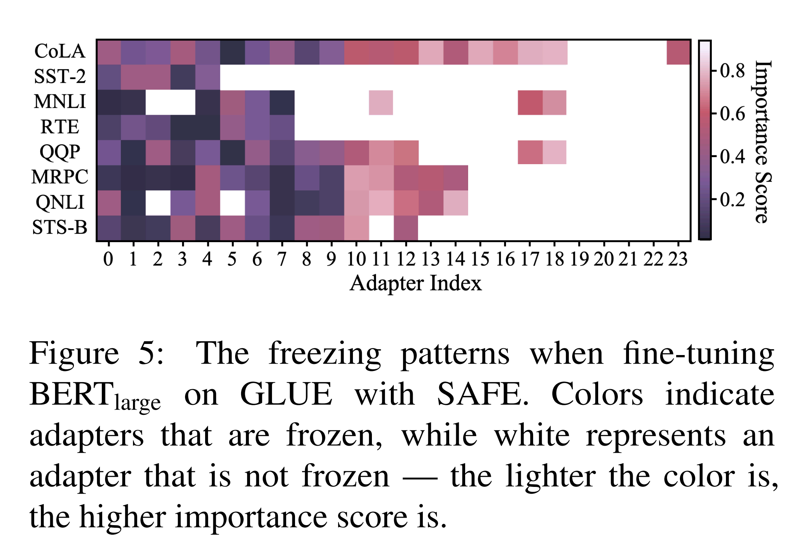

* Fig. 5 는 SAFE 로 fine-tuning 한 BERT$_\text{large}$ 의 freezing pattern 을 보여주며, 다른 task 에서도 유사한 패턴이 관찰된다. 
* SAFE 는 input layer 에 가까운 adapter 를 더 많이 freezing 하는 경향을 보인다. 
* 이는 Fig. 2 의 실험적 관찰과 일치하는데, output layer 에 가까운 adapter 는 downstream task 에 대한 추가적인 adaptation 이 필요하므로 성능 기여도가 더 크다는 것이다.
* 기존 연구 (Zhang et al.) 와 비교했을 때, SAFE 는 adapter 를 상위 layer 에만 부착하는 접근법보다 GLUE score 가 2.24% 높다. 이는 Fig. 5 에서 보이듯이, 일부 하위 layer adapter (예: QNLI task 의 2번째, 5번째 adapter) 가 학습 후반부까지도 adaptation 에 기여하기 때문이다.

AdapterDrop 과 비교했을 때, SAFE 는 MRPC task 에서 최대 2.69% 더 높은 점수를 기록하면서 memory 사용량을 49.47% 줄인다 (평균적으로 GLUE score 는 0.91% 높고 memory 사용량은 40.47% 줄임). 이는 AdapterDrop 이 각 step 마다 adapter 를 무작위로 제거하여 FLOPs 는 줄이지만, 중요 adapter 까지도 제거할 수 있어 성능이 저하되기 때문이다. 또한 AdapterDrop 은 memory 할당을 해제하지 못한다. 한 step 에서 제거된 adapter 가 이후 step 에서 다시 학습에 포함될 수 있기 때문이다.

SparseAdapter 와 비교하면, SAFE 는 GLUE score 를 유지하면서 memory 사용량을 40.47%, computation cost 를 35.15% 줄인다. 이는 SparseAdapter 가 redundancy 를 제거하기 위해 unstructured pruning 을 사용하지만, masking 기반 pruning 은 실제 자원 효율성을 개선하지 못하기 때문이다.

LoRAPrune 은 memory 사용량을 줄이는 데 효과적이지만, 중요도가 낮다고 판단된 adapter weight 를 구조적으로 완전히 제거하기 때문에 정확도가 크게 저하된다. 그 결과 SAFE 는 LoRAPrune 대비 GLUE score 가 3.68% 높다.

MEFT 는 memory 사용량을 줄이지만 FLOPs 와 학습 시간이 2배 이상 증가한다. 이는 MEFT 가 LoRA 에 reversible model 을 적용하여 중간 activation 을 저장하지 않고 재계산하기 때문에 memory 는 절약되지만, 연산 오버헤드가 크기 때문이다.

종합하면, SAFE 는 기존 SOTA 방법들과 비교했을 때 정확도, memory 효율성, 학습 시간 성능 간의 trade-off 에서 더 우수한 균형을 달성한다.

### 5.2.2 Question Answering

Tab. 2 는 SQuAD dataset 결과를 보여준다. 

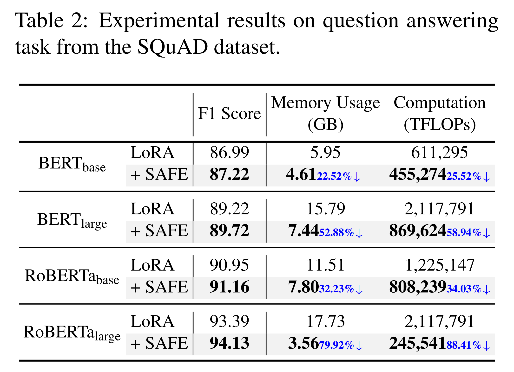

* SAFE 는 모든 설정에서 baseline 을 안정적으로 능가한다. 
* 특히 RoBERTa$_\text{large}$ 에서 SAFE 는 adapter 의 91.67% 를 freezing 하여 memory 사용량과 computation cost 를 각각 79.92% 와 88.41% 줄이면서도 F1 score 를 93.39 (LoRA) 에서 94.13 으로 향상시켰다. 
* 이 결과는 SAFE 의 장점과 효과가 특정 model 크기에 제한되지 않으며, 다양한 규모의 model 에서 adapter-tuning 성능을 향상시키는 유효한 전략임을 보여준다.

### 5.2.3 Natural Language Generation

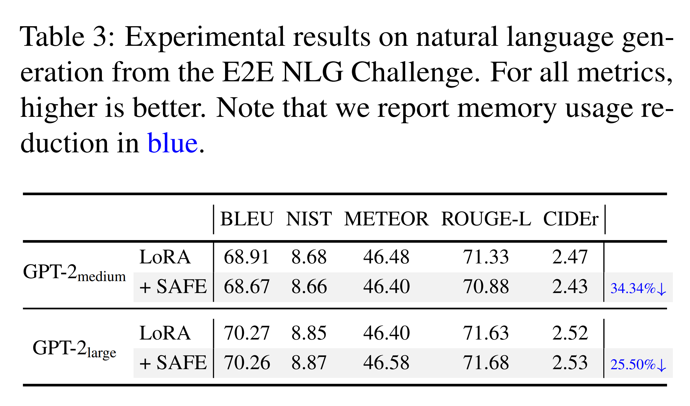

* Tab. 3 은 GPT-2 를 사용한 natural language generation task 결과를 보여준다. 
* SAFE 는 모든 metric 에서 LoRA 와 유사한 성능을 달성하면서도 memory 사용량을 크게 줄였다. 
* 이 결과는 SAFE 가 encoder model 에서만 효과적인 것이 아니라 decoder model 에서도 잘 동작함을 입증한다.

또한 Fig. 6 은 LLaMA-27B 와 WikiText-2 dataset 에 대해 LoRA 와 SAFE 의 (a) perplexity 와 (b) memory 사용량을 비교한 것이다. 

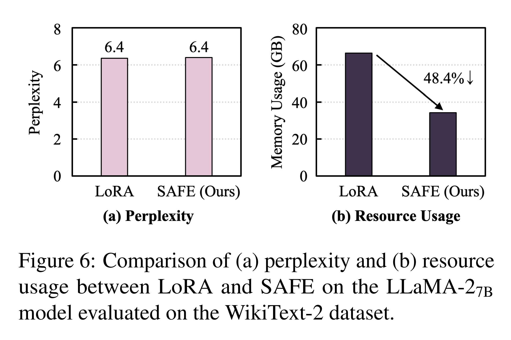

* Fig. 6 에 나타난 바와 같이 SAFE 는 memory 사용량을 66.35GB (LoRA) 에서 34.20GB 로 48.37% 줄이면서도 model 품질 저하는 없었다. 
* 이 결과는 SAFE 가 대규모 language model 의 scalability 를 크게 개선할 수 있음을 의미하며, 자원 제약이 있는 장치에서도 학습이 가능하게 하거나 더 큰 batch size 로 학습할 수 있도록 한다.

## 5.3 Regularization Effect

SAFE 가 model 성능과 memory 효율성을 향상시키는 근본적인 메커니즘을 설명하기 위해, 저자는 상세한 실증 분석을 수행하였다. 

Baseline 과 SAFE 의 loss landscape 을 시각화하여 비교하고, Hessian eigenvalue spectrum 을 분석하여 loss surface 의 flatness 를 정량적으로 평가하였다. 이러한 접근은 SAFE 의 개선 효과를 실증하고, 성능과 자원 활용을 동시에 최적화하는 원리를 설명한다.

#### Loss Landscape Analysis

Loss landscape 의 flatness 는 model 의 generalization 능력을 나타내는 지표로 널리 알려져 있다. 

* 구체적으로, flatter landscape 은 parameter perturbation 에 대한 강건성을 높이고, model complexity 를 줄이며, generalization 성능을 향상시킨다. 
* 이를 검증하기 위해, 저자는 BERT$_\text{base}$ model 을 QNLI 와 SST-2 dataset 에 대해 LoRA 와 SAFE 의 loss landscape 을 비교 시각화하였다. 
* 분석 결과, SAFE 는 LoRA 보다 더 평탄한 loss landscape 을 형성하였다. 이는 SAFE 가 Eq. (5) 의 regularization 효과를 통해 weight norm 을 제어하기 때문이며, 그 결과 weight perturbation 에 대한 저항성이 강화되었다 (Fig. 7(a) 참조).

#### Hessian Eigenvalue Spectrum Analysis

Fig. 7(a) 의 loss landscape 시각화를 정량적으로 평가하기 위해, 저자는 상위 5 개 Hessian eigenvalue spectrum 을 분석하였다. 

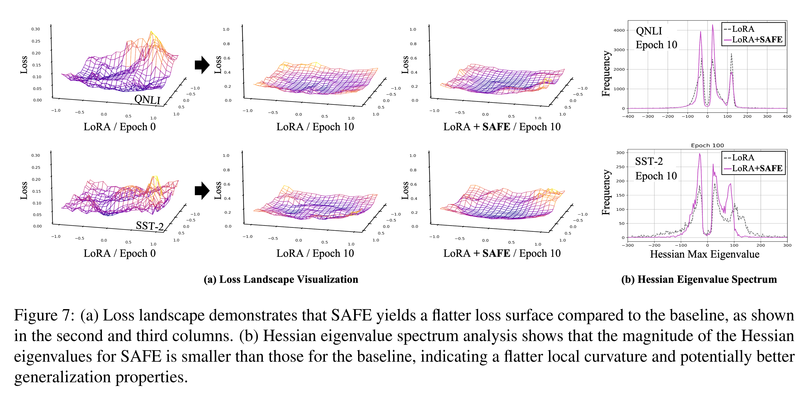

* 분석의 핵심 결과는 최대 Hessian eigenvalue 크기가 감소했다는 점이며, 이는 loss landscape 이 더 평탄해졌음을 의미하고 generalization 성능이 강화될 가능성을 나타낸다. 
* 또한 큰 Hessian eigenvalue 감소는 model 학습을 더욱 효과적으로 만든다. 
* 아울러 가장 큰 음수 Hessian eigenvalue 의 억제는 loss landscape 을 더욱 convex 하게 만들어 학습 과정의 안정성을 높인다. 
* Fig. 7(b) 는 SAFE 가 LoRA 대비 Hessian eigenvalue 크기를 효과적으로 줄이고, 더 부드럽고 일관된 loss landscape 을 형성함을 보여준다. 이러한 결과는 SAFE 가 adapter-tuning 과정에서 더 신뢰할 수 있고 안정적인 학습을 촉진한다는 점을 강조한다.

## 5.4 Resource Efficiency

SAFE 의 resource efficiency 를 memory 사용량, computation 양, training 시간 측면에서 평가하였다. Tab. 4 는 NLU, QA, NLG task 에 대한 주요 결과에서의 평균 자원 효율성 개선을 보여준다. 

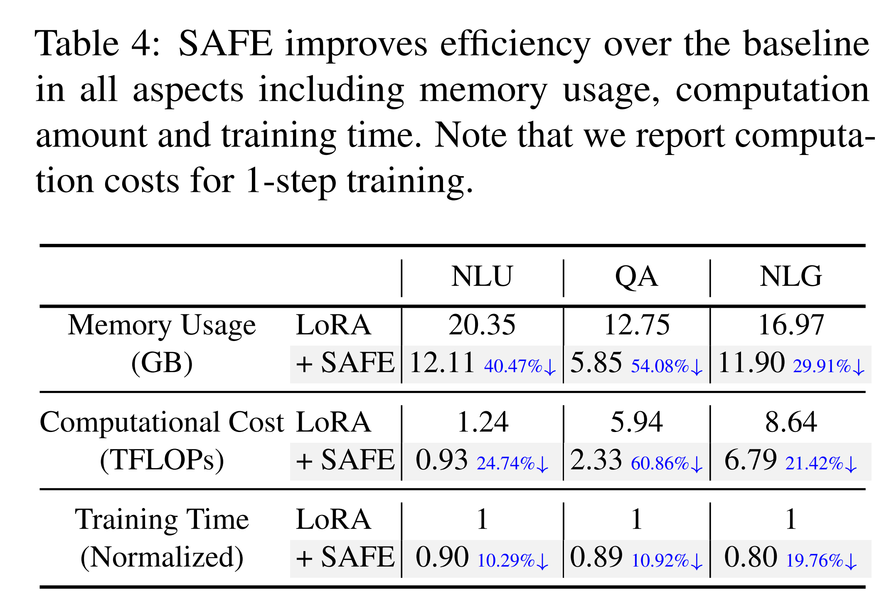

* SAFE 는 LoRA 대비 memory 사용량을 42.85%, computation 양을 34.59%, training 시간을 11.82% 줄였다 (평균적으로). 
* 이는 SAFE 가 동일한 FLOPs 예산에서 두 배 많은 downstream task 를 fine-tuning 할 수 있음을 의미하며, 개인화 목적의 on-device fine-tuning 또한 가능하게 한다. 
* 예를 들어, RoBERTa$_\text{large}$ model 을 question answering task 에 대해 fine-tuning 할 때, SAFE 는 memory 사용량을 17.73GB 에서 3.56GB 로 줄인다. 이는 edge device 의 일반적인 memory 크기인 8GB 내에서 학습이 가능함을 보여준다.

## 5.5 Expanded Experimental Results

#### Image Classification Task Evaluations

Appendix A 에서 다양한 image classification task 에 대해 SAFE 를 평가하였다. 이 실험들은 SAFE 의 일관된 효과를 보여주며, vision 관련 다양한 application 에서도 robust 한 성능을 확인하였다.

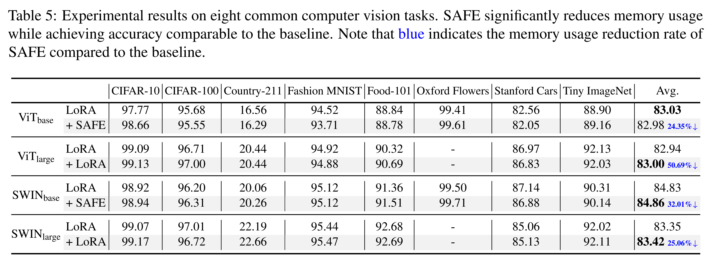

#### Compatibility with Advanced Adapters

Appendix B 에서는 SAFE 와 다양한 advanced adapter module 의 통합에 대해 논의하였다. 결과적으로 SAFE 는 Houlsby, Zaken 등의 adapter-tuning framework 와도 호환성이 뛰어나며, specific adapter 설계에 종속되지 않고 효과적으로 작동함을 입증하였다. 이는 SAFE 의 방법론이 기존 adapter-tuning 방법 전반에 걸쳐 확장 가능함을 보장한다.

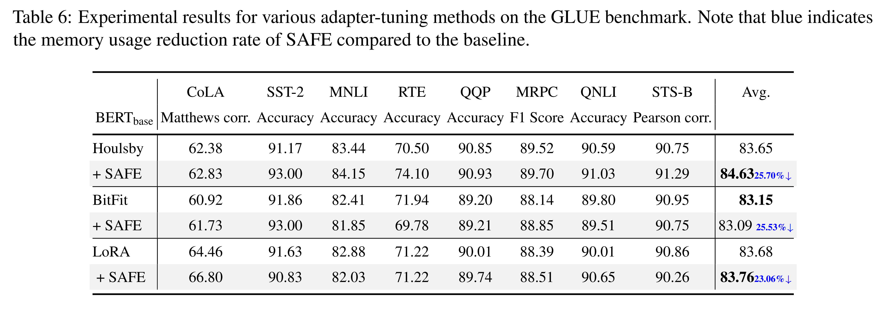

# 6 Conclusion

본 논문에서는 PLM 의 resource-efficient fine-tuning 을 가능하게 하는 selective adapter freezing 방법 SAFE 를 제안하였다. 

저자는 모든 adapter 가 동일하게 adaptation 에 기여하지 않는다는 점을 관찰하였다. 이러한 관찰에 기반하여, SAFE 는 학습 초기 단계에서 adaptation 에 기여하지 않는 중요도가 낮은 adapter 를 점진적으로 freezing 한다. 

다양한 model 과 dataset 에 대한 평가에서, SAFE 는 memory 사용량과 computation 을 크게 절감하고 training 시간을 단축하면서도, 기존과 동등하거나 더 나은 정확도를 달성하였다. 또한 SAFE 는 regularization 효과를 유도하여 SOTA PEFT 방법들과 비교했을 때 일반화 성능과 정확도를 향상시킴을 보였다. 

SAFE 는 large-scale PLM 의 resource-efficient fine-tuning 을 가능하게 하며, 더 나아가 resource-constrained edge device 에서 personalized fine-tuning 을 실현하는 길을 열 수 있다고 본다.

# 7 Limitations

SAFE 를 memory-efficient training 기법과 결합할 필요성이 있다. 여기에는 low precision, micro-batching, weight sharding, gradient checkpointing 등이 포함된다. 본 연구에서는 SAFE 와 이러한 memory-efficient training 방법들을 함께 평가하지 않았지만, SAFE 는 특정 학습 방법이나 weight precision 에 독립적으로 적용될 수 있으므로 상호 보완적으로 활용될 수 있다. 특히 quantization 기반 압축 기법은 압축률과 최종 정확도 보존 측면에서 매우 효과적이므로, 제안된 방법과 memory-efficient training 기법을 결합하면 긍정적인 결과가 기대된다.
