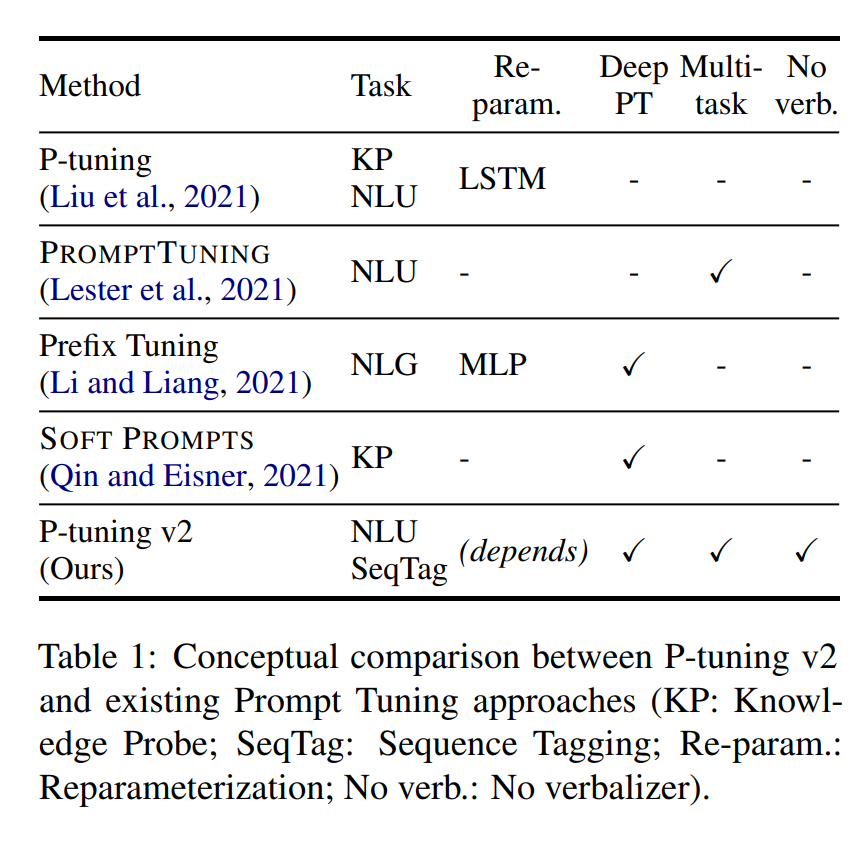

논문 및 이미지 출처 : <https://arxiv.org/pdf/2110.07602.pdf>

# Abstract

**_Prompt tuning_** 은 language model (LM) 을 freezing 한 상태에서 continuous prompt 만 조정하여, training 중 task 당 저장 및 메모리 사용량을 크게 줄이는 것

하지만

- Natural Language Understanding (NLU) 엔, 이전 연구에서 prompt tuning 이 일반적인 크기의 pre-trained model 에 대해서는 잘 수행되지 않음
- 기존의 prompt tuning 방법이 hard sequence labeling task 를 처리할 수 없다는 것 발견
- 위 사항은 범용성의 부족

저자는 적절하게 최적화된 prompt tuning 이 모델 규모와 NLU 작업의 넓은 범위에 걸쳐 보편적으로 효과적일 수 있는 새로운 경험적인 결과를 제시

- fine-tuning 의 성능을 맞추면서도 tuned parameter 가 0.1 ~ 3% 에 불과
- P-tuning v2 는 NLU 용으로 optimized 및 adapted Deep Prompt Tuning (Prefix-tuning, soft prompts) 의 구현
- P-tuning v2 의 보편성과 간단함을 고려하면, fine-tuning 의 대체제로서 향후 연구를 위한 강력한 baseline 으로 기능 가능

# 1. Introduction

Pre-trained LM 은 넓은 범위의 NLU tasks 의 성능을 향상시킨다.

널리 사용되는 방법으로는 다음이 있다.

- **Fine-tuning (FT)** : target task 에 대해, model parameter 전체를 update
  - 좋은 성능을 얻는 반면, all parameters 에 대한 gradient 및 optimizer states 를 저장해야 하므로 training 중 메모리 소비가 심하다.
  - inference 중 각 task 에 대한 model parameter 의 copy 를 유지하는 것은, 보통 LM 이 크기 때문에 여간 불편하다
- **Prompting** : pre-trained LM 의 all parameter 를 freezing 하고 natural language prompt 를 사용하여 LM 에 query 하는 방식
  - sentiment analysis 의 경우, sample (e.g. "Amazing movie!") 에 "[MASK]" 라는 prompt 를 연결하고 pre-trained LM 에게 masked token 이 "good" 과 "bad" 인 확률을 예측하도록 요청하여 label 결정
  - prompting 은 training 을 필요로 하지 않으며 model parameter 의 single copy 만 저장
  - discrete prompting 은 fine-tuning 과 비교하여 성능이 부적절한 경우가 많음
- **Prompt tuning (PT)** : discrete prompts 만 tuning 하는 아이디어
  - continuous embedding (prompts) 을 input word embeddings 의 original sequence 에 추가
  - training 중 continuous prompts 만 updates
  - PT 은 많은 task 에서 prompting 을 개선하지만, 모델 크기가 10B parameter 이하의 경우 FT 를 능가하지 못함
  - hard sequence labeling task 에서 PT 가 prompting 에 비해 성능이 나쁜 것을 관찰

본 논문의 기여는 적절히 최적화된 PF 이 다양한 모델 규모와 NLU task 범위에서 보편적으로 fine-tuning 과 comparable 하다는 발견

- 이전 연구와 대조적으로 저자는 NLU 에 대한 PF 의 보편성과 잠재력 발견
- 새로운 개념은 아니며, 생성 및 지식 탐색을 위해 설계된 Deep Prompt Tuning (Prefix-tuning, soft prompts) 의 최적화 및 적응된 구현
- input layer 뿐 아니라 pre-trained LM 의 모든 layer 에 continuous prompt 적용
- Deep Prompt Tuning 은 continuous 의 용량을 증가시키고 모델 크기와 hard task 의 간격을 좁히는 데 기여
- fine-tuning 과 유사한 성능 보장을 위한 최적화 및 구현의 중요한 세부 사항 제시

실험 결과 P-tuning v2 는 300M 에서 10B parameter 까지 다양한 모델 규모 및 extractive question answering 및 named entity recognition 같은 hard sequence tagging task 을 포함하여 다양한 task 에서 fine-tuning 과 유사한 성능을 보이며, task 당 trainable parameter 의 비율이 0.1% ~ 3% fine-tuning 과 비교하여 training 시간 메모리 비용 및 task 당 저장 비용을 크게 줄임

# 2. Preliminaries

### NLU Tasks

NLU task 를 두 가지로 분류

- _simple classification tasks_
  - label space 기반으로 하는 분류 포함
  - GLUE 및 SuperGLUE 포함
- _hard sequence labeling tasks_
  - token sequence 기반으로 하는 분류 포함
  - named entity recognition 및 extractive question answering 포함

### Prompt Tuning

LM $\mathcal{M}$ 의 vocabulary 를 $\mathcal{V}$

LM $\mathcal{M}$ 의 embedding layer $e$

discrete prompting 의 경우, prompt tokens {"It", "is", "[MASK]"} $\subset \mathcal{V}$ 를 영화 리뷰 분류에 사용될 수 있다.

예로, input text $\text{x}$ = "Amazing movie!" 가 주어지면, input embedding sequence 는 $[e(\text{x}), e(\text{"It"}), e(\text{"is"}), e(\text{"[MASK]"})]$ 로 공식화

[prompt tuning. Lester, P-tuning] 는 frozen pre-trained LM 을 사용하여 NLU 에 대한 natural language prompts 대신 trainable continuous prompts 도입

trainable continuous embeddings $[h_0, \dots, h_i]$ 가 주어지면, input embedding sequence 는 Figure 2 처럼 $[e(\text{x}), h_0, \dots, h_i, e(\text{"[MASK]"})]$ 로 쓸 수 있다.

Prompt tuning 은 간단한 classification task 에 10B model 을 FT 로 comparable 하게 할 수 있다.

# 3. P-Tuning v2

## 3.1 Lack of Universality

[prompt tuning. Lester, P-tuning] 등 여러 NLP application 에서 효과적임을 입증했지만, 범용성 부족으로 인해 FT 를 대체하기엔 여전히 한계 존재

### Lack of universality across scales

[prompt tuning. Lester] 은 10B parameter 이상의 model scale 이 되면 PT 은 FT 와 comparable 하지만 일반적인 medium-sized model (100M ~ 1B) 의 경우에는, PT 는 FT 보다 훨씬 성능이 안좋다.

### Lack of universality across tasks

[prompt tuning. Lester, P-tuning] 등은 NLU 벤치마크 중 일부에 우위를 보였지만, sequence tagging task 에 대한 PT 의 효과는 검증되지 않았다.

sequence tagging 은 각 input token 에 대한 label sequence 을 예측하는 task 로, 어려우며 동사화와 호환되지 않을 수 있다.

저자의 실험에서 ([Section 4.2](#42-p-tuning-v2-across-tasks) 및 Table 3 참조) [prompt tuning. Lester, P-tuning] 등은 FT 와 비교하여 전형적인 sequence tagging task 에서 성능이 좋지 않음을 보여준다.

위 어려움을 고려하여 scales 및 NLU task 에 걸쳐 범용적인 솔루션으로 deep prompt tuning 을 채택한 P-tuning v2 제안

## 3.2 Deep Prompt Tuning

[prompt tuning. Lester, P-tuning] 에서 continuous prompt 는 input embedding sequence 에만 삽입된다. (Figure 2 참조) 이로 인해 두 가지 challenge 발생

- sequence length 제안으로 인해 tunable parameters 의 수가 제한됨
- input embeddings 는 model prediction 에 상대적으로 간접적인 양향만 끼침

위 과제를 해결하기 위해 P-tuning v2 는 Deep Prompt Tuning 아이디어 채택

- Fig 2 에서 설명했듯, 여러 layers 의 prompt 가 prefix tokens 에 추가됨
- P-tuning v2 는 더 많은 tunable task-specific parameters (0.01% ~ 3% 까지) 를 가지고 있어 조금 더 per-task capacity 을 허용하면서도 parameter-efficient 를 유지
- deeper layers 에 추가된 prompt 는 model prediction 에 더 직접적인 영향을 미침

## 3.3 Optimization and Implementation

### Reparameterization

이전 연구에서 보통 trainable embeddings 를 변환을 위해 MLP 같은 reparameterization encoder 를 활용한다.

하지만 NLU 의 경우, 그 유용성이 task 및 dataset 에 의존적이다.

일부 dataset (e.g. RTE 및 CoNLL04) 의 경우, MLP 가 일관된 성능 향상을 가져오지만, 다른 dataset (e.g. BoolQ 및 CoNLL12) 에서는 결과에 미미하거나 음의 영향을 미친다.

### Prompt Length

prompt length 는 P-Tuning v2 에서 중요한 역할을 한다.

다양한 NLU task 는 일반적으로 다른 prompt length 로 best 성능을 달성한다.

일반적으로 간단한 classification task 는 더 짧은 prompt (20 미만)을 선호하며, hard sequence labeling task 는 더 긴 prompt (약 100)을 선호한다.

### Multi-task Learning

Multi-task learning 은 개별 tasks 에 대한 FT 전에 shared continuous prompts 로 여러 task 를 공동으로 최적화한다.

Multi-task 는 P-tuning v2 에 선택적으로 적용 가능하지만 더 나은 최적화를 제공하여 성능을 더 향상시킬 수 있다.

### Classification Head

verbalizers 예측을 위해 LM head 를 사용하는 것은 PF 에 중요했지만, full-dataset 설정에선 불필요하며 sequence labeling 과 호환되지 않는다.

대신 P-tuning v2 는 BERT 와 같이 token 위에 randomly-initialized classification head 를 적용한다.

P-tuning v2 의 주요 기여를 쉽게 Table 1 에 기재한다.

# 4. Experiments

P-tuning v2 효과 검증을 위해 다양한 pre-trained model 과 NLU task 에 대해 광범위한 실험 수행

이 연구는 FT 를 제외한 모든 방법을 **frozen language model backbones** 에서 진행하며, 이는 [prompt tuning. Lester] 의 설정과 일치하지만 [P-tuning] 의 tuning 설정과는 다르다.

task-specific parameters 비율 (0.1%) 은 continuous prompt 의 parameter 와 transformer 의 parameter 를 비교하여 유도

또 주목할 점은 저자의 실험은 모두 few-shot 가 아닌 fully-supervised 설정에서 진행

### NLU Tasks

P-tuning v2 의 NLU 능력을 테스트하기 위해 SuperGLUE 를 데이터셋에 포함

또한 named entity recognition, extractive Question Answering 및 semantic role labeling 포함

### Pre-trained Models

평가를 위해 BERT-large, RoBERTa-large, DeBERTa-xlarge 및 GLM-xlarge/xxlarge 포함

이 모델들은 모두 NLU task 를 위해 설계된 bidirectional model 로, 약 300M ~ 10B 까지 다양한 크기를 커버

### Multitask Learning

multi-task 설정에서는 각 task type 의 데이터셋을 결합 (e.g. combing all training sets of semantic role labeling)

각 데이터셋에 대해 별도의 linear classification 를 사용하면서 continuous prompt 를 공유

## 4.1 P-tuning v2: Across Scales

Table 2 는 P-tuning v2 의 model scales 별 성능이다.

- SuperGLUE 에서 [prompt tuning. Lester, P-tuning] 은 smaller scales 에서 성능이 매우 저조할 수 있다.
- 반면 P-tuning v2 는 smaller scales 에서 모든 task 에서 FT 성능과 일치한다.

larger scales (2B ~ 10B) 에서 GLM 을 사용하는 경우

- [prompt tuning. Lester, P-tuning] 와 FT 간의 차이가 점차 좁혀짐
- 10B scale 에서는 [prompt tuning. Lester] 의 보고와 유사하게, PT 가 FT 와 comparable

즉, P-tuning v2 는 모든 scale 에서 FT 와 비교하여 0.1% 의 task-specific parameters 만 필요로 하면서 항상 FT 와 comparable

## 4.2 P-tuning v2: Across Tasks

Table 3 에서 우리는 P-tuning v2가 일반적으로 모든 task 에서 FT 와 유사할 수 있음을 관찰

- QA task 중에서 가장 어려운 QA task 을 포함하여 [prompt tuning. Lester, P-tuning] 간의 성능 차이가 크다
- [prompt tuning. Lester, P-tuning] 의 SQuAD 2.0 에서 일부 일반적이지 않은 결과 관찰. 이는 SQuAD 2.0 에는 unanswerable question 이 포함되어 있어 single-layer prompt tuning 의 최적화에 어려움을 주기 때문
- QA 를 제외한 대부분의 task 에서 multi-task learning 은 P-tuning v2 에 대해 상당한 개선을 줌

## 4.3 Ablation Study

### Verbalizer with LM head v.s. [CLS] label with linear head

이전 PT approach 방식에서 Verbalizer with LM head 는 중요한 구성 요소 였다.

하지만 supervised learning 설정에서 P-tuning v2 를 사용한 경우, 약 몇 천개의 parameter 를 가진 linear head 를 tuning 하는 것이 가능하다.

저자는 다른 hyperparameter 를 유지하고 [CLS] label 을 linear head 에서 LM head 로 변경하는 것 외에 간단한 비교를 제안

간단하게 SST-2, RTE 및 BoolQ 에 대해 "true" 및 "false" 를 사용하고, CB 에 대해 "true", "false" 및 "neutral" 를 사용

결과 Verbalizer 와 [CLS] 의 성능 간에 유의미한 차이가 없었음

### Prompt depth

[prompt tuning. Lester] 와 P-tuning v2 사이의 주요 차이점은 multi-layer continuous prompt 이다.

정확한 영향 검증을 위해 prompt 를 추가할 $k$ layers 를 선택하고, 오름 및 내림차순으로 prompt 를 추가하도록 하여 특정 수의 layer 에 대해 실험을 수행하고 나머지 layer 에 대해서는 그대로 둔다.

동일한 parameter 양 (prompt 를 추가할 transformer layer 수)으로 내림차순으로 추가하는 것이 항상 오름차순 보다 나은 결과를 가져옴

RTE 경우엔 layers 17-24 에만 prompt 를 추가하는 것만으로 모든 layer 를 사용하는 것과 거의 유사한 성능 달성

# 5. Conclusions

P-tuning v2 제안

- 상대적으로 제한적인 혁신성을 가지지만, PF 이 모든 규모 (330M ~ 10B parameter)와 task 에 걸쳐 FT 와 comparable 한 새로운 발견에 기여
- 높은 정확도와 parameter-efficient 를 가지며, P-tuning v2 는 미래 연구의 강력한 baseline 이 될 수 있는 잠재적인 대안