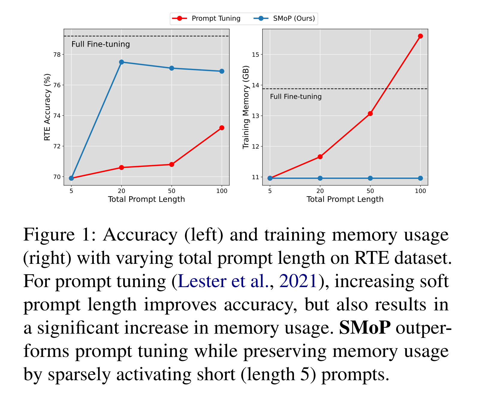

논문 및 이미지 출처 : <https://aclanthology.org/2023.emnlp-main.884.pdf>

# Abstract

Prompt Tuning 은 full fine-tuning 을 대채하는 성공적인 parameter-efficient 이지만, 이전 연구는 성능 향상을 위해 long soft prompts 100 tokens 를 활용하여 확장된 inputs 으로 비효율성이 나타난다.

본 논문에서 저자는 새로운 prompt tuning 인, 효율적인 training 및 inference 를 위한 short soft prompts 를 활용하면서 longer soft prompts 으로부터의 성능 향상을 유지하는  **SMoP** (**S**parse **M**ixture-**o**f-**P**rompts) 소개

- data subset 을 처리하는데 특화된 multiple short soft prompts 를 훈련하기 위해 **gating mechanism** 사용
  - entire data 를 커버하기 위한 single long soft prompts 에 의존하는 것의 대안 제공
- 실험 결과 SMoP 가 baseline 을 능가하며 training 및 inference 비용을 줄일 수 있음을 보여줌

# 1. Introduction

Prompt Tuning 은 최근 full fine-tuning 의 parameter-efficient 대체로 주목받는다.

이는 model input 에 추가된 soft prompts 를 tuning 하여 trainable parameter 는 줄이면서도 full fine-tuning 과 comparable 한 성능을 만들어 낸다.

게다가 다른 PEFT 보다 간단하고 유연하며 모델 구조를 변경하지 않는다.

Prompt Tuning 으로 파생된 여러 효율성 및 효과성에 대한 연구가 활성화 되었다.

- 일부는 model 의 각 layer 에 soft prompts 통합 (Li and Liang, 2021; Qin and Eisner, 2021; Liu et al. 2022)
- input-specific soft prompts 통합 (Jiang et al, 2022; Wu et al, 2022)
- soft prompt 를 pruning 및 rewinding (Ma et al, 2022)
- progressive training 을 통해 수렴 속도에 대한 prompt tuning 의 training efficiecy 를 향상시킨 FPT (Huang et al, 2022)

경험적 실험으로 prompt tuning 의 향상을 일으키지만, input sequence 확장의 결과로 인한 비효율성을 지나칠 수 있다.

soft prompt length 증가 (일반적으로 100 tokens 이상) 이 모델 성능에 도움을 주는 것으로 알려져 있는데, longer input sequence 는 training 및 inference 에서 계산적 요구량을 증가시킴을 초래한다. (Fig. 1 참고)

그러므로, 저자는 longer soft prompts 으로부터 얻는 성능은 유지하면서 short soft prompts 활용을 조사한다.

---

끝으로, 저자는 **SMoP** (**S**parse **M**ixture-**o**f-**P**rompts) 를 제안

- training 및 inference 중 short soft prompts 를 활용하느 새로운 prompt-tuning method
- short soft prompt 사용은 longer soft prompt 에 비해 성능이 떨어지는데, 저자는 data 의 다양한 subset 을 다루는데 특화된 multiple short soft prompts 를 훈련
  - 이를 위해, sub-network (expert) 를 부분적으로 활성화하여 계산량을 비례적으로 증가시키지 않고 모델 용량을 증가시키는 Sparsely-Gated Mixture-of-Experts (Shazeer et al, 2017; Fedus et al, 2022) 에서 영감을 받음
  - 저자는 이 개념을 SMoP 의 gating mechanism 을 사용하여 prompt-tuning 에 통합하고, 각 input instance 를 embedding representation 에 기반하여 short soft prompts 중 하나로 가이드
  - 이런 sparse activation 은 계산 계산의 큰 증가나 성능 저하 없이 short soft prompt 를 효과적으로 활용
- SMoP 효율 및 효과성 입증을 위해 SuperGLUE 의 6 task 에 평가 수행
  - prompt tuning 을 능가하며 training 및 inference cost 를 줄였다.
  - SuperGLUE 의 6 tasks 에서 T5-base 는 2.5%p, T5-large 에선 3.4%p 로, prompt tuning 의 평균 성능 능가 

**Contribution**

1. efficient training 및 inference 를 위해 short soft prompt 를 활용하는 **SMoP** (**S**parse **M**ixture-**o**f-**P**rompts) 제안. soft prompt length 를 증가시켜 얻는 성능을 유지
2. **SMoP** 는 각 instance 를 embedding representation 에 기반한 multiple soft prompts 중 하나로 안내하는 gating mechanism 을 통해 short soft prompts 를 sparsely activate
3. SMoP 를 shorter soft prompts 를 활용하여 T5-base 및 T5-large 에서 baseline 을 능가

# 2. Method

## 2.1 Preliminaries

#### Full Fine-tuning

sequence-to-sequence model $p_\phi (y|x)$ 을 사용하여 $\phi$ 로 parameterize

embedding representation $X = \{x_1, x_2, \dots, x_n\}$ 의 $n$ sequence 및 대응하는 label token embedding sequence $Y$ 가 주어졌을 때, model $p_\phi$ full fine-tuning 에 대한 objective function 은 다음과 같다.

$$
\begin{equation}
  \underset{\phi}{\arg \max} \log p_\phi (Y | X). 
\end{equation}
$$

#### Prompt Tuning

embedding dimension $e$ 와 length $l$ soft prompt 를 $P_\theta$ 로 정의하고 이를 $\theta \in \mathbb{R}^{l\times e}$ 로 parameterize 한다면, prompt tuning 의 object function 은 다음과 같다.

$$
\begin{equation}
  \underset{\phi}{\arg \max} \log p_\phi (Y | [P_\theta ; X]). 
\end{equation}
$$

여기서 language model parameter $\phi$ 는 더이상 업데이트하지 않는다.

아래 Fig. 2 (a) 에서 prompt-tuning 의 과정을 나타낸다.

## 2.2 SMoP: Sparse Mixture-of-Prompts

SMoP 목표는 multiple short soft prompt 학습이다. 각 prompt 는 data subset 에 특화된다.

이를 위해, input instance 가 embedding representation 에 기반한 soft prompt 중 하나로 가기 위해 **gating mechanism** 을 사용한다. (Fig. 2(b))

- $\mu \in \mathbb{R}^{e \times k}$ 로 parameterize 된 small linear router model $L_\mu$ 사용
  - 이는 input 이 어느 soft prompt 로 routing 되야 하는지에 대한 결정을 준다.
  - 공식적으로, $k$ soft prompt embeddings $P_{\theta_1}, P_{\theta_2},\dots,P_{\theta_k}$ 이며, $\{\theta_j\}^k_{j=1}$ 으로 parameterize
    - $\theta_j \in \mathbb{R}^{l \times e}$
  - router model 은 input embedding $\bar{X}\in \mathbb{R^e}$ 을 input 으로, 평균을 받아 각 soft prompt 에 대한 routing probability $p_1, p_2, \dots, p_k$ 를 계산
  - $j$-th prompt 의 routing probability 는 다음과 같이 계산

$$
\begin{equation}
  p_j(X) = [\text{softmax}(L_\mu (\bar{X}))]_j\cdot
\end{equation}
$$

input 은 highest probability 의 soft prompt 로 routing 되며, final soft prompt 는 routed prompt 와 probability value 의 곱으로 얻어진다. 따라서, **SMoP** 의 objective function 은 다음과 같이 정의된다.

$$
\begin{equation}
  \underset{\mu,\theta_c}{\arg\max}\log p(Y\ |\ [p_c(X)\cdot P_{\theta_c}; X]),
\end{equation}
$$

- $c$ : highest probability value 의 prompt index
- total prompt length 는 $k \cdot l$ 이면서, 활용되는 prompt length 는 $l$ 만 남는다.

## 2.3 Router Perturbation

Mixture-of-Experts (Chen et al, 2022b; Fedus et al, 2022) 는 training 중 experts 간의 load balance 가 성능에 중요한 역할을 한다는 것을 보여줬다. 

다양한 prompt 를 통해 input exploration 을 촉진하여 soft prompt 간의 load balance 를 보장하기 위해, SMoP 의 training 중에 router perturbation 적용

- 구체적으로, training 중 router model 의 output value 에 scaled gaussian noise $\delta \sim \mathcal{N}(0,1)$ 추가
- eq. 3 을 다음과 같이 수정

$$
\begin{equation}
  p_j(X) = [\text{softmax}(L_\mu(\bar{X})\  \circ \ (\vec{1}+\delta))]_j.
\end{equation}
$$

# 3 Experiments

## 3.1 Experimental Settings

#### Tasks

다양한 NLP task 에서 SMoP 와 baseline 을 SuperGLUE 의 6 tasks 에서 평가

공식 test set 이 공개되지 않아, Chen et al (2022a) 를 따라 dev set 을 test set 으로 사용하고 original train set 을 90%/10% 로 train / validation set 으로 나눔

#### Models and Baselines

HuggingFace 의 pre-trainde checkpoint 사용

T5 는 두 가지 scales: base 및 large 사용

SMoP 이점을 보여주기 위해, prompt tuning, P-tuning 및 full-fine tuning 과 비교

#### Evaluation Setup

prompt tuning 에 대해, $\{5, 20, 50, 100\}$ soft prompt tokens 에 대해 실험하고, SMoP 에 대해선 $\{2, 4, 10, 20\}$ 개의 length $\{1,3,5,10\}$ prompt 를 탐색

저자는 두 번 또는 세 번의 실행에서 평균 성능이 가장 우수한 설정과 해당 표준편차 report

훈련 시간 및 메모리 사용량을 훈련 비용으로, inference FLOPs 를 추론 비용으로 report

## 3.2 Results

### 3.2.1 Main Results

Table 1 에서 SMoP 및 baseline 성능 제시

- SMoP 는 최소 훈련 및 추론 비용으로 가장 높은 성능 달성
- T5-base 에서 평균 2.5%, T5-large 에선 3.4% 향상
- SMoP 가 less training 및 inference cost 로 baseline 을 능가하는 사실은 short soft prompt 활용의 중요성을 강조
  - 예로, T5-large 에서 100 soft prompt 를 사용한 prompt tuning 과 비교하여 14.6% training time, 22.9% 의 training memory, 27.2% inference FLOP 절약
- full fine-tuning 은 input 에 추가되는 token 이 없어, inference 에 적은 FLOP 을 필요로 하지만, SMoP 는 가장 적은 추가 FLOP 도입

### 3.2.2 Length and Number of Soft Prompts

soft prompt 의 optimal length 및 number 조사를 위해 Table 2 에서 다양한 prompt length 및 number 를 사용한 결과 제시

- 20 soft prompt 를 50 이상으로 증가시키면 marignal 성능 향상
  - 이는 이전 연구 (Lester et al, 2021; Li and Liang, 2021; Ma et al, 2022) 에서 특정 임계값 이상의 soft prompt 길이가 증가하면 성능 개선에 제한되는 것과 일치
- 20 soft prompt 사용은 일반적인 성능 저하 야기
  - SuperGLUE task 에서 몇몇 task 에 대한 훈련 데이터가 제한되어 soft prompt 훈련이 부족할 수 있기 때문으로 추측 (Wang et al, 2022)

위 결과를 고려해, 주로 각 5 개의 token 으로 구성된 4 개의 soft prompt 를 사용한 결과 report

SMoP 는 prompt tuning 을 개선하지만, optimal soft prompt length 및 number 는 specific task 나 dataset 에 따라 다를 수 있다.

### 3.2.3 Routing Methods

gating mechanism 에서 routing method 영향을 검증하기 위해 다음 방법들에 실험 수행

- router 없는 linear (w/o perturbation)
- 가장 높은 확률의 두 prompt 의 weighted sum 을 취하는 Top-2
- router 출력 확률을 1 로 계산하는 Gumbel-Softmax routing
- prompt tuning 에 AdaMix 를 적용한 Stochastic routing (Zuo et al, 2022; Wang et al, 2022)
- 5 soft prompt 를 사용한 prompt tuning 과 동일한 no routing (Single)

table 3 은 다양한 routing 방법에 대한 세 가지 SuperGLUE task 에서 실험 결과

- original setting 인 routerperturbation 이 있는 top-1 linear 가 다른 router 를 능가
- 예외는 BoolQ 로, router routerperturbation 를 제거하는 것이 약간 더 나은 성능을 보인다.
- BoolQ 같은 고차원 환경에서는 각 soft prompt 의 충분한 훈련을 위해 router routerperturbation 가 필수적이지 않을 수 있다.

# 4. Related Work

## 4.1 Prompt Tuning

PLMs 는 NLP task 에서 놀라운 성능을 보여주지만, T5 및 GPT-3 같은 큰 모델의 등장으로 PLM full fine-tuning 은 훈련 및 배포 측면에서 비효율적으로 여겨짐

이를 해결하기 위해, parameter-efficient fine-tuning 제안

이 방법 중 하나인 prompt-tuning (Lester et al, 2021) 은 model input 에 learnable token embedding (soft prompt) 를 prepend 하여 이 embedding 만 fine-tuning 하는 간단하고 효과적인 방법이다.

단순성과 적응성은 soft prompt 구조를 수정하여 효율성 및 성능 향상으로 발전해왔다. (Liu et al, 2021; Li and Liang, 2021)

- using instance-specific prompts (Jiang et al, 2022; Wu et al, 2022)
- adjusting the training process (Huang et al, 2022; Ma et al, 2022).

또한 prompt tuning 은 soft prompt 구조를 수정하여 transfer 도 가능하다. (Vu et al, 2022; Asai et al, 2022; Wang et al, 2023)

이는 prompt tuning 의 성능을 향상시켰지만, long soft prompt 의 비효율성을 고려하지 않는다.

SMoP 는 이를 완화하기 위해 설계되었으며, 기존 prompt tuning 과는 독립적이다.

## 4.2 Mixture-of-Experts

Mixture-of-Experts 는 model output 이 gating 메커니즘을 통해 multiple sub-networks (experts) 에 의해 conditionally activate 되는 모델 구조다.

이를 통해 계산 비례 증가 없이 parameter 수를 증가시킬 수 있다.

일반적으로 routing 메커니즘이 specific tokens 를 처리하는 experts 를 결정한다. 또한 sequence 및 batch 를 routing 할 수 있다.

- Fedus et al (2022) 는 Sparsely-Gated Mixture-of-Experts layer 를 사용하는 Switch Transformers 제안
- Zuo et al (2022) 는 stochastic (random) routing 을 사용하는 THOR 제안
- 최근 Wang et al (2022) 은 AdaMix 라는 parameter-efficient fine-tuning 을 제안했는데 이는 Mixture-of-Experts 의 개념을 Adapter (Houlsby et al, 2019) 에 통합되며 stochastic routing 및 multiple adapter module 과 병합으로 사용된다.

SMoP 와 AdaMix 는 모두 Parameter-efficient fine-tuning 개선을 위해 Mixture-of-Experts 에서 영감을 받았지만 효율적인 short prompt 사용에서 동기가 다르다.

# 5. Conclusion

- short soft prompt 활용으로 효율적인 training / inference 유지
- prompt length 증가와 관련된 성능 향상을 유지하는 SMoP 제안
- 각 instance 를 multiple soft prompt 중 하나로 routing 하는 게이팅 메커니즘
- short soft prompt 활용으로 training / inference cost 를 줄이면서도 SMoP 가 prompt tuning 능가함을 보여줌

# Limitations

- 동일한 total prompt length 를 가질 때, SMoP 의 게이팅은 additional parameter 를 prompt tuning 과 비교하여 도입해, 추가적인 저장 요구 사항을 유발
- T5-base 에서 길이가 20 인 soft prompt 를 사용하는 prompt-tuning (20,480 parameters) 와 길이가 5 인 soft prompt 4 개를 사용하는 SMoP (24,576 parameters) 를 비교하여, SMoP 는 20% 의 trainable parameter 추가되며, 많은 prompt 활용할수록 차이가 커짐
- SMoP 의 대부분 baseline prompt-tuning 방법과 상관없이 작동

