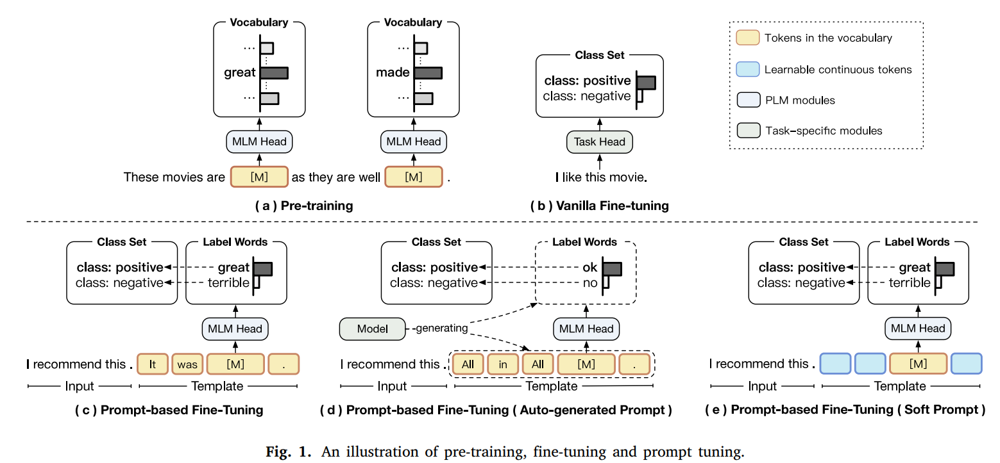
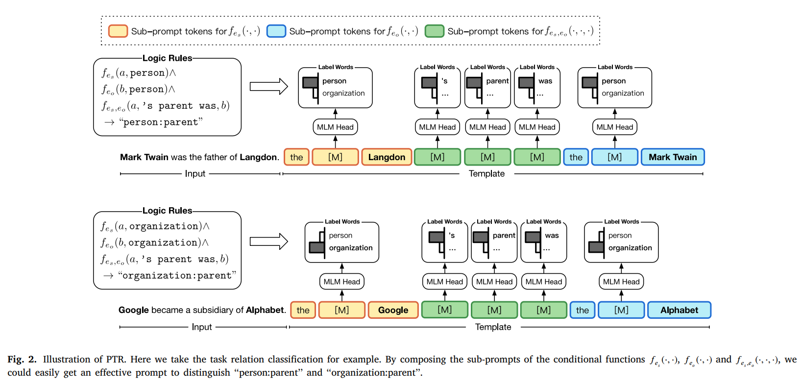
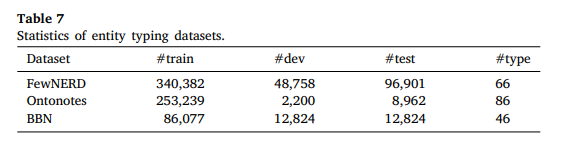
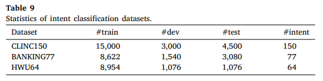
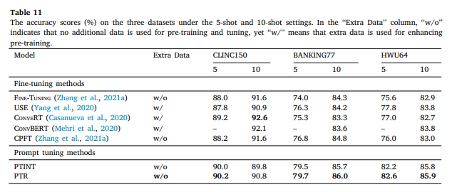

논문 및 이미지 출처: <https://www.sciencedirect.com/science/article/pii/S2666651022000183>

# Abstract

최근, pre-trained language models (PLMs) 의 rich knowledge 를 NLP task 에 활성화하기 위해 prompt tuning 이 널리 적용된다.

prompt tuning 이 sentiment classification 및 natural language inference 같은 few-class classification tasks 에 좋은 결과를 보여주지만, prompt 수동 설계는 무거우며 한편, prompts 자동 생성 또한 어렵고 시간 소요가 크다.

그러므로 복잡한 many-class classification 에 대한 효율적인 prompts 를 얻기란 여전히 challenge 로 남아있다.

본 논문에서 저자는 classification task 의 prior knowledge 를 rules 지정하여 encoding 하며, 그 후 rules 에 따라 sub-prompts 를 설계하고, task 를 처리하기 위해 sub-prompts 를 결합한다.

저자는 이를 Prompt Tuning method with Rules **"PTR"" 로 명명한다.

존재하는 prompt-based method 와 비교하면, PTR 은 prompts 구축에 효과정 및 효율성 간의 tradeoff 를 잘 도달한다.

relation classification, entity typing 및 intent classification 을 포함한 3개의 many-class classification tasks 에서 실험을 진행한다.

결과는 PTR 이 vanilla 및 prompt tuning baselines 를 능가하는 것을 보여주어, prompt tuning 의 rules 활용의 효과성을 나타냈다.

# 1. Introduction

PLMs 는 효과적인 NLP 수단으로 나타나, large-scale corpora 의 linguistic, semantic, syntactic 및 world knowledge 를 capture 할 수 있다.

task-specific data 를 fine-tuning 하여, PLMs 의 rich knowledge 로 다양한 downstream NLP task 에 활용한다.

fine-tuning 의 성공에도 불구하고, 최근 연구들에서 critical challenge 가 나타난다.

- pre-training 및 fine-tuning 간의 object forms gaps
  - Fig. 1(a) 에서 보이듯, PLMs 는 보통 cloze-stype task 를 pre-training
  - 하지만 Fig 1. 1(b) 처럼 fine-tuning 은 all PLM's parameters 및 task-specific heads (e.g. linear layers for classification) with task-specific objectives tuning 이 필요.
  - transfer learning 관점에서, 이 objective gap 은 PLMs's knowledge 을 downstream task 에 adaptation 하는 것을 저해할 수 있다.

위와 같은 objective forms gap 을 연결하기 위해, prompt tuning 이 도입되어 왔으며, 일반적인 prompt 는 template 및 label word set 으로 이루어진다.

- Fig. 1(c) 에서 보이듯, masked position $[𝙼]$ 을 예측하고 해당하는 class labels 을 predicted word 로 매핑하기 위해 input 과 template 을 결합하여, classification task 를 cloze-style objective form 으로 변환될 수 있다.
  - label word set 은 predicting $[𝙼]$ 에 대한 candidate set 을 제공.
  - 직관적으로, template "$<S_1>.$ It was $[𝙼]$." 및 setiment classification 을 위한 label set {"great", "terrible"} 을 사용
  - 그럼 $<S_1>$ 이 $[𝙼]$ 에 대한 PLMs 의 예측 "great" 또는 "terrible" 을 기반으로 positive 또는 negative 인지 결정할 수 있다.

---

prompt tuning 은 natural language inference 같은 다른 few-class classification tasks 에서 좋은 결과에 도달하지만, many classes 가 있는 tasks 에서는, 다양한 classes 를 구별하기 위해 적절한 templates 및 알맞는 label words 를 수동으로 찾기란 어렵다.

예를 들어, many-class classification task 인 relation classification 은 text 에서 두 marked entities 단의 semantic relations 를 예측하는 것이 필요하다.

relation "person:parent" 와 relation "organization:parent" 이 있을 때, template 및 이들을 구별할 label words 을 선택하기란 어렵다.

- 한 직설적인 솔루션은 Fig. 1(d) 처럼 prompts 를 자동으로 생성하는 것이다. 하지만 auto-generated prompts 는 생성과 검증에 대한 많은 연산 비용이 발생한다.
- 다른 솔루션은 Fig. 1(e) 처럼 discrete prompt tokens 대신 soft prompt 를 사용하는 것이다. 하지만 soft prompts 는 효과적이기 위해 모델 파라미터가 충분히 커야한다.

---

본 논문에서는, many-class classification 에 대해, rules 가 있는 prompt tuning (PTR) 을 제안한다.

Fig. 2 처럼 classification task 가 주어지면, 먼저 rule 로 prior task knowledge 를 encoding 하고 task 를 sub-tasks 로 decomposing 한다.

그후, task 를 처리하기 위한 필수 sub-prompt 를 설계하고

마지막으로 rules 에 따른 sub-prompts 를 구성한다.

다른 prompt tuning 과 비교하면 PTR 은 두 가지 이점이 있다.

1. Prior Knowledge Encoding
   - prior task knowledge 는 specific tasks 해결에 도움을 준다.
   - 예로, relation classification 에서 예측 결과가 sentence semantics 및 entity types 모두와 관련되어 있다 가정하면, two sub-prompts 에 기반하여 prompts 를 구축할 수 있다.
     - 하나는 entity types 을 감지하고 다른 하나는 entities 간의 relational semantics 을 감지한다.
   - entity typing 및 intent classification 같은 다른 tasks 에서도, 클래스 계층 구조는 prompt 설계에 좋은 prior knowledge 다.
   - prior task knowledge 를 encoding 하여, 충분한 훈련 데이터 없이도 효과적인 모델을 얻을 수 있다.
2. Efficient and Effective Prompt Design
   - 각 class 에 대한 개별 template 및 label words 를 수동으로 설계하는 것보다, few simple sub-prompts 를 설계하고 복잡한 specific tasks 를 처리하기 위해 rules 에 따른 결합이 더 쉽다.
   - auto-generated 및 soft prompts 보다, prompts 생성을 위한 rules 를 사용하는 것이 더 효율적이고 효과성이 있다.
   - 직관적인 측면을 고려하면, 본 논문에선 PRT 소개를 위해 human-picked sub-prompts 를 사용하지만, open framework 및 sub-prompts 는 auto-generated 및 soft 한 것일 수도 있다.

---

PTR 효과성 검증을 위해, relation classification, entity typing 및 intent classification 을 포함한 3가지의 many-class classification task 에서 실험을 수한다.

실험 결과는 PTR 이 vanilla fine-tuning 및 prompt tuning baselines 를 능가하고, prior task knowledge 및 복잡한 classification tasks 에 대한 PLMs 모두의 이점을 활용하는 접근법임을 나타낸다.

# 2. Preliminaries

# 3. Prompt tuning with rules (PTR)

many-class classification tasks 에 대한 효과적인 prompts 설계의 어려움을 고려하려, 저자는 어려운 task 를 여러 simple sub-tasks 로 decomposing 하고 각 sub-prompts 를 설계하는 PTR 을 제안한고, 기존의 복잡한 task 의 더 나은 해결을 위해 rules 에 따른 sub-prompts 를 포함한다.

## 3.1 Overall framework of PTR

PTR 은 basic human inferences 에 기반을 둔다.

relation classification 을 예로, sentence 내의 two marked entities 가 "person:parent" 관계인지 궁금하다면, prior knowledge 를 활용하여 sentence 및 two marked entities 가 특정 조건을 만족하는지 확인해야 한다.

1. two marked entities 가 인간이어야 하며;
2. sentence 이 two marked entities 간의 parental semantics 를 나타내야 함

이에 영감을 받아, 모든 text classification task $\mathcal{T} = \{ \mathcal{X}, \mathcal{Y} \}$ 에 대해, task 를 일련의 conditional function set $\mathcal{F}$ 으로 decomposing 할 수 있다.

각 function $f \in \mathcal{F}$ 는 function input 이 특정 조건을 충족하는지 여부를 결정한다.

예로,

- $f(a,$ person$)$ 를 설계하여 $a$ 가 person 인지 결정하고, $f(a,'$s parent was $, b)$ 를 설계하여 $b$ 가 $a$ 의 parent 인지 결정할 수 있다.
- 직관적으로, 이러한 조건 함수는 본질적인 first-order rules 서술이다.

각 조건 함수 $f \in \mathcal{F}$ 에 대해, PRT 은 template $T_f(\cdot)$ 및 label word set $\mathcal{V}_f$ 를 설정하여 sub-prompt 를 구축한다.

$\mathcal{Y}$ 의 semantics 에 따라, rules 을 사용하여 task 를 일련의 조건 함수 계산으로 변환할 수 있다.

Fig. 2 에서 보이듯, relation classification 의 경우, entities $a$ 및 $b$ 가 "person:parent" 관계를 가지는지 여부를 결정하는 것은 다음과 같이 공식화할 수 있다.

$$
\begin{align*}
& f_{e_s}(a, \text{person}) \wedge f_{e_s, e_o}(a,'\text{s parent was}, b) \wedge f_{e_o}(b, \text{person}) \\
& \rightarrow \text{"person:parent"}
\end{align*}
$$

- $f_{e_s}(\cdot, \cdot)$ : subject entity types 를 결정하는 조건 함수
- $f_{e_o}(\cdot, \cdot)$ : entities 간의 의미적 연결을 결정하는 조건 함수

위에서 언급한 rules 및 조건 함수를 기반으로, task $\mathcal{T}$ 를 처리하기 위해 rule-related conditional functions 의 sub-prompts 를 구성한다.

## 3.2 Task decomposition

tasks 를 sub-tasks 로 분해하는 기본 rule 은 structural information 을 사용하는 것이다.

1. structural label 을 기반으로 rules 설계
   - classification tasks 의 label 은 internal structural information 을 가질 수도 있으며, 이 정보는 일반적으로 label tag 에서 반복적으로 나타나는 키워드로 표현된다.
     - intent classification 을 예로, "card_activating" 과 "card_linking" 은 "card" 라는 동일한 단어를 공유
     - 이 두 label 을 분류하는 것은 "card" 와 관련된 것인지, "activating" 이나 "linking" 이 의도된 것인지 분해될 수도 있다.
2. intrinsic correlation 를 기반으로 rules 설계
   - 일부 label tags 는 공통 키워드가 없을 수 있지만, "uber" 와 "car_rental" 같이 동일한 본질적 의미를 가질 수 있다.

위 rules 에 따라, many-class classification task 를 hierarchical classification 형태로 변환하고 각 계층에 대한 조건 함수를 설계할 수 있다.

이 rules 를 따라 complex classification tasks 를 처리하기 위해 여러 sub-prompts 를 쉽게 구축할 수 있다.

Table 3, 6, 10 에서 예시를 보여주며, relation classification, entity typing 및 intent classification 을 어떻게 분해하는지 보여준다.

이 예시에서 manual sub-prompts 를 작성하는 데 필요한 노력이 어렵지 않다는 것을 볼 수 있다.

---

tasks 를 어떻게 분해하고 rules 를 설계하는 법은 open problem 이며, structural information 외에도 더 복잡한 heuristic rules 을 사용하여 분해나는 것도 유망할 수 있다.

본 논문은 rule-based prompt tuning 의 framework 를 소개하는 데 중점을 둔다.

## 3.3 Sub-prompts for conditional functions

각 조건 함수 $f \in \mathcal{F}$ 에 대한 sub-prompt 를 수동으로 설계한다.

일반적인 prompt 설정과 유사하게, sub-prompt 또한 template 및 label word set 으로 구성된다.

기본적인 조건 함수는 단항(unary) 함수이다. 

- binary sentiment classification 을 위해, unary functions 는 sentence 가 positive 인지 negative 인지 결정할 수 있다.
- entity typing 에서는, unary functions 는 entity types 를 나타낼 수 있다.
- topic labeling 에서는, unary functions 는 article topics 를 예측하는 데 사용될 수 있다.

---

relation classification 을 예로 들자. 

sentence $x = \{ \dots e_s \dots e_o \dots \}$ 이 주어졌을 때, 우리는 $f_{e_s} (\cdot,\{ \text{person | organization | } \dots \} )$ 을 설정하여 $e_s$ 의 type 을 결정할 수 있다.

- $e_s$ : subject entity
- $e_o$ : object entity

$f_{e_s}$ 의 sub-prompt template 및 label word set 은 다음과 같이 공식화할 수 있다.

$$
\begin{equation}
  \begin{align*}
    & T_{f_{e_s}} = `` x\  \text{the} \ [𝙼] \ e_s", \\
    & \mathcal{V}_{f_{e_s}} = \{ ``\text{person}",``\text{organization}", \dots\},
  \end{align*}
\end{equation}
$$

object entity $e_o$ 의 경우, $f_{e_o}$ 의 sub-prompt template 및 label word set 은 Eq. 1 와 유사하다.

또 다른 중요한 유형의 조건 함수는 이항(binary) 함수이다.

natural language inference 에서 이항 함수는 두 문장 사이의 관계를 entailment(포함), neutral(중립), contradiction(모순) 으로 결정할 수 있다; relation classification 에서 이러한 함수가 두 entities 간의 복잡한 연결을 결정하는 데 사용될 수 있다.

만약 $f_{e_s, e_o}(\cdot , \{ \text{'s parent was|was born in| } \dots\}, \cdot)$, 으로 설정한다면, $f_{e_s, e_o}$ 의 sub-prompt template 및 label word set 은 다음과 같이 공식화할 수 있다.

$$
\begin{equation}
  \begin{align*}
    & T_{f_{e_s, e_o}} = `` x \ e_s \ [𝙼] [𝙼] [𝙼] \ e_o", \\
    & \mathcal{V}_{f_{e_s, e_o}} = \{ ``\text{'s person was}",``\text{was born in}", \dots\},
  \end{align*}
\end{equation}
$$

보통, unary 및 binary functions 는 classfication tasks 처리를 위한 rules 를 구성하기에 충분하다.

complex semantics 의 classification tasks 의 경우, 이러한 unary 및 binary functions 설계 방법을 multi-variable functions 로 확장하여 보다 강력한 sub-prompts 를 구축할 수 있다.

## 3.4 Composing sub-prompts for tasks

다양한 조건 함수들은 서로 상호작용할 수 있다.

예로, probability $P(f_{e_s, e_o}(a,' \text{s parent was}, b) = \text{true})$ 는 $P(f_{e_s}(a, \text{person}) = \text{true})$ 및 $P(f_{e_o}(b, \text{person}) = \text{false})$ 의 높은 확률에 조건이 걸려 낮을 수도 있다.

그러므로, sub-prompts 를 따로 학습하는 대신, 여러 조건 함수들의 sub-prompts 를 결합하여 완전한 task-specific prompts 를 구성해야 한다.

본 논문에선 간단한 전략을 적용한다: conjunctive normal form(논리곱 표준형)을 사용하여 모든 rul-related functions 의 sub-prompts 를 직접 연결한다.

예로, Fig. 2 에서 Eq.1 과 Eq. 2 의 sub-prompts 를 집계한, 완전한 prompt template 은 다음과 같다.

$$
\begin{equation}
  \begin{align*}
    & T(x) = [T_{f_{e_s}}(x); T_{f_{e_s,e_o}}(x); T_{f_{e_o}}(x)] = \\
    & `` x \ \text{the}[𝙼]_1 [𝙼]_2 [𝙼]_3 [𝙼]_4 \ \text{the} \ [𝙼]_5 \ e_o ",
  \end{align*}
\end{equation}
$$

- $[\cdot; \cdot; \cdot]$ : sub-prompts 의 aggregation function
- aggregated label word set 은 다음과 같다.

$$
\begin{equation}
  \begin{align*} 
    &\mathcal{V}[𝙼]_1 = \{‘‘\text{person}’’, ‘‘\text{organization}’’, …\}, \\ 
    &\mathcal{V}[𝙼]_2 = \{‘‘’\text{s}’’, ‘‘\text{was}’’, …\}, \\ 
    &\mathcal{V}[𝙼]_3 = \{‘‘\text{parent}’’, ‘‘\text{born}’’,…\}, \\ 
    &\mathcal{L}[𝙼]_4 = \{‘‘\text{was}’’, ‘‘\text{in}’’, …\}, \\ 
    &\mathcal{L}[𝙼]_5 = \{‘‘\text{person}’’, ‘‘\text{organization}’’, …\}. 
  \end{align*}
\end{equation}
$$

aggregated template 는 multiple $[𝙼]$ tokens 를 가지고 있어, inference time 에 모든 masked positions 를 고려하여 예측해야 한다. 즉,

$$
\begin{equation}
  p(y|x) = \frac{\prod_{j=1}^n p([𝙼]_j = \phi(y)|T(x))}{\sum_{\tilde{y} \in \mathcal{Y}} \prod^n_{j=1}p([𝙼]_j = \phi(\tilde{y})|T(x))}
\end{equation}
$$

- $n$ : $T(x)$ 의 masked positions 수
- $\phi_j(y)$ : class $y$ 를 $j$th masked position $[𝙼]_j$ 의 label word set $\mathcal{V}_{[𝙼]}$ 로 매핑하는 함수다.
- Eq. 5 는 PLMs 를 tuning 하고 classes 를 분류하는데 사용될 수 있다.
- 학습 중에는, 각 조건 함수의 independent probability 와 전체 task 에 대한 joint probability 를 최적화하는 데 중점을 둔다.

PTR 의 final training loss 는 다음과 같다.

$$
\begin{equation}
  \begin{align*} 
    \mathcal{L} &= \frac{1}{|\mathcal{X}|} \sum_{x \in \mathcal{X}} [L_{\text{indep}}(x) + \mathcal{L}_{\text{joint}}(x)], \\
    \mathcal{L}_{\text{indep}}(x) &= -\frac{1}{n} \sum_{j=1}^{n} \log p([𝙼]_j = \phi_j(y_{x})|T(x)), \\ \mathcal{L}_{\text{joint}}(x) &= -\log p(y_{x}|x), 
  \end{align*}
\end{equation}
$$

- $\mathcal{L}_{\text{joint}}$ : Eq. 5 에 기반하여 구성

## 3.5 Sub-prompts with multiple label words

어떤 케이스에선, injective mapping function $\phi$ 를 사용하여 각 class 를 single label word 로 매핑하는 것만으로 충분하지 않을 수 있다.

entity typing 을 예로, entity type class "location/city" 가 주어졌을 때, 해당 class 를 label word "city"  또는 "urban" 이나 "town" 처럼 "city" 와 크게 관련된 여러 단어로 매핑하는 것이 가능하다.

사실은, "location/lake_sea_ocean" 과 같이 연관된 일련의 entity 들을 가리키는 일부 entity types 도 존재한다.

이런 types 의 경우, single label word 에 할당하는 것은 어려울 수 있다.

하나의 label word 을 선택하는 대신, 각 class 를 여러 관련된 label words 로 매핑하는 것이 간단하며 효과적이다.

형식적으로, input sentence $x$ 가 주어졌을 때, $j$th masked position $[𝙼]_j$ 에서의 해당 클래스 $y_x$ 의 label words 을 $\phi_j(y_x) = w_j$ 에서 $\phi_j(y_x) = \{ w_{j,1}, w_{j,2}, …, w_{j,m} \}$ 으로 변경한다.

template $T(\cdot)$ 과 함께, Eq. 6 의 조건 확률 $p([𝙼]_j = \phi_j(y_x)|T(x))$ 는 다음과 같이 된다.

$$
\begin{equation}
  \frac{1}{m} \sum^m_{k=1} \lambda_k \ p([𝙼]_j = w_{j,k}|T(x))
\end{equation}
$$

- $\lambda_k$ : 각 label word 의 중요성을 나타내는 weighted average coefficient 
- 실험에선 모든 $\lambda_k$ 을 1 로 설정

# 4. Experiments

## 4.1 The results on relation classification

### Datasets

이 섹션에선 relation classification 의 결과를 보여줌.

저자는 다음 세 가지 데이터셋을 사용

- TACRED : 가장 크고 널리 사용되는 relation classification. 42 relation types 를 포함
- TACREV : TACRED 를 기반으로 구축된 데이터셋. training set 은 유지하면서 dev set 및 test set 의 일부 오류를 고침 
- ReTACRED : TACRED 의 다른 버전. 기존 TACRED 의 단점 보완하여 training, dev, test set 재구축

### Baselines and implementation details

relation classification 에 대한 일반적인 모델들과 PTR 비교

- Learning Models from Scratch
  - relation classification 에 대한 일반적인 접근법.
  - baselines 로 PA-LSTM 및 C-GCN 을 채택. 이 두 모델은 recurrent neural networks 및 graph neural networks 중 효과적인 모델 중 하나.
- Fine-Tuning PLMs
  - 일부는 relation classification 에 PMLs 를 fine-tuning 하는데 집중을 했다. 이에 몇 가지 방법이 있다.
   1. vanilia fine-tuning : 특정 markers 를 input 에 추가하지 않고 RoBERTa$_{large}$ 를 직접 선택
   2. Entity 정보가 관계적 의미를 이해하는데 중요하다 생각되어, knowledge-enhanced PLMs 는 knowledge bases 로 PLMs 를 향상시키기 위해 추가적으로 연구됨. SPANBERT, KNOWBERT, LUKE 및 MTB 를 baseline 으로 선택.
- Prompt Tuning
  1. Zhou and Chen (2021), Sentence-level relation extraction (RE) : entity marker 를 input 에 추가하는 several merker-based methods 소개. 
      - 이 중 ENT MARKER 는 entity position 을 나타내는 추가적인 순차 정보를 도입하여 Prompt 를 생성하는 방법
      - TYP MARKER 은 relation classification 을 위한 template 을 만드는 데 entity types information 를 추가적으로 도입
  2. Chen et al (2021a), AdaPrompt : label word 를 adaptive selection method 을 도입하여 각 relation label 을 다양한 label words 로 분산시켜 복잡한 many-class problem 를 처리할 수 있다. Table 2 에서 이러한 Prompt-based fine-tuning method 의 몇 가지 template 예시를 보여준다. PTR 의 경우엔, Table 3 에서 relation-specific prompts 를 보여준다.

PTR 는 Transformers 및 OpenNRE toolkit 을 기반으로 구현

대부분의 hyperparameter 는 이전 연구들을 따른다:

- RoBERTa$_{large}$ 을 backbone ㅇ,로 사용하고 learning rate $\{ 1e-5, 3e-5,5e-5 \}$ 중 최적의 모델을 선택하여 10% steps 에 대해 linear warmup 을 적용
- weight decay 은 $1e - 2$
- 모든 데이터셋에서 64 batch size 로 5 epochs 동안 모델 튜닝
- dev set 의 성능을 기반으로 최적의 모델 checkpoint 선택

위 설정을 기준으로 여러 random seeds 를 사용하여 5번 샘플링하고 평균 결과를 얻는다.

### Comparison between PTR and fine-tuning

PTR 과 튜닝 기법 간의 비교는 Table 4 에서 표시한다.

1. 기존의 방법들은 다양한 recurrent neural layers, attention neural layers 및 graph neural layers 를 포함한 복잡한 모델을 설계
   - 위 복잡한 모델은 scratch learning 이 효과적이었지만, Vanilla PLM 인 RoBERTA$_{large}$ 는 이 모델들을 쉽게 능가하므로 large-scale unlabeled data 에서 얻은 rich knowledge 이 downstream 에 중요함을 보여줌
2. PLMs 내부에서, knowledge-enhanced PLMs 는 Vanilla PLM RoBERTA$_{large}$ 를 이김
   - 이는 모델을 강화하기 위해 extra task-specific knowledge 를 도입하는 것이 효과적임을 보여준다.
   - 하지만, 단순히 PLM 을 fine-tuning 하는 것만으로는 donwstream tasks 에 필요한 knowledge 을 완전히 이해하긴 어렵다는 것을 나타낸다.
3. knowledge-enhanced PLMs 내부에서, LUKE 와 KNOWBERT 가 다른 모델들보다 더 좋은 성능을 보임
   - 두 모델이 각각 fine-tuning 단계에서 향상된 아키텍처와 knowledge 를 data augmentation 처럼 사용하기 때문이다. 
   - 반면, SpanBERT 및 MTB 는 pre-training 단계에서 task-specific knowledge 를 parameters 에 주입하고 extra knowledge 없이 parameter 를 fine-tuning 한다.
   - 위 결과들은 task-specific knowledge 가 이미 PLM 에 포함되어 있더라도, 이를 활용하는 것은 어렵다는 것을 보여준다.
4. PTR 은 모든 baseline 보다 획기적인 성능 향상 얻음
   - knowledge-enhanced models 과 비교해도 TACRED 에선 여전히 이런 모델들을 능가
   - 전반적인 실험결과는 pre-training 단계가 PLM 에 충분한 task-specific knowledge 를 포착할 수 있도록 해주며, downstream task 에 대한 knowledge 를 어떻게 자극하는 지가 중요하다는 것을 보여준다.
   - 일반적인 fine-tuning 과 비교하여 PTR 은 task-specific knowledge 를 더 잘 자극할 수 있다.

### Comparison between PTR and prompt tuning

Table 2 및 4 에서,  prompts 를 PLMs 의 vocabulary 로 사용하는 것이 나은 결과를 가져오는 것을 확인했다.

특정 sub-prompts 를 설계하여, PTR 은 TYP Marker 와 유사한 결과를 달성할 수 있다.

게다가, PTR 은 추가적인 human annotations 없이 실험에서 효과를 입증한다.

- PTR 은  기존 relation type annotations 에만 의존하여 entity 의 sub-prompt label 을 도출하고, inference time 에는 entity type 을 예측한다.
- 한편, TYP Marker 는 extra human annotations 를 사용하고 모델에게 training 및 inference 단계에서 ground-truth entity types 를 준다.

---

Prompt 를 사용하는 모델들과 비교하기 위해, few-shot learning 시나리오를 도입한다.

Gao et al. (Making pre-trained language models better few-shot learners) 의 few-shot setting 을 따라, 기존의 training set 및 dev set 에서 각 클래스 당 $K$ 개의 training instances 와 $K$ 개의 validation instances 를 샘플링하여 모델의 기존 test set 에서 평가한다.

$K$ 를 $\{ 8, 16, 32 \}$ 중 설정하고, 인스턴스를 샘플링하기 위해 고정된 5개의 random seeds 를 사용한다.

----

Table 5 에서, PTR 이 full training dataset 을 사용하는 TYP Marker (PUNCT) 보다는 성능이 떨어진다.

그러나 TYP Marker (PUNCT) 는 training 및 testing 에 entity typing human-annotations 를 사용하므로 PTR 은 few-shot 상황에서도 유사하거나 더 나은 결과를 달성한다.

특히 데이터에 annotation error 가 적은 ReTACRED 에선 PTR 이 더 나은 성능을 보인다.

TYP Marker (PUNCT) 와 AdaPrompt 와 비교하여, human knowledge 와 model knowledge 모두를 사용할 수 있다고 할 수 있다.

## 4.2 The results on entity typing

### Dataset

Table 7 처럼, 다음 3 개의 dataset 에서 실험을 수행

- FewNERT : 구조화가 잘 되어 있는 entity types 으로 large-scale manually annotated dataset 이며, 8개의 entity types 및 66개 세부 entity types
- OntoNotes : OntoNotes 5.0 dataset 에서 선택된 데이터. PLET 의 설정을 따라 86-classes 버전을 사용
- BBN : Wall Street Journal text 의 Penn Treebank corpus 에서 선택된 데이터셋. PLET 의 설정을 따라 46-classes 버전을 사용

위 데이터셋에서, accuracy (ACC), loose micro F1 (MiF) 및 loose macro F1 (MaF) 을 metric 으로 사용한다.

### Baselines and implementation details

entity typing 실험에서, vanila fine-tuning 및 PLET 을 baseline 으로 사용

PLET 도 prompt-based method 지만, 저자의 방법과 다르게 label words 예측을 위해 template 에서 하나의 masked position 만 사용한다.

Table 6 에서 PTR 과 PLET 간의 type-specific prompts 설계의 차이에 대한 내용을 보여준다.

PTR 은 Transformers 및 OpenPrompt toolkit 을 기반으로 구현되었다.

공정한 비교를 위해,PLET 와 동일한 설정을 따른다:

- BERT_base backbone 을 채택하고 learning rate $\{ 1e-5, 3e-5,5e-5 \}$ 와 처음 500 steps 에 linear warmup 으로 모델을 최적화한다.
- 16 batch size
- weight decay $1e-2$
- supervised 설정에서, 각 모델은 10 epochs 동안 훈련
- few-shot 에서는 30 epochs 동안 훈련.
- 1-shot, 2-shot, 4-shot, 8-shot, 16-shot 및 fully-supervised 설정에서 모델을 tuning 하며, $K$-shot 은 entity type 당 $K$ 개의 training examples 을 의미
- baseline 설정에 따라 다른 random seed 를 사용하여 데이터를 5번 샘플링하고 평균 결과를 얻음

### Comparison between PTR and baselines

Table 8 은 세 데이터셋에서 PTR 과 baseline 의 성능을 보여준다. 

표에서 다음과 같은 사실을 알 수 있다:

1. PLET 및 PTR 은 모든 실험에서 vanilla fine-tuning
   - 이는 Table 4 및 5 의 relation extraction 실험의 결론과 일치한다.
2. 다양한 set 설정에서의 결과를 비교하면, training sample 수가 적을 때 PLET 및 PTR 이 vanilla fine-tuning 대비 개선되었다.
   - 이는 entity typing 해결을 위해 많은 knowledge 가 PLM 에 오며, prompt 를 사용함으로써 PLM 에 분산된 entity information 을 더 잘 활성화할 수 있다는 것을 나타냄
3. 결과에서 entity types 의 structured hierarchy information 를 명시적으로 학습할 수 있다는 다른 masked position 을 제공함으로써, PTR 이 PLET 보다 나은 결과를 보여줌
   - 일반적으로, entity type schema 의 prior knowledge 를 규칙적으로 인코딩하여 고차원 및 세부 entity information 을 따르도록 prompt 를 설계함으로써 PLM 에게 entity type 을 더 잘 감지하 수 있도록 함

## 4.3 The results on intent classification

이 섹션에서는 task intent classification 에 대한 실험 결과를 제시

### Dataset

Table 9 처럼, 다음 세 개의 데이터셋에서 실험을 수행:

- CLINC150 : 은행, 업무, 여행, 요리 및 일부 메다 정보와 같은 10개 domain 에서 fine-grained 150 가지 intents 를 다루는 데이터셋
- BANKING77 : 은행 domain 에서 fine-grained intent detection 을 위해 생성된 데이터셋
- HWU64 : 21 domain 에서 fine-grained 64 intents 를 다루는 데이터셋. 이 도메인은 주로 human-home robot 상호작용을 반영

위 세 데이터셋 모두 metric 으로는 accuracy (%) 를 사용한다.

### Baselines and implementation details

intent classification 실험에서, CPET 논문 (Zhang et al., 2021a)의 설정과 동일하게 한다.

- RoBERTa_base 를 backbone 으로 사용하고 batch size 16 으로 설정
- 5-shot 및 10-shot (각 의도당 N개의 훈련 예제) 설정으로 모델 튜닝
- learning rate $\{ 1e-5, 3e-5, 5e-5 \}$ 중 모델을 최적화
- 모든 tuning 과정에는 30 epochs 소요
- 데이터셋 5개의 다른 seeds 로 무작위 샘플링하여 평균 결과

---

PTR 의 효과를 평가하기 위해 5가지 최신 intent classification model 과 비교:

- RoBERTa_base : vanilla fine-tuning
- USE : 16개 언어에 대해 pre-training 된 large-scale multilingual model 로 intent classification 을 위해 사용
- ConveRT :  대화 데이터에서 retrieval-based response selection task 를 통한 pre-trained model
- ConvBERT : BERT 를 확장하여 open-domain dialogue corpus 에 대해 추가적인 fine-tuning 및 task-adaptive self-supervised training 을 수행한 모델
- CPFT : intent classification 을 위해 contrastive pre-training 및 fine-tuning 을 사용하는 모델
  - 여기선 contrastive pre-training 없는 CPFT 와 PTR 을 비교

prompt tuning 이 intent classification 에 널리 탐구되지 않아, 여기선 PTR 의 simplified one mask 버전인 "PTINT" 을 구현

### Comparison between PTR and baselines

Table 11 은 3 가지 데이터셋에서 PTR 과 baselines 의 성능을 보여준다.

이를 통해 다음을 확인할 수 있다:

1. PTINT 와 PTR 은 모든 상황에서 vanilla fine-tuning 보다 큰 성과
   - 이는 PTR 을 tuning 하기 위해 prompt 사용이 효과적임을 시사
   - prompt tuning 외에도, large-scale intent-related data 를 강화하는 것은 intent classification 의 성능을 크게 향상시킬 수 있다.
   - 직관적으로, prompt tuning 은 PLMs 의 task-specific knowledge 를 모방하는 것을 목표하지만, pre-training 을 강화하는 방법은 PLM 에 더 많은 task-specific knowledge 를 주입하는 데 초점을 맞춘다.
2. 대부분의 상황에서, prompt-based methods 는 pre-training 을 강화하는 모델보다 더 좋은 결과를 얻음
   - 이는 PLM 에 많은 intent-specific knowledge 이 저장되어 있으며, 기존의 내재된 knowledge 를 활용하는 방법이 중요하고 유망함을 나타냄
   -  사실, pre-training 강화 및 prompt tuning 을 동시에 수행하는 것이 더 나은 성능을 가져올 수도 있다. (향후 연구)
3. intent types 는 entity types 및 relation types 보다 덜 structure 하기 때문ㅔ, PTINT 는 잘 수행되며, PTR 대비 PTINT 개선은 약하다.
   - 전반적인 결과는 relation classification 및 entity typing 와 일관성이 있으며, rules 를 사용한 prompt 작성이 효과적임을 보여준다.
   - 본 논문의 rules 은 heuristic 하게 구축되어 있으며, 이는 충분히 효과적이지만 최적이 아닐 수 있다. (향후 연구)

## 4.4 The convergence of PTR

다양한 prompt tuning 의 학습 효율성을 비교하기 위해 ReTACRED 와 FewNERD 두 데이터셋을 선택하여 각 훈련 과정의 성능 곡선을 보여줌

Fig.3 에서 볼 수 있듯, PTR 은 효과적이면서도 빠른 수렴을 이뤘다.

다른 prompt tuning 과 비교하여, 비록 PTR 의 template 은 최종적으로 더 복잡하고 모델에 많은 정규화를 가져오지만, PTR 의 수렴은 느려지지 않았다.

한편, PTR 의 prompt 는 보다 효과적이고 효율적으로 PLMs 의 knowledge 자극을 위해 더 많은 정보를 도입할 수도 있다. 또한 PLMs 에게 prior task knowledge 을 학습시키는 것은 curriculum learning 과 매우 유사하며, 이는 PTR 의 더 나은 수렴성의 이유다.

이러한 결과는 prompt tuning 과 rules 가 수렴에 대한 잠재적 긍정적인 영향을 나타낸다.

# 5. Related work

# 6. Conclusion

본 논문에서, 저자는 many-clas text classification task 를 위한 prompt tuning with rules (PTR) 을 제시.

rule 에 따라 sub-prompts 를 task-specific prompts 로 구성하여, prior task knowledge 를 prompt tuning 으로 인코딩할 수 있다.

sub-prompts 의 도입은 template 및 label word set 설계의 어려움을 완화할 수 있다.

relation classification, entity typing 및 intent classification 에 대한 실험 결과는 PTR 이 추가 model layer, manual annotations 및 augmented data 없이 기존의 comparable vanilla fine-tuning 및 prompt tuning baselines 를 능가할 수 있음을 보여준다.